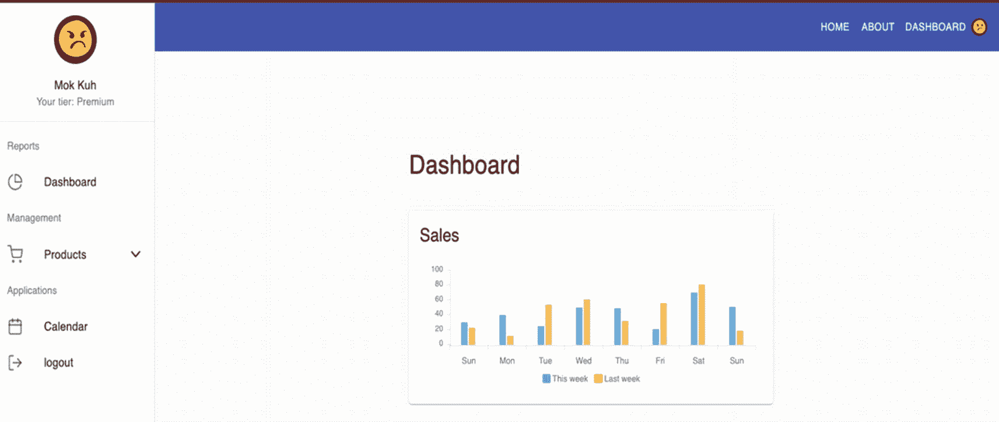
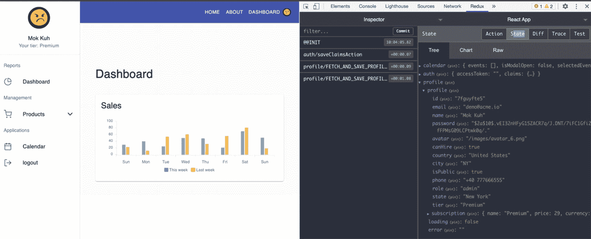
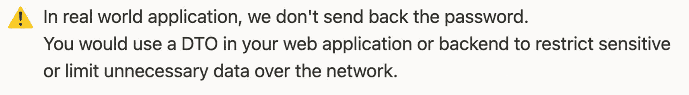
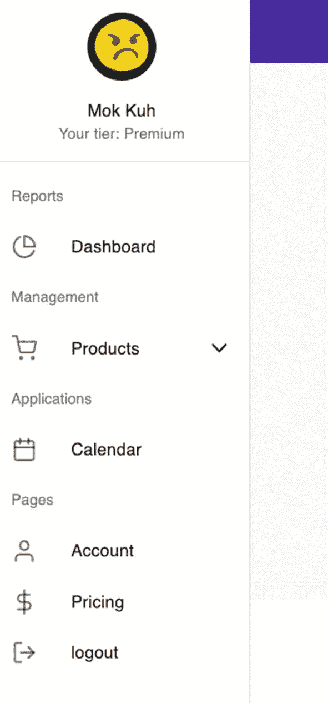
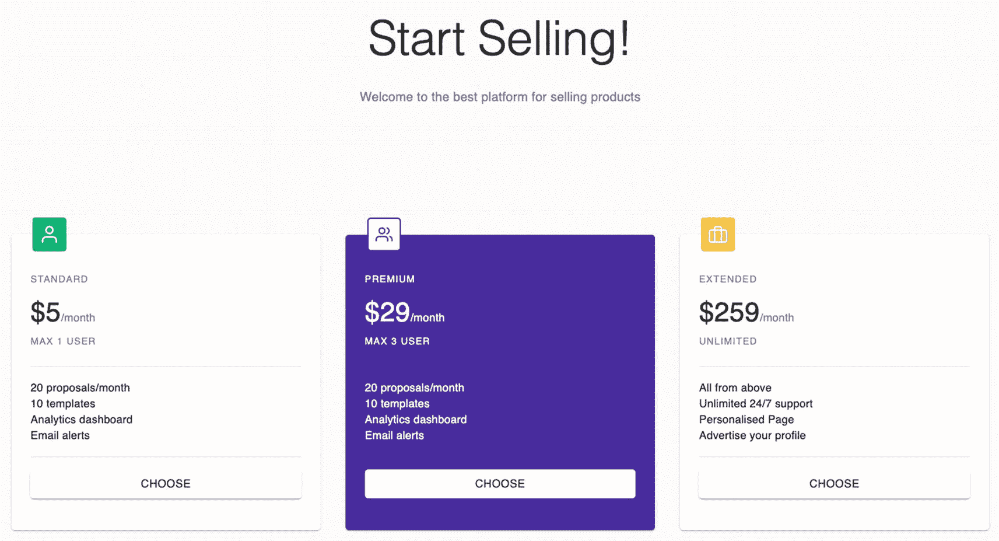
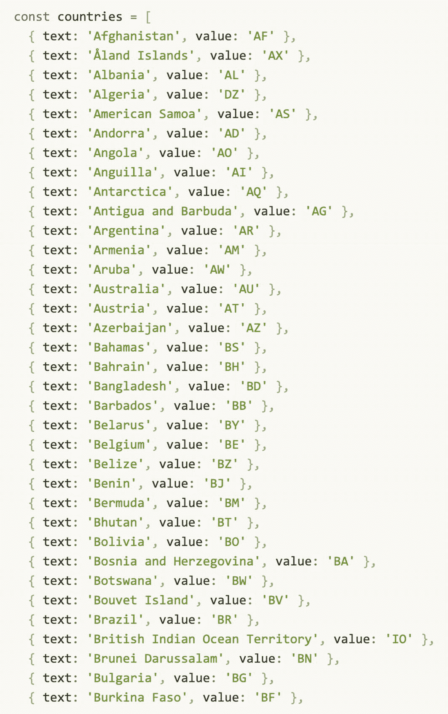

# 十四、更新仪表板侧栏导航

我们刚刚完成了配置文件、登录和注册表单的构建，并通过更新路线结束了第一部分。我们现在进入这个由三部分组成的章节系列的第二部分，更新仪表板侧边栏导航。

既然我们已经更新了路线，我们现在将继续到仪表板-侧栏-导航。

让我们从分别添加来自 React-Redux 和 reducers 的`useDispatch`和`useSelector`开始。见清单 [14-1](#PC1) 。

```jsx
import { useSelector, useDispatch } from 'react-redux';
import {RootState} from 'store/reducers';

Listing 14-1Updating the Named Components in the dashboard-sidebar-navigation

```

让我们使用`DashboardSidebarNavigation component`中的`useDispatch`和`useSelector`，如清单 [14-2](#PC2) 所示。

```jsx
const DashboardSidebarNavigation = () => {
  const classes = useStyles();
  const dispatch = useDispatch();
  const {profile} = useSelector((state: RootState) => state.profile);
  const {claims} = useSelector((state: RootState) => state.auth);
  const { url } = useRouteMatch();
  const [open, setOpen] = useState(false);

Listing 14-2Updating the DashboardSidebarNavigation

```

在清单 [14-2](#PC2) 中，我们从`auth reducer.`得到`profile`减速器轮廓和`claims`

接下来，从 profileAsyncActions 导入命名模块 getProfileAction。在`useEffect`中，我们调用`dispatch`将带有`claims.sub`的`getProfileAction`发送到减速器。这意味着我们需要导入清单 [14-3](#PC3) 中所示的`getProfileAction,`。

```jsx
...
import { getProfileAction } from 'features/profile/profileAsyncActions';
...

useEffect(() => {
    dispatch(getProfileAction(claims.sub));

  }, []);

Listing 14-3Dispatching the getProfileAction in the DashboardSidebarNavigation

```

**getProfileAction** :我们调用传递`the claims.sub`并获取`user's id`的函数。

让我们从 Material-UI Core 添加头像和附加组件的样式——头像、盒子和字体，如清单 [14-4](#PC4) 所示。

```jsx
import { Collapse, Divider, ListSubheader, Avatar, Box, Typography} from '@material-ui/core';
...
const useStyles = makeStyles(theme =>
  createStyles({
    avatar: {
      cursor: 'pointer',
      width: 64,
      height: 64,
    },
...

Listing 14-4Adding the Avatar Style in the DashboardSidebarNavigation

```

现在，我们准备好更新到新的 UI。将包含徽标的工具栏替换为下面的工具栏，如清单 [14-5](#PC5) 所示。

```jsx
{/* check first if profile.name is true before rendering what's inside the Box, including the avatar */}
{profile.name && (
            <Box p={2}>
              <Box display="flex" justifyContent="center">
                <Avatar
                  alt="User"
                  className={classes.avatar}
                  src={profile.avatar}
                />
              </Box>
              <Box mt={2} textAlign="center">
                <Typography>{profile.name}</Typography>
                <Typography variant="body2" color="textSecondary">
                  Your tier: {profile.tier}
                </Typography>
              </Box>
            </Box>
          )}

Listing 14-5Updating

the DashboardSidebarNavigation

```

## 更新 db.json

好的，在我们刷新浏览器之前，我们需要首先更新`db.json`并添加 users-db。

目前，我们只有用于认证的用户。现在我们来补充一下。参见清单 [14-6](#PC6) 。

```jsx
"users-db": [
    {
      "id": "7fguyfte5",
      "email": "demo@acme.io",
      "name": "Mok Kuh",
      "password": "$2a$10$.vEI32nHFyG15ZACR7q/J.DNT/7iFC1Gfi2fFPMsG09LCPtwk0q/.",
      "avatar":img/avatar_6.png",
      "canHire": true,
      "country": "United States",
      "city": "NY",
      "isPublic": true,
      "phone": "+40 777666555",
      "role": "admin",
      "state": "New York",
      "tier": "Premium",
      "subscription": {
        "name": "Premium",
        "price": 29,
        "currency": "$",
        "proposalsLeft": 12,
        "templatesLeft": 5,
        "invitesLeft": 24,
        "adsLeft": 10,
        "hasAnalytics": true,
        "hasEmailAlerts": true
      }
    }
  ]

Listing 14-6Adding the users-db in the db.json

```

刷新浏览器，您应该会看到如图 [14-1](#Fig1) 所示的浏览器。



图 14-1

更新用户界面

你会注意到边栏导航和导航栏正在同步；他们在渲染同一个图像。它们从 Redux 存储中获得相同的状态。

检查 Redux DevTools 并单击状态，您将看到概要文件，它现在在应用的任何部分都可用，如图 [14-2](#Fig2) 所示。



图 14-2

检查 Redux 开发工具



好了，现在我们知道我们可以在任何组件中同步用户的配置文件。但是我们还没有完成；我们仍然需要更新仪表板、帐户和定价菜单。

## 更新仪表板侧栏导航

让我们再次打开仪表板-侧栏-导航。让我们从 React Feather 导入几个图标，并在日历后添加帐户和定价菜单，如清单 [14-7](#PC7) 所示。

```jsx
...
  User as UserIcon,
  DollarSign as DollarSignIcon,
  LogOut as LogOutIcon,
} from 'react-feather';

...

<ListSubheader>Applications</ListSubheader>
              <Link className={classes.link} to={`${url}/calendar`}>
                <ListItem button>
                  <ListItemIcon>
                    <CalendarIcon />
                  </ListItemIcon>
                  <ListItemText primary={'Calendar'} />
                </ListItem>
              </Link>
              <ListSubheader>Pages</ListSubheader>
              <Link className={classes.link} to={`${url}/account`}>
                <ListItem button>
                  <ListItemIcon>
                    <UserIcon />
                  </ListItemIcon>
                  <ListItemText primary={'Account'} />
                </ListItem>
              </Link>
              <Link className={classes.link} to={`/pricing`}>
                <ListItem button>
                  <ListItemIcon>
                    <DollarSignIcon />
                  </ListItemIcon>
                  <ListItemText primary={'Pricing'} />
                </ListItem>
              </Link>
              <a className={classes.link} href={'/'}>
                <ListItem button onClick={handleLogout}>
                  <ListItemIcon>
                    <LogOutIcon />
                  </ListItemIcon>
                  <ListItemText primary={'logout'} />
                </ListItem>
              </a>
            </List>

Listing 14-7Adding the Account and Pricing Menus in the dashboard-sidebar-navigation

```

刷新浏览器，你会在侧边栏看到两个新的附加菜单。该帐户现在是空的，但是价格已经有了一些样式，这是由 Material-UI 组件提供的。见图 [14-3](#Fig3) 。



图 14-3

更新了侧边栏菜单

点击定价可以看到如图 [14-4](#Fig4) 所示的相同界面。



图 14-4

定价页面的屏幕截图

如果你点击了账户，你会看到这只是最低限度。所以让我们在这里做点什么。但在此之前，我们需要创建一个“是”验证。这是一个广泛的概要文件验证，所以最好把它写在一个单独的文件中。

## 创建 Yup 配置文件验证

新建一个文件:**特色** ➤ **简介** ➤ **没错** ➤ **简介.验证. ts** 。

让我们添加 Yup 配置文件验证，如清单 [14-8](#PC8) 所示。

```jsx
import * as Yup from 'yup';

const profileYupObject = Yup.object().shape({
  canHire: Yup.bool(),
  city: Yup.string().max(255),
  country: Yup.string().max(255),
  email: Yup.string()
    .email('Must be a valid email')
    .max(255)
    .required('Email is required'),
  isPublic: Yup.bool(),
  name: Yup.string().max(255).required('Name is required'),
  phone: Yup.string(),
  state: Yup.string(),
});

export { profileYupObject };

Listing 14-8Adding the Yup Profile Validation

```

之后，我们现在可以开始构建`AccountView`页面。

## 创建帐户视图页面

让我们在`AccountView` `.`下创建一个新文件夹，将新文件夹命名为 General，并在该文件夹下创建一个名为`GeneralSettings.tsx:`的新文件

```jsx
account ➤ AccountView ➤ General ➤ GeneralSettings.tsx

```

让我们导入我们需要的命名组件，如清单 [14-9](#PC10) 所示。

```jsx
import React, { useState } from 'react';
import { useDispatch } from 'react-redux';
import clsx from 'clsx';
import { Formik } from 'formik';
import { useSnackbar } from 'notistack';
import Autocomplete from '@material-ui/lab/Autocomplete';
import {
  Box,
  Button,
  Card,
  CardContent,
  CardHeader,
  Divider,
  FormHelperText,
  Grid,
  Switch,
  TextField,
  Typography,
  makeStyles,
} from '@material-ui/core';

import { UserType } from 'models/user-type';
import { putProfileAction } from 'features/profile/profileAsyncActions';
import { profileYupObject } from 'features/profile/yup/profile.validation';

Listing 14-9Importing the Named Components of the GeneralSettings

```

这里有什么新鲜事？我们从 Material-UI 实验室得到了`Autocomplete`。对于我们的自动完成，我们将使用`Country select`组件。

除了其他常见的 Material-UI 组件，我们还导入了`UserType, putProfileAction,`和`profileYupObject.`

接下来，我们将创建`GeneralSettings`的形状和我们将要返回的本地州，如清单 [14-10](#PC11) 所示。

```jsx
type Props = {
  className?: string;
  user: UserType;
};

const GeneralSettings = ({ className, user, ...rest }: Props) => {
  const dispatch = useDispatch();
  const classes = useStyles();
  const [error, setError] = useState('');
  const { enqueueSnackbar } = useSnackbar();

Listing 14-10Creating the Shape and Local States of the GeneralSettings

```

然后，让我们在 return 语句中使用 Formik，如清单 [14-11](#PC12) 所示。

```jsx
return (
    <Formik
      enableReinitialize
      initialValues={user}
      validationSchema={profileYupObject}
      onSubmit={async (values, formikHelpers) => {
        try {
          dispatch(putProfileAction(values));

          formikHelpers.setStatus({ success: true });
          formikHelpers.setSubmitting(false);
          enqueueSnackbar('Profile updated', {
            variant: 'success',
          });
        } catch (err) {
          setError(err);

          formikHelpers.setStatus({ success: false });
          formikHelpers.setSubmitting(false);
        }
      }}
    >
      {({
        errors,
        handleBlur,
        handleChange,
        handleSubmit,
        isSubmitting,
        touched,
        values,
        setFieldValue,
      }) => (

Listing 14-11Creating the Formik Props

```

在 Formik 中，我们使用`enableReinitialize`，它允许我们更新或编辑表单。当我们有一个现有的对象或数据，并且想用 Formik 编辑它时，我们需要使用 Formik prop。我们有这种双向数据绑定。

`initialValues`:我们正在传递来自`GeneralSettings.`的父组件的用户

validationSchema:我们正在传递 profileYupObject。

`onSubmit`:我们正在调度`putProfileAction`并传递用户输入的值。

现在让我们使用 Formik 属性来构建我们需要的不同的文本字段。

我们将为 Country 创建一个 TextField，我们将在其中集成自动完成功能。参见清单 [14-12](#PC13) 。

```jsx
<form onSubmit={handleSubmit}>
          <Card className={clsx(classes.root, className)} {...rest}>
            <CardHeader title="Profile" />
            <Divider />
            <CardContent>
              <Grid container spacing={4}>
                <Grid item md={6} xs={12}>
                  <TextField
           error={Boolean(touched.name && errors.name)}
                    fullWidth
            helperText={touched.name && errors.name}
                    label="Name"
                    name="name"
                    onBlur={handleBlur}
                    onChange={handleChange}
                    value={values?.name}
                    variant="outlined"
                  />
                </Grid>
                <Grid item md={6} xs={12}>
                  <TextField
          error={Boolean(touched.email && errors.email)}
                    fullWidth
                    helperText={
                      touched.email && errors.email
                        ? errors.email
               : 'We will use this email to contact you'
                    }
                    label="Email Address"
                    name="email"
                    onBlur={handleBlur}
                    onChange={handleChange}
                    required
                    type="email"
                    value={values?.email}
                    variant="outlined"
                  />
                </Grid>

                <Grid item md={6} xs={12}>
                  <TextField

         error={Boolean(touched.phone && errors.phone)}
                    fullWidth
            helperText={touched.phone && errors.phone}
                    label="Phone Number"
                    name="phone"
                    onBlur={handleBlur}
                    onChange={handleChange}
                    value={values?.phone}
                    variant="outlined"
                  />
                </Grid>
                <Grid item md={6} xs={12}>
                  <Autocomplete
                    id="country"
                    options={countries}
                    value={values?.country}
          getOptionLabel={option => option.toString()}
            renderOption={option => <>{option.text}</>}
                    onChange={(e: any) => {
         setFieldValue('country', e.target.innerText);
                    }}
                    renderInput={params => (
                      <TextField
                        {...params}
                        value={values?.country}
                        fullWidth
                        label="Country"
                        name="country"
                        onChange={handleChange}
                        variant="outlined"
                        inputProps={{
                          ...params.inputProps,
                          autoComplete: 'country',
                        }}
                      />
                    )}
                  />
                </Grid>

                <Grid item md={6} xs={12}>
                  <TextField
        error={Boolean(touched.state && errors.state)}
                    fullWidth
              helperText={touched.state && errors.state}
                    label="State/Region"
                    name="state"
                    onBlur={handleBlur}
                    onChange={handleChange}
                    value={values?.state}
                    variant="outlined"
                  />
                </Grid>
                <Grid item md={6} xs={12}>
                  <TextField

            error={Boolean(touched.city && errors.city)}
                    fullWidth
              helperText={touched.city && errors.city}
                    label="City"
                    name="city"
                    onBlur={handleBlur}
                    onChange={handleChange}
                    value={values?.city}
                    variant="outlined"
                  />
                </Grid>

                <Grid item md={6} xs={12}>
          <Typography variant="h6" color="textPrimary">
                    Make Contact Info Public
                  </Typography>
      <Typography variant="body2" color="textSecondary">Means that anyone viewing your profile will be able to see your contacts details
                  </Typography>
                  <Switch
                    checked={values?.isPublic}
                    edge="start"
                    name="isPublic"
                    onChange={handleChange}
                  />
                </Grid>
                <Grid item md={6} xs={12}>
          <Typography variant="h6" color="textPrimary">
                    Available to hire
                  </Typography>
        <Typography variant="body2" color="textSecondary">
 Toggling this will let your teammates know that you are
           available for acquiring new projects
                  </Typography>
                  <Switch
                    checked={values?.canHire}
                    edge="start"
                    name="canHire"
                    onChange={handleChange}
                  />
                </Grid>
              </Grid>

              {error && (
                <Box mt={3}>
         <FormHelperText error>{error}</FormHelperText>
                </Box>
              )}
            </CardContent>
            <Divider />
    <Box p={2} display="flex" justifyContent="flex-end">
              <Button
                color="secondary"
                disabled={isSubmitting}
                type="submit"
                variant="contained"
              >
                Save Changes
              </Button>
            </Box>
          </Card>
        </form>
      )}
    </Formik>
  );
};

const useStyles = makeStyles(() => ({
  root: {},
}));

export default GeneralSettings;

Listing 14-12Using the Formik Props in the GeneralSettings

```

文本字段绑定到属性名称，例如，姓名、电子邮件、电话、状态、州、地区、城市等。

自动完成功能与状态绑定在一起。我们将状态包装在自动完成中，我们从 Material-UI 的自动完成中得到这个 API，包括图 [14-5](#Fig5) 中的状态列表。

之后，我们将在所有状态列表的下方进行硬编码。以下只是它的截图。您可以通过此链接复制粘贴完整的列表:

[T2`https://github.com/webmasterdevlin/practical-enterprise-react/blob/master/chapter-12/src/app/views/dashboard/account/AccountView/General/GeneralSettings.tsx`](https://github.com/webmasterdevlin/practical-enterprise-react/blob/master/chapter-12/src/app/views/dashboard/account/AccountView/General/GeneralSettings.tsx)



图 14-5

在常规设置中添加自动完成状态选择

## 创建个人资料详细信息

不过，在通用文件夹下，我们将创建一个名为`ProfileDetails` `.tsx.`的新文件。这个新组件只是一个用户头像。

我们需要导入的命名组件如清单 [14-13](#PC14) 所示。

```jsx
import React from 'react';
import { Link as RouterLink } from 'react-router-dom';
import clsx from 'clsx';
import {
  Avatar,
  Box,
  Button,
  Card,
  CardActions,
  CardContent,
  Link,
  Typography,
  makeStyles,
} from '@material-ui/core';

import { UserType } from 'models/user-type';

Listing 14-13Adding the Named Components in the ProfileDetails

```

然后添加 ProfileDetails React 函数组件，如清单 [14-14](#PC15) 所示。

```jsx
type Props = {
  className?: string;
  user: UserType;
};

const ProfileDetails = ({ className, user, ...rest }: Props) => {
  const classes = useStyles();

  return (
    <Card className={clsx(classes.root, className)} {...rest}>
      <CardContent>
        <Box
          display="flex"
          alignItems="center"
          flexDirection="column"
          textAlign="center"
        >
          <Avatar className={classes.avatar} src={user?.avatar} />
          <Typography
            className={classes?.name}
            color="textPrimary"
            gutterBottom
            variant="h4"
          >
            {user?.name}
          </Typography>

          <Typography color="textPrimary" variant="body1">
            Your tier:{' '}
            <Link component={RouterLink} to="/pricing">
              {user?.tier}
            </Link>
          </Typography>
        </Box>
      </CardContent>
      <CardActions>
        <Button fullWidth variant="text">
          Remove picture
        </Button>
      </CardActions>
    </Card>
  );
};

const useStyles = makeStyles(theme => ({
  root: {},
  name: {
    marginTop: theme.spacing(1),
  },
  avatar: {
    height: 100,
    width: 100,
  },
}));

export default ProfileDetails;

Listing 14-14Adding the ProfileDetails Function Component

```

用户对象来自配置文件详细信息的父组件。调用用户来渲染`avatar`、`name,`和`tier`。我们也有 ***移除图片，*** 但是我们不打算在这里放任何功能。只是为了美观。

## 创建常规设置

现在我们继续在通用文件夹下创建一个`index.tsx`:

```jsx
account ➤ AccountView ➤ General ➤ index.tsx

```

让我们首先添加命名的组件，如清单 [14-15](#PC17) 所示。

```jsx
import React from 'react';
import clsx from 'clsx';
import { useSelector } from 'react-redux';
import { Grid, makeStyles } from '@material-ui/core';

import ProfileDetails from './ProfileDetails';
import GeneralSettings from './GeneralSettings';
import { RootState } from 'store/reducers';

Listing 14-15Adding the Named Components in the index.tsx of the General Settings

```

然后，让我们创建组件的形状和`useSelector`来访问商店状态的一部分，如清单 [14-16](#PC18) 所示。

```jsx
type Props = {
  className?: string;
};

const General = ({ className, ...rest }: Props) => {
  const classes = useStyles();
  const { profile } = useSelector((state: RootState) => state.profile);

Listing 14-16Creating the Shape and useSelector in the index.tsx of the General Settings

```

在返回语句中，我们传递`ProfileDetails`和`General Settings' user props`中的概要状态，如清单 [14-17](#PC19) 所示。

```jsx
return (
    <Grid
      className={clsx(classes.root, className)}
      container
      spacing={3}
      {...rest}
    >
      <Grid item lg={4} md={6} xl={3} xs={12}>
        <ProfileDetails user={profile} />
      </Grid>
      <Grid item lg={8} md={6} xl={9} xs={12}>
        <GeneralSettings user={profile} />
      </Grid>
    </Grid>
  );
};

const useStyles = makeStyles(() => ({
  root: {},
}));

export default General;

Listing 14-17Using the Profile to Pass to ProfileDetails and General Settings

```

## 创建标题

之后，我们需要回到`AccountView`来添加更多的组件:

```jsx
account ➤ AccountView ➤ Header.tsx

```

让我们添加命名的组件，如清单 [14-18](#PC21) 所示。

```jsx
import React from 'react';
import { Link as RouterLink } from 'react-router-dom';
import clsx from 'clsx';
import {
  Typography,
  Breadcrumbs,
  Link,
  makeStyles,
  Box,
} from '@material-ui/core';
import NavigateNextIcon from '@material-ui/icons/NavigateNext';

Listing 14-18Adding the Named Components of Header.tsx in AccountView

```

这里有什么新鲜事吗？我们有来自 Material-UI 核心的 Breadcrumbs 和来自 Material-UI 图标的 NavigateNextIcon。

**Breadcrumbs** :让用户能够从一系列值中进行选择。

然后，让我们为 Header 组件添加 return 语句，如清单 [14-19](#PC22) 所示。

```jsx
type Props = {
  className?: string;
};

const Header = ({ className, ...rest }: Props) => {
  const classes = useStyles();

  return (
    <div className={clsx(classes.root, className)} {...rest}>
      <Breadcrumbs
        separator={<NavigateNextIcon fontSize="small" />}
        aria-label="breadcrumb"
      >
        <Link color="inherit" to="/app" component={RouterLink}>
          Dashboard
        </Link>
        <Box>
          <Typography variant="body1" color="inherit">
            Account
          </Typography>
        </Box>
      </Breadcrumbs>
      <Typography variant="h4" color="textPrimary">
        Settings
      </Typography>
    </div>
  );
};

const useStyles = makeStyles(() => ({
  root: {},
}));

export default Header;

Listing 14-19Creating the Header Component

```

## 摘要

在本章中，我们成功地同步了侧边栏导航和导航栏之间的数据，因为数据来自全局存储或 Redux 存储。

我们还更新了仪表板、帐户和定价菜单，并使用 Formik 和 Yup 验证模式来构建它们。

接下来，我们将继续构建这个由三部分组成的章节系列，并添加另外三个组件，通知、安全性和订阅页面，以完成我们的应用的 UI。