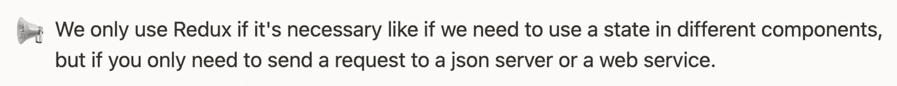
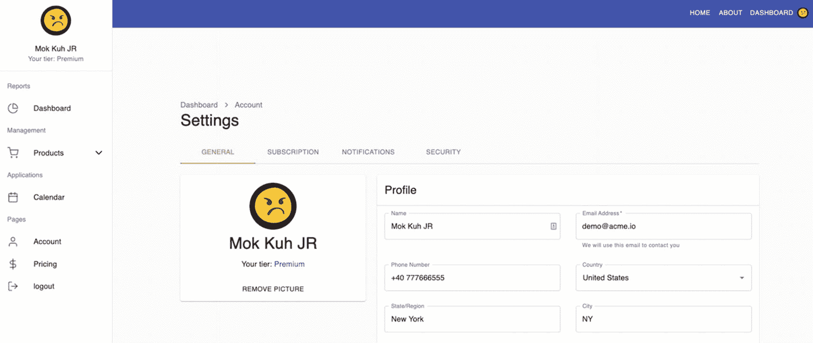

# 十五、创建通知、安全性和订阅页面

本系列的最后一部分将使用 Redux、Formik 和 Yup 验证模式制作通知、安全性和订阅页面。

总的来说，我们的目标是用现实世界中的基本功能完成 React 应用的 UI，并巩固我们对 Redux 如何工作以及如何在我们的应用中使用 Formik 和 Yup 验证模式的了解。

## 创建通知页面

我们将首先处理通知页面。这个页面只是为了应用的设计或整体 UI 外观。

在 AccountView 下，我们需要创建一个名为 Notifications.tsx 的文件:

```jsx
account ➤ AccountView ➤ Notifications.tsx

```

下面是命名的导入组件，如清单 [15-1](#PC2) 所示。

```jsx
import React from 'react';
import clsx from 'clsx';
import {
  Box,
  Button,
  Card,
  CardContent,
  CardHeader,
  Checkbox,
  Divider,
  FormControlLabel,
  Grid,
  Typography,
  makeStyles,
} from '@material-ui/core';

Listing 15-1Adding the Named Components of the Notifications.tsx

```

以及通知组件的形状，如清单 [15-2](#PC3) 所示。

```jsx
type Props = {
  className?: string;
};

const Notifications = ({ className, ...rest }: Props) => {
  const classes = useStyles();

Listing 15-2Adding the Notifications Function Component

```

以及返回元素的 return 语句，如清单 [15-3](#PC4) 所示。

```jsx
return (
    <form>
      <Card className={clsx(classes.root, className)} {...rest}>
        <CardHeader title="Notifications" />
        <Divider />
        <CardContent>
          <Grid container spacing={6} wrap="wrap">
            <Grid item md={4} sm={6} xs={12}>
<Typography gutterBottom variant="h6" color="textPrimary">
                System
              </Typography>
              <Typography gutterBottom variant="body2" color="textSecondary">
                You will receive emails in your business email address
              </Typography>
              <div>
                <FormControlLabel
                  control={<Checkbox defaultChecked />}
                  label="Email alerts"
                />
              </div>
              <div>
                <FormControlLabel
                  control={<Checkbox />}
                  label="Push Notifications"
                />
              </div>

              <div>
                <FormControlLabel
                  control={<Checkbox defaultChecked />}
                  label="Text message"
                />
              </div>
              <div>
                <FormControlLabel
                  control={<Checkbox defaultChecked />}
                  label={
                     <>

                      <Typography variant="body1" color="textPrimary">
                        Phone calls
                      </Typography>
                      <Typography variant="caption">
                        Short voice phone updating you
                      </Typography>
                    </>

                  }
                />
              </div>
            </Grid>

            <Grid item md={4} sm={6} xs={12}>
              <Typography gutterBottom variant="h6" color="textPrimary">
                Chat App
              </Typography>
              <Typography gutterBottom variant="body2" color="textSecondary">
  You will receive emails in your business email address
              </Typography>

              <div>
                <FormControlLabel
                  control={<Checkbox defaultChecked />}
                  label="Email"
                />
              </div>
              <div>
                <FormControlLabel
                  control={<Checkbox defaultChecked />}
                  label="Push notifications"
                />
              </div>
            </Grid>
          </Grid>
        </CardContent>
        <Divider />
        <Box p={2} display="flex" justifyContent="flex-end">
 <Button color="secondary" type="submit" variant="contained">
            Save Settings
          </Button>
        </Box>
      </Card>
    </form>
  );
};

const useStyles = makeStyles(() => ({
  root: {},
}));

export default Notifications;

Listing 15-3Creating the Return Elements of the Notifications

```

我们这里的通知组件只是为了美观。在这一点上，我们不会使用任何额外的功能。一般设置应该有助于我们理解 Redux 的实现流程。

但是，您可以自己更新它，只是为了练习和巩固您的知识。

## 创建安全性页面

我们需要添加的另一个 React 组件是安全性。同样，在`AccountView,`下创建一个新文件，并将其命名为`Security.tsx.`

我们将在这里使用简单的 HTTP 请求，而不使用 Redux 工具包。我们创建这个是为了提醒你，我们不需要在每个 HTTP 请求中使用 Redux，就像我们在第 [6](06.html) 章中所做的那样。



好了，现在让我们为安全性添加命名的组件，如清单 [15-4](#PC5) 所示。

```jsx
import React, { useState } from 'react';
import clsx from 'clsx';
import * as Yup from 'yup';
import { Formik } from 'formik';
import { useSnackbar } from 'notistack';
import { useSelector } from 'react-redux';
import {
  Box,
  Button,
  Card,
  CardContent,
  CardHeader,
  Divider,
  FormHelperText,
  Grid,
  TextField,
  makeStyles,
} from '@material-ui/core';

import { changePasswordAxios, ChangePasswordModel } from 'services/authService';
import { RootState } from 'store/reducers';

Listing 15-4Importing the Named Components in Security

```

我们使用的是 Yup 和 Formik 以及我们需要的其他常用组件。我们还从`authService`进口了`changePasswordAxios`和`ChangePasswordModel`，从减速器进口了`RootState`。如您所见，没有任何操作会向存储发送请求或更新任何内容。

接下来，我们添加对象的类型并使用一些 React 钩子，如清单 [15-5](#PC6) 所示。

```jsx
type Props = {
  className?: string;
};

type PasswordType = {
  password: string;
  passwordConfirm: string;
};

const Security = ({ className, ...rest }: Props) => {
  const { claims } = useSelector((state: RootState) => state.auth);
  const classes = useStyles();
  const [error, setError] = useState('');
  const { enqueueSnackbar } = useSnackbar();

Listing 15-5Creating the Security Function Component

```

**声明**:我们通过 useSelector 从 auth reducer 获取声明。

以及安全组件的返回元素，如清单 [15-6](#PC7) 所示。

```jsx
return (
    <Formik
      initialValues={
        {
          password: '',
          passwordConfirm: '',
        } as PasswordType
      }

       {/*validation schema for the password */}

      validationSchema={Yup.object().shape({
        password: Yup.string()
          .min(7, 'Must be at least 7 characters')
          .max(255)
          .required('Required'),
        passwordConfirm: Yup.string()
          .oneOf([Yup.ref('password'), null], 'Passwords must match')
          .required('Required'),
      })}
      onSubmit={async (values, formikHelpers) => {
        try {

           {/*Checking if the password matches or not */}

          if (values.password !== values.passwordConfirm) {
            alert('Must match');
            return;
          }

          {/* If it matches, return this object with the
            following args to change password */}
          const args: ChangePasswordModel = {
            id: claims.sub,
            email: claims.email,
            password: values.password,
          };

          await changePasswordAxios(args);

          formikHelpers.resetForm();
          formikHelpers.setStatus({ success: true });
          formikHelpers.setSubmitting(false);
          enqueueSnackbar('Password updated', {
            variant: 'success',
          });
        } catch (err) {
          console.error(err);
          formikHelpers.setStatus({ success: false });
          formikHelpers.setSubmitting(false);
        }
      }}
    >
      {formikProps => (
        <form onSubmit={formikProps.handleSubmit}>
          <Card className={clsx(classes.root, className)} {...rest}>
            <CardHeader title="Change Password" />
            <Divider />
            <CardContent>
              <Grid container spacing={3}>
                <Grid item md={4} sm={6} xs={12}>
                  <TextField
                    error={Boolean(
                      formikProps.touched.password &&
                        formikProps.errors.password,
                    )}
                    fullWidth
                    helperText={
                      formikProps.touched.password &&
                      formikProps.errors.password
                    }
                    label="Password"
                    name="password"
                    onBlur={formikProps.handleBlur}
                    onChange={formikProps.handleChange}
                    type="password"
                    value={formikProps.values.password}
                    variant="outlined"
                  />
                </Grid>

                <Grid item md={4} sm={6} xs={12}>
                  <TextField
                    error={Boolean(
                      formikProps.touched.passwordConfirm &&
                        formikProps.errors.passwordConfirm,
                    )}
                    fullWidth
                    helperText={
                      formikProps.touched.passwordConfirm &&
                      formikProps.errors.passwordConfirm
                    }
                    label="Password Confirmation"
                    name="passwordConfirm"
                    onBlur={formikProps.handleBlur}
                    onChange={formikProps.handleChange}
                    type="password"
                    value={formikProps.values.passwordConfirm}
                    variant="outlined"
                  />
                </Grid>
              </Grid>
              {error && (
                <Box mt={3}>
                  <FormHelperText error>{error}</FormHelperText>
                </Box>
              )}
            </CardContent>
            <Divider />

            <Box p={2} display="flex" justifyContent="flex-end">
              <Button
                color="secondary"
                disabled={formikProps.isSubmitting}
                type="submit"
                variant="contained"
              >
                Change Password
              </Button>
            </Box>
          </Card>
        </form>
      )}
    </Formik>
  );
};

const useStyles = makeStyles(() => ({
  root: {},
}));

export default Security;

Listing 15-6Returning the Elements for the Security React Component

```

## 创建订阅页面

我们将在本章构建的最后一个组件是`Subscription.tsx,`，它仍然在`AccountView`文件夹下。

让我们首先添加命名的组件，如清单 [15-7](#PC8) 所示。

```jsx
import { Link as RouterLink } from 'react-router-dom';
import clsx from 'clsx';
import { useSelector } from 'react-redux';
import {
  Box,
  Button,
  Card,
  CardContent,
  CardHeader,
  Divider,
  Link,
  Paper,
  Typography,
  makeStyles,
} from '@material-ui/core';

import { RootState } from 'store/reducers';

Listing 15-7Adding the Named Components in the Subscription

```

接下来，让我们做对象的类型或形状，如清单 [15-8](#PC9) 所示。

```jsx
type Props = {
  className?: string;
};

const Subscription = ({ className, ...rest }: Props) => {
  const classes = useStyles();
  const {
    profile: { subscription },
  } = useSelector((state: RootState) => state.profile);

Listing 15-8Adding the Props and Using Hooks for Subscription.tsx

```

在清单 [15-8](#PC9) 中，我们访问概要文件，然后在清单 [15-9](#PC10) 中的 UI 中呈现管理您的订阅。

例如，我们可以访问`subscription.currency, subscription.price`，和[`subscription.name`](http://subscription.name)——因为`subscription`是剖析的对象。嵌套析构在这里是一种有效的语法。

清单 [15-9](#PC10) 是订阅组件的返回语句。

```jsx
return (
    <Card className={clsx(classes.root, className)} {...rest}>
      <CardHeader title="Manage your subscription" />
      <Divider />
      <CardContent>
        <Paper variant="outlined">
          <Box className={classes.overview}>
            <div>
              <Typography display="inline" variant="h4" color="textPrimary">
                {subscription.currency}
                {subscription.price}
              </Typography>
              <Typography display="inline" variant="subtitle1">
                /mo
              </Typography>
            </div>
            <Box display="flex" alignItems="center">
              
              <Typography variant="overline" color="textSecondary">
                {subscription.name}
              </Typography>
            </Box>
          </Box>
          <Divider />

          <Box className={classes.details}>
            <div>
              <Typography variant="body2" color="textPrimary">
                {`${subscription.proposalsLeft} proposals left`}
              </Typography>
              <Typography variant="body2" color="textPrimary">
                {`${subscription.templatesLeft} templates`}
              </Typography>
            </div>
            <div>
              <Typography variant="body2" color="textPrimary">
                {`${subscription.invitesLeft} invites left`}
              </Typography>
              <Typography variant="body2" color="textPrimary">
                {`${subscription.adsLeft} ads left`}
              </Typography>
            </div>
            <div>
              {subscription.hasAnalytics && (
                <Typography variant="body2" color="textPrimary">
                  Analytics dashboard
                </Typography>
              )}
              {subscription.hasEmailAlerts && (
                <Typography variant="body2" color="textPrimary">
                  Email alerts
                </Typography>
              )}
            </div>
          </Box>
        </Paper>

        <Box mt={2} display="flex" justifyContent="flex-end">
          <Button size="small" color="secondary" variant="contained">
            Upgrade plan
          </Button>
        </Box>
        <Box mt={2}>
          <Typography variant="body2" color="textSecondary">
            The refunds don&apos;t work once you have the subscription, but you
            can always{' '}
            <Link color="secondary" component={RouterLink} to="#">
              Cancel your subscription
            </Link>
            .
          </Typography>
        </Box>
      </CardContent>
    </Card>
  );
};

Listing 15-9Adding the Return Statement of the Subscription Component

```

最后，这个组件的样式，如清单 [15-10](#PC11) 所示。

```jsx
const useStyles = makeStyles(theme => ({
  root: {},
  overview: {
    padding: theme.spacing(3),
    display: 'flex',
    alignItems: 'center',
    flexWrap: 'wrap',
    justifyContent: 'space-between',
    [theme.breakpoints.down('md')]: {
      flexDirection: 'column-reverse',
      alignItems: 'flex-start',
    },
  },
  productImage: {
    marginRight: theme.spacing(1),
    height: 48,
    width: 48,
  },
  details: {
    padding: theme.spacing(3),
    display: 'flex',
    alignItems: 'center',
    flexWrap: 'wrap',
    justifyContent: 'space-between',
    [theme.breakpoints.down('md')]: {
      flexDirection: 'column',
      alignItems: 'flex-start',
    },
  },
}));

export default Subscription;

Listing 15-10Styling Components for the Subscription.tsx

```

## 更新帐户视图

在我们结束本章之前，我们需要再次更新 AccountView。

首先，让我们更新导入命名组件，如清单 [15-11](#PC12) 所示。

```jsx
import React, { useState, ChangeEvent } from 'react';
import {
  Box,
  Container,
  Divider,
  Tab,
  Tabs,
  makeStyles,
} from '@material-ui/core';

import Header from './Header';
import General from './General';
import Subscription from './Subscription';
import Notifications from './Notifications';
import Security from './Security';
import Page from 'app/components/page';

Listing 15-11Import Named Components of AccountView

```

这里有什么新鲜事？**标签页**来自物料界面；具体来说，我们将使用简单的选项卡。

`Tabs`:允许我们在同一层级的相关内容组之间进行组织和导航。

接下来，让我们构建 AccountView React 函数组件，如清单 [15-12](#PC13) 所示。

```jsx
const AccountView = () => {
  const classes = useStyles();

  /*initialize the useState to 'general' - we will use that */

  const [currentTab, setCurrentTab] = useState('general');

 /*handleTabsChange -for setting or updating the value of the current tab */

  const handleTabsChange = (event: ChangeEvent<{}>, value: string): void => {
    setCurrentTab(value);
  };

  return (
    <Page className={classes.root} title="Settings">
      <Container maxWidth="lg">
        <Header />
        <Box mt={3}>
          <Tabs

            {/*handleTabsChange - for the clicking and selection of tabs */}

            onChange={handleTabsChange}
            scrollButtons="auto"
            value={currentTab}
            variant="scrollable"
            textColor="secondary"
          >

           {/*we're going to iterate or loop on the tabs here */}

            {tabs.map(tab => (
              <Tab key={tab.value} label={tab.label} value={tab.value} />
            ))}
          </Tabs>
        </Box>
        <Divider />
        <Box mt={3}>

          {/*current tab by default is the General component.
           The rest is not displayed until clicked or selected */}
          {currentTab === 'general' && <General />}
          {currentTab === 'subscription' && <Subscription />}
          {currentTab === 'notifications' && <Notifications />}
          {currentTab === 'security' && <Security />}
        </Box>
      </Container>
    </Page>
  );
};

const useStyles = makeStyles(theme => ({
  root: {
    minHeight: '100%',
    paddingTop: theme.spacing(3),
    paddingBottom: theme.spacing(3),
  },
}));

/* an array of objects with value. to be used in the
tabs for navigating between components*/
const tabs = [
  { value: 'general', label: 'General' },
  { value: 'subscription', label: 'Subscription' },
  { value: 'notifications', label: 'Notifications' },
  { value: 'security', label: 'Security' },
];

export default AccountView;

Listing 15-12Updating the index.tsx of the AccountView

```

## 恢复精神

现在是刷新浏览器的时候了。

在侧边栏导航中，单击 Account，您会看到默认设置页面是 General 页面。

单击其他选项卡，如订阅、通知和安全性。

要了解在我们的应用中使用 Redux 的强大功能，以及我们如何轻松地访问或共享一个组件到另一个组件的状态，请尝试在设置➤常规中编辑一些内容。

比如编辑名字改成 Mok Kuh JR 保存。一旦保存，你会在侧边栏导航中看到即时更新。



图 15-1

更新设置的屏幕截图

这就是 Redux 的强大之处——让整个应用对任何变化都做出 React。

## 摘要

这就是这个三部分系列的全部内容。在最后一章中，我们完成了应用的 UI，希望我们能够完全理解 Redux 是如何工作的，以及如何在必要的时候在应用中使用它。希望您也加深了对 Formik 和 Yup 验证模式的了解和理解，以便在应用中构建表单。

此外，请记住，Redux 是好的，但您不需要在应用中的每个地方都使用它，因为它仍然会增加复杂性。对于简单的 CRUD 应用或者不需要在其他组件中重用状态，就不需要使用 Redux。

但是，如果您打算构建一个大规模的应用或企业级应用，我建议从一开始就在您的应用中设置 Redux。

设置可能只需要一两个小时，这样做的好处是，只要你需要，它就可以随时使用。然后，您可以从任何组件访问 reducer 中的状态。

在下一章，我们将看到如何让我们的 React 应用对移动设备友好。