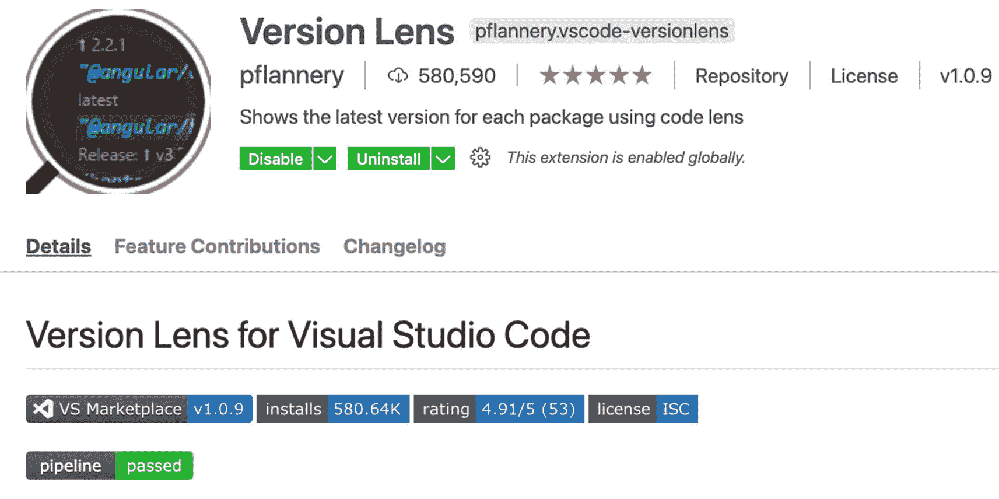
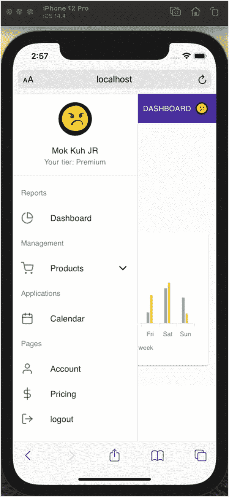

# 十六、让应用对移动设备友好

本章将在 2021 年第一季度把我们的 React 应用更新到最新的当前版本(在撰写本文时),然后使我们的应用对移动设备友好。这将确保我们的应用也能在移动设备或平板电脑等小屏幕上运行良好。

*手机友好型应用*是响应式设计或适应性设计应用的另一个术语。简而言之，显示页面会根据设备屏幕的大小自动调整。

## 入门指南

让我们转到 package.json，为了使用我们正在使用的每个库可用的最新版本，我们需要使用一个名为 Version Lens 的 VS 代码扩展。我们在前一章中安装了它，但是如果您还没有安装，现在可以随意安装。



图 16-1

使用版本镜头

那么如何查看我们正在使用的每个库的最新版本呢？打开 package.json，点击右上角的 V 图标，如图 [16-2](#Fig2) 所示。


图 16-2

版本镜头库

## 安全更新包库

我们将对 React 和我们正在使用的库进行安全升级。要升级，只需点击向上箭头符号，如图 [16-3](#Fig3) 所示。


图 16-3

库的安全更新

**date-io/moment** 的最新版本是 2.10.8，是我们正在使用的 1.3.13 版本的主要版本更新。我们不打算更新这个，因为主要版本意味着有潜在的突破性变化。 **1.3.13** 是与我们这里使用的日历组件兼容的版本。

*   升级到主要版本时，请小心不要破坏更改。小版本和补丁升级通常没问题。

使用 Version Lens 升级你的应用中的所有次要版本和补丁，或者如果你想确定，首先将你的版本与我们在撰写本文时拥有的版本进行比较。您可以在我的 GitHub 中查看 package.json:

[T2`https://github.com/webmasterdevlin/practical-enterprise-react/blob/master/chapter-13/package.json`](https://github.com/webmasterdevlin/practical-enterprise-react/blob/master/chapter-13/package.json)

我们更新了这个 app 中的次要版本和补丁，包括以下主要版本，如清单 [16-1](#PC1) 所示。

```jsx
//major versions that were updated

@types/react
@types/react-dom
concurrently
prettier
react
react-dom
react-test-renderer
sanitize.css
ts-node
typescript

Listing 16-1Updated Major Versions

```

好的，完成之后，我们需要删除 **package-lock.json** 和**Node 模块**。然后做

```jsx
npm install
npm start:fullstack

```

如果您在运行 npm start:fullstack 后遇到问题或错误，请检查您的 npm 版本。在撰写本文时，我们使用的是 NPM 版本 6，因为与版本 7 存在兼容性问题。

说到版本，React 17 中一个比较值得注意的变化是，在创建组件时，不需要显式地从' react' 键入 **import React。试着删除其中一个组件，看看它是否还能工作。不过，目前我不建议删除它，因为一些 React 开发人员可能不熟悉这一变化。我只是提一下，这样如果您看到带有显式编写的 import React 语句的组件，就不会感到困惑。**

此外，我们在 VS Code 或 WebStorm 中使用的代码片段仍然自动包含 import React 语句。然而，我们需要升级到 React 17，为 React 中即将到来的功能做准备。

一旦你检查你的应用仍然工作，我们现在可以开始使我们的应用移动友好。

## 更新主页

让我们从主页组件开始，让它具有响应性。我们将需要来自 Material-UI 核心的样式组件以及我们创建的页面模板，如清单 [16-2](#Par18) 所示。

***清单 16-2*** 制作移动友好的主页

`import React from 'react';`

`import { Box, Container, Typography, useMediaQuery } from '@material-ui/core';`

`import Page from 'app/components/page';`

`const Home = () => {`

`const mobileDevice = useMediaQuery('(max-width:650px)');`

`return (`

`<Page title="Home">`

`<Container>`

`<Box`

`height={mobileDevice ? '50vh' : '100vh'}`

`display={'flex'}`

`flexDirection={'column'}`

`justifyContent={'center'}`

`alignItems={'center'}`

`>`

`<Typography variant={mobileDevice ? 'h4' : 'h1'}>`

`Welcome to Online Shop` 

`</Typography>`

`</Box>`

`</Container>`

`</Page>`

`);`

`};`

`export default Home;`

这里有什么新鲜事？

**useMediaQuery**:React 的一个 CSS 媒体查询钩子。它将检测浏览器是否很小，如手机应用或平板电脑浏览器。我们将最大宽度设置为 650 像素，如果低于这个值，我们就将其设置为移动设备。

我们在返回元素中有来自 Material-UI 的页面模板、容器和盒子。

t:我们将高度设置如下:如果是移动设备，那么将高度设置为 50 vh(视图高度)或浏览器大小的 50 %;不然身高 100 vh。

**排版**:如果检测到移动设备，大小为 H4；否则，将其设置为 h1。

我们在这里也使用了一个购物袋表情符号。要获得这种表情符号并直接将其复制粘贴到您的代码中，请访问这个网站 [`emojipedia.org`](http://emojipedia.org) 。搜索“购物袋”，并将该表情符号复制并粘贴到您的代码中。


图 16-4

Emojis 来自血友病. org

刷新浏览器并拖动窗口使其变小。如果你在 Windows 上使用 Mac 或 Android Studio，你也可以从模拟器中检查它。


图 16-5

使用 MediaQuery 的主页的手机屏幕截图

## 更新“关于”页面

接下来，让我们更新 About 页面组件。我们将在这里做几乎相同的事情，如清单 [16-3](#Par25) 所示。

***清单 16-3*** 制作移动友好的关于页面

`import React from 'react';`

`import { Box, Container, Typography, useMediaQuery } from '@material-ui/core';`

`import Page from 'app/components/page';`

`const AboutPage = () => {`

`const mobileDevice = useMediaQuery('(max-width:650px)');`

`return (`

`<Page title="About">`

`<Container>`

`<Box`

`height={mobileDevice ? '50vh' : '100vh'}`

`display={'flex'}`

`flexDirection={'column'}`

`justifyContent={'center'}`

`alignItems={'center'}`

`>`

`<Typography variant={mobileDevice ? 'h4' : 'h1'}>`

`About us` 

`</Typography>`

`</Box>`

`</Container>`

`</Page>`

`);`

`};`

`export default AboutPage;`

除了表情符号之外，它实际上与主页相同，如图 [16-6](#Fig6) 所示。


图 16-6

使用 MediaQuery 的“关于”页面的手机屏幕截图

## 更新未找到的页面

我们将更新的下一个页面是“未找到”页面。同样，除了使用的表情符号，我们也在做同样的事情，如清单 [16-4](#PC5) 所示。

```jsx
import React from 'react';
import { Box, Container, Typography, useMediaQuery } from '@material-ui/core';
import Page from 'app/components/page';

const NotFoundPage = () => {
  const mobileDevice = useMediaQuery('(max-width:650px)');

  return (
    <Page title="Not Found Page">
      <Container>
        <Box
          height={mobileDevice ? '50vh' : '100vh'}
          display={'flex'}
          flexDirection={'column'}
          justifyContent={'center'}
          alignItems={'center'}
        >
          <Typography variant={mobileDevice ? 'h4' : 'h1'}>
            404 Page Not Found ☹
          </Typography>
        </Box>
      </Container>
    </Page>
  );
};

export default NotFoundPage;

Listing 16-4Updating the NotFoundPage Using Media Query

```

要测试它，只需进入一个不存在的`localhost`页面，例如“localhost:3000/not-found”，如图 [16-7](#Fig7) 所示。


图 16-7

使未找到的页面移动友好

## 使导航条对移动设备友好

我们将需要使仪表板侧边栏导航移动友好。在图 [16-8](#Fig8) 中，你会注意到侧边栏导航占据了超过 50%的屏幕大小。


图 16-8

使用媒体查询前用户界面的手机截图

让我们转到导航栏. tsx，我们将合并 useMediaQuery，如清单 [16-5](#PC6) 所示。

```jsx
//add the useMediaQuery
import { AppBar, Toolbar, Button, useMediaQuery, colors, } from '@material-ui/core';

...
//add the Media Query hooks
const mobileDevice = useMediaQuery('(max-width:650px)')

//return elements. we will hide the logo if its not a mobile device
return (
    <div className={classes.root}>
      <AppBar position="static">
        <Toolbar>
          <Link className={`${classes.link} ${classes.title}`} to={'/'}>
            {!mobileDevice && 'LOGO'}
          </Link

Listing 16-5Importing useMediaQuery in dashboard-sidebar-navigation

```

但是我们还没有完成。如果你在你的模拟器或移动设备上看这个应用，只有微小的变化。仪表板导航仍然没有响应，如图 [16-9](#Fig9) 所示，该图显示了移动设备中侧边栏的当前状态。



图 16-9

使用媒体查询的 UI 的移动屏幕截图

有几种方法可以让导航条有 React。首先，在移动设备上移除整个侧边栏导航，并在右上角创建一个下拉菜单列表或汉堡菜单，如图 [16-10](#Fig10) 所示。


图 16-10

下拉菜单列表

另一种方法是缩小仪表板侧边栏导航。我们将做第二个选择。

## 使仪表板侧边栏导航对移动设备友好

进入 dashboard-sidebar-navigation . tsx，从 Material-UI Core 添加 useMediaQuery，如清单 [16-6](#PC7) 所示。

```jsx
import {
  Collapse,
  Divider,
  Drawer,
  List,
  ListItem,
  ListItemIcon,
  ListItemText,
  ListSubheader,
  Avatar,
  Box,
  Typography,
  useMediaQuery,
} from '@material-ui/core';

...
//add the Media Query hooks

const mobileDevice = useMediaQuery('(max-width:650px)');

//add the styling components in the useStyles component
// mobile style
    drawerClose: {
      transition: theme.transitions.create('width', {
        easing: theme.transitions.easing.sharp,
        duration: theme.transitions.duration.leavingScreen,
      }),
      overflowX: 'hidden',
      width: theme.spacing(7) + 1,
      [theme.breakpoints.up('sm')]: {
        width: theme.spacing(9) + 1,
      },
    },

Listing 16-6Adding the Media Query Hooks and Style Components in Dashboard Sidebar Navigation

```

接下来，我们将更新 className 抽屉和 classes paper。同样，导入命名组件 clsx，如清单 [16-7](#PC8) 所示。

```jsx
...
import clsx from 'clsx';
...
<Drawer
          className={clsx(classes.drawer, mobileDevice && classes.drawerClose)}
          variant="permanent"
          classes={{
            paper: clsx(
              classes.drawerPaper,
              mobileDevice && classes.drawerClose,
            ),
          }}
          anchor="left"

Listing 16-7Updating the Drawer Elements

```

然后，我们将更改[配置文件。姓名](http://profile.name)。如果头像在手机屏幕上，我们不会显示。我们为移动或更小的屏幕创建了另一个抽屉容器，如清单 [16-8](#PC9) 所示。

```jsx
{profile.name && !mobileDevice && (
            <Box p={2}>...

          )}
          <Divider />

          {/*drawer container for the mobile screen */}

          {mobileDevice ? (
           <div className={classes.drawerContainer}>
              <List>
             <Link className={classes.link} to={`${url}`}>
                  <ListItem button>
                    <ListItemIcon>
                      <PieChartIcon />
                    </ListItemIcon>
                  </ListItem>
                </Link>
                <Divider />
                <ListItem button onClick={handleClick}>
                  <ListItemIcon>
                    <ShoppingCartIcon />
                  </ListItemIcon>
                  {open ? <ChevronUpIcon /> : <ChevronDownIcon />}
                </ListItem>
                <Divider />
                <Collapse in={open} timeout="auto" unmountOnExit>
                  <List component="div" disablePadding>
                    <Link className={classes.link} to={`${url}/list-products`}>
                      <ListItem button className={classes.nested}>
                        <ListItemIcon>
                          <ListIcon />
                        </ListItemIcon>
                      </ListItem>
                    </Link>

                    <Link className={classes.link} to={`${url}/create-product`}>
                      <ListItem button className={classes.nested}>
                        <ListItemIcon>
                          <FilePlusIcon />
                        </ListItemIcon>
                      </ListItem>
                    </Link>
                  </List>
                </Collapse>
                <Divider />
                <Link className={classes.link} to={`${url}/calendar`}>
                  <ListItem button>
                    <ListItemIcon>
                      <CalendarIcon />
                    </ListItemIcon>
                  </ListItem>
                </Link>
                <Divider />
                <Link className={classes.link} to={`${url}/account`}>
                  <ListItem button>
                    <ListItemIcon>
                      <UserIcon />
                    </ListItemIcon>
                  </ListItem>
                </Link>
                <Divider />
                <Link className={classes.link} to={`/pricing`}>
                  <ListItem button>
                    <ListItemIcon>
                      <DollarSignIcon />
                    </ListItemIcon>
                  </ListItem>
                </Link>
                <Divider />

                <a className={classes.link} href={'/'}>
                  <ListItem button onClick={handleLogout}>
                    <ListItemIcon>
                      <LogOutIcon />
                    </ListItemIcon>
                  </ListItem>
                </a>
              </List>
              <Divider />
          ) : (

       {/*drawer container for the web browser */}

     <div className={classes.drawerContainer}>
              <List>
                ...
              </List>
            </div>
          )}
        </Drawer>
      </div>
    </>
  );
};

Listing 16-8Updating the Avatar Elements

```

现在我们有两个抽屉容器，一个用于移动屏幕，另一个用于网络浏览器。

我们将返回元素包装在 if-else 语句中。如果不是移动设备，就展示头像。否则，不要表现出来。

## 使仪表板布局移动友好

之后，我们还需要使用仪表板布局的 index.tsx 中的媒体查询挂钩。我们还需要导入 clsx。

最后，在 useStyles 中添加另一个样式属性，如清单 [16-9](#PC10) 所示。

```jsx
//import the useMediaQuery

import { Grid, useMediaQuery} from '@material-ui/core';
import clsx from 'clsx';
...

//add the Media Query hooks

const mobileDevice = useMediaQuery('(max-width:650px)')

//update the className
<DashboardSidebarNavigation />{' '}
      <div className={classes.wrapper}>
        <div className={classes.contentContainer}>
          <div
            className={clsx(classes.content, mobileDevice && classes.leftSpace)}
          >
            {children}
          </div>
        </div>
      </div>

//add a new style element

leftSpace: {
    paddingLeft: '3rem',
  },

Listing 16-9Making the Dashboard Layout Mobile-Friendly

```

现在重新检查你的手机屏幕。现在应该是手机友好了，如图 [16-11](#Fig11) 所示。


图 16-11

移动友好仪表板

FOR YOUR ACTIVITY

移动屏幕现在是移动友好的。然而，仍然有改进的余地。为了你的活动

1.  使用 useMediaQuery 挂钩，在移动设备上查看时，可以调整导航栏和仪表板页面内容之间的足够空间。

2.  Figure [16-12](#Fig12) is a screenshot of the Dashboard (L) and the Dashboard Calendar (R).

    

    图 16-12

    仪表板(L)和仪表板日历(R)的屏幕截图

## 摘要

总而言之，我们在 2021 年第一季度将我们的 React 应用更新到了最新的当前版本(在撰写本文时)。然后，在媒体查询挂钩的帮助下，我们使我们的应用对移动设备友好。

在下一章，我们将讨论 React 组件的各种流行的样式方法。