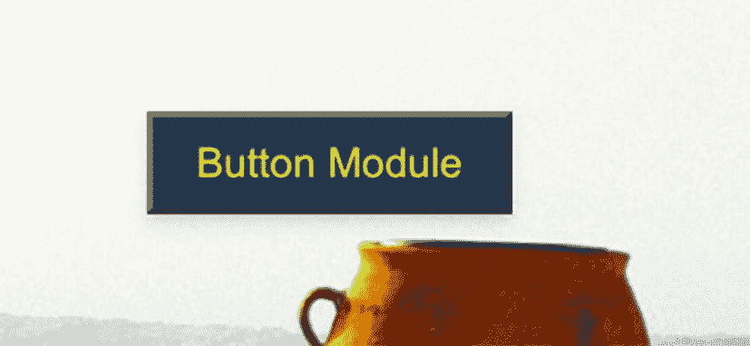

# 十七、React 组件的样式方法

在前一章中，我们借助媒体查询钩子使我们的应用对移动设备友好。现在我们的应用几乎可以部署了。然而，在我们开始之前，我认为我们应该简单地关注一下 React 组件的其他样式方法。

在整个应用中，我们使用 Material-UI 库作为我们的样式首选项。但是还有其他几种流行的方法。我们不会深入探讨每一种造型方法，而是告诉你你的其他选择。

我们可以用多种方式来设计 React 组件的样式。对于我们中的许多人来说，选择哪一个取决于不同的因素，例如我们当前项目的架构或设计目标、特定的用例，当然还有个人偏好。

例如，在某些情况下，当您只需要在特定文件中添加一些样式属性时，内联样式可能是最好的选择。如果您发现自己在同一个文件中重用了一些样式属性，那么样式化组件是完美的。对于其他复杂的应用，您可以查看 CSS 模块，甚至是常规的 CSS。

## 内嵌样式

开发人员通常使用内联样式来构建组件原型或测试组件的 CSS 样式。这种样式也是一种强力处理元素的方式，可以查看我们编写和删除的任何 CSS 内联样式的结果。内联样式可能是我们可以使用的最直接的样式方法，尽管不推荐用于大规模应用。

> *需要记住的一点是，在 React 中，内联样式被指定为对象，而不是字符串。键值是 CSS 属性名，应该用 camelCase 编写，样式的值通常是字符串。*

所以让我们试试。

在 components 文件夹中，我们创建一个新文件，并将其命名为`InlineStyle.tsx.`

```jsx
import React from "react";

const heading = {
  color: "orange",
  fontSize: "50px",
};

function InlineStyle() {
  return (
    <div>
      {/* style attribute to equal to the object it is calling */}
      <h1 style={heading}> Inline Style</h1>
    </div>
  );
}

export default InlineStyle;

Listing 17-1InlineStyle.tsx

```

## 普通 CSS

这只是你标准的普通 CSS。简单易用。没有依赖性，并具有本机浏览器支持。然而，这通常不用于 React 项目，尤其是大型项目。

让我们用这种样式方法做一个按钮的例子。我们正在创建一个具有以下属性的按钮类。我们还为 hover 类添加了背景色。

创建一个文件并将其命名为 Plain.css，如清单 [17-2](#PC2) 所示。

```jsx
.button {
    align-items: center;
    display: inline-flex;
    justify-content: center;
    padding: 6px 16px;
    border-radius: 3px;
    font-weight: 50;
    background: rgb(43, 128, 77);
    color: rgb(241, 240, 240);
    border: 1px solid rgb(249, 200, 200);
    box-shadow: rgba(0, 0, 0, 0.1) 0px 1px 2px;
    width: auto;
    margin-top: 500px;
    margin-bottom: 1px;
    cursor: pointer;;
}
.button:hover {
    background-color: #d4bd54;
}

Listing 17-2Plain CSS Styling

```

出于美观的目的，我添加了一些样式属性，但主要目的是创建 CSS 文件。我们有使用类的命名元素。这允许我们重用组件中的元素。

然后让我们使用这个按钮样式。我们只是导入了 CSS 文件，然后使用了按钮类。由于这是 React，我们需要使用 className，因为单词 *class* 是 JavaScript 中的保留关键字。

```jsx
import React from "react";
import "./Plain.css";

const Button = () => {
  return (
     <>

      <Container>
        <button className="button"> Log in </button>
      </Container>
    </>

  );
};

Listing 17-3Plain CSS Styling in your React component

```

## 全球 CSS

本质上，它们和普通的 CSS 写的一样。主要区别在于，全局 CSS 非常适合使用共享布局组件，如标题组件、导航栏、仪表板和其他共享站点。

我们还可以在我们的根索引目录中创建全局 CSS，如下例所示。我们制作了一个 index.css 并将其导入到我们的根索引文件中。

```jsx
body {
  margin: 0;
  font-family: -apple-system, BlinkMacSystemFont, 'Segoe UI', 'Roboto', 'Oxygen',  'Ubuntu', 'Cantarell', 'Fira Sans', 'Droid Sans',
  'Helvetica Neue', sans-serif;
  -webkit-font-smoothing: antialiased;
  -moz-osx-font-smoothing: grayscale;
}

code {
  font-family: source-code-pro, Menlo, Monaco, Consolas, 'Courier New',
    monospace;
}

Listing 17-4Global CSS in index.css

```

然后将其导入 index.tsx 以供全局使用。

```jsx
.GlobalButton-root {
    background-color: #792b78;
    box-shadow: 0 4px 6px rgba(50, 50, 93, 0.11), 0 1px 3px rgba(0, 0, 0, 0.08);
    padding: 7px 14px;
}
.GlobalButton-root:hover {
    background-color: #d49254;
}
.GlobalButton-label {
    color: #fff;
}

Listing 17-5Global CSS in index.tsx

```

在这种情况下，我们在所有应用组件上应用 index.css 的样式。

## CSS 模块

默认情况下，所有的类名都是本地范围的，或者只适用于特定的组件。这意味着每个 React 组件都有自己的 CSS 文件，该文件的范围局限于该文件和组件，从而防止名称冲突或特殊性问题。

对于依赖项，使用 css-loader。Create-react-app 支持现成的 CSS 模块。

```jsx
.button {
  background-color: #406040;
  box-shadow: 0 4px 6px rgba(50, 50, 93, 0.11), 0 1px 3px rgba(0, 0, 0, 0.08);
  padding: 7px 14px;
}
.button:hover {
  background-color: #a08884b;
}

Listing 17-6Button.module.css

```

让我们使用 button 创建另一个样式表，并将其命名为`another-stylesheet.css,`，如清单 [17-7](#PC7) 所示。

```jsx
.button {
    color: #f4f466;
}

Listing 17-7another-stylesheet.css

```

我们可以在应用的不同文件中使用相同的 CSS 类名，而不用担心名称冲突。让我们看看它是如何工作的，如 ButtonModule.tsx 中的清单 [17-8](#PC8) 所示。

```jsx
import React from 'react';

// import css modules stylesheets as styles

import styles from './Button.module.css';
import "./another-stylesheet.css";

export default function ButtonModule() {
  return (
    <div>

      <button className={`${styles.button} button`}> Button Module</button>
    </div>
  );
}

Listing 17-8ButtonModule.tsx

```

我们使用模板文字或反勾号加美元符号来放置 modules.css 中的样式对象。

见图 [17-1](#Fig1) 。



图 17-1

按钮模块界面截图

## CSS-in-JS

**样式化组件**允许我们样式化 React 组件和重新样式化现有组件。如果我们想改变对象的样式，我们就使用属性。

**另一方面，React** 中的 Emotion 同时支持字符串和对象样式。语法也更像 CSS。

### 样式组件库

样式化组件允许我们编写常规的 CSS，并在应用中传递函数和属性。我们可以对任何组件使用样式化组件，只要它接受类名属性。

样式化组件使用带标签的模板文字 CSS 代码写在两个反斜线之间——来样式化组件。

```jsx
import styled from "styled-components";

//you can rename your classes however you want.

export const ButtonStyled = styled("button")`
  align-items: center;
  display: inline-flex;
  justify-content: center;
  padding: 6px 16px;
  border-radius: 3px;
  font-weight: 50;
  background: rgb(49, 85, 77);
  color: rgb(241, 240, 240);
  border: 1px solid rgb(249, 200, 200);
  box-shadow: rgba(0, 0, 0, 0.1) 0px 1px 2px;
  width: auto;
  margin-top: 500px;
  margin-bottom: 1px;
  cursor: pointer;

  &:hover {
    background-color: #95503a;
  }
`;

export const Container = styled.div`
  display: flex;
  justify-content: center;
  align-items: center;
  height: 1px;
  color: #5a3667;
`;

Listing 17-9ButtonStyled Style Class

```

接下来，使用按钮样式类。组件和样式之间的映射被移除；这意味着您只需创建一个标准的 React 组件并将您的样式附加到它上面——您只需直接使用<buttonstyled>而不是使用带有类名的</buttonstyled>

。

我们还可以使用属性来设计我们的样式化组件，比如属性如何被传递给常规的 React 组件。

```jsx
import React from "react";
import { ButtonStyled, Container } from "./styles";

const Button = () => {
  return (
     <>

      <Container>
        <ButtonStyled>Log in</ButtonStyled>
      </Container>
     </>

  );
};

export default Button;

Listing 17-10Button.tsx Using ButtonStyled Styling Class

```

## React 中的情绪

我必须在这里强调“React 中的情感”,因为有两种使用情感的方法——一种是框架不可知的，另一种是 React。

这意味着安装也不同。有关这方面的更多信息，您可以查看这里的官方文档:

[T2`https://emotion.sh/docs/introduction`](https://emotion.sh/docs/introduction)

当然，我们将关注 React 方法。

但是在 React 方法中，也有两种主要的样式化元素的方法——使用 CSS prop 或者使用样式化组件。我们将只举后者的一个例子。

在 Emotion 中使用 styled-components，这个包是`@emotion/styled.`

对于 CSS 属性，在这里阅读更多的文档: [`https://emotion.sh/docs/css-prop`](https://emotion.sh/docs/css-prop) `.`

```jsx
import styled from "@emotion/styled";

export const ButtonEmotion = styled("button")`
  align-items: center;
  display: inline-flex;
  justify-content: center;
  padding: 6px 16px;
  border-radius: 3px;
  font-weight: 50;
  background: rgb(85, 49, 74);
  color: rgb(241, 240, 240);
  border: 1px solid rgb(249, 200, 200);
  box-shadow: rgba(0, 0, 0, 0.1) 0px 1px 2px;
  width: auto;
  margin-top: 500px;
  margin-bottom: 1px;
  cursor: pointer;

  &:hover {
    background-color: #134f0e;
  }
`;

export const Container = styled.div`
  display: flex;
  justify-content: center;
  align-items: center;
  height: 1px;
  color: #5a3667;
`;

Listing 17-11Emotion Styling Component

```

styled-component 使用`styled.div`样式 API 来创建组件。

## 摘要

正如我们在本章开始时所说的，有不同的方式或方法来设计 React 组件。选择其中一个有很多因素。我们在这里只概述了其中的一些，从最基本的如内联样式到 CSS 模块和流行的样式库，包括样式组件和情感。

下一章本质上是我们的项目应用的高潮，因为我们使用两种不同的方式部署它:Netlify 和 Docker。