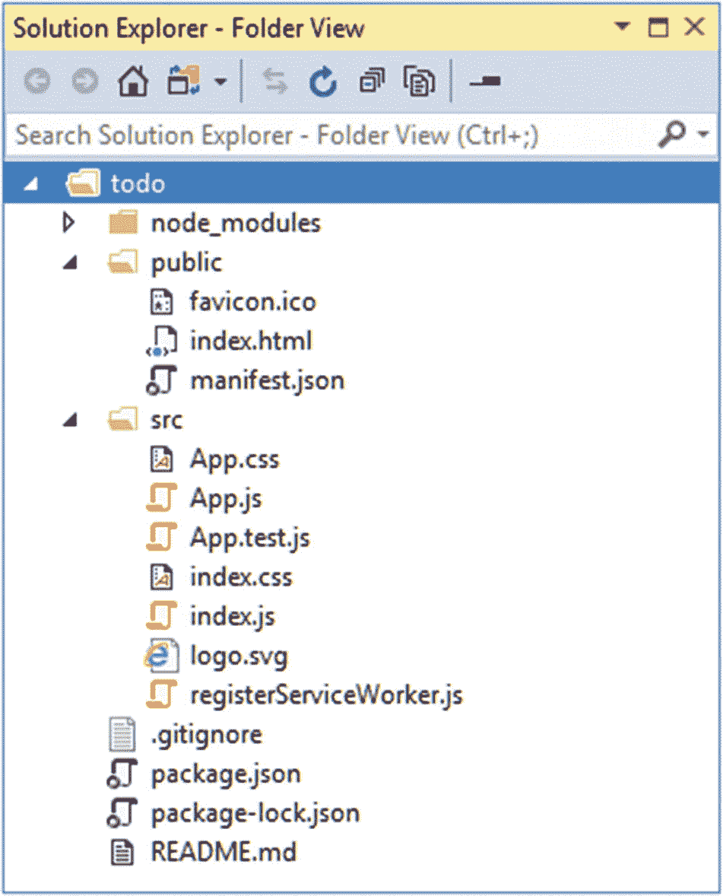
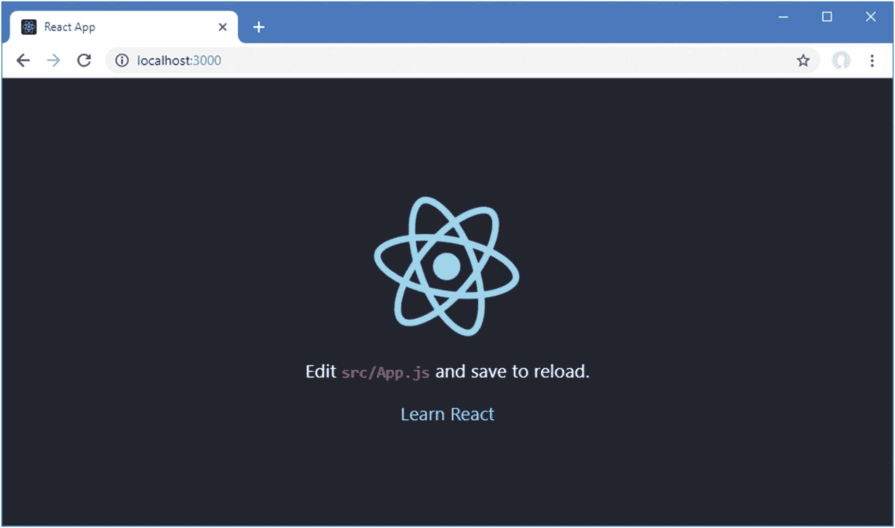
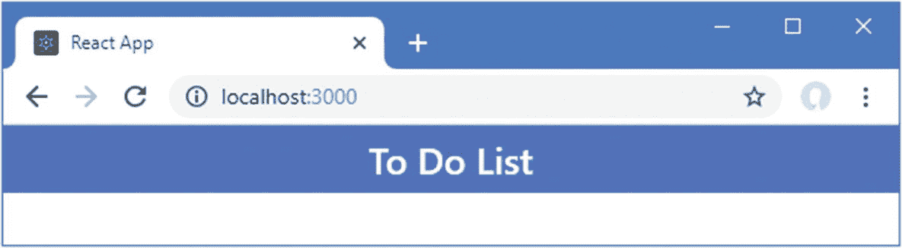
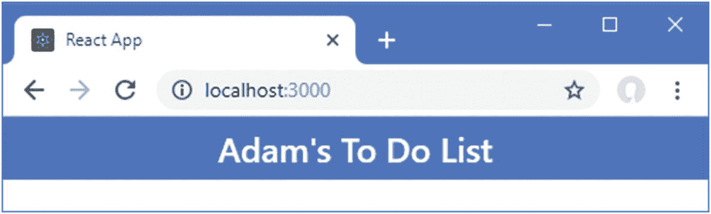
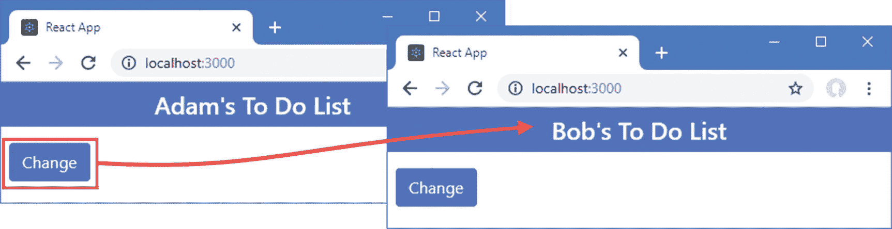
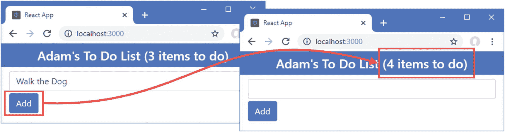
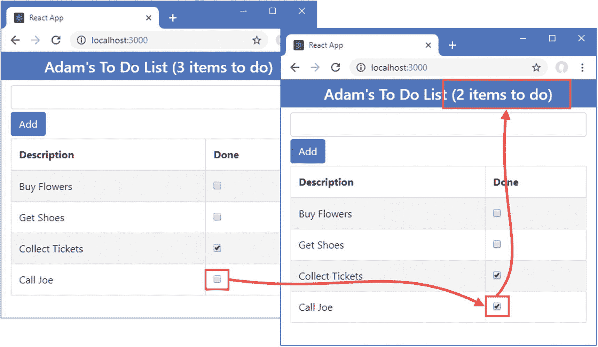
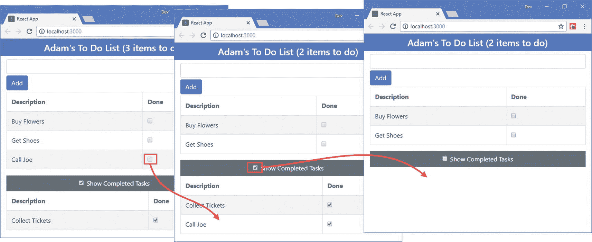
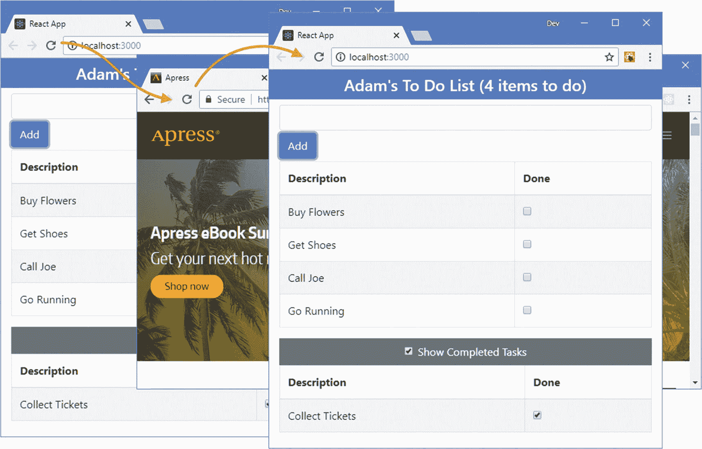

# 一、您的第一个 React 应用

开始使用 React 的最佳方式是深入研究。在这一章中，我将带你通过一个简单的开发过程来创建一个跟踪待办事项的应用。在第五章[第五章](05.html)–[第八章](08.html)中，我将向您展示如何创建一个更加复杂和真实的应用，但是，现在，一个简单的例子将足以展示 React 应用是如何创建的，以及基本功能是如何工作的。如果您不理解本章的所有内容，也不要担心——这是为了对 React 的工作原理有一个总体的了解。我会在后面的章节中详细解释一切。

### 注意

如果您需要对 React 特性的常规描述，可以跳到本书的第 2 部分，在那里我将开始深入描述各个特性的过程。在您开始之前，确保您安装了本章中描述的开发工具和软件包。

## 准备开发环境

React 开发需要一些准备工作。在接下来的部分中，我将解释如何设置和准备创建您的第一个项目。

### 安装 Node.js

用于 React 开发的工具依赖于 Node.js，也称为 Node，它创建于 2009 年，是用 JavaScript 编写的服务器端应用的简单高效的运行时。Node.js 基于 Chrome 浏览器中使用的 JavaScript 引擎，并提供了一个在浏览器环境之外执行 JavaScript 代码的 API。

Node.js 作为应用服务器已经取得了成功，但对于本书来说，它很有趣，因为它为新一代跨平台开发和构建工具提供了基础。

重要的是，您下载的 Node.js 版本与我在本书中使用的版本相同。尽管 Node.js 相对稳定，但仍不时会有突破性的 API 变化，这可能会使我在本章中包含的示例无法工作。我使用的版本是 10.14.1，这是我撰写本文时的最新长期支持版本。在您阅读本文时，可能会有更高的版本，但是对于本书中的示例，您应该坚持使用 10.14.1 版本。在 [`https://nodejs.org/dist/v10.14.1`](https://nodejs.org/dist/v10.14.1) 可以获得完整的 10.14.1 版本，包括 Windows 和 macOS 的安装程序以及其他平台的二进制包。

安装 Node.js 时，请确保选择了将 Node.js 可执行文件添加到路径的选项。安装完成后，运行清单 [1-1](#PC1) 中所示的命令。

```jsx
node -v

Listing 1-1Checking the Node Version

```

如果安装正常进行，您将会看到下面显示的版本号:

```jsx
v10.14.1

```

Node.js 安装包括节点包管理器(NPM)，用于管理项目中的包。运行清单 [1-2](#PC3) 中所示的命令，确保 NPM 正在工作。

```jsx
npm -v

Listing 1-2Checking NPM Works

```

如果一切正常，您将看到以下版本号:

```jsx
6.4.1

```

### 安装 create-react-app 包

`create-react-app`包是创建和管理复杂的 React 包的标准方式，为开发人员提供了完整的工具链。开始使用 React 还有其他方法，但这是最适合大多数项目的方法，也是我在本书中一直使用的方法。

要安装这个包，打开一个新的命令提示符并运行清单 [1-3](#PC5) 中所示的命令。如果使用的是 Linux 或者 macOS，可能需要使用`sudo`。

```jsx
npm install --global create-react-app@2.1.2

Listing 1-3Installing the create-react-app Package

```

### 安装 Git

需要 Git 修订版控制工具来管理 React 开发所需的一些包。如果您使用的是 Windows 或 macOS，那么从 [`https://git-scm.com/downloads`](https://git-scm.com/downloads) 下载并运行安装程序。(在 macOS 上，您可能需要更改安全设置才能打开安装程序，开发人员尚未对该安装程序进行签名。)

Git 已经包含在大多数 Linux 发行版中。如果您想安装最新版本，请查阅 [`https://git-scm.com/download/linux`](https://git-scm.com/download/linux) 上的安装说明。举个例子，对于我使用的 Linux 发行版 Ubuntu，我使用了清单 [1-4](#PC6) 中所示的命令。

```jsx
sudo apt-get install git

Listing 1-4Installing Git

```

一旦完成安装，打开一个新的命令提示符并运行清单 [1-5](#PC7) 中所示的命令，检查 Git 是否已安装并可用。

```jsx
git --version

Listing 1-5Checking Git

```

这个命令打印出已经安装的 Git 包的版本。在撰写本文时，针对 Windows 和 Linux 的 Git 最新版本是 2.20.1，针对 macOS 的 Git 最新版本是 2.19.2。

### 安装编辑器

React 开发可以用任何一个程序员的编辑器来完成，从中有数不尽的选择。一些编辑器增强了对使用 React 的支持，包括突出显示关键字和表达式。如果您还没有 web 应用开发的首选编辑器，那么您可以考虑表 [1-1](#Tab1) 中的一些流行选项。对于这本书，我不依赖任何特定的编辑器，你应该使用任何你觉得舒服的编辑器。

表 1-1

流行的编程编辑

<colgroup><col class="tcol1 align-left"> <col class="tcol2 align-left"></colgroup> 
| 

名字

 | 

描述

 |
| --- | --- |
| 崇高的文本 | Sublime Text 是一个商业跨平台编辑器，它有支持大多数编程语言、框架和平台的包。详见 [`www.sublimetext.com`](http://www.sublimetext.com) 。 |
| 原子 | Atom 是一个开源的跨平台编辑器，特别强调定制和可扩展性。详见`atom.io`。 |
| 括号 | 括号是 Adobe 开发的免费开源编辑器。详见`brackets.io`。 |
| Visual Studio 代码 | Visual Studio Code 是微软的一款开源的跨平台编辑器，强调可扩展性。详见`code.visualstudio.com`。 |
| 可视化工作室 | Visual Studio 是微软的旗舰开发工具。有免费版和商业版可用，它附带了大量集成到 Microsoft 生态系统中的附加工具。 |

### 安装浏览器

最后要选择的是在开发过程中用来检查工作的浏览器。所有当代浏览器都有良好的开发人员支持，并且与 React 配合良好，但 Chrome 和 Firefox 有一个名为`react-devtools`的有用扩展，它提供了对 React 应用状态的洞察，在复杂项目中特别有用。安装分机详见 [`https://github.com/facebook/react-devtools`](https://github.com/facebook/react-devtools) 。在这本书里，我一直使用谷歌浏览器，这是我推荐你使用的浏览器。

## 创建项目

从命令行创建和管理项目。打开一个新的命令提示符，导航到一个方便的位置，运行清单 [1-6](#PC8) 中所示的命令，为本章创建项目。

### 小费

你可以从 [`https://github.com/Apress/pro-react-16`](https://github.com/Apress/pro-react-16) 下载本章以及本书其他章节的示例项目。

```jsx
npx create-react-app todo

Listing 1-6Creating the Project

```

在上一节中，`npx`命令是作为 Node.js/NPM 包的一部分安装的，用于运行 Node.js 包。`create-react-app`参数告诉`npx`运行`create-react-app`包，该包用于创建新的 React 项目，安装在清单 [1-3](#PC5) 中。最后一个参数是`todo`，这是要创建的项目的名称。当您运行这个命令时，项目将被创建，并且开发和运行 React 项目所需的所有包都将被下载和安装。安装过程可能需要一段时间，因为有大量的软件包要下载。

### 注意

创建新项目时，您可能会看到有关安全漏洞的警告。React 开发依赖于大量的包，每个包都有自己的依赖关系，不可避免的会发现安全问题。对于本书中的示例，使用指定的包版本以确保获得预期的结果是很重要的。对于您自己的项目，您应该查看警告并更新到解决问题的版本。

### 了解项目结构

使用您喜欢的编辑器打开`todo`文件夹，您将看到如图 [1-1](#Fig1) 所示的项目结构。该图显示了我首选的编辑器(Visual Studio)中的布局，如果您选择了不同的编辑器，您可能会看到项目内容的呈现略有不同。



图 1-1

项目结构

这是所有项目的起点，虽然每个文件的目的目前可能不明显，但在本书结束时，你会知道每个文件和文件夹的用途。目前，表 [1-2](#Tab2) 简要描述了本章重要的文件，我在第 [9](09.html) 章提供了 React 项目的详细说明。

表 1-2

本章为项目中的重要文件

<colgroup><col class="tcol1 align-left"> <col class="tcol2 align-left"></colgroup> 
| 

名字

 | 

描述

 |
| --- | --- |
| `public/index.html` | 这是浏览器加载的 HTML 文件。它包含一个显示应用的元素和一个加载应用的 JavaScript 文件的`script`元素。 |
| `src/index.js` | 这是负责配置和启动 React 应用的 JavaScript 文件。在下一节中，我使用这个文件将引导 CSS 框架添加到应用中。 |
| `src/App.js` | 这是 React 组件，它包含将显示给用户的 HTML 内容和 HTML 所需的 JavaScript 代码。组件是 React 应用中的主要构件，您将在本书中看到它们的使用。 |

### 添加引导 CSS 框架

我使用优秀的 Bootstrap CSS 框架来设计本书中的例子所展示的 HTML。我在第 [3 章](03.html)中描述了 Bootstrap 的基本用法，但是在本章开始之前，运行清单 [1-7](#PC9) 中所示的命令来导航到`todo`文件夹并将 Bootstrap 包添加到项目中。

### 小费

用于管理一个项目中的包的命令是`npm`，它与`npx`很容易混淆，后者仅在创建一个新项目时使用。重要的是不要混淆这两个命令。

```jsx
cd todo
npm install bootstrap@4.1.2

Listing 1-7Adding the Bootstrap CSS Framework

```

要在应用中包含 Bootstrap，请将清单 [1-8](#PC10) 中所示的语句添加到`index.js`文件中。

```jsx
import React from 'react';
import ReactDOM from 'react-dom';
import './index.css';
import App from './App';
import * as serviceWorker from './serviceWorker';

import 'bootstrap/dist/css/bootstrap.css';

ReactDOM.render(<App />, document.getElementById('root'));

// If you want your app to work offline and load faster, you can change
// unregister() to register() below. Note this comes with some pitfalls.
// Learn more about service workers: http://bit.ly/CRA-PWA
serviceWorker.unregister();

Listing 1-8Including Bootstrap in the index.js File in the src Folder

```

正如我在第 4 章[中解释的那样，`import`语句用于声明一个依赖项，这样它就成为应用的一部分。`import`关键字最常用于声明对 JavaScript 代码的依赖，但是它也可以用于 CSS 样式表。](04.html)

### 启动开发工具

当您使用`create-react-app`包创建一个项目时，会安装一套完整的开发工具，这样项目就可以被编译、打包并交付给浏览器。使用命令提示符，运行`todo`文件夹中清单 [1-9](#PC11) 所示的命令来启动开发工具。

```jsx
npm start

Listing 1-9Starting the Development Tools

```

开发工具启动时有一个初始准备过程，可能需要一段时间才能完成。不要因为准备所花费的时间而推迟，因为这个过程只有在您开始开发会话时才需要。启动过程完成后，您将看到如下消息，确认应用正在运行，并告诉您要连接到哪个 HTTP 端口:

```jsx
Compiled successfully!
You can now view todo in the browser.
  Local:            http://localhost:3000/
  On Your Network:  http://192.168.0.77:3000/
Note that the development build is not optimized.
To create a production build, use npm run build.

```

用于监听 HTTP 请求的默认端口是 3000，但是如果使用 3000，将会选择不同的端口。一旦项目的初始准备工作完成，一个新的浏览器窗口将打开并显示 URL `http://localhost:3000`和占位符内容，如图 [1-2](#Fig2) 所示。



图 1-2

运行示例应用

## 替换占位符内容

图 [1-2](#Fig2) 中显示的内容是一个占位符，用于确保开发工具正常工作。为了替换默认内容，我修改了`App.js`文件，如清单 [1-10](#PC13) 所示。

```jsx
import React, { Component } from 'react';

//import logo from './logo.svg';

//import './App.css';

export default class App extends Component {

    render() {
        return (
            <div>
                <h4 className="bg-primary text-white text-center p-2">
                    To Do List
                </h4>
            </div>
        )
    };
}

Listing 1-10Removing the Placeholder in the App.js File in the src Folder

```

`App.js`文件包含一个 React *组件*，命名为`App`。组件是 React 应用的主要构建块，它们是使用 JSX 编写的，它是 JavaScript 的超集，允许 HTML 包含在代码文件中，而不需要任何特殊的引号。我在第 [3](03.html) 章中更详细地描述了 JSX，但是在这个清单中，`App`组件定义了一个`render`方法，该方法调用 React 来获取显示给用户的内容。

### 小费

React 支持 JavaScript 语言中最近增加的内容，比如清单 [1-10](#PC13) 中使用的`class`关键字。我在第 4 章中提供了最有用的 JavaScript 特性的初级读本。

当您保存`App.js`文件时，React 开发工具会自动检测更改，重建应用，并指示浏览器重新加载，显示图 [1-3](#Fig3) 中的内容。



图 1-3

替换占位符内容

React 开发中使用的 JSX 文件使得混合 HTML 和 JavaScript 变得容易，但是与常规的 HTML 文件有一些重要的不同。您可以在清单 [1-10](#PC13) 的`h4`元素中看到一个常见的例子，如下所示:

```jsx
...
<h4 className="bg-primary text-white text-center p-2">
    To Do List
</h4>
...

```

在常规 HTML 中，`class`属性用于将元素分配给类，这就是使用 Bootstrap CSS 框架时元素的样式。即使看起来不是这样，JSX 文件是 JavaScript 文件，JavaScript 通过`className`属性配置类。当您第一次开始 React 开发时，纯 HTML 和 JSX 之间的差异可能会很不协调，但它们很快就会成为您的第二天性。

### 小费

我在第 3 章[中提供了一个关于使用引导 CSS 框架的简要概述，在那里我解释了在清单](03.html) [1-10](#PC13) 中`h4`元素被赋予的类的含义，比如`bg-primary`、`text-white`和`p-2`。但是，您可以暂时忽略这些类，只关注应用的基本结构。

如果你忘记了你正在使用 JSX，而是使用标准 HTML，React 将向浏览器的 JavaScript 控制台写一条警告消息。例如，如果您使用`class`属性而不是`className`，您将会看到`Invalid DOM property 'class'. Did you mean 'className'?`警告。要查看浏览器的 JavaScript 控制台，请按 F12 键并选择控制台或 JavaScript 控制台选项卡。

## 显示动态内容

所有的 web 应用都需要向用户显示动态内容，React 通过支持*表达式*特性使这变得简单。表达式是 JavaScript 的一个片段，在组件的`render`方法被调用时被计算，并提供向用户显示数据的方法。许多表达式用于显示组件定义的数据值，以跟踪应用的状态，称为*状态数据*。当您看到一个例子时，状态数据和表达式更容易理解，清单 [1-11](#PC15) 将两者都添加到了`App`组件中。

```jsx
import React, { Component } from 'react';

export default class App extends Component {

    constructor(props) {
        super(props);
        this.state = {
            userName: "Adam"
        }
    }

    render() {
        return (
            <div>
                <h4 className="bg-primary text-white text-center p-2">
                    { this.state.userName }'s To Do List
                </h4>
            </div>
        )
    };
}

Listing 1-11Adding State Data and Data Bindings in the App.js File in the src Folder

```

正如我在第 [11 章](11.html)中解释的那样，`constructor`是一个特殊的方法，当组件被初始化时，调用构造函数中的`super`方法是确保组件被正确设置所必需的。由构造函数定义的`props`参数在 React 开发中很重要，因为它允许一个组件配置另一个组件，您很快就会看到这一点。

### 小费

术语 *props* 是*属性*的缩写，它反映了 React 创建显示在浏览器中的 HTML 内容的方式，正如我在第 [3 章](03.html)中解释的那样。

React 组件有一个名为`state`的特殊属性，用于定义状态数据，如下所示:

```jsx
...
this.state = {
    userName: "Adam"
}
...

```

`this`关键字引用当前对象，并用于访问其属性和方法。突出显示的语句将一个具有`userName`属性的对象分配给`this.state`，这是设置状态数据所需的全部内容。一旦定义了状态数据，它就可以包含在由表达式中的组件生成的内容中，如下所示:

```jsx
...
<h4 className="bg-primary text-white text-center p-2">
    { this.state.userName }'s To Do List
</h4>
...

```

表达式用花括号表示(`{`和`}`字符)。当调用`render`方法时，表达式被求值，其结果包含在呈现给用户的内容中。清单 [1-11](#PC15) 中的表达式读取`userName`状态数据属性的值，产生如图 [1-4](#Fig4) 所示的结果。



图 1-4

使用 src 文件夹中 App.js 文件中的状态数据和表达式

### 了解状态数据更改

React 应用的动态特性基于对状态数据的更改，React 通过再次调用组件的`render`方法来响应这些更改，这将导致使用新的状态数据值重新计算表达式。在清单 [1-12](#PC18) 中，我已经更新了`App`组件，因此`userName`状态数据属性的值被更改。

```jsx
import React, { Component } from 'react';

export default class App extends Component {

    constructor(props) {
        super(props);
        this.state = {
            userName: "Adam"
        }
    }

    changeStateData = () => {
        this.setState({
            userName: this.state.userName === "Adam" ? "Bob" : "Adam"
        })
    }

    render() {
        return (
            <div>
                <h4 className="bg-primary text-white text-center p-2">
                    { this.state.userName }'s To Do List
                </h4>
                <button className="btn btn-primary m-2"
                        onClick={ this.changeStateData }>
                    Change
                </button>
            </div>
        )
    };
}

Listing 1-12Changing State Data in the App.js File in the src Folder

```

将更改保存到`App.js`文件，您将在浏览器窗口中看到一个按钮。点击按钮改变用户名，如图 [1-5](#Fig5) 所示。



图 1-5

更改用户名

这个例子包含了几个协同工作的重要 React 特性。第一个是`button`元素上的`onClick`属性。

```jsx
...
<button className="btn btn-primary m-2" onClick={ this.changeStateData }>
    Change
</button>
...

```

`onClick`属性被赋予一个表达式，当按钮被单击时，React 对该表达式求值。点击一个按钮会触发一个*事件*，而`onClick`就是一个事件处理程序 prop 的例子。每次点击按钮时，都会调用由`onClick`指定的函数或方法。清单 [1-12](#PC18) 中的表达式指定了`changeStateData`方法，该方法是使用*粗箭头*语法定义的，这允许简洁地表达函数，如下所示:

```jsx
...

changeStateData = () => {

    this.setState({ userName: this.state.userName === "Adam" ? "Bob" : "Adam" })
}
...

```

正如我在第 [4](04.html) 章中解释的那样，粗箭头函数用于简化对事件的响应，但是它们的使用范围更广，有助于在 React 应用中保持 HTML 和 JavaScript 的混合可读性。`changeStateData`方法使用`setState`方法为`userName`属性设置一个新值。当调用`setState`方法时，React 用新值更新组件的状态数据，然后调用`render`方法，这样表达式将生成更新的内容。这就是为什么点击按钮会将浏览器窗口中显示的名称从`Adam`更改为`Bob`。我不必显式地告诉 React 表达式使用的值发生了变化——我只是调用了`setState`方法来设置新值，并让 React 更新浏览器中的内容。

### 小费

无论何时使用组件定义的属性和方法，包括`setState`方法，都需要`this`关键字。忘记使用`this`是 React 开发中常见的错误，如果没有得到预期的行为，这是首先要检查的。

使用粗箭头语法定义的函数不使用`return`关键字，也不需要用花括号括住函数体，这可以产生更简单、更清晰的`render`方法，例如，如清单 [1-13](#PC21) 所示。

```jsx
import React, { Component } from 'react';

export default class App extends Component {

    constructor(props) {
        super(props);
        this.state = {
            userName: "Adam"
        }
    }

    changeStateData = () => {
        this.setState({
            userName: this.state.userName === "Adam" ? "Bob" : "Adam"
        })
    }

    render = () =>
        <div>
            <h4 className="bg-primary text-white text-center p-2">
                { this.state.userName }'s To Do List
            </h4>
            <button className="btn btn-primary m-2"
                    onClick={ this.changeStateData }>
                Change
            </button>
        </div>
}

Listing 1-13Redefining a Method Using a Fat Arrow Function in the App.js File in the src Folder

```

在本书中，我使用这两种风格来定义函数和方法。大多数情况下，您可以在传统的 JavaScript 函数和粗箭头函数之间进行选择，尽管在第 [12](12.html) 章中解释了一些重要的注意事项。

## 添加待办事项应用功能

现在您已经看到了 React 如何显示动态内容，是时候开始添加应用所需的特性了，从附加的状态数据和表达式开始，如清单 [1-14](#PC22) 所示。

```jsx
import React, { Component } from 'react';

export default class App extends Component {

    constructor(props) {
        super(props);
        this.state = {
            userName: "Adam",
            todoItems: [{ action: "Buy Flowers", done: false },
                        { action: "Get Shoes", done: false },
                        { action: "Collect Tickets", done: true },
                        { action: "Call Joe", done: false }],
            newItemText: ""
        }
    }

    updateNewTextValue = (event) => {
        this.setState({ newItemText: event.target.value });
    }

    createNewTodo = () => {
        if (!this.state.todoItems
                 .find(item => item.action === this.state.newItemText)) {
            this.setState({
                todoItems: [...this.state.todoItems,
                    { action: this.state.newItemText, done: false }],
                newItemText: ""
            });
        }
    }

    render = () =>
        <div>
            <h4 className="bg-primary text-white text-center p-2">
                {this.state.userName}'s To Do List
                ({ this.state.todoItems.filter(t => !t.done).length} items to do)
            </h4>
            <div className="container-fluid">
                <div className="my-1">
                    <input className="form-control"
                        value={ this.state.newItemText }
                        onChange={ this.updateNewTextValue } />
                    <button className="btn btn-primary mt-1"
                        onClick={ this.createNewTodo }>Add</button>
                </div>
            </div>
        </div>
}

Listing 1-14Adding Application Features in the App.js File in the src Folder

```

因为 React 表达式是 JavaScript，所以它们可用于检查数据值并动态生成结果，就像下面的表达式:

```jsx
...
<h4 className="bg-primary text-white text-center p-2">
    {this.state.userName}'s To Do List
    ({ this.state.todoItems.filter(t => !t.done).length} items to do)
</h4>
...

```

该表达式过滤`todoItems`状态数据数组中的对象，以便只选择不完整的项目，然后读取`length`属性的值，这是绑定将向用户显示的值。JSX 格式使得像这样混合 HTML 元素和代码变得容易，尽管复杂的表达式可能难以阅读，并且通常在属性或方法中定义，以使 HTML 尽可能简单。

清单 [1-14](#PC22) 中的变化引入了一个`input`元素，允许用户输入新待办事项的文本。input 元素有两个属性，用于管理元素的内容和响应更改，如下所示:

```jsx
...
<input className="form-control"
    value={ this.state.newItemText } onChange={ this.updateNewTextValue } />
...

```

属性用于设置元素的内容。在这种情况下，`value`属性包含的表达式将返回`newItemText`状态数据属性的值，这意味着对状态数据属性的任何更改都将更新`input`元素的内容。`onChange` prop 告诉 React 当`change`事件被触发时做什么，这将在用户输入`input`元素时发生。这个表达式告诉 React 调用组件的`updateNewTextValue`方法，它使用`setState`方法更新`newItemText`状态数据属性。这似乎是一种循环的方法，但是它确保了 React 知道如何处理由代码和用户执行的更改。

`button`元素使用`onClick`属性告诉 React 调用`createNewTodo`方法来响应`click`事件。`createNewTodo`方法检查是否存在具有相同文本的现有项目，如果没有，则使用`setState`方法向`todoItems`数组添加一个新项目，并重置`newItemText`属性，这具有清除`input`元素的效果。向数组中添加新项的语句是通过 JavaScript 的 spread 操作符来完成的，spread 操作符是 JavaScript 语言的一个新特性。

```jsx
...
todoItems: [...this.state.todoItems,
    { action: this.state.newItemText, done: false }],
...

```

spread 运算符是三个句点，它扩展了一个数组。用于 React 开发的工具允许使用最新的 JavaScript 特性，并将它们转换成旧的 web 浏览器可以理解的兼容代码。我在第 4 章中描述了 spread 操作符和其他有用的 JavaScript 特性。

要查看清单 [1-14](#PC22) 中更改的效果，请在文本字段中输入任务的描述，然后单击 Add 按钮。React 通过调用按钮的`onClick`属性指定的方法来响应事件，该方法使用`input`元素的值来创建一个新的待办事项。现在还看不到任务的描述，但是会看到未完成任务的数量增加，如图 [1-6](#Fig6) 。



图 1-6

添加新任务

### 显示待办事项

下一步是向用户显示每个待办事项，以便他们可以看到任务的细节，并在完成后将它们标记为完成，如清单 [1-15](#PC26) 所示。

```jsx
import React, { Component } from 'react';

export default class App extends Component {

    constructor(props) {
        super(props);
        this.state = {
            userName: "Adam",
            todoItems: [{ action: "Buy Flowers", done: false },
                        { action: "Get Shoes", done: false },
                        { action: "Collect Tickets", done: true },
                        { action: "Call Joe", done: false }],
            newItemText: ""
        }
    }

    updateNewTextValue = (event) => {
        this.setState({ newItemText: event.target.value });
    }

    createNewTodo = () => {
        if (!this.state.todoItems
                .find(item => item.action === this.state.newItemText)) {
            this.setState({
                todoItems: [...this.state.todoItems,
                    { action: this.state.newItemText, done: false }],
                newItemText: ""
            });
        }
    }

    toggleTodo = (todo) => this.setState({ todoItems:
        this.state.todoItems.map(item => item.action === todo.action
            ? { ...item, done: !item.done } : item) });

    todoTableRows = () => this.state.todoItems.map(item =>
        <tr key={ item.action }>
            <td>{ item.action}</td>
            <td>
                <input type="checkbox" checked={ item.done }
                    onChange={ () => this.toggleTodo(item) } />
            </td>
        </tr> );

    render = () =>
        <div>
            <h4 className="bg-primary text-white text-center p-2">
                {this.state.userName}'s To Do List
                ({ this.state.todoItems.filter(t => !t.done).length} items to do)
            </h4>
            <div className="container-fluid">
                <div className="my-1">
                    <input className="form-control"
                        value={ this.state.newItemText }
                        onChange={ this.updateNewTextValue } />
                    <button className="btn btn-primary mt-1"
                        onClick={ this.createNewTodo }>Add</button>
                </div>
                <table className="table table-striped table-bordered">
                    <thead>
                        <tr><th>Description</th><th>Done</th></tr>
                    </thead>
                    <tbody>{ this.todoTableRows() }</tbody>
                </table>
            </div>
        </div>
}

Listing 1-15Displaying To-Do Items in the App.js File in the src Folder

```

到目前为止，`App.js`文件的重点是在 HTML 片段中嵌入 JavaScript 表达式。但是 JSX 格式允许 HTML 和 JavaScript 自由混合，这意味着 JavaScript 方法可以返回 HTML 内容。您可以在清单 [1-15](#PC26) 中看到一个例子，其中`todoTableRows`方法使用 JavaScript `map`方法为`todoItems`数组中的每个对象生成一系列 HTML 元素，如下所示:

```jsx
...
todoTableRows = () => this.state.todoItems.map(item =>
    <tr key={ item.action }>
        <td>{ item.action}</td>
        <td>
            <input type="checkbox" checked={ item.done }
                onChange={ () => this.toggleTodo(item) } />
        </td>
    </tr> );
...

```

数组中的每一项都映射到一个`tr`元素，这是一个表格行的 HTML 元素。在`tr`元素中有一组定义 HTML 表格单元格的`td`元素。由`map`方法生成的 HTML 内容包含更多的 JavaScript 表达式，这些表达式用状态数据值或函数填充`td`元素，这些值或函数将被调用来处理事件。

React 确实对它处理的内容施加了一些限制，比如通过`todoTableRows`方法添加到每个`tr`元素的`key`属性，如下所示:

```jsx
...
<tr key={ item.action }>
...

```

正如你将在第 [13](13.html) 章中详细了解到的，当有变化时，React 调用组件的`render`方法，并将结果与浏览器中显示的 HTML 进行比较，以便只应用差异。React 需要`key` prop，以便它能够将显示的内容与产生它的数据相关联，并有效地管理更改。

清单 [1-15](#PC26) 中变化的结果是，每个待办事项都显示有一个复选框，用户可以切换该复选框来指示任务已经完成。由`todoTableRows`方法生成的每个表格行包含一个配置为复选框的`input`元素。

清单 [1-15](#PC26) 中变化的结果是待办事项列表显示在一个表格中，勾选一项为完成会减少标题中显示的数字，如图 [1-7](#Fig7) 所示。



图 1-7

显示待办事项

## 引入附加组件

目前，示例应用的所有功能都包含在一个组件中，随着新功能的增加，这个组件会变得难以管理。为了帮助保持组件的可管理性，功能被委托给负责特定功能的独立组件。这些被称为*子组件*，而委托功能的组件被称为*父组件*。

在本节中，我将介绍几个子组件，每个子组件负责一个特性。我首先将一个名为`TodoBanner.js`的文件添加到`src`文件夹中，并使用它来定义清单 [1-16](#PC29) 中所示的组件。

```jsx
import React, { Component } from 'react';

export class TodoBanner extends Component {

    render = () =>
        <h4 className="bg-primary text-white text-center p-2">
            { this.props.name }'s To Do List
            ({ this.props.tasks.filter(t => !t.done).length } items to do)
        </h4>
}

Listing 1-16The Contents of the TodoBanner.js File in the src Folder

```

该组件负责显示横幅。父组件使用 *props* 为其子组件提供数据，数据值通过`props`属性访问，通过`this`关键字访问。这个名为`TodoBanner`的组件期望接收两个属性:一个`name`属性，包含用户的名字，另一个`tasks`属性，包含一组任务，过滤后显示未完成的任务数。例如，为了显示`name`属性的值，组件使用包含`this.props.name`的表达式，如下所示:

```jsx
...
{ this.props.name }'s To Do List
...

```

当 React 调用`TodoBanner`组件的`render`方法时，父组件提供的`name`属性的值将包含在结果中。`TodoBanner`组件的`render`方法中的另一个表达式使用 JavaScript `filter`方法来选择不完整的项目并确定有多少，这表明 props 可以用在表达式中，而不仅仅是显示它们的值。

接下来，我在`src`文件夹中创建了一个名为`TodoRow.js`的文件，并用它来定义清单 [1-17](#PC31) 中所示的组件。

```jsx
import React, { Component } from 'react';

export class TodoRow extends Component {

    render = () =>
        <tr>
            <td>{ this.props.item.action}</td>
            <td>
                <input type="checkbox" checked={ this.props.item.done }
                    onChange={ () => this.props.callback(this.props.item) }
                />
            </td>
        </tr>
}

Listing 1-17The Contents of the TodoRow.js File in the src Folder

```

该组件将负责在表中显示一行，显示待办事项的详细信息。子组件通过其 props 接收的数据是只读的，不得更改。为了进行更改，父组件可以使用*函数 props* 为子组件提供回调函数，当重要事件发生时调用这些函数。这种组合允许组件之间的协作:数据属性允许父母向孩子提供数据，而功能属性允许孩子与父母通信。

清单 [1-17](#PC31) 中的组件定义了一个名为`item`的数据属性，用于接收要显示的待办事项，它还定义了一个名为`callback`的函数属性，提供了一个当用户切换复选框时调用的函数。对于最后一个子组件，我在`src`文件夹中添加了一个名为`TodoCreator.js`的文件，并添加了清单 [1-18](#PC32) 中所示的代码。

```jsx
import React, { Component } from 'react';

export class TodoCreator extends Component {

    constructor(props) {
        super(props);
        this.state = { newItemText: "" }
    }

    updateNewTextValue = (event) => {
        this.setState({ newItemText: event.target.value});
    }

    createNewTodo = () => {
        this.props.callback(this.state.newItemText);
        this.setState({ newItemText: ""});
    }

    render = () =>
        <div className="my-1">
            <input className="form-control" value={ this.state.newItemText }
                onChange={ this.updateNewTextValue } />
            <button className="btn btn-primary mt-1"
                onClick={ this.createNewTodo }>Add</button>
        </div>
}

Listing 1-18The Contents of the TodoCreator.js File in the src Folder

```

子组件可以有自己的状态数据，这是该组件用来处理其`input`元素内容的数据。当用户单击 Add 按钮时，组件调用 function prop 来通知其父组件。

### 使用子组件

我在上一节中定义的组件负责待办事项应用的特定功能。在清单 [1-19](#PC33) 中，我更新了`App`组件以使用三个新组件，每个组件都是使用 props 配置的，为它们提供所需的数据和回调函数。

```jsx
import React, { Component } from 'react';

import { TodoBanner } from "./TodoBanner";

import { TodoCreator } from "./TodoCreator";

import { TodoRow } from "./TodoRow";

export default class App extends Component {

    constructor(props) {
        super(props);
        this.state = {
            userName: "Adam",
            todoItems: [{ action: "Buy Flowers", done: false },
                        { action: "Get Shoes", done: false },
                        { action: "Collect Tickets", done: true },
                        { action: "Call Joe", done: false }],
            //newItemText: ""
        }
    }

    updateNewTextValue = (event) => {
        this.setState({ newItemText: event.target.value });
    }

    createNewTodo = (task) => {
        if (!this.state.todoItems.find(item => item.action === task)) {
            this.setState({
                todoItems: [...this.state.todoItems, { action: task, done: false }]
            });
        }
    }

    toggleTodo = (todo) => this.setState({ todoItems:
        this.state.todoItems.map(item => item.action === todo.action
            ? { ...item, done: !item.done } : item) });

    todoTableRows = () => this.state.todoItems.map(item =>
        <TodoRow key={ item.action } item={ item } callback={ this.toggleTodo } />)

    render = () =>
        <div>
            <TodoBanner name={ this.state.userName } tasks={this.state.todoItems } />
            <div className="container-fluid">
                <TodoCreator callback={ this.createNewTodo } />
                <table className="table table-striped table-bordered">
                    <thead>
                        <tr><th>Description</th><th>Done</th></tr>
                    </thead>
                    <tbody>{ this.todoTableRows() }</tbody>
                </table>
            </div>
        </div>
}

Listing 1-19Applying Child Components in the App.js File in the src Folder

```

新的`import`语句声明了对子组件的依赖，这确保了它们在构建过程中包含在应用中。子组件用作自定义 HTML 元素，其属性和表达式定义了组件将接收的属性，如下所示:

```jsx
...
<TodoBanner name={ this.state.userName } tasks={this.state.todoItems } />
...

```

用于设置属性值的表达式为子组件提供了对由其父组件定义的特定数据和方法的访问。在这种情况下，`name`和`tasks`属性用于向`TodoBanner`组件提供`userName`和`todoItems`状态数据属性的值。

## 添加最后的润色

应用的基本功能已经就绪，提供这些功能的一组组件正在协同工作。在这一部分，我添加了一些收尾工作来完成待办事项应用。

### 管理已完成任务的可见性

目前，即使任务已经完成，它们仍然对用户可见。为了解决这个问题，我将为用户提供已完成和未完成任务的单独列表，并允许隐藏未完成的任务。我在`src`文件夹中添加了一个名为`VisibilityControl.js`的文件，并用它来定义清单 [1-20](#PC35) 中所示的组件。

```jsx
import React, { Component } from 'react';

export class VisibilityControl extends Component {

    render = () =>
        <div className="form-check">
            <input className="form-check-input" type="checkbox"
                checked={ this.props.isChecked }
                onChange={ (e) => this.props.callback(e.target.checked) } />
            <label className="form-check-label">
                Show { this.props.description }
            </label>
        </div>
}

Listing 1-20The Contents of the VisibilityControl.js File in the src Folder

```

使用 props 从父节点接收数据和回调函数使得向应用添加新特性变得容易。清单 [1-20](#PC35) 中定义的组件是一个通用的特性，它不知道被用来管理的内容，它完全通过它的属性工作:`description`属性提供它显示的标签文本，`isChecked`属性提供复选框的初始状态，`callback`属性提供当用户切换复选框并触发`change`事件时调用的函数。

在清单 [1-21](#PC36) 中，我已经更新了`App`组件，将`VisibilityControl`组件作为子组件应用，同时还做了必要的修改，以分别显示已完成和未完成的任务。

```jsx
import React, { Component } from 'react';
import { TodoBanner } from "./TodoBanner";
import { TodoCreator } from "./TodoCreator";
import { TodoRow } from "./TodoRow";

import { VisibilityControl } from "./VisibilityControl";

export default class App extends Component {

    constructor(props) {
        super(props);
        this.state = {
            userName: "Adam",
            todoItems: [{ action: "Buy Flowers", done: false },
                        { action: "Get Shoes", done: false },
                        { action: "Collect Tickets", done: true },
                        { action: "Call Joe", done: false }],
            showCompleted: true
        }
    }

    updateNewTextValue = (event) => {
        this.setState({ newItemText: event.target.value });
    }

    createNewTodo = (task) => {
        if (!this.state.todoItems.find(item => item.action === task)) {
            this.setState({
                todoItems: [...this.state.todoItems, { action: task, done: false }]
            });
        }
    }

    toggleTodo = (todo) => this.setState({ todoItems:
        this.state.todoItems.map(item => item.action === todo.action
            ? { ...item, done: !item.done } : item) });

    todoTableRows = (doneValue) => this.state.todoItems
        .filter(item => item.done === doneValue).map(item =>
            <TodoRow key={ item.action } item={ item }
                  callback={ this.toggleTodo } />)

    render = () =>
        <div>
            <TodoBanner name={ this.state.userName }
                tasks={this.state.todoItems } />
            <div className="container-fluid">
                <TodoCreator callback={ this.createNewTodo } />
                <table className="table table-striped table-bordered">
                    <thead>
                        <tr><th>Description</th><th>Done</th></tr>
                    </thead>
                    <tbody>{ this.todoTableRows(false) }</tbody>
                </table>
                <div className="bg-secondary text-white text-center p-2">
                    <VisibilityControl description="Completed Tasks"
                        isChecked={this.state.showCompleted}
                        callback={ (checked) =>
                            this.setState({ showCompleted: checked })} />
                </div>

                { this.state.showCompleted &&
                    <table className="table table-striped table-bordered">
                        <thead>
                            <tr><th>Description</th><th>Done</th></tr>
                        </thead>
                        <tbody>{ this.todoTableRows(true) }</tbody>
                    </table>
                }
            </div>
        </div>
}

Listing 1-21Managing Completed Tasks in the App.js File in the src Folder

```

对`VisibilityControl`组件进行了配置，因此当用户切换复选框时，它会更改`App`组件的名为`showCompleted`的状态数据属性的值。为了区分完成的和未完成的任务，我向`todoTableRows`方法添加了一个参数，并使用`filter`方法根据`done`属性的值从状态数据数组中选择对象。

为了显示已完成的任务，我添加了第二个`table`元素。只有当`showCompleted`属性为`true`时，该表才会显示，所以我将`table`及其内容放在一个数据绑定表达式中，并使用了`&&`运算符，如下所示:

```jsx
...
{ this.state.showCompleted && <table className="table table-striped table-bordered">
...

```

当表达式求值时，只有当`showCompleted`属性为`true`时，`table`元素才会包含在组件的内容中。这是 JSX 如何混合内容和代码的另一个例子。在很大程度上，JSX 在混合元素和代码语句方面做得很好，但它并不擅长所有事情，条件语句所需的语法也很笨拙，正如这个例子所示。

当您保存对`App.js`文件的更改时，您将看到不同的任务集。当您切换任务的复选框时，它将被移动到另一个表格，如图 [1-8](#Fig8) 所示。当您切换“显示已完成的任务”复选框时，第二个表将被隐藏。



图 1-8

更改任务显示

### 持久存储数据

最后一个变化是存储数据，以便在离开应用时保留用户列表。在本书的后面，我将演示处理存储在服务器上的数据的不同方法，但是在本章中，我将保持应用的简单性，并要求浏览器使用本地存储 API 来存储数据，如清单 [1-22](#PC38) 所示。

### 小费

本地存储 API 是一个标准的浏览器特性，并不特定于 React 开发。参见 [`https://developer.mozilla.org/en-US/docs/Web/API/Window/localStorage`](https://developer.mozilla.org/en-US/docs/Web/API/Window/localStorage) 了解本地存储如何工作的详细描述。

```jsx
import React, { Component } from 'react';
import { TodoBanner } from "./TodoBanner";
import { TodoCreator } from "./TodoCreator";
import { TodoRow } from "./TodoRow";
import { VisibilityControl } from "./VisibilityControl";

export default class App extends Component {

    constructor(props) {
        super(props);
        this.state = {
            userName: "Adam",
            todoItems: [{ action: "Buy Flowers", done: false },
                        { action: "Get Shoes", done: false },
                        { action: "Collect Tickets", done: true },
                        { action: "Call Joe", done: false }],
            showCompleted: true
        }
    }

    updateNewTextValue = (event) => {
        this.setState({ newItemText: event.target.value });
    }

    createNewTodo = (task) => {
        if (!this.state.todoItems.find(item => item.action === task)) {
            this.setState({
                todoItems: [...this.state.todoItems, { action: task, done: false }]
            }, () => localStorage.setItem("todos", JSON.stringify(this.state)));
        }
    }

    toggleTodo = (todo) => this.setState({ todoItems:
        this.state.todoItems.map(item => item.action === todo.action
            ? { ...item, done: !item.done } : item) });

    todoTableRows = (doneValue) => this.state.todoItems
        .filter(item => item.done === doneValue).map(item =>
            <TodoRow key={ item.action } item={ item }
                callback={ this.toggleTodo } />)

    componentDidMount = () => {
        let data = localStorage.getItem("todos");
        this.setState(data != null
            ? JSON.parse(data)
            :  {
                userName: "Adam",
                todoItems: [{ action: "Buy Flowers", done: false },
                            { action: "Get Shoes", done: false },
                            { action: "Collect Tickets", done: true },
                            { action: "Call Joe", done: false }],
                showCompleted: true
            });
    }

    render = () =>
        <div>
            <TodoBanner name={ this.state.userName }
                tasks={this.state.todoItems } />
            <div className="container-fluid">
                <TodoCreator callback={ this.createNewTodo } />
                <table className="table table-striped table-bordered">
                    <thead>
                        <tr><th>Description</th><th>Done</th></tr>
                    </thead>
                    <tbody>{ this.todoTableRows(false) }</tbody>
                </table>

                <div className="bg-secondary text-white text-center p-2">
                    <VisibilityControl description="Completed Tasks"
                        isChecked={this.state.showCompleted}
                        callback={ (checked) =>
                            this.setState({ showCompleted: checked })} />
                </div>

                { this.state.showCompleted &&
                    <table className="table table-striped table-bordered">
                        <thead>
                            <tr><th>Description</th><th>Done</th></tr>
                        </thead>
                        <tbody>{ this.todoTableRows(true) }</tbody>
                    </table>
                }
            </div>
        </div>
}

Listing 1-22Persistently Storing Data in the App.js File in the src Folder

```

通过`localStorage`对象访问本地存储 API，当创建新的待办事项时，组件使用`setItem`方法存储待办事项。本地存储特性只能存储字符串值，所以在存储之前，我将数据对象序列化为 JSON。如第 [11](11.html) 章所述，`setState`方法可以接受一个函数，一旦状态数据被更新，该函数将被更新，这确保了最新的数据被存储。

组件有一个明确定义的生命周期，这在第 [13 章](13.html)中有描述，并且可以实现接收重要事件通知的方法。清单中的组件实现了`componentDidMount`方法，该方法在组件生命周期的早期被调用，并提供了执行诸如加载数据等任务的好机会。

为了检索存储的数据，我使用了本地存储 API 的`getItem`方法。我使用`setState`方法用存储的数据更新组件，或者如果没有可用的存储数据，用一些默认数据更新组件。

视觉上没有变化，但应用将持久存储您创建的任何待办事项，这意味着当您重新加载浏览器窗口或导航到不同的 URL(如 Apress 主页)，然后返回到`http://localhost:3000`，它们仍然可用，如图 [1-9](#Fig9) 所示。



图 1-9

存储数据

## 摘要

在本章中，我创建了一个简单的示例应用，向您介绍 React 开发过程，并演示一些重要的 React 概念。您看到了 React 开发关注于组件，这些组件是在结合了 JavaScript 代码和 HTML 内容的 JSX 文件中定义的。创建项目时，包括了处理 JSX 文件、构建应用以及将其交付给浏览器进行测试所需的一切，以便您可以快速轻松地开始。

您还了解了 React 应用可以包含多个组件，每个组件负责一个特定的特性，并使用 props 接收它们所需的数据和回调函数。

从这本书的篇幅中可以看出，React 还有更多的特性可用，但是我在本章中创建的基本应用已经向您展示了 React 开发的最基本特征，并将为后面的章节提供基础。在下一章，我将 React 放在上下文中，描述这本书的结构和内容。