# 三、HTML、JSX 和 CSS 入门

在这一章中，我提供了 HTML 的简要概述，并解释了如何在使用 JSX 时将 HTML 内容与 JavaScript 代码混合，这是 React 开发工具支持的 JavaScript 的超集，允许 HTML 与代码混合。我还介绍了 Bootstrap CSS 框架，我用它来设计本书示例中的内容。

### 注意

如果本章中描述的所有特性都没有直接意义，也不要担心。有些依赖于 JavaScript 语言中最近添加的你以前可能没有遇到过的东西，这些在第 [4](04.html) 章中有描述或者在其他章节中有详细解释。

## 为本章做准备

为了创建本章的项目，打开一个新的命令提示符，导航到一个方便的位置，并运行清单 [3-1](#PC1) 中所示的命令。

### 小费

你可以从 [`https://github.com/Apress/pro-react-16`](https://github.com/Apress/pro-react-16) 下载本章以及本书所有其他章节的示例项目。

```jsx
npx create-react-app primer

Listing 3-1Creating the Example Project

```

一旦创建了项目，运行清单 [3-2](#PC2) 中所示的命令，导航到项目文件夹并安装引导 CSS 框架。

### 注意

创建新项目时，您可能会看到有关安全漏洞的警告。React 开发依赖于大量的包，每个包都有自己的依赖关系，不可避免的会发现安全问题。对于本书中的示例，使用指定的包版本以确保获得预期的结果是很重要的。对于您自己的项目，您应该查看警告并更新到解决问题的版本。

```jsx
cd primer
npm install bootstrap@4.1.2

Listing 3-2Adding the Bootstrap Package to the Project

```

要在应用中包含 Bootstrap，将清单 [3-3](#PC3) 中所示的语句添加到`index.js`文件中。

```jsx
import React from 'react';
import ReactDOM from 'react-dom';
import './index.css';
import App from './App';
import * as serviceWorker from './serviceWorker';

import 'bootstrap/dist/css/bootstrap.css';

ReactDOM.render(<App />, document.getElementById('root'));

// If you want your app to work offline and load faster, you can change
// unregister() to register() below. Note this comes with some pitfalls.
// Learn more about service workers: http://bit.ly/CRA-PWA
serviceWorker.unregister();

Listing 3-3Including Bootstrap in the index.js File in the src Folder

```

### 准备 HTML 文件和组件

为了准备本章中的例子，用清单 [3-4](#PC4) 中显示的内容替换`public`文件夹中`index.html`文件的内容。

```jsx
<!DOCTYPE html>
<html lang="en">
  <head>
    <meta charset="utf-8" />
    <title>Primer</title>
  </head>
  <body>
    <h4 class="bg-primary text-white text-center p-2 m-1">
        Static HTML Element
    </h4>
    <div id="domParent"></div>
    <div id="root"></div>
  </body>
</html>

Listing 3-4Replacing the Contents of the index.html File in the public Folder

```

用清单 [3-5](#PC5) 中所示的代码替换`src`文件夹中`App.js`文件的内容。

```jsx
import React, { Component } from "react";

export default class App extends Component {
    render = () =>
        <h4 className="bg-primary text-white text-center p-2 m-1">
            Component Element
        </h4>
}

Listing 3-5Replacing the Contents of the App.js File in the src folder

```

### 运行示例应用

确保所有的更改都已保存，并使用命令提示符运行`primer`文件夹中清单 [3-6](#PC6) 所示的命令。

```jsx
npm start

Listing 3-6Starting the Development Tools

```

React 开发工具将会启动，一旦初始准备工作完成，一个新的浏览器窗口将会打开并显示如图 [3-1](#Fig1) 所示的内容。

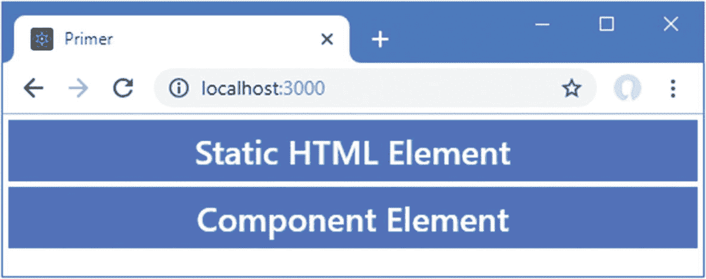

图 3-1

运行示例应用

## 理解 HTML 和 DOM 元素

所有 React web 应用的核心都是 HTML 元素，用于描述将呈现给用户的内容。在 React 应用中，`public`文件夹中静态`index.html`文件的内容与 React 动态创建的 HTML 元素相结合，生成一个浏览器显示给用户的 HTML 文档。

HTML 元素告诉浏览器 HTML 文档的每个部分代表什么样的内容。以下是来自`public`文件夹中的`index.html`文件的 HTML 元素:

```jsx
...
<h4 class="bg-primary text-white text-center p-2 m-1">
        Static HTML Element
</h4>
...

```

如图 [3-2](#Fig2) 所示，这个元素有几个部分:开始标签、结束标签、属性和内容。

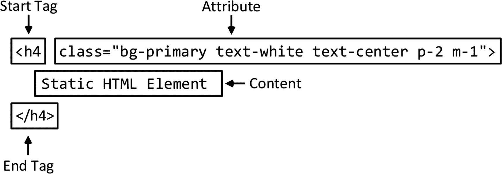

图 3-2

HTML 元素的剖析

这个元素的*名称*(也称为*标签名称*或者仅仅是*标签*)是`h4`，它告诉浏览器标签之间的内容应该被当作一个头。有一系列的头元素，从`h1`到`h6`，其中`h1`通常用于最重要的内容，`h2`用于稍微不太重要的内容，等等。

定义 HTML 元素时，首先将标记名放在尖括号中(`<`和`>`字符)，然后以类似的方式使用标记结束元素，除了在左尖括号(`<`)后添加一个`/`字符，以创建*开始标记*和*结束标记*。

标签表明元素的用途，HTML 规范定义了大量的元素类型。在表 [3-1](#Tab1) 中，我描述了我在本书中最常用的元素。要获得标签类型的完整列表，您应该查阅 HTML 规范。

表 3-1

示例中使用的常见 HTML 元素

<colgroup><col class="tcol1 align-left"> <col class="tcol2 align-left"></colgroup> 
| 

元素

 | 

描述

 |
| --- | --- |
| `a` | 一个链接(更正式的说法是锚点)，用户单击它可以导航到当前文档中的新 URL 或新位置 |
| `button` | 一个按钮，用户可以点击它来启动一个动作 |
| `div` | 通用元素；通常用于为文档添加结构，以用于演示目的 |
| `h1 to h6` | 头球 |
| `input` | 用于从用户处收集单个数据项的字段 |
| `table` | 表格，用于将内容组织成行和列 |
| `tbody` | 表格的正文(与页眉或页脚相对) |
| `td` | 表格行中的内容单元格 |
| `th` | 表格行中的标题单元格 |
| `thead` | 表格的标题 |
| `tr` | 表格中的一行 |

### 了解元素内容

出现在开始和结束标签之间的就是元素的内容。一个元素可以包含文本(比如本例中的`Static HTML Element`)或其他 HTML 元素。在清单 [3-7](#PC8) 中，我添加了一个包含另一个元素的新 HTML 元素。

```jsx
<!DOCTYPE html>
<html lang="en">
  <head>
    <meta charset="utf-8" />
    <title>Primer</title>
  </head>
  <body>
    <h4 class="bg-primary text-white text-center p-2 m-1">
        Static HTML Element
    </h4>
    <div class="text-center m-2">
      <div>This is a span element</div>
      <div>This is another span element</div>
    </div>
    <div id="domParent"></div>
    <div id="root"></div>
  </body>
</html>

Listing 3-7Adding a New Element in the index.html File in the public Folder

```

外部元素被称为*父元素*，而它包含的元素被称为*子元素*。清单 [3-7](#PC8) 中的附加内容定义了一个父`div`元素，它有两个子元素，也是`div`元素。每个子`div`元素的内容是一条文本消息，产生如图 [3-3](#Fig3) 所示的结果。能够创建元素的层次结构是 HTML 的一个基本特性。它是 React 应用的关键构建块之一，允许创建复杂的内容。

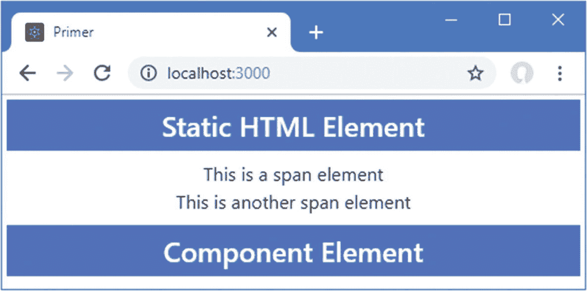

图 3-3

添加父元素和子元素

#### 了解元素内容限制

有些元素对可以成为其子元素的元素类型有限制。示例中的`div`元素可以包含任何其他元素，并用于向 HTML 文档添加结构，通常这样可以很容易地对内容进行样式化。其他元素具有更具体的角色，需要将特定类型的元素用作子元素。例如，一个`tbody`元素，你将在后面的章节中看到，它代表一个表格的主体，可以只包含一个或多个`tr`元素，每个元素代表一个表格行。

### 小费

不要担心学习所有的 HTML 元素和它们之间的关系。当你按照后面章节中的例子学习时，你会学到你需要知道的一切，如果你试图创建无效的 HTML，大多数代码编辑器会显示一个警告。

#### 了解空元素

有些元素根本不允许包含任何内容。这些被称为 *void* 或*自闭*元素，它们没有单独的结束标记，就像这样:

```jsx
...
<input />
...

```

在单个标记中定义了一个 void 元素，并在最后一个尖括号(`>`字符)前添加了一个`/`字符。这里显示的元素是 void 元素最常见的例子，它用于在 HTML 表单中收集来自用户的数据。在后面的章节中，你会看到很多关于 void 元素的例子。

### 了解属性

通过向元素添加*属性*，可以向浏览器提供额外的信息。下面是应用于图 [3-2](#Fig2) 中所示的`h4`元素的属性:

```jsx
...
<h4 class="bg-primary text-white text-center p-2 m-1">
        Static HTML Element
</h4>
...

```

属性总是被定义为开始标签的一部分，并且大多数属性都有一个名称和一个值，用等号分隔，如图 [3-4](#Fig4) 所示。

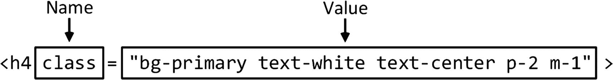

图 3-4

属性的名称和值

该属性的名称是`class`，用于对相关元素进行分组，这样它们的外观就可以得到一致的管理。这就是为什么在这个例子中使用了`class`属性，属性值将`h4`元素与许多类相关联，这些类与引导 CSS 包提供的样式相关，我将在本章的后面描述。

### 动态创建 HTML 元素

在`index.html`文件中定义的 HTML 元素是静态的。浏览器接收并显示这些元素，就像它们被定义一样，您可以通过在浏览器窗口中单击鼠标右键并从弹出菜单中选择“检查”或“检查元素”来查看它们。F12 开发人员工具将打开并显示 HTML 文档的内容，其中包括以下元素:

```jsx
...
<h4 class="bg-primary text-white text-center p-2 m-1">
    Static HTML Element
</h4>
...

```

HTML 元素也可以使用 JavaScript 和所有现代浏览器都支持的域对象模型(DOM) API 来动态创建。在清单 [3-8](#PC12) 中，我向`index.html`文件添加了一些 JavaScript，该文件使用 DOM API 向 HTML 文档添加新元素。

```jsx
<!DOCTYPE html>
<html lang="en">
  <head>
    <meta charset="utf-8" />
    <title>Primer</title>
  </head>
  <body>
    <h4 class="bg-primary text-white text-center p-2 m-1">
        Static HTML Element
    </h4>
    <div class="text-center m-2">
      <div>This is a span element</div>
      <div>This is another span element</div>
    </div>
    <div id="domParent"></div>
    <div id="root"></div>
    <script>
      let element =  document.createElement("h4")
      element.className = "bg-primary text-white text-center p-2 m-1";
      element.textContent = "DOM API HTML Element";
      document.getElementById("domParent").appendChild(element);
    </script>
  </body>
</html>

Listing 3-8Creating an Element Dynamically in the index.html File in the public Folder

```

`script`元素表示一段 JavaScript 代码，浏览器在处理`index.html`文件的内容时会执行这段代码，并创建一个新的 HTML 元素，如图 [3-5](#Fig5) 所示。

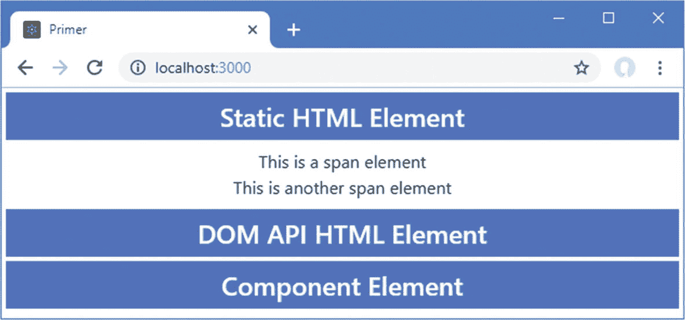

图 3-5

使用 DOM API 创建元素

清单 [3-8](#PC12) 中的第一个 JavaScript 语句创建了一个新的`h4`元素。

```jsx
...
let element =  document.createElement("h4")
...

```

`document`对象代表浏览器正在显示的 HTML 文档，而`createElement`方法返回一个代表新 HTML 元素的对象。DOM API 提供的表示新 HTML 元素的对象具有与定义静态 HTML 时使用的属性相对应的属性。清单 [3-8](#PC12) 中的第二个 JavaScript 语句使用了对应于`class`属性的属性。

```jsx
...
element.className = "bg-primary text-white text-center p-2 m-1";
...

```

元素对象定义的大多数属性都与它们对应的属性同名。也有一些例外，包括`className`，使用它是因为`class`关键字在很多编程语言中都是保留的，包括 JavaScript。

其余的 JavaScript 语句设置 HTML 元素的文本内容，并将其添加到 HTML 文档中，以便由浏览器显示。如果您通过在浏览器窗口中右键单击并从弹出菜单中选择 Inspect 来检查新元素，您将会看到由清单 [3-8](#PC12) 中的 JavaScript 语句创建的对象已经像来自`index.html`文件的静态元素一样被表示。

```jsx
...
<h4 class="bg-primary text-white text-center p-2 m-1">DOM API HTML Element</h4>
...

```

值得强调的是，`index.html`文件不包含这个 HTML 元素。相反，它包含一系列 JavaScript 语句，指示浏览器创建元素并将其添加到呈现给用户的内容中。

### 使用 React 组件动态创建元素

如果您检查`App.js`文件的内容，您会看到`App`组件的`render`方法结合了前面章节中静态和动态 HTML 元素的一些方面:

```jsx
...
import React, { Component } from "react";

export default class App extends Component {
    render = () =>
        <h4 className="bg-primary text-white text-center p-2 m-1">
            Component Element
        </h4>
}
...

```

React 使用 DOM API 创建由`render`方法指定的 HTML 元素，这是通过创建一个通过其属性配置的对象来实现的。用于 React 开发的 JSX 格式允许以声明方式定义 HTML 元素，但当文件被开发工具处理时，结果仍然是 JavaScript，这就是为什么在`App`呈现方法中使用`className`而不是`class`来配置`h4`元素。JSX 让元素看起来像是使用属性配置的，但它们只是为属性指定值的手段，这也是为什么术语 *prop* 在 React 开发中如此频繁使用的原因。

### 注意

使用 JSX 不需要特殊的步骤，它由`create-react-app`包添加到项目中的工具支持。我会在第 9 章中解释使用 JSX 定义的元素是如何转换成 JavaScript 的。

## 在 React 元素中使用表达式

使用表达式配置元素的能力是 React 和 JSX 的关键特性之一。表达式用花括号表示(`{`和`}`字符)，结果被插入到组件生成的内容中。在清单 [3-9](#PC17) 中，我使用了一个表达式来设置由`App`组件呈现的`h4`元素的内容。

```jsx
import React, { Component } from "react";

const message = "This is a constant"

export default class App extends Component {

    render = () =>
        <h4 className="bg-primary text-white text-center p-2 m-1">
            { message }
        </h4>
}

Listing 3-9Using an Expression in the App.js File in the src Folder

```

我定义了一个名为`message`的常量，并使用一个表达式将`message`值作为`h4`元素的内容。为了简化这个例子，我从`index.html`文件中注释掉了静态 HTML 元素和 DOM API 代码，如清单 [3-10](#PC18) 所示。

```jsx
<!DOCTYPE html>
<html lang="en">
  <head>
    <meta charset="utf-8" />
    <title>Primer</title>
  </head>
  <body>
    <!-- <h4 class="bg-primary text-white text-center p-2 m-1">
        Static HTML Element
    </h4>
    <div class="text-center m-2">
      <div>This is a span element</div>
      <div>This is another span element</div>
    </div>
    <div id="domParent"></div> -->
    <div id="root"></div>
    <!-- <script>
      let element =  document.createElement("h4")
      element.className = "bg-primary text-white text-center p-2 m-1";
      element.textContent = "DOM API HTML Element";
      document.getElementById("domParent").appendChild(element);
    </script> -->
  </body>
</html>

Listing 3-10Removing Elements in the index.html File in the public Folder

```

保存修改，你会看到清单 [3-9](#PC17) 中定义的常量的值显示在`App`组件产生的`h4`元素中，如图 [3-6](#Fig6) 所示。

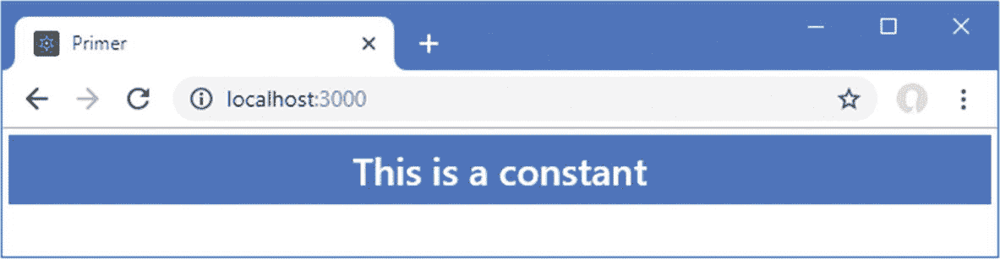

图 3-6

使用表达式设置元素的内容

### 混合表达式和静态内容

表达式可以与静态值结合来创建更复杂的结果，如清单 [3-11](#PC19) 所示，它使用一个表达式来设置`h4`元素的部分内容。

```jsx
import React, { Component } from "react";

const count = 4

export default class App extends Component {

    render = () =>
        <h4 className="bg-primary text-white text-center p-2 m-1">
            Number of things: { count }
        </h4>
}

Listing 3-11Mixing an Expression with Static Content in the App.js File in the src Folder

```

表达式将`count`值包含在`h4`元素的内容中，该值与静态内容相结合，产生如图 [3-7](#Fig7) 所示的结果。

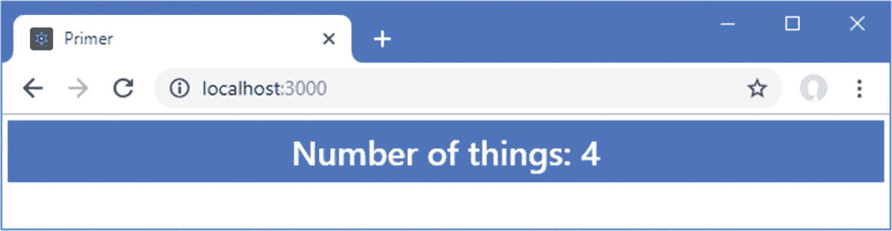

图 3-7

混合表达式和静态内容

### 在表达式中执行计算

表达式不仅可以将值注入到组件呈现的内容中，还可以用于任何计算，如清单 [3-12](#PC20) 所示。

```jsx
import React, { Component } from "react";

const count = 4

export default class App extends Component {

    render = () =>
        <h4 className="bg-primary text-white text-center p-2 m-1">
            Number of things: { count % 2 === 0 ? "Even" : "Odd" }
        </h4>
}

Listing 3-12Performing a Computation in the App.js File in the src Folder

```

该示例使用三元运算符来确定`count`值是奇数还是偶数，并产生如图 [3-8](#Fig8) 所示的结果。

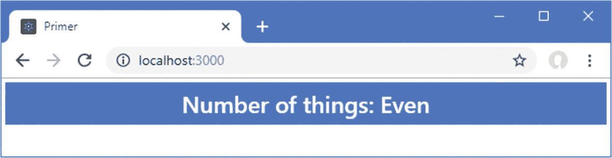

图 3-8

在表达式中执行计算

表达式非常适合简单的操作，但是试图在表达式中包含太多代码会导致令人困惑的组件。对于更复杂的操作，函数应该由表达式定义和调用，以便函数结果被合并到组件产生的内容中，如清单 [3-13](#PC21) 所示。

```jsx
import React, { Component } from "react";

const count = 4

function isEven() {

    return count % 2 === 0 ? "Even" : "Odd";

}

export default class App extends Component {

    render = () =>
        <h4 className="bg-primary text-white text-center p-2 m-1">
            Number of things: { isEven() }
        </h4>
}

Listing 3-13Defining a Function in the App.js File in the src Folder

```

当您在表达式中使用函数时，您必须用圆括号(`(`和`)`字符)调用它，如清单所示，这样函数的结果就包含在组件生成的内容中。

### 访问组件属性和方法

需要关键字`this`来指定组件定义的属性和方法，如清单 [3-14](#PC22) 所示。正如我在第 2 部分中解释的，创建组件有不同的方法，但是我在本书中使用的技术如清单所示，它提供了最广泛的特性，适合大多数项目。

```jsx
import React, { Component } from "react";

export default class App extends Component {

    constructor(props) {
        super(props);
        this.state = {
            count: 4
        }
    }

    isEven() {
        return this.state.count % 2 === 0 ? "Even" : "Odd";
    }

    render = () =>
        <h4 className="bg-primary text-white text-center p-2 m-1">
            Number of things: { this.isEven() }
        </h4>
}

Listing 3-14Using the this Keyword in an Expression in the App.js File in the src Folder

```

这个清单中的组件定义了一个构造函数，正如我在第 [4](04.html) 章中解释的，这就是组件初始状态的配置方式。构造函数给`state`属性分配一个对象，其`count`值为`4`。该组件还定义了一个名为`isEven`的方法，该方法以`this.state.count`的形式访问`count`值。`this`关键字指的是组件实例，如第 [4](04.html) 章所述；`state`是指在构造函数中创建的状态属性；并且`count`选择在计算中使用的值。这个`this`关键字也用于调用表达式中的`isEven`方法。结果与前面的清单相同。一些方法需要参数，这些参数可以被指定为表达式的一部分，如清单 [3-15](#PC23) 所示。

```jsx
import React, { Component } from "react";

export default class App extends Component {

    constructor(props) {
        super(props);
        this.state = {
            count: 4
        }
    }

    isEven(val) {
        return val % 2 === 0 ? "Even" : "Odd";
    }

    render = () =>
        <h4 className="bg-primary text-white text-center p-2 m-1">
            Number of things: { this.isEven(this.state.count) }
        </h4>
}

Listing 3-15Passing an Argument to a Method in the App.js File in the src Folder

```

本例中的表达式调用`isEven`方法，使用`count`值作为参数。结果与前面的清单相同。

### 使用表达式设置属性值

表达式还可以用来设置 props 的值，这允许配置 HTML 元素和子组件。在清单 [3-16](#PC24) 中，我为`App`组件添加了一个方法，其结果用于设置`h4`元素的`className`属性。

```jsx
import React, { Component } from "react";

export default class App extends Component {

    constructor(props) {
        super(props);
        this.state = {
            count: 4
        }
    }

    isEven(val) {
        return val % 2 === 0 ? "Even" : "Odd";
    }

    getClassName(val) {
        return val % 2 === 0
            ? "bg-primary text-white text-center p-2 m-1"
            : "bg-secondary text-white text-center p-2 m-1"
    }

    render = () =>
        <h4 className={this.getClassName(this.state.count)}>
            Number of things: { this.isEven(this.state.count) }
        </h4>
}

Listing 3-16Setting a Prop Value in the App.js File in the src Folder

```

结果与前面的清单相同。

### 使用表达式处理事件

表达式用于告诉 React 当事件被元素触发时如何响应事件。在清单 [3-17](#PC25) 中，我为`App`组件返回的内容添加了一个按钮，并使用`onClick`属性告诉 React 当`click`事件被触发时如何响应。

```jsx
import React, { Component } from "react";

export default class App extends Component {

    constructor(props) {
        super(props);
        this.state = {
            count: 4
        }
    }

    isEven(val) {
        return val % 2 === 0 ? "Even" : "Odd";
    }

    getClassName(val) {
        return val % 2 === 0
            ? "bg-primary text-white text-center p-2 m-1"
            : "bg-secondary text-white text-center p-2 m-1"
    }

    handleClick = () => this.setState({ count: this.state.count + 1});

    render = () =>
        <h4 className={this.getClassName(this.state.count)}>
            <button className="btn btn-info m-2" onClick={ this.handleClick }>
                Click Me
            </button>
            Number of things: { this.isEven(this.state.count) }
        </h4>
}

Listing 3-17Handling an Event in the App.js File in the src Folder

```

使用`onClick`属性配置`button`元素，它告诉 React 调用`handleClick`方法来响应`click`事件。注意，该方法不是用括号指定的。另外，请注意，`handleClick`方法是使用粗箭头语法定义的；正如我在第 [12](12.html) 章中解释的，处理事件是定义方法的方式很重要的少数情况之一。点击按钮更新`count`属性的值，这将改变`render`方法中其他表达式的结果，产生如图 [3-9](#Fig9) 所示的效果。

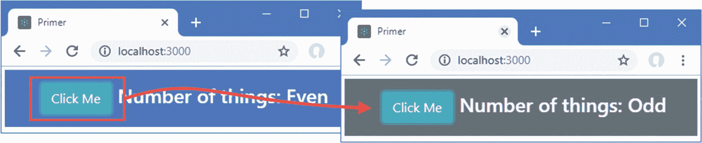

图 3-9

处理事件

## 了解引导程序

HTML 元素告诉浏览器它们代表什么样的内容，但是它们不提供任何关于内容应该如何显示的信息。关于如何显示元素的信息是使用*级联样式表* (CSS)提供的。CSS 由一组全面的*属性*和一组*选择器*组成，前者可用于配置元素外观的各个方面，后者允许应用这些属性。

CSS 的一个主要问题是，一些浏览器对属性的解释略有不同，这可能导致 HTML 内容在不同设备上的显示方式有所不同。跟踪和纠正这些问题可能很困难，CSS 框架已经出现，以帮助 web 应用开发人员以简单和一致的方式设计他们的 HTML 内容。

最流行的 CSS 框架是 Bootstrap，它最初是在 Twitter 上开发的，但已经成为一个广泛使用的开源项目。Bootstrap 由一组 CSS 类和一些可选的 JavaScript 代码组成，这些 CSS 类可以应用于元素以保持一致的样式，这些可选的 JavaScript 代码执行额外的增强功能(但我在本书中没有用到)。我在自己的项目中使用 Bootstrap 它跨浏览器运行良好，并且使用简单。我在本书中使用了 Bootstrap CSS 样式，因为它们让我不必在每一章中定义和列出我自己的定制 CSS 就可以设计我的例子。Bootstrap 提供了比我在本书中使用的更多的特性；详见 [`http://getbootstrap.com`](http://getbootstrap.com) 。

关于 Bootstrap，我不想说得太详细，因为这不是本书的主题，但是我想给你足够的信息，这样你就可以知道例子的哪些部分是 React 特性，哪些与 Bootstrap 相关。

### 应用基本引导类

引导样式是通过`className`属性应用的，它是`class`属性的对应属性，用于对相关元素进行分组。`className`属性不仅用于应用 CSS 样式，而且是最常见的用途，它支撑着 Bootstrap 和类似框架的运行方式。下面是一个带有`classNae`属性的 HTML 元素，取自清单 [3-9](#PC17) :

```jsx
...
<h4 className="bg-primary text-white text-center p-2 m-1">
    { message }
</h4>
...

```

`className` prop 将`h4`元素分配给五个类，它们的名称由空格分隔:`bg-primary`、`text-white`、`text-center`、`p-2`和`m-1`。这些类对应于 Bootstrap 定义的样式集合，如表 [3-2](#Tab2) 所述。

表 3-2

h4 元素类

<colgroup><col class="tcol1 align-left"> <col class="tcol2 align-left"></colgroup> 
| 

名字

 | 

描述

 |
| --- | --- |
| `bg-primary` | 该类应用样式上下文来提供关于元素用途的视觉提示。请参见“使用上下文类”一节。 |
| `text-white` | 这个类应用一种样式，将元素内容的文本颜色设置为白色。 |
| `text-center` | 这个类应用一种水平居中元素内容的样式。 |
| `p-2` | 该类应用一种样式，在元素内容周围增加间距，如“使用边距和填充”一节所述。 |
| `m-1` | 这个类应用一种样式，在元素周围增加间距，如“使用边距和填充”一节所述。 |

#### 使用上下文类

使用像 Bootstrap 这样的 CSS 框架的主要优点之一是简化了在整个应用中创建一致主题的过程。Bootstrap 定义了一组*样式上下文*，用于一致地设计相关元素的样式。这些上下文在表 [3-3](#Tab3) 中描述，用于将引导样式应用于元素的类的名称中。

表 3-3

自举风格的上下文

<colgroup><col class="tcol1 align-left"> <col class="tcol2 align-left"></colgroup> 
| 

名字

 | 

描述

 |
| --- | --- |
| `primary` | 表示主要动作或内容区域 |
| `secondary` | 指明内容的支持领域 |
| `success` | 表示成功的结果 |
| `info` | 显示附加信息 |
| `warning` | 显示警告 |
| `danger` | 提出严重警告 |
| `muted` | 不强调内容 |
| `dark` | 通过使用深色来增加对比度 |
| `white` | 通过使用白色增加对比度 |

Bootstrap 提供了允许样式上下文应用于不同类型元素的类。我在开始本节时使用的`h4`元素已经被添加到了`bg-primary`类中，它设置了元素的背景颜色，以表明它与应用的主要目的相关。其他类特定于某一组元素，例如`btn-primary`，它用于配置`button`和`a`元素，使它们显示为按钮，其颜色与主上下文中的其他元素一致。其中一些上下文类必须与配置元素基本样式的其他类结合使用，比如与`btn-primary`类结合使用的`btn`类。

#### 使用边距和填充

Bootstrap 包括一组实用程序类，用于添加*填充*，即元素边缘与其内容之间的空间，以及*边距*，即元素边缘与其周围元素之间的空间。使用这些类的好处是它们在整个应用中应用一致的间距。

这些类的名称遵循一种定义良好的模式。下面是清单 [3-9](#PC17) 中的`h4`元素:

```jsx
...
<h4 className="bg-primary text-white text-center p-2 m-1">
    { message }
...

```

将边距和填充应用于元素的类遵循一个定义良好的命名模式:首先是字母`m`(用于边距)或`p`(用于填充)，接着是一个可选的字母，用于选择特定的边缘(`t`用于顶部、`b`用于底部、`l`用于左侧、或`r`用于右侧)，然后是一个连字符，最后是一个数字，用于指示应该应用多少空间(`0`用于无间距，或`1`、`2`、`3`、`4`或`5`用于增加数量)。如果没有字母来指定边缘，则边距或填充将应用于所有边缘。为了帮助将这个模式放在上下文中，添加了`h4`元素的`p-2`类将填充级别 2 应用于元素的所有边缘。

### 使用引导程序创建网格

Bootstrap 提供了样式类，可以用来创建不同种类的网格布局，从一列到十二列不等。我在本书的许多例子中使用了网格布局，并且在清单 [3-18](#PC28) 中创建了一个简单的网格布局。

```jsx
import React, { Component } from "react";

export default class App extends Component {

    constructor(props) {
        super(props);
        this.state = {
            count: 4
        }
    }

    isEven(val) {
        return val % 2 === 0 ? "Even" : "Odd";
    }

    getClassName(val) {
        return val % 2 === 0
            ? "bg-primary text-white text-center p-2 m-1"
            : "bg-secondary text-white text-center p-2 m-1"
    }

    handleClick = () => this.setState({ count: this.state.count + 1});

    render = () =>
        <div className="container-fluid p-4">
            <div className="row bg-info text-white p-2">
                <div className="col font-weight-bold">Value</div>
                <div className="col-6 font-weight-bold">Even?</div>
            </div>
            <div className="row bg-light p-2 border">
                <div className="col">{ this.state.count }</div>
                <div className="col-6">{ this.isEven( this.state.count) }</div>
            </div>
            <div className="row">
                <div className="col">
                    <button className="btn btn-info m-2"
                            onClick={ this.handleClick }>
                        Click Me
                    </button>
                </div>
            </div>
        </div>
}

Listing 3-18Creating a Grid in the App.js File in the src Folder

```

自举网格布局系统易于使用。一个顶级的`div`元素被分配给`container`类(或者是`container-fluid`类，如果你想让它跨越可用空间的话)。通过将`row`类应用到`div`元素来指定列，这具有为`div`元素包含的内容设置网格布局的效果。

每行定义 12 列，您可以通过指定一个名为`col-`后跟列数的类来指定每个子元素将占用多少列。例如，类`col-1`指定一个元素占据一列，`col-2`指定两列，依此类推，直到`col-12`，它指定一个元素填充整个行。如果您省略了列数，而只是将一个元素分配给了`col`类，那么 Bootstrap 将分配等量的剩余列。清单 [3-18](#PC28) 中的网格产生如图 [3-10](#Fig10) 所示的布局。

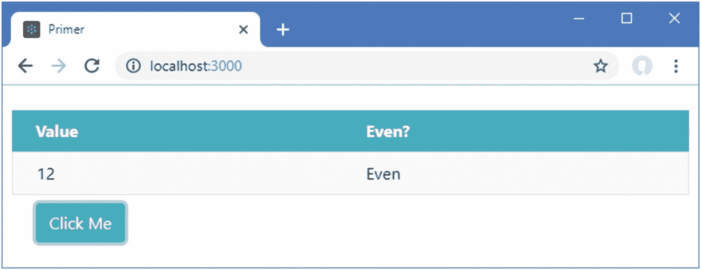

图 3-10

使用网格布局

### 使用引导程序设计表格

Bootstrap 包括对样式化`table`元素及其内容的支持，这是我在后面章节的一些例子中使用的一个特性。表 [3-4](#Tab4) 列出了使用表的关键引导类。

表 3-4

表格的引导 CSS 类

<colgroup><col class="tcol1 align-left"> <col class="tcol2 align-left"></colgroup> 
| 

名字

 | 

描述

 |
| --- | --- |
| `table` | 对一个`table`元素及其行应用常规样式 |
| `table-striped` | 对`table`正文中的行应用隔行条带化 |
| `table-bordered` | 将边框应用于所有行和列 |
| `table-sm` | 减少表格中的间距以创建更紧凑的布局 |

所有这些类都直接应用于`table`元素，如清单 [3-19](#PC29) 所示，其中我用表格替换了网格布局。

```jsx
import React, { Component } from "react";

export default class App extends Component {

    constructor(props) {
        super(props);
        this.state = {
            count: 4
        }
    }

    isEven(val) {
        return val % 2 === 0 ? "Even" : "Odd";
    }

    getClassName(val) {
        return val % 2 === 0
            ? "bg-primary text-white text-center p-2 m-1"
            : "bg-secondary text-white text-center p-2 m-1"
    }

    handleClick = () => this.setState({ count: this.state.count + 1});

    render = () =>
        <table className="table table-striped table-bordered table-sm">
            <thead  className="bg-info text-white">
                <tr><th>Value</th><th>Even?</th></tr>
            </thead>
            <tbody>
                <tr>
                    <td>{ this.state.count }</td>
                    <td>{ this.isEven(this.state.count) } </td>
                </tr>
            </tbody>
            <tfoot className="text-center">
                <tr>
                    <td colSpan="2">
                        <button className="btn btn-info m-2"
                                onClick={ this.handleClick }>
                            Click Me
                        </button>
                    </td>
                </tr>
            </tfoot>
        </table>
}

Listing 3-19Using a Table Layout in the App.js File in the src Folder

```

### 小费

注意，在定义清单 [3-19](#PC29) 中的表格时，我使用了`thead`元素。如果一个`tbody`元素没有被使用，浏览器会自动添加任何`tr`元素，这些元素是`table`元素的直接后代。如果在使用 Bootstrap 时依赖于这种行为，您将会得到奇怪的结果，并且在定义表时使用完整的元素集总是一个好主意。

图 [3-11](#Fig11) 显示了用表格代替网格的结果。

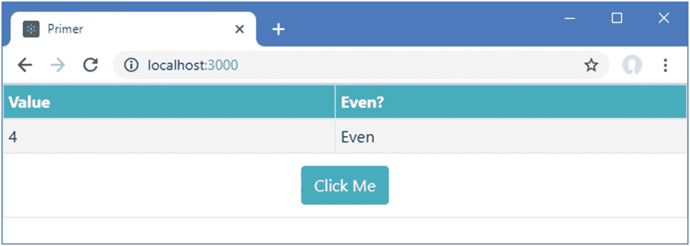

图 3-11

设计表格

### 使用引导程序设计表单

Bootstrap 包括表单元素的样式，允许它们与应用中的其他元素保持一致。在清单 [3-20](#PC30) 中，我向由`App`组件产生的内容添加了表单元素。

```jsx
import React, { Component } from "react";

export default class App extends Component {

    render = () =>
        <div className="m-2">
            <div className="form-group">
                <label>Name:</label>
                <input className="form-control" />
            </div>
            <div className="form-group">
                <label>City:</label>
                <input className="form-control" />
            </div>
        </div>
}

Listing 3-20Adding Form Elements in the App.js File in the src Folder

```

表单的基本样式是通过将`form-group`类应用于包含`label`和`input`元素的`div`元素来实现的，其中`input`元素被分配给`form-control`类。Bootstrap 对元素进行样式化，使`label`显示在`input`元素上方，而`input`元素占据 100%的可用水平空间，如图 [3-12](#Fig12) 所示。

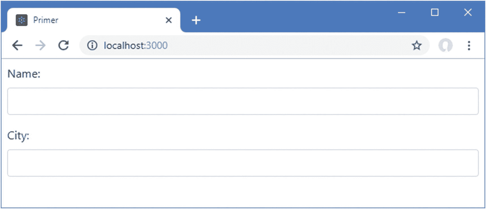

图 3-12

样式表单元素

## 摘要

在这一章中，我提供了 HTML 的简要概述，并解释了它如何在 React 开发中与 JavaScript 代码混合，尽管有一些变化和限制。我还介绍了 Bootstrap CSS 框架，我在本书中一直使用它，但它与 React 没有直接关系。您需要很好地掌握 HTML 和 CSS，以便在 web 应用开发中真正有效，但最好的学习方法是通过第一手经验，本章中的描述和示例将足以让您入门，并为前面的示例提供足够的背景信息。在下一章，我将继续初级主题，介绍本书中使用的最重要的 JavaScript 特性。