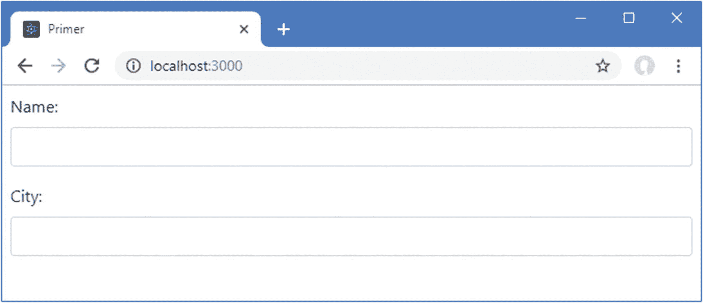
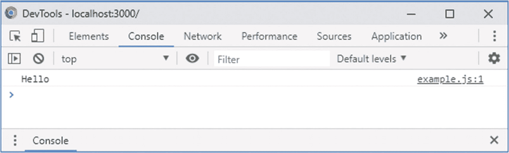
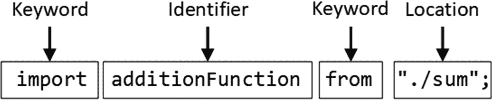

# 四、JavaScript 优先

在这一章中，我快速浏览了 JavaScript 语言应用于 React 开发的最重要的特性。我没有足够的空间来完整地描述 JavaScript，所以我把重点放在了你需要快速掌握并遵循本书中的例子的要点上。

近年来，JavaScript 已经现代化，增加了方便的语言特性，并对常见任务(如数组处理)可用的实用函数进行了大量扩展。并非所有的浏览器都支持最新的特性，因此 React 开发工具包括 Babel 包，它负责将使用最新特性编写的 JavaScript 转换成可以在大多数主流浏览器中工作的代码。这意味着您可以享受现代开发体验，而无需关注处理浏览器之间的差异和跟踪每个浏览器支持的功能。表 [4-1](#Tab1) 总结了本章内容。

表 4-1

章节总结

<colgroup><col class="tcol1 align-left"> <col class="tcol2 align-left"> <col class="tcol3 align-left"></colgroup> 
| 

问题

 | 

解决办法

 | 

列表

 |
| --- | --- | --- |
| 提供将由浏览器执行的指令 | 使用 JavaScript 语句 | four |
| 将语句的执行延迟到需要的时候 | 使用 JavaScript 函数 | 5–7, 10–12 |
| 定义参数数量可变的函数 | 使用默认和 rest 参数 | 8, 9 |
| 简洁地表达功能 | 使用粗箭头功能 | Thirteen |
| 定义变量和常数 | 使用`let`和`const`关键字 | 14, 15 |
| 使用 JavaScript 基本类型 | 使用`string`、`number`或`boolean`关键字 | 16, 17, 19 |
| 定义包含其他值的字符串 | 使用模板字符串 | Eighteen |
| 有条件地执行语句 | 使用`if`、`else`和`switch`关键字 | Twenty |
| 比较价值观和身份 | 使用等式和标识运算符 | 21, 22 |
| 转换类型 | 使用类型转换关键字 | 23–25 |
| 分组相关项目 | 定义一个数组 | 26, 27 |
| 读取或更改数组中的值 | 使用索引访问器符号 | 28, 29 |
| 枚举数组的内容 | 使用`for`循环或`forEach`方法 | Thirty |
| 展开数组的内容 | 使用扩展运算符 | 31, 32 |
| 处理数组的内容 | 使用内置数组方法 | Thirty-three |
| 将相关值收集到一个单元中 | 使用文本或类定义对象 | 34–36, 40 |
| 定义可以对对象的值执行的操作 | 定义一种方法 | 37, 39, 43, 44 |
| 将属性和值从一个对象复制到另一个对象 | 使用`Object.assign`方法或使用扩展运算符 | 41, 42 |
| 群组相关功能 | 定义一个 JavaScript 模块 | 45–54 |
| 观察异步操作 | 定义一个`Promise`并使用`async`和`await`关键字 | 55–58 |

## 为本章做准备

在这一章中，我继续使用在第三章中创建的`primer`项目。为了准备本章，我在`src`文件夹中添加了一个名为`example.js`的文件，并添加了清单 [4-1](#PC1) 中所示的代码。

### 小费

你可以从 [`https://github.com/Apress/pro-react-16`](https://github.com/Apress/pro-react-16) 下载本章以及本书其他章节的示例项目。

```jsx
console.log("Hello");

Listing 4-1The Contents of the example.js File in the src Folder

```

为了将`example.js`文件合并到应用中，我将清单 [4-2](#PC2) 中所示的语句添加到了`src`文件夹中的`index.js`文件中。

```jsx
import React from 'react';
import ReactDOM from 'react-dom';
import './index.css';
import App from './App';
import * as serviceWorker from './serviceWorker';
import 'bootstrap/dist/css/bootstrap.css';

import "./example";

ReactDOM.render(<App />, document.getElementById('root'));

// If you want your app to work offline and load faster, you can change
// unregister() to register() below. Note this comes with some pitfalls.
// Learn more about service workers: http://bit.ly/CRA-PWA
serviceWorker.unregister();

Listing 4-2Importing a File in the index.js File in the src Folder

```

打开命令提示符，导航到`primer`文件夹，运行清单 [4-3](#PC3) 中所示的命令来启动 React 开发工具。

```jsx
npm start

Listing 4-3Starting the Development Tools

```

项目的初始准备需要一段时间，之后将打开一个新的浏览器窗口或选项卡并导航到`http://localhost:3000`，显示如图 [4-1](#Fig1) 所示的内容。



图 4-1

运行示例应用

打开浏览器的 F12 开发工具，这通常可以通过按键盘上的 F12 或在浏览器窗口中右键单击并从弹出菜单中选择 Inspect 来完成。检查控制台选项卡，您会看到清单 [4-1](#PC1) 中的`example.js`文件中的语句产生了一个简单的结果，如图 [4-2](#Fig2) 所示。



图 4-2

浏览器控制台中的结果

本章中的所有示例都会产生文本输出，因此我将只使用文本，而不是显示控制台选项卡的屏幕截图，如下所示:

```jsx
Hello

```

## 使用语句

基本的 JavaScript 构建块是*语句*。每条语句代表一条命令，语句通常以分号(`;`)结束。分号是可选的，但是使用分号会使代码更容易阅读，并且允许在一行中有多个语句。在清单 [4-4](#PC5) 中，我向 JavaScript 文件添加了语句。

```jsx
console.log("Hello");

console.log("Apples");

console.log("This is a statement");

console.log("This is also a statement");

Listing 4-4Adding JavaScript Statements in the example.js File in the src Folder

```

浏览器依次执行每条语句。在本例中，所有语句都只是将消息写入控制台。结果如下:

```jsx
Hello
Apples
This is a statement
This is also a statement

```

## 定义和使用函数

当浏览器收到 JavaScript 代码时，它会按照定义的顺序执行其中包含的语句。这就是上一个示例中发生的情况。`example.js`文件中的语句被逐一执行，所有语句都向控制台写入一条消息，所有语句都是按照它们在`example.js`中定义的顺序执行的。您还可以将语句打包到一个*函数*中，直到浏览器遇到一个*调用*该函数的语句，该函数才会被执行，如清单 [4-5](#PC7) 所示。

```jsx
const myFunc = function () {
    console.log("This statement is inside the function");
};

console.log("This statement is outside the function");

myFunc();

Listing 4-5Defining a JavaScript Function in the example.js File in the src Folder

```

定义一个函数很简单:使用`const`关键字，后跟您想要给函数起的名字，再加上等号(`=`)和`function`关键字，再加上括号(`(`和`)`字符)。您希望函数包含的语句用大括号括起来(字符`{`和`}`)。

在清单中，我使用了名称`myFunc`，该函数包含一个向 JavaScript 控制台写入消息的语句。在浏览器到达另一个调用`myFunc`函数的语句之前，函数中的语句不会被执行，如下所示:

```jsx
...
myFunc();
...

```

当您保存对`example.js`文件的更改时，更新的 JavaScript 代码将被发送到浏览器，在浏览器中执行并产生以下输出:

```jsx
This statement is outside the function
This statement is inside the function

```

您可以看到函数内部的语句并没有立即执行，但是除了演示函数是如何定义的以外，这个例子并不是特别有用，因为函数是在定义后立即被调用的。当响应某种变化或事件(如用户交互)而调用函数时，函数会更有用。

您还可以定义函数，这样就不必显式地创建和分配变量，如清单 [4-6](#PC10) 所示。

```jsx
function myFunc() {

    console.log("This statement is inside the function");
}

console.log("This statement is outside the function");

myFunc();

Listing 4-6Defining a Function in the example.js File in the src Folder

```

代码的工作方式与清单 [4-5](#PC7) 相同，但对大多数开发人员来说更熟悉。这个例子产生了与清单 [4-5](#PC7) 相同的结果。

### 用参数定义函数

JavaScript 允许您为函数定义参数，如清单 [4-7](#PC11) 所示。

```jsx
function myFunc(name, weather) {
    console.log("Hello " + name + ".");
    console.log("It is " + weather + " today.");
}

myFunc("Adam", "sunny");

Listing 4-7Defining Functions with Parameters in the example.js File in the src Folder

```

我给`myFunc`函数添加了两个参数，称为`name`和`weather`。JavaScript 是一种动态类型语言，这意味着在定义函数时不必声明参数的数据类型。当我在本章后面讲述 JavaScript 变量时，我会回到动态类型。要调用带参数的函数，需要在调用函数时提供值作为参数，如下所示:

```jsx
...
myFunc("Adam", "sunny");
...

```

该清单的结果如下:

```jsx
Hello Adam.
It is sunny today.

```

#### 使用默认和 Rest 参数

调用函数时提供的参数数量不需要与函数中的参数数量相匹配。如果调用函数时使用的参数少于它拥有的参数，那么任何没有提供值的参数的值都是`undefined`，这是一个特殊的 JavaScript 值。如果调用函数时使用的参数多于实际参数，那么多余的参数将被忽略。

这样做的结果是，您不能创建两个具有相同名称和不同参数的函数，并期望 JavaScript 根据您在调用函数时提供的参数来区分它们。这被称为*多态性*，尽管它在 Java 和 C#等语言中受支持，但在 JavaScript 中不可用。相反，如果您定义了两个同名的函数，那么第二个定义将替换第一个定义。

有两种方法可以修改函数，以响应函数定义的参数数量和用于调用函数的参数数量之间的不匹配。*默认参数*处理实参比参数少的情况，允许你为没有实参的参数提供默认值，如清单 [4-8](#PC14) 所示。

```jsx
function myFunc(name, weather = "raining") {

    console.log("Hello " + name + ".");
    console.log("It is " + weather + " today.");
}

myFunc("Adam");

Listing 4-8Using a Default Parameter in the example.js File in the src Folder

```

函数中的`weather`参数已被赋予默认值`raining`，如果仅使用一个参数调用该函数，将使用该值，产生以下结果:

```jsx
Hello Adam.
It is raining today.

```

*Rest 参数*用于在用附加参数调用函数时捕获任何附加参数，如清单 [4-9](#PC16) 所示。

```jsx
function myFunc(name, weather, ...extraArgs) {

    console.log("Hello " + name + ".");
    console.log("It is " + weather + " today.");
    for (let i = 0; i < extraArgs.length; i++) {

        console.log("Extra Arg: " + extraArgs[i]);

    }

}

myFunc("Adam", "sunny", "one", "two", "three");

Listing 4-9Using a Rest Parameter in the example.js File in the src Folder

```

rest 参数必须是函数定义的最后一个参数，其名称以省略号为前缀(三个句点，`...`)。rest 参数是一个数组，任何额外的参数都将被赋给它。在清单中，该函数将每个额外的参数打印到控制台，产生以下结果:

```jsx
Hello Adam.
It is sunny today.
Extra Arg: one
Extra Arg: two
Extra Arg: three

```

### 定义返回结果的函数

您可以使用`return`关键字从函数中返回结果。清单 [4-10](#PC18) 显示了一个返回结果的函数。

```jsx
function myFunc(name) {

    return ("Hello " + name + ".");

}

console.log(myFunc("Adam"));

Listing 4-10Returning a Result from a Function in the example.js File in the src Folder

```

这个函数定义了一个参数，并用它来产生一个结果。我调用函数并将结果作为参数传递给`console.log`函数，如下所示:

```jsx
...
console.log(myFunc("Adam"));
...

```

请注意，您不必声明该函数将返回一个结果或表示结果的数据类型。该清单的结果如下:

```jsx
Hello Adam.

```

### 将函数用作其他函数的参数

JavaScript 函数可以被视为对象，这意味着您可以使用一个函数作为另一个函数的参数，如清单 [4-11](#PC21) 所示。

```jsx
function myFunc(nameFunction) {

    return ("Hello " + nameFunction() + ".");

}

console.log(myFunc(function () {

    return "Adam";

}));

Listing 4-11Using a Function as an Arguments in the example.js File in the src Folder

```

`myFunc`函数定义了一个名为`nameFunction`的参数，它调用这个参数来获取插入到它返回的字符串中的值。我将一个返回`Adam`作为参数的函数传递给`myFunc`，它产生以下输出:

```jsx
Hello Adam.

```

函数可以链接在一起，从小而容易测试的代码片段中构建更复杂的功能，如清单 [4-12](#PC23) 所示。

```jsx
function myFunc(nameFunction) {
    return ("Hello " + nameFunction() + ".");
}

function printName(nameFunction, printFunction) {

    printFunction(myFunc(nameFunction));

}

printName(function () { return "Adam" }, console.log);

Listing 4-12Chaining Functions Calls in the example.js File in the src Folder

```

此示例产生以下输出:

```jsx
Hello Adam.

```

#### 使用箭头功能

箭头函数——也称为*胖箭头函数*或*λ表达式*——是定义函数的另一种方式，通常用于定义仅用作其他函数参数的函数。清单 [4-13](#PC25) 用箭头函数替换了前一个例子中的函数。

```jsx
const myFunc = (nameFunction) => ("Hello " + nameFunction() + ".");

const printName = (nameFunction, printFunction) =>

    printFunction(myFunc(nameFunction));

printName(function () { return "Adam" }, console.log);

Listing 4-13Using Arrow Functions in the example.js File in the src Folder

```

这些函数与清单 [4-12](#PC23) 中的函数执行相同的工作。箭头函数有三个部分:输入参数、等号和大于号(“箭头”)，最后是函数结果。只有当 arrow 函数需要执行多条语句时，才需要关键字`return`和花括号。在这一章的后面有更多的箭头函数的例子，你会在整本书中看到它们的使用。

### 注意

在 React 开发中，您可以决定您更喜欢使用哪种风格的函数，您将会看到我在本书的示例中两者都使用。然而，如第 [12](12.html) 章所述，在定义响应事件的函数时必须小心。

## 使用变量和类型

`let`关键字用于声明变量，也可以在一条语句中为变量赋值——与我在前面的例子中使用的`const`关键字相反，它创建一个不可修改的常量值。

当您使用`let`或`const`时，您创建的变量或常量只能在定义它们的代码区域中被访问，这被称为变量或常量的作用域，如清单 [4-14](#PC26) 所示。

```jsx
function messageFunction(name, weather) {

    let message = "Hello, Adam";

    if (weather === "sunny") {

        let message = "It is a nice day";

        console.log(message);

    } else {

        let message = "It is " + weather + " today";

        console.log(message);

    }

    console.log(message);

}

messageFunction("Adam", "raining");

Listing 4-14Using let to Declare Variables in the example.js File in the src Folder

```

在这个例子中，有三个语句使用`let`关键字来定义一个名为`message`的变量。每个变量的范围限于定义它的代码区域，产生以下结果:

```jsx
It is raining today
Hello, Adam

```

这似乎是一个奇怪的例子，但是还有另一个关键字可以用来声明变量:`var`。`let`和`const`关键字是 JavaScript 规范中相对较新的补充，旨在解决`var`行为方式中的一些奇怪之处。清单 [4-15](#PC28) 以清单 [4-14](#PC26) 为例，将`let`替换为`var`。

### 使用 Let 和 Const

对于您不希望更改的任何值，使用`const`关键字是一个很好的实践，这样，如果试图进行任何修改，您都会收到一个错误。然而，这是我很少遵循的一种做法——一部分是因为我仍然在努力适应不使用`var`关键字，另一部分是因为我用一系列语言编写代码，并且有一些我避免的功能，因为当我从一种语言切换到另一种语言时它们会绊倒我。如果你是 JavaScript 新手，那么我建议你试着正确使用`const`和`let`，避免步我后尘。

```jsx
function messageFunction(name, weather) {
    var message = "Hello, Adam";

    if (weather === "sunny") {
        var message = "It is a nice day";

        console.log(message);
    } else {
        var message = "It is " + weather + " today";

        console.log(message);
    }
    console.log(message);
}

messageFunction("Adam", "raining");

Listing 4-15Using var to Declare Variables in the example.js File in the src Folder

```

当您保存列表中的更改时，您将看到以下结果:

```jsx
It is raining today
It is raining today

```

有些浏览器会将重复的语句显示为一行，旁边有一个数字，表示该输出发生了多少次。这意味着您可能会看到一个旁边带有数字 2 的语句，表明它出现了两次。

问题是`var`关键字创建的变量的作用域是包含函数，这意味着所有对`message`的引用都是指同一个变量。这甚至会给有经验的 JavaScript 开发人员带来意想不到的结果，这也是引入更传统的`let`关键字的原因。React 开发工具包括常见问题的警告，这就是为什么您还会在 JavaScript 控制台中看到以下消息:

```jsx
Line 4:  'message' is already defined  no-redeclare
Line 7:  'message' is already defined  no-redeclare

```

在您熟悉这些消息之前，它们可能是神秘的，了解它们的最简单方法是查阅 ESLint 包的文档，该包将一组规则应用于 JavaScript 代码，React 开发工具使用它来创建警告。规则的名称包含在警告中，产生清单 [4-15](#PC28) 警告的规则名称是 no-redeclare，在 [`https://eslint.org/docs/rules/no-redeclare`](https://eslint.org/docs/rules/no-redeclare) 中有描述。

### 使用可变闭包

如果你在另一个函数内部定义一个函数——创建*内部*和*外部*函数——那么内部函数能够访问外部函数的变量，使用一个叫做*闭包*的特性，就像这样:

```jsx
function myFunc(name) {
    let myLocalVar = "sunny";
    let innerFunction = function () {

        return ("Hello " + name + ". Today is " + myLocalVar + ".");

    }

    return innerFunction();

}

console.log(myFunc("Adam"));

```

这个例子中的内部函数能够访问外部函数的局部变量，包括它的参数。这是一个强大的特性，意味着您不必在内部函数上定义参数来传递数据值，但是需要小心，因为当使用像`counter`或`index`这样的普通变量名时，很容易得到意外的结果，您可能没有意识到您正在重用外部函数中的变量名。

### 使用基本类型

JavaScript 定义了一组基本的原语类型:`string`、`number`、`boolean`。这似乎是一个很短的列表，但是 JavaScript 设法将很多灵活性融入到这些类型中。

### 小费

我在这里简化。您可能会遇到另外三种原语。已经声明但没有赋值的变量是`undefined`，而`null`值用来表示一个变量没有值，就像其他语言一样。最后一个原语类型是`Symbol`，它是一个不可变的值，表示一个惟一的 ID，但是在编写本文时还没有广泛使用。

#### 使用布尔值

`boolean`类型有两个值:`true`和`false`。清单 [4-16](#PC32) 显示了正在使用的两个值，但是这种类型在条件语句中使用时最有用，比如一个`if`语句。这个清单没有控制台输出，尽管您会看到警告，因为变量已经定义并且没有使用。

```jsx
let firstBool = true;
let secondBool = false;

Listing 4-16Defining boolean Values in the example.js File in the src Folder

```

#### 使用字符串

您可以使用双引号或单引号字符来定义`string`值，如清单 [4-17](#PC33) 所示。

```jsx
let firstString = "This is a string";
let secondString = 'And so is this';

Listing 4-17Defining string Variables in the example.js File in the src Folder

```

您使用的引号字符必须匹配。例如，你不能用单引号开始一个字符串，然后用双引号结束。此列表没有控制台输出。JavaScript 为`string`对象提供了一组基本的属性和方法，其中最有用的在表 [4-2](#Tab2) 中有描述。

表 4-2

有用的字符串属性和方法

<colgroup><col class="tcol1 align-left"> <col class="tcol2 align-left"></colgroup> 
| 

名字

 | 

描述

 |
| --- | --- |
| `length` | 此属性返回字符串中的字符数。 |
| `charAt(index)` | 此方法返回包含指定索引处的字符的字符串。 |
| `concat(string)` | 此方法返回一个新字符串，该字符串将调用该方法的字符串和作为参数提供的字符串连接在一起。 |
| `indexOf(term, start)` | 该方法返回第一个索引，在该索引处`term`出现在字符串中，如果没有匹配，则返回-1。可选的`start`参数指定搜索的起始索引。 |
| `replace(term, newTerm)` | 该方法返回一个新字符串，其中所有的`term`实例都被替换为`newTerm`。 |
| `slice(start, end)` | 此方法返回包含起始和结束索引之间的字符的子字符串。 |
| `split(term)` | 这个方法将一个字符串分割成一个由`term`分隔的值数组。 |
| `toUpperCase()``toLowerCase()` | 这些方法返回所有字符都是大写或小写的新字符串。 |
| `trim()` | 此方法返回一个新字符串，其中所有的前导和尾随空白字符都已被删除。 |

##### 使用模板字符串

一个常见的编程任务是将静态内容与数据值结合起来，以生成可以呈现给用户的字符串。传统的方法是通过字符串连接，这是我在本章的例子中一直使用的方法，如下所示:

```jsx
...
let message = "It is " + weather + " today";
...

```

JavaScript 还支持*模板字符串*，它允许内联指定数据值，这有助于减少错误，带来更自然的开发体验。清单 [4-18](#PC35) 展示了模板字符串的使用。

```jsx
function messageFunction(weather) {
    let message = `It is ${weather} today`;
    console.log(message);
}

messageFunction("raining");

Listing 4-18Using a Template String in the example.js File in the src Folder

```

模板字符串以反斜杠(```jsx 字符)开始和结束，数据值由花括号表示，前面有一个美元符号。例如，这个字符串将变量`weather`的值合并到模板字符串中:

```
...
let message = `It is ${weather} today`;
...

```jsx

此示例产生以下输出:

```
It is raining today

```jsx

#### 使用数字

`number`类型用于表示*整数*和*浮点*(也称为*实数*)。清单 [4-19](#PC38) 提供了一个演示。

```
let daysInWeek = 7;
let pi = 3.14;
let hexValue = 0xFFFF;

Listing 4-19Defining number Values in the example.js File in the src Folder

```jsx

您不必指定使用哪种号码。您只需表达您需要的值，JavaScript 就会相应地执行。在清单中，我定义了一个整数值、一个浮点值，并在一个值前面加上了`0x`来表示一个十六进制值。

## 使用 JavaScript 运算符

JavaScript 定义了一组非常标准的操作符。我在表 [4-3](#Tab3) 中总结了最有用的。

表 4-3

有用的 JavaScript 运算符

<colgroup><col class="tcol1 align-left"> <col class="tcol2 align-left"></colgroup> 
| 

操作员

 | 

描述

 |
| --- | --- |
| `++, --` | 前或后递增和递减 |
| `+, -, *, /, %` | 加法、减法、乘法、除法、余数 |
| `<, <=, >, >=` | 小于，小于等于，大于，大于等于 |
| `==, !=` | 平等和不平等测试 |
| `===, !==` | 同一性和非同一性测试 |
| `&&, &#124;&#124;` | 逻辑 AND 和 OR (&#124;&#124;用于合并空值) |
| `=` | 分配 |
| `+` | 串并置 |
| `?:` | 三操作数条件语句 |

### 使用条件语句

许多 JavaScript 操作符与条件语句一起使用。在本书中，我倾向于使用`if/else`和`switch`语句。清单 [4-20](#PC39) 展示了两者的用法，这对大多数开发者来说都是熟悉的。

```
let name = "Adam";

if (name === "Adam") {
    console.log("Name is Adam");
} else if (name === "Jacqui") {
    console.log("Name is Jacqui");
} else {
    console.log("Name is neither Adam or Jacqui");
}

switch (name) {
    case "Adam":
        console.log("Name is Adam");
        break;
    case "Jacqui":
        console.log("Name is Jacqui");
        break;
    default:
        console.log("Name is neither Adam or Jacqui");
        break;
}

Listing 4-20Using Conditional Statements in the example.js File in the src Folder

```jsx

此示例产生以下结果:

```
Name is Adam
Name is Adam

```jsx

### 相等运算符与相同运算符

等式和等式运算符特别值得注意。相等运算符将尝试将操作数强制(转换)为相同的类型来评估相等性。这是一个方便的特性，只要你意识到它正在发生。清单 [4-21](#PC41) 展示了等式操作符的作用。

```
let firstVal = 5;
let secondVal = "5";

if (firstVal == secondVal) {
    console.log("They are the same");
} else {
    console.log("They are NOT the same");
}

Listing 4-21Using the Equality Operator in the example.js File in the src Folder

```jsx

该示例的输出如下:

```
They are the same

```jsx

JavaScript 将两个操作数转换成相同的类型，并对它们进行比较。本质上，相等运算符测试值是否相同，而不管它们的类型如何。这造成了足够的混乱，以至于您还会在 JavaScript 控制台中看到一条警告:

```
Line 4:  Expected '===' and instead saw '=='  eqeqeq

```jsx

一种更容易预测的比较方式是使用恒等运算符(`===`，三个等号，而不是两个等号)，如清单 [4-22](#PC44) 所示。

```
let firstVal = 5;
let secondVal = "5";

if (firstVal === secondVal) {

    console.log("They are the same");
} else {
    console.log("They are NOT the same");
}

Listing 4-22Using the Identity Operator in the example.js File in the src Folder

```jsx

在本例中，identity 运算符将认为这两个变量是不同的。该运算符不强制类型。结果如下:

```
They are NOT the same

```jsx

### 显式转换类型

字符串连接操作符(`+`)优先于加法操作符(还有`+`)，这意味着 JavaScript 将优先于加法连接变量。这可能会造成混乱，因为 JavaScript 也会自由地转换类型以产生结果——而不总是预期的结果，如清单 [4-23](#PC46) 所示。

```
let myData1 = 5 + 5;

let myData2 = 5 + "5";

console.log("Result 1: " + myData1);
console.log("Result 2: " + myData2);

Listing 4-23String Concatenation Operator Precedence in the example.js File in the src Folder

```jsx

这些语句会产生以下结果:

```
Result 1: 10
Result 2: 55

```jsx

第二种结果是引起混乱的那种。通过运算符优先级和过急类型转换的组合，原本应该是加法运算的操作被解释为字符串串联。为了避免这种情况，可以显式转换值的类型，以确保执行正确的操作，如以下部分所述。

#### 将数字转换为字符串

如果您正在处理多个数字变量，并希望将它们连接成字符串，那么您可以使用`toString`方法将数字转换成字符串，如清单 [4-24](#PC48) 所示。

```
let myData1 = (5).toString() + String(5);

console.log("Result: " + myData1);

Listing 4-24Using the number.toString Method in the example.js File in the src Folder

```jsx

注意，我将数值放在括号中，然后调用了`toString`方法。这是因为在调用`number`类型定义的方法之前，您必须允许 JavaScript 将文字值转换成`number`。我还展示了实现相同效果的另一种方法，即调用`String`函数，并将数值作为参数传入。这两种技术具有相同的效果，都是将一个`number`转换成一个`string`，这意味着`+`操作符用于字符串连接而不是加法。该脚本的输出如下:

```
Result: 55

```jsx

还有一些其他的方法可以让你更好地控制一个数字如何被表示成一个字符串。我在表 [4-4](#Tab4) 中简要描述了这些方法。表格中显示的所有方法都由`number`类型定义。

表 4-4

有用的数字到字符串的方法

<colgroup><col class="tcol1 align-left"> <col class="tcol2 align-left"></colgroup> 
| 

方法

 | 

描述

 |
| --- | --- |
| `toString()` | 此方法返回一个表示以 10 为基数的数字的字符串。 |
| `toString(2)``toString(8)``toString(16)` | 此方法返回以二进制、八进制或十六进制表示法表示数字的字符串。 |
| `toFixed(n)` | 该方法返回一个表示小数点后有`n`位的实数的字符串。 |
| `toExponential(n)` | 该方法返回一个字符串，该字符串使用指数表示法表示一个数字，小数点前有一位数字，小数点后有`n`位数字。 |
| `toPrecision(n)` | 该方法返回一个字符串，该字符串表示一个具有`n`个有效数字的数字，如果需要，可以使用指数符号。 |

#### 将字符串转换为数字

补充技术是将字符串转换为数字，这样您就可以执行加法而不是连接。你可以用`Number`函数来实现，如清单 [4-25](#PC50) 所示。

```
let firstVal = "5";
let secondVal = "5";

let result = Number(firstVal) + Number(secondVal);
console.log("Result: " + result);

Listing 4-25Converting Strings to Numbers in the example.js File in the src Folder

```jsx

该脚本的输出如下:

```
Result: 10

```jsx

`Number`函数解析字符串值的方式非常严格，但是您可以使用另外两个更灵活的函数，它们会忽略后面的非数字字符。这些功能是`parseInt`和`parseFloat`。我已经在表 [4-5](#Tab5) 中描述了所有三种方法。

表 4-5

对数字方法有用的字符串

<colgroup><col class="tcol1 align-left"> <col class="tcol2 align-left"></colgroup> 
| 

方法

 | 

描述

 |
| --- | --- |
| `Number(str)` | 此方法分析指定的字符串以创建整数或实数值。 |
| `parseInt(str)` | 此方法分析指定的字符串以创建整数值。 |
| `parseFloat(str)` | 此方法分析指定的字符串以创建整数或实数值。 |

## 使用数组

JavaScript 数组的工作方式类似于大多数其他编程语言中的数组。清单 [4-26](#PC52) 展示了如何创建和填充一个数组。

```
let myArray = new Array();

myArray[0] = 100;

myArray[1] = "Adam";

myArray[2] = true;

Listing 4-26Creating and Populating an Array in the example.js File in the src Folder

```jsx

我通过调用`new Array()`创建了一个新数组。这创建了一个空数组，我将它赋给了变量`myArray`。在随后的语句中，我为数组中的不同索引位置赋值。(这个清单没有输出。)

在这个例子中有一些事情需要注意。首先，在创建数组时，我不需要声明数组中的项数。JavaScript 数组会自动调整大小以容纳任意数量的项目。第二点是，我不必声明数组将保存的数据类型。任何 JavaScript 数组都可以包含任何混合的数据类型。在这个例子中，我给数组分配了三个项目:一个`number`、一个`string`和一个`boolean`。

### 使用数组文本

清单 [4-26](#PC52) 中的例子产生了一个警告，因为使用`new Array()`不是创建数组的标准方式。相反，array literal 风格允许您在一条语句中创建和填充一个数组，如清单 [4-27](#PC53) 所示。

```
let myArray = [100, "Adam", true];

Listing 4-27Using the Array Literal Style in the example.js File in the src Folder

```jsx

在这个例子中，我通过在方括号(`[`和`]`)之间指定我想要的数组中的项目，指定了应该给`myArray`变量分配一个新的数组。(这个清单没有控制台输出，尽管会有一个警告，因为数组已经定义但没有使用。)

### 读取和修改数组的内容

使用方括号(`[`和`]`)读取给定索引处的值，将所需的索引放在括号之间，如清单 [4-28](#PC54) 所示。

```
let myArray = [100, "Adam", true];

console.log(`Index 0: ${myArray[0]}`);

Listing 4-28Reading the Data from an Array Index in the example.js File in the src Folder

```jsx

只需给索引赋值，就可以修改 JavaScript 数组中任何位置的数据。就像常规变量一样，您可以在索引处切换数据类型，不会有任何问题。清单的输出如下所示:

```
Index 0: 100

```jsx

清单 [4-29](#PC56) 演示了如何修改数组的内容。

```
let myArray = [100, "Adam", true];

myArray[0] = "Tuesday";

console.log(`Index 0: ${myArray[0]}`);

Listing 4-29Modifying the Contents of an Array in the example.js File in the src Folder

```jsx

在这个例子中，我将一个`string`赋值给数组中的位置`0`，这个位置以前是由一个`number`持有的，并产生以下输出:

```
Index 0: Tuesday

```jsx

### 枚举数组的内容

使用一个`for`循环或者使用`forEach`方法来枚举数组的内容，该方法接收一个被调用来处理数组中每个元素的函数。两种方法如清单 [4-30](#PC58) 所示。

```
let myArray = [100, "Adam", true];

for (let i = 0; i < myArray.length; i++) {
    console.log(`Index ${i}: ${myArray[i]}`);
}

console.log("---");

myArray.forEach((value, index) => console.log(`Index ${index}: ${value}`));

Listing 4-30Enumerating the Contents of an Array in the example.js File in the src Folder

```jsx

JavaScript `for`循环的工作方式与许多其他语言中的循环一样。使用`length`属性确定数组中有多少个元素。

传递给`forEach`方法的函数有两个参数:要处理的当前项的值和该项在数组中的位置。在这个清单中，我使用了一个 arrow 函数作为`forEach`方法的参数，这是它们擅长的一种用法(您将在本书中看到这种用法)。清单的输出如下所示:

```
Index 0: 100
Index 1: Adam
Index 2: true
---
Index 0: 100
Index 1: Adam
Index 2: true

```jsx

### 使用扩展运算符

spread 运算符用于扩展数组，以便其内容可以用作函数参数。清单 [4-31](#PC60) 定义了一个函数，该函数接受多个参数，并使用数组中的值调用它，使用或不使用 spread 运算符。

```
function printItems(numValue, stringValue, boolValue) {
    console.log(`Number: ${numValue}`);
    console.log(`String: ${stringValue}`);
    console.log(`Boolean: ${boolValue}`);
}

let myArray = [100, "Adam", true];

printItems(myArray[0], myArray[1], myArray[2]);

printItems(...myArray);

Listing 4-31Using the Spread Operator in the example.js File in the src Folder

```jsx

spread 操作符是一个省略号(三个句点的序列)，它导致数组被解包并作为单独的参数传递给`printItems`函数。

```
...
printItems(...myArray);
...

```jsx

spread 操作符也使得连接数组变得容易，如清单 [4-32](#PC62) 所示。

```
let myArray = [100, "Adam", true];
let myOtherArray = [200, "Bob", false, ...myArray];

myOtherArray.forEach((value, index) => console.log(`Index ${index}: ${value}`));

Listing 4-32Concatenating Arrays in the example.js File in the src Folder

```jsx

使用 spread 操作符，我可以在定义`myOtherArray`时将`myArray`指定为一个项，结果是第一个数组的内容将被解包并作为项添加到第二个数组中。此示例产生以下结果:

```
Index 0: 200
Index 1: Bob
Index 2: false
Index 3: 100
Index 4: Adam
Index 5: true

```jsx

### 注意

数组也可以被去结构化，数组的各个元素被分配给不同的变量，这样`[var1, var2] = [3, 4]`将值`3`分配给`var1`，将值`4`分配给`var2`。钩子特性使用数组分解，这在第 [11](11.html) 章中有描述。

### 使用内置数组方法

JavaScript `Array`对象定义了许多可以用来处理数组的方法，表 [4-6](#Tab6) 中描述了其中最有用的方法。

表 4-6

有用的数组方法

<colgroup><col class="tcol1 align-left"> <col class="tcol2 align-left"></colgroup> 
| 

方法

 | 

描述

 |
| --- | --- |
| `concat(otherArray)` | 此方法返回一个新数组，该数组将调用它的数组与指定为参数的数组连接起来。可以指定多个数组。 |
| `join(separator)` | 该方法将数组中的所有元素连接起来形成一个字符串。该参数指定用于分隔各项的字符。 |
| `pop()` | 此方法移除并返回数组中的最后一项。 |
| `shift()` | 此方法移除并返回数组中的第一个元素。 |
| `push(item)` | 此方法将指定的项追加到数组的末尾。 |
| `unshift(item)` | 此方法在数组的开头插入一个新项。 |
| `reverse()` | 此方法返回一个新数组，该数组包含逆序排列的项。 |
| `slice(start,end)` | 此方法返回数组的一部分。 |
| `sort()` | 此方法对数组进行排序。可选的比较功能可用于执行自定义比较。 |
| `splice(index, count)` | 该方法从指定的`index`开始，从数组中移除`count`项。移除的项作为方法的结果返回。 |
| `unshift(item)` | 此方法在数组的开头插入一个新项。 |
| `every(test)` | 该方法为数组中的每一项调用`test`函数，如果函数为所有项返回`true`，则返回`true`，否则返回`false`。 |
| `some(test)` | 如果为数组中的每一项调用`test`函数至少返回一次`true`，则该方法返回`true`。 |
| `filter(test)` | 该方法返回一个新数组，其中包含了`test`函数返回的`true`项。 |
| `find(test)` | 该方法返回数组中第一个项目，对于该项目，`test`函数返回`true`。 |
| `findIndex(test)` | 该方法返回数组中第一项的索引，对于该数组，`test`函数返回`true`。 |
| `forEach(callback)` | 这个方法为数组中的每一项调用`callback`函数，如前一节所述。 |
| `includes(value)` | 如果数组包含指定的值，这个方法返回`true`。 |
| `map(callback)` | 该方法返回一个新数组，其中包含为数组中的每一项调用`callback`函数的结果。 |
| `reduce(callback)` | 该方法返回通过调用回调函数为数组中的每一项生成的累计值。 |

由于表 [4-6](#Tab6) 中的许多方法返回一个新数组，这些方法可以链接在一起处理数据，如清单 [4-33](#PC64) 所示。

```
let products = [
    { name: "Hat", price: 24.5, stock: 10 },
    { name: "Kayak", price: 289.99, stock: 1 },
    { name: "Soccer Ball", price: 10, stock: 0 },
    { name: "Running Shoes", price: 116.50, stock: 20 }
];

let totalValue = products
    .filter(item => item.stock > 0)
    .reduce((prev, item) => prev + (item.price * item.stock), 0);

console.log(`Total value: $${totalValue.toFixed(2)}`);

Listing 4-33Processing an Array in the example.js File in the src Folder

```jsx

我使用`filter`方法选择数组中`stock`值大于零的项目，并使用`reduce`方法确定这些项目的总值，产生以下输出:

```
Total value: $2864.99

```jsx

## 使用对象

有几种方法可以在 JavaScript 中创建对象。清单 [4-34](#PC66) 给出了一个简单的例子。

```
let myData = new Object();
myData.name = "Adam";
myData.weather = "sunny";

console.log(`Hello ${myData.name}.`);
console.log(`Today is ${myData.weather}.`);

Listing 4-34Creating an Object in the example.js File in the src Folder

```jsx

我通过调用`new Object()`创建一个对象，并将结果(新创建的对象)赋给一个名为`myData`的变量。一旦创建了对象，我就可以通过赋值来定义对象的属性，就像这样:

```
...

myData.name = "Adam";

...

```jsx

在这个语句之前，我的对象没有名为`name`的属性。当语句执行后，该属性确实存在，并被赋予了值`Adam`。您可以通过将变量名和属性名与句点组合来读取属性值，如下所示:

```
...
console.log(`Hello ${myData.name}.`);
...

```jsx

清单的结果如下:

```
Hello Adam.
Today is sunny.

```jsx

### 使用对象文字

前面的例子产生了一个警告，因为定义对象的标准方法是使用对象文字格式，这也允许在一个步骤中定义属性，如清单 [4-35](#PC70) 所示。

```
let myData = {

    name: "Adam",

    weather: "sunny"

};

console.log(`Hello ${myData.name}.`);
console.log(`Today is ${myData.weather}.`);

Listing 4-35Using the Object Literal Format in the example.js File in the src Folder

```jsx

使用冒号(`:`)将您要定义的每个属性与其值分开，使用逗号(`,`)将属性分开。效果与前面的示例相同，清单的结果如下:

```
Hello Adam.
Today is sunny.

```jsx

#### 使用变量作为对象属性

如果使用变量作为对象属性，JavaScript 将使用变量名作为属性名，变量值作为属性值，如清单 [4-36](#PC72) 所示。

```
let name = "Adam"

let myData = {
  name,

  weather: "sunny"
};

console.log(`Hello ${myData.name}.`);
console.log(`Today is ${myData.weather}.`);

Listing 4-36Using a Variable in an Object Literal in the example.js File in the src Folder

```jsx

`name`变量用于向`myData`对象添加一个属性，这样该属性从变量`name`中获取，作为其值`Adam`。当您想要将一组数据值组合成一个对象时，这是一种有用的技术，您将在后面章节的示例中看到它的使用。清单 [4-37](#PC74) 中的代码产生以下输出:

```
Hello Adam.
Today is sunny.

```jsx

### 将函数用作方法

我最喜欢 JavaScript 的一个特性是可以向对象添加函数。定义在对象上的函数被称为*方法*。清单 [4-37](#PC74) 展示了如何以这种方式添加方法。

```
let myData = {
    name: "Adam",
    weather: "sunny",
    printMessages: function () {

        console.log(`Hello ${myData.name}.`);

        console.log(`Today is ${myData.weather}.`);

    }

};

myData.printMessages();

Listing 4-37Adding Methods to an Object in the example.js File in the src Folder

```jsx

在这个例子中，我使用了一个函数来创建一个名为`printMessages`的方法。注意，为了引用对象定义的属性，我必须使用`this`关键字。当一个函数作为一个方法使用时，该函数通过特殊变量`this`被隐式传递给调用该方法的对象作为参数。清单的输出如下所示:

```
Hello Adam.
Today is sunny.

```jsx

您也可以不使用`function`关键字来定义方法，如清单 [4-38](#PC76) 所示。

```
let myData = {
    name: "Adam",
    weather: "sunny",
    printMessages() {

        console.log(`Hello ${myData.name}.`);

        console.log(`Today is ${myData.weather}.`);

    }

};

myData.printMessages();

Listing 4-38Defining a Method in the example.js File in the src Folder

```jsx

该清单的输出如下:

```
Hello Adam.
Today is sunny.

```jsx

粗箭头语法也可以用来定义方法，如清单 [4-39](#PC78) 所示。

```
let myData = {
    name: "Adam",
    weather: "sunny",
    printMessages: () => {

        console.log(`Hello ${myData.name}.`);

        console.log(`Today is ${myData.weather}.`);

    }

};

myData.printMessages();

Listing 4-39Defining a Fat Arrow Method in the example.js File in the src Folder

```jsx

### 小费

如果您从胖箭头函数返回一个对象文字，那么您必须将该对象括在括号中，例如`myFunc = () => ({ data: "hello"})`。如果省略括号，您将收到一个错误，因为构建工具将假设对象文字的花括号是函数体的开始和结束。

### 使用类

类是对象的模板，定义新实例将拥有的属性和方法。类是 JavaScript 语言的新成员，它们在 React 开发中用于定义具有状态数据的组件，如第 [11](11.html) 章所述。在清单 [4-40](#PC79) 中，我用一个类替换了对象文字。

```
class MyData {

    constructor() {

        this.name = "Adam";

        this.weather = "sunny";

    }

    printMessages = () => {

        console.log(`Hello ${this.name}.`);

        console.log(`Today is ${this.weather}.`);

    }

}

let myData = new MyData();

myData.printMessages();

Listing 4-40Using a Class in the example.js File in the src Folder

```jsx

使用关键字`class`定义类。`constructor`是一个特殊的方法，当从类中创建一个对象时，这个方法被自动调用，这就是所谓的*实例化类*。从一个类创建的对象被称为该类的一个*实例*。

在 JavaScript 中，构造函数用于定义实例将拥有的属性，当前对象使用关键字`this`引用。清单 [4-40](#PC79) 中的构造函数通过给`this.name`和`this.weather`赋值来定义`name`和`weather`属性。类通过给名字分配函数来定义方法，在清单 [4-40](#PC79) 中，类定义了一个`printMessages`方法，该方法使用胖箭头语法来定义，并将消息打印到控制台。注意，访问`name`和`weather`变量的值需要`this`关键字。

### 小费

使用 JavaScript 类还有其他方法，但是我主要关注的是它们在 React 开发和本书示例中的使用方式。详见 [`https://developer.mozilla.org/en-US/docs/Web/JavaScript/Reference/Classes`](https://developer.mozilla.org/en-US/docs/Web/JavaScript/Reference/Classes) 。

使用`new`关键字创建该类的一个新实例，一个类可以用来创建多个对象，每个对象都有自己的数据值，这些数据值与其他实例是分开的。在清单中，`new`关键字用于从`MyData`类创建一个对象，然后将该对象赋给一个名为`myData`的变量。调用对象的`printMessages`方法，产生以下输出:

```
Hello Adam.
Today is sunny.

```jsx

在其他语言和框架中，类用于继承，其中一个类建立在另一个类定义的方法和属性上。React 开发不直接使用类继承，而是使用一种替代方法，称为*组合*，来创建复杂的特性，如第 [14 章](14.html)所述。一个例外是使用类定义 React 组件，其中必须使用关键字`extends`来确保类继承组件所需的核心特性。如果您检查`App.js`文件的内容，您会看到组件是使用`class`和`extends`关键字定义的，就像这样:

```
...
import React, { Component } from "react";

export default class App extends Component {

    render = () =>
        <div className="m-2">
            <div className="form-group">
                <label>Name:</label>
                <input className="form-control" />
            </div>
            <div className="form-group">
                <label>City:</label>
                <input className="form-control" />
            </div>
        </div>
}
...

```jsx

### 将属性从一个对象复制到另一个对象

React 和我在第 3 部分中描述的包提供的一些重要特性依赖于将属性从一个对象复制到另一个对象。JavaScript 为此提供了`Object.assign`方法，如清单 [4-41](#PC82) 所示。

```
class MyData {

    constructor() {
        this.name = "Adam";
        this.weather = "sunny";
    }

    printMessages = () => {
        console.log(`Hello ${this.name}.`);
        console.log(`Today is ${this.weather}.`);
    }
}

let myData = new MyData();

let secondObject = {};

Object.assign(secondObject, myData);

secondObject.printMessages();

Listing 4-41Copying Object Properties in the example.js File in the src Folder

```jsx

这个示例使用文本形式创建一个没有属性的新对象，并使用`Object.assign`方法从`myData`对象中复制属性及其值。此示例产生以下输出:

```
Hello Adam.
Today is sunny.

```jsx

析构操作符——与 spread 操作符相同——可用于将属性从一个对象复制到另一个对象，我在后面章节中使用的一种技术是使用析构操作符复制所有现有属性，然后为其中一些属性定义一个新值，如清单 [4-42](#PC84) 所示。

```
class MyData {

    constructor() {
        this.name = "Adam";
        this.weather = "sunny";
    }

    printMessages = () => {
        console.log(`Hello ${this.name}.`);
        console.log(`Today is ${this.weather}.`);
    }
}

let myData = new MyData();

let secondObject = { ...myData, weather: "cloudy"};

console.log(`myData: ${ myData.weather}, secondObject: ${secondObject.weather}`);

Listing 4-42Copying Using a Spread in the example.js File in the src Folder

```jsx

该示例从`myData`对象复制属性，并为`weather`属性提供一个新值，产生以下输出:

```
myData: sunny, secondObject: cloudy

```jsx

### 从对象中捕获参数名

当一个对象作为函数或方法参数被接收时，浏览属性以获取所需的数据可能会很困难。举个简单的例子，清单 [4-43](#PC86) 定义了一个对象结构，通过导航来获取数据值。

```
const myData = {
    name: "Bob",
    location: {
        city: "Paris",
        country: "France"
    },
    employment: {
        title: "Manager",
        dept: "Sales"
    }
}

function printDetails(data) {
    console.log(`Name: ${data.name}, City: ${data.location.city},
        Role: ${data.employment.title}`);
}

printDetails(myData);

Listing 4-43Navigating Object Properties in the example.js File in the src Folder

```jsx

`printDetails`函数必须在对象中导航，以获得它需要的`name`、`city`和`title`属性。通过将特定属性捕获为命名参数，可以更好地实现相同的结果，如清单 [4-44](#PC87) 所示。

```
const myData = {
    name: "Bob",
    location: {
        city: "Paris",
        country: "France"
    },
    employment: {
        title: "Manager",
        dept: "Sales"
    }
}

function printDetails({ name, location: { city }, employment: { title }}) {

    console.log(`Name: ${name}, City: ${city}, Role: ${title}`);

}

printDetails(myData);

Listing 4-44Capturing Named Parameters in the example.js File in the src Folder

```jsx

这个例子应用了清单 [4-36](#PC72) 中描述的技术来从对象中选择特定的属性。此清单和清单 [4-43](#PC86) 产生相同的输出。

```
Name: Bob, City: Paris, Role: Manager

```jsx

## 理解 JavaScript 模块

React 应用太复杂，无法在一个 JavaScript 文件中定义。为了将应用分成更易管理的块，JavaScript 支持*模块*，其中包含应用其他部分所依赖的 JavaScript 代码。在接下来的部分中，我将解释定义和使用模块的不同方式。

### 创建和使用 JavaScript 模块

示例项目中已经有 JavaScript 模块，但是理解它们如何工作的最好方法是创建并使用一个新模块。我在`src`文件夹中添加了一个名为`sum.js`的文件，并添加了清单 [4-45](#PC89) 中所示的代码。

```
export default function(values) {
    return values.reduce((total, val) => total + val, 0);
}

Listing 4-45The Contents of the sum.js File in the src Folder

```jsx

`sum.js`文件包含一个函数，该函数接受一组值，并使用 JavaScript array `reduce`方法对它们求和并返回结果。这个例子的重要之处不在于它做了什么，而在于函数是在自己的文件中定义的，这是模块的基本构造块。

清单 [4-45](#PC89) 中使用了两个你在定义模块时会经常遇到的关键词:`export`和`default`。`export`关键字用于表示模块外部可用的特性。默认情况下，JavaScript 文件的内容是私有的，必须使用`export`关键字显式共享，然后才能在应用的其余部分使用。当模块包含单个特性时，使用`default`关键字，例如清单 [4-45](#PC89) 中定义的函数。`export`和`default`关键字一起用于指定`sum.js`文件中的唯一函数可用于应用的其余部分。

#### 使用 JavaScript 模块

使用模块需要另一个关键字:`import`关键字。在清单 [4-46](#PC90) 中，我使用了`import`关键字来访问上一节中定义的函数，以便它可以在`example.js`文件中使用。

```
import additionFunction from "./sum";

let values = [10, 20, 30, 40, 50];

let total = additionFunction(values);

console.log(`Total: ${total}`);

Listing 4-46Using a JavaScript Module in the example.js File in the src Folder

```jsx

`import`关键字用于声明对模块的依赖。`import`关键字可以有多种不同的用法，但这是你在处理自己创建的模块时最常使用的格式，关键部分如图 [4-3](#Fig3) 所示。



图 4-3

声明对模块的依赖

`import`关键字后面是一个标识符，它是函数被使用时的名字，在这个例子中标识符是`additionFunction`。

### 小费

请注意，应用标识符的是`import`语句，这意味着使用模块中函数的代码选择它将被识别的名称，并且应用不同部分中同一模块的多个`import`语句可以使用不同的名称来引用同一函数。请参阅下一节，了解模块如何指定它所包含的特性的名称。

`from`关键字跟在标识符后面，然后是模块的位置。密切关注位置很重要，因为不同的位置格式会产生不同的行为，如侧栏中所述。

在构建过程中，React 工具将检测到`import`语句，并将来自`sum.js`文件的函数包含在发送到浏览器的 JavaScript 文件中，以便浏览器可以执行应用。在`import`语句中使用的标识符可以用来访问模块中的函数，就像使用本地定义的函数一样。

```
...
let total = additionFunction(values);
...

```jsx

如果您检查浏览器的 JavaScript 控制台，您会看到清单 [4-42](#PC84) 中的代码使用该模块的函数产生以下结果:

```
Total: 150

```jsx

### 了解模块位置

模块的位置改变了构建工具在创建发送到浏览器的 JavaScript 文件时查找模块的方式。对于自己定义的模块，位置指定为相对路径；它以一个或两个句点开始，这表示该路径相对于当前文件或当前文件的父目录。在清单 [4-46](#PC90) 中，位置以句点开始。

```
...
import additionFunction from "./sum";
...

```jsx

这个位置告诉构建工具存在对`sum`模块的依赖，该模块可以在包含`import`语句的文件所在的文件夹中找到。请注意，文件扩展名不包括在位置中。

如果您省略了初始阶段，那么`import`语句声明了对`node_modules`文件夹中的模块的依赖，该文件夹是项目设置期间安装包的位置。这种位置用于访问第三方包提供的特性，包括 React 包，这就是为什么您会在 React 项目中看到这样的语句:

```
...
import React, { Component } from "react";
...

```jsx

这个`import`语句的位置不是以句点开始的，它将被解释为对项目的`node_modules`文件夹中的`react`模块的依赖，该文件夹是提供核心 React 应用特性的包。

### 从模块中导出命名特征

一个模块可以为它输出的特性命名，这是我在本书的大部分例子中采用的方法。在清单 [4-47](#PC95) 中，我给由`sum`模块导出的函数起了一个名字。

```
export function sumValues (values) {

    return values.reduce((total, val) => total + val, 0);
}

Listing 4-47Exporting a Named Feature in the sum.js File in the src Folder

```jsx

该函数提供了相同的特性，但是使用名称`sumValues`导出，不再使用`default`关键字。在清单 [4-48](#PC96) 中，我在`example.js`文件中导入了使用新名称的特征。

```
import { sumValues } from "./sum";

let values = [10, 20, 30, 40, 50];

let total = sumValues(values);

console.log(`Total: ${total}`);

Listing 4-48Importing a Named Feature in the example.js File in the src Folder

```jsx

要导入的特征的名称在花括号中指定(字符`{`和`}`),并在代码中由该名称使用。一个模块可以导出默认的和命名的特征，如清单 [4-49](#PC97) 所示。

```
export function sumValues (values) {
    return values.reduce((total, val) => total + val, 0);
}

export default function sumOdd(values) {

    return sumValues(values.filter((item, index) => index % 2 === 0));

}

Listing 4-49Exporting Named and Default Features in the sum.js File in the src Folder

```jsx

使用`default`关键字导出新特征。在清单 [4-50](#PC98) 中，我从模块中导入了新的特性作为默认导出。

```
import oddOnly, { sumValues } from "./sum";

let values = [10, 20, 30, 40, 50];

let total = sumValues(values);

let odds = oddOnly(values);

console.log(`Total: ${total}, Odd Total: ${odds}`);

Listing 4-50Importing a Default Feature in the example.js File in the src Folder

```jsx

这是您将在本书示例的 React 组件开头看到的模式，因为 JSX 所需的核心 React 特性是从`react`模块默认导出的，而`Component`类是一个命名特性:

```
...
import React, { Component } from "react";
...

```jsx

清单 [4-50](#PC98) 中的示例产生以下输出:

```
Total: 150, Odd Total: 90

```jsx

### 在模块中定义多个命名特征

模块可以包含多个命名函数或值，这对于相关功能的分组非常有用。为了演示，我在`src`文件夹中创建了一个名为`operations.js`的文件，并添加了清单 [4-51](#PC101) 中所示的代码。

```
export function multiply(values) {
    return values.reduce((total, val) => total * val, 1);
}

export function subtract(amount, values) {
    return values.reduce((total, val) => total - val, amount);
}

export function divide(first, second) {
    return first / second;
}

Listing 4-51The Contents of the operations.js File in the src Folder

```jsx

该模块定义了三个应用了关键字`export`的函数。与前面的例子不同，没有使用`default`关键字，每个函数都有自己的名称。当从包含多个特性的模块导入时，所需特性的名称被指定为大括号之间的逗号分隔列表，如清单 [4-52](#PC102) 所示。

```
import oddOnly, { sumValues } from "./sum";

import { multiply, subtract } from "./operations";

let values = [10, 20, 30, 40, 50];

let total = sumValues(values);
let odds = oddOnly(values);

console.log(`Total: ${total}, Odd Total: ${odds}`);

console.log(`Multiply: ${multiply(values)}`);

console.log(`Subtract: ${subtract(1000, values)}`);

Listing 4-52Importing Named Features in the example.js File in the src Folder

```jsx

`import`关键字后面的括号包围了我要使用的函数列表，在本例中是用逗号分隔的`multiply`和`subtract`函数。我只声明对我需要的函数的依赖，对`divide`函数没有依赖，它在模块中定义了，但没有使用。此示例产生以下输出:

```
Total: 150, Odd Total: 90
Multiply: 12000000
Subtract: 850

```jsx

#### 更改模块功能名称

从模块中导入命名特性时，您可能会发现有两个模块使用相同的名称，或者模块使用的名称在导入时不会生成可读的代码。您可以使用`as`关键字选择一个新名称，如清单 [4-53](#PC104) 所示。

```
import oddOnly, { sumValues } from "./sum";

import { multiply, subtract as deduct } from "./operations";

let values = [10, 20, 30, 40, 50];

let total = sumValues(values);
let odds = oddOnly(values);

console.log(`Total: ${total}, Odd Total: ${odds}`);
console.log(`Multiply: ${multiply(values)}`);

console.log(`Subtract: ${deduct(1000, values)}`);

Listing 4-53Assigning a Name to a Feature in the example.js File in the src Folder

```jsx

我使用了`as`关键字来指定`subtract`函数在导入到`example.js`文件时应该被命名为`deduct`。此清单产生与清单 [4-53](#PC104) 相同的输出。

#### 导入整个模块

列出一个模块中所有函数的名称对于复杂的模块来说是无法控制的。一种更优雅的方法是导入一个模块提供的所有特性，并只使用您需要的特性，如清单 [4-54](#PC105) 所示。

```
import oddOnly, { sumValues } from "./sum";

import * as ops from "./operations";

let values = [10, 20, 30, 40, 50];

let total = sumValues(values);
let odds = oddOnly(values);

console.log(`Total: ${total}, Odd Total: ${odds}`);

console.log(`Multiply: ${ops.multiply(values)}`);

console.log(`Subtract: ${ops.subtract(1000, values)}`);

Listing 4-54Importing an Entire Module in the example.js File in the src Folder

```jsx

星号用于导入模块中的所有内容，后跟关键字`as`和一个标识符，通过它可以访问模块函数和值。在这种情况下，标识符是`ops`，这意味着`multiply`、`subtract`和`divide`功能可以作为`ops.multiply`、`ops.subtract`和`ops.divide`来访问。该清单产生与清单 [4-53](#PC104) 相同的输出。

## 理解 JavaScript 承诺

承诺是将在未来某个时间点完成的后台活动。在本书中，承诺最常见的用法是使用 HTTP 请求来请求数据，这是异步执行的，当从 web 服务器收到响应时会产生一个结果。

### 理解异步操作问题

web 应用的经典异步操作是 HTTP 请求，通常用于获取用户需要的数据和内容。我在本书的第 3 部分解释了如何发出 HTTP 请求，但是本章我需要更简单的东西，所以我用清单 [4-55](#PC106) 所示的代码在`src`文件夹中添加了一个名为`async.js`的文件。

```
import { sumValues } from "./sum";

export function asyncAdd(values) {
    setTimeout(() => {
        let total = sumValues(values);
        console.log(`Async Total: ${total}`);
        return total;
    }, 500);
}

Listing 4-55The Contents of the async.js File in the src Folder

```jsx

`setTimeout`函数在指定的延迟后异步调用一个函数。在清单中，`asyncAdd`函数接收一个参数，该参数在 500 毫秒的延迟后被传递给在`sum`模块中定义的`sumValues`函数，为本章中的示例创建一个不会立即完成的后台操作，并作为更有用操作的占位符，比如发出一个 HTTP 请求。在清单 [4-56](#PC107) 中，我已经更新了`example.js`文件以使用`asyncAdd`函数。

```
import { asyncAdd } from "./async";

let values = [10, 20, 30, 40, 50];

let total = asyncAdd(values);

console.log(`Main Total: ${total}`);

Listing 4-56Performing Background Work in the example.js File in the src Folder

```jsx

这个例子说明的问题是，`asyncAdd`函数的结果直到`example.js`文件中的语句被执行后才产生，这可以在浏览器的 JavaScript 控制台的输出中看到:

```
Main Total: undefined
Async Total: 150

```jsx

浏览器执行`example.js`文件中的语句，并按照指示调用`asyncAdd`函数。浏览器移动到`example.js`文件中的下一条语句，该语句使用`asyncAdd`提供的结果向控制台写入一条消息——但这发生在异步任务完成之前，这就是为什么输出是`undefined`。异步任务随后完成，但是结果被`example.js`文件使用已经太晚了。

### 使用 JavaScript Promise

为了解决上一节中的问题，我需要一种机制，允许我观察异步任务，以便我可以等待它完成，然后写出结果。这就是 JavaScript `Promise`的作用，我已经将它应用于清单 [4-57](#PC109) 中的`asyncAdd`函数。

```
import { sumValues } from "./sum";

export function asyncAdd(values) {
    return new Promise(callback =>

        setTimeout(() => {
            let total = sumValues(values);
            console.log(`Async Total: ${total}`);
            callback(total);

        }, 500));
}

Listing 4-57Using a Promise in the async.js File in the src Folder

```jsx

在这个例子中很难解开函数。`new`关键字用于创建一个`Promise`，它接受要观察的函数。观察到的函数提供了一个回调，当异步任务完成时调用该回调，并接受任务的结果作为参数。调用`callback`函数被称为*解析承诺*。

已经成为`asyncAdd`函数结果的`Promise`对象允许观察异步任务，以便在任务完成时执行后续工作，如清单 [4-58](#PC110) 所示。

```
import { asyncAdd } from "./async";

let values = [10, 20, 30, 40, 50];

asyncAdd(values).then(total => console.log(`Main Total: ${total}`));

Listing 4-58Observing a Promise in the example.js File in the src Folder

```jsx

`then`方法接受一个函数，该函数将在使用回调时被调用。传递给回调的结果被提供给`then`函数。在这种情况下，这意味着在异步任务完成并产生以下输出之前，总数不会写入浏览器的 JavaScript 控制台:

```
Async Total: 150
Main Total: 150

```jsx

### 简化异步代码

JavaScript 提供了两个关键字——`async`和`await`——支持异步操作，而不必直接使用承诺。在清单 [4-59](#PC112) 中，我在`example.js`文件中应用了这些关键字。

### 警告

理解使用`async` / `await`不会改变应用的行为方式是很重要的。操作仍然是异步执行的，直到操作完成，结果才可用。这些关键字只是为了简化异步代码的工作，这样你就不必使用`then`方法了。

```
import { asyncAdd } from "./async";

let values = [10, 20, 30, 40, 50];

async function doTask() {

    let total = await asyncAdd(values);

    console.log(`Main Total: ${total}`);

}

doTask();

Listing 4-59Using async and await in the example.js File in the src Folder

```jsx

这些关键字只能应用于函数，这就是为什么我在清单中添加了`doTask`函数。`async`关键字告诉 JavaScript 这个函数依赖于需要承诺的功能。当调用一个返回`Promise`的函数时，使用`await`关键字，其作用是将提供的结果分配给`Promise`对象的回调，然后执行后面的语句，产生以下结果:

```
Async Total: 150
Main Total: 150

```

## 摘要

在这一章中，我提供了一个关于 JavaScript 的简单入门，重点是让你开始 React 开发的核心功能。在下一章中，我将开始构建一个更加复杂和现实的项目，名为 SportsStore。