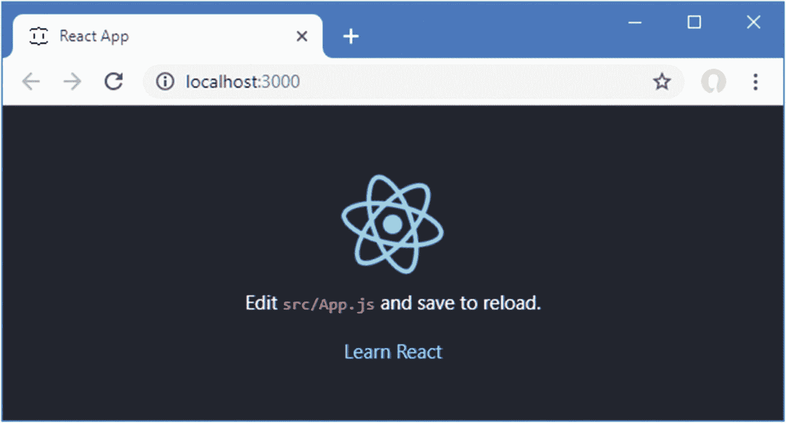
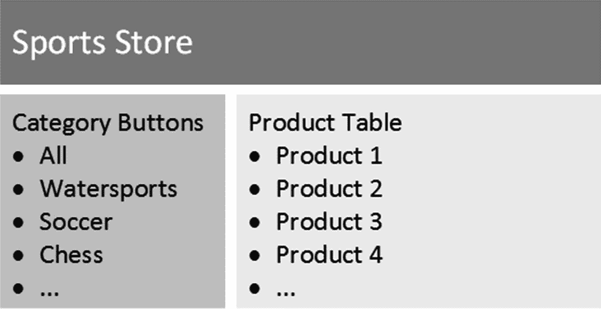
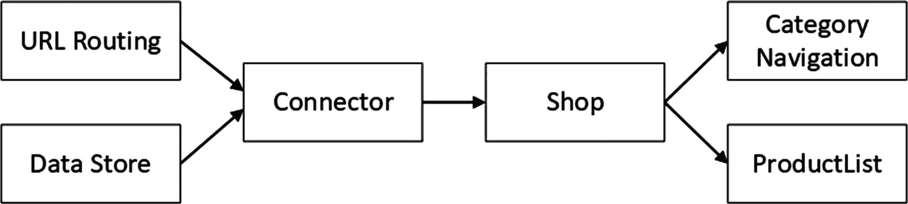
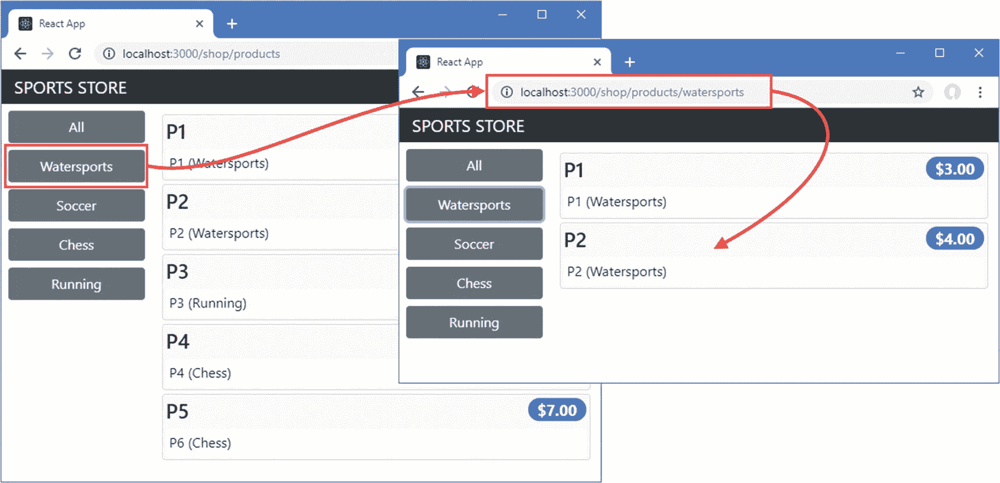
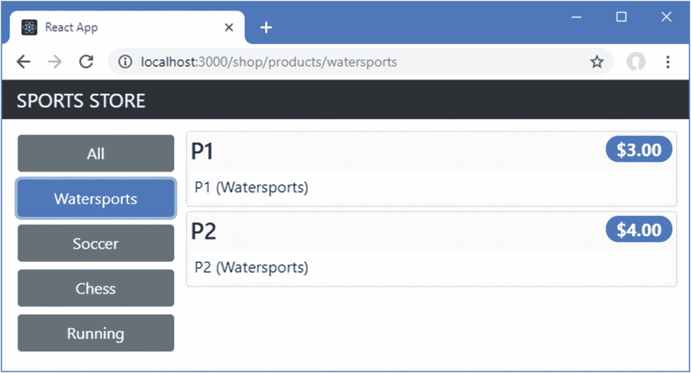
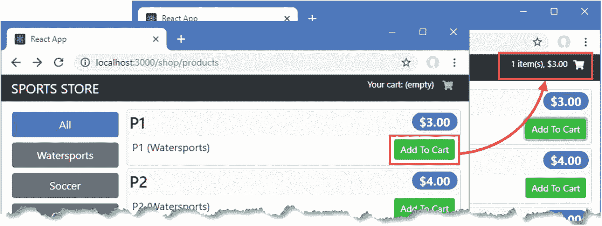
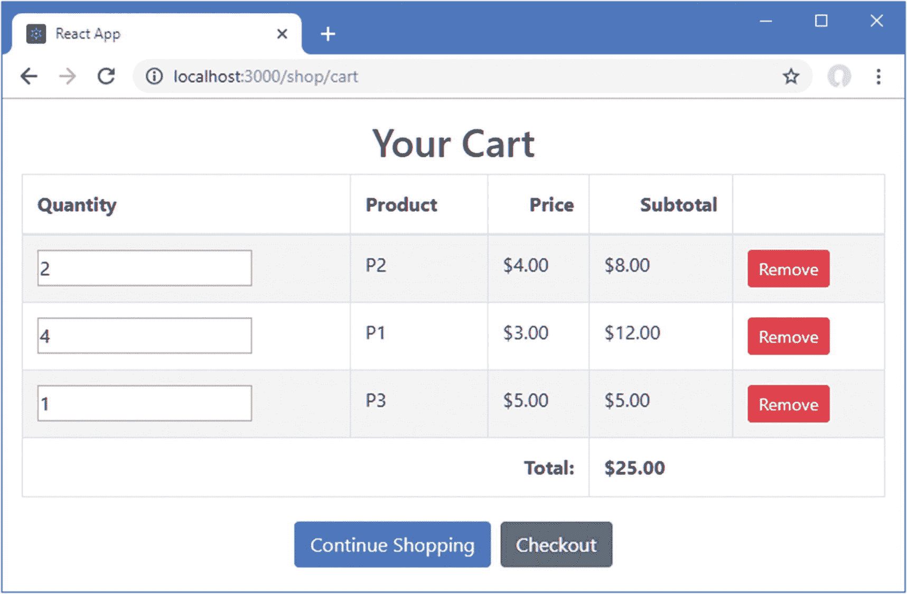

# 五、SportsStore：一个真正的应用

在第 2 章中，我构建了一个快速简单的 React 应用。小而集中的例子允许我展示具体的特征，但是它们可能缺乏上下文。为了帮助克服这个问题，我将创建一个简单但现实的电子商务应用。

我的应用名为 SportsStore，将遵循各地在线商店采用的经典方法。我将创建一个客户可以按类别和页面浏览的在线产品目录，一个用户可以添加和删除产品的购物车，以及一个客户可以输入详细信息并下订单的收银台。我还将创建一个管理区域，其中包括用于管理产品和订单的创建、读取、更新和删除(CRUD)工具——我将保护它，以便只有登录的管理员才能进行更改。最后，我将向您展示如何为部署准备 React 应用。

我在这一章和后面几章的目标是通过创建尽可能真实的例子，让你对真正的 React 开发有所了解。当然，我想把重点放在 React 和大多数项目中使用的相关包上，所以我简化了与外部系统的集成，比如数据库，并完全省略了其他部分，比如支付处理。

我在所有的书中都使用了 SportsStore 的例子，尤其是因为它展示了使用不同的框架、语言和开发风格来实现相同结果的方法。你不需要阅读我的任何其他书籍来理解这一章，但是如果你已经拥有我的*Pro ASP.NET 核心 MVC 2* 或 *Pro Angular 6* 书籍，你会发现这些对比很有趣。

我在 SportsStore 应用中使用的 React 特性将在后面的章节中详细介绍。我不会在这里重复所有的内容，我告诉您的内容足以让您理解示例应用，并让您参考其他章节以获得更深入的信息。您可以从头到尾阅读 SportsStore 章节，了解 React 的工作原理，或者在详细章节之间跳转，深入了解。

无论哪种方式，都不要指望马上理解所有的东西——React 应用有许多活动的部分，并依赖于许多软件包，而 SportsStore 应用旨在向您展示它们是如何组合在一起的，而不会深入到本书其余部分描述的细节中。

### 小费

你可以从 [`https://github.com/Apress/pro-react-16`](https://github.com/Apress/pro-react-16) 下载本章以及本书其他章节的示例项目。

## 准备项目

要创建项目，打开一个新的命令提示符，导航到一个方便的位置，并运行清单 [5-1](#PC1) 中所示的命令。

```jsx
npx create-react-app sportsstore

Listing 5-1Creating the SportsStore Project

```

`create-react-app`工具将创建一个名为`sportsstore`的新 React 项目，其中包含开始开发所需的包、配置文件和占位符内容。项目设置过程可能需要一些时间来完成，因为有大量的 NPM 软件包需要下载和安装。

### 注意

创建新项目时，您可能会看到有关安全漏洞的警告。React 开发依赖于大量的包，每个包都有自己的依赖关系，不可避免的会发现安全问题。对于本书中的示例，使用指定的包版本以确保获得预期的结果是很重要的。对于您自己的项目，您应该查看警告并更新到解决问题的版本。

### 安装附加的 NPM 软件包

除了由`create-react-app`包安装的核心 React 库和开发工具之外，SportsStore 项目还需要额外的包。运行清单 [5-2](#PC2) 中所示的命令，导航到`sportsstore`文件夹并添加包。(`npm install`命令可以用来一次添加多个包，但是结果是一个很长的命令，很容易忽略一个包。为了避免错误，我在本书中单独添加了包。)

### 注意

使用清单中显示的版本号很重要。在添加包时，您可能会看到关于未满足对等依赖关系的警告，但是这些可以忽略。

```jsx
cd sportsstore
npm install bootstrap@4.1.2
npm install @fortawesome/fontawesome-free@5.6.1
npm install redux@4.0.1
npm install react-redux@6.0.0
npm install react-router-dom@4.3.1
npm install axios@0.18.0
npm install graphql@14.0.2
npm install apollo-boost@0.1.22
npm install react-apollo@2.3.2

Listing 5-2Installing Additional Packages

```

不要被所需的额外软件包的数量所吓倒。React 专注于 web 应用所需的一组核心功能，并依赖支持包来创建完整的应用。为了提供一些背景知识，在列表 [5-2](#PC2) 中添加的包在表 [5-1](#Tab1) 中有描述，我将在本书的第 3 部分深入讨论它们。

表 5-1

SportsStore 项目所需的包

<colgroup><col class="tcol1 align-left"> <col class="tcol2 align-left"></colgroup> 
| 

名字

 | 

描述

 |
| --- | --- |
| `bootstrap` | 这个包提供了我在整本书中用来呈现 HTML 内容的 CSS 样式。 |
| `fontawesome-free` | 这个包提供了可以包含在 HTML 内容中的图标。我用过免费软件，但也有更全面的付费选项。 |
| `redux` | 这个包提供了一个数据存储，它简化了协调应用不同部分的过程。详见第 [19](19.html) 章。 |
| `react-redux` | 这个包将 Redux 数据存储集成到 React 应用中，如第 [19](19.html) 和 [20](20.html) 章所述。 |
| `react-router-dom` | 这个包提供 URL 路由，允许根据浏览器的当前 URL 选择呈现给用户的内容，如第 [21](21.html) 和 [22](22.html) 章所述。 |
| `axios` | 这个包用于发出 HTTP 请求，并将用于访问 RESTful 和 GraphQL 服务，如第[23](23.html)–[25](25.html)章所述。 |
| `graphql` | 这个包包含 GraphQL 规范的参考实现。 |
| `apollo-boost` | 这个包包含一个用于消费 GraphQL 服务的客户端，如第 [25](25.html) 章所述。 |
| `react-apollo` | 这个包用于将 GraphQL 客户端集成到 React 应用中，如第 [25](25.html) 章所述。 |

需要更多的包来创建 SportsStore 应用将使用的后端服务。使用命令提示符，运行`sportsstore`文件夹中清单 [5-3](#PC3) 所示的命令。这些包是使用`--save-dev`参数安装的，这表明它们是在开发过程中使用的，在部署时不会成为 SportsStore 应用的一部分。

```jsx
npm install --save-dev json-server@0.14.2
npm install --save-dev jsonwebtoken@8.1.1
npm install --save-dev express@4.16.4
npm install --save-dev express-graphql@0.7.1
npm install --save-dev cors@2.8.5
npm install --save-dev faker@4.1.0
npm install --save-dev chokidar@2.0.4
npm install --save-dev npm-run-all@4.1.3
npm install --save-dev connect-history-api-fallback@1.5.0

Listing 5-3Adding Further Packages

```

对于使用来自现有服务的数据的应用，您不需要这些包，但是我需要为 SportsStore 应用创建一个完整的基础设施。表 [5-2](#Tab2) 简要描述了清单 [5-3](#PC3) 中安装的每个包的用途。

表 5-2

SportsStore 项目所需的附加包

<colgroup><col class="tcol1 align-left"> <col class="tcol2 align-left"></colgroup> 
| 

名字

 | 

描述

 |
| --- | --- |
| `json-server` | 这个包将用于在第 [6](06.html) 章中提供一个 RESTful web 服务。 |
| `jsonwebtoken` | 该包将用于在第 [8](08.html) 章中验证用户。 |
| `graphql` | 这个包将用于在第 [7](07.html) 章中定义 GraphQL 服务器的模式。 |
| `express` | 这个包将用于托管后端服务器。 |
| `express-graphql` | 这个包将用于创建一个 GraphQL 服务器。 |
| `cors` | 此包用于启用跨来源请求共享(CORS)请求。 |
| `faker` | 该包生成用于测试的假数据，并在第 [6](06.html) 章中使用。 |
| `chokidar` | 这个包监控文件的变化。 |
| `npm-run-all` | 这个包用于在一个命令中运行多个 NPM 脚本。 |
| `connect-history-api-fallback` | 该包用于响应带有`index.html`文件的 HTTP 请求，并用于第 [8 章](08.html)中的生产服务器。 |

### 将 CSS 样式表添加到项目中

为了使用 Bootstrap 和 Font Awesome 包，我需要将`import`语句添加到应用的`index.js`文件中。`index.js`文件的目的是启动应用，如第 [9](09.html) 章所述，添加清单 [5-4](#PC4) 中所示的导入语句确保我需要的样式可以应用到 SportsStore 应用显示的 HTML 内容。

```jsx
import React from 'react';
import ReactDOM from 'react-dom';
import './index.css';
import App from './App';
import * as serviceWorker from './serviceWorker';

import "bootstrap/dist/css/bootstrap.css";

import "@fortawesome/fontawesome-free/css/all.min.css";

ReactDOM.render(<App />, document.getElementById('root'));

// If you want your app to work offline and load faster, you can change
// unregister() to register() below. Note this comes with some pitfalls.
// Learn more about service workers: http://bit.ly/CRA-PWA
serviceWorker.unregister();

Listing 5-4Adding CSS Stylesheets in the index.js File in the src Folder

```

### 准备 Web 服务

一旦应用的基本结构就绪，我将添加对从 web 服务消费数据的支持。在准备过程中，我在`sportsstore`文件夹中添加了一个名为`data.js`的文件，其内容如清单 [5-5](#PC5) 所示。

```jsx
module.exports = function () {
    return {
        categories: ["Watersports", "Soccer", "Chess"],
        products: [
            { id: 1, name: "Kayak", category: "Watersports",
                description: "A boat for one person", price: 275 },
            { id: 2, name: "Lifejacket", category: "Watersports",
                description: "Protective and fashionable", price: 48.95 },
            { id: 3, name: "Soccer Ball", category: "Soccer",
                description: "FIFA-approved size and weight", price: 19.50 },
            { id: 4, name: "Corner Flags", category: "Soccer",
                description: "Give your playing field a professional touch",
                price: 34.95 },
            { id: 5, name: "Stadium", category: "Soccer",
                description: "Flat-packed 35,000-seat stadium", price: 79500 },
            { id: 6, name: "Thinking Cap", category: "Chess",
                description: "Improve brain efficiency by 75%", price: 16 },
            { id: 7, name: "Unsteady Chair", category: "Chess",
                description: "Secretly give your opponent a disadvantage",
                price: 29.95 },
            { id: 8, name: "Human Chess Board", category: "Chess",
                description: "A fun game for the family", price: 75 },
            { id: 9, name: "Bling Bling King", category: "Chess",
                description: "Gold-plated, diamond-studded King", price: 1200 }
        ],
        orders: []
    }
}

Listing 5-5The Contents of the data.js File in the sportsstore Folder

```

清单 [5-5](#PC5) 中的代码创建了应用将使用的三个数据集合。`products`集合包含销售给客户的产品，`categories`集合包含产品被组织成的类别集，`orders`集合包含客户已经下的订单(但是当前是空的)。

我用清单 [5-6](#PC6) 中所示的代码在`sportsstore`文件夹中添加了一个名为`server.js`的文件。这是创建为应用提供数据的 web 服务的代码。在后面的章节中，我将为后端服务器添加一些特性，比如认证和对 GraphQL 的支持。

```jsx
const express = require("express");
const jsonServer = require("json-server");
const chokidar = require("chokidar");
const cors = require("cors");

const fileName = process.argv[2] || "./data.js"
const port = process.argv[3] || 3500;

let router = undefined;

const app = express();

const createServer = () => {
    delete require.cache[require.resolve(fileName)];
    setTimeout(() => {
        router = jsonServer.router(fileName.endsWith(".js")
            ? require(fileName)() : fileName);
    }, 100)
}

createServer();

app.use(cors());
app.use(jsonServer.bodyParser)
app.use("/api", (req, resp, next) => router(req, resp, next));

chokidar.watch(fileName).on("change", () => {
    console.log("Reloading web service data...");
    createServer();
    console.log("Reloading web service data complete.");
});

app.listen(port, () => console.log(`Web service running on port ${port}`));

Listing 5-6The Contents of the server.js File in the sportsstore Folder

```

为了确保 web 服务与 React 开发工具一起启动，我修改了`package.json`文件的`scripts`部分，如清单 [5-7](#PC7) 所示。

```jsx
...
"scripts": {
  "start": "npm-run-all --parallel reactstart webservice",

  "reactstart": "react-scripts start",

  "webservice": "node server.js",

  "build": "react-scripts build",
  "test": "react-scripts test",
  "eject": "react-scripts eject"
},
...

Listing 5-7Enabling the Web Service in the package.json File in the sportsstore Folder

```

这个变化使用`npm-run-all`包来同时运行 React 开发服务器和 web 服务。

### 运行示例应用

要启动应用和 web 服务，使用命令提示符运行清单 [5-8](#PC8) 中的命令。

```jsx
npm start

Listing 5-8Starting the Application

```

初始编译完成后会有一个暂停，然后会打开一个新的浏览器窗口，显示如图 [5-1](#Fig1) 所示的占位符内容。



图 5-1

运行示例应用

为了确保 web 服务正在运行，打开一个新的浏览器窗口并请求 URL `http://localhost:3500/api/products/1`。浏览器将显示清单 [5-5](#PC5) 中定义的产品之一的 JSON 表示，如下所示:

```jsx
{ "id":1, "name":"Kayak", "category":"Watersports",
   "description":"A boat for one person","price":275 }

```

## 创建数据存储

SportsStore 的起点是数据存储，它将是呈现给用户的数据以及协调应用功能(如分页)所需的支持细节的存储库。

我将从使用本地占位符数据的数据存储开始。稍后，我将添加对从 web 服务获取数据的支持，但是静态数据是一个很好的起点，因为它将焦点放在 React 应用上。将使用 Redux 包创建 SportsStore 数据存储，这是 React 项目中最流行的数据存储，我在第 [19](19.html) 和 [20](20.html) 章中对此进行了描述。首先，我创建了`src/data`文件夹，并在其中添加了一个名为`placeholderData.js`的文件，其内容如清单 [5-9](#PC10) 所示。

```jsx
export const data = {
    categories: ["Watersports", "Soccer", "Chess", "Running"],
    products: [
        { id: 1, name: "P1", category: "Watersports",
            description: "P1 (Watersports)", price: 3 },
        { id: 2, name: "P2", category: "Watersports",
           description: "P2 (Watersports)", price: 4 },
        { id: 3, name: "P3", category: "Running",
           description: "P3 (Running)", price: 5 },
        { id: 4, name: "P4", category: "Chess",
           description: "P4 (Chess)", price: 6 },
        { id: 5, name: "P5", category: "Chess",
           description: "P6 (Chess)", price: 7 },
    ]
}

Listing 5-9The Contents of the placeholderData.js File in the src/data Folder

```

### 创建数据存储操作和操作创建者

Redux 数据将读取数据与更改数据的操作分开存储。这一开始可能会感觉很尴尬，但它类似于 React 开发的其他部分，如组件状态数据和使用 GraphQL，并且它很快成为第二天性。

*动作*是发送到数据存储以对其包含的数据进行更改的对象。动作有类型，动作对象是使用*动作创建器*创建的。目前我需要的唯一动作是将数据加载到存储中，最初使用清单 [5-9](#PC10) 中定义的占位符数据，但最终来自 web 服务。有不同的方法可以构造数据存储的操作，但是有必要确定不同类型的数据之间共享的共同主题，以避免以后的代码重复。我在`src/data`文件夹中添加了一个名为`Types.js`的文件，并使用它来列出存储中的数据类型以及可以对它们执行的一组操作，如清单 [5-10](#PC11) 所示。

```jsx
export const DataTypes = {
    PRODUCTS: "products",
    CATEGORIES: "categories"
}

export const ActionTypes = {
    DATA_LOAD: "data_load"
}

Listing 5-10The Contents of the Types.js File in the src/data Folder

```

有两种数据类型——`PRODUCTS`和`CATEGORIES`——以及一个动作`DATA_LOAD`，它将填充数据存储。不要求以这种方式定义动作类型，但是在应用的其他地方指定动作类型时，使用常量值可以避免输入错误。

接下来，我需要定义一个*动作创建器*函数，它将创建一个动作对象，该对象可以被数据存储处理以改变它包含的数据。我在`src/data`文件夹中添加了一个名为`ActionCreators.js`的文件，代码如清单 [5-11](#PC12) 所示。

```jsx
import { ActionTypes} from "./Types";
import { data as phData} from "./placeholderData";

export const loadData = (dataType) => ({
    type: ActionTypes.DATA_LOAD,
    payload: {
        dataType: dataType,
        data: phData[dataType]
    }
});

Listing 5-11The Contents of the ActionCreators.js File in the src/data Folder

```

在第 [19](19.html) 章中描述了动作创建器的使用，但是对动作创建器产生的对象的唯一要求是它们必须有一个`type`属性，该属性的值指定了数据存储所需的变化类型。在动作对象中使用一组公共属性是一个好主意，这样它们可以被一致地处理，在清单 [5-11](#PC12) 中定义的动作创建器返回一个具有`payload`属性的动作对象，这是我将用于所有 SportsStore 数据存储动作的约定。

清单 [5-11](#PC12) 中动作对象的`payload`属性有一个`dataType`属性，指示动作所涉及的数据类型，还有一个`data`属性，提供要添加到数据存储中的数据。此时，`data`属性的值是从占位符数据中获得的，但是在第 [6](06.html) 章中，我用从 web 服务中获得的数据替换它。

动作由数据存储库*还原器*处理，还原器是接收数据存储库和动作对象的当前内容并使用它们进行更改的功能。我在`src/data`文件夹中添加了一个名为`ShopReducer.js`的文件，并定义了清单 [5-12](#PC13) 中所示的减速器。

```jsx
import { ActionTypes } from "./Types";

export const ShopReducer = (storeData, action) => {
    switch(action.type) {
        case ActionTypes.DATA_LOAD:
            return {
                ...storeData,
                [action.payload.dataType]: action.payload.data
            };
        default:
            return storeData || {};
    }
}

Listing 5-12The Contents of the ShopReducer.js File in the src/data Folder

```

Reducers 需要创建并返回包含任何所需更改的新对象。如果动作类型没有被识别，reducer 必须返回它接收到的数据存储对象。清单 [5-12](#PC13) 中的 reducer 通过创建一个新对象来处理`DATA_LOAD`动作，这个新对象包含旧存储的所有属性以及动作中接收到的新数据。第 [19 章](19.html)对减速器进行了更详细的描述。

作为创建数据存储的最后一步，我在`src/data`文件夹中添加了一个名为`DataStore.js`的文件，并添加了清单 [5-13](#PC14) 中所示的代码。

```jsx
import { createStore } from "redux";
import { ShopReducer } from "./ShopReducer";

export const SportsStoreDataStore = createStore(ShopReducer);

Listing 5-13The Contents of the DataStore.js File in the src/data Folder

```

Redux 包提供了`createStore`函数，它使用一个 reducer 建立一个新的数据存储。这足以创建一个数据存储，但是我将在以后添加额外的特性，以便可以执行进一步的操作，并且可以从 web 服务加载数据。

## 创建购物功能

用户将看到的应用的第一部分是店面，它将以两列布局呈现可用的产品，允许按类别进行过滤，如图 [5-2](#Fig2) 所示。



图 5-2

应用的基本结构

我将构建应用，以便浏览器的 URL 用于选择呈现给用户的内容。首先，该应用将支持表 [5-3](#Tab3) 中描述的 URL，这将允许用户查看待售产品并按类别过滤它们。

表 5-3

SportsStore 网址

<colgroup><col class="tcol1 align-left"> <col class="tcol2 align-left"></colgroup> 
| 

名字

 | 

描述

 |
| --- | --- |
| `/shop/products` | 这个 URL 将向用户显示所有的产品，不考虑类别。 |
| `/shop/products/chess` | 该 URL 将显示特定类别的产品。在这种情况下，URL 将选择象棋类别。 |

### 注意

对于应用中向客户提供销售产品的部分，我采用了英国术语 *shop* 。我想避免在保存应用数据的数据存储和用户购物的产品存储之间产生混淆。

在应用中响应浏览器的 URL 被称为 *URL 路由*，它由清单 [5-2](#PC2) 中添加的 React Router 包提供，在章节 [21](21.html) 和 [22](22.html) 中有详细描述。

### 创建产品和类别组件

组件是 React 应用的构建块，负责呈现给用户的内容。我创建了`src/shop`文件夹，并在其中添加了一个名为`ProductList.js`的文件，其内容如清单 [5-14](#PC15) 所示。

```jsx
import React, { Component } from "react";

export class ProductList extends Component {

    render() {
        if (this.props.products == null || this.props.products.length === 0) {
            return <h5 className="p-2">No Products</h5>
        }
        return this.props.products.map(p =>
                <div className="card m-1 p-1 bg-light" key={ p.id }>
                    <h4>
                        { p.name }
                        <span className="badge badge-pill badge-primary float-right">
                            ${ p.price.toFixed(2) }
                        </span>
                    </h4>
                    <div className="card-text bg-white p-1">
                        { p.description }
                    </div>
                </div>
            )
    }
}

Listing 5-14The Contents of the ProductList.js File in the src/shop Folder

```

创建组件是为了执行小任务或显示少量内容，而组合组件是为了创建更复杂的功能。清单 [5-14](#PC15) 中定义的`ProductList`组件负责显示产品列表的细节，其细节通过名为`product`的属性接收。Props 用于配置组件并允许它们完成工作——例如显示产品的细节——而不涉及数据的来源。`ProductList`组件生成包含每个产品的`name`、`price`和`description`属性值的 HTML 内容，但是它不知道这些产品是如何在应用中定义的，也不知道它们是在本地定义的还是从远程服务器检索的。

接下来，我在`src/shop`文件夹中添加了一个名为`CategoryNavigation.js`的文件，并定义了清单 [5-15](#PC16) 中所示的组件。

```jsx
import React, { Component } from "react";
import { Link } from "react-router-dom";

export class CategoryNavigation extends Component {

    render() {
        return <React.Fragment>
            <Link className="btn btn-secondary btn-block"
                to={ this.props.baseUrl }>All</Link>
            { this.props.categories && this.props.categories.map(cat =>
                <Link className="btn btn-secondary btn-block" key={ cat }
                    to={ `${this.props.baseUrl}/${cat.toLowerCase()}`}>
                    { cat }
                </Link>
            )}
        </React.Fragment>
    }
}

Listing 5-15The Contents of the CategoryNavigation.js File in the src/shop Folder

```

类别的选择将通过导航到一个新的 URL 来处理，这是使用 React Router 包提供的`Link`组件来完成的。当用户点击一个`Link`时，浏览器被要求导航到一个新的 URL，而无需发送任何 HTTP 请求或重新加载应用。新 URL 中包含的细节，比如本例中的选定类别，允许应用的不同部分协同工作。

`CategoryNavigation`组件通过一个名为`categories`的属性接收类别数组。该组件检查以确保数组已被定义，并使用`map`方法为每个数组项生成内容。React 要求将一个`key` prop 应用到由`map`方法生成的元素上，以便可以有效地处理数组的变化，如第 [10](10.html) 章所述。结果是数组中接收的每个类别都有一个`Link`组件，还有一个额外的`Link`，这样用户就可以选择所有产品，而不考虑类别。`Link`组件被设计成按钮，浏览器将导航到的 URL 是一个名为`baseUrl`的属性和类别名称的组合。

为了将产品表和类别按钮放在一起，我在`src/shop`文件夹中添加了一个名为`Shop.js`的文件，并添加了清单 [5-16](#PC17) 中所示的代码。

```jsx
import React, { Component } from "react";
import { CategoryNavigation } from "./CategoryNavigation";
import { ProductList } from "./ProductList";

export class Shop extends Component {

    render() {
        return <div className="container-fluid">
            <div className="row">
                <div className="col bg-dark text-white">
                    <div className="navbar-brand">SPORTS STORE</div>
                </div>
            </div>
            <div className="row">
                <div className="col-3 p-2">
                    <CategoryNavigation baseUrl="/shop/products"
                        categories={ this.props.categories } />
                </div>
                <div className="col-9 p-2">
                    <ProductList products={ this.props.products } />
                </div>
            </div>
        </div>
    }
}

Listing 5-16The Contents of the Shop.js File in the src/shop Folder

```

组件可以将其部分内容的责任委托给其他组件。在它的`render`方法中，清单 [5-16](#PC17) 中定义的`Shop`组件包含使用引导 CSS 类建立网格结构的 HTML 元素，但是将填充一些网格单元的责任委托给了`CategoryNavigation`和`ProductList`组件。这些委托的组件在`render`方法中被表示为定制的 HTML 元素，其中元素标记与组件的名称相匹配，如下所示:

```jsx
...
<ProductList products={ this.props.products } />
...

```

在两个组件之间创建了一个关系:`Shop`组件是`ProductList`的父组件，而`ProductList`组件是`Shop`的子组件。父组件通过提供属性来配置它们的子组件，在清单 [5-16](#PC17) 中，`Shop`组件将从其父组件收到的`products`属性传递给它的`ProductList`子组件，后者将用于向用户显示产品列表。本书的第 2 部分描述了组件之间的关系以及使用它们创建复杂特征的方式。

### 连接到数据存储和 URL 路由

组件`Shop`及其`CategoryNavigation`和`ProductList`子组件需要访问数据存储。为了将这些组件与它们需要的特性联系起来，我在`src/shop`文件夹中添加了一个名为`ShopConnector.js`的文件，代码如清单 [5-17](#PC19) 所示。

```jsx
import React, { Component } from "react";
import { Switch, Route, Redirect }
    from "react-router-dom"
import { connect } from "react-redux";
import { loadData } from "../data/ActionCreators";
import { DataTypes } from "../data/Types";
import { Shop } from "./Shop";

const mapStateToProps = (dataStore) => ({
    ...dataStore
})

const mapDispatchToProps = {
    loadData
}

const filterProducts = (products = [], category) =>
    (!category || category === "All")
        ? products
        : products.filter(p => p.category.toLowerCase() === category.toLowerCase());

export const ShopConnector = connect(mapStateToProps, mapDispatchToProps)(
    class extends Component {
        render() {
            return <Switch>
                <Route path="/shop/products/:category?"
                    render={ (routeProps) =>
                        <Shop { ...this.props } { ...routeProps }
                            products={ filterProducts(this.props.products,
                                routeProps.match.params.category) } />} />
                <Redirect to="/shop/products" />
            </Switch>
        }

        componentDidMount() {
            this.props.loadData(DataTypes.CATEGORIES);
            this.props.loadData(DataTypes.PRODUCTS);
        }
    }
)

Listing 5-17The Contents of the ShopConnector.js File in the src/shop Folder

```

如果清单 [5-17](#PC19) 中的代码目前看起来难以理解，也不用担心。代码比早期的清单更复杂，因为这个组件集合并合并了几个特性，所以它们可以更容易地在项目的其他地方使用，如图 [5-3](#Fig3) 所示。



图 5-3

将应用连接到其服务

这种方法的优点是，它简化了添加功能或对应用进行更改，因为向用户呈现内容的组件通过 props 接收数据，而不需要直接从数据存储或 URL 路由系统获取数据。缺点是，将应用的其余部分连接到其服务的组件可能很难编写和维护，因为它必须组合不同包的功能并将其呈现给其子代。这个组件的复杂性将会增加，直到第 6 章结束，那时我将围绕最后一组 SportsStore 购物功能整合代码。

清单 [5-17](#PC19) 中的组件将 Redux 数据存储和 URL 路由连接到`Shop`组件。Redux 包提供了`connect`函数，用于将一个组件链接到一个数据存储，这样它的属性要么是来自数据存储的值，要么是在被调用时调度数据存储动作的函数，如第 [20 章](20.html)所述。正是`connect`函数产生了清单 [5-17](#PC19) 中的大部分代码，因为它需要数据存储和组件属性之间的映射，这可能会很冗长。清单 [5-17](#PC19) 中的映射让`Shop`组件可以访问数据存储中定义的所有属性，数据存储目前包含产品和类别数据，但以后会包含其他特性。

### 小费

您可以在映射到 props 的数据存储属性中更加具体，如第 [20](20.html) 章所演示的，但是我已经映射了所有的产品，这在您开始开发新项目时是一个有用的方法，因为这意味着您不必在每次增强数据存储时都记得映射新的属性。

必须使用选定的类别来过滤产品数据，该类别可通过 React 路由包提供的功能来访问。一个`Route`用于选择当浏览器导航到一个特定的 URL 时将向用户显示的组件。列表 [5-17](#PC19) 中的`Route`匹配表 [5-3](#Tab3) 中的 URL，如下所示:

```jsx
...
<Route path="/shop/products/:category?" render={ (routeProps) =>
...

```

`path` prop 告诉`Route`等待，直到浏览器导航到`/shop/products` URL。如果 URL 中有一个额外的段，比如`/shop/products/running`，那么该段的内容将被分配给一个名为`category`的参数，这就是用户的类别选择将如何被确定。

当浏览器导航到与`path`属性匹配的 URL 时，`Route`会显示由`render`属性指定的内容，如下所示:

```jsx
...
<Route path="/shop/products/:category?" render={ (routeProps) =>

    <Shop { ...this.props } { ...routeProps }

        products={ filterProducts(this.props.products,

            routeProps.match.params.category) } />} />

...

```

这是数据存储和 URL 路由功能的结合点。`Shop`组件需要知道用户选择了哪个类别，这可以通过传递给`Route`组件的 render prop 的参数获得。类别与来自数据存储的数据相结合，两者都被传递给`Shop`组件。props 应用于组件的顺序允许覆盖 props，我依赖它用来自`filterProduct`函数的结果替换从数据存储中获得的`products`数据，该函数只选择用户选择的类别中的产品。

`Route`与`Switch`和`Redirect`组件结合使用，这两个组件都是 React 路由包的一部分，如果浏览器的当前 URL 与`Route`不匹配，它们会将浏览器重定向到`/shop/products`。

`ShopConnector`组件使用`componentDidMount`方法将数据加载到数据存储中。`componentDidMount`方法是 React 组件生命周期的一部分，在第 [13 章](13.html)中有详细描述。

### 将商店添加到应用中

在清单 [5-18](#PC22) 中，我已经设置了数据存储和 URL 路由特性，并将`ShopConnector`组件合并到应用中。

```jsx
import React, { Component } from "react";
import { SportsStoreDataStore } from "./data/DataStore";
import { Provider } from "react-redux";
import { BrowserRouter as Router, Route, Switch, Redirect }
    from "react-router-dom";
import { ShopConnector } from "./shop/ShopConnector";

export default class App extends Component {

    render() {
        return <Provider store={ SportsStoreDataStore }>
            <Router>
                <Switch>
                    <Route path="/shop" component={ ShopConnector } />
                    <Redirect to="/shop" />
                </Switch>
            </Router>
        </Provider>
    }
}

Listing 5-18Adding Routing and a Data Store to the App.js File in the src Folder

```

使用`Provider`将数据存储应用于应用，其中`store`属性被分配给在清单 [5-13](#PC14) 中创建的数据存储。使用`Router`组件将 URL 路由特性应用于应用，我已经使用`Switch`、`Route`和`Redirect`组件对其进行了补充。`Redirect`将导航到`/shop` URL，该 URL 匹配`Route`的`path`属性并显示`ShopConnector`组件，产生如图 [5-4](#Fig4) 所示的结果。单击一个类别按钮会将浏览器重定向到一个新的 URL，比如`/shop/products/watersports`，它具有过滤所显示产品的作用。



图 5-4

创建基本购物功能

### 改进类别选择按钮

类别选择按钮可以工作，但是不能清楚地向用户反映当前的类别。为了解决这个问题，我在`src`文件夹中添加了一个名为`ToggleLink.js`的文件，并用它来定义清单 [5-19](#PC23) 中所示的组件。

### 小费

我将这个组件添加到`src`文件夹中，因为一旦商店完成，我将在应用的其他部分使用它。关于如何组织 React 项目，没有严格的规则，但是我倾向于将相关的文件放在文件夹中。

```jsx
import React, { Component } from "react";
import { Route, Link } from "react-router-dom";

export class ToggleLink extends Component {

    render() {
        return <Route path={ this.props.to } exact={ this.props.exact }
                children={ routeProps => {

            const baseClasses = this.props.className || "m-2 btn btn-block";
            const activeClass = this.props.activeClass || "btn-primary";
            const inActiveClass = this.props.inActiveClass || "btn-secondary"

            const combinedClasses =
                `${baseClasses} ${routeProps.match ? activeClass : inActiveClass}`

            return <Link to={ this.props.to } className={ combinedClasses }>
                        { this.props.children }
                    </Link>
         }} />
    }
}

Listing 5-19The Contents of the ToggleLink.js File in the src Folder

```

React Router 包提供了一个组件来指示特定的 URL 何时匹配，但是它不能很好地与引导 CSS 类一起工作，正如我在第 [22 章](22.html)中描述的，在那里我详细解释了`ToggleLink`组件是如何工作的。对于本章来说，知道可以使用`Route`组件来提供对 URL 路由系统的访问，以便获得关于当前路由的细节就足够了。在清单 [5-20](#PC24) 中，我已经更新了`CategoryNavigation`组件来使用`ToggleLink`组件。

```jsx
import React, { Component } from "react";

//import { Link } from "react-router-dom";

import { ToggleLink } from "../ToggleLink";

export class CategoryNavigation extends Component {

    render() {
        return <React.Fragment>
            <ToggleLink to={ this.props.baseUrl } exact={ true }>All</ToggleLink>

            { this.props.categories && this.props.categories.map(cat =>
                <ToggleLink key={ cat }

                    to={ `${this.props.baseUrl}/${cat.toLowerCase()}`}>
                    { cat }
                </ToggleLink>

            )}
        </React.Fragment>
    }
}

Listing 5-20Using ToggleLinks in the CategoryNavigation.js File in the src/shop Folder

```

其作用是清楚地表明选择了哪个类别，如图 [5-5](#Fig5) 所示。



图 5-5

突出显示选定的组件

## 添加购物车

购物车将允许用户在结帐前选择几个产品。在接下来的小节中，我将添加扩展数据存储以跟踪用户的产品选择，并创建提供详细和概要购物车视图的组件。

### 扩展数据存储

为了扩展数据存储以添加对跟踪用户产品选择的支持，我添加了清单 [5-21](#PC25) 中所示的动作类型。

```jsx
export const DataTypes = {
    PRODUCTS: "products",
    CATEGORIES: "categories"
}

export const ActionTypes = {
    DATA_LOAD: "data_load",
    CART_ADD: "cart_add",

    CART_UPDATE: "cart_update",

    CART_REMOVE: "cart_delete",

    CART_CLEAR: "cart_clear"

}

Listing 5-21Defining Action Types in the Types.js File in the src/data Folder

```

新的操作将允许在购物车中添加和删除产品，以及清除整个购物车的内容。

您可以在同一个文件中为应用的不同部分定义动作创建者和减少者，但是将它们分成单独的文件可以使开发更容易，尤其是在大型项目中。我在`src/data`文件夹中添加了一个名为`CartActionCreators.js`的文件，并用它来定义新动作类型的动作创建者，如清单 [5-22](#PC26) 所示。

```jsx
import { ActionTypes} from "./Types";

export const addToCart = (product, quantity) => ({
    type: ActionTypes.CART_ADD,
    payload: {
        product,
        quantity: quantity || 1
    }
});

export const updateCartQuantity = (product, quantity) => ({
    type: ActionTypes.CART_UPDATE,
    payload: { product, quantity }
})

export const removeFromCart = (product) => ({
    type: ActionTypes.CART_REMOVE,
    payload: product
})

export const clearCart = () => ({
    type: ActionTypes.CART_CLEAR
})

Listing 5-22The Contents of the CartActionCreators.js File in the src/data Folder

```

清单 [5-22](#PC26) 中的函数创建的动作对象有一个`payload`属性，携带执行动作所需的数据。为了定义一个将处理购物车相关动作的 reducer，我在`src/data`文件夹中添加了一个名为`CartReducer.js`的文件，并定义了清单 [5-23](#PC27) 中所示的函数。

```jsx
import { ActionTypes } from "./Types";

export const CartReducer = (storeData, action) => {
    let newStore = { cart: [], cartItems: 0, cartPrice: 0, ...storeData }
    switch(action.type) {
        case ActionTypes.CART_ADD:
            const p = action.payload.product;
            const q = action.payload.quantity;

            let existing = newStore.cart.find(item => item.product.id === p.id);
            if (existing) {
                existing.quantity += q;
            } else {
                newStore.cart = [...newStore.cart, action.payload];
            }
            newStore.cartItems += q;
            newStore.cartPrice += p.price * q;
            return newStore;

        case ActionTypes.CART_UPDATE:
            newStore.cart = newStore.cart.map(item => {
                if (item.product.id === action.payload.product.id) {
                    const diff = action.payload.quantity - item.quantity;
                    newStore.cartItems += diff;
                    newStore.cartPrice+= (item.product.price * diff);
                    return action.payload;
                } else {
                    return item;
                }
            });
            return newStore;

        case ActionTypes.CART_REMOVE:
            let selection = newStore.cart.find(item =>
                item.product.id === action.payload.id);
            newStore.cartItems -= selection.quantity;
            newStore.cartPrice -= selection.quantity * selection.product.price;
            newStore.cart = newStore.cart.filter(item => item !== selection );
            return newStore;

        case ActionTypes.CART_CLEAR:
            return { ...storeData, cart: [], cartItems: 0, cartPrice: 0}

        default:
            return storeData || {};
    }
}

Listing 5-23The Contents of the CartReducer.js File in the src/data Folder

```

购物车动作的 reducer 通过向数据存储添加一个`cart`属性并为其分配一个具有`product`和`quantity`属性的对象数组来跟踪用户的产品选择。还有`cartItems`和`cartPrice`属性记录购物车中的商品数量及其总价。

### 小费

保持数据存储的结构扁平很重要，因为对象层次结构中的深层变化不会被检测到，也不会显示给用户。正是由于这个原因，`cart`、`cartItems`和`cartPrice`属性在数据存储中与`products`和`categories`属性一起定义，而不是组合在一个结构中。

默认情况下，Redux 数据存储只使用一个 reducer，但是很容易组合多个 reducer 来适应您的项目。如第 [19](19.html) 章所述，有在多个缩减器之间划分数据存储责任的内置支持，但是这分割了数据，所以每个缩减器只能看到模型的一部分。对于 SportsStore 应用，我希望每个 reducer 都能访问完整的数据存储，所以我在`src/data`文件夹中添加了一个名为`CommonReducer.js`的文件，并用它来定义清单 [5-24](#PC28) 中所示的函数。

```jsx
export const CommonReducer = (...reducers) => (storeData, action) => {
    for (let i = 0; i < reducers.length; i++ ) {
        let newStore = reducers[i](storeData, action);
        if (newStore !== storeData) {
            return newStore;
        }
    }
    return storeData;
}

Listing 5-24The Contents of the CommonReducer.js File in the src/data Folder

```

`commonReducer`函数将多个 reducerss 组合成一个函数，并要求每个 reducer 处理动作。Reducers 在修改数据存储的内容时会返回新的对象，这使得在处理动作时很容易检测到。结果是，SportsStore 数据存储可以支持多个 reducerss，其中第一个更改数据存储的 reducer 被视为已经处理了操作。在清单 [5-25](#PC29) 中，我已经更新了数据存储配置，以使用`commonReducer`函数来组合商店和手推车减速器。

```jsx
import { createStore } from "redux";
import { ShopReducer } from "./ShopReducer";

import { CartReducer } from "./CartReducer";

import { CommonReducer } from "./CommonReducer";

export const SportsStoreDataStore

    = createStore(CommonReducer(ShopReducer, CartReducer));

Listing 5-25Combining Reducers in the DataStore.js File in the src/data Folder

```

### 创建购物车摘要组件

为了向用户显示他们购物车的摘要，我在`src/shop`文件夹中添加了一个名为`CartSummary.js`的文件，并用它来定义清单 [5-26](#PC30) 中所示的组件。

```jsx
import React, { Component } from "react";
import { Link } from "react-router-dom";

export class CartSummary extends Component {

    getSummary = () => {
        if (this.props.cartItems > 0) {
            return <span>
                { this.props.cartItems } item(s),
                ${ this.props.cartPrice.toFixed(2)}
            </span>
        } else {
            return <span>Your cart: (empty) </span>
        }
    }

    getLinkClasses = () => {
        return `btn btn-sm bg-dark text-white
            ${ this.props.cartItems === 0 ? "disabled": ""}`;
    }

    render() {
        return <div className="float-right">
            <small>
                 { this.getSummary() }
                <Link className={ this.getLinkClasses() }
                        to="/shop/cart">
                    <i className="fa fa-shopping-cart"></i>
                </Link>
            </small>
        </div>
    }
}

Listing 5-26The Contents of the CartSummary.js File in the src/shop Folder

```

清单 [5-26](#PC30) 中定义的组件通过`cartItems`和`cartPrice` props 接收它所需要的数据，这两个 props 用于创建组件的摘要，还有一个`Link`，当点击时它将导航到`/shop/cart` URL。当`items`属性的值为零时，`Link`被禁用，以防止用户在没有选择至少一个产品的情况下继续操作。

### 小费

用作`Link`内容的`i`元素应用了添加到清单 [5-2](#PC2) 项目中的字体 Awesome 包中的购物车图标。参见 [`https://fontawesome.com`](https://fontawesome.com) 了解更多详情和所有可用图标。

React 很好地处理了 web 应用开发的许多方面，但是有一些常见的任务比您可能习惯的更难完成。一个例子是条件呈现，其中数据值用于选择不同的内容呈现给用户，或者为属性选择不同的值。React 中最干净的方法是定义一个使用 JavaScript 返回以 HTML 表示的结果的方法，就像清单 [5-26](#PC30) 中的`getSummary`和`getLinkClasses`方法，它们在组件的`render`方法中被调用。另一种方法是使用内联的`&&`操作符，这对于简单的表达式很有效。

在清单 [5-27](#PC31) 中，我将数据存储中与购物车相关的添加内容与应用的其余部分连接起来，同时还连接了 action creator 函数。

```jsx
import React, { Component } from "react";
import { Switch, Route, Redirect }
    from "react-router-dom"
import { connect } from "react-redux";
import { loadData } from "../data/ActionCreators";
import { DataTypes } from "../data/Types";
import { Shop } from "./Shop";

import { addToCart, updateCartQuantity, removeFromCart, clearCart }

    from "../data/CartActionCreators";

const mapStateToProps = (dataStore) => ({
    ...dataStore
})

const mapDispatchToProps = {
    loadData,addToCart, updateCartQuantity, removeFromCart, clearCart

}

const filterProducts = (products = [], category) =>
    (!category || category === "All")
        ? products
        : products.filter(p => p.category.toLowerCase() === category.toLowerCase());

export const ShopConnector = connect(mapStateToProps, mapDispatchToProps)(
    class extends Component {
        render() {
            return <Switch>
                <Route path="/shop/products/:category?"
                    render={ (routeProps) =>
                        <Shop { ...this.props } { ...routeProps }
                            products={ filterProducts(this.props.products,
                                routeProps.match.params.category) } />} />
                <Redirect to="/shop/products" />
            </Switch>
        }

        componentDidMount() {
            this.props.loadData(DataTypes.CATEGORIES);
            this.props.loadData(DataTypes.PRODUCTS);
        }
    }
)

Listing 5-27Connecting the Cart in the ShopConnector.js File in the src/shop Folder

```

在清单 [5-28](#PC32) 中，我向由`Shop`组件呈现的内容添加了一个`CartSummary`，这将确保用户选择的细节显示在产品列表的上方。

```jsx
import React, { Component } from "react";
import { CategoryNavigation } from "./CategoryNavigation";
import { ProductList } from "./ProductList";

import { CartSummary } from "./CartSummary";

export class Shop extends Component {

    render() {
        return <div className="container-fluid">
            <div className="row">
                <div className="col bg-dark text-white">
                    <div className="navbar-brand">SPORTS STORE</div>
                    <CartSummary { ...this.props } />

                </div>
            </div>
            <div className="row">
                <div className="col-3 p-2">
                    <CategoryNavigation baseUrl="/shop/products"
                        categories={ this.props.categories } />
                </div>
                <div className="col-9 p-2">
                    <ProductList products={ this.props.products }
                        addToCart={ this.props.addToCart } />
                </div>
            </div>
        </div>
    }
}

Listing 5-28Adding the Summary in the Shop.js File in the src/shop Folder

```

为了允许用户向购物车添加产品，我在由`ProductList`组件生产的每个产品的描述旁边添加了一个`button`，如清单 [5-29](#PC33) 所示。

```jsx
import React, { Component } from "react";

export class ProductList extends Component {

    render() {
        if (this.props.products == null || this.props.products.length === 0) {
            return <h5 className="p-2">No Products</h5>
        }
        return this.props.products.map(p =>
                <div className="card m-1 p-1 bg-light" key={ p.id }>
                    <h4>
                        { p.name }
                        <span className="badge badge-pill badge-primary float-right">
                            ${ p.price.toFixed(2) }
                        </span>
                    </h4>
                    <div className="card-text bg-white p-1">
                        { p.description }
                        <button className="btn btn-success btn-sm float-right"

                            onClick={ () => this.props.addToCart(p) } >

                                Add To Cart

                        </button>

                    </div>
                </div>
            )
    }
}

Listing 5-29Adding a Button in the ProductList.js File in the src/shop Folder

```

React 提供了用于注册事件处理程序的属性，如第 [12](12.html) 章所述。单击元素时触发的`click`事件的处理程序是`onClick`，指定的函数调用`addToCart`属性，该属性映射到同名的数据存储操作创建者。

结果是每个产品都显示有一个“添加到购物车”按钮。当点击按钮时，数据存储被更新，用户选择的摘要反映了附加项目和新的总价，如图 [5-6](#Fig6) 所示。



图 5-6

将产品添加到购物车

### 添加购物车详细信息组件

为了向用户提供他们选择的详细视图，我在`src/shop`文件夹中添加了一个名为`CartDetails.js`的文件，并用它来定义清单 [5-30](#PC34) 中所示的组件。

```jsx
import React, { Component } from "react";
import { Link } from "react-router-dom";
import { CartDetailsRows } from "./CartDetailsRows";

export class CartDetails extends Component {

    getLinkClasses = () => `btn btn-secondary m-1
        ${this.props.cartItems === 0 ? "disabled": ""}`;

    render() {
        return <div className="m-3">
            <h2 className="text-center">Your Cart</h2>
            <table className="table table-bordered table-striped">
                <thead>
                    <tr>
                        <th>Quantity</th>
                        <th>Product</th>
                        <th className="text-right">Price</th>
                        <th className="text-right">Subtotal</th>
                        <th/>
                    </tr>
                </thead>
                <tbody>
                    <CartDetailsRows cart={ this.props.cart}
                        cartPrice={ this.props.cartPrice }
                        updateQuantity={ this.props.updateCartQuantity }
                        removeFromCart={ this.props.removeFromCart } />
                </tbody>
            </table>
            <div className="text-center">
                <Link className="btn btn-primary m-1" to="/shop">
                    Continue Shopping
                </Link>
                <Link className={ this.getLinkClasses() } to="/shop/checkout">
                    Checkout
                </Link>
            </div>
        </div>
    }
}

Listing 5-30The Contents of the CartDetails.js File in the src/shop Folder

```

`CartDetails`组件向用户呈现一个表格，同时还有`Link`组件返回产品列表或导航到`/shop/checkout` URL，这将启动结帐过程。

`CartDetails`组件依赖于`CartDetailsRows`组件来显示用户产品选择的细节。为了创建这个组件，我在`src/shop`文件夹中添加了一个名为`CartDetailsRows.js`的文件，并用它来定义清单 [5-31](#PC35) 中所示的组件。

```jsx
import React, { Component } from "react";

export class CartDetailsRows extends Component {

    handleChange = (product, event) => {
        this.props.updateQuantity(product, event.target.value);
    }

    render() {
        if (!this.props.cart || this.props.cart.length === 0) {
            return <tr>
                <td colSpan="5">Your cart is empty</td>
            </tr>
        } else {
            return <React.Fragment>
                { this.props.cart.map(item =>
                    <tr key={ item.product.id }>
                        <td>
                            <input type="number" value={ item.quantity }
                                onChange={ (ev) =>
                                    this.handleChange(item.product, ev) } />
                        </td>
                        <td>{ item.product.name }</td>
                        <td>${ item.product.price.toFixed(2) }</td>
                        <td>${ (item.quantity * item.product.price).toFixed(2) }</td>
                        <td>
                            <button className="btn btn-sm btn-danger"
                                onClick={ () =>
                                        this.props.removeFromCart(item.product)}>
                                    Remove
                                </button>
                        </td>
                    </tr>
                )}
                <tr>
                    <th colSpan="3" className="text-right">Total:</th>
                    <th colSpan="2">${ this.props.cartPrice.toFixed(2) }</th>
                </tr>
            </React.Fragment>
        }
    }
}

Listing 5-31The Contents of the CartDetailsRows.js File in the src/shop Folder

```

`render`方法必须返回一个单一的顶级元素，当 HTML 文档生成时，该元素被插入到 HTML 中，代替组件的元素，如第 [9](09.html) 章所述。在不破坏内容布局的情况下，返回一个 HTML 元素并不总是可能的，比如在这个例子中，需要多个表格行。对于这些情况，使用了`React.Fragment`元素。当内容被处理并且它包含的元素被添加到 HTML 文档中时，这个元素被丢弃。

### 将购物车 URL 添加到路由配置中

在清单 [5-32](#PC36) 中，我更新了`ShopConnector`组件中的路由配置，以添加对`/shop/cart` URL 的支持。

```jsx
import React, { Component } from "react";
import { Switch, Route, Redirect }
    from "react-router-dom"
import { connect } from "react-redux";
import { loadData } from "../data/ActionCreators";
import { DataTypes } from "../data/Types";
import { Shop } from "./Shop";
import { addToCart, updateCartQuantity, removeFromCart, clearCart }
    from "../data/CartActionCreators";

import { CartDetails } from "./CartDetails";

const mapStateToProps = (dataStore) => ({
    ...dataStore
})

const mapDispatchToProps = {
    loadData,
    addToCart, updateCartQuantity, removeFromCart, clearCart
}

const filterProducts = (products = [], category) =>
    (!category || category === "All")
        ? products
        : products.filter(p => p.category.toLowerCase() === category.toLowerCase());

export const ShopConnector = connect(mapStateToProps, mapDispatchToProps)(
    class extends Component {
        render() {
            return <Switch>
                <Route path="/shop/products/:category?"
                    render={ (routeProps) =>
                        <Shop { ...this.props } { ...routeProps }
                            products={ filterProducts(this.props.products,
                                routeProps.match.params.category) } />} />
                <Route path="/shop/cart" render={ (routeProps) =>

                        <CartDetails { ...this.props } { ...routeProps }  />} />

                <Redirect to="/shop/products" />
            </Switch>
        }

        componentDidMount() {
            this.props.loadData(DataTypes.CATEGORIES);
            this.props.loadData(DataTypes.PRODUCTS);
        }
    }
)

Listing 5-32Adding a New URL in the ShopConnector.js File in the src/shop Folder

```

新的`Route`通过显示`CartDetails`组件来处理`/shop/cart` URL，该组件从数据存储和路由系统接收属性。在清单 [5-33](#PC37) 中，我已经更新了`Shop`组件来定义一个包装器函数，它围绕着`addToCart`动作创建器，也导航到新的 URL。

```jsx
import React, { Component } from "react";
import { CategoryNavigation } from "./CategoryNavigation";
import { ProductList } from "./ProductList";
import { CartSummary } from "./CartSummary";

export class Shop extends Component {

    handleAddToCart = (...args) => {

        this.props.addToCart(...args);

        this.props.history.push("/shop/cart");

    }

    render() {
        return <div className="container-fluid">
            <div className="row">
                <div className="col bg-dark text-white">
                    <div className="navbar-brand">SPORTS STORE</div>
                    <CartSummary { ...this.props } />
                </div>
            </div>
            <div className="row">
                <div className="col-3 p-2">
                    <CategoryNavigation baseUrl="/shop/products"
                        categories={ this.props.categories } />
                </div>
                <div className="col-9 p-2">
                    <ProductList products={ this.props.products }
                        addToCart={ this.handleAddToCart } />

                </div>
            </div>
        </div>
    }
}

Listing 5-33Navigating to the Cart in the Shop.js File in the src/shop Folder

```

结果是，单击产品的“添加到购物车”按钮会显示更新的购物车，这为用户提供了返回产品列表并进行进一步选择、编辑购物车内容或开始结账过程的选择，如图 [5-7](#Fig7) 所示。



图 5-7

将购物车集成到 SportsStore 项目

此时，结帐按钮将用户返回到`/store/products` URL，但是我在第 [6 章](06.html)中添加了对结帐的支持。

## 摘要

在这一章中，我开始开发一个真实的 React 项目。本章的第一部分是建立 Redux 数据存储，它引入了一系列术语——动作、动作创建者、减少者——这些术语您可能不熟悉，但很快就会成为习惯。我还设置了 React 路由包，以便浏览器的 URL 可以用来选择呈现给用户的内容和数据。这些功能提供的基础需要时间来建立，但随着我向 SportsStore 添加更多功能，你会看到它开始产生回报。在下一章中，我将向 SportsStore 应用添加更多功能。