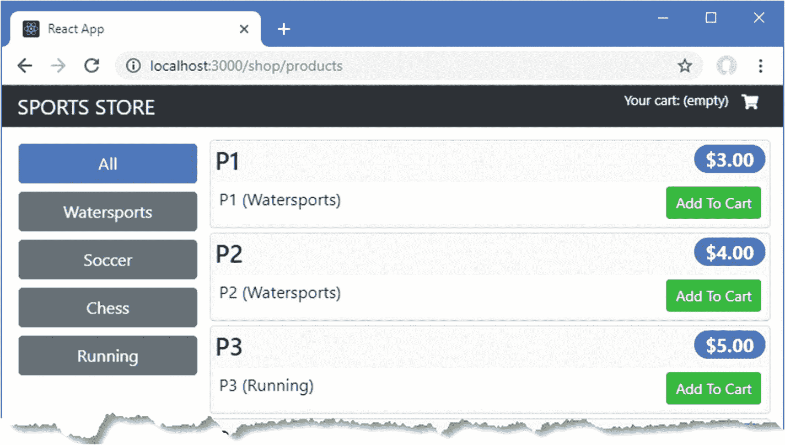
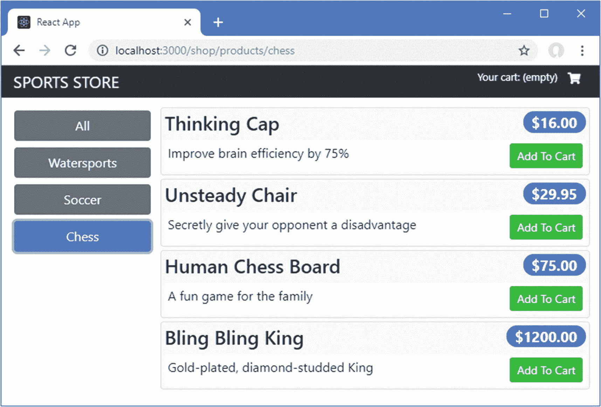
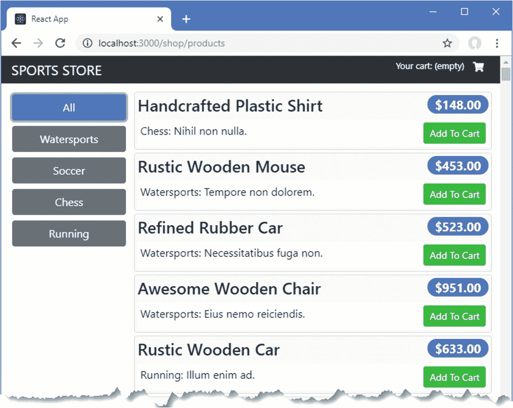
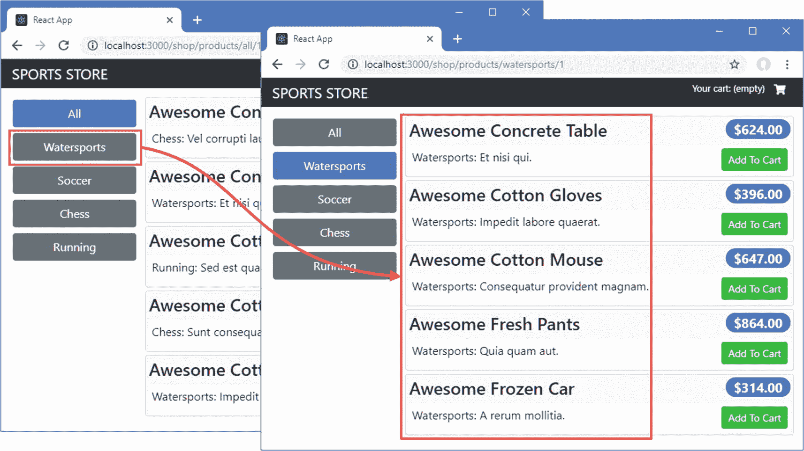
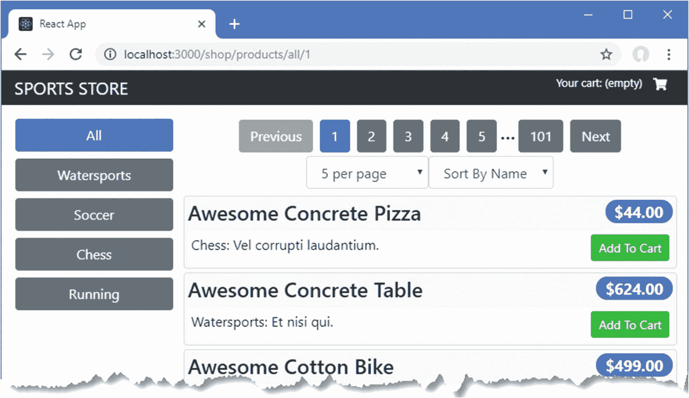
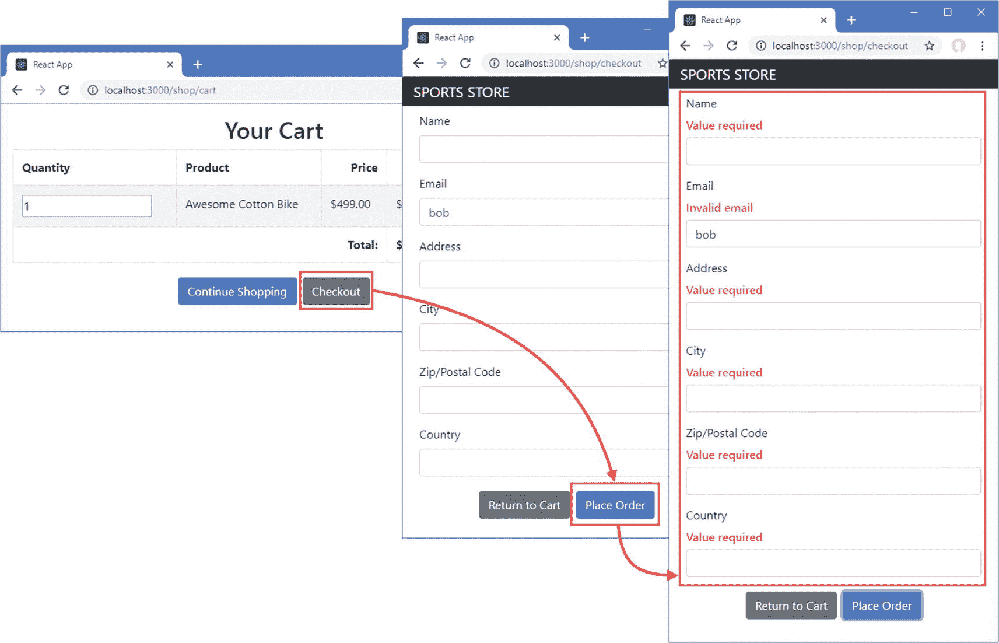
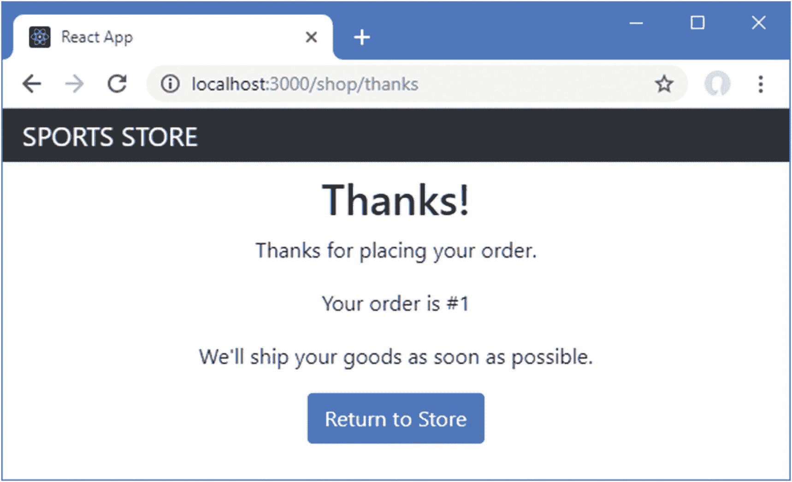

# 六、SportsStore：REST 和结帐

在本章中，我继续向我在第 [5](05.html) 章中创建的 SportsStore 应用添加特性。我添加了对从 web 服务中检索数据、在页面中显示大量数据以及结账和下订单的支持。

## 为本章做准备

本章不需要任何准备，它使用了在第 [5 章](05.html)中创建的 SportsStore 项目。要启动 React 开发工具和 RESTful web 服务，打开命令提示符，导航到`sportsstore`文件夹，运行清单 [6-1](#PC1) 中所示的命令。

### 小费

你可以从 [`https://github.com/Apress/pro-react-16`](https://github.com/Apress/pro-react-16) 下载本章以及本书其他章节的示例项目。

```jsx
npm start

Listing 6-1Starting the Development Tools and Web Service

```

初始构建过程需要几秒钟，之后一个新的浏览器窗口或选项卡将会打开并显示 SportsStore 应用，如图 [6-1](#Fig1) 所示。



图 6-1

运行 SportsStore 应用

## 使用 RESTful Web 服务

SportsStore 应用的基本结构正在成形，我已经有了足够的功能来移除占位符数据并开始使用 RESTful web 服务。在第 [7](07.html) 章中，我使用 GraphQL，它是 REST web 服务的一个更灵活(也更复杂)的替代方案，但是常规的 web 服务也很常见，我将使用 REST web 服务向 SportsStore 应用提供其产品数据，并在结账过程结束时提交订单。

我在第 23 章中更详细地描述了 REST，但是对于本章，我只需要一个基本的 HTTP 请求就可以开始了。打开新的浏览器选项卡并请求`http://localhost:3500/api/products`。浏览器将向 web 服务发送一个 HTTP GET 请求，该服务是在第 [5 章](05.html)中创建的，并由清单 [6-1](#PC1) 中的命令启动。与 URL 结合的 GET 方法告诉 web 服务需要一个产品列表，并产生以下结果:

```jsx
...
[{"id":1,"name":"Kayak","category":"Watersports",
     "description":"A boat for one person","price":275},
 {"id":2,"name":"Lifejacket","category":"Watersports",
     "description":"Protective and fashionable","price":48.95},
 {"id":3,"name":"Soccer Ball","category":"Soccer",
     "description":"FIFA-approved size and weight","price":19.5},
 {"id":4,"name":"Corner Flags","category":"Soccer",
     "description":"Give your playing field a professional touch","price":34.95},
 {"id":5,"name":"Stadium","category":"Soccer",
     "description":"Flat-packed 35,000-seat stadium","price":79500},
 {"id":6,"name":"Thinking Cap","category":"Chess",
     "description":"Improve brain efficiency by 75%","price":16},
 {"id":7,"name":"Unsteady Chair","category":"Chess",
     "description":"Secretly give your opponent a disadvantage","price":29.95},
 {"id":8,"name":"Human Chess Board","category":"Chess",
     "description":"A fun game for the family","price":75},
 {"id":9,"name":"Bling Bling King","category":"Chess",
     "description":"Gold-plated, diamond-studded King","price":1200}]
...

```

web 服务使用 JSON 数据格式响应请求，这在 React 应用中很容易处理，因为它类似于第 [4](04.html) 章中描述的 JavaScript 对象文字格式。在接下来的小节中，我将创建一个使用 web 服务的基础，并使用它来替换当前由 SportsStore 应用显示的静态数据。

### 创建配置文件

项目在生产和开发中经常需要不同的 URL。为了避免将 URL 硬编码到单独的 JavaScript 文件中，我在`src/data`文件夹中添加了一个名为`Urls.js`的文件，并用它来定义清单 [6-2](#PC3) 中所示的配置数据。

```jsx
import { DataTypes } from "./Types";

const protocol = "http";
const hostname = "localhost";
const port = 3500;

export const RestUrls = {
    [DataTypes.PRODUCTS]: `${protocol}://${hostname}:${port}/api/products`,
    [DataTypes.CATEGORIES]: `${protocol}://${hostname}:${port}/api/categories`
}

Listing 6-2The Contents of the Urls.js File in the src/data Folder

```

当我在第 [8](08.html) 章准备部署 SportsStore 应用时，我将能够在一个地方配置访问 web 服务所需的 URL。为了保持一致性，我使用了已经为数据存储定义的数据类型，这有助于保持对不同类型数据的引用的一致性，并降低了输入错误的风险。

### 创建数据源

我在`src/data`文件夹中添加了一个名为`RestDataSource.js`的文件，并添加了清单 [6-3](#PC4) 中所示的代码。我想合并负责向 web 服务发送 HTTP 请求并处理结果的代码，这样我就可以将它放在项目的一个地方。

```jsx
import Axios from "axios";
import { RestUrls } from "./Urls";

export class RestDataSource {

    GetData = (dataType) =>
        this.SendRequest("get", RestUrls[dataType]);

    SendRequest = (method, url) => Axios.request({ method, url });
}

Listing 6-3The Contents of the RestDataSource.js File in the src/data Folder

```

`RestDataSource`类使用 Axios 包向 web 服务发出 HTTP 请求。Axios 在第 [23 章](23.html)中有所描述，它是一个处理 HTTP 的流行包，因为它提供了一致的 API，并自动处理响应，将 JSON 转换成 JavaScript 对象。在清单 [6-3](#PC4) 中，`GetData`方法使用 Axios 向 web 服务发送 HTTP 请求，以获取指定数据类型的所有可用对象。来自`GetData`方法的结果是一个`Promise`，当从 web 服务收到响应时，这个结果被解析。

### 扩展数据存储

JavaScript 代码发送的 HTTP 请求是异步执行的。这不太符合 Redux 数据存储的默认行为，Redux 数据存储只在 reducer 处理一个动作时才响应变化。

Redux 数据存储可以扩展为支持使用中间件功能的异步操作，该功能检查发送到数据存储的动作，并在处理它们之前更改它们。在第 [20](20.html) 章中，我创建了数据存储中间件，它在执行异步请求以获取数据时拦截动作并延迟它们。

对于 SportsStore 应用，我将采用一种不同的方法，并添加对有效负载为 a `Promise`的动作的支持，我在第 [4](04.html) 章中简要描述了这一点。中间件将一直等到`Promise`被解析，然后使用`Promise`的结果作为有效负载来传递动作。我在`src/data`文件夹中添加了一个名为`AsyncMiddleware.js`的文件，并添加了清单 [6-4](#PC5) 中所示的代码。

```jsx
const isPromise = (payload) =>
    (typeof(payload) === "object" || typeof(payload) === "function")
        && typeof(payload.then) === "function";

export const asyncActions = () => (next) => (action) => {
    if (isPromise(action.payload)) {
        action.payload.then(result => next({...action, payload: result}));
    } else {
        next(action)
    }
}

Listing 6-4The Contents of the AsyncMiddleware.js File in the src/data Folder

```

清单 [6-4](#PC5) 中的代码包含一个函数，它通过查找函数或具有`then`函数的对象来检查动作的有效负载是否为`Promise`。`asyncAction`函数将被用作数据存储中间件，它调用`Promise`上的`then`来等待它被解析，此时它使用结果来替换有效负载并传递它，使用`next`函数，它继续通过数据存储的正常路径。有效载荷不是`Promise`的动作会被立即传递。在清单 [6-5](#PC6) 中，我已经将中间件添加到数据存储中。

```jsx
import { createStore, applyMiddleware } from "redux";

import { ShopReducer } from "./ShopReducer";
import { CartReducer } from "./CartReducer";
import { CommonReducer } from "./CommonReducer";

import { asyncActions } from "./AsyncMiddleware";

export const SportsStoreDataStore

    = createStore(CommonReducer(ShopReducer, CartReducer),

        applyMiddleware(asyncActions));

Listing 6-5Adding Middleware in the DataStore.js File in the src/data Folder

```

`applyMiddleware`用于包装中间件，以便它接收动作，结果作为参数传递给创建数据存储的`createStore`函数。其效果是清单 [6-4](#PC5) 中定义的`asyncActions`函数将能够检查发送到数据存储的所有动作，并无缝地处理那些带有`Promise`有效负载的动作。

### 更新活动创建者

在清单 [6-6](#PC7) 中，我从 store action creator 中删除了占位符数据，并用一个使用数据源发送请求的`Promise`代替了它。

```jsx
import { ActionTypes} from "./Types";

//import { data as phData} from "./placeholderData";

import { RestDataSource } from "./RestDataSource";

const dataSource = new RestDataSource();

export const loadData = (dataType) => ({
    type: ActionTypes.DATA_LOAD,
    payload: dataSource.GetData(dataType)

        .then(response => ({ dataType, data: response.data}))

});

Listing 6-6Using a Promise in the ActionCreators.js File in the src/data Folder

```

当数据存储接收到由`loadData`函数创建的动作对象时，清单 [6-5](#PC6) 中定义的中间件将等待从 web 服务接收到响应，然后传递动作进行正常处理，结果是 SportsStore 应用显示远程获取的数据，如图 [6-2](#Fig2) 所示。



图 6-2

使用来自 web 服务的数据

## 将数据分页

SportsStore 应用现在从 web 服务接收数据，但是大多数应用必须处理大量的数据，这些数据必须以页面的形式呈现给用户。在清单 [6-7](#PC8) 中，我已经使用 Faker.js 包生成了大量的产品来替换 web 服务提供的数据。

```jsx
var faker = require("faker");
var data = [];
var categories = ["Watersports", "Soccer", "Chess", "Running"];
faker.seed(100);
for (let i = 1; i <= 503; i++) {
    var category = faker.helpers.randomize(categories);
    data.push({
        id: i,
        name: faker.commerce.productName(),
        category: category,
        description: `${category}: ${faker.lorem.sentence(3)}`,
        price: Number(faker.commerce.price())
    })
}

module.exports = function () {
    return {
        categories: categories,
        products: data,
        orders: []
    }
}

Listing 6-7Increasing the Amount of Data in the data.js File in the sportsstore Folder

```

Faker.js 包是一个很好的工具，可以很容易地为开发和测试生成数据，通过在 [`https://github.com/Marak/Faker.js`](https://github.com/Marak/Faker.js) 描述的 API 提供上下文数据。当您保存`data.js`文件时，在第 [5 章](05.html)中创建的服务器代码将会检测到该更改，并将其加载到 web 服务中。在浏览器窗口中重新加载 SportsStore 应用，您将看到所有新产品都显示在一个列表中，如图 [6-3](#Fig3) 所示。用户仍然可以使用类别按钮来过滤产品，但是一次显示的数据仍然太多。



图 6-3

为测试分页生成更多数据

### 小费

清单 [6-7](#PC8) 中的代码创建了 503 个产品对象。使用不可被您打算支持的页面大小整除的对象数量是一个好主意，这样您就可以确保您的代码处理最后一页上的一些掉队者。

### 了解 Web 服务分页支持

分页需要服务器的支持，以便它为客户端提供请求可用数据子集和关于有多少数据可用的信息的方法。没有提供分页的标准方法，您应该查阅所使用的服务器或服务的文档。

为 SportsStore 应用提供 RESTful web 服务的`json-server`包支持通过查询字符串进行分页。打开一个新的浏览器窗口，请求清单 [6-8](#PC9) 中显示的 URL，看看分页是如何工作的。

```jsx
http://localhost:3500/api/products?category_like=watersports&_page=2&_limit=3&_sort=name

Listing 6-8Requesting a Page of Data

```

这个 URL 的查询字符串——跟在`?`字符后面的部分——要求 web 服务使用表 [6-1](#Tab1) 中描述的字段返回一个特定类别的产品页面。

表 6-1

分页所需的查询字符串字段

<colgroup><col class="tcol1 align-left"> <col class="tcol2 align-left"></colgroup> 
| 

名字

 | 

描述

 |
| --- | --- |
| `category_like` | 该字段过滤结果，只包括那些 category 属性与字段值匹配的对象，字段值在示例 URL 中是`Watersports`。如果省略类别字段，则所有类别的产品都将包含在结果中。 |
| `_page` | 该字段选择页码。 |
| `_limit` | 该字段选择页面尺寸。 |
| `_sort` | 此字段指定对象在分页前排序所依据的属性。 |

清单 [6-8](#PC9) 中的 URL 要求 web 服务返回第二个页面，该页面包含集合中的三个产品，这些产品的`category`值为`Watersports`，按`name`属性排序，产生以下结果:

```jsx
...
[
 {"id":469,"name":"Awesome Fresh Pants","category":"Watersports",
    "description":"Watersports: Quia quam aut.","price":864},
 {"id":19,"name":"Awesome Frozen Car","category":"Watersports",
     "description":"Watersports: A rerum mollitia.","price":314},
  {"id":182,"name":"Awesome Granite Fish", "category":"Watersports",
      description":"Watersports: Hic omnis incidunt.","price":521}
]
...

```

web 服务响应包含帮助客户端发出未来请求的标头。使用浏览器请求清单 [6-9](#PC11) 中显示的 URL。

```jsx
http://localhost:3500/api/products?_page=2&_limit=3

Listing 6-9Making a Simpler Pagination Request

```

更简单的 URL 使得结果标题更容易理解。使用浏览器的 F12 开发工具检查响应，您将看到它包含以下标题:

```jsx
...
X-Total-Count: 503
Link: <http://localhost:3500/api/products?_page=1&_limit=3>; rel="first",
      <http://localhost:3500/api/products?_page=1&_limit=3>; rel="prev",
      <http://localhost:3500/api/products?_page=3&_limit=3>; rel="next",
      <http://localhost:3500/api/products?_page=168&_limit=3>; rel="last"
...

```

这些并不是响应中仅有的头，但它们是专门添加来帮助客户端处理未来的分页请求的。`X-Total-Count`头提供了请求 URL 匹配的对象总数，这对于确定页面总数很有用。由于在清单 [6-9](#PC11) 的 URL 中没有`category`字段，服务器报告有 503 个对象可用。

`Link`头提供了一组 URL，可用于查询第一页和最后一页，以及当前页面之前和之后的页面，尽管客户端不需要使用`Link`头来制定后续请求。

### 更改 HTTP 请求和操作

在清单 [6-10](#PC13) 中，我修改了获取产品数据的请求的 URL 的公式，以包含请求参数，这些参数将用于请求页面和指定类别。Axios 包将使用参数向请求 URL 添加查询字符串。

```jsx
import Axios from "axios";
import { RestUrls } from "./Urls";

export class RestDataSource {

    GetData = async(dataType, params) =>

        this.SendRequest("get", RestUrls[dataType], params);

    SendRequest = (method, url, params) => Axios.request({
                method, url, params

    });
}

Listing 6-10Adding URL Parameters in the RestDataSource.js File in the src/data/rest Folder

```

在清单 [6-11](#PC14) 中，我已经更新了由`loadData`动作创建器创建的动作，这样它就包含了参数，并且将响应中的附加信息添加到数据存储中。

```jsx
import { ActionTypes } from "./Types";
import { RestDataSource } from "./RestDataSource";

const dataSource = new RestDataSource();

export const loadData = (dataType, params) => (

    {
        type: ActionTypes.DATA_LOAD,
        payload: dataSource.GetData(dataType, params).then(response =>

             ({ dataType,
                data: response.data,
                total: Number(response.headers["x-total-count"]),

                params

             })
        )
    })

Listing 6-11Changing the Action in the ActionCreators.js File in the src/data Folder

```

当数据存储中间件解析了`Promise`之后，发送给 reducer 的动作对象将包含`payload.total`和`payload.params`属性。`total`属性将包含`X-Total-Count`头的值，我将使用它来创建分页导航控件。`params`属性将包含用于发出请求的参数，我将使用这些参数来确定用户何时做出了需要更多数据的 HTTP 请求的更改。在清单 [6-12](#PC15) 中，我已经更新了处理`DATA_LOAD`动作的 reducer，这样新的动作属性就被添加到了数据存储中。

```jsx
import { ActionTypes } from "./Types";

export const ShopReducer = (storeData, action) => {
    switch(action.type) {
        case ActionTypes.DATA_LOAD:
            return {
                ...storeData,
                [action.payload.dataType]: action.payload.data,
                [`${action.payload.dataType}_total`]: action.payload.total,

                [`${action.payload.dataType}_params`]: action.payload.params

            };
        default:
            return storeData || {};
    }
}

Listing 6-12Adding Data Store Properties in the ShopReducer.js File in the src/data Folder

```

### 创建数据加载组件

为了创建一个负责获取产品数据的组件，我在`src/data`文件夹中添加了一个名为`DataGetter.js`的文件，并用它来定义清单 [6-13](#PC16) 中所示的组件。

```jsx
import React, { Component } from "react";
import { DataTypes } from "../data/Types";

export class DataGetter extends Component {

    render() {
        return <React.Fragment>{ this.props.children }</React.Fragment>
    }

    componentDidUpdate = () => this.getData();
    componentDidMount = () => this.getData();

    getData = () => {
        const dsData = this.props.products_params || {} ;
        const rtData = {
            _limit: this.props.pageSize || 5,
            _sort: this.props.sortKey || "name",
            _page: this.props.match.params.page || 1,
            category_like: (this.props.match.params.category || "") === "all"
                ? "" : this.props.match.params.category
        }

        if (Object.keys(rtData).find(key => dsData[key] !== rtData[key])) {
            this.props.loadData(DataTypes.PRODUCTS, rtData);
        }
    }
}

Listing 6-13The Contents of the DataGetter.js File in the src/data Folder

```

该组件使用`children`属性呈现其父组件在开始和结束标记之间提供的内容。这对于定义向应用提供服务但不向用户呈现内容的组件很有用。在这种情况下，我需要一个组件，它可以接收当前路线及其参数的详细信息，还可以访问数据存储。组件的`componentDidMount`和`componentDidUpdate`方法都是第 [13 章](13.html)中描述的组件生命周期的一部分，它们调用`getData`方法，该方法从 URL 获取参数，并将它们与上次请求后添加到数据存储中的参数进行比较。如果发生了变化，将会分派一个新的动作来加载用户所需的数据。

除了从 URL 获取的类别和页码之外，还使用参数`_sort`和`_limit`来创建操作，这些参数对结果进行排序并设置数据大小。用于排序和设置页面大小的值将从数据存储中获得。

### 更新存储连接器组件

为了在应用中引入分页支持，我更新了`ShopConnector`组件，它负责将应用中的商店功能连接到数据存储和 URL 路由。清单 [6-14](#PC17) 中的更改添加了`DataGetter`组件，并删除了产品数据的类别过滤器(因为产品已经被 web 服务过滤了)。

```jsx
import React, { Component } from "react";
import { Switch, Route, Redirect }
    from "react-router-dom"
import { connect } from "react-redux";
import { loadData } from "../data/ActionCreators";
import { DataTypes } from "../data/Types";
import { Shop } from "./Shop";
import { addToCart, updateCartQuantity, removeFromCart, clearCart }
    from "../data/CartActionCreators";
import { CartDetails } from "./CartDetails";

import { DataGetter } from "../data/DataGetter";

const mapStateToProps = (dataStore) => ({
    ...dataStore
})

const mapDispatchToProps = {
    loadData,
    addToCart, updateCartQuantity, removeFromCart, clearCart
}

// const filterProducts = (products = [], category) =>

//     (!category || category === "All")

//         ? products

//         : products.filter(p =>

//               p.category.toLowerCase() === category.toLowerCase());

export const ShopConnector = connect(mapStateToProps, mapDispatchToProps)(
    class extends Component {
        render() {
            return <Switch>
                <Redirect from="/shop/products/:category"

                    to="/shop/products/:category/1" exact={ true } />

                <Route path={ "/shop/products/:category/:page" }

                    render={ (routeProps) =>
                        <DataGetter { ...this.props } { ...routeProps }>

                            <Shop { ...this.props } { ...routeProps }  />
                        </DataGetter>

                    } />
                <Route path="/shop/cart" render={ (routeProps) =>
                        <CartDetails { ...this.props } { ...routeProps }  />} />
                <Redirect to="/shop/products/all/1" />

            </Switch>
        }

        componentDidMount() {
            this.props.loadData(DataTypes.CATEGORIES);
            //this.props.loadData(DataTypes.PRODUCTS);

        }
    }
)

Listing 6-14Adding Pagination in the ShopConnector.js File in the src/shop Folder

```

我已经更新了路由配置以支持分页。第一个路由更改是添加了一个`Redirect`，它匹配有类别但没有页面的 URL，并将它们重定向到所选类别的第一个页面的 URL。我还修改了现有的`Redirect`，使其将任何不匹配的 URL 重定向到`/shop/products/all`。

结果是代码块看起来比实际更复杂。当`ShopConnector`组件被请求呈现其内容时，它使用一个`Route`来匹配 URL 并获得`category`和`parameters`，如下所示:

```jsx
...
<Route path={ "/shop/products/:category/:page" }
...

```

紧接在`Route`之前的是一个`Redirect`，它匹配只有一个段的 URL，并将浏览器重定向到一个将选择第一页的 URL:

```jsx
...
<Redirect from="/shop/products/:category"
          to="/shop/products/:category/1" exact={ true } />
...

```

这种重定向确保了总是有类别和页面值可以使用。另一个`Redirect`匹配任何其他 URL，并将它们重定向到产品第一页的 URL，不按类别过滤。

```jsx
...
<Redirect to="/shop/products/all/1" />
...

```

### 更新所有类别按钮

清单 [6-14](#PC17) 中使用的路由组件需要对`All`类别按钮进行相应的更改，以便在没有选择类别时高亮显示，如清单 [6-15](#PC21) 所示。

```jsx
import React, { Component } from "react";
import { ToggleLink } from "../ToggleLink";

export class CategoryNavigation extends Component {

    render() {
        return <React.Fragment>
            <ToggleLink to={ `${this.props.baseUrl}/all` } exact={ false }>

                All
            </ToggleLink>
            { this.props.categories && this.props.categories.map(cat =>
                <ToggleLink key={ cat }
                    to={ `${this.props.baseUrl}/${cat.toLowerCase()}`}>
                    { cat }
                </ToggleLink>
            )}
        </React.Fragment>
    }
}

Listing 6-15Updating the All Button in the CategoryNavigation.js File in the src/shop Folder

```

我已经将`/all`添加到由`ToggleLink`组件匹配的 URL 中，并将`exact`属性设置为`false`，这样像`/shop/products/all/1`这样的 URL 就会被匹配。效果是应用从 web 服务请求单独的数据页面，web 服务也负责基于类别进行过滤。每当用户点击一个类别按钮，`DataGetter`组件就会请求新的数据，如图 [6-4](#Fig4) 所示。



图 6-4

从 web 服务请求数据页面

### 创建分页控件

下一步是创建一个允许用户导航到不同页面并更改页面大小的组件。清单 [6-16](#PC22) 定义了新的数据存储动作类型，这些动作类型将用于更改页面大小并指定将用于排序结果的属性。

```jsx
export const DataTypes = {
    PRODUCTS: "products",
    CATEGORIES: "categories"
}

export const ActionTypes = {
    DATA_LOAD: "data_load",
    DATA_SET_SORT_PROPERTY: "data_set_sort",

    DATA_SET_PAGESIZE: "data_set_pagesize",

    CART_ADD: "cart_add",
    CART_UPDATE: "cart_update",
    CART_REMOVE: "cart_delete",
    CART_CLEAR: "cart_clear"
}

Listing 6-16Adding New Action Types in the Types.js File in the src/data Folder

```

在清单 [6-17](#PC23) 中，我添加了使用新类型创建动作的新动作创建器。

```jsx
import { ActionTypes } from "./Types";
import { RestDataSource } from "./RestDataSource";

const dataSource = new RestDataSource();

export const loadData = (dataType, params) => (
    {
        type: ActionTypes.DATA_LOAD,
        payload: dataSource.GetData(dataType, params).then(response =>
             ({ dataType,
                data: response.data,
                total: Number(response.headers["x-total-count"]),
                params
             })
        )
    })

export const setPageSize = (newSize) =>

    ({ type: ActionTypes.DATA_SET_PAGESIZE, payload: newSize});

export const setSortProperty = (newProp) =>

    ({ type: ActionTypes.DATA_SET_SORT_PROPERTY, payload: newProp});

Listing 6-17Defining Creators in the ActionCreators.js File in the src/data Folder

```

在清单 [6-18](#PC24) 中，我扩展了 reducer 来支持新的动作。

```jsx
import { ActionTypes } from "./Types";

export const ShopReducer = (storeData, action) => {
    switch(action.type) {
        case ActionTypes.DATA_LOAD:
            return {
                ...storeData,
                [action.payload.dataType]: action.payload.data,
                [`${action.payload.dataType}_total`]: action.payload.total,
                [`${action.payload.dataType}_params`]: action.payload.params
            };
        case ActionTypes.DATA_SET_PAGESIZE:

            return { ...storeData, pageSize: action.payload }

        case ActionTypes.DATA_SET_SORT_PROPERTY:

            return { ...storeData, sortKey: action.payload }

        default:
            return storeData || {};
    }
}

Listing 6-18Supporting New Actions in the ShopReducer.js File in the src/data Folder

```

为了生成允许用户使用分页特性的 HTML 元素，我在`src`文件夹中添加了一个名为`PaginationControls.js`的文件，并用它来定义清单 [6-19](#PC25) 中所示的组件。

```jsx
import React, { Component } from "react";
import { PaginationButtons } from "./PaginationButtons";

export class PaginationControls extends Component {

    constructor(props) {
        super(props);
        this.pageSizes = this.props.sizes || [5, 10, 25, 100];
        this.sortKeys = this.props.keys || ["Name", "Price"];
    }

    handlePageSizeChange = (ev) => {
        this.props.setPageSize(ev.target.value);
    }

    handleSortPropertyChange = (ev) => {
        this.props.setSortProperty(ev.target.value);
    }

    render() {
        return <div className="m-2">
                <div className="text-center m-1">
                    <PaginationButtons currentPage={this.props.currentPage}
                        pageCount={this.props.pageCount}
                        navigate={ this.props.navigateToPage }/>
                </div>
                <div className="form-inline justify-content-center">
                    <select className="form-control"
                            onChange={ this.handlePageSizeChange }
                            value={ this.props.pageSize|| this.pageSizes[0] }>
                        { this.pageSizes.map(s =>
                            <option value={s} key={s}>{s} per page</option>
                        )}
                    </select>
                    <select className="form-control"
                            onChange={ this.handleSortPropertyChange }
                            value={ this.props.sortKey || this.sortKeys[0] }>
                        { this.sortKeys.map(k =>
                            <option value={k.toLowerCase()} key={k}>
                                Sort By { k }
                            </option>
                        )}
                    </select>
            </div>
        </div>
    }
}

Listing 6-19The Contents of the PaginationControls.js File in the src Folder

```

`PaginationControls`组件使用`select`元素来允许用户更改页面大小和用于对结果进行排序的属性。提供可选择的单个值的`option`元素可以使用 props 进行配置，这将允许我在第 [7](07.html) 章的管理特性中重用这个组件。如果没有提供 props，那么使用适合分页产品的缺省值。

将`onChange`属性应用于`select`元素以响应用户更改，这些更改由接收由更改触发的事件的方法处理，并调用从父组件接收的函数属性。

生成允许页面间移动的按钮的过程已经委托给一个名为`PaginationButtons`的组件。为了创建这个组件，我在`src`文件夹中添加了一个名为`PaginationButtons.js`的文件，并添加了清单 [6-20](#PC26) 中所示的代码。

```jsx
import React, { Component } from "react";

export class PaginationButtons extends Component {

    getPageNumbers = () => {
        if (this.props.pageCount < 4) {
            return [...Array(this.props.pageCount + 1).keys()].slice(1);
        } else if (this.props.currentPage <= 4) {
            return [1, 2, 3, 4, 5];
        } else  if (this.props.currentPage > this.props.pageCount - 4) {
            return [...Array(5).keys()].reverse()
                .map(v => this.props.pageCount - v);
        } else {
            return [this.props.currentPage -1, this.props.currentPage,
                this.props.currentPage + 1];
        }
    }

    render() {
        const current = this.props.currentPage;
        const pageCount = this.props.pageCount;
        const navigate = this.props.navigate;
        return <React.Fragment>
            <button onClick={ () => navigate(current  - 1) }
                disabled={ current === 1 } className="btn btn-secondary mx-1">
                    Previous
            </button>
            { current > 4 &&
                <React.Fragment>
                    <button className="btn btn-secondary mx-1"
                        onClick={ () => navigate(1)}>1</button>
                    <span className="h4">...</span>
                </React.Fragment>
            }
            { this.getPageNumbers().map(num =>
                <button className={ `btn mx-1 ${num === current
                        ? "btn-primary": "btn-secondary"}`}
                    onClick={ () => navigate(num)} key={ num }>
                        { num }
                </button>)}
            { current <= (pageCount - 4) &&
                <React.Fragment>
                    <span className="h4">...</span>
                    <button className="btn btn-secondary mx-1"
                            onClick={ () => navigate(pageCount)}>
                        { pageCount }
                    </button>
                </React.Fragment>
            }
            <button onClick={ () => navigate(current + 1) }
                disabled={ current === pageCount }
                className="btn btn-secondary mx-1">
                    Next
            </button>
        </React.Fragment>
    }
}

Listing 6-20The Contents of the PaginationButtons.js File in the src Folder

```

创建分页按钮是一个复杂的过程，很容易陷入细节中。我在清单 [6-20](#PC26) 中采用的方法旨在简单性和为用户提供足够的上下文来浏览大量数据之间取得平衡。

为了将分页控件连接到商店中的产品数据，我在`src/shop`文件夹中添加了一个名为`ProductPageConnector.js`的文件，并定义了清单 [6-21](#PC27) 中所示的组件。

```jsx
import { connect } from "react-redux";
import { withRouter } from "react-router-dom";
import { setPageSize, setSortProperty } from "../data/ActionCreators";

const mapStateToProps = dataStore => dataStore;
const mapDispatchToProps = { setPageSize, setSortProperty };

const mergeProps = (dataStore, actionCreators, router) => ({
    ...dataStore, ...router, ...actionCreators,
    currentPage: Number(router.match.params.page),
    pageCount: Math.ceil((dataStore.products_total
        | dataStore.pageSize || 5)/(dataStore.pageSize || 5)),
    navigateToPage: (page) => router.history
        .push(`/shop/products/${router.match.params.category}/${page}`),
})

export const ProductPageConnector = (PageComponent) =>
    withRouter(connect(mapStateToProps, mapDispatchToProps,
        mergeProps)(PageComponent))

Listing 6-21The Contents of the ProductPageConnector.js File in the src/shop Folder

```

正如我前面解释的那样，React 应用中的复杂性通常集中在不同功能组合的地方，这就是 SportsStore 应用中的连接器组件。清单 [6-21](#PC27) 中的代码创建了一个高阶组件(称为 *HOC* 并在第 [14 章](14.html)中描述)，这是一个通过其 props 向另一个组件提供特性的函数。这个 HOC 被命名为`ProductPageConnector`，它结合了数据存储属性、动作创建器和路由参数，为分页控件组件提供了对它们所需特性的访问。`connect`函数与我在第 [5](05.html) 章中使用的用于将组件连接到数据存储的函数相同，它与`withRouter`函数一起使用，后者是 React 路由包中的对应函数，它为组件提供了来自最近的`Route`的路由细节。在清单 [6-22](#PC28) 中，我将高阶组件应用于`PaginationControls`组件，并将结果添加到呈现给用户的内容中。

```jsx
import React, { Component } from "react";
import { CategoryNavigation } from "./CategoryNavigation";
import { ProductList } from "./ProductList";
import { CartSummary } from "./CartSummary";

import { ProductPageConnector } from "./ProductPageConnector";

import { PaginationControls } from "../PaginationControls";

const ProductPages = ProductPageConnector(PaginationControls);

export class Shop extends Component {

    handleAddToCart = (...args) => {
        this.props.addToCart(...args);
        this.props.history.push("/shop/cart");
    }

    render() {
        return <div className="container-fluid">
            <div className="row">
                <div className="col bg-dark text-white">
                    <div className="navbar-brand">SPORTS STORE</div>
                    <CartSummary { ...this.props } />
                </div>
            </div>
            <div className="row">
                <div className="col-3 p-2">
                    <CategoryNavigation baseUrl="/shop/products"
                        categories={ this.props.categories } />
                </div>
                <div className="col-9 p-2">
                    <ProductPages />

                    <ProductList products={ this.props.products }
                        addToCart={ this.handleAddToCart } />
                </div>
            </div>
        </div>
    }
}

Listing 6-22Adding Pagination Controls in the Shop.js File in the src/shop Folder

```

结果是一系列允许用户在页面间移动的按钮，以及改变排序属性和页面大小的`select`元素，如图 [6-5](#Fig5) 所示。



图 6-5

添加对分页产品的支持

## 添加结账流程

该应用的核心功能已经就绪，允许用户过滤和浏览产品数据，并将商品添加到以摘要和详细视图显示的购物篮中。一旦用户完成了结帐过程，一个新的订单必须被发送到 web 服务，web 服务将完成购物，重置用户的购物车，并显示一条摘要消息。在接下来的小节中，我将添加对结账和下订单的支持。

### 扩展 REST 数据源和数据存储

正如我在第 23 章中解释的，当一个 RESTful web 服务接收到一个 HTTP 请求时，它使用请求方法(也称为*动词*)和 URL 的组合来决定应该执行什么操作。为了向 web 服务发送订单，我将向 web 服务的`/orders` URL 发送一个 POST 请求。为了使新特性与现有应用保持一致，我首先添加了一个标识订单数据类型的常数和一个存储订单的新动作，如清单 [6-23](#PC29) 所示。

```jsx
export const DataTypes = {
    PRODUCTS: "products",
    CATEGORIES: "categories",
    ORDERS: "orders"

}

export const ActionTypes = {
    DATA_LOAD: "data_load",
    DATA_STORE: "data_store",

    DATA_SET_SORT_PROPERTY: "data_set_sort",
    DATA_SET_PAGESIZE: "data_set_pagesize",
    CART_ADD: "cart_add",
    CART_UPDATE: "cart_update",
    CART_REMOVE: "cart_delete",
    CART_CLEAR: "cart_clear"
}

Listing 6-23Adding Types in the Types.js File in the src/data Folder

```

新的数据类型允许我定义下订单的 URL，如清单 [6-24](#PC30) 所示。当我添加对管理特性的支持时，我也在第 7 章[中使用它。](07.html)

```jsx
import { DataTypes } from "./Types";

const protocol = "http";
const hostname = "localhost";
const port = 3500;

export const RestUrls = {
    [DataTypes.PRODUCTS]: `${protocol}://${hostname}:${port}/api/products`,
    [DataTypes.CATEGORIES]: `${protocol}://${hostname}:${port}/api/categories`,
    [DataTypes.ORDERS]: `${protocol}://${hostname}:${port}/api/orders`

}

Listing 6-24Adding a New URL in the Urls.js File in the src/data Folder

```

在清单 [6-25](#PC31) 中，我向 REST 数据源添加了一个方法，该方法接收订单对象并将其发送给 web 服务。

```jsx
import Axios from "axios";
import { RestUrls } from "./Urls";

export class RestDataSource {

    constructor(err_handler) {
        this.error_handler = err_handler || (() => {});
    }

    GetData = (dataType, params) =>
        this.SendRequest("get", RestUrls[dataType], params);

    StoreData = (dataType, data) =>

        this.SendRequest("post", RestUrls[dataType], {}, data);

    SendRequest = (method, url, params, data) =>

        Axios.request({ method, url, params, data });
}

Listing 6-25Adding a Method in the RestDataSource.js File in the src/data Folder

```

Axios 包将接收一个数据对象，并负责对其进行格式化，以便将其发送到 web 服务。在清单 [6-26](#PC32) 中，我添加了一个新的动作创建器，它使用一个`Promise`向 web 服务发送订单。web 服务将返回存储的数据，其中包括一个唯一的标识符。

```jsx
import { ActionTypes, DataTypes } from "./Types";

import { RestDataSource } from "./RestDataSource";

const dataSource = new RestDataSource();

export const loadData = (dataType, params) => (
    {
        type: ActionTypes.DATA_LOAD,
        payload: dataSource.GetData(dataType, params).then(response =>
             ({ dataType,
                data: response.data,
                total: Number(response.headers["x-total-count"]),
                params
             })
        )
    })

export const setPageSize = (newSize) => {
    return ({ type: ActionTypes.DATA_SET_PAGESIZE, payload: newSize});
}

export const setSortProperty = (newProp) =>
    ({ type: ActionTypes.DATA_SET_SORT_PROPERTY, payload: newProp});

export const placeOrder = (order) => ({

        type: ActionTypes.DATA_STORE,

        payload: dataSource.StoreData(DataTypes.ORDERS, order).then(response => ({

            dataType: DataTypes.ORDERS, data: response.data

        }))

    })

Listing 6-26Adding a Creator to the ActionCreators.js File in the src/data Folder

```

为了处理结果并将订单添加到数据存储中，我添加了清单 [6-27](#PC33) 中所示的缩减器。

```jsx
import { ActionTypes, DataTypes } from "./Types";

export const ShopReducer = (storeData, action) => {
    switch(action.type) {
        case ActionTypes.DATA_LOAD:
            return {
                ...storeData,
                [action.payload.dataType]: action.payload.data,
                [`${action.payload.dataType}_total`]: action.payload.total,
                [`${action.payload.dataType}_params`]: action.payload.params
            };
        case ActionTypes.DATA_SET_PAGESIZE:
            return { ...storeData, pageSize: action.payload }
        case ActionTypes.DATA_SET_SORT_PROPERTY:
            return { ...storeData, sortKey: action.payload }
        case ActionTypes.DATA_STORE:

            if (action.payload.dataType === DataTypes.ORDERS) {

                return { ...storeData, order: action.payload.data }

            }

            break;

        default:
            return storeData || {};
    }
}

Listing 6-27Storing an Order in the ShopReducer.js File in the src/data Folder

```

### 创建签出表单

要完成 SportsStore 订单，用户必须填写一个包含个人详细信息的表单，这意味着我必须向用户提供一个表单。React 支持两种使用表单元素的方式:*受控*和*非受控*。对于受控元素，React 管理元素的内容并响应其更改事件。用于配置分页的`select`元素就属于这一类。对于 checkout 表单，我将使用不受控制的元素，这些元素不受 React 的严密管理，更多地依赖于浏览器的功能。使用不受控制的 for 元素的关键是一个名为 *refs* 的特性，在第 [16](16.html) 章中有描述，它允许 React 组件在 HTML 元素显示给用户后，跟踪由它的`render`方法产生的 HTML 元素。对于结帐表单，使用`refs`的好处是我可以使用 HTML5 验证 API 来验证表单，我在第 [15](15.html) 章中对此进行了描述。验证 API 要求直接访问表单元素，如果不使用 refs，这是不可能的。

### 注意

React 应用中有一些可用于创建和验证表单的包，但是它们可能很难使用，也很难对表单的外观或它生成的数据结构施加限制。使用第 [15](15.html) 章和第 [16](16.html) 章中描述的特性很容易创建定制表单和验证，这是我在 SportsStore 章节中采用的方法。

#### 创建经过验证的表单

我将创建一个带有验证的可重用表单，它将通过编程生成所需的字段。我创建了`src/forms`文件夹，并在其中添加了一个名为`ValidatedForm.js`的文件，我用它来定义清单 [6-28](#PC34) 中所示的组件。

```jsx
import React, { Component } from "react";
import { ValidationError } from "./ValidationError";
import { GetMessages } from "./ValidationMessages";

export class ValidatedForm extends Component {

    constructor(props) {
        super(props);
        this.state = {
            validationErrors: {}
        }
        this.formElements = {};
    }

    handleSubmit = () => {
        this.setState(state => {
            const newState = { ...state, validationErrors: {} }
            Object.values(this.formElements).forEach(elem => {
                if (!elem.checkValidity()) {
                    newState.validationErrors[elem.name] = GetMessages(elem);
                }
            })
            return newState;
        }, () => {
            if (Object.keys(this.state.validationErrors).length === 0) {
                const data =  Object.assign(...Object.entries(this.formElements)
                    .map(e => ({[e[0]]: e[1].value})) )
                this.props.submitCallback(data);
            }
        });
    }

    registerRef = (element) => {
        if (element !== null) {
            this.formElements[element.name] = element;
        }
    }

    renderElement = (modelItem) => {
        const name = modelItem.name || modelItem.label.toLowerCase();
        return <div className="form-group" key={ modelItem.label }>
            <label>{ modelItem.label }</label>
            <ValidationError errors={ this.state.validationErrors[name] } />
            <input className="form-control" name={ name } ref={ this.registerRef }
                { ...this.props.defaultAttrs } { ...modelItem.attrs } />
        </div>
    }

    render() {
        return <React.Fragment>
            { this.props.formModel.map(m => this.renderElement(m))}
            <div className="text-center">
                <button className="btn btn-secondary m-1"
                        onClick={ this.props.cancelCallback }>
                    { this.props.cancelText || "Cancel" }
                </button>
                <button className="btn btn-primary m-1"
                        onClick={ this.handleSubmit }>
                    { this.props.submitText || "Submit"}
                </button>
            </div>
        </React.Fragment>
    }
}

Listing 6-28The Contents of the ValidatedForm.js File in the src/forms Folder

```

`ValidatedForm`组件接收一个数据模型并使用它创建一个表单，该表单使用 HTML5 API 进行验证。每个表单元素都有一个标签和一个向用户显示验证消息的`ValidationError`组件。该表单显示有按钮，这些按钮使用作为属性提供的回调函数来取消或提交表单。除非所有元素都满足验证约束，否则不会调用`submit`回调。

当调用提交回调时，它将接收一个对象，该对象的属性是表单元素的`name`属性值，其值是用户输入到每个字段中的数据。

#### 定义表单

为了创建用于显示错误消息的组件，我在`src/forms`文件夹中添加了一个名为`ValidationError.js`的文件，并添加了清单 [6-29](#PC35) 中所示的代码。

```jsx
import React, { Component } from "react";

export class ValidationError extends Component {

    render() {
        if (this.props.errors) {
            return this.props.errors.map(err =>
                <h6 className="text-danger" key={err}>
                    { err }
                </h6>
            )
        }
        return null;
    }
}

Listing 6-29The Contents of the ValidationError.js File in the src/forms Folder

```

验证 API 以一种尴尬的方式呈现验证错误，如第 [16](16.html) 章所述。为了创建可以显示给用户的消息，我在`src/forms`文件夹中添加了一个名为`ValidationMessages.js`的文件，并定义了清单 [6-30](#PC36) 中所示的函数。

```jsx
export const GetMessages = (elem) => {
    const messages = [];
    if (elem.validity.valueMissing) {
        messages.push("Value required");
    }
    if (elem.validity.typeMismatch) {
        messages.push(`Invalid ${elem.type}`);
    }
    return messages;
}

Listing 6-30The Contents of the ValidationMessages.js File in the src/forms Folder

```

为了使用验证过的表单进行签出，我在`src/shop`文件夹中添加了一个名为`Checkout.js`的文件，并定义了清单 [6-31](#PC37) 中所示的组件。

```jsx
import React, { Component } from "react";
import { ValidatedForm } from "../forms/ValidatedForm";

export class Checkout extends Component {

    constructor(props) {
        super(props);
        this.defaultAttrs = { type: "text", required: true };
        this.formModel = [
                { label: "Name"},
                { label: "Email", attrs: { type: "email" }},
                { label: "Address" },
                { label: "City"},
                { label: "Zip/Postal Code", name: "zip"},
                { label: "Country"}]
    }

    handleSubmit = (formData) => {
        const order = { ...formData, products: this.props.cart.map(item =>
            ({  quantity: item.quantity, product_id: item.product.id})) }
        this.props.placeOrder(order);
        this.props.clearCart();
        this.props.history.push("/shop/thanks");
    }

    handleCancel = () => {
        this.props.history.push("/shop/cart");
    }

    render() {
        return <div className="container-fluid">
            <div className="row">
                <div className="col bg-dark text-white">
                    <div className="navbar-brand">SPORTS STORE</div>
                </div>
            </div>
            <div className="row">
                <div className="col m-2">
                    <ValidatedForm formModel={ this.formModel }
                        defaultAttrs={ this.defaultAttrs }
                        submitCallback={ this.handleSubmit }
                        cancelCallback={ this.handleCancel }
                        submitText="Place Order"
                        cancelText="Return to Cart" />
                </div>
            </div>
        </div>
    }
}

Listing 6-31The Contents of the Checkout.js File in the src/shop Folder

```

`Checkout`组件使用一个`ValidatedForm`向用户显示他们的姓名、电子邮件和地址。每个表单元素都将创建有`required`属性，电子邮件地址的`input`元素的`type`属性被设置为`email`。这些属性由 HTML5 约束验证 API 使用，并且将阻止用户下订单，除非他们为所有字段提供值并且在电子邮件字段中输入有效的电子邮件地址(尽管应当注意，仅验证电子邮件地址的格式)。

当用户提交有效的表单数据时，将调用`handleSubmit`方法。这个方法接收表单数据，并在调用`placeOrder`和`clearCart`动作创建者之前，将表单数据与用户购物车的详细信息结合起来，然后导航到`/shop/thanks` URL。

#### 创建感谢组件

为了向用户提供订单确认并完成结账过程，我在`src/shop`文件夹中添加了一个名为`Thanks.js`的文件，并定义了清单 [6-32](#PC38) 中所示的组件。

```jsx
import React, { Component } from "react";
import { Link } from "react-router-dom";

export class Thanks extends Component {

    render() {
        return <div>
            <div className="col bg-dark text-white">
                <div className="navbar-brand">SPORTS STORE</div>
            </div>
            <div className="m-2 text-center">
                <h2>Thanks!</h2>
                <p>Thanks for placing your order.</p>
                <p>Your order is #{ this.props.order ? this.props.order.id : 0 }</p>
                <p>We'll ship your goods as soon as possible.</p>
                <Link to="/shop" className="btn btn-primary">
                    Return to Store
                </Link>
            </div>
        </div>
    }
}

Listing 6-32The Contents of the Thanks.js File in the src/shop Folder

```

`Thanks`组件显示一条简单的消息，并包含来自`order`对象的`id`属性的值，该值是通过其`order`属性获得的。这个组件将连接到数据存储，它包含的`order`对象将有一个由 RESTful web 服务分配的`id`值。

#### 应用新组件

为了给应用添加新的组件，我修改了`ShopConnector`组件中的路由配置，如清单 [6-33](#PC39) 所示。

```jsx
import React, { Component } from "react";
import { Switch, Route, Redirect }
    from "react-router-dom"
import { connect } from "react-redux";

import { loadData, placeOrder } from "../data/ActionCreators";

import { DataTypes } from "../data/Types";
import { Shop } from "./Shop";
import { addToCart, updateCartQuantity, removeFromCart, clearCart }
    from "../data/CartActionCreators";
import { CartDetails } from "./CartDetails";
import { DataGetter } from "../data/DataGetter";

import { Checkout } from "./Checkout";

import { Thanks } from "./Thanks";

const mapStateToProps = (dataStore) => ({
    ...dataStore
})

const mapDispatchToProps = {
    loadData,
    addToCart, updateCartQuantity, removeFromCart, clearCart,
    placeOrder

}

export const ShopConnector = connect(mapStateToProps, mapDispatchToProps)(
    class extends Component {
        render() {
            return <Switch>
                <Redirect from="/shop/products/:category"
                    to="/shop/products/:category/1" exact={ true } />
                <Route path={ "/shop/products/:category/:page" }
                    render={ (routeProps) =>
                        <DataGetter { ...this.props } { ...routeProps }>
                            <Shop { ...this.props } { ...routeProps } />
                        </DataGetter>
                    } />
                <Route path="/shop/cart" render={ (routeProps) =>
                        <CartDetails { ...this.props } { ...routeProps } />} />
                <Route path="/shop/checkout" render={ routeProps =>

                    <Checkout { ...this.props } { ...routeProps } /> } />

                <Route path="/shop/thanks" render={ routeProps =>

                    <Thanks { ...this.props } { ...routeProps } /> } />

                <Redirect to="/shop/products/all/1" />
            </Switch>
        }

        componentDidMount() {
            this.props.loadData(DataTypes.CATEGORIES);
        }
    }
)

Listing 6-33Adding New Routes in the ShopConnector.js File in the src/shop Folder

```

结果允许用户结帐。要测试新功能，请导航到`http://localhost:3000`，将一个或多个产品添加到购物车，然后单击结账按钮，这将显示如图 [6-6](#Fig6) 所示的表单。如果您在填写表单之前单击 Place Order 按钮，您将看到验证警告，如图所示。



图 6-6

签出时出现验证错误

### 注意

只有当用户单击按钮时，才会执行验证。参见第 [15](15.html) 章和第 [16](16.html) 章，查看每次击键后验证表单元素内容的示例。

如果您已经填写了所有字段并输入了有效的电子邮件地址，当您单击下单按钮时，您的订单将被下单，显示图 [6-7](#Fig7) 所示的摘要。



图 6-7

下订单

打开一个新的浏览器选项卡并请求`http://localhost:3500/api/orders`，响应将显示您所下订单的 JSON 表示，如下所示:

```jsx
...
[{
  "name":"Bob Smith","email":"bob@example.com",
  "address":"123 Main Street","city":"New York","zip":"NY 10036",
  "country":"USA","products":[{"quantity":1,"product_id":318}],"id":1
 }]
...

```

每次下订单时，RESTful web 服务都会给它分配一个`id`，然后显示在订单摘要中。

### 小费

每次使用`npm start`命令启动开发工具时，web 服务使用的数据都会重新生成，这使得重置应用变得很容易。在第 8 章中，我将 SportsStore 应用切换到一个持久数据库，作为部署准备的一部分。

## 简化车间连接器组件

SportsStore 应用的购物部分所需的所有特性都已完成，但我将在本章中再做一处修改。

React 应用由其 props 驱动，props 为组件提供它们所需的数据和功能。当使用 URL 路由和数据存储等功能时，将它们的功能转化为属性的过程会变得复杂。对于 SportsStore 应用，这是`ShopConnector`组件，它包含数据存储属性、动作创建器和应用购物部分的 URL 路由。整合这些功能的好处是，其他购物组件的编写、维护和测试更简单。缺点是合并会导致代码难以阅读，并且很可能出现错误。

当我向应用添加特性时，我添加了一个新的`Route`，它选择了一个组件，并为它提供了从数据存储和 URL 路由访问 props 的权限。我本可以更具体地说明每个组件收到的属性，这是我在本书后面的许多示例中遵循的做法。然而，对于 SportsStore 项目，我让每个组件都可以访问所有的属性，这是一种使开发更容易的方法，并且允许在添加所有功能后整理路由代码。在清单 [6-34](#PC41) 中，我简化了购物功能的连接器。

```jsx
import React, { Component } from "react";
import { Switch, Route, Redirect }
    from "react-router-dom"
import { connect } from "react-redux";

import * as ShopActions from "../data/ActionCreators";

import { DataTypes } from "../data/Types";
import { Shop } from "../shop/Shop";

import  * as CartActions from "../data/CartActionCreators";

import { CartDetails } from "../shop/CartDetails";
import { DataGetter } from "../data/DataGetter";
import { Checkout } from "../shop/Checkout";
import { Thanks } from "../shop/Thanks";

const mapDispatchToProps = { ...ShopActions, ...CartActions};

export const ShopConnector = connect(ds => ds, mapDispatchToProps)(

    class extends Component {

        selectComponent = (routeProps) => {

            const wrap = (Component, Content) =>

                <Component { ...this.props}  { ...routeProps}>

                    { Content && wrap(Content)}

                </Component>

            switch (routeProps.match.params.section) {

                case "products":

                    return wrap(DataGetter, Shop);

                case "cart":

                    return wrap(CartDetails);

                case "checkout":

                    return wrap(Checkout);

                case "thanks":

                    return wrap(Thanks);

                default:

                    return <Redirect to="/shop/products/all/1" />

            }

        }

        render() {
            return <Switch>
                <Redirect from="/shop/products/:category"
                    to="/shop/products/:category/1" exact={ true } />
                <Route path={ "/shop/:section?/:category?/:page?"}

                    render = { routeProps => this.selectComponent(routeProps) } />

            </Switch>
        }

        componentDidMount = () => this.props.loadData(DataTypes.CATEGORIES);

    }
)

Listing 6-34Simplifying the Code in the ShopConnector.js File in the src/connectors Folder

```

在第 9 章中，我解释了 JSX 是如何被翻译成 JavaScript 的，但是很容易忘记，所有的组件都可以被重构，从而更少地依赖 HTML 元素的声明性，更多地依赖纯 JavaScript。在清单 [6-34](#PC41) 中，我将多个`Route`组件合并成一个组件，其`render`函数选择应该向用户显示的组件，并从数据存储和 URL 路由为其提供属性。我还为动作创建者修改了`import`语句，并在将它们映射到功能属性时使用了 spread 操作符，我之前没有这么做，因为我想展示我是如何将每个数据存储特性连接到应用的其余部分的。

## 摘要

在本章中，我继续开发了 SportsStore 文件夹，添加了对使用 RESTful web 服务器的支持，增加了应用可以处理的数据量，并添加了对结账和下订单的支持。在下一章中，我将管理特性添加到 SportsStore 应用中。