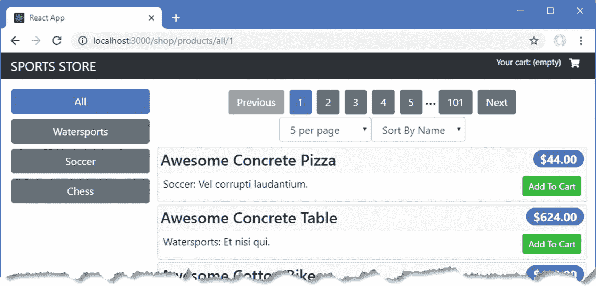
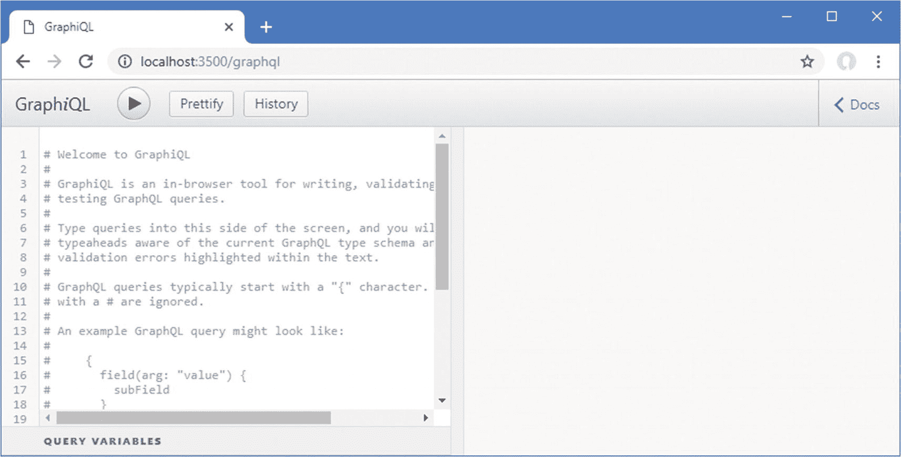
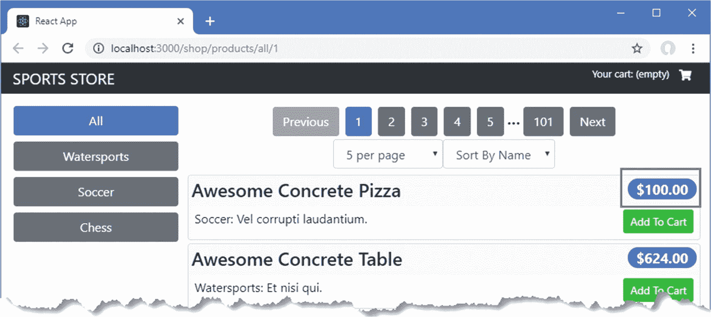
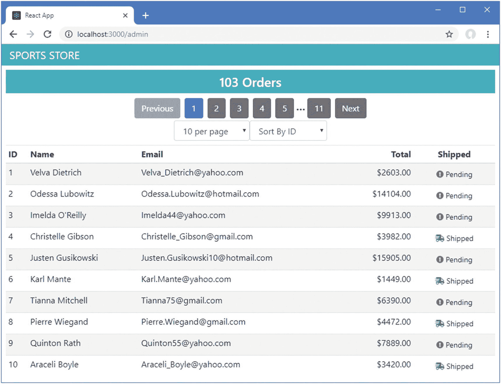
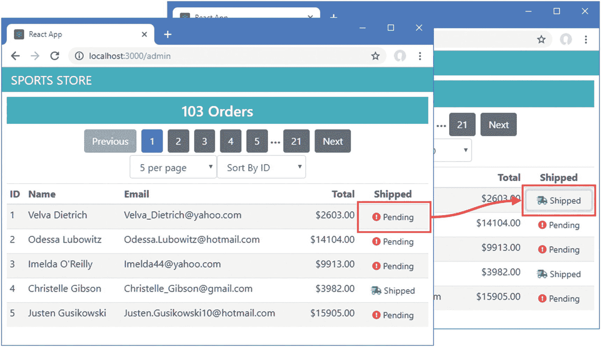
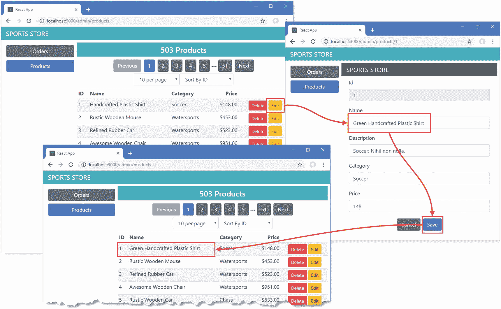
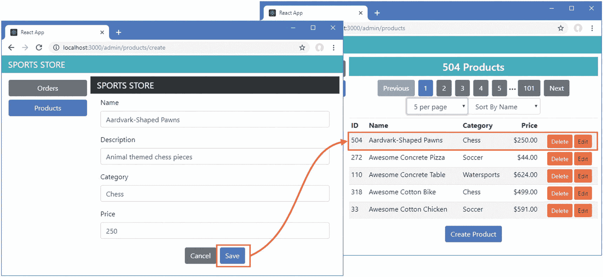

# 七、SportsStore：管理

在本章中，我将管理特性添加到 SportsStore 应用中，提供管理订单和产品所需的工具。我在本章中使用 GraphQL，而不是扩展我在 SportsStore 的面向客户部分使用的 RESTful web 服务。GraphQL 是传统 web 服务的一种替代方案，它让客户端控制它接收的数据，尽管它需要更多的初始设置，并且使用起来可能更复杂。

## 为本章做准备

本章基于在第 [5](05.html) 章创建并在第 [6](06.html) 章修改的 SportsStore 项目。为了准备本章，我将生成一些假订单，这样就有数据可以处理，如清单 [7-1](#PC1) 所示。

### 小费

你可以从 [`https://github.com/Apress/pro-react-16`](https://github.com/Apress/pro-react-16) 下载本章以及本书其他章节的示例项目。

```jsx
var faker = require("faker");
faker.seed(100);
var categories = ["Watersports", "Soccer", "Chess"];
var products = [];
for (let i = 1; i <= 503; i++) {
    var category = faker.helpers.randomize(categories);
    products.push({
        id: i,
        name: faker.commerce.productName(),
        category: category,
        description: `${category}: ${faker.lorem.sentence(3)}`,
        price: Number(faker.commerce.price())
    })
}
var orders = [];
for (let i = 1; i <= 103; i++) {
    var fname = faker.name.firstName(); var sname = faker.name.lastName();
    var order = {
        id: i, name: `${fname} ${sname}`,
        email: faker.internet.email(fname, sname),
        address: faker.address.streetAddress(), city: faker.address.city(),
        zip: faker.address.zipCode(), country: faker.address.country(),
        shipped: faker.random.boolean(), products:[]
    }
    var productCount = faker.random.number({min: 1, max: 5});
    var product_ids = [];
    while (product_ids.length < productCount) {
        var candidateId = faker.random.number({ min: 1, max: products.length});
        if (product_ids.indexOf(candidateId) === -1) {
            product_ids.push(candidateId);
        }
    }
    for (let j = 0; j < productCount; j++) {
        order.products.push({
            quantity: faker.random.number({min: 1, max: 10}),
            product_id: product_ids[j]
        })
    }
    orders.push(order);
}

module.exports = () => ({ categories, products, orders })

Listing 7-1Altering the Application Data in the data.js File in the sportsstore Folder

```

### 运行示例应用

打开一个新的命令提示符，导航到`sportsstore`文件夹，运行清单 [7-2](#PC2) 中所示的命令。

```jsx
npm start

Listing 7-2Running the Example Application

```

React 开发工具和 RESTful web 服务将会启动。一旦开发工具编译了 SportsStore 应用，将会打开一个新的浏览器窗口，并显示图 [7-1](#Fig1) 中所示的内容。



图 7-1

运行示例应用

## 创建 GraphQL 服务

我在本章中添加到 SportsStore 应用的管理特性将使用 GraphQL，而不是 RESTful web 服务。很少有真正的应用需要混合 REST 和 GraphQL 来处理相同的数据，但是我想演示这两种远程服务方法。

GraphQL 并不特定于 React 开发，但它与 React 的关系如此密切，以至于我在第 [24](24.html) 章中介绍了 GraphQL，并在第 [25](25.html) 章中演示了 React 应用使用 GraphQL 服务的不同方式。

### 小费

我将为 SportsStore 应用创建一个定制的 GraphQL 服务器，这样我就可以与优秀的`json-server`包提供的 RESTful web 服务共享数据。正如我在第 [24 章](24.html)中解释的，有开源和商业 GraphQL 服务器可用。

### 定义 GraphQL 模式

GraphQL 要求它的所有操作都在一个模式中定义。为了定义服务将支持的查询模式，我在`sportsstore`文件夹中创建了一个名为`serverQueriesSchema.graphql`的文件，其内容如清单 [7-3](#PC3) 所示。

```jsx
type product { id: ID!, name: String!, description: String! category: String!
               price: Float! }

type productPage { totalSize: Int!, products(sort: String, page: Int, pageSize: Int): [product]}

type orderPage { totalSize: Int, orders(sort: String, page: Int, pageSize: Int): [order]}

type order {
    id: ID!, name: String!, email: String!, address: String!, city: String!,
    zip: String!, country: String!, shipped: Boolean, products: [productSelection]
}

type productSelection { quantity: Int!, product: product }

type Query {
    product(id: ID!): product
    products(category: String, sort: String, page: Int, pageSize: Int): productPage
    categories: [String]
    orders(onlyUnshipped: Boolean): orderPage
}

Listing 7-3The Contents of serverQueriesSchema.graphql in the sportsstore Folder

```

GraphQL 规范包括一种模式语言，用于定义服务提供的特性。清单 [7-3](#PC3) 中的模式定义了对产品、类别和订单的查询。`product`和`order`查询支持分页，并返回包含一个`totalSize`属性的结果，该属性报告可用项目的数量，因此客户端可以向用户提供分页控件。可以按类别过滤产品，也可以过滤订单，以便只显示未发货的订单。

在 GraphQL 中，使用*突变*来执行更改，遵循分离读写数据操作的主题，这在 React 开发中很常见。我在`sportsstore`文件夹中添加了一个名为`serverMutationsSchema.graphql`的文件，并用它来定义清单 [7-4](#PC4) 中显示的突变。

```jsx
input productStore {
    name: String!, description: String!, category: String!, price: Float!
}

input productUpdate {
    id: ID!, name: String, description: String, category: String, price: Float
}

type Mutation {
    storeProduct(product: productStore): product
    updateProduct(product: productUpdate): product
    deleteProduct(id: ID!): product
    shipOrder(id: ID!, shipped: Boolean!): order
}

Listing 7-4The Contents of the serverMutationsSchema.graphql File in the sportsstore Folder

```

清单 [7-4](#PC4) 中的模式定义了存储新产品、更新和删除现有产品以及将订单标记为已装运或未装运的变化。

### 定义 GraphQL 解析器

GraphQL 服务中的模式是由解析器实现的。为了给查询提供解析器，我在`sportsstore`文件夹中添加了一个名为`serverQueriesResolver.js`的文件，代码如清单 [7-5](#PC5) 所示。

```jsx
const paginateQuery = (query, page = 1, pageSize = 5) =>
    query.drop((page - 1) * pageSize).take(pageSize);

const product = ({id}, {db}) => db.get("products").getById(id).value();

const products = ({ category }, { db}) => ({
    totalSize: () => db.get("products")
        .filter(p => category ? new RegExp(category, "i").test(p.category) : p)
        .size().value(),
    products: ({page, pageSize, sort}) => {
        let query = db.get("products");
        if (category) {
            query = query.filter(item =>
                new RegExp(category, "i").test(item.category))
        }
        if (sort) { query = query.orderBy(sort) }
        return paginateQuery(query, page, pageSize).value();
    }
})

const categories = (args, {db}) => db.get("categories").value();

const resolveProducts = (products, db) =>
    products.map(p => ({
        quantity: p.quantity,
        product: product({ id: p.product_id} , {db})
    }))

const resolveOrders = (onlyUnshipped, { page, pageSize, sort}, { db }) => {
    let query = db.get("orders");
    if (onlyUnshipped) { query = query.filter({ shipped: false}) }
    if (sort) { query = query.orderBy(sort) }
    return paginateQuery(query, page, pageSize).value()
        .map(order => ({ ...order, products: () =>
            resolveProducts(order.products, db) }));
}

const orders = ({onlyUnshipped = false}, {db}) => ({
    totalSize: () => db.get("orders")
        .filter(o => onlyUnshipped ? o.shipped === false : o).size().value(),
    orders: (...args) => resolveOrders(onlyUnshipped, ...args)
})

module.exports = { product, products, categories, orders }

Listing 7-5The Contents of the serverQueriesResolver.js File in the sportsstore Folder

```

清单 [7-5](#PC5) 中的代码实现了清单 [7-3](#PC3) 中定义的查询。你可以在第 [24](24.html) 章看到一个独立的定制 GraphQL 服务器的例子，但是清单 [7-5](#PC5) 中的代码依赖于 Lowdb 数据库，这个数据库是`json-server`包用来存储数据的，在 [`https://github.com/typicode/lowdb`](https://github.com/typicode/lowdb) 中有详细描述。

当客户端请求特定字段时，使用一系列调用的函数来解析每个查询，确保服务器只加载和处理需要的数据。例如，对于`orders`查询，函数链确保服务器只需在客户机请求时查询数据库中相关的`product`对象，避免检索不需要的数据。

为了实现这些变化，我在`sportsstore`文件夹中添加了一个名为`serverMutationsResolver.js`的文件，并添加了清单 [7-6](#PC6) 中所示的代码。

```jsx
const storeProduct = ({ product}, {db }) =>
    db.get("products").insert(product).value();

const updateProduct = ({ product }, { db }) =>
    db.get("products").updateById(product.id, product).value();

const deleteProduct = ({ id }, { db }) => db.get("products").removeById(id).value();

const shipOrder = ({ id, shipped }, { db }) =>
    db.get("orders").updateById(id, { shipped: shipped}).value()

module.exports = {
    storeProduct, updateProduct, deleteProduct, shipOrder
}

Listing 7-6The Contents of the serverMutationsResolver.js File in the sportsstore Folder

```

清单 [7-6](#PC6) 中定义的每个函数对应于清单 [7-4](#PC4) 中定义的一个变异。实现变异所需的代码比查询简单，因为查询需要额外的语句来过滤和分页数据。

### 更新服务器

在第 [5](05.html) 章中，我向 SportsStore 项目添加了创建 GraphQL 服务器所需的包。在清单 [7-7](#PC7) 中，我已经使用这些包为后端服务器添加了对 GraphQL 的支持，该服务器已经为 SportsStore 应用提供了 RESTful web 服务。

```jsx
const express = require("express");
const jsonServer = require("json-server");
const chokidar = require('chokidar');
const cors = require("cors");

const fs = require("fs");

const { buildSchema } = require("graphql");

const graphqlHTTP = require("express-graphql");

const queryResolvers  = require("./serverQueriesResolver");

const mutationResolvers = require("./serverMutationsResolver");

const fileName = process.argv[2] || "./data.js"
const port = process.argv[3] || 3500;

let router = undefined;

let graph = undefined;

const app = express();

const createServer = () => {
    delete require.cache[require.resolve(fileName)];
    setTimeout(() => {
        router = jsonServer.router(fileName.endsWith(".js")
                ? require(fileName)() : fileName);
        let schema =  fs.readFileSync("./serverQueriesSchema.graphql", "utf-8")

            + fs.readFileSync("./serverMutationsSchema.graphql", "utf-8");

        let resolvers = { ...queryResolvers, ...mutationResolvers };

        graph = graphqlHTTP({

            schema: buildSchema(schema), rootValue: resolvers,

            graphiql: true, context: { db: router.db }

        })

    }, 100)
}

createServer();

app.use(cors());
app.use(jsonServer.bodyParser)
app.use("/api", (req, resp, next) => router(req, resp, next));

app.use("/graphql", (req, resp, next) => graph(req, resp, next));

chokidar.watch(fileName).on("change", () => {
    console.log("Reloading web service data...");
    createServer();
    console.log("Reloading web service data complete.");
});

app.listen(port, () => console.log(`Web service running on port ${port}`));

Listing 7-7Adding GraphQL in the server.js File in the sportsstore Folder

```

添加的内容加载模式和解析器，并使用它们创建一个与现有 RESTful web 服务共享数据库的 GraphQL 服务。停止开发工具，运行`sportsstore`文件夹中清单 [7-8](#PC8) 所示的命令，再次启动它们，这也将启动 GraphQL 服务器。

```jsx
npm start

Listing 7-8Starting the Development Tools and Services

```

为了确保 GraphQL 服务器正在运行，导航到`http://localhost:3500/graphql`，这将显示如图 [7-2](#Fig2) 所示的工具。



图 7-2

图形浏览器

我用来创建 GraphQL 服务器的包包括 GraphQL 浏览器，这使得探索 graph QL 服务变得很容易。用清单 [7-9](#PC9) 中所示的 GraphQL 变体替换窗口左侧的欢迎消息。

### 注意

每次使用`npm start`命令 2 时，RESTful web 服务和 GraphQL 服务使用的数据都会被重置，这意味着当您下次启动服务器时，清单 [7-9](#PC9) 中的变化所做的更改将会丢失。在第 8 章中，我将 SportsStore 应用转换为一个持久数据库，作为部署准备的一部分。

```jsx
mutation {
    updateProduct(product: {
        id: 272, price: 100
    }) { id, name, category, price }
}

Listing 7-9A GraphQL Mutation

```

单击“执行查询”按钮将变异发送到 GraphQL 服务器，这将更新数据库中的产品并产生以下结果:

```jsx
...
{
  "data": {
    "updateProduct": {
      "id": "272",
      "name": "Awesome Concrete Pizza",
      "category": "Soccer",
      "price": 100

    }
  }
}
...

```

导航回`http://localhost:3000`(或者重新加载浏览器标签，如果它仍然打开)，你会看到列表中显示的第一个产品的价格已经改变，如图 [7-3](#Fig3) 所示。



图 7-3

GraphQL 突变的影响

## 创建订单管理功能

GraphQL 需要在服务器端做更多的工作来创建模式和编写解析器，但好处是客户端比使用 RESTful web 服务的客户端简单得多。在某种程度上，这是因为 GraphQL 使用定义良好但灵活的查询的方式，但也是因为 GraphQL 客户端包提供了许多有用的功能，我不得不在第 [5](05.html) 和 [6](06.html) 章手动创建这些功能。

### 注意

我在 SportsStore 一章中使用 GraphQL 的方式是最简单的方法，但是它隐藏了 GraphQL 如何工作的细节。在第 [25 章](25.html)中，我演示了如何通过 HTTP 直接使用 GraphQL，以及如何将 GraphQL 集成到使用数据存储的应用中。

### 定义订单表组件

我将从创建订单显示开始。为了定义显示订单数据的组件，我在`src/admin`文件夹中添加了一个名为`OrdersTable.js`的文件，并添加了清单 [7-10](#PC11) 中所示的代码。

```jsx
import React, { Component } from "react";
import { OrdersRow } from "./OrdersRow";
import { PaginationControls } from "../PaginationControls";

export class OrdersTable extends Component {

    render = () =>
        <div>
            <h4 className="bg-info text-white text-center p-2">
                { this.props.totalSize } Orders
            </h4>

            <PaginationControls keys={["ID", "Name"]}
                { ...this.props } />

            <table className="table table-sm table-striped">
                <thead>
                    <tr><th>ID</th>
                        <th>Name</th><th>Email</th>
                        <th className="text-right">Total</th>
                        <th className="text-center">Shipped</th>
                    </tr>
                </thead>
                <tbody>
                    { this.props.orders.map(order =>
                        <OrdersRow key={ order.id }
                            order={ order} toggleShipped={ () =>
                                this.props.toggleShipped(order.id, !order.shipped) }
                        />
                    )}
                </tbody>
            </table>
        </div>
}

Listing 7-10The Contents of the OrdersTable.js File in the src/admin Folder

```

`OrdersTable`组件显示订单总数，并呈现一个表格，其中每一行的责任都委托给了`OrdersRow`组件，我通过将一个名为`OrdersRow.js`的文件添加到`src/admin`文件夹中来定义该组件，代码如清单 [7-11](#PC12) 所示。

```jsx
import React, { Component } from "react";

export class OrdersRow extends Component {

    calcTotal = (products) => products.reduce((total, p) =>
        total += p.quantity * p.product.price, 0).toFixed(2)

    getShipping = (order) => order.shipped
        ? <i className="fa fa-shipping-fast text-success" />
        : <i className="fa fa-exclamation-circle text-danger" />

    render = () =>
        <tr>
            <td>{ this.props.order.id }</td>
            <td>{this.props.order.name}</td>
            <td>{ this.props.order.email }</td>
            <td className="text-right">
                ${ this.calcTotal(this.props.order.products) }
            </td>
            <td className="text-center">
                <button className="btn btn-sm btn-block bg-muted"
                        onClick={ this.props.toggleShipped }>
                    { this.getShipping(this.props.order )}
                    <span>
                        { this.props.order.shipped
                            ? " Shipped" : " Pending"}
                    </span>
                </button>
            </td>
        </tr>
}

Listing 7-11The Contents of the OrdersRow.js File in the src/admin Folder

```

### 定义连接器组件

当 GraphQL 客户机查询它的服务器时，它为查询定义的任何参数提供值，并指定它想要接收的数据字段。这是与大多数 RESTful web 服务的最大区别，这意味着 GraphQL 客户端只接收它们需要的数据值。但是，这意味着在从服务器检索数据之前，必须定义客户端查询。我喜欢将查询与组件分开定义，我在`src/admin`文件夹中添加了一个名为`clientQueries.js`的文件，其内容如清单 [7-12](#PC13) 所示。

```jsx
import gql from "graphql-tag";

export const ordersSummaryQuery = gql`
    query($onlyShipped: Boolean, $page:Int, $pageSize:Int, $sort:String) {
        orders(onlyUnshipped: $onlyShipped) {
            totalSize,
            orders(page: $page, pageSize: $pageSize, sort: $sort) {
                id, name, email, shipped
                products {
                    quantity, product { price }
                }
            }
        }
    }`

Listing 7-12The Contents of the clientQueries.js File in the src/admin Folder

```

GraphQL 查询在客户端应用中被定义为 JavaScript 字符串文字，但是必须使用来自`graphql-tag`包的`gql`函数进行处理。清单 [7-12](#PC13) 中的查询以服务器的`orders`查询为目标，并将接受用于查询的`onlyShipped`、`page`、`pageSize,`和`sort`参数的变量。客户机查询只选择它需要的字段，并包含与每个订单相关的产品数据的详细信息，这些信息包含在服务器解析器为`orders`查询生成的查询结果中。

GraphQL 客户端包`React-Apollo`提供了`graphql`函数，它是前面使用的`connect`和`withRouter`函数的对应物，它通过创建一个*高阶组件*将一个组件连接到 GraphQL 特性，该组件是一个为组件提供特性的函数，如第 [14 章](14.html)所述。为了在`OrdersTable`组件和清单 [7-12](#PC13) 中定义的查询之间创建连接，我向`src/admin`文件夹添加了一个名为`OrdersConnector.js`的文件，并添加了清单 [7-13](#PC14) 中所示的代码。

```jsx
import { graphql } from "react-apollo";
import { ordersSummaryQuery } from "./clientQueries";
import { OrdersTable } from "./OrdersTable";

const vars = {
    onlyShipped: false, page: 1, pageSize: 10, sort: "id"
}

export const OrdersConnector = graphql(ordersSummaryQuery,
    {
        options: (props) => ({ variables: vars }),
        props: ({data: { loading, orders, refetch }}) => ({
            totalSize: loading ? 0 : orders.totalSize,
            orders: loading ? []: orders.orders,
            currentPage: vars.page,
            pageCount: loading ? 0 : Math.ceil(orders.totalSize / vars.pageSize),
            navigateToPage: (page) => { vars.page = Number(page); refetch(vars)},
            pageSize: vars.pageSize,
            setPageSize: (size) => { vars.pageSize = Number(size); refetch(vars)},
            sortKey: vars.sort,
            setSortProperty: (key) => { vars.sort = key; refetch(vars)},
        })
    }
)(OrdersTable)

Listing 7-13The Contents of the OrdersConnector.js File in the src/admin Folder

```

`graphql`函数接受查询和配置对象的参数，并返回一个用于包装组件并为其提供查询功能的函数。配置对象支持许多属性，但我只需要两个。第一个是`options`属性，它用于创建将应用于 GraphQL 查询的变量集，使用一个函数接收父组件应用的属性。

### 小费

Apollo GraphQL 客户机缓存查询结果，这样就不会向服务器发送重复的请求，例如，当使用带有路由的组件时，这就很有用。

第二个是`props`属性，用于创建将被传递给显示组件的属性，并提供有一个`data`对象，该对象组合了查询进度的详细信息、来自服务器的响应以及用于刷新查询的函数。

我从数据对象中选择了三个属性，并用它们来为`OrdersTable`组件创建属性。当查询被发送到服务器并等待响应时,`loading`属性是`true`,这允许我在收到 GraphQL 响应之前使用占位符值。查询的结果被分配给一个给定查询名的属性，在本例中是`orders`。来自查询的响应的结构如下:

```jsx
...
{ "orders":
  { "totalSize":103,
    "orders":[
      {"id":"1","name":"Velva Dietrich","email":"Velva_Dietrich@yahoo.com",
       "shipped":false, "products":[{"quantity":8,"product":{"price":84 },
      {"quantity":7,"product":{"price":125}, {"quantity":3,"product":{"price":352}
          ...other data values omitted for brevity...

  }
}
...

```

例如，为了获得可用订单的总数，我读取了`orders.totalSize`属性的值，如下所示:

```jsx
...
totalSize: loading ? 0 : orders.totalSize,
...

```

在收到来自服务器的结果之前，`totalSize`属性的值为零，然后被赋予`orders.totalSize`的值。

我从`data`对象中选择的第三个属性是`refetch`，它是一个重新发送查询的函数，我用它来响应分页更改。

```jsx
...
navigateToPage: (page) => { vars.page = Number(page); refetch(vars)},
...

```

为了简洁起见，我将所有的查询变量传递给了`refetch`函数，但是该函数接收到的任何值都与原始变量合并，这对于更复杂的查询来说非常有用。

### 小费

还有一个可用的`fetchMore`函数，可用于检索数据并将其与现有结果合并，这对于逐渐构建呈现给用户的数据的组件非常有用。我对 SportsStore 应用采用了一种更简单的方法，每一页数据都替换了之前的查询结果。

### 配置 GraphQL 客户端

对 GraphQL 客户端特性的访问是通过`ApolloProvider`组件提供的。为了配置 GraphQL 客户端并为其他管理特性创建一个方便的占位符，我创建了`src/admin`文件夹并向其中添加了一个名为`Admin.js`的文件，我用它来定义清单 [7-14](#PC18) 中所示的组件。

```jsx
import React, { Component } from "react";
import  ApolloClient from "apollo-boost";
import { ApolloProvider} from "react-apollo";
import { GraphQlUrl } from "../data/Urls";
import { OrdersConnector } from "./OrdersConnector"

const graphQlClient = new ApolloClient({
    uri: GraphQlUrl
});

export class Admin extends Component {

    render() {
        return <ApolloProvider client={ graphQlClient }>
            <div className="container-fluid">
                <div className="row">
                <div className="col bg-info text-white">
                    <div className="navbar-brand">SPORTS STORE</div>
                </div>
            </div>
            <div className="row">
                <div className="col p-2">
                    <OrdersConnector />
                </div>
            </div>
        </div>
        </ApolloProvider>
    }
}

Listing 7-14The Contents of the Admin.js File in the src/admin Folder

```

为了开始使用管理特性，我将显示一个`OrdersTable`组件，我将在下一节中创建它。我将返回到`Admin`并使用 URL 路由来显示附加功能。为了设置将用于与 GraphQL 服务器通信的 URL，我将清单 [7-15](#PC19) 中所示的语句添加到了`Urls.js`文件中。

```jsx
import { DataTypes } from "./Types";

const protocol = "http";
const hostname = "localhost";
const port = 3500;

export const RestUrls = {
    [DataTypes.PRODUCTS]: `${protocol}://${hostname}:${port}/api/products`,
    [DataTypes.CATEGORIES]: `${protocol}://${hostname}:${port}/api/categories`,
    [DataTypes.ORDERS]: `${protocol}://${hostname}:${port}/api/orders`
}

export const GraphQlUrl = `${protocol}://${hostname}:${port}/graphql`;

Listing 7-15Adding a URL in the Urls.js File in the src/data Folder

```

GraphQL 只需要一个 URL，因为与 REST 不同，它不使用 URL 或 HTTP 方法来描述操作。在第 8 章中，我将在准备项目部署时更改应用使用的 URL。

为了将新特性加入到应用中，我将清单 [7-16](#PC20) 中所示的路线添加到了`App`组件中。

```jsx
import React, { Component } from "react";
import { SportsStoreDataStore } from "./data/DataStore";
import { Provider } from "react-redux";
import { BrowserRouter as Router, Route, Switch, Redirect }
    from "react-router-dom";
import { ShopConnector } from "./shop/ShopConnector";

import { Admin } from "./admin/Admin";

export default class App extends Component {

    render() {
        return <Provider store={ SportsStoreDataStore }>
            <Router>
                <Switch>
                    <Route path="/shop" component={ ShopConnector } />
                    <Route path="/admin" component={ Admin } />

                    <Redirect to="/shop" />
                </Switch>
            </Router>
        </Provider>
    }
}

Listing 7-16Adding a Route in the App.js File in the src Folder

```

将更改保存到文件并导航到`http://localhost:3000/admin`，您将看到如图 [7-4](#Fig4) 所示的结果。



图 7-4

从组件生成 GraphQL 查询

### 配置突变

相同的查询基本方法可以应用于将突变集成到 React 应用中。为了允许管理员将订单标记为已发货，我在`src/admin`文件夹中添加了一个名为`clientMutations.js`的文件，其内容如清单 [7-17](#PC21) 所示。

```jsx
import gql from "graphql-tag";

export const shipOrder = gql`
    mutation($id: ID!, $shipped: Boolean!) {
        shipOrder(id: $id, shipped: $shipped) {
            id, shipped
        }
    }`

Listing 7-17The Contents of the clientMutations.js File in the src/admin Folder

```

GraphQL 的目标是`shipOrder`突变，它更新由订单的`id`属性的值指定的订单的`shipped`属性。在清单 [7-18](#PC22) 中，我使用了`graphql`函数来提供对突变及其结果的访问。

```jsx
import { graphql, compose } from "react-apollo";

import { ordersSummaryQuery } from "./clientQueries";
import { OrdersTable } from "./OrdersTable";

import { shipOrder } from "./clientMutations";

const vars = {
    onlyShipped: false, page: 1, pageSize: 10, sort: "id"
}

export const OrdersConnector = compose(

    graphql(ordersSummaryQuery,
        {
            options: (props) => ({ variables: vars }),
            props: ({data: { loading, orders, refetch }}) => ({
                totalSize: loading ? 0 : orders.totalSize,
                orders: loading ? []: orders.orders,
                currentPage: vars.page,
                pageCount: loading ? 0 : Math.ceil(orders.totalSize / vars.pageSize),
                navigateToPage: (page) => { vars.page = Number(page); refetch(vars)},
                pageSize: vars.pageSize,
                setPageSize: (size) =>
                    { vars.pageSize = Number(size); refetch(vars)},
                sortKey: vars.sort,
                setSortProperty: (key) => { vars.sort = key; refetch(vars)},
            })
        }
    ),
    graphql(shipOrder, {

        props: ({ mutate }) => ({

            toggleShipped: (id, shipped) => mutate({ variables: { id, shipped }})

        })

    })

)(OrdersTable);

Listing 7-18Applying a Mutation in the OrdersConnector.js File in the src/admin Folder

```

React-Apollo 包提供了简化查询和变异组合的`compose`函数。现有的查询与对`graphql`函数的另一个调用相结合，该函数被传递了清单 [7-17](#PC21) 中的变异。当使用变异时，配置对象中的`props`属性接收一个名为`mutate`的函数，我用它来创建一个名为`toggleShipped`的属性，对应于`OrdersRow`组件用来更改订单状态的属性。要查看结果，单击表格中订单的已发货/待处理指示器，其状态将会改变，如图 [7-5](#Fig5) 所示。



图 7-5

利用突变

当有变化时，Apollo 客户机自动更新其数据缓存，这意味着 shipped 属性的值的变化会自动反映在由`OrdersTable`组件显示的数据中。

## 创建产品管理功能

为了管理呈现给用户的产品，我在`src/admin`文件夹中添加了一个名为`ProductsTable.js`的文件，并用它来定义清单 [7-19](#PC23) 中所示的组件。

```jsx
import React, { Component } from "react";
import { Link } from "react-router-dom";
import { PaginationControls } from "../PaginationControls";
import { ProductsRow } from "./ProductsRow";

export class ProductsTable extends Component {

    render = () =>
         <div>
            <h4 className="bg-info text-white text-center p-2">
                { this.props.totalSize } Products
            </h4>

        <PaginationControls keys={["ID", "Name", "Category"]}
            { ...this.props } />

        <table className="table table-sm table-striped">
            <thead>
                <tr><th>ID</th>
                    <th>Name</th><th>Category</th>
                    <th className="text-right">Price</th>
                    <th className="text-center"></th>
                </tr>
            </thead>
            <tbody>
                { this.props.products.map(prod =>
                    <ProductsRow key={ prod.id} product={ prod }
                        deleteProduct={ this.props.deleteProduct } />
                )}
            </tbody>
        </table>
        <div className="text-center">
            <Link to="/admin/products/create" className="btn btn-primary">
                Create Product
            </Link>
        </div>
    </div>
}

Listing 7-19The Contents of the ProductsTable.js File in the src/admin Folder

```

`ProductsTable`组件通过其`products`属性接收一个对象数组，并使用`ProductsRow`组件为每个对象生成一个表格行。还有一个`Link`按钮，用于导航到允许创建新产品的组件。

为了创建负责单个表格行的`ProductsRow`组件，我在`src/admin`文件夹中添加了一个名为`ProductsRow.js`的文件，并添加了清单 [7-20](#PC24) 中所示的代码。

```jsx
import React, { Component } from "react";
import { Link } from "react-router-dom";

export class ProductsRow extends Component {

    render = () =>
        <tr>
            <td>{ this.props.product.id }</td>
            <td>{this.props.product.name}</td>
            <td>{ this.props.product.category }</td>
            <td className="text-right">
                ${ this.props.product.price.toFixed(2) }
            </td>
            <td className="text-center">
                <button className="btn btn-sm btn-danger mx-1"
                    onClick={ () =>
                        this.props.deleteProduct(this.props.product.id) }>
                            Delete
                </button>
                <Link to={`/admin/products/${this.props.product.id}`}
                    className="btn btn-sm btn-warning">
                        Edit
                </Link>
            </td>
        </tr>
}

Listing 7-20The Contents of the ProductsRow.js File in the src/admin Folder

```

为`id`、`name`、`category`和`price`属性呈现表格单元格。有一个`button`调用一个名为`deleteProduct`的函数 prop，它将从数据库中删除一个产品，还有一个`Link`将导航到用于编辑产品细节的组件。

### 连接产品表组件

为了将产品表组件连接到 GraphQL 数据，我将清单 [7-21](#PC25) 中所示的查询添加到了`clientQueries.js`文件中，其中还包括编辑产品所需的查询。这些查询对应于本章开始时定义的服务器端 GraphQL。

```jsx
import gql from "graphql-tag";

export const ordersSummaryQuery = gql`
    query($onlyShipped: Boolean, $page:Int, $pageSize:Int, $sort:String) {
        orders(onlyUnshipped: $onlyShipped) {
            totalSize,
            orders(page: $page, pageSize: $pageSize, sort: $sort) {
                id, name, email, shipped
                products {
                    quantity, product { price }
                }
            }
        }
    }`

export const productsList = gql`

    query($page: Int, $pageSize: Int, $sort: String) {

        products {

            totalSize,

            products(page: $page, pageSize: $pageSize, sort: $sort) {

                id, name, category, price

            }

        }

    }`

export const product = gql`

    query($id: ID!) {

        product(id: $id) {

            id, name, description, category, price

        }

    }`

Listing 7-21Adding Queries in the clientQueries.js File in the src/admin Folder

```

分配给名为`productsList`的常量的查询将检索一页产品的`id`、`name`、`category`和`price`属性。分配给名为`product`的常量的查询将检索单个`product`对象的`id`、`name`、`description`、`category`和`price`属性。为了添加对删除、创建和编辑对象的支持，我将清单 [7-22](#PC26) 中所示的变化添加到了`clientMutations.js`文件中。

```jsx
import gql from "graphql-tag";

export const shipOrder = gql`
    mutation($id: ID!, $shipped: Boolean!) {
        shipOrder(id: $id, shipped: $shipped) {
            id, shipped
        }
    }`

export const storeProduct = gql`

    mutation($product: productStore) {

        storeProduct(product: $product) {

            id, name, category, description, price

        }

    }`

export const updateProduct = gql`

    mutation($product: productUpdate) {

        updateProduct(product: $product) {

            id, name, category, description, price

        }

    }`

export const deleteProduct = gql`

    mutation($id: ID!) {

        deleteProduct(id: $id) {

            id

        }

    }`

Listing 7-22Adding Mutations in the clientMutations.js File in the src/admin Folder

```

新的变化对应于本章开始时定义的服务器端 GraphQL，并允许客户端存储新产品、编辑现有产品和删除产品。

定义了查询和突变之后，我将一个名为`ProductsConnector.js`的文件添加到`src/admin`文件夹中，并定义了清单 [7-23](#PC27) 中所示的高阶组件。

```jsx
import { graphql, compose } from "react-apollo";
import { ProductsTable } from "./ProductsTable";
import { productsList } from "./clientQueries";
import { deleteProduct } from "./clientMutations";

const vars = {
    page: 1, pageSize: 10, sort: "id"
}

export const ConnectedProducts = compose(
    graphql(productsList,
        {
            options: (props) => ({ variables: vars }),
            props: ({data: { loading, products, refetch }}) => ({
                totalSize: loading ? 0 : products.totalSize,
                products: loading ? []: products.products,
                currentPage: vars.page,
                pageCount: loading ? 0
                    : Math.ceil(products.totalSize / vars.pageSize),
                navigateToPage: (page) => { vars.page = Number(page); refetch(vars)},
                pageSize: vars.pageSize,
                setPageSize: (size) =>
                    { vars.pageSize = Number(size); refetch(vars)},
                sortKey: vars.sort,
                setSortProperty: (key) => { vars.sort = key; refetch(vars)},
            })
        }
    ),
    graphql(deleteProduct,
        {
            options: {
                update: (cache, { data: { deleteProduct: { id }}}) => {
                    const queryDetails = { query: productsList, variables: vars };
                    const data = cache.readQuery(queryDetails)
                    data.products.products =
                        data.products.products.filter(p => p.id !== id);
                    data.products.totalSize = data.products.totalSize - 1;
                    cache.writeQuery({...queryDetails, data });
                }
        },
        props: ({ mutate }) => ({
            deleteProduct: (id) => mutate({ variables: { id }})
        })
    })
)(ProductsTable);

Listing 7-23The Contents of the ProductsConnector.js File in the src/admin Folder

```

清单 [7-23](#PC27) 中的代码类似于订单管理特性的相应代码。一个关键的区别是删除对象的突变不会自动更新本地缓存的数据。对于这种类型的变异，必须定义一个直接修改缓存数据的`update`函数，如下所示:

```jsx
...
update: (cache, { data: { deleteProduct: { id }}}) => {
    const queryDetails = { query: productsList, variables: vars };
    const data = cache.readQuery(queryDetails)
    data.products.products = data.products.products.filter(p => p.id !== id);
    data.products.totalSize = data.products.totalSize - 1;
    cache.writeQuery({...queryDetails, data });
}
...

```

这个函数读取缓存的数据，删除一个对象，减少`totalSize`以反映删除，然后将数据写回缓存，这样会有更新产品列表的效果，而不需要查询服务器。

### 小费

这种方法的缺点是，它不会对数据重新分页以反映删除，这意味着在用户导航到另一个页面之前，页面显示的项目较少。在下一节中，我将演示如何通过清除缓存数据来解决这个问题，这将导致一个额外的 GraphQL 查询，但可以确保应用的一致性。

### 创建编辑器组件

为了允许用户创建新产品，我在`src/admin`文件夹中添加了一个名为`ProductEditor.js`的文件，并定义了清单 [7-24](#PC29) 中所示的组件。

```jsx
import React, { Component } from "react";
import { Query } from "react-apollo";
import { ProductCreator } from "./ProductCreator";
import { product } from "./clientQueries";

export class ProductEditor extends Component {

    render = () =>
        <Query query={ product } variables={ {id: this.props.match.params.id} } >
            { ({ loading, data }) => {
                if (!loading) {
                    return <ProductCreator {...this.props } product={data.product}
                        mode="edit" />
                }
                return null;
            }}
        </Query>
}

Listing 7-24The Contents of the ProductEditor.js File in the src/admin Folder

```

`Query`组件是作为`graphql`函数的替代提供的，它允许以声明方式执行 GraphQL 查询，结果和其他客户端特性通过*渲染属性函数*呈现，这将在第 [14 章](14.html)中描述。清单 [7-24](#PC29) 中定义的`ProductEditor`组件将获取管理员想要编辑的产品的`id`，并使用`Query`组件获取，该组件使用其`query`和`variables`属性进行配置。render prop 函数接收一个具有`loading`和`data`属性的对象，其目的与我之前使用的`graphql`函数相同。当 loading 属性为`true`时，`ProductEditor`组件不呈现任何内容，然后显示一个`ProductCreator`组件，通过名为`product`的属性传递从查询中接收的数据。

`ProductCreator`组件将在 SportsStore 应用中执行双重任务。当单独使用时，它将向管理员呈现一个空表单，该表单将被发送到`storeProduct`突变。当被`ProductEditor`组件使用时，它将显示现有产品的详细信息，并将表单数据发送给`updateProduct`变异。为了定义组件，我用清单 [7-25](#PC30) 所示的代码向`src/admin`文件夹添加了一个名为`ProductCreator.js`的文件。

```jsx
import React, { Component } from "react";
import { ValidatedForm } from "../forms/ValidatedForm";
import { Mutation } from "react-apollo";
import { storeProduct, updateProduct } from "./clientMutations";

export class ProductCreator extends Component {

    constructor(props) {
        super(props);
        this.defaultAttrs = { type: "text", required: true };
        this.formModel = [
            { label: "Name" }, { label: "Description" },
            { label: "Category" },
            { label: "Price", attrs: { type: "number"}}
        ];
        this.mutation = storeProduct;
        if (this.props.mode === "edit" ) {
            this.mutation = updateProduct;
            this.formModel = [ { label: "Id", attrs: { disabled: true }},
                     ...this.formModel]
                .map(item => ({ ...item, attrs: { ...item.attrs,
                    defaultValue: this.props.product[item.label.toLowerCase()]} }));
        }
    }

    navigate = () => this.props.history.push("/admin/products");

    render = () => {
        return <div className="container-fluid">
            <div className="row">
                <div className="col bg-dark text-white">
                    <div className="navbar-brand">SPORTS STORE</div>
                </div>
            </div>
            <div className="row">
                <div className="col m-2">
                    <Mutation mutation={ this.mutation }>
                        { (saveMutation, {client }) => {
                            return <ValidatedForm formModel={ this.formModel }
                                defaultAttrs={ this.defaultAttrs }
                                submitCallback={ data => {
                                    saveMutation({variables: { product:
                                        { ...data, price: Number(data.price) }}});
                                    if (this.props.mode !== "edit" ) {
                                        client.resetStore();
                                    }
                                    this.navigate();
                                }}
                                cancelCallback={ this.navigate }
                                submitText="Save" cancelText="Cancel" />
                        }}
                    </Mutation>
                </div>
            </div>
        </div>
    }
}

Listing 7-25The Contents of the ProductCreator.js File in the src/admin Folder

```

`ProductCreator`组件依赖于我在第 [6 章](06.html)中创建的`ValidatedForm`来处理应用购物部分的结账。该表单配置了编辑产品所需的字段，当通过`product` prop 提供时，这些字段将包括从 GraphQL 查询中获得的值。

与`Query`组件相对应的是`Mutation`，它允许在`render`函数中使用变异。render prop 函数接收一个函数，该函数被调用以将突变发送到服务器，并接受一个为突变提供变量的对象，如下所示:

```jsx
...
<Mutation mutation={ this.mutation }>
    { (saveMutation, {client }) => {
        return <ValidatedForm formModel={ this.formModel }
            defaultAttrs={ this.defaultAttrs }
            submitCallback={ data => {

                saveMutation({variables: { product:

                    { ...data, price: Number(data.price) }}});

                    if (this.props.mode !== "edit" ) {

                        client.resetStore();

                    }

                    this.navigate();

                }}

                cancelCallback={ this.navigate }
                submitText="Save" cancelText="Cancel" />
        }
    }
</Mutation>
...

```

我突出显示了设置函数 prop 的代码部分，该函数 prop 被传递给`ValidatedForm`组件，并在被调用时发送变异。当一个对象被更新时，Apollo 客户机自动更新它的缓存数据以反映这一变化，就像我在本章前面将订单标记为已发货一样。新对象不会被自动处理，这意味着应用必须负责管理缓存。我删除一个对象的方法是更新现有的缓存，但是对于一个新的条目来说，这是一个复杂得多的过程，因为这意味着要确定它是否应该显示在当前页面上，如果应该，它应该出现在排序顺序中的什么位置。作为一个更简单的选择，我从 render prop 函数接收了一个`client`参数，它允许我通过它的`resetStore`方法清除缓存的数据。当`navigate`函数将浏览器发送回产品列表时，一个新的 GraphQL 将被发送到服务器，这确保了数据被一致地分页和排序，尽管代价是额外的查询。

### 更新路由配置

最后一步是更新路由配置，添加允许选择订单和产品管理特性的导航按钮，如清单 [7-26](#PC32) 所示。

```jsx
import React, { Component } from "react";
import  ApolloClient from "apollo-boost";
import { ApolloProvider} from "react-apollo";
import { GraphQlUrl } from "../data/Urls";
import { OrdersConnector } from "./OrdersConnector"

import { Route, Redirect, Switch } from "react-router-dom";

import { ToggleLink } from "../ToggleLink";

import { ConnectedProducts } from "./ProductsConnector";

import { ProductEditor } from "./ProductEditor";

import { ProductCreator } from "./ProductCreator";

const graphQlClient = new ApolloClient({
    uri: GraphQlUrl
});

export class Admin extends Component {

    render() {
        return <ApolloProvider client={ graphQlClient }>
            <div className="container-fluid">
                <div className="row">
                <div className="col bg-info text-white">
                    <div className="navbar-brand">SPORTS STORE</div>
                </div>
            </div>
            <div className="row">
                <div className="col-3 p-2">

                    <ToggleLink to="/admin/orders">Orders</ToggleLink>

                    <ToggleLink to="/admin/products">Products</ToggleLink>

                </div>

                <div className="col-9 p-2">

                    <Switch>

                        <Route path="/admin/orders" component={ OrdersConnector } />

                        <Route path="/admin/products/create"

                            component={ ProductCreator} />

                        <Route path="/admin/products/:id"

                            component={ ProductEditor} />

                        <Route path="/admin/products"

                            component={ ConnectedProducts } />

                        <Redirect to="/admin/orders" />

                    </Switch>

                </div>
            </div>
        </div>
        </ApolloProvider>
    }
}

Listing 7-26Updating the Routing Configuration in the Admin.js File in the src/admin Folder

```

保存更改，您将看到如图 [7-6](#Fig6) 所示的布局。单击“产品”按钮将显示一个分页的产品表，可以使用每个表行中的按钮删除和编辑这些产品。



图 7-6

产品管理功能

点击创建产品按钮将显示一个编辑器，允许定义新产品，如图 [7-7](#Fig7) 所示。



图 7-7

创造新产品

## 摘要

在本章中，我向 SportsStore 应用添加了管理功能。我首先创建了一个 GraphQL 服务，其中包含管理订单和产品数据所需的查询和变化。我使用 GraphQL 服务来扩展应用特性，依靠 GraphQL 客户端来管理应用中的数据，这样我就不需要创建和管理数据存储。在下一章中，我将为管理特性添加身份验证，并为应用的部署做准备。