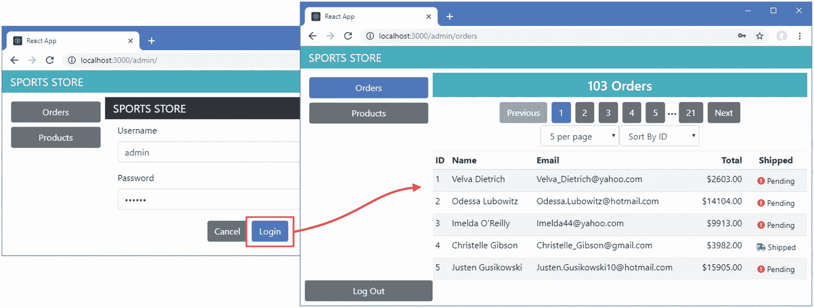

# 八、SportsStore：认证和部署

在本章中，我向 SportsStore 应用添加了身份验证，以保护管理功能免受未经授权的使用。我还准备将 SportsStore 应用部署到 Docker 容器中，该容器可以在大多数托管平台上使用。

## 为本章做准备

为了准备本章，我将向提供 RESTful web 服务和 GraphQL 服务的简单服务器添加对认证和授权的支持。目前，任何客户端都可以执行任何操作，这意味着购物者可以改变价格，创建产品，以及执行其他应该仅限于管理员的任务。表 [8-1](#Tab1) 列出了应该可以公开访问的 HTTP 方法和 URL 的组合；其他一切都将受到保护，包括所有 GraphQL 查询和变异。

表 8-1

可公开访问的 HTTP 方法和 URL 组合

<colgroup><col class="tcol1 align-left"> <col class="tcol2 align-left"> <col class="tcol3 align-left"></colgroup> 
| 

HTTP 方法

 | 

统一资源定位器

 | 

描述

 |
| --- | --- | --- |
| `GET` | `/api/products` | 该组合用于为购物者请求产品页面。 |
| `GET` | `/api/categories` | 该组合用于请求类别集，并用于为购物者提供导航按钮。 |
| `POST` | `/api/orders` | 此组合用于提交订单。 |
| `POST` | `/login` | 该组合将用于提交用户名和密码进行身份验证。 |

### 小费

你可以从 [`https://github.com/Apress/pro-react-16`](https://github.com/Apress/pro-react-16) 下载本章以及本书其他章节的示例项目。

为了实现认证并提供授权的方法，我在`sportsstore`文件夹中添加了一个名为`authMiddleware.js`的文件，并添加了清单 [8-1](#PC1) 中所示的代码。

```jsx
const jwt = require("jsonwebtoken");

const APP_SECRET = "myappsecret", USERNAME = "admin", PASSWORD = "secret";

const anonOps = [{ method: "GET", urls: ["/api/products", "/api/categories"]},
                 { method: "POST", urls: ["/api/orders"]}]

module.exports = function (req, res, next) {
    if (anonOps.find(op => op.method === req.method
            && op.urls.find(url => req.url.startsWith(url)))) {
        next();
    } else if (req.url === "/login" && req.method === "POST") {
        if (req.body.username === USERNAME && req.body.password === PASSWORD) {
            res.json({
                success: true,
                token: jwt.sign({ data: USERNAME, expiresIn: "1h" }, APP_SECRET)
            });
        } else {
            res.json({ success: false });
        }
        res.end();
    } else {
        let token = req.headers["authorization"];
        if (token != null && token.startsWith("Bearer<")) {
            token = token.substring(7, token.length - 1);
            jwt.verify(token, APP_SECRET);
            next();
        } else {
            res.statusCode = 401;
            res.end();
        }
    }
}

Listing 8-1The Contents of the authMiddleware.js File in the sportsstore Folder

```

清单 [8-1](#PC1) 中的代码将检查 HTTP 服务器收到的每个请求，该服务器提供 RESTful web 服务和 GraphQL 服务。如果请求不是针对 HTTP 方法和 URL 的不安全组合之一，则返回 401 未授权响应。`/login` URL 用于认证，硬连线凭证如表 [8-2](#Tab2) 所示。

表 8-2

SportsStore 应用使用的凭据

<colgroup><col class="tcol1 align-left"> <col class="tcol2 align-left"></colgroup> 
| 

名字

 | 

描述

 |
| --- | --- |
| `name` | `admin` |
| `password` | `secret` |

### 警告

SportsStore 项目中的所有服务器端代码都可以用于实际项目，除了清单 [8-1](#PC1) ，它包含硬编码的凭证，不适合除基本开发和测试之外的任何事情。

为了将中间件添加到服务器，我将清单 [8-2](#PC2) 中所示的语句添加到`server.js`文件中。

```jsx
const express = require("express");
const jsonServer = require("json-server");
const chokidar = require('chokidar');
const cors = require("cors");
const fs = require("fs");
const { buildSchema } = require("graphql");
const graphqlHTTP = require("express-graphql");
const queryResolvers  = require("./serverQueriesResolver");
const mutationResolvers = require("./serverMutationsResolver");

const auth = require("./authMiddleware");

const fileName = process.argv[2] || "./data.js"
const port = process.argv[3] || 3500;

let router = undefined;
let graph = undefined;

const app = express();

const createServer = () => {
    delete require.cache[require.resolve(fileName)];
    setTimeout(() => {
        router = jsonServer.router(fileName.endsWith(".js")
                ? require(fileName)() : fileName);
        let schema =  fs.readFileSync("./serverQueriesSchema.graphql", "utf-8")
            + fs.readFileSync("./serverMutationsSchema.graphql", "utf-8");
        let resolvers = { ...queryResolvers, ...mutationResolvers };
        graph = graphqlHTTP({
            schema: buildSchema(schema), rootValue: resolvers,
            graphiql: true, context: { db: router.db }
        })
    }, 100)
}

createServer();

app.use(cors());
app.use(jsonServer.bodyParser)

app.use(auth);

app.use("/api", (req, resp, next) => router(req, resp, next));
app.use("/graphql", (req, resp, next) => graph(req, resp, next));

chokidar.watch(fileName).on("change", () => {
    console.log("Reloading web service data...");
    createServer();
    console.log("Reloading web service data complete.");
});

app.listen(port, () => console.log(`Web service running on port ${port}`));

Listing 8-2Adding Middleware in the server.js File in the sportsstore Folder

```

打开一个新的命令提示符，导航到`sportsstore`文件夹，运行清单 [8-3](#PC3) 中所示的命令，启动 React 开发工具、RESTful web 服务和 GraphQL 服务。

```jsx
npm start

Listing 8-3Starting the Development Tool and Web Services

```

项目编译完成后，将会打开一个新的浏览器窗口，显示 SportsStore 购物功能，如图 [8-1](#Fig1) 所示。


图 8-1

运行示例应用

## 为 GraphQL 请求添加身份验证

身份验证中间件的引入破坏了管理特性，这些特性依赖于不再公开访问的 HTTP 请求。如果您导航到`http://localhost:3000/admin`，您将看到服务器对 GraphQL HTTP 请求做出的 401-未授权响应的效果，如图 [8-2](#Fig2) 所示。


图 8-2

遇到错误

在接下来的部分中，我将解释 SportsStore 应用将如何对用户进行身份验证并实现所需的功能，以防止出现图中所示的错误，并为经过身份验证的用户恢复管理功能。

### 了解认证系统

当服务器对用户进行身份验证时，它将返回一个 JSON Web 令牌(JWT ),应用必须将该令牌包含在后续的 HTTP 请求中，以表明身份验证已经成功执行。您可以在 [`https://tools.ietf.org/html/rfc7519`](https://tools.ietf.org/html/rfc7519) 阅读 JWT 规范，但是对于 SportsStore 项目来说，只要知道应用可以通过向`/login` URL 发送 POST 请求来验证用户就足够了，在请求体中包含一个 JSON 格式的对象，该对象包含名称和密码属性。在清单 [8-1](#PC1) 中定义的验证码中只有一组有效凭证，我在表 [8-3](#Tab3) 中已经重复了。您不应该在实际项目中对凭证进行硬编码，但这是 SportsStore 应用需要的用户名和密码。

表 8-3

RESTful Web 服务支持的身份验证凭证

<colgroup><col class="tcol1 align-left"> <col class="tcol2 align-left"></colgroup> 
| 

用户名

 | 

密码

 |
| --- | --- |
| `admin` | `secret` |

如果正确的凭证被发送到`/login` URL，那么来自服务器的响应将包含一个 JSON 对象，如下所示:

```jsx
{
  "success": true,
  "token":"eyJhbGciOiJIUzI1NiIsInR5cCI6IkpXVCJ9.eyJkYXRhIjoiYWRtaW4iLCJleHBpcmVz
           SW4iOiIxaCIsImlhdCI6MTQ3ODk1NjI1Mn0.lJaDDrSu-bHBtdWrz0312p_DG5tKypGv6cA
           NgOyzlg8"
}

```

`success`属性描述认证操作的结果，而`token`属性包含 JWT，它应该包含在使用`Authorization` HTTP 头的后续请求中，格式如下:

```jsx
Authorization: Bearer<eyJhbGciOiJIUzI1NiIsInR5cCI6IkpXVCJ9.eyJkYXRhIjoiYWRtaW4iLC
                     JleHBpcmVzSW4iOiIxaCIsImlhdCI6MTQ3ODk1NjI1Mn0.lJaDDrSu-bHBtd
                     Wrz0312p_DG5tKypGv6cANgOyzlg8>

```

我配置了服务器返回的 JWT 令牌，使它们在一小时后过期。

如果向服务器发送了错误的凭证，那么响应中返回的 JSON 对象将只包含一个设置为`false`的`success`属性，如下所示:

```jsx
{
  "success": false
}

```

### 创建身份验证上下文

SportsStore 应用需要能够确定用户是否已经过身份验证，并跟踪必须包含在 HTTP 请求中的 web 令牌，确保只有在成功通过身份验证后才显示管理功能。

这是应用中多个地方经常需要的信息类型，以确保组件可以轻松协作。对于 SportsStore 应用，我将使用 React *上下文*特性，该特性允许以一种简单和轻量级的方式在组件之间轻松共享功能，这在第 [14 章](14.html)中有所描述。我创建了`src/auth`文件夹，并添加了一个名为`AuthContext.js`的文件，代码如清单 [8-4](#PC7) 所示。

```jsx
import React from "react";

export const AuthContext = React.createContext({
    isAuthenticated: false,
    webToken: null,
    authenticate: (username, password) => {},
    signout: () => {}
})

Listing 8-4The Contents of the AuthContext.js File in the src/auth Folder

```

`React.createContext`方法用于创建上下文，它接收的对象用于默认值，这就是为什么`authenticate`和`signout`函数是空的。上下文的真正功能由提供者组件提供，我通过在`src/auth`文件夹中创建一个名为`AuthProviderImpl.js`的文件并添加清单 [8-5](#PC8) 中所示的代码来定义它。

```jsx
import React, { Component } from "react";
import Axios from "axios";
import { AuthContext } from "./AuthContext";
import { authUrl } from "../data/Urls";

export class AuthProviderImpl extends Component {

    constructor(props) {
        super(props);
        this.state = {
            isAuthenticated: false,
            webToken: null
        }
    }

    authenticate = (credentials) => {
        return Axios.post(authUrl,  credentials).then(response => {
            if (response.data.success === true) {
                this.setState({
                    isAuthenticated: true,
                    webToken:response.data.token
                })
                return true;
            } else {
                throw new Error("Invalid Credentials");
            }
        })
    }

    signout = () => {
        this.setState({ isAuthenticated: false, webToken: null });
    }

    render = () =>
        <AuthContext.Provider value={ {...this.state,
                authenticate: this.authenticate, signout: this.signout}}>
            { this.props.children }
        </AuthContext.Provider>
}

Listing 8-5The Contents of the AuthProviderImpl.js File in the src/auth Folder

```

该组件在其 render 方法中使用 React 上下文特性来提供`AuthContext`属性和功能的实现，这是通过特殊的`AuthContext.Provider`元素的`value`属性来实现的。其效果是将对状态数据以及`authenticate`和`signout`方法的访问权直接共享给任何应用了相应的`AuthContext.Consumer`元素的后代组件，我很快就会用到这个元素。

`authenticate`方法的实现使用 Axios 包发送 POST 请求，以验证将从用户处获得的凭证。authenticate 方法的结果是一个`Promise`,当服务器响应确认凭证时将解析该结果，如果凭证不正确，将拒绝该结果。

为了定义用于执行身份验证的 URL，我添加了清单 [8-6](#PC9) 中所示的 URL。

```jsx
import { DataTypes } from "./Types";

const protocol = "http";
const hostname = "localhost";
const port = 3500;

export const RestUrls = {
    [DataTypes.PRODUCTS]: `${protocol}://${hostname}:${port}/api/products`,
    [DataTypes.CATEGORIES]: `${protocol}://${hostname}:${port}/api/categories`,
    [DataTypes.ORDERS]: `${protocol}://${hostname}:${port}/api/orders`
}

export const GraphQlUrl = `${protocol}://${hostname}:${port}/graphql`;

export const authUrl = `${protocol}://${hostname}:${port}/login`;

Listing 8-6Adding a URL in the Urls.js File in the src/data Folder

```

为了将上下文应用于 SportsStore 应用，我对文件`App.js`进行了清单 [8-7](#PC10) 中所示的更改。

```jsx
import React, { Component } from "react";
import { SportsStoreDataStore } from "./data/DataStore";
import { Provider } from "react-redux";
import { BrowserRouter as Router, Route, Switch, Redirect }
    from "react-router-dom";
import { ShopConnector } from "./shop/ShopConnector";
import { Admin } from "./admin/Admin";

import { AuthProviderImpl } from "./auth/AuthProviderImpl";

export default class App extends Component {

    render() {
        return <Provider store={ SportsStoreDataStore }>
            <AuthProviderImpl>

                <Router>
                    <Switch>
                        <Route path="/shop" component={ ShopConnector } />
                        <Route path="/admin" component={ Admin } />
                        <Redirect to="/shop" />
                    </Switch>
                </Router>
            </AuthProviderImpl>

        </Provider>
    }
}

Listing 8-7Adding a Context Provider to the App.js File in the src Folder

```

为了更容易使用由`AuthContext`定义的特性，我在`src/auth`文件夹中添加了一个名为`AuthWrapper.js`的文件，并定义了清单 [8-8](#PC11) 中所示的高阶组件。

```jsx
import React, { Component } from "react";
import { AuthContext } from "./AuthContext";

export const authWrapper = (WrappedComponent) =>
    class extends Component {
        render = () =>
            <AuthContext.Consumer>
                { context =>
                    <WrappedComponent { ...this.props } { ...context } />
                }
            </AuthContext.Consumer>
    }

Listing 8-8The Contents of the AuthWrapper.js File in the src/auth Folder

```

上下文功能依赖于 render prop 函数，该函数很难直接集成到组件中。使用`authWrapper`函数将允许组件接收由`AuthContext`定义的特性作为属性。(高阶组件和渲染属性功能都在第 [14 章](14.html)中描述。)

### 创建身份验证表单

为了允许用户提供他们的凭证，我在`src/auth`文件夹中添加了一个名为`AuthPrompt.js`的文件，并用它来定义清单 [8-9](#PC12) 中所示的组件。

```jsx
import React, { Component } from "react";
import { withRouter } from "react-router-dom";
import { authWrapper } from "./AuthWrapper";
import { ValidatedForm } from "../forms/ValidatedForm";

export const AuthPrompt = withRouter(authWrapper(class extends Component {

    constructor(props) {
        super(props);
        this.state = {
            errorMessage: null
        }
        this.defaultAttrs = { required: true };
        this.formModel = [
            { label: "Username", attrs: { defaultValue: "admin"}},
            { label: "Password", attrs: { type: "password"} },
        ];
    }

    authenticate = (credentials) => {
        this.props.authenticate(credentials)
            .catch(err => this.setState({ errorMessage: err.message}))
            .then(this.props.history.push("/admin"));
    }

    render = () =>
        <div className="container-fluid">
            <div className="row">
                <div className="col bg-dark text-white">
                    <div className="navbar-brand">SPORTS STORE</div>
                </div>
            </div>
            <div className="row">
                <div className="col m-2">
                    { this.state.errorMessage != null &&
                        <h4 className="bg-danger text-center text-white m-1 p-2">
                            { this.state.errorMessage }
                        </h4>
                    }
                    <ValidatedForm formModel={ this.formModel }
                        defaultAttrs={ this.defaultAttrs }
                        submitCallback={ this.authenticate }
                        submitText="Login"
                        cancelCallback={ () => this.props.history.push("/")}
                        cancelText="Cancel"
                    />
                </div>
            </div>
        </div>
}))

Listing 8-9The Contents of the AuthPrompt.js File in the src/auth Folder

```

该组件从`withRouter`函数接收路由特性，从`authWrapper`函数接收认证特性，这两个特性都将通过组件的 props 呈现。我在第 [6](06.html) 章中定义的`ValidatedForm`用于向用户显示用户名和密码字段，这两个字段都需要值。当提交表单数据时，`authenticate`方法会转发详细信息进行身份验证。如果认证成功，那么由 URL 路由系统提供的`history`对象(在章节 [21](21.html) 和 [22](22.html) 中描述)用于将用户重定向到`/admin` URL。如果身份验证失败，将显示一条错误消息。

### 保护身份验证功能

为了防止在用户通过身份验证之前访问管理特性，我对`Admin`组件进行了清单 [8-10](#PC13) 中所示的更改。

```jsx
import React, { Component } from "react";
import  ApolloClient from "apollo-boost";
import { ApolloProvider} from "react-apollo";
import { GraphQlUrl } from "../data/Urls";
import { OrdersConnector } from "./OrdersConnector"
import { Route, Redirect, Switch } from "react-router-dom";
import { ToggleLink } from "../ToggleLink";
import { ConnectedProducts } from "./ProductsConnector";
import { ProductEditor } from "./ProductEditor";
import { ProductCreator } from "./ProductCreator";

import { AuthPrompt } from "../auth/AuthPrompt";

import { authWrapper } from "../auth/AuthWrapper";

// const graphQlClient = new ApolloClient({

//     uri: GraphQlUrl

// });

export const Admin = authWrapper(class extends Component {

    constructor(props) {

        super(props);

        this.client = new ApolloClient({

            uri: GraphQlUrl,

            request: gqloperation => gqloperation.setContext({

                headers: {

                    Authorization: `Bearer<${this.props.webToken}>`

                },

            })

        })

    }

    render() {
        return <ApolloProvider client={ this.client }>

            <div className="container-fluid">
                <div className="row">
                <div className="col bg-info text-white">
                    <div className="navbar-brand">SPORTS STORE</div>
                </div>
            </div>
            <div className="row">
                <div className="col-3 p-2">
                    <ToggleLink to="/admin/orders">Orders</ToggleLink>
                    <ToggleLink to="/admin/products">Products</ToggleLink>
                    { this.props.isAuthenticated &&

                        <button onClick={ this.props.signout }

                            className=

                                "btn btn-block btn-secondary m-2 fixed-bottom col-3">

                            Log Out

                        </button>

                    }

                </div>
                <div className="col-9 p-2">
                    <Switch>
                        {

                            !this.props.isAuthenticated &&

                                <Route component={ AuthPrompt } />

                        }

                        <Route path="/admin/orders" component={ OrdersConnector } />
                        <Route path="/admin/products/create"
                            component={ ProductCreator} />
                        <Route path="/admin/products/:id"
                            component={ ProductEditor} />
                        <Route path="/admin/products"
                            component={ ConnectedProducts } />
                        <Redirect to="/admin/orders" />
                    </Switch>
                </div>
            </div>
        </div>
        </ApolloProvider>
    }
})

Listing 8-10Guarding Features in the Admin.js File in the src/admin Folder

```

`Admin`组件由`authWrapper`函数包装，因此它可以访问认证特性。在构造函数中创建了`ApolloClient`对象，这样我就可以添加一个函数来修改每个请求，为每个 GraphQL HTTP 请求添加一个`Authorization`头。

在`render`方法中有两个新的代码片段。如果用户通过了身份验证，第一个会显示一个注销按钮。第二个片段检查身份验证状态，并生成一个显示`AuthPrompt`组件的`Route`组件，而不考虑 URL。(没有`path`属性的`Route`组件将始终显示其组件，并可与`Switch`一起使用，以防止其他`Route`组件被评估。)

### 为管理功能添加导航链接

为了更容易使用管理特性，我给`CategoryNavigation`组件添加了一个`Link`，如清单 [8-11](#PC14) 所示。

```jsx
import React, { Component } from "react";
import { ToggleLink } from "../ToggleLink";

import { Link } from "react-router-dom";

export class CategoryNavigation extends Component {

    render() {
        return <React.Fragment>
            <ToggleLink to={ `${this.props.baseUrl}/all` } exact={ false }>
                All
            </ToggleLink>
            { this.props.categories && this.props.categories.map(cat =>
                <ToggleLink key={ cat }
                    to={ `${this.props.baseUrl}/${cat.toLowerCase()}`}>
                    { cat }
                </ToggleLink>
            )}
            <Link className="btn btn-block btn-secondary fixed-bottom m-2 col-3"

                to="/admin">

                Administration

            </Link>

        </React.Fragment>
    }
}

Listing 8-11Adding a Link in the CategoryNavigation.js File in the src/shop Folder

```

要查看认证功能，导航至`http://localhost:3000`并点击新管理按钮。警卫将确保显示验证表格。在密码栏中输入 **secret** ，点击登录按钮进行认证，然后显示管理功能，如图 [8-3](#Fig3) 所示。单击“注销”按钮返回到未验证状态。



图 8-3

认证以使用管理功能

## 为部署准备应用

在接下来的小节中，我准备了 SportsStore 应用，以便可以对其进行部署。

### 为管理功能启用延迟加载

部署应用时，各个 JavaScript 文件将合并成一个文件，浏览器可以更高效地下载该文件。大多数用户将是购物者，这意味着他们不太可能需要管理功能。为了防止他们下载不太可能用到的代码，我在将顶层管理组件合并到应用其余部分的`import`语句上启用了延迟加载，如清单 [8-12](#PC15) 所示。

```jsx
import React, { Component, lazy, Suspense } from "react";

import { SportsStoreDataStore } from "./data/DataStore";
import { Provider } from "react-redux";
import { BrowserRouter as Router, Route, Switch, Redirect }
    from "react-router-dom";
import { ShopConnector } from "./shop/ShopConnector";
//import { Admin } from "./admin/Admin";
import { AuthProviderImpl } from "./auth/AuthProviderImpl";

const Admin = lazy(() => import("./admin/Admin"));

export default class App extends Component {

    render() {
        return <Provider store={ SportsStoreDataStore }>
            <AuthProviderImpl>
                <Router>
                    <Switch>
                        <Route path="/shop" component={ ShopConnector } />
                        <Route path="/admin" render={
                            routeProps =>
                                <Suspense fallback={ <h3>Loading...</h3> }>

                                    <Admin { ...routeProps } />

                                </Suspense>

                            } />
                        <Redirect to="/shop" />
                    </Switch>
                </Router>
            </AuthProviderImpl>
        </Provider>
    }
}

Listing 8-12Using Lazy Loading in the App.js File in the src Folder

```

`Suspense`组件用于表示仅在需要时才加载的内容，并与`lazy`功能结合使用。这些共同确保了`Admin`组件在需要时才会被加载。延迟加载特性是 React 最近新增的功能，在撰写本文时，它还不支持从文件中延迟加载命名导出。为了适应这个需求，我修改了清单 [8-13](#PC16) 中所示的`Admin`组件的定义。

```jsx
import React, { Component } from "react";
import  ApolloClient from "apollo-boost";
import { ApolloProvider} from "react-apollo";
import { GraphQlUrl } from "../data/Urls";
import { OrdersConnector } from "./OrdersConnector"
import { Route, Redirect, Switch } from "react-router-dom";
import { ToggleLink } from "../ToggleLink";
import { ConnectedProducts } from "./ProductsConnector";
import { ProductEditor } from "./ProductEditor";
import { ProductCreator } from "./ProductCreator";
import { AuthPrompt } from "../auth/AuthPrompt";
import { authWrapper } from "../auth/AuthWrapper";

export default authWrapper(class extends Component {

    // ...constructor and render method omitted for brevity...

})

Listing 8-13Changing the Export in the Admin.js File in the src/admin Folder

```

### 创建数据文件

RESTful 和 GraphQL 服务使用的数据文件使用 JavaScript 在服务器每次启动时生成相同的数据。这在开发过程中很有用，因为它使返回到已知状态变得容易，但是它不适合生产应用。

`json-server`包在提供 JSON 文件时会创建一个持久数据库，所以我在`sportstore`文件夹中添加了一个名为`productionData.json`的文件，内容如清单 [8-14](#PC17) 所示。

```jsx
{
    "products": [
        { "id": 1, "name": "Kayak", "category": "Watersports",
            "description": "A boat for one person", "price": 275 },
        { "id": 2, "name": "Lifejacket", "category": "Watersports",
            "description": "Protective and fashionable", "price": 48.95 },
        { "id": 3, "name": "Soccer Ball", "category": "Soccer",
            "description": "FIFA-approved size and weight", "price": 19.50 },
        { "id": 4, "name": "Corner Flags", "category": "Soccer",
            "description": "Give your playing field a professional touch",
            "price": 34.95 },
        { "id": 5, "name": "Stadium", "category": "Soccer",
            "description": "Flat-packed 35,000-seat stadium", "price": 79500 },
        { "id": 6, "name": "Thinking Cap", "category": "Chess",
            "description": "Improve brain efficiency by 75%", "price": 16 },
        { "id": 7, "name": "Unsteady Chair", "category": "Chess",
            "description": "Secretly give your opponent a disadvantage",
            "price": 29.95 },
        { "id": 8, "name": "Human Chess Board", "category": "Chess",
            "description": "A fun game for the family", "price": 75 },
        { "id": 9, "name": "Bling Bling King", "category": "Chess",
            "description": "Gold-plated, diamond-studded King", "price": 1200 }
    ],
    "categories": ["Watersports", "Soccer", "Chess"],
    "orders": []
}

Listing 8-14The Contents of the productionData.json File in the sportsstore Folder

```

### 配置请求 URL

当我部署应用时，我将把 React development HTTP 服务器替换为一个结合了提供静态 HTML 和 JavaScript 文件以及 RESTful 和 GraphQL 服务的服务器。为了准备在一个端口上组合所有的服务，我改变了 SportsStore 使用的 URL 的格式，如清单 [8-15](#PC18) 所示。

```jsx
import { DataTypes } from "./Types";

// const protocol = "http";

// const hostname = "localhost";

// const port = 3500;

export const RestUrls = {
    [DataTypes.PRODUCTS]: `/api/products`,

    [DataTypes.CATEGORIES]: `/api/categories`,

    [DataTypes.ORDERS]: `/api/orders`

}

export const GraphQlUrl = `/graphql`;

export const authUrl = `/login`;

Listing 8-15Changing URLs in the Urls.js File in the src/data Folder

```

### 构建应用

为了创建适合生产使用的应用的优化版本，打开一个新的命令提示符，导航到`sportsstore`文件夹，并运行清单 [8-16](#PC19) 中所示的命令。

```jsx
npm run build

Listing 8-16Building the Application for Deployment

```

构建过程可能需要一些时间来完成，结果是在`build`文件夹中得到一组优化的文件。

### 创建应用服务器

React 开发 HTTP 服务器不适合生产。在清单 [8-17](#PC20) 中，我扩展了一直提供 RESTful 和 GraphQL 服务的服务器，这样它也将服务于来自`build`文件夹的文件。

```jsx
const express = require("express");
const jsonServer = require("json-server");
const chokidar = require('chokidar');
const cors = require("cors");
const fs = require("fs");
const { buildSchema } = require("graphql");
const graphqlHTTP = require("express-graphql");
const queryResolvers  = require("./serverQueriesResolver");
const mutationResolvers = require("./serverMutationsResolver");
const auth = require("./authMiddleware");

const history = require("connect-history-api-fallback");

const fileName = process.argv[2] || "./data.js"
const port = process.argv[3] || 3500;

let router = undefined;
let graph = undefined;

const app = express();

const createServer = () => {
    delete require.cache[require.resolve(fileName)];
    setTimeout(() => {
        router = jsonServer.router(fileName.endsWith(".js")
                ? require(fileName)() : fileName);
        let schema =  fs.readFileSync("./serverQueriesSchema.graphql", "utf-8")
            + fs.readFileSync("./serverMutationsSchema.graphql", "utf-8");
        let resolvers = { ...queryResolvers, ...mutationResolvers };
        graph = graphqlHTTP({
            schema: buildSchema(schema), rootValue: resolvers,
            graphiql: true, context: { db: router.db }
        })
    }, 100)
}

createServer();

app.use(history());

app.use("/", express.static("./build"));

app.use(cors());
app.use(jsonServer.bodyParser)
app.use(auth);
app.use("/api", (req, resp, next) => router(req, resp, next));
app.use("/graphql", (req, resp, next) => graph(req, resp, next));

chokidar.watch(fileName).on("change", () => {
    console.log("Reloading web service data...");
    createServer();
    console.log("Reloading web service data complete.");
});

app.listen(port, () => console.log(`Web service running on port ${port}`));

Listing 8-17Configuring the Server in the server.js File in the sportsstore Folder

```

`connect-history-api-fallback`包用`index.html`文件的内容响应任何 HTTP 请求。这对于使用 URL 路由的应用很有用，因为这意味着用户可以直接导航到应用使用 HTML5 历史 API 导航到的 URL。

### 测试生产版本和服务器

为了确保生产构建正在工作，并且服务器已经被正确配置，运行在`sportsstore`文件夹中的清单 [8-18](#PC21) 中显示的命令。

```jsx
node server.js ./productionData.json 4000

Listing 8-18Testing the Production Build

```

一旦服务器启动，打开一个新的浏览器窗口并导航到`http://localhost:4000`；你会看到熟悉的内容如图 [8-4](#Fig4) 所示。


图 8-4

测试应用

## 容器化 SportsStore 应用

为了完成本章，我将为 SportsStore 应用创建一个容器，以便将其部署到生产中。在撰写本文时，Docker 是创建容器最流行的方式，它是 Linux 的精简版，功能仅够运行应用。大多数云平台或托管引擎都支持 Docker，其工具运行在最流行的操作系统上。

### 安装 Docker

第一步是在你的开发机器上下载并安装 Docker 工具，可以从 [`www.docker.com/products/docker`](http://www.docker.com/products/docker) 获得。有适用于 macOS、Windows 和 Linux 的版本，也有一些适用于 Amazon 和 Microsoft 云平台的专门版本。对于这一章，免费的社区版已经足够了。

### 警告

使用 Docker 的一个缺点是，生产该软件的公司因做出突破性的改变而获得了声誉。这可能意味着后面的示例在以后的版本中可能无法正常工作。如果您有问题，请查看这本书的资源库以获取更新( [`https://github.com/Apress/pro-react-16`](https://github.com/Apress/pro-react-16) )或通过`adam@adam-freeman.com`联系我。

### 准备应用

第一步是为 NPM 创建一个配置文件，该文件将用于下载应用在容器中使用所需的附加包。我在`sportsstore`文件夹中创建了一个名为`deploy-package.json`的文件，内容如清单 [8-19](#PC22) 所示。

```jsx
{
    "name": "sportsstore",
    "description": "SportsStore",
    "repository": "https://github.com/Apress/pro-react-16",
    "license": "0BSD",

    "devDependencies": {
      "graphql": "^14.0.2",
      "chokidar": "^2.0.4",
      "connect-history-api-fallback": "^1.5.0",
      "cors": "^2.8.5",
      "express": "^4.16.4",
      "express-graphql": "^0.7.1",
      "json-server": "^0.14.2",
      "jsonwebtoken": "^8.1.1"
    }
}

Listing 8-19The Contents of the deploy-package.json File in the sportsstore Folder

```

`devDependencies`部分将运行应用所需的包分类到容器中。浏览器中使用的所有包都包含在由`build c`命令生成的 JavaScript 文件中。其他字段描述应用，它们的主要用途是防止在创建容器时出现警告。

### 创建 Docker 容器

为了定义容器，我在`sportsstore`文件夹中添加了一个名为`Dockerfile`(没有扩展名)的文件，并添加了清单 [8-20](#PC23) 中所示的内容。

```jsx
FROM node:10.14.1

RUN mkdir -p /usr/src/sportsstore

COPY build /usr/src/sportsstore/build

COPY authMiddleware.js /usr/src/sportsstore/
COPY productionData.json /usr/src/sportsstore/
COPY server.js /usr/src/sportsstore/
COPY deploy-package.json /usr/src/sportsstore/package.json

COPY serverQueriesSchema.graphql /usr/src/sportsstore/
COPY serverQueriesResolver.js /usr/src/sportsstore/
COPY serverMutationsSchema.graphql /usr/src/sportsstore/
COPY serverMutationsResolver.js /usr/src/sportsstore/

WORKDIR /usr/src/sportsstore

RUN echo 'package-lock=false' >> .npmrc

RUN npm install

EXPOSE 80

CMD ["node", "server.js", "./productionData.json", "80"]

Listing 8-20The Contents of the Dockerfile File in the sportsstore Folder

```

`Dockerfile`的内容使用已经用 Node.js 配置的基本映像，并复制运行应用所需的文件，包括包含应用的包文件和将用于安装在部署中运行应用所需的 NPM 包的文件。

为了加快容器化过程，我在`sportsstore`文件夹中创建了一个名为`.dockerignore`的文件，其内容如清单 [8-21](#PC24) 所示。这告诉 Docker 忽略`node_modules`文件夹，这在容器中是不需要的，并且需要很长的处理时间。

```jsx
node_modules

Listing 8-21The Contents of the .dockerignore File in the sportsstore Folder

```

在`sportsstore`文件夹中运行清单 [8-22](#PC25) 中所示的命令，创建一个包含 SportsStore 应用及其所需的所有包的映像。

```jsx
docker build . -t sportsstore  -f  Dockerfile

Listing 8-22Building the Docker Image

```

图像是容器的模板。当 Docker 处理 Docker 文件中的指令时，将下载并安装 NPM 包，并将配置和代码文件复制到映像中。

### 运行应用

一旦创建了映像，使用清单 [8-23](#PC26) 中所示的命令创建并启动一个新的容器。

```jsx
docker run -p 80:80 sportsstore

Listing 8-23Starting the Docker Container

```

您可以通过在浏览器中打开`http://localhost`来测试应用，这将显示运行在容器中的 web 服务器提供的响应，如图 [8-5](#Fig5) 所示。


图 8-5

运行容器化 SportsStore 应用

要停止容器，运行清单 [8-24](#PC27) 中所示的命令。

```jsx
docker ps

Listing 8-24Listing the Containers

```

您将看到一个正在运行的容器列表，如下所示(为简洁起见，我省略了一些字段):

```jsx
CONTAINER ID        IMAGE               COMMAND             CREATED
ecc84f7245d6        sportsstore         "node server.js"    33 seconds ago

```

使用容器 ID 列中的值，运行清单 [8-25](#PC29) 中所示的命令。

```jsx
docker stop ecc84f7245d6

Listing 8-25Stopping the Container

```

该应用可以部署到任何支持 Docker 的平台上。

## 摘要

本章完成了 SportsStore 应用，展示了如何准备 React 应用以进行部署，以及将 React 应用放入 Docker 之类的容器中是多么容易。这部分书到此结束。在第 2 部分中，我开始深入研究细节，并向您展示我用来创建 SportsStore 应用的特性是如何深入工作的。