# 九、了解 React 项目

在本书的第 1 部分中，我创建了 SportsStore 应用来演示如何将不同的 React 特性与其他包结合起来创建一个真实的应用。在本书的这一部分，我深入探讨了内置 React 特性的细节。在本章中，我将描述 React 项目的结构，并解释为开发人员提供的工具，以及编译、打包代码和内容并将其发送到浏览器的过程。表 [9-1](#Tab1) 将本章放在上下文中。

表 9-1

将 React 项目放在上下文中

<colgroup><col class="tcol1 align-left"> <col class="tcol2 align-left"></colgroup> 
| 

问题

 | 

回答

 |
| --- | --- |
| 它们是什么？ | `create-react-app`包用于创建项目和设置有效的 React 开发所需的工具。 |
| 它们为什么有用？ | 用`create-react-app`包创建的项目是为复杂应用的开发而设计的，并且提供了一整套用于开发、测试和部署的工具。 |
| 它们是如何使用的？ | 使用`npx create-react-app`包创建一个项目，使用`npm start`命令启动开发工具。 |
| 有什么陷阱或限制吗？ | `create-react-app`包是“开放的”，这意味着它提供了一种使用很少配置选项的特定工作方式。如果你习惯了不同的工作流程，这可能会令人沮丧。 |
| 有其他选择吗？ | 你不必使用`create-react-app`来创建项目。本章后面会提到一些可供选择的包。 |

表 [9-2](#Tab2) 总结了本章内容。

表 9-2

章节总结

<colgroup><col class="tcol1 align-left"> <col class="tcol2 align-left"> <col class="tcol3 align-left"></colgroup> 
| 

问题

 | 

解决办法

 | 

列表

 |
| --- | --- | --- |
| 创建新的 React 项目 | 使用`create-react-app`包并添加可选包 | 1–3 |
| 将 HTML 转换为 JavaScript | 使用 JSX 格式混合 HTML 和代码语句 | six |
| 包括静态内容 | 将文件添加到`src`文件夹，并使用`import`关键字将它们合并到应用中 | 9–10 |
| 包括开发工具之外的静态内容 | 将文件添加到公共文件夹，并使用`PUBLIC_URL`属性定义引用 | 11–13 |
| 禁用林挺消息 | 向 JavaScript 文件添加注释 | 15–19 |
| 配置 React 开发工具 | 创建一个`.env`文件并设置配置属性 | Twenty |
| 调试 React 应用 | 使用 React Devtools 浏览器扩展或使用浏览器调试器 | 22–26 |

## 为本章做准备

为了创建本章的示例项目，打开一个新的命令提示符，导航到一个方便的位置，并运行清单 [9-1](#PC1) 中所示的命令。

```jsx
npx create-react-app projecttools

Listing 9-1Creating the Project

```

### 小费

你可以从 [`https://github.com/Apress/pro-react-16`](https://github.com/Apress/pro-react-16) 下载本章以及本书其他章节的示例项目。

### 注意

创建新项目时，您可能会看到有关安全漏洞的警告。React 开发依赖于大量的包，每个包都有自己的依赖关系，不可避免的会发现安全问题。对于本书中的示例，使用指定的包版本以确保获得预期的结果是很重要的。对于您自己的项目，您应该查看警告并更新到解决问题的版本。

运行清单 [9-2](#PC2) 中所示的命令，导航到项目文件夹，并将引导包添加到项目中。

```jsx
cd projecttools
npm install bootstrap@4.1.2

Listing 9-2Adding the Bootstrap CSS Framework

```

为了在应用中包含引导 CSS 样式表，将清单 [9-3](#PC3) 中所示的语句添加到`index.js`文件中，该文件可以在`src`文件夹中找到。

```jsx
import React from 'react';
import ReactDOM from 'react-dom';
import './index.css';
import App from './App';
import * as serviceWorker from './serviceWorker';

import 'bootstrap/dist/css/bootstrap.css';

ReactDOM.render(<App />, document.getElementById('root'));

// If you want your app to work offline and load faster, you can change
// unregister() to register() below. Note this comes with some pitfalls.
// Learn more about service workers: http://bit.ly/CRA-PWA
serviceWorker.unregister();

Listing 9-3Including Bootstrap in the index.js File in the src Folder

```

使用命令提示符，运行`projecttools`文件夹中清单 [9-4](#PC4) 所示的命令来启动开发工具。

### 警告

注意，开发工具是使用`npm`命令启动的，而不是清单 [9-1](#PC1) 中使用的`npx`命令。

```jsx
npm start

Listing 9-4Starting the Development Tools

```

一旦项目的初始准备工作完成，一个新的浏览器窗口将打开并显示 URL `http://localhost:3000`并显示如图 [9-1](#Fig1) 所示的占位符内容。


图 9-1

运行示例应用

## 了解 React 项目结构

当您创建一个新项目时，您将从一组基本的 React 应用文件、一些占位符内容和一套完整的开发工具开始。图 [9-2](#Fig2) 显示了`projecttools`文件夹的内容。

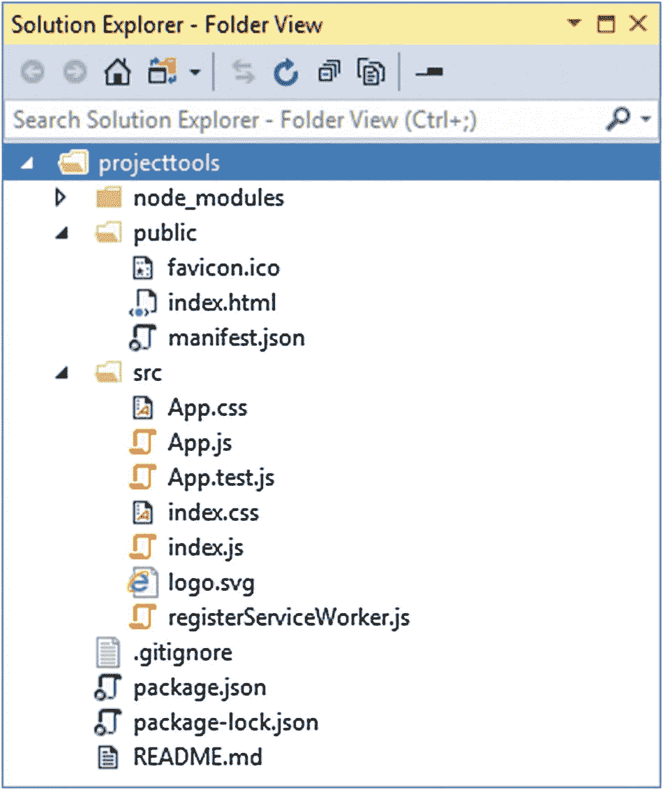

图 9-2

新项目的内容

### 注意

您不必使用`create-react-app`包来创建 React 项目，但这是最常用的方法，它负责配置支持本章所述特性的构建工具。如果您愿意，您可以创建所有文件并直接配置工具，或者使用其他可用于创建项目的技术之一，在 [`https://reactjs.org/docs/create-a-new-react-app.html`](https://reactjs.org/docs/create-a-new-react-app.html) 中有所描述。

表 [9-3](#Tab3) 描述了项目中的每一个文件，我在接下来的章节中提供了关于最重要文件的更多细节。

表 9-3

项目文件和文件夹

<colgroup><col class="tcol1 align-left"> <col class="tcol2 align-left"></colgroup> 
| 

名字

 | 

描述

 |
| --- | --- |
| `node_modules` | 该文件夹包含应用和开发工具所需的包，如“了解包文件夹”一节中所述。 |
| `public` | 该文件夹用于静态内容，包括用于响应 HTTP 请求的`index.html`文件，如“理解静态内容”一节所述。 |
| `src` | 该文件夹包含应用代码和内容，如“了解源代码文件夹”一节中所述。 |
| `.gitignore` | 这个文件用于从 Git 版本控制包中排除文件和文件夹。 |
| `package.json` | 该文件夹包含项目的顶层包依赖项集，如“了解包文件夹”一节中所述。 |
| `package-lock.json` | 该文件包含项目的包依赖项的完整列表，如“了解包文件夹”一节中所述。 |
| `README.md` | 该文件包含项目工具的信息，相同的内容可以在 [`https://github.com/facebook/create-react-app`](https://github.com/facebook/create-react-app) 找到。 |

### 了解源代码文件夹

`src`文件夹是项目中最重要的，因为它是放置应用代码和内容文件的地方，也是您定义项目所需的定制特性的地方。`create-react-app`包向跳转开发添加文件，如表 [9-4](#Tab4) 所述。

表 9-4

src 文件夹中的文件

<colgroup><col class="tcol1 align-left"> <col class="tcol2 align-left"></colgroup> 
| 

名字

 | 

描述

 |
| --- | --- |
| `index.js` | 这个文件负责配置和启动应用。 |
| `index.css` | 该文件包含应用的全局 CSS 样式。有关使用 CSS 文件的详细信息，请参见“理解静态内容”一节。 |
| `App.js` | 该文件包含顶级 React 组件。第[章 10](10.html) 和第[章 11](11.html) 对部件进行了描述。 |
| `App.css` | 该文件包含新项目的占位符 CSS 样式。有关详细信息，请参见“理解静态内容”一节。 |
| `App.test.js` | 该文件包含顶级组件的单元测试。有关单元测试的详细信息，请参见第 [17](17.html) 章。 |
| `registerServiceWorker.js` | 该文件由渐进式 web 应用使用，这些应用可以脱机工作。我没有在本书中描述渐进式应用，但你可以在 [`https://facebook.github.io/create-react-app/docs/making-a-progressive-web-app`](https://facebook.github.io/create-react-app/docs/making-a-progressive-web-app) 中找到细节。 |
| `logo.svg` | 该图像文件包含 React 徽标，并由创建时添加到项目中的占位符组件显示。请参见“理解静态内容”一节。 |

### 了解包文件夹

JavaScript 应用开发依赖于丰富的包生态系统，从包含将被发送到浏览器的代码的包，到在特定任务的开发过程中在后台使用的小包。React 项目中需要大量的包:例如，本章开始时创建的示例项目需要 900 多个包。

这些包之间有一个复杂的依赖层次结构，手工管理起来太困难了，只能用一个*包管理器*来处理。React 项目可以使用两个不同的包管理器来创建:NPM，它是节点包管理器，在第 [1](01.html) 章中与 Node.js 一起安装 Yarn，它是最近的竞争对手，旨在改进包管理。为简单起见，我在本书中通篇使用 NPM。

### 小费

你应该按照书中的例子使用 NPM，但如果你想在自己的项目中使用它，你可以在 [`https://yarnpkg.com`](https://yarnpkg.com) 找到纱的细节。

当创建一个项目时，包管理器会得到一个 React 开发所需的包的初始列表，对每个包进行检查以获得它所依赖的包的集合。再次执行该过程以获得那些包的依赖性，并且重复该过程，直到构建了完整的包列表。包管理器下载并安装所有的包，并将它们安装到`node_modules`文件夹中。

使用`dependencies`和`devDependencies`属性在`package.json`文件中定义初始的一组包。`dependencies`部分用于列出应用运行所需的包。`devDependencies`部分用于列出开发所需的包，但这些包不是作为应用的一部分部署的。

您可能会在项目中看到不同的细节，但这里是我的示例项目中的`package.json`文件的`dependencies`部分:

```jsx
...
"dependencies": {
    "bootstrap": "^4.1.2",
    "react": "^16.7.0",
    "react-dom": "^16.7.0",
    "react-scripts": "2.1.2"
},
...

```

React 项目的`dependencies`部分只需要三个包:`react`包包含主要特性，`react-dom`包包含 web 应用所需的特性，`react-scripts`包包含我在本章中描述的开发工具命令。第四个包是 Bootstrap CSS 框架，添加到清单 [9-2](#PC2) 的项目中。对于每个包，`package.json`文件包括可接受版本号的详细信息，使用表 [9-5](#Tab5) 中描述的格式。

表 9-5

软件包版本编号系统

<colgroup><col class="tcol1 align-left"> <col class="tcol2 align-left"></colgroup> 
| 

格式

 | 

描述

 |
| --- | --- |
| `16.7.0` | 直接表示版本号将只接受具有精确匹配版本号的包，例如 16.7.0。 |
| `*` | 使用星号表示接受要安装的任何版本的软件包。 |
| `>16.7.0 >=16.7.0` | 在版本号前面加上>或> =接受任何大于或等于给定版本的软件包版本。 |
| `<16.7.0 <=16.7.0` | 在版本号前加上 |
| `~16.7.0` | 在版本号前加一个波浪号(~字符)接受要安装的版本，即使修补程序级别号(三个版本号中的最后一个)不匹配。例如，指定~16.7.0 将接受版本 16.7.1 或 16.7.2(将包含版本 16.7.0 的修补程序)，但不接受版本 16.8.0(将是新的次要版本)。 |
| `^16.7.0` | 在版本号前加一个插入符号(^字符)将接受版本，即使次要版本号(三个版本号中的第二个)或补丁号不匹配。例如，指定^16.7.0 将允许 16.8.0 和 16.9.0 版本，但不允许 17.0.0 版本。 |

在`package.json`文件的`dependencies`部分指定的版本号将接受较小的更新和补丁。

### 了解全球和本地包

软件包管理员可以安装软件包，使它们特定于单个项目(称为*本地安装*)或者可以从任何地方访问它们(称为*全局安装*)。很少有软件包需要全局安装，但有一个例外，那就是我在第 [1](01.html) 章安装的`create-react-app`软件包，它是本书准备工作的一部分。`create-react-app`包需要全局安装，因为它用于创建新项目。项目所需的单个包被本地安装到`node_modules`文件夹中。

当你创建一个 React 项目时，开发所需的所有包都被自动下载并安装到`node_modules`文件夹中，但是表 [9-6](#Tab6) 列出了一些你可能会发现在开发过程中有用的 NPM 命令。所有这些命令都应该在项目文件夹中运行，这个文件夹包含了`package.json`文件。

表 9-6

有用的 NPM 命令

<colgroup><col class="tcol1 align-left"> <col class="tcol2 align-left"></colgroup> 
| 

命令

 | 

描述

 |
| --- | --- |
| `npx create-react-app <name>` | 该命令创建一个新的 React 项目。 |
| `npm install` | 该命令执行在`package.json`文件中指定的包的本地安装。 |
| `npm install package@version` | 该命令执行包的特定版本的本地安装，并更新`package.json`文件以将包添加到`dependencies`部分。 |
| `npm install --save-dev package@version` | 该命令执行包的特定版本的本地安装，并更新`package.json`文件以将包添加到`devDependencies`部分，该部分用于将包添加到项目中，这些包是开发所需的，但不是应用的一部分。 |
| `npm install --global package@version` | 此命令将对特定版本的软件包执行全局安装。 |
| `npm list` | 该命令将列出所有本地包及其依赖项。 |
| `npm run` | 该命令将执行在`package.json`文件中定义的脚本之一，如下所述。 |

表 [9-6](#Tab6) 中描述的最后一个命令很奇怪，但是包管理器传统上包含了对运行命令的支持，这些命令在`package.json`文件的`scripts`部分中定义。在 React 项目中，该特性用于提供对工具的访问，这些工具在开发过程中使用，并为应用的部署做准备。下面是示例项目中`package.json`文件的`scripts`部分:

```jsx
...
"scripts": {
  "start": "react-scripts start",
  "build": "react-scripts build",
  "test": "react-scripts test",
  "eject": "react-scripts eject"
},
...

```

这些命令总结在表 [9-7](#Tab7) 中，我将在后面的章节中演示它们的用法。

表 9-7

package.json 文件的脚本部分中的命令

<colgroup><col class="tcol1 align-left"> <col class="tcol2 align-left"></colgroup> 
| 

名字

 | 

描述

 |
| --- | --- |
| `start` | 该命令启动开发工具，如“使用 React 开发工具”一节所述。 |
| `build` | 此命令执行构建过程。 |
| `test` | 该命令运行单元测试，如第 [17](17.html) 章所述。 |
| `eject` | 该命令将所有开发工具的配置文件复制到项目文件夹中。这是一种单向操作，只有当开发工具的默认配置不适合某个项目时才应该使用。 |

表 [9-7](#Tab7) 中的命令通过使用`npm run`后跟您需要的命令名来执行，这必须在包含`package.json`文件的文件夹中完成。因此，如果您想在示例项目中运行`build`命令，您可以导航到`projecttools`文件夹并键入`npm run build`。例外是使用`npm start`执行的`start`命令。

## 使用 React 开发工具

添加到项目中的开发工具会自动检测到`src`文件夹中的更改，编译应用，并将文件打包以备浏览器使用。这些任务可以手动执行，但是自动更新会带来更愉快的开发体验。如果它们还没有运行，通过打开命令提示符，导航到`projecttools`文件夹，并运行清单 [9-5](#PC7) 中所示的命令来启动开发工具。

```jsx
npm start

Listing 9-5Starting the Development Tools

```

开发工具使用的关键包是 *webpack* ，它是许多 JavaScript 开发工具和框架的主干。Webpack 是一个*模块捆绑器*，这意味着它打包了在浏览器中使用的 JavaScript 模块——尽管这对于一个重要功能来说是一个平淡无奇的描述，并且它是开发 React 应用时您将依赖的关键工具之一。

当您运行清单 [9-5](#PC7) 中的命令时，当 webpack 准备运行示例应用所需的包时，您会看到一系列消息。Webpack 从`index.js`文件开始，加载所有有`import`语句的模块，以创建一组依赖关系。对`index.js`依赖的每个模块重复这个过程，webpack 继续在应用中工作，直到它拥有整个应用的一组完整的依赖项，然后这些依赖项被组合成一个文件，称为*包*。

绑定过程可能需要一点时间，但是只需要在启动开发工具时执行。一旦完成了初始准备，您将会看到一条类似这样的消息，它告诉您应用已经被编译和绑定了:

```jsx
...
Compiled successfully!

You can now view projecttools in the browser.

  Local:            http://localhost:3000/
  On Your Network:  http://192.168.0.77:3000/

Note that the development build is not optimized.
To create a production build, use npm run build.
...

```

当初始过程完成时，将为`http://localhost:3000`打开一个新的浏览器窗口，显示图 [9-3](#Fig3) 中的占位符内容。

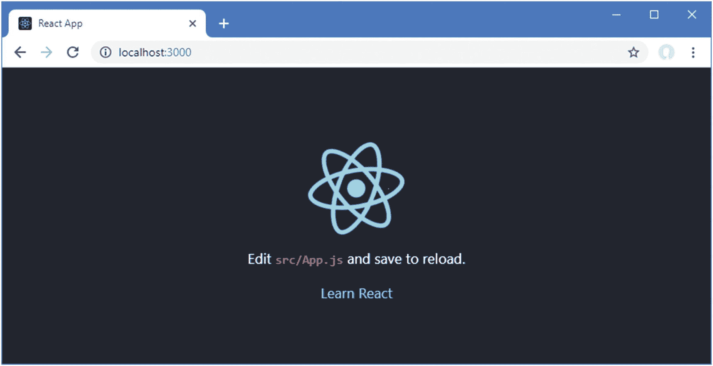

图 9-3

使用开发工具

### 了解编译和转换过程

Webpack 负责构建过程，其中一个关键步骤是由 *Babel* 包执行的代码转换。在 React 项目中，Babel 有两个重要的任务:转换 JSX 内容，以及将使用最新 JavaScript 特性的 JavaScript 代码转换成可以由旧浏览器执行的代码。

#### 了解 JSX 转型

正如我在第 3 章[中解释的，JSX 格式是 JavaScript 的超集，允许 HTML 与常规代码语句混合使用。JSX 并不完全支持标准 HTML，最明显的区别是纯 HTML 中的属性如`class`在 JSX 文件中被表示为`className`。出现这些奇怪现象的原因是，在构建过程中，JSX 文件的内容被 Babel 转换成对 React API 的调用，因此每个 HTML 元素都被转换成对`React.createElement`方法的调用。在清单](03.html) [9-6](#PC9) 中，我用一个组件替换了`App.js`文件中的占位符内容，该组件的`render`方法返回一些简单的 HTML 元素。

```jsx
import React, { Component } from "react";

export default class extends Component {

    render = () =>
        <h4 className="bg-primary text-white text-center p-3">
            This is an HTML element
        </h4>
}

Listing 9-6Replacing the Placeholder Content in the App.js File in the src Folder

```

在转换过程中，`h4`元素被替换为对`React.createElement`方法的调用，产生的结果完全是 JavaScript，不需要浏览器对 JSX 有特别的理解。作为一个简单的演示，清单 [9-7](#PC10) 直接使用`React.createElement`方法来实现相同的结果。

```jsx
import React, { Component } from "react";

export default class extends Component {

    render = () => React.createElement("h4",
                    { className: "bg-primary text-white text-center p-3" },
                    "This is an HTML element")
}

Listing 9-7Using the React API Directly in the App.js File in the src Folder

```

清单 [9-6](#PC9) 和清单 [9-7](#PC10) 产生相同的结果，当 Babel 处理清单 [9-6](#PC9) 中`App.js`文件的内容时，它产生清单 [9-7](#PC10) 中的代码。当 React 在浏览器中执行 JavaScript 代码时，它使用 DOM API 创建 HTML 元素，如第 [3](03.html) 章所示。这似乎是一种循环的方法，但是 JSX 转换只在构建过程中执行，目的是使编写 React 特性更容易。

#### 理解 JavaScript 语言转换

经过多年的停滞之后，JavaScript 语言已经重新焕发了活力，并通过简化开发和提供其他编程语言中常见的功能(如第 [4](04.html) 章中描述的那些功能)实现了现代化。并非所有浏览器都支持所有最新的语言功能，尤其是较旧的浏览器或在企业环境中使用的浏览器，在这些环境中，更新通常很慢(如果有的话)。Babel 通过将现代功能翻译成代码来解决这个问题，这些代码使用了更广泛的浏览器支持的功能，包括 JavaScript 文艺复兴之前的浏览器。

在清单 [9-8](#PC11) 中，我返回了`App.js`文件以使用 HTML 元素，并使用最新的 JavaScript 特性来设置`h4`元素的内容。

```jsx
import React, { Component } from "react";

let name = "Adam";

const city = "London";

export default class extends Component {

    message = () => `Hello ${name} from ${city}`;

    render = () =>
        <h4 className="bg-primary text-white text-center p-3">
            { this.message() }
        </h4>
}

Listing 9-8Using Modern JavaScript Features in the App.js File in the src Folder

```

这个组件依赖于几个最新的 JavaScript 特性:定义类的关键字`class`和`extends`，定义变量和常量的关键字`let`和`const`，以及`message`方法中的 lambda 函数和模板字符串。当您保存更改时，React 开发工具将自动编译并捆绑 JavaScript 代码，并将其发送到浏览器，产生如图 [9-4](#Fig4) 所示的内容。

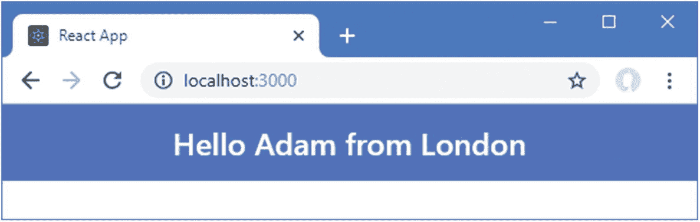

图 9-4

使用现代语言功能

要查看 Babel 是如何处理现代 JavaScript 特性的，打开 F12 开发者工具，选择 Sources 选项卡，在窗口左侧的树中找到`main.chunk.js`项，如图 [9-5](#Fig5) 所示。对于编写本文时的 Chrome 版本，该文件位于树的`localhost:3000` > `static/js`部分下。

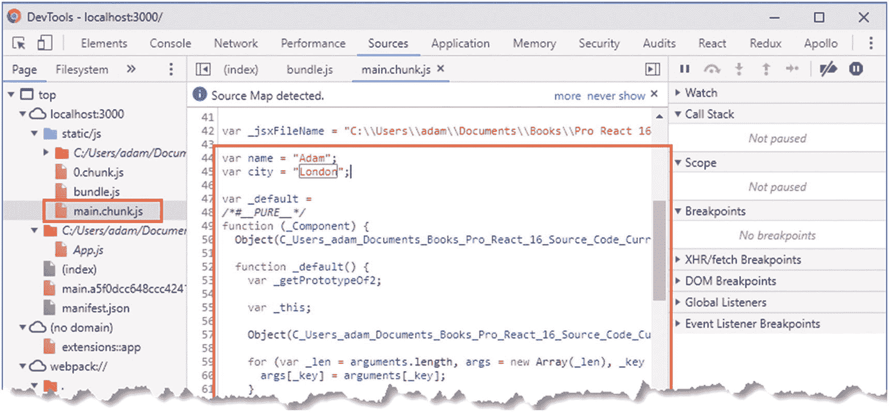

图 9-5

定位编译后的源代码

### 小费

谷歌 Chrome 开发者工具经常变化，你可能不得不四处寻找 Babel 产生的代码。使用 Ctrl+F 并搜索*伦敦*是找到你要找的代码的好方法。另一种方法是将清单 [9-8](#PC11) 中的代码粘贴到解释器的 [`https://babeljs.io/repl`](https://babeljs.io/repl) 处，这将产生类似的结果。

如果你向下滚动——或者搜索 *London* ,如前所述——那么你会看到巴别塔生成的代码。旧浏览器不支持的所有功能都被替换为向后兼容的代码，如下所示:

```jsx
...
var name = "Adam";
var city = "London";

var App = function (_Component) {
    _inherits(App, _Component);

    function App() {
        var _ref;

        var _temp, _this, _ret;

        _classCallCheck(this, App);

        for (var _len = arguments.length, args = Array(_len), _key = 0;
                _key < _len; _key++) {
            args[_key] = arguments[_key];
        }

        return _ret = (_temp = (_this = _possibleConstructorReturn(this,
            (_ref = App.__proto__ || Object.getPrototypeOf(App)).call.apply(_ref,
                [this].concat(args))), _this), _this.message = function () {
                   return "Hello " + name + " from " + city;
                }, _temp), _possibleConstructorReturn(_this, _ret);
    }

    _createClass(App, [{
        key: "render",
        value: function render() {
            return __WEBPACK_IMPORTED_MODULE_0_react___default.a.createElement(
                "div",
                { className: "h1 bg-primary text-white text-center p-3", __source: {
                        fileName: _jsxFileName,
                        lineNumber: 12
                    },
                    __self: this
                },
                this.message()
            );
        }
    }]);
    return App;
}
...

```

您不需要详细了解这些代码是如何工作的，尤其是因为其中一些代码非常复杂，难以阅读。重要的是如何处理在`App.js`文件中使用的特性，例如`let`和`const`关键字，它们被传统的`var`关键字所取代。

```jsx
...
var name = "Adam";
var city = "London";
...

```

您还可以看到模板字符串已被替换为字符串串联，如下所示:

```jsx
...
return "Hello " + name + " from " + city;
...

```

一些特性，比如类，是使用 Babel 添加到发送给浏览器的包中的函数来处理的。JSX 的 HTML 片段被翻译成对`React.createElement`方法的调用。

现代特性的翻译是复杂的，但是 JavaScript 语言最近增加的内容很大程度上是语法糖，旨在使开发人员更喜欢编码。翻译这些功能剥夺了这些租赁功能的代码，需要一些扭曲来创建一个老浏览器可以执行的等效效果。

### 理解巴别塔的极限

Babel 是一个优秀的工具，但是它只处理 JavaScript 语言特性。Babel 不能在不支持最新 JavaScript APIs 的浏览器上增加对这些 API 的支持。您仍然可以使用这些 API——正如我在第 1 部分中使用本地存储 API 时所演示的那样——但是这样做限制了可以运行应用的浏览器的范围。

### 了解开发 HTTP 服务器

为了简化开发过程，该项目包含了`webpack-dev-server`包，这是一个与 webpack 集成的 HTTP 服务器。服务器被配置为在初始绑定过程完成后立即开始侦听端口 3000 上的 HTTP 请求。当接收到 HTTP 请求时，开发 HTTP 服务器返回`public/index.html`文件的内容。在处理`index.html`文件时，开发服务器做了一些重要的添加，您可以通过在浏览器窗口中右键单击并从弹出菜单中选择 View Page Source 来查看。

```jsx
<!DOCTYPE html>
<html lang="en">
  <head>
    <meta charset="utf-8">
    <meta name="viewport" content="width=device-width,
        initial-scale=1, shrink-to-fit=no">
    <meta name="theme-color" content="#000000">
    <link rel="manifest" href="/manifest.json">
    <link rel="shortcut icon" href="/favicon.ico">
    <title>React App</title>
  </head>
  <body>
    <noscript>
      You need to enable JavaScript to run this app.
    </noscript>
    <div id="root"></div>
    <script src="/static/js/bundle.js"></script>
    <script src="/static/js/0.chunk.js"></script>
    <script src="/static/js/main.chunk.js"></script>
    <script src="/main.a5f0dcc648ccc4241725.hot-update.js"></script>
  </body>
</html>

```

开发服务器添加了`script`元素，告诉浏览器加载包含 React 框架、应用代码、静态内容(如 CSS)和一些支持开发工具的附加功能的文件，并在检测到更改时自动重新加载浏览器。

### 理解静态内容

有两种方法可以在 React 应用中包含静态内容，比如图像或 CSS 样式表。在大多数情况下，最好的方法是将您需要的文件添加到`src`文件夹中，然后在代码文件中使用`import`语句声明对它们的依赖。

为了演示如何处理`src`文件夹中的静态内容，我用清单 [9-9](#PC16) 中所示的 CSS 样式替换了`App.css`文件的内容，该文件是在创建时添加到项目中的。

```jsx
img {
  background-color: lightcyan;
  width: 50%;
}

Listing 9-9Replacing the Styles in the App.css File in the src Folder

```

我定义的样式选择`img`元素并设置背景颜色和宽度。在清单 [9-10](#PC17) 中，我向`App`组件的`src`文件夹中的两个静态文件添加了依赖项，包括我在前面的清单中更新的 CSS 文件和创建项目时添加到项目中的占位符图像。

### 小费

`index.css`文件由`index.js`文件导入，后者是负责启动 React 应用的 JavaScript 文件。您可以在 CSS 文件中定义全局样式，它们将包含在发送到浏览器的内容中。

```jsx
import React, { Component } from "react";

import "./App.css";

import reactLogo from "./logo.svg";

let name = "Adam";
const city = "London";

export default class extends Component {

    message = () => `Hello ${name} from ${city}`;

    render = () =>
        <div className="text-center">
            <h4 className="bg-primary text-white text-center p-3">
                { this.message() }
            </h4>
            
        </div>
}

Listing 9-10Declaring a Static Dependency in the App.js File in the src Folder

```

要导入在使用时不需要引用的内容，如 CSS 样式表，`import`关键字后接文件名，文件名必须包括文件扩展名，如下所示:

```jsx
...
import "./App.css";
...

```

要导入将在 HTML 元素中引用的内容，如图像，则必须使用为导入的特性指定名称的`import`语句的形式，如以下语句:

```jsx
...
import reactLogo from "./logo.svg";
...

```

这个`statement`导入了`logo.svg`文件，并给它命名为`reactLogo`，然后我可以在一个`img`元素的表达式中使用它，就像这样:

```jsx
...

...

```

当您使用`import`关键字声明对静态内容的依赖时，如何处理内容的决定就留给了开发工具。对于小于 10Kb 的文件，内容将包含在`bundle.js`文件中，以及将内容添加到 HTML 文档所需的 JavaScript 代码。这就是清单 [9-10](#PC17) 中导入的`App.css`文件的情况:CSS 文件的内容将包含在`bundle.js`文件中，以及创建`style`元素所需的代码。

对于较大的文件，以及任何大小的 SVG 文件，在单独的 HTTP 请求中请求导入的文件。由`import`语句指定的相对路径被自动替换为定位文件的 URL，并且文件名被更改为包含校验和，这确保了过时的数据不会被浏览器缓存。

您可以看到清单 [9-10](#PC17) 中使用的静态内容的效果，方法是保存对`App.js`文件的更改，等待浏览器重新加载，然后使用 F12 开发人员的工具检查 Elements 选项卡，这将显示以下 HTML(尽管为了简洁起见，我省略了大量的 Bootstrap CSS 样式):

```jsx
<html lang="en">
  <head>
    <meta charset="utf-8">
    <link rel="shortcut icon" href="/favicon.ico">
    <meta name="viewport" content="width=device-width,
         initial-scale=1, shrink-to-fit=no">
    <meta name="theme-color" content="#000000">
    <link rel="manifest" href="/manifest.json">
    <title>React App</title>
    <style type="text/css">
      img { background-color: lightcyan; width: 50% }
     </style>
  </head>
  <body>
    <noscript>You need to enable JavaScript to run this app.</noscript>
    <div id="root">
        <div class="text-center">
          <h4 class="bg-primary text-white text-center p-3">
            Hello Adam from London
           </h4>
           
         </div>
    </div>
    <script src="/static/js/bundle.js"></script>
    <script src="/static/js/1.chunk.js"></script>
    <script src="/static/js/main.chunk.js"></script>
    <script src="/main.00ec8a0c115561c18137.hot-update.js"></script>
  </body>
</html>

```

您可以看到 CSS 样式已经从 JavaScript 包中解包，并通过一个`style`元素添加到 HTML 文档中，而图像文件是通过 URL `/static/media/logo.5d5d9eef.svg`访问的。在构建过程中，大型文件会自动复制到应用代码中包含的 URL 所指定的位置，这意味着您不必担心它们是否可用。清单 [9-10](#PC17) 中的变化产生如图 [9-6](#Fig6) 所示的结果。

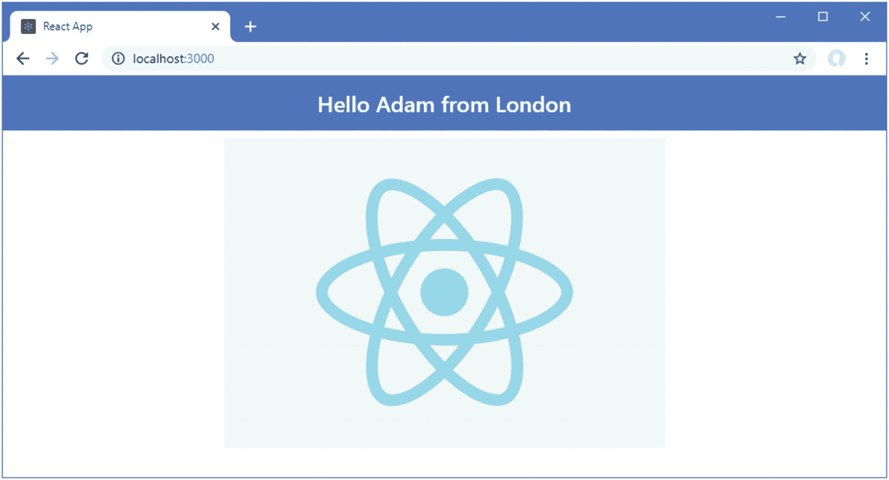

图 9-6

src 文件夹中的静态内容

#### 将公共文件夹用于静态内容

将`src`文件夹用于静态内容有几个好处，但是您可能会发现它并不总是适合每个项目，尤其是在静态内容在构建时不可用并且不能被 React 开发工具处理的情况下。在这些情况下，您可以将静态内容放在`public`文件夹中，尽管这意味着您有责任确保应用拥有它所需要的文件。为了演示`public`文件夹的使用，我给它添加了一个名为`static.css`的文件，内容如清单 [9-11](#PC22) 所示。

```jsx
img {
    border: 8px solid black;
}

Listing 9-11The Contents of the static.css File in the public Folder

```

打开一个新的命令提示符，导航到`projecttools`文件夹，运行清单 [9-12](#PC23) 所示的命令，将`logo.svg`文件从`src`文件夹复制到`public`文件夹。

```jsx
cp src/logo.svg public/

Listing 9-12Copying an Image File into the Public Folder

```

在清单 [9-13](#PC24) 中，我为`public`文件夹中的图像和样式表向由`App`组件呈现的内容添加了 HTML 元素。

```jsx
import React, { Component } from "react";
import "./App.css";
import reactLogo from "./logo.svg";

let name = "Adam";
const city = "London";

export default class extends Component {

    message = () => `Hello ${name} from ${city}`;

    render = () =>
        <div className="text-center">
            <h4 className="bg-primary text-white text-center p-3">
                { this.message() }
            </h4>
            
            <link rel="stylesheet"
                    href={ process.env.PUBLIC_URL + "/static.css"} />
            
        </div>
}

Listing 9-13Accessing Static Files in the App.js File in the src Folder

```

为了指定静态文件的 URL，`process.env.PUBLIC_URL`属性与表达式中的文件名结合在一起。注意，我已经为样式表添加了一个`link`元素，因为我不能依靠`bundle.js`文件中的代码来自动创建样式。添加元素到组件的结果如图 [9-7](#Fig7) 所示。

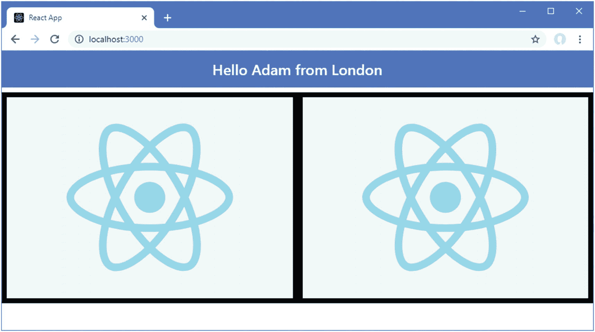

图 9-7

公共文件夹中的静态内容

### 了解错误显示

自动重新加载特性提供的即时性的一个影响是，在开发过程中，您会倾向于停止观察控制台输出，因为您的注意力会自然地被吸引到浏览器窗口。风险在于，当代码包含错误时，浏览器显示的内容保持不变，因为编译过程无法生成新的模块通过 HMR 功能发送给浏览器。为了解决这个问题，webpack 开发的包中包含了一个集成的错误显示，可以在浏览器窗口中显示问题的详细信息。为了演示处理错误的方式，我将清单 [9-14](#PC25) 中所示的语句添加到了`App.js`文件中。

```jsx
import React, { Component } from "react";
import "./App.css";
import reactLogo from "./logo.svg";

let name = "Adam";
const city = "London";

not a valid statement

export default class extends Component {

    message = () => `Hello ${name} from ${city}`;

    render = () =>
        <div className="text-center">
            <h4 className="bg-primary text-white text-center p-3">
                { this.message() }
            </h4>
            
            <link rel="stylesheet"
                    href={ process.env.PUBLIC_URL + "/static.css"} />
            
        </div>
}

Listing 9-14Creating an Error in the App.js File in the src Folder

```

加法不是有效的 JavaScript 语句。保存对文件的更改后，构建过程会尝试编译代码，并在命令提示符下生成以下错误信息:

```jsx
...
Failed to compile.

./src/App.js
  Line 8:  Parsing error: Unexpected token, expected ";"

   6 | const city = "London";
   7 |
>  8 | not a valid statement
     |     ^
   9 |
  10 | export default class extends Component {
  11 |
...

```

浏览器窗口中会显示相同的错误消息，因此即使您没有注意命令行消息，您也会意识到存在问题。如果你点击栈跟踪，那么浏览器会向开发服务器发送一个 HTTP 请求，开发服务器会试图找出你使用的是哪个代码编辑器，并突出显示问题，如图 [9-8](#Fig8) 所示。

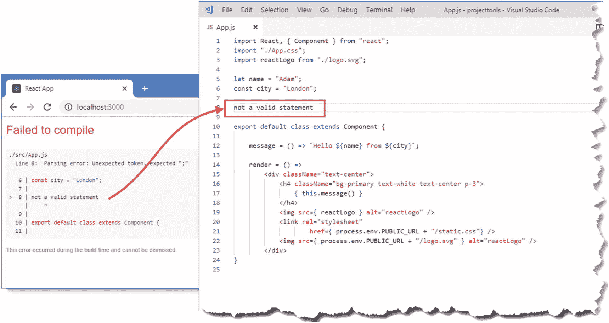

图 9-8

在源代码文件出现错误后

### 小费

您可能需要配置 React 开发工具来指定您的编辑器，如“配置开发工具”一节中所述，并且不是所有的编辑器都受支持。图 [9-8](#Fig8) 显示了 Visual Studio 代码，这是提供支持的编辑器之一。

### 了解棉绒

React 开发工具包括一个 linter，它负责检查项目中的代码和内容是否符合一组规则。当您使用`create-react-app`包创建一个项目时，ESLint 包被用作 linter，带有一组规则，旨在帮助程序员避免常见错误。作为演示，我在`App.js`文件中添加了一个变量，如清单 [9-15](#PC27) 所示。(此更改还会删除上一节中导致编译器错误的语句)。

```jsx
import React, { Component } from "react";
import "./App.css";
import reactLogo from "./logo.svg";

let name = "Adam";
const city = "London";

let error = "not a valid statement";

export default class extends Component {

    message = () => `Hello ${name} from ${city}`;

    render = () =>
        <div className="text-center">
            <h4 className="bg-primary text-white text-center p-3">
                { this.message() }
            </h4>
            
            <link rel="stylesheet"
                    href={ process.env.PUBLIC_URL + "/static.css"} />
            
        </div>
}

Listing 9-15Adding a Variable in the App.js File in the src Folder

```

保存文件时，您会在命令行和浏览器的 JavaScript 控制台中看到以下警告:

```jsx
...
Compiled with warnings.

./src/App.js
  Line 8:  'error' is assigned a value but never used  no-unused-vars
...

```

linter 不能被禁用或重新配置，这意味着您将收到一组固定规则的林挺警告，包括清单 [9-15](#PC27) 破坏的`no-unused-vars`规则。您可以在 [`https://github.com/facebook/create-react-app/tree/master/packages/eslint-config-react-app`](https://github.com/facebook/create-react-app/tree/master/packages/eslint-config-react-app) `.`看到 React 项目中应用的一组规则

当您收到警告时，搜索规则名称将为您提供问题的描述。在这种情况下，搜索 no-unused-vars 会将您带到 [`https://eslint.org/docs/rules/no-unused-vars`](https://eslint.org/docs/rules/no-unused-vars) ，这解释了变量不能被定义和不被使用。

#### 禁用单个语句和文件的林挺

虽然 linter 不能被禁用，但是您可以向文件添加注释来防止警告。在清单 [9-16](#PC29) 中，我通过添加注释禁用了单个语句的`no-unused-var`规则。

```jsx
import React, { Component } from "react";
import "./App.css";
import reactLogo from "./logo.svg";

let name = "Adam";
const city = "London";

// eslint-disable-next-line no-unused-vars

let error = "not a valid statement";

export default class extends Component {

    message = () => `Hello ${name} from ${city}`;

    render = () =>
        <div className="text-center">
            <h4 className="bg-primary text-white text-center p-3">
                { this.message() }
            </h4>
            
            <link rel="stylesheet"
                    href={ process.env.PUBLIC_URL + "/static.css"} />
            
        </div>
}

Listing 9-16Disabling a Single Linting Rule in the App.js File in the src Folder

```

如果您想禁用下一条语句的所有规则，那么您可以省略规则名称，如清单 [9-17](#PC30) 所示。

```jsx
...

// eslint-disable-next-line

let error = "not a valid statement";
...

Listing 9-17Disabling All Linting Rules in the App.js File in the src Folder

```

如果您想要禁用整个文件的规则，那么您可以在文件的顶部添加一个注释，如清单 [9-18](#PC31) 所示。

```jsx
/* eslint-disable no-unused-vars */

import React, { Component } from "react";
import "./App.css";
import reactLogo from "./logo.svg";

let name = "Adam";
const city = "London";

let error = "not a valid statement";

export default class extends Component {

    message = () => `Hello ${name} from ${city}`;

    render = () =>
        <div className="text-center">
            <h4 className="bg-primary text-white text-center p-3">
                { this.message() }
            </h4>
            
            <link rel="stylesheet"
                    href={ process.env.PUBLIC_URL + "/static.css"} />
            
        </div>
}

Listing 9-18Disabling a Single Rule for a File in the App.js File in the src Folder

```

如果您想对单个文件的所有规则禁用林挺，那么您可以在注释中省略规则名称，如清单 [9-19](#PC32) 所示。

```jsx
...

/* eslint-disable */

import React, { Component } from 'react';
import "./App.css";
import reactLogo from "./logo.svg";

let name = "Adam";
const city = "London";
...

Listing 9-19Disabling All Rules for a File in the App.js File in the src Folder

```

linter 将忽略 App.js 文件的内容，但仍然会检查项目中其他文件的内容。

### 使用类型脚本或流

林挺并不是检测常见错误的唯一方法，一种很好的补充技术是*静态类型检查*，其中您将变量和函数结果的数据类型的细节添加到您的代码中，以创建由编译器强制执行的策略。例如，您可以指定函数总是返回一个字符串，或者它的第一个参数只能是一个数字。编译应用时，会检查使用该函数的代码，以确保它只将数值作为参数传递，并且只将结果作为字符串处理。

向 React 项目添加静态类型检查有两种常见的方法。首先是使用 TypeScript，它是微软生产的 JavaScript 的超集。TypeScript 使得使用 JavaScript 更像 C#或 Java，并且包括对静态类型检查的支持。如果要使用 TypeScript，那么在创建项目时使用- scripts-version 参数，如下所示:

```jsx
...
npx create-react-app projecttools --scripts-version=react-scripts-ts
...

```

`react-scripts-ts`值产生一个用 TypeScript 工具和特性建立的项目。你可以在 [`https://www.typescriptlang.org`](https://www.typescriptlang.org) 了解更多关于 TypeScript 的知识。

一个替代方案是一个名为 Flow 的包，它只关注类型检查，不具备 TypeScript 的更广泛的特性。您可以在 [`https://flow.org`](https://flow.org) 了解更多心流知识

### 配置开发工具

React 开发工具提供了少量的配置选项，尽管在大多数项目中并不需要。可用选项如表 [9-8](#Tab8) 所述。

表 9-8

React 开发工具配置选项

<colgroup><col class="tcol1 align-left"> <col class="tcol2 align-left"></colgroup> 
| 

名字

 | 

描述

 |
| --- | --- |
| 浏览器 | 此选项用于指定开发工具完成初始生成过程时打开的浏览器。您可以通过指定路径来指定浏览器，或者使用`none`来禁用此功能。 |
| 宿主 | 该选项用于指定开发 HTTP 服务器绑定的主机名，默认为`localhost`。 |
| 港口 | 该选项用于指定开发 HTTP 服务器使用的端口，默认为`3000`。 |
| 安全超文本传输协议 | 当设置为`true`时，该选项为开发 HTTP 服务器启用 SSL，生成自签名证书。默认为`false`。 |
| PUBLIC_URL | 该选项用于更改用于从`public`文件夹请求内容的 URL，如*理解静态内容*一节所述。 |
| 海峡群岛 | 当设置为`true`时，该选项将所有警告视为构建过程中的错误。默认值为`false`。 |
| REACT _ 编辑器 | 如*了解错误显示*部分所述，该选项用于指定当您点击浏览器中的栈跟踪时打开代码文件的特性的编辑器。 |
| CHOKIDAR_USEPOLLING | 当开发工具无法检测到对`src`文件夹的更改时，该选项应该设置为`true`，如果您在虚拟机或容器中工作，这种情况可能会发生。 |
| 生成 _ 源地图 | 将此选项设置为`false`会禁用源映射的生成，浏览器在调试过程中使用源映射将捆绑的 JavaScript 代码与项目中的源文件相关联。默认为`true`。 |
| 节点路径 | 此设置用于指定将搜索 Node.js 模块的位置。 |

这些选项要么通过设置环境变量来指定，要么通过创建一个`.env`文件来指定，这是我认为最可靠的方法。为了演示配置过程，我在`projecttools`文件夹中添加了一个名为`.env`的文件，并添加了清单 [9-20](#PC34) 中所示的配置语句。

```jsx
PORT=3500
HTTPS=true

Listing 9-20The Contents of the .env File in the projecttools Folder

```

我使用了`PORT`选项来指定用于接收请求的端口 3500，并使用了`HTTPS`选项来启用开发服务器中的 SSL。要查看更改的效果，停止开发工具并运行清单 [9-21](#PC35) 中所示的命令来再次启动它们。

```jsx
npm start

Listing 9-21Starting the React Development Tools

```

当初始构建过程完成时，打开的浏览器窗口将导航至`https://localhost:3500`。大多数浏览器会显示一个关于自签名证书的警告，然后在你点击高级链接(或其等效物)并告诉浏览器继续时显示 web 应用，如图 [9-9](#Fig9) 所示。

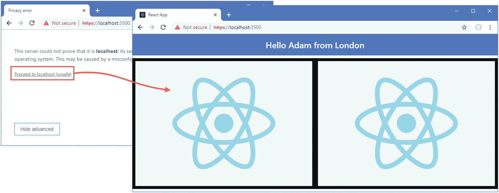

图 9-9

配置开发工具

## 调试 React 应用

并不是所有的问题都能被编译器或 linter 检测到，能够完美编译的代码可能会以意想不到的方式运行。有两种方法可以理解您的应用的行为，如下面几节所述。为了帮助演示调试特性，我在`src`文件夹中添加了一个名为`Display.js`的文件，并用它来定义清单 [9-22](#PC36) 中所示的组件。

```jsx
import React, {Component } from "react";

export class Display extends Component {

    constructor(props) {
        super(props);
        this.state = {
            counter: 1
        }
    }

    incrementCounter = () => {
        this.setState({ counter: this.state.counter + 1 });
    }

    render() {
        return (
            <div>
                <h2 className="bg-primary text-white text-center p-2">
                    <div>Props Value: { this.props.value }</div>
                    <div>Local Value: { this.state.counter } </div>
                </h2>
                <div className="text-center">
                    <button className="btn btn-primary m-2"
                            onClick={ this.props.callback }>
                        Parent
                    </button>
                    <button  className="btn btn-primary m-2"
                            onClick={ this.incrementCounter }>
                        Local
                    </button>
                </div>
            </div>
        )
    }
}

Listing 9-22The Contents of the Display.js File in the src Folder

```

该组件显示自己的状态属性和从其父组件接收的属性值。它显示两个`button`元素，其中一个更改 state 属性，另一个调用作为 prop 提供的回调。在清单 [9-23](#PC37) 中，我替换了`App`组件的现有内容，为调试部分做准备。

```jsx
import React, { Component } from "react";
import { Display } from "./Display";

export default class App extends Component {

    constructor(props) {
        super(props);
        this.state = {
            city: "London"
        }
    }

    changeCity = () => {
        this.setState({ city: this.state.city === "London" ? "New York" : "London"})
    }

    render() {
        return (
            <Display value={ this.state.city } callback={ this.changeCity } />
        );
    }
}

Listing 9-23Replacing the Contents of the App.js File in the src Folder

```

当您保存对 JavaScript 文件的更改时，应用将被编译，您将看到如图 [9-10](#Fig10) 所示的内容。

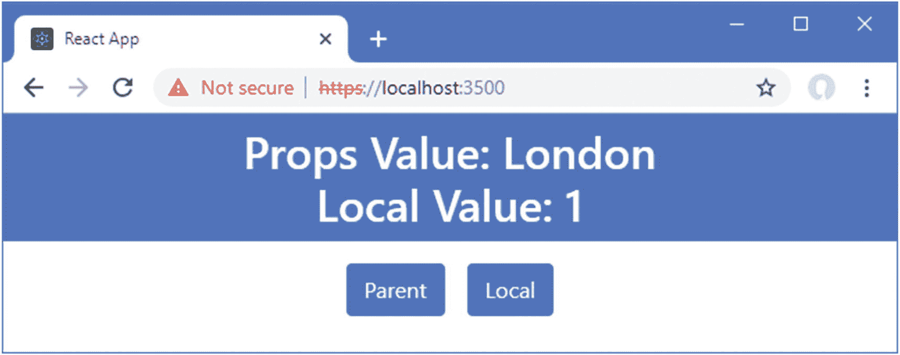

图 9-10

向示例应用添加功能

### 注意

您可能会发现，当`.env`文件中的`HTTPS`选项设置为 true 时，浏览器不会自动更新。您可以手动重新加载浏览器以查看更改，或者禁用此选项并重新启动开发工具。

### 探索应用状态

React Devtools 浏览器扩展是探索 React 应用状态的优秀工具。谷歌 Chrome 和 Mozilla Firefox 都有可用的版本，项目的细节——包括对其他平台的支持和独立版本的细节——可以在 [`https://github.com/facebook/react-devtools`](https://github.com/facebook/react-devtools) 找到。安装完扩展后，您将在浏览器的“开发人员工具”窗口中看到一个附加选项卡，可通过按 F12 按钮访问该选项卡(这也是这些工具也称为 F12 工具的原因)。

F12 工具窗口中的 React 选项卡允许您浏览和更改应用的结构和状态。您可以看到提供应用功能的一组组件，以及它们的状态数据和属性。

对于示例应用，如果您打开 React 选项卡并在左窗格中展开应用结构，您将在左窗格中看到`App`和`Display`组件，它们与应用呈现的 HTML 元素的视图一起显示。当您在左侧页面中选择一个组件时，其属性和状态数据会显示在右侧窗格中，如图 [9-11](#Fig11) 所示。

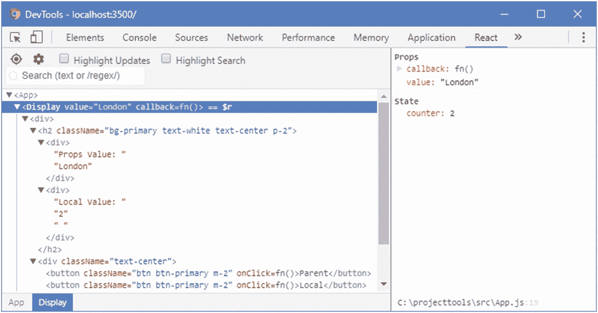

图 9-11

使用 React Devtools 探索组件

如果您单击浏览器窗口中的按钮，您将看到 React Devtools 显示的值发生变化，反映了应用的实时状态。您还可以单击一个状态数据值，并通过 React Devtools 更改其值，这允许直接操作应用的状态。

### 小费

Redux 数据存储包也有调试工具，我在第 [19](19.html) 章描述了它，它通常用于管理复杂项目的数据。

### 使用浏览器调试器

现代浏览器包括复杂的调试器，可用于控制应用的执行并检查其状态。React 开发工具包括对创建源映射的支持，这允许浏览器将它正在执行的缩小和捆绑的代码与高效调试所需的开发人员友好的源代码相关联。

有些浏览器允许您使用这些源代码映射来浏览应用的源代码，并创建断点，当到达断点时，断点将暂停应用的执行，并将控制权交给调试器。当我写这篇文章时，创建断点的能力是一个脆弱的功能，在 Chrome 上不起作用，在其他浏览器上也有混合的可靠性。因此，将应用控制权传递给调试器的最可靠方式是使用 JavaScript `debugger`关键字，如清单 [9-24](#PC38) 所示。

```jsx
import React, { Component } from "react";
import { Display } from "./Display";

export default class App extends Component {

    constructor(props) {
        super(props);
        this.state = {
            city: "London"
        }
    }

    changeCity = () => {
        debugger
        this.setState({ city: this.state.city === "London" ? "New York" : "London"})
    }

    render() {
        return (
            <Display value={ this.state.city } callback={ this.changeCity } />
        );
    }
}

Listing 9-24Triggering the Debugger in the App.js File in the src Folder

```

为了有效地使用调试器，禁用`.env`文件中的 HTTPS 选项，如清单 [9-25](#PC39) 所示。如果您不禁用此选项，您将只能看到由 Babel 生成的代码，而不能看到您的原始源代码。

```jsx
PORT=3500

HTTPS=false

Listing 9-25Disabling Secure Connections in the .env File in the projecttools Folder

```

停止开发工具，并通过运行`projecttools`文件夹中清单 [9-26](#PC40) 所示的命令再次启动它们。

```jsx
npx start

Listing 9-26Starting the Development Tools

```

应用将正常执行，但是当单击父按钮并调用`changeCity`方法时，浏览器将遇到`debugger`关键字并暂停应用的执行。然后你可以使用 F12 工具窗口中的控件来检查执行停止点的变量及其值，并手动控制执行，如图 [9-12](#Fig12) 所示。浏览器正在执行由开发工具创建的缩小和捆绑的代码，但是显示来自源地图的相应代码。

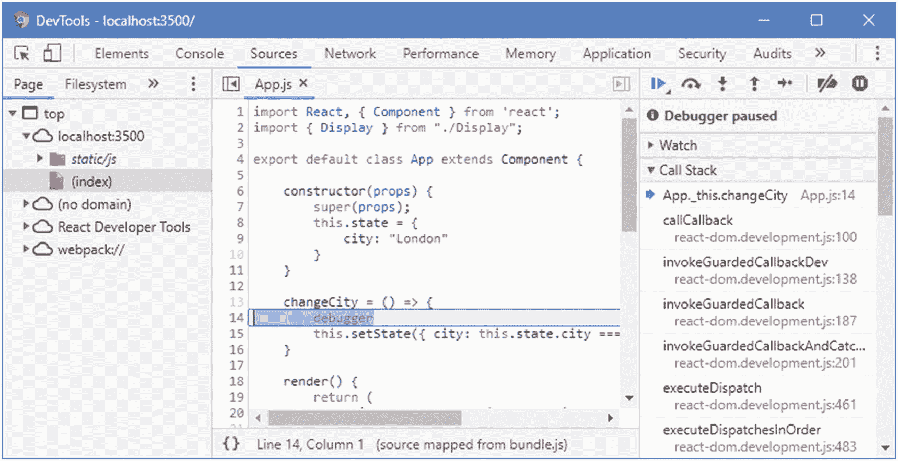

图 9-12

使用浏览器调试器

### 小费

大多数浏览器会忽略`debugger`关键字，除非 F12 工具窗口是打开的，但是在调试会话结束时删除它是一个好习惯。

## 摘要

在本章中，我描述了用`create-react-app`包创建的 React 项目的结构，并解释了 React 开发中使用的文件和文件夹的用途。我还解释了如何使用 React 开发工具，如何在浏览器中捆绑应用，错误显示和 linter 如何帮助避免常见问题，以及如何在没有收到预期结果时调试应用。在下一章中，我将介绍组件，它们是 React 应用的关键构件。