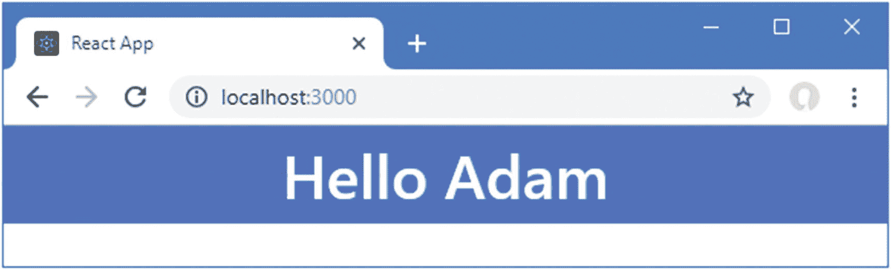
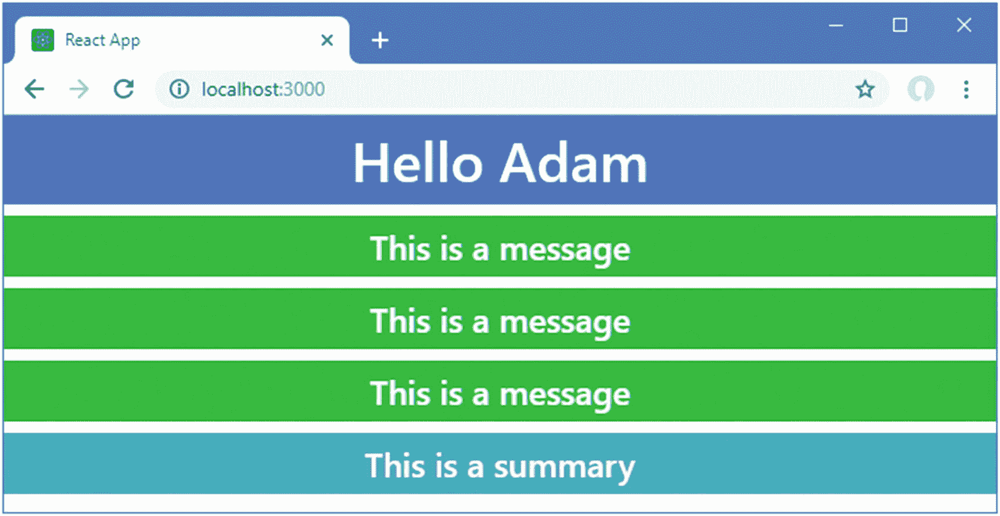
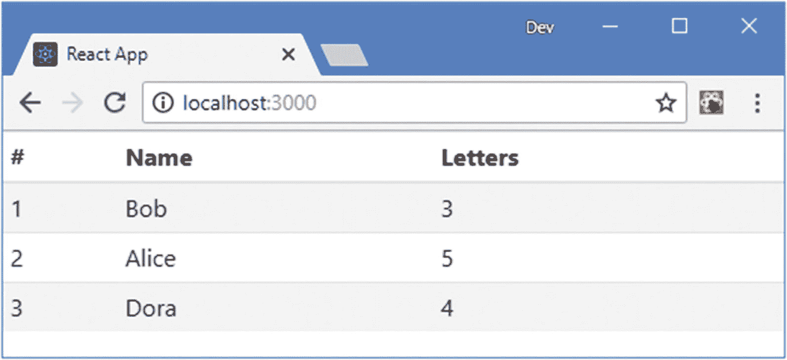
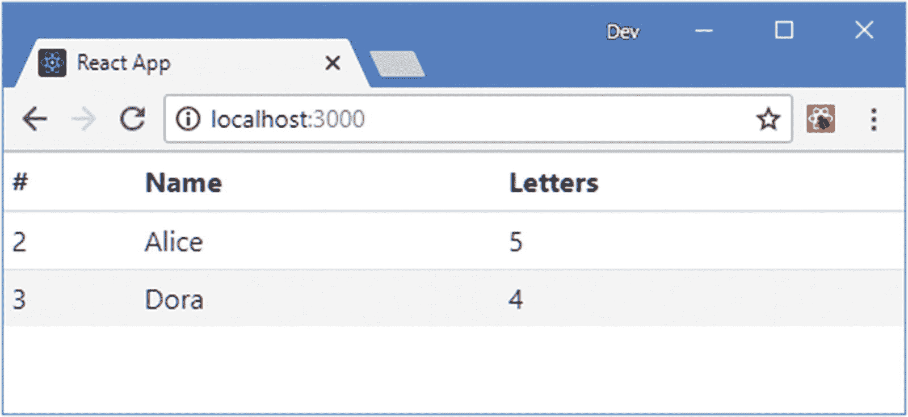
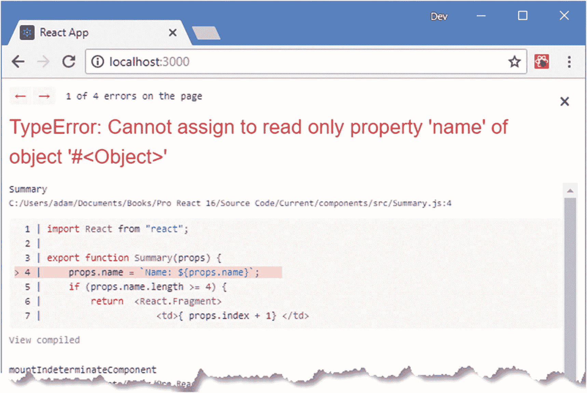
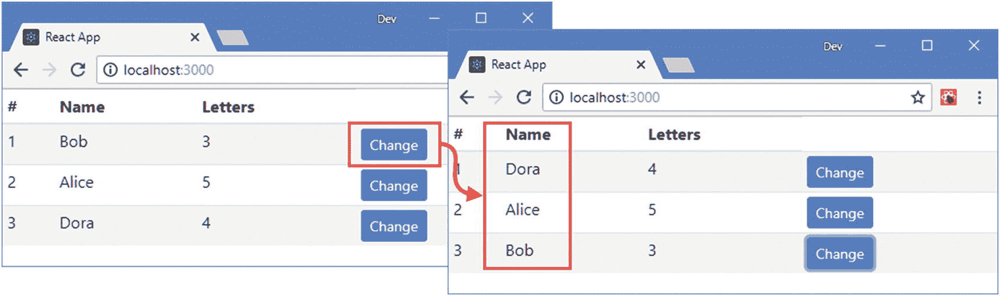
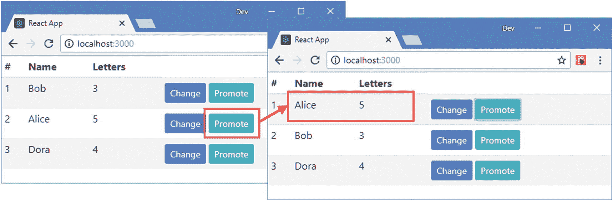
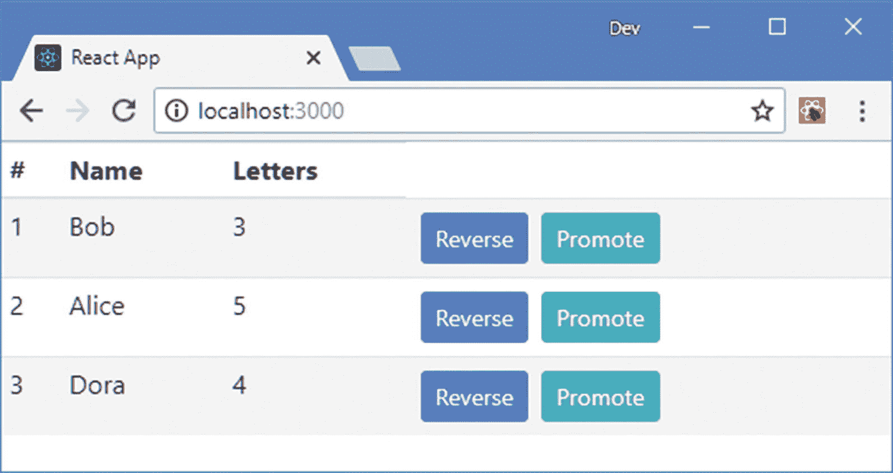
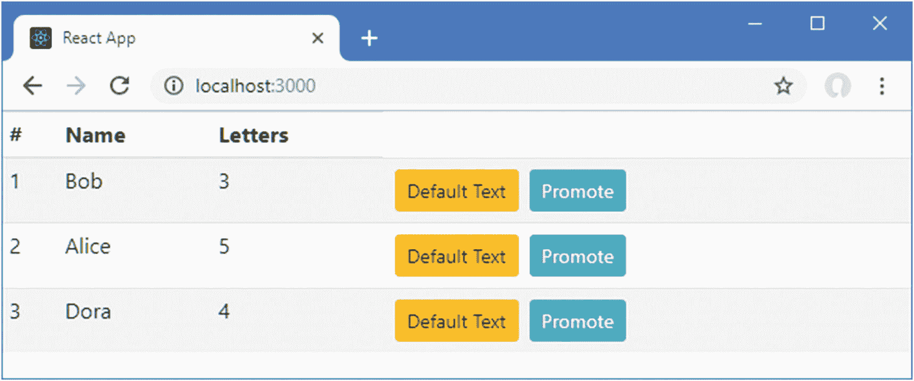
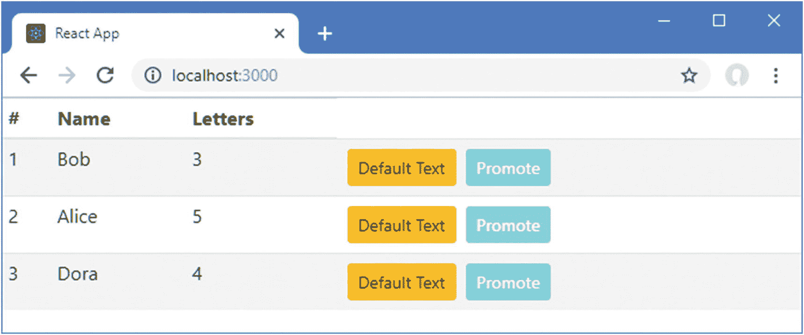

# 十、组件和属性

在这一章中，我描述了 React 应用中的关键构件:组件。在本章中，我主要关注最简单的组件类型，即*无状态组件*。在第 11 章[中，我描述了更复杂的替代方案，有状态组件。在本章中，我还解释了 props 特性是如何工作的，它允许一个组件向另一个组件提供呈现其内容所需的数据，以及在发生重要事情时应该调用的函数。表](11.html) [10-1](#Tab1) 将无状态组件和属性放在上下文中。

表 10-1

将无状态组件和属性放在上下文中

<colgroup><col class="tcol1 align-left"> <col class="tcol2 align-left"></colgroup> 
| 

问题

 | 

回答

 |
| --- | --- |
| 它们是什么？ | 组件是 React 应用中的关键构件。无状态组件是 JavaScript 函数，它呈现 React 可以呈现给用户的内容。Props 是一个组件向另一个组件提供数据的方式，这样它就可以调整它所呈现的内容。 |
| 它们为什么有用？ | 组件很有用，因为它们通过组合 JavaScript、HTML 和其他组件来提供对创建特性的 React 支持的访问。属性很有用，因为它们允许组件修改它们产生的内容。 |
| 它们是如何使用的？ | 无状态组件被定义为返回 React 元素的 JavaScript 函数，通常使用 JSX 格式的 HTML 来定义。属性被定义为元素的属性。 |
| 有什么陷阱或限制吗？ | React 要求组件以特定的方式运行，例如返回单个 React 元素并总是返回一个结果，并且需要一段时间来适应这些限制。props 最常见的缺陷是在需要 JavaScript 表达式时指定文字值。 |
| 还有其他选择吗？ | 组件是 React 应用中的关键构建块，没有办法避免使用它们。正如在第 14 章和第 3 部分中所描述的，在更大更复杂的项目中，props 有其他的选择。 |

表 [10-2](#Tab2) 总结了本章内容。

表 10-2

章节总结

<colgroup><col class="tcol1 align-left"> <col class="tcol2 align-left"> <col class="tcol3 align-left"></colgroup> 
| 

问题

 | 

解决办法

 | 

列表

 |
| --- | --- | --- |
| 向 React 应用添加内容 | 定义一个返回 HTML 元素或调用`React.createElement`方法的函数 | 1–9 |
| 向 React 应用添加附加功能 | 定义组件，并使用与组件名称相对应的元素将它们组合成父子关系 | 10–14 |
| 配置子组件 | 应用组件时定义属性 | 15–19 |
| 为数据数组中的每个对象呈现 HTML 元素 | 使用 map 方法创建元素，确保它们有一个`key`属性 | 20–24 |
| 从一个组件呈现多个元素 | 使用`React.Fragment`元素或使用不带标签的元素 | 25–28 |
| 不呈现任何内容 | 返回`null` | Twenty-nine |
| 从子组件接收通知 | 用功能属性配置组件 | 31–34 |
| 给孩子传递属性 | 使用从父代接收的属性值或使用析构运算符 | 35–39 |
| 定义默认属性值 | 使用`defaultProps`属性 | 40, 41 |
| 检查属性类型 | 使用`propTypes`属性 | 42–44 |

## 为本章做准备

为了创建本章的示例项目，打开一个新的命令提示符，导航到一个方便的位置，并运行清单 [10-1](#PC1) 中所示的命令。

### 小费

你可以从 [`https://github.com/Apress/pro-react-16`](https://github.com/Apress/pro-react-16) 下载本章以及本书其他章节的示例项目。

```jsx
npx create-react-app components

Listing 10-1Creating the Example Project

```

运行清单 [10-2](#PC2) 中所示的命令，导航到项目文件夹，并将引导包添加到项目中。

```jsx
cd components
npm install bootstrap@4.1.2

Listing 10-2Adding the Bootstrap CSS Framework

```

为了在应用中包含引导 CSS 样式表，将清单 [10-3](#PC3) 中所示的语句添加到`index.js`文件中，该文件可以在`src`文件夹中找到。

```jsx
import React from 'react';
import ReactDOM from 'react-dom';
import './index.css';
import App from './App';
import * as serviceWorker from './serviceWorker';

import 'bootstrap/dist/css/bootstrap.css';

ReactDOM.render(<App />, document.getElementById('root'));

// If you want your app to work offline and load faster, you can change
// unregister() to register() below. Note this comes with some pitfalls.
// Learn more about service workers: http://bit.ly/CRA-PWA
serviceWorker.unregister();

Listing 10-3Including Bootstrap in the index.js File in the src Folder

```

使用命令提示符，运行`components`文件夹中清单 [10-4](#PC4) 所示的命令来启动开发工具。

```jsx
npm start

Listing 10-4Starting the Development Tools

```

一旦项目的初始准备工作完成，一个新的浏览器窗口将打开并显示 URL `http://localhost:3000`并显示如图 [10-1](#Fig1) 所示的占位符内容。


图 10-1

运行示例应用

## 了解组件

从组件开始的最佳方式是定义一个组件，然后看看它是如何工作的。在清单 [10-5](#PC5) 中，我用一个简单的组件替换了`App.js`文件的内容。

```jsx
export default function App() {
    return "Hello Adam";
}

Listing 10-5Defining a Component in the App.js File in the src Folder

```

这是一个*无状态组件*的例子，它就像一个组件一样简单:一个函数返回 React 将显示给用户的内容，这被称为*呈现*。当应用启动时，`index.js`文件中的代码被执行，包括呈现`App`组件的语句。React 调用该函数并将结果显示给用户，如图 [10-2](#Fig2) 所示。


图 10-2

定义和应用组件

尽管结果可能很简单，但它揭示了组件的主要用途，即向用户提供 React 显示内容。

### 呈现 HTML 内容

当组件呈现一个字符串值时，它作为文本内容包含在父元素中。当组件返回 HTML 内容时，它们变得更加有用，利用 JSX 和它允许 HTML 与 JavaScript 代码混合的方式，这是最容易做到的。在清单 [10-6](#PC6) 中，我更改了组件的结果，使其呈现 HTML 的一个片段。

### 小费

使用 JSX 时，必须从`react`模块声明对 React 的依赖，如清单所示。如果你忘记了，你会收到一个警告。

```jsx
import React from "react";

export default function App() {
    return  <h1 className="bg-primary text-white text-center p-2">
                Hello Adam
            </h1>
}

Listing 10-6Rendering HTML in the App.js File in the src Folder

```

您记得在组件的函数中使用`return`关键字来呈现结果。这可能会令人感到尴尬，但是请记住，JSX 文件中的 HTML 片段被转换为对`createElement`方法的调用，这将产生一个 React 可以向用户显示的对象。

当您考虑在构建过程中用`createElement`方法替换 HTML 片段后代码看起来是什么样时，使用`return`关键字是有意义的。

```jsx
...
import React from "react";

export default function App() {
    return React.createElement("h1",
                { className: "bg-primary text-white text-center p-2" },
                "Hello Adam");
}
...

```

component 函数返回来自`React.createElement`方法的结果，该方法是 React 可以用来向域对象模型(DOM)添加内容的元素。

如果你想在与关键字`return`不同的一行开始 HTML，那么你可以用括号将结果括起来，如清单 [10-7](#PC8) 所示。

```jsx
import React from "react";

export default function App() {
    return (
        <h1 className="bg-primary text-white text-center p-2">
            Hello Adam
        </h1>
    )
}

Listing 10-7Using Parentheses in the App.js File in the src Folder

```

这允许 HTML 元素一致地缩进，尽管悬空的`(`和`)`字符可能会让一些开发人员感到别扭。

功能组件也可以使用粗箭头语法来定义，该语法省略了关键字`return`，如清单 [10-8](#PC9) 所示。

```jsx
import React from "react";

export default () =>

    <h1 className="bg-primary text-white text-center p-2">
        Hello Adam
    </h1>

Listing 10-8Using a Fat Arrow Function in the App.js File in the src Folder

```

粗箭头函数在没有名称的情况下导出，这在示例应用中有效，因为从`App.js`文件导入组件的`index.js`文件中的语句使用默认导出，如下所示:

```jsx
...
import App from './App';
...

```

按名称导出一个胖箭头函数并作为缺省值需要一个额外的语句，如清单 [10-9](#PC11) 所示。

```jsx
import React from "react";

 export const App = () =>
    <h1 className="bg-primary text-white text-center p-2">
        Hello Adam
    </h1>

export default App;

Listing 10-9Creating a Named and Default Export in the App.js File in the src Folder

```

粗箭头函数被分配给一个按名称导出的`const`，一个单独的语句使用该名称创建缺省导出，这允许组件按名称导入并作为缺省值。

### 注意

我之所以包括这个例子，是因为模块导出会引起混淆，但是在实际项目中，它们要么使用命名导出，要么使用默认导出，并且不需要适应两种工作方式。我更喜欢使用命名导出，这是我在本书的例子中采用的方法。

我在这一章中使用了常规函数，并在有助于使 HTML 内容更具可读性的地方使用了括号，但是这一节中的所有例子都产生了相同的结果，如图 [10-3](#Fig3) 所示。



图 10-3

返回 HTML 内容

### 渲染其他组件

React 最重要的特性之一是，由一个组件呈现的内容可以包含其他组件，从而允许组合这些特性来创建复杂的应用。我在`src`文件夹中添加了一个名为`Message.js`的文件，并用它来定义清单 [10-10](#PC12) 中所示的组件。

```jsx
import React from "react";

export function Message() {
    return  <h4 className="bg-success text-white text-center p-2">
                This is a message
            </h4>
}

Listing 10-10The Contents of the Message.js File in the src Folder

```

`Message`组件呈现一个包含消息的`h4`元素。在清单 [10-11](#PC13) 中，我已经更新了`App`组件，以便它将`Message`内容作为其内容的一部分呈现。

```jsx
import React from "react";

import { Message } from "./Message";

export default function App() {

    return  (
        <div>
            <h1 className="bg-primary text-white text-center p-2">
                Hello Adam
            </h1>
            <Message />
        </div>
    )
}

Listing 10-11Rendering Another Component in the App.js File in the src Folder

```

`import`语句声明了对`Message`组件的依赖，该组件使用`Message`元素呈现。当 React 接收到由`App`组件呈现的内容时，它将包含`Message`元素，它将通过调用`Message`组件的函数并用其呈现的内容替换`Message`元素来处理该元素，产生如图 [10-4](#Fig4) 所示的结果。


图 10-4

呈现其他内容

当一个组件像这样使用另一个组件时，就形成了父子关系。在这个例子中，`App`组件是`Message`组件的父组件，而`Message`组件是`App`组件的子组件。通过为子组件定义多个元素，一个组件可以多次应用同一个组件，如清单 [10-12](#PC14) 所示。

```jsx
import React from "react";
import { Message } from "./Message";

export default function App() {
    return  (
        <div>
            <h1 className="bg-primary text-white text-center p-2">
                Hello Adam
            </h1>
            <Message />
            <Message />
            <Message />
        </div>
    )
}

Listing 10-12Applying a Child Component in the App.js File in the src Folder

```

每当 React 遇到`Message`元素时，它就会调用`Message`组件，并使用其呈现的内容来替换`Message`元素，如图 [10-5](#Fig5) 所示。


图 10-5

应用多个子项

一个组件可以有不同类型的子组件，这意味着一个组件可以利用多个组件提供的功能。我用清单 [10-13](#PC15) 中所示的代码，通过将名为`Summary.js`的文件添加到`src`文件夹中，创建了另一个简单的组件。

```jsx
import React from "react";

export function Summary() {
    return  <h4 className="bg-info text-white text-center p-2">
                This is a summary
            </h4>
}

Listing 10-13The Contents of the Summary.js File in the src Folder

```

在清单 [10-14](#PC16) 中，我更新了`App`组件以声明对`Summary`组件的依赖，并使用`Summary`元素呈现其内容。

```jsx
import React from "react";
import { Message } from "./Message";

import { Summary } from "./Summary";

export default function App() {
    return (
        <div>
            <h1 className="bg-primary text-white text-center p-2">
                Hello Adam
            </h1>
            <Message />
            <Message />
            <Message />
            <Summary />
        </div>
    )
}

Listing 10-14Adding a Child Component in the App.js File in the src Folder

```

当 React 处理由`App`组件呈现的内容时，它遇到子组件的元素，调用它们的函数，并用它们呈现的内容替换`Message`和`Summary`元素。结果如图 [10-6](#Fig6) 所示。



图 10-6

使用不同的子组件

## 理解属性

当每个组件呈现相同的内容时，能够呈现来自多个子组件的内容就没有那么有用了。幸运的是，React 支持*props*——*properties*的缩写——它允许父组件向其子组件提供数据，子组件可以使用这些数据来呈现它们的内容。在接下来的章节中，我将解释属性是如何工作的，并演示它们的不同用法。

### 在父组件中定义属性

通过向应用组件的自定义 HTML 元素添加属性来定义属性。属性的名称是属性的名称，值可以是静态值或表达式。在清单 [10-15](#PC17) 中，我为`App`组件使用的`Message`元素添加了属性。

```jsx
import React from "react";
import { Message } from "./Message";
import { Summary } from "./Summary";

export default function App() {
    return  (
        <div>
            <h1 className="bg-primary text-white text-center p-2">
                Hello Adam
            </h1>
            <Message greeting="Hello" name="Bob" />
            <Message greeting="Hola" name={ "Alice" + "Smith" } />
            <Message greeting="Hi there" name="Dora" />
            <Summary />
        </div>
    )
}

Listing 10-15Defining Props in the App.js File in the src Folder

```

我为每个`Message`组件提供了两个属性`greeting`和`name`。大多数属性值都是静态值，用文字字符串表示。第二个`Message`元素上的`greeting`属性的值是一个表达式，它连接了两个字符串值。(您将看到一个关于清单 [10-15](#PC17) 中表达式的 linter 警告，因为串联字符串文字值是 linter 配置要检测的不良实践之一。在本章中，可以忽略棉绒警告。)

### 定义属性

Props 可用于将静态值或动态表达式的结果传递给子组件。静态值按字面引用，就像这样:

```jsx
...
<Message greeting="Hello" name="Bob" />
...

```

这个属性为子组件的`name`属性提供了值`Bob`。如果您想使用 JavaScript 表达式的结果作为属性的值，那么使用数据绑定表达式，如下所示:

```jsx
...
<Message greeting="Hola" name={ "Alice" + "Smith" } />
...

```

React 将计算表达式，并将结果(在本例中是两个字符串的连接)用作属性的值。一个常见的错误是将 JavaScript 表达式放在引号中，就像这样:

```jsx
...
<Message greeting="Hola" name="{ "Alice" + "Smith" }" />
...

```

React 会将此解释为使用静态值`{ "Alice" + "Smith" }`作为属性值的请求。用表情做属性的时候，一定要记得不要用引号。如果您不想使用 JSX，而想使用纯 JavaScript 创建 React 元素，那么 props 作为第二个参数提供给`createElement`方法，如下所示:

```jsx
...
React.createElement(Message, { greeting: "Hola",  name: "Alice" + "Smith"})
...

```

如果你没有得到你期望的结果，在 JSX 或纯 JavaScript 中，React Devtools 浏览器扩展(在第 [9](09.html) 章中描述)可以显示应用中每个组件收到的属性，这使得很容易看到哪里出错了。

### 在子组件中接收属性

通过定义一个名为`props`的参数，Props 被接收到组件中(尽管这只是一个约定，您可以给参数取任何合法的 JavaScript 名称)。`props`对象对于每个属性都有一个属性，该属性被赋予了属性值。举个例子，这些属性来自清单 [10-15](#PC17) :

```jsx
...
<Message greeting="Hello" name="Bob" />
...

```

会被翻译成这样一个物体:

```jsx
...
{
    greeting: "Hello",
    name: "Bob"
}
...

```

在清单 [10-16](#PC24) 中，我修改了`Message`组件，这样它定义了一个属性参数，并在结果中使用父组件提供的值。

```jsx
import React from "react";

export function Message(props) {

    return  <h4 className="bg-success text-white text-center p-2">
                {props.greeting}, {props.name}
            </h4>
}

Listing 10-16Using Props in the Message.js File in the src Folder

```

子组件不需要担心属性值是静态指定的还是用表达式指定的，它像其他 JavaScript 对象一样使用这些属性。在清单中，我在表达式中使用了`greeting`和`name`属性来设置组件呈现的`h4`元素的内容，产生了如图 [10-7](#Fig7) 所示的结果。


图 10-7

使用属性渲染内容

## 结合 JavaScript 和 Props 来呈现内容

清单 [10-16](#PC24) 中的`App`组件定义的每个`Message`元素的属性值会产生不同的内容，允许父组件以不同的方式使用相同的功能。

### 选择性呈现内容

组件可以使用 JavaScript `if`关键字来检查属性，并根据其值呈现不同的内容。在清单 [10-17](#PC25) 中，我使用了`if`语句来改变由`Message`组件呈现的内容。

```jsx
import React from "react";

export function Message(props) {
    if (props.name === "Bob") {
        return  <h4 className="bg-warning p-2">{props.greeting}, {props.name}</h4>
    } else {
        return  <h4 className="bg-success text-white text-center p-2">
                {props.greeting}, {props.name}
            </h4>
    }
}

Listing 10-17Selectively Rendering in the Message.js File in the src Folder

```

如果`name`属性的值为`Bob`，组件将呈现一个具有不同类成员关系的`h4`元素，如图 [10-8](#Fig8) 所示。


图 10-8

使用 if 语句选择内容

这种类型的选择性呈现，其中只有属性的值发生变化，可以通过将属性的值从 HTML 的其余部分中分离出来，以更少的重复来表示，如清单 [10-18](#PC26) 所示。

```jsx
import React from "react";

export function Message(props) {

    let classes = props.name === "Bob" ? "bg-warning p-2"
        : "bg-success text-white text-center p-2";

    return  <h4 className={ classes }>
                {props.greeting}, {props.name}
            </h4>
}

Listing 10-18Selecting a Property Value in the Message.js File in the src Folder

```

我已经使用了 JavaScript 三元条件操作符来选择将分配给`h4`元素的类，并使用一个用于`className`属性的表达式来应用这些类。结果与清单 [10-17](#PC25) 相同，但是没有复制 HTML 元素的不变部分。

当一个组件需要从一个更复杂的列表中选择内容时，可以使用一个`switch`语句，如清单 [10-19](#PC27) 所示。

```jsx
import React from "react";

export function Message(props) {
    let classes;
    switch (props.name) {
        case "Bob":
            classes = "bg-warning p-2";
            break;
        case "Dora":
            classes = "bg-secondary text-white text-center p-2"
            break;
        default:
            classes = "bg-success text-white text-center p-2"
    }
    return  <h4 className={ classes }>
                {props.greeting}, {props.name}
            </h4>
}

Listing 10-19Using a switch Statement in the Message.js File in the src Folder

```

这个例子使用`props.name`值上的`switch`语句来选择`h4`元素的类，产生如图 [10-9](#Fig9) 所示的结果。


图 10-9

使用 switch 语句选择内容

### 渲染数组

组件通常必须为数组中的每个元素创建 HTML 元素，通常以列表或表格中的行的形式显示项目。处理数组所需的技术会引起混淆，值得仔细研究。为了做好准备，我更新了`App`组件，以便它用一个属性配置`Summary`组件，如清单 [10-20](#PC28) 所示。(为了保持示例简单，我还删除了一些元素。)

```jsx
import React from "react";

//import { Message } from "./Message";

import { Summary } from "./Summary";

export default function App() {
    return  (
        <div>
            <h1 className="bg-primary text-white text-center p-2">
                Hello Adam
            </h1>
            <Summary names={ ["Bob", "Alice", "Dora"]} />
        </div>
    )
}

Listing 10-20Adding a Prop in the App.js File in the src Folder

```

`names`属性为`Summary`组件提供了一个字符串值数组。在清单 [10-21](#PC29) 中，我修改了由`Summary`组件呈现的内容，这样它就可以为数组中的每个值生成元素。

```jsx
import React from "react";

function createInnerElements(names) {

    let arrayElems  = [];
    for (let i = 0; i < names.length; i++) {
        arrayElems.push(
            <div>
                {`${names[i]} contains ${names[i].length} letters`}
            </div>
        )
    }
    return arrayElems;

}

export function Summary(props) {
    return  <h4 className="bg-info text-white text-center p-2">
                { createInnerElements(props.names)}
            </h4>
}

Listing 10-21Rendering an Array in the Summary.js File in the src Folder

```

组件函数使用一个表达式来设置`h4`元素的内容，这是通过调用`createInnerElements`函数来完成的。`createInnerElements`函数使用 JavaScript `for`循环来枚举`names`数组的内容，并将`div`元素添加到结果数组中。

```jsx
...
arrayElems.push(<div>{`${names[i]} contains ${names[i].length} letters`}</div>)
...

```

每个`div`元素的内容由另一个表达式设置，该表达式使用模板字符串创建特定于数组中每个元素的消息。`div`元素的数组作为`createInnerElements`函数的结果返回，并用作`h4`元素的内容，产生如图 [10-10](#Fig10) 所示的结果。


图 10-10

为数组中的对象创建 React 元素

#### 使用映射方法处理数组对象

虽然`for`循环是大多数程序员用来枚举数组的方式，但它并不是 React 中处理数组的最优雅的方式。在第四章[中描述的`map`方法可以用来将数组中的对象转换成 HTML 元素，如清单](04.html) [10-22](#PC31) 所示。

```jsx
import React from "react";

function createInnerElements(names) {
    return names.map(name =>
        <div>
            {`${name} contains ${name.length} letters`}
        </div>
    )
}

export function Summary(props) {
    return  <h4 className="bg-info text-white text-center p-2">
                { createInnerElements(props.names)}
            </h4>
}

Listing 10-22Transforming an Array in the Summary.js File in the src Folder

```

`map`方法的参数是为数组中的每个对象调用的函数。每次调用传递给 map 方法的函数时，数组中的下一项都会传递给函数，我用它来创建表示该对象的元素。每次调用该函数的结果都被添加到一个数组中，该数组用作`map`结果。清单 [10-22](#PC31) 中的代码产生与清单 [10-21](#PC29) 相同的结果。

### 小费

您不必在`map`方法中使用粗箭头函数，但是它会产生一个更简洁的组件。

既然`createInnerElement`函数包含一行代码，我可以通过将创建内部元素的语句移到组件函数中来进一步简化组件，如清单 [10-23](#PC32) 所示。

```jsx
import React from "react";

export function Summary(props) {
    return (
        <h4 className="bg-info text-white text-center p-2">
            {   props.names.map(name =>
                    <div>
                        {`${name} contains ${name.length} letters`}
                    </div>
                )
            }
        </h4>
    )
}

Listing 10-23Simplifying the Code in the Summary.js File in the src Folder

```

这种改变不会改变输出，并且产生与清单 [10-21](#PC29) 和清单 [10-22](#PC31) 相同的结果。

### 使用 Map 方法时接收其他参数

在清单 [10-23](#PC32) 中，我传递给`map`方法的函数接收当前数组对象作为它的参数。map 方法还提供了两个附加参数:数组中当前对象的从零开始的索引和完整的对象数组。您可以在本章后面的“呈现多个元素”一节中看到数组索引的示例。

#### 添加关键属性

要完成这个示例，还需要做最后一项更改。React 需要将一个`key` prop 添加到为数组中的对象生成的元素中，以便可以有效地处理变化，正如我在第 [13 章](13.html)中解释的。属性的值应该是一个表达式，其值在数组中唯一地标识对象，如清单 [10-24](#PC33) 所示。

```jsx
import React from "react";

export function Summary(props) {
    return (
        <h4 className="bg-info text-white text-center p-2">
            {   props.names.map(name =>
                    <div key={ name }>
                        {`${name} contains ${name.length} letters`}
                    </div>
                )
            }
        </h4>
    )
}

Listing 10-24Adding the Key Prop in the Summary.js File in the src Folder

```

我使用了`name`变量的值，当传递给`map`方法的函数被调用时，数组中的每个对象都被分配给这个变量，它允许 React 区分从数组对象创建的元素。

React 将显示没有 key prop 的元素，如本节前面的示例所示，但是浏览器的 JavaScript 控制台中将显示一条警告。

### 呈现多个元素

React 要求组件返回单个顶级元素，尽管该元素可以包含应用所需的任意多个其他元素。例如，`Summary`组件返回一个顶级的`h4`元素，它包含一系列为`names`属性中的元素生成的`div`元素。

有时候，对单个顶级元素的需求会导致问题。HTML 规范对如何组合元素施加了限制，这可能与单个元素的 React 要求相冲突。为了演示这个问题，我修改了由`App`组件呈现的内容，使其包含一个表格，其中每个`tr`元素的内容由一个子组件生成，如清单 [10-25](#PC34) 所示。

```jsx
import React from "react";
import { Summary } from "./Summary";

let names = ["Bob", "Alice", "Dora"]

export default function App() {
    return  (
        <table className="table table-sm table-striped">
            <thead>
                <tr><th>#</th><th>Name</th><th>Letters</th></tr>
            </thead>
            <tbody>
                { names.map((name, index) =>
                        <tr key={ name }>
                            <Summary index={index} name={name} />
                        </tr>
                )}
            </tbody>
        </table>
    )
}

Listing 10-25Rendering a Table in the App.js File in the src Folder

```

`Summary`组件通过`index`和`name`属性。在清单 [10-26](#PC35) 中，我已经更新了`Summary`组件，这样它就可以使用属性值生成一系列表格单元格。

```jsx
import React from "react";

export function Summary(props) {
    return  <td>{ props.index + 1} </td>
            <td>{ props.name } </td>
            <td>{ props.name.length } </td>
}

Listing 10-26Rendering Table Cells in the Summary.js File in the src Folder

```

`Summary`组件呈现一组`td`元素，因为这是 HTML 规范要求的`td`元素的子元素。但是当您保存更改时，您会看到以下错误:

```jsx
...
Syntax error: src/Summary.js: Adjacent JSX elements must be wrapped
 in an enclosing tag (5:12)

  3 | export function Summary(props) {
  4 |     return  <td>{ props.index + 1} </td>
> 5 |             <td>{ props.name } </td>
    |             ^
  6 |             <td>{ props.name.length } </td>
  7 | }
...

```

该错误消息表明组件呈现的内容不符合单个顶级元素的 React 要求。没有一个 HTML 元素可以用来包装`td`元素，并且仍然是对表的合法添加。对于这些情况，React 提供了一个特殊的元素，如清单 [10-27](#PC37) 所示。

```jsx
import React from "react";

export function Summary(props) {
    return  <React.Fragment>
                <td>{ props.index + 1} </td>
                <td>{ props.name } </td>
                <td>{ props.name.length } </td>
            </React.Fragment>
}

Listing 10-27Wrapping Elements in the Summary.js File in the src Folder

```

React 处理`Summary`组件渲染的元素时，会丢弃`React.Fragment`元素，用剩余的内容替换应用了该组件的`Summary`元素，如图 [10-11](#Fig11) 所示。



图 10-11

呈现多个元素

对于这些情况，React 支持另一种语法，即使用不带标记名的封闭元素，如清单 [10-28](#PC38) 所示。

```jsx
import React from "react";

export function Summary(props) {
    return  <>
                <td>{ props.index + 1} </td>
                <td>{ props.name } </td>
                <td>{ props.name.length } </td>
            </>
}

Listing 10-28Wrapping Elements in the Summary.js File in the src Folder

```

这相当于列出 [10-27](#PC37) 并产生相同的结果。我在本书的例子中使用了`React.Fragment`或者将多个元素包装在一个`div`中，这样就产生了 HTML 元素的合法组合。

### 不呈现任何内容

一个组件必须总是返回一个结果，即使它没有为 React 显示产生任何内容。在这些情况下，组件的函数应该返回`null`，在清单 [10-29](#PC39) 中，我修改了`Summary`组件，这样当它的`name`属性的长度小于四个字符时，它就不会产生任何内容。

```jsx
import React from "react";

export function Summary(props) {
    if (props.name.length >= 4) {
        return  <React.Fragment>
                    <td>{ props.index + 1} </td>
                    <td>{ props.name } </td>
                    <td>{ props.name.length } </td>
                </React.Fragment>
    } else {
        return null;
    }
}

Listing 10-29Rendering No Content in the Summary.js File in the src Folder

```

父组件仍然会应用`Summary`元素三次，每次都会导致`Summary`组件的函数被调用，但是只有两次调用会产生结果，如图 [10-12](#Fig12) 所示。



图 10-12

不呈现任何内容

### 试图改变属性

属性是只读的，不能被组件更改。当 React 创建`props`对象时，它会配置其属性，以便在进行任何更改时显示错误。在清单 [10-30](#PC40) 中，我向`Summary`组件添加了一条语句，该语句更改了`name`属性的值。

```jsx
import React from "react";

export function Summary(props) {
    props.name = `Name: ${props.name}`;
    if (props.name.length >= 4) {
        return  <React.Fragment>
                    <td>{ props.index + 1} </td>
                    <td>{ props.name } </td>
                    <td>{ props.name.length } </td>
                </React.Fragment>
    } else {
        return null;
    }
}

Listing 10-30Changing a Prop Value in the Summary.js File in the src Folder

```

当您保存更改并且浏览器重新加载时，您将看到如图 [10-13](#Fig13) 所示的错误消息。这是一个运行时错误，这意味着编译器在命令提示符下不会显示任何警告。



图 10-13

试图修改一个属性

### 小费

当使用第 [8](08.html) 章中描述的过程为部署构建应用时，不会显示此错误，这意味着您应该在开发期间进行彻底的测试，以确保您的组件不会无意中试图更改属性。

## 使用功能属性

到目前为止，我在本章中使用的所有属性都是*数据属性*，它为子组件提供了一个只读数据值。React 还支持函数 props，其中父组件为子组件提供一个函数，子组件可以调用该函数来通知父组件发生了重要的事情。父组件可以通过更改数据属性的值来响应，这将触发更新，并允许子组件向用户呈现更新的内容。

为了展示这是如何工作的，我在包含`App`组件的文件中定义了一个函数，它改变了用于`Summary`元素的`name`属性的值的顺序，如清单 [10-31](#PC41) 所示。

```jsx
import React from "react";
import { Summary } from "./Summary";

import ReactDOM from "react-dom";

let names = ["Bob", "Alice", "Dora"]

function reverseNames() {

    names.reverse();
    ReactDOM.render(<App />, document.getElementById('root'));

}

export default function App() {
    return  (
        <table className="table table-sm table-striped">
            <thead>
                <tr><th>#</th><th>Name</th><th>Letters</th></tr>
            </thead>
            <tbody>
                { names.map((name, index) =>
                    <tr key={ name }>
                        <Summary index={index} name={name}
                            reverseCallback={reverseNames} />
                    </tr>
                )}
            </tbody>
        </table>
    )
}

Listing 10-31Defining a Change Function in the App.js File in the src Folder

```

我定义的函数叫做`reverseNames`，它使用 JavaScript `reverse`方法来反转`names`数组中值的顺序。`reverseNames`函数作为名为`reverseCallback`的`prop`的值提供给`Summary`组件，如下所示:

```jsx
...
<Summary index={index} name={name} reverseCallback={reverseNames} />
...

```

`Summary`组件将接收一个具有三个属性的 prop 对象:`index` prop 提供当前对象的索引，该对象由`map`方法处理，`name` prop 提供来自数组的当前值，`reverseCallback` prop 提供反转数组内容顺序的函数。在清单 [10-32](#PC43) 中，我已经更新了`Summary`组件，以利用它作为属性接收的函数。(我还删除了试图改变属性值的语句，并删除了阻止组件呈现短名称内容的`if`语句。)

```jsx
import React from "react";

export function Summary(props) {
    return (
        <React.Fragment>
            <td>{ props.index + 1} </td>
            <td>{ props.name } </td>
            <td>{ props.name.length } </td>
            <td>
                <button className="btn btn-primary btn-sm"
                    onClick={ props.reverseCallback }>
                        Change
                </button>
            </td>
        </React.Fragment>
    )
}

Listing 10-32Using a Function Prop in the Summary.js File in the src Folder

```

该组件呈现一个`button`元素，其`onClick`属性选择它从其父元素接收的函数属性。我在第 [12 章](12.html)中描述了`onClick`属性，但是，正如您在前面的章节中看到的，这个属性告诉 React 当用户点击一个元素时如何响应，在这种情况下，表达式告诉 React 调用`reverseCallback`属性，这是由父组件提供的功能。

结果是点击一个`button`元素导致 React 调用在`App.js`文件中定义的`changeValues`函数，这颠倒了用于`name`属性的值的顺序，产生如图 [10-14](#Fig14) 所示的结果。



图 10-14

使用作为属性接收的函数

### 理解 Update 语句

当`Summary`组件调用函数 prop 时，调用`reverseCallback`函数，并执行清单 [10-31](#PC41) 中的语句:

```jsx
...
ReactDOM.render(<App />, document.getElementById('root'));
...

```

`render`方法用于将组件的内容添加到浏览器显示的文档对象模型(DOM)中，并在`index.js`文件中用于启动应用；在第 13 章[中有描述。这不是一个通常直接使用的特性，但是我需要能够执行更新来响应被调用的函数 prop。我在第 11 章](13.html)[中描述了通常用于执行更新的特性。目前，只需知道调用这个方法会更新显示给用户的 HTML 元素，反映用于属性值的数据值的变化。](11.html)

### 使用参数调用属性函数

在清单 [10-32](#PC43) 中，`onClick`属性的表达式指定了函数 prop，如下所示:

```jsx
...
<button className="btn btn-primary btn-sm" onClick={ props.reverseCallback } >
    Change
</button>
...

```

当函数被一个表达式选中时，它将被传递一个事件对象，我在第 [12](12.html) 章中描述了这个对象，它提供了被调用的函数以及触发事件的 HTML 元素的细节。

这在调用 function prop 时并不总是有用的，因为它要求父组件对子组件有足够的了解才能理解事件并相应地采取行动。通常，更有帮助的方法是为函数提供一个自定义参数，直接向父组件提供它需要的细节。在清单 [10-33](#PC46) 中，我向`App.js`文件添加了一个函数，将指定的名称移动到数组的前面，并更新了`App`组件，这样它就可以使用一个属性将函数传递给其子节点。

```jsx
import React from "react";
import { Summary } from "./Summary";
import ReactDOM from "react-dom";

let names = ["Bob", "Alice", "Dora"]

function reverseNames() {
    names.reverse();
    ReactDOM.render(<App />, document.getElementById('root'));
}

function promoteName(name) {

    names = [name, ...names.filter(val => val !== name)];
    ReactDOM.render(<App />, document.getElementById('root'));

}

export default function App() {
    return (
        <table className="table table-sm table-striped">
            <thead>
                <tr><th>#</th><th>Name</th><th>Letters</th></tr>
            </thead>
            <tbody>
                { names.map((name, index) =>
                    <tr key={ name }>
                        <Summary index={index} name={name}
                            reverseCallback={reverseNames}
                            promoteCallback={promoteName} />
                    </tr>
                )}
            </tbody>
        </table>
    )
}

Listing 10-33Adding a Function in the App.js File in the src Folder

```

新函数接收应该移动到数组开头的名称作为它的参数。在清单 [10-34](#PC47) 中，我向由`Summary`组件呈现的内容添加了另一个`button`元素，并使用`onClick`属性来调用新的函数 prop。

```jsx
import React from "react";

export function Summary(props) {
    return (
        <React.Fragment>
            <td>{ props.index + 1} </td>
            <td>{ props.name } </td>
            <td>{ props.name.length } </td>
            <td>
                <button className="btn btn-primary btn-sm"
                    onClick={ props.reverseCallback }>
                        Change
                </button>
                <button className="btn btn-info btn-sm m-1"
                    onClick={ () => props.promoteCallback(props.name) }>
                            Promote
                </button>
            </td>
        </React.Fragment>
    )
}

Listing 10-34Invoking a Function Prop in the Summary.js File in the src Folder

```

不是让`App`组件计算出选择了哪个名称，而是用一个参数调用函数 prop。

```jsx
...
<button className="btn btn-info btn-sm m-1"
        onClick={ () => props.promoteCallback(props.name) }>
    Promote
</button>
...

```

`onClick`表达式是一个粗箭头函数，在被调用时调用函数 prop。像这样定义一个函数是很重要的，如果你只是简单地在表达式中直接指定函数 prop，你不会得到你期望的结果，正如侧栏中所描述的。点击其中一个升级按钮会将相应的名称移动到数组的第一个位置，使其显示在表格的顶部，如图 [10-15](#Fig15) 所示。



图 10-15

使用参数调用函数属性

### 避免过早调用的陷阱

当您需要使用参数调用函数属性时，您应该始终指定一个调用属性的粗箭头函数，如下所示:

```jsx
...
<button onClick={ () => props.promoteCallback(props.name) }>
    Promote
</button>
...

```

您几乎肯定会忘记至少这样做一次，并在表达式中直接调用函数 prop，就像这样:

```jsx
...
<button onClick={ props.promoteCallback(props.name) }>
    Promote
</button>
...

```

React 将在组件呈现其内容时计算表达式，这将调用 prop，即使用户没有单击 button 元素。这很少是预期的效果，可能会导致意外的行为或产生错误，这取决于调用 prop 时它做了什么。例如，在清单 [10-34](#PC47) 中的组件的情况下，效果是创建一个“超过最大更新深度”错误，这是因为函数 prop 要求 React 重新呈现组件，这导致`Summary`组件呈现内容，这再次调用 prop。这一直持续到 React 停止执行并报告错误。

## 将属性传递给子组件

React 应用是通过组合组件创建的，创建了一系列父子关系。这种安排通常要求组件从其父组件接收数据值或回调函数，并将其传递给其子组件。为了演示属性是如何传递的，我在`src`文件夹中添加了一个名为`CallbackButton.js`的文件，并用它来定义清单 [10-35](#PC51) 中所示的组件。

```jsx
import React from "react";

export function CallbackButton(props) {
    return (
        <button className={`btn btn-${props.theme} btn-sm m-1`}
                onClick={ props.callback }>
            { props.text}
        </button>
    )
}

Listing 10-35The Contents of the CallbackButton.js File in the src Folder

```

这个组件呈现一个`button`元素，它的文本内容是使用名为`text`的属性设置的，当点击这个元素时，它会调用通过名为`callback`的属性提供的一个函数。还有一个用于为`button`元素选择引导 CSS 样式的`theme`属性。

在清单 [10-36](#PC52) 中，我已经更新了`Summary`组件以使用`CallbackButton`组件，它通过从其父组件传递属性并添加自己的额外属性来进行配置。

```jsx
import React from "react";

import { CallbackButton } from "./CallbackButton";

export function Summary(props) {
    return  (
        <React.Fragment>
            <td>{ props.index + 1} </td>
            <td>{ props.name } </td>
            <td>{ props.name.length } </td>
            <td>
                <CallbackButton theme="primary"
                    text="Reverse" callback={ props.reverseCallback } />
                <CallbackButton theme="info" text="Promote"
                    callback={ () => props.promoteCallback(props.name)} />
            </td>
        </React.Fragment>
    )
}

Listing 10-36Adding a Component in the Summary.js File in the src Folder

```

接收属性的组件不知道——也不关心——它们来自哪里，它们是通过同一个`props`参数接收的，产生如图 [10-16](#Fig16) 所示的结果。



图 10-16

传递属性

### 将所有属性传递给子组件

如果组件的父级提供的属性与组件的子级所期望的属性具有相同的名称，则可以使用析构运算符。为了演示，我在`src`文件夹中添加了一个名为`SimpleButton.js`的文件，并用它来定义清单 [10-37](#PC53) 中所示的组件。

```jsx
import React from "react";

export function SimpleButton(props) {
    return (
        <button onClick={ props.callback } className={props.className}>
            { props.text}
        </button>
    )
}

Listing 10-37The Contents of the SimpleButton.js File in the src Folder

```

`SimpleButton`组件需要`callback`、`className`和`text`属性。当`CallbackButton`组件应用`SimpleButton`组件时，父组件提供的属性之间有重叠，这意味着析构操作符可以用来传递属性，如清单 [10-38](#PC54) 所示。

```jsx
import React from "react";

import { SimpleButton } from "./SimpleButton";

export function CallbackButton(props) {
    return (
        <SimpleButton {...props} className={`btn btn-${props.theme} btn-sm m-1`} />
    )
}

Listing 10-38Passing on Props in the CallbackButton.js File in the src Folder

```

`{...props}`表达式传递从父组件接收的所有属性，这些属性由`className`属性补充。如果一个组件想要对其子组件保留特定的属性，那么可以使用稍微不同的方法，如清单 [10-39](#PC55) 所示。

```jsx
import React from "react";
import { SimpleButton } from "./SimpleButton";

export function CallbackButton(props) {
    let { theme, ...childProps} = props;
    return (
        <SimpleButton { ...childProps }
            className={`btn btn-${props.theme} btn-sm m-1`} />
    )
}

Listing 10-39Selectively Passing on Props in the CallbackButton.js File in the src Folder

```

rest 操作符在一个语句中使用，该语句创建一个包含除了`theme`之外的所有父对象的`childProps`对象。析构操作符用于将属性从`childProps`对象传递给子组件。

## 提供默认的属性值

随着应用中使用的属性数量的增加，您可能会发现自己在重复相同的一组属性值，即使这些值每次都相同。另一种方法是定义一组默认值，并在需要使用不同的值时仅覆盖它们。在清单 [10-40](#PC56) 中，我为`CallbackButton`组件定义了一组默认属性值。

```jsx
import React from "react";
import { SimpleButton } from "./SimpleButton";

export function CallbackButton(props) {
    let { theme, ...childProps} = props;
    return (
        <SimpleButton {...childProps}
            className={`btn btn-${props.theme} btn-sm m-1`} />
    )
}

CallbackButton.defaultProps = {

    text: "Default Text",
    theme: "warning"

}

Listing 10-40Defining Default Values in the CallbackButton.js File in the src Folder

```

名为`defaultProps`的属性被添加到组件中，并被赋予一个对象，该对象为在父组件不提供值时使用的属性提供默认值。在清单 [10-41](#PC57) 中，我修改了`Summary`组件，使其依赖于一个`CallbackButton`元素的默认属性，但为另一个元素提供值。

```jsx
import React from "react";
import { CallbackButton } from "./CallbackButton";

export function Summary(props) {
    return  (
        <React.Fragment>
            <td>{ props.index + 1} </td>
            <td>{ props.name } </td>
            <td>{ props.name.length } </td>
            <td>
                <CallbackButton callback={props.reverseCallback} />
                <CallbackButton theme="info" text="Promote"
                    callback={ () => props.promoteCallback(props.name)} />
            </td>
        </React.Fragment>
    )
}

Listing 10-41Relying on Prop Defaults in the Summary.js File in the src Folder

```

第一个`CallbackButton`元素依赖默认值，产生如图 [10-17](#Fig17) 所示的结果。



图 10-17

使用默认属性值

## 类型检查属性值

prop 不能指示它们期望接收什么数据类型，并且当它们不能使用作为 prop 接收的数据值时，没有办法通知它们的祖先组件。为了帮助避免这些问题，React 允许一个组件声明它所期望的属性类型，如清单 [10-42](#PC58) 所示。

```jsx
import React from "react";

import PropTypes from "prop-types";

export function SimpleButton(props) {
    return (
        <button onClick={ props.callback } className={props.className}>
            { props.text}
        </button>
    )
}

SimpleButton.defaultProps = {

    disabled: false

}

SimpleButton.propTypes = {

    text: PropTypes.string,
    theme: PropTypes.string,
    callback: PropTypes.func,
    disabled: PropTypes.bool

}

Listing 10-42Declaring Prop Types in the SimpleButton.js File in the src Folder

```

一个`propTypes`属性被添加到组件中，并被赋予一个对象，该对象的属性名对应于属性名，其值指定组件期望的类型。使用从`prop-types`包中导入的`PropTypes`值指定类型，表 [10-3](#Tab3) 中描述了最有用的`PropTypes`值。

表 10-3

有用的 PropTypes 值

<colgroup><col class="tcol1 align-left"> <col class="tcol2 align-left"></colgroup> 
| 

名字

 | 

描述

 |
| --- | --- |
| `array` | 这个值指定一个属性应该是一个数组。 |
| `bool` | 这个值指定了一个属性应该是布尔值。 |
| `func` | 该值指定一个属性应该是一个函数。 |
| `number` | 该值指定属性应该是一个数字值。 |
| `object` | 该值指定属性应该是一个对象。 |
| `string` | 该值指定属性应该是字符串。 |

### 小费

您可以将表 [10-3](#Tab3) 中的任何类型与`isRequired`组合，以便在父组件`PropTypes.bool.isRequired`没有提供该属性的值时生成警告。

为了演示如何检查类型，在清单 [10-43](#PC59) 中，我为`disabled`属性的`CallbackButton`元素添加了一个值，使用了一个字符串值，而不是清单 [10-42](#PC58) 中指定的`bool`。

```jsx
import React from "react";
import { CallbackButton } from "./CallbackButton";

export function Summary(props) {
    return  (
        <React.Fragment>
            <td>{ props.index + 1} </td>
            <td>{ props.name } </td>
            <td>{ props.name.length } </td>
            <td>
                <CallbackButton callback={props.reverseCallback} />
                <CallbackButton theme="info" text="Promote"
                    callback={ () => props.promoteCallback(props.name)}
                    disabled="true" />
            </td>
        </React.Fragment>
    )
}

Listing 10-43Providing the Wrong Type in the Summary.js File in the src Folder

```

这是一个常见的错误，在应该是`bool`或`number`的地方使用了字符串值。很难找出问题出在哪里，尤其是因为 prop 是由出现问题的组件的祖先定义的。使用 prop 类型使问题变得明显。当您保存更改时，浏览器将重新加载，您将看到浏览器的 JavaScript 控制台中显示以下消息:

```jsx
...
index.js:2178 Warning: Failed prop type: Invalid prop `disabled` of type `string` supplied to `SimpleButton`, expected `boolean`.
...

```

为了解决这个问题，我可以更改 prop 值，以便它将预期的类型发送给组件。另一种方法是使组件更加灵活，以便它能够处理`disabled`属性的`Boolean`和`string`值。考虑到在需要`Boolean`值时创建`string`属性值是多么常见，这是一个好主意，尤其是如果您正在编写将被其他开发团队使用的组件。在清单 [10-44](#PC61) 中，我添加了对`SimpleButton`组件的支持来处理这两种类型，并更新了它的`propTypes`配置来反映这一变化。

### 注意

prop 类型检查仅在开发过程中执行，当应用准备好进行部署时将被禁用。请参见第 [8](08.html) 章，了解准备应用进行部署的示例。

```jsx
import React from "react";
import PropTypes from "prop-types";

export function SimpleButton(props) {
    return (
        <button onClick={ props.callback } className={props.className}
                disabled={ props.disabled === "true" || props.disabled === true }>
            { props.text}
        </button>
    )
}

SimpleButton.defaultProps = {
    disabled: false
}

SimpleButton.propTypes = {
    text: PropTypes.string,
    theme: PropTypes.string,
    callback: PropTypes.func,
    disabled: PropTypes.oneOfType([PropTypes.bool, PropTypes.string])
}

Listing 10-44Accepting Multiple Prop Types in the SimpleButton.js File in the src Folder

```

有两种有用的`PropTypes`方法可用于指定多种类型或特定值，如表 [10-4](#Tab4) 所述。

表 10-4

有用的 PropTypes 方法

<colgroup><col class="tcol1 align-left"> <col class="tcol2 align-left"></colgroup> 
| 

名字

 | 

描述

 |
| --- | --- |
| `oneOfType` | 该方法接受组件愿意接收的一组`PropTypes`值。 |
| `oneOf` | 该方法接受组件愿意接收的一组值。 |

在清单 [10-44](#PC61) 中，我使用`oneOfType`方法告诉 React】属性可以接受`Boolean`和`string`值。组件能够处理清单 [10-43](#PC59) 中为`disabled`属性提供的值 I，这将禁用`button`元素，如图 [10-18](#Fig18) 所示。



图 10-18

接受多种属性类型

### 小费

另一种方法是在应用组件时将 prop 值改为一个`Boolean`，这可以通过使用`disabled`属性的表达式来完成:`disabled={ true }`。

## 摘要

在本章中，我介绍了无状态组件，它是 React 应用中关键构件的最简单版本。我演示了如何定义无状态组件，如何呈现内容，以及如何组合组件来创建更复杂的功能。我还解释了父组件如何使用 props 将数据传递给其子组件，并向您展示了 props 如何用于函数，这提供了组件间通信所需的基本特性。我已经向你展示了定义默认值和属性类型的特性，从而结束了这一章。在下一章，我将解释如何创建有状态数据的组件。