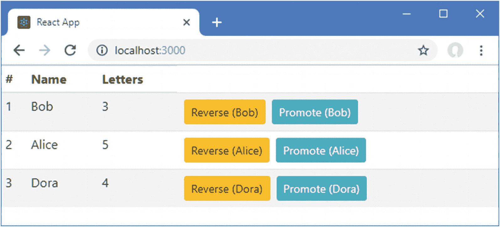
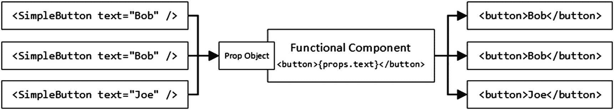
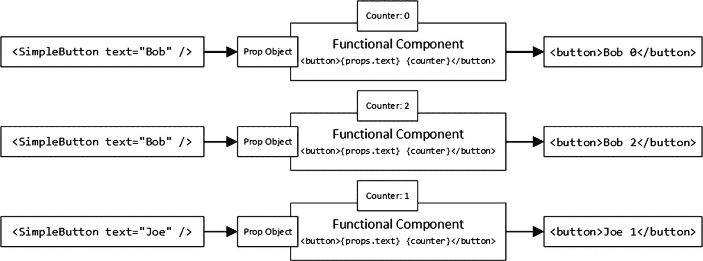
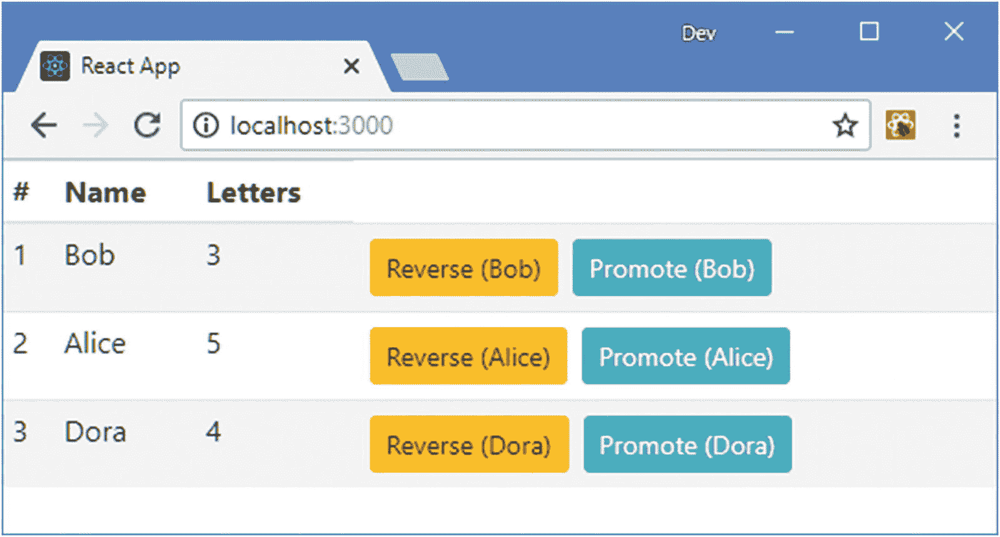
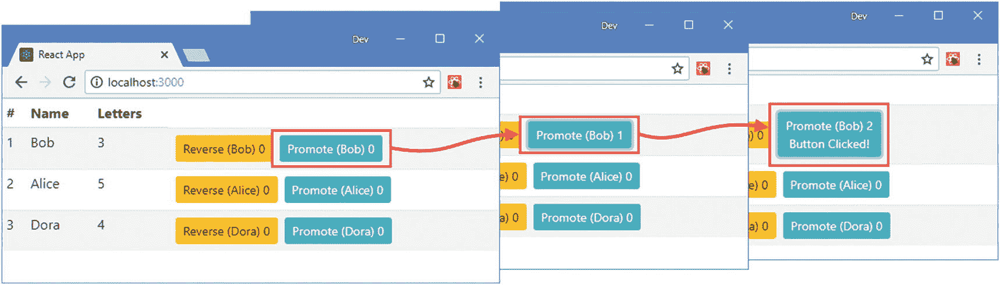
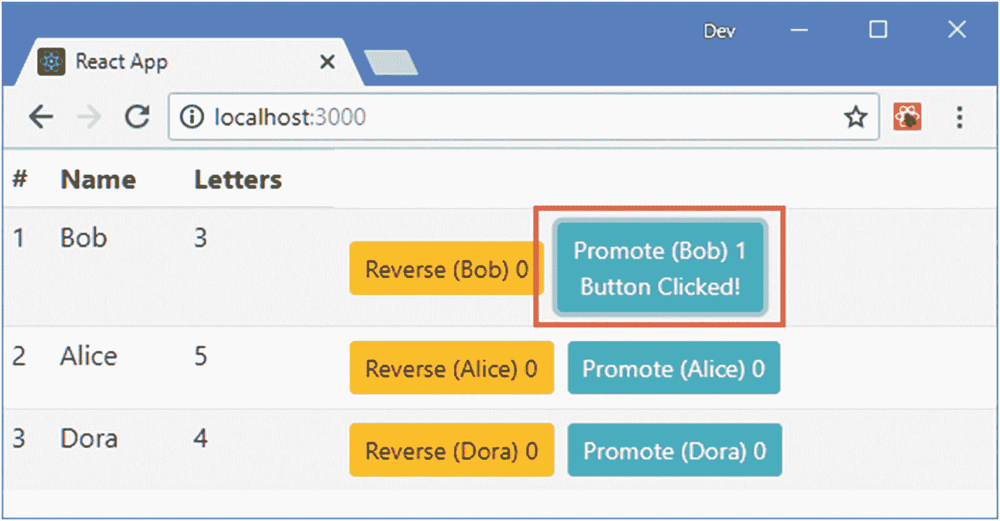
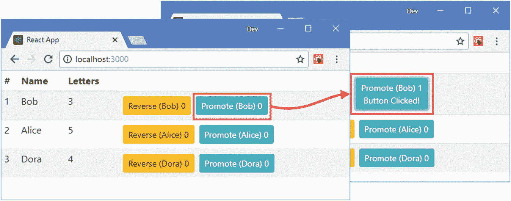
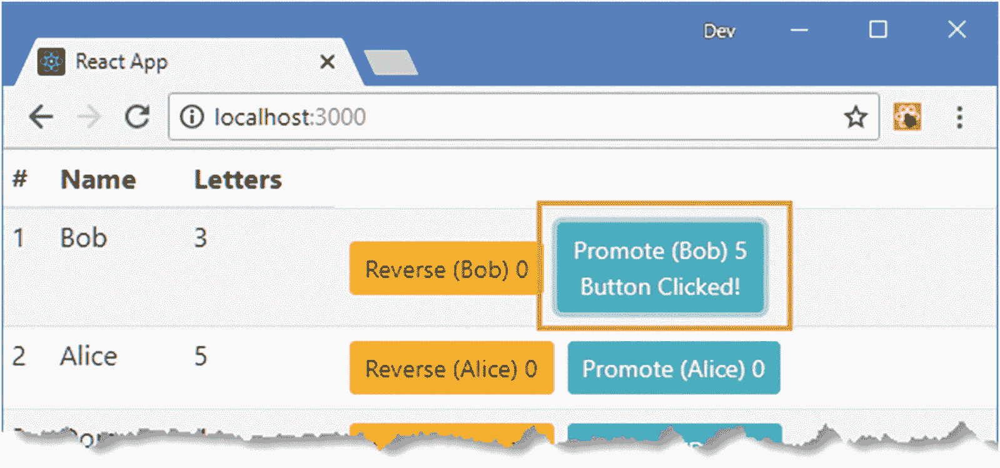
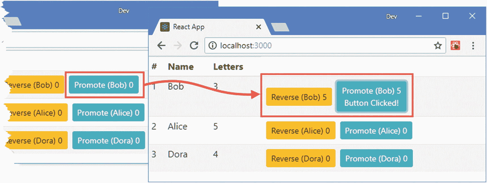
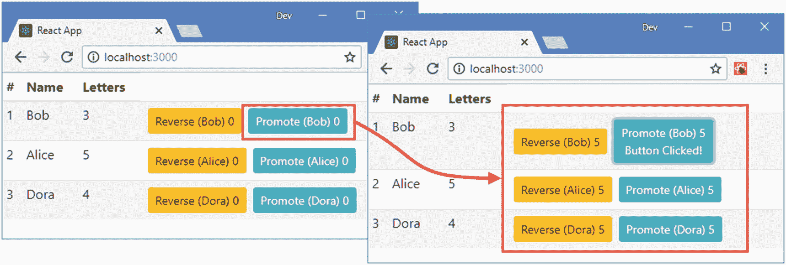

# 十一、有状态组件

在这一章中，我将介绍有状态组件，它建立在第 [10](10.html) 章中描述的特性之上，并添加了每个组件独有的状态数据，这些数据可用于改变呈现的输出。表 [11-1](#Tab1) 将有状态组件放在上下文中。

表 11-1

将有状态组件放在上下文中

<colgroup><col class="tcol1 align-left"> <col class="tcol2 align-left"></colgroup> 
| 

问题

 | 

回答

 |
| --- | --- |
| 它们是什么？ | 组件是 React 应用中的关键构件。有状态组件有自己的数据，可以用来改变组件呈现的内容。 |
| 它们为什么有用？ | 有状态组件使跟踪每个组件提供的应用状态变得更加容易，并提供了改变数据值和反映呈现给用户的内容变化的方法。 |
| 它们是如何使用的？ | 有状态组件是使用类或通过向功能组件添加挂钩来定义的。 |
| 有什么陷阱或限制吗？ | 必须注意确保状态数据被正确修改，如本章“修改状态数据”一节所述。 |
| 有其他选择吗？ | 组件是 React 应用中的关键构建块，没有办法避免使用它们。在更大更复杂的项目中，有一些替代属性是有用的，如后面章节所述。 |

表 [11-2](#Tab2) 总结了本章内容。

表 11-2

章节总结

<colgroup><col class="tcol1 align-left"> <col class="tcol2 align-left"> <col class="tcol3 align-left"></colgroup> 
| 

问题

 | 

解决办法

 | 

列表

 |
| --- | --- | --- |
| 向组件添加状态数据 | 定义一个类，其构造函数设置状态属性或调用`useState`函数为单个状态属性创建属性和函数 | 4–5, 12, 13 |
| 修改状态数据 | 调用`setState`函数或调用`useState`返回的函数 | 6–11 |
| 在组件之间共享数据 | 将状态数据提升到祖先组件，并使用 props 分发它 | 14–18 |
| 在基于类组件中定义适当的类型和默认值 | 将属性应用于该类或在该类中定义静态属性 | 19–20 |

## 为本章做准备

在本章中，我继续使用在第 [10 章](10.html)中创建的`components`项目。为了准备这一章，我修改了由`Summary`组件呈现的内容，使其直接使用`SimpleButton`组件，如清单 [11-1](#PC1) 所示，而不是我用来描述属性如何分发的`CallbackButton`。

### 小费

你可以从 [`https://github.com/Apress/pro-react-16`](https://github.com/Apress/pro-react-16) 下载本章以及本书其他章节的示例项目。

```jsx
import React from "react";

//import { CallbackButton } from "./CallbackButton";

import { SimpleButton } from "./SimpleButton";

export function Summary(props) {
    return (
        <React.Fragment>
            <td>{ props.index + 1} </td>
            <td>{ props.name } </td>
            <td>{ props.name.length } </td>
            <td>
                <SimpleButton
                    className="btn btn-warning btn-sm m-1"
                    callback={ props.reverseCallback }
                    text={ `Reverse (${ props.name })`}
                />
                <SimpleButton
                    className="btn btn-info btn-sm m-1"
                    callback={ () => props.promoteCallback(props.name)}
                    text={ `Promote (${ props.name})`}
                />
            </td>
        </React.Fragment>
    )
}

Listing 11-1Changing the Content in the Summary.js File in the src Folder

```

在清单 [11-2](#PC2) 中，我已经删除了`SimpleButton`组件的属性的类型和默认值，我将在本章末尾恢复这些属性。

```jsx
import React from "react";

export function SimpleButton(props) {
    return (
        <button onClick={ props.callback } className={props.className}
                disabled={ props.disabled === "true" || props.disabled === true }>
            { props.text}
        </button>
    )
}

Listing 11-2Removing Properties in the SimpleButton.js File in the src Folder

```

打开命令提示符，导航到`components`文件夹，运行清单 [11-3](#PC3) 中所示的命令来启动 React 开发工具。

```jsx
npm start

Listing 11-3Starting the Development Tools

```

在初始构建过程之后，一个新的浏览器窗口将会打开并显示如图 [11-1](#Fig1) 所示的内容。



图 11-1

运行示例应用

## 了解不同的组件类型

在接下来的小节中，我将解释 React 支持的组件类型之间的区别。当您看到有状态组件与第 [10](10.html) 章中描述的无状态组件的主要区别时，理解有状态组件如何工作将会更容易。

### 理解无状态组件

正如你在第 [10](10.html) 章中看到的，无状态组件由一个函数组成，React 调用该函数来响应定制的 HTML 元素，并将正确的值作为参数传递。自定义 HTML 元素上相同的一组属性值将导致相同的属性参数并产生相同的结果，如图 [11-2](#Fig2) 所示。



图 11-2

无状态组件的可预测结果

一个无状态组件将总是呈现相同的 HTML 元素，给定相同的一组属性值，不管函数被调用的频率如何。它完全依赖父组件提供的属性值来呈现其内容。这意味着无论应用中有多少个`SimpleButton`元素，React 都可以继续调用同一个函数，并且只需跟踪哪些属性与每个`SimpleButton`元素相关联。

### 了解有状态组件

一个*有状态组件*有自己的数据，这些数据影响组件呈现的内容。这个数据被称为*状态数据*，与父组件和它提供的属性是分开的。

想象一下，`SimpleButton`组件必须记录用户点击它所呈现的`button`元素的次数，并将当前次数显示为元素的内容。为了提供这一功能，组件需要一个计数器，每次单击按钮时该计数器都会递增，并且在呈现其内容时必须包含计数器的当前值。

由父组件定义的每个`SimpleButton`元素将产生一个`button`元素，需要一个单独的计数器，因为每个按钮可以独立于其他按钮被点击。有状态组件是 JavaScript 对象，应用组件的`SimpleButton` HTML 元素和组件对象之间是一一对应的关系，每个组件都有自己的状态，可能呈现不同的输出，如图 [11-3](#Fig3) 所示。



图 11-3

带计数器的有状态组件

向有状态组件提供相同的属性将会产生相同的结果，这不再是确定无疑的了，因为每个组件对象的状态数据可以有不同的值，并使用它来生成不同的结果。

正如您将了解到的，有状态组件有许多无状态组件所没有的特性，如果您记得每个有状态组件都是一个 JavaScript 对象，有自己的状态数据，并且与一个单独的定制 HTML 元素相关联，您会发现这些特性更容易理解。

## 创建有状态组件

首先，我将把示例应用中的一个现有的`SimpleButton`组件从无状态组件转换为有状态组件，这将让我在转到更复杂的特性之前解释一些基础知识。

定义一个有状态的组件是使用一个类来完成的，这个类是一个描述每个组件对象将拥有的功能的模板，如第 [4 章](04.html)所述。在清单 [11-4](#PC4) 中，我用一个类替换了`SimpleButton`组件的功能。

### 注意

这是一个没有任何状态数据的有状态组件。我将解释如何定义组件，然后在“添加状态数据”一节中向您展示如何添加状态数据。

```jsx
import React, { Component } from "react";

export class SimpleButton extends Component {

    render() {
        return (
            <button onClick={ this.props.callback }
                    className={ this.props.className }
                    disabled={ this.props.disabled === "true"
                        || this.props.disabled === true  }>
                { this.props.text}
            </button>
        )
    }
}

Listing 11-4Introducing a Class in the SimpleButton.js File in the src Folder

```

在接下来的部分中，我将描述清单 [11-4](#PC4) 中的每一个变化，并解释它们是如何被用来创建有状态组件的。

### 了解组件类

当您定义一个有状态组件时，您使用`class`和`extends`关键字来表示一个类，该类继承了在`react`包中定义的`Component`类所提供的功能，就像这样:

```jsx
...
export class SimpleButton extends Component {
...

```

这种关键字组合定义了一个名为`SimpleButton`的类，它扩展了 React 提供的`Component`类。`export`关键字使得`SimpleButton`类可以在定义它的 JavaScript 文件之外使用，就像组件被定义为函数时一样。

### 理解导入语句

为了从`Component`类扩展，使用了一个`import`，如下所示:

```jsx
...
import React, { Component } from "react";
...

```

正如我在第 [4](04.html) 章中解释的，这个语句中有两种类型的导入。从`react`包的默认导出被导入并被赋予名称`React`，这允许 JSX 工作。`react`包还有一个名为`Component`的导出，它是用花括号(`{`和`}`字符)导入的。创建有状态组件时，严格按照所示使用`import`语句是很重要的。

### 了解渲染方法

有状态组件的主要目的是呈现内容以供显示。不同之处在于，这是在一个名为`render`的方法中完成的，当 React 希望组件进行渲染时会调用该方法。`render`方法必须返回一个 React 元素，该元素可以使用`React.createElement`方法创建，或者更常见的是，作为 HTML 的一个片段。

```jsx
...

render() {

    return (
        <button onClick={ this.props.callback }
                className={ this.props.className }
                disabled={ this.props.disabled === "true"
                    || this.props.disabled === true  }>
            { this.props.text}
        </button>
    )
}
...

```

### 了解有状态组件属性

当您开始使用有状态组件时，最明显的区别之一是您必须使用`this`关键字来访问属性值，如下所示:

```jsx
...
return (
    <button onClick={ this.props.callback }
            className={ this.props.className }
            disabled={ this.props.disabled === "true"
                || this.props.disabled === true  }>
        { this.props.text}
    </button>
)
...

```

`this`关键字指的是组件的 JavaScript 对象。当使用有状态组件时，您必须使用`this`关键字来访问`props`属性，如果您忘记了:

```jsx
./src/SimpleButton.js  Line 7:  'props' is not defined  no-undef

```

虽然我重新定义了组件，但我没有改变它呈现的内容或改变它的行为方式，结果和组件被定义为函数时一样，如图 [11-4](#Fig4) 所示。



图 11-4

引入有状态组件

## 添加状态数据

有状态组件最重要的特性是组件的每个实例都有自己的数据，称为*状态数据*。在清单 [11-5](#PC10) 中，我向`SimpleButton`组件添加了状态数据。

```jsx
import React, { Component } from "react";

export class SimpleButton extends Component {

    constructor(props) {
        super(props);
        this.state = {
            counter: 0,
            hasButtonBeenClicked: false
        }
    }

    render() {
        return (
            <button onClick={ this.props.callback }
                className={ this.props.className }
                disabled={ this.props.disabled === "true"
                            || this.props.disabled === true  }>
                    { this.props.text} { this.state.counter }
                    { this.state.hasButtonBeenClicked &&
                        <div>Button Clicked!</div>
                    }
            </button>
        )
    }
}

Listing 11-5Adding State Data in the SimpleButton.js File in the src Folder

```

状态数据是使用一个*构造函数*定义的，这是一个特殊的方法，当使用类创建一个新对象时调用，并且必须遵循清单中所示的形式:构造函数应该定义一个`props`参数，第一条语句应该是使用`props`对象作为参数调用特殊的`super`方法，该方法调用`Component`类的构造函数并设置有状态组件中可用的特性。

一旦调用了`super`，就可以定义状态数据，这是通过将一个对象分配给`this.state`来完成的。

```jsx
...
constructor(props) {
    super(props);
    this.state = {
        counter: 0,
        hasButtonBeenClicked: false
    }
}
...

```

状态数据被定义为对象的属性。本例中有一个属性，它创建了名为`counter`的状态数据属性，其值为`0`和`hasButtonBeenClicked`，其值为`false`。

### 读取状态数据

访问状态数据是通过读取您通过`this.state`定义的属性来完成的，类似于访问 props 的方式。

```jsx
...
render() {
    return (
        <button onClick={ this.props.callback }
            className={ this.props.className }
            disabled={ this.props.disabled === "true"
                        || this.props.disabled === true  }>
                { this.props.text} { this.state.counter }
                { this.state.hasButtonBeenClicked &&
                    <div>Button Clicked!</div>
                }
        </button>
    )
}
...

```

清单 [11-5](#PC10) 中的`render`方法设置`button`元素的内容，使其包含一个属性值和`counter`状态数据属性的值，产生如图 [11-5](#Fig5) 所示的效果。我在清单 [11-5](#PC10) 中定义的额外的`div`元素将不会显示，直到`hasButtonBeenClicked`属性的值为`true`，我将在下一节演示。


图 11-5

定义和读取状态数据

## 修改状态数据

只有当状态数据可以被修改时，使用状态数据才有意义，因为这允许组件对象呈现不同的内容。React 需要一种特定的技术来修改状态数据，如清单 [11-6](#PC13) 所示。

```jsx
import React, { Component } from "react";

export class SimpleButton extends Component {

    constructor(props) {
        super(props);
        this.state = {
            counter: 0,
            hasButtonBeenClicked: false
        }
    }

    render() {
        return (
            <button onClick={ this.handleClick }
                className={ this.props.className }
                disabled={ this.props.disabled === "true"
                            || this.props.disabled === true  }>
                    { this.props.text} { this.state.counter }
                    { this.state.hasButtonBeenClicked &&
                        <div>Button Clicked!</div>
                    }
            </button>
        )
    }

    handleClick = () => {
        this.setState({
            counter: this.state.counter + 1,
            hasButtonBeenClicked: true
        });
        this.props.callback();
    }
}

Listing 11-6Modifying State Data in the SimpleButton.js File in the src Folder

```

React 不允许直接修改状态数据，如果您试图直接为状态属性赋值，它会报告一个错误。相反，修改是通过继承自`Component`类的`setState`方法进行的。在清单中，我添加了一个名为`handleClick`的方法，它由`button`元素的`onClick`表达式选择，并使用`setState`方法增加`counter`状态属性。

### 小费

由`onClick`属性选择的方法必须以特定的方式定义。我将在第 12 章[中解释如何使用`onClick`属性以及如何定义它的方法。](12.html)

`setState`方法的参数是一个对象，其属性指定要更新的状态数据，如下所示:

```jsx
...
this.setState({
    counter: this.state.counter + 1,
    hasButtonBeenClicked: true
});
...

```

这个语句告诉 React 应该通过增加当前值来修改`counter`属性，并且`hasButtonBeenClicked`属性应该是`true`。注意，我没有对`counter`使用增量操作符(`++`)，因为那样会给属性分配一个新值，导致错误。

### 小费

使用`setState`方法时，您只需为您想要更改的值定义属性。React 会将您指定的更改与组件状态数据的其余部分合并，并保持任何未提供值的属性不变。

虽然使用`setState`方法可能会感到尴尬，但好处是 React 负责重新呈现应用以反映更改的影响，这意味着我不必像在第 [11 章](11.html)中那样手动调用`ReactDOM.render`方法。效果是点击按钮增加相关组件的计数器状态数据，如图 [11-6](#Fig6) 所示。(单击按钮会对表格中的行进行重新排序，这意味着您单击的按钮可能会移动到新的位置。)


图 11-6

修改状态数据

单击按钮会更改其中一个组件对象的状态，而保持其他五个组件对象不变。

### 避免状态数据修改陷阱

React 异步执行对状态数据的更改，并可能选择将几个更新组合在一起以提高性能，这意味着调用`setState`的效果可能不会以您预期的方式生效。在更新状态数据时有一些常见的陷阱，我将在接下来的小节中描述这些陷阱，以及如何避免它们的细节。

### 小费

React Devtools 浏览器扩展向您显示有状态组件的状态数据，这对于查看应用如何响应更改以及当您没有获得预期的行为时跟踪问题非常有用。

#### 避免依赖值陷阱

状态数据值通常是相关的，一个常见的问题是假设每个变化的效果是单独应用的，如清单 [11-7](#PC15) 所示。

```jsx
import React, { Component } from "react";

export class SimpleButton extends Component {

    constructor(props) {
        super(props);
        this.state = {
            counter: 0,
            hasButtonBeenClicked: false
        }
    }

    render() {
        return (
            <button onClick={ this.handleClick }
                className={ this.props.className }
                disabled={ this.props.disabled === "true"
                            || this.props.disabled === true  }>
                    { this.props.text} { this.state.counter }
                    { this.state.hasButtonBeenClicked &&
                        <div>Button Clicked!</div>
                    }
            </button>
        )
    }

    handleClick = () => {
        this.setState({
            counter: this.state.counter + 1,
            hasButtonBeenClicked: this.state.counter > 0
        });
        this.props.callback();
    }
}

Listing 11-7Performing Related State Changes in the SimpleButton.js File in the src Folder

```

对`hasButtonBeenClicked`属性的更新假定`counter`属性在其表达式被求值之前已经被改变。React 不会单独应用更改，并且使用当前的`counter`值来计算`hasButtonBeenClicked`属性的表达式。当使用对`setState`方法的单独调用来执行相关更新时，也会出现这个问题，如清单 [11-8](#PC16) 所示。

```jsx
import React, { Component } from "react";

export class SimpleButton extends Component {

    constructor(props) {
        super(props);
        this.state = {
            counter: 0,
            hasButtonBeenClicked: false
        }
    }

    render() {
        return (
            <button onClick={ this.handleClick }
                className={ this.props.className }
                disabled={ this.props.disabled === "true"
                            || this.props.disabled === true  }>
                    { this.props.text} { this.state.counter }
                    { this.state.hasButtonBeenClicked &&
                        <div>Button Clicked!</div>
                    }
            </button>
        )
    }

    handleClick = () => {
        this.setState({ counter: this.state.counter + 1 });
        this.setState({ hasButtonBeenClicked: this.state.counter > 0 });
        this.props.callback();
    }
}

Listing 11-8Making Dependent Updates in the SimpleButton.js File in the src Folder

```

为了提高效率，React 会将这些更新批处理在一起，这将产生与清单 [11-6](#PC13) 相同的结果，并且意味着在按钮被点击两次之前`hasButtonBeenClicked`属性不会是`true`，如图 [11-7](#Fig7) 所示。



图 11-7

依赖值陷阱

当您要进行一系列相关的更改时，您可以将一个函数传递给`setState`方法，该方法将在状态数据更新后被调用，并可用于执行依赖于已更改的状态值的任务，如清单 [11-9](#PC17) 所示。

```jsx
import React, { Component } from "react";

export class SimpleButton extends Component {

    constructor(props) {
        super(props);
        this.state = {
            counter: 0,
            hasButtonBeenClicked: false
        }
    }

    render() {
        return (
            <button onClick={ this.handleClick }
                className={ this.props.className }
                disabled={ this.props.disabled === "true"
                            || this.props.disabled === true  }>
                    { this.props.text} { this.state.counter }
                    { this.state.hasButtonBeenClicked &&
                        <div>Button Clicked!</div>
                    }
            </button>
        )
    }

    handleClick = () => {
        this.setState({ counter: this.state.counter + 1 },
            () => this.setState({ hasButtonBeenClicked: this.state.counter > 0 }));
        this.props.callback();
    }
}

Listing 11-9Using a Callback in the SimpleButton.js File in the src Folder

```

使用回调函数可以确保在应用新的`counter`属性之前`hasButtonBeenClicked`的值不会改变，从而确保这些值是同步的，如图 [11-8](#Fig8) 所示。



图 11-8

强制状态改变按顺序执行

#### 避免遗漏更新陷阱

React 应用更新的方式意味着对同一状态数据属性的多次更改将被忽略，只有最近的值被应用，如清单 [11-10](#PC18) 所示。

```jsx
...
handleClick = () => {
    for (let i = 0; i < 5; i++) {
        this.setState({ counter: this.state.counter + 1});
    }
    this.setState({ hasButtonBeenClicked: true });
    this.props.callback();
}
...

Listing 11-10Making Multiple Updates in the SimpleButton.js File in the src Folder

```

在实际项目中，多次更新通常是在处理数据时进行的，而不是在一个`for`循环中进行，例如，对数组中的每个对象执行一次状态更改。这个清单展示了重复修改相同属性的效果:点击一个按钮将值增加 1，而不是增加 5 次`counter`值，如图 [11-9](#Fig9) 所示。



图 11-9

对状态属性应用多个更新

如果您需要执行多次更新并让每次更新按顺序生效，那么您可以使用接受一个函数作为第一个参数的`setState`方法版本。该函数提供了当前状态数据和一个 props 对象，如清单 [11-11](#PC19) 所示。

### 小费

这个版本的`setState`方法对于更新嵌套状态属性也很有用，你可以在第 [14 章](14.html)中看到演示。

```jsx
...
handleClick = () => {
    for (let i = 0; i < 5; i++) {
        this.setState((state, props) => { return { counter: state.counter + 1 }});
    }
    this.setState({ hasButtonBeenClicked: true });
    this.props.callback();
}
...

Listing 11-11Making Multiple Updates in the SimpleButton.js File in the src Folder

```

传递给`setState`方法的函数使用与前面示例相同的格式返回一个更新对象。不同之处在于，状态数据对象反映了所有以前的变化，这些变化被组合在一起并可用于重复更新，产生如图 [11-10](#Fig10) 所示的效果。



图 11-10

对状态属性应用多个更新

## 使用钩子定义有状态组件

并不是所有的开发人员都喜欢使用类来定义有状态组件，所以 React 提供了一种替代方法，叫做*钩子*，它允许功能组件定义状态数据。在清单 [11-12](#PC20) 中，我在`src`文件夹中添加了一个名为`HooksButton.js`的文件，并重新创建了清单 [11-11](#PC19) 中的有状态组件，作为一个使用钩子的函数。

```jsx
import React, { useState } from "react";

export function HooksButton(props) {
    const [counter, setCounter] = useState(0);
    const [hasButtonBeenClicked, setHasButtonBeenClicked] = useState(false);

    const handleClick = () => {
        setCounter(counter + 5);
        setHasButtonBeenClicked(true);
        props.callback();
    }

    return (
        <button onClick={ handleClick }
            className={ props.className }
            disabled={ props.disabled === "true" || props.disabled === true  }>
                { props.text} { counter }
                { hasButtonBeenClicked && <div>Button Clicked!</div>}
        </button>
    )
}

Listing 11-12The Contents of the HooksButton.js File in the src Folder

```

`useState`函数用于创建状态数据。它的参数是 state data 属性的初始值，它返回一个提供当前值的属性和一个更改值并触发更新的函数。属性和函数以数组形式返回，并使用数组析构为其分配有意义的名称，如下所示:

```jsx
...
const [counter, setCounter] = useState(0);
...

```

该语句创建了一个名为`counter`的状态数据属性，其初始值为零，其值可以使用名为`setCounter`的函数进行更改。用于更改状态数据属性值的函数不具备`setState`方法的所有特性，这就是为什么我在`handleClick`函数中将值增加了 5，而不是执行一系列单独的更新，如清单 [11-11](#PC19) 所示。

```jsx
...
const handleClick = () => {
    setCounter(counter + 5);
    setHasButtonBeenClicked(true);
    props.callback();
}
...

```

在清单 [11-13](#PC23) 中，我已经更新了`Summary`，所以它使用了`HooksButton`组件。

```jsx
import React from "react";
import { SimpleButton } from "./SimpleButton";
import { HooksButton } from "./HooksButton";

export function Summary(props) {
    return (
        <React.Fragment>
            <td>{ props.index + 1} </td>
            <td>{ props.name } </td>
            <td>{ props.name.length } </td>
            <td>
                <SimpleButton
                    className="btn btn-warning btn-sm m-1"
                    callback={ props.reverseCallback }
                    text={ `Reverse (${ props.name })`} />
                <HooksButton
                    className="btn btn-info btn-sm m-1"
                    callback={ () => props.promoteCallback(props.name)}
                    text={ `Promote (${ props.name})`} />
            </td>
        </React.Fragment>
    )
}

Listing 11-13Using the Hooks Component in the Summary.js File in the src Folder

```

钩子的使用对于`Summary`组件是不可见的，它像往常一样通过 props 提供数据和函数。这个例子产生了相同的结果，如图 [11-10](#Fig10) 所示。

### 你应该使用钩子还是类？

钩子为不喜欢使用类的开发人员提供了另一种创建有状态组件的方法。根据您的个人偏好，要么这将是适合您的编码风格的重要特性，要么您将继续定义类并完全忘记钩子。

React 的未来版本将支持钩子和类特性，因此您可以使用最适合自己的特性，也可以随意混合搭配。我喜欢钩子的特性，但是，除了在第 [13](13.html) 章描述一些相关的钩子特性之外，本书中的所有例子都使用了类。这部分是因为 hooks 特性是新的——但也是因为我已经使用基于类的编程语言很长时间了，使用类来定义组件符合我思考代码的方式，即使是简单的无状态组件。

如果你更喜欢使用钩子，但是不使用类就无法表达书中的例子，那么给我发电子邮件到 adam@adam-freeman.com，我会试着给你指出正确的方向。

## 提升状态数据

目前，每个`SimpleButton`和`HooksButton`组件都是独立存在的，并且有自己的状态数据，所以单击一个按钮只会影响单个组件的状态值，而不会影响其他组件。

当组件需要访问相同的数据时，需要不同的方法。在这种情况下，状态数据被*提升*，这意味着它被移动到第一个公共祖先组件，并使用 props 分发回需要它的组件。

### 小费

在 React 组件之间共享数据还有其他方法。第 [13](13.html) 章描述了上下文特性，更复杂的项目可以受益于使用数据存储(参见第 [19](19.html) 和 [20](20.html) 章)或 URL 路由(参见第 [21](21.html) 和 [22](22.html) 章)。

例如，如果我希望同一个表行中的`SimpleButton`和`HooksButton`组件共享一个`counter`值，我需要在第一个公共祖先中定义 state data 属性，这就是`Summary`组件。在清单 [11-14](#PC24) 中，我将`Summary`转换成了一个基于类的有状态组件，它定义了一个计数器值。

```jsx
import React, { Component } from "react";

import { SimpleButton } from "./SimpleButton";
import { HooksButton } from "./HooksButton";

export class Summary extends Component {

    constructor(props) {
        super(props);
        this.state = {
            counter: 0
        }
    }

    incrementCounter = (increment) => {
        this.setState((state) => { return { counter: state.counter + increment}});
    }

    render() {
        const props = this.props;
        return (
            <React.Fragment>
                <td>{ props.index + 1} </td>
                <td>{ props.name } </td>
                <td>{ props.name.length } </td>
                <td>
                    <SimpleButton
                        className="btn btn-warning btn-sm m-1"
                        callback={ props.reverseCallback }
                        text={ `Reverse (${ props.name })`}
                        counter={ this.state.counter }
                        incrementCallback={this.incrementCounter }
                    />
                    <HooksButton
                        className="btn btn-info btn-sm m-1"
                        callback={ () => props.promoteCallback(props.name)}
                        text={ `Promote (${ props.name})`}
                        counter={ this.state.counter }
                        incrementCallback={this.incrementCounter }
                    />
                </td>
            </React.Fragment>
        )
    }
}

Listing 11-14Lifting Up State Data in the Summary.js File in the src Folder

```

`Summary`组件定义了一个`counter`属性，并将其作为属性传递给其子组件。该组件还定义了一个`incrementCounter`方法，子组件将调用该方法来更改`counter`属性，该属性是使用一个名为`incrementCallback`的属性传递的。这是必需的，不仅因为状态数据不是直接修改的，而且因为属性是只读的。`incrementCounter`方法使用带有函数的`setState`方法，这样它可以被子组件重复调用。

### 小费

我在`render`方法中定义了一个`props`属性，这样我就不必为了使用`this`关键字而改变所有的引用，这在转换函数组件以使用类时是一个有用的快捷方式。

在清单 [11-15](#PC25) 中，我从`SimpleButton`组件中移除了`counter`状态数据属性，并使用了`counter`和`incrementCounter`属性。

```jsx
import React, { Component } from "react";

export class SimpleButton extends Component {

    constructor(props) {
        super(props);
        this.state = {
            // counter: 0,
            hasButtonBeenClicked: false
        }
    }

    render() {
        return (
            <button onClick={ this.handleClick }
                className={ this.props.className }
                disabled={ this.props.disabled === "true"
                            || this.props.disabled === true  }>
                    { this.props.text} { this.props.counter }
                    { this.state.hasButtonBeenClicked &&
                        <div>Button Clicked!</div>
                    }
            </button>
        )
    }

    handleClick = () => {
        this.props.incrementCallback(5);
        this.setState({ hasButtonBeenClicked: true });
        this.props.callback();
    }
}

Listing 11-15Replacing State Data with Props in the SimpleButton.js File in the src Folder

```

需要对`HooksButton`组件进行相应的修改，这些组件将共享相同的属性集，如清单 [11-16](#PC26) 所示。

```jsx
import React, { useState } from "react";

export function HooksButton(props) {
    //const [counter, setCounter] = useState(0);
    const[ hasButtonBeenClicked, setHasButtonBeenClicked] = useState(false);

    const handleClick = () => {
        //setCounter(counter + 5);
        props.incrementCallback(5);
        setHasButtonBeenClicked(true);
        props.callback();
    }

    return (
        <button onClick={ handleClick }
            className={ props.className }
            disabled={ props.disabled === "true" || props.disabled === true  }>
                { props.text} { props.counter }
                { hasButtonBeenClicked && <div>Button Clicked!</div>}
        </button>
    )
}

Listing 11-16Replacing State Data with Props in the HooksButton.js File in the src Folder

```

将`counter`状态属性提升到父组件意味着每一行表格中呈现给用户的两个按钮共享其父组件的状态数据，这样点击其中一个按钮元素就会导致两个按钮都被更新，如图 [11-11](#Fig11) 所示。



图 11-11

提升状态数据

不是每一项状态数据都必须被提升，并且单独的组件仍然有它们自己的本地状态数据，因此`hasButtonBeenClicked`属性保持在本地并且独立于其他组件。

### 进一步提升状态数据

状态数据可以比父组件提升得更远。如果我想让所有的`SimpleButton`和`HooksButton`组件共享同一个`counter`属性，那么我可以把它提升到`App`组件，如清单 [11-17](#PC27) 所示，其中我使用钩子特性创建了有状态。

```jsx
import React, { useState } from "react";

import { Summary } from "./Summary";
import ReactDOM from "react-dom";

let names = ["Bob", "Alice", "Dora"]

function reverseNames() {
    names.reverse();
    ReactDOM.render(<App />, document.getElementById('root'));
}

function promoteName(name) {
    names = [name, ...names.filter(val => val !== name)];
    ReactDOM.render(<App />, document.getElementById('root'));
}

export default function App() {
    const [counter, setCounter] = useState(0);

    const incrementCounter = (increment) => setCounter(counter + increment);

    return (
        <table className="table table-sm table-striped">
            <thead>
                <tr><th>#</th><th>Name</th><th>Letters</th></tr>
            </thead>
            <tbody>
                { names.map((name, index) =>
                    <tr key={ name }>
                        <Summary index={index} name={name}
                            reverseCallback={reverseNames}
                            promoteCallback={promoteName}
                            counter={ counter }
                            incrementCallback={ incrementCounter }
                        />
                    </tr>
                )}
            </tbody>
        </table>
    )
}

Listing 11-17Lifting State Data in the App.js File in the src Folder

```

`App`组件定义了`counter`状态属性和通过调用`setCounter`函数修改它的`incrementCounter`方法。在清单 [11-18](#PC28) 中，我已经从`Summary`组件中移除了状态数据，并将从`App`组件接收的属性传递给子组件。

```jsx
import React, { Component } from "react";
import { SimpleButton } from "./SimpleButton";
import { HooksButton } from "./HooksButton";

export class Summary extends Component {

    // constructor(props) {
    //     super(props);
    //     this.state = {
    //         counter: 0
    //     }
    // }

    // incrementCounter = (increment) => {
    //     this.setState((state) => { return { counter: state.counter + increment}});
    // }

    render() {
        const props = this.props;
        return (
            <React.Fragment>
                <td>{ props.index + 1} </td>
                <td>{ props.name } </td>
                <td>{ props.name.length } </td>
                <td>
                    <SimpleButton
                        className="btn btn-warning btn-sm m-1"
                        callback={ props.reverseCallback }
                        text={ `Reverse (${ props.name })`}
                        { ...this.props }
                    />
                    <HooksButton
                        className="btn btn-info btn-sm m-1"
                        callback={ () => props.promoteCallback(props.name)}
                        text={ `Promote (${ props.name})`}
                        { ...this.props }
                    />
                </td>
            </React.Fragment>
        )
    }
}

Listing 11-18Removing State Data in the Summary.js File in the src Folder

```

当有状态组件没有状态数据时，不需要构造函数，如果您定义了一个构造函数，它除了使用`super`将属性传递给基类之外什么也不做，您将会收到一个警告。我使用析构操作符将从`App`组件收到的属性传递给`SimpleButton`和`HooksButton`组件。

现在状态数据已经提升到了`App`组件，所有作为`App`组件的后代的`SimpleButton`组件共享一个`counter`值，如图 [11-12](#Fig12) 所示。



图 11-12

将状态数据提升到顶级组件

不需要对`SimpleButton`和`HooksButton`组件进行任何更改，它们不知道状态数据是在哪里定义的，并且接收数据值和作为属性更改数据值所需的回调函数。

## 定义属性类型和默认值

在这一章的开始，我删除了适当的默认值和类型，这样我就可以专注于从无状态到有状态组件的转换。基于类的组件以与功能组件相同的方式支持这些特性，如清单 [11-19](#PC29) 所示。

```jsx
import React, { Component } from "react";

import PropTypes from "prop-types";

export class SimpleButton extends Component {

    constructor(props) {
        super(props);
        this.state = {
            // counter: 0,
            hasButtonBeenClicked: false
        }
    }

    render() {
        return (
            <button onClick={ this.handleClick }
                className={ this.props.className }
                disabled={ this.props.disabled === "true"
                            || this.props.disabled === true  }>
                    { this.props.text} { this.props.counter }
                    { this.state.hasButtonBeenClicked &&
                        <div>Button Clicked!</div>
                    }
            </button>
        )
    }

    handleClick = () => {
        this.props.incrementCallback(5);
        this.setState({ hasButtonBeenClicked: true });
        this.props.callback();
    }

}

SimpleButton.defaultProps = {

    disabled: false

}

SimpleButton.propTypes = {

    text: PropTypes.string,
    theme: PropTypes.string,
    callback: PropTypes.func,
    disabled: PropTypes.oneOfType([PropTypes.bool, PropTypes.string ])

}

Listing 11-19Adding Prop Types and Values in the SimpleButton.js File in the src Folder

```

您还可以使用用关键字`static`修饰的类属性来定义类型和默认属性值，如清单 [11-20](#PC30) 所示。`static`关键字定义了一个属性，该属性应用于组件的类，而不是从该类创建的对象，并由构建过程转换成清单 [11-19](#PC29) 中使用的相同形式。

```jsx
import React, { Component } from "react";
import PropTypes from "prop-types";

export class SimpleButton extends Component {

    constructor(props) {
        super(props);
        this.state = {
            // counter: 0,
            hasButtonBeenClicked: false
        }
    }

    render() {
        return (
            <button onClick={ this.handleClick }
                className={ this.props.className }
                disabled={ this.props.disabled === "true"
                            || this.props.disabled === true  }>
                    { this.props.text} { this.props.counter }
                    { this.state.hasButtonBeenClicked &&
                        <div>Button Clicked!</div>
                    }
            </button>
        )
    }

    handleClick = () => {
        this.props.incrementCallback(5);
        this.setState({ hasButtonBeenClicked: true });
        this.props.callback();
    }

    static defaultProps = {
        disabled: false
    }

    static propTypes = {
        text: PropTypes.string,
        theme: PropTypes.string,
        callback: PropTypes.func,
        disabled: PropTypes.oneOfType([PropTypes.bool, PropTypes.string ])
    }
}

Listing 11-20Defining Static Properties in the SimpleButton.js File in the src Folder

```

这些改变并没有改变示例应用的外观，但是它们确保了组件只接收它所期望的属性类型，并且有一个默认的属性值`disabled`。

## 摘要

在这一章中，我介绍了有状态组件，它有自己的数据值，可以用来改变呈现的输出。我解释了有状态组件是使用类定义的，并向您展示了如何在构造函数中定义状态数据。我还向您展示了修改状态数据的不同方式，以及如何避免最常见的陷阱。在下一章，我将解释 React 如何处理事件。