# 十二、处理事件

在这一章中，我描述了对事件的 React 支持，这些事件是由 HTML 元素生成的，通常是为了响应用户交互。如果您使用过 DOM event API 特性，那么 React 事件特性应该是很熟悉的，但是有一些重要的区别会让粗心的开发人员感到困惑。表 [12-1](#Tab1) 将 React 事件特性放在上下文中。

表 12-1

将 React 事件放在上下文中

<colgroup><col class="tcol1 align-left"> <col class="tcol2 align-left"></colgroup> 
| 

问题

 | 

回答

 |
| --- | --- |
| 它们是什么？ | React 事件由元素触发以报告重要事件，通常是用户交互。 |
| 它们为什么有用？ | 事件允许组件响应与它们呈现的内容的交互，这构成了交互式应用的基础。 |
| 它们是如何使用的？ | 通过向组件呈现的元素添加属性来表示对事件的兴趣。当组件感兴趣的事件被触发时，由属性指定的函数被调用，允许组件更新其状态、调用函数属性或以其他方式反映事件的效果。 |
| 有什么陷阱或限制吗？ | React 事件类似于 DOM API 提供的事件，但是有一些不同之处，可能会给粗心的人带来隐患，特别是在事件阶段，如“管理事件传播”一节中所述。并非所有由 DOM API 定义的事件都受支持(参见 [`https://reactjs.org/docs/events.html`](https://reactjs.org/docs/events.html) 获取 React 支持的事件列表)。 |
| 有其他选择吗？ | 除了使用事件之外，别无选择，事件在用户交互和组件呈现的内容之间提供了必要的链接。 |

表 [12-2](#Tab2) 总结了本章内容。

表 12-2

章节总结

<colgroup><col class="tcol1 align-left"> <col class="tcol2 align-left"> <col class="tcol3 align-left"></colgroup> 
| 

问题

 | 

解决办法

 | 

列表

 |
| --- | --- | --- |
| 处理事件 | 添加与事件名称对应的属性，并使用表达式来处理事件 | 6–10 |
| 确定事件类型 | 使用事件对象的`type`属性 | Eleven |
| 防止事件在使用前被重置 | 使用事件对象的`persist`方法 | 12, 13 |
| 用自定义参数调用事件处理程序 | 在 prop 表达式中定义一个内联函数，用所需的数据调用处理程序方法 | 14, 15 |
| 阻止事件的默认行为 | 使用事件对象的`preventDefault`方法 | Sixteen |
| 管理事件的传播 | 确定事件阶段 | 17–23 |
| 停止一项活动 | 使用事件对象的`stopPropagation`方法 | Twenty-four |

## 为本章做准备

为了创建本章的示例项目，打开一个新的命令提示符，导航到一个方便的位置，并运行清单 [12-1](#PC1) 中所示的命令。

### 小费

你可以从 [`https://github.com/Apress/pro-react-16`](https://github.com/Apress/pro-react-16) 下载本章以及本书其他章节的示例项目。

```jsx
npx create-react-app reactevents

Listing 12-1Creating the Example Project

```

运行清单 [12-2](#PC2) 中所示的命令，导航到`reactevents`文件夹，并将引导包添加到项目中。

```jsx
cd reactevents
npm install bootstrap@4.1.2

Listing 12-2Adding the Bootstrap CSS Framework

```

为了在应用中包含引导 CSS 样式表，将清单 [12-3](#PC3) 中所示的语句添加到`index.js`文件中，该文件可以在`src`文件夹中找到。

```jsx
import React from 'react';
import ReactDOM from 'react-dom';
import './index.css';
import App from './App';
import * as serviceWorker from './serviceWorker';

import 'bootstrap/dist/css/bootstrap.css';

ReactDOM.render(<App />, document.getElementById('root'));

// If you want your app to work offline and load faster, you can change
// unregister() to register() below. Note this comes with some pitfalls.
// Learn more about service workers: http://bit.ly/CRA-PWA
serviceWorker.unregister();

Listing 12-3Including Bootstrap in the index.js File in the src Folder

```

接下来，用清单 [12-4](#PC4) 中所示的代码替换`App.js`文件的内容，这将为本章中的示例提供起点。清单用一个使用类的组件替换了现有的功能组件。

```jsx
import React, { Component } from 'react';

export default class App extends Component {

    constructor(props) {
        super(props);
        this.state = {
            message: "Ready"
        }
    }

    render() {
        return  (
            <div className="m-2">
                <div className="h4 bg-primary text-white text-center p-2">
                    { this.state.message }
                </div>
                <div className="text-center">
                    <button className="btn btn-primary">Click Me</button>
                </div>
            </div>
        )
    }
}

Listing 12-4The Contents of the App.js File in the src Folder

```

使用命令提示符，运行`reactevents`文件夹中清单 [12-5](#PC5) 所示的命令来启动开发工具。

```jsx
npm start

Listing 12-5Starting the Development Tools

```

一旦项目的初始准备完成，一个新的浏览器窗口将打开并显示 URL `http://localhost:3000`，它将显示如图 [12-1](#Fig1) 所示的内容。

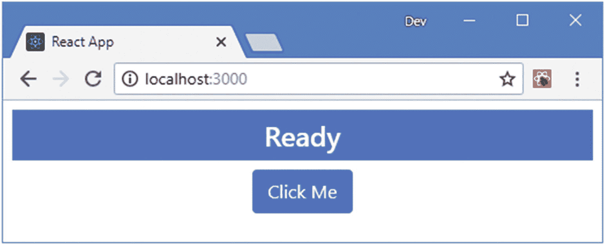

图 12-1

运行示例应用

## 了解事件

事件由 HTML 元素触发，以表示重要的更改，例如当用户单击按钮或在文本字段中键入内容时。在 React 中处理事件类似于使用域对象模型 API，尽管有一些重要的区别。在清单 [12-6](#PC6) 中，我添加了一个事件处理程序，当点击`button`元素时会调用它。

```jsx
import React, { Component } from 'react';

export default class App extends Component {

    constructor(props) {
        super(props);
        this.state = {
            message: "Ready"
        }
    }

    render() {
        return (
            <div className="m-2">
                <div className="h4 bg-primary text-white text-center p-2">
                    { this.state.message }
                </div>
                <div className="text-center">
                    <button className="btn btn-primary"
                        onClick={ () => this.setState({ message: "Clicked!"})}>
                            Click Me
                    </button>
                </div>
            </div>
        )
    }
}

Listing 12-6Adding an Event Handler in the App.js File in the src Folder

```

使用共享相应 DOM API 属性名称的属性来处理事件，用 camel case 表示。DOM API `onclick`属性在 React 应用中表示为`onClick`，并指定如何处理`click`事件，该事件在用户单击元素时触发。事件处理属性的表达式是一个函数，当指定的事件被触发时将被调用，如下所示:

```jsx
...
<button className="btn btn-primary"
        onClick={ () => this.setState({ message: "Clicked!"})}>
    Click Me
</button>
...

```

这是一个内联函数的例子，它调用`setState`方法来改变`message`状态数据属性的值。当`button`元素被点击时，`click`事件被触发，React 将调用 inline 函数，产生如图 [12-2](#Fig2) 所示的结果。

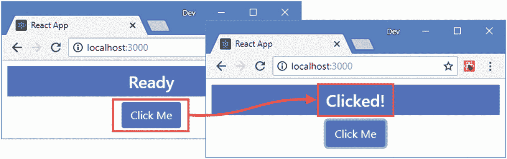

图 12-2

处理事件

### 调用方法来处理事件

有状态组件可以定义方法并使用它们来响应事件，这有助于避免当几个元素以相同的方式处理相同的事件时在表达式中重复代码。对于不改变应用状态或访问其他组件特性的简单方法，可以如清单 [12-7](#PC8) 所示指定方法。

```jsx
import React, { Component } from 'react';

export default class App extends Component {

    constructor(props) {
        super(props);
        this.state = {
            message: "Ready"
        }
    }

    handleEvent() {
        console.log("handleEvent method invoked");
    }

    render() {
        return  <div className="m-2">
                    <div className="h4 bg-primary text-white text-center p-2">
                        { this.state.message }
                    </div>
                    <div className="text-center">
                        <button className="btn btn-primary"
                            onClick={ this.handleEvent }>
                                Click Me
                        </button>
                    </div>
            </div>
    }
}

Listing 12-7Adding an Event Handling Method in the App.js File in the src Folder

```

注意，`onClick`表达式不包含括号，这将导致 React 在调用`render`方法时调用函数，如侧栏中所解释的。`handleEvent`方法不改变应用的状态，只是向浏览器的 JavaScript 控制台写出一条消息。如果您单击浏览器窗口中的按钮，您将在控制台中看到以下输出:

```jsx
handleEvent method invoked

```

### 避免事件函数调用陷阱

分配给事件处理属性(如`onClick`)的值必须是一个表达式，该表达式返回 React 可以调用来处理事件的函数。使用事件处理属性时有两个常见错误。第一个错误是用引号而不是大括号将您需要的函数括起来，就像这样:

```jsx
...
<button className="btn btn-primary" onClick="this.handleEvent" >
...

```

这为 React 提供了一个字符串值，而不是一个函数，并在浏览器的 JavaScript 控制台中产生一个错误。另一个常见错误是使用调用所需函数的表达式。

```jsx
...
<button className="btn btn-primary" onClick={ this.handleEvent() } >
...

```

该表达式导致 React 在创建组件对象时调用`handleEvent`方法，而不是在触发事件时调用。您不会收到关于此错误的错误或警告，这使得问题更难发现。

#### 在事件处理方法中访问组件功能

如果您需要在处理事件的方法中访问组件的功能，则需要做额外的工作。调用 JavaScript 类方法时，默认情况下不会设置关键字`this`的值，这意味着`handleEvent`方法中的语句无法访问组件的方法和属性。在清单 [12-8](#PC12) 中，我在`handleEvent`方法中添加了一个调用`setState`方法的语句，可以使用`this`关键字访问该方法。

```jsx
import React, { Component } from 'react';

export default class App extends Component {

    constructor(props) {
        super(props);
        this.state = {
            message: "Ready"
        }
    }

    handleEvent() {
        this.setState({ message: "Clicked!"});
    }

    render() {
        return  <div className="m-2">
                    <div className="h4 bg-primary text-white text-center p-2">
                        { this.state.message }
                    </div>
                    <div className="text-center">
                        <button className="btn btn-primary"
                            onClick={ this.handleEvent }>
                                Click Me
                        </button>
                    </div>
            </div>
    }
}

Listing 12-8Accessing Component Features in the App.js File in the src Folder

```

点击`button`时会调用`handleEvent`方法，但由于`this`未定义，会产生以下错误:

```jsx
Uncaught TypeError: Cannot read property 'setState' of undefined

```

为了确保给`this`赋值，可以使用 JavaScript 公共类字段语法来表达事件处理方法，如清单 [12-9](#PC14) 所示。

```jsx
import React, { Component } from 'react';

export default class App extends Component {

    constructor(props) {
        super(props);
        this.state = {
            message: "Ready"
        }
    }

    handleEvent = () => {
        this.setState({ message: "Clicked!"});
    }

    render() {
        return  <div className="m-2">
                    <div className="h4 bg-primary text-white text-center p-2">
                        { this.state.message }
                    </div>
                    <div className="text-center">
                        <button className="btn btn-primary"
                            onClick={ this.handleEvent }>
                                Click Me
                        </button>
                    </div>
            </div>
    }
}

Listing 12-9Redefining an Event Handling Method in the App.js File in the src Folder

```

方法名后面是等号、左括号和右括号、粗箭头符号，然后是消息体，如清单所示。这是一个笨拙的语法，但我更喜欢它而不是其他的(在侧栏中描述的)，这是我在本章和本书其余部分使用的方法。当你点击按钮元素时，`handleEvent`方法被提供一个`this`的值，产生如图 [12-3](#Fig3) 所示的结果。

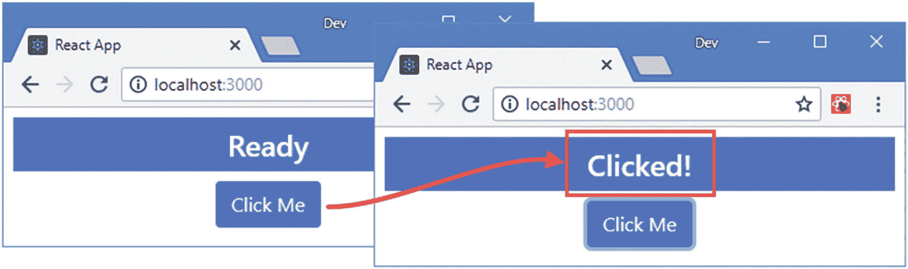

图 12-3

事件处理程序的绑定

### 访问组件特征的替代方法

有两种方法可以为事件处理方法提供一个值`this`。第一种是在事件属性的表达式中使用内联函数。

```jsx
...
<button className="btn btn-primary"
        onClick={ () => this.handleEvent() }>
    Click Me
</button>
...

```

请注意，事件处理程序方法是由表达式调用的，这意味着在方法名后面需要左括号和右括号。另一种方法是为组件的每个事件处理程序方法的构造函数添加一条语句。

```jsx
...
constructor(props) {
    super(props);
    this.state = {
        message: "Ready"
    }
    this.handleEvent = this.handleEvent.bind(this);
}
...

```

这三种方法都需要一段时间来适应——而且都有点不优雅——你应该遵循你觉得最舒服的方法。

### 接收事件对象

当事件被触发时，React 向 handler 对象提供一个描述事件的`SyntheticEvent`对象。`SyntheticEvent`是由 DOM API 提供的`Event`对象的包装器，它定义了相同的特性，但是增加了代码以确保事件在不同的浏览器中得到一致的描述。`SyntheticEvent`对象具有表 [12-3](#Tab3) 中描述的基本属性和方法。(我将在后面的章节中描述更多的方法和属性。)

表 12-3

由合成事件对象定义的基本属性和方法

<colgroup><col class="tcol1 align-left"> <col class="tcol2 align-left"></colgroup> 
| 

名字

 | 

描述

 |
| --- | --- |
| `nativeEvent` | 该属性返回 DOM API 提供的`Event`对象。 |
| `target` | 此属性返回表示作为事件源的元素的对象。 |
| `timeStamp` | 该属性返回一个时间戳，指示事件的触发时间。 |
| `type` | 此属性返回一个指示事件类型的字符串。 |
| `isTrusted` | 当浏览器启动事件时，该属性返回`true`,当代码创建事件对象时，该属性返回`false`。 |
| `preventDefault()` | 调用此方法是为了防止事件的默认行为，如“防止默认行为”一节所述。 |
| `defaultPrevented` | 如果对事件对象调用了`preventDefault`方法，该属性返回`true`，否则返回`false`。 |
| `persist()` | 调用此方法是为了避免重用事件对象，这对于异步操作很重要，如“避免事件重用陷阱”一节所述。 |

### React 事件与 DOM 事件

React 事件在组件和它所呈现的内容之间提供了一个必要的链接——但是 React 事件不是 DOM 事件，即使它们在大多数时间都是相同的。如果您超越了最常用的特性，您将会遇到重要的差异，这些差异可能会产生意想不到的结果。

首先，React 不支持所有事件，这意味着有些 DOM API 事件没有组件可以使用的相应 React 属性。在 [`https://reactjs.org/docs/events.html`](https://reactjs.org/docs/events.html) 可以看到 React 支持的事件集合。列表中包含了最常用的事件，但并非每个事件都可用。

其次，React 不允许组件创建和发布定制事件。组件间交互的 React 模型是通过函数 props 实现的，如第 [10 章](10.html)所述，当使用`Event.dispatchEvent`方法时，自定义事件不会被分发。

第三，React 提供了一个自定义对象作为 DOM 事件对象的包装器，它并不总是以与 DOM 事件相同的方式运行。您可以通过包装器访问 DOM 事件，但是这样做要小心，因为它可能会导致意想不到的副作用。

最后，React 截获处于冒泡阶段的 DOM 事件(将在本章后面描述),并通过组件的层次结构提供它们，为组件提供响应事件和更新它们呈现的内容的机会。这意味着事件包装器对象提供的一些特性不能按预期工作，特别是在传播方面，如“管理事件传播”一节所述。

在清单 [12-10](#PC17) 中，我更新了`handleEvent`方法，以便它使用 React 提供的事件对象来更新组件的状态。

```jsx
import React, { Component } from 'react';

export default class App extends Component {

    constructor(props) {
        super(props);
        this.state = {
            message: "Ready"
        }
    }

    handleEvent = (event) => {
        this.setState({ message:  `Event: ${event.type} `});
    }

    render() {
        return  <div className="m-2">
                    <div className="h4 bg-primary text-white text-center p-2">
                        { this.state.message }
                    </div>
                    <div className="text-center">
                        <button className="btn btn-primary"
                            onClick={ this.handleEvent }>
                                Click Me
                        </button>
                    </div>
            </div>
    }
}

Listing 12-10Receiving an Event Object in the App.js File in the src Folder

```

我在`handleEvent`方法中添加了一个`event`参数，我用它在显示给用户的消息中包含了`type`属性的值，如图 [12-4](#Fig4) 所示。

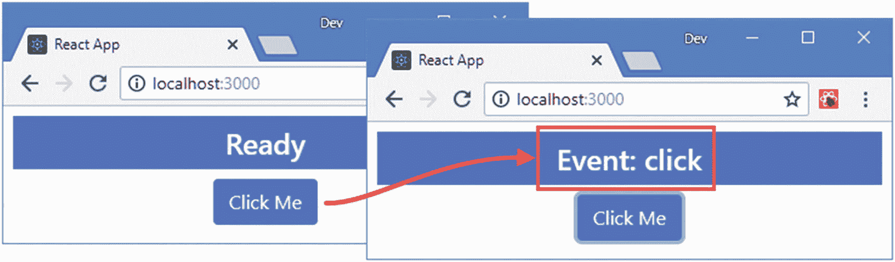

图 12-4

接收事件对象

#### 区分事件类型

React 在调用事件处理函数时总是提供一个`SyntheticEvent`对象，如果您习惯于使用`instanceof`关键字来区分由 DOM API 创建的事件，这可能会引起混淆。在清单 [12-11](#PC18) 中，我更改了`button`元素，因此`handleEvent`方法用于响应`MouseUp`和`MouseDown`事件。

```jsx
import React, { Component } from 'react';

export default class App extends Component {

    constructor(props) {
        super(props);
        this.state = {
            message: "Ready"
        }
    }

    handleEvent = (event) => {
        if (event.type === "mousedown") {
            this.setState({ message: "Down"});
        } else {
            this.setState({ message: "Up"});
        }
    }

    render() {
        return  <div className="m-2">
                    <div className="h4 bg-primary text-white text-center p-2">
                        { this.state.message }
                    </div>
                    <div className="text-center">
                        <button className="btn btn-primary"
                            onMouseDown={ this.handleEvent }
                            onMouseUp={ this.handleEvent } >
                                Click Me
                        </button>
                    </div>
            </div>
    }
}

Listing 12-11Differentiating Events in the App.js File in the src Folder

```

`handleEvent`方法使用`type`属性来确定正在处理哪个事件，并相应地更新`message`值。当你按下鼠标按钮时，触发一个`mousedown`事件，当你松开鼠标按钮时，触发一个`mouseup`事件，如图 [12-5](#Fig5) 所示。

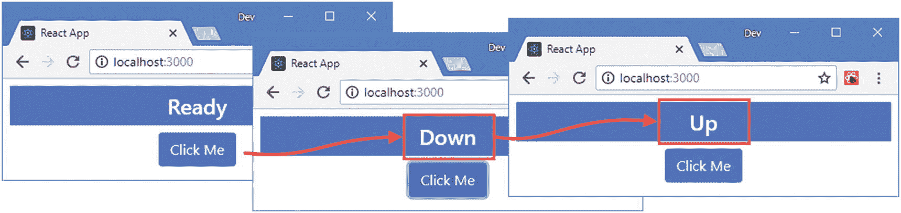

图 12-5

区分事件类型

#### 避免事件重用陷阱

一旦一个事件被处理，React 重用`SyntheticEvent`对象并将所有属性重置为`null`。如第 [11](11.html) 章所述，如果你依赖异步更新状态数据，这会导致问题。清单 [12-12](#PC19) 展示了这个问题。

```jsx
import React, { Component } from 'react';

export default class App extends Component {

    constructor(props) {
        super(props);
        this.state = {
            message: "Ready",
            counter: 0
        }
    }

    handleEvent = (event) => {
        this.setState({ counter: this.state.counter + 1},
            () => this.setState({ message: `${event.type}: ${this.state.counter}`}));
    }

    render() {
        return  <div className="m-2">
                    <div className="h4 bg-primary text-white text-center p-2">
                        { this.state.message }
                    </div>
                    <div className="text-center">
                        <button className="btn btn-primary"
                            onClick={ this.handleEvent } >
                                Click Me
                        </button>
                    </div>
            </div>
    }
}

Listing 12-12Using an Event Object Asynchronously in the App.js File in the src Folder

```

在应用了对`counter`属性的更新之后，`handleEvent`方法使用`setState`方法的回调特性来更新`message`属性。分配给`message`属性的值包括事件对象的`type`属性，这是一个问题，因为当`setState`回调函数被调用时，该属性将被设置为`null`，这可以通过单击按钮看到，如图 [12-6](#Fig6) 所示。

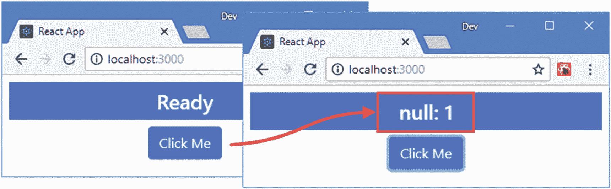

图 12-6

异步使用事件对象

`persist`方法用于防止 React 重置事件对象，如清单 [12-13](#PC20) 所示。

```jsx
...
handleEvent = (event) => {
    event.persist();
    this.setState({ counter: this.state.counter + 1},
        () => this.setState({ message: `${event.type}: ${this.state.counter}`}));
}
...

Listing 12-13Persisting an Event Object in the App.js File in the src Folder

```

结果是可以从`setState`方法的回调函数中读取事件的属性，产生如图 [12-7](#Fig7) 所示的结果。

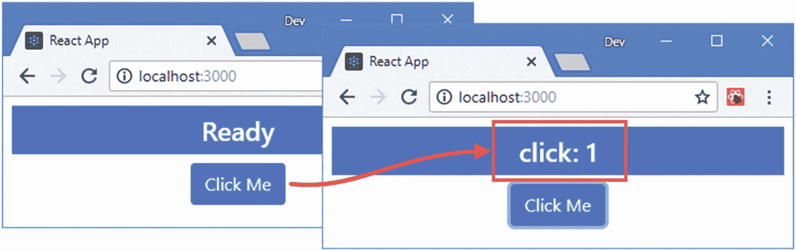

图 12-7

持续事件

### 使用自定义参数调用事件处理程序

如果为事件处理程序提供自定义参数，而不是 React 默认提供的`SythenticEvent`对象，那么它们通常会更有用。为了演示为什么事件对象并不总是有用，我向由`App`组件呈现的内容添加了另一个`button`元素，并设置了事件处理程序，以便它使用该事件来确定哪个按钮被点击了，如清单 [12-14](#PC21) 所示。

```jsx
import React, { Component } from 'react';

export default class App extends Component {

    constructor(props) {
        super(props);
        this.state = {
            message: "Ready",
            counter: 0,
            theme: "secondary"
        }
    }

    handleEvent = (event) => {
        event.persist();
        this.setState({
            counter: this.state.counter + 1,
            theme: event.target.innerText === "Normal" ? "primary" : "danger"
        }, () => this.setState({ message: `${event.type}: ${this.state.counter}`}));
    }

    render() {
        return  <div className="m-2">
                    <div className={ `h4 bg-${this.state.theme}
                            text-white text-center p-2`}>
                        { this.state.message }
                    </div>
                    <div className="text-center">
                        <button className="btn btn-primary"
                            onClick={ this.handleEvent } >
                                Normal
                        </button>
                        <button className="btn btn-danger m-1"
                            onClick={ this.handleEvent } >
                                Danger
                        </button>
                    </div>
            </div>
    }
}

Listing 12-14Identifying the Source of an Event in the App.js File in the src Folder

```

这种方法的问题在于，事件处理程序必须理解组件所呈现内容的重要性。在这种情况下，这意味着知道`innerText`属性的值可以用来计算事件的来源并确定`theme`状态数据属性的值。如果组件呈现的内容发生变化，或者如果有多个交互可以产生相同的结果，这可能很难管理。一种更优雅的方法是为事件处理程序属性使用内联表达式，该表达式调用处理程序方法并为其提供所需的信息，如清单 [12-15](#PC22) 所示。

```jsx
import React, { Component } from 'react';

export default class App extends Component {

    constructor(props) {
        super(props);
        this.state = {
            message: "Ready",
            counter: 0,
            theme: "secondary"
        }
    }

    handleEvent = (event, newTheme) => {
        event.persist();
        this.setState({
            counter: this.state.counter + 1,
            theme: newTheme
        }, () => this.setState({ message: `${event.type}: ${this.state.counter}`}));
    }

    render() {
        return  <div className="m-2">
                    <div className={ `h4 bg-${this.state.theme}
                            text-white text-center p-2`}>
                        { this.state.message }
                    </div>
                    <div className="text-center">
                        <button className="btn btn-primary"
                            onClick={ (e) => this.handleEvent(e, "primary") } >
                                Normal
                        </button>
                        <button className="btn btn-danger m-1"
                            onClick={ (e) => this.handleEvent(e, "danger") } >
                                Danger
                        </button>
                    </div>
            </div>
    }
}

Listing 12-15Invoking a Handler with a Custom Argument in the App.js File in the src Folder

```

结果是一样的，但是`handleEvent`方法不必为了设置`theme`属性而检查触发事件的元素。要查看设置主题的效果，单击任一按钮元素，如图 [12-8](#Fig8) 所示。

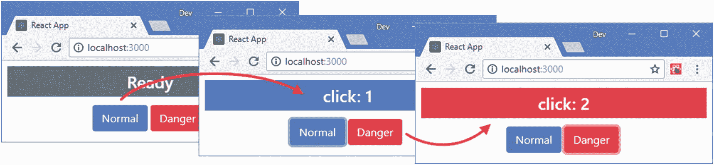

图 12-8

使用自定义参数

### 小费

如果你的 handler 方法不需要 event 对象，那么你可以使用 inline 表达式来调用没有它的 handler:`() => handleEvent("primary")`。

### 防止默认行为

有些事件具有浏览器默认执行的行为。例如，单击复选框的默认行为是切换复选框的状态。可以在事件对象上调用`preventDefault`方法来防止默认行为，为了进行演示，我在内容中添加了一个`checkbox`元素，只有在其中一个按钮元素被单击后才会被切换，如清单 [12-16](#PC23) 所示。

```jsx
import React, { Component } from 'react';

export default class App extends Component {

    constructor(props) {
        super(props);
        this.state = {
            message: "Ready",
            counter: 0,
            theme: "secondary"
        }
    }

    handleEvent = (event, newTheme) => {
        event.persist();
        this.setState({
            counter: this.state.counter + 1,
            theme: newTheme
        },  () => this.setState({ message: `${event.type}: ${this.state.counter}`}));
    }

    toggleCheckBox = (event) => {
        if (this.state.counter === 0) {
            event.preventDefault();
        }
    }

    render() {
        return  <div className="m-2">
                    <div className="form-check">
                        <input className="form-check-input" type="checkbox"
                             onClick={ this.toggleCheckBox }/>
                        <label>This is a checkbox</label>
                    </div>

                    <div className={ `h4 bg-${this.state.theme}
                            text-white text-center p-2`}>
                        { this.state.message }
                    </div>
                    <div className="text-center">
                        <button className="btn btn-primary"
                            onClick={ (e) => this.handleEvent(e, "primary") } >
                                Normal
                        </button>
                        <button className="btn btn-danger m-1"
                            onClick={ (e) => this.handleEvent(e, "danger") } >
                                Danger
                        </button>
                    </div>
            </div>
    }
}

Listing 12-16Preventing Default Behavior in the App.js File in the src Folder

```

`input`元素上的`onClick`属性告诉 React 在用户单击复选框时调用`toggleCheckBox`方法。如果`counter`状态数据属性的值为零，则在事件上调用`preventDefault`方法，结果是直到点击按钮后才能切换复选框，如图 [12-9](#Fig9) 所示。

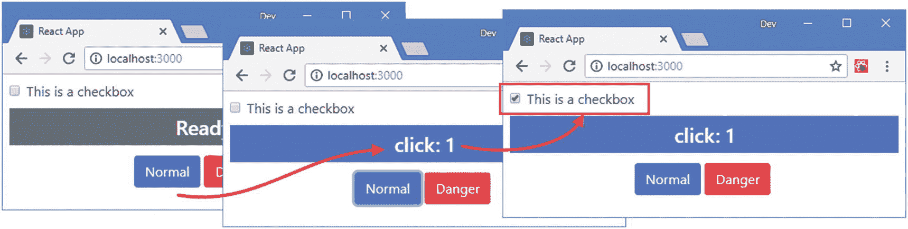

图 12-9

防止事件默认行为

## 管理事件传播

事件有一个生命周期，它允许元素的祖先接收由它们的后代触发的事件，并且在事件到达元素之前拦截事件。在接下来的章节中，我将描述事件如何通过 HTML 元素传播，并解释这对 React 应用的影响，使用表 [12-4](#Tab4) 中描述的`SyntheticEvent`定义的属性和方法。

表 12-4

事件传播的综合事件属性和方法

<colgroup><col class="tcol1 align-left"> <col class="tcol2 align-left"></colgroup> 
| 

名字

 | 

描述

 |
| --- | --- |
| `eventPhase` | 此属性返回事件的传播阶段。但是，React 处理事件的方式意味着该属性没有用，如“确定事件阶段”一节所述。 |
| `bubbles` | 如果事件将进入冒泡阶段，该属性返回`true`。 |
| `currentTarget` | 此属性返回一个对象，该对象表示其事件处理程序正在处理事件的元素。 |
| `stopPropagation()` | 调用此方法来停止事件传播，如“停止事件传播”一节中所述。 |
| `isPropagationStopped()` | 如果在一个事件上调用了`stopPropagation`,这个方法返回`true`。 |

### 了解目标和气泡阶段

当一个事件第一次被触发时，它进入*目标阶段*，在这里调用应用于作为事件源的元素的事件处理程序。一旦这些事件处理程序完成，事件就进入*冒泡阶段*，在这个阶段，事件沿着祖先元素链向上运行，并被用来调用任何已经应用于该类型事件的处理程序。为了帮助演示这些阶段，我在`src`文件夹中添加了一个名为`ThemeButton.js`的文件，并用它来定义清单 [12-17](#PC24) 中所示的组件。

```jsx
import React, { Component } from "react";

export class ThemeButton extends Component {

    handleClick = (event) => {
        console.log(`ThemeButton: Type: ${event.type} `
            + `Target: ${event.target.tagName} `
            + `CurrentTarget: ${event.currentTarget.tagName}`);
        this.props.callback(this.props.theme);
    }

    render() {
        return  <span className="m-1" onClick={ this.handleClick }>
                    <button className={`btn btn-${this.props.theme}`}
                        onClick={ this.handleClick }>
                            Select {this.props.theme } Theme
                    </button>
                </span>
    }
}

Listing 12-17The Contents of the ThemeButton.js File in the src Folder

```

该组件呈现一个包含一个`button`的`span`元素，并提供一个`theme`属性，它指定了一个引导 CSS 主题名称，以及一个被调用来选择属性的`callback`属性。`onClick`属性已经应用于`span`和`button`元素。在清单 [12-18](#PC25) 中，我更新了`App`组件以使用`ThemeButton`组件，并删除了一些在早期示例中使用的代码。

```jsx
import React, { Component } from 'react';

import { ThemeButton } from "./ThemeButton";

export default class App extends Component {

    constructor(props) {
        super(props);
        this.state = {
            message: "Ready",
            counter: 0,
            theme: "secondary"
        }
    }

    selectTheme = (newTheme) => {
        this.setState({
            theme: newTheme,
            message: `Theme: ${newTheme}`
        });
    }

    render() {
        return  (
            <div className="m-2">
                <div className={ `h4 bg-${this.state.theme}
                        text-white text-center p-2`}>
                    { this.state.message }
                </div>
                <div className="text-center">
                    <ThemeButton theme="primary" callback={ this.selectTheme } />
                    <ThemeButton theme="danger" callback={ this.selectTheme } />
                </div>
            </div>
        )
    }
}

Listing 12-18Applying a Component in the App.js File in the src Folder

```

单击任一`button`元素，您将在浏览器的 JavaScript 控制台中看到以下输出:

```jsx
...
ThemeButton: Type: click Target: BUTTON CurrentTarget: BUTTON
ThemeButton: Type: click Target: BUTTON CurrentTarget: SPAN
...

```

控制台中有两条消息，因为在由`ThemeButton`组件呈现的内容中有两个`onClick`属性。第一条消息是在目标阶段生成的，此时事件由触发它的元素的处理程序处理，在本例中是`button`元素。然后，事件进入冒泡阶段，通过按钮元素的祖先向上传播，并调用任何合适的事件处理程序。在这个例子中，按钮的父元素`span`也有一个`onClick`属性，这导致对`handleClick`方法的两次调用和两条消息被写入控制台。

### 小费

并非所有类型的事件都有泡沫阶段。根据经验，特定于单个元素的事件——比如获得和失去焦点——不会冒泡。应用于多个元素的事件(例如单击被多个元素占据的屏幕区域)将冒泡。您可以通过读取事件对象的`bubbles`属性来查看特定事件是否将经历冒泡阶段。

冒泡阶段超出了组件所呈现的内容，并在 HTML 元素的整个层次结构中传播。为了演示，我向由`App`组件呈现的元素添加了`onClick`处理程序，当它从由`ThemeButton`组件呈现的`button`元素冒泡时，将接收到`click`事件，如清单 [12-19](#PC27) 所示。

```jsx
import React, { Component } from 'react';
import { ThemeButton } from "./ThemeButton";

export default class App extends Component {

    constructor(props) {
        super(props);
        this.state = {
            message: "Ready",
            counter: 0,
            theme: "secondary"
        }
    }

    selectTheme = (newTheme) => {
        this.setState({
            theme: newTheme,
            message: `Theme: ${newTheme}`
        });
    }

    handleClick= (event) => {
        console.log(`App: Type: ${event.type} `
            + `Target: ${event.target.tagName} `
            + `CurrentTarget: ${event.currentTarget.tagName}`);
    }

    render() {
        return  (
            <div className="m-2" onClick={ this.handleClick }>
                    <div className={ `h4 bg-${this.state.theme}
                            text-white text-center p-2`}>
                        { this.state.message }
                    </div>
                    <div className="text-center" onClick={ this.handleClick }>
                        <ThemeButton theme="primary" callback={ this.selectTheme } />
                        <ThemeButton theme="danger" callback={ this.selectTheme } />
                    </div>
            </div>
        )
    }
}

Listing 12-19Adding Event Handlers in the App.js File in the src Folder

```

我将`onClick`属性添加到两个`div`元素中，当您单击其中一个按钮时，您将看到浏览器的 JavaScript 控制台中显示以下一系列消息(有些浏览器将最后两条消息组合在一起，因为它们是相同的):

```jsx
...
ThemeButton: Type: click Target: BUTTON CurrentTarget: BUTTON
ThemeButton: Type: click Target: BUTTON CurrentTarget: SPAN
App: Type: click Target: BUTTON CurrentTarget: DIV
App: Type: click Target: BUTTON CurrentTarget: DIV
...

```

`SyntheticEvent`对象提供了`currentTarget`属性，该属性返回其事件处理程序被调用的元素，而`target`属性返回触发事件的元素。

```jsx
...
console.log(`ThemeButton: Type: ${event.type} `
    + `Target: ${event.target.tagName} `
    + `CurrentTarget: ${event.currentTarget.tagName}`);
...

```

这些消息显示了`click`事件在 HTML 元素层次结构中向上传播时的目标和冒泡阶段，如图 [12-10](#Fig10) 所示。

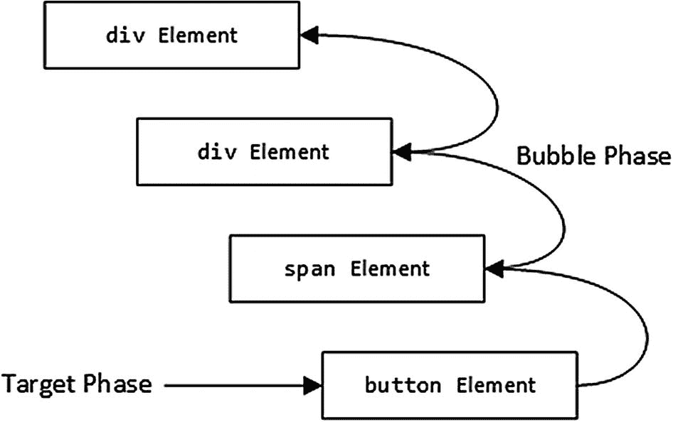

图 12-10

事件的目标和泡沫阶段

### 应用组件的事件和元素

事件处理由组件呈现的 HTML 元素执行，不包括用于应用组件的自定义 HTML 元素。例如，向`ThemeButton`元素添加事件处理程序属性(如`onClick`)没有任何效果。没有报告错误，但是自定义元素被排除在浏览器显示的 HTML 之外，并且永远不会调用处理程序。

### 了解捕获阶段

捕获阶段为元素提供了在目标阶段之前处理事件的机会。在捕获阶段，浏览器从`body`元素开始，沿着与冒泡阶段相反的路径，沿着元素的层次结构向目标前进，并给每个元素处理事件的机会，如图 [12-11](#Fig11) 所示。

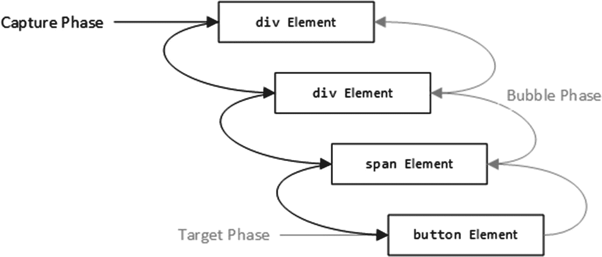

图 12-11

事件捕获阶段

需要一个单独的属性来告诉 React 应该在捕获阶段应用一个事件处理程序，如清单 [12-20](#PC30) 所示。

```jsx
import React, { Component } from "react";

export class ThemeButton extends Component {

    handleClick = (event) => {
        console.log(`ThemeButton: Type: ${event.type} `
            + `Target: ${event.target.tagName} `
            + `CurrentTarget: ${event.currentTarget.tagName}`);
        this.props.callback(this.props.theme);
    }

    render() {
        return  <span className="m-1" onClick={ this.handleClick }
                        onClickCapture={ this.handleClick }>
                    <button className={`btn btn-${this.props.theme}`}
                        onClick={ this.handleClick }>
                            Select {this.props.theme } Theme
                    </button>
                </span>
    }
}

Listing 12-20Capturing an Event in the ThemeButton.js File in the src Folder

```

对于每个事件处理属性，比如`onClick`，都有一个相应的捕获属性`onClickCapture`，它在捕获阶段接收事件。在清单中，我将`onClickCapture`属性应用于`span`元素，并在表达式中指定了`handleClick`方法。结果是，`span`元素将在`capture`和`bubble`阶段接收到`click`事件，因为事件沿着 HTML 元素的层次结构向下，然后又向上返回。单击任何一个`button`元素都会在浏览器的 JavaScript 控制台中产生一条额外的消息。

```jsx
...

ThemeButton: Type: click Target: BUTTON CurrentTarget: SPAN

ThemeButton: Type: click Target: BUTTON CurrentTarget: BUTTON
ThemeButton: Type: click Target: BUTTON CurrentTarget: SPAN
App: Type: click Target: BUTTON CurrentTarget: DIV
App: Type: click Target: BUTTON CurrentTarget: DIV
...

```

### 确定事件阶段

由`ThemeButton`组件定义的`handleClick`方法将为每个`click`事件处理几次事件，并且它从捕获阶段移动到目标阶段，然后是冒泡阶段。每次调用`handleClick`方法时，它都会调用父组件提供的 function prop，其效果是重复更改`App`组件的`theme` state 属性的值。这是一种无害的效果，但是在实际项目中，重复调用回调会导致问题，并且对于子组件来说，假设可以在没有问题的情况下调用 props 是一种不好的做法。为了突出这个问题，我向`ThemeButton`组件的`handleEvent`方法添加了一条语句，当调用函数 prop 时，该语句向浏览器的 JavaScript 控制台写入一条消息，如清单 [12-21](#PC32) 所示。

```jsx
import React, { Component } from "react";

export class ThemeButton extends Component {

    handleClick = (event) => {
        console.log(`ThemeButton: Type: ${event.type} `
            + `Target: ${event.target.tagName} `
            + `CurrentTarget: ${event.currentTarget.tagName}`);
        console.log("Invoked function prop");
        this.props.callback(this.props.theme);
    }

    render() {
        return  <span className="m-1" onClick={ this.handleClick }
                        onClickCapture={ this.handleClick }>
                    <button className={`btn btn-${this.props.theme}`}
                        onClick={ this.handleClick }>
                            Select {this.props.theme } Theme
                    </button>
                </span>
    }
}

Listing 12-21Adding a Debugging Message in the ThemeButton.js File in the src Folder

```

单击示例应用提供的一个按钮，您将会看到函数 prop 为`click`事件经历的三个阶段中的每一个阶段调用。

```jsx
...
ThemeButton: Type: click Target: BUTTON CurrentTarget: SPAN

Invoked function prop

ThemeButton: Type: click Target: BUTTON CurrentTarget: BUTTON

Invoked function prop

ThemeButton: Type: click Target: BUTTON CurrentTarget: SPAN

Invoked function prop

App: Type: click Target: BUTTON CurrentTarget: DIV
App: Type: click Target: BUTTON CurrentTarget: DIV
...

```

React 使用的`SythenticEvent`对象定义了一个`eventPhase`属性，该属性从原生 DOM API 事件对象返回相应属性的值。不幸的是，该属性的值总是指示事件处于冒泡阶段，因为 React 截获了本机事件，并使用它来模拟三个传播阶段。因此，需要做更多的工作来识别事件阶段。

第一步是在捕获阶段识别事件，这可以通过使用不同的处理程序方法或向通用处理程序提供额外的参数来完成，这是我在清单 [12-22](#PC34) 中采用的方法。

```jsx
import React, { Component } from "react";

export class ThemeButton extends Component {

    handleClick = (event, capturePhase = false) => {
        console.log(`ThemeButton: Type: ${event.type} `
            + `Target: ${event.target.tagName} `
            + `CurrentTarget: ${event.currentTarget.tagName}`);
        if (capturePhase) {
            console.log("Skipped function prop: capture phase");
        } else {
            console.log("Invoked function prop");
            this.props.callback(this.props.theme);
        }
    }

    render() {
        return  <span className="m-1" onClick={ this.handleClick }
                        onClickCapture={ (e) => this.handleClick(e, true) }>
                    <button className={`btn btn-${this.props.theme}`}
                        onClick={ this.handleClick }>
                            Select {this.props.theme } Theme
                    </button>
                </span>
    }
}

Listing 12-22Identifying Capture Phase Events in the ThemeButton.js File in the src Folder

```

我为接收`SythenticEvent`对象的`onClickCapture`属性使用了一个内联表达式，并使用它来调用`handleClick`方法，以及一个指示事件处于捕获阶段的附加参数。在`handleClick`方法中，我检查了`capturePhase`参数的值，以识别捕获阶段的事件。

分离目标和气泡阶段更加困难，因为两个阶段中的事件都由`onClick`属性处理。确定阶段最可靠的方法是查看`target`和`currentTarget`属性的值是否不同，以及查看`bubbles`属性是否为`true`。如果`currentTarget`返回的对象不同于`target`的值，并且事件有一个冒泡阶段，那么有理由假设事件正在冒泡，如清单 [12-23](#PC35) 所示。

```jsx
import React, { Component } from "react";

export class ThemeButton extends Component {

    handleClick = (event, capturePhase = false) => {
        console.log(`ThemeButton: Type: ${event.type} `
            + `Target: ${event.target.tagName} `
            + `CurrentTarget: ${event.currentTarget.tagName}`);
        if (capturePhase) {
            console.log("Skipped function prop: capture phase");
        } else if (event.bubbles && event.currentTarget !== event.target) {
            console.log("Skipped function prop: bubble phase");
        } else {
            console.log("Invoked function prop");
            this.props.callback(this.props.theme);
        }
    }

    render() {
        return  <span className="m-1" onClick={ this.handleClick }
                        onClickCapture={ (e) => this.handleClick(e, true) }>
                    <button className={`btn btn-${this.props.theme}`}
                        onClick={ this.handleClick }>
                            Select {this.props.theme } Theme
                    </button>
                </span>
    }
}

Listing 12-23Identifying Bubble Phase Events in the ThemeButton.js File in the src Folder

```

当您单击一个按钮时，您将在浏览器的 JavaScript 控制台中看到以下消息序列，表明每个阶段都已被识别，并且只在目标阶段调用了函数 prop。

```jsx
...
ThemeButton: Type: click Target: BUTTON CurrentTarget: SPAN

Skipped function prop: capture phase

ThemeButton: Type: click Target: BUTTON CurrentTarget: BUTTON

Invoked function prop

ThemeButton: Type: click Target: BUTTON CurrentTarget: SPAN

Skipped function prop: bubble phase

App: Type: click Target: BUTTON CurrentTarget: DIV
App: Type: click Target: BUTTON CurrentTarget: DIV
...

```

这些消息还确认了事件阶段的顺序:捕获、瞄准，然后冒泡。

### 停止事件传播

如果您想要中断正常的传播序列并阻止元素接收事件，了解事件阶段也很重要。在清单 [12-24](#PC37) 中，我修改了`ThemeButton`组件，使其在捕获阶段拦截点击事件并阻止它们到达目标元素。

```jsx
import React, { Component } from "react";

export class ThemeButton extends Component {

    handleClick = (event, capturePhase = false) => {
        console.log(`ThemeButton: Type: ${event.type} `
            + `Target: ${event.target.tagName} `
            + `CurrentTarget: ${event.currentTarget.tagName}`);
        if (capturePhase) {
            if (this.props.theme === "danger") {
                event.stopPropagation();
                console.log("Stopped event");
            } else {
                console.log("Skipped function prop: capture phase");
            }
        } else if (event.bubbles && event.currentTarget !== event.target) {
            console.log("Skipped function prop: bubble phase");
        } else {
            console.log("Invoked function prop");
            this.props.callback(this.props.theme);
        }
    }

    render() {
        return  <span className="m-1" onClick={ this.handleClick }
                        onClickCapture={ (e) => this.handleClick(e, true) }>
                    <button className={`btn btn-${this.props.theme}`}
                        onClick={ this.handleClick }>
                            Select {this.props.theme } Theme
                    </button>
                </span>
    }
}

Listing 12-24Stopping Event Propagation in the ThemeButton.js File in the src Folder

```

当在捕获阶段收到一个`click`事件时，`span`元素上的`onClickCapture`属性将调用`handleClick`方法。当`theme`属性的值为`danger`时，调用`stopPropagation`方法，阻止事件到达`button`元素，具有阻止用户选择`danger`主题的效果，如图 [12-12](#Fig12) 所示。

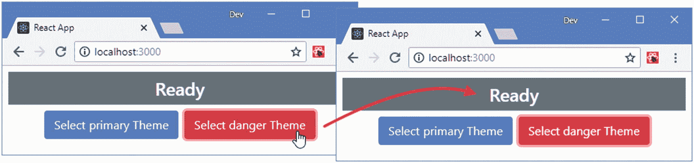

图 12-12

停止事件

## 摘要

在本章中，我描述了 React 提供的处理事件的特性。我演示了定义处理函数的不同方法，展示了如何使用事件对象，并展示了如何使用自定义参数。我还解释了 React 事件为什么不同于 DOM API 事件，尽管它们是相似且密切相关的。在本章的最后，我介绍了事件生命周期，并向您展示了事件是如何传播的。在下一章，我将描述组件的生命周期，并解释如何协调状态数据的变化。