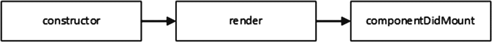

# 十三、协调与生命周期

在这一章中，我将解释 React 如何使用一个叫做*协调*的过程来有效地处理组件产生的内容。协调过程是 React 为组件提供的更大生命周期的一部分，我将描述不同的生命周期阶段，并向您展示有状态组件如何实现方法以成为主动的生命周期参与者。表 [13-1](#Tab1) 将协调和组件生命周期放在上下文中。

表 13-1

将协调和生命周期文本置于上下文中

<colgroup><col class="tcol1 align-left"> <col class="tcol2 align-left"></colgroup> 
| 

问题

 | 

回答

 |
| --- | --- |
| 这是什么？ | 协调是有效处理由组件产生的内容以最小化对文档对象模型(DOM)的更改的过程。协调是应用于有状态组件的更大生命周期的一部分。 |
| 为什么有用？ | 协调过程有助于应用的性能，而更广泛的组件生命周期为应用开发提供了一致的模型，并为高级项目提供了有用的功能。 |
| 如何使用？ | 协调过程是自动执行的，不需要任何明确的操作。所有有状态组件都经历相同的生命周期，并且可以通过实现特定的方法(对于基于类的组件)或效果挂钩(对于功能组件)来积极参与。 |
| 有什么陷阱或限制吗？ | 编写组件时必须小心，使它们适合整个生命周期，包括能够呈现内容，即使它可能不用于更新 DOM。 |
| 还有其他选择吗？ | 不，生命周期和协调过程是 React 的基本特性。 |

表 [13-2](#Tab2) 总结了本章内容。

表 13-2

章节总结

<colgroup><col class="tcol1 align-left"> <col class="tcol2 align-left"> <col class="tcol3 align-left"></colgroup> 
| 

问题

 | 

解决办法

 | 

列表

 |
| --- | --- | --- |
| 触发协调 | 调用`forceUpdate`方法 | 15, 16 |
| 响应生命周期阶段 | 实现与生命周期阶段相对应的方法 | 17–20 |
| 在功能组件中接收通知 | 使用效果挂钩 | 21–23 |
| 阻止更新 | 实现`shouldComponentUpdate`方法 | 24, 25 |
| 从 props 设置状态数据 | 实现`getDerivedStateFromProps`方法 | 26, 27 |

## 为本章做准备

为了创建本章的示例项目，打开一个新的命令提示符，导航到一个方便的位置，并运行清单 [13-1](#PC1) 中所示的命令。

### 小费

你可以从 [`https://github.com/Apress/pro-react-16`](https://github.com/Apress/pro-react-16) 下载本章以及本书其他章节的示例项目。

```jsx
npx create-react-app lifecycle

Listing 13-1Creating the Example Project

```

运行清单 [13-2](#PC2) 中所示的命令，导航到`lifecycle`文件夹，并将引导包添加到项目中。

```jsx
cd lifecycle
npm install bootstrap@4.1.2

Listing 13-2Adding the Bootstrap CSS Framework

```

为了在应用中包含引导 CSS 样式表，将清单 [13-3](#PC3) 中所示的语句添加到`index.js`文件中，该文件可以在`src`文件夹中找到。

```jsx
import React from 'react';
import ReactDOM from 'react-dom';
import './index.css';
import App from './App';
import * as serviceWorker from './serviceWorker';

import 'bootstrap/dist/css/bootstrap.css';

ReactDOM.render(<App />, document.getElementById('root'));

// If you want your app to work offline and load faster, you can change
// unregister() to register() below. Note this comes with some pitfalls.
// Learn more about service workers: http://bit.ly/CRA-PWA
serviceWorker.unregister();

Listing 13-3Including Bootstrap in the index.js File in the src Folder

```

### 创建示例组件

本章中的示例需要一些基本组件。在`src`文件夹中添加一个名为`ActionButton.js`的文件，并添加清单 [13-4](#PC4) 所示的内容。

```jsx
import React, { Component } from "react";

export class ActionButton extends Component {

    render() {
        console.log(`Render ActionButton (${this.props.text}) Component `);
        return <button className="btn btn-primary m-2"
                        onClick={ this.props.callback }>
                            { this.props.text }
                </button>
    }
}

Listing 13-4The Contents of the ActionButton.js File in the src Folder

```

该组件呈现一个按钮，该按钮调用一个函数 prop 来响应`click`事件。接下来，将名为`Message.js`的文件添加到`src`文件夹中，并添加清单 [13-5](#PC5) 中所示的内容。

```jsx
import React, { Component } from "react";
import { ActionButton } from "./ActionButton";

export class Message extends Component {

    render() {
        console.log(`Render Message Component `);
        return (
            <div>
                <ActionButton theme="primary"  {...this.props} />
                <div className="h5 text-center p-2">
                    { this.props.message }
                </div>
            </div>
        )
    }
}

Listing 13-5The Contents of the Message.js File in the src Folder

```

这个组件显示一个作为 prop 接收的消息，并传递一个函数 prop 作为对一个`ActionButton`的回调，如清单 [13-4](#PC4) 中所定义的。接下来，将名为`List.js`的文件添加到`src`文件夹中，并添加清单 [13-6](#PC6) 中所示的内容。

```jsx
import React, { Component } from "react";
import { ActionButton } from "./ActionButton";

export class List extends Component {

    constructor(props) {
        super(props);
        this.state = {
            names: ["Bob", "Alice", "Dora"]
        }
    }

    reverseList = () => {
        this.setState({ names: this.state.names.reverse()});
    }

    render() {
        console.log("Render List Component");
        return (
            <div>
                <ActionButton callback={ this.reverseList }
                    text="Reverse Names" />
                { this.state.names.map((name, index) => {
                    return <h5 key={ name }>{ name }</h5>
                })}

            </div>
        )
    }
}

Listing 13-6The Contents of the List.js File in the src Folder

```

这个组件有自己的状态数据，用来呈现一个列表。一个`ActionButton`组件被提供了一个`reverseList`方法作为它的函数 prop，它反转了列表中条目的顺序。

最后的修改是用清单 [13-7](#PC7) 中所示的代码替换`App.js`文件的内容，该代码呈现使用其他组件的内容，并定义`Message`组件所需的状态数据。

```jsx
import React, { Component } from 'react';
import { Message } from "./Message";
import { List } from "./List";

export default class App extends Component {

    constructor(props) {
        super(props);
        this.state = {
            counter: 0
        }
    }

    incrementCounter = () => {
        this.setState({ counter: this.state.counter + 1 });
    }

    render() {
        console.log("Render App Component");
        return  <div className="container text-center">
                    <div className="row p-2">
                        <div className="col-6">
                            <Message message={ `Counter: ${this.state.counter}`}
                                callback={ this.incrementCounter }
                                text="Increment Counter" />
                        </div>
                        <div className="col-6">
                            <List />
                        </div>
                    </div>
                </div>

    }
}

Listing 13-7The Contents of the App.js File in the src Folder

```

由`App`组件呈现的内容使用引导 CSS 网格特性并排显示`Message`和`List`组件。`counter`属性由`incrementCounter`方法递增，该方法用作`Message`组件的函数 prop。使用命令提示符，运行`lifecycle`文件夹中清单 [13-8](#PC8) 所示的命令来启动开发工具。

```jsx
npm start

Listing 13-8Starting the Development Tools

```

一旦项目的初始准备完成，一个新的浏览器窗口将打开并显示 URL `http://localhost:3000`，它将显示如图 [13-1](#Fig1) 所示的内容。


图 13-1

运行示例应用

## 了解内容是如何呈现的

呈现过程的起点是调用`ReactDOM.render`方法的`index.js`文件中的语句。

```jsx
...
ReactDOM.render(<App />, document.getElementById('root'));
...

```

此方法启动初始呈现过程。React 创建一个新的`App`组件实例，它由`ReactDOM.render`方法的第一个参数指定，并调用它的`render`方法。由`App`组件呈现的内容包括`Message`和`List`元素，React 创建这些组件的实例并调用它们的`render`方法。流程继续到由`Message`和`List`元素呈现的内容中的`ActionButton`元素，创建`ActionButton`组件的两个实例，并为每个实例调用`render`方法。在每个组件上调用`render`方法的结果是一个 HTML 元素的层次结构，这些元素被插入到由`ReactDOM.render`方法的第二个参数选择的元素中，创建如图 [13-1](#Fig1) 所示的内容。初始渲染过程的结果是组件对象和 HTML 元素的层次结构，如图 [13-2](#Fig2) 所示。


图 13-2

组件及其内容

React 使用浏览器的 API 将 HTML 元素添加到文档对象模型(DOM)中，以便将它们呈现给用户，如图 [13-3](#Fig3) 所示，并在组件和它们呈现的内容之间创建映射。


图 13-3

将组件映射到它们呈现的内容

浏览器不知道或者不关心组件，它唯一的工作就是在 DOM 中呈现 HTML 元素。React 负责管理组件和处理呈现的内容。

示例应用中的每个组件在其`render`方法中都有一个`console.log`语句，浏览器的 JavaScript 控制台中显示的消息显示五个组件对象中的每一个都被要求呈现其内容。

```jsx
...
Render App Component
Render Message Component
Render ActionButton (Increment Counter) Component
Render List Component
Render ActionButton (Reverse Names) Component
...

```

有来自一个`App`组件、一个`Message`组件、一个`List`组件和两个`ActionButton`组件的消息，匹配图 [13-2](#Fig2) 和 [13-3](#Fig3) 所示的结构。

### 了解更新过程

当应用第一次启动时，React 要求所有组件呈现它们的内容，以便可以显示给用户。一旦显示了内容，应用就处于*协调的*状态，其中显示给用户的内容与组件的状态一致。

当应用被协调时，React 等待某些事情发生变化。在大多数应用中，变化是由用户交互引起的，用户交互触发一个事件并导致对`setState`方法的调用。`setState`方法更新组件的状态数据，但是它也将组件标记为“陈旧”，这意味着显示给用户的 HTML 内容可能是过期的。一个事件可能导致多个状态数据更改，一旦它们都被处理，React 将为每个脏组件及其子组件调用`render`方法。要查看更改的效果，点击浏览器窗口中的增量计数器按钮，如图 [13-4](#Fig4) 所示。


图 13-4

点击按钮以触发更改

响应`click`事件的处理程序更新`App`组件的`counter`状态数据属性。因为`App`是顶层组件，这意味着`render`方法在应用的所有组件上都被调用，这可以在浏览器的 JavaScript 控制台显示的消息中看到。

```jsx
...
Render App Component
Render Message Component
Render ActionButton (Increment Counter) Component
Render List Component
Render ActionButton (Reverse Names) Component
...

```

React 只更新受更改影响的组件，最大限度地减少了应用在再次协调之前必须做的工作量。你可以通过点击反转名称按钮来查看这是如何工作的，如图 [13-5](#Fig5) 所示。


图 13-5

点击一个按钮来触发有限的改变

该按钮的`click`事件导致`List`组件的状态数据发生变化，并在浏览器的 JavaScript 控制台中产生以下消息:

```jsx
...
Render List Component
Render ActionButton (Reverse Names) Component
...

```

组件`List`及其子组件`ActionButton`被标记为陈旧，但是这种变化并没有影响到`App`和`Message`组件或者其他的`ActionButton`。React 假设这些组件呈现的内容仍然是最新的，不需要更新。

### 了解调节过程

尽管 React 将调用任何被标记为陈旧的组件的`render`方法，但它并不总是使用生成的内容。对域对象模型中的 HTML 元素进行更改是一项昂贵的操作，因此 React 将组件返回的内容与先前的结果进行比较，以便它可以要求浏览器执行最少数量的操作，这一过程称为*协调*。

为了演示 React 如何最小化它所做的更改，我对由`Message`组件呈现的内容做了一个更改，如清单 [13-9](#PC13) 所示。

```jsx
import React, { Component } from "react";
import { ActionButton } from "./ActionButton";

export class Message extends Component {

    render() {
        console.log(`Render Message Component `);
        return (
            <div>
                <ActionButton theme="primary"  {...this.props} />
                <div id="messageDiv" className="h5 text-center p-2">
                    { this.props.message }
                </div>
            </div>
        )
    }
}

Listing 13-9Changing Content in the Message.js File in the src Folder

```

添加了`id`属性使得操作`div`元素变得更加容易。使用 F12 开发工具，切换到控制台选项卡，输入清单 [13-10](#PC14) 中所示的语句，然后按回车键。所有浏览器都允许执行 JavaScript 任意语句，在 Google Chrome 中，这是通过在控制台选项卡底部的提示中输入代码来实现的。

```jsx
document.getElementById("messageDiv").classList.add("bg-info")

Listing 13-10Manipulating an HTML Element

```

该语句使用 DOM API 选择由`Message`组件呈现的`div`元素，并将其分配给`bg-info`类，后者选择由引导 CSS 框架定义的背景颜色。当你点击 Increment Counter 按钮时，`div`元素的内容被更新，但颜色不变，因为 React 已经将`Message`组件的`render`方法返回的内容与之前的结果进行了比较，检测到只有`div`元素的内容有所不同，如图 [13-6](#Fig6) 所示。


图 13-6

和解的效果

React 将组件产生的内容与它自己的以前结果的缓存进行比较，这个缓存被称为虚拟 DOM，它是以一种允许有效比较的格式定义的。其效果是，React 不必查询 DOM 中的元素来找出一组更改。

### 小费

不要混淆专用于 React 的术语*虚拟 DOM* 和*影子 DOM* ，后者是一种最新的浏览器功能，允许内容限定在 HTML 文档的特定部分。

需要第二个示例来确认协调行为，演示 React 如何处理更复杂的更改。在清单 [13-11](#PC15) 中，我向`Message`组件添加了状态数据，并使用它在两种不同的元素类型之间进行切换。

```jsx
import React, { Component } from "react";
import { ActionButton } from "./ActionButton";

export class Message extends Component {

    constructor(props) {
        super(props);
        this.state = {
            showSpan: false
        }
    }

    handleClick = (event) => {
        this.setState({ showSpan: !this.state.showSpan });
        this.props.callback(event);
    }

    getMessageElement() {
        let div = <div id="messageDiv" className="h5 text-center p-2">
                        { this.props.message }
                  </div>
        return this.state.showSpan ? <span>{ div } </span> : div;
    }

    render() {
        console.log(`Render Message Component `);
        return (
            <div>
                <ActionButton theme="primary" {...this.props}
                    callback={ this.handleClick } />
                { this.getMessageElement() }
            </div>
        )
    }
}

Listing 13-11Alternating Elements in the Message.js File in the src Folder

```

该组件在直接显示一个`div`元素或将其包装在一个`span`元素中之间交替。保存更改，并在浏览器的 JavaScript 控制台中执行清单 [13-12](#PC16) 中所示的语句来设置`div`元素的背景颜色。注意，在使用 spread 操作符将 props 传递给`ActionButton`组件之后，我已经定义了`callback`属性。`Message`组件从它的父组件接收一个`callback`属性，所以我必须在之后定义我的替换来覆盖它。

### 警告

不要在实际项目中更改组件中的顶级元素，因为这会导致 React 替换 DOM 中的元素，而不执行详细的比较来检测更改。

```jsx
document.getElementById("messageDiv").classList.add("bg-info")

Listing 13-12Manipulating an HTML Element

```

当您单击增量计数器按钮时，`Message`组件的`render`方法将返回包含`span`元素的内容。第二次点击按钮，`render`方法将返回原来的内容，但不显示背景颜色，如图 [13-7](#Fig7) 所示。


图 13-7

协调不同类型的元素

React 将来自`render`方法的输出与之前的结果进行比较，并检测`span`元素的引入。React 并不研究新的`span`元素的内容来执行更详细的比较，只是用它来替换浏览器正在显示的现有的`div`元素。

### 了解列表协调

React 特别支持处理显示数据数组的元素。对列表的大多数操作将大部分元素留在数组中，尽管它们可能经常在不同的位置，比如对对象进行排序时。为了确保 React 能够最大限度地减少显示更改所需的更改次数，从数组生成的元素需要有一个`key`属性，比如由`List`组件定义的属性。

```jsx
...
render() {
    console.log("Render List Component");
    return (
        <div>
            <ActionButton callback={ this.reverseList }
                text="Reverse Names" />
            { this.state.names.map((name, index) => {
                return <h5 key={ name }>{ name }</h5>
            })}
        </div>
    )
}
...

```

属性的值在元素集合中必须是惟一的，这样 React 才能识别每个元素。为了演示 React 如何最小化更新列表所需的更改，我向由`List`组件呈现的`h5`元素添加了一个属性，如清单 [13-13](#PC18) 所示。

### 小费

键值应该是稳定的，这样即使在对数组进行更改的操作之后，它们也应该继续引用同一个对象。一个常见的错误是使用对象在数组中的位置作为其索引，这是不稳定的，因为数组上的许多操作会影响对象的顺序。

```jsx
import React, { Component } from "react";
import { ActionButton } from "./ActionButton";

export class List extends Component {

    constructor(props) {
        super(props);
        this.state = {
            names: ["Bob", "Alice", "Dora"]
        }
    }

    reverseList = () => {
        this.setState({ names: this.state.names.reverse()});
    }

    render() {
        console.log("Render List Component");
        return (
            <div>
                <ActionButton callback={ this.reverseList }
                    text="Reverse Names" />
                { this.state.names.map((name, index) => {
                    return <h5 id={ name.toLowerCase() } key={ name }>{ name }</h5>
                })}
            </div>
        )
    }
}

Listing 13-13Adding an Attribute in the List.js File in the src Folder

```

添加了`id`属性使得使用浏览器的 JavaScript 控制台操作元素变得容易，使用的方法与前面的例子相同。使用 JavaScript 控制台执行清单 [13-14](#PC19) 中所示的语句，这些语句将`h5`元素分配给应用引导背景颜色的类。

```jsx
document.getElementById("bob").classList.add("bg-primary")
document.getElementById("alice").classList.add("bg-secondary")
document.getElementById("dora").classList.add("bg-info")

Listing 13-14Adding Classes to Elements

```

单击 Reverse Names 按钮，您将看到 h5 元素的顺序发生了变化，但是没有元素被销毁和重新创建，如图 [13-8](#Fig8) 所示。


图 13-8

对列表中的元素重新排序

## 明确触发和解

协调过程依赖于 React 通过`setState`方法得到的更改通知，这允许它确定哪些数据是陈旧的。如果您需要响应应用外部发生的变化，比如外部数据到达时，并不总是可以调用`setState`方法。对于这些情况，React 提供了`forceUpdate`方法，该方法可用于显式触发更新，并确保任何更改都反映在呈现给用户的内容中。为了演示显式协调，我在`src`文件夹中添加了一个名为`ExternalCounter.js`的文件，并用它来定义清单 [13-15](#PC20) 中所示的组件。

### 警告

如果您发现自己正在使用`forceUpdate`方法，那么考虑您的应用的设计是值得的。`forceUpdate`方法是一种钝器，通常可以通过扩展状态数据的使用或应用第 [14 章](14.html)中描述的组合技术之一来避免使用。

```jsx
import React, {Component } from "react";
import { ActionButton } from "./ActionButton";

let externalCounter = 0;

export class ExternalCounter extends Component {

    incrementCounter = () => {
        externalCounter++;
        this.forceUpdate();
    }

    render() {
        return (
            <div>
                <ActionButton callback={ this.incrementCounter }
                    text="External Counter" />
                <div  className="h5 text-center p-2">
                    External: { externalCounter }
                </div>
            </div>
        )
    }
}

Listing 13-15The Contents of the ExternalCounter.js File in the src Folder

```

对于可以作为状态数据处理的数据来说，这是一个显而易见的候选者，但是并不是所有真实世界的情况都是明确的。在这种情况下，组件依赖于 React 控制之外的变量，这意味着更改变量的值不会将组件标记为状态并启动协调过程。相反，`incrementCounter`方法调用`forceUpdate`方法，后者显式地开始协调，并确保新值被合并到显示给用户的内容中。为了将新组件合并到应用中，我对`App`组件进行了清单 [13-16](#PC21) 中所示的更改。

```jsx
import React, { Component } from 'react';
import { Message } from "./Message";
import { List } from "./List";

import { ExternalCounter } from './ExternalCounter';

export default class App extends Component {

    constructor(props) {
        super(props);
        this.state = {
            counter: 0
        }
    }

    incrementCounter = () => {
        this.setState({ counter: this.state.counter + 1 });
    }

    render() {
        console.log("Render App Component");
        return  <div className="container text-center">
                    <div className="row p-2">
                        <div className="col-4">
                            <Message message={ `Counter: ${this.state.counter}`}
                                callback={ this.incrementCounter }
                                text="Increment Counter" />
                        </div>
                        <div className="col-4">
                            <List />
                        </div>
                        <div className="col-4">
                            <ExternalCounter />
                        </div>
                    </div>
                </div>
    }
}

Listing 13-16Adding a New Component in the App.js File in the src Folder

```

新组件显示在应用布局的右侧，单击外部计数器按钮会明确地将该组件标记为陈旧，并触发协调过程，如图 [13-9](#Fig9) 所示。


图 13-9

明确开始协调

## 了解组件生命周期

大多数基于类的有状态组件实现一个构造函数和`render`方法。构造函数用于从父节点接收属性并定义状态数据。`render`方法用于在应用启动和 React 响应更新时生成内容。

构造函数和`render`方法是更大的组件生命周期的一部分，有状态组件可以通过实现方法来参与其中，这些方法对调用作出 React，以表示生命周期中的变化。在接下来的部分中，我将解释组件生命周期的不同阶段以及每个阶段的方法。为了快速参考，表 [13-3](#Tab3) 列出了常用的生命周期方法。我在“使用高级生命周期方法”一节中描述了三种高级方法。

表 13-3

有状态组件生命周期方法

<colgroup><col class="tcol1 align-left"> <col class="tcol2 align-left"></colgroup> 
| 

名字

 | 

描述

 |
| --- | --- |
| `constructor` | 当创建组件类的新实例时，调用这个特殊的方法。 |
| `render` | 当 React 需要组件中的内容时，调用此方法。 |
| `componentDidMount` | 此方法在组件呈现的初始内容处理完毕后调用。 |
| `componentDidUpdate` | 在 React 完成更新后的协调过程后，将调用此方法。 |
| `componentWillUnmount` | 在销毁组件之前调用此方法。 |
| `componentDidCatch` | 该方法用于处理错误，如第 [14](14.html) 章所述。 |

### 注意

请参阅“使用效果挂钩”部分，了解挂钩功能如何提供对功能组件的生命周期功能的访问。

### 了解安装阶段

React 创建一个组件并首次呈现其内容的过程称为*挂载*，组件实现参与挂载过程的常用方法有三种，如图 [13-10](#Fig10) 所示。



图 13-10

安装阶段

当 React 需要创建一个组件的新实例时，将调用构造函数，这将使组件有机会从其父组件接收属性，定义其状态数据，并执行其他准备工作。

接下来，调用`render`方法，以便组件提供将被添加到 DOM 的内容。最后，React 调用`componentDidMount`方法，告诉组件它的内容已经被添加到 DOM 中。

`componentDidMount`方法通常用于执行从 web 服务获取数据的 Ajax 请求，我将在第 3 部分中演示。出于本章的目的，我在`Message`组件中实现了`componentDidMount`方法，并用它向浏览器的 JavaScript 控制台写一条消息，如清单 [13-17](#PC22) 所示。

```jsx
import React, { Component } from "react";
import { ActionButton } from "./ActionButton";

export class Message extends Component {

    constructor(props) {
        super(props);
        this.state = {
            showSpan: false
        }
    }

    handleClick = (event) => {
        this.setState({ showSpan: !this.state.showSpan });
        this.props.callback(event);
    }

    getMessageElement() {
        let div = <div id="messageDiv" className="h5 text-center p-2">
                        { this.props.message }
                  </div>
        return this.state.showSpan ? <span>{ div } </span> : div;
    }

    render() {
        console.log(`Render Message Component `);
        return (
            <div>
                <ActionButton theme="primary" {...this.props}
                    callback={ this.handleClick } />
                { this.getMessageElement() }
            </div>
        )
    }

    componentDidMount() {
        console.log("componentDidMount Message Component");
    }
}

Listing 13-17Implementing a Lifecycle Method in the Message.js File in the src Folder

```

保存对`Message`组件的更改，并在应用更新时检查浏览器的 JavaScript 控制台中显示的消息，您将看到调用了`componentDidMount`方法。

```jsx
...
Render App Component
Render Message Component
Render ActionButton (Increment Counter) Component
Render List Component
Render ActionButton (Reverse Names) Component
Render ActionButton (External Counter) Component

componentDidMount Message Component

...

```

您可以看到，在调用了所有组件的`render`方法之后，已经调用了`componentDidMount`方法。当 React 需要组件的新实例时，调用`componentDidMount`方法，这包括应用启动。但是当 React 在应用运行时创建一个组件实例时，也会发生挂载，比如当内容被有条件地呈现时，如清单 [13-18](#PC24) 所示。

```jsx
import React, { Component } from 'react';
import { Message } from "./Message";
import { List } from "./List";
import { ExternalCounter } from './ExternalCounter';

export default class App extends Component {

    constructor(props) {
        super(props);
        this.state = {
            counter: 0,
            showMessage: true
        }
    }

    incrementCounter = () => {
        this.setState({ counter: this.state.counter + 1 });
    }

    handleChange = () => {
        this.setState({ showMessage: !this.state.showMessage });
    }

    render() {
        console.log("Render App Component");
        return  (
            <div className="container text-center">
                <div className="row p-2">
                    <div className="col-4">
                        <div className="form-check">
                            <input type="checkbox" className="form-check-input"
                                checked={ this.state.showMessage }
                                onChange={ this.handleChange } />
                            <label className="form-check-label">Show</label>
                        </div>
                        { this.state.showMessage &&
                            <Message message={ `Counter: ${this.state.counter}`}
                                callback={ this.incrementCounter }
                                text="Increment Counter" />
                        }
                    </div>
                    <div className="col-4">
                        <List />
                    </div>
                    <div className="col-4">
                        <ExternalCounter />
                    </div>
                </div>
            </div>
        )
    }
}

Listing 13-18Conditionally Displaying a Component in the App.js File in the src Folder

```

我添加了一个复选框，并使用`onChange`属性注册了`handleChange`方法来接收`change`事件，当复选框被切换时就会触发这些事件。该复选框用于控制`Message`组件的可见性，如图 [13-11](#Fig11) 所示。


图 13-11

控制组件的可见性

每次复选框被选中时，React 都会创建一个新的`Message`对象，并遍历挂载过程，依次调用每个方法:`constructor`、`render`和`componentDidMount`。这可以在浏览器的 JavaScript 控制台中显示的消息中看到。

### 了解更新阶段

React 响应变更并进行协调的过程被称为*更新阶段*，它调用`render`方法从组件获取内容，然后在协调过程完成后调用`componentDidUpdate`，如图 [13-12](#Fig12) 所示。


图 13-12

更新阶段

`componentDidUpdate`方法的主要用途是使用 React refs 特性直接操纵 DOM 中的 HTML 元素，我在第 16 章[第 16 章](16.html)中对此进行了描述。对于这一章，我已经在`Message`组件中实现了这个方法，并用它向浏览器的 JavaScript 控制台写一条消息，如清单 [13-19](#PC25) 所示。

### 小费

即使协调过程确定组件生成的内容没有改变，也会调用`componentDidUpdate`方法。

```jsx
import React, { Component } from "react";
import { ActionButton } from "./ActionButton";

export class Message extends Component {

    // ...other methods omitted for brevity...

    componentDidMount() {
        console.log("componentDidMount Message Component");
    }

    componentDidUpdate() {
        console.log("componentDidUpdate Message Component");
    }
}

Listing 13-19Implementing a Lifecycle Method in the Message.js File in the src Folder

```

在挂载阶段执行初始呈现之后，一旦 React 完成了协调过程并更新了 DOM，对`render`方法的任何后续调用都将跟随着对`componentDidUpdate`方法的调用。单击递增计数器按钮将启动更新阶段，并在浏览器的 JavaScript 控制台中生成以下消息:

```jsx
...
Render App Component
Render Message Component
Render ActionButton (Increment Counter) Component
Render List Component
Render ActionButton (Reverse Names) Component
Render ActionButton (External Counter) Component

componentDidUpdate Message Component

...

```

### 了解卸载阶段

当一个组件即将被销毁时，React 将调用`componentWillUnmount`方法，该方法为组件提供了释放资源、关闭网络连接和停止任何异步任务的机会。在清单 [13-20](#PC27) 中，我在`Message`组件中实现了`componentWillUnmount`方法，并使用它向浏览器的 JavaScript 控制台写一条消息。

```jsx
import React, { Component } from "react";
import { ActionButton } from "./ActionButton";

export class Message extends Component {

    // ...other methods omitted for brevity...

    componentDidMount() {
        console.log("componentDidMount Message Component");
    }

    componentDidUpdate() {
        console.log("componentDidUpdate Message Component");
    }

    componentWillUnmount() {
        console.log("componentWillUnmount Message Component");
    }
}

Listing 13-20Implementing a Lifecycle Method in the Message.js File in the src Folder

```

您可以通过取消选中我在清单 [13-20](#PC27) 中添加的复选框来触发卸载阶段。当 React 协调由`App`组件呈现的新内容时，它确定不再需要`Message`组件，并在销毁对象之前调用`componentWillUnmount`方法，在浏览器的 JavaScript 控制台中产生以下消息:

```jsx
...
Render App Component
Render List Component
Render ActionButton (Reverse Names) Component
Render ActionButton (External Counter) Component

componentWillUnmount Message Component

...

```

一旦组件被卸载，React 将不会重用它们。如果需要另一个`Message`组件，React 将创建一个新对象并执行安装序列，例如当复选框再次切换时。这意味着你总是可以依靠`constructor`和`componentDidMount`方法来初始化一个组件，组件对象永远不会被要求从卸载状态中恢复。

## 使用效果挂钩

定义为功能的组件不能实现方法，也不能以同样的方式参与生命周期。对于这种类型的组件，钩子特性提供了效果钩子，大致相当于`componentDidMount`、`componentDidUpdate`和`componentWillUnmount`方法。为了展示效果挂钩的用法，我在`src`文件夹中添加了一个名为`HooksMessage.js`的文件，并添加了清单 [13-21](#PC29) 中所示的代码。

```jsx
import React, { useState, useEffect} from "react";
import { ActionButton } from "./ActionButton";

export function HooksMessage(props) {
    const [showSpan, setShowSpan] = useState(false);

    useEffect(() => console.log("useEffect function invoked"));

    const handleClick = (event) => {
        setShowSpan(!showSpan);
        props.callback(event);
    }

    const getMessageElement = () => {
        let div = <div id="messageDiv" className="h5 text-center p-2">
                        { props.message }
                  </div>
        return showSpan ? <span>{ div } </span> : div;
    }

    return (
        <div>
            <ActionButton theme="primary" {...props} callback={ handleClick } />
            { getMessageElement() }
        </div>
    )
}

Listing 13-21The Contents of the HooksMessage.js File in the src Folder

```

该组件提供了与`Message`组件相同的功能，但是被表达为一个使用钩子的函数。`useEffect`函数用于注册一个函数，该函数将在组件被安装、更新和卸载时被调用。在所有三种情况下都调用相同的函数，这反映了将函数用于组件的本质，而不是类。在清单 [13-22](#PC30) 中，我已经将新组件添加到由`App`组件呈现的内容中。

```jsx
import React, { Component } from 'react';
import { Message } from "./Message";
import { List } from "./List";
import { ExternalCounter } from './ExternalCounter';

import { HooksMessage } from './HooksMessage';

export default class App extends Component {

    constructor(props) {
        super(props);
        this.state = {
            counter: 0,
            showMessage: true
        }
    }

    incrementCounter = () => {
        this.setState({ counter: this.state.counter + 1 });
    }

    handleChange = () => {
        this.setState({ showMessage: !this.state.showMessage });
    }

    render() {
        console.log("Render App Component");
        return  (
            <div className="container text-center">
                <div className="row p-2">
                    <div className="col-4">
                        <div className="form-check">
                            <input type="checkbox" className="form-check-input"
                                checked={ this.state.showMessage }
                                onChange={ this.handleChange } />
                            <label className="form-check-label">Show</label>
                        </div>
                        { this.state.showMessage &&
                            <div>
                                <Message message={ `Counter: ${this.state.counter}`}
                                    callback={ this.incrementCounter }
                                    text="Increment Counter" />
                                <HooksMessage
                                    message={ `Counter: ${this.state.counter}`}
                                    callback={ this.incrementCounter }
                                    text="Increment Counter" />
                            </div>
                        }
                    </div>
                    <div className="col-4">
                        <List />
                    </div>
                    <div className="col-4">
                        <ExternalCounter />
                    </div>
                </div>
            </div>
        )
    }
}

Listing 13-22Rendering a New Component in the App.js File in the src Folder

```

保存对组件的更改，并检查浏览器的 JavaScript 控制台中显示的消息，以查看组件安装和更新时调用的效果钩子函数，如下所示:

```jsx
...
Render List Component
ActionButton.js:6 Render ActionButton (Reverse Names) Component
ActionButton.js:6 Render ActionButton (External Counter) Component
Message.js:37 componentDidMount Message Component

HooksMessage.js:7 useEffect function invoked

...

```

传递给`useState`的函数可以返回一个清理函数，该函数将在组件被卸载时被调用，提供一个类似于`componentWillUnmount`方法的特性，如清单 [13-23](#PC32) 所示。

```jsx
import React, { useState, useEffect} from "react";
import { ActionButton } from "./ActionButton";

export function HooksMessage(props) {
    const [showSpan, setShowSpan] = useState(false);

    useEffect(() => {
        console.log("useEffect function invoked")
        return () => console.log("useEffect cleanup");
    });

    const handleClick = (event) => {
        setShowSpan(!showSpan);
        props.callback(event);
    }

    const getMessageElement = () => {
        let div = <div id="messageDiv" className="h5 text-center p-2">
                        { props.message }
                  </div>
        return showSpan ? <span>{ div } </span> : div;
    }

    return (
        <div>
            <ActionButton theme="primary" {...props} callback={ handleClick } />
            { getMessageElement() }
        </div>
    )
}

Listing 13-23Using a Cleanup Function in the HooksMessage.js File in the src Folder

```

切换复选框以卸载组件，您将在浏览器的 JavaScript 控制台中看到以下消息:

```jsx
...
Render ActionButton (Reverse Names) Component
ActionButton.js:6 Render ActionButton (External Counter) Component
Message.js:45 componentWillUnmount Message Component

HooksMessage.js:9 useEffect cleanup

...

```

## 使用高级生命周期方法

前面几节中描述的特性在许多项目中都很有用，尤其是使用`componentDidMount`方法请求远程数据，这将在第 3 部分中演示。React 为基于类的组件提供了高级的生命周期方法，这些方法在我在下面的章节中描述的特定情况下非常有用，尽管其中一个方法是与我在第 [16 章](16.html)中描述的 refs 特性结合使用的。为了快速参考，表 [13-4](#Tab4) 描述了先进的生命周期方法。

表 13-4

高级组件生命周期方法

<colgroup><col class="tcol1 align-left"> <col class="tcol2 align-left"></colgroup> 
| 

名字

 | 

描述

 |
| --- | --- |
| `shouldComponentUpdate` | 此方法允许组件指示它不需要更新。 |
| `getDerivedStateFromProps` | 这个方法允许一个组件根据它收到的属性来设置它的状态数据值。 |
| `getSnapshotBeforeUpdate` | 该方法允许组件在协调过程更新 DOM 之前捕获有关其状态的信息。该方法与第 [16](16.html) 章所述的 ref 功能结合使用。 |

### 防止不必要的组件更新

React 的默认行为是将组件标记为陈旧，并在其状态数据发生变化时呈现其内容。而且，由于组件的状态可以作为属性传递给其子组件，所以子组件也会被呈现，正如您在前面的示例中看到的那样。

组件可以通过实现`shouldComponentUpdate`方法来覆盖默认行为。这个特性允许组件通过避免在不需要的时候调用`render`方法来提高应用的性能。

在更新阶段调用`shouldComponentUpdate`方法，其结果决定 React 是否会调用`render`方法从组件中获取新鲜内容，如图 [13-13](#Fig13) 所示。`shouldComponentUpdate`方法的参数是新的属性和状态对象，可以对它们进行检查并与现有值进行比较。如果`shouldComponentUpdate`方法返回`true`，React 将继续更新阶段。如果`shouldComponentUpdate`方法返回 false，React 将放弃组件的更新阶段，并且不会调用`render`和`componentDidUpdate`方法。


图 13-13

更新方法的高级序列

在清单 [13-24](#PC34) 中，我在`Message`组件中实现了`showComponentUpdate`方法，如果消息属性的值没有改变，我用它来防止更新。(为了简洁起见，我还从前面的例子中删除了生命周期方法。)

```jsx
import React, { Component } from "react";
import { ActionButton } from "./ActionButton";

export class Message extends Component {

    constructor(props) {
        super(props);
        this.state = {
            showSpan: false
        }
    }

    handleClick = (event) => {
        this.setState({ showSpan: !this.state.showSpan });
        this.props.callback(event);
    }

    getMessageElement() {
        let div = <div id="messageDiv" className="h5 text-center p-2">
                        { this.props.message }
                  </div>
        return this.state.showSpan ? <span>{ div } </span> : div;
    }

    render() {
        console.log(`Render Message Component `);
        return (
            <div>
                <ActionButton theme="primary" {...this.props}
                        callback={ this.handleClick } />
                { this.getMessageElement() }
            </div>
        )
    }

    shouldComponentUpdate(newProps, newState) {
        let change = newProps.message !== this.props.message;
        if (change) {
            console.log(`shouldComponentUpdate ${this.props.text}: Update Allowed`)
        } else {
            console.log(`shouldComponentUpdate ${this.props.text}: Update Prevented`)
        }
        return change;
    }
}

Listing 13-24Preventing Updates in the Message.js File in the src Folder

```

在清单 [13-25](#PC35) 中，我修改了`App`组件，使其呈现两个`Message`组件，每个组件接收并修改一个状态数据值作为属性。

```jsx
import React, { Component } from 'react';
import { Message } from "./Message";

//import { List } from "./List";

//import { ExternalCounter } from './ExternalCounter';

export default class App extends Component {

    constructor(props) {
        super(props);
        this.state = {
            counterLeft: 0,
            counterRight: 0
        }
    }

    incrementCounter = (counter) => {
        if (counter === "left") {
            this.setState({ counterLeft: this.state.counterLeft + 1});
        } else {
            this.setState({ counterRight: this.state.counterRight+ 1});
        }
    }

    render() {
        console.log("Render App Component");
        return (
            <div className="container text-center">
                <div className="row p-2">
                    <div className="col-6">
                        <Message
                            message={ `Left: ${this.state.counterLeft}`}
                            callback={ () => this.incrementCounter("left") }
                            text="Increment Left Counter" />
                    </div>
                    <div className="col-6">
                        <Message
                            message={ `Right: ${this.state.counterRight}`}
                            callback={ () => this.incrementCounter("right") }
                            text="Increment Right Counter" />
                    </div>
                </div>
            </div>
        )
    }
}

Listing 13-25Displaying Side-By-Side Components in the App.js File in the src Folder

```

`App`组件渲染的新内容并排显示`Message`组件，如图 [13-14](#Fig14) 所示。单击任一按钮元素都会增加该组件的计数器。


图 13-14

并排显示组件

默认的 React 行为是当`counterLeft`或`counterRight`状态数据值发生变化时，呈现两个`Message`组件，这会导致其中一个组件不必要地呈现内容。清单 [13-25](#PC35) 中`shouldComponentUpdate`方法的实现覆盖了这种行为，并确保只有受变更影响的组件被更新。如果您单击应用显示的任何一个按钮，您将在浏览器的 JavaScript 控制台中看到一条消息，指出`shouldComponentUpdate`阻止了其中一个组件的更新。

```jsx
...
Render App Component

shouldComponentUpdate Increment Left Counter: Update Allowed

Render Message Component
Render ActionButton (Increment Left Counter) Component

shouldComponentUpdate Increment Right Counter: Update Prevented

...

```

### 根据属性值设置状态数据

`getDerivedStateFromProps`方法在挂载阶段先于`render`方法调用，在更新阶段先于`shouldComponentUpdate`方法调用，如图 [13-15](#Fig15) 所示。`getDerivedStateFromProps`方法为组件提供了检查属性值的机会，并在呈现其内容之前使用它们来更新其状态数据，旨在供其行为受属性值随时间变化影响的组件使用。


图 13-15

从 props 更新状态数据

`getDerivedStateFromProps`方法是`static`，这意味着它不能通过`this`关键字访问任何实例方法或属性。相反，该方法接收一个包含父组件提供的 props 值的`props`对象和一个表示当前`state`数据的`state`对象。`getDerivedStateFromProps`方法返回一个新的状态数据对象，它是从属性数据中派生出来的。

为了演示这个方法，我在`src`文件夹中添加了一个名为`DirectionDisplay.js`的文件，并用它来定义清单 [13-26](#PC37) 中所示的组件。

```jsx
import React, { Component } from "react";

export class DirectionDisplay extends Component {

    constructor(props) {
        super(props);
        this.state = {
            direction: "up",
            lastValue: 0
        }
    }

    getClasses() {
        return (this.state.direction === "up" ? "bg-success" : "bg-danger")
            + " text-white text-center p-2 m-2";
    }

    render() {
        return <h5 className={ this.getClasses() }>
                    { this.props.value }
                </h5>
    }

    static getDerivedStateFromProps(props, state) {
        if (props.value !== state.lastValue) {
            return {
                lastValue: props.value,
                direction: state.lastValue > props.value ? "down" : "up"
            }
        }
        return state;
    }
}

Listing 13-26The Contents of the DirectionDisplay.js File in the src Folder

```

该组件显示一个带有背景色的数值，该背景色指示当前值是大于还是小于上一个值。`getDerivedStateFromProps`方法接收新的属性值和组件的当前状态数据，并使用它们来创建新的状态数据对象，该对象包括属性`value`已经改变的方向。在清单 [13-27](#PC38) 中，我已经更新了`App`组件，这样它可以呈现`DirectionDisplay`组件和改变其属性数据值的按钮。

```jsx
import React, { Component } from 'react';

//import { Message } from "./Message";

import { DirectionDisplay } from './DirectionDisplay';

export default class App extends Component {

    constructor(props) {
        super(props);
        this.state = {
            counter: 100
        }
    }

    changeCounter = (val) => {
        this.setState({ counter: this.state.counter + val })
    }

    render() {
        console.log("Render App Component");
        return  (
            <div className="container text-center">
                <DirectionDisplay value={ this.state.counter } />
                <div className="text-center">
                    <button className="btn btn-primary m-1"
                        onClick={ () => this.changeCounter(-1)}>Decrease</button>
                    <button className="btn btn-primary m-1"
                        onClick={ () => this.changeCounter(1)}>Increase</button>
                </div>
            </div>
        )
    }
}

Listing 13-27Rendering a New Component in the App.js File in the src Folder

```

结果是`DirectionDisplay`组件选择的背景颜色根据`getDerivedStateFromProps`方法的输出而改变，如图 [13-16](#Fig16) 所示。


图 13-16

从属性值导出状态数据

### 小费

注意，只有当属性的值不同时，我才创建一个新的状态数据对象。记住，当祖先的状态改变时，React 将触发组件的更新阶段，这意味着即使组件所依赖的属性值都没有改变，也可以调用`getDerivedStateFromProps`方法。

## 摘要

在这一章中，我解释了 React 如何在协调过程中处理组件呈现的内容。我还描述了更广泛的组件生命周期，并向您展示了如何通过实现方法在有状态组件中接收通知。在下一章中，我将描述组合组件来创建复杂功能的不同方式。