# 十四、编写应用

在这一章中，我描述了组合组件来创建复杂特性的不同方法。这些组合模式可以一起使用，您会发现大多数问题都可以用几种方法来解决，这让您可以自由地应用您最喜欢的方法。表 [14-1](#Tab1) 将本章置于上下文中。

表 14-1

将应用组合放在上下文中

<colgroup><col class="tcol1 align-left"> <col class="tcol2 align-left"></colgroup> 
| 

问题

 | 

回答

 |
| --- | --- |
| 这是什么？ | 应用组合是组件的组合，用于创建复杂的功能。 |
| 为什么有用？ | 组合使开发变得更容易，因为它允许在组合到一起工作之前编写和测试小而简单的组件。 |
| 如何使用？ | 有不同的模式可用，但基本的方法是组合多个组件。 |
| 有什么陷阱或限制吗？ | 如果您习惯于从类中派生功能，比如在 C#或 Java 开发中，那么组合模式可能会令人感到尴尬。许多问题可以通过多个模式同样很好地解决，这会导致决策瘫痪。 |
| 还有其他选择吗？ | 您可以编写实现应用所需的所有特性的整体组件，尽管这会导致项目的测试和维护有所不同。 |

表 [14-2](#Tab2) 总结了本章内容。

表 14-2

章节总结

<colgroup><col class="tcol1 align-left"> <col class="tcol2 align-left"> <col class="tcol3 align-left"></colgroup> 
| 

问题

 | 

解决办法

 | 

列表

 |
| --- | --- | --- |
| 显示从父组件接收的内容 | 使用`children`属性 | 8–9 |
| 操纵通过`children`属性接收的组件 | 使用`React.children`属性 | 10, 11 |
| 增强现有组件 | 创建专门的组件或更高级别的组件 | 12–18 |
| 组合高阶组件 | 将函数调用链接在一起 | 19, 20 |
| 为组件提供它应该呈现的内容 | 使用渲染属性 | 21–24 |
| 在没有线程支持的情况下分发数据和函数 | 使用上下文 | 25–34 |
| 在不使用渲染属性的情况下使用上下文 | 对基于类的组件使用简化的上下文 API，对功能组件使用`useContext`钩子 | 35, 36 |
| 防止卸载应用时出错 | 定义误差边界 | 37–39 |

## 为本章做准备

为了创建本章的示例项目，打开一个新的命令提示符，导航到一个方便的位置，并运行清单 [14-1](#PC1) 中所示的命令。

### 小费

你可以从 [`https://github.com/Apress/pro-react-16`](https://github.com/Apress/pro-react-16) 下载本章以及本书其他章节的示例项目。

```jsx
npx create-react-app composition

Listing 14-1Creating the Example Project

```

运行清单 [14-2](#PC2) 中所示的命令，导航到`composition`文件夹，并将引导包添加到项目中。

```jsx
cd composition
npm install bootstrap@4.1.2

Listing 14-2Adding the Bootstrap CSS Framework

```

为了在应用中包含引导 CSS 样式表，将清单 [14-3](#PC3) 中所示的语句添加到`index.js`文件中，该文件可以在`src`文件夹中找到。

```jsx
import React from 'react';
import ReactDOM from 'react-dom';
import './index.css';
import App from './App';
import * as serviceWorker from './serviceWorker';

import 'bootstrap/dist/css/bootstrap.css';

ReactDOM.render(<App />, document.getElementById('root'));

// If you want your app to work offline and load faster, you can change
// unregister() to register() below. Note this comes with some pitfalls.
// Learn more about service workers: http://bit.ly/CRA-PWA
serviceWorker.unregister();

Listing 14-3Including Bootstrap in the index.js File in the src Folder

```

### 创建示例组件

在`src`文件夹中添加一个名为`ActionButton.js`的文件，并添加清单 [14-4](#PC4) 所示的内容。

```jsx
import React, { Component } from "react";

export class ActionButton extends Component {

    render() {
        return (
            <button className={` btn btn-${this.props.theme} m-2` }
                    onClick={ this.props.callback }>
                { this.props.text }
            </button>
        )
    }
}

Listing 14-4The Contents of the ActionButton.js File in the src Folder

```

这是一个类似于我在第 13 章[中使用的按钮组件，它通过 prop 接受配置设置，包括一个响应点击事件的函数。接下来，将名为`Message.js`的文件添加到`src`文件夹中，并添加清单](13.html) [14-5](#PC5) 中所示的内容。

```jsx
import React, { Component } from "react";

export class Message extends Component {

    render() {
        return (
            <div className={`h5 bg-${this.props.theme } text-white p-2`}>
                { this.props.message }
            </div>
        )
    }
}

Listing 14-5The Contents of the Message.js File in the src Folder

```

该组件显示作为属性接收的消息。最后的修改是用清单 [14-6](#PC6) 中所示的代码替换`App.js`文件的内容，该代码呈现使用其他组件的内容，并定义`Message`组件所需的状态数据。

```jsx
import React, { Component } from 'react';
import { Message } from "./Message";
import { ActionButton } from './ActionButton';

export default class App extends Component {

    constructor(props) {
        super(props);
        this.state = {
            counter: 0
        }
    }

    incrementCounter = () => {
        this.setState({ counter: this.state.counter + 1 });
    }

    render() {
        return  <div className="m-2 text-center">
                    <Message theme="primary"
                        message={ `Counter: ${this.state.counter}`} />
                    <ActionButton theme="secondary"
                        text="Increment" callback={ this.incrementCounter } />
                </div>
    }
}

Listing 14-6The Contents of the App.js File in the src Folder

```

由`App`组件呈现的内容显示`Message`和`ActionButton`组件，并对它们进行配置，以便单击按钮将更新`counter`状态数据值，该值已作为属性传递给`Message`组件。

使用命令提示符，运行`composition`文件夹中清单 [14-7](#PC7) 所示的命令来启动开发工具。

```jsx
npm start

Listing 14-7Starting the Development Tools

```

一旦项目的初始准备工作完成，一个新的浏览器窗口将打开并显示 URL `http://localhost:3000`并显示如图 [14-1](#Fig1) 所示的内容。

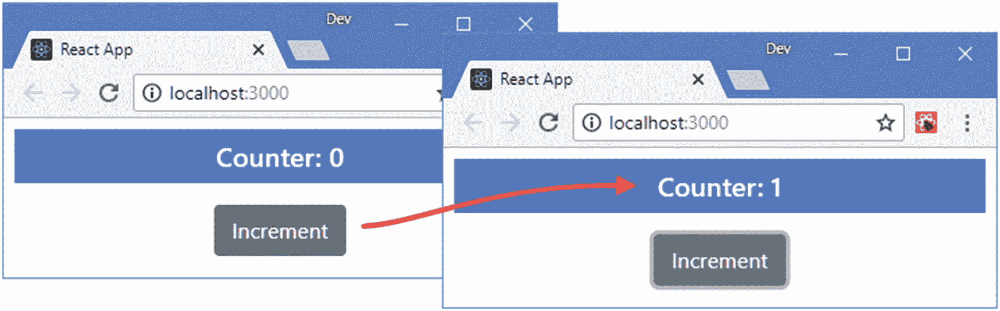

图 14-1

运行示例应用

## 了解基本组件关系

示例项目中的组件很简单，但它们说明了支撑 React 开发的基本关系:父组件用数据属性配置子组件，并通过函数属性接收通知，这导致状态数据变化并触发更新过程，如图 [14-2](#Fig2) 所示。

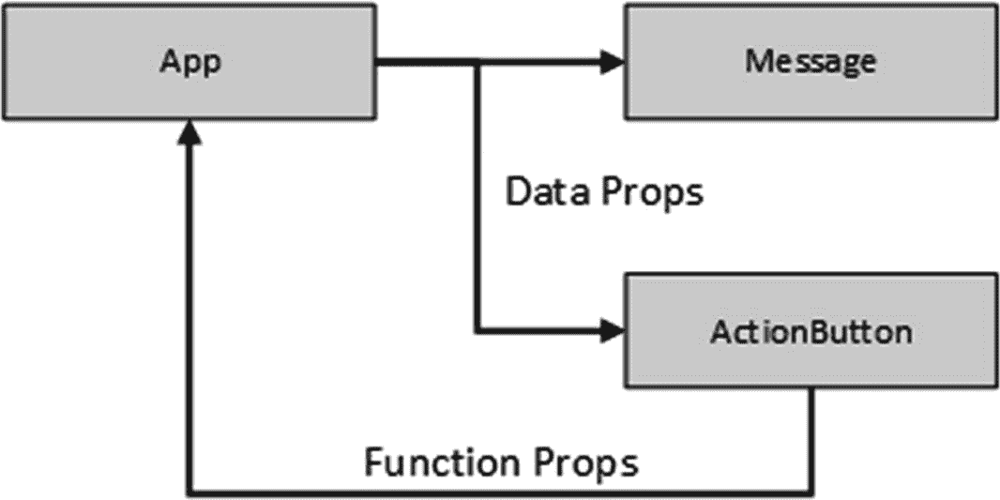

图 14-2

基本组件关系

这种关系是 React 开发的基础，也是用于在应用中安排特性的基本模式。这种模式在一个简单的例子中很容易理解，它在更复杂的情况下的使用可能不太明显，并且很难知道如何在不复制代码和数据的情况下定位和分发状态数据、属性和回调。

## 使用儿童属性

React 提供了一个特殊的`children`属性，当一个组件需要显示其父组件提供的内容，但事先不知道该内容是什么时，就使用这个属性。这是一种减少重复的有用方法，它将容器中的特性标准化，可以在整个应用中重用。为了演示，我在`src`文件夹中创建了一个名为`ThemeSelector.js`的文件，并用它来定义清单 [14-8](#PC8) 中所示的组件。

```jsx
import React, { Component } from "react";

export class ThemeSelector extends Component {

    render() {
        return (
            <div className="bg-dark p-2">
                <div className="bg-info p-2">
                    { this.props.children }
                </div>
            </div>
        )
    }
}

Listing 14-8The Contents of the ThemeSelector.js File in the src Folder

```

该组件呈现两个包含表达式的`div`元素，表达式的值是`children`属性。为了展示如何提供儿童属性的内容，清单 [14-9](#PC9) 应用了`App`组件中的`ThemeSelector`。

```jsx
import React, { Component } from 'react';
import { Message } from "./Message";
import { ActionButton } from './ActionButton';

import { ThemeSelector } from './ThemeSelector';

export default class App extends Component {

    constructor(props) {
        super(props);
        this.state = {
            counter: 0
        }
    }

    incrementCounter = () => {
        this.setState({ counter: this.state.counter + 1 });
    }

    render() {
        return  <div className="m-2 text-center">
                    <ThemeSelector>
                        <Message theme="primary"
                            message={ `Counter: ${this.state.counter}`} />
                        <ActionButton theme="secondary"
                            text="Increment" callback={ this.incrementCounter } />
                    </ThemeSelector>
                </div>
    }
}

Listing 14-9Using a Container Component in the App.js File in the src Folder

```

`App`组件通过在开始和结束标签之间定义元素来为`ThemeSelector`组件提供内容。在这种情况下，元素应用了`Message`和`ActionButton`组件。当 React 处理由`App`组件呈现的内容时，`ThemeSelector`标记之间的内容被赋给`props.children`属性，产生如图 [14-3](#Fig3) 所示的结果。

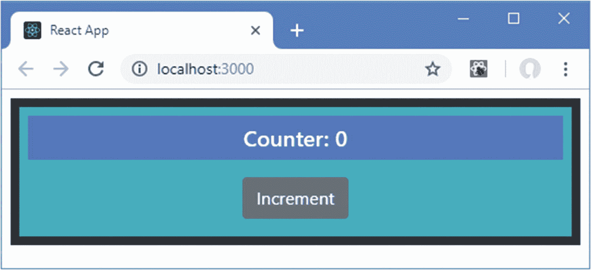

图 14-3

容器组件

`ThemeSelector`组件目前并没有增加很多价值，但是您可以看到它是如何作为`App`组件提供的内容的容器的。

### 操纵属性儿童

使用`children` prop 的组件只有当它们能够向它们的子组件提供服务时才是有用的，当没有这些子组件将提供什么的高级知识时，这可能是困难的。为了帮助解决这个限制，React 提供了许多方法，容器可以使用这些方法来操作其子容器，如表 [14-3](#Tab3) 中所述。

表 14-3

容器子方法

<colgroup><col class="tcol1 align-left"> <col class="tcol2 align-left"></colgroup> 
| 

名字

 | 

描述

 |
| --- | --- |
| `React.Children.map` | 该方法为每个孩子调用一个函数，并返回函数结果的数组。 |
| `React.Children.forEach` | 这个方法为每个孩子调用一个函数，而不返回数组。 |
| `React.Children.count` | 此方法返回子节点的数量。 |
| `React.Children.only` | 如果此方法接收的子集合包含多个子级，则引发一个数组。 |
| `React.Children.toArray` | 此方法返回一个子数组，可用于重新排序或移除元素。 |
| `React.cloneElement` | 该方法用于复制子元素，并允许容器添加新的属性。 |

#### 向容器子项添加属性

组件不能直接操作它从父组件接收的内容，所以为了给通过`children`属性接收的组件提供额外的数据或功能，`React.Children.map`方法与`React.cloneElement`方法结合使用，以复制子组件并分配额外的属性。

清单 [14-10](#PC10) 向由`ThemeSelector`呈现的内容添加了一个`select`元素，该元素更新了一个状态数据属性，并允许用户选择由 Bootstrap CSS 框架提供的一种主题颜色，然后将其作为属性传递给容器的子容器。

```jsx
import React, { Component } from "react";

export class ThemeSelector extends Component {

    constructor(props) {
        super(props);
        this.state = {
            theme: "primary"
        }
        this.themes = ["primary", "secondary", "success", "warning", "dark"];
    }

    setTheme = (event) => {
        this.setState({ theme : event.target.value });
    }

    render() {

        let modChildren = React.Children.map(this.props.children,
            (c => React.cloneElement(c, { theme: this.state.theme})));

        return (
            <div className="bg-dark p-2">
                <div className="form-group text-left">
                    <label className="text-white">Theme:</label>
                    <select className="form-control" value={ this.state.theme }
                            onChange={ this.setTheme }>
                        { this.themes.map(theme =>
                            <option key={ theme } value={ theme }>{theme}</option>) }
                    </select>
                </div>

                <div className="bg-info p-2">
                    { modChildren }
                </div>
            </div>
        )
    }
}

Listing 14-10Adding Theme Selection in the ThemeSelector.js File in the src Folder

```

因为 props 是只读的，所以我不能使用`React.Children.forEach`方法简单地枚举子组件并为它们的`props`对象分配一个新属性。相反，我使用`map`方法来枚举孩子，并使用`React.cloneElement`方法用一个额外的属性复制每个孩子。

```jsx
...
let modChildren = React.Children.map(this.props.children,
    (c => React.cloneElement(c, { theme: this.state.theme})));
...

```

`cloneElement`方法接受一个子组件和一个 props 对象，该对象与子组件现有的 props 合并。

使用`map`方法将子组件枚举到数组中的一个结果是，React 期望每个组件都有一个`key`属性，并将在浏览器的 JavaScript 控制台中报告一个警告。

结果是传递给`Message`和`ActionButton`组件的属性是由`App`组件定义的属性和由`ThemeSelector`组件使用`cloneElement`方法添加的属性的组合。当您从`select`元素中选择一个主题时，一个更新被执行，并且所选择的主题被应用到`Message`和`ActionButton`组件，如图 [14-4](#Fig4) 所示。

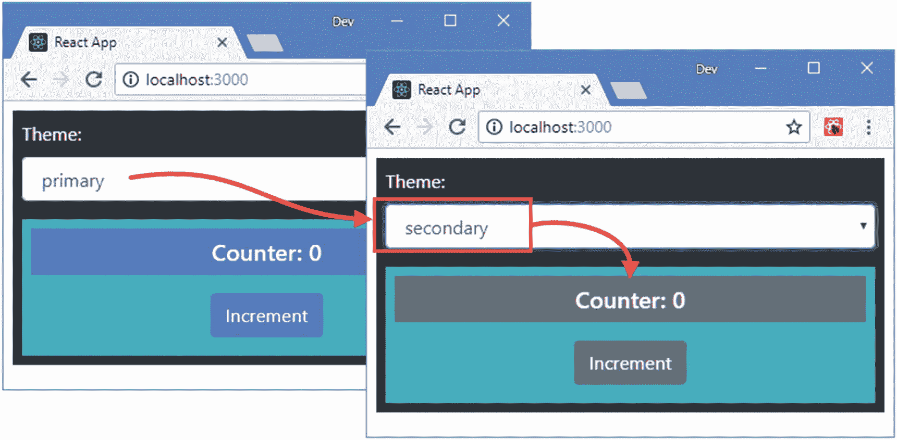

图 14-4

向包含的组件添加属性

#### 订购或省略组件

尽管一个容器没有任何关于其子容器的高级知识，但是表 [14-3](#Tab3) 中描述的`toArray`方法可以用来将子容器转换成一个数组，这个数组可以使用标准的 JavaScript 特性来操作，比如排序或者添加和删除项目。这种类型的操作也可以在来自`React.Children.map`方法的结果上执行，也在表 [14-3](#Tab3) 中描述，它也返回一个数组。

在清单 [14-11](#PC12) 中，我在`ThemeSelector`组件中添加了一个按钮，当它被点击时会反转子组件的顺序，这是通过在由`map`方法产生的数组上调用`reverse`方法来实现的。

```jsx
import React, { Component } from "react";

export class ThemeSelector extends Component {

    constructor(props) {
        super(props);
        this.state = {
            theme: "primary",
            reverseChildren: false
        }
        this.themes = ["primary", "secondary", "success", "warning", "dark"];
    }

    setTheme = (event) => {
        this.setState({ theme : event.target.value });
    }

    toggleReverse = () => {
        this.setState({ reverseChildren: !this.state.reverseChildren});
    }

    render() {

        let modChildren = React.Children.map(this.props.children,
            (c => React.cloneElement(c, { theme: this.state.theme})));

        if (this.state.reverseChildren) {
            modChildren.reverse();
        }

        return (
            <div className="bg-dark p-2">
                <button className="btn btn-primary" onClick={ this.toggleReverse }>
                    Reverse
                </button>
                <div className="form-group text-left">
                    <label className="text-white">Theme:</label>
                    <select className="form-control" value={ this.state.theme }
                            onChange={ this.setTheme }>
                        { this.themes.map(theme =>
                            <option key={ theme } value={ theme }>{theme}</option>) }
                    </select>
                </div>

                <div className="bg-info p-2">
                    { modChildren }
                </div>
            </div>
        )
    }
}

Listing 14-11Reversing Children in the ThemeSelector.js File in the src Folder

```

这种类型的操作通常用于相似对象的列表，例如在线商店中的产品，但它可以应用于任何子对象，如图 [14-5](#Fig5) 所示。

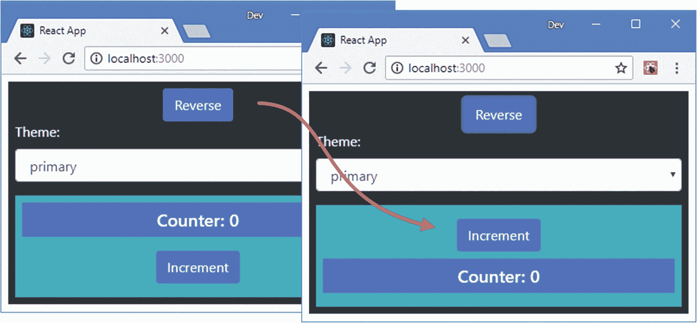

图 14-5

更改容器中子组件的顺序

## 创建专用组件

一些组件提供由另一个更通用的组件提供的功能的专用版本。在一些框架中，专门化是通过使用类继承等特性来处理的，但 React 依赖于专门化的组件来呈现更一般的组件，并使用 props 来管理其行为。为了演示，我在`src`文件夹中添加了一个名为`GeneralList.js`的文件，并用它来定义清单 [14-12](#PC13) 中所示的组件。

### 注意

如果您习惯于基于类的语言，比如 C#或 Java，您可能希望使用与有状态组件用来从 React `Component`类继承功能的关键字相同的`extends`来创建一个子类。这不是 React 的预期用途，您应该组合组件，即使一开始这样做可能会感觉很奇怪。

```jsx
import React, { Component } from "react";

export class GeneralList extends Component {

    render() {
        return (
            <div className={`bg-${this.props.theme} text-white p-2`}>
                { this.props.list.map((item, index) =>
                    <div key={ item }>{ index + 1 }: { item }</div>
                )}
            </div>
        )
    }
}

Listing 14-12The Contents of the GeneralList.js File in the src Folder

```

该组件接收一个名为`list`的属性，使用 array `map`方法对其进行处理，以呈现一系列`div`元素。为了创建一个接收列表并允许对其进行排序的组件，我可以创建一个更加专门化的组件，它构建在由`GeneralList`提供的特性之上。我在`src`文件夹中添加了一个名为`SortedList.js`的文件，并用它来定义清单 [14-13](#PC14) 中所示的组件。

```jsx
import React, { Component } from "react";
import { GeneralList } from "./GeneralList";
import { ActionButton } from "./ActionButton";

export class SortedList extends Component {

    constructor(props) {
        super(props);
        this.state = {
            sort: false
        }
    }

    getList() {
        return this.state.sort
            ? [...this.props.list].sort() : this.props.list;
    }

    toggleSort = () => {
        this.setState({ sort : !this.state.sort });
    }

    render() {
        return (
            <div>
                <GeneralList list={ this.getList() } theme="info" />
                <div className="text-center m-2">
                    <ActionButton theme="primary" text="Sort"
                        callback={this.toggleSort} />
                </div>
            </div>
        )
    }
}

Listing 14-13The Contents of the SortedList.js File in the src Folder

```

`SortedList`呈现一个`GeneralList`作为其输出的一部分，并使用`list`属性来控制数据的显示，允许用户选择一个排序或未排序的列表。在清单 [14-14](#PC15) 中，我已经改变了`App`组件的布局，以便并排显示一般的和更具体的组件。

```jsx
import React, { Component } from 'react';

//import { Message } from "./Message";

//import { ActionButton } from './ActionButton';

//import { ThemeSelector } from './ThemeSelector';

import { GeneralList } from './GeneralList';

import { SortedList } from "./SortedList";

export default class App extends Component {

    constructor(props) {
        super(props);
        this.state = {
            // counter: 0
            names: ["Zoe", "Bob", "Alice", "Dora", "Joe"]
        }
    }

    // incrementCounter = () => {
    //     this.setState({ counter: this.state.counter + 1 });
    // }

    render() {
        return  (
            <div className="container-fluid">
                <div className="row">
                    <div className="col-6">
                        <GeneralList list={ this.state.names } theme="primary" />
                    </div>
                    <div className="col-6">
                        <SortedList list={ this.state.names } />
                    </div>
                </div>
            </div>
        )
    }
}

Listing 14-14Changing the Component Layout in the App.js File in the src Folder

```

结果是一般列表和可排序列表都呈现给用户，如图 [14-6](#Fig6) 所示。

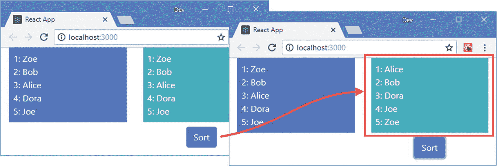

图 14-6

通用和更专业的组件

## 创建高阶组件

高阶组件(hoc)提供了专用组件的替代方案，在组件需要公共代码但可能无法呈现相关内容时非常有用。hoc 通常用于*横切关注点*，这个术语指的是跨越整个应用的任务，否则会导致在几个地方实现相同的特性。最常见的横切关注点的例子是授权、日志和数据检索。为了演示 HOCs 的使用，我在`src`文件夹中添加了一个名为`ProFeature.js`的文件，并用它来定义清单 [14-15](#PC16) 中所示的组件。

```jsx
import React from "react";

export function ProFeature(FeatureComponent) {
    return function(props) {

        if (props.pro) {
            let { pro, ...childProps}  = props;
            return <FeatureComponent {...childProps} />
        } else {
            return (
                <h5 className="bg-warning text-white text-center">
                    This is a Pro Feature
                </h5>
            )
        }
    }
}

Listing 14-15The Contents of the ProFeature.js File in the src Folder

```

一个 HOC 是一个函数，它接受一个组件并返回一个新组件，这个新组件包装了这个组件以提供额外的特性。在清单 [14-15](#PC16) 中，HOC 是一个名为`ProFeature`的函数，它接受一个只有当名为`pro`的属性的值为`true`时才应该呈现给用户的组件，作为一个简单的授权特性。为了显示组件，`render`方法使用接收到的组件作为函数参数，并传递它的所有属性，除了名为`pro`的属性。

```jsx
...
let { pro, ...childProps}  = props;
return <FeatureComponent {...childProps} />
...

```

当`pro`属性为`false`时，`ProFeature`函数返回一个显示警告的 header 元素。清单 [14-16](#PC18) 更新了`App`组件以使用`ProFeature`来保护它的一个子组件。

```jsx
import React, { Component } from 'react';
import { GeneralList } from './GeneralList';
import { SortedList } from "./SortedList";

import { ProFeature } from "./ProFeature";

const ProList = ProFeature(SortedList);

export default class App extends Component {

    constructor(props) {
        super(props);
        this.state = {
            names: ["Zoe", "Bob", "Alice", "Dora", "Joe"],
            cities: ["London", "New York", "Paris", "Milan", "Boston"],
            proMode: false
        }
    }

    toggleProMode = () => {
        this.setState({ proMode: !this.state.proMode});
    }

    render() {
        return (
            <div className="container-fluid">
                <div className="row">
                    <div className="col-12 text-center p-2">
                        <div className="form-check">
                            <input type="checkbox" className="form-check-input"
                                value={ this.state.proMode }
                                onChange={ this.toggleProMode } />
                            <label className="form-check-label">Pro Mode</label>
                        </div>
                    </div>
                </div>
                <div className="row">
                    <div className="col-3">
                        <GeneralList list={ this.state.names } theme="primary" />
                    </div>
                    <div className="col-3">
                        <ProList list={ this.state.names }
                                pro={ this.state.proMode } />
                    </div>
                    <div className="col-3">
                        <GeneralList list={ this.state.cities } theme="secondary" />
                    </div>
                    <div className="col-3">
                        <ProList list={ this.state.cities }
                            pro={ this.state.proMode } />
                    </div>
                </div>
            </div>
        )
    }
}

Listing 14-16Using an HOC in the App.js File in the src Folder

```

hoc 用于通过调用函数来创建新组件，如下所示:

```jsx
...

const ProList = ProFeature(SortedList);

...

```

因为 hoc 是函数，所以您可以定义额外的参数来配置行为，但是在本例中，我将我想要包装的组件作为唯一的参数进行传递。我将函数的结果赋给一个名为`ProList`的常量，我像 render 方法中的任何其他组件一样使用它。

```jsx
...
<ProList list={ this.state.cities } pro={ this.state.proMode } />
...

```

我为 HOC 定义了`pro`属性，为它包装的`SortedList`组件定义了`list`属性。通过切换复选框来设置`pro`属性的值，效果如图 [14-7](#Fig7) 所示。

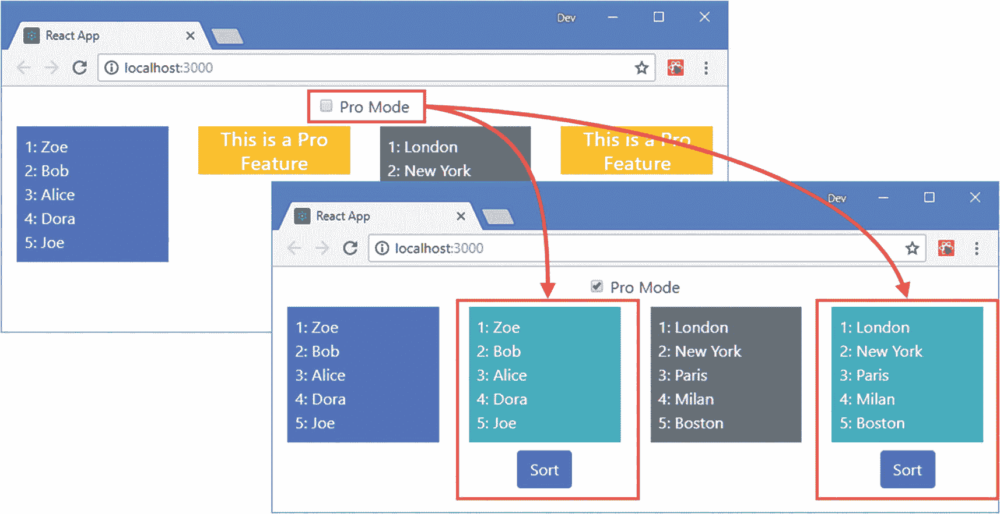

图 14-7

使用高阶元件

### 创建有状态的高阶组件

高阶组件可以是有状态的，这允许将更复杂的特性添加到应用中。我在`src`文件夹中添加了一个名为`ProController.js`的文件，并用它来定义清单 [14-17](#PC21) 中所示的 HOC。

```jsx
import React, { Component } from "react";
import { ProFeature } from "./ProFeature";

export function ProController(FeatureComponent) {

    const ProtectedFeature = ProFeature(FeatureComponent);

    return class extends Component {

        constructor(props) {
            super(props);
            this.state = {
                proMode: false
            }
        }

        toggleProMode = () => {
            this.setState({ proMode: !this.state.proMode});
        }

        render() {
            return (
                <div className="container-fluid">
                    <div className="row">
                        <div className="col-12 text-center p-2">
                            <div className="form-check">
                                <input type="checkbox" className="form-check-input"
                                    value={ this.state.proMode }
                                    onChange={ this.toggleProMode } />
                                <label className="form-check-label">Pro Mode</label>
                            </div>
                        </div>
                    </div>
                    <div className="row">
                        <div className="col-12">
                            <ProtectedFeature {...this.props}
                                 pro={ this.state.proMode } />
                        </div>
                    </div>
                </div>
            )
        }
    }
}

Listing 14-17The Contents of the ProController.js File in the src Folder

```

HOC 函数返回一个基于类的有状态组件，该组件提供复选框并使用`ProFeature` HOC 来控制包装组件的可见性。清单 [14-18](#PC22) 更新`App`组件以使用`ProController`组件。

```jsx
import React, { Component } from 'react';
import { GeneralList } from './GeneralList';
import { SortedList } from "./SortedList";

//import { ProFeature } from "./ProFeature";

import { ProController } from "./ProController";

const ProList = ProController(SortedList);

export default class App extends Component {

    constructor(props) {
        super(props);
        this.state = {
            names: ["Zoe", "Bob", "Alice", "Dora", "Joe"],
            cities: ["London", "New York", "Paris", "Milan", "Boston"],
            //proMode: false
        }
    }
    render() {
        return (
            <div className="container-fluid">
                <div className="row">
                    <div className="col-3">
                        <GeneralList list={ this.state.names } theme="primary" />
                    </div>
                    <div className="col-3">
                        <ProList list={ this.state.names }  />
                    </div>
                    <div className="col-3">
                        <GeneralList list={ this.state.cities } theme="secondary" />
                    </div>
                    <div className="col-3">
                        <ProList list={ this.state.cities }  />
                    </div>
                </div>
            </div>
        )
    }
}

Listing 14-18Using a New HOC in the App.js File in the src Folder

```

图 [14-8](#Fig8) 显示了 HOC 的效果，它为每个受保护的组件提供了自己的复选框。

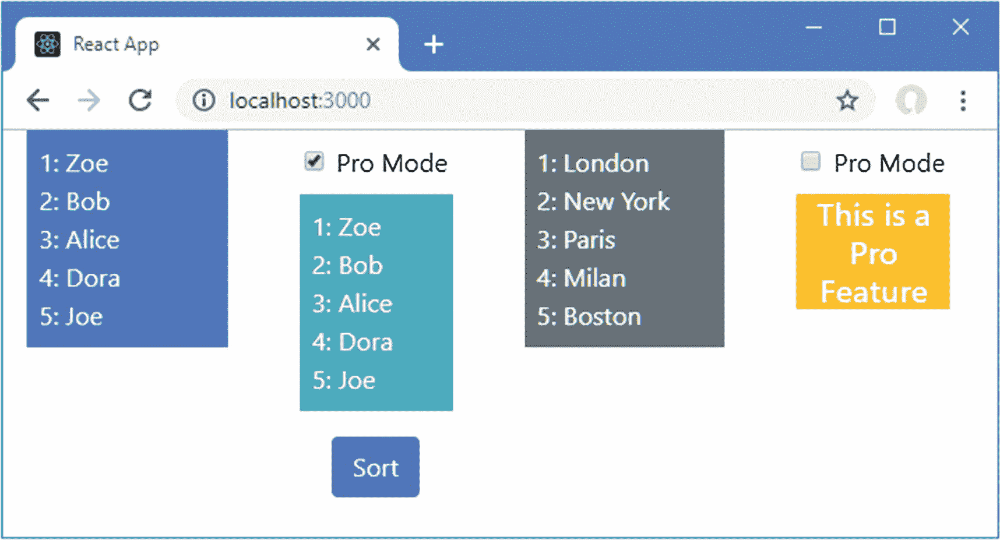

图 14-8

有状态的高阶组件

### 组合高阶分量

hoc 的一个有用特性是，它们可以通过只改变创建包装组件类的函数调用来组合。为了演示，我在`src`文件夹中添加了一个名为`LogToConsole.js`的文件，并用它来定义清单 [14-19](#PC23) 中所示的 HOC。

```jsx
import React, { Component } from "react";

export function LogToConsole(FeatureComponent, label, logMount, logRender, logUnmount) {
    return class extends Component {

        componentDidMount() {
            if (logMount) {
                console.log(`${label}: mount`);
            }
        }

        componentWillUnmount() {
            if (logUnmount) {
                console.log(`${label}: unmount`);
            }
        }

        render() {
            if (logRender) {
                console.log(`${label}: render`);
            }
            return <FeatureComponent { ...this.props } />
        }
    }
}

Listing 14-19The Contents of the LogToConsole.js File in the src Folder

```

HOC 函数接收将要包装的组件，以及用于将消息写入浏览器 JavaScript 控制台的标签参数。按照第 [11 章](11.html)中描述的有状态组件生命周期，还有三个参数指定当组件被挂载、呈现和卸载时是否会写入日志消息。为了应用新的特设，我只改变了创建包装组件的函数，如清单 [14-20](#PC24) 所示。

```jsx
import React, { Component } from 'react';
import { GeneralList } from './GeneralList';
import { SortedList } from "./SortedList";
//import { ProFeature } from "./ProFeature";
import { ProController } from "./ProController";

import { LogToConsole } from "./LogToConsole";

const ProList = ProController(LogToConsole(SortedList, "Sorted", true, true, true));

export default class App extends Component {

    constructor(props) {
        super(props);
        this.state = {
            names: ["Zoe", "Bob", "Alice", "Dora", "Joe"],
            cities: ["London", "New York", "Paris", "Milan", "Boston"],
            //proMode: false
        }
    }
    render() {
        return (
            <div className="container-fluid">
                <div className="row">
                    <div className="col-3">
                        <GeneralList list={ this.state.names }
                            theme="primary" />
                    </div>
                    <div className="col-3">
                        <ProList list={ this.state.names }  />
                    </div>
                    <div className="col-3">
                        <GeneralList list={ this.state.cities }
                            theme="secondary" />
                    </div>
                    <div className="col-3">
                        <ProList list={ this.state.cities }  />
                    </div>
                </div>
            </div>
        )
    }
}

Listing 14-20Combining HOCs in the App.js File in the src Folder

```

其效果是`SortedList`组件被`LogToConsole`组件包装，后者又被`ProFeature`组件包装。当您切换专业模式复选框时，您将在浏览器的 JavaScript 控制台中看到以下消息:

```jsx
...
Sorted: render
Sorted: mount
Sorted: unmount
...

```

## 使用渲染属性

一个*渲染属性*是一个函数属性，它为一个组件提供了它应该渲染的内容，提供了将一个组件包装在另一个组件中的替代模型。在清单 [14-21](#PC26) 中，我重写了`ProFeature`组件，使其使用渲染属性。

```jsx
import React from "react";

export function ProFeature(props) {

    if (props.pro) {
        return props.render();
    } else {
        return (
            <h5 className="bg-warning text-white text-center">
                This is a Pro Feature
            </h5>
        )
    }
}

Listing 14-21Using a Render Prop in the ProFeature.js File in the src Folder

```

使用渲染属性的组件以正常方式定义。不同之处在于`render`方法，其中调用名为`render`的函数 prop 来显示父节点提供的内容。

```jsx
...
return props.render();
...

```

父组件在应用组件时为`render`属性提供功能。在清单 [14-22](#PC28) 中，我已经修改了`App`组件，因此它为`ProFeature`组件提供了它所需要的功能。(为了简洁起见，我还删除了一些内容。)

### 小费

父母用来提供功能的属性的名字不一定是`render`，尽管这是惯例。您可以使用任何名称，只要它在父组件和子组件中应用一致即可。

```jsx
import React, { Component } from 'react';
import { GeneralList } from './GeneralList';
import { SortedList } from "./SortedList";

import { ProFeature } from "./ProFeature";

// import { ProController } from "./ProController";

// import { LogToConsole } from "./LogToConsole";

// const ProList = ProController(LogToConsole(SortedList, "Sorted", true, true));

export default class App extends Component {

    constructor(props) {
        super(props);
        this.state = {
            names: ["Zoe", "Bob", "Alice", "Dora", "Joe"],
            cities: ["London", "New York", "Paris", "Milan", "Boston"],
            proMode: false
        }
    }

    toggleProMode = () => {
        this.setState({ proMode: !this.state.proMode});
    }

    render() {
        return (
            <div className="container-fluid">
                <div className="row">
                    <div className="col-12 text-center p-2">
                        <div className="form-check">
                            <input type="checkbox" className="form-check-input"
                                value={ this.state.proMode }
                                onChange={ this.toggleProMode } />
                            <label className="form-check-label">Pro Mode</label>
                        </div>
                    </div>
                </div>
                <div className="row">
                    <div className="col-6">
                        <GeneralList list={ this.state.names }
                            theme="primary" />
                    </div>
                    <div className="col-6">
                        <ProFeature pro={ this.state.proMode }
                            render={ () => <SortedList list={ this.state.names } /> }
                        />
                    </div>
                </div>
            </div>
        )
    }
}

Listing 14-22Using a Render Prop in the App.js File in the src Folder

```

`ProFeature`组件提供了一个用于确定是否显示某个特性的`pro`属性和一个设置为返回`SortedList`元素的函数的`render`属性。

```jsx
...
<ProFeature pro={ this.state.proMode }
    render={ () => <SortedList list={ this.state.names } /> } />
...

```

当 React 呈现应用的内容时，`ProFeature`组件的`render`方法被调用，这又调用了`render` prop 函数，从而创建了一个新的`SortedList`组件。使用一个渲染属性可以达到与特设相同的效果，如图 [14-9](#Fig9) 所示。

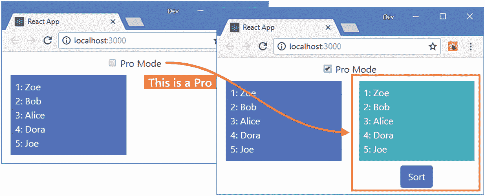

图 14-9

使用渲染属性

### 使用带参数的渲染属性

Render props 是常规的 JavaScript 函数，这意味着它们可以用参数调用。这本身就是一个有用的特性，但它也有助于理解上下文特性是如何工作的，我将在下一节中对此进行描述。

使用参数允许调用`render`属性的组件向包装器内容提供属性。这是一种通过示例更容易理解的技术。在清单 [14-23](#PC30) 中，我更改了`ProFeature`组件，以便它将一个字符串参数传递给`render` prop 函数。

```jsx
import React from "react";

export function ProFeature(props) {
    if (props.pro) {
        return props.render("Pro Feature");
    } else {
        return (
            <h5 className="bg-warning text-white text-center">
                This is a Pro Feature
            </h5>
        )
    }
}

Listing 14-23Adding an Argument in the ProFeature.js File in the src Folder

```

参数可以由定义 render prop 函数的组件接收，并在它产生的内容中使用，如清单 [14-24](#PC31) 所示。

```jsx
import React, { Component } from 'react';
import { GeneralList } from './GeneralList';
import { SortedList } from "./SortedList";
import { ProFeature } from "./ProFeature";

export default class App extends Component {

    constructor(props) {
        super(props);
        this.state = {
            names: ["Zoe", "Bob", "Alice", "Dora", "Joe"],
            cities: ["London", "New York", "Paris", "Milan", "Boston"],
            proMode: false
        }
    }

    toggleProMode = () => {
        this.setState({ proMode: !this.state.proMode});
    }

    render() {
        return (
            <div className="container-fluid">
                <div className="row">
                    <div className="col-12 text-center p-2">
                        <div className="form-check">
                            <input type="checkbox" className="form-check-input"
                                value={ this.state.proMode }
                                onChange={ this.toggleProMode } />
                            <label className="form-check-label">Pro Mode</label>
                        </div>
                    </div>
                </div>

                <div className="row">
                    <div className="col-6">
                        <GeneralList list={ this.state.names }
                            theme="primary" />
                    </div>
                    <div className="col-6">
                        <ProFeature pro={ this.state.proMode }
                            render={ text =>
                                <React.Fragment>
                                    <h4 className="text-center">{ text }</h4>
                                    <SortedList list={ this.state.names } />
                                </React.Fragment>
                            } />
                    </div>
                </div>
            </div>
        )
    }
}

Listing 14-24Receiving a Render Prop Argument in the App.js File in the src Folder

```

复选框被选中时产生的内容显示了`ProFeature`组件如何能够影响渲染属性功能产生的内容，如图 [14-10](#Fig10) 所示。

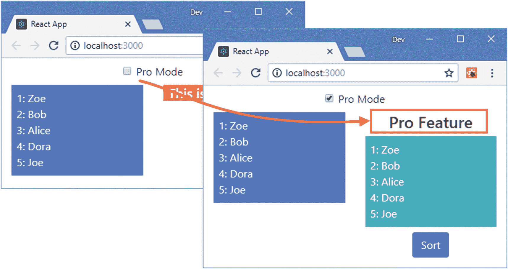

图 14-10

使用带参数的渲染属性

## 为全局数据使用上下文

不管您选择如何编写应用，属性的管理都会变得很困难。随着应用复杂性的增加，需要协作的组件数量也在增加。随着组件层次的增长，状态数据在应用中被提升到更高的位置，离使用该数据的地方更远，结果是每个组件都必须传递它不直接使用但它的后代依赖的属性。

为了帮助避免这个问题，React 提供了*上下文*特性，该特性允许状态数据从定义它的地方传递到需要它的地方，而不必通过中间组件进行中继。为了进行演示，我将使示例应用中的 Pro 模式更细粒度，这样它可以禁用排序按钮，而不是完全隐藏数据列表。

在清单 [14-25](#PC32) 中，我向由`ActionButton`组件呈现的按钮元素添加了一个属性，该组件基于一个属性设置`disabled`属性，并更改引导主题，使其在按钮被禁用时更加明显。

### 小费

Redux 包通常用于更复杂的项目，在大型应用中更容易使用。详见第 [19](19.html) 章和第 [20](20.html) 章。

```jsx
import React, { Component } from "react";

export class ActionButton extends Component {

    render() {
        return (
            <button className={ this.getClasses(this.props.proMode)}
                    disabled={ !this.props.proMode }
                    onClick={ this.props.callback }>
                { this.props.text }
            </button>
        )
    }

    getClasses(proMode) {
        let col = proMode ? this.props.theme : "danger";
        return `btn btn-${col} m-2`;
    }
}

Listing 14-25Disabling a Button in the ActionButton.js File in the src Folder

```

`ActionButton`所依赖的`proMode`属性是`App`组件状态的一部分，它也定义了用于改变其值的复选框。结果是组件链必须从它们的父组件接收`proMode`属性，并将其传递给它们的子组件。即使在简单的示例应用中，这也意味着`SortedList`组件必须传递`proMode`数据值，即使它不直接使用它，如图 [14-11](#Fig11) 所示。

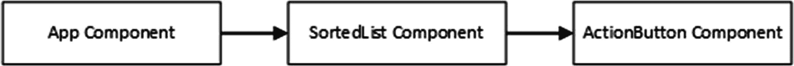

图 14-11

在示例应用中传递属性

这被称为*属性钻*或*属性线程*，其中数据值通过组件层次结构传递到可以使用它们的点。很容易忘记传递后代所需的属性，并且很难找出复杂应用中某个属性的线程在哪里遗漏了某个步骤。在清单 [14-26](#PC33) 中，我更新了`App`组件，从前面的部分中删除了`ProFeature`组件，并将`proMode`状态属性的值作为属性传递给`SortedList`组件，开始线程化属性的过程。

```jsx
import React, { Component } from 'react';
import { GeneralList } from './GeneralList';
import { SortedList } from "./SortedList";

//import { ProFeature } from "./ProFeature";

export default class App extends Component {

    constructor(props) {
        super(props);
        this.state = {
            names: ["Zoe", "Bob", "Alice", "Dora", "Joe"],
            cities: ["London", "New York", "Paris", "Milan", "Boston"],
            proMode: false
        }
    }

    toggleProMode = () => {
        this.setState({ proMode: !this.state.proMode});
    }

    render() {
        return (
            <div className="container-fluid">
                <div className="row">
                    <div className="col-12 text-center p-2">
                        <div className="form-check">
                            <input type="checkbox" className="form-check-input"
                                value={ this.state.proMode }
                                onChange={ this.toggleProMode } />
                            <label className="form-check-label">Pro Mode</label>
                        </div>
                    </div>
                </div>

                <div className="row">
                    <div className="col-6">
                        <GeneralList list={ this.state.names }
                            theme="primary" />
                    </div>
                    <div className="col-6">
                        <SortedList proMode={this.state.proMode}
                            list={ this.state.names } />
                    </div>
                </div>
            </div>
        )
    }
}

Listing 14-26Threading a Prop in the App.js File in the src Folder

```

`SortedList`组件不直接使用`proMode`属性，而是必须传递给`ActionButton`组件，完成属性线程，如清单 [14-27](#PC34) 所示。

```jsx
import React, { Component } from "react";
import { GeneralList } from "./GeneralList";
import { ActionButton } from "./ActionButton";

export class SortedList extends Component {

    constructor(props) {
        super(props);
        this.state = {
            sort: false
        }
    }

    getList() {
        return this.state.sort
            ? [...this.props.list].sort() : this.props.list;
    }

    toggleSort = () => {
        this.setState({ sort : !this.state.sort });
    }

    render() {
        return (
            <div>
                <GeneralList list={ this.getList() } theme="info" />
                <div className="text-center m-2">
                    <ActionButton theme="primary" text="Sort"
                        proMode={ this.props.proMode }
                        callback={this.toggleSort} />
                </div>
            </div>
        )
    }
}

Listing 14-27Threading a Prop in the SortedList.js File in the src Folder

```

结果是`proMode`状态值的值从`App`组件通过`SortedList`组件传递，并由`ActionButton`组件接收和使用，如图 [14-12](#Fig12) 所示。

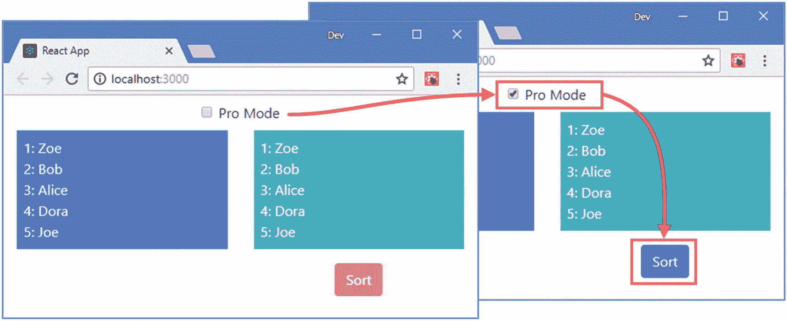

图 14-12

将属性穿入应用

上下文功能解决的就是这个问题，它允许将状态数据直接传递给使用它的组件，而不需要通过在层次结构中分隔它们的中间组件。

### 定义背景

第一步是定义上下文，这是分发状态数据的机制。可以在应用中的任何地方定义上下文。我在`src`文件夹中添加了一个名为`ProModeContext.js`的文件，代码如清单 [14-28](#PC35) 所示。

```jsx
import React from "react";

export const ProModeContext = React.createContext({
    proMode: false
})

Listing 14-28The Contents of the ProModeContext.js in the src Folder

```

`React.createContext`方法用于创建一个新的上下文，并提供了一个数据对象，用于指定上下文的默认值，这些值在使用上下文时会被覆盖，稍后我会演示。在清单中，我定义的上下文称为`ProModeContext`，它定义了一个`proMode`属性，默认为`false`。

### 创建上下文消费者

下一步是消费需要数据值的上下文，如清单 [14-29](#PC36) 所示。

```jsx
import React, { Component } from "react";

import { ProModeContext } from "./ProModeContext";

export class ActionButton extends Component {

    render() {
        return (
            <ProModeContext.Consumer>
                { contextData =>
                    <button
                        className={ this.getClasses(contextData.proMode)}
                        disabled={ !contextData.proMode }
                        onClick={ this.props.callback }>
                            { this.props.text }
                    </button>
                }
            </ProModeContext.Consumer>
        )
    }

    getClasses(proMode) {
        let col = proMode ? this.props.theme : "danger";
        return `btn btn-${col} m-2`;
    }
}

Listing 14-29Creating a Context Consumer in the ActionButton.js File in the src Folder

```

使用上下文类似于定义渲染属性，只是添加了一个自定义 HTML 元素来选择所需的上下文。首先是 HTML 元素，它的标记名是上下文名，后面是句点，再后面是`Consumer`，就像这样:

```jsx
...
return <ProModeContext.Consumer>

   // ...context can be consumed here...

</ProModeContext.Consumer>

...

```

在 HTML 元素的开始和结束标记之间是一个函数，它接收上下文对象并呈现依赖于它的内容。

```jsx
...
<ProModeContext.Consumer>
    { contextData =>
        <button
            className={ this.getClasses(contextData.proMode)}
            disabled={ !contextData.proMode }
            onClick={ this.props.callback }>
                { this.props.text }
        </button>
    }
</ProModeContext.Consumer>
...

```

组件仍然可以访问组件的状态和属性数据，这些数据可以与上下文提供的数据自由混合。在这个例子中，`callback`属性仍然用于处理`click`事件，而`proMode`上下文属性用于设置`className`和`disabled`属性的值。

### 创建上下文提供程序

最后一步是创建一个上下文提供者，它将源状态数据与上下文相关联，如清单 [14-30](#PC39) 所示。

```jsx
import React, { Component } from 'react';
import { GeneralList } from './GeneralList';
import { SortedList } from "./SortedList";

import { ProModeContext } from './ProModeContext';

export default class App extends Component {

    constructor(props) {
        super(props);
        this.state = {
            names: ["Zoe", "Bob", "Alice", "Dora", "Joe"],
            cities: ["London", "New York", "Paris", "Milan", "Boston"],
            //proMode: false,
            proContextData: {
                proMode: false
            }
        }
    }

    toggleProMode = () => {
        this.setState(state =>  state.proContextData.proMode
            = !state.proContextData.proMode);
    }

    render() {
        return (
            <div className="container-fluid">
                <div className="row">
                    <div className="col-12 text-center p-2">
                        <div className="form-check">
                            <input type="checkbox" className="form-check-input"
                                value={ this.state.proContextData.proMode }
                                onChange={ this.toggleProMode } />
                            <label className="form-check-label">Pro Mode</label>
                        </div>
                    </div>
                </div>
                <div className="row">
                    <div className="col-6">
                        <GeneralList list={ this.state.names }
                            theme="primary" />
                    </div>
                    <div className="col-6">
                        <ProModeContext.Provider value={ this.state.proContextData }>
                            <SortedList list={ this.state.names } />
                        </ProModeContext.Provider>
                    </div>
                </div>
            </div>
        )
    }
}

Listing 14-30Creating a Context Provider in the App.js File in the src Folder

```

我不想向上下文消费者公开所有的`App`组件的状态数据，所以我创建了一个嵌套的`proContextData`状态对象，它有一个`proMode`属性。为了应用上下文，使用了另一个定制的 HTML 元素，它带有上下文名称的标记名，后跟一个句点，再加上`Provider`。

```jsx
...

<ProModeContext.Provider value={ this.state.proContextData }>

    <SortedList list={ this.state.names } />

</ProModeContext.Provider>

...

```

`value`属性用于为上下文提供覆盖清单 [14-28](#PC35) 中定义的默认值的数据值，在本例中是`proContextData`状态对象。

### 小费

如果需要更新嵌套的状态属性，请使用接受函数的`setState`方法版本，如清单 [14-28](#PC35) 所示。参见第 [11 章](11.html)了解`setState`不同使用方式的详细信息。

在开始和结束标签`ProModeContext.Provider`之间定义的组件能够通过使用`ProModeContext.Consumer`元素直接访问状态数据。在示例应用中，这意味着`App`组件的`proMode`状态数据属性可以直接在`ActionButton`组件中获得，而不需要通过`SortedList`组件，如图 [14-13](#Fig13) 所示。

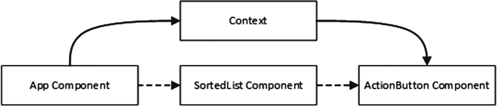

图 14-13

使用上下文分发状态数据属性的效果

### 更改使用者中的上下文数据值

上下文中的数据值是只读的，但是您可以在更新源状态数据的上下文对象中包含一个函数，从而创建一个等效的函数属性。在清单 [14-31](#PC41) 中，我为函数添加了一个占位符，如果提供者在不使用`value`属性的情况下应用内容，将会使用这个占位符。

```jsx
import React from "react";

export const ProModeContext = React.createContext({
    proMode: false,
    toggleProMode: () => {}
})

Listing 14-31Adding a Function in the ProModeContext.js file in the src Folder

```

该函数有一个空体，仅在使用者收到默认数据对象时用于防止错误。为了演示如何修改上下文数据值，我将创建一个组件来呈现用于切换 pro 模式的复选框。我在`src`文件夹中添加了一个名为`ProModeToggle.js`的文件，并用它来定义清单 [14-32](#PC42) 中所示的组件。

```jsx
import React, { Component } from "react";
import { ProModeContext } from "./ProModeContext";

export class ProModeToggle extends Component {

    render() {
        return <ProModeContext.Consumer>
            { contextData => (
                <div className="form-check">
                    <input type="checkbox" className="form-check-input"
                        value={ contextData.proMode }
                        onChange={ contextData.toggleProMode } />
                    <label className="form-check-label">
                        { this.props.label }
                    </label>
                </div>
                )
            }
        </ProModeContext.Consumer>
    }
}

Listing 14-32The Contents of the ProModeToggle.js File in the src Folder

```

该组件是一个上下文消费者，使用`proMode`属性来设置复选框的值，并在它发生变化时调用`toggleProMode`函数。该组件还使用一个属性来设置一个`label`元素的内容，只是为了显示一个使用上下文的组件仍然能够从其父组件接收属性。在清单 [14-33](#PC43) 中，我已经更新了`App`组件，这样它就可以使用`ProModeToggle`组件并为上下文提供一个函数。

### 警告

避免在提供者的`render`方法中为上下文创建对象的诱惑，这可能很有吸引力，因为它避免了创建嵌套状态对象和为状态属性分配方法的需要。每次调用`render`方法时创建一个新对象会破坏 React 应用于上下文的更改检测过程，并可能导致额外的更新。

```jsx
import React, { Component } from 'react';
import { GeneralList } from './GeneralList';
import { SortedList } from "./SortedList";
import { ProModeContext } from './ProModeContext';

import { ProModeToggle } from './ProModeToggle';

export default class App extends Component {

    constructor(props) {
        super(props);
        this.state = {
            names: ["Zoe", "Bob", "Alice", "Dora", "Joe"],
            cities: ["London", "New York", "Paris", "Milan", "Boston"],
            //proMode: false,
            proContextData: {
                proMode: false,
                toggleProMode: this.toggleProMode
            }
        }
    }

    toggleProMode = () => {
        this.setState(state =>  state.proContextData.proMode
            = !state.proContextData.proMode);
    }

    render() {
        return (
            <div className="container-fluid">
                <ProModeContext.Provider value={ this.state.proContextData }>
                    <div className="row">
                        <div className="col-12 text-center p-2">
                            <ProModeToggle label="Pro Mode" />
                        </div>
                    </div>
                    <div className="row">
                        <div className="col-6">
                            <GeneralList list={ this.state.names }
                                theme="primary" />
                        </div>
                        <div className="col-6">
                            <SortedList list={ this.state.names } />
                        </div>
                    </div>
                </ProModeContext.Provider>
            </div>
        )
    }
}

Listing 14-33Expanding the Context in the App.js File in the src Folder

```

为了提供一个既有状态数据又有函数的对象，我添加了一个属性，它的值是`toggleProMode`方法，允许上下文消费者更改状态数据属性的值，并在这样做时触发更新。注意，我已经提升了`ProModeContext.Provider`元素，这样`ProModeToggle`和`SortedList`组件都在范围内。这是可选的，我可以给每个子组件自己的上下文元素，只要`value`属性使用相同的对象。当您想要将上下文的多个实例与不同的组件组一起使用时，使用单独的元素会很有用，如清单 [14-34](#PC44) 所示。

```jsx
import React, { Component } from 'react';
//import { GeneralList } from './GeneralList';
import { SortedList } from "./SortedList";
import { ProModeContext } from './ProModeContext';
import { ProModeToggle } from './ProModeToggle';

export default class App extends Component {

    constructor(props) {
        super(props);
        this.state = {
            names: ["Zoe", "Bob", "Alice", "Dora", "Joe"],
            cities: ["London", "New York", "Paris", "Milan", "Boston"],
            proContextData: {
                proMode: false,
                toggleProMode: this.toggleProMode
            },
            superProContextData: {
                proMode: false,
                toggleProMode: this.toggleSuperMode
            }
        }
    }

    toggleProMode = () => {
        this.setState(state =>  state.proContextData.proMode
            = !state.proContextData.proMode);
    }

    toggleSuperMode = () => {
        this.setState(state =>  state.superProContextData.proMode
            = !state.superProContextData.proMode);
    }

    render() {
        return  (
            <div className="container-fluid">
                <div className="row">
                    <div className="col-6 text-center p-2">
                        <ProModeContext.Provider value={ this.state.proContextData }>
                            <ProModeToggle label="Pro Mode" />
                        </ProModeContext.Provider>
                    </div>
                    <div className="col-6 text-center p-2">
                        <ProModeContext.Provider
                                value={ this.state.superProContextData }>
                            <ProModeToggle label="Super Pro Mode" />
                        </ProModeContext.Provider>
                    </div>
                </div>
                <div className="row">
                    <div className="col-6">
                        <ProModeContext.Provider value={ this.state.proContextData }>
                            <SortedList list={ this.state.names } />
                        </ProModeContext.Provider>
                    </div>
                    <div className="col-6">
                        <ProModeContext.Provider
                                value={ this.state.superProContextData }>
                            <SortedList list={ this.state.cities } />
                        </ProModeContext.Provider>
                    </div>
                </div>
            </div>
        )
    }
}

Listing 14-34Using Multiple Contexts in the App.js File in the src Folder

```

`App`组件使用不同的上下文来管理两个专业级别，如图 [14-14](#Fig14) 所示。每个上下文都有自己的数据对象，React 跟踪每个对象的提供者和消费者。

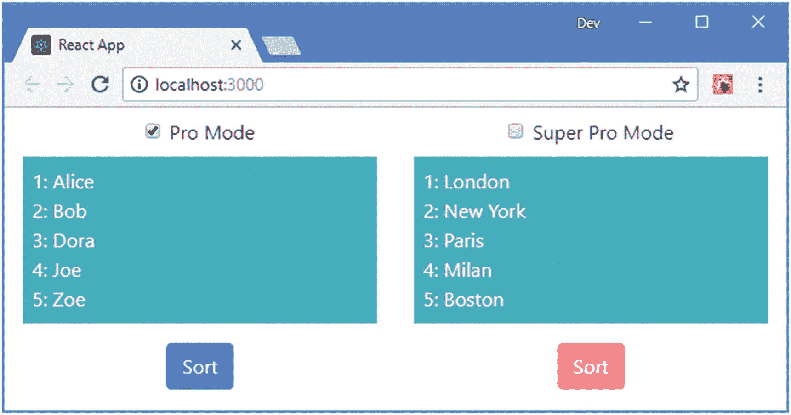

图 14-14

使用多种上下文

### 使用简化的上下文消费者 API

React 提供了另一种访问上下文的方法，比 render prop 函数更容易使用，如清单 [14-35](#PC45) 所示。

```jsx
import React, { Component } from "react";
import { ProModeContext } from "./ProModeContext";

export class ProModeToggle extends Component {
    static contextType = ProModeContext;

    render() {
        return (
            <div className="form-check">
                <input type="checkbox" className="form-check-input"
                    value={ this.context.proMode }
                    onChange={ this.context.toggleProMode } />
                <label className="form-check-label">
                    { this.props.label }
                </label>
            </div>
        )
    }
}

Listing 14-35Using the Simpler Context API in the ProModeToggle.js File in the src Folder

```

一个名为`contextType`的`static`属性被分配了上下文，该上下文作为`this.context`在整个组件中可用。这是 React 的一个相对较新的特性，但是它可能更容易使用，但要注意一个组件只能使用一个上下文。

#### 使用钩子消费上下文

`useContext`钩子为功能组件提供了与`contextType`属性相对应的属性。在清单 [14-36](#PC46) 中，我重写了`ProModeToggle`组件，将其定义为依赖于`useContext`钩子的函数。

```jsx
import React, { useContext } from "react";

import { ProModeContext } from "./ProModeContext";

export function ProModeToggle(props) {

    const context = useContext(ProModeContext);

    return (
        <div className="form-check">
            <input type="checkbox" className="form-check-input"
                value={ context.proMode }
                onChange={ context.toggleProMode } />
            <label className="form-check-label">
                { props.label }
            </label>
        </div>
    )
}

Listing 14-36Using a Hook in the ProModeToggle.js File in the src Folder

```

`useContext`函数返回一个上下文对象，通过它可以访问属性和函数。

## 定义误差边界

当组件在其 render 方法或生命周期方法中生成错误时，它会沿组件层次结构向上传播，直到到达应用的顶部，此时应用的所有组件都会被卸载。这意味着任何错误都可以有效地终止应用，这很少是理想的，特别是如果错误是应用可以恢复的。为了演示默认的错误处理行为，我修改了`ActionButton`组件，使它在第二次单击按钮元素时抛出一个错误，如清单 [14-37](#PC47) 所示。

```jsx
import React, { Component } from "react";
import { ProModeContext } from "./ProModeContext";

export class ActionButton extends Component {

    constructor(props) {
        super(props);
        this.state = {
            clickCount: 0
        }
    }

    handleClick = () => {
        this.setState({ clickCount: this.state.clickCount + 1});
        this.props.callback();
    }

    render() {
        return (
            <ProModeContext.Consumer>
                { contextData => {
                    if (this.state.clickCount > 1) {
                        throw new Error("Click Counter Error");
                    }
                    return <button
                        className={ this.getClasses(contextData.proMode)}
                        disabled={ !contextData.proMode }
                        onClick={ this.handleClick }>
                                { this.props.text }
                    </button>
                }}
            </ProModeContext.Consumer>
        )
    }

    getClasses(proMode) {
        let col = proMode ? this.props.theme : "danger";
        return `btn btn-${col} m-2`;
    }
}

Listing 14-37Throwing an Error in the ActionButton.js File in the src Folder

```

要查看默认行为，请启用其中一个复选框并单击相关按钮。当您第一次单击时，列表的顺序将会改变。再次点击会抛出错误，会看到如图 [14-15](#Fig15) 所示的响应。该消息在开发过程中显示，但在为部署构建应用时被禁用，如第 [8](08.html) 章所示。单击浏览器窗口右上角的关闭图标，您将看到应用的所有组件都已卸载，留下一个空的浏览器窗口。

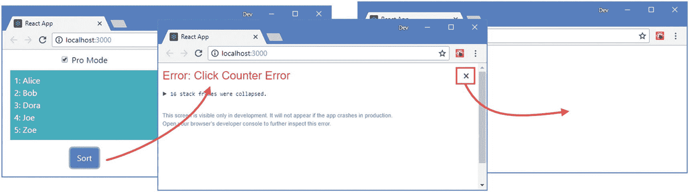

图 14-15

默认的错误处理

浏览器的 JavaScript 控制台显示错误的栈跟踪。

```jsx
...
Uncaught Error: Click Counter Error
    at ActionButton.js:23
    at updateContextConsumer (react-dom.development.js:13799)
    at beginWork (react-dom.development.js:13987)
    at performUnitOfWork (react-dom.development.js:16249)
...

```

### 创建误差边界组件

基于类的组件可以实现`componentDidCatch`生命周期方法，当子组件抛出错误时调用该方法。React 惯例是使用专用的错误处理组件，称为*错误边界*，它拦截错误，或者恢复应用以便它可以继续执行，或者向用户显示一条消息来指示问题的性质。我在`src`文件夹中添加了一个名为`ErrorBoundary.js`的文件，并用它来定义清单 [14-38](#PC49) 中所示的错误边界。

### 警告

错误边界仅适用于在生命周期方法中引发的错误，不响应在事件处理程序中引发的错误。错误边界也不能用于异步 HTTP 请求，必须使用一个`try` / `catch`块来代替，如第 3 部分所示。

```jsx
import React, { Component } from "react";

export class ErrorBoundary extends Component {

    constructor(props) {
        super(props);
        this.state = {
            errorThrown: false
        }
    }

    componentDidCatch = (error, info) => this.setState({ errorThrown: true});

    render() {
        return (
            <React.Fragment>
                { this.state.errorThrown &&
                    <h3 className="bg-danger text-white text-center m-2 p-2">
                        Error Detected
                    </h3>
                }
                { this.props.children }
            </React.Fragment>
        )
    }
}

Listing 14-38The Contents of the ErrorBoundary.js File in the src Folder

```

`componentDidCatch`方法接收由问题组件抛出的错误对象和提供组件栈跟踪的附加信息对象，这对日志记录很有用。

当使用错误边界时，React 将调用`componentDidCatch`方法，然后调用`render`方法。如第 [13](13.html) 章所述，使用组件生命周期的安装阶段处理由错误边界呈现的内容，以便创建所有组件的新实例。此序列允许错误边界更改呈现的内容以避免问题或更改应用的状态，以便错误不会再次发生。对于这个例子，我选择了第三个选项，即呈现相同的内容，但是显示一条消息，指出已经检测到错误。当由于应用范围之外的问题而出现错误时，例如无法从 web 服务获取数据时，可以使用这种方法。错误边界被应用为容器组件，如清单 [14-39](#PC50) 所示。

```jsx
import React, { Component } from "react";
import { GeneralList } from "./GeneralList";
import { ActionButton } from "./ActionButton";

import { ErrorBoundary } from "./ErrorBoundary";

export class SortedList extends Component {

    constructor(props) {
        super(props);
        this.state = {
            sort: false
        }
    }

    getList() {
        return this.state.sort
            ? [...this.props.list].sort() : this.props.list;
    }

    toggleSort = () => {
        this.setState({ sort : !this.state.sort });
    }

    render() {
        return (
            <div>
                <ErrorBoundary>
                    <GeneralList list={ this.getList() } theme="info" />
                    <div className="text-center m-2">
                        <ActionButton theme="primary" text="Sort"
                            proMode={ this.props.proMode }
                            callback={this.toggleSort} />
                    </div>
                </ErrorBoundary>
            </div>
        )
    }
}

Listing 14-39Applying an Error Boundary in the SortedList.js File in the src Folder

```

错误边界将处理由它包含的任何组件及其任何后代引发的错误。要查看效果，双击其中一个排序按钮并关闭错误警告消息，以查看指示已检测到错误的消息，如图 [14-16](#Fig16) 所示。

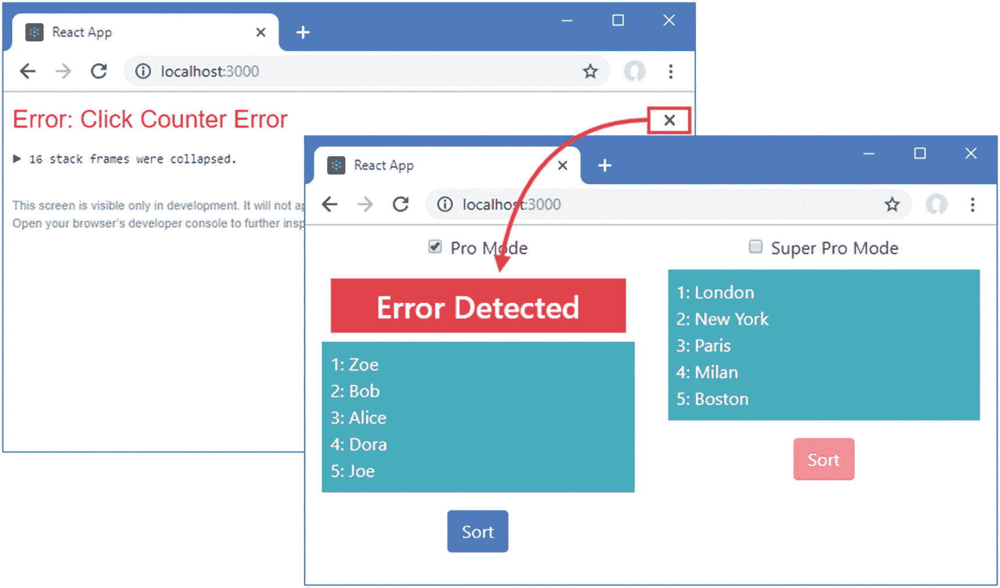

图 14-16

误差边界的影响

## 摘要

在这一章中，我描述了组合组件来组成应用的不同方式，包括容器、高阶组件和渲染属性。我还向您展示了如何使用上下文来分发全局数据和避免适当的线程，以及如何使用错误边界来处理组件生命周期方法中的问题。在下一章中，我将描述 React 提供的处理表单的特性。