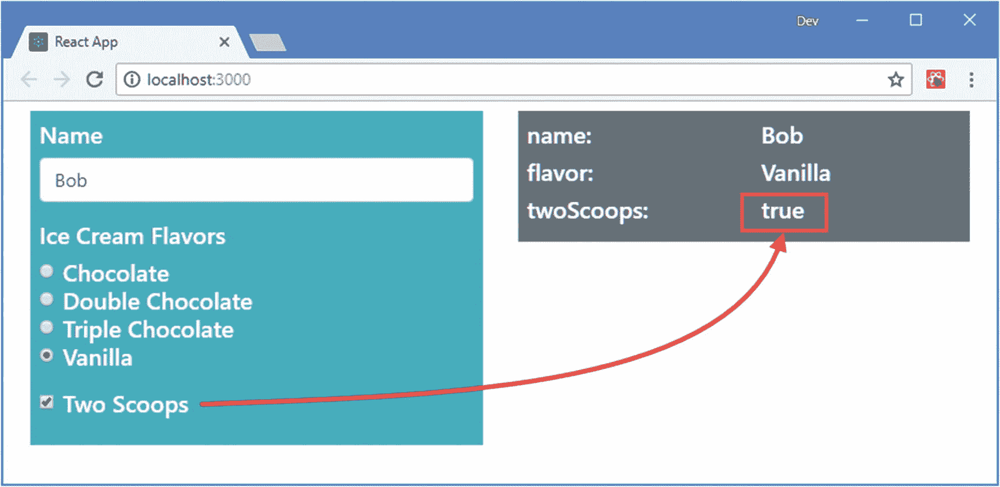

# 十五、表单和验证

表单允许应用从用户那里收集数据。在本章中，我将解释 React 如何处理表单元素，使用状态属性来设置它们的值，使用事件处理程序来响应用户交互。我将向您展示如何使用不同的元素类型，以及如何验证用户在表单中提供的数据，以便应用接收它可以使用的数据。表 [15-1](#Tab1) 将表单和验证放在上下文中。

表 15-1

将表单和验证放在上下文中

<colgroup><col class="tcol1 align-left"> <col class="tcol2 align-left"></colgroup> 
| 

问题

 | 

回答

 |
| --- | --- |
| 它们是什么？ | 表单是允许应用提示用户输入数据的基本机制。验证是检查数据以确保应用可以使用该数据的过程。 |
| 它们为什么有用？ | 大多数应用都需要用户输入某种程度的数据，比如电子邮件地址、付款细节或送货地址。表单允许用户以自由文本形式或从一系列预定义选项中选择来输入数据。验证用于确保数据的格式符合应用的预期并且可以处理。 |
| 它们是如何使用的？ | 在这一章中，我描述了被控制的表单元素，它们的值是使用`value`或`checked`属性来设置的，它们的`change`事件被用来处理用户的编辑或选择。这些功能也用于验证。 |
| 有什么陷阱或限制吗？ | 不同表单元素的行为方式有所不同，React 和标准 HTML 表单元素之间也有细微的差异，这将在后面的章节中介绍。 |
| 还有其他选择吗？ | 应用根本不需要使用表单元素。在某些应用中，不受控制的表单元素可能是更合适的选择，因为 React 不负责管理元素的数据，如第 [16](16.html) 章所述。 |

表 [15-2](#Tab2) 总结了本章内容。

表 15-2

章节总结

<colgroup><col class="tcol1 align-left"> <col class="tcol2 align-left"> <col class="tcol3 align-left"></colgroup> 
| 

问题

 | 

解决办法

 | 

列表

 |
| --- | --- | --- |
| 向组件添加表单元素 | 将元素添加到由组件呈现的内容中。使用`value`属性设置元素的初始值，并使用`onChange`属性响应变化。 | 1–10, 12, 13 |
| 确定复选框的状态 | 处理变更事件时，检查`target`元素的 checked 属性 | Eleven |
| 验证表单数据 | 定义验证规则，并在用户编辑字段和触发更改事件时应用这些规则 | 14–25 |

## 为本章做准备

为了创建本章的示例项目，打开一个新的命令提示符，导航到一个方便的位置，并运行清单 [15-1](#PC1) 中所示的命令。

### 小费

你可以从 [`https://github.com/Apress/pro-react-16`](https://github.com/Apress/pro-react-16) 下载本章以及本书其他章节的示例项目。

```jsx
npx create-react-app forms

Listing 15-1Creating the Example Project

```

运行清单 [15-2](#PC2) 中所示的命令，导航到`forms`文件夹，将引导包和验证包添加到项目中。(我使用“验证表单数据”一节中的验证包。)

```jsx
cd forms
npm install bootstrap@4.1.2
npm install validator@10.7.1

Listing 15-2Adding Packages to the Project

```

为了在应用中包含引导 CSS 样式表，将清单 [15-3](#PC3) 中所示的语句添加到`index.js`文件中，该文件可以在`src`文件夹中找到。

```jsx
import React from 'react';
import ReactDOM from 'react-dom';
import './index.css';
import App from './App';
import * as serviceWorker from './serviceWorker';

import 'bootstrap/dist/css/bootstrap.css';

ReactDOM.render(<App />, document.getElementById('root'));

// If you want your app to work offline and load faster, you can change
// unregister() to register() below. Note this comes with some pitfalls.
// Learn more about service workers: http://bit.ly/CRA-PWA
serviceWorker.unregister();

Listing 15-3Including Bootstrap in the index.js File in the src Folder

```

### 定义示例组件

在`src`文件夹中添加一个名为`Editor.js`的文件，并添加清单 [15-4](#PC4) 所示的内容。

```jsx
import React, { Component } from "react";

export class Editor extends Component {

    render() {
        return <div className="h5 bg-info text-white p-2">
                    Form Will Go Here
                </div>
    }
}

Listing 15-4The Contents of the Editor.js File in the src Folder

```

我将使用这个组件向用户显示一个表单。然而，首先，该组件呈现一个占位符消息。接下来，将名为`Display.js`的文件添加到`src`文件夹中，并添加清单 [15-5](#PC5) 中所示的内容。

```jsx
import React, { Component } from "react";

export class Display extends Component {

    formatValue = (data) => Array.isArray(data)
        ? data.join(", ") : data.toString();

    render() {
        let keys = Object.keys(this.props.data);
        if (keys.length === 0) {
            return <div className="h5 bg-secondary p-2 text-white">
                No Data
            </div>
        } else {
            return <div className="container-fluid bg-secondary p-2">
                    { keys.map(key =>
                        <div key={key} className="row h5 text-white">
                            <div className="col">{ key }:</div>
                            <div className="col">
                                { this.formatValue(this.props.data[key]) }
                            </div>
                        </div>
                    )}
                </div>
        }
    }
}

Listing 15-5The Contents of the Display.js File in the src Folder

```

该组件接收一个`data`属性，并在网格中枚举它的属性和值。最后，更改`App.js`文件中的内容，用清单 [15-6](#PC6) 中所示的组件替换创建项目时添加的内容。

```jsx
import React, { Component } from "react";
import { Editor } from "./Editor";
import { Display } from "./Display";

export default class App extends Component {

    constructor(props) {
        super(props);
        this.state = {
            formData: {}
        }
    }

    submitData = (newData) => {
        this.setState({ formData: newData});
    }

    render() {
        return <div className="container-fluid">
            <div className="row p-2">
                <div className="col-6">
                    <Editor submit={ this.submitData } />
                </div>
                <div className="col-6">
                    <Display data={ this.state.formData } />
                </div>
            </div>
        </div>
    }
}

Listing 15-6The Contents of the App.js File in the src Folder

```

### 启动开发工具

使用命令提示符，运行`forms`文件夹中清单 [15-7](#PC7) 所示的命令来启动开发工具。

```jsx
npm start

Listing 15-7Starting the Development Tools

```

一旦项目的初始准备工作完成，一个新的浏览器窗口将打开并显示 URL `http://localhost:3000`，它显示如图 [15-1](#Fig1) 所示的内容。


图 15-1

运行示例应用

## 使用表单元素

使用表单元素最简单的方法是使用状态和事件特性，在前面章节描述的 React 功能的基础上进行构建。其结果就是所谓的*受控组件*，这在之前的例子中已经很熟悉了。在清单 [15-8](#PC8) 中，我添加了一个`input`元素，它的内容由 React to`Editor`组件管理。

### 小费

还有一种方法叫做*非受控组件*，我在第 16 章[中描述过。](16.html)

```jsx
import React, { Component } from "react";

export class Editor extends Component {

    constructor(props) {
        super(props);
        this.state = {
            name: ""
        }
    }

    updateFormValue = (event) => {
        this.setState({ [event.target.name]: event.target.value },
            () => this.props.submit(this.state));
    }

    render() {
        return <div className="h5 bg-info text-white p-2">
                    <div className="form-group">
                        <label>Name</label>
                        <input className="form-control"
                            name="name"
                            value={ this.state.name }
                            onChange={ this.updateFormValue } />
                    </div>
                </div>
    }
}

Listing 15-8Adding a Form Element in the Editor.js File in the src Folder

```

使用`name`状态属性设置`input`元素的`value`属性，使用`updateFormValue`方法处理更改，该方法是使用`onChange`属性选择的。大多数表单需要多个字段，与其为每个字段定义不同的事件处理方法，不如使用一种方法，并确保表单元素被配置为指示与哪个状态值相关联。在这个例子中，我使用了`name`属性来指定 state 属性的名称，然后我从 handler 方法接收的事件中读取这个名称:

```jsx
...
updateFormValue = (event) => {
    this.setState({ [event.target.name]: event.target.value },
        () => this.props.submit(this.state));
}
...

```

方括号中的内容(`[`和`]`字符)被求值以获得状态更新的属性名，这允许我通过`setState`方法使用来自`event.target`对象的`name`属性。正如您将在后面的示例中看到的，并非所有类型的表单元素都能以相同的方式处理，但是这种方法减少了组件中事件处理方法的数量。

### 小费

如果希望向用户显示一个空的`input`元素，请将 state 属性设置为空字符串(`""`)。你可以在清单 [15-8](#PC8) 中看到空元素的例子。不要使用`null`或`undefined`，因为这些值会导致 React 在浏览器的 JavaScript 控制台中生成警告。

注意，在状态数据更新后，我使用了由`setState`方法提供的回调选项来调用`submit`函数 prop，这允许我将表单数据发送到父组件。这意味着`Editor`组件的状态数据的任何变化也会被推送到`App`组件，这样它就可以被`Display`组件显示出来，结果是输入到`input`元素中的数据会立即反映在呈现给用户的内容中，如图 [15-2](#Fig2) 所示。这看起来像是不必要的状态数据复制，但是它将允许我在本章后面更容易地实现验证特性。


图 15-2

使用受控组件

### 使用选择元素

一旦基本结构就绪，控制器组件就可以轻松地支持其他表单元素。在清单 [15-9](#PC10) 中，我向`Editor`组件添加了两个`select`元素。

```jsx
import React, { Component } from "react";

export class Editor extends Component {

    constructor(props) {
        super(props);
        this.state = {
            name: "Bob",
            flavor: "Vanilla",
            toppings: ["Strawberries"]
        }

        this.flavors = ["Chocolate", "Double Chocolate",
            "Triple Chocolate", "Vanilla"];
        this.toppings = ["Sprinkles", "Fudge Sauce",
                            "Strawberries", "Maple Syrup"]
    }

    updateFormValue = (event) => {
        this.setState({ [event.target.name]: event.target.value },
            () => this.props.submit(this.state));
    }

    updateFormValueOptions = (event) => {
        let options = [...event.target.options]
            .filter(o => o.selected).map(o => o.value);
        this.setState({ [event.target.name]: options },
            () => this.props.submit(this.state));
    }

    render() {
        return <div className="h5 bg-info text-white p-2">
                    <div className="form-group">
                        <label>Name</label>
                        <input className="form-control"
                            name="name"
                            value={ this.state.name }
                            onChange={ this.updateFormValue } />
                    </div>
                    <div className="form-group">
                        <label>Ice Cream Flavors</label>
                        <select className="form-control"
                                name="flavor" value={ this.state.flavor }
                                onChange={ this.updateFormValue } >
                            { this.flavors.map(flavor =>
                                <option value={ flavor } key={ flavor }>
                                    { flavor }
                                </option>
                            )}
                        </select>
                    </div>
                    <div className="form-group">
                        <label>Ice Cream Toppings</label>
                        <select className="form-control" multiple={true}
                                name="toppings" value={ this.state.toppings }
                                onChange={ this.updateFormValueOptions }>
                            { this.toppings.map(top =>
                                <option value={ top } key={ top }>
                                    { top }
                                </option>
                            )}
                        </select>
                    </div>
                </div>
    }
}

Listing 15-9Adding Select Elements in the Editor.js File in the src Folder

```

虽然需要注意显示多个值的元素，但是`select`元素很容易使用。对于一个基本的`select`元素，`value`属性用于设置选择的值，选择使用`onChange`属性处理。由`select`元素表示的`option`元素可以被指定为常规的 HTML 元素，或者以编程方式生成，在这种情况下，它们将需要一个`key`属性，如下所示:

```jsx
...
<select className="form-control" name="flavor" value={ this.state.flavor }
        onChange={ this.updateFormValue } >
    { this.flavors.map(flavor =>
        <option value={ flavor } key={ flavor }>{ flavor }</option>
    )}
</select>
...

```

对呈现单个选择项的`select`元素的更改可以使用为`input`元素定义的相同方法来处理，因为选择的值是通过`event.target.value`属性访问的。

#### 使用表示多个项目的选择元素

允许多重选择的元素需要更多的工作。定义元素时，使用表达式将`multiple`属性设置为`true`。

```jsx
...
<select className="form-control" multiple={true} name="toppings"
    value={ this.state.toppings } onChange={ this.updateFormValueOptions }>
...

```

使用表达式可以避免一个常见的问题，即给`multiple`属性分配一个字符串值会启用多个元素，即使字符串是`"false"`。处理用户的选择需要一个不同的处理`change`事件的方法，如下所示:

```jsx
...
updateFormValueOptions = (event) => {
    let options = [...event.target.options]
        .filter(o => o.selected).map(o => o.value);
    this.setState({ [event.target.name]: options },
        () => this.props.submit(this.state));
}
...

```

用户所做的选择是通过`event.target.options`属性访问的，其中所选择的项目有一个值为`true`的`selected`属性。在清单中，我从选项中创建了一个数组，使用`filter`方法获取选择的项目，使用`map`方法获取`value`属性，这留下了一个数组，其中包含每个选择的`option`元素的`value`属性的值。两个`select`元件都可以在图 [15-3](#Fig3) 中看到。(在您做出更改之前，`Display`组件不会显示数据。)


图 15-3

使用选择元素

### 使用单选按钮

使用单选按钮需要与文本化`input`元素类似的过程，其中用户的选择可以通过目标元素的`value`属性来访问，如清单 [15-10](#PC14) 所示。

```jsx
import React, { Component } from "react";

export class Editor extends Component {

    constructor(props) {
        super(props);
        this.state = {
            name: "Bob",
            flavor: "Vanilla"
        }

        this.flavors = ["Chocolate", "Double Chocolate",
            "Triple Chocolate", "Vanilla"];
        this.toppings = ["Sprinkles", "Fudge Sauce",
                            "Strawberries", "Maple Syrup"]
    }

    updateFormValue = (event) => {
        this.setState({ [event.target.name]: event.target.value },
            () => this.props.submit(this.state));
    }

    render() {
        return <div className="h5 bg-info text-white p-2">
                    <div className="form-group">
                        <label>Name</label>
                        <input className="form-control"
                            name="name"
                            value={ this.state.name }
                            onChange={ this.updateFormValue } />
                    </div>

                    <div className="form-group">
                        <label>Ice Cream Flavors</label>
                        { this.flavors.map(flavor =>
                            <div className="form-check" key={ flavor }>
                                <input className="form-check-input"
                                    type="radio" name="flavor"
                                    value={ flavor }
                                    checked={ this.state.flavor === flavor }
                                    onChange={ this.updateFormValue } />
                                <label className="form-check-label">
                                    { flavor }
                                </label>
                            </div>
                        )}
                    </div>
                </div>
    }
}

Listing 15-10Using Radio Buttons in the Editor.js File in the src Folder

```

单选按钮允许用户从选项列表中选择单个值。单选按钮代表的选择由其`value`属性指定，其`checked`属性用于确保元素被正确选择，如图 [15-4](#Fig4) 所示。


图 15-4

使用单选按钮来提供选择

### 使用复选框

复选框需要不同的方法，因为必须读取目标元素的`checked`属性来确定用户是否选中了该元素，如清单 [15-11](#PC15) 所示。

```jsx
import React, { Component } from "react";

export class Editor extends Component {

    constructor(props) {
        super(props);
        this.state = {
            name: "Bob",
            flavor: "Vanilla",
            twoScoops: false
        }

        this.flavors = ["Chocolate", "Double Chocolate",
            "Triple Chocolate", "Vanilla"];
        this.toppings = ["Sprinkles", "Fudge Sauce",
                            "Strawberries", "Maple Syrup"]
    }

    updateFormValue = (event) => {
        this.setState({ [event.target.name]: event.target.value },
            () => this.props.submit(this.state));
    }

    updateFormValueCheck = (event) => {
        this.setState({ [event.target.name]: event.target.checked },
            () => this.props.submit(this.state));
    }

    render() {
        return <div className="h5 bg-info text-white p-2">
                    <div className="form-group">
                        <label>Name</label>
                        <input className="form-control"
                            name="name"
                            value={ this.state.name }
                            onChange={ this.updateFormValue } />
                    </div>

                    <div className="form-group">
                        <label>Ice Cream Flavors</label>
                        { this.flavors.map(flavor =>
                            <div className="form-check" key={ flavor }>
                                <input className="form-check-input"
                                    type="radio" name="flavor"
                                    value={ flavor }
                                    checked={ this.state.flavor === flavor }
                                    onChange={ this.updateFormValue } />
                                <label className="form-check-label">
                                    { flavor }
                                </label>
                            </div>
                        )}
                    </div>

                    <div className="form-group">
                        <div className="form-check">
                            <input className="form-check-input"
                                type="checkbox" name="twoScoops"
                                checked={ this.state.twoScoops }
                                onChange={ this.updateFormValueCheck } />
                            <label className="form-check-label">Two Scoops</label>
                        </div>
                    </div>
                </div>
    }
}

Listing 15-11Using a Checkbox in the Editor.js File in the src Folder

```

`checked`属性用于指定复选框显示时是否被选中，`checked`属性用于处理`change`事件时确定用户是否选中该元素，如图 [15-5](#Fig5) 所示。



图 15-5

使用复选框

### 使用复选框填充数组

复选框也可以用来填充数组，允许用户从相关选项中进行选择，这种方式可能比多选`select`元素更熟悉，如清单 [15-12](#PC16) 所示。

```jsx
import React, { Component } from "react";

export class Editor extends Component {

    constructor(props) {
        super(props);
        this.state = {
            name: "",
            flavor: "Vanilla",
            toppings: ["Strawberries"]
        }

        this.flavors = ["Chocolate", "Double Chocolate",
            "Triple Chocolate", "Vanilla"];
        this.toppings = ["Sprinkles", "Fudge Sauce",
                            "Strawberries", "Maple Syrup"]
    }

    updateFormValue = (event) => {
        this.setState({ [event.target.name]: event.target.value },
            () => this.props.submit(this.state));
    }

    updateFormValueCheck = (event) => {
        event.persist();
        this.setState(state => {
            if (event.target.checked) {
                state.toppings.push(event.target.name);
            } else {
                let index = state.toppings.indexOf(event.target.name);
                state.toppings.splice(index, 1);
            }
        }, () => this.props.submit(this.state));
    }

    render() {
        return <div className="h5 bg-info text-white p-2">
                    <div className="form-group">
                        <label>Name</label>
                        <input className="form-control"
                            name="name"
                            value={ this.state.name }
                            onChange={ this.updateFormValue } />
                    </div>

                    <div className="form-group">
                        <label>Ice Cream Toppings</label>
                        { this.toppings.map(top =>
                            <div className="form-check" key={ top }>
                                <input className="form-check-input"
                                    type="checkbox" name={ top }
                                    value={ this.state[top] }
                                    checked={ this.state.toppings.indexOf(top) > -1 }
                                    onChange={ this.updateFormValueCheck } />
                                <label className="form-check-label">{ top }</label>
                            </div>
                        )}
                    </div>
                </div>
    }
}

Listing 15-12Using Related Checkboxes in the Editor.js File in the src Folder

```

元素以同样的方式生成，但是需要对`updateFormValueCheck`方法进行修改来管理`toppings`数组的内容，以便它只包含用户选择的值。标准的 JavaScript 数组特性用于在相应的复选框未选中时从数组中移除一个值，并在复选框被选中时添加一个值，产生如图 [15-6](#Fig6) 所示的结果。


图 15-6

使用复选框填充数组

### 使用文本区域

与常规 HTML 不同，`textarea`元素的内容是使用`value`属性来设置和读取的。在清单 [15-13](#PC17) 中，我向示例应用添加了一个`textarea`元素，并使用`onChange`处理程序来响应编辑。

```jsx
import React, { Component } from "react";

export class Editor extends Component {

    constructor(props) {
        super(props);
        this.state = {
            name: "Bob",
            order: ""
        }
    }

    updateFormValue = (event) => {
        this.setState({ [event.target.name]: event.target.value },
            () => this.props.submit(this.state));
    }

    render() {
        return <div className="h5 bg-info text-white p-2">
                    <div className="form-group">
                        <label>Name</label>
                        <input className="form-control"
                            name="name"
                            value={ this.state.name }
                            onChange={ this.updateFormValue } />
                    </div>

                    <div className="form-group">
                        <label>Order</label>
                        <textarea className="form-control" name="order"
                            value={ this.state.order }
                            onChange={ this.updateFormValue } />
                    </div>
                </div>
    }
}

Listing 15-13Using a Text Area in the Editor.js File in the src Folder

```

可以通过我最初为文本输入元素定义的相同方法来处理更改，清单产生如图 [15-7](#Fig7) 所示的结果。


图 15-7

使用文本区域元素

## 验证表单数据

用户几乎可以在表单域中输入任何内容，要么是因为他们犯了错误，要么是因为他们试图跳过表单而不填写，如侧栏中所述。验证检查用户提供的数据，以确保应用拥有可以使用的数据。在接下来的小节中，我将向您展示如何在 React 应用中执行表单验证。

### 尽量减少表单的使用

用户将错误数据输入表单的一个原因是他们不认为结果有价值。当表单用一些不重要的东西打断了对用户来说很重要的过程时，就会发生这种情况，例如在阅读文章时出现创建帐户的干扰性提示，或者在用户经常执行的过程开始时出现相同的表单。

当用户不重视表单时，验证没有用，因为他们只是输入了通过检查的坏数据，但仍然是坏数据。如果你发现你的电子邮件地址的打扰式提示导致了大量的`a@a.com`回复，那么你应该考虑到你的用户并不认为你的每周简讯和你一样有趣。

尽量少用表单，只在用户认为有用的过程中使用，比如提供送货地址。对于其他表单，找到一种替代的方式向用户请求数据，这种方式不会中断他们的工作流，也不会在他们每次尝试执行任务时打扰他们。

验证表单时，验证过程的不同部分可以分布在复杂的 HTML 和组件层次结构中。我将使用上下文来跟踪验证问题，而不是使用线程来连接不同的部分。我在`src`文件夹中添加了一个名为`ValidationContext.js`的文件，内容如清单 [15-14](#PC18) 所示。(上下文在第 14 章[中描述。)](14.html)

### 注意

本节中的例子依赖于清单 [15-2](#PC2) 中添加到项目中的`validator`包。如果您跳过了安装，您应该返回并添加软件包，然后再继续这些示例。

```jsx
import React from "react";

export const ValidationContext = React.createContext({
    getMessagesForField: (field) => []
})

Listing 15-14The Contents of the ValidationContext.js File in the src Folder

```

我将把每个表单元素的验证问题存储为一个数组，并在元素旁边显示每个问题的消息。上下文提供了对一个函数的访问，该函数将返回特定字段的验证消息。

### 定义验证规则

接下来，我在`src`文件夹中添加了一个名为`validation.js`的文件，并添加了清单 [15-15](#PC19) 中所示的代码。这是验证表单数据的代码，使用本章开始时安装的`validator`包。

```jsx
import validator from "validator";

export function ValidateData(data, rules) {
    let errors = {};
    Object.keys(data).forEach(field => {
        if (rules.hasOwnProperty(field)) {
            let fielderrors = [];
            let val = data[field];
            if (rules[field].required && validator.isEmpty(val)) {
                fielderrors.push("Value required");
            }
            if (!validator.isEmpty(data[field])) {
                if (rules[field].minlength
                        && !validator.isLength(val, rules[field].minlength)) {
                    fielderrors.push(`Enter at least ${rules[field].minlength}`
                        + " characters");
                }
                if (rules[field].alpha && !validator.isAlpha(val)) {
                    fielderrors.push("Enter only letters");
                }
                if (rules[field].email && !validator.isEmail(val)) {
                    fielderrors.push("Enter a valid email address");
                }
            }
            if (fielderrors.length > 0) {
                errors[field] = fielderrors;
            }
        }
    })
    return errors;
}

Listing 15-15The Contents of the validation.js File in the src Folder

```

`ValidateData`函数将接收一个属性为表单值的对象和一个指定要应用的验证规则的对象。`validation`包提供了可用于执行各种检查的方法，但是我在这个例子中只关注四个验证检查:确保用户提供了一个值，确保最小长度，确保有效的电子邮件地址，以及确保只使用字母字符。表 [15-3](#Tab3) 描述了我在下面的例子中使用的验证包提供的方法。查看 [`https://www.npmjs.com/package/validator`](https://www.npmjs.com/package/validator) 了解验证器包提供的全部功能。

表 15-3

验证器方法

<colgroup><col class="tcol1 align-left"> <col class="tcol2 align-left"></colgroup> 
| 

名字

 | 

描述

 |
| --- | --- |
| `isEmpty` | 如果值是空字符串，此方法返回 true。 |
| `isLength` | 如果值超过最小长度，此方法返回 true。 |
| `isAlpha` | 如果值只包含字母，此方法返回 true。 |
| `isEmail` | 如果值是有效的电子邮件地址，此方法返回 true。 |
| `isEqual` | 如果两个值相同，此方法返回 true。 |

### 创建容器组件

为了创建验证组件，我在`src`文件夹中添加了一个名为`FormValidator.js`的文件，并用它来定义清单 [15-16](#PC20) 中所示的组件。

```jsx
import React, { Component } from "react";
import { ValidateData } from "./validation";
import { ValidationContext } from "./ValidationContext";

export class FormValidator extends Component {

    constructor(props) {
        super(props);
        this.state = {
            errors: {},
            dirty: {},
            formSubmitted: false,
            getMessagesForField: this.getMessagesForField
        }
    }

    static getDerivedStateFromProps(props, state) {
        return {
            errors: ValidateData(props.data, props.rules)
        };
    }

    get formValid() {
        return Object.keys(this.state.errors).length === 0;
    }

    handleChange = (ev) => {
        let name = ev.target.name;
        this.setState(state => state.dirty[name] = true);
    }

    handleClick = (ev) => {
        this.setState({ formSubmitted: true }, () => {
            if (this.formValid) {
                this.props.submit(this.props.data)
            }
        });
    }

    getButtonClasses() {
        return this.state.formSubmitted && !this.formValid
            ? "btn-danger" : "btn-primary";
    }

    getMessagesForField = (field) => {
        return (this.state.formSubmitted || this.state.dirty[field]) ?
            this.state.errors[field] || [] : []
    }

    render() {
        return <React.Fragment>
            <ValidationContext.Provider value={ this.state }>
                <div onChange={ this.handleChange }>
                    { this.props.children }
                </div>
            </ValidationContext.Provider>

            <div className="text-center">
                <button className={ `btn ${ this.getButtonClasses() }`}
                        onClick={ this.handleClick }
                        disabled={ this.state.formSubmitted && !this.formValid } >
                    Submit
                </button>
            </div>
        </React.Fragment>
    }
}

Listing 15-16The Contents of the FormValidator.js File in the src Folder

```

验证是在`getDerivedStateFromProps`生命周期方法中执行的，该方法为组件提供了一个变更，以便根据它接收到的属性对其状态进行更改。该组件接收一个包含要验证的表单数据的`data`属性和一个定义应该应用的验证检查的`rules`属性，并将它们传递给清单 [15-15](#PC19) 中定义的`ValidateData`函数。`ValidateData`函数的结果被分配给`state.errors`属性，它是一个对象，每个有验证问题的表单字段都有一个属性，还有一组应该显示给用户的消息。

在用户开始编辑字段或尝试提交表单之前，不应开始表单验证。如第 [12 章](12.html)所述，当`change`事件从组件包含的表单元素中冒泡时，通过监听该事件来处理单独的编辑。

```jsx
...
<div onChange={ this.handleChange }>
    { this.props.children }
</div>
...

```

`handleChange`方法将`change`事件的目标元素的`name`属性的值添加到`dirty`状态对象中(在验证期间，元素被视为*原始的*，直到用户开始编辑，之后它们被视为*脏的*)。该组件向用户呈现一个带有处理程序的`button`元素，当单击该元素时，处理程序会更改`formSubmitted`状态属性。如果在存在无效表单元素的情况下单击该按钮，则该按钮会被禁用，直到问题得到解决，并且其颜色会发生变化，以表明无法处理数据。

```jsx
...
<button className={ `btn ${ this.getButtonClasses() }`}
        onClick={ this.handleClick }
        disabled={ this.state.formSubmitted && !this.formValid } >
    Submit
</button>
...

```

如果验证检查没有产生错误，那么`handleClick`方法调用一个名为`submit`的函数 prop，并使用经过验证的数据作为参数。

### 显示验证消息

为了在表单元素旁边显示验证消息，我在`src`文件夹中添加了一个名为`ValidationMessage.js`的文件，并用它来定义清单 [15-17](#PC23) 中所示的组件。

```jsx
import React, { Component } from "react";
import { ValidationContext } from "./ValidationContext";

export class ValidationMessage extends Component {
    static contextType = ValidationContext;

    render() {
        return this.context.getMessagesForField(this.props.field).map(err =>
            <div className="small bg-danger text-white mt-1 p-1"
                    key={ err } >
                { err }
            </div>
        )
    }
}

Listing 15-17The Contents of the ValidationMessage.js File in the src Folder

```

该组件使用由`FormValidator`组件提供的上下文，并使用它来获取单个表单字段的验证消息，该表单字段的名称通过`field`属性指定。该组件不了解它报告的验证问题的表单元素的类型，也不了解表单的整体有效性——它只是请求消息并显示它们。如果没有要显示的消息，则不会呈现任何内容。

### 应用表单验证

最后一步是对表单进行验证，如清单 [15-18](#PC24) 所示。`FormValidator`组件必须是表单域的祖先，这样当表单域冒泡时，它就可以从表单域接收变更事件。它还必须是`ValidationMessage`组件的祖先，以便它们可以通过共享上下文访问验证消息。

```jsx
import React, { Component } from "react";

import { FormValidator } from "./FormValidator";

import { ValidationMessage } from "./ValidationMessage";

export class Editor extends Component {

    constructor(props) {
        super(props);
        this.state = {
            name: "",
            email: "",
            order: ""
        }
        this.rules = {
            name: { required: true, minlength: 3, alpha: true },
            email: { required: true, email: true },
            order: { required: true }
        }
    }

    updateFormValue = (event) => {
        this.setState({ [event.target.name]: event.target.value });
    }

    render() {
        return <div className="h5 bg-info text-white p-2">
                    <FormValidator data={ this.state } rules={ this.rules }
                            submit={ this.props.submit }>
                        <div className="form-group">
                            <label>Name</label>
                            <input className="form-control"
                                name="name"
                                value={ this.state.name }
                                onChange={ this.updateFormValue } />
                            <ValidationMessage field="name" />
                        </div>

                        <div className="form-group">
                            <label>Email</label>
                            <input className="form-control"
                                name="email"
                                value={ this.state.email }
                                onChange={ this.updateFormValue } />
                            <ValidationMessage field="email" />
                        </div>

                        <div className="form-group">
                            <label>Order</label>
                            <textarea className="form-control"
                                name="order"
                                value={ this.state.order }
                                onChange={ this.updateFormValue } />
                            <ValidationMessage field="order" />
                        </div>
                    </FormValidator>
                </div>
    }
}

Listing 15-18Applying Validation in the Editor.js File in the src Folder

```

除了应用验证组件之外，我还添加了一个电子邮件字段并更改了`updateFormValue`方法，这样它就不会自动发送数据进行显示。结果如图 [15-8](#Fig8) 所示。在您开始编辑字段或单击按钮之前，不会显示任何验证消息，并且在您输入的数据满足所有验证要求之前，您不能提交数据。


图 15-8

验证表单数据

### 验证其他元素和数据类型

注意，验证特性并不直接处理输入和`textarea`元素。相反，标准的状态和事件特性用于将数据置于 React 的控制之下，由不知道或不关心数据来源的组件对数据进行验证和处理。这意味着一旦基本验证功能就绪，它们可以是不同类型的表单元素和不同类型的数据。每个项目都有自己的验证需求，但是下面几节中的示例展示了一些最常用的方法，您可以根据自己的需求进行调整。

#### 确保复选框被选中

一个常见的验证要求是确保用户选中一个框来接受条款和条件。在清单 [15-19](#PC25) 中，我添加了一个检查来确保一个值为真，当复选框元素被选中时就是这种情况。

```jsx
import validator from "validator";

export function ValidateData(data, rules) {
    let errors = {};
    Object.keys(data).forEach(field => {
        if (rules.hasOwnProperty(field)) {
            let fielderrors = [];
            let val = data[field];
            if (rules[field].true) {
                if (!val) {
                    fielderrors.push("Must be checked");
                }
            } else {
                if (rules[field].required && validator.isEmpty(val)) {
                    fielderrors.push("Value required");
                }
                if (!validator.isEmpty(data[field])) {
                    if (rules[field].minlength
                            && !validator.isLength(val, rules[field].minlength)) {
                        fielderrors.push(`Enter at least ${rules[field].minlength}`
                            + " characters");
                    }
                    if (rules[field].alpha && !validator.isAlpha(val)) {
                        fielderrors.push("Enter only letters");
                    }
                    if (rules[field].email && !validator.isEmail(val)) {
                        fielderrors.push("Enter a valid email address");
                    }
                }
            }
            if (fielderrors.length > 0) {
                errors[field] = fielderrors;
            }
        }
    })
    return errors;
}

Listing 15-19Adding a Validation Option in the validation.js File in the src Folder

```

我用来执行验证检查的验证器包只对字符串值进行操作，如果要求它检查布尔值，它会报告一个错误。为了避免问题，我将新的验证检查作为一个特例，不能与其他规则结合。在清单 [15-20](#PC26) 中，我删除了一些现有的表单元素，并添加了一个复选框，以及一个确保它被选中的验证规则。

```jsx
import React, { Component } from "react";
import { FormValidator } from "./FormValidator";
import { ValidationMessage } from "./ValidationMessage";

export class Editor extends Component {

    constructor(props) {
        super(props);
        this.state = {
            name: "",
            terms: false
        }
        this.rules = {
            name: { required: true, minlength: 3, alpha: true },
            terms: { true: true}
        }
    }

    updateFormValue = (event) => {
        this.setState({ [event.target.name]: event.target.value });
    }

    updateFormValueCheck = (event) => {
        this.setState({ [event.target.name]: event.target.checked });
    }

    render() {
        return <div className="h5 bg-info text-white p-2">
                    <FormValidator data={ this.state } rules={ this.rules }
                            submit={ this.props.submit }>
                        <div className="form-group">
                            <label>Name</label>
                            <input className="form-control"
                                name="name"
                                value={ this.state.name }
                                onChange={ this.updateFormValue } />
                            <ValidationMessage field="name" />
                        </div>

                    <div className="form-group">
                        <div className="form-check">
                            <input className="form-check-input"
                                type="checkbox" name="terms"
                                checked={ this.state.terms }
                                onChange={ this.updateFormValueCheck } />
                            <label className="form-check-label">
                                Agree to terms
                             </label>
                        </div>
                        <ValidationMessage field="terms" />
                    </div>
                    </FormValidator>
                </div>
    }
}

Listing 15-20Validating a Checkbox in the Editor.js File in the src Folder

```

用户会看到一个复选框，在提交表单之前必须选中它，如图 [15-9](#Fig9) 所示。


图 15-9

验证复选框

#### 确保匹配的值

有些值需要在两个输入中进行确认，例如用于联系目的的密码和电子邮件地址。在清单 [15-21](#PC27) 中，我添加了一个验证规则来检查两个值是否相同。

```jsx
import validator from "validator";

export function ValidateData(data, rules) {
    let errors = {};
    Object.keys(data).forEach(field => {
        if (rules.hasOwnProperty(field)) {
            let fielderrors = [];
            let val = data[field];
            if (rules[field].true) {
                if (!val) {
                    fielderrors.push("Must be checked");
                }
            } else {
                if (rules[field].required && validator.isEmpty(val)) {
                    fielderrors.push("Value required");
                }
                if (!validator.isEmpty(data[field])) {
                    if (rules[field].minlength
                            && !validator.isLength(val, rules[field].minlength)) {
                        fielderrors.push(`Enter at least ${rules[field].minlength}`
                            + " characters");
                    }
                    if (rules[field].alpha && !validator.isAlpha(val)) {
                        fielderrors.push("Enter only letters");
                    }
                    if (rules[field].email && !validator.isEmail(val)) {
                        fielderrors.push("Enter a valid email address");
                    }
                    if (rules[field].equals
                            && !validator.equals(val, data[rules[field].equals])) {
                        fielderrors.push("Values don't match");
                    }
                }
            }
            if (fielderrors.length > 0) {
                errors[field] = fielderrors;
            }
        }
    })
    return errors;
}

Listing 15-21Ensuring Equal Values in the validation.js File in the src Folder

```

在清单 [15-22](#PC28) 中，我向`Editor`组件添加了两个输入元素，并添加了一个验证检查来确保用户在两个字段中输入相同的值。

```jsx
import React, { Component } from "react";
import { FormValidator } from "./FormValidator";
import { ValidationMessage } from "./ValidationMessage";

export class Editor extends Component {

    constructor(props) {
        super(props);
        this.state = {
            name: "",
            email: "",
            emailConfirm: ""
        }
        this.rules = {
            name: { required: true, minlength: 3, alpha: true },
            email: { required: true, email: true, equals: "emailConfirm"},
            emailConfirm: { required: true, email: true, equals: "email"}
        }
    }

    updateFormValue = (event) => {
        this.setState({ [event.target.name]: event.target.value });
    }

    render() {
        return <div className="h5 bg-info text-white p-2">
                    <FormValidator data={ this.state } rules={ this.rules }
                            submit={ this.props.submit }>
                        <div className="form-group">
                            <label>Name</label>
                            <input className="form-control"
                                name="name"
                                value={ this.state.name }
                                onChange={ this.updateFormValue } />
                            <ValidationMessage field="name" />
                        </div>

                        <div className="form-group">
                            <label>Email</label>
                            <input className="form-control"
                                name="email"
                                value={ this.state.email }
                                onChange={ this.updateFormValue } />
                            <ValidationMessage field="email" />
                        </div>

                        <div className="form-group">
                            <label>Confirm Email</label>
                            <input className="form-control"
                                name="emailConfirm"
                                value={ this.state.emailConfirm }
                                onChange={ this.updateFormValue } />
                            <ValidationMessage field="emailConfirm" />
                        </div>
                    </FormValidator>
                </div>
    }
}

Listing 15-22Adding Related Elements in the Editor.js File in the src Folder

```

结果是只有当`email`和`emailConfirm`字段的内容相同时，该表单才有效，如图 [15-10](#Fig10) 所示。


图 15-10

确保匹配的值

### 执行整体表单验证

某些类型的验证不能在单个值上执行，例如确保选项组合的一致性。只有当用户将有效数据输入表单并提交时，才能执行这种验证，此时应用可以在处理数据之前执行最后一组检查。

对单个字段的验证可以使用相同的代码应用于多个表单，而对值组合的验证往往特定于单个表单。为了避免将通用代码与特定于表单的特性混淆，我在`src`文件夹中添加了一个名为`wholeFormValidation.js`的文件，并用它来定义清单 [15-23](#PC29) 中所示的验证函数。

```jsx
export function ValidateForm(data) {
    let errors = [];
    if (!data.email.endsWith("@example.com")) {
        errors.push("Only example.com users allowed");
    }
    if (!data.email.toLowerCase().startsWith(data.name.toLowerCase())) {
        errors.push("Email address must start with name");
    }
    if (data.name.toLowerCase() === "joe") {
        errors.push("Go away, Joe")
    }
    return errors;
}

Listing 15-23The Contents of the wholeFormValidation.js File in the src Folder

```

`ValidateForm`函数接收表单数据，并检查电子邮件地址是否以`@example.com`结尾，`name`属性是否不是`joe`，以及`email`值是否以`name`值开始。在清单 [15-24](#PC30) 中，我扩展了`FormValidator`组件，以便它接收一个表单验证函数作为属性，并在提交表单数据之前使用它。

```jsx
import React, { Component } from "react";
import { ValidateData } from "./validation";
import { ValidationContext } from "./ValidationContext";

export class FormValidator extends Component {

    constructor(props) {
        super(props);
        this.state = {
            errors: {},
            dirty: {},
            formSubmitted: false,
            getMessagesForField: this.getMessagesForField
        }
    }

    static getDerivedStateFromProps(props, state) {
        state.errors = ValidateData(props.data, props.rules);
        if (state.formSubmitted && Object.keys(state.errors).length === 0) {
            let formErrors = props.validateForm(props.data);
            if (formErrors.length > 0) {
                state.errors.form = formErrors;
            }
        }
        return state;
    }

    get formValid() {
        return Object.keys(this.state.errors).length === 0;
    }

    handleChange = (ev) => {
        let name = ev.target.name;
        this.setState(state => state.dirty[name] = true);
    }

    handleClick = (ev) => {
        this.setState({ formSubmitted: true }, () => {
            if (this.formValid) {
                let formErrors = this.props.validateForm(this.props.data);
                if (formErrors.length === 0) {
                    this.props.submit(this.props.data)
                }
            }
        });
    }

    getButtonClasses() {
        return this.state.formSubmitted && !this.formValid
            ? "btn-danger" : "btn-primary";
    }

    getMessagesForField = (field) => {
        return (this.state.formSubmitted || this.state.dirty[field]) ?
            this.state.errors[field] || [] : []
    }

    render() {
        return <React.Fragment>
            <ValidationContext.Provider value={ this.state }>
                <div onChange={ this.handleChange }>
                    { this.props.children }
                </div>
            </ValidationContext.Provider>

            <div className="text-center">
                <button className={ `btn ${ this.getButtonClasses() }`}
                        onClick={ this.handleClick }
                        disabled={ this.state.formSubmitted && !this.formValid } >
                    Submit
                </button>
            </div>
        </React.Fragment>
    }
}

Listing 15-24Adding Support for Whole-Form Validation in the FormValidator.js File in the src Folder

```

用户一单击 Submit 按钮，更改就开始验证整个表单。在清单 [15-25](#PC31) 中，我已经更新了`Editor`组件，这样它为`FormValidator`提供了一个完整的表单验证功能，并定义了一个新的`ValidationMessage`组件来显示特定于表单的错误。

```jsx
import React, { Component } from "react";
import { FormValidator } from "./FormValidator";
import { ValidationMessage } from "./ValidationMessage";

import { ValidateForm } from "./wholeFormValidation";

export class Editor extends Component {

    constructor(props) {
        super(props);
        this.state = {
            name: "",
            email: "",
            emailConfirm: ""
        }
        this.rules = {
            name: { required: true, minlength: 3, alpha: true },
            email: { required: true, email: true, equals: "emailConfirm"},
            emailConfirm: { required: true, email: true, equals: "email"}
        }
    }

    updateFormValue = (event) => {
        this.setState({ [event.target.name]: event.target.value });
    }

    render() {
        return <div className="h5 bg-info text-white p-2">
                    <FormValidator data={ this.state } rules={ this.rules }
                            submit={ this.props.submit }
                            validateForm={ ValidateForm }>

                        <ValidationMessage field="form" />

                        <div className="form-group">
                            <label>Name</label>
                            <input className="form-control"
                                name="name"
                                value={ this.state.name }
                                onChange={ this.updateFormValue } />
                            <ValidationMessage field="name" />
                        </div>

                        <div className="form-group">
                            <label>Email</label>
                            <input className="form-control"
                                name="email"
                                value={ this.state.email }
                                onChange={ this.updateFormValue } />
                            <ValidationMessage field="email" />
                        </div>

                        <div className="form-group">
                            <label>Confirm Email</label>
                            <input className="form-control"
                                name="emailConfirm"
                                value={ this.state.emailConfirm }
                                onChange={ this.updateFormValue } />
                            <ValidationMessage field="emailConfirm" />
                        </div>
                    </FormValidator>
                </div>
    }
}

Listing 15-25Applying Whole-Form Validation in the Editor.js File in the src Folder

```

如果用户试图提交不符合清单 [15-23](#PC29) 中检查的条件的数据，则会向用户显示额外的验证消息，如图 [15-11](#Fig11) 所示。


图 15-11

执行整体表单验证

## 摘要

在本章中，我向您展示了如何创建受控组件，它们是表单元素，其内容通过状态属性管理，其编辑由事件处理程序处理。我向您展示了不同类型的表单元素，并演示了如何验证表单数据。受控表单组件只是 React 支持的一种类型，在下一章中，我将介绍 refs 特性，并解释如何使用非受控表单元素。