# 十六、使用引用和门户

在正常情况下，组件不直接与文档对象模型(DOM)中的元素交互。正常的交互是通过 props 和事件处理程序进行的，这使得在不知道组件所处理的内容的情况下组合应用和组件协同工作成为可能。

有些情况下，组件需要与 DOM 中的元素进行交互，React 为此提供了两个特性。 *refs* 特性 references 的简称——提供了对 HTML 元素的访问，这些元素是在被添加到 DOM 后由组件呈现的。*门户*特性提供了对应用内容之外的 HTML 元素的访问。

应该谨慎使用这些特性，因为它们破坏了应用中组件之间的隔离，这使得编写、测试和维护更加困难。这些特性导致了“兔子洞”，它们解决了一个问题，但是引入了另一个问题，这导致了另一个解决方案和另一个问题，等等。如果使用不当，这些特性会产生重复 React 提供的核心功能的组件，这很少是有益的结果。表 [16-1](#Tab1) 将参考和门户放在上下文中。

表 16-1

将引用和门户放在上下文中

<colgroup><col class="tcol1 align-left"> <col class="tcol2 align-left"></colgroup> 
| 

问题

 | 

回答

 |
| --- | --- |
| 它们是什么？ | Refs 是对 DOM 中由组件呈现的元素的引用。门户允许在应用内容之外呈现内容。 |
| 它们为什么有用？ | 如果不直接访问 DOM，HTML 元素的一些特性是不容易管理的，比如聚焦一个元素。这些特性对于与其他框架和库的集成也很有用。 |
| 它们是如何使用的？ | 引用是使用特殊的`ref`属性创建的，并且可以使用`React.createRef`方法或使用回调函数来创建。门户是使用`ReactDOM.createPortal`方法创建的。 |
| 有什么陷阱或限制吗？ | 这些特性很容易被滥用，以至于它们破坏了组件隔离，并被用来复制 React 提供的特性。 |
| 有其他选择吗？ | 参考和门户是许多项目中不需要的高级功能。 |

表 [16-2](#Tab2) 总结了本章内容。

表 16-2

章节总结

<colgroup><col class="tcol1 align-left"> <col class="tcol2 align-left"> <col class="tcol3 align-left"></colgroup> 
| 

问题

 | 

解决办法

 | 

列表

 |
| --- | --- | --- |
| 访问为组件创建的 HTML 元素对象 | 使用引用 | 1–9, 11, 12, 18, 19 |
| 在不使用状态数据和事件处理程序的情况下使用表单元素 | 使用不受控制的表单组件 | 10, 13–15 |
| 防止更新过程中的数据丢失 | 使用`getSnapshotBeforeUpdate`方法 | 16, 17 |
| 访问子组件的内容 | 使用参考属性或参考转发 | 20–23 |
| 将内容投影到特定的 DOM 元素中 | 使用门户网站 | 24–26 |

## 为本章做准备

为了创建本章的示例项目，打开一个新的命令提示符，导航到一个方便的位置，并运行清单 [16-1](#PC1) 中所示的命令。

### 小费

你可以从 [`https://github.com/Apress/pro-react-16`](https://github.com/Apress/pro-react-16) 下载本章以及本书其他章节的示例项目。

```jsx
npx create-react-app refs

Listing 16-1Creating the Example Project

```

运行清单 [16-2](#PC2) 中所示的命令，导航到`refs`文件夹添加引导包。

```jsx
cd refs
npm install bootstrap@4.1.2

Listing 16-2Adding the Bootstrap CSS Framework

```

在这一章中，我创建了一个依赖 jQuery 的例子。在`refs`文件夹中运行清单 [16-3](#PC3) 中所示的命令，将 jQuery 包添加到项目中。

```jsx
npm install jquery@3.3.1

Listing 16-3Installing jQuery

```

为了在应用中包含引导 CSS 样式表，将清单 [16-4](#PC4) 中所示的语句添加到`index.js`文件中，该文件可以在`src`文件夹中找到。

```jsx
import React from 'react';
import ReactDOM from 'react-dom';
import './index.css';
import App from './App';
import * as serviceWorker from './serviceWorker';

import 'bootstrap/dist/css/bootstrap.css';

ReactDOM.render(<App />, document.getElementById('root'));

// If you want your app to work offline and load faster, you can change
// unregister() to register() below. Note this comes with some pitfalls.
// Learn more about service workers: http://bit.ly/CRA-PWA
serviceWorker.unregister();

Listing 16-4Including Bootstrap in the index.js File in the src Folder

```

在`src`文件夹中添加一个名为`Editor.js`的文件，并添加清单 [16-5](#PC5) 中所示的代码。

```jsx
import React, { Component } from "react";

export class Editor extends Component {

    constructor(props) {
        super(props);
        this.state = {
            name: "",
            category: "",
            price: ""
        }
    }

    handleChange = (event) => {
        event.persist();
        this.setState(state => state[event.target.name] = event.target.value);
    }

    handleAdd = () => {
        this.props.callback(this.state);
        this.setState({ name: "", category:"", price:""});
    }

    render() {
        return <React.Fragment>
            <div className="form-group p-2">
                <label>Name</label>
                <input className="form-control" name="name"
                    value={ this.state.name } onChange={ this.handleChange }
                    autoFocus={ true } />
            </div>
            <div className="form-group p-2">
                <label>Category</label>
                <input className="form-control" name="category"
                    value={ this.state.category } onChange={ this.handleChange }  />
            </div>
            <div className="form-group p-2">
                <label>Price</label>
                <input className="form-control" name="price"
                    value={ this.state.price } onChange={ this.handleChange }  />
            </div>
            <div className="text-center">
                <button className="btn btn-primary" onClick={ this.handleAdd }>
                    Add
                </button>
            </div>
        </React.Fragment>
    }

}

Listing 16-5The Contents of the Editor.js File in the src Folder

```

`Editor`组件呈现一系列`input`元素，这些元素的值是使用状态数据属性设置的，它们的更改事件由`handleChange`方法处理。有一个`button`元素，它的 click 事件调用`handleAdd`方法，该方法使用状态数据调用一个函数 prop，然后该函数被重置。

接下来，将名为`ProductTable.js`的文件添加到`src`文件夹中，并添加清单 [16-6](#PC6) 中所示的代码。

```jsx
import React, { Component } from "react";

export class ProductTable extends Component {

    render() {
        return <table className="table table-sm table-striped">
            <thead><tr><th>Name</th><th>Category</th><th>Price</th></tr></thead>
            <tbody>
                {
                    this.props.products.map(p =>
                        <tr key={ p.name }>
                            <td>{ p.name }</td>
                            <td>{ p.category }</td>
                            <td>${ Number(p.price).toFixed(2) }</td>
                        </tr>
                    )
                }
            </tbody>
        </table>
    }
}

Listing 16-6The Contents of the ProductTable.js File in the src Folder

```

`ProductTable`组件呈现一个表格，该表格包含在`products`属性中接收的每个对象的一行。接下来，用清单 [16-7](#PC7) 中所示的代码替换`App.js`文件的内容。

```jsx
import React, { Component } from "react";
import { Editor } from "./Editor"
import { ProductTable } from "./ProductTable";

export default class App extends Component {

    constructor(props) {
        super(props);
        this.state = {
            products: []
        }
    }

    addProduct = (product) => {
        if (this.state.products.indexOf(product.name) === -1) {
            this.setState({ products: [...this.state.products, product ]});
        }
    }

    render() {
        return <div>
            <Editor callback={ this.addProduct } />
            <h6 className="bg-secondary text-white m-2 p-2">Products</h6>
                <div className="m-2">
                    {
                        this.state.products.length === 0
                            ? <div className="text-center">No Products</div>
                                : <ProductTable products={ this.state.products } />
                    }
                </div>
        </div>
    }
}

Listing 16-7Replacing the Contents of the App.js File in the src Folder

```

使用命令提示符，运行`refs`文件夹中清单 [16-8](#PC8) 所示的命令来启动开发工具。

```jsx
npm start

Listing 16-8Starting the Development Tools

```

一旦项目的初始准备工作完成，一个新的浏览器窗口将打开并显示 URL `http://localhost:3000`，它显示如图 [16-1](#Fig1) 所示的内容。填写表单并单击 Add 按钮，您将看到表格中显示了一个新条目。

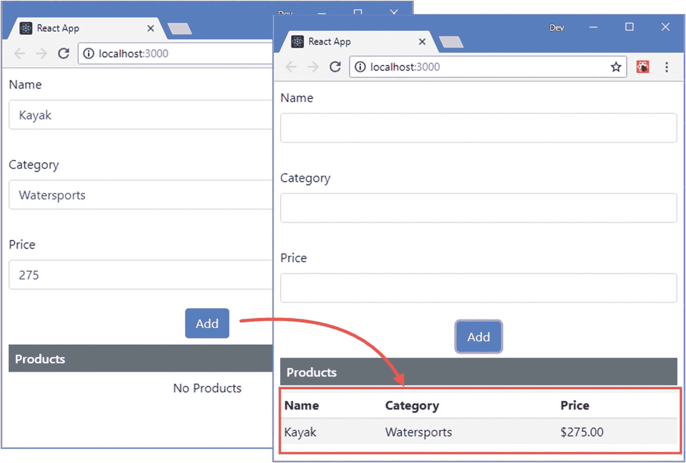

图 16-1

运行示例应用

## 创建参考

当组件需要访问 DOM 以使用特定 HTML 元素的特性时，可以使用 Refs。有一些 HTML 特性是不能通过使用 props 来实现的，其中之一就是要求一个元素获得焦点。第一次呈现内容时，`autoFocus`属性可用于聚焦一个元素，但一旦用户单击它，焦点将切换到`button`元素，这意味着用户不能开始键入以创建另一个项目，直到他们重新聚焦，无论是通过单击`input`元素还是通过使用 Tab 键。

当点击添加按钮触发的事件被处理时，可以使用 ref 来访问 DOM 并调用`input`元素上的`focus`方法，如清单 [16-9](#PC9) 所示。

### 不要急着用引用

能够访问 DOM 是 web 开发人员的自然期望，refs 看起来是一个使 React 开发更容易的特性，特别是如果您是从 Angular 这样的框架开始使用 React。

很容易被 refs 冲昏头脑，最终得到一个组件，它复制了应该由 React 执行的内容处理特性。过度使用引用的组件很难管理，可能会依赖于特定的浏览器功能，并且很难在不同的平台上运行。

仅在万不得已的情况下才使用 refs，并且始终考虑是否可以使用 state 和 props 功能获得相同的结果。

```jsx
import React, { Component } from "react";

export class Editor extends Component {

    constructor(props) {
        super(props);
        this.state = {
            name: "",
            category: "",
            price: ""
        }
        this.nameRef = React.createRef();
    }

    handleChange = (event) => {
        event.persist();
        this.setState(state => state[event.target.name] = event.target.value);
    }

    handleAdd = () => {
        this.props.callback(this.state);
        this.setState({ name: "", category:"", price:""},
            () => this.nameRef.current.focus());
    }

    render() {
        return <React.Fragment>
            <div className="form-group p-2">
                <label>Name</label>
                <input className="form-control" name="name"
                    value={ this.state.name } onChange={ this.handleChange }
                    autoFocus={ true } ref={ this.nameRef } />
            </div>
            <div className="form-group p-2">
                <label>Category</label>
                <input className="form-control" name="category"
                    value={ this.state.category } onChange={ this.handleChange }  />
            </div>
            <div className="form-group p-2">
                <label>Price</label>
                <input className="form-control" name="price"
                    value={ this.state.price } onChange={ this.handleChange }  />
            </div>
            <div className="text-center">
                <button className="btn btn-primary" onClick={ this.handleAdd }>
                    Add
                </button>
            </div>
        </React.Fragment>
    }
}

Listing 16-9Using a Ref in the Editor.js File in the src Folder

```

引用是使用`React.createRef`方法创建的，该方法在构造函数中被调用，因此结果可以在整个组件中使用。ref 使用特殊的`ref`属性与一个元素相关联，通过一个表达式为元素选择 ref。

```jsx
...
<input className="form-control" name="name"
    value={ this.state.name } onChange={ this.handleChange }
    autoFocus={ true } ref={ this.nameRef } />
...

```

由`createRef`方法返回的 ref 对象只定义了一个名为`current`的属性，该属性返回代表 DOM 中元素的`HTMLElement`对象。状态数据更新完成后，我使用`handleAdd`方法中的`current`属性来调用`focus`方法，如下所示:

```jsx
...
this.setState({ name: "", category:"", price:""},
    () => this.nameRef.current.focus());
...

```

结果是，当添加按钮触发的更新完成时，name `input`元素将重新获得焦点，允许用户开始输入下一个新产品，而不必手动选择该元素，如图 [16-2](#Fig2) 所示。

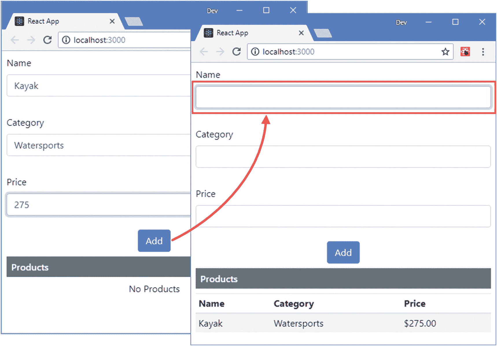

图 16-2

使用引用

## 使用参照创建不受控制的形状构件

示例应用使用我在第 15 章[中介绍的受控表单组件技术，其中 React 负责每个表单元素的内容，使用状态数据属性存储其值，使用事件处理程序响应更改。](15.html)

表单元素已经具有存储值和响应更改的能力，但是这些功能不被受控表单组件使用。另一种技术是创建一个*不受控制的表单组件*，其中 ref 用于访问表单元素，浏览器负责管理元素的值并响应更改。在清单 [16-10](#PC12) 中，我删除了用于管理由`Editor`组件呈现的`input`元素的状态数据，并使用 refs 来创建不受控制的表单组件。

```jsx
import React, { Component } from "react";

export class Editor extends Component {

    constructor(props) {
        super(props);
        // this.state = {
        //     name: "",
        //     category: "",
        //     price: ""
        // }
        this.nameRef = React.createRef();
        this.categoryRef = React.createRef();
        this.priceRef = React.createRef();
    }

    // handleChange = (event) => {
    //     event.persist();
    //     this.setState(state => state[event.target.name] = event.target.value);
    // }

    handleAdd = () => {
        this.props.callback({
            name: this.nameRef.current.value,
            category: this.categoryRef.current.value,
            price: this.priceRef.current.value
        });
        this.nameRef.current.value = "";
        this.categoryRef.current.value = "";
        this.priceRef.current.value = "";
        this.nameRef.current.focus();
    }

    render() {
        return <React.Fragment>
            <div className="form-group p-2">
                <label>Name</label>
                <input className="form-control" name="name"
                    autoFocus={ true } ref={ this.nameRef } />
            </div>
            <div className="form-group p-2">
                <label>Category</label>
                <input className="form-control" name="category"
                    ref={ this.categoryRef } />
            </div>
            <div className="form-group p-2">
                <label>Price</label>
                <input className="form-control" name="price" ref={ this.priceRef } />
            </div>
            <div className="text-center">
                <button className="btn btn-primary" onClick={ this.handleAdd }>
                    Add
                </button>
            </div>
        </React.Fragment>
    }
}

Listing 16-10Creating Uncontrolled Form Components in the Editor.js File in the src Folder

```

在用户单击 Add 按钮之前，`input`元素值是不需要的。在单击按钮时调用的`handleAdd`方法中，每个`input`元素的引用用于读取`value`属性。用户看到的结果与前面的示例一样，但是在幕后，React 不再负责管理元素值或响应变更事件。

### 为非受控元素设置初始值

React 不对不受控制的元素负责，但它仍然可以提供一个初始值，然后由浏览器管理。要设置该值，请使用`defaultValue`或`defaultChecked`属性，但是请记住，您指定的值将仅在元素首次呈现时使用，并且不会在元素发生变化时更新元素。

### 使用回调函数创建引用

前面的例子展示了如何在表单元素中使用 refs，但是结果与我在本章开始时使用的受控表单组件没有太大的不同。有一种替代技术可以用来创建引用，并且可以产生更简洁的组件，如清单 [16-11](#PC13) 所示，称为*回调引用*。

```jsx
import React, { Component } from "react";

export class Editor extends Component {

    constructor(props) {
        super(props);
        this.formElements = {
            name: { },
            category: { },
            price: { }
        }
    }

    setElement = (element) => {
        if (element !== null) {
            this.formElements[element.name].element = element;
        }
    }

    handleAdd = () => {
        let data = {};
        Object.values(this.formElements)
            .forEach(v => {
                data[v.element.name] = v.element.value;
                v.element.value = "";
            });
        this.props.callback(data);
        this.formElements.name.element.focus();
    }

    render() {
        return <React.Fragment>
            <div className="form-group p-2">
                <label>Name</label>
                <input className="form-control" name="name"
                    autoFocus={ true } ref={ this.setElement } />
            </div>
            <div className="form-group p-2">
                <label>Category</label>
                <input className="form-control" name="category"
                    ref={ this.setElement } />
            </div>
            <div className="form-group p-2">
                <label>Price</label>
                <input className="form-control" name="price"
                    ref={ this.setElement } />
            </div>
            <div className="text-center">
                <button className="btn btn-primary" onClick={ this.handleAdd }>
                    Add
                </button>
            </div>
        </React.Fragment>
    }
}

Listing 16-11Using Callback Refs in the Editor.js File in the src Folder

```

`input`元素的`ref`属性的值被设置为一个方法，该方法在呈现内容时被调用。指定的方法不是处理一个`ref`对象，而是直接接收`HTMLElement`对象，而不是一个具有`current`属性的引用对象。在清单中，`setElement`方法接收元素，使用`name`值将这些元素添加到`formElements`对象中，这样我就可以区分这些元素。

如果元素被卸载，您为回调 ref 提供的函数也将被调用，参数为`null`。对于这个例子，如果元素被删除，我不需要做任何整理，所以我只需要检查`setElement`方法中的空值。

```jsx
...
setElement = (element) => {
    if (element !== null) {
        this.formElements[element.name].element = element;
    }
}
...

```

一旦有了 refs 的函数，就可以很容易地以编程方式生成表单，如清单 [16-12](#PC15) 所示，因为 refs 不必单独创建和分配给元素。

```jsx
import React, { Component } from "react";

export class Editor extends Component {

    constructor(props) {
        super(props);
        this.formElements = {
            name: { label: "Name", name: "name" },
            category: { label: "Category", name: "category" },
            price: { label: "Price", name: "price" }
        }
    }

    setElement = (element) => {
        if (element !== null) {
            this.formElements[element.name].element = element;
        }
    }

    handleAdd = () => {
        let data = {};
        Object.values(this.formElements)
            .forEach(v => {
                data[v.element.name] = v.element.value;
                v.element.value = "";
            });
        this.props.callback(data);
        this.formElements.name.element.focus();
    }

    render() {
        return <React.Fragment>
             {
                Object.values(this.formElements).map(elem =>
                    <div className="form-group p-2" key={ elem.name }>
                        <label>{ elem.label }</label>
                        <input className="form-control"
                            name={ elem.name }
                            autoFocus={ elem.name === "name" }
                            ref={ this.setElement }  />
                    </div>)
            }
            <div className="text-center">
                <button className="btn btn-primary" onClick={ this.handleAdd }>
                    Add
                </button>
            </div>
        </React.Fragment>
    }
}

Listing 16-12Generating a Form Programmatically in the Editor.js File in the src Folder

```

使用`formElements`对象的属性生成`input`元素，其中每个属性被分配一个具有`label`和`name`属性的对象，这些属性在`render`方法中用于配置元素。

定义和管理表单所需的代码更简洁，但效果是一样的，填写表单并点击添加按钮会显示一个新的对象，如图 [16-3](#Fig3) 所示。

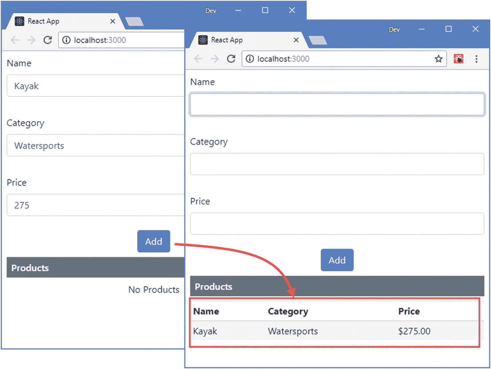

图 16-3

以编程方式创建表单元素和引用

### 验证不受控制的表单组件

表单元素通过 HTML 约束验证 API 具有内置的验证支持，可以使用 refs 访问该 API。验证 API 使用如下对象描述元素的验证状态:

```jsx
...
{
    valueMissing: true, tooShort: false, rangeUnderflow: false
}
...

```

当我指定元素必须有值但为空时,`valueMissing`属性将是`true`。当元素值中的字符少于验证规则指定的字符数时，`tooShort`属性将为`true`。对于小于指定最小值的数值,`rangeUnderflow`属性将是`true`。

为了处理这种类型的验证对象，我在`src`文件夹中添加了一个名为`ValidationMessages.js`的文件，并用它来定义清单 [16-13](#PC17) 中所示的函数。

```jsx
export function GetValidationMessages(elem) {
    let errors = [];
    if (!elem.checkValidity()) {
        if (elem.validity.valueMissing) {
            errors.push("Value required");
        }
        if (elem.validity.tooShort) {
            errors.push("Value is too short");
        }
        if (elem.validity.rangeUnderflow) {
            errors.push("Value is too small");
        }
    }
    return errors;
}

Listing 16-13The Contents of the ValidationMessages.js File in the src Folder

```

`GetValidationMessages`函数接收一个 HTML 元素对象，并通过调用元素的`checkValidity`方法请求浏览器进行数据验证。如果元素的值是`valid`，则`checkValidity`方法返回`true`，否则返回`false`。如果元素的值不是`valid`，则检查元素的`validity`属性，以获得具有`true`值的`valueMissing`、`tooShort`和`rangeUnderflow`属性，并用于创建可以显示给用户的错误数组。

### 小费

HTML 验证特性包括比我在本章中使用的更广泛的验证检查和有效性属性。参见 [`https://developer.mozilla.org/en-US/docs/Web/Guide/HTML/HTML5/Constraint_validation`](https://developer.mozilla.org/en-US/docs/Web/Guide/HTML/HTML5/Constraint_validation) 了解可用功能的详细描述。

我在`src`文件夹中添加了一个名为`ValidationDisplay.js`的文件，并使用它来定义一个组件，该组件将显示单个元素的验证消息，如清单 [16-14](#PC18) 所示。

```jsx
import React, { Component } from "react";

export class ValidationDisplay extends Component {

    render() {
        return this.props.errors
            ? this.props.errors.map(err =>
                <div className="small bg-danger text-white mt-1 p-1"
                        key={ err } >
                    { err }
                </div>)
            : null
    }
}

Listing 16-14The Contents of the ValidationDisplay.js File in the src Folder

```

该组件接收一个应该显示的错误消息数组，如果没有错误消息要显示，则返回`null`表示没有内容。在清单 [16-15](#PC19) 中，我已经更新了`Editor`组件，以便在使用表单数据之前将验证属性应用于表单元素并执行验证检查。

```jsx
import React, { Component } from "react";

import { ValidationDisplay } from "./ValidationDisplay";

import { GetValidationMessages } from "./ValidationMessages";

export class Editor extends Component {

    constructor(props) {
        super(props);
        this.formElements = {
            name: { label: "Name", name: "name",
                validation: { required: true, minLength: 3 }},
            category: { label: "Category", name:"category",
                validation: { required: true, minLength: 5 }},
            price: { label: "Price", name: "price",
                validation: { type: "number", required: true, min: 5 }}
        }
        this.state = {
            errors: {}
        }
    }

    setElement = (element) => {
        if (element !== null) {
            this.formElements[element.name].element = element;
        }
    }

    handleAdd = () => {
        if (this.validateFormElements()) {
            let data = {};
            Object.values(this.formElements)
                .forEach(v => {
                    data[v.element.name] = v.element.value;
                    v.element.value = "";
                });
            this.props.callback(data);
            this.formElements.name.element.focus();
        }
    }

    validateFormElement = (name) => {
        let errors = GetValidationMessages(this.formElements[name].element);
        this.setState(state => state.errors[name] = errors);
        return errors.length === 0;
    }

    validateFormElements = () => {
        let valid = true;
        Object.keys(this.formElements).forEach(name => {
            if (!this.validateFormElement(name)) {
                valid = false;
            }
        })
        return valid;
    }

    render() {
        return <React.Fragment>
             {
                Object.values(this.formElements).map(elem =>
                    <div className="form-group p-2" key={ elem.name }>
                        <label>{ elem.label }</label>
                        <input className="form-control"
                            name={ elem.name }
                            autoFocus={ elem.name === "name" }
                            ref={ this.setElement }
                            onChange={ () => this.validateFormElement(elem.name) }
                            { ...elem.validation} />
                        <ValidationDisplay
                             errors={ this.state.errors[elem.name] } />
                    </div>)
            }
            <div className="text-center">
                <button className="btn btn-primary" onClick={ this.handleAdd }>
                    Add
                </button>
            </div>
        </React.Fragment>
    }
}

Listing 16-15Applying Validation in the Editor.js File in the src Folder

```

我在描述元素的对象中包含了每个元素的验证属性，如下所示:

```jsx
...
name: { label: "Name", name: "name", validation: { required: true, minLength: 3 }},
...

```

`required`属性表示需要一个值，而`minLength`属性指定该值应该至少包含三个字符。当通过`render`方法创建`input`元素时，这些属性被应用于它们。

```jsx
...
<input className="form-control" name={ elem.name }
    autoFocus={ elem.name === "name" } ref={ this.setElement }
    onChange={ () => this.validateFormElement(elem.name) }
    { ...elem.validation} />
...

```

我不必担心我在第 [15 章](15.html)中描述的原始/肮脏元素的问题，因为直到调用`checkValidity`方法才执行验证，这将发生在对`change`事件的响应中，我使用`onChange`事件属性和`validateFormElement`方法处理该事件，结果是只有当用户开始键入时，元素的验证才开始，如图 [16-4](#Fig4) 所示。

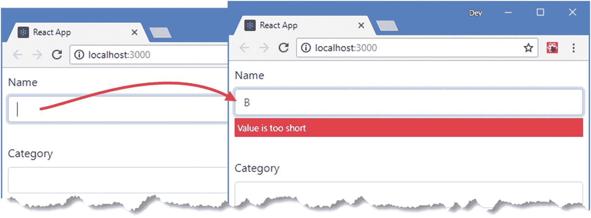

图 16-4

验证元素

当用户点击添加按钮时，`handleAdd`方法调用`validateFormElements`按钮，该按钮验证所有元素并确保表单数据在问题解决之前不会被使用，如图 [16-5](#Fig5) 所示。更改的效果会立即显示出来，因为每次编辑都会触发一个`change`事件，导致元素的值被再次验证。

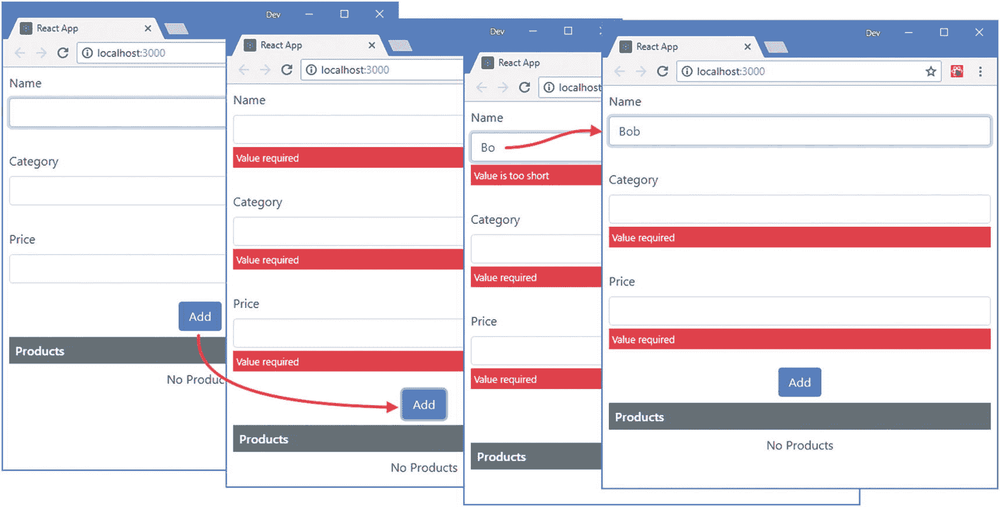

图 16-5

验证所有元素

## 了解参考文献和生命周期

在 React 调用组件的`render`方法之前，Refs 不会被赋值。如果您使用的是`createRef`方法，那么在组件呈现其内容之前,`current`属性不会被赋值。类似地，回调引用不会调用它们的方法，直到组件已经呈现。

引用的分配在组件生命周期中似乎很晚，但是引用提供了对 DOM 元素的访问，这些元素直到呈现阶段才创建，这意味着 React 直到调用`render`方法才创建引用所引用的元素。与 ref 相关联的元素只能在`componentDidMount`和`componentDidUpdate`生命周期方法中访问，因为它们发生在渲染已经完成并且 DOM 已经被填充或更新之后。

使用 refs 的一个后果是，当 React 替换它在 DOM 中呈现的元素时，组件不能依赖状态特性来保留它的上下文。React 试图最小化 DOM 变化，但是你不能依赖于在应用的整个生命周期中使用相同的元素。如第 [13](13.html) 章所述，改变组件呈现的顶层元素会导致 React 替换其在 DOM 中的元素，如清单 [16-16](#PC22) 所示。

```jsx
import React, { Component } from "react";
import { ValidationDisplay } from "./ValidationDisplay";
import { GetValidationMessages } from "./ValidationMessages";

export class Editor extends Component {

    constructor(props) {
        super(props);
        this.formElements = {
            name: { label: "Name", name: "name",
                validation: { required: true, minLength: 3 }},
            category: { label: "Category", name:"category",
                validation: { required: true, minLength: 5 }},
            price: { label: "Price", name: "price",
                validation: { type: "number", required: true, min: 5 }}
        }
        this.state = {
            errors: {},
            wrapContent: false
        }
    }

    setElement = (element) => {
        if (element !== null) {
            this.formElements[element.name].element = element;
        }
    }

    handleAdd = () => {
        if (this.validateFormElements()) {
            let data = {};
            Object.values(this.formElements)
                .forEach(v => {
                    data[v.element.name] = v.element.value;
                    v.element.value = "";
                });
            this.props.callback(data);
            this.formElements.name.element.focus();
        }
    }

    validateFormElement = (name) => {
        let errors = GetValidationMessages(this.formElements[name].element);
        this.setState(state => state.errors[name] = errors);
        return errors.length === 0;
    }

    validateFormElements = () => {
        let valid = true;
        Object.keys(this.formElements).forEach(name => {
            if (!this.validateFormElement(name)) {
                valid = false;
            }
        })
        return valid;
    }

    toggleWrap = () => {
        this.setState(state => state.wrapContent = !state.wrapContent);
    }

    wrapContent(content) {
        return this.state.wrapContent
            ? <div className="bg-secondary p-2">
                    <div className="bg-light">{ content }</div>
              </div>
            : content;
    }

    render() {
        return this.wrapContent(
            <React.Fragment>
                    <div className="form-group text-center p-2">
                        <div className="form-check">
                            <input className="form-check-input"
                                type="checkbox"
                                checked={ this.state.wrapContent }
                                onChange={ this.toggleWrap } />
                            <label className="form-check-label">Wrap Content</label>
                        </div>
                    </div>
                {
                    Object.values(this.formElements).map(elem =>
                        <div className="form-group p-2" key={ elem.name }>
                            <label>{ elem.label }</label>
                            <input className="form-control"
                               name={ elem.name }
                               autoFocus={ elem.name === "name" }
                               ref={ this.setElement }
                               onChange={ () => this.validateFormElement(elem.name) }
                               { ...elem.validation} />
                            <ValidationDisplay
                                errors={ this.state.errors[elem.name] } />
                        </div>)
                }
                <div className="text-center">
                    <button className="btn btn-primary" onClick={ this.handleAdd }>
                        Add
                    </button>
                </div>
            </React.Fragment>)
    }
}

Listing 16-16Rendering a Different Top-Level Element in the Editor.js File in the src Folder

```

我添加了一个`wrapContent` state 属性，该属性是使用一个受控的复选框设置的，它包装了组件呈现的内容，并确保 React 用新的元素替换 DOM 中组件的现有元素。要查看效果，请在“名称”字段中输入文本，并选中“换行”复选框，如图 [16-6](#Fig6) 所示。

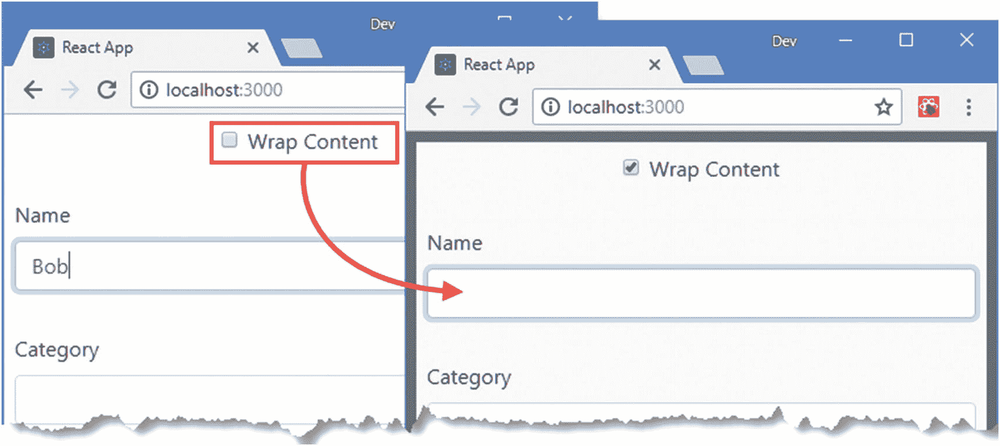

图 16-6

替换元素

您输入文本的`input`元素已被破坏，其内容已丢失。让用户更加困惑的是，检测到的任何验证错误都是组件状态数据的一部分，这意味着它们将显示在新的`input`元素旁边，即使它们描述的数据值不再可见。

为了帮助避免这个问题，有状态组件生命周期包括了`getSnapshotBeforeUpdate`方法，在更新阶段在`render`和`componentDidUpdate`方法之间调用，如图 [16-7](#Fig7) 所示。

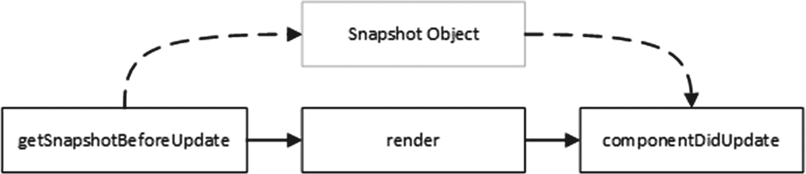

图 16-7

快照流程

这个`getSnapshotBeforeUpdate`方法允许组件在调用`render`方法之前检查其当前内容并生成一个定制的快照对象。一旦更新完成，就会调用`componentDidUpdate`方法并提供快照对象，这样组件就可以修改现在在 DOM 中的元素。

### 警告

如果组件被卸载并重新创建，快照无助于保留上下文，当祖先的内容改变时会发生这种情况。在这些情况下，`componentWillUnmount`方法可用于访问引用，数据可通过上下文保存，如第 [15 章](15.html)所述。

在清单 [16-17](#PC23) 中，我使用了快照特性来捕捉更新前输入到 input 元素中的值，并在更新后恢复这些值。

```jsx
import React, { Component } from "react";
import { ValidationDisplay } from "./ValidationDisplay";
import { GetValidationMessages } from "./ValidationMessages";

export class Editor extends Component {

    constructor(props) {
        super(props);
        this.formElements = {
            name: { label: "Name", name: "name",
                validation: { required: true, minLength: 3 }},
            category: { label: "Category", name:"category",
                validation: { required: true, minLength: 5 }},
            price: { label: "Price", name: "price",
                validation: { type: "number", required: true, min: 5 }}
        }
        this.state = {
            errors: {},
            wrapContent: false
        }
    }

    // ...other methods omitted for brevity...

    getSnapshotBeforeUpdate(props, state) {
        return Object.values(this.formElements).map(item =>
            {return { name: [item.name], value: item.element.value }})
    }

    componentDidUpdate(oldProps, oldState, snapshot) {
        snapshot.forEach(item => {
            let element = this.formElements[item.name].element
            if (element.value !== item.value) {
                element.value = item.value;
            }
        });
    }
}

Listing 16-17Taking a Snapshot in the Editor.js File in the src Folder

```

`getSnapshotBeforeUpdate`方法接收组件在更新被触发之前的属性和状态，并在更新后返回一个将被传递给`componentDidUpdate`方法的对象。在这个例子中，我不需要访问 props 或 state，因为我需要保存的数据包含在`input`元素中。React 并没有要求快照对象使用特定的格式，而且`getSnapshotBeforeUpdate`方法可以以任何有用的格式返回数据。在这个例子中，`getSnapshotBeforeUpdate`方法返回一个带有`name`和`value`属性的对象数组。

React 完成更新后，它调用`componentDidUpdate`并提供快照作为参数，以及旧的属性和状态数据。在示例中，我处理对象数组并设置输入元素的值。结果是当复选框被切换时，输入到`input`元素中的数据被保留，如图 [16-8](#Fig8) 所示。

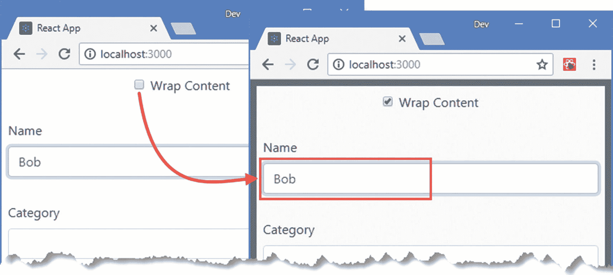

图 16-8

使用快照数据

每次更新都会调用`getSnapshotBeforeUpdate`和`componentDidUpdate`方法，即使 React 没有替换 DOM 中的组件元素，这就是为什么我只在更新完成后元素的值与快照值不同时才应用快照值。

### 了解参考文献兔子洞

在前面的例子中使用 HTML5 约束验证 API 有一个意想不到的后果。只有当用户编辑文本字段的内容时，才执行验证，而不是当值以编程方式设置时。当我使用快照数据来设置新创建的`input`元素的值时，它将通过验证，即使该值之前没有通过验证。其效果是，用户可以通过在`name`或`category`输入元素中输入错误的值，选中 wrap content 复选框，然后单击 Add 按钮来绕过验证。

这是一个可以解决的问题，但潜在的问题是使用 refs 直接访问 DOM 会出现一系列小冲突，每个冲突都可以通过添加几行代码来解决。但是这些修复通常会带来其他问题或妥协，需要额外的工作，结果是由复杂组件构成的脆弱的应用。

在某些项目中，直接使用 DOM 可能是必不可少的，避免复制已经存在于 DOM 中的数据和特性可能会有好处。但是只有在需要的时候才使用引用，因为它们可以制造和解决一样多的问题。

## 对其他库或框架使用引用

一些项目被转移到逐渐 React，因此组件必须与在另一个库或框架中编写的现有特性进行互操作。最常见的例子是 jQuery，在 React 和 Angular 这样的框架出现之前，它是 web 应用开发最流行的选择，现在仍然广泛用于简单的项目。例如，如果您有大量用 jQuery 编写的特性，那么您可以使用 refs 将它们应用于组件呈现的 HTML 元素。为了演示，我将使用 jQuery 将带有无效元素的表单元素分配给一个将应用 Bootstrap 样式的类。我在`src`文件夹中添加了一个名为`jQueryColorizer.js`的文件，并添加了清单 [16-18](#PC24) 中所示的代码。

### 注意

这个例子需要添加到清单 [16-3](#PC3) 中的项目的 jQuery 包。如果没有安装 jQuery，应该在继续之前安装。

```jsx
var $ = require('jquery');

export function ColorInvalidElements(rootElement) {
    $(rootElement)
        .find("input:invalid").addClass("border-danger")
            .removeClass("border-success")
        .end()
        .find("input:valid").removeClass("border-danger")
             .addClass("border-success");
}

Listing 16-18The Contents of the jQueryColorizer.js in the src Folder

```

jQuery 语句定位分配给`invalid`伪类的所有`input`元素，并将它们添加到`border-danger`类，并将`valid`伪类中的任何`input`元素添加到`border-success`类。HTML 约束验证 API 使用`valid`和`invalid`类来指示元素的验证状态。在清单 [16-19](#PC25) 中，我添加了一个 ref 并使用它从`App`组件中调用 jQuery 函数。

### 混合框架

使用 refs 来合并其他框架很困难，而且容易出现问题。像任何引用的使用一样，应该谨慎地使用，并且只有在无法重写 React 中的功能时才使用。您可能觉得通过构建现有的代码可以节省时间，但是我的经验是，节省下来的时间将会花在尝试解决一系列小问题上，这些小问题是由于两个框架以不同的方式工作而产生的。

如果您不得不在 React 旁边使用另一个库或框架，那么您应该密切关注框架处理 DOM 的方式。您会发现 React 和其他框架希望完全控制它们创建的内容，当以框架开发人员没有预料到的方式添加、删除或更改元素时，可能会出现意想不到的结果。

```jsx
import React, { Component } from "react";
import { Editor } from "./Editor"
import { ProductTable } from "./ProductTable";

import { ColorInvalidElements } from "./jQueryColorizer";

export default class App extends Component {

    constructor(props) {
        super(props);
        this.state = {
            products: []
        }
        this.editorRef = React.createRef();
    }

    addProduct = (product) => {
        if (this.state.products.indexOf(product.name) === -1) {
            this.setState({ products: [...this.state.products, product ]});
        }
    }

    colorFields = () => {
        ColorInvalidElements(this.editorRef.current);
    }

    render() {
        return <div>
                <div className="text-center m-2">
                    <button className="btn btn-primary" onClick={ this.colorFields }>
                        jQuery
                    </button>
                </div>
                <div ref={ this.editorRef} >
                    <Editor callback={ this.addProduct } />
                </div>
                <h6 className="bg-secondary text-white m-2 p-2">Products</h6>
                    <div className="m-2">
                        {
                            this.state.products.length === 0
                                ? <div className="text-center">No Products</div>
                                : <ProductTable products={ this.state.products } />
                        }
                    </div>
            </div>
    }
}

Listing 16-19Invoking a Function in the App.js File in the src Folder

```

结果是，单击 jQuery 按钮会调用`colorFields`方法，该方法使用 ref 为 jQuery 函数提供它需要的 HTML 元素。jQuery 函数将边框应用于输入元素以指示它们的验证状态，如图 [16-9](#Fig9) 所示。(在本书的印刷版本中，边框颜色的差异不会很明显，这是一个最好在浏览器中运行以查看效果的示例。)

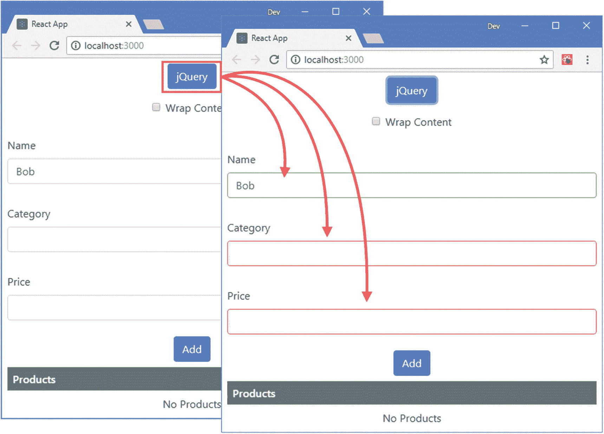

图 16-9

通过 ref 为 jQuery 提供元素

### 使用参照访问元件

在清单 [16-19](#PC25) 中，我在`Editor`元素周围添加了一个`div`元素。当 React 将内容呈现到 DOM 中时，`Editor`元素不会成为 HTML 文档的一部分，添加`div`元素可以确保 jQuery 能够访问应用的内容。

引用确实与组件一起工作，如果我将`ref`属性应用于`Editor`元素，那么引用的`current`属性的值将被分配给在呈现`App`组件内容时创建的`Editor`对象。

对组件引用允许访问组件的状态数据和方法。使用 refs 来调用子组件的方法是很诱人的，因为它产生的开发体验更类似于传统上使用对象的方式。

通过引用操作一个组件是不好的做法。它产生了紧密耦合的组件，最终与 React 背道而驰。开始时，状态数据、属性和事件特性可能感觉不太自然，但是您会习惯于它们，结果是一个充分利用 React 的应用，并且更容易编写、测试和维护。

## 访问子组件的内容

React 对`refs`属性进行了特殊处理，这意味着当一个组件需要引用由它的一个后代呈现的 DOM 元素时，必须小心。最简单的方法是使用不同的名称传递 ref 对象或回调函数，在这种情况下，React 将像传递任何其他属性一样传递 ref。为了演示，我在`src`文件夹中添加了一个名为`FormField.js`的文件，并用它来定义清单 [16-20](#PC26) 中所示的组件。

### 注意

访问子组件的内容应该小心，因为它会创建更难编写和测试的紧密耦合的组件。在可能的情况下，应该使用 props 在组件之间进行通信。

```jsx
import React, { Component } from "react";

export class FormField extends Component {

    constructor(props) {
        super(props);
        this.state = {
            fieldValue: ""
        }
    }

    handleChange = (ev) => {
        this.setState({ fieldValue: ev.target.value});
    }

    render() {
        return <div className="form-group">
            <label>{ this.props.label }</label>
            <input className="form-control" value={ this.state.fieldValue }
                onChange={ this.handleChange } ref={ this.props.fieldRef } />
        </div>
    }
}

Listing 16-20The Contents of the FormField.js File in the src Folder

```

该组件呈现一个受控的`input`元素，并使用一个名为`fieldRef`的属性将从父元素接收到的`ref`与该元素相关联。在清单 [16-21](#PC27) 中，我已经替换了由`App`组件呈现的内容，以使用`FormField`组件并为其提供一个引用。

```jsx
import React, { Component } from "react";
import { FormField } from "./FormField";

export default class App extends Component {

    constructor(props) {
        super(props);
        this.fieldRef = React.createRef();
    }

    handleClick = () => {
        this.fieldRef.current.focus();
    }

    render() {
        return <div className="m-2">
                <FormField label="Name" fieldRef={ this.fieldRef } />
                <div className="text-center m-2">
                    <button className="btn btn-primary"
                            onClick={ this.handleClick }>
                        Focus
                    </button>
                </div>
            </div>
    }
}

Listing 16-21Replacing the Contents of the App.js File in the src Folder

```

`App`组件创建一个引用，并使用`fieldRef`属性将其传递给`FormField`组件，然后使用`ref`将其应用于`input`元素。结果是点击由`App`组件呈现的焦点按钮，将聚焦由其子组件呈现的输入元素，如图 [16-10](#Fig10) 所示。

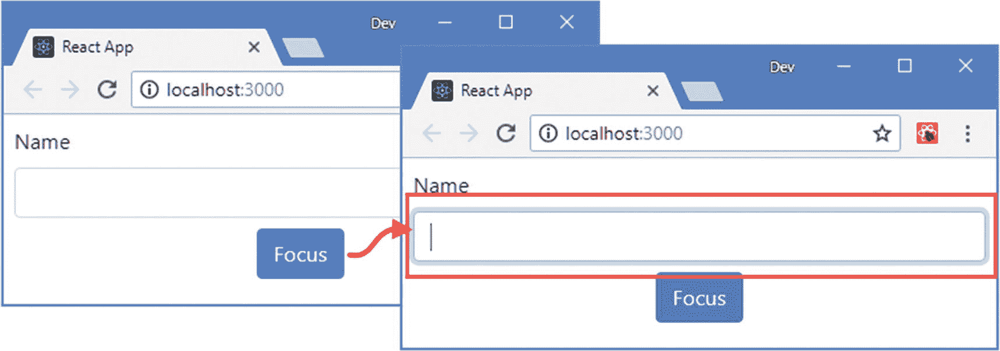

图 16-10

访问孩子的内容

### 使用引用转发

React 提供了一种将引用传递给子对象的替代方法，称为*引用转发*，它允许使用`ref`来代替常规属性。在清单 [16-22](#PC28) 中，我为`FormField`组件使用了引用转发。

```jsx
import React, { Component } from "react";

export const ForwardFormField = React.forwardRef((props, ref) =>

     <FormField { ...props } fieldRef={ ref } />

)

export class FormField extends Component {

    constructor(props) {
        super(props);
        this.state = {
            fieldValue: ""
        }
    }

    handleChange = (ev) => {
        this.setState({ fieldValue: ev.target.value});
    }

    render() {
        return <div className="form-group m-2">
            <label>{ this.props.label }</label>
            <input className="form-control" value={ this.state.fieldValue }
                onChange={ this.handleChange } ref={ this.props.fieldRef } />
        </div>
    }
}

Listing 16-22Using Ref Forwarding in the FormField.js File in the src Folder

```

向`React.forwardRef`方法传递一个接收 props 和`ref`值并呈现内容的函数。在这种情况下，我接收到了`ref`值，并将其转发给了`fieldRef` prop，这是`FormField`组件期望接收的 prop 名称。我将来自`forwardRef`方法的结果导出为`ForwardFormField`，我已经在`App`组件中使用了它，如清单 [16-23](#PC29) 所示。

```jsx
import React, { Component } from "react";

import { ForwardFormField } from "./FormField";

export default class App extends Component {

    constructor(props) {
        super(props);
        this.fieldRef = React.createRef();
    }

    handleClick = () => {
        this.fieldRef.current.focus();
    }

    render() {
        return <div>
                <ForwardFormField label="Name" ref={ this.fieldRef } />
                <div className="text-center m-2">
                    <button className="btn btn-primary"
                            onClick={ this.handleClick }>
                        Focus
                    </button>
                </div>
            </div>
    }
}

Listing 16-23Using Ref Forwarding in the App.js File in the src Folder

```

这个例子产生了与图 [16-10](#Fig10) 所示相同的效果，优点是`App`组件不需要任何关于`ref`如何在子组件中处理的特殊知识。

## 使用门户网站

门户允许组件将其内容呈现到特定的 DOM 元素中，而不是作为其父内容的一部分呈现。该特性允许组件脱离普通的 React 组件模型，但是要求在应用之外创建和管理目标元素，这意味着您不能使用门户将内容呈现到不同的组件中。因此，这个特性在有限的情况下很有用，比如为用户创建对话框或模型警告，或者将 React 集成到另一个框架或库创建的内容中。在清单 [16-24](#PC30) 中，我在`index.html`文件中添加了新的 HTML 元素，这样在示例应用呈现的内容之外就有了一个 DOM 元素，我可以将它作为门户的目标。

```jsx
<!DOCTYPE html>
<html lang="en">

<head>
  <meta charset="utf-8">
  <meta name="viewport" content="width=device-width, initial-scale=1, shrink-to-fit=no">
  <meta name="theme-color" content="#000000">
  <link rel="manifest" href="%PUBLIC_URL%/manifest.json">
  <link rel="shortcut icon" href="%PUBLIC_URL%/favicon.ico">
  <title>React App</title>
</head>

<body>
  <noscript>
    You need to enable JavaScript to run this app.
  </noscript>

  <div class="container">
    <div class="row">
      <div class="col">
        <div id="root"></div>
      </div>
      <div class="col">
        <div id="portal" class="m-2">
          <h6 class="bg-info text-white text-center p-2">
            This is the portal target
          </h6>
        </div>
      </div>
    </div>
  </div>
</body>
</html>

Listing 16-24Adding Elements in the index.html File in the public Folder

```

新元素被分配给引导 CSS 网格类，以便门户目标元素显示在应用呈现的内容旁边，如图 [16-11](#Fig11) 所示。

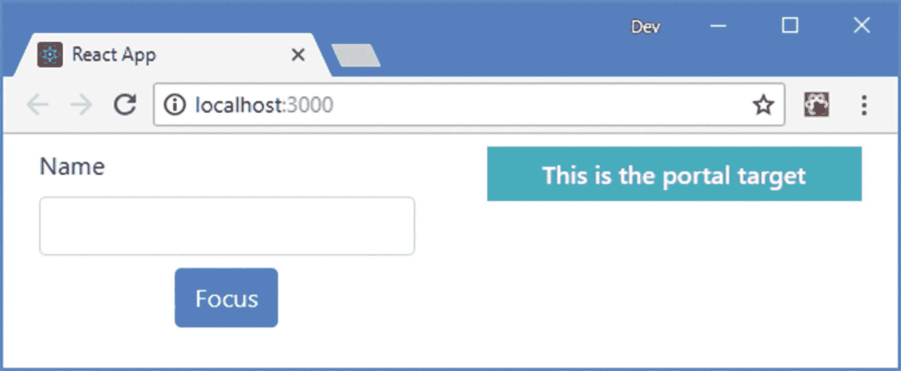

图 16-11

向 HTML 文档中添加元素

我在`src`文件夹中添加了一个名为`PortalWrapper.js`的文件，并使用它来定义清单 [16-25](#PC31) 中所示的组件，该组件在 DOM 中定位目标元素并使用它来创建门户。

```jsx
import React, { Component } from "react";
import ReactDOM from "react-dom";

export class PortalWrapper extends Component {

    constructor(props) {
        super(props);
        this.portalElement = document.getElementById("portal");
    }

    render() {
        return ReactDOM.createPortal(
            <div className="border p-3">{ this.props.children }</div>
        , this.portalElement);
    }
}

Listing 16-25The Contents of the PortalWrapper.js File in the src Folder

```

使用`props.children`属性创建容器来定义`PortalWrapper`组件，但是使用`ReactDOM.createPortal`方法返回其内容，该方法的参数是要呈现的内容和 DOM 目标元素。在这个例子中，我使用 DOM API 的`getElementById`方法来定位添加到清单 [16-24](#PC30) 中的 HTML 文件的目标元素。在清单 [16-26](#PC32) 中，我使用了`App`组件中的门户。

### 对门户使用引用

不能使用门户通过引用将内容呈现给元素。在呈现过程中使用门户，直到呈现完成时才给 ref 分配元素，这意味着在生命周期中不能通过 ref 为`ReactDOM.createPortal`方法访问元素。如果你需要在应用的不同部分的组件之间进行协调，或者使用第 3 部分中描述的一个包，使用上下文，如第 14 章所述。

```jsx
import React, { Component } from "react";
import { ForwardFormField } from "./FormField";
import { PortalWrapper } from "./PortalWrapper";

export default class App extends Component {

    constructor(props) {
        super(props);
        this.fieldRef = React.createRef();
        this.portalFieldRef = React.createRef();
    }

    focusLocal = () => {
        this.fieldRef.current.focus();
    }

    focusPortal = () => {
        this.portalFieldRef.current.focus();
    }

    render() {
        return <div>
                <PortalWrapper>
                    <ForwardFormField label="Name" ref={ this.portalFieldRef } />
                </PortalWrapper>

                <ForwardFormField label="Name" ref={ this.fieldRef } />
                <div className="text-center m-2">
                    <button className="btn btn-primary m-1"
                            onClick={ this.focusLocal }>
                        Focus Local
                    </button>
                    <button className="btn btn-primary m-1"
                            onClick={ this.focusPortal }>
                        Focus Portal
                    </button>
                </div>
            </div>
    }
}

Listing 16-26Using a Portal in the App.js File in the src Folder

```

`PortalWrapper`元素用于应用新组件作为`ForwardFormField`的容器。门户显示的内容被视为是`App`组件内容的一部分，这样即使门户的内容是在应用之外呈现的，事件也会像平常一样冒泡，并且可以分配引用。`App`组件不知道一个门户正在被使用，点击聚焦本地和聚焦门户按钮使用相同的引用技术聚焦每个`ForwardFormField`组件呈现的`input`元素，如图 [16-12](#Fig12) 所示。

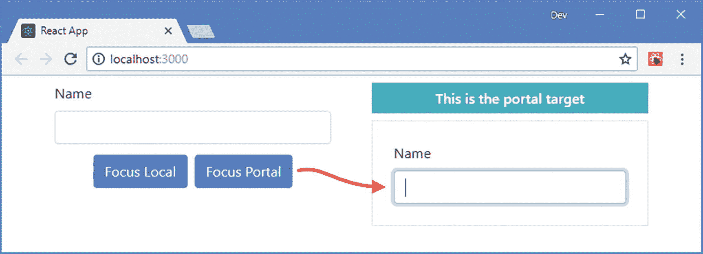

图 16-12

使用门户网站

## 摘要

在本章中，我描述了直接使用 DOM 的 React 特性。我解释了 refs 如何提供对组件呈现的内容的访问，以及这如何使不受控制的表单元素成为可能。我还演示了一个门户，它允许在应用的组件层次结构之外呈现内容。这些特性是非常宝贵的，但应该谨慎使用，因为它们破坏了正常的 React 开发模型，并导致紧密耦合的组件。在下一章，我将向您展示如何在 React 组件上执行单元测试。