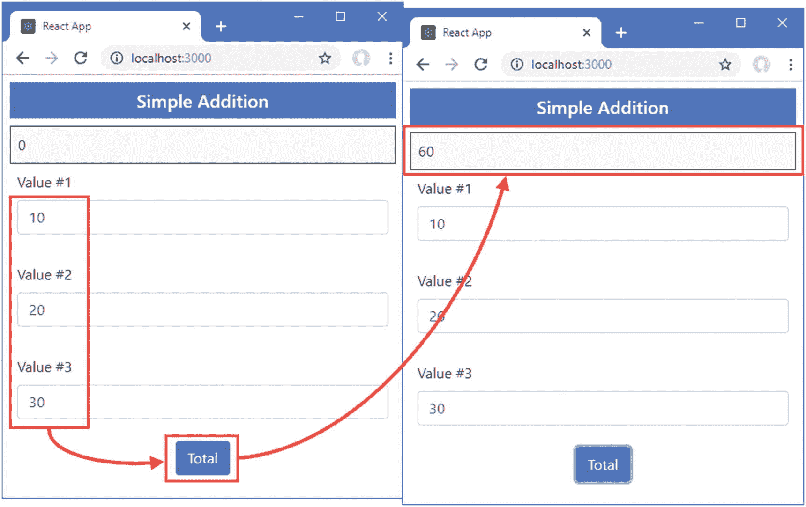

# 十七、单元测试

在本章中，我将向您展示如何测试 React 组件。我介绍了一个使测试变得更容易的包，并演示了如何用它来单独测试组件并测试它们与其子组件的交互。表 [17-1](#Tab1) 将单元测试放在上下文中。

表 17-1

将单元测试放在上下文中

<colgroup><col class="tcol1 align-left"> <col class="tcol2 align-left"></colgroup> 
| 

问题

 | 

回答

 |
| --- | --- |
| 这是什么？ | React 组件需要特殊的测试支持，以便可以隔离和检查它们与应用其他部分的交互。 |
| 为什么有用？ | 独立的单元测试能够评估组件提供的基本逻辑，而不受与应用其余部分的交互的影响。 |
| 如何使用？ | 用`create-react-app`创建的项目配置了基本的测试工具，这些工具补充了简化组件工作过程的包。 |
| 有什么陷阱或限制吗？ | 有效的单元测试可能是困难的，并且可能需要花费时间和精力来达到单元测试容易编写和运行的程度，并且您确信您已经隔离了应用的正确部分来进行测试。 |
| 还有其他选择吗？ | 单元测试不是一项要求，也不是在所有项目中都采用。 |

### 决定是否进行单元测试

单元测试是一个有争议的话题。本章假设您确实想进行单元测试，并向您展示如何设置工具并将它们应用到 React 应用中。这不是对单元测试的介绍，我也没有努力说服持怀疑态度的读者单元测试是值得的。如果想了解单元测试，这里有一篇好文章: [`https://en.wikipedia.org/wiki/Unit_testing`](https://en.wikipedia.org/wiki/Unit_testing) 。

我喜欢单元测试，我也在自己的项目中使用它——但并不是所有的项目，也不像你所期望的那样始终如一。我倾向于专注于为我知道很难编写的特性和功能编写单元测试，这些特性和功能很可能是部署中的错误来源。在这些情况下，单元测试有助于我思考如何最好地实现我需要的东西。我发现仅仅考虑我需要测试什么就有助于产生关于潜在问题的想法，这是在我开始处理实际的错误和缺陷之前。

也就是说，单元测试是一种工具，而不是宗教，只有你自己知道你需要多少测试。如果你不觉得单元测试有用，或者如果你有更适合你的不同的方法论，那么不要仅仅因为它是时髦的就觉得你需要单元测试。(然而，如果你没有更好的方法论，你根本没有在测试，那么你很可能是在让用户发现你的 bug，这很少是理想的。)

表 [17-2](#Tab2) 总结了本章内容。

表 17-2

章节总结

<colgroup><col class="tcol1 align-left"> <col class="tcol2 align-left"> <col class="tcol3 align-left"></colgroup> 
| 

问题

 | 

解决办法

 | 

列表

 |
| --- | --- | --- |
| 对 React 组件执行单元测试 | 使用 Jest(或其他可用的测试框架)和 Enzyme 来创建测试 | 9–11 |
| 隔离组件进行测试 | 使用浅渲染进行测试 | Twelve |
| 测试组件及其后代 | 使用完全渲染进行测试 | Thirteen |
| 测试组件的行为 | 测试使用 Enzyme 特性来处理属性、状态、方法和事件 | 14–17 |

## 为本章做准备

对于这一章，我将使用一个新的项目。打开一个新的命令提示符，导航到一个方便的位置，运行清单 [17-1](#PC1) 中所示的命令来创建一个名为`testapp`的项目。

### 小费

你可以从 [`https://github.com/Apress/pro-react-16`](https://github.com/Apress/pro-react-16) 下载本章以及本书其他章节的示例项目。

```jsx
npx create-react-app testapp

Listing 17-1Creating the Example Project

```

运行清单 [17-2](#PC2) 中所示的命令，导航到`testapp`文件夹添加引导包。

```jsx
cd testapp
npm install bootstrap@4.1.2

Listing 17-2Adding the Bootstrap CSS Framework

```

为了在应用中包含引导 CSS 样式表，将清单 [17-3](#PC3) 中所示的语句添加到`index.js`文件中，该文件可以在`testapp/src`文件夹中找到。

```jsx
import React from 'react';
import ReactDOM from 'react-dom';
import './index.css';
import App from './App';
import * as serviceWorker from './serviceWorker';

import 'bootstrap/dist/css/bootstrap.css';

ReactDOM.render(<App />, document.getElementById('root'));

// If you want your app to work offline and load faster, you can change
// unregister() to register() below. Note this comes with some pitfalls.
// Learn more about service workers: http://bit.ly/CRA-PWA
serviceWorker.unregister();

Listing 17-3Including Bootstrap in the index.js File in the src Folder

```

`create-react-app`工具创建包含基本测试工具的项目，但是有一些有用的附加工具使得测试更加容易。运行`testapp`文件夹中清单 [17-4](#PC4) 中所示的命令，将测试包添加到项目中。

```jsx
npm install --save-dev enzyme@3.8.0
npm install --save-dev enzyme-adapter-react-16@1.7.1

Listing 17-4Adding Packages to the Example Project

```

表 [17-3](#Tab3) 描述了已经添加到项目中的包。

表 17-3

单元测试包

<colgroup><col class="tcol1 align-left"> <col class="tcol2 align-left"></colgroup> 
| 

名字

 | 

描述

 |
| --- | --- |
| `enzyme` | Enzyme 是 Airbnb 创建的一个测试包，通过探索组件呈现的内容并检查其属性和状态，可以轻松测试组件。 |
| `enzyme-adapter-react-16` | Enzyme 需要一个适用于所用 React 特定版本的适配器。这个包适用于本书中使用的 React 版本。 |

### 创建组件

我需要一些简单的组件来演示如何对 React 应用进行单元测试。我在`src`文件夹中添加了一个名为`Result.js`的文件，并用它来定义清单 [17-5](#PC5) 中所示的组件。

```jsx
import React from "react";

export const Result = (props) => {
    return <div className="bg-light text-dark border border-dark p-2 ">
        { props.result || 0 }
    </div>
}

Listing 17-5The Contents of the Result.js File in the src Folder

```

`Result`是一个简单的功能组件，显示通过其结果属性接收的计算结果。接下来，我在`src`文件夹中添加了一个名为`ValueInput.js`的文件，并用它来定义清单 [17-6](#PC6) 中所示的组件。

```jsx
import React, { Component } from "react";

export class ValueInput extends Component {

    constructor(props) {
        super(props);
        this.state = {
            fieldValue: 0
        }
    }

    handleChange = (ev) => {
        this.setState({ fieldValue: ev.target.value },
            () => this.props.changeCallback(this.props.id, this.state.fieldValue));
    }

    render() {
        return <div className="form-group p-2">
            <label>Value #{this.props.id}</label>
            <input className="form-control"
                value={ this.state.fieldValue}
                onChange={ this.handleChange } />
        </div>
    }
}

Listing 17-6The Contents of the ValueInput.js File in the src Folder

```

这是一个有状态的组件，它呈现输入元素，并在发生变化时调用回调函数。清单 [17-7](#PC7) 展示了我对`App`组件所做的修改，删除了占位符内容，使用了新的组件。

```jsx
import React, { Component } from "react";
import { ValueInput } from "./ValueInput";
import { Result } from "./Result";

export default class App extends Component {

    constructor(props) {
        super(props);
        this.state = {
            title: this.props.title || "Simple Addition" ,
            fieldValues: [],
            total: 0
        }
    }

    updateFieldValue = (id, value) => {
        this.setState(state => {
            state.fieldValues[id] = Number(value);
            return state;
        });
    }

    updateTotal = () => {
        this.setState(state => ({
            total: state.fieldValues.reduce((total, val) => total += val, 0)
        }))
    }

    render() {
        return <div className="m-2">
                    <h5 className="bg-primary text-white text-center p-2">
                        { this.state.title }
                    </h5>
                    <Result result={ this.state.total } />
                    <ValueInput id="1" changeCallback={ this.updateFieldValue } />
                    <ValueInput id="2" changeCallback={ this.updateFieldValue } />
                    <ValueInput id="3" changeCallback={ this.updateFieldValue } />
                    <div className="text-center">
                    <button className="btn btn-primary" onClick={ this.updateTotal}>
                        Total
                    </button>
            </div>
        </div>
    }
}

Listing 17-7Completing the Example Application in the App.js File in the src Folder

```

App 创建三个`ValueInput`组件，并对它们进行配置，以便用户输入的值存储在`fieldValues`状态数组中。一个按钮被配置为点击事件调用`updateTotal`方法，该方法对来自`ValueInput`组件的值求和，并更新由`Result`组件显示的状态数据值。

### 运行示例应用

使用命令提示符导航到`testapp`文件夹并运行清单 [17-8](#PC8) 中所示的命令来启动 React 开发者工具。

```jsx
npm start

Listing 17-8Starting the Development Tools

```

一个新的浏览器窗口将会打开，您将会看到示例应用，如图 [17-1](#Fig1) 所示。在字段中输入数值，然后单击总计按钮显示结果。



图 17-1

运行示例应用

## 运行占位符单元测试

用`create-react-app`创建的项目包含 Jest test runner，这是一个执行单元测试并报告结果的工具。作为项目设置过程的一部分，创建了一个名为`App.test.js`的文件，其中包含以下代码:

```jsx
import React from 'react';
import ReactDOM from 'react-dom';
import App from './App';

it('renders without crashing', () => {
  const div = document.createElement('div');
  ReactDOM.render(<App />, div);
  ReactDOM.unmountComponentAtNode(div);
});

```

这是一个基本的单元测试，封装在`it`函数中。该函数的第一个参数是测试的描述。第二个参数是测试本身，它是一个执行一些工作的函数。在这种情况下，单元测试将`App`组件呈现为一个`div`元素，然后卸载它。打开一个新的命令提示符，导航到`testapp`文件夹，运行清单 [17-9](#PC10) 中所示的命令来执行单元测试。(测试工具的设计使得您可以让它们与开发工具一起运行。)

```jsx
npm run test

Listing 17-9Running a Unit Test

```

该命令定位项目中定义的所有测试并执行它们。目前只有一个测试，会产生以下结果:

```jsx
...
PASS  src/App.test.js
  √ renders without crashing (24ms)

Test Suites: 1 passed, 1 total
Tests:       1 passed, 1 total
Snapshots:   0 total
Time:        2.077s
Ran all test suites related to changed files.

Watch Usage
 › Press a to run all tests.
 › Press f to run only failed tests.
 › Press p to filter by a filename regex pattern.
 › Press t to filter by a test name regex pattern.
 › Press q to quit watch mode.
 › Press Enter to trigger a test run.
...

```

测试运行后，测试工具进入观察模式。当文件改变时，测试被定位和执行，结果被再次显示。为了查看单元测试失败时会发生什么，将清单 [17-10](#PC12) 中所示的语句添加到`App`组件的`render`方法中。

```jsx
...
render() {
    throw new Error("something went wrong");
    return <div className="m-2">
                <h5 className="bg-primary text-white text-center p-2">
                    { this.state.title }
                </h5>
                <Result result={ this.state.total } />
                <ValueInput id="1" changeCallback={ this.updateFieldValue } />
                <ValueInput id="2" changeCallback={ this.updateFieldValue } />
                <ValueInput id="3" changeCallback={ this.updateFieldValue } />
                <div className="text-center">
                <button className="btn btn-primary" onClick={ this.updateTotal}>
                    Total
                </button>
        </div>
    </div>
}
...

Listing 17-10Making a Test Fail in the App.js File in the src Folder

```

调用 render 方法时将会抛出一个错误，这是单元测试所期待的行为。当您保存更改时，单元测试将再次执行，但这一次它将失败，并向您提供所检测到的问题的详细信息。

```jsx
...
renders without crashing

   something went wrong

     27 |
     28 |     render() {
   > 29 |         throw new Error("something went wrong");
        |               ^
     30 |         return <div className="m-2">
     31 |                     <h5 className="bg-primary text-white text-center p-2">
     32 |                         Simple Addition
...

```

组件抛出的错误会在单元测试中上升到`it`函数，并被视为测试失败。要将应用恢复到其工作状态，从`App`组件中注释掉`throw`语句，如清单 [17-11](#PC14) 所示。

```jsx
...
render() {
    //throw new Error("something went wrong");
    return <div className="m-2">
                <h5 className="bg-primary text-white text-center p-2">
                    { this.state.title }
                </h5>
                <Result result={ this.state.total } />
                <ValueInput id="1" changeCallback={ this.updateFieldValue } />
                <ValueInput id="2" changeCallback={ this.updateFieldValue } />
                <ValueInput id="3" changeCallback={ this.updateFieldValue } />
                <div className="text-center">
                <button className="btn btn-primary" onClick={ this.updateTotal}>
                    Total
                </button>
        </div>
    </div>
}
...

Listing 17-11Removing the throw Statement in the App.js File in the src Folder

```

当您保存更改时，测试将再次运行并通过这次测试。

## 使用浅层渲染测试组件

浅层渲染将组件与其子组件隔离开来，允许它自己进行测试。这是一种测试组件基本功能的有效技术，而不会受到与其内容交互的影响。为了使用浅层渲染测试 App 组件，我将名为`appContent.test.js`的文件添加到了`src`文件夹中，并添加了清单 [17-12](#PC15) 中所示的代码。

### 小费

Jest 将在文件名以`test.js`或`spec.js`结尾的文件中或者在名为`__tests__`(在`tests`前后有两个下划线)的文件夹中的任何文件中找到测试。

```jsx
import React from "react";
import Adapter from 'enzyme-adapter-react-16';
import Enzyme, { shallow } from "enzyme";
import App from "./App";
import { ValueInput } from "./ValueInput";

Enzyme.configure({ adapter: new Adapter() });

it("Renders three ValueInputs", () => {
    const wrapper = shallow(<App />);
    const valCount = wrapper.find(ValueInput).length;
    expect(valCount).toBe(3)
});

Listing 17-12The Contents of the appContent.test.js File in the src Folder

```

这是本章中第一个真正的单元测试，所以我将解释每个部分，并向您展示它们是如何组合在一起的。

第一条语句配置酶包并应用适配器，该适配器允许酶与 React 的正确版本一起工作。

```jsx
...
Enzyme.configure({ adapter: new Adapter() });
...

```

向`Enzyme.configure`方法传递一个配置对象，该对象的`adapter`属性被赋予适配器包的导入内容。如果你需要测试 React 的不同版本，你可以在 [`https://airbnb.io/enzyme`](https://airbnb.io/enzyme) 看到可用的适配器列表。

下一步是单元测试的定义。不需要导入`it`方法，因为它是由 Jest 测试包全局定义的。

```jsx
...
it("Renders three ValueInputs", () => {
...

```

第一个论点应该是对测试目的的有意义的描述。在这种情况下，测试检查`App`是否呈现了三个`ValueInput`组件。

下一条语句设置组件，这是使用从`enzyme`包导入的浅层函数完成的。

```jsx
...
const wrapper = shallow(<App />);
...

```

`shallow`函数接受组件元素。一个组件被实例化，并经历第 [13 章](13.html)中描述的生命周期，其内容被呈现。但是，由于这是浅层呈现，子组件不用于呈现，将它们的元素留在来自`App`组件的输出中。这意味着在呈现内容时使用了`App`组件的属性和状态数据，但是没有处理子组件，结果如下:

```jsx
...
<div className="m-2">
    <h5 className="bg-primary text-white text-center p-2">
        Simple Addition
    </h5>
    <Result result={0} />
    <ValueInput id="1" changeCallback={[Function]} />
    <ValueInput id="2" changeCallback={[Function]} />
    <ValueInput id="3" changeCallback={[Function]} />
    <div className="text-center">
        <button className="btn btn-primary" onClick={[Function]}>
            Total
        </button>
    </div>
</div>
...

```

输出显示在一个包装器对象中，可以对其进行检查以进行测试。Enzyme 包提供了一组方法，可以用来检查从 DOM 呈现的内容，这些方法以流行的 jQuery DOM 操纵包提供的 API 为模型。最有用的方法在表 [17-4](#Tab4) 中描述，全套特征在 [`https://airbnb.io/enzyme`](https://airbnb.io/enzyme) 中描述。

表 17-4

检测成分含量的有用的酶方法

<colgroup><col class="tcol1 align-left"> <col class="tcol2 align-left"></colgroup> 
| 

名字

 | 

描述

 |
| --- | --- |
| `find(selector)` | 该方法查找 CSS 选择器匹配的所有元素，它将匹配元素类型、属性和类。 |
| `findWhere(predicate)` | 该方法查找与指定谓词匹配的所有元素。 |
| `first(selector)` | 返回选择器匹配的第一个元素。如果省略选择器，那么将返回任何类型的第一个元素。 |
| `children()` | 创建包含当前元素的子元素的新选择。 |
| `hasClass(class)` | 如果元素是指定类的成员，此方法返回 true。 |
| `text()` | 此方法从元素中返回文本内容。 |
| `html()` | 该方法从组件返回深度呈现的内容，以便处理所有的后代组件。 |
| `debug()` | 此方法从组件返回浅层呈现的内容。 |

这些方法可用于浏览组件呈现的内容并检查内容。清单 [17-12](#PC15) 中的测试使用`find`选择器来选择由`App`组件呈现的所有`ValueInput`元素，并使用结果的`length`属性来确定找到了多少元素。

```jsx
...
const valCount = wrapper.find(ValueInput).length;
...

```

测试的最后一步是将结果与预期结果进行比较，这是使用 Jest 提供的全局`expect`函数来完成的。

```jsx
...
expect(valCount).toBe(3)
...

```

测试的结果被传递给`expect`函数，然后对结果调用一个匹配器方法。Jest 支持大量的匹配，在 [`https://jestjs.io/docs/en/expect`](https://jestjs.io/docs/en/expect) 描述，最有用的在表 [17-5](#Tab5) 中显示。

表 17-5

有用的期望匹配器

<colgroup><col class="tcol1 align-left"> <col class="tcol2 align-left"></colgroup> 
| 

名字

 | 

描述

 |
| --- | --- |
| `toBe(value)` | 此方法断言结果与指定的值相同(但不必是同一个对象)。 |
| `toEqual(object)` | 此方法断言结果是与指定值相同的对象。 |
| `toMatch(regexp)` | 此方法断言结果匹配指定的正则表达式。 |
| `toBeDefined()` | 这个方法断言结果已经被定义。 |
| `toBeUndefined()` | 此方法断言结果尚未定义。 |
| `toBeNull()` | 该方法断言结果为空。 |
| `toBeTruthy()` | 这个方法断言结果是真实的。 |
| `toBeFalsy()` | 这个方法断言结果是假的。 |
| `toContain(substring)` | 此方法断言结果包含指定的子字符串。 |
| `toBeLessThan(value)` | 此方法断言结果小于指定值。 |
| `toBeGreaterThan(value)` | 此方法断言结果大于指定值。 |

Jest 跟踪哪些匹配失败，并在项目中的所有测试都运行后报告结果。清单 [17-12](#PC15) 中的匹配器检查由`App`呈现的内容中有三个`ValueInput`组件。

文件一保存，Jest 就运行清单 [17-12](#PC15) 中的测试，产生以下结果:

```jsx
...
PASS  src/App.test.js
 PASS  src/App.shallow.test.js

Test Suites: 2 passed, 2 total
Tests:       2 passed, 2 total
Snapshots:   0 total
Time:        2.672s
Ran all test suites.

Watch Usage: Press w to show more.
...

```

项目中现在有两个测试，并且都在运行。您可以让测试自动运行，也可以使用按下 W 键时显示的选项按需运行一个或多个测试。

## 使用完全渲染测试组件

完全渲染处理所有派生组件。派生组件元素保留在呈现的内容中，这意味着`App`组件在完全呈现后将产生以下内容:

```jsx
...
<App>
<div className="m-2">
  <h5 className="bg-primary text-white text-center p-2">
    Simple Addition
  </h5>
  <Result result={0}>
    <div className="bg-light text-dark border border-dark p-2 ">0</div>
  </Result>
  <ValueInput id="1" changeCallback={[Function]}>
    <div className="form-group p-2">
      <label>Value #1</label>
      <input className="form-control" value={0} onChange={[Function]} />
    </div>
  </ValueInput>
  <ValueInput id="2" changeCallback={[Function]}>
    <div className="form-group p-2">
      <label>Value #2</label>
      <input className="form-control" value={0} onChange={[Function]} />
    </div>
  </ValueInput>
  <ValueInput id="3" changeCallback={[Function]}>
    <div className="form-group p-2">
      <label>Value #3</label>
      <input className="form-control" value={0} onChange={[Function]} />
    </div>
  </ValueInput>
  <div className="text-center">
    <button className="btn btn-primary" onClick={[Function]}>Total</button>
  </div>
</div>
</App>
...

```

使用`mount`方法进行完全渲染，如清单 [17-13](#PC24) 所示。

```jsx
import React from "react";
import Adapter from 'enzyme-adapter-react-16';

import Enzyme, { shallow, mount } from "enzyme";

import App from "./App";
import { ValueInput } from "./ValueInput";

Enzyme.configure({ adapter: new Adapter() });

it("Renders three ValueInputs", () => {
    const wrapper = shallow(<App />);
    const valCount = wrapper.find(ValueInput).length;
    expect(valCount).toBe(3)
});

it("Fully renders three inputs", () => {

    const wrapper = mount(<App title="tester" />);
    const count = wrapper.find("input.form-control").length
    expect(count).toBe(3);

});

it("Shallow renders zero inputs", () => {

    const wrapper = shallow(<App />);
    const count = wrapper.find("input.form-control").length
    expect(count).toBe(0);

})

Listing 17-13Fully Rendering a Component in the appContent.test.js File in the src Folder

```

第一个新测试使用酶`mount`函数来完全渲染`App`及其后代。`mount`返回的包装器支持表 [17-5](#Tab5) 中描述的方法，全套特性在 [`https://airbnb.io/enzyme/docs/api/mount.html`](https://airbnb.io/enzyme/docs/api/mount.html) 中描述。我使用 find 方法来定位已经分配给`form-control`类的`input`元素，并使用`expect`来确保有三个这样的元素。第二个新测试定位相同的元素，但是使用浅层呈现，并检查内容中是否没有`input`元素。

保存对文件的更改后，将运行测试并产生以下结果:

```jsx
...
PASS  src/App.test.js
PASS  src/appContent.test.js

Test Suites: 2 passed, 2 total
Tests:       4 passed, 4 total
Snapshots:   0 total
Time:        3.109s
Ran all test suites.

Watch Usage: Press w to show more.
...

```

## 用属性、状态、方法和事件进行测试

组件呈现的内容可以根据用户输入或应用状态的更新而改变。为了帮助测试组件的行为，Enzyme 提供了表 [17-6](#Tab6) 中描述的方法。

表 17-6

测试行为的酶方法

<colgroup><col class="tcol1 align-left"> <col class="tcol2 align-left"></colgroup> 
| 

名字

 | 

描述

 |
| --- | --- |
| `instance()` | 该方法返回组件对象，以便可以调用其方法。 |
| `prop(key)` | 此方法返回指定属性的值。 |
| `props()` | 这个方法返回组件的所有属性。 |
| `setProps(props)` | 此方法用于指定新的属性，这些属性在组件更新之前与组件的现有属性合并。 |
| `state(key)` | 此方法用于获取指定的状态值。如果没有指定值，则返回组件的所有状态数据。 |
| `setState(state)` | 此方法更改组件的状态数据，然后重新呈现组件。 |
| `simulate(event, args)` | 此方法将事件调度到组件。 |
| `update()` | 此方法强制组件重新呈现其内容。 |

最简单的行为测试是确保组件反映了它的属性。我在`src`文件夹中创建了一个名为`appBehavior.test.js`的文件，并用它来定义清单 [17-14](#PC26) 中所示的测试。

```jsx
import React from "react";
import Adapter from 'enzyme-adapter-react-16';
import Enzyme, { shallow } from "enzyme";
import App from "./App";

Enzyme.configure({ adapter: new Adapter() });

it("uses title prop", () => {

    const titleVal = "test title"
    const wrapper = shallow(<App title={ titleVal } />);

    const firstTitle = wrapper.find("h5").text();
    const stateValue = wrapper.state("title");

    expect(firstTitle).toBe(titleVal);
    expect(stateValue).toBe(titleVal);
});

Listing 17-14Testing a Prop in the appBehavior.test.js File in the src Folder

```

当`App`组件被传递给`shallow`方法时，它被配置了一个`title`属性。该测试通过定位`h5`元素并获取其文本内容，以及读取`title`状态属性的值，来检查 prop 是否用于覆盖默认值。只有当`h5`元素和`state`属性的内容与`title`属性的值相同时，测试才通过。

### 测试方法的效果

`instance`方法用于获取组件对象，然后组件对象可用于调用其方法。在清单 [17-15](#PC27) 中，我定义了一个调用`updateField`和`updateTotal`方法的测试，并检查对组件状态数据的影响。

```jsx
import React from "react";
import Adapter from 'enzyme-adapter-react-16';
import Enzyme, { shallow } from "enzyme";
import App from "./App";

Enzyme.configure({ adapter: new Adapter() });

it("uses title prop", () => {

    const titleVal = "test title"
    const wrapper = shallow(<App title={ titleVal } />);

    const firstTitle = wrapper.find("h5").text();
    const stateValue = wrapper.state("title");

    expect(firstTitle).toBe(titleVal);
    expect(stateValue).toBe(titleVal);
});

it("updates state data", () => {

    const wrapper = shallow(<App />);
    const values = [10, 20, 30];

    values.forEach((val, index) =>
        wrapper.instance().updateFieldValue(index + 1, val));
    wrapper.instance().updateTotal();

    expect(wrapper.state("total"))
        .toBe(values.reduce((total, val) => total + val), 0);

});

Listing 17-15Invoking Methods in the appBehavior.test.js File in the src Folder

```

新的测试 shallow 呈现了一个`App`组件，然后在调用`updateTotal`方法之前用一个值数组调用`updateFieldValue`方法。`state`方法用于获取总`state`属性的值，该值与传递给`updateFieldValue`方法的值的总和进行比较。

### 测试事件的影响

`simulate`方法用于向组件的事件处理程序发送事件。这种类型的测试必须小心，因为很容易测试 React 调度事件的能力，而不是组件处理事件的能力。在大多数情况下，调用将在响应事件时执行的方法更有用。清单 [17-16](#PC28) 定位由`App`组件呈现的`button`元素，并触发一个`click`事件，以确保它导致总数被计算。

```jsx
import React from "react";
import Adapter from 'enzyme-adapter-react-16';
import Enzyme, { shallow } from "enzyme";
import App from "./App";

Enzyme.configure({ adapter: new Adapter() });

it("uses title prop", () => {

    const titleVal = "test title"
    const wrapper = shallow(<App title={ titleVal } />);

    const firstTitle = wrapper.find("h5").text();
    const stateValue = wrapper.state("title");

    expect(firstTitle).toBe(titleVal);
    expect(stateValue).toBe(titleVal);
});

it("updates state data", () => {
    const wrapper = shallow(<App />);
    const values = [10, 20, 30];

    values.forEach((val, index) =>
        wrapper.instance().updateFieldValue(index + 1, val));
    wrapper.instance().updateTotal();

    expect(wrapper.state("total"))
        .toBe(values.reduce((total, val) => total + val), 0);
})

it("updates total when button is clicked", () => {

    const wrapper = shallow(<App />);
    const button = wrapper.find("button").first();

    const values = [10, 20, 30];
    values.forEach((val, index) =>
        wrapper.instance().updateFieldValue(index + 1, val));

    button.simulate("click")

    expect(wrapper.state("total"))
        .toBe(values.reduce((total, val) => total + val), 0);

})

Listing 17-16Simulating an Event in the appBehavior.test.js File in the src Folder

```

新的测试模拟了`click`事件，该事件的处理程序调用组件的`updateTotal`方法。为了确保事件已经被处理，读取了`total`状态数据属性的值。

### 测试组件之间的交互

导航由组件呈现的内容的能力可以与表 [17-6](#Tab6) 中描述的方法相结合，以测试组件之间的交互，如清单 [17-17](#PC29) 所示。

```jsx
import React from "react";
import Adapter from 'enzyme-adapter-react-16';

import Enzyme, { shallow, mount } from "enzyme";

import App from "./App";

import { ValueInput } from "./ValueInput";

Enzyme.configure({ adapter: new Adapter() });

it("uses title prop", () => {

    const titleVal = "test title"
    const wrapper = shallow(<App title={ titleVal } />);

    const firstTitle = wrapper.find("h5").text();
    const stateValue = wrapper.state("title");

    expect(firstTitle).toBe(titleVal);
    expect(stateValue).toBe(titleVal);
});

it("updates state data", () => {
    const wrapper = shallow(<App />);
    const values = [10, 20, 30];

    values.forEach((val, index) =>
        wrapper.instance().updateFieldValue(index + 1, val));
    wrapper.instance().updateTotal();

    expect(wrapper.state("total"))
        .toBe(values.reduce((total, val) => total + val), 0);
})

it("updates total when button is clicked", () => {
    const wrapper = shallow(<App />);
    const button = wrapper.find("button").first();

    const values = [10, 20, 30];
    values.forEach((val, index) =>
        wrapper.instance().updateFieldValue(index + 1, val));

    button.simulate("click")

    expect(wrapper.state("total"))
        .toBe(values.reduce((total, val) => total + val), 0);
})

it("child function prop updates state", () => {

    const wrapper = mount(<App />);
    const valInput = wrapper.find(ValueInput).first();
    const inputElem = valInput.find("input").first();

    inputElem.simulate("change", { target: { value: "100"}});
    wrapper.instance().updateTotal();

    expect(valInput.state("fieldValue")).toBe("100");
    expect(wrapper.state("total")).toBe(100);

})

Listing 17-17Testing Component Interaction in the appBehavior.test.js File in the src Folder

```

新的测试定位由第一个`ValueInput`呈现的输入元素，并触发它的 change 事件，提供一个参数，该参数将为组件的处理程序提供它需要的值。`instance`方法用于调用`App`组件的`updateTotal`方法，`state`方法用于检查`App`和`ValueInput`组件的状态数据是否已被正确更新。

## 摘要

在本章中，我向您展示了如何在 React 组件上执行单元测试。我向您展示了如何使用 Jest 运行测试，以及如何使用 Enzyme 包提供的浅渲染和完全渲染来执行这些测试。我解释了如何检查组件呈现的内容，如何调用其方法，如何探索其状态，以及如何管理其属性。总的来说，这些特性允许单独测试一个组件，也允许结合其子组件进行测试。在本书的下一部分，我将描述如何补充 React 的核心特性来创建完整的 web 应用。