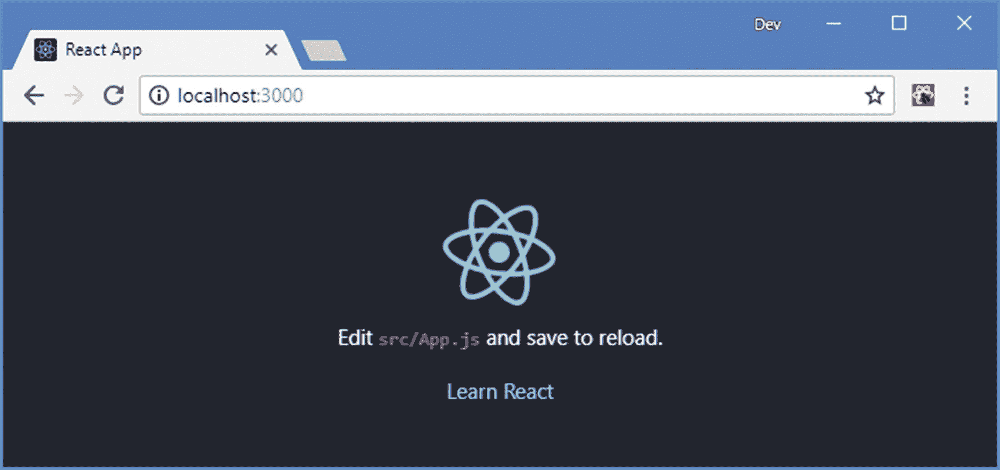
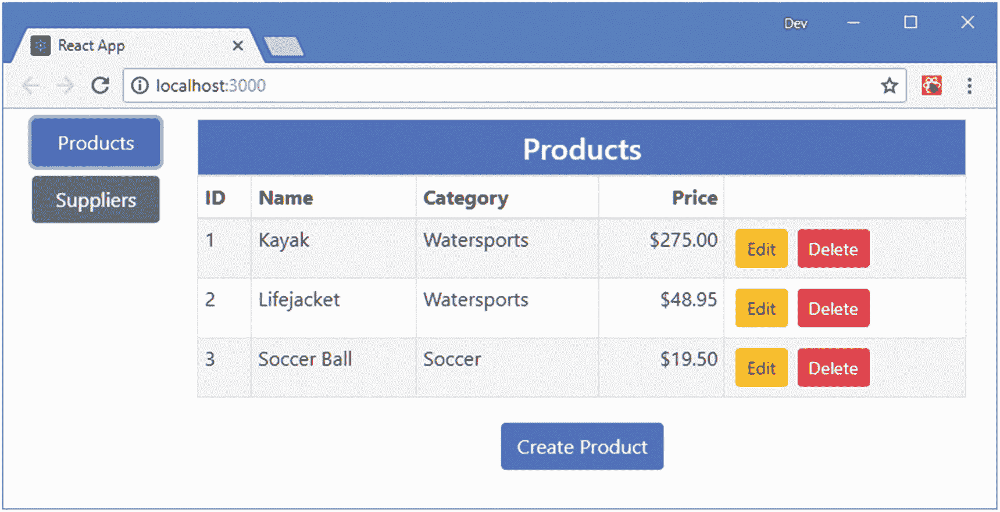
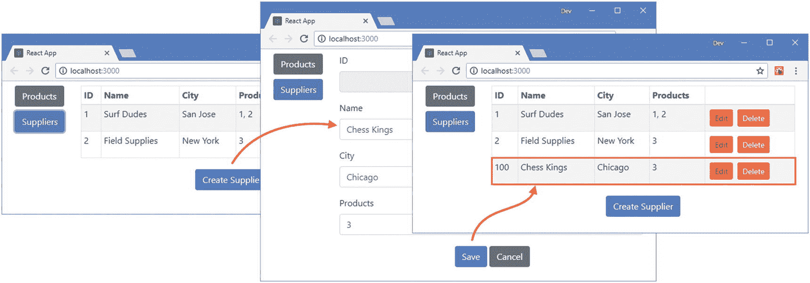

# 十八、创建完整的应用

React 为向用户呈现 HTML 内容提供了一组优秀的特性，并依赖第三方包来提供开发完整的 web 应用所需的支持功能。可以和 React 一起使用的包数不胜数，在本书的这一部分，我介绍了那些使用最广泛，也最有可能被本书读者需要的包。这些软件包都是开源的，可以免费获得，在某些情况下还有付费支持选项。

在这一章中，我仅使用本书第 2 部分中描述的特性构建了一个示例应用。在接下来的章节中，我将介绍第三方软件包，演示它们提供的特性，并解释它们解决的问题。表 [18-1](#Tab1) 提供了本书这一部分涵盖的包的简要概述。

表 18-1

本书这一部分描述的包

<colgroup><col class="tcol1 align-left"> <col class="tcol2 align-left"></colgroup> 
| 

名字

 | 

描述

 |
| --- | --- |
| Redux | Redux 提供了一个数据存储，用于管理应用组件之外的数据。我在第 19 章和第 20 章中使用了这个包。 |
| React 还原 | React Redux 通过其 props 将 React 组件连接到 Redux 数据存储，允许直接访问数据，而不依赖于 prop 线程。我在第 19 章和第 20 章中使用了这个包。 |
| React 路由 | React 路由为 React 应用提供 URL 路由，允许根据浏览器的 URL 选择显示给用户的组件。我在第 [21](21.html) 章和第 [22](22.html) 章使用这个包。 |
| 阿克斯 | Axios 为异步 HTTP 请求提供了一致的 API。我在第 [23](23.html) 章使用这个包来消费一个 RESTful web 服务，在第 [25](25.html) 章使用一个 GraphQL 服务。 |
| 阿波罗助推 | Apollo 是一个使用 GraphQL 服务的客户端，它比传统的 RESTful web 服务更加灵活。我在第 [25](25.html) 章中使用这个包的 Boost 版本来消费一个 GraphQL 服务，它为 React 应用提供了合理的缺省值。 |
| 阿波罗 React | React Apollo 将 React 组件连接到 GraphQL 查询和变异，允许通过 props 消费 GraphQL 服务。 |

我选择的每一个包都有可信的替代方案，我在每一章都提出了建议，以防你无法与所涵盖的包相处。如果您对我在本书的这一部分没有涉及的包感兴趣，请发电子邮件到`adam@adam-freeman.com`给我。虽然我不做任何承诺，但我会尝试在本书的下一个版本中，或者如果有足够的需求，在发布到本书的 GitHub 资源库的更新中，包含经常被请求的包。

## 创建项目

打开一个新的命令提示符，导航到一个方便的位置，并运行清单 [18-1](#PC1) 中所示的命令。

### 小费

你可以从 [`https://github.com/Apress/pro-react-16`](https://github.com/Apress/pro-react-16) 下载本章以及本书其他章节的示例项目。

```jsx
npx create-react-app productapp

Listing 18-1Creating the Example Project

```

运行清单 [18-2](#PC2) 中所示的命令，导航到`productapp`文件夹添加引导包。

```jsx
cd productapp
npm install bootstrap@4.1.2

Listing 18-2Adding the Bootstrap CSS Framework

```

为了在应用中包含引导 CSS 样式表，将清单 [18-3](#PC3) 中所示的语句添加到`index.js`文件中，该文件可以在`productapp/src`文件夹中找到。

```jsx
import React from 'react';
import ReactDOM from 'react-dom';
import './index.css';
import App from './App';
import * as serviceWorker from './serviceWorker';

import 'bootstrap/dist/css/bootstrap.css';

ReactDOM.render(<App />, document.getElementById('root'));

// If you want your app to work offline and load faster, you can change
// unregister() to register() below. Note this comes with some pitfalls.
// Learn more about service workers: http://bit.ly/CRA-PWA
serviceWorker.unregister();

Listing 18-3Including Bootstrap in the index.js File in the src Folder

```

### 启动开发工具

使用命令提示符，运行`productapp`文件夹中清单 [18-4](#PC4) 所示的命令来启动开发工具。

```jsx
npm start

Listing 18-4Starting the Development Tools

```

一旦项目的初始准备工作完成，一个新的浏览器窗口将打开并显示 URL `http://localhost:3000`，它显示了图 [18-1](#Fig1) 中的占位符内容。



图 18-1

运行示例应用

## 创建示例应用

本章中的应用很简单，但代表了仅使用 React 提供的功能构建的典型项目。该应用为用户提供了两种类型的数据(产品和供应商)的创建、读取、更新和删除(CRUD)功能，用户可以在被管理的数据之间切换。图 [18-2](#Fig2) 显示了一旦创建了以下章节中定义的组件，应用将如何出现。



图 18-2

示例应用

当然，示例应用是人为设计的，在这种情况下，我的目标是展示核心的 React 特性是强大的，但它们本身不足以创建复杂的 web 应用。一旦定义了应用，我就强调它所包含的问题，每一个问题我都使用下面章节中描述的工具和软件包来解决。

### 创建产品功能

为了开始应用的功能，我在`src`文件夹中添加了一个名为`ProductTableRow.js`的文件，并用它来定义清单 [18-5](#PC5) 中所示的组件。

```jsx
import React, { Component } from "react";

export class ProductTableRow extends Component {

    render() {
        let p = this.props.product;
        return <tr>
            <td>{ p.id }</td>
            <td>{ p.name }</td>
            <td>{ p.category}</td>
            <td className="text-right">${ Number(p.price).toFixed(2) }</td>
            <td>
                <button className="btn btn-sm btn-warning m-1"
                    onClick={ () => this.props.editCallback(p) }>
                        Edit
                </button>
                <button className="btn btn-sm btn-danger m-1"
                    onClick={ () => this.props.deleteCallback(p) }>
                        Delete
                    </button>
            </td>
        </tr>
    }
}

Listing 18-5The Contents of the ProductTableRow.js File in the src Folder

```

该组件在一个表中呈现一个单独的行，包含属性的列`id`、`name`、`category`和`price`，这些属性是从一个名为`product`的属性对象中获得的。还有一列显示编辑和删除按钮，这些按钮调用名为`editCallback`和`deleteCallback`的函数属性，并将`product`属性作为参数传递。

#### 创建产品表

我在`src`文件夹中添加了一个名为`ProductTable.js`的文件，并用它来定义清单 [18-6](#PC6) 中所示的组件。

```jsx
import React, { Component } from "react";
import { ProductTableRow } from "./ProductTableRow";

export class ProductTable extends Component {

    render() {
        return <table className="table table-sm table-striped table-bordered">
                <thead>
                    <tr>
                        <th colSpan="5"
                                className="bg-primary text-white text-center h4 p-2">
                            Products
                        </th>
                    </tr>
                    <tr>
                        <th>ID</th><th>Name</th><th>Category</th>
                        <th className="text-right">Price</th>
                        <th></th>
                    </tr>
                </thead>
                <tbody>
                    {
                        this.props.products.map(p =>
                            <ProductTableRow product={ p }
                                key={ p.id }
                                editCallback={ this.props.editCallback }
                                deleteCallback={ this.props.deleteCallback } />)
                    }
                </tbody>
            </table>
    }
}

Listing 18-6The Contents of the ProductTable.js File in the src Folder

```

该组件呈现一个表，表体由名为`products`的数组`prop`中每个对象的`ProductTableRow`组件填充。该组件将`deleteCallback`和`editCallback`功能属性传递给`ProductTableRow`实例。

#### 创建产品编辑器

为了允许用户编辑产品或为新产品提供价值，我在`src`文件夹中添加了一个名为`ProductEditor.js`的文件，并添加了清单 [18-7](#PC7) 中所示的代码。

```jsx
import React, { Component } from "react";

export class ProductEditor extends Component {

    constructor(props) {
        super(props);
        this.state = {
            formData: {
                id: props.product.id || "",
                name: props.product.name || "",
                category: props.product.category || "",
                price: props.product.price || ""
            }
        }
    }

    handleChange = (ev) => {
        ev.persist();
        this.setState(state => state.formData[ev.target.name] =  ev.target.value);
    }

    handleClick = () => {
        this.props.saveCallback(this.state.formData);
    }

    render() {
        return <div className="m-2">
            <div className="form-group">
                <label>ID</label>
                <input className="form-control" name="id"
                    disabled
                    value={ this.state.formData.id }
                    onChange={ this.handleChange } />
            </div>
            <div className="form-group">
                <label>Name</label>
                <input className="form-control" name="name"
                    value={ this.state.formData.name }
                    onChange={ this.handleChange } />
            </div>
            <div className="form-group">
                <label>Category</label>
                <input className="form-control" name="category"
                    value={ this.state.formData.category }
                    onChange={ this.handleChange } />
            </div>
            <div className="form-group">
                <label>Price</label>
                <input className="form-control" name="price"
                    value={ this.state.formData.price }
                    onChange={ this.handleChange } />
            </div>
            <div className="text-center">
                <button className="btn btn-primary m-1" onClick={ this.handleClick }>
                    Save
                </button>
                <button className="btn btn-secondary"
                        onClick={ this.props.cancelCallback }>
                    Cancel
                </button>
            </div>
        </div>
    }
}

Listing 18-7The Contents of the ProductEditor.js File in the src Folder

```

`ProductEditor`组件为用户提供编辑对象属性的字段。这些字段的初始值是从名为`product`的 prop 接收的，用于填充状态数据。有一个保存按钮，当它被单击时调用一个名为`saveCallback`的函数属性，传递状态数据值以便保存。还有一个取消按钮，当它被点击时调用一个名为`cancelCallback`的函数回调。

#### 创建产品展示组件

接下来，我需要一个在产品表和产品编辑器之间切换的组件。我在`src`文件夹中添加了一个名为`ProductDisplay.js`的文件，并用它来定义清单 [18-8](#PC8) 中所示的组件。

```jsx
import React, { Component } from "react";
import { ProductTable } from "./ProductTable"
import { ProductEditor } from "./ProductEditor";

export class ProductDisplay extends Component {

    constructor(props) {
        super(props);
        this.state = {
            showEditor: false,
            selectedProduct: null
        }
    }

    startEditing = (product) => {
        this.setState({ showEditor: true, selectedProduct: product })
    }

    createProduct = () => {
        this.setState({ showEditor: true, selectedProduct: {} })
    }

    cancelEditing = () => {
        this.setState({ showEditor: false, selectedProduct: null })
    }

    saveProduct = (product) => {
        this.props.saveCallback(product);
        this.setState({ showEditor: false, selectedProduct: null })
    }

    render() {
        if (this.state.showEditor) {
            return <ProductEditor
                key={ this.state.selectedProduct.id || -1 }
                product={ this.state.selectedProduct }
                saveCallback={ this.saveProduct }
                cancelCallback={ this.cancelEditing } />
        } else {
            return <div className="m-2">
                <ProductTable products={ this.props.products }
                    editCallback={ this.startEditing }
                    deleteCallback={ this.props.deleteCallback } />
                <div className="text-center">
                    <button className="btn btn-primary m-1"
                        onClick={ this.createProduct }>
                        Create Product
                    </button>
                </div>
            </div>
        }
    }
}

Listing 18-8The Contents of the ProductDisplay.js File in the src Folder

```

该组件定义状态数据，以确定是否应该显示数据表或编辑器，如果是编辑器，则确定用户想要修改哪个产品。该组件将函数属性传递给`ProductEditor`和`ProductTable`组件，并引入自己的功能。

### 创建供应商功能

应用中处理供应商数据的部分遵循与前面部分中创建的组件相似的模式。我在`src`文件夹中添加了一个名为`SupplierTableRow.js`的文件，并用它来定义清单 [18-9](#PC9) 中所示的组件。

```jsx
import React, { Component } from "react";

export class SupplierTableRow extends Component {

    render() {
        let s = this.props.supplier;
        return <tr>
            <td>{ s.id }</td>
            <td>{ s.name }</td>
            <td>{ s.city}</td>
            <td>{ s.products.join(", ") }</td>
            <td>
                <button className="btn btn-sm btn-warning m-1"
                    onClick={ () => this.props.editCallback(s) }>
                        Edit
                </button>
                <button className="btn btn-sm btn-danger m-1"
                    onClick={ () => this.props.deleteCallback(s) }>
                        Delete
                    </button>
            </td>
        </tr>
    }
}

Listing 18-9The Contents of the SupplierTableRow.js File in the src Folder

```

该组件使用名为`supplier`的属性对象的`id`、`name`、`city`和`products`属性呈现一个表格行。还有调用功能属性的编辑和删除按钮。

#### 创建供应商表

为了向用户呈现一个供应商表，我在`src`文件夹中添加了一个名为`SupplierTable.js`的文件，并添加了清单 [18-10](#PC10) 中所示的代码。

```jsx
import React, { Component } from "react";
import { SupplierTableRow } from "./SupplierTableRow";

export class SupplierTable extends Component {

    render() {
        return <table className="table table-sm table-striped table-bordered">
                <thead>
                    <tr>
                        <th>ID</th><th>Name</th><th>City</th>
                        <th>Products</th><th></th>
                    </tr>
                </thead>
                <tbody>
                    {
                        this.props.suppliers.map(s =>
                            <SupplierTableRow supplier={ s }
                                key={ s.id }
                                editCallback={ this.props.editCallback }
                                deleteCallback={ this.props.deleteCallback } />)
                    }
                </tbody>
            </table>
    }
}

Listing 18-10The Contents of the SupplierTable.js File in the src Folder

```

该组件呈现一个表格，将`suppliers`属性数组中的每个对象映射到一个`SupplierTableRow`。回调的属性从父组件接收并传递。

#### 创建供应商编辑器

为了创建供应商编辑器，我在`src`文件夹中添加了一个名为`SupplierEditor.js`的文件，并用它来定义清单 [18-11](#PC11) 中所示的组件。

```jsx
import React, { Component } from "react";

export class SupplierEditor extends Component {

    constructor(props) {
        super(props);
        this.state = {
            formData: {
                id: props.supplier.id || "",
                name: props.supplier.name || "",
                city: props.supplier.city || "",
                products: props.supplier.products || [],
            }
        }
    }

    handleChange = (ev) => {
        ev.persist();
        this.setState(state =>
            state.formData[ev.target.name] =
                ev.target.name === "products"
                    ? ev.target.value.split(",") : ev.target.value);
    }

    handleClick = () => {
        this.props.saveCallback(
            {
                ...this.state.formData,
                products: this.state.formData.products.map(val => Number(val))
            });
    }

    render() {
        return <div className="m-2">
            <div className="form-group">
                <label>ID</label>
                <input className="form-control" name="id"
                    disabled
                    value={ this.state.formData.id }
                    onChange={ this.handleChange } />
            </div>
            <div className="form-group">
                <label>Name</label>
                <input className="form-control" name="name"
                    value={ this.state.formData.name }
                    onChange={ this.handleChange } />
            </div>
            <div className="form-group">
                <label>City</label>
                <input className="form-control" name="city"
                    value={ this.state.formData.city }
                    onChange={ this.handleChange } />
            </div>

            <div className="form-group">
                <label>Products</label>
                <input className="form-control" name="products"
                    value={ this.state.formData.products }
                    onChange={ this.handleChange } />
            </div>

            <div className="text-center">
                <button className="btn btn-primary m-1" onClick={ this.handleClick }>
                    Save
                </button>
                <button className="btn btn-secondary"
                        onClick={ this.props.cancelCallback }>
                    Cancel
                </button>
            </div>
        </div>
    }
}

Listing 18-11The Contents of the SupplierEditor.js File in the src Folder

```

#### 创建供应商显示组件

为了管理应用中处理供应商数据的部分，以便只显示表格或编辑器，我在`src`文件夹中添加了一个名为`SupplierDisplay.js`的文件，并用它来定义清单 [18-12](#PC12) 中所示的组件。

```jsx
import React, { Component } from "react";
import { SupplierEditor } from "./SupplierEditor";
import { SupplierTable } from "./SupplierTable";

export class SupplierDisplay extends Component {

    constructor(props) {
        super(props);
        this.state = {
            showEditor: false,
            selected: null
        }
    }

    startEditing = (supplier) => {
        this.setState({ showEditor: true, selected: supplier })
    }

    createSupplier = () => {
        this.setState({ showEditor: true, selected: {} })
    }

    cancelEditing = () => {
        this.setState({ showEditor: false, selected: null })
    }

    saveSupplier= (supplier) => {
        this.props.saveCallback(supplier);
        this.setState({ showEditor: false, selected: null })
    }

    render() {
        if (this.state.showEditor) {
            return <SupplierEditor
                key={ this.state.selected.id || -1 }
                supplier={ this.state.selected }
                saveCallback={ this.saveSupplier }
                cancelCallback={ this.cancelEditing } />
        } else {
            return <div className="m-2">
                    <SupplierTable suppliers={ this.props.suppliers }
                        editCallback={ this.startEditing }
                        deleteCallback={ this.props.deleteCallback }
                    />
                    <div className="text-center">
                        <button className="btn btn-primary m-1"
                            onClick={ this.createSupplier }>
                                Create Supplier
                        </button>
                    </div>
            </div>
        }
    }
}

Listing 18-12The Contents of the SupplierDisplay.js File in the src Folder

```

`SupplierDisplay`组件有自己的状态数据，用于确定是否应该显示编辑器或表格组件。

### 完成申请

为了允许用户在产品或供应商特性之间进行选择，我在`src`文件夹中添加了一个名为`Selector.js`的文件，并添加了清单 [18-13](#PC13) 中所示的代码。

```jsx
import React, { Component } from "react";

export class Selector extends Component {

    constructor(props) {
        super(props);
        this.state = {
            selection: React.Children.toArray(props.children)[0].props.name
        }
    }

    setSelection = (ev) => {
        ev.persist();
        this.setState({ selection: ev.target.name});
    }

    render() {
        return <div className="container-fluid">
            <div className="row">
                <div className="col-2">
                    { React.Children.map(this.props.children, c =>
                        <button
                            name={ c.props.name }
                            onClick={ this.setSelection }
                            className={`btn btn-block m-2
                            ${this.state.selection === c.props.name
                                ? "btn-primary active": "btn-secondary"}`}>
                                    { c.props.name }
                        </button>
                    )}

                </div>
                <div className="col">
                    {
                        React.Children.toArray(this.props.children)
                            .filter(c => c.props.name === this.state.selection)
                    }
                </div>
            </div>
        </div>
    }
}

Listing 18-13The Contents of the Selector.js File in the src Folder

```

`Selector`组件是一个容器，它为每个子组件呈现一个按钮，并且只显示用户选择的那个按钮。为了提供将由应用显示的数据以及对其进行操作的回调函数的实现，我向`src`文件夹添加了一个名为`ProductsAndSuppliers.js`的文件，并使用它来定义清单 [18-14](#PC14) 中所示的组件。

```jsx
import React, { Component } from 'react';
import { Selector } from './Selector';
import { ProductDisplay } from './ProductDisplay';
import { SupplierDisplay } from './SupplierDisplay';

export default class ProductsAndSuppliers extends Component {

    constructor(props) {
        super(props);
        this.state = {
            products: [
                { id: 1, name: "Kayak",
                category: "Watersports", price: 275 },
                { id: 2, name: "Lifejacket",
                    category: "Watersports", price: 48.95 },
                { id: 3, name: "Soccer Ball", category: "Soccer", price: 19.50 }
            ],
            suppliers: [
                { id: 1, name: "Surf Dudes", city: "San Jose", products: [1, 2] },
                { id: 2, name: "Field Supplies", city: "New York", products: [3] },
            ]
        }
        this.idCounter = 100;
    }

    saveData = (collection, item) => {
        if (item.id === "") {
            item.id = this.idCounter++;
            this.setState(state => state[collection]
                = state[collection].concat(item));
        } else {
            this.setState(state => state[collection]
                = state[collection].map(stored =>
                      stored.id === item.id ? item: stored))
        }
    }

    deleteData = (collection, item) => {
        this.setState(state => state[collection]
            = state[collection].filter(stored => stored.id !== item.id));
    }

    render() {
        return <div>
            <Selector>
                <ProductDisplay
                    name="Products"
                    products={ this.state.products }
                    saveCallback={ p => this.saveData("products", p) }
                    deleteCallback={ p => this.deleteData("products", p) } />
                <SupplierDisplay
                    name="Suppliers"
                    suppliers={ this.state.suppliers }
                    saveCallback={ s => this.saveData("suppliers", s) }
                    deleteCallback={ s => this.deleteData("suppliers", s) } />
            </Selector>
        </div>
    }
}

Listing 18-14The Contents of the ProductsAndSuppliers.js File in the src Folder

```

该组件定义了`product`和`suppliers`状态数据属性，并定义了允许为每个数据类别删除或保存对象的方法。该组件呈现一个`Selector`，并提供类别显示组件作为其子组件。

最后一步是替换`App`组件的内容，以便向用户显示前面几节中定义的定制组件，如清单 [18-15](#PC15) 所示。

```jsx
import React, { Component } from "react";
import ProductsAndSuppliers from "./ProductsAndSuppliers";

export default class App extends Component {

    render() {
        return <ProductsAndSuppliers/>
    }
}

Listing 18-15Adding Data and Methods to the App.js File in the src Folder

```

一旦保存了对`App`组件的更改，浏览器将显示完整的示例应用。为了确保一切正常，请单击“供应商”按钮，单击“创建供应商”按钮，并填写表单。点击保存按钮，您应该会在表格中看到一个新条目，其中包含您输入的详细信息，如图 [18-3](#Fig3) 所示。



图 18-3

测试示例应用

## 理解示例应用的局限性

示例应用展示了如何组合 React 组件来创建应用——但也展示了 React 提供的特性的局限性。

示例应用的最大限制是，它使用硬编码到`App`组件中的静态定义数据。每次启动应用时都会显示相同的数据，当浏览器重新加载或关闭时，更改会丢失。

尽管现代浏览器支持在本地存储有限数量的数据，但在 web 应用之外保存数据的最常见方式是使用 web 服务。React 不包括对使用 web 服务的集成支持，但是有一些好的选择，既包括简单的 web 服务，我在第 [23](23.html) 章中描述了它们，也包括那些呈现更复杂数据的服务，我在第 [24](24.html) 和 [25](25.html) 章中描述了它们。

下一个限制是状态数据一直被提升到应用的顶部。正如我在第 2 部分中所解释的，状态数据可以用于组件之间的协调，并且状态数据可以提升到需要访问相同数据的组件的共同祖先。

示例应用展示了这种方法的缺点，即重要的数据——在本例中是`products`和`suppliers`数组——最终被推到应用的顶层。当组件被卸载并且它们的状态数据丢失时，React 会销毁组件，这意味着示例应用中位于`Selector`下面的任何组件都不适合存储应用的数据。因此，应用的所有数据都已经在`App`组件中定义了，还有操作这些数据的方法。我为应用选择的结构加剧了这个问题，但潜在的问题是，组件的状态非常适合跟踪管理呈现给用户的内容所需的数据——例如是否应该显示数据表或编辑器——但不太适合管理与应用目的相关的数据，通常称为*域数据*或*模型数据*。

防止模型数据被推送到顶层组件的最好方法是将它放在一个单独的数据存储中，这样 React 组件就可以处理数据的表示，而不必管理它。我将在第 19 章和第 20 章中解释数据存储的用途，并向您展示如何创建数据存储。

该应用还受到限制，因为它要求用户通过特定的任务序列来获得特定的功能。在许多应用中，尤其是那些被设计来支持特定公司功能的应用，用户必须执行一小部分任务，并且希望能够尽可能容易地启动它们。示例应用仅呈现其响应于点击特定元素的特性。在第 [21](21.html) 和 [22](22.html) 章中，我添加了对 URL 路由的支持，这使得用户可以直接导航到特定的功能。

## 摘要

在这一章中，我创建了一个示例应用，我将在本书的这一部分对其进行增强。在下一章中，我将通过引入一个数据存储来开始这个过程，它将允许模型数据从`App`组件中移除，并直接分发给应用中需要它的部分。