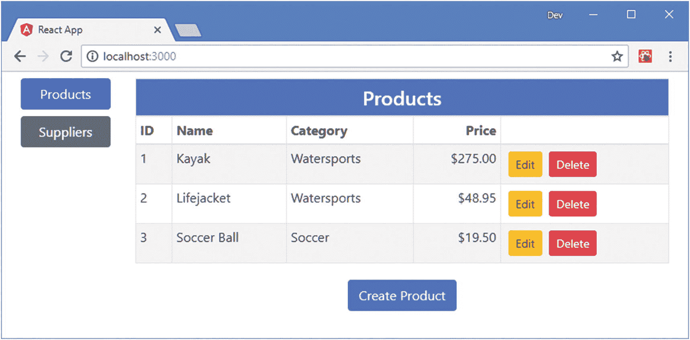
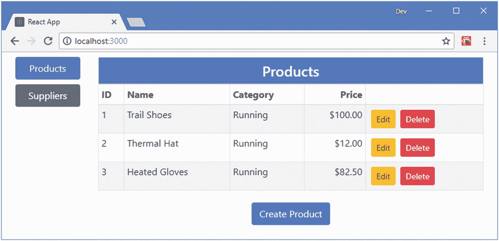
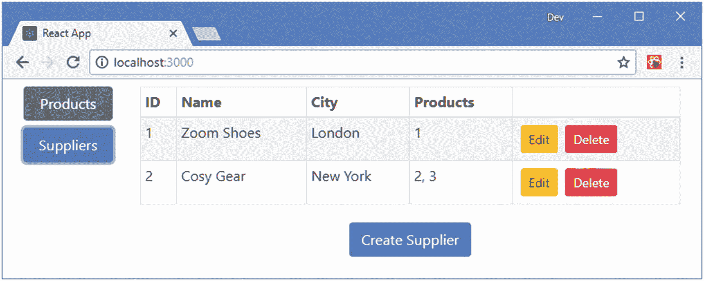
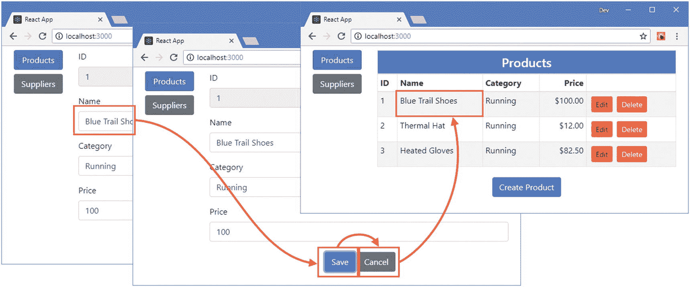
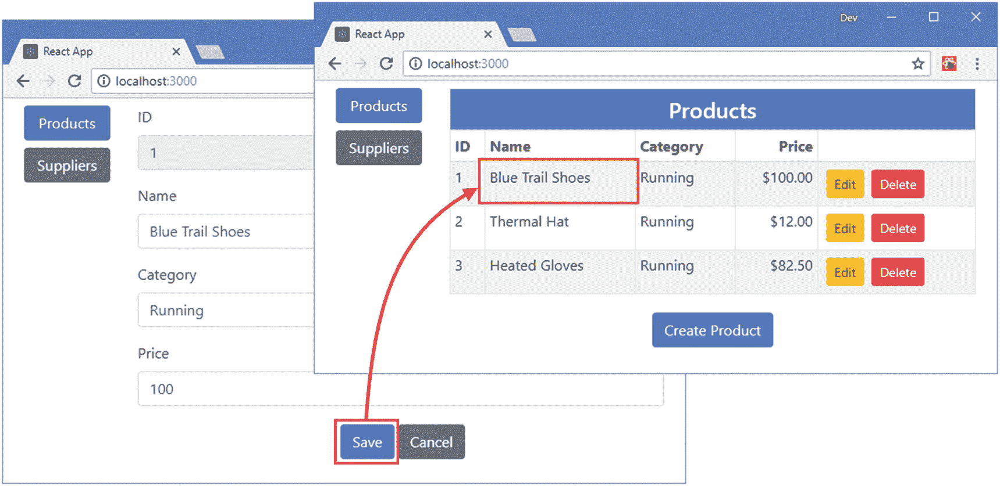
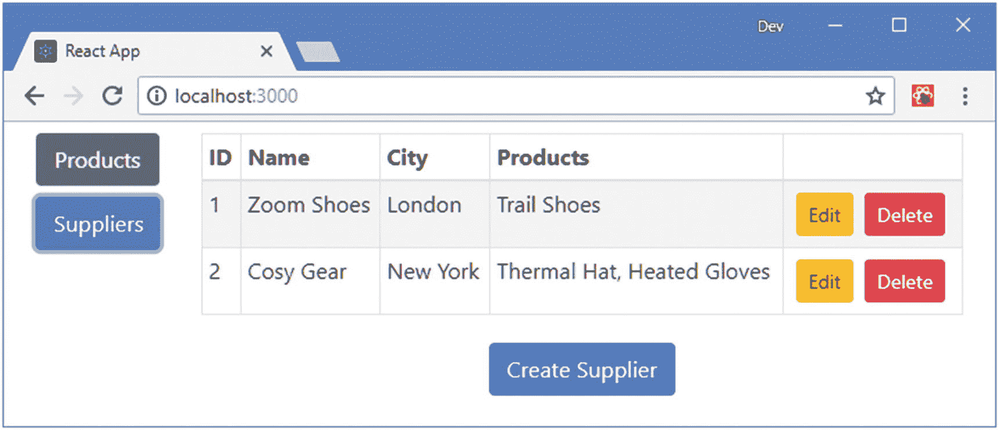

# 十九、使用 Redux 数据存储

一个*数据存储库*将应用的数据移动到 React 组件层次结构之外。使用数据存储意味着数据不必提升到顶层组件，也不必通过线程来确保在需要的地方访问数据。结果是一个更自然的应用结构，让 React 组件专注于他们擅长的事情，即为用户呈现内容。

但是数据存储可能很复杂，将它们引入应用可能是一个违反直觉的过程。在这一章中，我将介绍 Redux，它是 React 项目中最受欢迎的数据存储选择，并向您展示如何创建数据存储并集成到应用中。在第 [20](20.html) 章中，我将更深入地解释 Redux 的工作原理，并解释它的一些高级特性。表 [19-1](#Tab1) 将使用 Redux 数据存储放在上下文中。

表 19-1

将 Redux 数据存储放在上下文中

<colgroup><col class="tcol1 align-left"> <col class="tcol2 align-left"></colgroup> 
| 

问题

 | 

回答

 |
| --- | --- |
| 这是什么？ | 数据存储将应用的数据移动到组件层次结构之外，这意味着数据不必提升，然后通过适当的线程提供给后代。 |
| 为什么有用？ | 数据存储可以简化项目中的组件，生成更易于开发和测试的应用。 |
| 如何使用？ | 数据被移动到应用的专用部分，需要数据的组件可以直接访问这些数据。在 Redux 的情况下，组件通过 props 连接到数据存储，这利用了 React 的性质，尽管映射过程本身可能很笨拙，需要密切关注。 |
| 有什么陷阱或限制吗？ | 数据存储可能很复杂，并且经常以违反直觉的方式工作。一些数据存储包，包括 Redux，强制执行一些特定的方法来处理一些开发人员认为有限制性的数据。 |
| 还有其他选择吗？ | 并非所有应用都需要数据存储。对于较少量的数据，使用组件状态特性可能是可接受的，第 [14](14.html) 章中描述的 React 上下文 API 可用于基本的数据管理特性。 |

表 [19-2](#Tab2) 总结了本章内容。

表 19-2

章节总结

<colgroup><col class="tcol1 align-left"> <col class="tcol2 align-left"> <col class="tcol3 align-left"></colgroup> 
| 

问题

 | 

解决办法

 | 

列表

 |
| --- | --- | --- |
| 创建数据存储 | 定义初始数据、活动类型、创建者和缩减者 | 3–8, 13–21 |
| 向 React 应用添加数据存储 | 使用 React-Redux 包中的`Provider`组件 | nine |
| 使用 React 组件中的数据存储 | 使用`connect`函数将组件的属性映射到数据存储的数据和动作创建者 | 10, 12 |
| 分派多个数据存储操作 | 将数据存储动作创建者映射到组件功能属性时，直接使用`dispatch`函数。 | Twenty-two |

## 为本章做准备

在本章中，我继续使用在第 [18](18.html) 章中创建的`productapp`项目。为了准备本章，打开一个新的命令提示符并运行清单`productapp`文件夹中的 [19-1](#PC1) 所示的命令。

### 小费

你可以从 [`https://github.com/Apress/pro-react-16`](https://github.com/Apress/pro-react-16) 下载本章以及本书其他章节的示例项目。

```jsx
npm install redux@4.0.1
npm install react-redux@6.0.0

Listing 19-1Installing Packages

```

为了快速参考，表 [19-3](#Tab3) 描述了清单 [19-1](#PC1) 中的命令添加到项目中的包。

表 19-3

添加到项目中的包

<colgroup><col class="tcol1 align-left"> <col class="tcol2 align-left"></colgroup> 
| 

名字

 | 

描述

 |
| --- | --- |
| `redux` | 这个包包含 Redux 数据存储的主要特性。 |
| `react-redux` | 这个包包含使用 Redux 和 React 的集成特性。 |

一旦软件包安装完毕，运行`productapp`文件夹中清单 [19-2](#PC2) 所示的命令来启动 React 开发工具。

```jsx
npm start

Listing 19-2Starting the Development Tools

```

一旦应用被编译，开发 HTTP 服务器将启动并显示如图 [19-1](#Fig1) 所示的内容。



图 19-1

运行示例应用

## 创建数据存储

与 React 非常相似，Redux 为数据和更改强加了一个特定的流。而且，像 React 一样，理解 Redux 的不同部分是如何组合在一起的，一开始可能会很困难。Redux 有两个特点会引起混淆。

首先，Redux 中的更改不会直接应用于存储中的数据，即使这些数据被表示为常规的 JavaScript 对象。相反，Redux 依赖于接受有效负载并更新存储中数据的函数，类似于 React 组件强制使用`setState`方法来更新状态数据的方式。

第二个困惑点是术语。Redux 数据存储中有许多不同的部分，它们的名称不能直观地描述它们的用途。作为 Redux 入门的快速参考，表 [19-4](#Tab4) 描述了您将会遇到的术语，并且在接下来的章节中有更详细的解释，在后面的章节中，我创建了一个数据存储并将其集成到示例应用中。

表 19-4

重要的冗余术语

<colgroup><col class="tcol1 align-left"> <col class="tcol2 align-left"></colgroup> 
| 

名字

 | 

描述

 |
| --- | --- |
| 行为 | 动作描述了将改变存储中的数据的操作。Redux 不允许直接修改数据，需要动作来指定更改。 |
| 动作类型 | 动作是普通的 JavaScript 对象，有一个指定动作类型的类型参数。这确保了动作可以被正确地识别和处理。 |
| 动作创建者 | 动作创建器是创建动作的功能。动作创建者被呈现来将组件作为功能属性进行 React，以便调用动作创建者功能来将改变应用于数据存储。 |
| 还原剂 | 缩减器是接收动作并处理它在数据存储中表示的变化的功能。动作指定应该对数据存储应用哪个操作，但是包含 JavaScript 代码的 reducer 实现了这一点。 |
| 选择器 | 选择器为组件提供了对数据存储中所需数据的访问。选择器的作用是将组件作为数据属性。 |

### 选择替代的数据存储包

Redux 只是可与 React 一起使用的数据存储包之一，尽管它是最知名的，也是大多数项目选择的。如果你不喜欢 Redux 的工作方式，那么 MobX ( [`https://github.com/mobxjs/mobx`](https://github.com/mobxjs/mobx) )可能是一个不错的选择。MobX 与 React 配合得很好，并允许直接的状态改变。主要缺点是它依赖于 decorators，一些开发人员觉得这很笨拙，而且它还不是 JavaScript 规范的一部分(尽管它们被广泛使用，包括 Angular)。

在第 [24 章](24.html)和第 [25 章](25.html)中，我介绍了 GraphQL 并解释了它在为应用检索数据中的用途。如果您是一个忠实的 React 用户，那么您可能会考虑使用 Relay ( [`https://facebook.github.io/relay`](https://facebook.github.io/relay) )进行数据管理。Relay 只适用于 GraphQL，这意味着它并不适合所有项目，但是它有一些有趣的特性，并且可以很好地与 React 集成。

### 定义数据类型

示例应用包含应用于两种类型数据的类似功能集。在这种情况下，很容易导致管理数据存储的代码重复，执行本质上相同的操作，但在不同的对象集合上执行，结果是数据存储更难编写、更难理解，并且容易因复制一种类型数据的代码并不正确地对其进行调整而导致错误。

这是一个非常常见的问题，因此我将展示一个数据存储，它整合了尽可能多的常见代码。第一步是定义常量值，让我能够一致地识别整个数据存储中不同类型的数据。我创建了`src/store`文件夹，并在其中添加了一个名为`dataTypes.js`的文件，其语句如清单 [19-3](#PC3) 所示。

```jsx
export const PRODUCTS = "products";
export const SUPPLIERS = "suppliers";

Listing 19-3The Contents of the dataTypes.js File in the src/store Folder

```

### 定义初始数据

在后面的章节中，我将向您展示如何从 web 服务中获取数据，但是目前我将继续使用静态定义的数据。为了定义数据存储的初始内容，我在`store`文件夹中创建了一个名为`initialData.js`的文件，并添加了清单 [19-4](#PC4) 中所示的语句。

### 注意

随着我向示例应用添加更多的特性，我将创建数据存储的不同部分来保持特性的分离。我将把呈现给用户的产品和供应商数据称为*模型数据*，以将其与用于在组件之间进行协调的内部数据区分开来，我将把内部数据称为*状态数据*。

```jsx
import { PRODUCTS, SUPPLIERS } from "./dataTypes";

export const initialData = {
    [PRODUCTS]: [
        { id: 1, name: "Trail Shoes", category: "Running", price: 100 },
        { id: 2, name: "Thermal Hat", category: "Running", price: 12 },
        { id: 3, name: "Heated Gloves", category: "Running", price: 82.50 }],
    [SUPPLIERS]: [
        { id: 1, name: "Zoom Shoes", city: "London", products: [1] },
        { id: 2, name: "Cosy Gear", city: "New York", products: [2, 3] }],
}

Listing 19-4The Contents of the initialData.js File in the src/store Folder

```

数据存储的初始状态被定义为常规的 JavaScript 对象；使用 Redux 的一个特点是，它的许多特性都依赖于纯 JavaScript。为了清楚地说明数据存储何时被使用，我对`PRODUCTS`和`SUPPLIERS`数组中的对象使用了不同的细节。

### 定义模型数据操作类型

下一步是描述可以对存储中的数据执行的操作，这些操作被称为*操作*。在一个复杂的应用中可能会有很多操作，定义常量值来标识它们会很有帮助。我在`store`文件夹中添加了一个名为`modelActionTypes.js`的文件，并添加了清单 [19-5](#PC5) 中所示的内容。

```jsx
export const STORE  = "STORE";
export const UPDATE = "UPDATE";
export const DELETE = "DELETE";

Listing 19-5The Contents of the modelActionTypes.js File in the src/store Folder

```

为了提供示例应用的功能，我需要三个事件:`STORE`向数据存储添加对象，`UPDATE`修改现有对象，以及`DELETE`删除对象。

分配给动作类型的值并不重要，只要它是唯一的，最简单的方法是为每个动作类型分配一个名称字符串值。

### 定义模型动作创建者

动作是从应用发送到数据存储以请求更改的对象。动作具有动作类型和数据有效负载，其中动作类型指定操作，有效负载提供操作所需的数据。动作是普通的 JavaScript 对象，可以定义描述操作所需的任何属性组合。约定是定义一个`type`属性来指示事件类型，我将用`dataType`和`payload`属性来补充这个属性，以指定动作应该应用到的数据和动作所需的数据。

动作是由*动作创建者*创建的，T3 是从应用接受数据并返回描述数据存储变化的动作的函数的名字。为了定义动作创建者，我在`store`文件夹中添加了一个名为`modelActionCreators.js`的文件，并添加了清单 [19-6](#PC6) 中所示的代码。

```jsx
import { PRODUCTS, SUPPLIERS } from "./dataTypes"
import { STORE, UPDATE, DELETE } from "./modelActionTypes";

let idCounter = 100;

export const saveProduct = (product) => {
    return createSaveEvent(PRODUCTS, product);
}

export const saveSupplier = (supplier) => {
    return createSaveEvent(SUPPLIERS, supplier);
}

const createSaveEvent = (dataType, payload)  => {
    if (!payload.id) {
        return {
            type: STORE,
            dataType: dataType,
            payload: { ...payload, id: idCounter++ }
        }
    } else {
        return {
            type: UPDATE,
            dataType: dataType,
            payload: payload
        }
    }
}

export const deleteProduct = (product) => ({
    type: DELETE,
    dataType: PRODUCTS,
    payload: product.id
})

export const deleteSupplier = (supplier) => ({
    type: DELETE,
    dataType: SUPPLIERS,
    payload: supplier.id
})

Listing 19-6The Contents of the modelActionCreators.js File in the src/store Folder

```

清单中有四个动作创建者。`saveProduct`和`saveSupplier`函数接收一个对象参数并将其传递给`createSaveEvent`，后者检查`id`属性的值以确定是否需要`STORE`或`UPDATE`动作。`deleteProduct`和`deleteSupplier`动作创建器更简单，创建一个`DELETE`动作，其有效负载是要删除的对象的`id`属性值。

### 定义减速器

被称为*缩减器*的 JavaScript 函数将动作应用于数据存储。换句话说，一个动作描述了所需要的改变的类型，而 reducer 包含了实现它的逻辑。我在`store`文件夹中添加了一个名为`modelReducer.js`的文件，并添加了清单 [19-7](#PC7) 中所示的代码。

```jsx
import { STORE, UPDATE, DELETE } from "./modelActionTypes";
import { initialData } from "./initialData";

export default function(storeData, action) {
    switch (action.type) {
        case STORE:
            return {
                ...storeData,
                [action.dataType]:
                    storeData[action.dataType].concat([action.payload])
            }
        case UPDATE:
            return {
                ...storeData,
                [action.dataType]: storeData[action.dataType].map(p =>
                    p.id === action.payload.id ? action.payload : p)
            }
        case DELETE:
            return {
                ...storeData,
                [action.dataType]: storeData[action.dataType]
                    .filter(p => p.id !== action.payload)
            }
        default:
            return storeData || initialData;
    }
}

Listing 19-7The Contents of the modelReducer.js File in the src/store Folder

```

reducer 从数据存储中接收当前数据，并接收一个动作作为其参数。它检查该动作并使用它来创建新的数据对象，该对象将替换数据存储中的现有数据。

有两条重要的规则要遵循。首先，reducer 必须创建一个新的对象，并且不返回作为参数接收的对象，因为 Redux 将忽略已经做出的任何更改。其次，因为 reducer 创建的对象替换了存储中的数据，所以复制现有对象的属性很重要，而不仅仅是被操作修改的对象。复制属性的最简单方法是使用 spread 运算符，如下所示:

```jsx
...
case STORE:
    return {
        ...store,
        [action.dataType]: store[action.dataType].concat([action.payload])
}
...

```

这确保了所有属性都被复制到结果对象中。然后，被更改的数据的属性被替换为由该操作修改的数据。

reducer 的另一个重要方面是，它将在创建数据存储以获取初始数据时被调用。这由`switch`语句的`default`子句处理，如下所示:

```jsx
...
default:
    return storeData || initialData;
...

```

如果函数返回`undefined`，Redux 会报告一个错误，确保你返回一个有用的结果是很重要的。在清单中，我返回清单 [19-4](#PC4) 中定义的`initialData`对象。

### 避免缩减器中的代码重复

大多数数据集需要一组核心的常见操作。这可以在示例应用中看到，其中产品和供应商数据都需要存储、更新和删除操作。当您使用相似的动作类型、动作创建者和缩减器代码定义数据存储时，这可能会导致代码重复。我在本节中采用的方法是在操作中包含一个属性，该属性指定操作应该应用于哪种类型的数据，然后我依靠 JavaScript 属性访问器特性在 reducer 中选择适当的数据存储属性，如下所示:

```jsx
...
case STORE:
    return {
        ...store,
        [action.dataType]: store[action.dataType].concat([action.payload])
}
...

```

当创建新的数据存储对象时，JavaScript 将评估`action.dataType`属性，并使用它的值定义对象的新属性，并访问旧数据存储的属性，使用我在清单 [19-5](#PC5) 中定义的值，因此值`PRODUCTS`的`dataType`选择产品数据，值`SUPPLIERS`选择供应商数据。您不必在自己的项目中使用这种技术，但它有助于保持代码简洁和易于管理。

### 创建数据存储

Redux 提供了`createStore`函数，该函数创建数据存储并准备使用。我在`store`文件夹中添加了一个名为`index.js`的文件，并添加了清单 [19-8](#PC11) 中所示的代码。

### 小费

您不必使用`index.js`文件名，但是这样做允许只使用文件夹的名称来导入数据存储，如清单 [19-9](#PC12) 所示。

```jsx
import { createStore } from "redux";
import modelReducer from "./modelReducer";

export default createStore(modelReducer);

export { saveProduct, saveSupplier, deleteProduct, deleteSupplier }
    from "./modelActionCreators";

Listing 19-8The Contents of the index.js File in the src/store Folder

```

从`index.js`文件的默认导出是调用`createStore`的结果，它接受 reducer 函数作为它的参数。我还导出了动作创建器，这样所有数据存储的功能都可以通过应用中其他地方的单个`import`语句来访问，这使得使用数据存储稍微简单了一些。

## 在 React 应用中使用数据存储

我在上一节中创建的操作、缩减器和选择器还没有集成到应用中，应用中的组件和数据存储中的数据之间也没有链接。在接下来的小节中，我将向您展示如何使用数据存储来替换当前管理应用数据的状态数据和方法。

### 将数据存储应用于顶级组件

React-Redux 包包括一个 React 容器组件，它提供对数据存储的访问。这个组件叫做`Provider`，应用在组件层次结构的顶层，这样数据存储在整个应用中都是可用的。在清单 [19-9](#PC12) 中，我从清单 [19-8](#PC11) 中创建的`index.js`文件中导入数据存储，并使用`Provider`组件将数据存储应用于应用中的组件。

```jsx
import React, { Component } from "react";
import ProductsAndSuppliers from "./ProductsAndSuppliers";

import { Provider } from "react-redux";

import dataStore from "./store";

export default class App extends Component {

    render() {
        return (
            <Provider store={ dataStore }>
               <ProductsAndSuppliers/>
            </Provider>
        )
    }
}

Listing 19-9Applying the Data Store in the App.js File in the src Folder

```

`Provider`组件有一个用于指定数据存储的`store`属性，我在`import`语句中将其命名为`dataStore`。

### 连接产品数据

下一步是将数据存储连接到需要它所包含的数据的组件和操作它的动作创建器。我将采用最直接的方法，即使用 React-Redux 包提供的特性将`ProductDisplay`组件连接到数据存储，如清单 [19-10](#PC13) 所示。

```jsx
import React, { Component } from "react";
import { ProductTable } from "./ProductTable"
import { ProductEditor } from "./ProductEditor";

import { connect } from "react-redux";

import { saveProduct, deleteProduct } from "./store"

const mapStateToProps = (storeData) => ({

    products: storeData.products

})

const mapDispatchToProps = {

    saveCallback: saveProduct,
    deleteCallback: deleteProduct

}

const connectFunction = connect(mapStateToProps, mapDispatchToProps);

export const ProductDisplay = connectFunction(

        class extends Component {

        constructor(props) {
            super(props);
            this.state = {
                showEditor: false,
                selectedProduct: null
            }
        }

        startEditing = (product) => {
            this.setState({ showEditor: true, selectedProduct: product })
        }

        createProduct = () => {
            this.setState({ showEditor: true, selectedProduct: {} })
        }

        cancelEditing = () => {
            this.setState({ showEditor: false, selectedProduct: null })
        }

        saveProduct = (product) => {
            this.props.saveCallback(product);
            this.setState({ showEditor: false, selectedProduct: null })
        }

        render() {
            if (this.state.showEditor) {
                return <ProductEditor
                    key={ this.state.selectedProduct.id || -1 }
                    product={ this.state.selectedProduct }
                    saveCallback={ this.saveProduct }
                    cancelCallback={ this.cancelEditing } />
            } else {
                return <div className="m-2">
                    <ProductTable products={ this.props.products }
                        editCallback={ this.startEditing }
                        deleteCallback={ this.props.deleteCallback } />
                    <div className="text-center">
                        <button className="btn btn-primary m-1"
                            onClick={ this.createProduct }>
                            Create Product
                        </button>
                    </div>
                </div>
            }
        }
    })

Listing 19-10Connecting to the Data Store in the ProductDisplay.js File in the src Folder

```

第一步是定义一个接收数据存储并选择连接组件和存储的属性的函数，如下所示:

```jsx
...
const mapStateToProps = (storeData) => ({
    products: storeData.products
})
...

```

这个函数通常被命名为`mapStateToProps`，它返回一个对象，该对象将连接组件的正确名称映射到存储中的数据。这些映射被称为*选择器*，因为它们选择将被映射到组件属性的数据。在这种情况下，选择器将商店的`products`数组映射到一个名为`products`的属性。

下一步是创建对象，该对象将组件所需的功能属性映射到数据存储操作创建者，如下所示:

```jsx
...
const mapDispatchToProps = {
    saveCallback: saveProduct,
    deleteCallback: deleteProduct
}
...

```

React-Redux 包支持动作创建者与功能属性的不同连接方式，但这是最简单的，就是创建一个对象，将属性名称映射到动作创建者功能。当组件连接到数据存储时，这个对象中定义的 action creator 函数将被连接起来，以便自动调用 reducer。在这种情况下，我将`saveProduct`和`deleteProduct`动作创建者映射到名为`saveCallback`和`deleteCallback`的功能属性。

一旦定义了数据和函数属性的映射，它们就被传递给由 React-Redux 包提供的`connect`函数。

```jsx
...
const connectFunction = connect(mapStateToProps, mapDispatchToProps);
...

```

`connect`函数创建一个更高阶的组件(HOC ),它传递连接到数据存储的属性，这些属性与父组件提供的属性合并。

### 小费

高阶组件在第 [14 章](14.html)中描述。

最后一步是将一个组件传递给由`connect`返回的函数，就像这样:

```jsx
...
export const ProductDisplay = connectFunction(class extends Component {
...

```

结果是一个组件，其属性连接到数据存储。当您保存清单 [19-10](#PC13) 中的更改时，应用将显示清单 [19-4](#PC4) 中定义的数据，如图 [19-2](#Fig2) 所示。



图 19-2

使用产品数据的数据存储

因为数据存储提供的属性替换了来自父组件的属性，`ProductDisplay`组件完全在数据存储数据上操作，包括创建、编辑和删除对象。

### 连接供应商数据

同样的过程可以应用于连接供应商数据，如清单 [19-11](#PC18) 所示，其中我使用了`connect`方法为`SupplierDisplay`组件提供对数据存储的访问。

```jsx
import React, { Component } from "react";
import { SupplierEditor } from "./SupplierEditor";
import { SupplierTable } from "./SupplierTable";

import { connect } from "react-redux";

import { saveSupplier, deleteSupplier} from "./store";

const mapStateToProps = (storeData) => ({

    suppliers: storeData.suppliers

})

const mapDispatchToProps = {

    saveCallback: saveSupplier,
    deleteCallback: deleteSupplier

}

const connectFunction = connect(mapStateToProps, mapDispatchToProps);

export const SupplierDisplay = connectFunction(

    class extends Component {

        constructor(props) {
            super(props);
            this.state = {
                showEditor: false,
                selected: null
            }
        }

        startEditing = (supplier) => {
            this.setState({ showEditor: true, selected: supplier })
        }

        createSupplier = () => {
            this.setState({ showEditor: true, selected: {} })
        }

        cancelEditing = () => {
            this.setState({ showEditor: false, selected: null })
        }

        saveSupplier= (supplier) => {
            this.props.saveCallback(supplier);
            this.setState({ showEditor: false, selected: null })
        }

        render() {
            if (this.state.showEditor) {
                return <SupplierEditor
                    key={ this.state.selected.id || -1 }
                    supplier={ this.state.selected }
                    saveCallback={ this.saveSupplier }
                    cancelCallback={ this.cancelEditing } />
            } else {
                return <div className="m-2">
                        <SupplierTable suppliers={ this.props.suppliers }
                            editCallback={ this.startEditing }
                            deleteCallback={ this.props.deleteCallback }
                        />
                        <div className="text-center">
                            <button className="btn btn-primary m-1"
                                onClick={ this.createSupplier }>
                                    Create Supplier
                            </button>
                        </div>
                </div>
            }
        }
    })

Listing 19-11Connecting to the Data Store in the SupplierDisplay.js File in the src Folder

```

结果是`SupplierDisplay`组件接收连接它到数据存储的属性，如图 [19-3](#Fig3) 所示。



图 19-3

使用供应商数据的数据存储

有了数据存储之后，`ProductsAndSuppliers`组件是多余的，因为它的作用是提供产品和供应商数据以及存储和删除这些数据的方法。在清单 [19-12](#PC19) 中，我已经更新了`App`组件以直接显示`Selector`、`ProductDisplay`和`SupplierDisplay`组件。

```jsx
import React, { Component } from "react";

//import ProductsAndSuppliers from "./ProductsAndSuppliers";

import { Provider } from "react-redux";
import dataStore from "./store";

import { Selector } from "./Selector";

import { ProductDisplay } from "./ProductDisplay";

import { SupplierDisplay } from "./SupplierDisplay";

export default class App extends Component {

    render() {
        return (
            <Provider store={ dataStore }>
                <Selector>
                    <ProductDisplay name="Products" />
                    <SupplierDisplay name="Suppliers" />
                </Selector>
            </Provider>
        )
    }
}

Listing 19-12Displaying Content Directly in the App.js File in the src Folder

```

注意，我不必为`ProductDisplay`和`SupplierDisplay`组件提供属性来让它们访问数据和方法；这些将通过将组件连接到数据存储的`connect`方法来设置。

## 扩展数据存储

数据存储不仅用于显示给用户的数据，还可以用于存储用于协调和管理组件的状态数据。扩展数据存储以包含状态数据将允许我将存储中的模型数据直接连接到使用它的组件，这在当前是不可能的，因为`ProductDisplay`和`SupplierDisplay`维护用于选择呈现给用户的内容的状态数据。

在接下来的小节中，我将状态数据和管理它的代码移到数据存储中，这样我可以进一步简化应用。

### 将状态数据添加到存储中

我希望将状态数据与模型数据分开，所以我将向存储中添加一些结构。我喜欢在用来填充数据存储的初始数据中表示结构，尽管这完全是为了帮助我理解我正在处理的数据的形状，而不是 Redux 强制要求的。

为了构建商店数据，我将现有数据移动到名为`modelData`的属性中，并添加了一个新的`stateData`部分，如清单 [19-13](#PC20) 所示。

```jsx
import { PRODUCTS, SUPPLIERS } from "./dataTypes";

export const initialData = {
    modelData: {
        [PRODUCTS]: [
            { id: 1, name: "Trail Shoes", category: "Running", price: 100 },
            { id: 2, name: "Thermal Hat", category: "Running", price: 12 },
            { id: 3, name: "Heated Gloves", category: "Running", price: 82.50 }],
        [SUPPLIERS]: [
            { id: 1, name: "Zoom Shoes", city: "London", products: [1] },
            { id: 2, name: "Cosy Gear", city: "New York", products: [2, 3] }],
    },
    stateData: {
        editing: false,
        selectedId: -1,
        selectedType: PRODUCTS
    }
}

Listing 19-13Expanding the Data in the initialData.js File in the src/store Folder

```

我的目标是将`ProductDisplay`和`SupplierDisplay`组件中的状态数据和逻辑移动到数据存储中。这些组件跟踪用户对编辑的选择，以及是否应该呈现表格或编辑器组件。为了在商店中提供这些信息，我在`stateData`部分定义了`editing`、`selected`和`selectedType`属性。

### 定义状态数据的操作类型和创建者

接下来，我需要为存储中的状态数据定义操作。当我建立数据存储时，我在不同的文件中定义了动作类型和创建者，但这不是必需的，两者可以一起定义。为了将状态数据动作与存储中的其他动作分开，我在`src/store`文件夹中添加了一个名为`stateActions.js`的文件，并使用它来定义动作类型和创建者，如清单 [19-14](#PC21) 所示。

```jsx
import { PRODUCTS, SUPPLIERS } from "./dataTypes";

export const STATE_START_EDITING = "state_start_editing";
export const STATE_END_EDITING = "state_end_editing";
export const STATE_START_CREATING = "state_start_creating";

export const startEditingProduct = (product) => ({
    type: STATE_START_EDITING,
    dataType: PRODUCTS,
    payload: product
})

export const startEditingSupplier = (supplier) => ({
    type: STATE_START_EDITING,
    dataType: SUPPLIERS,
    payload: supplier
})

export const endEditing = () => ({
    type: STATE_END_EDITING
})

export const startCreatingProduct = () => ({
    type: STATE_START_CREATING, dataType: PRODUCTS
})

export const startCreatingSupplier = () => ({
    type: STATE_START_CREATING, dataType: SUPPLIERS
})

Listing 19-14The Contents of the stateActions.js File in the src/store Folder

```

动作创建器对应于由`ProductDisplay`和`SupplierDisplay`组件定义的方法，并允许用户开始编辑对象、取消编辑和开始创建新对象。

### 定义状态数据缩减器

为了更新数据存储以响应动作，我需要定义一个缩减器。我将定义一个单独的函数来处理状态数据，而不是在现有的 reducer 中添加代码。我在`src/store`文件夹中添加了一个名为`stateReducer.js`的文件，并添加了清单 [19-15](#PC22) 中所示的代码。

```jsx
import { STATE_START_EDITING, STATE_END_EDITING, STATE_START_CREATING }
    from "./stateActions";
import { initialData } from "./initialData";

export default function(storeData, action) {
    switch(action.type) {
        case STATE_START_EDITING:
        case STATE_START_CREATING:
            return {
                ...storeData,
                editing: true,
                selectedId: action.type === STATE_START_EDITING
                    ? action.payload.id : -1,
                selectedType: action.dataType
            }
        case STATE_END_EDITING:
            return {
                ...storeData,
                editing: false
            }
        default:
            return storeData || initialData.stateData;
    }
}

Listing 19-15The Contents of the stateReducer.js File in the src/store Folder

```

状态数据的缩减器跟踪用户正在编辑或创建的内容，这与示例应用中现有组件所采用的方法相呼应，尽管我将使用一组属性来协调应用中两种模型数据的编辑器。

### 将状态数据特征合并到存储中

Redux 提供了`combineReducers`函数，它允许在一个数据存储中组合使用多个 reducer，每个 reducer 负责数据存储数据的一个部分。在清单 [19-16](#PC23) 中，我使用了`combineReducers`函数来组合模型和状态数据的归约器。

```jsx
import { createStore, combineReducers } from "redux";

import modelReducer from "./modelReducer";

import stateReducer from "./stateReducer";

export default createStore(combineReducers(

    {
        modelData: modelReducer,
        stateData: stateReducer
    }));

export { saveProduct, saveSupplier, deleteProduct, deleteSupplier }
    from "./modelActionCreators";

Listing 19-16Configuring the Data Store in the index.js File in the src/store Folder

```

`createReducers`函数的参数是一个对象，其属性名对应于数据存储的各个部分以及管理它们的 reducers。在清单中，我让原来的缩减器负责数据存储的`modelData`部分，让清单 [19-15](#PC22) 中定义的缩减器负责`stateData`部分。组合的缩减器被传递给`createStore`函数来创建数据存储。

### 注意

每个缩减器在数据存储的一个单独部分上操作，但是当一个动作被处理时，每个缩减器被传递该动作，直到其中一个缩减器返回一个新的数据存储对象，指示该动作已经被处理。

向存储中的数据添加结构需要对模型数据的 reducer 函数返回的初始状态进行相应的更改，如清单 [19-17](#PC24) 所示。

```jsx
import { STORE, UPDATE, DELETE } from "./modelActionTypes";
import { initialData } from "./initialData";

export default function(storeData, action) {
    switch (action.type) {
        case STORE:
            return {
                ...storeData,
                [action.dataType]:
                    storeData[action.dataType].concat([action.payload])
            }
        case UPDATE:
            return {
                ...storeData,
                [action.dataType]: storeData[action.dataType].map(p =>
                    p.id === action.payload.id ? action.payload : p)
            }
        case DELETE:
            return {
                ...storeData,
                [action.dataType]: storeData[action.dataType]
                    .filter(p => p.id !== action.payload)
            }
        default:
            return storeData || initialData.modelData;
    }
}

Listing 19-17Changing the Initial State in the modelReducer.js File in the src/store Folder

```

当使用`combineReducers`功能时，每个缩减器仅被提供其在存储器中的数据部分，并不知道其余的数据和其他缩减器。这意味着我只需要改变初始数据的来源，而不必担心在应用一个动作时在新的数据结构中导航。

### 将 React 组件连接到存储的状态数据

现在，状态数据已经放入数据存储中，我可以将它连接到组件。我将定义单独的连接器组件，负责将数据存储特性映射到组件属性，而不是分别配置每个组件。我在`src/store`文件夹中创建了一个名为`EditorConnector.js`的文件，代码如清单 [19-18](#PC25) 所示。

### 了解演示者/连接器模式

使用数据存储的一种常见方法是使用两种不同类型的组件。演示者组件负责向用户呈现内容并响应用户输入。它们接收数据和函数属性，但不直接连接到数据存储。连接器组件——令人困惑的是，也被称为*容器组件*——连接到数据存储，为 presenter 组件提供属性。这是我在本章的这一部分中所采用的一般方法，尽管与 React/Redux 世界中的许多方法一样，实现细节可能会有所不同，并且对于如何最好地实现这种分离还存在争议。

```jsx
import { connect } from "react-redux";
import { endEditing } from "./stateActions";
import { saveProduct, saveSupplier } from "./modelActionCreators";
import { PRODUCTS, SUPPLIERS  } from "./dataTypes";

export const EditorConnector = (dataType, presentationComponent) => {

    const mapStateToProps = (storeData) => ({
        editing: storeData.stateData.editing
            && storeData.stateData.selectedType === dataType,
        product: (storeData.modelData[PRODUCTS]
            .find(p => p.id === storeData.stateData.selectedId)) || {},
        supplier:(storeData.modelData[SUPPLIERS]
            .find(s => s.id === storeData.stateData.selectedId)) || {}
    })

    const mapDispatchToProps = {
        cancelCallback: endEditing,
        saveCallback: dataType === PRODUCTS ? saveProduct: saveSupplier
    }

    return connect(mapStateToProps, mapDispatchToProps)(presentationComponent);
}

Listing 19-18The Contents of the EditorConnector.js File in the src/store Folder

```

`EditorConnector`是一个高阶组件，它为表示组件提供了`ProductEditor`和`SupplierEditor`组件所需的属性，这意味着这些组件可以使用相同的代码连接到数据存储，而不需要单独使用`connect`函数。为了支持这两种类型的编辑器，HOC 函数接受一种数据类型，用于选择将被映射到 props 的数据和动作创建者。

### 小费

注意，由`combineReducers`函数创建的数据存储的分段对数据选择没有任何影响，这意味着我可以从整个存储中选择数据。

为了给显示表格组件的组件提供相同的服务，我在`src/store`文件夹中添加了一个名为`TableConnector.js`的文件，并用它来定义清单 [19-19](#PC26) 中所示的 HOC。

```jsx
import { connect } from "react-redux";
import { startEditingProduct, startEditingSupplier } from "./stateActions";
import { deleteProduct, deleteSupplier } from "./modelActionCreators";
import { PRODUCTS, SUPPLIERS } from "./dataTypes";

export const TableConnector = (dataType, presentationComponent) => {

    const mapStateToProps = (storeData) => ({
        products: storeData.modelData[PRODUCTS],
        suppliers: storeData.modelData[SUPPLIERS]
    })

    const mapDispatchToProps = {
        editCallback: dataType === PRODUCTS
            ? startEditingProduct : startEditingSupplier,
        deleteCallback: dataType === PRODUCTS ? deleteProduct : deleteSupplier
    }

    return connect(mapStateToProps, mapDispatchToProps)(presentationComponent);
}

Listing 19-19The Contents of the TableConnector.js File in the src/store Folder

```

#### 应用连接器组件

连接器组件就位后，我可以从`ProductDisplay`和`SupplierDisplay`组件中移除状态数据和方法。清单 [19-20](#PC27) 显示了`ProductDisplay`组件的简化。

```jsx
import React, { Component } from "react";
import { ProductTable } from "./ProductTable"
import { ProductEditor } from "./ProductEditor";
import { connect } from "react-redux";

//import { saveProduct, deleteProduct } from "./store"

import { EditorConnector } from "./store/EditorConnector";

import { PRODUCTS } from "./store/dataTypes";

import { TableConnector } from "./store/TableConnector";

import { startCreatingProduct } from "./store/stateActions";

const ConnectedEditor = EditorConnector(PRODUCTS, ProductEditor);

const ConnectedTable = TableConnector(PRODUCTS, ProductTable);

const mapStateToProps = (storeData) => ({
    editing: storeData.stateData.editing,
    selected: storeData.modelData.products
        .find(item =>  item.id === storeData.stateData.selectedId) || {}
})

const mapDispatchToProps = {
    createProduct: startCreatingProduct,
}

const connectFunction = connect(mapStateToProps, mapDispatchToProps);

export const ProductDisplay = connectFunction(
    class extends Component {

        // constructor(props) {
        //     super(props);
        //     this.state = {
        //         showEditor: false,
        //         selectedProduct: null
        //     }
        // }

        // startEditing = (product) => {
        //     this.setState({ showEditor: true, selectedProduct: product })
        // }

        // createProduct = () => {
        //     this.setState({ showEditor: true, selectedProduct: {} })
        // }

        // cancelEditing = () => {
        //     this.setState({ showEditor: false, selectedProduct: null })
        // }

        // saveProduct = (product) => {
        //     this.props.saveCallback(product);
        //     this.setState({ showEditor: false, selectedProduct: null })
        // }

        render() {
            if (this.props.editing) {
                return <ConnectedEditor key={ this.props.selected.id || -1 } />
                // return <ProductEditor
                //     key={ this.state.selectedProduct.id || -1 }
                //     product={ this.state.selectedProduct }
                //     saveCallback={ this.saveProduct }
                //     cancelCallback={ this.cancelEditing } />
            } else {
                return <div className="m-2">
                    <ConnectedTable />
                    {/* <ProductTable products={ this.props.products }
                        editCallback={ this.startEditing }
                        deleteCallback={ this.props.deleteCallback } />  */}
                    <div className="text-center">
                        <button className="btn btn-primary m-1"
                            onClick={ this.props.createProduct }>
                            Create Product
                        </button>
                    </div>
                </div>
            }
        }
    })

Listing 19-20Using Connector Components in the ProductDisplay.js File in the src Folder

```

注释掉的语句的数量显示了专用于向其子级提供数据和函数属性的`ProductDisplay`组件的数量，所有这些现在都通过数据存储和连接器组件来处理。不再需要本地状态数据，因此可以移除构造函数和除了`render c`之外的所有方法。但是，该组件仍然需要连接到数据存储，因为它需要知道显示哪个子组件，并且需要为编辑器组件生成键值。

清单 [19-21](#PC28) 显示了简化的`SupplierDisplay`组件，去掉了多余的语句，而不仅仅是注释掉。

```jsx
import React, { Component } from "react";
import { SupplierEditor } from "./SupplierEditor";
import { SupplierTable } from "./SupplierTable";
import { connect } from "react-redux";
import { startCreatingSupplier } from "./store/stateActions";
import { SUPPLIERS } from "./store/dataTypes";
import { EditorConnector } from "./store/EditorConnector";
import { TableConnector } from "./store/TableConnector";

const ConnectedEditor = EditorConnector(SUPPLIERS, SupplierEditor);
const ConnectedTable = TableConnector(SUPPLIERS, SupplierTable);

const mapStateToProps = (storeData) => ({
    editing: storeData.stateData.editing,
    selected: storeData.modelData.suppliers
        .find(item => item.id === storeData.stateData.selectedId) || {}
})

const mapDispatchToProps = {
    createSupplier: startCreatingSupplier
}

const connectFunction = connect(mapStateToProps, mapDispatchToProps);

export const SupplierDisplay = connectFunction(
    class extends Component {

        render() {
            if (this.props.editing) {
                return <ConnectedEditor key={ this.props.selected.id || -1 } />
            } else {
                return <div className="m-2">
                    <ConnectedTable />
                    <div className="text-center">
                        <button className="btn btn-primary m-1"
                            onClick={ this.props.createSupplier }>
                                Create Supplier
                        </button>
                    </div>
                </div>
            }
        }
    })

Listing 19-21Using Connector Components in the SupplierDisplay.js File in the src Folder

```

### 过度简化组件

随着我将数据存储的使用进一步推进到组件层次结构中，产品和供应商数据组件之间的差异已经减少，这些组件正在融合。此时，我可以用处理两种数据类型的单个组件替换`ProductDisplay`和`SupplierDisplay`组件，并继续从数据存储中驱动整个应用。然而，实际上，到了某一点，融合不再简化应用，而是开始简单地转移复杂性。随着您获得使用数据存储的经验，您将会发现您对数据存储的依赖程度和组件中的重复量感到满意。像 React 和 Redux 开发一样，这既是一种好的实践，也是一种个人偏好，值得尝试，直到找到适合自己的方法。

## 调度多个操作

示例应用使用数据存储的方式存在问题。如果您创建一个新对象或编辑一个现有对象，点击保存按钮更新数据存储但不改变显示给用户的组件，如图 [19-4](#Fig4) 所示，并且您必须点击取消按钮来更新改变所选组件的数据值。



图 19-4

使用示例应用进行更改

问题在于，将动作创建者映射到属性的`connect`函数默认只允许选择一个动作创建者，但是我需要两个动作创建者来解决这个问题:更新模型数据的`saveProduct`或`saveSupplier`创建者和发出编辑完成信号并向用户显示表格的`endEditing`创建者。

我不能定义一个新的创建者来执行这两项任务，因为每个操作都由一个缩减器处理，每个缩减器负责存储中数据的一个独立部分，这意味着一个操作可以导致模型数据或状态数据的改变，但不能同时导致两者的改变。

幸运的是，`connect`函数提供了另一种将属性映射到动作创建者的方法，这种方法提供了更多的灵活性。当 connect 方法的`mapDispatchToProps`参数为对象时，`connect`函数将每个动作创建者函数包装在一个`dispatch`方法中，该方法负责将动作创建者返回的动作发送给 reducer。这意味着这样映射创建者的对象:

```jsx
...
const mapDispatchToProps = {
    createSupplier: startCreatingSupplier
}
...

```

被转化成这样一个物体:

```jsx
...
const mapDispatchToProps = {
    createSupplier: payload => dispatch(startCreatingSupplier(payload))
}
...

```

调用动作创建器来获取动作，然后将动作传递给`dispatch`函数，这样它就可以被一个缩减器处理。不要定义一个对象，让`connect`函数包装每个创建者，你可以定义一个接受`dispatch`作为参数的函数，并产生明确处理动作创建和分派的属性，如清单 [19-22](#PC31) 所示。

```jsx
import { connect } from "react-redux";
import { endEditing } from "./stateActions";
import { saveProduct, saveSupplier } from "./modelActionCreators";
import { PRODUCTS, SUPPLIERS  } from "./dataTypes";

export const EditorConnector = (dataType, presentationComponent) => {

    const mapStateToProps = (storeData) => ({
        editing: storeData.stateData.editing
            && storeData.stateData.selectedType === dataType,
        product: (storeData.modelData[PRODUCTS]
            .find(p => p.id === storeData.stateData.selectedId)) || {},
        supplier:(storeData.modelData[SUPPLIERS]
            .find(s => s.id === storeData.stateData.selectedId)) || {}
    })

    const mapDispatchToProps = dispatch => ({
        cancelCallback: () => dispatch(endEditing()),
        saveCallback: (data) => {
            dispatch((dataType === PRODUCTS ? saveProduct: saveSupplier)(data));
            dispatch(endEditing());
        }
    });

    return connect(mapStateToProps, mapDispatchToProps)(presentationComponent);
}

Listing 19-22Dispatching Actions in the EditorConnector.js File in the src Folder

```

需要一个调度动作的函数作为每个映射属性的值，实现可以简单地调用动作创建者，或者在使用`saveCallback`属性的情况下，创建并调度多个动作。结果是由编辑器组件呈现的保存按钮调用一个功能属性，该属性分派更新模型数据和状态数据的动作，如图 [19-5](#Fig5) 所示。



图 19-5

调度多个操作

## 理解对参考文献的需求

您可能已经注意到，我使用`id`属性值和数据类型的组合来跟踪用户选择的对象，如下所示:

```jsx
...
stateData: {
    editing: false,
    selectedId: -1,
    selectedType: PRODUCTS
}
...

```

表组件将一个完整的对象传递给启动编辑过程的动作创建者，您可能想知道为什么我选择只保留对所选对象的 ID 引用，而不存储对象本身，特别是因为这种方法需要一些额外的工作来为编辑器组件获取对象。

```jsx
...
const mapStateToProps = (storeData) => ({
    editing: storeData.stateData.editing
        && storeData.stateData.selectedType === dataType,
    product: (storeData.modelData[PRODUCTS]
        .find(p => p.id === storeData.stateData.selectedId)) || {},
    supplier:(storeData.modelData[SUPPLIERS]
        .find(s => s.id === storeData.stateData.selectedId)) || {}
})
...

```

间接性是必需的，因为数据存储代表应用中的权威数据源，它可能会被将数据连接到组件的选择器更改。作为演示，我在`TableConnector`连接器组件中更改了供应商数据的选择器，如清单 [19-23](#PC34) 所示。

```jsx
import { connect } from "react-redux";
import { startEditingProduct, startEditingSupplier } from "./stateActions";
import { deleteProduct, deleteSupplier } from "./modelActionCreators";
import { PRODUCTS, SUPPLIERS } from "./dataTypes";

export const TableConnector = (dataType, presentationComponent) => {

    const mapStateToProps = (storeData) => ({
        products: storeData.modelData[PRODUCTS],
        suppliers: storeData.modelData[SUPPLIERS].map(supp => ({
            ...supp,
            products: supp.products.map(id =>
                storeData.modelData[PRODUCTS].find(p => p.id === Number(id)) || id)
                    .map(val => val.name || val)
        }))
    })

    const mapDispatchToProps = {
        editCallback: dataType === PRODUCTS
            ? startEditingProduct : startEditingSupplier,
        deleteCallback: dataType === PRODUCTS ? deleteProduct : deleteSupplier
    }

    return connect(mapStateToProps, mapDispatchToProps)(presentationComponent);
}

Listing 19-23Changing a Selector in the TableConnector.js File in the src Folder

```

新的选择器匹配供应商和产品数据，用包含相应产品的名称而不是值的属性替换每个供应商对象的`products p`属性，如图 [19-6](#Fig6) 所示。



图 19-6

改变选择器中的数据

每当需要相同的数据视图时，在选择器中转换数据可以确保一致性，但这并不意味着连接的组件不再使用数据存储中的原始数据。因此，依赖一个组件接收的数据来驱动另一个组件的行为可能会导致问题，正因为如此，我使用 ID 值来跟踪用户选择进行编辑的对象。

## 摘要

在本章中，我创建了一个 Redux 数据存储，并将其连接到示例应用中的组件。我向您展示了如何定义动作、动作创建者、缩减者和选择器，并且演示了如何将数据存储特性作为属性呈现给组件。在下一章，我将描述 Redux 通过其 API 提供的高级特性。