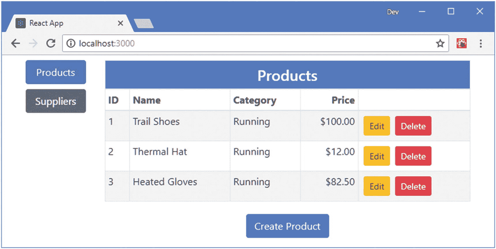
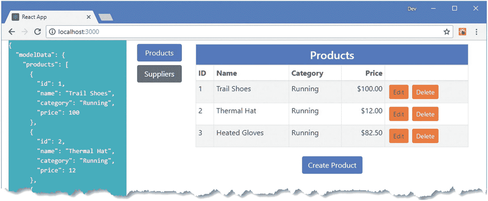
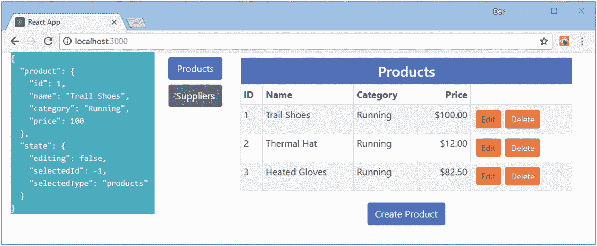
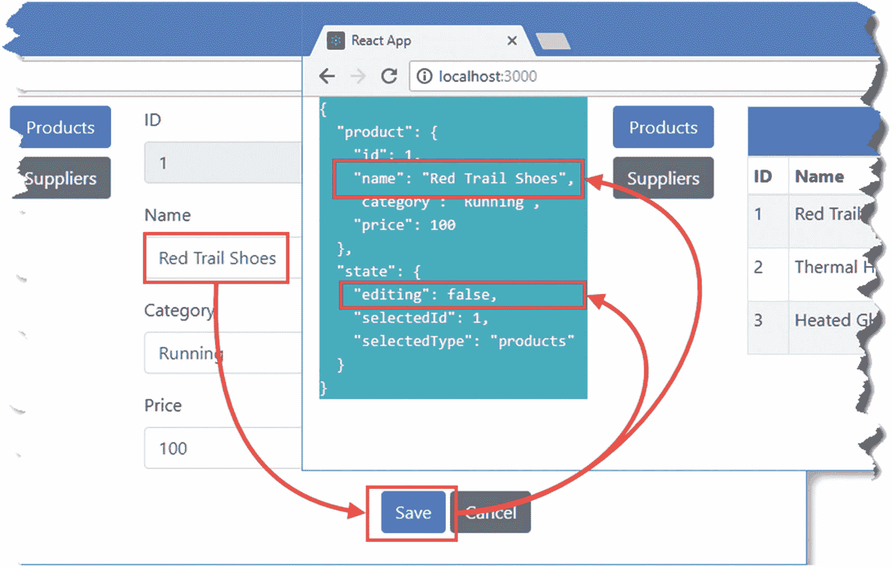
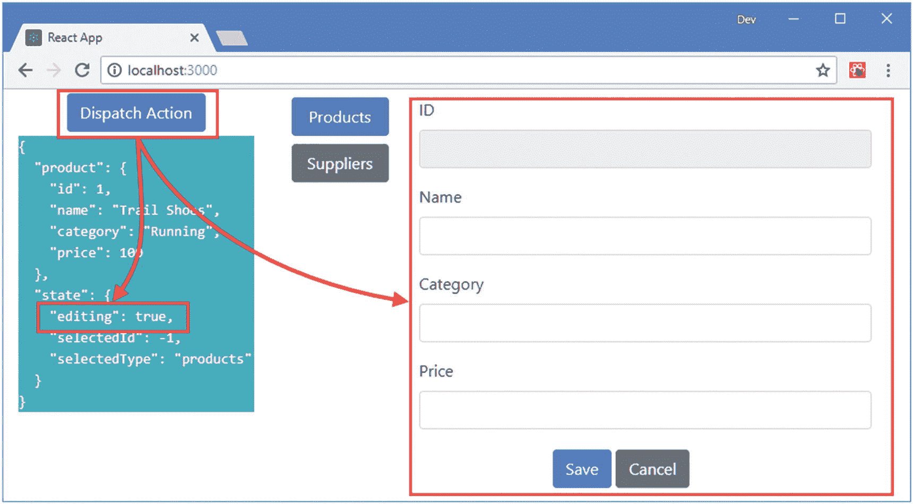
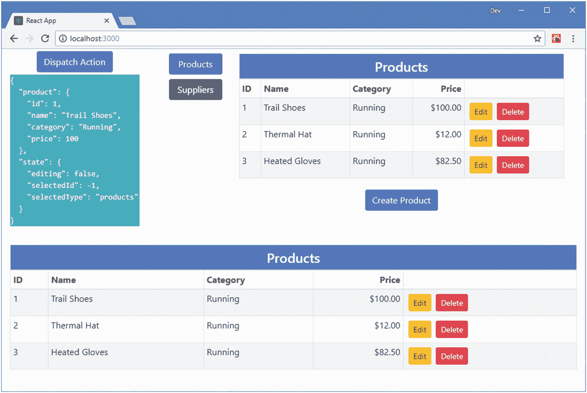
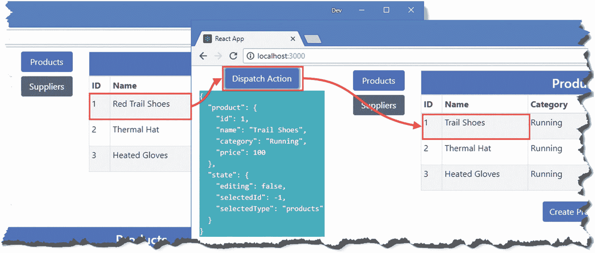
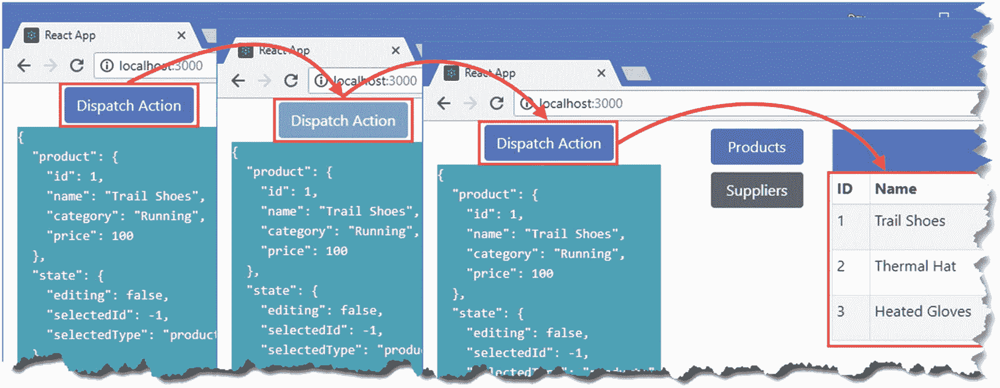

# 二十、使用数据存储 API

在第 [19](19.html) 章中，我向您展示了如何使用 Redux 和 React-Redux 包来创建数据存储并将其连接到示例应用。在这一章中，我描述了这两个包提供的高级使用的 API，允许直接访问数据存储和管理组件和它需要的数据特性之间的连接。表 [20-1](#Tab1) 将数据存储 API 放在上下文中。

表 20-1

将数据存储 API 放在上下文中

<colgroup><col class="tcol1 align-left"> <col class="tcol2 align-left"></colgroup> 
| 

问题

 | 

回答

 |
| --- | --- |
| 它们是什么？ | Redux 和 React-Redux 包都定义了支持高级使用的 API，超出了第 [19](19.html) 章描述的基本技术。 |
| 它们为什么有用？ | 这些 API 对于探索数据存储如何工作以及组件如何与它们连接非常有用。它们还可以用于向数据存储添加功能，以及微调应用对数据存储的使用。 |
| 它们是如何使用的？ | Redux API 直接用在数据存储对象上或在其创建期间使用。React-Redux API 在将组件连接到数据存储时使用，要么使用`connect`函数，要么使用其更灵活的`connectAdvanced`替代函数。 |
| 有什么陷阱或限制吗？ | 本章中描述的 API 需要仔细考虑，以确保达到预期的效果。很容易创建不能正确响应数据存储更改或更新过于频繁的应用。 |
| 还有其他选择吗？ | 您不必使用本章中描述的 API，大多数项目只需使用第 [19](19.html) 章中描述的基本技术就能有效地利用数据存储。 |

表 [20-2](#Tab2) 总结了本章内容。

表 20-2

章节总结

<colgroup><col class="tcol1 align-left"> <col class="tcol2 align-left"> <col class="tcol3 align-left"></colgroup> 
| 

问题

 | 

解决办法

 | 

列表

 |
| --- | --- | --- |
| 访问 Redux 数据存储 API | 使用由`createStore`方法返回的数据存储对象定义的方法 | 2–4 |
| 观察数据存储的变化 | 使用 subscribe 方法 | five |
| 调度操作 | 使用分派方法 | six |
| 创建自定义连接器 | 将组件的属性映射到数据存储功能 | 7–8 |
| 将要素添加到数据存储中 | 创建一个还原增强器 | 9–11 |
| 在传递给缩减器之前处理操作 | 创建中间件功能 | 12–16 |
| 扩展数据存储 API | 创建一个增强功能 | 17–19 |
| 将组件的属性合并到数据存储映射中 | 使用 connect 函数的可选参数 | 20–24 |

## 为本章做准备

在本章中，我继续使用在第 [18](18.html) 章创建并在第 [19](19.html) 章修改的`productapp`项目。本章不需要修改。打开一个新的命令提示符，导航到`productapp`文件夹，运行清单 [20-1](#PC1) 中所示的命令来启动开发工具。

### 小费

你可以从 [`https://github.com/Apress/pro-react-16`](https://github.com/Apress/pro-react-16) 下载本章以及本书其他章节的示例项目。

```jsx
npm start

Listing 20-1Starting the Development Tools

```

一旦开发工具启动，一个新的浏览器窗口将打开并显示如图 [20-1](#Fig1) 所示的内容。



图 20-1

运行示例应用

## 使用 Redux 数据存储 API

在大多数 React 应用中，对 Redux 数据存储的访问是通过 React-Redux 包进行的，该包将数据存储特性映射到 props。这是使用 Redux 最方便的方式，但是还有一个完整的 API 提供对数据存储特性的直接访问，我将在接下来的小节中描述，从提供对存储中数据的访问的特性开始。

在第 [19 章](19.html)中，我使用 Redux `createStore`函数创建了一个新的数据存储，这样我就可以将它作为属性从 React-Redux 包中传递给`Provider`组件。`createStore`函数返回的对象也可以通过表 [20-3](#Tab3) 中描述的四种方法直接使用。

表 20-3

数据存储方法

<colgroup><col class="tcol1 align-left"> <col class="tcol2 align-left"></colgroup> 
| 

名字

 | 

描述

 |
| --- | --- |
| `getState()` | 该方法从数据存储中返回数据，如“获取数据存储状态”一节中所述。 |
| `subscribe(listener)` | 该方法注册一个函数，每次对数据存储进行更改时都会调用该函数，如“观察数据存储更改”一节中所述。 |
| `dispatch(action)` | 该方法接受一个动作，通常由动作创建者产生，并将其发送到数据存储，以便 reducer 可以处理它，如“调度动作”一节所述。 |
| `replaceReducer(next)` | 此方法取代了数据存储用来处理动作的 reducer。这种方法在大多数项目中没有用，中间件提供了一种更有用的机制来改变数据存储的行为。 |

### 获取数据存储状态

`getState`方法返回数据存储中的数据，并允许读取存储的内容。作为演示，我在`store`文件夹中添加了一个名为`StoreAccess.js`的文件，并用它来定义清单 [20-2](#PC2) 中所示的组件。

```jsx
import React, { Component } from "react";

export class StoreAccess extends Component {

    render() {
        return <div className="bg-info">
            <pre className="text-white">
                { JSON.stringify(this.props.store.getState(), null, 2) }
            </pre>
        </div>
    }
}

Listing 20-2The Contents of the StoreAccess.js File in the src/store Folder

```

组件接收数据存储对象作为属性，并调用`getState`方法，该方法返回存储的数据对象。为了格式化数据，我使用了`JSON.stringify`方法，该方法将 JavaScript 对象序列化为 JSON，然后格式化结果以便于阅读。在清单 [20-3](#PC3) 中，我添加了一个网格布局，这样新的组件就会显示在应用其余功能的旁边。

```jsx
import React, { Component } from "react";
import { Provider } from "react-redux";
import dataStore from "./store";
import { Selector } from "./Selector";
import { ProductDisplay } from "./ProductDisplay";
import { SupplierDisplay } from "./SupplierDisplay";

import { StoreAccess } from "./store/StoreAccess";

export default class App extends Component {

    render() {
        return <div className="container-fluid">
            <div className="row">
                <div className="col-3">
                    <StoreAccess store={ dataStore } />
                </div>
                <div className="col">
                    <Provider store={ dataStore }>
                        <Selector>
                            <ProductDisplay name="Products" />
                            <SupplierDisplay name="Suppliers" />
                        </Selector>
                    </Provider>
                </div>
            </div>
        </div>
    }
}

Listing 20-3Displaying the Data Store Contents in the App.js File in the src Folder

```

一个商店中可能有很多数据，所以我显示了 JSON 文本，这样它将出现在自己的列中，如图 [20-2](#Fig2) 所示。如果您不能在屏幕上显示所有的文本，请不要担心，因为我很快会将焦点缩小到数据的子集。



图 20-2

获取数据存储的内容

如果您检查通过`getState`方法获得的数据，您将会看到所有的内容都包含在内，因此`modelData`和`stateData`属性的内容都是可用的。应用于 reducers 的分段不会影响由`getState`方法返回的数据，该方法提供了对数据存储中所有内容的访问。

#### 缩小对特定数据的关注

为了更容易跟踪数据存储的内容，我将重点关注由`getState`方法返回的数据的子集，这将允许我更容易地演示其他 Redux 特性。在清单 [20-4](#PC4) 中，我修改了`StoreAccess`组件，使其只显示第一个产品对象和一组状态数据变量。

```jsx
import React, { Component } from "react";

export class StoreAccess extends Component {

    constructor(props) {
        super(props);
        this.selectors = {
            product: (storeState) => storeState.modelData.products[0],
            state: (storeState) => storeState.stateData
        }
    }

    render() {
        return <div className="bg-info">
            <pre className="text-white">
                { JSON.stringify(this.selectData(), null, 2) }
            </pre>
        </div>
    }

    selectData() {
        let storeState = this.props.store.getState();
        return Object.entries(this.selectors).map(([k, v]) => [k, v(storeState)])
            .reduce((result, [k, v]) => ({ ...result, [k]: v}), {});
    }
}

Listing 20-4Focusing the Data in the StoreAccess.js File in the src/store Folder

```

我定义了一个`selectors`对象，它的属性值是从存储中选择数据的函数。`selectData`方法使用`getState`方法从数据存储中获取数据，并调用每个选择器函数来生成由组件呈现的数据。(`entries`、`map`和`reduce`方法的使用产生了一个对象，该对象具有与`selectors`属性相同的属性名称，并具有通过调用每个选择器函数产生的值。)

对组件的更改从存储中选择了更易管理的数据部分，如图 [20-3](#Fig3) 所示。



图 20-3

选择商店数据的子集

### 观察数据存储更改

由`getState`方法返回的对象是存储中数据的快照，当存储改变时不会自动更新。通常的 React 变化检测特性对存储不起作用，因为它不是组件状态数据的一部分。因此，对存储中数据的更改不会触发 React 更新。

Redux 提供了`subscribe`方法来在数据存储发生变化时接收通知，这允许再次调用`getState`方法来获得数据的新快照。在清单 [20-5](#PC5) 中，我在`StoreAccess`组件中使用了`subscribe`方法来确保组件显示的数据是最新的。

```jsx
import React, { Component } from "react";

export class StoreAccess extends Component {

    constructor(props) {
        super(props);
        this.selectors = {
            product: (storeState) => storeState.modelData.products[0],
            state: (storeState) => storeState.stateData
        }
        this.state = this.selectData();
    }

    render() {
        return <div className="bg-info">
            <pre className="text-white">
                { JSON.stringify(this.state, null, 2) }
            </pre>
        </div>
    }

    selectData() {
        let storeState = this.props.store.getState();
        return Object.entries(this.selectors).map(([k, v]) => [k, v(storeState)])
            .reduce((result, [k, v]) => ({ ...result, [k]: v}), {});
    }

    handleDataStoreChange() {
        let newData = this.selectData();
        Object.keys(this.selectors)
            .filter(key => this.state[key] !== newData[key])
            .forEach(key => this.setState({ [key]: newData[key]}));
    }

    componentDidMount() {
        this.unsubscriber =
            this.props.store.subscribe(() => this.handleDataStoreChange());
    }

    componentWillUnmount() {
        this.unsubscriber();
    }
}

Listing 20-5Subscribing to Change Notifications in the StoreAccess.js File in the src/store Folder

```

我在`componentDidMount`方法中订阅更新。`subscribe`方法的结果是一个可以用来取消订阅更新的函数，我在`componentWillUnmount`方法中调用了这个函数。

`subscribe`方法的参数是一个当数据存储发生变化时将被调用的函数。没有向该函数提供任何参数，这只是一个信号，表明已经发生了更改，并且可以使用`getState`方法来获取数据存储的新内容。

Redux 不提供任何关于哪些数据发生了变化的信息，所以我定义了`handleStoreChange`方法来检查每个选择器函数获得的数据，以查看组件呈现的数据是否发生了变化。我使用组件状态数据特性来跟踪显示的数据，并使用`setState`方法来触发更新。重要的是，只有当组件显示的数据已经改变时，才执行状态改变；否则，将对数据存储的每次更改执行更新。

要查看更改的效果，请单击 Trail Shoes 产品的“编辑”按钮，对“名称”字段进行更改，然后单击“保存”按钮。当你经历这个过程时，`StoreAccess`组件显示的数据将反映数据存储中的变化，如图 [20-4](#Fig4) 所示。



图 20-4

从数据存储接收变更通知

### 调度操作

可以使用`dispatch`方法来分派动作，当我需要分派多个动作时，React-Redux 包在第 [19 章](19.html)中提供了对同一`dispatch`的访问。

正如我在第 19 章中解释的，行动是通过行动创造者创造的。在清单 [20-6](#PC6) 中，我向`StoreAccess`组件添加了一个`button`，该组件使用一个动作创建器来获取一个动作对象，然后使用`dispatch`方法将该对象发送到数据存储。

```jsx
import React, { Component } from "react";

import { startCreatingProduct } from "./stateActions";

export class StoreAccess extends Component {

    constructor(props) {
        super(props);
        this.selectors = {
            product: (storeState) => storeState.modelData.products[0],
            state: (storeState) => storeState.stateData
        }
        this.state = this.selectData();
    }

    render() {
        return <React.Fragment>
            <div className="text-center">
                <button className="btn btn-primary m-1"
                    onClick={ this.dispatchAction }>
                        Dispatch Action
                </button>
            </div>
            <div className="bg-info">
                <pre className="text-white">
                    { JSON.stringify(this.state, null, 2) }
                </pre>
            </div>
        </React.Fragment>
    }

    dispatchAction = () => {
        this.props.store.dispatch(startCreatingProduct())
    }

    selectData() {
        let storeState = this.props.store.getState();
        return Object.entries(this.selectors).map(([k, v]) => [k, v(storeState)])
            .reduce((result, [k, v]) => ({ ...result, [k]: v}), {});
    }

    handleDataStoreChange() {
        let newData = this.selectData();
        Object.keys(this.selectors)
            .filter(key => this.state[key] !== newData[key])
            .forEach(key => this.setState({ [key]: newData[key]}));
    }

    componentDidMount() {
        this.unsubscriber =
            this.props.store.subscribe(() => this.handleDataStoreChange());
    }

    componentWillUnmount() {
        this.unsubscriber();
    }
}

Listing 20-6Dispatching an Action in the StoreAccess.js File in the src/store Folder

```

按钮通过调用`dispatchAction`方法来响应点击事件，该方法调用`startCreatingProduct`动作创建器并将结果传递给数据存储的`dispatch`方法。结果是点击按钮切换显示编辑器，如图 [20-5](#Fig5) 所示。



图 20-5

调度操作

### 创建连接器组件

从存储中获取当前数据、接收更改通知和分派操作的能力提供了创建基本连接器组件的所有特性，该组件提供了我在示例应用中使用的 React-Redux 包的基本等价物。为了创建通过 Redux API 将组件连接到数据存储的工具，我在`store`文件夹中添加了一个名为`CustomConnector.js`的文件，并添加了清单 [20-7](#PC7) 中所示的代码。

### 警告

我不建议在实际项目中使用自定义连接器。React-Redux 包具有额外的特性，并且已经过全面的测试，但是将核心 React 特性与 Redux 数据存储 API 相结合提供了一个如何创建高级特性的有用示例。

```jsx
import React, { Component } from "react";

export const CustomConnectorContext = React.createContext();

export class CustomConnectorProvider extends Component {

    render() {
        return <CustomConnectorContext.Provider value={ this.props.dataStore }>
            { this.props.children }
        </CustomConnectorContext.Provider>
    }
}

export class CustomConnector extends React.Component {
    static contextType = CustomConnectorContext;

    constructor(props, context) {
        super(props, context);
        this.state = this.selectData();
        this.functionProps = Object.entries(this.props.dispatchers)
            .map(([k, v]) => [k, (...args) => this.context.dispatch(v(...args))])
            .reduce((result, [k, v]) => ({...result, [k]: v}), {})
    }

    render() {
        return  React.Children.map(this.props.children, c =>
            React.cloneElement(c, { ...this.state, ...this.functionProps }))
    }

    selectData() {
        let storeState = this.context.getState();
        return Object.entries(this.props.selectors).map(([k, v]) =>
                [k, v(storeState)])
            .reduce((result, [k, v]) => ({ ...result, [k]: v}), {});
    }

    handleDataStoreChange() {
        let newData = this.selectData();
        Object.keys(this.props.selectors)
            .filter(key => this.state[key] !== newData[key])
            .forEach(key => this.setState({ [key]: newData[key]}));
    }

    componentDidMount() {
        this.unsubscriber =
            this.context.subscribe(() => this.handleDataStoreChange());
    }

    componentWillUnmount() {
        this.unsubscriber();
    }
}

Listing 20-7The Contents of the CustomConnector.js File in the src/store Folder

```

我已经使用上下文 API 通过一个`CustomConnectorProvider`组件使数据存储可用，该组件由一个接收选择器和动作创建者属性的`CustomConnector`组件接收。选择器属性被处理来设置组件的状态，以便检测和处理变化，而动作创建器属性被包装在`dispatch`方法中，以便它们可以作为功能属性被连接的子组件调用。为了演示定制连接器，我将清单 [20-8](#PC8) 中所示的内容添加到了`App`组件中。

```jsx
import React, { Component } from "react";
import { Provider } from "react-redux";
import dataStore, { deleteProduct } from "./store";
import { Selector } from "./Selector";
import { ProductDisplay } from "./ProductDisplay";
import { SupplierDisplay } from "./SupplierDisplay";
import { StoreAccess } from "./store/StoreAccess";

import { CustomConnector, CustomConnectorProvider } from "./store/CustomConnector";

import { startEditingProduct } from "./store/stateActions";

import { ProductTable } from "./ProductTable";

const selectors = {

    products: (store) => store.modelData.products

}

const dispatchers = {

    editCallback: startEditingProduct,
    deleteCallback: deleteProduct

}

export default class App extends Component {

    render() {
        return <div className="container-fluid">
            <div className="row">
                <div className="col-3">
                    <StoreAccess store={ dataStore } />
                </div>
                <div className="col">
                    <Provider store={ dataStore }>
                        <Selector>
                            <ProductDisplay name="Products" />
                            <SupplierDisplay name="Suppliers" />
                        </Selector>
                    </Provider>
                </div>
            </div>
            <div className="row">
                <div className="col">
                    <CustomConnectorProvider dataStore={ dataStore }>
                        <CustomConnector selectors={ selectors }
                                dispatchers={ dispatchers }>
                            <ProductTable/>
                        </CustomConnector>
                    </CustomConnectorProvider>
                </div>
            </div>
        </div>
    }
}

Listing 20-8Using the Custom Connector in the App.js File in the src Folder

```

我不想替换现有的应用内容，所以我在引导网格布局中添加了一行，并用它来显示一个使用清单 [20-8](#PC8) 中定义的组件连接到数据存储的`ProductTable`组件。为了简洁起见，`CustomConnector`组件被定义为`CustomConnectorProvider`组件的子组件，其作用是将选择器和动作创建者映射到呈现给`ProductTable`组件的属性。结果是应用显示第二个产品表，这两个表都反映了它们所显示的数据的变化，如图 [20-6](#Fig6) 所示。



图 20-6

使用自定义数据存储连接器

## 增强还原剂

正如我在第 [19](19.html) 章中解释的，缩减器是一个处理动作和更新数据存储的函数。一个*缩减器增强器*是一个函数，它接受一个或多个正常的缩减器，并使用它们向数据存储添加额外的特性。

当使用一个缩减器增强器时，Redux 没有特别的意识，因为结果看起来就像一个常规的缩减器，并以同样的方式传递给`createStore`方法，正如来自`src/store`文件夹中的`index.js`文件的语句所示:

```jsx
...
export default createStore(combineReducers(
    {
        modelData: modelReducer,
        stateData: stateReducer
    }));
...

```

`combineReducers`函数是 Redux 内置的一个 reducer 增强器，我在第 [19 章](19.html)中使用它来保持模型和状态数据的 reducer 逻辑分离。

缩减增强器很有用，因为它们在处理动作之前接收动作，这意味着它们可以改变动作，拒绝动作，或者以特殊的方式处理动作，比如使用多个缩减器来处理动作，这就是`combineReducers`函数所做的。

为了演示一个 reducer enhancer，我在`store`文件夹中添加了一个名为`customReducerEnhancer.js`的文件，并添加了清单 [20-9](#PC10) 中所示的代码。

```jsx
import { initialData } from "./initialData";

export const STORE_RESET = "store_clear";

export const resetStore = () => ({ type: STORE_RESET });

export function customReducerEnhancer(originalReducer) {

    let intialState = null;

    return (storeData, action) => {
        if (action.type === STORE_RESET && initialData != null) {
            return intialState;
        } else {
            const result = originalReducer(storeData, action);
            if (intialState == null) {
                intialState = result;
            }
            return result;
        }
    }
}

Listing 20-9The Contents of the customReducerEnhancer.js File in the src/store Folder

```

`customReducerEnhancer`函数接受一个 reducer 作为它的参数，并返回一个新的 reducer 函数，这个函数可以被数据存储使用。enhancer 函数记录数据存储的初始状态，这是通过发送给 reducers 的第一个操作获得的。新的动作类型`STORE_RESET`使增强器函数返回初始数据存储状态，这具有重置数据存储的效果。所有其他动作都传递给普通减速器。为了帮助实现商店重置特性，清单 [20-9](#PC10) 定义了一个`resetStore`动作创建函数。在清单 [20-10](#PC11) 中，我将 reducer enhancer 应用于数据存储。

```jsx
import { createStore, combineReducers } from "redux";
import modelReducer from "./modelReducer";
import stateReducer from "./stateReducer";

import { customReducerEnhancer } from "./customReducerEnhancer";

const enhancedReducer = customReducerEnhancer(

    combineReducers(
        {
            modelData: modelReducer,
            stateData: stateReducer
        })

);

export default createStore(enhancedReducer);

export { saveProduct, saveSupplier, deleteProduct, deleteSupplier }
    from "./modelActionCreators";

Listing 20-10Applying a Reducer Enhancer in the index.js File in the src/store Folder

```

还原增强剂可以结合使用。在这个清单中，我使用由`combineReducers`函数创建的缩减器作为`customReducerEnhancer`函数的参数。在清单 [20-11](#PC12) 中，我使用了`resetStore`动作创建器在用户点击由`StoreAccess`组件呈现的按钮时创建一个动作。

```jsx
import React, { Component } from "react";

//import { startCreatingProduct } from "./stateActions";

import { resetStore } from "./customReducerEnhancer";

export class StoreAccess extends Component {

    constructor(props) {
        super(props);
        this.selectors = {
            product: (storeState) => storeState.modelData.products[0],
            state: (storeState) => storeState.stateData
        }
        this.state = this.selectData();
    }

    render() {
        return <React.Fragment>
            <div className="text-center">
                <button className="btn btn-primary m-1"
                    onClick={ this.dispatchAction }>
                        Dispatch Action
                </button>
            </div>
            <div className="bg-info">
                <pre className="text-white">
                    { JSON.stringify(this.state, null, 2) }
                </pre>
            </div>
        </React.Fragment>
    }

    dispatchAction = () => {
        this.props.store.dispatch(resetStore())
    }

    // ...other methods omitted for brevity...
}

Listing 20-11Changing Actions in the StoreAccess.js File in the src/store Folder

```

增强器的作用是当用户点击 Dispatch Action 按钮时，应用的状态和模型数据被重置，结果是任何更改都被丢弃，如图 [20-7](#Fig7) 所示。



图 20-7

重置存储中的数据

## 使用数据存储中间件

Redux 提供了对数据存储*中间件*的支持，这些中间件是在动作被传递给`dispatch`方法之后、到达 reducer 之前接收动作的函数，允许它们被拦截、转换或以其他方式处理。中间件最常见的用途是添加对执行异步任务的动作的支持，并将动作包装在函数中，以便它们可以有条件地或在将来被调度。

### 注意

有一些中间件包可以解决常见的项目需求，您应该考虑用它们来代替编写定制代码。`redux-promise`包支持异步动作(见[`https://github.com/redux-utilities/redux-promise`](https://github.com/redux-utilities/redux-promise)),`redux-thunk`包支持返回函数的动作创建器(见 [`https://github.com/reduxjs/redux-thunk`](https://github.com/reduxjs/redux-thunk) )。然而，我发现这两个包都不符合我的要求，所以我更喜欢创建自己的中间件。

为了演示中间件的使用，我在`src/store`文件夹中添加了一个名为`multiActionMiddleware.js`的文件，并添加了清单 [20-12](#PC13) 中所示的代码。

```jsx
export function multiActions({dispatch, getState}) {
    return function receiveNext(next) {
        return function processAction(action) {
            if (Array.isArray(action)) {
                action.forEach(a => next(a));
            } else {
                next(action);
            }
        }
    }
}

Listing 20-12The Contents of the multiActionMiddleware.js File in the src/store Folder

```

中间件被表达为一组返回其他函数的函数，为了更容易理解，我在清单 [20-12](#PC13) 中使用了`function`关键字。当中间件向数据存储注册时，调用外部函数`multiActions`，它接收数据存储的`dispatch`和`getState`方法，如下所示:

```jsx
...
export function multiActions({dispatch, getState}) {
...

```

这为中间件提供了分派动作和获取数据存储中当前数据的能力。一个数据存储可以使用多个中间件组件；动作在链中从一个传递到下一个，然后传递给数据存储的`dispatch`方法。`multiActions`函数的工作是返回一个函数，该函数将在中间件链组装完成后被调用，并提供链中的下一个中间件组件。

```jsx
...
export function multiActions({dispatch, getState}) {
    return function receiveNext(next) {
...

```

中间件组件通常会处理一个动作，然后通过调用`next`函数将它传递给链中的下一个组件。

`receiveNext`函数的结果是返回最里面的函数，当一个动作被分派到数据存储时调用这个函数，我在清单 [20-12](#PC13) 中调用了这个函数`processAction`。

```jsx
...
export function multiActions({dispatch, getState}) {
    return function receiveNext(next) {
        return function processAction(action) {
...

```

这个函数能够在动作对象被传递到下一个中间件组件之前改变或替换它。也可以通过调用外部函数接收的`dispatch`方法来缩短链，或者什么都不做(在这种情况下，数据存储不会处理该动作)。我在清单 [20-12](#PC13) 中定义的中间件组件检查动作是否是一个数组，在这种情况下，它将数组中包含的每个对象传递给下一个中间件组件进行处理。

定义嵌套函数有助于解释中间件组件是如何定义的，但是惯例是使用粗箭头函数，如清单 [20-13](#PC17) 所示。

```jsx
export const multiActions = ({dispatch, getState}) => next => action => {

    if (Array.isArray(action)) {
        action.forEach(a => next(a));
    } else {
        next(action);
    }
}

Listing 20-13Using Fat Arrow Functions in the multiActionMiddleware.js File in the src/store Folder

```

这与清单 [20-12](#PC13) 的功能相同，但表述更简洁。Redux 提供了一个`applyMiddlware`函数，该函数用于创建与数据存储一起使用的中间件链，我在清单 [20-14](#PC18) 中使用该函数将新的中间件组件添加到应用中。

```jsx
import { createStore, combineReducers, applyMiddleware } from "redux";

import modelReducer from "./modelReducer";
import stateReducer from "./stateReducer";
import { customReducerEnhancer } from "./customReducerEnhancer";

import { multiActions } from "./multiActionMiddleware";

const enhancedReducer = customReducerEnhancer(
    combineReducers(
        {
            modelData: modelReducer,
            stateData: stateReducer
        })
);

export default createStore(enhancedReducer, applyMiddleware(multiActions));

export { saveProduct, saveSupplier, deleteProduct, deleteSupplier }
    from "./modelActionCreators";

Listing 20-14Registering Middleware in the index.js File in the src/store Folder

```

中间件函数作为参数传递给 Redux `applyMiddleware`函数，然后 Redux`applyMiddleware`函数的结果作为参数传递给`createStore`函数。

### 小费

多个中间件函数可以作为单独的参数传递给`applyMiddleware`函数，该函数将按照它们被指定的顺序将它们链接在一起。

既然数据存储可以处理动作数组，我就可以定义动作创建器来生成更复杂的结果，并允许更简单地表达连接器组件。我在`src/store`文件夹中添加了一个名为`multiActionCreators.js`的文件，并用它来定义清单 [20-15](#PC19) 中所示的动作创建器。

```jsx
import { PRODUCTS } from "./dataTypes";
import { saveProduct, saveSupplier } from "./modelActionCreators";
import { endEditing } from "./stateActions";

export const saveAndEndEditing = (data, dataType) =>
    [dataType === PRODUCTS ? saveProduct(data) : saveSupplier(data), endEditing()];

Listing 20-15The Contents of the multiActionCreators.js File in the src/store Folder

```

不要求将这样的动作创建器放在一个单独的文件中，但是这个创建器混合了影响模型和状态数据的动作，我更喜欢将它们分开。`saveAndEndEditing`动作接收一个数据对象和类型，并使用它产生一个动作数组，该数组将被中间件接收并按顺序分派。在清单 [20-16](#PC20) 中，我替换了直接使用`dispatch`方法发送多个事件的`EditorConnector`组件中的语句。

```jsx
import { connect } from "react-redux";
import { endEditing } from "./stateActions";

//import { saveProduct, saveSupplier } from "./modelActionCreators";

import { PRODUCTS, SUPPLIERS  } from "./dataTypes";

import { saveAndEndEditing } from "./multiActionCreators";

export const EditorConnector = (dataType, presentationComponent) => {

    const mapStateToProps = (storeData) => ({
        editing: storeData.stateData.editing
            && storeData.stateData.selectedType === dataType,
        product: (storeData.modelData[PRODUCTS]
            .find(p => p.id === storeData.stateData.selectedId)) || {},
        supplier:(storeData.modelData[SUPPLIERS]
            .find(s => s.id === storeData.stateData.selectedId)) || {}
    })

    const mapDispatchToProps = {
        cancelCallback: endEditing,
        saveCallback: (data) => saveAndEndEditing(data, dataType)
    }

    return connect(mapStateToProps, mapDispatchToProps)(presentationComponent);
}

Listing 20-16Dispatching Multiple Actions in the EditorConnector.js File in the src/store Folder

```

应用的行为没有变化，但是代码更简洁，更容易理解。

## 增强数据存储

大多数项目不需要修改数据存储的行为，如果需要，前一章描述的中间件特性就足够了。但是如果中间件不能提供足够的灵活性，一个更高级的选择是使用一个*增强函数*，这个函数负责创建数据存储对象，并且可以提供标准方法的包装器或者定义新的方法。

我之前用的`applyMiddleware`函数是增强器函数。这个函数取代了数据存储的`dispatch`方法，因此它可以在将动作传递给 reducer 之前，通过它的中间件组件链来引导动作。

为了演示增强器函数的使用，我将向数据存储中添加一个新方法，该方法异步调度操作。我在`src/store`文件夹中添加了一个名为`asyncEnhancer.js`的文件，并添加了清单 [20-17](#PC21) 中所示的代码。

```jsx
export function asyncEnhancer(delay) {
    return function(createStoreFunction) {
        return function(...args) {
            const store = createStoreFunction(...args);
            return {
                ...store,
                dispatchAsync: (action) => new Promise((resolve, reject) => {
                    setTimeout(() => {
                        store.dispatch(action);
                        resolve();
                    }, delay);
                })
            };
        }
    }
}

Listing 20-17The Contents of the asyncEnhancer.js File in the src/store Folder

```

增强器异步调度动作，返回一个`Promise`,一旦动作被调度，它就会被解析。示例应用中目前没有需要异步工作的任务，因此我在将动作分派给类似的后台活动之前引入了一个延迟。

这是另一个 Redux 特性，它需要一组嵌套的函数，我使用`function`关键字定义了这些函数，以便解释它们是如何组合在一起的。当增强器被应用到数据存储时，外部函数被调用，并提供一个机会来接收配置增强器行为的参数。清单 [20-17](#PC21) 中最外层的函数接收一个动作被分派前应用的延迟长度。

```jsx
...
export function asyncEnhancer(delay) {
...

```

现在它变得更加复杂:外部函数的结果是一个接收`createStore`函数的函数。*功能*这个词出现了太多次，以至于前面的句子无法立即理解，因此有必要解释一下发生了什么。

为了给增强器完全的控制权，Redux 让它们用一个定制的替代函数来代替`createStore`函数。但是大多数 reducers 只需要向标准数据存储添加特性，所以 Redux 提供了现有的`createStore`函数。

```jsx
...
export function asyncEnhancer(delay) {
    return function(createStoreFunction) {
...

```

当增强器被应用时，这个函数将被调用，结果将被用来替换标准的`createStore`函数，这将我们带到清单 [20-17](#PC21) 中最里面的函数，它完成所有的工作。

```jsx
...
return function(...args) {
    const store = createStoreFunction(...args);
    return {
        ...store,
        dispatchAsync: (action) => new Promise((resolve, reject) => {

             // ...statements omitted for brevity...

        })
    };
}
...

```

创建数据存储时，Redux 调用增强器提供的函数，并将结果用作数据存储对象，确保应用的其余部分可以使用任何附加特性。在这种情况下，增强器使用标准的`createStore`函数，然后向结果添加一个`dispatchAsync`方法。新方法接收一个动作，并在一段延迟后调度它。使用`function`关键字可以更容易地看到嵌套函数之间的关系，但是增强器通常使用粗箭头函数来表示，如清单 [20-18](#PC25) 所示。这是相同的功能，但表达更简洁。

```jsx
export const asyncEnhancer = delay => createStoreFunction => (...args) => {

    const store = createStoreFunction(...args);
    return {
        ...store,
        dispatchAsync: (action) => new Promise((resolve, reject) => {
            setTimeout(() => {
                store.dispatch(action);
                resolve();
            }, delay);
        })
    };
}

Listing 20-18Using Arrow Functions in the asyncEnhancer.js File in the src/store Folder

```

### 应用增强剂

标准的`createStore`函数只能接受一个增强函数，我已经在使用`applyMiddleware`增强函数了。幸运的是，reducer 函数可以被组合，这样来自一个增强器的结果可以传递给另一个增强器。为了简化组合函数的过程，Redux 提供了`compose`函数，我在清单 [20-19](#PC26) 中使用了这个函数来将新的增强器应用到数据存储中。

```jsx
import { createStore, combineReducers, applyMiddleware, compose } from "redux";

import modelReducer from "./modelReducer";
import stateReducer from "./stateReducer";
import { customReducerEnhancer } from "./customReducerEnhancer";
import { multiActions } from "./multiActionMiddleware";
import { asyncEnhancer } from "./asyncEnhancer";

const enhancedReducer = customReducerEnhancer(
    combineReducers(
        {
            modelData: modelReducer,
            stateData: stateReducer
        })
);

export default createStore(enhancedReducer,
    compose(applyMiddleware(multiActions), asyncEnhancer(2000)));

export { saveProduct, saveSupplier, deleteProduct, deleteSupplier }
    from "./modelActionCreators";

Listing 20-19Adding an Enhancer in the index.js File in the src/store Folder

```

来自`compose`函数的结果被传递给`createStore`，两个增强器都被应用于数据存储，增加了中间件和新的`dispatchAsync`方法。在清单 [20-20](#PC27) 中，我更新了`StoreAccess`组件，以便它在调度动作时使用增强的数据存储方法，并禁用`button`元素，直到后台任务完成。

```jsx
import React, { Component } from "react";
import { resetStore } from "./customReducerEnhancer";

export class StoreAccess extends Component {

    constructor(props) {
        super(props);
        this.selectors = {
            product: (storeState) => storeState.modelData.products[0],
            state: (storeState) => storeState.stateData
        }
        this.state = this.selectData();
        this.buttonRef = React.createRef();
    }

    render() {
        return <React.Fragment>
            <div className="text-center">
                <button className="btn btn-primary m-1" ref={ this.buttonRef }
                    onClick={ this.dispatchAction }>
                        Dispatch Action
                </button>
            </div>
            <div className="bg-info">
                <pre className="text-white">
                    { JSON.stringify(this.state, null, 2) }
                </pre>
            </div>
        </React.Fragment>
    }

    dispatchAction = () => {
        this.buttonRef.current.disabled = true;
        this.props.store.dispatchAsync(resetStore())
            .then(data => this.buttonRef.current.disabled = false);
    }

    // ...other methods omitted for brevity...
}

Listing 20-20Using the Enhanced Data Store in the StoreAccess.js File in the src/store Folder

```

结果是，单击按钮将调度操作，该操作将在两秒钟的显示后被处理。组件在调度动作时会收到一个`Promise`，这个问题一旦被调度就会被解决，允许组件再次启用按钮元素，如图 [20-8](#Fig8) 所示。



图 20-8

使用增强型数据存储

## 使用 React-Redux API

前面几节演示了您可以直接使用 Redux API 将组件连接到数据存储。然而，对于大多数项目来说，使用 React-Redux 包更简单、更容易，如第 [19](19.html) 章所示。在接下来的小节中，我将描述 React-Redux 包提供的高级选项，用于配置组件如何连接到数据存储。

### 高级连接功能

`connect`方法通常与两个参数一起使用，这两个参数选择数据属性和函数属性，就像来自`TableConnector`组件的语句:

```jsx
...
return connect(mapStateToProps, mapDispatchToProps)(presentationComponent);
...

```

`connect`函数可以接受一些高级特性的附加参数，并且可以接收以不同方式表达的参数。在本节中，我将解释使用您已经熟悉的参数的选项，介绍新的参数并演示它们的用法。

#### 映射数据属性

`connect`函数的第一个参数从存储中为组件的数据属性选择数据。通常，选择器被定义为从商店的`getState`方法接收值并返回一个对象的函数，该对象的属性对应于属性名。当数据存储发生变化时，选择器函数被调用，由`connect`函数创建的高阶组件使用`shouldComponentUpdate`生命周期方法(在第 [13 章](13.html)中描述)来查看是否有任何变化的值需要连接器组件更新。

数据值的选择是灵活的，不仅仅是将数据存储属性映射到属性。例如，在`TableConnector`组件中，我使用选择器函数来映射来自商店不同部分的数据值，如下所示:

```jsx
...
const mapStateToProps = (storeData) => ({
    products: storeData.modelData[PRODUCTS],
    suppliers: storeData.modelData[SUPPLIERS].map(supp => ({
        ...supp,
        products: supp.products.map(id =>
            storeData.modelData[PRODUCTS].find(p => p.id === Number(id)) || id)
                .map(val => val.name || val)
    }))
})
...

```

选择器函数也可以用第二个参数表示，该参数用于接收父连接器组件为连接器组件提供的属性。这允许在选择数据时使用组件的属性，并确保当组件的属性发生变化以及数据存储发生变化时，选择器函数将被重新评估。清单 [20-21](#PC30) 演示了附加参数的用法。

```jsx
import { connect } from "react-redux";
import { startEditingProduct, startEditingSupplier } from "./stateActions";
import { deleteProduct, deleteSupplier } from "./modelActionCreators";
import { PRODUCTS, SUPPLIERS } from "./dataTypes";

export const TableConnector = (dataType, presentationComponent) => {

    const mapStateToProps = (storeData, ownProps) => {
        if (!ownProps.needSuppliers) {
            return { products: storeData.modelData[PRODUCTS] };
        } else {
            return {
                suppliers: storeData.modelData[SUPPLIERS].map(supp => ({
                    ...supp,
                    products: supp.products.map(id =>
                        storeData.modelData[PRODUCTS]
                            .find(p => p.id === Number(id)) || id)
                            .map(val => val.name || val)
                    }))
            }
        }
    }

    const mapDispatchToProps = {
        editCallback: dataType === PRODUCTS
            ? startEditingProduct : startEditingSupplier,
        deleteCallback: dataType === PRODUCTS ? deleteProduct : deleteSupplier
    }

    return connect(mapStateToProps, mapDispatchToProps)(presentationComponent);
}

Listing 20-21Using an Additional Selector Argument in the TableConnector.js File in the src/store Folder

```

创建应用于多个组件的连接器的一个问题是选择了太多的数据，当数据存储中的更改影响一个组件使用而另一个组件不使用的属性时，这可能导致不必要的更新。`TableConnector`组件是产品和供应商数据表的连接器，但是只有供应商数据需要从数据存储映射`suppliers`属性。对于产品表来说，这不仅意味着浪费了`suppliers`属性的计算，而且当没有显示的数据发生变化时，它还会导致更新。

附加参数——通常命名为`ownProps`—允许通过标准的 React prop 特性定制连接器组件的每个实例。在清单 [20-21](#PC30) 中，我使用了`ownProps`参数，根据应用于连接器组件的名为`needSuppliers`的属性的值，决定将哪些属性映射到数据存储。如果值是`true`，则`suppliers`属性被映射到数据存储器，否则`products`属性被映射。

在清单 [20-22](#PC31) 中，我向由`SupplierDisplay`组件呈现的`ConnectedTable`组件添加了`needSuppliers`属性，这将确保它映射其表示组件所需的数据。由`ProductDisplay`组件渲染的相应的`ConnectedTable`组件没有`needSuppliers`属性，不会从商店接收数据。

```jsx
...
export const SupplierDisplay = connectFunction(
    class extends Component {

        render() {
            if (this.props.editing) {
                return <ConnectedEditor key={ this.props.selected.id || -1 } />
            } else {
                return <div className="m-2">
                    <ConnectedTable needSuppliers={ true } />
                    <div className="text-center">
                        <button className="btn btn-primary m-1"
                            onClick={ this.props.createSupplier }>
                                Create Supplier
                        </button>
                    </div>
                </div>
            }
        }
    })
...

Listing 20-22Adding a Prop in the SupplierDisplay.js File in the src Folder

```

应用的行为没有区别，但是在幕后，通过`ConnectedTable`组件连接到数据存储的每个表示组件使用不同的属性。

### 过早优化的危险

在发现性能问题之前，不要过于担心优化更新。几乎所有的优化都会增加项目的复杂性，您可能会发现未优化的代码带来的性能损失是不可察觉的，或者不足以成为一个需要担心的问题。试图优化可能不存在的问题很容易陷入困境，更好的方法是尽可能编写最清晰、最简单的代码，然后优化不符合您要求的部分。

#### 映射功能属性

正如我在第 19 章中所解释的，第二个`connect`参数在函数属性之间映射，可以被指定为一个对象或者一个函数。当提供一个对象时，该对象的每个属性的值被假定为一个动作创建者函数，并被自动包装在`dispatch`方法中，映射到一个函数 prop。当提供一个函数时，该函数被赋予`dispatch`方法，并负责使用它来创建函数属性映射。

### 小费

您可以省略`connect`函数的第二个参数，其中`dispatch`方法被映射到一个 prop，也称为`dispatch`，它允许组件创建动作并直接调度它们。

如果您指定了一个函数，那么您也可以选择接收连接器组件 props，如前一节所述。这允许高级组件从其父组件接收关于映射到数据存储的功能属性集的指示。在清单 [20-23](#PC32) 中，我使用了一个函数来配置函数属性，并定义了第二个参数来接收组件的属性。

```jsx
import { connect } from "react-redux";
import { startEditingProduct, startEditingSupplier } from "./stateActions";
import { deleteProduct, deleteSupplier } from "./modelActionCreators";
import { PRODUCTS, SUPPLIERS } from "./dataTypes";

export const TableConnector = (dataType, presentationComponent) => {

    const mapStateToProps = (storeData, ownProps) => {
        if (!ownProps.needSuppliers) {
            return { products: storeData.modelData[PRODUCTS] };
        } else {
            return {
                suppliers: storeData.modelData[SUPPLIERS].map(supp => ({
                    ...supp,
                    products: supp.products.map(id =>
                        storeData.modelData[PRODUCTS]
                            .find(p => p.id === Number(id)) || id)
                            .map(val => val.name || val)
                    }))
            }
        }
    }

    const mapDispatchToProps = (dispatch, ownProps) => {
        if (!ownProps.needSuppliers) {
            return {
                editCallback: (...args) => dispatch(startEditingProduct(...args)),
                deleteCallback: (...args) => dispatch(deleteProduct(...args))
            }
        } else {
            return {
                editCallback: (...args) => dispatch(startEditingSupplier(...args)),
                deleteCallback: (...args) => dispatch(deleteSupplier(...args))
            }
        }
    }

    return connect(mapStateToProps, mapDispatchToProps)(presentationComponent);
}

Listing 20-23Using Props in the TableConnector.js File in the src/store Folder

```

#### 合并属性

`connect`函数接受第三个参数，该参数用于在将属性传递给表示组件之前组成属性。这个参数称为`mergeProps`，是一个函数，它接收映射的数据属性、函数属性和连接的组件属性，并返回一个对象，将它们合并到用作表示组件属性的对象中。

默认情况下，属性从从父属性接收的属性开始组成，然后与数据属性和功能属性组合。这意味着从父节点接收的属性将被具有相同名称的映射数据属性替换，并且如果存在具有相同名称的映射函数属性，则两者都将被替换。`mergeProps`函数可用于在名称冲突时更改优先级，以及绑定动作，以便使用从父节点接收的值作为属性来调度它们。清单 [20-24](#PC33) 展示了如何使用`mergeProps`参数显式合并属性。

```jsx
import { connect } from "react-redux";
import { endEditing } from "./stateActions";
import { PRODUCTS, SUPPLIERS  } from "./dataTypes";
import { saveAndEndEditing } from "./multiActionCreators";

export const EditorConnector = (dataType, presentationComponent) => {

    const mapStateToProps = (storeData) => ({
        editing: storeData.stateData.editing
            && storeData.stateData.selectedType === dataType,
        product: (storeData.modelData[PRODUCTS]
            .find(p => p.id === storeData.stateData.selectedId)) || {},
        supplier:(storeData.modelData[SUPPLIERS]
            .find(s => s.id === storeData.stateData.selectedId)) || {}
    })

    const mapDispatchToProps = {
        cancelCallback: endEditing,
        saveCallback: (data) => saveAndEndEditing(data, dataType)
    }

    const mergeProps = (dataProps, functionProps, ownProps) =>
        ({ ...dataProps, ...functionProps, ...ownProps })

    return connect(mapStateToProps, mapDispatchToProps,
        mergeProps)(presentationComponent);
}

Listing 20-24Merging Props in the EditorConnector.js File in the src/store Folder

```

清单 [20-24](#PC33) 中的`mergeProps`函数组合了每个属性对象的属性。属性是按照指定的顺序从对象中复制的，这意味着函数最后从`ownProps`中复制，也意味着当有相同名称的属性时，将使用从父对象接收的属性。

#### 设置连接选项

`connect`方法的最后一个参数通常被命名为`options`，它是一个用于配置到数据存储的连接的对象。`options`对象可以用属性定义，属性名称如表 [20-4](#Tab4) 所示。

表 20-4

选项对象属性名称

<colgroup><col class="tcol1 align-left"> <col class="tcol2 align-left"></colgroup> 
| 

名字

 | 

描述

 |
| --- | --- |
| `pure` | 默认情况下，连接器组件仅在其自身属性发生变化或数据存储中的某个选定值发生变化时才会更新，这允许由`connect`创建的高阶组件(HOC)在属性或数据未发生变化时阻止更新。将该属性设置为`false`表示连接器组件可能依赖于其他数据，并且特设不会试图阻止更新。该属性的默认值为`true`。 |
| `areStatePropsEqual` | 当`pure`属性为`true`时，该函数用于覆盖`mapStateToProps`值的默认相等比较，以最小化更新。 |
| `areOwnPropsEqual` | 当`pure`属性为`true`时，该函数用于覆盖`mapDispatchToProps`值的默认相等比较，以最小化更新。 |
| `areMergedPropsEqual` | 当`pure`属性为`true`时，该函数用于覆盖`mergeProps`值的默认相等比较，以最小化更新。 |
| `areStatesEqual` | 当`pure`属性为`true`时，该函数用于覆盖整个组件状态的默认相等比较，以最小化更新。 |

## 摘要

在本章中，我描述了 Redux 和 React-Redux 包提供的 API，并演示了如何使用它们。我向您展示了如何使用 Redux API 将组件直接连接到数据存储，如何增强数据存储及其 reducers，以及如何定义中间件组件。我还演示了使用 React-Redux 包时可用的高级选项，该包可用于管理组件到数据存储的连接。在下一章中，我将向示例应用介绍 URL 路由。