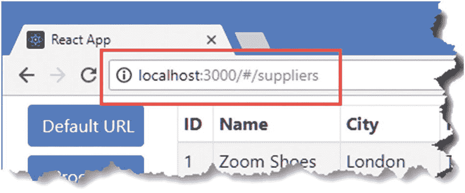

# 二十一、使用 URL 路由

目前，显示给用户的内容选择是由应用的状态数据控制的。有些状态数据是特定于单个组件的，比如管理产品和供应商数据选择的`Selector`组件。其余的数据位于 Redux 数据存储中，连接的组件使用这些数据来决定是否需要数据表或编辑器组件，并获取数据来填充这些组件的内容。

在这一章中，我将介绍一种构建应用的不同方法，这种方法是基于浏览器的 URL 选择内容，称为 *URL 路由*。我将呈现导航到新 URL 的锚元素，并通过选择内容并将其呈现给用户来响应这些 URL，而不是按钮元素的事件处理程序调度 Redux 操作。对于复杂的应用，URL 路由可以使构建项目变得更容易，并使扩展和维护功能变得更容易。表 [21-1](#Tab1) 将 URL 路由放在上下文中。

表 21-1

将 URL 路由置于上下文中

<colgroup><col class="tcol1 align-left"> <col class="tcol2 align-left"></colgroup> 
| 

问题

 | 

回答

 |
| --- | --- |
| 这是什么？ | URL 路由使用浏览器的当前 URL 来选择呈现给用户的内容。 |
| 为什么有用？ | URL 路由允许在不需要共享状态数据的情况下构建应用，共享状态数据被编码在 URL 中，这也使得更改应用的结构变得更加容易。 |
| 如何使用？ | 呈现的导航元素会更改浏览器的 URL，而不会触发新的 HTTP 请求。新的 URL 用于选择呈现给用户的内容。 |
| 有什么陷阱或限制吗？ | 需要进行彻底的测试，以确保用户可以导航到的所有 URL 都得到正确处理，并显示适当的内容。 |
| 有其他选择吗？ | URL 路由完全是可选的，还有其他方式来组成应用及其数据，如前面的章节所演示的。 |

表 [21-2](#Tab2) 总结了本章内容。

表 21-2

章节总结

<colgroup><col class="tcol1 align-left"> <col class="tcol2 align-left"> <col class="tcol3 align-left"></colgroup> 
| 

问题

 | 

解决办法

 | 

列表

 |
| --- | --- | --- |
| 创建导航元素 | 使用`Link`组件 | 4, 13 |
| 响应导航 | 使用`Route`组件 | 5–6 |
| 匹配特定的 URL | 使用`Route`组件的`exact`属性 | seven |
| 匹配多个 URL | 在`Route`组件的`path`属性中将 URL 指定为数组，或者使用正则表达式 | 8–9 |
| 选择一条路线 | 使用`Switch`组件 | Ten |
| 定义后备路线 | 使用`Redirect`组件 | 11, 12 |
| 指示活动航路 | 使用`NavLink`组件 | 14, 15 |
| 选择用于在 URL 中表示路由的机制 | 选择路由组件 | Sixteen |

## 为本章做准备

在这一章中，我继续使用在第 [18](18.html) 章创建的`productapp`项目，最近一次使用是在第 [20](20.html) 章。为了准备本章，打开一个新的命令提示符，导航到`productapp`文件夹，运行清单 [21-1](#PC1) 中所示的命令，将一个包添加到项目中。React 路由包可用于一系列应用类型。清单 [21-1](#PC1) 中安装的包是用于 web 应用的。

### 小费

你可以从 [`https://github.com/Apress/pro-react-16`](https://github.com/Apress/pro-react-16) 下载本章以及本书其他章节的示例项目。

```jsx
npm install react-router-dom@4.3.1

Listing 21-1Adding a Package to the Project

```

为了简化呈现给用户的内容，我删除了一些由`App`组件呈现的内容，如清单 [21-2](#PC2) 所示。

```jsx
import React, { Component } from "react";
import { Provider } from "react-redux";
import dataStore from "./store";
import { Selector } from "./Selector";
import { ProductDisplay } from "./ProductDisplay";
import { SupplierDisplay } from "./SupplierDisplay";

export default class App extends Component {

    render() {
        return  <Provider store={ dataStore }>
                    <Selector>
                        <ProductDisplay name="Products" />
                        <SupplierDisplay name="Suppliers" />
                    </Selector>
                </Provider>
    }
}

Listing 21-2Simplifying Content in the App.js File in the src Folder

```

保存对组件 JavaScript 文件的更改，并使用命令提示符运行`productapp`文件夹中清单 [21-3](#PC3) 中所示的命令，以启动 React 开发工具。

```jsx
npm start

Listing 21-3Starting the Development Tools

```

项目将被编译，开发 HTTP 服务器将被启动。一个新的浏览器窗口将打开并显示应用，如图 [21-1](#Fig1) 所示。


图 21-1

运行示例应用

## URL 路由入门

首先，我将在`Selector`组件中使用 URL 路由，这样它就不需要自己的状态数据来跟踪用户是否想要与产品或供应商合作。

设置 URL 路由有两个步骤。第一步是创建链接，用户单击这些链接可以导航到应用的不同部分。第二步是选择将为用户可以导航到的每个 URL 显示的内容。这些步骤使用 React-Router 包提供的 React 组件来执行，如清单 [21-4](#PC4) 所示。

```jsx
import React, { Component } from "react";

import { BrowserRouter as Router, Link, Route } from "react-router-dom";

import { ProductDisplay } from "./ProductDisplay";

import { SupplierDisplay } from "./SupplierDisplay";

export class Selector extends Component {

    // constructor(props) {
    //     super(props);
    //     this.state = {
    //         selection: React.Children.toArray(props.children)[0].props.name
    //     }
    // }

    // setSelection = (ev) => {
    //     ev.persist();
    //     this.setState({ selection: ev.target.name});
    // }

    render() {
        return <Router>
            <div className="container-fluid">
                <div className="row">
                    <div className="col-2">
                        <div><Link to="/products">Products</Link></div>
                        <div><Link to="/suppliers">Suppliers</Link></div>
                    </div>
                    <div className="col">
                        <Route path="/products" component={ ProductDisplay } />
                        <Route path="/suppliers" component={ SupplierDisplay} />
                    </div>
                </div>
            </div>
        </Router>
    }
}

Listing 21-4Adding URL Routing in the Selector.js File in the src Folder

```

设置基本路由配置需要三个组件。`Router`组件用于提供对 URL 路由特性的访问。使用 URL 进行导航有不同的方式，每种方式都有自己的 React-Router 组件，我在“选择和配置路由”一节中对此进行了描述。约定是导入您需要的组件，在本例中是`BrowserRouter`，并为其指定名称`Router`，然后将其用作需要访问路由特性的内容的容器。

### 选择替代路由包

React-Router 是目前为止 React 项目中使用最广泛的路由包，对于大多数应用来说是一个很好的起点。还有其他可用的路由包，但并不是所有的路由包都是专门针对 React 的，可能需要进行笨拙的改编。

如果你无法和 React-Router 相处，那么最好的替代品就是 Backbone ( [`https://backbonejs.org`](https://backbonejs.org) )。这个广受好评的包为任何 JavaScript 应用提供了路由，并且与 React 配合得很好。

### 链接组件入门

`Link`组件呈现一个元素，用户可以单击它来导航到一个新的 URL，如下所示:

```jsx
...
<div><Link to="/products">Products</Link></div>
...

```

使用`to`属性指定导航 URL，这个`Link`将导航到`/products` URL。导航 URL 是相对于应用的起始 URL 指定的，起始 URL 是开发过程中的`http://localhost:3000`。这意味着为`Link`组件的`to`属性指定`/products`会告诉它呈现一个将导航到`http://localhost:3000/products`的元素。当应用被部署并具有公共 URL 时，这些相对 URL 将继续工作。

### 路线组件入门

添加到清单 [21-4](#PC4) 的最后一个组件是`Route`，它等待浏览器导航到一个特定的 URL，然后显示其内容，如下所示:

```jsx
...
<Route path="/products" component={ ProductDisplay } />
...

```

这个`Route`组件已经被配置为等待，直到浏览器导航到`/products` URL，这时它将显示`ProductDisplay`组件。对于所有其他 URL，这个`Route`组件不会呈现任何内容。

如图 [21-2](#Fig2) 所示，清单 [21-4](#PC4) 中变化的结果在视觉上并不令人印象深刻，但它展示了 URL 路由的基本性质。当浏览器显示应用的起始 URL`http://localhost:3000`时，不会显示任何内容。点击`Products`或`Suppliers`链接，浏览器导航到`http://localhost:3000/products`或`http://localhost:3000/suppliers`，显示`ProductDisplay`或`SupplierDisplay`组件。


图 21-2

添加导航元素

右键单击由`Link`组件创建的任一导航元素，并从弹出菜单中选择 Inspect 或 Inspect Element，您将看到已经呈现的 HTML，如下所示:

```jsx
...
<div><a href="/products">Products</a></div>
<div><a href="/suppliers">Suppliers</a></div>
...

```

已经呈现了`Link`组件以产生锚(标签为`a`的元素)元素，并且`to`属性的值已经转换为锚元素的`href`属性的 URL。当您单击其中一个锚元素时，浏览器会导航到一个新的 URL，相应的`Route`组件会显示其内容。如果浏览器导航到一个没有配置`Route`组件的 URL，那么就不会显示任何内容，这就是为什么在单击其中一个链接之前组件不会显示的原因。

### 警告

不要试图为导航创建自己的锚元素，因为它们会导致浏览器向服务器发送一个 HTTP 请求，请求您指定的 URL，从而导致应用被重新加载。由`Link`组件呈现的锚元素具有使用 HTML5 历史 API 更改 URL 的事件处理程序，而不会触发新的 HTTP 请求。

## 响应导航

`Route`组件用于实现应用的路由方案，它通过等待浏览器导航到一个特定的 URL 并在它到达时显示一个组件来实现。在真实的应用中，URL 和组件之间的映射可能很复杂，URL 的匹配和组件对内容的选择可以使用表 [21-3](#Tab3) 中描述的属性进行配置，我将在下面的章节中演示。

表 21-3

路线组件属性

<colgroup><col class="tcol1 align-left"> <col class="tcol2 align-left"></colgroup> 
| 

名字

 | 

描述

 |
| --- | --- |
| `path` | 属性用于指定组件应该等待的一个或多个 URL。 |
| `exact` | 当这个属性为`true`时，只有与路径属性完全相同的 URL 才会被匹配，如“限制与属性的匹配”一节中所示。 |
| `sensitive` | 当这个属性是`true`时，匹配的 URL 是区分大小写的。 |
| `strict` | 当该属性为`true`时，以`/`结尾的`path`值将只匹配其对应段也以`/`结尾的 URL。 |
| `component` | 该属性用于指定当`path`属性与浏览器的当前 URL 匹配时将显示的单个组件。 |
| `render` | 该属性用于指定一个函数，该函数返回当`path`属性与浏览器的当前 URL 匹配时将显示的内容。 |
| `children` | 这个属性用于指定一个总是呈现内容的函数，即使 path 属性指定的 URL 不匹配。这对于显示派生组件中的内容或者不响应 URL 变化而呈现的组件非常有用，如第 [22](22.html) 章所述。 |

### 选择组件和内容

`component`属性用于指定当当前 URL 与`path`属性匹配时将显示的单个组件。组件类型被直接指定为`component`属性值，如下所示:

```jsx
...
<Route path="/products" component={ ProductDisplay } />
...

```

属性的值不应该是一个函数，因为它会导致应用每次更新时创建一个指定组件的新实例。

#### 使用渲染属性

`component`属性的优点是简单，它适用于具有独立组件的项目，这些组件可以呈现所有需要的内容，并且不需要属性。`Route`组件为更复杂的内容提供了`render`属性，并传递属性，如清单 [21-5](#PC9) 所示。

```jsx
import React, { Component } from "react";
import { BrowserRouter as Router, Link, Route } from "react-router-dom";
import { ProductDisplay } from "./ProductDisplay";
import { SupplierDisplay } from "./SupplierDisplay";

export class Selector extends Component {

    render() {
        return <Router>
            <div className="container-fluid">
                <div className="row">
                    <div className="col-2">
                        <div><Link to="/products">Products</Link></div>
                        <div><Link to="/suppliers">Suppliers</Link></div>
                    </div>
                    <div className="col">
                        <Route path="/products" render={ (routeProps) =>
                            <ProductDisplay myProp="myValue" /> } />
                        <Route path="/suppliers" render={ (routeProps) =>
                             <React.Fragment>
                                <h4 className="bg-info text-center text-white p-2">
                                    Suppliers
                                </h4>
                                <SupplierDisplay />
                            </React.Fragment>
                        } />
                    </div>
                </div>
            </div>
        </Router>
    }
}

Listing 21-5Using the render Prop in the Selector.js File in the src Folder

```

函数的结果是应该由`Route`组件显示的内容。在清单中，我将一个属性传递给了`ProductDisplay`组件，并将`SupplierDisplay`组件包含在一个更大的内容片段中，如图 [21-3](#Fig3) 所示。


图 21-3

使用路线组件的渲染属性

### 小费

传递给`render` prop 的函数接收一个提供路由系统状态信息的对象，我将在第 [22 章](22.html)中描述。

### 匹配 URL

使用 URL 路由最困难的一个方面是确保您想要支持的 URL 与`Route`组件正确匹配。`Route`组件提供了一系列特性，允许您扩大或缩小将要匹配的 URL 的范围，我将在接下来的章节中对此进行描述。

#### 使用线段匹配

匹配 URL 最简单的方法是向`Route`组件的`path`属性提供一个或多个目标段。这将匹配以您指定的段开头的任何 URL，如清单 [21-6](#PC10) 所示。

```jsx
import React, { Component } from "react";
import { BrowserRouter as Router, Link, Route } from "react-router-dom";

//import { ProductDisplay } from "./ProductDisplay";

//import { SupplierDisplay } from "./SupplierDisplay";

export class Selector extends Component {

    renderMessage = (msg) => <h5 className="bg-info text-white m-2 p-2">{ msg }</h5>

    render() {
        return <Router>
            <div className="container-fluid">
                <div className="row">
                    <div className="col-2">
                        <div><Link to="/data/one">Link #1</Link></div>
                        <div><Link to="/data/two">Link #2</Link></div>
                        <div><Link to="/people/bob">Bob</Link></div>
                    </div>
                    <div className="col">
                        <Route path="/data"
                            render={ () => this.renderMessage("Route #1") } />
                        <Route path="/data/two"
                            render={ () => this.renderMessage("Route #2") } />
                    </div>
                </div>
            </div>
        </Router>
    }
}

Listing 21-6Matching URLs in the Selector.js File in the src Folder

```

我用一种叫做`renderMessage`的方法生成的内容替换了`ProductDisplay`和`SupplierDisplay`组件。有三个链接组件，分别指向 URL`/data/one`、`data/two`和`/people/bob`。

第一个`Route`组件配置有`/data`作为其`path`支柱。这将匹配第一段是`data`的任何 URL，这意味着它将匹配`/data/one`和`/data/two`URL，但不匹配`/people/bob`。第二个`Route`组件将`/data/two`作为其`path`属性的值，因此它将只匹配`/data/two` URL。每个`Route`组件独立评估它的`path`属性，你可以通过点击导航链接看到它们是如何匹配 URL 的，如图 [21-4](#Fig4) 所示。


图 21-4

将 URL 与路由组件匹配

一个`Route`组件匹配`/data/one` URL，两个都匹配`/data/two` URL，两个都不匹配`/people/bob`，因此不显示任何内容。

#### 用属性限制比赛

`Route`组件的默认行为会导致过度匹配，即组件在您不希望的时候匹配 URL。例如，我可能想要区分`/data`和`/data/one`URL，这样第一个 URL 显示数据项列表，第二个显示特定对象的细节。默认匹配使这变得困难，因为`/data`的`path`属性匹配任何第一段是`/data`的 URL，不管 URL 总共包含多少段。

为了帮助限制路径匹配的 URL 的范围，`Route`组件支持三个额外的属性:`exact`、`strict`和`sensitive`。三个属性中最有用的是`exact`，只有当它与`path`属性值完全匹配时，它才会匹配一个 URL，因此`/data/one`的 URL 不会与`/data`的路径匹配，如清单 [21-7](#PC11) 所示。

```jsx
import React, { Component } from "react";
import { BrowserRouter as Router, Link, Route } from "react-router-dom";

export class Selector extends Component {

    renderMessage = (msg) => <h5 className="bg-info text-white m-2 p-2">{ msg }</h5>

    render() {
        return <Router>
            <div className="container-fluid">
                <div className="row">
                    <div className="col-2">
                        <div><Link to="/data">Data</Link></div>
                        <div><Link to="/data/one">Link #1</Link></div>
                        <div><Link to="/data/two">Link #2</Link></div>
                        <div><Link to="/people/bob">Bob</Link></div>
                    </div>
                    <div className="col">
                        <Route path="/data" exact={ true }
                            render={ () => this.renderMessage("Route #1") } />
                        <Route path="/data/two"
                            render={ () => this.renderMessage("Route #2") } />
                    </div>
                </div>
            </div>
        </Router>
    }
}

Listing 21-7Making Exact Matches in the Selector.js File in the src Folder

```

设置`exact`属性只影响它所应用的`Route`组件。在示例中，`exact` prop 阻止第一个`Route`组件匹配`/data/one`和`/data/two`URL，如图 [21-5](#Fig5) 所示。


图 21-5

进行精确匹配

当设置为`true`时，`strict`属性用于将有斜杠的`path`的匹配限制到也有斜杠的 URL，因此`/data/`的`path`将只匹配`/data/` URL 而不是`/data`。然而，strict prop 确实匹配带有附加段的 URL，因此路径`/data/`将匹配`/data/one`。

`sensitive`属性用于控制区分大小写。当`true`时，只有当`path`属性的大小写与 URL 的大小写匹配时，它才允许匹配，因此`/data`的路径不会与`/Data`的 URL 匹配。

#### 在一个路径中指定多个 URL

组件的属性的值可以是一个 URL 数组，如果其中任何一个匹配，就会显示内容。当响应不具有公共结构的 URL 需要相同的内容时(例如响应`/data/list`和`/people/list`显示相同的组件)，或者当需要特定数量的精确匹配时，例如匹配`/data/one`和`/data/two`，但不匹配以`/data`开头的任何其他 URL 时，这可能很有用，如清单 [21-8](#PC12) 所示。

### 注意

在编写本文时，与`Route`组件所期望的属性类型不匹配，导致在使用数组时出现 JavaScript 控制台警告。此警告可以忽略，在您阅读本章时可能会得到解决。参见第 [10 章](10.html)和第 [11 章](11.html)了解如何指定组件对其属性的数据类型。

```jsx
import React, { Component } from "react";
import { BrowserRouter as Router, Link, Route } from "react-router-dom";

export class Selector extends Component {

    renderMessage = (msg) => <h5 className="bg-info text-white m-2 p-2">{ msg }</h5>

    render() {
        return <Router>
            <div className="container-fluid">
                <div className="row">
                    <div className="col-2">
                        <div><Link to="/data">Data</Link></div>
                        <div><Link to="/data/one">Link #1</Link></div>
                        <div><Link to="/data/two">Link #2</Link></div>
                        <div><Link to="/people/bob">Bob</Link></div>
                    </div>
                    <div className="col">
                        <Route path={["/data/one", "/people/bob" ] }  exact={ true }
                            render={ () => this.renderMessage("Route #1") } />
                        <Route path={["/data", "/people" ] }
                            render={ () => this.renderMessage("Route #2") } />
                    </div>
                </div>
            </div>
        </Router>
    }
}

Listing 21-8Using an Array of Paths in the Selector.js File in the src Folder

```

`path`数组是使用花括号作为表达式提供的。第一个`Route`组件的`path`属性被设置为包含`/data/one`和`/people/bob`的数组。这些路径与`exact`属性结合起来限制组件匹配的 URL。第二个`Route`组件被配置为更广泛地匹配，并将响应任何第一段是`data`或`people`的 URL，如图 [21-6](#Fig6) 所示。


图 21-6

使用数组指定路径

#### 用正则表达式匹配 URL

并不是所有的 URL 组合都可以用单独的段来表达，`Route`组件在它的`path`属性中支持正则表达式来进行更复杂的匹配，如清单 [21-9](#PC13) 所示。

### 正则表达式清晰与简洁

大多数程序员倾向于用尽可能少的正则表达式来表示路由，但结果可能是路由配置难以阅读，并且在需要更改时很容易被破坏。当决定如何匹配 URL 时，保持表达式简单，并使用一个`path`数组来扩展一个`Route`可以匹配的 URL 的范围，而不用使用难以理解的正则表达式。

```jsx
import React, { Component } from "react";
import { BrowserRouter as Router, Link, Route } from "react-router-dom";

export class Selector extends Component {

    renderMessage = (msg) => <h5 className="bg-info text-white m-2 p-2">{ msg }</h5>

    render() {
        return <Router>
            <div className="container-fluid">
                <div className="row">
                    <div className="col-2">
                        <div><Link to="/data">Data</Link></div>
                        <div><Link to="/data/one">Link #1</Link></div>
                        <div><Link to="/data/two">Link #2</Link></div>
                        <div><Link to="/data/three">Link #3</Link></div>
                        <div><Link to="/people/bob">Bob</Link></div>
                        <div><Link to="/people/alice">Alice</Link></div>
                    </div>
                    <div className="col">
                        <Route path={["/data/(one|three)", "/people/b*" ] }
                            render={ () => this.renderMessage("Route #1") } />
                    </div>
                </div>
            </div>
        </Router>
    }
}

Listing 21-9Using a Regular Expression in the Selector.js File in the src Folder

```

路径数组中的第一项匹配第一段是`data`而第二段是`one`或`three`的 URL。第二项匹配第一段为 people，第二段以`b`开头的 URL。结果是`Route`组件将匹配`/data/one`、`/data/two`和`/people/bob`URL，但不匹配`/data/two`和`/people/alice`URL。

### 注意

参见 [`https://github.com/pillarjs/path-to-regexp`](https://github.com/pillarjs/path-to-regexp) 了解可用于匹配 URL 的全部正则表达式特性。

### 进行单一路线匹配

每个`Route`组件独立评估其`path`属性；这可能是有用的，但如果您希望基于当前 URL 只显示一个组件，这并不理想。对于这些情况，Redux-Router 包提供了`Switch`组件，它充当多个`Route`组件的包装器，按顺序查询它们，并显示第一个组件呈现的内容以匹配当前 URL。清单 [21-10](#PC14) 显示了`Switch`组件的使用。

```jsx
import React, { Component } from "react";
import { BrowserRouter as Router, Link, Route, Switch } from "react-router-dom";
import { ProductDisplay } from "./ProductDisplay";
import { SupplierDisplay } from "./SupplierDisplay";

export class Selector extends Component {

    renderMessage = (msg) => <h5 className="bg-info text-white m-2 p-2">{ msg }</h5>

    render() {
        return <Router>
            <div className="container-fluid">
                <div className="row">
                    <div className="col-2">
                        <div><Link to="/">Default URL</Link></div>
                        <div><Link to="/products">Products</Link></div>
                        <div><Link to="/suppliers">Suppliers</Link></div>
                    </div>
                    <div className="col">
                        <Switch>
                            <Route path="/products" component={ ProductDisplay} />
                            <Route path="/suppliers" component={ SupplierDisplay } />
                            <Route render={ () =>
                                this.renderMessage("Fallback Route")} />
                        </Switch>
                    </div>
                </div>
            </div>
        </Router>
    }
}

Listing 21-10Using the Switch Component in the Selector.js File in the src Folder

```

`Switch`组件按照它们被定义的顺序检查它的子组件，这意味着`Route`组件必须被安排成最具体的 URL 最先出现。没有`path`属性的`Route`组件将总是匹配当前的 URL，并且可以被`Switch`组件用作默认值，类似于常规 JavaScript switch 语句中的`default`子句。

清单中的变化将`/products` URL 与`ProductDisplay`组件相关联，将`/suppliers` URL 与`SupplierDisplay`组件相关联。任何其他的 URL 都会使用`renderMessage`方法呈现一条消息，如图 [21-7](#Fig7) 所示。


图 21-7

使用开关组件

使用`Switch`组件允许我在用户点击其中一个导航链接之前应用第一次启动时呈现内容。然而，这只是为默认 URL 选择内容的一种方式，更好的方式是使用`Redirect`组件，如下一节所述。

### 使用重定向作为备用路由

对于某些应用，引入一个单独的 URL 作为后备是没有意义的，在这种情况下，`Redirect`组件可以用来自动触发导航到一个可以由`Route`组件处理的 URL。在清单 [21-11](#PC15) 中，我用重定向到`/product` URL 替换了现有的回退。

```jsx
import React, { Component } from "react";

import { BrowserRouter as Router, Link, Route, Switch, Redirect }

    from "react-router-dom";
import { ProductDisplay } from "./ProductDisplay";
import { SupplierDisplay } from "./SupplierDisplay";

export class Selector extends Component {

    renderMessage = (msg) => <h5 className="bg-info text-white m-2 p-2">{ msg }</h5>

    render() {
        return <Router>
            <div className="container-fluid">
                <div className="row">
                    <div className="col-2">
                        <div><Link to="/">Default URL</Link></div>
                        <div><Link to="/products">Products</Link></div>
                        <div><Link to="/suppliers">Suppliers</Link></div>
                    </div>
                    <div className="col">
                        <Switch>
                            <Route path="/products" component={ ProductDisplay} />
                            <Route path="/suppliers" component={ SupplierDisplay } />
                            <Redirect to="/products" />
                        </Switch>
                    </div>
                </div>
            </div>
        </Router>
    }
}

Listing 21-11Using a Redirection in the Selector.js File in the src Folder

```

`to`属性指定了`Redirect`组件将导航到的 URL。如果`Route`组件能够匹配当前 URL，就不会使用`Redirect`组件。但是如果`Switch`组件到达`Redirect`组件而没有找到匹配的`Route`，那么将执行到`/products`的重定向。

#### 执行选择性重定向

使用`Redirect`组件最常见的方式是只使用`to`属性，但是还有其他可用的属性可以用来限制何时执行重定向，如表 [21-4](#Tab4) 中所述。

表 21-4

重定向组件属性

<colgroup><col class="tcol1 align-left"> <col class="tcol2 align-left"></colgroup> 
| 

名字

 | 

描述

 |
| --- | --- |
| `to` | 这个属性指定了浏览器应该被重定向到的位置。 |
| `from` | 该属性限制重定向，以便仅当当前 URL 与指定路径匹配时才执行重定向。 |
| `exact` | 当`true`时，该属性限制重定向，以便仅当当前 URL 与`from`属性完全匹配时才执行重定向，执行与`Route`组件的`exact`属性相同的角色。 |
| `strict` | 当`true`时，该属性限制重定向，因此只有当当前 URL 以`/`结尾并且`path`也以`/`结尾时才执行重定向，执行与`Route`组件的`strict`属性相同的角色。 |
| `push` | 当`true`时，重定向将向浏览器的历史记录中添加一个新项目。当`false`时，重定向将替换当前位置。 |

有选择地重定向到一个新的 URL 是保持对不再由`Route`直接处理的 URL 的支持的一种有用的方式，如清单 [21-12](#PC16) 所示。(对`Route`使用`path`数组可以达到类似的效果，但是在匹配 URL 参数时会导致复杂化，如第 [22 章](22.html)所述。)

```jsx
import React, { Component } from "react";
import { BrowserRouter as Router, Link, Route, Switch, Redirect }
    from "react-router-dom";
import { ProductDisplay } from "./ProductDisplay";
import { SupplierDisplay } from "./SupplierDisplay";

export class Selector extends Component {

    renderMessage = (msg) => <h5 className="bg-info text-white m-2 p-2">{ msg }</h5>

    render() {
        return <Router>
            <div className="container-fluid">
                <div className="row">
                    <div className="col-2">
                        <div><Link to="/">Default URL</Link></div>
                        <div><Link to="/products">Products</Link></div>
                        <div><Link to="/suppliers">Suppliers</Link></div>
                        <div><Link to="/old/data">Old Link</Link></div>
                    </div>
                    <div className="col">
                        <Switch>
                            <Route path="/products" component={ ProductDisplay} />
                            <Route path="/suppliers" component={ SupplierDisplay } />
                            <Redirect from="/old/data" to="/suppliers" />
                            <Redirect to="/products" />
                        </Switch>
                    </div>
                </div>
            </div>
        </Router>
    }
}

Listing 21-12Selectively Redirecting URLs in the Selector.js File in the src Folder

```

新的`Redirect`将执行从`/old/data` URL 到`/suppliers`的重定向。选择性`Redirect`组件的顺序很重要，必须放在非选择性重定向之前；否则，`Switch`将无法到达它们，因为它会遍历路由组件列表。

## 呈现导航链接

`Link`组件负责生成导航到新 URL 的元素，这是通过使用事件处理程序呈现锚元素来实现的，该事件处理程序在不重新加载应用的情况下更改浏览器的 URL。为了配置其行为，`Link`组件接受表 [21-5](#Tab5) 中描述的属性。

表 21-5

链接组件属性

<colgroup><col class="tcol1 align-left"> <col class="tcol2 align-left"></colgroup> 
| 

名字

 | 

描述

 |
| --- | --- |
| `to` | 该属性用于指定单击链接将导航到的位置。 |
| `replace` | 该属性用于指定单击导航链接是将一个条目添加到浏览器的历史记录中还是替换当前条目，这决定了用户是否能够使用 back 按钮返回到上一个位置。默认值为 false。 |
| `innerRef` | 这个属性用于访问底层 HTML 元素的引用。参考文献详情见第 [16](16.html) 章。 |

`Link`组件将把任何其他属性传递给它所呈现的锚元素。这个特性的主要用途是将`className`属性应用到`Link`来设计导航链接的样式，如清单 [21-13](#PC17) 所示。

```jsx
import React, { Component } from "react";
import { BrowserRouter as Router, Link, Route, Switch, Redirect }
    from "react-router-dom";
import { ProductDisplay } from "./ProductDisplay";
import { SupplierDisplay } from "./SupplierDisplay";

export class Selector extends Component {

    renderMessage = (msg) => <h5 className="bg-info text-white m-2 p-2">{ msg }</h5>

    render() {
        return <Router>
            <div className="container-fluid">
                <div className="row">
                    <div className="col-2">
                        <Link className="m-2 btn btn-block btn-primary"
                            to="/">Default URL</Link>
                        <Link className="m-2 btn btn-block btn-primary"
                            to="/products">Products</Link>
                        <Link className="m-2 btn btn-block btn-primary"
                            to="/suppliers">Suppliers</Link>
                        <Link className="m-2 btn btn-block btn-primary"
                            to="/old/data">Old Link</Link>
                    </div>
                    <div className="col">
                        <Switch>
                            <Route path="/products" component={ ProductDisplay} />
                            <Route path="/suppliers" component={ SupplierDisplay } />
                            <Redirect from="/old/data" to="/suppliers" />
                            <Redirect to="/products" />
                        </Switch>
                    </div>
                </div>
            </div>
        </Router>
    }
}

Listing 21-13Applying Classes in the Selector.js File in the src Folder

```

Bootstrap CSS 框架能够将锚元素样式化为按钮，我在清单 [21-13](#PC17) 中应用的类应用了一个按钮样式，它填充了可用的水平空间，并允许我删除用于垂直堆叠导航链接的`div`元素。当`Link`组件呈现它们的内容时，结果是一个显示为按钮的导航链接，如图 [21-8](#Fig8) 所示。


图 21-8

将类传递给导航元素

### 指示活动航路

`NavLink`组件建立在基本的`Link`特性之上，但是当它的`to`属性的值与当前 URL 匹配时，它会向锚元素添加一个类或样式。表 [21-6](#Tab6) 描述了`NavLink`组件提供的属性，这些属性是对表 [21-5](#Tab5) 中描述的属性的补充。在清单 [21-14](#PC18) 中，我介绍了应用`active`类的`NavLink`组件。

表 21-6

NavLink 组件属性

<colgroup><col class="tcol1 align-left"> <col class="tcol2 align-left"></colgroup> 
| 

名字

 | 

描述

 |
| --- | --- |
| `activeClassName` | 这个属性指定了当链接处于活动状态时将被添加到锚元素中的类。 |
| `activeStyle` | 该属性指定当链接激活时将添加到锚元素的样式。样式被指定为 JavaScript 对象，其属性是样式名称。 |
| `exact` | 当`true`时，这个属性执行精确匹配，如“匹配 URL”一节所述。 |
| `strict` | 当`true`时，该属性强制严格匹配，如“匹配 URL”一节所述。 |
| `isActive` | 该属性可用于指定一个自定义函数，以确定链接是否处于活动状态。该函数接收`match`和`location`参数，如第 [22 章](22.html)所述。默认行为是将当前 URL 与`to`属性进行比较。 |

```jsx
import React, { Component } from "react";

import { BrowserRouter as Router, NavLink, Route, Switch, Redirect }

    from "react-router-dom";
import { ProductDisplay } from "./ProductDisplay";
import { SupplierDisplay } from "./SupplierDisplay";

export class Selector extends Component {

    renderMessage = (msg) => <h5 className="bg-info text-white m-2 p-2">{ msg }</h5>

    render() {
        return <Router>
            <div className="container-fluid">
                <div className="row">
                    <div className="col-2">
                        <NavLink className="m-2 btn btn-block btn-primary"
                            activeClassName="active"
                            to="/">Default URL</NavLink>
                        <NavLink className="m-2 btn btn-block btn-primary"
                            activeClassName="active"
                            to="/products">Products</NavLink>
                        <NavLink className="m-2 btn btn-block btn-primary"
                            activeClassName="active"
                            to="/suppliers">Suppliers</NavLink>
                        <NavLink className="m-2 btn btn-block btn-primary"
                            activeClassName="active"
                            to="/old/data">Old Link</NavLink>
                    </div>
                    <div className="col">
                        <Switch>
                            <Route path="/products" component={ ProductDisplay} />
                            <Route path="/suppliers" component={ SupplierDisplay } />
                            <Redirect from="/old/data" to="/suppliers" />
                            <Redirect to="/products" />
                        </Switch>
                    </div>
                </div>
            </div>
        </Router>
    }
}

Listing 21-14Using NavLink Components in the Selector.js File in the src Folder

```

当浏览器的 URL 与组件的`to`属性的值匹配时，锚元素被添加到`active`类中，为用户提供一个有用的指示器，如图 [21-9](#Fig9) 所示。


图 21-9

响应路由激活

请注意，默认的 URL 按钮总是高亮显示。`NavLink`组件依赖于`Route` URL 匹配，这意味着`/`的`to`属性将匹配任何 URL。表 [21-6](#Tab6) 中描述的`exact`和`strict`属性与应用于`Route`时的目的相同，清单 [21-15](#PC19) 显示了使用`exact`属性来限制匹配。

```jsx
...
<div className="col-2">
    <NavLink className="m-2 btn btn-block btn-primary"
        activeClassName="active" exact={ true }
        to="/">Default URL</NavLink>
    <NavLink className="m-2 btn btn-block btn-primary"
        activeClassName="active"
        to="/products">Products</NavLink>
    <NavLink className="m-2 btn btn-block btn-primary"
        activeClassName="active"
        to="/suppliers">Suppliers</NavLink>
    <NavLink className="m-2 btn btn-block btn-primary"
        activeClassName="active"
        to="/old/data">Old Link</NavLink>
</div>
...

Listing 21-15Restricting NavLink Matching in the Selector.js File in the src Folder

```

结果是`NavLink`不再突出显示，如图 [21-10](#Fig10) 所示。


图 21-10

限制突出显示的 URL 匹配

### 注意

当应用`activeClassName`值时，`NavLink`组件不允许移除类，这意味着我不能准确地从示例项目中重新创建原始效果。我将在第 22 章[中演示如何用自定义导航组件创建这一功能。](22.html)

## 选择和配置路由

URL 路由依赖于操纵浏览器的 URL 来执行导航，而无需向服务器发送 HTTP 请求。在 web 应用中，核心路由功能由`BrowserRouter`或`HashRouter`组件提供；两者在进口时都被习惯性地命名为`Router`，就像这样:

```jsx
...
import { BrowserRouter as Router, Link, Switch, Route, Redirect }
    from "react-router-dom";
...

```

`BrowserRouter`使用 HTML5 历史 API。这个 API 为路由提供了自然的 URL，比如`http://localhost:3000/products`，这是你在本章的例子中看到的 URL 类型。`BrowserRouter`组件可以接受一系列配置其行为的属性，如表 [21-7](#Tab7) 所述。props 的默认值适用于大多数应用。

表 21-7

浏览器路由属性

<colgroup><col class="tcol1 align-left"> <col class="tcol2 align-left"></colgroup> 
| 

名字

 | 

描述

 |
| --- | --- |
| `basename` | 当应用不在它的 URL 的根目录时，例如`http://localhost:3000/myapp`，使用这个属性。 |
| `getUserConfirmation` | 该属性用于指定通过`Prompt`组件获得用户导航确认的功能，如第 [22 章](22.html)所述。 |
| `forceRefresh` | 当`true`时，这个 prop 在导航过程中使用发送到服务器的 HTTP 请求强制进行完全刷新。这削弱了富客户端应用的作用，应该只用于测试和浏览器不能使用历史 API 的时候。 |
| `keyLength` | 导航中的每个变化都有一个唯一的键。该属性用于指定密钥的长度，默认为六个字符。密钥包含在识别每个导航位置的`location`对象中，如第 [22 章](22.html)所述。 |
| `history` | 这个属性允许使用一个自定义的`history`对象。第 [22 章](22.html)中描述了`history`对象。 |

### 使用 HashRouter 组件

老版本的浏览器不支持历史 API，导航细节必须作为一个片段添加到 URL 的末尾，跟在`#`字符后面。使用 URL 片段的路由由`HashRouter`组件提供，如清单 [21-16](#PC21) 所示。

```jsx
import React, { Component } from "react";

import { HashRouter as Router, NavLink, Route, Switch, Redirect }

    from "react-router-dom";
import { ProductDisplay } from "./ProductDisplay";
import { SupplierDisplay } from "./SupplierDisplay";

export class Selector extends Component {

    // ...methods omitted for brevity...
}

Listing 21-16Using the HashRouter Component in the Selector.js File in the src Folder

```

使用`as`关键字导入路由组件意味着只有`import`语句需要修改。将修改保存到文件中，导航到`http://localhost:3000`，你会看到 URL 的样式已经改变，如图 [21-11](#Fig11) 所示。



图 21-11

使用哈希路由

### 小费

当浏览器首次重新加载时，您可能会看到类似于`http://localhost:3000/suppliers/#/suppliers`的 URL。发生这种情况是因为浏览器从其当前 URL 重新加载，然后该 URL 被假定为应用的基本 URL。手动导航到`http://localhost:3000`，您应该会看到如图所示的 URL。

URL 中用于路由的部分现在跟在`#`字符之后。URL 路由仍然以同样的方式工作，但是与由`BrowserRouter`组件生成的 URL 相比，URL 不那么自然。`HashRouter`组件可以配置表 [21-8](#Tab8) 所示的属性。

表 21-8

HashRouter 组件属性

<colgroup><col class="tcol1 align-left"> <col class="tcol2 align-left"></colgroup> 
| 

名字

 | 

描述

 |
| --- | --- |
| `basename` | 当应用不在它的 URL 的根目录时，例如`http://localhost:3000/myapp`，使用这个属性。 |
| `getUserConfirmation` | 该属性用于指定通过`Prompt`组件获得用户导航确认的功能，如第 [22 章](22.html)所述。 |
| `hashType` | 该属性设置用于在 URL 中编码路由的样式。选项有`slash`，创建如图 [21-11](#Fig11) 所示的 URL 样式；`noslash`，省略了`#`字符后的前导`/`；还有`hashbang`，它通过在`#`字符后插入感叹号来创建像`#!/products`这样的 URL。 |

## 摘要

在本章中，我向您展示了如何使用 React-Router 包向 React 应用添加 URL 路由。我解释了路由如何通过将状态数据移入 URL 来简化应用，以及如何使用`Link`和`Route`组件来创建导航元素并响应 URL 的变化。在下一章，我将描述高级 URL 路由特性。