# 二十二、高级 URL 路由

在这一章中，我描述了 React-Router 包中 URL 路由可用的高级特性。我将向您展示如何创建可以参与路由过程的组件，如何以编程方式导航，如何以编程方式生成路由，以及如何在连接到数据存储的组件中使用 URL 路由。表 [22-1](#Tab1) 将高级 URL 路由功能放在上下文中。

表 22-1

将高级 URL 路由放在上下文中

<colgroup><col class="tcol1 align-left"> <col class="tcol2 align-left"></colgroup> 
| 

问题

 | 

回答

 |
| --- | --- |
| 这是什么？ | 高级路由功能提供对 URL 路由系统的编程访问。 |
| 为什么有用？ | 这些功能允许组件知道路由系统和当前活动的路由。 |
| 如何使用？ | props 提供对高级路由功能的访问。 |
| 有什么陷阱或限制吗？ | 这些都是高级功能，需要注意确保它们正确集成到组件中。 |
| 还有其他选择吗？ | 这些是可选功能。应用可以使用第 [21 章](21.html)中描述的标准功能，或者完全避免 URL 路由。 |

表 [22-2](#Tab2) 总结了本章内容。

表 22-2

章节总结

<colgroup><col class="tcol1 align-left"> <col class="tcol2 align-left"> <col class="tcol3 align-left"></colgroup> 
| 

问题

 | 

解决办法

 | 

列表

 |
| --- | --- | --- |
| 接收组件中路由系统的详细信息 | 使用`Route`组件提供的属性或使用`withRouter`高阶组件 | 3, 4, 10–12, 19–23 |
| 获取当前导航位置的详细信息 | 使用`location`属性 | five |
| 从当前路线获取 URL 段 | 向 URL 添加参数 | 6–9 |
| 以编程方式导航 | 使用由`history`属性定义的方法 | 13, 14 |
| 导航前提示用户 | 使用`Prompt`组件 | 15–17 |

## 为本章做准备

在本章中，我继续使用第 21 章[中的`productapp`项目。为了准备本章，将应用使用的路由从`HashRouter`更改为`BrowserRouter`，以便使用 HTML5 历史 API 进行导航，并简化了`Link`和`Router`组件，如清单](21.html) [22-1](#PC1) 所示。

### 小费

你可以从 [`https://github.com/Apress/pro-react-16`](https://github.com/Apress/pro-react-16) 下载本章以及本书其他章节的示例项目。

```jsx
import React, { Component } from "react";

import { BrowserRouter as Router, NavLink, Route, Switch, Redirect }

    from "react-router-dom";
import { ProductDisplay } from "./ProductDisplay";
import { SupplierDisplay } from "./SupplierDisplay";

export class Selector extends Component {

    render() {
        return <Router>
            <div className="container-fluid">
                <div className="row">
                    <div className="col-2">
                        <NavLink className="m-2 btn btn-block btn-primary"
                            activeClassName="active"
                            to="/products">Products</NavLink>
                        <NavLink className="m-2 btn btn-block btn-primary"
                            activeClassName="active"
                            to="/suppliers">Suppliers</NavLink>
                    </div>
                    <div className="col">
                        <Switch>
                            <Route path="/products" component={ ProductDisplay} />
                            <Route path="/suppliers" component={ SupplierDisplay } />
                            <Redirect to="/products" />
                        </Switch>
                    </div>
                </div>
            </div>
        </Router>
    }
}

Listing 22-1Changing Routers and Routes in the Selector.js File in the src Folder

```

打开命令提示符，导航到`productapp`文件夹，运行清单 [22-2](#PC2) 中所示的命令来启动开发工具。

```jsx
npm start

Listing 22-2Starting the Development Tools

```

应用编译完成后，开发 HTTP 服务器将启动并显示如图 [22-1](#Fig1) 所示的内容。

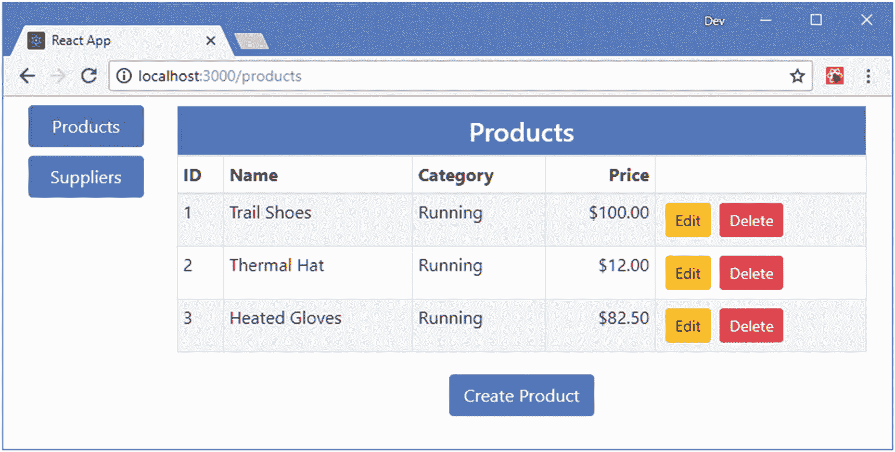

图 22-1

运行示例应用

## 创建路由感知组件

当一个`Route`显示一个组件时，它向组件提供描述当前路线的上下文数据，并提供对可用于导航的 API 的访问，允许组件知道当前位置并参与路线选择。当使用`component`属性时，`Route`将数据和 API 传递给它显示为属性的组件，名为`match`、`location`和`history`。当使用`render`属性时，渲染函数被传递一个具有`match`、`location`和`history`属性的对象，这些属性的值与用作`render`属性的对象相同。表 [22-3](#Tab3) 中描述了`match`、`location`和`history`对象。

表 22-3

路由组件提供的属性

<colgroup><col class="tcol1 align-left"> <col class="tcol2 align-left"></colgroup> 
| 

名字

 | 

描述

 |
| --- | --- |
| `match` | 此属性提供有关路由组件如何匹配当前浏览器 URL 的信息。 |
| `location` | 该属性提供了当前位置的表示，可用于导航，而不是表示为字符串的 URL。 |
| `history` | 这个属性提供了一个可用于导航的 API，如“以编程方式导航”一节中所示。 |

### 了解比赛属性

`match` prop 提供了一个组件，其中包含了父节点`Route`如何匹配当前 URL 的细节。正如我在第 [21 章](21.html)中所演示的，单个`Route`可以用来匹配一系列 URL，路由感知组件通常需要关于当前 URL 的细节，这些细节可以通过表 [22-4](#Tab4) 中所示的属性获得。

表 22-4

匹配属性

<colgroup><col class="tcol1 align-left"> <col class="tcol2 align-left"></colgroup> 
| 

名字

 | 

描述

 |
| --- | --- |
| `url` | 该属性返回与`Route`匹配的 URL。 |
| `path` | 该属性返回用于匹配 URL 的`path`值。 |
| `params` | 该属性返回路由参数，这些参数允许将 URL 段映射到变量，如“使用 URL 参数”一节中所述。 |
| `isExact` | 如果路由路径与 URL 完全匹配，该属性返回`true`。 |

为了演示路由属性的使用，我创建了`src/routing`文件夹，并添加了一个名为`RouteInfo.js`的文件，其组件如清单 [22-3](#PC3) 所示，显示了`match`属性的值。

```jsx
import React, { Component } from "react";

export class RouteInfo extends Component {

    renderTable(title, prop, propertyNames) {
        return <React.Fragment>
            <tr><th colSpan="2" className="text-center">{ title }</th></tr>
            { propertyNames.map(p =>
                <tr key={p }>
                    <td>{ p }</td>
                    <td>{ JSON.stringify(prop[p]) }</td>
                </tr>)
            }
        </React.Fragment>
    }

    render() {
        return <div className="bg-info m-2 p-2">
            <h4 className="text-white text-center">Route Info</h4>
            <table className="table table-sm table-striped bg-light">
                <tbody>
                    { this.renderTable("Match", this.props.match,
                        ["url", "path", "params", "isExact"] )}
                </tbody>
            </table>
        </div>
    }
}

Listing 22-3The Contents of the RouteInfo.js File in the src/routing Folder

```

`RouteInfo`组件在一个表格中显示匹配属性的`url`、`path`、`params`和`isExact`属性，并允许我稍后轻松地添加其他路由属性的附加细节。属性是序列化的，因为值是对象和布尔值的混合，如果按字面意思使用，可能会导致显示问题。在清单 [22-4](#PC4) 中，我添加了一个到`Selector`组件的导航链接，以及一个显示`RouteInfo`组件的`Route`。

```jsx
import React, { Component } from "react";
import { BrowserRouter as Router, NavLink, Route, Switch, Redirect }
    from "react-router-dom";
import { ProductDisplay } from "./ProductDisplay";
import { SupplierDisplay } from "./SupplierDisplay";

import { RouteInfo } from "./routing/RouteInfo";

export class Selector extends Component {

    render() {
        return <Router>
            <div className="container-fluid">
                <div className="row">
                    <div className="col-2">
                        <NavLink className="m-2 btn btn-block btn-primary"
                            activeClassName="active"
                            to="/products">Products</NavLink>
                        <NavLink className="m-2 btn btn-block btn-primary"
                            activeClassName="active"
                            to="/suppliers">Suppliers</NavLink>
                        <NavLink className="m-2 btn btn-block btn-primary"
                            activeClassName="active" to="/info">Route Info</NavLink>
                    </div>
                    <div className="col">
                        <Switch>
                            <Route path="/products" component={ ProductDisplay} />
                            <Route path="/suppliers" component={ SupplierDisplay } />
                            <Route path="/info" component={ RouteInfo } />
                            <Redirect to="/products" />
                        </Switch>
                    </div>
                </div>
            </div>
        </Router>
    }
}

Listing 22-4Adding a Route in the Selector.js File in the src Folder

```

保存更改并点击`Route Info`链接，您将看到`match`属性的详细信息，如图 [22-2](#Fig2) 所示。显示的值表明`Route`组件的路径属性是`/info`，它匹配新`Link`组件指向的`/info` URL。随着我引入更高级的路由特性，特别是当我在“使用 URL 参数”一节中引入 URL 参数时，`match` prop 提供的信息将变得更加有用。

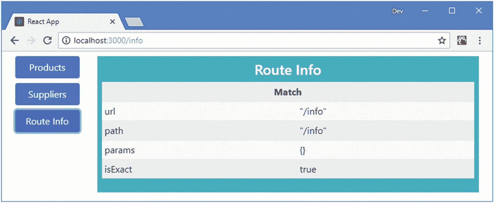

图 22-2

匹配路由属性提供的详细信息

### 了解位置属性

`location`对象用于描述导航位置。作为属性提供的`location`对象描述了当前位置，具有表 [22-5](#Tab5) 中描述的属性。

表 22-5

位置属性

<colgroup><col class="tcol1 align-left"> <col class="tcol2 align-left"></colgroup> 
| 

名字

 | 

描述

 |
| --- | --- |
| `key` | 此属性返回标识位置的键。 |
| `pathname` | 此属性返回位置的路径。 |
| `search` | 该属性返回位置 URL 的搜索词(URL 中跟在`?`字符后面的部分)。 |
| `hash` | 该属性返回位置 URL 的 URL 片段(跟在`#`字符后面的部分)。 |
| `state` | 该属性用于将任意数据与位置相关联。 |

`location`属性提供了一些与`match`属性的重叠，但是其思想是组件可以保留一个位置对象，并使用它来引用一个位置，而不是使用字符串作为`Link`、`NavLink`和`Redirect`组件的`to`属性的值。在清单 [22-5](#PC5) 中，我将 location prop 添加到了由`RouteInfo`显示的数据中，同时添加了一个使用`location`对象作为导航目标的`Link`元素。

```jsx
import React, { Component } from "react";

import { Link } from "react-router-dom";

export class RouteInfo extends Component {

    renderTable(title, prop, propertyNames) {
        return <React.Fragment>
            <tr><th colSpan="2" className="text-center">{ title }</th></tr>
            { propertyNames.map(p =>
                <tr key={p }>
                    <td>{ p }</td>
                    <td>{ JSON.stringify(prop[p]) }</td>
                </tr>)
            }
        </React.Fragment>
    }

    render() {
        return <div className="bg-info m-2 p-2">
            <h4 className="text-white text-center">Route Info</h4>
            <table className="table table-sm table-striped bg-light">
                <tbody>
                    { this.renderTable("Match", this.props.match,
                        ["url", "path", "params", "isExact"] )}
                    { this.renderTable("Location", this.props.location,
                        ["key", "pathname", "search", "hash", "state"] )}
                </tbody>
            </table>
            <div className="text-center m-2 bg-light">
                <Link className="btn btn-primary m-2"
                    to={ this.props.location }>Location</Link>
            </div>
        </div>
    }
}

Listing 22-5Using the Location Prop in the RouteInfo.js File in the src/routing Folder

```

图 [22-3](#Fig3) 显示了定位支柱和新`Link`组件的细节。

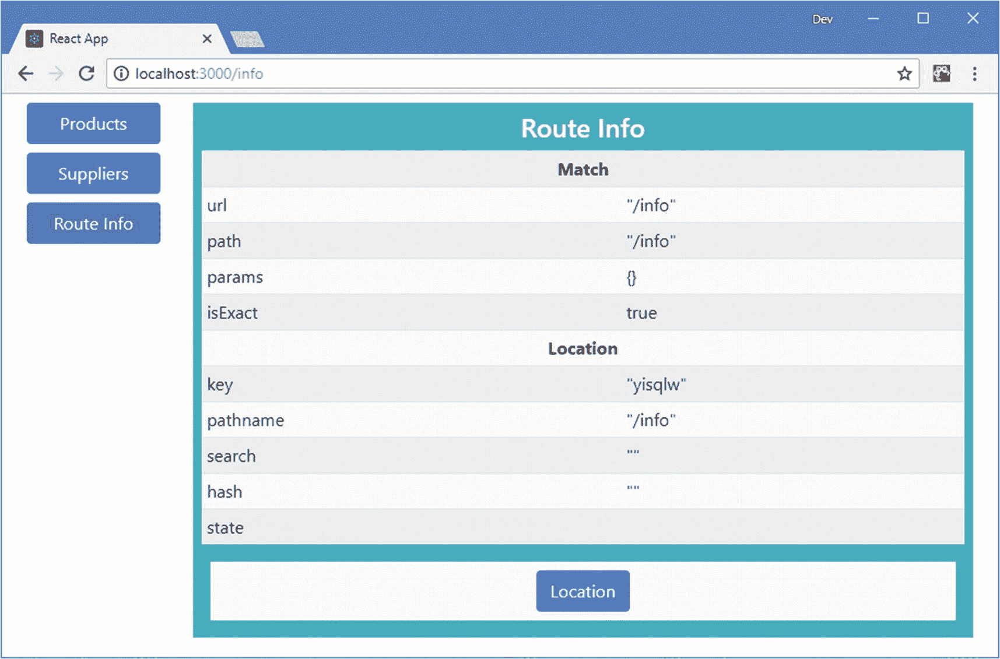

图 22-3

显示位置路由属性的详细信息

使用`location`属性作为`Link`组件的`to`属性的值目前并不是特别有用，因为它只能导航到当前位置。正如您将看到的，组件可用于响应多条路线，并可能随着时间的推移接收一系列位置，这使得使用`location`对象既有用又比使用字符串表示的 URL 更方便。

### 使用 URL 参数

当组件知道 URL 路由系统时，它通常需要调整其行为以适应当前的 URL。React-Router 包支持 URL 参数，该参数将 URL 段的内容分配给一个可由组件读取的变量，从而允许组件响应当前位置，而无需解析 URL 或理解其结构。清单 [22-6](#PC6) 显示添加了一个`Route`，它的路径包括一个 URL 参数和指向它的`Link`组件。

```jsx
import React, { Component } from "react";
import { BrowserRouter as Router, NavLink, Route, Switch, Redirect }
    from "react-router-dom";
import { ProductDisplay } from "./ProductDisplay";
import { SupplierDisplay } from "./SupplierDisplay";
import { RouteInfo } from "./routing/RouteInfo";

export class Selector extends Component {

    render() {
        return <Router>
            <div className="container-fluid">
                <div className="row">
                    <div className="col-2">
                        <NavLink className="m-2 btn btn-block btn-primary"
                            activeClassName="active"
                            to="/products">Products</NavLink>
                        <NavLink className="m-2 btn btn-block btn-primary"
                            activeClassName="active"
                            to="/suppliers">Suppliers</NavLink>
                        <NavLink className="m-2 btn btn-block btn-primary"
                            activeClassName="active"
                            to="/info/match">Match</NavLink>
                        <NavLink className="m-2 btn btn-block btn-primary"
                            activeClassName="active"
                            to="/info/location">Location</NavLink>
                    </div>
                    <div className="col">
                        <Switch>
                            <Route path="/products" component={ ProductDisplay} />
                            <Route path="/suppliers" component={ SupplierDisplay } />
                            <Route path="/info/:datatype" component={ RouteInfo } />
                            <Redirect to="/products" />
                        </Switch>
                    </div>
                </div>
            </div>
        </Router>
    }
}

Listing 22-6Defining a URL Parameter in the Selector.js File in the src Folder

```

URL 参数被指定为以冒号(`:`字符)开头的`path`属性段。在这个例子中，`RouteInfo`组件的`Route`有一个带有名为`datatype`的 URL 参数的`path`属性。

```jsx
...
<Route path="/info/:datatype" component={ RouteInfo } />
...

```

当`Route`匹配一个 URL 时，它会将第二段的值赋给一个名为`datatype`的 URL 参数，该参数将通过`match` prop 的`params`属性传递给`RouteInfo`组件。如果您点击添加到清单 [22-6](#PC6) 中示例的导航链接，您将看到为`params`属性显示不同的值，如图 [22-4](#Fig4) 所示。

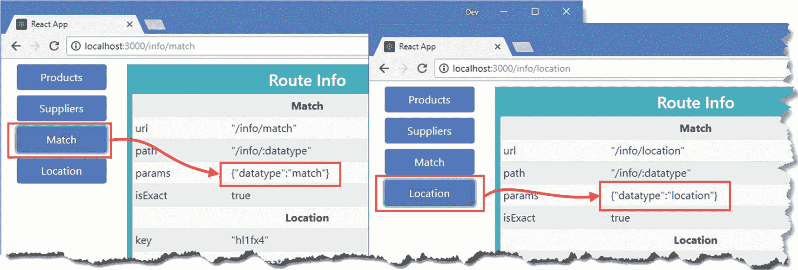

图 22-4

通过匹配属性接收 URL 参数

当 URL 为`/info/match`时，`datatype`参数的值为`match`。当 URL 为`/info/location`时，datatype 参数的值为`location`。在清单 [22-7](#PC8) 中，我已经更新了`RouteInfo`组件，使用`datatype`属性来选择呈现给用户的上下文数据。

```jsx
import React, { Component } from "react";
import { Link } from "react-router-dom";

export class RouteInfo extends Component {

    renderTable(title, prop, propertyNames) {
        return <React.Fragment>
            <tr><th colSpan="2" className="text-center">{ title }</th></tr>
            { propertyNames.map(p =>
                <tr key={p }>
                    <td>{ p }</td>
                    <td>{ JSON.stringify(prop[p]) }</td>
                </tr>)
            }
        </React.Fragment>
    }

    render() {
        return <div className="bg-info m-2 p-2">
            <h4 className="text-white text-center">Route Info</h4>
            <table className="table table-sm table-striped bg-light">
                <tbody>
                    { this.props.match.params.datatype ==="match"
                        && this.renderTable("Match", this.props.match,
                            ["url", "path", "params", "isExact"] )}
                    { this.props.match.params.datatype === "location"
                        &&  this.renderTable("Location", this.props.location,
                            ["key", "pathname", "search", "hash", "state"] )}
                </tbody>
            </table>
            <div className="text-center m-2 bg-light">
                <Link className="btn btn-primary m-2"
                    to={ this.props.location }>Location</Link>
            </div>
        </div>
    }
}

Listing 22-7Using a URL Parameter Prop in the RouteInfo.js File in the src/routing Folder

```

该组件接收 URL 参数作为路由属性的一部分，并像使用任何其他属性一样使用它们。在清单中，`datatype` URL 参数的值用于显示匹配或位置对象的内联表达式，如图 [22-5](#Fig5) 所示。

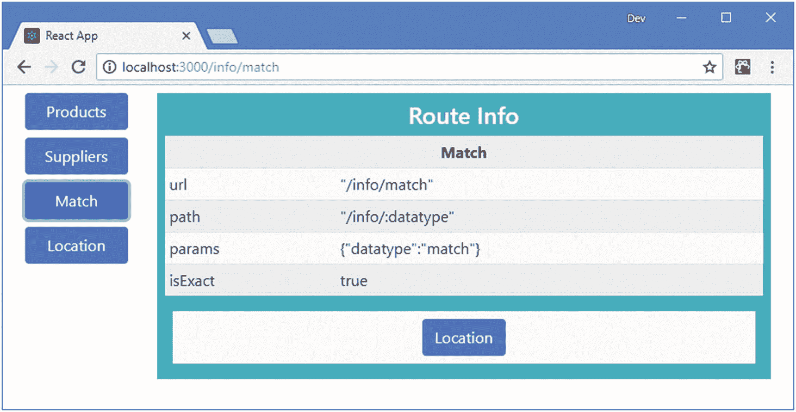

图 22-5

通过选择内容来响应 URL 参数

### 了解不透明的 URL 结构

URL 参数不仅仅是组件接收 URL 段内容的一种便捷方式。它们还将 URL 的结构从它所针对的组件中分离出来，允许在不修改组件的情况下修改 URL 的结构或多个 URL 针对相同的内容。例如，清单 [22-7](#PC8) 中的组件依赖于`datatype` URL 参数，但是不依赖于获取它的 URL 部分。这意味着组件将与路径如`/info/:datatype`一起工作，但是也可以与路径如`/diagnostics/routing/:datatype`匹配，而不需要改变组件的代码。

URL 参数的优点是组件只需要知道它所需要的 URL 参数的名称，而不需要知道它们出现在 URL 中的详细位置。

#### 使用可选的 URL 参数

添加 URL 参数意味着`/info` URL 将不再与`Route`组件匹配。我可以通过添加另一个`Route`来解决这个问题，但是一个更好的方法是使用一个可选参数，这将允许 URL 匹配`path`，即使没有相应的段。在清单 [22-8](#PC9) 中，我添加了一个导航到`/info` URL 的`NavLink`，并更改了`Route`组件的路径，因此`datatype`参数是可选的。

```jsx
import React, { Component } from "react";
import { BrowserRouter as Router, NavLink, Route, Switch, Redirect }
    from "react-router-dom";
import { ProductDisplay } from "./ProductDisplay";
import { SupplierDisplay } from "./SupplierDisplay";
import { RouteInfo } from "./routing/RouteInfo";

export class Selector extends Component {

    render() {
        return <Router>
            <div className="container-fluid">
                <div className="row">
                    <div className="col-2">
                        <NavLink className="m-2 btn btn-block btn-primary"
                            activeClassName="active"
                            to="/products">Products</NavLink>
                        <NavLink className="m-2 btn btn-block btn-primary"
                            activeClassName="active"
                            to="/suppliers">Suppliers</NavLink>
                        <NavLink className="m-2 btn btn-block btn-primary"
                            activeClassName="active"
                            to="/info/match">Match</NavLink>
                        <NavLink className="m-2 btn btn-block btn-primary"
                            activeClassName="active"
                            to="/info/location">Location</NavLink>
                        <NavLink className="m-2 btn btn-block btn-primary"
                            activeClassName="active" to="/info">All Info</NavLink>
                    </div>
                    <div className="col">
                        <Switch>
                            <Route path="/products" component={ ProductDisplay} />
                            <Route path="/suppliers" component={ SupplierDisplay } />
                            <Route path="/info/:datatype?" component={ RouteInfo } />
                            <Redirect to="/products" />
                        </Switch>
                    </div>
                </div>
            </div>
        </Router>
    }
}

Listing 22-8Using an Optional URL Parameter in the Selector.js File in the src Folder

```

可选的 URL 参数在参数名称后用一个问号(`?`字符)表示，因此`datatype?`表示一个可选参数，如果在 URL 中有相应的段，它将被命名为`datatype`。如果没有段，路径仍然是`match`，但是没有`datatype`值。在清单 [22-9](#PC10) 中，我已经更新了`RouteInfo`组件，如果没有`datatype`值，它将显示`match`和`location`对象的详细信息。

### 小费

关于指定 URL 参数的不同方式的完整列表，请参见 [`https://github.com/pillarjs/path-to-regexp`](https://github.com/pillarjs/path-to-regexp) ，它是处理 URL 的包的 GitHub 存储库。

```jsx
import React, { Component } from "react";
import { Link } from "react-router-dom";

export class RouteInfo extends Component {

    renderTable(title, prop, propertyNames) {
        return <React.Fragment>
            <tr><th colSpan="2" className="text-center">{ title }</th></tr>
            { propertyNames.map(p =>
                <tr key={p }>
                    <td>{ p }</td>
                    <td>{ JSON.stringify(prop[p]) }</td>
                </tr>)
            }
        </React.Fragment>
    }

    render() {
        return <div className="bg-info m-2 p-2">
            <h4 className="text-white text-center">Route Info</h4>
            <table className="table table-sm table-striped bg-light">
                <tbody>
                    { (this.props.match.params.datatype === undefined ||
                            this.props.match.params.datatype ==="match")
                        && this.renderTable("Match", this.props.match,
                            ["url", "path", "params", "isExact"] )}
                    { (this.props.match.params.datatype === undefined ||
                            this.props.match.params.datatype === "location")
                        &&  this.renderTable("Location", this.props.location,
                            ["key", "pathname", "search", "hash", "state"] )}
                </tbody>
            </table>
            <div className="text-center m-2 bg-light">
                <Link className="btn btn-primary m-2"
                    to={ this.props.location }>Location</Link>
            </div>
        </div>
    }
}

Listing 22-9Handling an Optional URL Parameter in the RouteInfo.js File in the src Folder

```

如果 URL 中没有匹配的段，`datatype`参数的值将是`undefined`。清单中的变化和可选 URL 参数的添加允许组件响应更广泛的 URL，而不需要使用额外的`Route`组件。

## 访问其他组件中的路由数据

A `Route`会给它显示的组件添加属性但是不能直接提供给其他组件，包括它显示的组件的后代。为了避免正确的线程化，React-Router 包提供了两种不同的方法来访问后代组件中的路由数据，如下面几节所述。

### 直接在组件中访问路由数据

访问路由数据最直接的方法是在`render`方法中使用`Route`。为了演示，我在`src/routing`文件夹中添加了一个名为`ToggleLink.js`的文件，并用它来定义清单 [22-10](#PC11) 中所示的组件。

### 小费

这是我在第 1 部分的 SportsStore 应用中用来突出显示活动路线的相同组件。

```jsx
import React, { Component } from "react";
import { Route, Link } from "react-router-dom";

export class ToggleLink extends Component {

    render() {
        return <Route path={ this.props.to } exact={ this.props.exact }
                children={ routeProps => {

            const baseClasses = this.props.className || "m-2 btn btn-block";
            const activeClass = this.props.activeClass || "btn-primary";
            const inActiveClass = this.props.inActiveClass || "btn-secondary"

            const combinedClasses =
                `${baseClasses} ${routeProps.match ? activeClass : inActiveClass}`

            return <Link to={ this.props.to } className={ combinedClasses }>
                        { this.props.children }
                    </Link>
         }} />
    }
}

Listing 22-10The Contents of the ToggleLink.js File in the src/routing Folder

```

不管当前 URL 是什么，`Route`组件的`children`属性用于呈现内容，并被分配一个接收路由上下文数据的函数。`path`属性用于表示对一个 URL 的兴趣，当当前 URL 与`path`匹配时，传递给子函数的`routeProps`对象包含一个`match`对象，该对象定义了表 [22-4](#Tab4) 中描述的属性。

`ToggleLink`组件允许我解决在`NavLink`组件和引导 CSS 框架之间出现的一个小问题。`NavLink`的工作原理是，当路径匹配时，向它呈现的锚元素添加一个类，其余时间删除它。这给一些引导类的组合带来了问题，因为它们在 CSS 样式表中定义的顺序意味着一些类，比如`btn-primary`，在一个相关的类，比如`btn-secondary`被移除之前不会生效。

`ToggleLink`组件通过在有`match`对象时添加一个活动类，在没有`match`时添加一个非活动类来解决这个问题。

```jsx
...
const combinedClasses =
    `${baseClasses} ${routeProps.match ? activeClass : inActiveClass}`
...

```

一个`Link`仍然被用来生成导航元素和响应点击，但是被`ToggleLink`组件设计成这样，我可以自由使用引导 CSS 类。在清单 [22-11](#PC13) 中，我用一个`ToggleLink`替换了每个`NavLink`。

```jsx
import React, { Component } from "react";

import { BrowserRouter as Router, Route, Switch, Redirect }

    from "react-router-dom";
import { ProductDisplay } from "./ProductDisplay";
import { SupplierDisplay } from "./SupplierDisplay";
import { RouteInfo } from "./routing/RouteInfo";

import { ToggleLink } from "./routing/ToggleLink";

export class Selector extends Component {

    render() {
        return <Router>
            <div className="container-fluid">
                <div className="row">
                    <div className="col-2">
                        <ToggleLink to="/products">Products</ToggleLink>
                        <ToggleLink to="/suppliers">Suppliers</ToggleLink>
                        <ToggleLink to="/info/match">Match</ToggleLink>
                        <ToggleLink to="/info/location">Location</ToggleLink>
                        <ToggleLink to="/info" exact={ true }>All Info</ToggleLink>
                    </div>
                    <div className="col">
                        <Switch>
                            <Route path="/products" component={ ProductDisplay} />
                            <Route path="/suppliers" component={ SupplierDisplay } />
                            <Route path="/info/:datatype?" component={ RouteInfo } />
                            <Redirect to="/products" />
                        </Switch>
                    </div>
                </div>
            </div>
        </Router>
    }
}

Listing 22-11Replacing Navigation Components in the Selector.js File in the src Folder

```

我依赖于清单 [22-10](#PC11) 中指定的默认类，结果是导航按钮在活动时被添加到引导程序`btn-primary`类，在不活动时被添加到`btn-secondary`类，如图 [22-6](#Fig6) 所示。

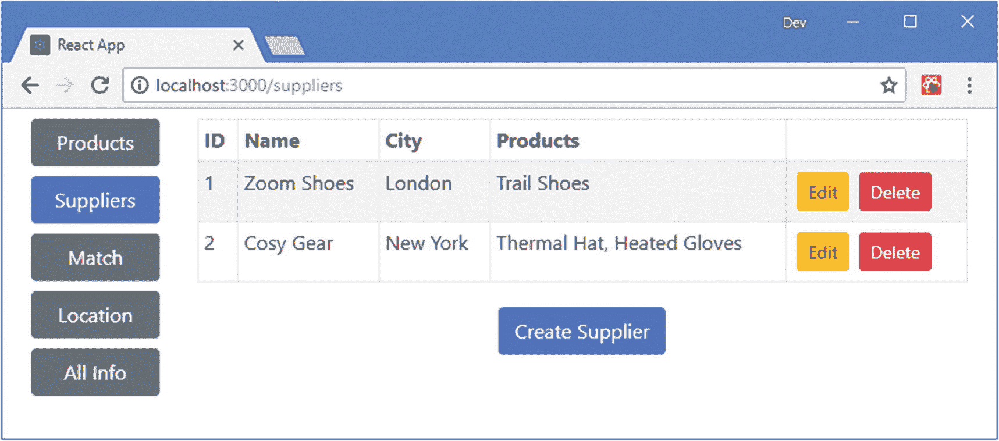

图 22-6

直接在组件中访问路由数据

### 使用高阶组件访问路由数据

`withRouter`函数是一个高阶组件，它提供对路由系统的访问，而不直接使用`Route`(尽管这是在`withRouter`函数中使用的技术)。当一个组件被传递给`withRouter`时，它接收`match`、`location`和`history`对象作为属性，就好像它是由`Route`使用`component`属性直接渲染的一样。对于编写呈现`Route`的组件来说，这是一种方便的替代方式。在清单 [22-12](#PC14) 中，我使用了`withRouter`函数来允许在`Route`之外使用`RouteInfo`组件。

```jsx
import React, { Component } from "react";

import { BrowserRouter as Router, Route, Switch, Redirect, withRouter }

    from "react-router-dom";
import { ProductDisplay } from "./ProductDisplay";
import { SupplierDisplay } from "./SupplierDisplay";
import { RouteInfo } from "./routing/RouteInfo";
import { ToggleLink } from "./routing/ToggleLink";

const RouteInfoHOC = withRouter(RouteInfo)

export class Selector extends Component {

    render() {
        return <Router>
            <div className="container-fluid">
                <div className="row">
                    <div className="col-2">
                        <ToggleLink to="/products">Products</ToggleLink>
                        <ToggleLink to="/suppliers">Suppliers</ToggleLink>
                        <ToggleLink to="/info/match">Match</ToggleLink>
                        <ToggleLink to="/info/location">Location</ToggleLink>
                        <ToggleLink to="/info" exact={ true }>All Info</ToggleLink>
                    </div>
                    <div className="col">
                        <RouteInfoHOC />
                        <Switch>
                            <Route path="/products" component={ ProductDisplay} />
                            <Route path="/suppliers" component={ SupplierDisplay } />
                            <Route path="/info/:datatype?" component={ RouteInfo } />
                            <Redirect to="/products" />
                        </Switch>
                    </div>
                </div>
            </div>
        </Router>
    }
}

Listing 22-12Creating a Routing HOC in the Selector.js File in the src Folder

```

`withRouter`函数用于向`RouteInfo`组件提供它所需要的数据，即使它没有被`Route`显示。结果是`match`和`location`对象的细节总是被显示，如图 [22-7](#Fig7) 所示。

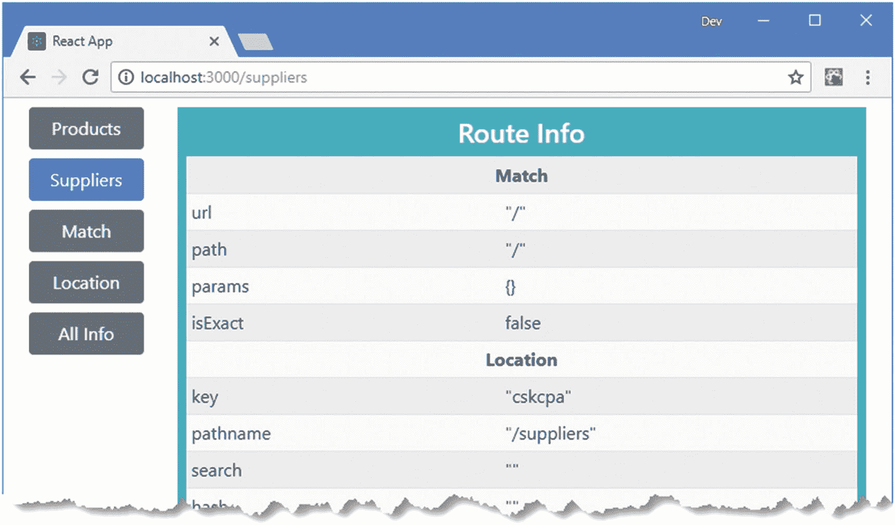

图 22-7

使用 withrouter HOC

`withRouter`函数不提供对匹配路径的支持，这意味着 match 对象用处不大。然而，`location`对象提供了应用当前位置的细节，而`history`对象可以用于编程导航，这将在下一节中描述。

## 以编程方式导航

并不是所有的导航都可以使用`Link`或`NavLink`组件来处理，特别是当应用需要执行一些内部动作来响应一个事件，然后才执行导航时。提供给组件的`history`对象提供了一个 API，允许编程访问路由系统，使用表 [22-6](#Tab6) 中描述的方法。`history`对象为导航提供了一致的接口，不管应用是使用 HTML5 历史 API 还是 URL 片段。

表 22-6

历史方法

<colgroup><col class="tcol1 align-left"> <col class="tcol2 align-left"></colgroup> 
| 

名字

 | 

描述

 |
| --- | --- |
| `push(path)` | 此方法导航到指定的路径，并在浏览器的历史记录中添加一个新条目。可以通过`location.state`属性提供一个可选的状态属性。 |
| `replace(path)` | 此方法导航到指定的路径，并替换浏览器历史记录中的当前位置。可以通过`location.state`属性提供一个可选的状态属性。 |
| `goBack()` | 此方法导航到浏览器历史记录中的上一个位置。 |
| `goForward()` | 此方法导航到浏览器历史记录中的下一个位置。 |
| `go(n)` | 该方法从当前位置导航到历史位置`n`处。使用正值向前移动，负值向后移动。 |
| `block(prompt)` | 该方法会阻止导航，直到用户对提示做出响应，如“导航前提示用户”一节中所述。 |

在清单 [22-13](#PC15) 中，我用一个按钮替换了`ToggleLink`组件中的`Link`，该按钮的事件处理程序以编程方式导航。

```jsx
import React, { Component } from "react";

import { Route } from "react-router-dom";

export class ToggleLink extends Component {

    handleClick = (history) => {
        history.push(this.props.to);
    }

    render() {
        return <Route path={ this.props.to } exact={ this.props.exact }
                children={ routeProps => {

            const baseClasses = this.props.className || "m-2 btn btn-block";
            const activeClass = this.props.activeClass || "btn-primary";
            const inActiveClass = this.props.inActiveClass || "btn-secondary"

            const combinedClasses =
                `${baseClasses} ${routeProps.match ? activeClass : inActiveClass}`

            return  <button className={ combinedClasses }
                        onClick={ () => this.handleClick(routeProps.history) }>
                        {this.props.children}
                    </button>
         }} />
    }
}

Listing 22-13Navigating Programmatically in the ToggleLink.js File in the src/router Folder

```

`onClick`处理程序将从`Route`组件接收的`history`对象传递给`handleClick`方法，后者使用`push`方法导航到由`to`属性指定的位置。没有明显的区别，因为由`Link`组件呈现的锚元素已经被设计成按钮，但是`ToggleLink`组件现在直接处理它的导航。

### 使用组件以编程方式导航

使用`history`对象的另一种方法是呈现执行导航的组件。在清单 [22-14](#PC16) 中，我已经更改了`ToggleLink`组件，因此单击`button`元素会更新状态数据，从而导致呈现一个`Redirect`。

```jsx
import React, { Component } from "react";

import { Route, Redirect } from "react-router-dom";

export class ToggleLink extends Component {

    constructor(props) {
        super(props);
        this.state = {
            doRedirect: false
        }
    }

    handleClick = () => {
        this.setState({ doRedirect: true},
            () => this.setState({ doRedirect: false }));
    }

    render() {
        return <Route path={ this.props.to } exact={ this.props.exact }
                children={ routeProps => {

            const baseClasses = this.props.className || "m-2 btn btn-block";
            const activeClass = this.props.activeClass || "btn-primary";
            const inActiveClass = this.props.inActiveClass || "btn-secondary"

            const combinedClasses =
                `${baseClasses} ${routeProps.match ? activeClass : inActiveClass}`

            return  <React.Fragment>
                { this.state.doRedirect && <Redirect to={ this.props.to } /> }
                <button className={ combinedClasses } onClick={ this.handleClick }>
                    {this.props.children}
                </button>
            </React.Fragment>
         }} />
    }
}

Listing 22-14Navigating Using Components in the ToggleLink.js File in the src/router Folder

```

单击该按钮会将`doRedirect`属性设置为`true`，这将触发呈现`Redirect`组件的更新。`doRedirect`属性被自动设置回`false`，以便组件的正常内容被再次呈现。结果和清单 [22-13](#PC15) 一样，选择一种方式是个人喜好和个人风格的问题。

### 导航前提示用户

可以通过呈现一个`Prompt`来延迟导航，它允许用户确认或取消导航，通常用于避免意外放弃表单数据。`Prompt`组件支撑表 [22-7](#Tab7) 中所述的支柱。

表 22-7

提示组件属性

<colgroup><col class="tcol1 align-left"> <col class="tcol2 align-left"></colgroup> 
| 

名字

 | 

描述

 |
| --- | --- |
| `message` | 这个属性定义了显示给用户的消息。它可以表示为一个字符串，也可以表示为接受一个`location`对象并返回一个字符串的函数。 |
| `when` | 只有当这个属性的值等于`true`时，它才会提示用户，并且可以用来有条件地阻止导航。 |

只使用了一个`Prompt`,但是它呈现在哪里并不重要，因为它不会执行任何操作，直到应用更改到一个新位置，这时用户将被要求确认导航。在清单 [22-15](#PC17) 中，我给`Selector`组件添加了一个`Prompt`。

### 小费

只需要一个`Prompt`，并且您不应该在执行导航的组件中呈现额外的`Prompt`实例，例如示例应用中的`ToggleLink`组件。如果您呈现多个`Prompt`组件，您将在 JavaScript 控制台中收到一个警告。

```jsx
import React, { Component } from "react";

import { BrowserRouter as Router, Route, Switch, Redirect, withRouter, Prompt }

    from "react-router-dom";
import { ProductDisplay } from "./ProductDisplay";
import { SupplierDisplay } from "./SupplierDisplay";
import { RouteInfo } from "./routing/RouteInfo";
import { ToggleLink } from "./routing/ToggleLink";

const RouteInfoHOC = withRouter(RouteInfo)

export class Selector extends Component {

    render() {
        return <Router>
            <div className="container-fluid">
                <div className="row">
                    <div className="col-2">
                        <ToggleLink to="/products">Products</ToggleLink>
                        <ToggleLink to="/suppliers">Suppliers</ToggleLink>
                        <ToggleLink to="/info/match">Match</ToggleLink>
                        <ToggleLink to="/info/location">Location</ToggleLink>
                        <ToggleLink to="/info" exact={ true }>All Info</ToggleLink>
                    </div>
                    <div className="col">
                        <Prompt message={ loc =>
                            `Do you want to navigate to ${loc.pathname}`} />
                        <RouteInfoHOC />
                        <Switch>
                            <Route path="/products" component={ ProductDisplay} />
                            <Route path="/suppliers" component={ SupplierDisplay } />
                            <Route path="/info/:datatype?" component={ RouteInfo } />
                            <Redirect to="/products" />
                        </Switch>
                    </div>
                </div>
            </div>
        </Router>
    }
}

Listing 22-15Prompting the User in the Selector.js File in the src Folder

```

要查看`Prompt`的效果，单击由`ToggleLink`组件呈现的按钮元素之一。你将被要求确认导航，如图 [22-8](#Fig8) 所示。

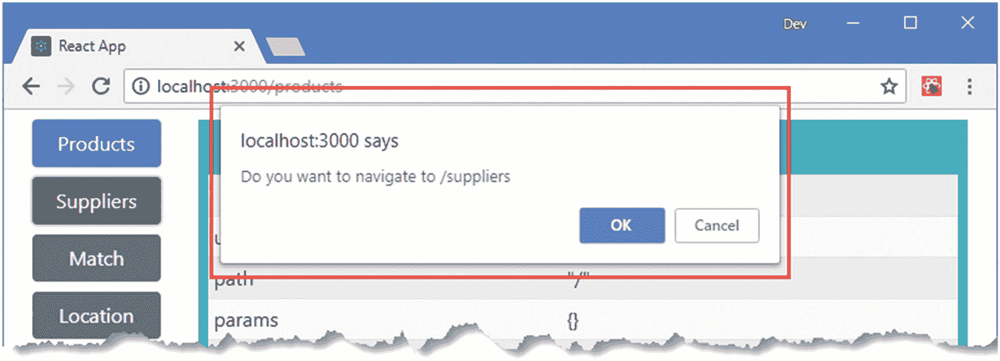

图 22-8

导航前提示用户

### 小费

如果您喜欢使用`history`对象进行导航，那么可以使用`block`方法来设置一个提示，该提示将呈现给用户，如下一节所示。

#### 呈现自定义导航提示

`BrowserRouter`和`HashRouter`组件提供了一个`getUserConfirmation`属性，用于用自定义函数替换默认提示。为了向用户显示与应用其余内容一致的提示，我在`src/routing`文件夹中添加了一个名为`CustomPrompt.js`的文件，并用它来定义清单 [22-16](#PC18) 中所示的组件。

```jsx
import React, { Component } from "react";

export class CustomPrompt extends Component {

    render() {
        if (this.props.show) {
            return <div className="alert alert-warning m-2 text-center">
                <h4 className="alert-heading">Navigation Warning</h4>
                    { this.props.message }
                <div className="p-1">
                    <button className="btn btn-primary m-1"
                        onClick={ () => this.props.callback(true) }>
                            Yes
                    </button>
                    <button className="btn btn-secondary m-1"
                        onClick={ () => this.props.callback(false )}>
                            No
                    </button>
                </div>
            </div>
        }
        return null;
    }
}

Listing 22-16The Contents of the CustomPrompt.js File in the src/routing Folder

```

`CustomPrompt`组件负责向用户显示一条消息，并提供 Yes 和 No 按钮，这些按钮调用一个回调函数来确认或阻止导航。在清单 [22-17](#PC19) 中，我在`Selector`组件中应用了`CustomPrompt`，以及管理提示过程所需的状态数据。

```jsx
import React, { Component } from "react";
import { BrowserRouter as Router, Route, Switch, Redirect, withRouter, Prompt }
    from "react-router-dom";
import { ProductDisplay } from "./ProductDisplay";
import { SupplierDisplay } from "./SupplierDisplay";
import { RouteInfo } from "./routing/RouteInfo";
import { ToggleLink } from "./routing/ToggleLink";

import { CustomPrompt } from "./routing/CustomPrompt";

const RouteInfoHOC = withRouter(RouteInfo)

export class Selector extends Component {

    constructor(props) {
        super(props);
        this.state = {
            showPrompt: false,
            message: "",
            callback: () => {}
        }
    }

    customGetUserConfirmation = (message, navCallback) => {
        this.setState({
            showPrompt: true, message: message,
            callback: (allow) => { navCallback(allow);
                this.setState({ showPrompt: false}) }
        });
    }

    render() {
        return <Router getUserConfirmation={ this.customGetUserConfirmation }>
            <div className="container-fluid">
                <div className="row">
                    <div className="col-2">
                        <ToggleLink to="/products">Products</ToggleLink>
                        <ToggleLink to="/suppliers">Suppliers</ToggleLink>
                        <ToggleLink to="/info/match">Match</ToggleLink>
                        <ToggleLink to="/info/location">Location</ToggleLink>
                        <ToggleLink to="/info" exact={ true }>All Info</ToggleLink>
                    </div>
                    <div className="col">
                        <CustomPrompt show={ this.state.showPrompt }
                            message={ this.state.message }
                            callback={ this.state.callback } />
                        <Prompt message={ loc =>
                            `Do you want to navigate to ${loc.pathname}?`} />
                        <RouteInfoHOC />
                        <Switch>
                            <Route path="/products" component={ ProductDisplay} />
                            <Route path="/suppliers" component={ SupplierDisplay } />
                            <Route path="/info/:datatype?" component={ RouteInfo } />
                            <Redirect to="/products" />
                        </Switch>
                    </div>
                </div>
            </div>
        </Router>
    }
}

Listing 22-17Appling a Custom Prompt in the Selector.js File in the src Folder

```

由`BrowserRouter`和`HashRouter`支持的`getUserConfirmation` prop 被分配一个函数，该函数接收一个显示给用户的消息和一个由用户决定调用的回调:`true`处理导航，false`block`它。在清单中，`getUserConfirmation`属性将调用`customGetUserConfirmation`方法，该方法更新用于`CustomPrompt`属性的状态数据，结果是提示用户，如图 [22-9](#Fig9) 所示。

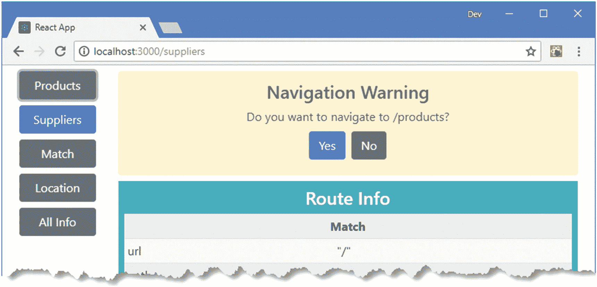

图 22-9

使用自定义提示

### 小费

注意，我仍然需要使用一个`Prompt`，它负责触发显示`CustomPrompt`的流程。

## 以编程方式生成路线

`Selector`组件使用`ToggleLink`和`Route`组件来建立应用支持的 URL 和它们相关的内容之间的映射，但是在我添加对 URL 路由的支持之前，这不是应用的工作方式。相反，`App`组件将`Selector`视为一个容器，并为其提供子组件进行显示，如下所示:

```jsx
import React, { Component } from "react";
import { Provider } from "react-redux";
import dataStore from "./store";
import { Selector } from "./Selector";
import { ProductDisplay } from "./ProductDisplay";
import { SupplierDisplay } from "./SupplierDisplay";

export default class App extends Component {

    render() {
        return  <Provider store={ dataStore }>
                    <Selector>
                        <ProductDisplay name="Products" />
                        <SupplierDisplay name="Suppliers" />
                    </Selector>
                </Provider>
    }
}

```

在 React 开发中，使用提供服务的容器组件而不使用其子组件的硬编码知识是很重要的，并且在使用 React-Router 时可以很容易地应用，因为路由是使用组件定义和处理的。在清单 [22-18](#PC21) 中，我修改了`Selector`组件，删除了本地定义的路线，改为从`children`属性中生成。

```jsx
import React, { Component } from "react";

import { BrowserRouter as Router, Route, Switch, Redirect, Prompt }

    from "react-router-dom";

// import { ProductDisplay } from "./ProductDisplay";

// import { SupplierDisplay } from "./SupplierDisplay";

//import { RouteInfo } from "./routing/RouteInfo";

import { ToggleLink } from "./routing/ToggleLink";
import { CustomPrompt } from "./routing/CustomPrompt";

//const RouteInfoHOC = withRouter(RouteInfo)

export class Selector extends Component {

    constructor(props) {
        super(props);
        this.state = {
            showPrompt: false,
            message: "",
            callback: () => {}
        }
    }

    customGetUserConfirmation = (message, navCallback) => {
        this.setState({
            showPrompt: true, message: message,
            callback: (allow) => { navCallback(allow);
                this.setState({ showPrompt: false}) }
        });
    }

    render() {

        const routes = React.Children.map(this.props.children, child => ({
            component: child,
            name: child.props.name,
            url: `/${child.props.name.toLowerCase()}`
        }));

        return <Router getUserConfirmation={ this.customGetUserConfirmation }>
            <div className="container-fluid">
                <div className="row">
                    <div className="col-2">
                        { routes.map(r => <ToggleLink key={ r.url } to={ r.url }>
                                            { r.name }
                                        </ToggleLink>)}
                    </div>
                    <div className="col">
                        <CustomPrompt show={ this.state.showPrompt }
                            message={ this.state.message }
                            callback={ this.state.callback } />
                        <Prompt message={ loc =>
                            `Do you want to navigate to ${loc.pathname}?`} />
                        <Switch>
                            { routes.map( r => <Route key={ r.url } path={ r.url }
                                    render={ () => r.component } />)}
                            <Redirect to={ routes[0].url } />
                        </Switch>
                    </div>
                </div>
            </div>
        </Router>
    }
}

Listing 22-18Generating Routes from Children in the Selector.js File in the src Folder

```

`Selector`处理其子进程以建立 URL 和组件之间的映射，并生成所需的`ToggleLink`和`Route`组件，我用一个`Redirect`组件对其进行了补充，产生了如图 [22-10](#Fig10) 所示的结果。

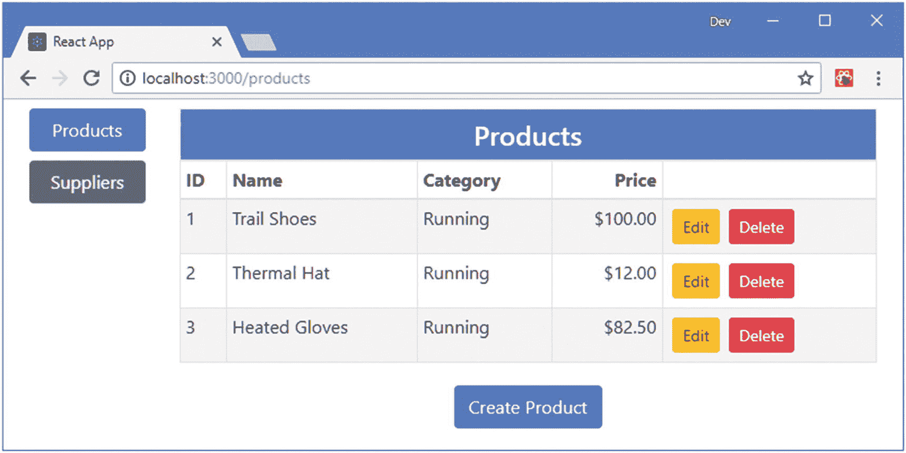

图 22-10

以编程方式生成路线

## 对连接的数据存储组件使用路由

为了在示例应用中完成路由的采用，我将把协调组件的剩余状态数据移出数据存储，并使用表 [22-8](#Tab8) 中描述的一组 URL 对其进行管理。

表 22-8

示例应用的 URL

<colgroup><col class="tcol1 align-left"> <col class="tcol2 align-left"></colgroup> 
| 

名字

 | 

描述

 |
| --- | --- |
| `/products/table` | 该 URL 将显示产品列表。 |
| `/products/create` | 该 URL 将显示编辑器，允许创建新产品。 |
| `/products/edit/4` | 此 URL 将显示编辑器，允许编辑现有产品，其中最后一个 URL 段标识要更改的产品。 |
| `/suppliers/table` | 该 URL 将显示供应商列表。 |
| `/suppliers/create` | 该 URL 将显示编辑器，允许创建新的供应商。 |
| `/suppliers/edit/4` | 该 URL 将显示编辑器，允许编辑现有的供应商，其中最后一个 URL 段标识要更改的供应商。 |

应用需要的 URL 可以用带有 URL 参数的单一路径来处理，如下所示:

```jsx
...
/:datatype/:mode?/:id?
...

```

在接下来的小节中，我将更新应用中的组件，以便数据存储仅用于模型数据，而应该向用户显示的内容的细节在 URL 中表示。(这种硬分离只是一种方法，如果适合您的项目，您可以采取更柔和的方法，以便一些状态数据在数据存储中处理，一些通过 URL 处理。在 React 开发中，没有绝对正确的方法。)

### 更换显示器组件

`ProductDisplay`和`SupplierDisplay`组件负责决定是否为特定的数据类型显示表格或编辑器。由于示例应用中增加了一些功能，这些组件之间的差异已经减少，URL 路由的引入意味着单个组件可以轻松处理两种类型数据的内容选择。我在`src/routing`文件夹中添加了一个名为`RoutedDisplay.js`的文件，并用它来定义清单 [22-19](#PC23) 中所示的组件。

```jsx
import React, { Component } from "react";
import { ProductTable } from "../ProductTable"
import { ProductEditor } from "../ProductEditor";
import { EditorConnector } from "../store/EditorConnector";
import { PRODUCTS } from "../store/dataTypes";
import { TableConnector } from "../store/TableConnector";
import { Link } from "react-router-dom";
import { SupplierEditor } from "../SupplierEditor";
import { SupplierTable } from "../SupplierTable";

export const RoutedDisplay = (dataType) => {

    const ConnectedEditor = EditorConnector(dataType, dataType === PRODUCTS
        ? ProductEditor: SupplierEditor);
    const ConnectedTable = TableConnector(dataType, dataType === PRODUCTS
        ? ProductTable : SupplierTable);

    return class extends Component {
        render() {
            const modeParam = this.props.match.params.mode;
            if (modeParam === "edit" || modeParam === "create") {
                return <ConnectedEditor key={ this.props.match.params.id || -1 } />
            } else {
                return <div className="m-2">
                    <ConnectedTable />
                    <div className="text-center">
                        <Link to={`/${dataType}/create`}
                                className="btn btn-primary m-1">
                            Create
                        </Link>
                    </div>
                </div>
            }
        }
    }
}

Listing 22-19The Contents of the RoutedDisplay.js File in the src/routing Folder

```

该组件执行与`ProductDisplay`和`SupplierDisplay`组件相同的任务，但是接收它负责的数据类型作为参数，这允许创建`EditorConnector`和`TableConnector`组件。

### 更新连接的编辑器组件

`EditorConnector`组件负责创建一个连接到 Redux 数据存储的`ProductEditor`或`SupplierEditor`。在清单 [22-20](#PC24) 中，我使用了`withRouter`函数来创建一个组件，该组件提供了路由数据，但仍然保持与数据存储的连接。

```jsx
import { connect } from "react-redux";

//import { endEditing } from "./stateActions";

import { PRODUCTS, SUPPLIERS  } from "./dataTypes";
import { saveAndEndEditing } from "./multiActionCreators";
import { withRouter } from "react-router-dom";

export const EditorConnector = (dataType, presentationComponent) => {

    const mapStateToProps = (storeData, ownProps) => {
        const mode = ownProps.match.params.mode;
        const id = Number(ownProps.match.params.id);
        return {
            editing: mode === "edit" || mode === "create",
            product: (storeData.modelData[PRODUCTS].find(p => p.id === id)) || {},
            supplier:(storeData.modelData[SUPPLIERS].find(s => s.id === id)) || {}
        }
    }

    const mapDispatchToProps = {
        //cancelCallback: endEditing,
        saveCallback: (data) => saveAndEndEditing(data, dataType)
    }

    const mergeProps = (dataProps, functionProps, ownProps) => {
        let routedDispatchers = {
            cancelCallback: () => ownProps.history.push(`/${dataType}`),
            saveCallback: (data) => {
                functionProps.saveCallback(data);
                ownProps.history.push(`/${dataType}`);
            }
        }
        return Object.assign({}, dataProps, routedDispatchers, ownProps);
    }

    return withRouter(connect(mapStateToProps,
        mapDispatchToProps, mergeProps)(presentationComponent));
}

Listing 22-20Using Routing in the EditorConnector.js File in the src/store Folder

```

组件不再使用数据存储来判断用户是在编辑还是在创建一个对象，而是从 URL 获取该信息，以及编辑对象时的`id`值。

### 小费

注意，我使用`Number`来解析`id` URL 参数，它以字符串的形式出现。我需要`id`值是一个数字，以便定位对象。

我已经使用了第 20 章中描述的合并属性的能力，来围绕数据存储动作创建器创建包装器，以便数据被保存到存储中，然后`history`对象被用于导航。不再需要取消动作，并且可以通过导航离开当前位置来直接处理。

### 避免被阻止的更新

`withRouter`和`connect`函数都使用`shouldComponentUpdate`方法产生试图最小化更新的组件，这将在第 [13 章](13.html)中描述。当`withRouter`和`connect`函数一起使用时，结果可能是一个组件并不总是更新，因为 React-Router 和 React-Redux 包对 props 执行简单的比较，并没有意识到已经发生了变化。要避免这个问题，请简化 props 结构，使更改更容易被检测到。

### 更新连接的表组件

必须在将显示对象的表连接到数据存储的组件上执行相同的过程，如清单 [22-21](#PC25) 所示。

```jsx
import { connect } from "react-redux";

//import { startEditingProduct, startEditingSupplier } from "./stateActions";

import { deleteProduct, deleteSupplier } from "./modelActionCreators";
import { PRODUCTS, SUPPLIERS } from "./dataTypes";

import { withRouter } from "react-router-dom";

export const TableConnector = (dataType, presentationComponent) => {

    const mapStateToProps = (storeData, ownProps) => {
        if (dataType === PRODUCTS) {
            return { products: storeData.modelData[PRODUCTS] };
        } else {
            return {
                suppliers: storeData.modelData[SUPPLIERS].map(supp => ({
                    ...supp,
                    products: supp.products.map(id =>
                        storeData.modelData[PRODUCTS]
                            .find(p => p.id === Number(id)) || id)
                            .map(val => val.name || val)
                    }))
            }
        }
    }

    const mapDispatchToProps = (dispatch, ownProps) => {
        if (dataType === PRODUCTS) {
            return {
                //editCallback: (...args) => dispatch(startEditingProduct(...args)),
                deleteCallback: (...args) => dispatch(deleteProduct(...args))
            }
        } else {
            return {
                //editCallback: (...args) => dispatch(startEditingSupplier(...args)),
                deleteCallback: (...args) => dispatch(deleteSupplier(...args))
            }
        }
    }

    const mergeProps = (dataProps, functionProps, ownProps) => {
        let routedDispatchers = {
            editCallback: (target) => {
                ownProps.history.push(`/${dataType}/edit/${target.id}`);
            },
            deleteCallback: functionProps.deleteCallback
        }
        return Object.assign({}, dataProps, routedDispatchers, ownProps);
    }

    return withRouter(connect(mapStateToProps,
        mapDispatchToProps, mergeProps)(presentationComponent));
}

Listing 22-21Using Routing in the TableConnector.js File in the src/store Folder

```

我再次使用了`withRouter`和`connect`函数来生成一个可以访问路由数据和数据存储的组件。通过导航到指示数据类型和`id`值的 URL 来处理编辑功能。删除数据是完全由数据存储处理的任务，不需要导航。

### 完成路由配置

最后一步是更新路由配置，以支持表 [22-8](#Tab8) 中定义的 URL。在清单 [22-22](#PC26) 中，我更新了`Selector`组件，使其在`render`函数中应用`RoutedDisplay`组件。(为了简洁起见，我还删除了导航提示组件和代码。)

```jsx
import React, { Component } from "react";
import { BrowserRouter as Router, Route, Switch, Redirect }
    from "react-router-dom";
import { ToggleLink } from "./routing/ToggleLink";

//import { CustomPrompt } from "./routing/CustomPrompt";

import { RoutedDisplay } from "./routing/RoutedDisplay";

export class Selector extends Component {

    render() {

        const routes = React.Children.map(this.props.children, child => ({
            component: child,
            name: child.props.name,
            url: `/${child.props.name.toLowerCase()}`,
            datatype: child.props.datatype
        }));

        return <Router getUserConfirmation={ this.customGetUserConfirmation }>
            <div className="container-fluid">
                <div className="row">
                    <div className="col-2">
                        { routes.map(r => <ToggleLink key={ r.url } to={ r.url }>
                                            { r.name }
                                        </ToggleLink>)}
                    </div>
                    <div className="col">
                        <Switch>
                            { routes.map(r =>
                               <Route key={ r.url }
                                   path={ `/:datatype(${r.datatype})/:mode?/:id?`}
                                   component={ RoutedDisplay(r.datatype)} />
                            )}
                            <Redirect to={ routes[0].url } />
                        </Switch>
                    </div>
                </div>
            </div>
        </Router>
    }
}

Listing 22-22Changing the Routing Configuration in the Selector.js File in the src Folder

```

父组件提供的子组件不再是组件，它们的存在只是为了给`Selector`提供适当的值，以便它可以设置`Route`组件。在清单 [22-23](#PC27) 中，我在`App`组件中反映了这一变化，它现在使用一个定制的 HTML 元素来配置`Selector`，而不是直接使用特定于数据的组件。

```jsx
import React, { Component } from "react";
import { Provider } from "react-redux";
import dataStore from "./store";
import { Selector } from "./Selector";

// import { ProductDisplay } from "./ProductDisplay";

// import { SupplierDisplay } from "./SupplierDisplay";

import { PRODUCTS, SUPPLIERS } from "./store/dataTypes";

export default class App extends Component {

    render() {
        return  <Provider store={ dataStore }>
                    <Selector>
                        <data name="Products" datatype={ PRODUCTS } />
                        <data name="Suppliers" datatype ={ SUPPLIERS } />
                    </Selector>
                </Provider>
    }
}

Listing 22-23Completing the Routing Configuration in the App.js File in the src Folder

```

结果是数据存储不再用于组件之间的协调，现在完全通过 URL 来处理，如图 [22-11](#Fig11) 所示。

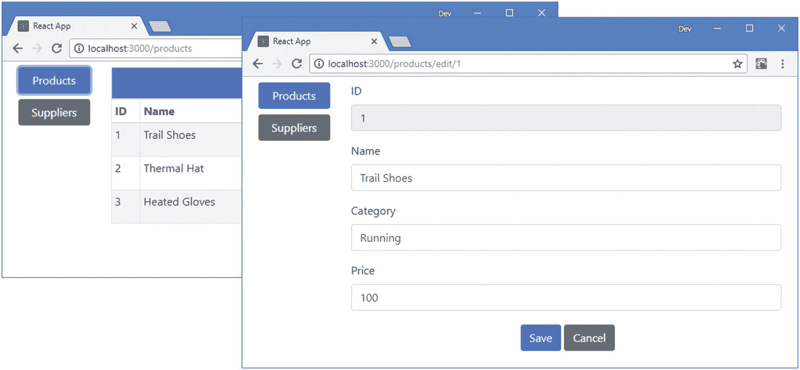

图 22-11

使用 URL 路由来协调组件

## 摘要

在本章中，我向您展示了如何使用 React-Router 包提供的高级特性。我演示了如何创建能够识别路由系统的组件，如何使用 URL 参数为组件提供对当前路由数据的轻松访问，以及如何以编程方式使用路由功能。我还演示了组件如何参与路由系统，同时还连接到 Redux，允许通过 URL 处理状态数据，而应用的模型数据由数据存储管理。在下一章，我将向您展示如何使用 RESTful web 服务。