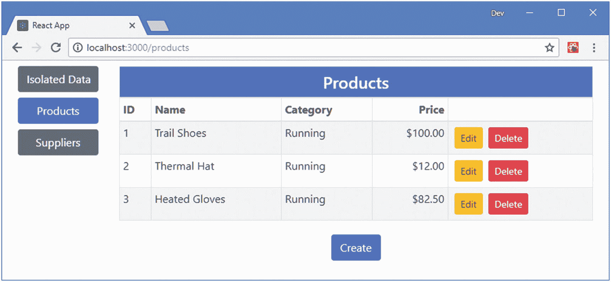
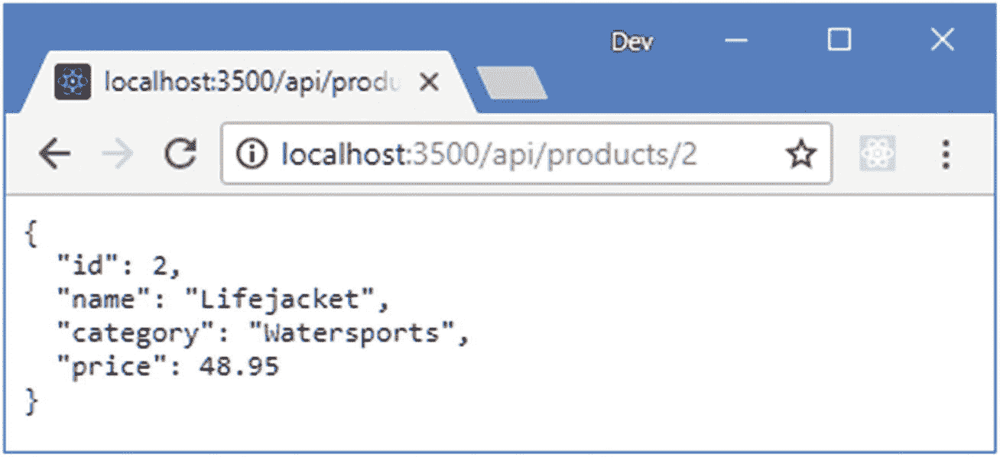
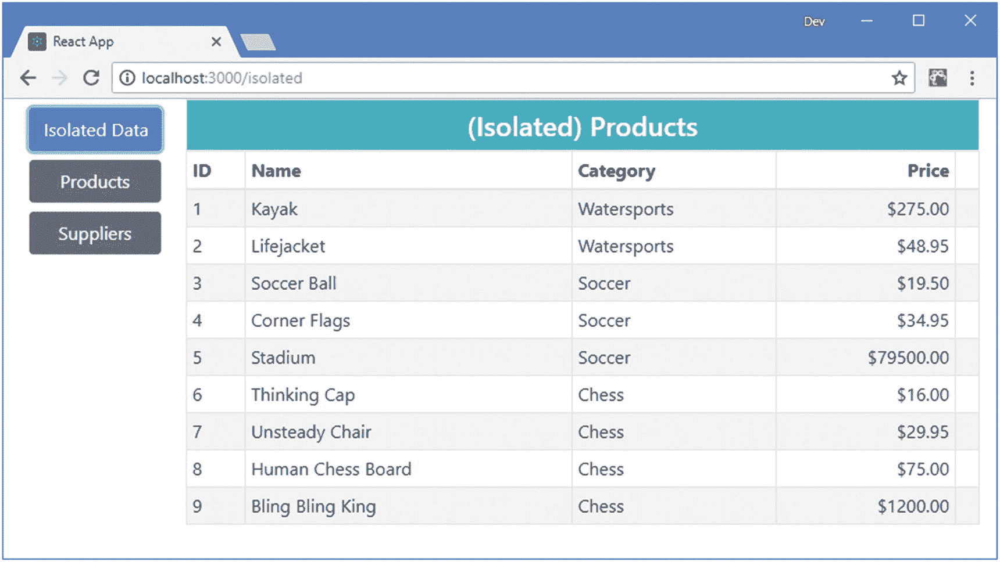
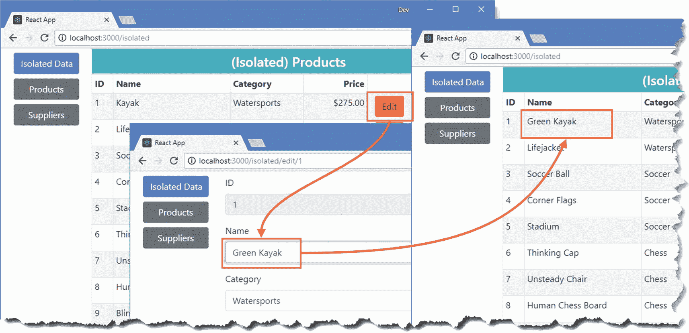
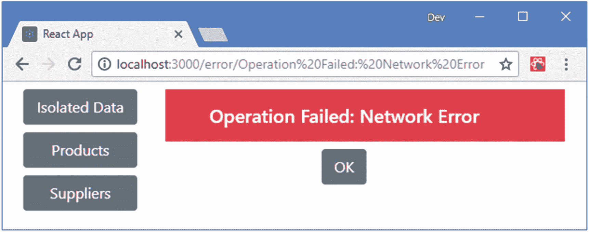
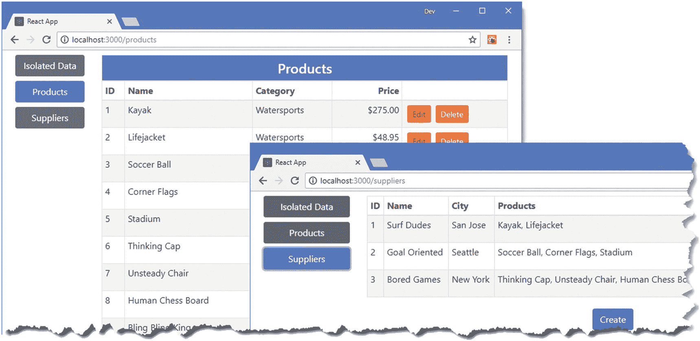

# 二十三、使用 RESTful Web 服务

在这一章中，我通过创建一个 web 服务并使用它来管理应用的数据来解决示例应用缺乏永久数据存储的问题。应用将向 web 服务发送 HTTP 请求，以检索数据并提交更改。本章一开始，我将向您展示如何在组件中直接使用 web 服务，然后演示如何将 web 服务用于数据存储。在第 24 章中，我解释了如何使用 GraphQL，这是处理 web 服务的另一种方法。表 [23-1](#Tab1) 将这一章放在上下文中。

表 23-1

将消费 Web 服务放在上下文中

<colgroup><col class="tcol1 align-left"> <col class="tcol2 align-left"></colgroup> 
| 

问题

 | 

回答

 |
| --- | --- |
| 这是什么？ | Web 服务充当应用的数据存储库，允许使用 HTTP 请求读取、存储、修改和删除数据。 |
| 为什么有用？ | Web 服务非常适合浏览器中可用的特性，并且避免了处理本地存储问题。 |
| 如何使用？ | Web 服务的实现方式不尽相同，但一般的方法是发送 HTTP 请求，其中请求方法标识要执行的操作，请求 URL 标识要操作的数据。 |
| 有什么陷阱或限制吗？ | web 服务实现的不一致性意味着每个 web 服务可能需要一组稍微不同的请求。在组件中使用 web 服务时必须小心，以确保不会在每次更新时都发送请求。 |
| 还有其他选择吗？ | 现代 web 浏览器支持本地存储选项，这对于某些项目来说是一个很好的选择。然而，主要的缺点是每个客户端都有自己的数据，这就错过了单一中央存储库的一些优势。 |

表 [23-2](#Tab2) 总结了本章内容。

表 23-2

章节总结

<colgroup><col class="tcol1 align-left"> <col class="tcol2 align-left"> <col class="tcol3 align-left"></colgroup> 
| 

问题

 | 

解决办法

 | 

列表

 |
| --- | --- | --- |
| 从 web 服务获取数据 | 创建一个发出 HTTP 请求的数据源，并使用调用`setState`方法的回调将数据反馈给应用。 | 1–11 |
| 执行附加数据操作 | 扩展数据源以发送 HTTP 方法和 URL 的不同组合来指示所需的操作。通过响应组件事件来触发请求 | 12–15 |
| 处理请求错误 | 使用`try` / `catch`块捕捉错误并将其传递给组件，以便向用户显示警告。 | 16–19 |
| 使用带有数据存储的 web 服务 | 使用中间件拦截数据存储操作，并将所需的请求发送到 web 服务。请求完成后，将操作转发到数据存储，以便可以更新它。 | 20–24 |

## 为本章做准备

在这一章中，我继续使用第 [22 章](22.html)中的`productapp`项目，该项目在之后的章节中进行了修改。需要做一些准备工作来将附加的包安装到项目中，并创建应用将依赖的 web 服务。

### 小费

你可以从 [`https://github.com/Apress/pro-react-16`](https://github.com/Apress/pro-react-16) 下载本章以及本书其他章节的示例项目。

### 将包添加到项目中

运行`productapp`文件夹中清单 [23-1](#PC1) 中所示的命令，将所需的包添加到项目中。

```jsx
npm install json-server@0.14.0 --save-dev
npm install npm-run-all@4.1.3 --save-dev
npm install axios@0.18.0

Listing 23-1Installing Additional Packages to the Project

```

为了快速参考，表 [23-3](#Tab3) 中描述了清单 [23-1](#PC1) 中命令的包。

表 23-3

添加到项目中的包

<colgroup><col class="tcol1 align-left"> <col class="tcol2 align-left"></colgroup> 
| 

名字

 | 

描述

 |
| --- | --- |
| `json-server` | 这个包提供了一个 web 服务，应用将查询该服务中的数据。该命令与`save-dev`命令一起安装，因为它是开发所必需的，不是应用的一部分。 |
| `npm-run-all` | 这个包允许多个命令并行运行，以便 web 服务和开发服务器可以同时启动。该命令与`save-dev`命令一起安装，因为它是开发所必需的，不是应用的一部分。 |
| `axios` | 应用将使用这个包向 web 服务发出 HTTP 请求。 |

### 准备 Web 服务

为了给`json-server`包提供要处理的数据，在`productapp`文件夹中添加一个名为`restData.js`的文件，并添加清单 [23-2](#PC2) 中所示的代码。

```jsx
module.exports = function () {
    var data = {
        products: [
            { id: 1, name: "Kayak", category: "Watersports", price: 275 },
            { id: 2, name: "Lifejacket", category: "Watersports", price: 48.95 },
            { id: 3, name: "Soccer Ball", category: "Soccer", price: 19.50 },
            { id: 4, name: "Corner Flags", category: "Soccer", price: 34.95 },
            { id: 5, name: "Stadium", category: "Soccer", price: 79500 },
            { id: 6, name: "Thinking Cap", category: "Chess", price: 16 },
            { id: 7, name: "Unsteady Chair", category: "Chess", price: 29.95 },
            { id: 8, name: "Human Chess Board", category: "Chess", price: 75 },
            { id: 9, name: "Bling Bling King", category: "Chess", price: 1200 }
        ],
        suppliers: [
            { id: 1, name: "Surf Dudes", city: "San Jose", products: [1, 2] },
            { id: 2, name: "Goal Oriented", city: "Seattle", products: [3, 4, 5] },
            { id: 3, name: "Bored Games", city: "New York", products: [6, 7, 8, 9] },
        ]
    }
    return data
}

Listing 23-2The Contents of the restData.js File in the productapp Folder

```

`json-server`包可以处理 JSON 或 JavaScript 文件。如果使用 JSON 文件，它的内容将被修改，以反映客户机发出的更改请求。相反，我选择了 JavaScript 选项，它允许以编程方式生成数据，并意味着重新启动该过程将返回到原始数据。这不是您在实际项目中会做的事情，但是对于这个例子来说是有用的，因为它使得返回到一个已知的状态变得容易，同时仍然允许应用访问持久数据。

为了配置`json-server`包，使其响应以`/api`开头的 URL 请求，在`productapp`文件夹中创建一个名为`api.routes.json`的文件，其内容如清单 [23-3](#PC3) 所示。

```jsx
{ "/api/*": "/$1" }

Listing 23-3The Contents of the api.routes.json File in the productapp Folder

```

要配置开发工具，使 web 服务与开发 web 服务器同时启动，对`productapp`文件夹中的`package.json`文件进行清单 [23-4](#PC4) 所示的更改。

```jsx
...
"scripts": {
    "start": "npm-run-all --parallel reactstart json",
    "build": "react-scripts build",
    "test": "react-scripts test",
    "eject": "react-scripts eject",
    "reactstart": "react-scripts start",
    "json": "json-server --p 3500 -r api.routes.json restData.js"
},
...

Listing 23-4Configuring Tools in the package.json File in the productapp Folder

```

对`package.json`文件的`scripts`部分的更改使用了`npm-run-all`包，这样 HTTP 开发服务器和`json-server`由`npm start`启动。

### 添加组件和路线

我将演示如何孤立地使用 web 服务，然后向您展示如何使用数据存储中的数据。应用中的现有组件已经连接到数据存储，因此为了展示如何使用未连接的组件，我在`src`文件夹中创建了一个名为`IsolatedTable.js`的文件，并用它来创建清单 [23-5](#PC5) 中所示的组件。

```jsx
import React, { Component } from "react";

export class IsolatedTable extends Component {

    render() {
        return <table className="table table-sm table-striped table-bordered">
            <thead>
                <tr><th colSpan="5"
                        className="bg-info text-white text-center h4 p-2">
                    (Isolated) Products
                </th></tr>
                <tr>
                    <th>ID</th><th>Name</th><th>Category</th>
                    <th className="text-right">Price</th>
                    <th></th>
                </tr>
            </thead>
            <tbody>
                <tr><td colSpan="5" className="text-center p-2">No Data</td></tr>
            </tbody>
        </table>
    }
}

Listing 23-5The Contents of the IsolatedTable.js File in the src Folder

```

该组件呈现一个空表作为该时刻的占位符。为了将组件合并到应用中，我更新了`Selector`组件中的路由配置，添加了一个新的`Route`和一个相应的导航链接，如清单 [23-6](#PC6) 所示。

```jsx
import React, { Component } from "react";
import { BrowserRouter as Router, Route, Switch, Redirect }
    from "react-router-dom";
import { ToggleLink } from "./routing/ToggleLink";
import { RoutedDisplay } from "./routing/RoutedDisplay";

import { IsolatedTable } from "./IsolatedTable";

export class Selector extends Component {

    render() {

        const routes = React.Children.map(this.props.children, child => ({
            component: child,
            name: child.props.name,
            url: `/${child.props.name.toLowerCase()}`,
            datatype: child.props.datatype
        }));

        return <Router getUserConfirmation={ this.customGetUserConfirmation }>
            <div className="container-fluid">
                <div className="row">
                    <div className="col-2">
                        <ToggleLink to="/isolated">Isolated Data</ToggleLink>
                        { routes.map(r => <ToggleLink key={ r.url } to={ r.url }>
                                            { r.name }
                                        </ToggleLink>)}
                    </div>
                    <div className="col">
                        <Switch>
                            <Route path="/isolated" component={ IsolatedTable } />
                            { routes.map(r =>
                               <Route key={ r.url }
                                   path={ `/:datatype(${r.datatype})/:mode?/:id?`}
                                   component={ RoutedDisplay(r.datatype)} />
                            )}
                            <Redirect to={ routes[0].url } />
                        </Switch>
                    </div>
                </div>
            </div>
        </Router>
    }
}

Listing 23-6Adding a Route in the Selector.js File in the src Folder

```

### 运行 Web 服务和示例应用

使用命令提示符，运行`productapp`文件夹中清单 [23-7](#PC7) 所示的命令来启动开发工具和 web 服务。

```jsx
npm start

Listing 23-7Starting the Development Tools

```

一旦项目的初始准备完成，一个新的浏览器窗口将打开并显示 URL `http://localhost:3000`，如图 [23-1](#Fig1) 所示。



图 23-1

运行示例应用

打开新的浏览器窗口并导航至`http://localhost:3500/api/products/2`。服务器将以下列数据响应，这些数据也显示在图 [23-2](#Fig2) 中:



图 23-2

测试 web 服务

```jsx
...
{ "id": 2, "name": "Lifejacket", "category": "Watersports", "price": 48.95 }
...

```

我为本章选择的配置意味着有两个 HTTP 服务器在运行。React development server 在端口 3000 上侦听请求，并提供启动应用的 HTML 文档，以及将应用呈现给用户所需的 JavaScript 和 CSS 文件。RESTful web 服务在端口 3500 上监听请求，并以数据响应。这些数据以 JSON 格式表示，这意味着 JavaScript 应用很容易处理这些数据，但是不应该直接呈现给大多数用户。

## 理解 RESTful Web 服务

交付和存储应用数据的最常见方法是应用称为 REST 的*表示性状态转移*模式来创建数据 web 服务。REST 没有详细的规范，这导致很多不同的方法都打着 RESTful 的旗号。然而，在 web 应用开发中有一些有用的统一思想。

RESTful web 服务的核心前提是包含 HTTP 的特性，以便请求方法——也称为*动词*——指定服务器要执行的操作，请求 URL 指定操作将应用到的一个或多个数据对象。

例如，在示例应用中，下面是一个可能指向特定产品的 URL:

```jsx
http://localhost:3500/api/products/2

```

URL 的第一段—`api`—通常表示请求的是数据。下一个段—`products`—用于指示将要操作的对象集合，并允许单个服务器提供多个服务，每个服务都有自己的数据。最后一个片段——`2`——在`products`集合中选择一个单独的对象。在这个例子中，`id`属性的值唯一地标识了一个对象，并将在 URL 中使用，在这个例子中，指定了`Lifejacket`对象。

用于发出请求的 HTTP 动词或方法告诉 RESTful 服务器应该对指定的对象执行什么操作。在上一节中测试 RESTful 服务器时，浏览器发送了一个 HTTP GET 请求，服务器将其解释为检索指定对象并将其发送给客户机的指令。

表 [23-4](#Tab4) 显示了 HTTP 方法和 URL 的最常见组合，并解释了当发送到 RESTful 服务器时它们各自的作用。

表 23-4

RESTful Web 服务中常见的 HTTP 动词及其作用

<colgroup><col class="tcol1 align-left"> <col class="tcol2 align-left"> <col class="tcol3 align-left"></colgroup> 
| 

动词

 | 

统一资源定位器

 | 

描述

 |
| --- | --- | --- |
| `GET` | `/api/products` | 这种组合检索`products`集合中的所有对象。 |
| `GET` | `/api/products/2` | 这个组合从`products`集合中检索出`id`为`2`的对象。 |
| `POST` | `/api/products` | 该组合用于向`products`集合添加一个新对象。请求体包含新对象的 JSON 表示。 |
| `PUT` | `/api/products/2` | 该组合用于替换`products`集合中`id`为 2 的对象。请求体包含替换对象的 JSON 表示。 |
| `PATCH` | `/api/products/2` | 该组合用于更新`products`集合中对象属性的子集，该集合的`id`为 2。请求体包含要更新的属性和新值的 JSON 表示。 |
| `DELETE` | `/api/products/2` | 该组合用于从`products`集合中删除`id`为 2 的产品。 |

web 服务的实现方式有相当大的差异，这是由创建它们所使用的框架和开发团队的偏好的差异造成的。确认 web 服务如何使用动词以及在 URL 和请求正文中需要什么来执行操作是很重要的。

常见的变化包括不接受任何包含`id`值的请求主体的 web 服务(以确保它们是由服务器的数据存储唯一生成的)和不支持所有动词的 web 服务(通常忽略`PATCH`请求，只接受使用`PUT`动词的更新)。

### 小费

您可能已经注意到，编辑器组件不允许用户为`id`属性提供值。这是因为我在本章中创建的 web 服务会自动生成`id`值以确保唯一性。

### 选择 HTTP 请求库

在本章中，我使用 Axios 库向 web 服务发送 HTTP 请求，因为它易于使用，可以自动处理常见的数据类型，并且不需要复杂的代码来处理像 CORS 这样的特性(参见侧栏“生成跨源请求”)。Axios 广泛应用于 web 应用开发，尽管它不是专门针对 React 的。

Axios 并不是向 web 服务发送 HTTP 请求的唯一方式。最基本的选择是使用`XMLlHttpRequest`对象，该对象提供了使用 JavaScript 进行请求的原始 API(尽管名称中有 XML，但它能够处理一系列数据类型)。`XMLHttpRequest`对象使用起来有些笨拙，但是有广泛的浏览器支持，你可以在 [`https://developer.mozilla.org/en-US/docs/Web/API/XMLHttpRequest`](https://developer.mozilla.org/en-US/docs/Web/API/XMLHttpRequest) 获得进一步的细节。(Axios 使用`XMLHttpRequest`来发出 HTTP 请求，但简化了它们的创建和处理方式。)

Fetch API 是现代浏览器提供的最新 API，旨在取代`XMLHttpRequest`，在 [`https://developer.mozilla.org/en-US/docs/Web/API/Fetch_API`](https://developer.mozilla.org/en-US/docs/Web/API/Fetch_API) 有描述。主流浏览器的最新版本支持 Fetch API，但旧版本的浏览器不支持，这对某些应用来说可能是个问题。

如果你正在使用 GraphQL，那么你应该考虑使用 Apollo 客户端，如第 [25](25.html) 章所述。

## 消费 Web 服务

在接下来的小节中，我将介绍消费 web 服务所需的步骤，首先是请求应用将向用户显示的初始数据，然后添加对存储和更新对象的支持。

### 创建数据源组件

将使用 Axios 消费 web 服务的代码与使用它的组件分开是一个好主意，这样可以更容易地在应用的其他地方测试和使用它。我创建了`src/webservice`文件夹，并添加了一个名为`RestDataSource.js`的文件，代码如清单 [23-8](#PC10) 所示。

```jsx
import Axios from "axios";

export class RestDataSource {

    constructor(base_url) {
        this.BASE_URL = base_url;
    }

    GetData(callback) {
        this.SendRequest("get", this.BASE_URL, callback);
    }

    SendRequest(method, url, callback) {
        Axios.request({
            method: method,
            url: url
        }).then(response => callback(response.data));
    }
}

Listing 23-8The Contents of the RestDataSource.js File in the src/webservice Folder

Listing 23-8The Contents of the RestDataSource.js File in the src/webservice Folder

```

`RestDataSource`类定义了一个接收 web 服务的基本 URL 的构造函数，并定义了一个调用`SendRequest`的`GetData`方法。

我从`axios`包中导入了 HTTP 功能，并将其命名为`Axios`。`SendRequest`方法使用 Axios 通过`request`方法发送 HTTP 请求，其中请求的细节使用具有`method`和`url`属性的配置对象指定。

Axios 提供了发送不同类型 HTTP 请求的方法——例如，`get`、`post`和`put`方法，但是使用清单中的方法可以更容易地应用影响所有请求类型的特性，当我在本章后面添加错误处理时，您会看到这一点。

使用 JavaScript 发出的 HTTP 请求是异步的。`request`方法返回一个代表请求最终结果的`Promise`对象(关于如何使用`Promise`对象的详细信息，见第 [4](04.html) 章)。在清单 [23-8](#PC10) 中，我使用`then`方法为 Axios 提供一个回调函数，以便在请求完成时使用。回调函数被传递一个对象，该对象使用表 [23-5](#Tab5) 中描述的属性描述响应。

表 23-5

Axios 响应属性

<colgroup><col class="tcol1 align-left"> <col class="tcol2 align-left"></colgroup> 
| 

名字

 | 

描述

 |
| --- | --- |
| `status` | 该属性返回响应的状态代码，如 200 或 404。 |
| `statusText` | 此属性返回伴随状态代码的说明性文本，如 OK 或 Not Found。 |
| `headers` | 此属性返回一个对象，该对象的属性表示响应标头。 |
| `data` | 该属性从响应中返回有效负载。 |
| `config` | 此属性返回一个对象，该对象包含用于发出请求的配置选项。 |
| `request` | 该属性返回用于发出请求的底层`XMLHttpRequest`对象，如果您需要直接访问浏览器提供的 API，这会很有用。 |

Axios 自动将 JSON 数据格式转换成 JavaScript 对象，并通过 response `data`属性呈现出来。正如第 [4](04.html) 章所解释的，使用承诺的代码可以通过使用`async`和`await`关键字来简化，如清单 [23-9](#PC11) 所示。

```jsx
import Axios from "axios";

export class RestDataSource {

    constructor(base_url) {
        this.BASE_URL = base_url;
    }

    GetData(callback) {
        this.SendRequest("get", this.BASE_URL, callback);
    }

    async SendRequest(method, url, callback) {
        let response = await Axios.request({
            method: method,
            url: url
        });
        callback(response.data);
    }
}

Listing 23-9Using async and await in the RestDataSource.js File in the src/webservice Folder

```

我可以通过组合`GetData`方法中的语句来进一步简化代码，如清单 [23-10](#PC12) 所示。

```jsx
import Axios from "axios";

export class RestDataSource {

    constructor(base_url) {
        this.BASE_URL = base_url;
    }

    GetData(callback) {
        this.SendRequest("get", this.BASE_URL, callback);
    }

    async SendRequest(method, url, callback) {
        callback((await Axios.request({
            method: method,
            url: url
        })).data);
    }
}

Listing 23-10Combining Statements in the RestDataSource.js File in the src/webservice Folder

```

这种方法更简洁，但重要的是要确保将括号放在正确的位置，这样,`await`关键字被应用到由`SendRequest`方法返回的对象，而`data`属性从它产生的对象中读取。如果不遵循这种模式，您很容易就会出现这样的情况:发送了 HTTP 请求，但是响应被忽略。

### 获取组件中的数据

下一步是将数据放入组件，以便可以向用户显示。在清单 [23-11](#PC13) 中，我已经更新了`IsolatedTable`组件，以便它创建一个数据源并使用它从 web 服务请求数据。

### 注意

组件名称中的术语 *isolated* 表示该组件不与任何其他组件共享数据，而是直接处理 web 服务。在“使用带有数据存储的 Web 服务”一节中，我向您展示了一种替代方法，其中组件通过数据存储共享数据。

```jsx
import React, { Component } from "react";

import { RestDataSource } from "./webservice/RestDataSource";

export class IsolatedTable extends Component {

    constructor(props) {
        super(props);
        this.state = {
            products: []
        }
        this.dataSource = new RestDataSource("http://localhost:3500/api/products")
    }

    render() {
        return <table className="table table-sm table-striped table-bordered">
            <thead>
                <tr><th colSpan="5"
                        className="bg-info text-white text-center h4 p-2">
                    (Isolated) Products
                </th></tr>
                <tr>
                    <th>ID</th><th>Name</th><th>Category</th>
                    <th className="text-right">Price</th>
                    <th></th>
                </tr>
            </thead>
            <tbody>
                {
                    this.state.products.map(p => <tr key={ p.id }>
                        <td>{ p.id }</td><td>{ p.name }</td><td>{p.category}</td>
                        <td className="text-right">
                            ${ Number(p.price).toFixed(2)}
                        </td><td/>
                    </tr>)
                }
            </tbody>
        </table>
    }

    componentDidMount() {
        this.dataSource.GetData(data => this.setState({products: data}));
    }
}

Listing 23-11Getting Data in the IsolatedTable.js File in the src Folder

```

数据是在`componentDidMount`方法中请求的，这确保了在组件呈现其内容之前不会发送 HTTP 请求。提供给`GetData`方法的回调函数更新组件的状态数据，这将触发更新并确保数据呈现给用户。

### 避免无关的数据请求

不要在`render`方法中请求数据。正如我在第 [13 章](13.html)中解释的，组件的`render`方法可能会被经常调用，而在`render`方法中启动任务可能会生成大量不必要的 HTTP 请求，并增加 React 在处理响应数据时必须执行的更新次数。

即使在使用`componentDidMount`方法时，当从可能被卸载和重新安装的组件发出请求时也应该小心，例如示例中的`IsolatedTable`组件，它将由路由系统为`/isolated` URL 安装，当用户导航到另一个位置时卸载。每次安装组件时，它都会从 web 服务请求新的数据，这可能不是应用所需要的。为了避免不必要的数据请求，可以将数据提升到一个不会被卸载的组件，存储在一个上下文中(如第 [14 章](14.html)中所述)，或者合并到一个数据存储中，如“使用数据存储消费 Web 服务”一节中所述。

结果是当点击隔离数据按钮时，从 web 服务中获取数据并显示给用户，如图 [23-3](#Fig3) 所示。



图 23-3

从 web 服务获取数据

### 保存、更新和删除数据

为了实现保存、更新和删除数据所需的操作，我将清单 [23-12](#PC14) 中所示的方法添加到数据源类中，使用 Axios 通过不同的 HTTP 方法向 web 服务发送请求。

```jsx
import Axios from "axios";

export class RestDataSource {

    constructor(base_url) {
        this.BASE_URL = base_url;
    }

    GetData(callback) {
        this.SendRequest("get", this.BASE_URL, callback);
    }

    async GetOne(id, callback) {
        this.SendRequest("get", `${this.BASE_URL}/${id}`, callback);
    }

    async Store(data, callback) {
        this.SendRequest("post", this.BASE_URL, callback, data)
    }

    async Update(data, callback) {
        this.SendRequest("put", `${this.BASE_URL}/${data.id}`, callback, data);
    }

    async Delete(data, callback) {
        this.SendRequest("delete", `${this.BASE_URL}/${data.id}`, callback, data);
    }

    async SendRequest(method, url, callback, data) {
        callback((await Axios.request({
            method: method,
            url: url,
            data: data
        })).data);
    }
}

Listing 23-12Adding Methods in the RestDataSource.js File in the src/webservice Folder

```

传递给`Axios.request`方法的请求配置对象使用一个`data`属性来指定请求的有效负载，这允许应用提供 JavaScript 对象并让 Axios 自动序列化它们。

当您实现数据源方法时，您会发现需要进行一些调整，以适应 web 服务实现的各种方式。例如，示例 web 服务将自动为 POST 请求中接收的对象分配一个唯一的`id`属性值，并在响应中包含完整的对象。清单 [23-12](#PC14) 中的`Store`方法使用`data`属性从 HTTP 响应中获取完整的对象，并使用它来调用回调，这确保应用接收 web 服务存储的对象。并非所有的 web 服务都以这种方式运行——有些可能要求应用包含唯一的标识符，或者只在响应中返回标识符，而不是发送完整的对象。

修改对象时，会发送一个 PUT 请求，其中包含标识要修改的对象的 URL，如下所示:

```jsx
...
this.SendRequest("put", `${this.BASE_URL}/${data.id}`, callback, data);
...

```

web 服务返回完整的更新对象，该对象用于调用回调函数。同样，并不是所有的 web 服务都返回完整的对象，但这是一种常见的方法，因为它确保 web 服务应用的任何附加转换都反映在客户机中。

#### 添加对创建、编辑和删除数据的应用支持

为了提供创建和编辑数据的支持，我在`src`文件夹中添加了一个名为`IsolatedEditor.js`的文件，并用它来定义清单 [23-13](#PC16) 中所示的组件。

```jsx
import React, { Component } from "react";
import { RestDataSource } from "./webservice/RestDataSource";
import { ProductEditor } from "./ProductEditor";

export class IsolatedEditor extends Component {

    constructor(props) {
        super(props);
        this.state = {
            dataItem: {}
        };
        this.dataSource = this.props.dataSource
            || new RestDataSource("http://localhost:3500/api/products");
    }

    save = (data) => {
        const callback = () => this.props.history.push("/isolated");
        if (data.id === "") {
            this.dataSource.Store(data, callback);
        } else {
            this.dataSource.Update(data, callback);
        }
    }

    cancel = () => this.props.history.push("/isolated");

    render() {
        return <ProductEditor key={ this.state.dataItem.id }
            product={ this.state.dataItem } saveCallback={ this.save }
            cancelCallback={ this.cancel } />
    }

    componentDidMount() {
        if (this.props.match.params.mode === "edit") {
            this.dataSource.GetOne(this.props.match.params.id,
                data => this.setState({ dataItem: data}));
        }
    }
}

Listing 23-13The Contents of the IsolatedEditor.js File in the src Folder

```

React 使得以新的方式使用现有组件变得容易，`IsolatedEditor`组件使用现有的`ProductEditor`及其 props 为其提供来自 web 服务数据源的数据和回调。当用户选择了一个对象进行编辑时，当前路由的细节被用来使用`GetOne`方法请求单个对象的细节，并且使用`Store`或`Update`方法将更改发送回 web 服务。在清单 [23-14](#PC17) 中，我添加了对`IsolatedTable`组件的支持，通过导航到新的 URL 来创建和编辑对象。我还添加了一个删除按钮，其事件处理程序调用数据源的`Delete`方法，该方法向 web 服务发送删除请求。

```jsx
import React, { Component } from "react";
import { RestDataSource } from "./webservice/RestDataSource";

import { Link } from "react-router-dom";

export class IsolatedTable extends Component {

    constructor(props) {
        super(props);
        this.state = {
            products: []
        }
        this.dataSource = new RestDataSource("http://localhost:3500/api/products")
    }

    deleteProduct(product) {
        this.dataSource.Delete(product,
            () => this.setState({products: this.state.products.filter(p =>
                p.id !== product.id)}));
    }

    render() {
        return <table className="table table-sm table-striped table-bordered">
            <thead>
                <tr><th colSpan="5"
                        className="bg-info text-white text-center h4 p-2">
                    (Isolated) Products
                </th></tr>
                <tr>
                    <th>ID</th><th>Name</th><th>Category</th>
                    <th className="text-right">Price</th>
                    <th></th>
                </tr>
            </thead>
            <tbody>
                {
                    this.state.products.map(p => <tr key={ p.id }>
                        <td>{ p.id }</td><td>{ p.name }</td><td>{p.category}</td>
                        <td className="text-right">
                            ${ Number(p.price).toFixed(2)}
                        </td>
                        <td>
                            <Link className="btn btn-sm btn-warning mx-2"
                                    to={`/isolated/edit/${p.id}`}>
                                Edit
                            </Link>
                            <button className="btn btn-sm btn-danger mx-2"
                                onClick={ () => this.deleteProduct(p)}>
                                    Delete
                            </button>
                        </td>
                    </tr>)
                }
            </tbody>
            <tfoot>
                <tr className="text-center">
                    <td colSpan="5">
                        <Link to="/isolated/create"
                            className="btn btn-info">Create</Link>
                    </td>
                </tr>
            </tfoot>
        </table>
    }

    componentDidMount() {
        this.dataSource.GetData(data => this.setState({products: data}));
    }
}

Listing 23-14Adding Data Operations in the IsolatedTable.js File in the src Folder

```

最后一步是更新`Selector`组件中的路由配置，以便`/isolated/edit`和`/isolated/create`URL 选择`IsolatedEditor`组件。我还为`/isolated` URL 设置了完全匹配的路由，以确保`IsolatedTable`组件的`Route`不匹配其他 URL，如清单 [23-15](#PC18) 所示。

```jsx
import React, { Component } from "react";
import { BrowserRouter as Router, Route, Switch, Redirect }
    from "react-router-dom";
import { ToggleLink } from "./routing/ToggleLink";
import { RoutedDisplay } from "./routing/RoutedDisplay";
import { IsolatedTable } from "./IsolatedTable";

import { IsolatedEditor } from "./IsolatedEditor";

export class Selector extends Component {

    render() {

        const routes = React.Children.map(this.props.children, child => ({
            component: child,
            name: child.props.name,
            url: `/${child.props.name.toLowerCase()}`,
            datatype: child.props.datatype
        }));

        return <Router getUserConfirmation={ this.customGetUserConfirmation }>
            <div className="container-fluid">
                <div className="row">
                    <div className="col-2">
                        <ToggleLink to="/isolated">Isolated Data</ToggleLink>
                        { routes.map(r => <ToggleLink key={ r.url } to={ r.url }>
                                            { r.name }
                                        </ToggleLink>)}
                    </div>
                    <div className="col">
                        <Switch>
                            <Route path="/isolated" component={ IsolatedTable }
                                exact={ true } />
                            <Route path="/isolated/:mode/:id?"
                                component={ IsolatedEditor } />
                            { routes.map(r =>
                               <Route key={ r.url }
                                   path={ `/:datatype(${r.datatype})/:mode?/:id?`}
                                   component={ RoutedDisplay(r.datatype)} />
                            )}
                            <Redirect to={ routes[0].url } />
                        </Switch>
                    </div>
                </div>
            </div>
        </Router>
    }
}

Listing 23-15Adding a Route in the Selector.js File in the src Folder

```

`IsolatedTable`组件显示创建、编辑、删除按钮，如图 [23-4](#Fig4) 所示。Create 和 Edit 按钮向用户显示编辑器组件，然后该组件通过发送 POST 或 PUT 请求，用用户所做的更改来更新 web 服务。删除按钮通过向 web 服务发送删除请求来删除与其相关联的对象。



图 23-4

消费 web 服务

### 注意

应用所做的更改存储在 web 服务中，这意味着您可以重新加载浏览器，并且更改仍然可见。本章开头的`json-server`包的配置意味着重新启动开发工具将重置 web 服务提供的数据。参见第 [8](08.html) 章中的 SportsStore 应用，了解使用`json-server`获取真正持久数据的示例，这些数据在工具重启时不会重置。

### 处理错误

应用假设所有的 HTTP 请求都会成功，这是一种不切实际的乐观方法。HTTP 请求失败的原因有很多，比如连接问题或服务器故障。我在第 14 章[中描述的错误边界不能处理异步操作中出现的问题，比如 HTTP 请求，所以需要一种不同的方法。在清单](14.html) [23-16](#PC19) 中，我已经更改了数据源，这样它就可以接收一个在出现问题时调用的函数，并在请求失败时使用`try` / `catch`关键字来调用该函数。

```jsx
import Axios from "axios";

export class RestDataSource {

    constructor(base_url, errorCallback) {
        this.BASE_URL = base_url;
        this.handleError = errorCallback;
    }

    GetData(callback) {
        this.SendRequest("get", this.BASE_URL, callback);
    }

    async GetOne(id, callback) {
        this.SendRequest("get", `${this.BASE_URL}/${id}`, callback);
    }

    async Store(data, callback) {
        this.SendRequest("post", this.BASE_URL, callback, data)
    }

    async Update(data, callback) {
        this.SendRequest("put", `${this.BASE_URL}/${data.id}`, callback, data);
    }

    async Delete(data, callback) {
        this.SendRequest("delete", `${this.BASE_URL}/${data.id}`, callback, data);
    }

    async SendRequest(method, url, callback, data) {
        try {
            callback((await Axios.request({
                method: method,
                url: url,
                data: data
            })).data);
        } catch(err) {
            this.handleError("Operation Failed: Network Error");
        }
    }
}

Listing 23-16Handling Errors in the RestDataSource.js File in the src/webservice Folder

```

通过`SendRequest`方法合并所有请求的好处是，我可以使用一个单独的`try` / `catch`块来处理所有请求类型的错误。`catch`块处理由请求引起的错误，并调用作为构造函数参数接收的回调函数。

### 向用户显示错误消息

当出现问题时，Axios 包会显示详细的错误，包括响应的状态代码和 web 服务提供的任何描述性文本。然而，对于大多数应用来说，将这些信息呈现给用户是没有意义的，因为用户不知道发生了什么，也不知道如何修复。相反，我建议向用户显示一条一般的错误消息，并在服务器上记录问题的详细信息，以便可以识别常见问题。

为了接收错误并将它们显示给用户，我在`src/webservice`文件夹中添加了一个名为`RequestError.js`的文件，并用它来定义清单 [23-17](#PC20) 中所示的组件。

```jsx
import React, { Component } from "react";
import { Link } from "react-router-dom";

export class RequestError extends Component {

    render() {
        return <div>
            <h5 className="bg-danger text-center text-white m-2 p-3">
                { this.props.match.params.message }
            </h5>
            <div className="text-center">
                <Link to="/" className="btn btn-secondary">OK</Link>
            </div>
        </div>
    }
}

Listing 23-17The Contents of the RequestError.js File in the src/webservice Folder

```

该组件显示从 URL 参数获得的消息。清单 [23-18](#PC21) 向`Selector`组件添加了一个新的`Route`，它将为`/error` URL 显示这个组件。

```jsx
import React, { Component } from "react";
import { BrowserRouter as Router, Route, Switch, Redirect }
    from "react-router-dom";
import { ToggleLink } from "./routing/ToggleLink";
import { RoutedDisplay } from "./routing/RoutedDisplay";
import { IsolatedTable } from "./IsolatedTable";
import { IsolatedEditor } from "./IsolatedEditor";

import { RequestError } from "./webservice/RequestError";

export class Selector extends Component {

    render() {

        const routes = React.Children.map(this.props.children, child => ({
            component: child,
            name: child.props.name,
            url: `/${child.props.name.toLowerCase()}`,
            datatype: child.props.datatype
        }));

        return <Router getUserConfirmation={ this.customGetUserConfirmation }>
            <div className="container-fluid">
                <div className="row">
                    <div className="col-2">
                        <ToggleLink to="/isolated">Isolated Data</ToggleLink>
                        { routes.map(r => <ToggleLink key={ r.url } to={ r.url }>
                                            { r.name }
                                        </ToggleLink>)}
                    </div>
                    <div className="col">
                        <Switch>
                            <Route path="/isolated" component={ IsolatedTable }
                                exact={ true } />
                            <Route path="/isolated/:mode/:id?"
                                component={ IsolatedEditor } />
                            <Route path="/error/:message"
                                component={ RequestError } />
                            { routes.map(r =>
                               <Route key={ r.url }
                                   path={ `/:datatype(${r.datatype})/:mode?/:id?`}
                                   component={ RoutedDisplay(r.datatype)} />
                            )}
                            <Redirect to={ routes[0].url } />
                        </Switch>
                    </div>
                </div>
            </div>
        </Router>
    }
}

Listing 23-18Adding a Route in the Selector.js File in the src Folder

```

清单 [23-19](#PC22) 为数据源提供了一个回调函数，当问题出现时，它会导航到`/error` URL，并添加一个按钮，通过请求一个总是会产生 404-Not Found 错误的 URL 来创建一个错误。

```jsx
import React, { Component } from "react";
import { RestDataSource } from "./webservice/RestDataSource";
import { Link } from "react-router-dom";

export class IsolatedTable extends Component {

    constructor(props) {
        super(props);
        this.state = {
            products: []
        }
        this.dataSource = new RestDataSource("http://localhost:3500/api/products",
            (err) => this.props.history.push(`/error/${err}`));
    }

    deleteProduct(product) {
        this.dataSource.Delete(product,
           () => this.setState({products: this.state.products.filter(p =>
                p.id !== product.id)}));
    }

    render() {
        return <table className="table table-sm table-striped table-bordered">
            <thead>
                <tr><th colSpan="5"
                        className="bg-info text-white text-center h4 p-2">
                    (Isolated) Products
                </th></tr>
                <tr>
                    <th>ID</th><th>Name</th><th>Category</th>
                    <th className="text-right">Price</th>
                    <th></th>
                </tr>
            </thead>
            <tbody>
                {
                    this.state.products.map(p => <tr key={ p.id }>
                        <td>{ p.id }</td><td>{ p.name }</td><td>{p.category}</td>
                        <td className="text-right">
                            ${ Number(p.price).toFixed(2)}
                        </td>
                        <td>
                            <Link className="btn btn-sm btn-warning mx-2"
                                    to={`/isolated/edit/${p.id}`}>
                                Edit
                            </Link>
                            <button className="btn btn-sm btn-danger mx-2"
                                onClick={ () => this.deleteProduct(p)}>
                                    Delete
                            </button>
                        </td>
                    </tr>)
                }
            </tbody>
            <tfoot>
                <tr className="text-center">
                    <td colSpan="5">
                        <Link to="/isolated/create"
                            className="btn btn-info">Create</Link>
                        <button className="btn btn-danger mx-2"
                            onClick={ () => this.dataSource.GetOne("err")}>
                            Error
                        </button>
                    </td>
                </tr>
            </tfoot>
        </table>
    }

    componentDidMount() {
        this.dataSource.GetData(data => this.setState({products: data}));
    }
}

Listing 23-19Handling Errors in the IsolatedTable.js File in the src Folder

```

点击由`IsolatedTable`呈现的错误按钮将发送一个请求，该请求从 web 服务接收一个错误响应，这触发导航到显示错误消息的 URL，如图 [23-5](#Fig5) 所示。



图 23-5

显示错误消息

### 提出跨来源请求

默认情况下，浏览器会强制执行一个安全策略，只允许 JavaScript 代码在包含异步 HTTP 请求的文档的同一来源内发出这些请求。该政策旨在降低跨站点脚本(CSS)攻击的风险，这种攻击会诱使浏览器执行恶意代码，详见 [`http://en.wikipedia.org/wiki/Cross-site_scripting`](http://en.wikipedia.org/wiki/Cross-site_scripting) 。对于 web 应用开发人员来说，同源策略在使用 web 服务时可能是一个问题，因为它们通常位于包含应用 JavaScript 代码的源之外。如果两个 URL 具有相同的协议、主机和端口，则它们被认为是来源相同，否则它们具有不同的来源。我在本章中为 RESTful web 服务使用的 URL 与主应用使用的 URL 有不同的来源，因为它们使用不同的 TCP 端口。

跨源资源共享(CORS)协议用于向不同的源发送请求。使用 CORS，浏览器在异步 HTTP 请求中包含标头，向服务器提供 JavaScript 代码的来源。来自服务器的响应包括告诉浏览器它是否愿意接受请求的头。CORS 的详细情况不在本书讨论范围之内，但在 [`https://en.wikipedia.org/wiki/Cross-origin_resource_sharing`](https://en.wikipedia.org/wiki/Cross-origin_resource_sharing) 有题目介绍，在 [`www.w3.org/TR/cors`](http://www.w3.org/TR/cors) 有 CORS 规格。

CORS 是在这一章中自动发生的事情。提供 RESTful web 服务的`json-server`包支持 CORS，并将接受来自任何来源的请求，而我用来发出 HTTP 请求的 Axios 包自动应用 CORS。当您为自己的项目选择软件时，您必须选择一个允许通过单一来源处理所有请求的平台，或者配置 CORS 以便服务器接受应用的数据请求。

## 使用带有数据存储的 Web 服务

我在上一节中定义的组件是相互隔离的，只能通过 URL 路由系统进行协调。这种方法的优点是简单，但是当用户在应用中导航时，它会导致重复地从 web 服务请求相同的数据，并且每个组件在安装时都会发送它的 HTTP 请求。如果应用使用数据存储，那么数据可以在组件之间共享。

### 创建新的中间件

商店已经有了接收对象和更新数据的动作，所以我要采用的方法是创建新的 Redux 中间件，它将拦截现有的动作，并向 web 服务发送相应的 HTTP 请求。我在`src/webservice`文件夹中添加了一个名为`RestMiddleware.js`的文件，内容如清单 [23-20](#PC23) 所示。

```jsx
import { STORE, UPDATE, DELETE} from "../store/modelActionTypes";
import { RestDataSource } from "./RestDataSource";
import { PRODUCTS, SUPPLIERS } from "../store/dataTypes";

export const GET_DATA = "rest_get_data";

export const getData = (dataType) => {
    return {
        type: GET_DATA,
        dataType: dataType
    }
}

export const createRestMiddleware = (productsURL, suppliersURL) => {

    const dataSources = {
        [PRODUCTS]: new RestDataSource(productsURL, () => {}),
        [SUPPLIERS]: new RestDataSource(suppliersURL, () => {})
    }

    return ({dispatch, getState}) => next => action => {
        switch (action.type) {
            case GET_DATA:
                if (getState().modelData[action.dataType].length === 0) {
                    dataSources[action.dataType].GetData((data) =>
                        data.forEach(item => next({ type: STORE,
                            dataType: action.dataType, payload: item})));
                }
                break;
            case STORE:
                action.payload.id = null;
                dataSources[action.dataType].Store(action.payload, data =>
                    next({ ...action, payload: data }))
                break;
            case UPDATE:
                dataSources[action.dataType].Update(action.payload, data =>
                     next({ ...action, payload: data }))
                break;
            case DELETE:
                dataSources[action.dataType].Delete({id: action.payload },
                    () => next(action));
                break;
            default:
                next(action);
        }
    }
}

Listing 23-20The Contents of the RestMiddleware.js File in the src/webservice Folder

```

需要一个新动作，即从 web 服务请求数据。以前不需要这样做，因为数据存储已经用数据自动初始化了。动作类型为`GET_DATA`，清单 [23-20](#PC23) 定义了一个`getData`动作创建者。

`createRestMiddleware`函数接受产品和供应商数据的数据源，并返回处理新的`GET_DATA`动作和现有的`STORE`、`UPDATE`和`DELETE`动作的中间件，方法是向 web 服务发送一个请求，然后在收到结果时使用数据存储的现有特性分派附加动作。

### 将中间件添加到数据存储中

在清单 [23-21](#PC24) 中，我已经将新的中间件添加到数据存储中。如第 [20](20.html) 章所述，中间件组件是按照它们被添加到商店的顺序来应用的。

```jsx
import { createStore, combineReducers, applyMiddleware, compose } from "redux";
import modelReducer from "./modelReducer";
import stateReducer from "./stateReducer";
import { customReducerEnhancer } from "./customReducerEnhancer";
import { multiActions } from "./multiActionMiddleware";
import { asyncEnhancer } from "./asyncEnhancer";

import { createRestMiddleware } from "../webservice/RestMiddleware";

const enhancedReducer = customReducerEnhancer(
    combineReducers(
        {
            modelData: modelReducer,
            stateData: stateReducer
        })
);

const restMiddleware = createRestMiddleware(

    "http://localhost:3500/api/products",
    "http://localhost:3500/api/suppliers");

export default createStore(enhancedReducer,
    compose(applyMiddleware(multiActions),
        applyMiddleware(restMiddleware),
        asyncEnhancer(2000)));

export { saveProduct, saveSupplier, deleteProduct, deleteSupplier }
    from "./modelActionCreators";

Listing 23-21Applying Middleware in the index.js File in the src/store Folder

```

在考虑应用中现有组件如何使用数据存储时，顺序非常重要。在第 [20 章](20.html)中创建的`multiActions`中间件允许一系列动作被分派，这必须放在第一位；否则，新的中间件将不能正确地处理动作。

### 完成应用更改

为了按需自动请求数据，我在`src`文件夹中添加了一个名为`DataGetter.js`的文件，并用它来定义清单 [23-22](#PC25) 中所示的高阶组件。

```jsx
import React, { Component } from "react";
import { PRODUCTS, SUPPLIERS } from "./store/dataTypes";

export const DataGetter = (dataType, WrappedComponent) => {

    return class extends Component {
        render() {
            return <WrappedComponent { ...this.props } />
        }

        componentDidMount() {
            this.props.getData(PRODUCTS);
            if (dataType === SUPPLIERS) {
                this.props.getData(SUPPLIERS);
            }
        }
    }
}

Listing 23-22The Contents of the DataGetter.js File in the src Folder

```

组件在安装后请求数据，并知道供应商数据必须由产品数据补充，以便向用户正确显示数据，从而可以显示产品名称。在清单 [23-23](#PC26) 中，我在`TableConnector`组件中添加了对新的 HOC 的支持，这确保了应用启动时请求应用所需的数据。

```jsx
import { connect } from "react-redux";
//import { startEditingProduct, startEditingSupplier } from "./stateActions";
import { deleteProduct, deleteSupplier } from "./modelActionCreators";
import { PRODUCTS, SUPPLIERS } from "./dataTypes";
import { withRouter } from "react-router-dom";

import { getData } from "../webservice/RestMiddleware";

import { DataGetter } from "../DataGetter";

export const TableConnector = (dataType, presentationComponent) => {

    const mapStateToProps = (storeData, ownProps) => {
        if (dataType === PRODUCTS) {
            return { products: storeData.modelData[PRODUCTS] };
        } else {
            return {
                suppliers: storeData.modelData[SUPPLIERS].map(supp => ({
                    ...supp,
                    products: supp.products.map(id =>
                        storeData.modelData[PRODUCTS]
                            .find(p => p.id === Number(id)) || id)
                            .map(val => val.name || val)
                    }))
            }
        }
    }

    const mapDispatchToProps = (dispatch, ownProps) => {
        return {
            getData: (type) => dispatch(getData(type)),
            deleteCallback: dataType === PRODUCTS
                ? (...args) => dispatch(deleteProduct(...args))
                : (...args) => dispatch(deleteSupplier(...args))
        }
    }

    const mergeProps = (dataProps, functionProps, ownProps) => {
        let routedDispatchers = {
            editCallback: (target) => {
                ownProps.history.push(`/${dataType}/edit/${target.id}`);
            },
            deleteCallback: functionProps.deleteCallback,
            getData: functionProps.getData

        }
        return Object.assign({}, dataProps, routedDispatchers, ownProps);
    }

    return withRouter(connect(mapStateToProps,
        mapDispatchToProps, mergeProps)(DataGetter(dataType,
            presentationComponent)));
}

Listing 23-23Dispatching Actions in the TableConnector.js File in the src/store Folder

```

最后一个变化是删除用于播种数据存储的静态内容，如清单 [23-24](#PC27) 所示。

```jsx
import { PRODUCTS, SUPPLIERS } from "./dataTypes";

export const initialData = {
    modelData: {
        [PRODUCTS]: [],
        [SUPPLIERS]: []
    },
    stateData: {
        editing: false,
        selectedId: -1,
        selectedType: PRODUCTS
    }
}

Listing 23-24Removing the Static Data in the initialData.js File in the src/store Folder

```

结果是最初的产品和供应商数据是从 web 服务中获得的，任何变化都会触发 web 服务的更新，如图 [23-6](#Fig6) 所示。



图 23-6

将 web 服务与数据存储一起使用

## 摘要

在本章中，我介绍了一个 web 服务，并使用它来获取用户显示的数据、存储新数据、进行更改以及删除数据。在本章中，我使用了 Axios 库，但是还有许多其他可用的选项，在 React 应用中使用 web 服务是一个相对简单的过程。在下一章中，我将介绍 GraphQL，它是 REST 的一个更灵活的 web 服务替代方案。