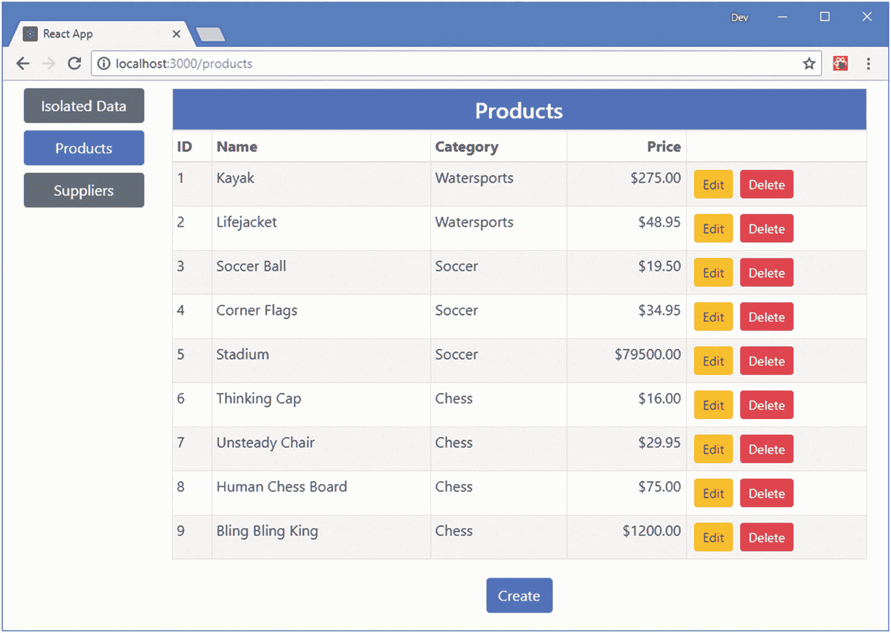
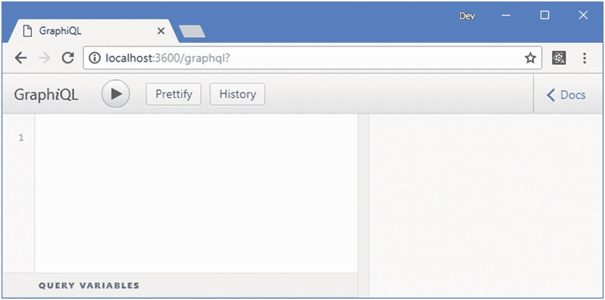
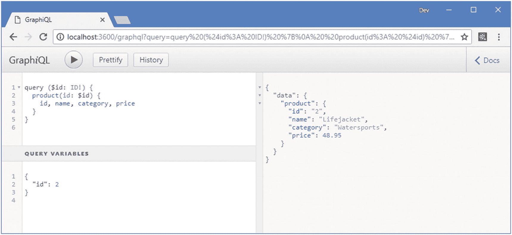

# 二十四、了解 GraphQL

GraphQL 是一个用于创建和消费 API 的端到端系统，它提供了一种比使用传统 RESTful web 服务更灵活的替代方案，例如在第 [23](23.html) 章中创建的服务。在这一章中，我将解释 GraphQL 服务是如何定义的以及查询是如何执行的。在第 25 章[中，我展示了 React 应用使用 GraphQL API 的不同方式。表](25.html) [24-1](#Tab1) 将 GraphQL 放在上下文中。

表 24-1

将 GraphQL 放在上下文中

<colgroup><col class="tcol1 align-left"> <col class="tcol2 align-left"></colgroup> 
| 

问题

 | 

回答

 |
| --- | --- |
| 这是什么？ | GraphQL 是一种生成 API 的查询语言。 |
| 为什么有用？ | GraphQL 为客户机提供了对数据的灵活访问，确保客户机只接收它需要的数据，并允许在不需要服务器端更改的情况下制定新的查询。 |
| 如何使用？ | 在服务器端，使用解析器函数定义和实现模式。客户端使用 GraphQL 语言发送查询和请求更改。 |
| 有什么陷阱或限制吗？ | GraphQL 很复杂，编写一个有用的模式可能需要技巧。 |
| 还有其他选择吗？ | 客户端可以使用 RESTful web 服务，如第 23 章所述。 |

### 注意

我描述了对 React 开发最有用的 GraphQL 特性。有关 GraphQL 的完整描述，请参见 [`https://facebook.github.io/graphql/June2018`](https://facebook.github.io/graphql/June2018) 的 GraphQL 规范。

表 [24-2](#Tab2) 总结了本章内容。

表 24-2

章节总结

<colgroup><col class="tcol1 align-left"> <col class="tcol2 align-left"> <col class="tcol3 align-left"></colgroup> 
| 

问题

 | 

解决办法

 | 

列表

 |
| --- | --- | --- |
| 定义 GraphQL 服务 | 描述将被支持的查询和变异，并实现提供它们的解析器 | 3, 4, 8–10, 20–21 |
| 查询 GraphQL 服务 | 指定查询名称和结果中需要的字段 | 7, 11, 27, 28 |
| 过滤结果 | 指定查询参数 | 12–19 |
| 使用 GraphQL 服务进行更改 | 为更新指定突变和字段 | 22–24 |
| 参数化查询 | 使用查询变量 | 25, 26 |
| 从多个查询中请求同一组字段 | 使用查询片段 | Twenty-nine |

## 为本章做准备

在本章中，我继续使用第 23 章中的示例应用。为了准备本章，打开一个命令提示符，导航到`productapp`文件夹，运行清单 [24-1](#PC1) 中所示的命令，将包添加到项目中。

### 小费

你可以从 [`https://github.com/Apress/pro-react-16`](https://github.com/Apress/pro-react-16) 下载本章以及本书其他章节的示例项目。

```jsx
npm install --save-dev graphql@14.0.2
npm install --save-dev express@4.16.4
npm install --save-dev express-graphql@0.7.1
npm install --save-dev graphql-import@0.7.1
npm install --save-dev cors@2.8.5

Listing 24-1Adding Packages

```

为了快速参考，表 [24-3](#Tab3) 中描述了清单 [24-1](#PC1) 中命令的包。

表 24-3

添加到项目中的包

<colgroup><col class="tcol1 align-left"> <col class="tcol2 align-left"></colgroup> 
| 

名字

 | 

描述

 |
| --- | --- |
| `graphql` | 这个包包含 GraphQL 的参考实现。 |
| `express` | 这个包提供了一个可扩展的 HTTP 服务器，并将成为本章中使用的 GraphQL 服务器的基础。 |
| `express-graphql` | 这个包通过`express`包在 HTTP 上提供 GraphQL 服务。 |
| `graphql-import` | 这个包允许在多个文件中定义 GraphQL 模式，并且导入模式比直接读取文件更容易。 |
| `cors` | 此软件包为 Express HTTP 服务器启用跨源资源共享(CORS)。 |

一旦软件包安装完毕，使用命令提示符运行清单 [24-2](#PC2) 中的命令来启动开发工具。第 23 章中定义的 RESTful web 服务也被启动，并且仍然被应用使用。

```jsx
npm start

Listing 24-2Starting the Development Tools

```

一旦项目的初始准备完成，一个新的浏览器窗口将打开并显示 URL `http://localhost:3000`，如图 [24-1](#Fig1) 所示。



图 24-1

运行示例应用

## 了解 GraphQL

RESTful web 服务很容易上手，但是随着客户端需求的发展和使用该服务的客户端应用数量的增加，它们可能会变得不灵活。

无法做出适合一个应用的更改，因为它们会在另一个应用中引起问题，工作会积压，因此无法在客户端应用发布日期前及时做出更改，并且基础架构开发团队要努力平衡对功能的竞争需求。当您依赖第三方 web 服务时，您可能没有任何途径来请求更改，因为您是所有要求新功能的几十或几百个开发团队中的一员。

结果是应用和它所依赖的 web 服务之间的不匹配。客户端经常需要向 web 服务发出多个请求来获取它们需要的数据；这然后被合并成一个有用的格式。客户端必须理解从不同 REST 请求返回的对象是如何相互关联的，并且经常必须请求数据，然后因为只需要数据字段的子集而丢弃这些数据。

REST web 服务的根本问题是它们提供的数据和提供数据的方式是固定的，随着客户端应用需求的变化，这就成了一个问题。GraphQL 通过允许客户端更多地控制请求什么数据以及如何表达数据来解决这个问题，结果是客户端应用可以添加以新的方式使用数据的功能，而只需要较少的服务器端更改。

### 了解 GraphQL 的缺点

GraphQL 并不适合所有情况。GraphQL 很复杂，不像 REST 那样被广泛理解，这使得很难找到有经验的开发人员和健壮且经过良好测试的工具和库。GraphQL 可以将原本由客户端应用执行的工作转移到服务器上，这会增加数据中心的成本，并且需要支持 GraphQL 的后端服务器的许可证。

将 GraphQL 作为一个选项来考虑是很重要的，特别是如果您的应用在部署后可能需要持续的开发，或者您打算开发或支持多个客户端应用。但是我的建议是不要急于使用 GraphQL，直到你确定 REST web 服务不会给你所需要的灵活性。

## 创建 GraphQL 服务器

我将创建一个自定义的 GraphQL 服务器，它提供与第 23 章[中的 web 服务相同的数据。创建 GraphQL 服务的过程并不是所有项目都需要的，尤其是在使用第三方 API 的时候，但是了解服务器上发生的事情有助于深入了解 GraphQL 是如何工作的。在接下来的小节中，我将介绍描述客户机能够发出的请求类型的过程，并编写处理这些请求所需的代码。](23.html)

### 选择替代的 GraphQL 服务器

我使用 GraphQL 参考实现为本章创建了一个简单的 GraphQL 服务器。它很容易演示 GraphQL 是如何工作的，但没有为处理真实数据做任何准备。

对于小而简单的项目，用 Lowdb ( [`https://github.com/typicode/lowdb`](https://github.com/typicode/lowdb) )或 MongoDB ( [`https://www.mongodb.com`](https://www.mongodb.com) )之类的包添加持久数据支持可能比较合适。

对于更复杂的项目，阿波罗服务器( [`https://github.com/apollographql/apollo-server`](https://github.com/apollographql/apollo-server) )是最常见的选择。有开源的和付费的计划可用，有大量的数据集成选项可用，比如使用 GraphQL 作为现有 REST web 服务的前端。

### 创建模式

GraphQL 描述了可以使用模式执行的请求，该模式是用 GraphQL 模式语言编写的。我创建了`src/graphql`文件夹，并在其中添加了一个名为`schema.graphql`的文件，其内容如清单 [24-3](#PC3) 所示。

```jsx
type product {
    id: ID!,
    name: String!,
    category: String!
    price: Float!
}

type supplier {
    id: ID!,
    name: String!,
    city: String!,
    products: [ID]
}

type Query {
    products: [product],
    suppliers: [supplier]
}

Listing 24-3The Contents of the schema.graphql File in the src/graphql Folder

```

清单 [24-3](#PC3) 中定义的模式定义了两个定制类型:`product`和`supplier`。这些类型将被用作 GraphQL 服务器支持的查询结果。每种结果类型都由一组字段定义，每个字段的类型如下:

```jsx
...
category: String!
...

```

该字段的名称为`category`，类型为`String`。GraphQL 提供了一组内置类型，如表 [24-4](#Tab4) 所述。字段类型后的感叹号(`!`字符)表示该字段的值是必填的。字段也可以返回值数组，如下所示:

表 24-4

内置的 GraphQL 类型

<colgroup><col class="tcol1 align-left"> <col class="tcol2 align-left"></colgroup> 
| 

名字

 | 

描述

 |
| --- | --- |
| `ID` | 此类型表示唯一的标识符。 |
| `String` | 此类型表示一个字符串。 |
| `Int` | 此类型表示一个有符号整数 |
| `Float` | 此类型表示浮点值 |
| `Boolean` | 这种类型代表一个`true`或`false`值。 |

```jsx
...
products: [ID]
...

```

方括号表示`supplier`类型的`products`字段将是一个`ID`值的数组。

### 小费

目前不要太担心 GraphQL 类型的系统。当您看到服务器的不同部分如何组合在一起并被客户端使用时，这将变得更有意义。

除了内置类型，GraphQL 还支持`Query`类型，用于定义服务器将支持的查询。在清单 [24-3](#PC3) 的模式中定义了两个查询。

```jsx
...
type Query {
    products: [product],
    suppliers: [supplier]
}
...

```

第一条语句定义了一个名为`products`的查询，该查询将返回一组`product`对象。第二条语句定义了一个名为`suppliers`的查询，该查询将返回一组`supplier`对象。

### 创建解析器

下一步是编写实现清单 [24-3](#PC3) 中定义的`products`和`suppliers`查询的函数。我在`src/graphql`文件夹中添加了一个名为`resolvers.js`的文件，代码如清单 [24-4](#PC7) 所示。

```jsx
var data = require("../../restData")();

module.exports = {

    products: () => data.products,
    suppliers: () => data.suppliers
}

Listing 24-4The Contents of the resolvers.js File in the src/graphql Folder

```

每个解析器都是一个函数，其名称对应于一个查询，并以模式声明的格式返回数据。`products`和`suppliers`解析器使用的数据使用从`restData.js`文件加载的数据。

### 注意

GraphQL 服务器将由 Node.js 运行，而 node . js 在本文撰写时并不支持 JavaScript 模块，这意味着不能使用`import`和`export`关键字。相反，`require`函数用于声明对文件的依赖，`module.exports`用于使代码或数据在 JavaScript 文件之外可用。

### 创建服务器

最后一步是创建处理模式和解析器的代码，并创建 GraphQL 服务器。我在`productapp`文件夹中添加了一个名为`graphqlServer.js`的文件，并添加了清单 [24-5](#PC8) 中所示的代码。

```jsx
var { buildSchema } = require("graphql");
var { importSchema } = require("graphql-import");
var express = require("express");
var graphqlHTTP = require("express-graphql")
var cors = require("cors")
var schema = importSchema("./src/graphql/schema.graphql");
var resolvers = require("./src/graphql/resolvers");

var app = express();

app.use(cors());
app.use("/graphql", graphqlHTTP({
  schema: buildSchema(schema),
  rootValue: resolvers,
  graphiql: true,
}));
app.listen(3600, () => console.log("GraphQL Server Running on Port 3600"));

Listing 24-5The Contents of the graphqlServer.js File in the productapp Folder

```

`graphql`包提供了`buildSchema`函数，它获取一个模式字符串并准备使用。模式文件的内容使用`graphql-import`包导入，并传递给`buildSchema`函数。`express-graphql`包将 GraphQL 支持集成到流行的`express`服务器中，我已经将它配置为在端口 3600 上监听。

要启动 GraphQL 服务器，打开一个新的命令提示符，导航到`productapp`文件夹，并运行清单 [24-6](#PC9) 中所示的命令。(当模式或解析器发生变化时，GraphQL 服务器不会自动重新加载，对于本章中的一些示例，它必须重启，这就是为什么我没有将它集成到`npm start`命令中，就像我对 RESTful web 服务所做的那样。)

```jsx
node graphqlServer.js

Listing 24-6Starting the GraphQL Server

```

GraphQL 服务器包括对 GraphQL(读作 *graphical* )的支持，这是一个基于浏览器的 graph QL 工具。为了确保 GraphQL 服务器正在工作，打开一个新的浏览器选项卡并导航到`http://localhost:3600/graphql`，这将显示图 [24-2](#Fig2) 中的工具。



图 24-2

图形浏览器

## 进行 GraphQL 查询

GraphQL 工具使得在将 graph QL 集成到示例应用之前执行查询变得很容易。例如，要查询所有的供应商对象，在 GraphiQL 窗口的左窗格中输入清单 [24-7](#PC10) 中所示的查询。

```jsx
query {
  suppliers {
    id,
    name,
    city,
    products
  }
}

Listing 24-7A Query for Supplier Data

```

该查询是基本的，但它揭示了许多关于 GraphQL 查询如何工作的信息。`query`关键字用于区分检索数据的请求和*突变*，后者用于进行更改(在“进行 GraphQL 突变”一节中有描述)。查询本身被括在花括号中，也称为*括号*。在大括号内，指定了查询名称，在本例中是`suppliers`。

当查询 GraphQL 服务时，必须指定想要接收的数据字段。与总是呈现相同数据结构的 REST web 服务不同，GraphQL 允许客户端指定它想要接收的结果，这些结果包含在另一组括号中。清单 [24-7](#PC10) 中的查询选择了`id`、`name`、`city`和`products`字段。

### 注意

没有允许选择所有字段的通配符。如果要接收某个数据类型的所有字段，则必须在查询中包含所有字段。

单击 Execute Query 按钮将请求发送到 GraphQL 服务器，它将返回以下结果:

```jsx
...
{
  "data": {
    "suppliers": [
      {
        "id": "1",
        "name": "Surf Dudes",
        "city": "San Jose",
        "products": ["1","2"]
      },
      {
        "id": "2",
        "name": "Goal Oriented",
        "city": "Seattle",
        "products": ["3","4","5"]
      },
      {
        "id": "3",
        "name": "Bored Games",
        "city": "New York",
        "products": ["6","7","8","9"]
      }
    ]
  }
}
...

```

这似乎与 REST web 服务没有太大的不同，但是即使有了这个基本的查询，客户机也能够选择它需要的字段以及它们将被表达的顺序。

### 查询相关数据

GraphQL 服务正在工作，它可以用来获取`product`和`supplier`数据，满足示例应用中数据表的基本需求。然而，GraphQL 最强大的特性之一是它支持查询中的相关数据，允许单个查询返回包含多种类型的结果。在清单 [24-8](#PC13) 中，我已经将`products`字段更改为`supplier`数据类型的模式。

### 获取 GraphQL 服务的架构详细信息

编写模式可以最好地洞察 GraphQL 服务支持的查询，但这并不总是可能的。如果您没有编写自己的模式，首先要做的是查找开发人员文档；许多公共的 GraphQL 服务发布了全面的模式文档，比如在 [`https://developer.github.com/v4`](https://developer.github.com/v4) 描述的 GitHub API。

许多服务还支持 GraphiQL 或类似的工具，其中大部分都支持模式导航。例如，GraphiQL 通过它的`Docs`链接可以很容易地浏览模式，让您浏览服务支持的查询和变化。

如果没有文档和对 GraphQL 的支持，您可以使用 graph QL 自省特性来发送关于模式的查询。例如，以下模式查询将列出服务支持的常规查询:

```jsx
...
{
     __schema {
    queryType {
      fields {
        name
      }
    }
  }
}
...

```

特殊的`__schema`查询数据类型用于请求关于模式的信息。你可以在 [`https://graphql.org/learn/introspection`](https://graphql.org/learn/introspection) 找到 GraphQL 内省特性的更多细节。

```jsx
type product {
    id: ID!,
    name: String!,
    category: String!
    price: Float!
}

type supplier {
    id: ID!,
    name: String!,
    city: String!,
    products: [product]
}

type Query {
    products: [product],
    suppliers: [supplier]
}

Listing 24-8Changing a Data Field in the schema.graphql File in the src/graphql Folder

```

products 字段现在返回一个由`supplier`对象组成的数组，而不是返回一个 ID 值数组。为了支持这种变化，我需要处理解析器使用的数据，以解析每个`supplier`及其相关的`product`对象之间的关系，如清单 [24-9](#PC14) 所示。

```jsx
var data = require("../../restData")();

module.exports = {

    products: () => data.products,

    suppliers: () => data.suppliers.map(s => ({
        ...s, products: () => s.products.map(id =>
            data.products.find(p => p.id === Number(id)))
    }))
}

Listing 24-9Resolving Related Data in the resolvers.js File in the src/graphql Folder

```

数据经过处理后，每个`supplier`对象都有一个`products`属性。products 属性是一个将解析相关数据的函数，只有当客户端请求该数据字段时才会被调用，这可以确保服务器不会获取没有被请求的数据。

使用 Control+C 停止 GraphQL 服务器，并运行在`productapp`文件夹中的清单 [24-10](#PC15) 中显示的命令来再次启动它。

```jsx
node graphqlServer.js

Listing 24-10Starting the GraphQL Server

```

导航到`http://localhost:3600/graphql`并将清单 [24-11](#PC16) 中显示的查询输入到 GraphiQL 窗口的左窗格中。该查询利用对 GraphQL 模式的更改，在单个查询中请求供应商及其相关产品数据。

```jsx
query {
  suppliers {
    id,
    name,
    city,
    products {
      name
    }
  }
}

Listing 24-11Querying for Related Data

```

当字段返回复杂类型时，如`product`，查询必须选择所需的字段。清单 [24-11](#PC16) 中添加的查询要求服务器提供每个`supplier`对象的`id`、`name`和`city`字段以及每个相关`product`对象的`name`字段。单击执行查询按钮，您将收到以下结果:

```jsx
...
{
  "data": {
    "suppliers": [
      {
        "id": "1", "name": "Surf Dudes", "city": "San Jose",
        "products": [{ "name": "Kayak" }, { "name": "Lifejacket" }]
      },
      {
        "id": "2", "name": "Goal Oriented", "city": "Seattle",
        "products": [{ "name": "Soccer Ball" },{ "name": "Corner Flags" },
          { "name": "Stadium" }]
      },
      {
        "id": "3", "name": "Bored Games", "city": "New York",
        "products": [{ "name": "Thinking Cap" },{ "name": "Unsteady Chair" },
          { "name": "Human Chess Board" }, { "name": "Bling Bling King" }]
      }
    ]
  }
}
...

```

注意，客户机指定了`supplier`对象和相关的`product`数据所需的字段，这确保了只检索应用所需的数据。

### 注意

除了常规查询，GraphQL 规范还包括对*订阅*的支持，它为服务器上正在变化的数据提供持续更新。订阅没有得到广泛或一致的支持，我在这本书里也不描述。

### 创建带参数的查询

GraphQL 服务器目前提供的查询允许用户选择所需的字段，但不选择结果中的对象，这是对单个对象的请求的要求。为了让客户端能够定制请求，GraphQL 支持参数，如清单 [24-12](#PC18) 所示。

```jsx
type product {
    id: ID!,
    name: String!,
    category: String!
    price: Float!
}

type supplier {
    id: ID!,
    name: String!,
    city: String!,
    products: [product]
}

type Query {
    products: [product],
    product(id: ID!): product,
    suppliers: [supplier]
    supplier(id: ID!): supplier
}

Listing 24-12Using Arguments in the schema.graphql File in the src/graphql Folder

```

参数在查询名称后的括号中定义，每个参数都被分配一个名称和一个类型。在清单 [24-12](#PC18) 中，我添加了名为`product`和`supplier`的查询，每个查询都定义了一个类型为`ID`的`id`参数，并用感叹号表示为强制的。在清单 [24-13](#PC19) 中，我为使用`id`值选择数据对象的查询添加了解析器。

```jsx
var data = require("../../restData")();

module.exports = {

    products: () => data.products,

    product: (args) => data.products.find(p => p.id === parseInt(args.id)),

    suppliers: () => data.suppliers.map(s => ({
        ...s, products: () => s.products.map(id =>
            data.products.find(p => p.id === Number(id)))
    })),

    supplier: (args) => {
        const result = data.suppliers.find(s => s.id === parseInt(args.id));
        if (result) {
            return {
                ...result,
                products: () => result.products.map(id =>
                    data.products.find(p => p.id === Number(id)))
            }
        }
    }
}

Listing 24-13Defining Resolvers in the resolvers.js File in the src/graphql Folder

```

resolver 函数接收一个对象，该对象的属性对应于查询参数。为了获得查询中指定的`id`值，解析器函数读取`args.id`属性。我可以通过析构参数对象来简化这段代码，如清单 [24-14](#PC20) 所示。

### 小费

注意，我使用了`parseInt`函数来转换`id`参数进行比较。使用`===`在 ID 值和 JavaScript 数字值之间进行直接比较将返回`false`。

```jsx
var data = require("../../restData")();

module.exports = {

    products: () => data.products,

    product: ({id}) => data.products.find(p => p.id === parseInt(id)),

    suppliers: () => data.suppliers.map(s => ({
        ...s, products: () => s.products.map(id =>
            data.products.find(p => p.id === Number(id)))
    })),

    supplier: ({id}) => {
        const result = data.suppliers.find(s => s.id === parseInt(id));
        if (result) {
            return {
                ...result,
                products: () => result.products.map(id =>
                    data.products.find(p => p.id === Number(id)))
            }
        }
    }
}

Listing 24-14Destructing Arguments in the resolvers.js File in the src/graphql Folder

```

重启 GraphQL 服务器，并在 graph QL 窗口中输入清单 [24-15](#PC21) 中所示的查询。

```jsx
query {
  supplier(id: 1) {
    id,
    name,
    city,
    products {
      name
    }
  }
}

Listing 24-15Querying with an Argument

```

该查询请求`id`值为 1 的供应商对象，并请求相关产品的`id`、`name`和`city`字段以及`name`字段，产生以下结果:

```jsx
...
{
  "data": {
    "supplier": {
      "id": "1",
      "name": "Surf Dudes",
      "city": "San Jose",
      "products": [{ "name": "Kayak" },{ "name": "Lifejacket" }]
    }
  }
}
...

```

#### 向字段添加参数

可以为单个字段定义参数，这允许客户端更具体地指定它需要的数据。在清单 [24-16](#PC23) 中，我为`supplier`类型的模式定义添加了一个参数，这将允许客户通过名称过滤相关的产品对象。

```jsx
type product {
    id: ID!,
    name: String!,
    category: String!
    price: Float!
}

type supplier {
    id: ID!,
    name: String!,
    city: String!,
    products(nameFilter: String = ""): [product]
}

type Query {
    products: [product],
    product(id: ID!): product,
    suppliers: [supplier]
    supplier(id: ID!): supplier
}

Listing 24-16Adding a Field Argument in the schema.graphql File in the src/graphql Folder

```

字段`products`已被重新定义，以接收字符串`nameFilter`参数。没有使用感叹号，这意味着参数是可选的。如果没有使用值，将使用空字符串的默认值。该参数的实现如清单 [24-17](#PC24) 所示。

```jsx
var data = require("../../restData")();

const mapIdsToProducts = (supplier, nameFilter) =>

    supplier.products.map(id => data.products.find(p => p.id === Number(id)))
        .filter(p => p.name.toLowerCase().includes(nameFilter.toLowerCase()));

module.exports = {

    products: () => data.products,

    product: ({id}) => data.products
        .find(p => p.id === parseInt(id)),

    suppliers: () => data.suppliers.map(s => ({
        ...s, products: ({nameFilter}) => mapIdsToProducts(s, nameFilter)
    })),

    supplier: ({id}) => {
        const result = data.suppliers.find(s => s.id === parseInt(id));
        if (result) {
            return {
                ...result,
                products: ({ nameFilter }) => mapIdsToProducts(result, nameFilter)
            }
        }
    }
}

Listing 24-17Implementing a Field Argument in the resolvers.js File in the src/graphql Folder

```

为了支持字段参数，解析`supplier`对象的`products`属性的函数接受一个参数，该参数被解构以获得`nameFilter`值，并用于按名称过滤相关的产品对象。重启 GraphQL 服务器，并将清单 [24-18](#PC25) 中所示的查询输入到 graph QL 中，查看字段参数是如何在查询中使用的。

```jsx
query {
  supplier(id: 1) {
    id,
    name,
    city,
    products(nameFilter: "ak") {
      name
    }
  }
}

Listing 24-18Querying with a Field Argument

```

单击 Execute Query 按钮，您将看到以下结果，这些结果显示相关的产品对象已经被过滤，因此只包括那些名称字段包含`ak`的对象。

```jsx
...
{
  "data": {
    "supplier": {
      "id": "1",
      "name": "Surf Dudes",
      "city": "San Jose",
      "products": [{ "name": "Kayak" }]
    }
  }
}
...

```

### 警告

每个请求都会调用用于接收字段参数的方法，这会给服务器带来大量工作。对于复杂的结果，可以考虑使用记忆化包，比如`fast-memoize` ( [`https://github.com/caiogondim/fast-memoize.js`](https://github.com/caiogondim/fast-memoize.js) )。

因为字段参数应用于类型而不是特定的查询，所以该筛选器可用于任何包含相关产品数据的供应商数据查询。将清单 [24-19](#PC27) 中所示的查询输入到 GraphiQL 中进行演示。

```jsx
query {
  suppliers {
    id,
    name,
    city,
    products(nameFilter: "g") {
      name
    }
  }
}

Listing 24-19Using a Field Argument in Another Query

```

单击“执行查询”按钮，您将看到结果中每个供应商对象的相关产品数据已经被过滤。

```jsx
...
{
  "data": {
    "suppliers": [
      {
        "id": "1",
        "name": "Surf Dudes",
        "city": "San Jose",
        "products": []
      },
      {
        "id": "2",
        "name": "Goal Oriented",
        "city": "Seattle",
        "products": [{ "name": "Corner Flags" }]
      },
      {
        "id": "3",
        "name": "Bored Games",
        "city": "New York",
        "products": [{ "name": "Thinking Cap" }, { "name": "Bling Bling King"}]
      }
    ]
  }
}
...

```

## 制造 GraphQL 突变

突变用于要求 GraphQL 服务器对其数据进行更改。使用特殊的`Mutation`类型将突变添加到模式中，有两种广泛的方法可用，如清单 [24-20](#PC29) 所示。

```jsx
type product {
    id: ID!,
    name: String!,
    category: String!
    price: Float!
}

type supplier {
    id: ID!,
    name: String!,
    city: String!,
    products(nameFilter: String = ""): [product]
}

type Query {
    products: [product],
    product(id: ID!): product,
    suppliers: [supplier]
    supplier(id: ID!): supplier
}

input productInput {

    id: ID, name: String!, category: String!, price: Int!

}

type Mutation {

    storeProduct(product: productInput): product
    storeSupplier(id: ID, name: String!, city: String!, products: [Int]): supplier

}

Listing 24-20Defining Mutations in the schema.graphql File in the src/graphql Folder

```

第一种变异称为`storeProduct`，使用专用的*输入类型*，允许客户端提供值来描述所需的更改。输入类型是使用`input`关键字定义的，支持与常规类型相同的特性。在清单中，我定义了一个名为`productInput`的输入类型，它有一个可选的`id`字段和强制的`name`、`category`和`price`字段。这基本上是已经在模式中定义的`product`类型的复制，这是一种常见的方法，因为您不能使用常规类型作为突变的参数。

`storeSupplier`突变采用了一种简单的方法，即定义多个参数，允许客户端在不需要输入类型的情况下表达数据对象的细节。这对于基本突变是一种有效的方法，但是对于复杂突变来说可能变得不实用。两种变异都会产生一个结果，该结果为客户端提供了一个对象的权威视图，该视图是作为变异的结果而创建或更新的，并使用常规查询类型来表达。在清单 [24-21](#PC30) 中，我为突变添加了解析器。

```jsx
var data = require("../../restData")();

const mapIdsToProducts = (supplier, nameFilter) =>
    supplier.products.map(id => data.products.find(p => p.id === Number(id)))
        .filter(p => p.name.toLowerCase().includes(nameFilter.toLowerCase()));

let nextId = 100;

module.exports = {

    products: () => data.products,

    product: ({id}) => data.products
        .find(p => p.id === parseInt(id)),

    suppliers: () => data.suppliers.map(s => ({
        ...s, products: ({nameFilter}) => mapIdsToProducts(s, nameFilter)
    })),

    supplier: ({id}) => {
        const result = data.suppliers.find(s => s.id === parseInt(id));
        if (result) {
            return {
                ...result,
                products: ({ nameFilter }) => mapIdsToProducts(result, nameFilter)
            }
        }
    },

    storeProduct({product}) {
        if (product.id == null) {
            product.id = nextId++;
            data.products.push(product);
        } else {
            product = { ...product, id: Number(product.id)};
            data.products = data.products
                .map(p => p.id === product.id ? product : p);
        }
        return product;
    },

    storeSupplier(args) {
        const supp = { ...args, id: Number(args.id)};
        if (args.id == null) {
            supp.id = nextId++;
            data.suppliers.push(supp)
        } else {
            data.suppliers = data.suppliers.map(s => s.id === supp.id ? supp: s);
        }
        let result = data.suppliers.find(s => s.id === supp.id);
        if (result) {
            return {
                ...result,
                products: ({ nameFilter }) => mapIdsToProducts(result, nameFilter)
            }
        }
    }
}

Listing 24-21Implementing Mutations in the resolvers.js File in the src Folder

```

这些变异被实现为接收参数的函数，就像查询一样。这些变化使用 ID 字段来确定客户机是更新现有对象还是存储新对象，并且它们更新查询使用的表示数据以反映变化。要更新带有`storeProduct`突变的产品，重启服务器并将清单 [24-22](#PC31) 中所示的 GraphQL 输入 graph QL。

```jsx
mutation {
  storeProduct(product: {
    id: 1,
    name: "Green Kayak",
    category: "Watersports",
    price: 290
  }) {
    id, name, category, price
  }
}

Listing 24-22Using the storeProduct Mutation

```

使用关键字`mutation`执行突变，它是上一个示例中使用的关键字`query`的对应关键字。指定了突变的名称，以及提供了`id`、`name`、`category`和`price`的`product`参数。然后指定结果中需要的字段，在这种情况下，选择产品定义的所有字段。

单击执行查询按钮，您将看到以下结果:

```jsx
...
{
  "data": {
    "storeProduct": {
      "id": "1",
      "name": "Green Kayak",
      "category": "Watersports",
      "price": 290
    }
  }
}
...

```

为了确认变异已经生效，使用 GraphiQL 执行清单 [24-23](#PC33) 中的查询。

```jsx
query {
  product(id: 1) {
    id, name, category, price
  }
}

Listing 24-23Querying Product Data

```

当您执行查询时，您将看到以下结果，这些结果反映了突变所做的更改:

```jsx
...
{
  "data": {
    "product": {
      "id": "1",
      "name": "Green Kayak",
      "category": "Watersports",
      "price": 290
    }
  }
}
...

```

使用不依赖于输入类型的变异的过程是相似的，如清单 [24-24](#PC35) 所示。

```jsx
mutation {
  storeSupplier(
    name: "AcmeCo",
    city: "Chicago",
    products: [1, 3]
  ){ id, name, city, products {
      name
    }
  }
}

Listing 24-24Using a Mutation Without an Input Type

```

执行查询时，将创建一个新的供应商，并显示以下结果:

```jsx
...
{
  "data": {
    "storeSupplier": {
      "id": "100",
      "name": "AcmeCo",
      "city": "Chicago",
      "products": [{ "name": "Green Kayak" }, { "name": "Soccer Ball" }]
    }
  }
}
...

```

注意，变异使用`product`字段中的`id`值来表示供应商和产品对象之间的关系，但是结果包括产品名称。变异从更新的表示数据中获得结果，表明变异的结果不需要与它接收的数据直接相关。

## 其他 GraphQL 特性

为了完成这一章，我将描述一些建立在前面描述的基础上的有用的特性。这些都是可选的，但是它们可以用来使 GraphQL 服务更容易使用。

### 使用请求变量

GraphQL 变量旨在允许一个请求被定义一次，然后在每次使用时使用参数进行定制，而不强制客户端为每个操作动态生成和序列化完整的请求数据。清单 [24-25](#PC37) 中显示的查询定义了一个变量，该变量用作产品查询的参数。

```jsx
query ($id: ID!) {
  product(id: $id) {
    id, name, category, price
  }
}

Listing 24-25A Query with a Variable

```

变量被应用于查询或变异，并使用以美元符号(`$`字符)开头的名称和分配的类型进行定义。在这种情况下，查询定义了一个名为`id`的变量，其类型是强制的`ID`。在查询内部，变量被用作`$id`，并被传递给`product`查询参数。

要使用该变量，请将查询输入 GraphiQL 展开窗口左下方的查询变量部分。并输入清单 [24-26](#PC38) 所示的代码。

```jsx
{
  "id": 2
}

Listing 24-26Defining a Value for a Variable

```

这为`id`变量提供了值 2。点击执行查询按钮，查询和变量将被发送到 GraphQL 服务器，结果是`id`为 2 的产品对象被选中，如图 [24-3](#Fig3) 所示。



图 24-3

使用查询变量

使用 GraphiQL 时，变量可能看起来没什么用，但它们可以简化客户端开发，如第 [24](24.html) 章所示。

### 提出多个请求

一个操作可以包含多个请求或变异。在 GraphiQL 窗口中输入清单 [24-27](#PC39) 中所示的查询。

```jsx
query {
  product(id: 1) {
    id, name, category, price
  },
  supplier(id: 1) {
    id, name, city
  }
}

Listing 24-27Making Multiple Queries

```

查询由逗号分隔，包含在外层大括号中，跟在关键字`query`后面。单击 Execute Query 按钮，您将看到以下输出，它将两个查询的结果合并成一个响应:

```jsx
...
{
  "data": {
    "product": {
      "id": "1",
      "name": "Kayak",
      "category": "Watersports",
      "price": 275
    },
    "supplier": {
      "id": "1",
      "name": "Surf Dudes",
      "city": "San Jose"
    }
  }
}
...

```

请注意，每个查询的名称用于表示其响应部分，这使得区分来自`product`和`supplier`查询的结果变得容易。当您希望多次使用同一个查询时，这可能会带来一个问题，因此 GraphQL 支持别名，即分配一个应用于结果的名称。将清单 [24-28](#PC41) 中所示的查询输入到 GraphiQL 中。

```jsx
query {
  first: product(id: 1) {
    id, name, category, price
  },
  second: product(id: 2) {
    id, name, category, price
  }
}

Listing 24-28Using a Query Alias

```

别名出现在查询之前，后跟一个冒号(`:`字符)。在清单中，有两个`product`查询被赋予了别名`first`和`second`。单击 Execute Query 按钮，您将看到这些名称是如何在查询结果中使用的。

```jsx
...
{
  "data": {
    "first": {
      "id": "1",
      "name": "Kayak",
      "category": "Watersports",
      "price": 275
    },
    "second": {
      "id": "2",
      "name": "Lifejacket",
      "category": "Watersports",
      "price": 48.95
    }
  }
}

...

```

### 使用查询片段进行字段选择

从每个查询中选择结果字段的要求会导致客户端中的重复，如清单 [24-28](#PC41) ，其中`first`和`second`查询都选择了`id`、`name`、`category`和`price`字段。可以使用 GraphQL 片段特性定义一次字段选择，然后应用于多个请求。在清单 [24-29](#PC43) 中，我定义了一个片段，并在查询中使用了它。

```jsx
fragment coreFields on product {

  id, name, category

}

query {
  first: product(id: 1) {
    ...coreFields,
    price
  },
  second: product(id: 2) {
    ...coreFields
  }
}

Listing 24-29Using a Query Fragment

```

片段是使用关键字`fragment`和`on`定义的，并且特定于单一类型。在清单 [24-29](#PC43) 中，该片段被命名为`coreFields`，并为`product`对象定义。spread 运算符用于应用片段，片段可以与常规字段选择混合使用。单击执行查询按钮，您将看到以下结果:

```jsx
...
{
  "data": {
    "first": {
      "id": "1",
      "name": "Kayak",
      "category": "Watersports",
      "price": 275
    },
    "second": {
      "id": "2",
      "name": "Lifejacket",
      "category": "Watersports"
    }
  }
}
...

```

## 摘要

在这一章中，我介绍了 GraphQL。我解释了模式及其解析器的作用，并演示了为静态数据创建简单的 GraphQL 服务的过程。我向您展示了如何定义查询来从 GraphQL 服务中获取数据，以及如何使用突变来进行更改。本章中的所有示例都是使用 GraphQL 工具执行的，在下一章中，我将向您展示如何在 React 应用中使用 graph QL。