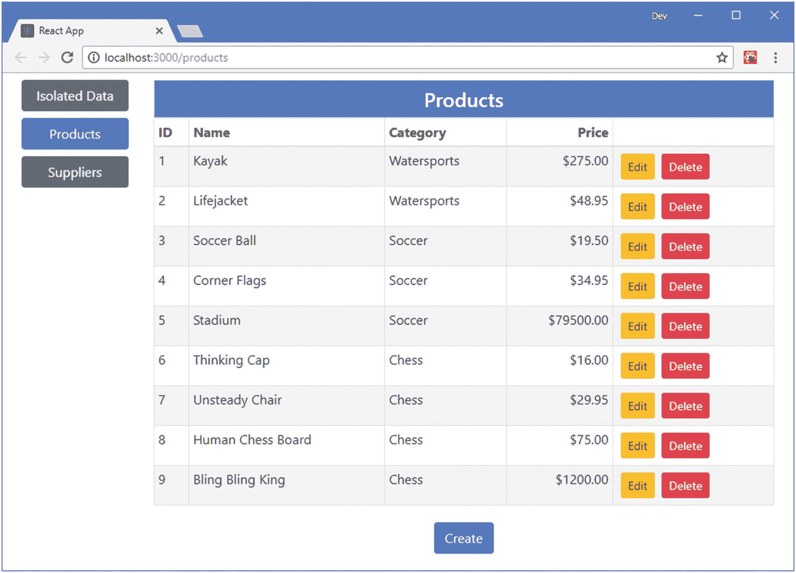
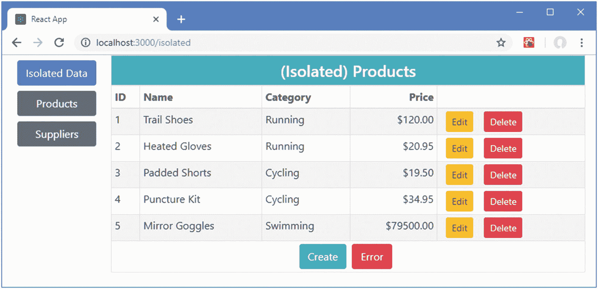
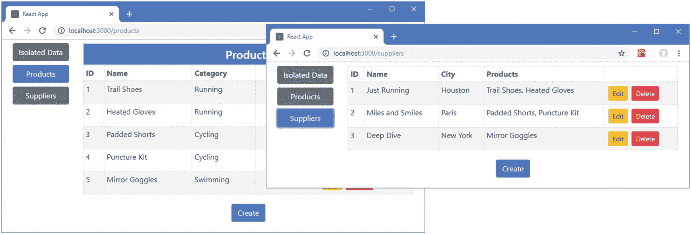
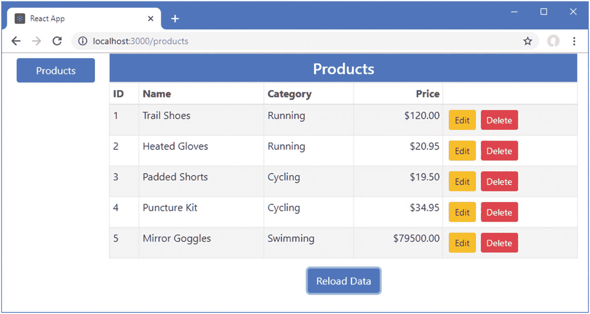
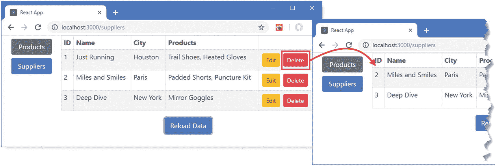
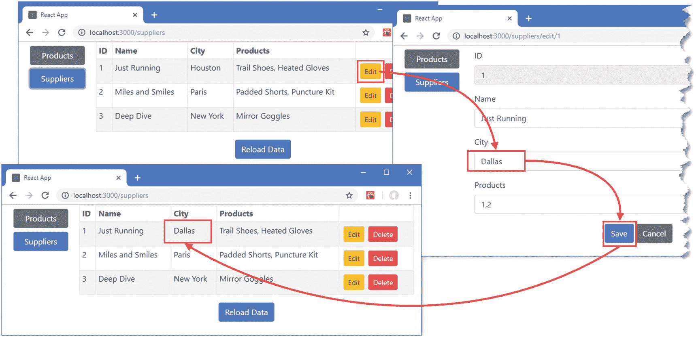

# 二十五、使用 GraphQL

本章是本书的最后一章，我将向您展示 React 应用使用 GraphQL 服务的不同方式。我将向您展示如何直接处理 HTTP 请求，如何将 GraphQL 与数据存储集成，以及如何使用专用的 GraphQL 客户端。

## 为本章做准备

在这一章中，我继续使用第 24 章中的`productapp`项目和它包含的 GraphQL 服务。要为本章做准备，需要进行以下各节中描述的更改。

### 将包添加到项目中

在本章的后面，我将创建直接接收 GraphQL 数据的组件，这需要额外的包。打开一个新的命令提示符，导航到`productapp`文件夹，运行清单 [25-1](#PC1) 中显示的命令。

### 小费

你可以从 [`https://github.com/Apress/pro-react-16`](https://github.com/Apress/pro-react-16) 下载本章以及本书其他章节的示例项目。

```jsx
npm install apollo-boost@0.1.22
npm install react-apollo@2.3.2

Listing 25-1Adding Packages to the Example Project

```

表 [25-1](#Tab1) 描述了新包装的用途。

表 25-1

添加到项目中的包

<colgroup><col class="tcol1 align-left"> <col class="tcol2 align-left"></colgroup> 
| 

名字

 | 

描述

 |
| --- | --- |
| `apollo-boost` | 这个包包含 Apollo GraphQL 客户端，其配置适合大多数项目。 |
| `react-apollo` | 这个包包含 Apollo 客户机的 React 集成。 |

### 更改 GraphQL 服务器的数据

在第 [24 章](24.html)中，我使用了与之前 web 服务相同的数据来强调 REST 和 GraphQL 处理相同问题的不同方式。对于这一章，我想弄清楚示例应用何时停止使用 REST 获取数据，并开始使用 GraphQL。我在`productapp`文件夹中创建了一个名为`graphqlData.js`的文件，内容如清单 [25-2](#PC2) 所示。

```jsx
module.exports = function () {
    var data = {
        products: [
            { id: 1, name: "Trail Shoes", category: "Running", price: 120 },
            { id: 2, name: "Heated Gloves", category: "Running", price: 20.95 },
            { id: 3, name: "Padded Shorts", category: "Cycling", price: 19.50 },
            { id: 4, name: "Puncture Kit", category: "Cycling", price: 34.95 },
            { id: 5, name: "Mirror Goggles", category: "Swimming", price: 79500 },

        ],
        suppliers: [
            { id: 1, name: "Just Running", city: "Houston", products: [1, 2] },
            { id: 2, name: "Miles and Smiles", city: "Paris", products: [3, 4] },
            { id: 3, name: "Deep Dive", city: "New York", products: [5] },
        ]
    }
    return data
}

Listing 25-2The Contents of the graphqlData.js File in the productapp Folder

```

### 更新模式和解析程序

为了准备本章，我需要扩展 GraphQL 模式来定义删除数据的突变，如清单 [25-3](#PC3) 所示。我还删除了输入类型，这样`storeProduct`和`storeSupplier`突变就一致了。

```jsx
type product {
    id: ID!,
    name: String!,
    category: String!
    price: Float!
}

type supplier {
    id: ID!,
    name: String!,
    city: String!,
    products(nameFilter: String = ""): [product]
}

type Query {
    products: [product],
    product(id: ID!): product,
    suppliers: [supplier]
    supplier(id: ID!): supplier
}

type Mutation {
    storeProduct(id: ID, name: String!, category: String!, price: Float!): product
    storeSupplier(id: ID, name: String!, city: String!, products: [Int]): supplier
    deleteProduct(id: ID!): ID
    deleteSupplier(id: ID!): ID
}

Listing 25-3Defining and Updating Mutations in the schema.graphql File in the src/graphql Folder

```

在清单 [25-4](#PC4) 中，我为`deleteProduct`和`deleteSupplier`突变定义了新的解析器，并更新了`storeProduct`解析器以反映输入类型的移除。我还修改了加载数据的语句，以使用在清单 [25-2](#PC2) 中创建的文件。

```jsx
var data = require("../../graphqlData")();

const mapIdsToProducts = (supplier, nameFilter) =>
    supplier.products.map(id => data.products.find(p => p.id === Number(id)))
        .filter(p => p.name.toLowerCase().includes(nameFilter.toLowerCase()));

let nextId = 100;

module.exports = {

    products: () => data.products,

    product: ({id}) => data.products
        .find(p => p.id === parseInt(id)),

    suppliers: () => data.suppliers.map(s => ({
        ...s, products: ({nameFilter}) => mapIdsToProducts(s, nameFilter)
    })),

    supplier: ({id}) => {
        const result = data.suppliers.find(s => s.id === parseInt(id));
        if (result) {
            return {
                ...result,
                products: ({ nameFilter }) => mapIdsToProducts(result, nameFilter)
            }
        }
    },

    storeProduct(args) {
        const product = { ...args, id: Number(args.id)};
        if (args.id == null || product.id === 0) {
            product.id = nextId++;
            data.products.push(product);
        } else {
            data.products = data.products
                .map(p => p.id === product.id ? product : p);
        }
        return product;
    },

    storeSupplier(args) {
        const supp = { ...args, id: Number(args.id)};
        if (args.id == null) {
            supp.id = nextId++;
            data.suppliers.push(supp)
        } else {
            data.suppliers = data.suppliers.map(s => s.id === supp.id ? supp: s);
        }
        let result = data.suppliers.find(s => s.id === supp.id);
        if (result) {
            return {
                ...result,
                products: ({ nameFilter }) => mapIdsToProducts(result, nameFilter)
            }
        }
    },

    deleteProduct({id}) {
        id = Number(id);
        data.products = data.products.filter(p => p.id !== id);
        data.suppliers = data.suppliers.map(s => {
            s.products = s.products.filter(p => p !== id);
            return s;
        })
        return id;
    },

    deleteSupplier({id}) {
        data.suppliers = data.suppliers.filter(s => s.id !== Number(id));
        return id;
    }
}

Listing 25-4Adding and Updating Resolvers in the resolvers.js File in the src/graphql Folder

```

新的解析器从数据数组中删除一项，并返回它们的`id`参数的值，对应于模式中使用的 ID 类型。当产品被删除时，供应商对它的任何引用也被删除，以避免随后查询供应商数据时出现错误。

### 小费

我还修改了`storeProduct`和`storeSupplier`函数，这样它们将把对象的`id`值为零的请求视为不包含任何`id`值。在处理表单数据时，这是一项有用的技术，因为这意味着所有的表单值都可以发送到服务器，而不需要删除`id`属性来区分新的和修改过的对象。

### 将 GraphQL 服务器与开发工具集成

在第 24 章中，我直接启动了 GraphQL 工具，没有使用任何 React 开发工具。对于这一章，我将自动启动 GraphQL 服务器，同时启动开发 HTTP 服务器和 RESTful web 服务，示例应用仍然配置为使用它们。在清单 [25-5](#PC5) 中，我修改了`package.json`文件的`scripts`部分，以便 GraphQL 服务器作为`npm start`命令的一部分启动。

```jsx
...
"scripts": {
  "start": "npm-run-all --parallel reactstart json graphql",
  "build": "react-scripts build",
  "test": "react-scripts test",
  "eject": "react-scripts eject",
  "reactstart": "react-scripts start",
  "json": "json-server --p 3500 -r api.routes.json restData.js",
  "graphql": "node graphqlServer.js"
},
...

Listing 25-5Configuring the Project Startup in the package.json File in the productapp Folder

```

要启动示例应用，打开一个新的命令提示符，导航到`productapp`文件夹，并运行清单 [25-6](#PC6) 中所示的命令。

```jsx
npm start

Listing 25-6Running the Example Application

```

开发服务器、RESTful web 服务和 GraphQL 服务器都将启动。一个新的浏览器选项卡将打开并显示如图 [25-1](#Fig1) 所示的内容。



图 25-1

运行示例应用

为了确保 GraphQL 服务器正确运行，导航到`http://localhost:3600/graphql`并将清单 [25-7](#PC7) 中显示的查询输入到 graph QL 中。

```jsx
query {
  product(id: 1) {
    id, name, category, price
  }
}

Listing 25-7Querying the GraphQL Server

```

单击执行查询按钮，您应该会看到以下结果:

```jsx
...
{
  "data": {
    "product": {
      "id": "1",
      "name": "Trail Shoes",
      "category": "Running",
      "price": 120
    }
  }
}
...

```

## 使用 GraphQL 服务

GraphQL 查询使用 HTTP POST 请求发送到服务器，带有一个 JSON 请求体，如下所示:

```jsx
...
{"query":"query { product(id: 1) { id, name, category, price }", "variables": null }
...

```

响应是包含结果的 JSON 字符串，如下所示:

```jsx
...
{"data":{"product":{"id":"1","name":"Trail Shoes","category":"Running","price":120}}}
...

```

HTTP 的使用以及请求和响应的结构使得将 GraphQL 集成到 React 应用中变得很容易，遵循了我在第 [23](23.html) 章中使用的用于处理 RESTful web 服务的相同模式。

### 定义查询和变异

使用 GraphQL 的起点是定义将发送到服务器的查询和变化。我在`src/graphql`文件夹中添加了一个名为`queries.js`的文件，并添加了清单 [25-8](#PC11) 中所示的代码。

```jsx
export const products = {
    getAll: {
        name: "products",
        graphql: `query {
                    products { id, name, category, price}
                }`
    },
    getOne: {
        name: "product",
        graphql: `query ($id: ID!) {
                product(id: $id) {
                    id, name, category, price
                }
             }`
        }
    }

export const suppliers = {
    getAll: {
        name: "suppliers",
        graphql:`query {
              suppliers { id, name, city, products { id, name }}
            }`
    },
    getOne: {
        name: "supplier",
        graphql: `query($id: ID!) {
                supplier(id: $id) {
                    id, name, city, products { id, name }
                }
            }`
    }
}

Listing 25-8The Contents of the queries.js File in the src/graphql Folder

```

每个查询都定义了一个 GraphQL 表达式和一个名称，应用将使用它从响应中检索数据。这些查询依赖于第 [24](24.html) 章中描述的可变特征。接下来，我在`src/graphql`文件夹中添加了一个名为`mutations.js`的文件，并定义了应用需要的突变，如清单 [25-9](#PC12) 所示。

### 小费

不需要将查询从变异中分离出来，因为它们都只是字符串，但我发现这很有帮助，尤其是对于大量使用 GraphQL 的应用。

```jsx
export const products = {
    store: {
        name: "storeProduct",
        graphql: `mutation ($id: ID, $name: String!,
                    $category: String!, $price: Float!) {

                    storeProduct(id : $id, name: $name,
                        category: $category, price: $price) {
                            id, name, category, price
                        }
                    }`
    },
    delete: {
        name: "deleteProduct",
        graphql: `mutation ($id: ID!) { deleteProduct(id: $id) }`
    }
}

export const suppliers = {
    store: {
        name: "storeSupplier",
        graphql: `mutation ($id: ID, $name: String!,
                    $city: String!, $products: [Int]) {

                    storeSupplier(id : $id, name: $name,
                        city: $city, products: $products) {
                            id, name, city, products { name }
                    }
                }`
    },
    delete: {
        name: "deleteSupplier",
        graphql: `mutation ($id: ID!) { deleteSupplier(id: $id) }`
    }
}

Listing 25-9The Contents of the mutations.js File in the src/graphql Folder

```

存在用于存储和删除产品和供应商对象的变异，并且每个变异的名称在`name`属性中使用，遵循为查询建立的相同模式。

### 定义数据源

在这一章中，我将以不同的方式使用相同的查询和变化，并且我想对应用的其余部分隐藏数据处理的细节，同时遵循我用于处理 RESTful web 服务的相同的广泛模式。为了提供一个将使用 GraphQL 执行数据操作的数据源，我在`src/graphql`文件夹中添加了一个名为`GraphQLDataSource.js`的文件，并使用它来定义清单 [25-10](#PC13) 中所示的类。

```jsx
import Axios from "axios";
import * as allQueries from "./queries";
import * as allMutations from "./mutations";

export class GraphQLDataSource {

    constructor(dataType, errorCallback) {
        this.GRAPHQL_URL = "http://localhost:3600/graphql";
        this.queries = allQueries[dataType];
        this.mutations = allMutations[dataType];
        this.handleError = errorCallback;
    }

    GetData(callback) {
        this.SendRequest(callback, this.queries.getAll);
    }

    GetOne(id, callback) {
        this.SendRequest(callback, this.queries.getOne, { id });
    }

    Store(data, callback) {
        this.SendRequest(callback, this.mutations.store, { ...data });
    }

    Update(data, callback) {
        this.Store(data, callback);
    }

    Delete(data, callback) {
        this.SendRequest(callback, this.mutations.delete, { id: data.id });
    }

    async SendRequest(callback, query, data) {
        try {
            let payload = {
                query: query.graphql,
                variables: data == null ? null : { ...data }
            }
            callback((await Axios.post(this.GRAPHQL_URL,
                payload)).data.data[query.name]);
        } catch(err) {
            this.handleError("Operation Failed: Network Error");
        }
    }
}

Listing 25-10The Contents of the GraphQLDataSource.js File in the src/graphql Folder

```

该类定义了与第 23 章[中创建的 REST 数据源相同的方法，这不是必需的，但有助于展示不同类型的服务之间的区别。为了为特定类型的数据配置数据源，构造函数接收数据类型字符串，该字符串用于选择查询和变异。当发出请求时，GraphQL 和一个`variables`对象一起被发送给用户。结果包括所执行的变异查询的名称，该名称是使用`name`属性的值从响应中检索的。](23.html)

```jsx
...
callback((await Axios.post(this.GRAPHQL_URL, payload)).data.data[query.name]);
...

```

### 配置隔离的组件

使用与第 [23 章](23.html)中 REST 数据源相同的 API，通过改变使用数据的组件中的数据源，简化了将 GraphQL 数据集成到应用中的过程。在清单 [25-11](#PC15) 中，我已经更改了`IsolatedTable`组件使用的数据源。

```jsx
import React, { Component } from "react";

//import { RestDataSource } from "./webservice/RestDataSource";

import { Link } from "react-router-dom";

import { GraphQLDataSource } from "./graphql/GraphQLDataSource";

import { PRODUCTS } from "./store/dataTypes";

export class IsolatedTable extends Component {

    constructor(props) {
        super(props);
        this.state = {
            products: []
        }
        this.dataSource = new GraphQLDataSource(PRODUCTS,
            (err) => this.props.history.push(`/error/${err}`));
    }

    // ...methods omitted for brevity...
}

Listing 25-11Changing the Data Source in the IsolatedTable.js File in the src Folder

```

清单 [25-12](#PC16) 对`IsolatedEditor`组件进行相应的修改。

```jsx
import React, { Component } from "react";

//import { RestDataSource } from "./webservice/RestDataSource";

import { ProductEditor } from "./ProductEditor";

import { GraphQLDataSource } from "./graphql/GraphQLDataSource";

import { PRODUCTS } from "./store/dataTypes";

export class IsolatedEditor extends Component {

    constructor(props) {
        super(props);
        this.state = {
            dataItem: {}
        };
        this.dataSource = new GraphQLDataSource(PRODUCTS,
            (err) => this.props.history.push(`/error/${err}`));
    }

    save = (data) => {
        data = { ...data, price: Number(data.price)}
        const callback = () => this.props.history.push("/isolated");
        if (data.id === "") {
            this.dataSource.Store(data, callback);
        } else {
            this.dataSource.Update(data, callback);
        }
    }

    cancel = () => this.props.history.push("/isolated");

    render() {
        return <ProductEditor key={ this.state.dataItem.id }
            product={ this.state.dataItem } saveCallback={ this.save }
            cancelCallback={ this.cancel } />
    }

    componentDidMount() {
        if (this.props.match.params.mode === "edit") {
            this.dataSource.GetOne(this.props.match.params.id,
                data => this.setState({ dataItem: data}));
        }
    }
}

Listing 25-12Changing the Data Source in the IsolatedEditor.js File in the src Folder

```

注意，在数据被发送到服务器之前，我将`price`属性的值解析成一个`Number`。GraphQL 服务器根据模式中定义的类型检查接收到的数据，如果需要另一种类型，如`Float`，将拒绝字符串值，这是表单元素通常产生的结果。

当你保存对`IsolatedTable`和`IsolatedEditor`组件的更改时，应用会更新，点击隔离数据按钮会显示从 GraphQL 服务器获取的数据，如图 [25-2](#Fig2) 所示。



图 25-2

使用 GraphQL 数据

## 对数据存储使用 GraphQL

将 GraphQL 用于数据存储的过程类似于我在第 [23](23.html) 章中为 RESTful 数据遵循的过程，使用中间件拦截动作并触发对服务器的请求。我在`src/graphql`文件夹中添加了一个名为`GraphQLMiddleware.js`的文件，并用它来定义清单 [25-13](#PC17) 中所示的 Redux 中间件。

```jsx
import { STORE, UPDATE, DELETE} from "../store/modelActionTypes";
import { PRODUCTS, SUPPLIERS } from "../store/dataTypes";
import { GraphQLDataSource } from "./GraphQLDataSource";

export const GET_DATA = "qraphql_get_data";

export const getData = (dataType) => {
    return {
        type: GET_DATA,
        dataType: dataType
    }
}

export const createGraphQLMiddleware = () => {

    const dataSources = {
        [PRODUCTS]: new GraphQLDataSource(PRODUCTS, () => {}),
        [SUPPLIERS]: new GraphQLDataSource(SUPPLIERS, () => {})
    }

    return ({dispatch, getState}) => next => action => {
        switch (action.type) {
            case GET_DATA:
                if (getState().modelData[action.dataType].length === 0) {
                    dataSources[action.dataType].GetData((data) =>
                        data.forEach(item => next({ type: STORE,
                            dataType: action.dataType, payload: item})));
                }
                break;
            case STORE:
                action.payload.id = null;
                dataSources[action.dataType].Store(action.payload, data =>
                    next({ ...action, payload: data }))
                break;
            case UPDATE:
                dataSources[action.dataType].Update(action.payload, data =>
                     next({ ...action, payload: data }))
                break;
            case DELETE:
                dataSources[action.dataType].Delete({id: action.payload },
                    () => next(action));
                break;
            default:
                next(action);
        }
    }
}

Listing 25-13The Contents of the GraphQLMiddleware.js File in the src/graphql Folder

```

这个中间件拦截应用其余部分分派的动作，并使用数据源类向 GraphQL 服务器发送查询或变异。在清单 [25-14](#PC18) 中，我用 GraphQL 代码替换了 REST 中间件。

```jsx
import { createStore, combineReducers, applyMiddleware, compose } from "redux";
import modelReducer from "./modelReducer";
import stateReducer from "./stateReducer";
import { customReducerEnhancer } from "./customReducerEnhancer";
import { multiActions } from "./multiActionMiddleware";
import { asyncEnhancer } from "./asyncEnhancer";

//import { createRestMiddleware } from "../webservice/RestMiddleware";

import { createGraphQLMiddleware } from "../graphql/GraphQLMiddleware";

const enhancedReducer = customReducerEnhancer(
    combineReducers(
        {
            modelData: modelReducer,
            stateData: stateReducer
        })
);

// const restMiddleware = createRestMiddleware(

//     "http://localhost:3500/api/products",

//     "http://localhost:3500/api/suppliers");

export default createStore(enhancedReducer,
    compose(applyMiddleware(multiActions),
        applyMiddleware(createGraphQLMiddleware()),
        asyncEnhancer(2000)));

export { saveProduct, saveSupplier, deleteProduct, deleteSupplier }
    from "./modelActionCreators";

Listing 25-14Enabling the GraphQL Middleware in the index.js File in the src/store Folder

```

### 适应 GraphQL 数据格式

GraphQL 对供应商数据的查询返回的数据格式包括相关的产品数据，这意味着不再需要对产品数据的单独请求，并且显示相关数据的组件必须适应新的格式。在清单 [25-15](#PC19) 中，当应用需要供应商数据时，我禁用了产品数据的自动查询。

```jsx
import React, { Component } from "react";

//import { PRODUCTS, SUPPLIERS } from "./store/dataTypes";

export const DataGetter = (dataType, WrappedComponent) => {

    return class extends Component {
        render() {
            return <WrappedComponent { ...this.props } />
        }

        componentDidMount() {
            // this.props.getData(PRODUCTS);
            // if (dataType === SUPPLIERS) {
            //     this.props.getData(SUPPLIERS);
            // }
            this.props.getData(dataType);
        }
    }
}

Listing 25-15Disabling the Related Data Query in the DataGetter.js File in the src Folder

```

在清单 [25-16](#PC20) 中，我注释掉了`TableConnector`组件中处理供应商数据的代码，以合并相关产品的名称。由于数据来自 GraphQL 服务器，这些信息将直接为组件所用。`TableConnector`也触发数据请求。

```jsx
import { connect } from "react-redux";
//import { startEditingProduct, startEditingSupplier } from "./stateActions";
import { deleteProduct, deleteSupplier } from "./modelActionCreators";
import { PRODUCTS, SUPPLIERS } from "./dataTypes";
import { withRouter } from "react-router-dom";

//import { getData } from "../webservice/RestMiddleware";

import { getData } from "../graphql/GraphQLMiddleware";

import { DataGetter } from "../DataGetter";

export const TableConnector = (dataType, presentationComponent) => {

    const mapStateToProps = (storeData, ownProps) => {
        if (dataType === PRODUCTS) {
            return { products: storeData.modelData[PRODUCTS] };
        } else {
            return { suppliers: storeData.modelData[SUPPLIERS] };
                // suppliers: storeData.modelData[SUPPLIERS].map(supp => ({
                //     ...supp,
                //     products: supp.products.map(id =>
                //         storeData.modelData[PRODUCTS]
                //             .find(p => p.id === Number(id)) || id)
                //             .map(val => val.name || val)
                //     }))
        }
    }

    const mapDispatchToProps = (dispatch, ownProps) => {
        return {
            getData: (type) => dispatch(getData(type)),
            deleteCallback: dataType === PRODUCTS
                ? (...args) => dispatch(deleteProduct(...args))
                : (...args) => dispatch(deleteSupplier(...args))
        }
    }

    const mergeProps = (dataProps, functionProps, ownProps) => {
        let routedDispatchers = {
            editCallback: (target) => {
                ownProps.history.push(`/${dataType}/edit/${target.id}`);
            },
            deleteCallback: functionProps.deleteCallback,
            getData: functionProps.getData

        }
        return Object.assign({}, dataProps, routedDispatchers, ownProps);
    }

    return withRouter(connect(mapStateToProps,
        mapDispatchToProps, mergeProps)(DataGetter(dataType,
            presentationComponent)));
}

Listing 25-16Disabling Data Processing in the TableConnector.js File in the src/store Folder

```

为了通过 ID 定位对象，我修改了`EditorConnector`，这样它就不会将 URL 参数解析为`Number`，如清单 [25-17](#PC21) 所示。

```jsx
import { connect } from "react-redux";
//import { endEditing } from "./stateActions";
import { PRODUCTS, SUPPLIERS  } from "./dataTypes";
import { saveAndEndEditing } from "./multiActionCreators";
import { withRouter } from "react-router-dom";

export const EditorConnector = (dataType, presentationComponent) => {

    const mapStateToProps = (storeData, ownProps) => {
        const mode = ownProps.match.params.mode;
        const id = ownProps.match.params.id;
        return {
            editing: mode === "edit" || mode === "create",
            product: (storeData.modelData[PRODUCTS].find(p => p.id === id)) || {},
            supplier:(storeData.modelData[SUPPLIERS].find(s => s.id === id)) || {}
        }
    }

    const mapDispatchToProps = {
        //cancelCallback: endEditing,
        saveCallback: (data) => saveAndEndEditing(data, dataType)
    }

    const mergeProps = (dataProps, functionProps, ownProps) => {
        let routedDispatchers = {
            cancelCallback: () => ownProps.history.push(`/${dataType}`),
            saveCallback: (data) => {
                functionProps.saveCallback(data);
                ownProps.history.push(`/${dataType}`);
            }
        }
        return Object.assign({}, dataProps, routedDispatchers, ownProps);
    }

    return withRouter(connect(mapStateToProps,
        mapDispatchToProps, mergeProps)(presentationComponent));
}

Listing 25-17Changing ID Matching in the EditorConnector.js File in the src/store Folder

```

为了显示产品的名称，我对`SupplierTableRow`组件进行了清单 [25-18](#PC22) 中所示的更改。

```jsx
import React, { Component } from "react";

export class SupplierTableRow extends Component {

    render() {
        let s = this.props.supplier;
        return <tr>
            <td>{ s.id }</td>
            <td>{ s.name }</td>
            <td>{ s.city}</td>
            <td>{ s.products != null ?
                    s.products.map(p => p.name).join(", ") : "" }</td>
            <td>
                <button className="btn btn-sm btn-warning m-1"
                    onClick={ () => this.props.editCallback(s) }>
                        Edit
                </button>
                <button className="btn btn-sm btn-danger m-1"
                    onClick={ () => this.props.deleteCallback(s) }>
                        Delete
                    </button>
            </td>
        </tr>
    }
}

Listing 25-18Selecting Product Names in the SupplierTableRow.js File in the src Folder

```

下一个变化是在编辑供应商数据时适应新的数据格式，确保相关产品区域的`id`值显示给用户，如清单 [25-19](#PC23) 所示。

```jsx
import React, { Component } from "react";

export class SupplierEditor extends Component {

    constructor(props) {
        super(props);
        this.state = {
            formData: {
                id: props.supplier.id || "",
                name: props.supplier.name || "",
                city: props.supplier.city || "",
                products: props.supplier.products != null
                    ? props.supplier.products.map(p => p.id) : [],
            }
        }
    }

    // ...methods omitted for brevity...
}

Listing 25-19Selecting Product IDs in the SupplierEditor.js File in the src Folder

```

最后一个变化是将从产品`price`属性的表单元素获得的字符串值解析为一个数字，这确保发送到服务器的数据与模式中指定的`Float`类型相匹配，如清单 [25-20](#PC24) 所示。

```jsx
...
handleClick = () => {
    this.props.saveCallback(
        {
            ...this.state.formData,
            price: Number(this.state.formData.price)
        });
}
...

Listing 25-20Parsing the Price Value in the ProductEditor.js File in the src Folder

```

保存所有的更改，应用将完全使用从 GraphQL 服务器获得的数据，并放置在 Redux 数据存储中，如图 [25-3](#Fig3) 所示。



图 25-3

在数据存储中使用 GraphQL 数据

### 小费

如果遇到错误，停止开发工具并使用`npm start`再次启动它们。这将重置 GraphQL 服务器使用的数据，并撤消在前面部分中所做的更改的效果。

## 使用 GraphQL 客户端框架

在上一节中，我演示了如何将 GraphQL 与 Redux 数据存储一起使用，因为它展示了使用数据是多么容易，并提供了与使用 RESTful web 服务的比较。

有一种不同的方法，即使用一个包来替换数据存储，并直接向需要它的组件提供 GraphQL 数据，同时缓存数据以避免在独立组件之间导航可能导致的重复 HTTP 请求。

我在这一节中使用的包被称为 Apollo Client，这是一个客户端包，与我在第 [24 章](24.html)中提到的 Apollo GraphQL 服务器来自同一个开发人员(但它适用于任何 GraphQL 服务器)。阿波罗客户端的完整文档可在 [`https://www.apollographql.com/docs/react`](https://www.apollographql.com/docs/react) 获得。

### 注意

本章中的示例依赖于本章开始时安装的软件包。

### 配置客户端

第一步是配置客户机，以便它知道将 GraphQL 请求和变化发送到哪里。清单 [25-21](#PC25) 显示了我添加到`App`组件的配置语句。

```jsx
import React, { Component } from "react";

// import { Provider } from "react-redux";

// import dataStore from "./store";

import { Selector } from "./Selector";

//import { PRODUCTS, SUPPLIERS } from "./store/dataTypes";

import ApolloClient from "apollo-boost";

import { ApolloProvider } from "react-apollo";

const client = new ApolloClient({

    uri: "http://localhost:3600/graphql"

});

export default class App extends Component {

    render() {
        return  <ApolloProvider client={ client }>
                    <Selector />
                </ApolloProvider>
    }
}

Listing 25-21Configuring Apollo Client in the App.js File in the src Folder

```

创建一个新的`ApolloClient`对象来管理与 GraphQL 服务器的关系，其构造函数接受一个配置对象。配置对象的`uri`属性指定了 GraphQL 请求的 URL。还有其他配置选项，但默认设置适用于大多数项目(详见 [`www.apollographql.com`](http://www.apollographql.com) )。

`ApolloProvider`组件用于将 GraphQL 特性与 React 集成，而`client`属性被分配给`ApolloClient`对象。

为了简化这个例子，我已经删除了包含在`Selector`组件和数据存储中的内容。我将很快直接定义选择器显示的组件。

### 小费

我从应用中删除了 Redux 数据存储，只是为了简化示例应用。Apollo 客户端和 Redux 可以在同一个应用中使用，尽管您应该注意不要将数据存储在由 Apollo 客户端管理的 Redux 中，因为这两者很容易不同步。

### 创建 GraphQL 组件

下一步是创建组件，作为 GraphQL 和显示给用户的内容之间的桥梁。这是我在本书的这一部分一直使用的基本方法，它意味着呈现给用户的内容是由不直接依赖于特定数据机制的组件生成的，无论是 Redux 数据存储、RESTful web 服务还是 GraphQL 客户端。我在`src/graphql`文件夹中添加了一个名为`GraphQLTable.js`的文件，并添加了清单 [25-22](#PC26) 中所示的代码。

### 选择替代的 GraphQL 客户端

我选择 Apollo 客户端是因为它灵活且易于使用。主要的替代品是继电器( [`https://facebook.github.io/relay`](https://facebook.github.io/relay) )，是脸书研发的。Relay 更难上手，并且只适用于遵循特定结构的 GraphQL 模式。

还有一些包提供了 Apollo 客户端或 Relay 提供的功能的子集，比如肾上腺素( [`https://github.com/gyzerok/adrenaline`](https://github.com/gyzerok/adrenaline) )。

```jsx
import React, { Component } from "react";
import { Query } from "react-apollo";
import gql from "graphql-tag";
import * as queries from "./queries";
import { ProductTable } from "../ProductTable";

export const GraphQLTable = () => {

    const getAll = gql(queries.products.getAll.graphql);

    return class extends Component {

        constructor(props) {
            super(props);
            this.editCallback = (item) => this.props.history
                .push(`/products/edit/${item.id}`);
        }

        render() {
            return <Query query={ getAll }>
                {({loading, data, refetch }) => {
                    if (loading) {
                        return <h5
                            className="bg-info text-white text-center m-2 p-2">
                                Loading...
                        </h5>
                    } else {
                        return <React.Fragment>
                            <ProductTable products={data.products}
                                editCallback= { this.editCallback }
                                deleteCallback={ () => {} } />
                            <div className="text-center">
                                <button className="btn btn-primary"
                                        onClick={ () => refetch() }>
                                    Reload Data
                                </button>
                            </div>
                        </React.Fragment>
                    }
                }}
            </Query>
        }
    }
}

Listing 25-22The Contents of the GraphQLTable.js File in the src/graphql Folder

```

清单 [25-22](#PC26) 中有很多内容，值得详细分解组件以理解每一部分。与本书这一部分中使用的其他包一样，Apollo Client 依赖高阶组件来提供特性。在这种情况下，`GraphQLTable`向示例应用的`ProductTable`组件提供特性。我首先设置获取数据的 GraphQL 查询，如下所示:

```jsx
...
const getAll = gql(queries.products.getAll.graphql);
...

```

`gql`函数接受表示为字符串的查询，并对其进行处理，以便 Apollo 客户机可以使用。我已经定义了应用所需的查询，并按照数据类型对它们进行了组织。`gql`函数也可以直接与模板字符串一起使用，这允许像这样定义查询:

```jsx
...
const getAll = gql`query { products {
    id, name, category, price
}}`
...

```

`Query`组件向组件提供对查询返回的数据的访问，这是由`query`属性指定的，如下所示:

```jsx
...
return <Query query={ getAll }>
...

```

组件`Query`一呈现，查询就被发送到服务器，它使用一个 render prop 函数通过一个定义描述查询结果的属性的对象来提供它的特性，其中最有用的在表 [25-2](#Tab2) 中描述。

表 25-2

有用 Apollo 客户机呈现正确的对象属性

<colgroup><col class="tcol1 align-left"> <col class="tcol2 align-left"></colgroup> 
| 

名字

 | 

描述

 |
| --- | --- |
| `data` | 该属性返回查询产生的数据。 |
| `loading` | 处理查询时，此属性返回 true。 |
| `error` | 该属性返回任何查询错误的详细信息。 |
| `variables` | 该属性返回用于查询的变量。 |
| `refetch` | 该属性返回一个函数，该函数可用于重新发送查询，可以选择使用新变量。 |

对于清单 [25-22](#PC26) 中的查询，我使用 loading、data 和`refetch`属性。

```jsx
...
{({loading, error, refetch}) => {
...

```

当组件第一次被呈现并且请求被发送到 GraphQL 服务器时，`loading`值是`true`。当请求完成时，组件更新，用`loading`值作为`false`，并通过`data`属性提供结果。

在呈现`Query`组件时执行查询，但是结果被缓存，这意味着下次需要数据时不会向服务器发送查询。`refetch`属性提供了一个函数，当它被调用时再次发送查询，刷新数据，并更新组件。分配给`refresh`属性的函数接受一个可用于为查询提供新变量的对象。这是一个有用的特性，但这意味着在使用事件处理程序时，您必须确保不要直接调用该函数，如下所示:

```jsx
...
<button className="btn btn-primary" onClick={ () => refetch() }>
...

```

如果您没有指定内联函数，如图所示，那么事件对象将被传递给`refetch`函数，该函数将尝试使用它作为查询的变量源并遇到错误。

#### 应用 GraphQL 组件

在清单 [25-23](#PC32) 中，我已经替换了`Selector`组件使用的路由组件，这样`GraphQLTable`组件就可以用来响应`/product` URL。

```jsx
import React, { Component } from "react";
import { BrowserRouter as Router, Route, Switch, Redirect }
    from "react-router-dom";
import { ToggleLink } from "./routing/ToggleLink";

// import { RoutedDisplay } from "./routing/RoutedDisplay";

// import { IsolatedTable } from "./IsolatedTable";

// import { IsolatedEditor } from "./IsolatedEditor";

// import { RequestError } from "./webservice/RequestError";

import { GraphQLTable } from "./graphql/GraphQLTable";

export class Selector extends Component {

    render() {
        return <Router>
            <div className="container-fluid">
                <div className="row">
                    <div className="col-2">
                        <ToggleLink to="/products">Products</ToggleLink>
                    </div>
                    <div className="col">
                        <Switch>
                            <Route path="/products" exact={true}
                                component={ GraphQLTable()}  />
                            <Redirect to="/products"/>
                        </Switch>
                    </div>
                </div>
            </div>
        </Router>
    }
}

Listing 25-23Changing the Routing Configuration in the Selector.js File in the src Folder

```

保存更改，您将看到显示的 GraphQL 产品和供应商，如图 [25-4](#Fig4) 所示。



图 25-4

使用 GraphQL 客户端包

### 小费

如果遇到错误，停止开发工具并使用`npm start`再次启动它们。这将重置 GraphQL 服务器使用的数据，并撤消在前面部分中所做的更改的效果。

如果您使用 F12 开发人员工具来查看浏览器发出的网络请求，您将会看到在第一次单击路由按钮时发送数据查询，而不是在再次选择同一个表时。单击 Reload Data 按钮调用查询的刷新功能并触发新的查询。

### 利用突变

`Mutation`组件用于提供对 GraphQL 突变的访问。在清单 [25-24](#PC33) 中，我使用了`Mutation`来提供对删除产品或供应商对象的突变的访问。

```jsx
import React, { Component } from "react";

import { Query, Mutation } from "react-apollo";

import gql from "graphql-tag";
import * as queries from "./queries";
import { ProductTable } from "../ProductTable";

import * as mutations from "./mutations";

export const GraphQLTable = () => {

    const getAll = gql(queries.products.getAll.graphql);
    const deleteItem = gql(mutations.products.delete.graphql);

    return class extends Component {

        constructor(props) {
            super(props);
            this.editCallback = (item) => this.props.history
                .push(`/products/edit/${item.id}`);
        }

        render() {
            return <Query query={ getAll }>
                {({loading, data, refetch }) => {
                    if (loading) {
                        return <h5
                            className="bg-info text-white text-center m-2 p-2">
                                Loading...
                        </h5>
                    } else {
                        return <Mutation mutation={ deleteItem }
                                refetchQueries={ () => [{query: getAll}]  }>
                            { doDelete =>
                                 <React.Fragment>
                                    <ProductTable products={data.products}
                                        editCallback= { this.editCallback }
                                        deleteCallback={ (p) =>
                                            doDelete({variables: {id: p.id} }) }  />
                                    <div className="text-center">
                                        <button className="btn btn-primary"
                                                onClick={ () => refetch() }>
                                            Reload Data
                                        </button>
                                    </div>
                                </React.Fragment>
                        }
                        </Mutation>
                    }
                }}
            </Query>
        }
    }
}

Listing 25-24Using a Mutation in the GraphQLTable.js File in the src/graphql Folder

```

`Mutation`组件遵循与`Query`组件相似的模式，并依赖渲染属性函数来提供对突变的访问。使用属性配置`Mutation`组件，其中最有用的在表 [25-3](#Tab3) 中有描述。

表 25-3

有用的变异属性

<colgroup><col class="tcol1 align-left"> <col class="tcol2 align-left"></colgroup> 
| 

名字

 | 

描述

 |
| --- | --- |
| `mutation` | 这个属性指定了将被发送到服务器的突变。 |
| `variables` | 这个属性指定了变异的变量。当执行突变时，也可以提供变量。 |
| `refetchQueries` | 该属性指定了变异完成后要执行的一个或多个查询。 |
| `update` | 该属性指定了一个函数，用于在变异完成后更新缓存。 |
| `onCompleted` | 这个属性指定了一个回调函数，当变异完成时调用这个函数。 |

我首先将突变传递给`gql`函数，这样它就可以用作`Mutation`组件上突变属性的值，如下所示:

```jsx
...
return <Mutation mutation={ deleteMutation }
    refetchQueries={ () => [{ query: getAll}]}>
...

```

一旦执行了突变，客户端的缓存数据通常会变得过时，而`Mutation`组件提供了两个可以用来保持缓存同步的属性。`refetchQueries`属性被赋予一个函数，该函数接收变异结果并返回一个对象数组，每个对象都有`query`和可选的`variables`属性。变异完成后，查询被发送到服务器，结果被用来更新缓存。这是我在清单 [25-24](#PC33) 中采用的方法，其中我配置了`Mutation`用`getAll`查询的结果更新缓存:

```jsx
...
return <Mutation mutation={ deleteMutation }
    refetchQueries={ () => [{ query: getAll}]}>
...

```

突变作为参数提供给 render prop 函数。

```jsx
...
return <Mutation mutation={ deleteItem }
    refetchQueries={ () => [{query: getAll}]  }>
        { doDelete => {
...

```

突变的变量可以作为`Mutation`组件上的一个属性或作为函数的一个参数提供。我在清单 [25-24](#PC33) 中使用了一个函数，因为我通过回调接收到了要删除的对象。

```jsx
...
deleteCallback={ (p) => doDelete({variables: {id: p.id} }) }
...

```

效果是点击一个删除按钮调用变异，然后向服务器发送查询更新的数据，显示给用户，如图 [25-5](#Fig5) 所示。



图 25-5

利用突变

#### 更新缓存数据而不进行查询

当应用不知道变化的影响时，在突变后重新查询服务器是有用的。对于更简单的操作，查询新数据是多余的，因为应用确切地知道突变的影响，并可以将这种变化直接应用到缓存的数据。在清单 [25-25](#PC38) 中，我修改了`Mutation`的配置，这样一旦删除了一个条目，它就不再执行查询，而是使用一个函数来更新数据缓存。

```jsx
import React, { Component } from "react";
import { Query, Mutation } from "react-apollo";
import gql from "graphql-tag";
import * as queries from "./queries";
import { ProductTable } from "../ProductTable";
import * as mutations from "./mutations";

export const GraphQLTable = () => {

    const getAll = gql(queries.products.getAll.graphql);
    const deleteItem = gql(mutations.products.delete.graphql);

    return class extends Component {

        constructor(props) {
            super(props);
            this.editCallback = (item) => this.props.history
                .push(`/products/edit/${item.id}`);
        }

        removeItemFromCache(cache, mutationResult) {
            const deletedId =  mutationResult.data[mutations.products.delete.name];
            const data =
                cache.readQuery({ query: getAll })[queries.products.getAll.name];
            cache.writeQuery({
                query: getAll,
                data: { products: data.filter(item => item.id !== deletedId) }
            });
        }

        render() {
            return <Query query={ getAll }>
                {({loading, data, refetch }) => {
                    if (loading) {
                        return <h5
                            className="bg-info text-white text-center m-2 p-2">
                                Loading...
                        </h5>
                    } else {
                        return <Mutation mutation={ deleteItem }
                                update={ this.removeItemFromCache }>
                            { doDelete =>
                                 <React.Fragment>
                                    <ProductTable products={data.products}
                                        editCallback= { this.editCallback }
                                        deleteCallback={ (p) =>
                                            doDelete({variables: {id: p.id} }) }  />
                                    <div className="text-center">
                                        <button className="btn btn-primary"
                                                onClick={ () => refetch() }>
                                            Reload Data
                                        </button>
                                    </div>
                                </React.Fragment>
                        }
                        </Mutation>
                    }
                }}
            </Query>
        }
    }
}

Listing 25-25Updating Cached Data in the GraphQLTable.js File in the src/graphql Folder

```

`Mutation`上的`update`属性用于指定一个方法，该方法将在突变完成时被调用。该方法接收阿波罗客户端缓存和变异的结果，并负责使用表 [25-4](#Tab4) 中描述的方法更新缓存的数据。

表 25-4

Apollo 客户端缓存方法

<colgroup><col class="tcol1 align-left"> <col class="tcol2 align-left"></colgroup> 
| 

名字

 | 

描述

 |
| --- | --- |
| `readQuery` | 此方法用于从与特定查询关联的缓存中读取数据。如果试图读取不在缓存中的数据，将会引发错误，这通常发生在查询尚未执行的情况下。 |
| `writeQuery` | 此方法用于更新缓存中与特定查询关联的数据。 |

清单 [25-25](#PC38) 中的`removeItemFromCache`方法使用`readQuery`方法检索与`products`查询相关联的缓存数据，过滤掉被删除的项目，并使用`writeQuery`方法将剩余的项目写回缓存。`readQuery`方法接受带有`query`和可选`variables`属性的对象，写查询方法接受带有查询、数据和可选`variables`属性的对象。结果是，当您单击某个产品的“删除”按钮时，该对象会在突变完成后从本地缓存中删除，而无需额外的查询。

### 添加对供应商数据和编辑的支持

既然基本的 GraphQL 客户端特性已经就绪，我将对`GraphQLTable`进行修改，使其支持产品和供应商数据，并引入对编辑数据的支持。在清单 [25-26](#PC39) 中，我对`GrpahQLTable`进行了修改，这样它就可以接收正在处理的数据类型作为参数，并选择查询、变异和组件来动态显示给用户。

```jsx
import React, { Component } from "react";
import { Query, Mutation } from "react-apollo";
import gql from "graphql-tag";
import * as queries from "./queries";
import { ProductTable } from "../ProductTable";
import * as mutations from "./mutations";

import { PRODUCTS, SUPPLIERS } from "../store/dataTypes";

import { SupplierTable } from "../SupplierTable";

export const GraphQLTable = (dataType) => {

    const getAll = gql(queries[dataType].getAll.graphql);
    const deleteItem = gql(mutations[dataType].delete.graphql);

    return class extends Component {

        constructor(props) {
            super(props);
            this.editCallback = (item) => this.props.history
                .push(`/${dataType}/edit/${item.id}`);
        }

        removeItemFromCache = (cache, mutationResult) => {

            const deletedId =  mutationResult.data[mutations[dataType].delete.name];
            const data =
                cache.readQuery({ query: getAll })[queries[dataType].getAll.name];
            cache.writeQuery({
                query: getAll,
                data: { [dataType]: data.filter(item => item.id !== deletedId) }
            });
        }

        getRefetchQueries() {
            return dataType === PRODUCTS
                ? [{query: gql(queries[SUPPLIERS].getAll.graphql)}] : []
        }

        render() {
            return <Query query={ getAll }>
                {({loading, data, refetch }) => {
                    if (loading) {
                        return <h5
                            className="bg-info text-white text-center m-2 p-2">
                                Loading...
                        </h5>
                    } else {
                        return <Mutation mutation={ deleteItem }
                                update={ this.removeItemFromCache }
                                refetchQueries={ this.getRefetchQueries }>
                            { doDelete =>
                                 <React.Fragment>
                                     { dataType === PRODUCTS &&
                                        <ProductTable products={data.products}
                                            editCallback= { this.editCallback }
                                            deleteCallback={ (p) =>
                                                doDelete({variables: {id: p.id} }) }
                                        />
                                    }
                                    { dataType === SUPPLIERS &&
                                        <SupplierTable suppliers={data.suppliers}
                                            editCallback= { this.editCallback }
                                            deleteCallback={ (p) =>
                                                doDelete({variables: {id: p.id} }) }
                                        />
                                    }
                                    <div className="text-center">
                                        <button className="btn btn-primary"
                                                onClick={ () => refetch() }>
                                            Reload Data
                                        </button>
                                    </div>
                                </React.Fragment>
                        }
                        </Mutation>
                    }
                }}
            </Query>
        }
    }
}

Listing 25-26Supporting Multiple Data Types in the GraphQLTable.js File in the src/graphql Folder

```

注意这个例子结合了`Mutation`上的`update`和`refetchQueries`属性。我需要在删除产品时保持供应商数据的一致性，但是对不在缓存中的数据使用`readQuery`方法会产生错误。为了保持示例的简单性——并且不要从 GraphQL 服务器的解析器中复制太多的逻辑——我使用`update`属性从缓存中执行简单的删减，使用`refetchQueries`属性获取新的`suppliers`数据。

#### 创建编辑器组件

为了允许用户编辑对象，我在`src/graphql`文件夹中添加了一个名为`GraphQLEditor.js`的文件，并用它来定义清单 [25-27](#PC40) 中所示的组件。

```jsx
import React, { Component } from "react";
import gql from "graphql-tag";
import * as queries from "./queries";
import * as mutations from "./mutations";
import { Query, Mutation } from "react-apollo";
import { PRODUCTS } from "../store/dataTypes";
import { ProductEditor } from "../ProductEditor";
import { SupplierEditor } from "../SupplierEditor";

export const GraphQLEditor = () => {

    return class extends Component {

        constructor(props) {
            super(props);
            this.dataType = this.props.match.params.dataType;
            this.id = this.props.match.params.id;
            this.query = gql(queries[this.dataType].getOne.graphql);
            this.variables = { id: this.id };
            this.mutation = gql(mutations[this.dataType].store.graphql);
            this.navigation = () => props.history.push(`/${this.dataType}`);
        }

        render() {
            return <Query query={ this.query} variables={ this.variables }>
            {
                ({loading, data}) => {
                    if (!loading) {
                        return <Mutation mutation={ this.mutation }
                                onCompleted={ this.navigation }>
                            { (store) => {
                                if (this.dataType === PRODUCTS) {
                                    return <ProductEditor key={ this.id }
                                        product={ data.product }
                                        saveCallback={ (formData) =>
                                            store({variables: formData})}
                                        cancelCallback={ this.navigation } />
                                } else {
                                    return <SupplierEditor key={ this.id }
                                        supplier={ data.supplier }
                                        saveCallback={ (formData =>
                                            store({ variables: formData }))}
                                        cancelCallback={ this.navigation } />
                                }
                            }
                        }
                        </Mutation>
                    } else {
                        return null;
                    }
                }
            }
            </Query>
        }
    }
}

Listing 25-27The Contents of the GraphQLEditor.js File in the src/graphql Folder

```

该组件建立在用于表的相同功能的基础上。一个`Query`用于从 GraphQL 服务器请求数据，而`variables` prop 用于提供查询所需的变量。一个`Mutation`用于存储数据，一旦变异完成，`onCompleted`属性用于导航离开编辑器。

请注意，我没有更新缓存的数据。Apollo Client 有一个巧妙的特性，改变单个对象的突变和具有`id`属性的响应以及已经改变的属性被自动推入缓存，并由其他`Query`对象使用。对于编辑器组件，这意味着对产品或供应商的更改会自动显示在数据表中，而不需要更新缓存或重新查询数据。

#### 更新路由配置

为了完成示例，清单 [25-28](#PC41) 更新了示例应用的路由配置，以添加对供应商数据和新编辑器组件的支持。

```jsx
import React, { Component } from "react";
import { BrowserRouter as Router, Route, Switch, Redirect }
    from "react-router-dom";
import { ToggleLink } from "./routing/ToggleLink";
import { GraphQLTable } from "./graphql/GraphQLTable";

import { PRODUCTS, SUPPLIERS } from "./store/dataTypes";

import { GraphQLEditor } from "./graphql/GraphQLEditor";

export class Selector extends Component {

    render() {
        return <Router>
            <div className="container-fluid">
                <div className="row">
                    <div className="col-2">
                        <ToggleLink to="/products">Products</ToggleLink>
                        <ToggleLink to="/suppliers">Suppliers</ToggleLink>
                    </div>
                    <div className="col">
                        <Switch>
                            <Route path="/products" exact={true}
                                component={ GraphQLTable(PRODUCTS) }  />
                            <Route path="/suppliers" exact={true}
                                component={ GraphQLTable(SUPPLIERS) }  />
                            <Route path="/:dataType/edit/:id"
                                component= { GraphQLEditor() } />
                            <Redirect to="/products" />
                        </Switch>
                    </div>
                </div>
            </div>
        </Router>
    }
}

Listing 25-28Updating the Routing Configuration in the Selector.js File in the src Folder

```

当您保存更改时，应用将被更新以支持供应商数据和编辑，如图 [25-6](#Fig6) 所示。



图 25-6

支持供应商数据和编辑

### 小费

如果遇到错误，停止开发工具并使用`npm start`再次启动它们。这将重置 GraphQL 服务器使用的数据，并撤消在前面部分中所做的更改的效果。

## 摘要

在本章中，我向您展示了 React 应用使用 GraphQL 服务的不同方式。我向您展示了如何在隔离的组件中使用 GraphQL，如何截取数据存储操作并使用 GraphQL 服务它们，以及如何采用代表应用管理数据的 GraphQL 客户端。

这就是我要教你的 React。我首先创建了一个简单的应用，然后带您全面浏览了框架中的不同构建块，向您展示了如何创建、配置和应用它们来创建 web 应用。

我希望你在 React 项目中取得成功，我只希望你能像我喜欢写这本书一样喜欢读这本书。