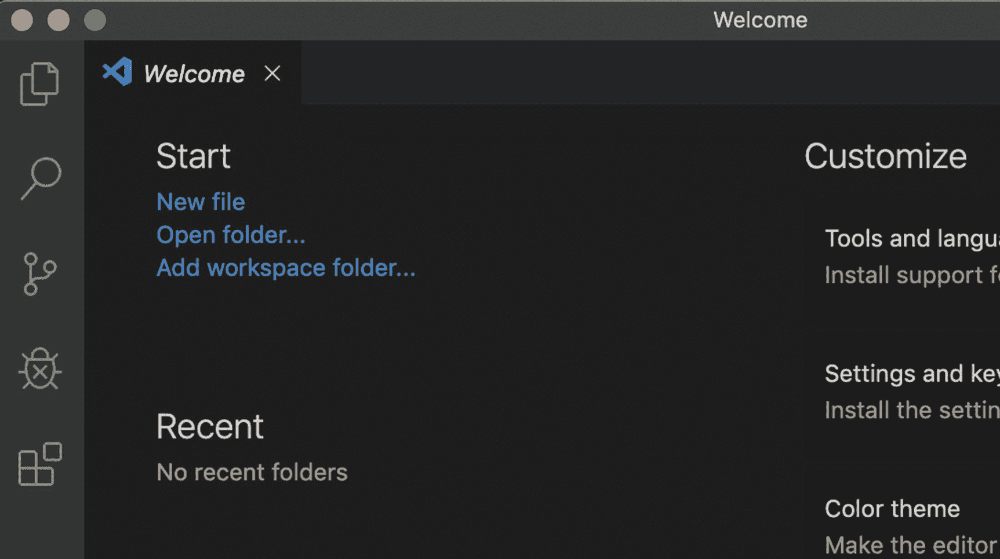
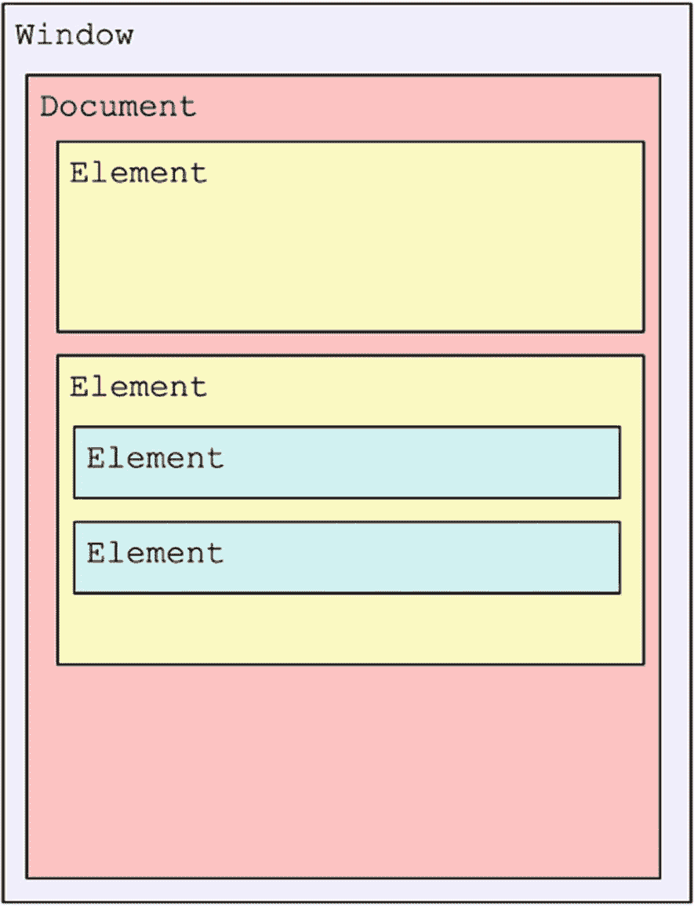
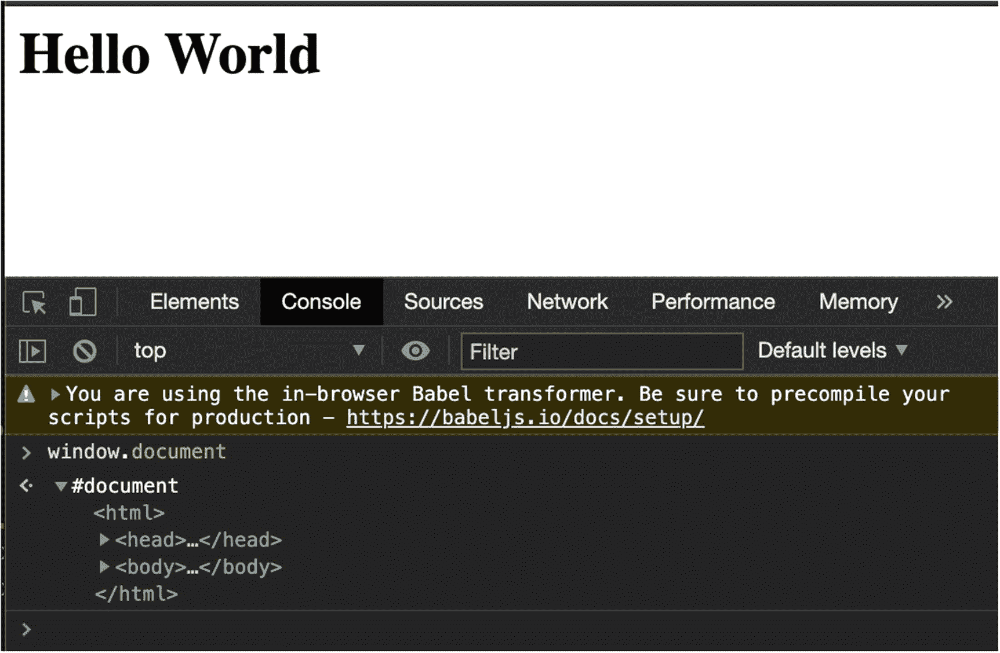
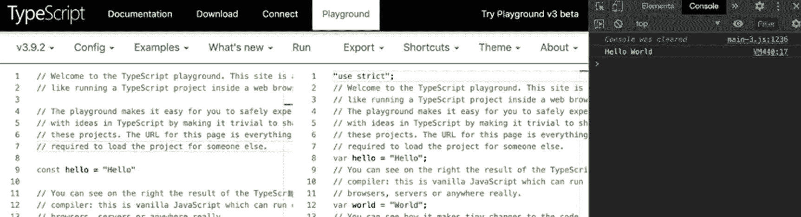
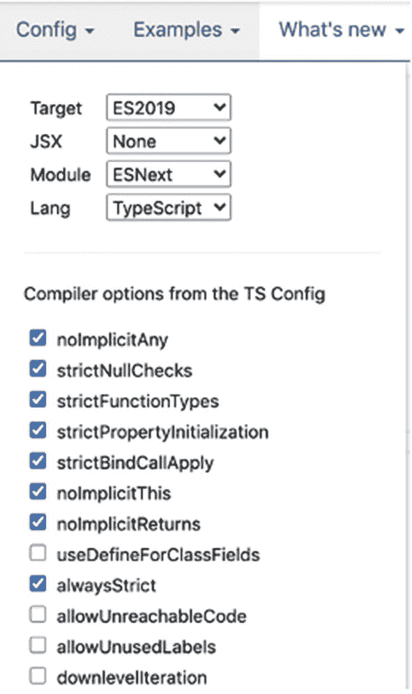
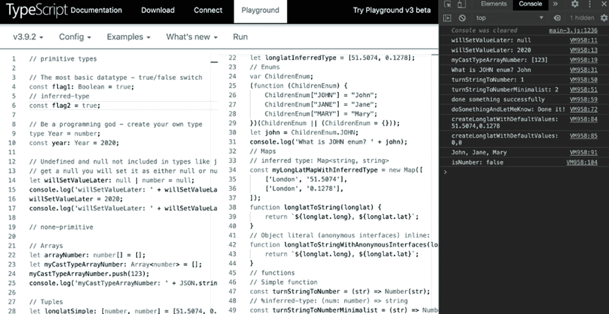

# 一、学习 React 基本概念

这一章是我们起飞和开始飞行之前的地面学校。我们将创建一个极简的独立 React 应用，名为“Hello World”然后我们将回顾它是如何工作的，看看在引擎盖下发生了什么。我们还将学习 TypeScript 和初学者模板项目，我们可以用它们来加速开发。

这一章是理解 React 的基础，尽管我们并不是在这里构建一个华而不实的应用，但是其中涉及的概念是至关重要的。一旦你完成了这本书，甚至在阅读后面的章节时，如果你需要参考一些基本的概念，你可以随时回到这一章。

我们开始吧！

## React 入门

在本节中，我们将创建一个极简的、独立的“Hello World”React 示例。我们将安装一个集成开发环境(IDE ),我们将涵盖一些重要的概念，如 JSX、DOM、React 虚拟 DOM、Babel 和 ES5/ES6。

不过，首先，我们将讨论 React 是什么以及为什么要使用它。尽管直接开始编写代码可能更令人满意，但关注关键概念将有助于您更好地理解 React。整本书依赖于你对这部分内容的理解。

### 什么是 React？

React(也称为 ReactJS)是一个 JavaScript 库，由脸书( [`https://github.com/facebook/react`](https://github.com/facebook/react) )开发，用于创建 Web 用户界面。React 是由当时在脸书广告公司工作的乔丹·沃克发明的。与 jQuery、Angular、Vue.js、Svelte 等其他前端开发框架和库竞争。

在 2017 年 9 月发布的上一版本 React 16.x 中，React 团队增加了更多的工具和开发支持，并消除了 bug。React 17 于 2020 年 10 月发布。

Note

React 17 是一个“垫脚石”版本，该版本主要专注于使 React 在未来版本中更容易升级，以及提高与浏览器的兼容性。React 团队的支持表明该库势头强劲，不会很快消失。

### 为什么要 React？

你知道吗？

*   React 是开发人员的最爱。事实上，根据 StackOverFlow 的一项调查( [`https://insights.stackoverflow.com/survey/2020`](https://insights.stackoverflow.com/survey/2020) )，React.js 已经连续两年是“最受喜爱”的 web 框架。

*   对 React 开发人员的需求激增；据 Indeed.com([`https://www.indeed.com/q-React-jobs.html`](https://www.indeed.com/q-React-jobs.html))统计，React 开放的开发者岗位接近 56000 个。

*   React 库本身比 Ember 或 Angular 等竞争对手的 Web 框架更轻，见此: [`https://gist.github.com/Restuta/cda69e50a853aa64912d`](https://gist.github.com/Restuta/cda69e50a853aa64912d) (大约 100KB)和更快。

*   React 很容易上手。

### 安装 IDE

处理代码时，建议您使用 IDE。

#### 为什么我甚至需要一个 IDE？

你不“需要”一个 IDE 您总是可以用文本编辑器编写代码。然而，IDE 可以帮助人们编写代码并提高生产率。这是通过提供编写代码所需的常见功能来实现的，例如源代码编辑器、构建自动化工具和调试器，以及许多其他功能。

说到 ide，可以选择的有很多。一些例子是微软的 Visual Studio、IntelliJ IDEA、WebStorm、NetBeans、Eclipse 和 Aptana Studio。

对于这本书，我选择了 Visual Studio Code (VS Code ),因为它是一个轻量级、免费、跨平台(Linux、macOS、Windows)的编辑器，可以用插件进行扩展。您可能正在为一家将为您提供特定 ide 的公司工作，或者您可能决定投资购买顶级 IDE 许可证。提到的大多数顶级 ide 都提供类似的功能，所以归结起来就是你习惯使用的东西，许可证等等。

Note

选择一个 IDE 取决于很多因素，我不会深入讨论这些因素。您可以安装或使用您习惯使用的任何 IDEVS 代码只是一个建议。

您还可以选择 Microsoft Visual Studio Express 版本，而不是 VS 代码，与 Microsoft Visual Studio 相比，VS 代码的功能有所减少。

#### 如何安装 VS 代码？

要开始，请访问 VS 代码下载页面:

```jsx
https://code.visualstudio.com/download

```

选择你的平台，一旦下载完成，打开 VS 代码。您应该会看到如图 [1-1](#Fig1) 所示的欢迎页面。



图 1-1

Visual Studio 代码欢迎页

### 创建一个极简的独立“Hello World”程序

是时候创建我们新的“Hello World”应用，并在我们的浏览器中运行该项目了。要在 VS 代码中创建新文件，请选择 new file。然后，粘贴以下代码，并将文件保存到您想要的任何位置:

```jsx
<html>
  <head>
      <meta charSet="utf-8">
          <title>Hello world</title>
          <script src="https://cdnjs.cloudflare.com/ajax/libs/react/17.0.0/umd/react.production.min.js"></script>
          <script src="https://unpkg.com/react-dom@17.0.0/umd/react-dom.production.min.js"></script>
          <script src="https://unpkg.com/@babel/standalone/babel.min.js">
          </script>
  </head>
  <body>
  <div id="app"></div>
  <script type="text/babel">
      ReactDOM.render(
      <h1>Hello World</h1>,
      document.getElementById('app')
      );
  </script>
  </body>
</html>

```

您可以从本书的 GitHub 位置下载该代码:

```jsx
https://github.com/Apress/react-and-libraries/tree/master/01/index.html

```

Note

你可以从这本书的 GitHub 位置( [`https://github.com/Apress/react-and-libraries`](https://github.com/Apress/react-and-libraries) )下载你在这本书里看到的所有代码和练习。这些文件是按章组织的。

现在我们已经创建了文件，将其重命名为`index.html`，并用您最喜欢的浏览器打开它(见图 [1-1](#Fig1) )。


图 1-2

在浏览器中 React“Hello World”index.html 应用

祝贺您，您刚刚创建了您的第一个 React 应用！

现在，让我们解码这个例子来理解这里发生了什么。

看看我们创建的`ReactDOM.render`函数。看起来是这样的:

```jsx
ReactDOM.render(
<h1>Hello World</h1>,
document.getElementById('app')
);

```

虽然代码看起来像 HTML，但它不是。这是 JavaScript 扩展(JSX)代码。

Note

JSX 是一个 React 扩展，它使用 JavaScript 标签来模仿 HTML 代码，因此代码与 HTML 相似但不相同。

### 什么是 JSX，我们为什么需要它？

为了理解 React 为什么使用 JSX 而不仅仅是 HTML，我们首先需要谈谈文档对象模型(DOM)。简单来说，React 在将这些更改提交给用户浏览器之前，会在后台处理您的 JSX 代码，以加快用户页面的加载速度。让我们更深入地了解这一过程。

Note

HTML 中的 DOM 代表文档对象模型。它是 HTML 的内存表示，并且是树形结构。

#### 数字正射影像图

文档对象模型是 HTML 甚至 XML 文档(如 SVG 图像)的 API。API 通过包含定义 HTML 元素的功能的接口以及它们所依赖的任何接口和类型来描述文档。HTML 文档包括对各种事物的支持和访问，如与用户交互，如事件处理程序、焦点、复制和粘贴等。

DOM 文档由节点( [`https://developer.mozilla.org/en-US/docs/Web/API/Node`](https://developer.mozilla.org/en-US/docs/Web/API/Node) )的层次树组成，节点接口不仅允许访问文档，还允许访问每个元素，如图 [1-3](#Fig3) 所示。



图 1-3

DOM 文档由一个层次树组成

使用 Chrome 的 DevTools 控制台检查器(右键单击网页并选择检查➤控制台)并在控制台中键入以下内容:

```jsx
window.document

```

图 [1-4](#Fig4) 显示了结果。您可以访问文档分层树结构以及构成该树的元素。



图 1-4

Chrome 的 DevTools 控制台检查器显示 DOM 文档

DOM 操作是现代交互式网页的核心，可以动态地改变网页的内容。从技术上来说，这可以通过使用 JavaScript 的方法来完成，如`getElementById`和`getElementsByClassName`以及`removeChild`和`getElementById("myElement").remove();`。这些 API 由 HTML DOM 公开，旨在提供在运行时更改代码的能力。

React 根据 React 元素表示确定对实际 DOM 进行什么更改，并在虚拟 DOM 中的后台进行更改。您可以将 React 虚拟 DOM 视为模拟。

然后，它只向实际用户的 DOM(浏览器)提交所需的更改。这个过程背后的原因是为了加快性能。

关键是实际的 DOM 树结构操作要尽可能快。例如，假设我们有一个产品页面，我们想更新产品列表的第一项。大多数 JavaScript 框架更新整个列表只是为了更新一个条目，而这个条目可能包含数百个条目。

大多数现代 web 页面拥有大型 DOM 结构，这种行为给用户带来了太多负担，导致 HTML 页面加载速度变慢。

#### 引擎盖下的 React 虚拟 DOM

虚拟 DOM (VDOM)是一个编程概念，其中 UI 的理想或虚拟表示保存在内存中，并通过 ReactDOM 等库与“真实”DOM 同步。这个过程叫做*和解*。React VDOM 的目的是加快这一进程。

React 持有 HTML DOM 的一个副本(那就是虚拟 DOM)。一旦需要更改，React 首先对虚拟 DOM 进行更改，然后同步实际的 HTML DOM，避免了更新整个 HTML DOM 的需要，从而加快了过程。

例如，当我们渲染 JSX 元素时，每个虚拟 DOM 对象都会更新。更新整个虚拟 DOM 而不是实际的 HTML DOM 的过程更快。在对账过程中，React 需要弄清楚哪些对象发生了变化，这个过程叫做 *diffing* 。然后 React 只更新真实 HTML DOM 中需要更改的对象，而不是整个 DOM 树。

在我们的代码中，JSX 代码被包装在一个`ReactDOM.render`方法中。为了进一步挖掘幕后的过程，了解引擎盖下发生的事情，我们还需要了解巴别塔和 ES5/ES6。

#### 巴别塔和 ES5/ES6

我们编写的 JSX 代码只是编写`React.createElement()`函数声明的一种更简洁的方式。每次组件使用 render 函数时，它都会输出一个 React 元素树或组件输出的 HTML DOM 元素的虚拟表示。

ECMAScript version 5 (ES5)是 2009 年完成的普通老式“常规 JavaScript”。所有主流浏览器都支持它。ES6 是下一个版本；它于 2015 年发布，增加了语法和功能。在撰写本文时，所有主流浏览器几乎都完全支持 ES6。事实上，React 团队在版本 17 中做了许多更改，以便与 ES6 更加一致和兼容。

我们希望利用 ES6 的功能；然而，与此同时，我们希望向后兼容旧的 ES5，这样我们就可以兼容所有版本的浏览器。为此，我们使用巴别塔。

Babel 是将 ES6 转换成 ES5 的库(不支持 ES6 的浏览器需要它)。`ReactDOM.render()`函数，顾名思义，渲染 DOM。render 函数应该返回一个虚拟 DOM(浏览器 DOM 元素的表示)。

Note

从巴别塔 8 开始，React 获得了一个特殊的功能。`render`方法改为`jsx`。

注意，从 Babel 8 开始，React 得到了一个名为`jsx`的特殊函数来代替`render`函数。在 Babel 8 中，它还会在需要的时候自动导入`react`(或者其他支持新 API 的库)，这样你直接写到 Babel 就不用再手动包含了。

例如，看看这个输入:

```jsx
function Foo() {
  return <div />;
}

```

巴别塔会把代码变成这样:

```jsx
import { jsx as _jsx } from "react/jsx-runtime";
function Foo() {
  return _jsx("div", ...);
}

```

同样从 Babel 8 开始，`jsx`将自动成为默认运行时。你可以在我关于媒介的文章中读到更多关于这些变化: [`http://shorturl.at/bxPZ7`](http://shorturl.at/bxPZ7) `.`

现在您已经理解了 React 在幕后做什么以及 Babel 的角色，您可以回头看看我们的代码示例。注意，我们导入了三个库。

*   React version 17 :我们使用 React 来定义和创建我们的元素，例如使用生命周期钩子(在本书后面会有更多关于钩子的内容)。

*   *ReactDOM 版本 17* :这是用于 web 应用的(移动设备有 React Native)。这就是为什么 React 和 ReactDOM 之间的代码会有一个分割。ReactDOM 是 React 和 DOM 之间的粘合剂。它包含了允许我们访问 DOM 的特性，比如用`ReactDOM.findDOMNode()`找到一个元素或者用`ReactDOM.render()`安装我们的组件。

*   正如我们所解释的，Babel 是将 ES6 转换成 ES5 的库。

现在我们已经看了 React“Hello World”代码，我们理解了为什么我们要导入这些库以及在幕后发生了什么。这些关键概念对于理解 React 至关重要。如果你需要复习，请随时回到这一章。

在本节中，我们创建了一个名为“Hello World”的极简独立 React 应用，并回顾了如何工作。我们安装了 VS 代码集成开发环境，学习了一些重要的概念，比如 JSX、DOM、React 虚拟 DOM、Babel 和 ES5/ES6。

## TypeScript 入门

在编写 React 代码时，有两种选择。您可以使用 JavaScript (JS)或 TypeScript (TS)编写代码。TypeScript 是 transpiler，这意味着 ES6 不理解 TS，但 TS 会被编译成标准的 JS，这可以用 Babel 来完成。在下一章中，我们将配置我们的项目来接受 TS 文件和 ES6 JS 文件。

### 为什么应该将 TypeScript 集成到 React 项目中？

以下是一些有趣的事实:

*   您知道 TypeScript 是由微软开发和维护的开源编程语言吗？

*   根据 2020 年 StackFlow 的一项调查，TypeScript 编程语言的受欢迎程度排名第二，超过了 Python！

*   ReactJS 框架以 35.9%的比例位居第二，它正在绕过“国王”jQuery。

*   与此同时，32.9%的受访者说他们实际上害怕打字稿。

问题是，为什么 TypeScript 这么受欢迎？

### TypeScript 与 JavaScript:有什么大不了的？

JavaScript 是一种脚本语言，而 TypeScript (TS)是一种成熟的编程语言。TS，顾名思义，就是要有更多的类型。TS 比 JS 更容易调试和测试，并且 TS 通过描述预期的内容来防止潜在的问题(当我们在本书后面测试我们的组件时，您将看到这一点)。拥有成熟的面向对象编程(OOP)语言和模块将 JS 带到了企业级，并提高了代码质量。

以下是 TypeScript 相对于 JavaScript 的优势:

*   TypeScript 是一种 OOP 语言；JavaScript 是一种脚本语言。

*   TypeScript 使用遵循 ECMAScript 规范的静态类型。

*   TypeScript 支持模块。

Note

类型系统将一个类型与每个值相关联。通过检查这些值的流程，它确保没有类型错误。

静态类型意味着在运行之前检查类型(允许您在运行之前跟踪 bug)。JS 只包括以下八种动态(运行时)类型:`BigInt`、`Boolean`、`Integer`、`Null`、`Number`、`String`、`Symbol`、`Object`(对象、函数、数组)和`Undefined`。

Note

所有这些类型都被称为*原始类型*，除了`Object`，它是非原始类型。TS 通过设置编译器对源代码进行类型检查，将静态类型添加到 JavaScript 中，从而将其转换为动态代码。

React 和 TypeScript 配合得很好，通过使用 TypeScript 和描述类型，您的代码质量提高了使用 OOP 最佳实践的应用的代码质量，这是值得学习的。

在下一章中，我们将用 TypeScript 创建一个启动项目；但是，您可以现在就开始尝试 TypeScript 并学习基础知识。

这一步让您很好地了解了 TS 的类型，以及如何在代码中利用 TS 的力量。

TS 的版本是 4。要玩编码 TS，可以在 TS 游乐场运行实际的 TS 代码，可在 [`https://tc39.github.io/ecma262/#sec-ecmascript-language-types`](https://tc39.github.io/ecma262/%2523sec-ecmascript-language-types) 处获得，如图 [1-5](#Fig5) 所示。



图 1-5

TS 游乐场

操场左边是 TS，右边是同样编译成 JS 的代码。接下来，打开 JavaScript 控制台，点击 Run 查看代码运行情况。

操场网站有大量的例子可以帮助你更好地理解 TS。我建议研究这些例子。

注意，这个例子使用了“strict”，在 Config 菜单项中，您可以从 Config 链接设置编译器选项。不同的编译器选项位于 [`https://www.typescriptlang.org/docs/handbook/compiler-options.html`](https://www.typescriptlang.org/docs/handbook/compiler-options.html) 。

这可能会对抗编写代码时左右弹出的错误，但它会避免以后编译器无法识别类型时出现的问题。我提到 TS 是 OOP，遵循 ECMAScript 规范；然而，规范是动态的，经常变化，所以您可以指定 ECMAScript (ES)目标。参见图 [1-6](#Fig6) 。



图 1-6

指定 TS 操场中的 ECMAScript 目标

### 打字稿备忘单

开始使用 TypeScript 的一个很好的地方是通过查看不同的可用类型来理解 TS 的功能。我的编程风格是遵循像莎士比亚那样的编码的函数命名惯例，让方法的名称自我解释。

要试用 TypeScript，请将此处显示的 TypeScript 备忘单代码粘贴到位于 [`https://www.typescriptlang.org/play/`](https://www.typescriptlang.org/play/) 的 TS 游乐场。然后，您可以继续查看 JS 编译器的结果并运行代码。正如你所看到的，我把我的例子分成了基本类型和非基本类型。

```jsx
// primitive types
// The most basic datatype - true/false switch
const flag1: Boolean = true;
// inferred-type
const flag2 = true;

// Be a programming god - create your own type
type Year = number;
const year: Year = 2020;

// Undefined and null not included in types like js, to
// get a null you will set it as either null or number
let willSetValueLater: null | number = null;
console.log('willSetValueLater: ' + willSetValueLater);
willSetValueLater = 2020;
console.log('willSetValueLater: ' + willSetValueLater);

// none-primitive

// Arrays
let arrayNumber: number[] = [];
let myCastTypeArrayNumber: Array<number> = [];
myCastTypeArrayNumber.push(123);
console.log('myCastTypeArrayNumber: ' + JSON.stringify(myCastTypeArrayNumber));

// Tuples (two values)
let longlatSimple: [number, number] = [51.5074, 0.1278];
let longlatInferredType = [51.5074, 0.1278];

// Enums design pattern
enum ChildrenEnum {JOHN = 'John', JANE = 'Jane', MARY = 'Mary'}
let john: ChildrenEnum = ChildrenEnum.JOHN;
console.log('What is JOHN enum? ' + john);

// Maps
// inferred type: Map<string, string>
const myLongLatMapWithInferredType = new Map([
  ['London', '51.5074'],
  ['London', '0.1278'],
]);

// interfaces

// Typing objects-as-records via interfaces
interface longlat {
  long: number;
  lat: number;
}
function longlatToString(longlat: longlat) {
  return `${longlat.long}, ${longlat.lat}`;
}
// Object literal (anonymous interfaces) inline:
function longlatToStringWithAnonymousInterfaces(longlat: {
  long: number;
  lat: number;
}) {
  return `${longlat.long}, ${longlat.lat}`;
}

// Place optional params (phone) and method in interface
interface Client {
    name: string;
    email: string;
    phone?: string

;
    longlatToString(longlat: longlat): string;
}

// Factory design pattern made easy using type cast
interface resultsWithUnkownTypeCast<SomeType> {
  result: SomeType;
}
type numberResult = resultsWithUnkownTypeCast<number>;
type arrayResult = resultsWithUnkownTypeCast<[]>;

// functions

// Simple function
const turnStringToNumber: (str: String) => Number =
    (str: String) => Number(str);
// %inferred-type: (num: number) => string
const turnStringToNumberMinimalist = (str: String) => Number(str);
console.log('turnStringToNumber: ' + turnStringToNumber('001'));
console.log('turnStringToNumberMinimalist: ' + turnStringToNumberMinimalist('002'));

function functionWithExplicitReturn(): void { return undefined }
function functionWithImplicitReturn(): void { }

// Simple functions with callbacks
function simpleFunctionWithCallback(callback: (str: string) => void ) {
  return callback('done something successfully');
}
simpleFunctionWithCallback(function (str: string): void {
    console.log(str);
});

// Never callback  - not placing never is inferred as never
function neverCallbackFunction(callback: (str: string) => never ) {
  return callback('fail');
}
// neverCallbackFunction(function(message: string): never {
//     throw new Error(message);
// });

// Complex Callback and specifiy result types
function complexCallbackWithResultType(callback: () => string): string {
  return callback();
}
console.log('doSomethingAndLetMeKnow: ' + (complexCallbackWithResultType(String), 'Done it!'));

// Function with optional params using '?'
function functionWithOptionalCallbackParams(callback?: (str: String) => string) {
  if (callback === undefined) {
    callback = String;
  }
  return callback('sucess');
}

// Function with setting the type with default values
function createLonglatWithDefaultValues(long:number = 0, lat:number = 0): [number, number] {
  return [long, lat];
}
console.log('createLonglatWithDefaultValues: ' + createLonglatWithDefaultValues(51.5074, 0.1278))
console.log('createLonglatWithDefaultValues: ' + createLonglatWithDefaultValues())

// function with rest parameters
// A rest parameter declared by prefixing an identifier with three dots (...)
function functionWithRestParams(...names: string[]): string {
  return names.join(', ');
}
console.log(functionWithRestParams('John', 'Jane', 'Mary'));

// Function with potential two params types
function isNumber(numOrStr: number|string): Boolean {
  if (typeof numOrStr === 'string') {
      return false;
  } else if (typeof numOrStr === 'number') {
      return true;
  } else {
    throw new Error('Not sure the type');
  }
}
console.log('isNumber: ' + isNumber('123'));

```

您可以从这里下载完整的代码:

```jsx
https://github.com/Apress/react-and-libraries/tree/master/01/TS-getting-started.ts

```

如果你需要更多的解释，请看官方的 TS 基本类型手册:

```jsx
https://www.typescriptlang.org/docs/handbook/basic-types.html

```

将代码从 TS 转换为 JS 的 JS 编译器和控制台结果将帮助您理解这些示例。参见图 [1-7](#Fig7) 。



图 1-7

TypeScript 操场示例

## React 模板启动项目选项

在编写 React 应用时，您有几个选择。您可以自己编写整个代码，就像我们在“Hello World”示例中所做的那样，然后添加库来帮助您完成打包代码并为生产做好准备的任务。另一个选择是使用一个 starter template 项目，它已经处理好了搭建和配置工作，并且包含了一些库，可以帮助您只需编写代码就可以快速完成工作。

正如您所看到的，VDOM 过程发生在幕后，当页面发生变化时，我们不需要刷新页面。

事实上，创建 React 应用最流行的模板是 Create-React-App (CRA)项目( [`https://github.com/facebook/create-react-app`](https://github.com/facebook/create-react-app) )。该项目由脸书团队创建，GitHub 上有近 84，000 颗星星。

CRA 是基于单页面应用(SPA)的，这很好，因为你不用刷新页面，感觉就像你在一个移动应用中。

这些页面应该在客户端呈现。这对中小型项目来说非常好。

另一个选项是服务器端呈现(SSR)。SSR 在服务器上呈现页面，因此客户端(浏览器)将显示应用，而无需做任何工作。这有利于某些用例(通常是大型应用)，在这些用例中，如果渲染发生在客户端，用户体验会很慢。

CRA 一开始就不支持 SSR。有一些方法可以配置 CRA 并让它像 SSR 一样工作，但是对于一些开发人员来说，这可能太复杂了，并且需要您自己维护配置，所以可能不值得这样做。

如果您正在构建需要 SSR 的更大的东西，最好使用已经配置了 SSR 的不同 React 库，如 Next.js framework、Razzle 或 Gatsby(在构建时将 prerender 网站包含到 HTML 中)。

Note

如果你想用 React 和 Node.js 做服务器渲染，可以去看看 Next.js，Razzle，或者 Gatsby。Create React App 与后端无关，只生成静态的 HTML/JS/CSS 包。 [`https://github.com/facebook/create-react-app`见](https://github.com/facebook/create-react-app)。

也就是说，通过 CRA，我们可以做一个 prerender，这是最接近 SSR 的方法，在本书的最后一章，当我们优化 React 应用时，你会看到这一点。

在本书的例子中，我们将使用 CRA；但是，如果对这本书有了扎实的理解，您可以很容易地迁移到任何使用 React 的模板库。

## 摘要

在本章中，我们创建了一个名为“Hello World”的极简独立 React 应用，并探索了它的工作原理。我们安装了 VS 代码集成开发环境，学习了一些重要的概念，如 JSX、DOM、React 的虚拟 DOM 和 Babel，以及 ES5/ES、SPA、SSR 和 TypeScript。

在下一章，我们将学习更多关于 CRA 项目的知识，并用基本库建立我们的启动项目和开发环境。