# 二、React 起始项目和朋友

在这一章中，我们将涉及许多库，这可能会让人不知所措。然而，我想为你提供一个很好的基础，这样你就可以拥有最好的创业项目。启动项目将为您提供很好的服务，因为您可以复制并重用我们将在本书中使用的所有项目和示例的代码。这种实践将使你成为一流的 React 开发人员，能够处理任何规模的项目，并帮助你找到理想的工作。也会加速你的发展。

在本章结束时，你将会有一个入门项目，其中包括了我们将在本书中涉及的许多库。我们开始吧！

## Create-React-App Starter 项目入门

在前一章中，我们从头开始创建了一个简单的“Hello World”应用，我们讨论了它在幕后是如何工作的。我们讨论了 JSX、DOM、React 虚拟 DOM、Babel、ES5/ES6 和 spa 等主题。

创建一个 React 应用很容易，只需要几行代码。然而，要创建一个基于一个页面(一个 SPA)的真实应用，这个页面有多个视图、许多用户手势、有成百上千个条目的列表、成员区域和其他在当今应用中常见的部分，我们需要学习的还有很多。

在本书中，我的目标是为您提供一个大型工具箱，里面装满了最好的库和工具，这样您就可以构建一个顶级的 React 应用，并充分利用 React。为此，我们需要看看 React 世界中几个流行的库和工具。

我们可以从零开始，但这不是必需的。正如我在前一章提到的，Create-React-App (CRA)是 React 基于 web 的应用最流行的启动项目。(见 [`https://github.com/facebook/create-react-app`](https://github.com/facebook/create-react-app) )。)它提供了一个样板项目，在构建顶级 React 应用时，您可以快速启动并运行许多必要的工具和标准库。

它包括香草口味的包装和其他更有价值的包装。此外，CRA 可以选择包含更复杂库的模板，或者您可以创建自己的模板，其中包含 CRA 没有包含的某些元素。

CRA 已经为我们做了一些决定。例如，构建工具是一个名为 Webpack over Rollup 或 Parcel 的工具。Task Runners 是用 NPM 脚本安装的，而不是像 Gulp 这样的工具。CSS、JS 和 Jest 被用作默认值。

在使用 React 完成工作的项目和库之后，很难保持中立而不推荐某些工具，这就是为什么我选择使用本章中的工具。此外，由于许多库不容易移植到，您将希望从正确的方面开始，而不是在以后切换工具。这就是为什么我们在这个库中建立我们的项目。这些库将帮助您完成工作，并且您可以将该模板用于其他项目，无论是小型项目还是大型企业级项目。

## React 开发者路线图

成为一名真正的专业 React 开发人员不仅仅是了解 React 库。正如我们提到的，有一些工具和库可以帮助加速开发，因为记住，React 不是一个框架。React 是脸书开发的 JavaScript 库，用于处理用户界面，仅此而已。

为了帮助找出将 React 转变为一个成熟框架的部分，该框架能够高效地创建高质量的应用，并能与其他 JS 框架竞争，请查看图 [2-1](#Fig1) 中的路线图。

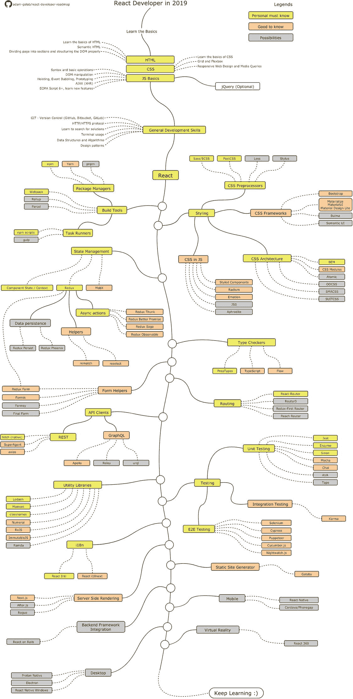

图 2-1

React 开发者路线图(来源: [`https://github.com/adam-golab/react-developer-roadmap`](https://github.com/adam-golab/react-developer-roadmap) )

该图表展示了成为顶尖专业 React 开发人员的推荐途径。

不要被这张图表吓倒。如果你阅读了这本书，当这本书结束时，你将会了解许多这样的库，并且能够处理任何规模的项目。

### 如何将这些工具集成到我的 ReactJS 项目中？

正如我提到的，CRA 没有包括许多可以帮助您处理现实生活中的 React 项目的工具。然而，我已经建立了一个 CRA 模板，将包括所有必须知道的图书馆。只需一个命令，您就可以获得包含所有需要的库的启动项目。我们将在本章中对此进行简要介绍。

请记住，事物瞬息万变；另外，您的项目可能需要不同的工具，或者您可能想要进行试验。这就是为什么在这一节我们将把它全部分解并展示如何安装每个库。

在本节中，我们将安装以下库:

*   *打字检查器*:打字稿

*   预处理器:萨斯/SCSS

*   *状态管理* : Redux 工具包/反冲

*   *CSS 框架*:素材-UI

*   *组件*:样式组件

*   *路由*:React 路由

*   *单元测试* : Jest 和 Enzym + Sinon

*   *E2E 测试*:笑话和木偶师

*   棉绒:变得又亮又漂亮

*   其他有用的库 : Lodash，Moment，Classnames，Serve，react-snap，React-Helmet，Analyzer Bundle

该列表是 React 库。文件夹结构是我将要介绍的内容的一部分，但它不是一个图书馆。我们可以加上这句话向读者解释。

### 先决条件

您可以使用 NPM ( [`https://www.npmjs.com/`](https://www.npmjs.com/) )来安装这些库。你需要 Node.js 来获取 NPM。

NPM 和 Node.js 携手并进。NPM 是 JavaScript 包管理器，也是 JavaScript Node.js 环境的默认包管理器。

### 在 Mac/PC 上安装节点和 NPM

Node.js 版本至少应为 8.16.0 或 10.16.0。我们需要那个版本的原因是我们需要使用 NPX。NPX 是 2017 年推出的 NPM 任务跑步者，它用于设置 CRA。

如果缺少它，请在终端(Mac)或 Windows 终端(Windows)中键入以下内容进行安装:

```jsx
$ node -v

```

如果没有安装，您可以从这里为 Mac 和 PC 安装(见图 [2-2](#Fig2) ):

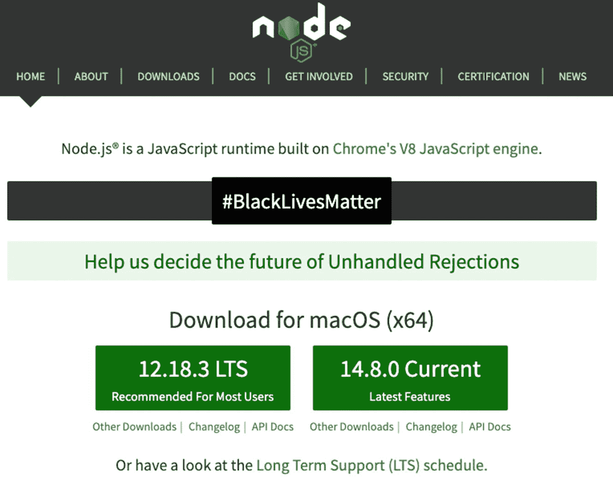

图 2-2

Nodejs.org

```jsx
https://nodejs.org/en/

```

安装程序可以识别你的平台，所以如果你在 PC 上，步骤是一样的。

下载安装程序后，运行它。完成后，在终端中运行`node`命令，如下所示:

```jsx
$ node -v

```

该命令将输出 Node.js 版本号。

### 下载库:纱线或 NPM

要从 NPM 资源库下载包，我们有两个选项:Yarn 或 NPM。NPM 是在我们安装 Node.js 的时候安装的，然而在本书中，我们将主要使用纱库。我们将尽可能使用 Yarn 来下载包，而不是 NPM，因为 Yarn 比 NPM 快。Yarn 缓存已安装的包并同时安装包。

### 在 Mac/PC 上安装 Yarn

要在 Mac 上安装 Yarn，请在终端中使用`brew`。

```jsx
$ brew install yarn

```

就像 Node.js 一样，运行带有`-v`标志的`yarn`来输发布本号。

```jsx
$ yarn -v

```

在 PC 上，您可以从这里下载`.msi`下载文件:

```jsx
https://classic.yarnpkg.com/latest.msi

```

您可以在此找到更多安装选项:

```jsx
https://classic.yarnpkg.com/en/docs/install/#mac-stable

```

#### 创建-React-应用 MHL 模板项目

配备了 Node.js 以及 NPM 和 Yarn，我们就可以开始了。我们可以使用我为您创建的 CRA 必备库(MHL)模板项目，它将产生本章的最终结果，并包括我们在本章中设置的所有库。

您可以从这里获得:

```jsx
https://github.com/EliEladElrom/cra-template-must-have-libraries

```

将这个模板项目作为您的启动库是很好的，不仅因为它很容易并且包含了我们需要的所有库，还因为我将能够在书发布后很长时间内更新这个启动项目，以防出现任何问题或需要更新，就像 NPM 图书馆经常发生的那样。

您可以使用带有纱线的 CRA 模板和一个命令来创建本章的最终项目，如下所示:

```jsx
$ yarn create react-app starter-project --template must-have-libraries

```

或者您可以使用 NPX 创建它，如下所示:

```jsx
$ npx create-react-app your-project-name --template must-have-libraries

```

要运行这个项目，您可以将目录更改为`starter-project`并在终端中运行`start`命令，如下所示:

```jsx
$ cd starter-project
$ yarn start

```

此命令将安装所有依赖项，并在本地服务器上启动项目。在下一节中，您将了解到更多关于引擎盖下发生的事情。

在这一章的其余部分，我将解释这个项目包括什么，并为你逆向工程这个项目，这样你就可以完全理解在引擎盖下发生了什么。因为你已经准备好了最终项目，所以不一定要完成本章中的所有步骤。

#### 香草风味创造 React 应用

因为您能够安装 starter 模板项目，所以您可以立即开始开发。了解每个安装的库是很好的，这样你就可以完全理解这个项目包含了什么，并且可以根据你的具体需求定制你的项目。要创建 CRA 而不使用 CRA MHL 模板项目，您可以安装我们自己的每个库。只需使用 vanilla-flavor 模板，通过在终端中使用`yarn`运行以下命令来启动一个新的 CRA:

```jsx
$ yarn create react-app hello-cra

```

请记住，`yarn`命令相当于下面使用 NPM NPX 任务运行器的命令，就像我们在 MHL 模板项目中看到的一样:

```jsx
$ npx create-react-app hello-cra

```

第一个参数是我们正在下载的库。第三个参数的`hello-cra`是我们的项目名称。接下来，我们需要将目录更改为我们的项目。

```jsx
$ cd hello-cra

```

最后，键入以下命令在终端/Windows 终端中启动项目:

```jsx
$ yarn start

```

NPM 的情况也是如此，如下图所示:

```jsx
$ npm start

```

我们在终端收到这条消息:

```jsx
Happy hacking!
Compiled successfully!

```

您现在可以在浏览器中查看`hello-cra`。

```jsx
  Local:            http://localhost:3000
  On Your Network:  http://192.168.2.101:3000

```

请注意，开发构建并没有优化。要创建生产版本，请使用`yarn build`。

我们的应用将使用默认浏览器在端口 3000 上自动打开。如果没有，可以用任何浏览器，用这个网址:`http://localhost:3000/`。

Note

如果您想停止开发服务器，请使用 Ctrl+C。

后台发生的事情是 CRA 应用为我们创建了一个开发服务器。参见图 [2-3](#Fig3) 。

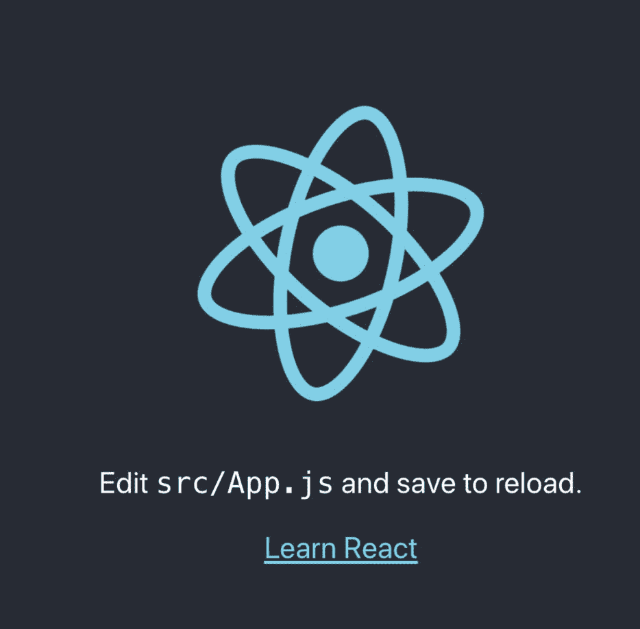

图 2-3

我们浏览器 3000 端口上的香草 CRA

祝贺您，您刚刚在开发服务器上创建并发布了 CRA！React 项目包括 CRA 开箱即用的所有库。

如果你检查为我们创建的代码和文件(见图 [2-4](#Fig4) ，你可以看到有许多文件组成了我们的单页应用。例子有`App.js`和`index.js`。我们也有样式表文件，如`App.css`和`index.css`。

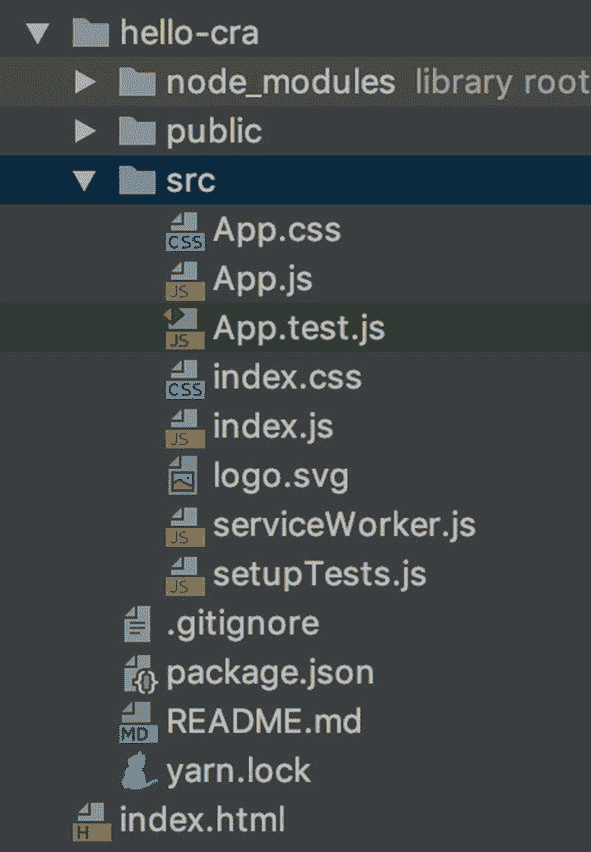

图 2-4

CRA 文件和文件夹

React 最初被设计为 SPA，通常我们需要编写一个脚本来将我们的文件组合成一个文件或一大块文件，我们需要将这些文件包含在我们的应用中，以便代码可用。但是，由于我们使用 CRA，所有这些都是自动完成的。

CRA 使用 Webpack 和 Babel 将我们的文件打包到一个单独的`index.html`页面和名为`bundle.js`和`*.chunk.js`的文件中。它可以根据需要生成其他文件。

Note

CRA 正在使用现成的 Webpack 模块捆绑器。Webpack 是一个开源的 JavaScript bundler，它使用加载器来捆绑文件和创建静态资产。

当我们键入命令`yarn start`时，脚本启动一个 NPM 脚本，为我们创建一个开发环境。该脚本将我们的文件缓存在内存中，并在我们导航到 URL 时提供给我们。

看一下图 [2-5](#Fig5) ，它说明了这个过程。

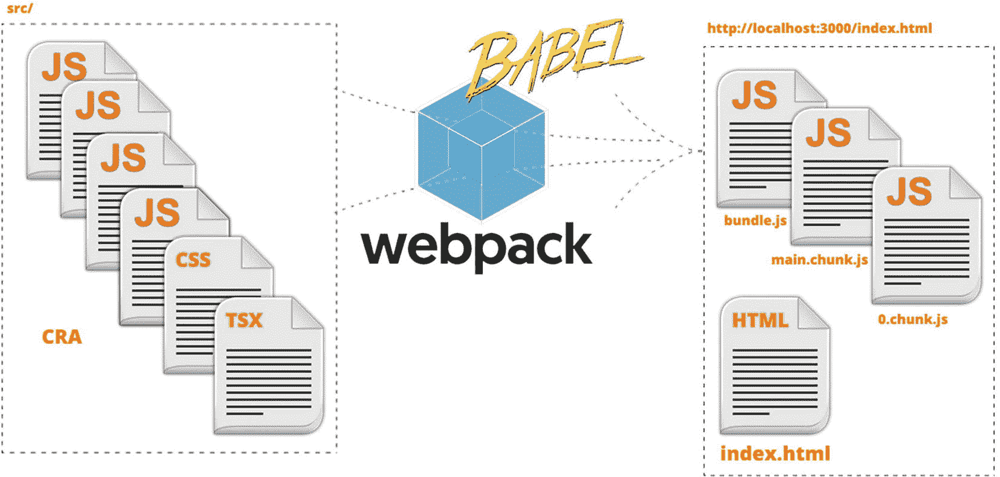

图 2-5

从 10，000 英尺的角度来说明 CRA 使用 Webpack 和 Babel 将我们的文件打包到一个 index.html 页面中

要查看应用的源代码并检查为我们创建的文件，请访问 Chrome 上的 URL:`http://localhost:3000/`。

或者我们也可以用 Chrome DevTools 检查 HTML DOM 元素。在 Chrome 上右键单击并选择 Inspect 来查看 DOM 树。

您可以在 body HTML 标记中看到以下文件:

```jsx
<script src="/static/js/bundle.js"></script>
<script src="/static/js/0.chunk.js"></script>
<script src="/static/js/main.chunk.js"></script>

```

`bundle.js`文件，顾名思义，将我们的 JavaScript 源代码文件捆绑成一个文件，`*.chunk.js`文件将我们的样式捆绑成文件块。您可以访问这些文件的 URL 来查看内容。

繁重的工作是在我们的项目中一个名为`node_modules`的文件夹中完成的，这个文件夹包含了许多我们的项目正在使用的依赖库。看一下图 [2-6](#Fig6) 。

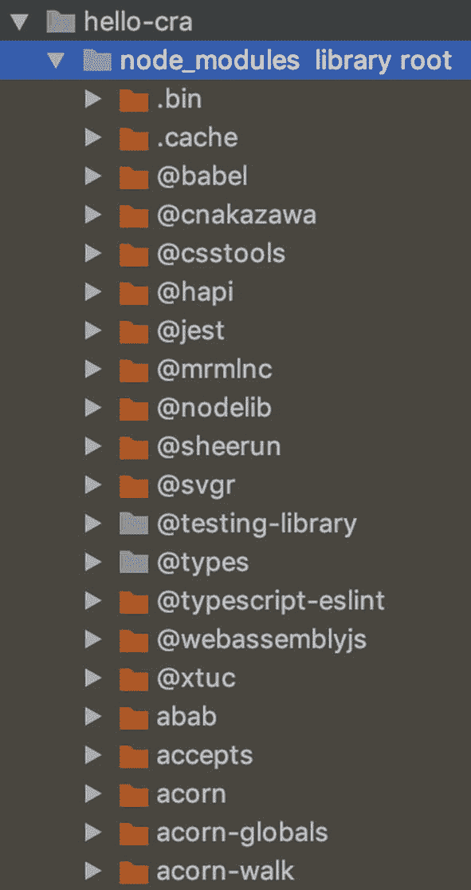

图 2-6

具有依赖关系的 node_modules 文件夹

您可以在 Node.js 使用的名为`package.json`的文件中的`node_modules`文件夹中找到依赖项列表。该文件包含有关我们项目的信息，如版本、正在使用的库，甚至 Node.js 将运行的脚本。

打开`package.json`文件。请注意，如果与`node_modules`文件夹中的长列表相比，我们的项目使用的库依赖列表很短(请记住，在图书发布后，库版本可能会经常更改)。

```jsx
"dependencies": {
  "@testing-library/jest-dom": "^4.2.4",
  "@testing-library/react": "^9.3.2",
  "@testing-library/user-event": "^7.1.2",
  "react": "^16.13.1",
  "react-dom": "^16.13.1",
  "react-scripts": "3.4.3"

```

每个依赖项都包含库名和版本号。

如果我们检查我们的`node_modules`文件夹，它充满了其他开发者的库。事实上，有 1000 多个，当我们下载我们的 CRA 时，需要一段时间(当然取决于你的网速)来下载项目。

这是因为所有这些依赖性。那么，所有这些依赖来自哪里呢？

每个库都包含其他依赖项或子依赖项，所以尽管我们没有在项目的`package.json`文件中列出这些库，但是它们会在其他库或子库中列出。

还要注意，在我们的`package.json`文件中有一个指定脚本的部分。

```jsx
"scripts": {
  "start": "react-scripts start",
  "build": "react-scripts build",
  "test": "react-scripts test",
  "eject": "react-scripts eject"
}

```

事实上，当我们运行`yarn start`时，创建本地服务器的过程正在进行。那个剧本是从哪里来的？要回答这个问题，请打开下面的库，查看下面构建开发服务器的代码:

```jsx
hello-cra/node_modules/react-scripts/scripts/start.js

```

##### React 脚本

这些脚本正在使用一个名为`react-scripts`的库。如果您转到`hello-cra/node_modules/react-scripts/package.json`文件，您会看到一长串依赖项，代码使用这些依赖项将文件与 Babel 和 Webpack 打包并构建我们的服务器。这些子库中的每一个都有其他的依赖项，依此类推。

这就是为什么我们的`node_modules`文件夹中有超过 1000 个库。

##### 吉蒂尔

通常的做法是在每个项目中创建一个`.gitignore`文件。该文件可以包含我们想要排除的文件。

例如，CRA 已经包含了一个`.gitignore`文件，而`node_modules`已经列出了要排除的文件。然后我们运行`yarn`命令并检查`package.json`文件，它为我们安装了所有这些依赖项，而不是将所有这些库包含在我们的项目中，这将使我们的项目非常大。

#### 公共文件夹

我们的应用中还有一个名为`public`的文件夹，其中包含我们的应用图标。具体来说，它包含以下内容:

*   `public/favicon.ico`、`logo192.png`、`logo512.png`:在`manifest.json`文件中使用的图标

*   `public/index.html`:我们的索引页

*   关于我们的应用和风格的信息

*   `public/robots.txt`:搜索引擎说明

如果我们检查我们的`index.html`页面，我们会看到在`manifest.json`文件中设置的令牌，但是如果我们打开 HTML body 标签中的`public/index.html`文件，我们不会看到任何 JS 包块，比如我们在浏览器中检查代码时看到的`*.chunk.js`和`bundle.js`文件。看一看:

```jsx
public/index.html;
<body>
  <noscript>You need to enable JavaScript to run this app.</noscript>
  <div id="root"></div>
</body>

```

原因是 NPM 脚本根据这个文件以及它生成的文件来生成我们的索引文件。例如，如果我们想将我们的应用发布到生产环境中，我们将运行不同的命令(`build`而不是`start`)，并且会生成不同的文件。在本书的后面，您将了解更多关于发布到产品以及如何优化 JS bundle 块的信息。

您可以从这里下载代码:

```jsx
https://github.com/Apress/react-and-libraries/tree/master/01/hello-cra

```

要让 Yarn 使用`package.json`文件并下载所有依赖项，运行以下命令:

```jsx
$ yarn start

```

#### 使用类型脚本创建-React-应用

CRA 有两种风格:香草和打字稿。注意，我们的应用文件`src/public/App.js`和`src/public/index.js`有`.js`文件扩展名，这意味着它们是 JavaScript 文件。CRA 将我们项目的默认设置设置为 JavaScript。

然而，在编写 React 代码时，有两个主要选项。我们可以用 JavaScript (JS)或 TypeScript (TS)编写代码。您下载的香草味 CRA 被设置为 JavaScript。然而，正如我们在前一章提到的，我们将在本书中使用 TypeScript 编写代码。

#### 带打字稿的 CRA 模板

要使用 Yarn 设置我们的 TS 项目，命令类似于我们设置 CRA 的方式。唯一的区别是我们为 React 社区创建的 TypeScript 添加了 TS 模板。

```jsx
$ yarn create react-app starter-project --template TypeScript

```

我们在 TS 中使用了`--template`标志，并将我们的项目命名为`starter-project`。

现在，将目录更改为您的项目，并启动项目以确保一切顺利，就像我们之前所做的那样。

```jsx
$ cd starter-project

```

Tip

我建议在每次安装后测试您的项目，以确保它仍然在运行。库和依赖项经常变化，确保项目不中断应该是您的首要任务。

```jsx
$ yarn start

```

应用应该在端口 3000 上打开，就像我们之前做的一样:`http://localhost:3000/.`参见图 [2-7](#Fig7) 。

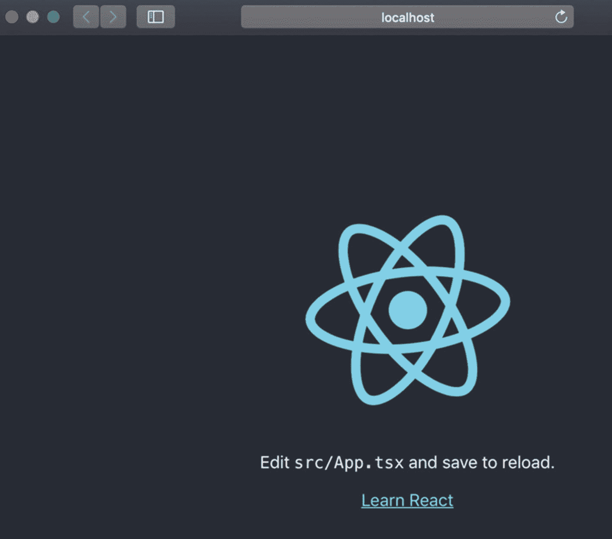

图 2-7

在端口 3000 上运行的 CRA TS 应用

请注意，应用上的副本更改为`src/App.tsx`(来自图 [2-3](#Fig3) )，我们应用中的文件也从`.js`更改为`.tsx`。

接下来，我们需要为 TS 添加以下类型，以便 Webpack 知道如何处理`.tsx`文件类型并捆绑它们，这样它们就可以作为静态资产包含在我们的项目中。

```jsx
$ yarn add -D typescript @types/node @types/react @types/react-dom @types/jest @typescript-eslint/scope-manager

```

当使用 Yarn 时，当我们想要更新项目的`package.json`以在`devDependencies`下包含一个库时，我们使用`-D`标志(代表开发者“依赖”)。`package.json`文件保存了项目的库。

Note

为 TypeScript 安装的类型用于为 TypeScript 提供有关用 JavaScript 编写的 API 的类型信息。

我们刚刚安装的类型包括 Jest 测试的 TypeScript 和 ESLint。CRA 捆绑了 Jest 和 Jest-dom 来测试我们的应用。我们将在本书的后面学习用 Jest 和 ESlint 测试我们的应用，但是我想让你知道我们已经在设置这些类型了。

除了将我们的代码文件从`.js`更改为`.ts`，模板项目还包括一个名为`tsconfig.json`的文件。这个文件为编译器保存了一个特定的设置，编译器将编译从`.tsx`到`.js`的文件，其中包含我们的目标信息，比如 ES6 和其他设置。

#### CSS 预处理程序:Sass/SCSS

级联样式表(CSS)是 HTML 的核心功能，如果您还不熟悉 CSS，那么您需要熟悉它。这尤其适用于 HTML，尤其是 React。在大型项目中，CSS 预处理程序通常用于补充 CSS 和添加功能。我们将在本书的后面讨论这些。

就 CSS 预处理程序而言，有四种主要的 CSS 预处理程序经常与 React 项目一起使用:Sass/SCSS、PostCSS、Less 和 Stylus。

Note

CSS 用于表示不同设备上网页的可视布局。CSS 预处理器用于增强 CSS 功能。

萨斯/SCSS 公司在今天的大多数项目中占据上风，所以这就是我们将使用的。事实上，萨斯/SCSS 是最受欢迎的，根据调查( [`https://ashleynolan.co.uk/blog/frontend-tooling-survey-2019-results`](https://ashleynolan.co.uk/blog/frontend-tooling-survey-2019-results) )作为一名开发人员，它可能会给你带来收入最高的工作。如果你想看不同的 CSS 预处理程序之间的比较，可以看看我关于 Medium 的文章: [`http://shorturl.at/dJQT3`](http://shorturl.at/dJQT3) `.`

我们将在本书的后面学习更多关于 CSS 和 SCSS 的知识，但是现在，用 Yarn 安装它。

```jsx
$ yarn add -D node-sass

```

就像 CSS 一样，如果我们想像在 JavaScript 中一样在 TypeScript 中使用 SCSS 模块，我们需要安装 Webpack 的 Sass/SCSS 加载器。它叫做`scss-loader.`

因为我们正在使用 TS，我们需要一个能够与 TS 一起工作并为 Sass/SCSS 生成类型的`scss-loader`的替代品。用纱线安装加载器。

```jsx
$ yarn add -D scss-loader typings-for-scss-modules-loader

```

#### Redux 工具包/反冲

Redux 工具包 是组织 React 应用数据和用户交互的标准方式，因此您的代码不会变得混乱。

Note

Redux 是一个用于管理应用状态的开源 JavaScript 库。它通常与 React 一起用于构建用户界面。 [`https://redux.js.org`见](https://redux.js.org)。

我们将在本书的后面讨论 Redux 和 Redux 工具包。现在，让我们安装 Redux 工具包库和类型。

```jsx
$ yarn add -D redux @reduxjs/toolkit react-redux @types/react-redux

```

反冲是另一个由脸书团队创建的状态管理库，我相信它将接管 Redux 工具包。我们将在本章的后面使用这两个库。要安装反冲，使用:

```jsx
$ yarn add recoil@^0.0.13

```

#### 材质-UI CSS 框架

CSS 框架(或 CSS 库)是基于为你的 web 开发带来更标准化的实践的概念。与只使用 CSS(或其他样式表)相比，使用 CSS 框架可以加快您的 web 开发工作，因为它允许您使用预定义的 web 元素。

是的，我们可以创建所有的定制组件并设计它们的样式，但是大多数时候这是不值得的，除了编写组件，我们还需要在所有的浏览器和设备上测试它们。你能想象吗？

```jsx
import 'bootstrap/dist/css/bootstrap.css';

```

在某些项目中，Bootstrap 和 Material-UI 都是很好的 CSS 框架，无需花费大量时间创建自己的组件就可以立即开始使用。

为了安装它，我将设置 Material-UI 核心以及图标包。

```jsx
$ yarn add -D @material-ui/core @material-ui/icons

```

为了让 Material-UI 与 TS 无缝协作，我们还需要更新我们的`tsconfig.json`文件中的一些设置，以便 React 上的 TS 页面不会遇到任何错误。

用文本编辑器打开`tsconfig.json`并更新。

```jsx
// tsconfig.json
{
  "compilerOptions": {

    "target": "es5",
    "lib": [
      "es6", "dom",
      ...
      ...
    ],
    "noImplicitAny": true,
    "noImplicitThis": true,
    "strictNullChecks": true,

```

#### 样式组件

风格化的组件与 Material-UI 密切相关。Styled Components 是一个样式化的解决方案，也可以用在 Material-UI 之外。

要将样式化的组件和类型添加到我们的项目中，请使用:

```jsx
$ yarn add -D styled-components @types/styled-components

```

此外，如果您需要安装字体，请将此链接放在手边:

```jsx
https://medium.com/r/?url=https%3A%2F%2Fgithub.com%2Ffontsource%2Ffontsource

```

#### React 路由

React 基于单页应用；然而，在 React 的单页面应用范例中，大多数应用需要多个视图。

在单个组件上构建应用并不理想，因为代码和复杂性可能会增加，这可能会成为开发人员维护和测试的噩梦。我们将在下一章学习更多关于创建组件和子组件的知识。

为了处理路由，有许多工具可供选择:React Router、Router5、Redux-First Router 和 Reach Router 等等。

在撰写本文时，React 项目的标准是 React Router。要为 Webpack 添加 React 路由和类型，请执行以下命令:

```jsx
$ yarn add -D react-router-dom @types/react-router-dom

```

#### Jest 和酶+否则

Jest 是 JavaScript 单元测试框架，也是 React 应用的标准。它是为任何 JavaScript 项目而构建的，并且是 CRA 自带的。然而，我们确实需要 Jest-dom 和 Enzyme 来增强 Jest 的能力。

对于 Enzyme，我们希望安装 React 16 适配器(这是撰写本文时的最新版本，但可能会更改为 17)。此外，我们需要安装`react-test-renderer`，这样我们就可以将 React 组件呈现为纯 JavaScript 对象，而不依赖于 DOM 或原生移动环境。在本书的后面，我们将使用 Jest 的快照测试特性来自动将 JSON 树的副本保存到一个文件中，并使用测试来检查它是否发生了变化。

要安装这些工具，请使用以下命令:

```jsx
$ yarn add -D enzyme enzyme-adapter-react-16 react-test-renderer

```

我们还希望通过安装`enzyme-to-json`库来简化我们的生活，这样我们在本书后面使用这些库时，我们的代码会得到简化。

```jsx
$ yarn add -D enzyme-to-json

```

#### 不然呢

另一个我们应该知道并添加到我们工具箱中的必备库是 Sinon ( [`https://github.com/sinonjs/sinon`](https://github.com/sinonjs/sinon) )。以下是您可以用来添加它的命令:

```jsx
$ yarn add sinon @types/sinon

```

Jest 和 Sinon 的目的是一样的，但是有时候你会发现一个框架对于特定的测试来说更自然、更容易使用。我们将在本书后面讨论 Sinon。

#### E2E 测试:笑话和木偶

测试是交付高质量软件的核心。测试是有层次的，通常只有在单元测试和集成测试完成后才会考虑 E2E。

端到端测试(E2E 测试)是一种测试方法，包括从头到尾测试我们的应用工作流程。我们在 E2E 所做的是复制真实的用户场景，因此我们的应用在集成和数据完整性方面得到了验证。

E2E 测试的解决方案是 Jest 和木偶师。木偶师是最受欢迎的 E2E 解决方案，它与 Jest 集成。要开始这项工作，请使用:

```jsx
$ yarn add puppeteer jest-puppeteer ts-jest

```

不要忘记添加 TS 的类型。

```jsx
$ yarn add yarn add @types/puppeteer @types/expect-puppeteer @types/jest-environment-puppeteer

```

这就是你设置 Jest 和 Puppeteer，配置所有东西，查看 E2E 测试`App.tsx`的例子所需要的。在这本书的后面，你会学到更多关于 E2E 的知识。

#### 组件文件夹结构

当您在一个 React 项目中工作，并且代码不断增长时，您可能拥有的组件数量会变得令人不知所措，然后很难找到它们。

组织你的组件以便更容易找到的一个简洁的方法是将组件分成一个独立的组件类型，如图 [2-8](#Fig8) 所示。

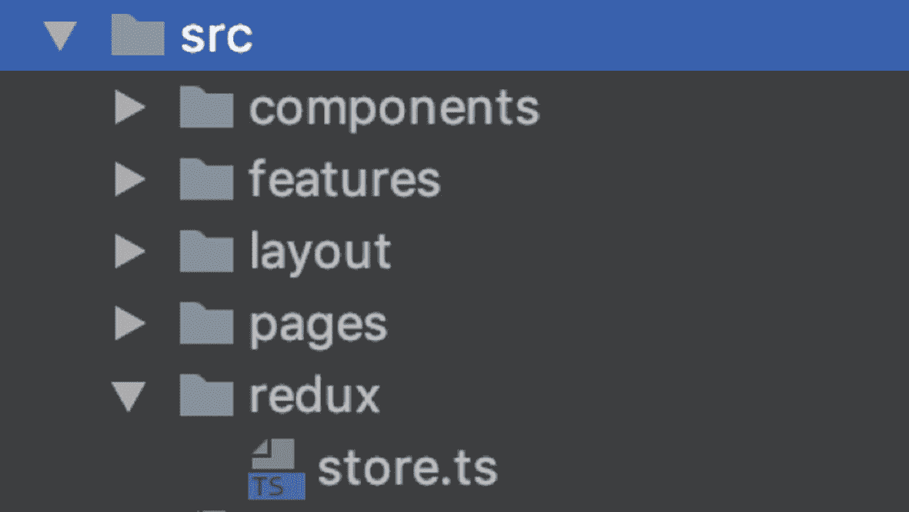

图 2-8

Redux 和 TS 的建议 React 文件夹结构

这是我推荐的开始使用的文件夹结构；但是，请随意使用它作为一个建议。

要遵循此结构，请创建以下文件夹:

*   `src/components`

*   `src/features`

*   `src/layout`

*   `src/pages`

*   `src/redux`

*   `src/recoil/atoms`

如果您使用的是 Mac，您可以在终端中使用这个一行程序:

```jsx
$ mkdir src/components src/features src/layout src/pages src/redux src/recoil/atoms

```

#### 生成模板

作为开发人员，我们不喜欢一遍又一遍地写代码。是我们可以使用的有用工具。它是基于模板的，所以我们不需要一遍又一遍地写代码。

如果您来自 Angular，您可能会喜欢 Angular CLI，它可以为您的项目生成模板。

您可以在 React 中以类似的方式使用`generate-react-cli`项目生成项目模板。为了安装，我们将使用 NPX 任务脚本。

```jsx
$ npx generate-react-cli component Header

```

因为这是第一次运行这个脚本，它会用您第一次使用这个工具时选择的选项来安装和创建`generate-react-cli.json`,但是您可以随意手动更改这些选项。

一个很酷的功能是我们可以创建自己的模板。下面是一个为 React 页面创建自定义模板的示例。

此时不要深究模板代码。我们只是设置这些模板，我们将在下一章构建我们的组件时检查代码及其含义。

将`generate-react-cli.json`改为指向我们将要创建的模板文件。

```jsx
{
  "usesTypeScript": true,
  "usesCssModule": false,
  "cssPreprocessor": "scss",
  "testLibrary": "Enzyme",
  "component": {
    "default": {
      "path": "src/components",
      "withStyle": true,
      "withTest": true,
      "withStory": false,
      "withLazy": false
    },
    "page": {

      "customTemplates": {
        "component": "templates/page/component.tsx",
        "style": "templates/page/style.scss",
        "test": "templates/page/test.tsx"
      },
      "path": "src/pages",
      "withLazy": false,
      "withStory": false,
      "withStyle": true,
      "withTest": true
    },
    "layout": {
      "customTemplates": {
        "component": "templates/component/component.tsx",
        "style": "templates/component/style.scss",
        "test": "templates/component/test.tsx"
      },
      "path": "src/layout",
      "withLazy": false,
      "withStory": false,
      "withStyle": true,
      "withTest": true
    }
  }
}

```

用一个 React 路由和一个到路径名:`templates/component/component.tsx`的钩子为`TypeScript`类页面组件创建一个模板文件。在下一章中，我们将创建一个自定义的 React 组件，这个模板组件将是有意义的。当然可以把作者名改成自己的名字和网址。

```jsx
/*
Author: Eli Elad Elrom
Website: https://EliElrom.com
License: MIT License
Component: src/component/TemplateName/TemplateName.tsx
*/

import React from 'react';
import './TemplateName.scss';
import { RouteComponentProps } from 'react-router-dom'

export default class TemplateName extends React.PureComponent<ITemplateNameProps, ITemplateNameState> {

  constructor(props: ITemplateNameProps) {
    super(props);
    this.state = {

      name: this.props.history.location.pathname.substring(
        1,
        this.props.history.location.pathname.length
      ).replace('/', '')
    }
  }

  // If you need 'shouldComponentUpdate' -> Refactor to React.Component
  // Read more about component lifecycle in the official docs:
  // https://reactjs.org/docs/react-component.html

  /*
  public shouldComponentUpdate(nextProps: IMyPageProps, nextState: IMyPageState) {
    // invoked before rendering when new props or state are being received.
    return true // or prevent rendering: false
  } */

  static getDerivedStateFromProps:
    React.GetDerivedStateFromProps<ITemplateNameProps, ITemplateNameState> = (props:ITemplateNameProps, state: ITemplateNameState) => {
    // invoked right before calling the render method, both on the initial mount and on subsequent updates
    // return an object to update the state, or null to update nothing.
    return null
  }

  public getSnapshotBeforeUpdate(prevProps: ITemplateNameProps, prevState: ITemplateNameState) {
    // invoked right before the most recently rendered output is committed
    // A snapshot value (or null) should be returned.
    return null
  }

  componentDidUpdate(prevProps: ITemplateNameProps, prevState: ITemplateNameState, snapshot: ITemplateNameSnapshot) {
    // invoked immediately after updating occurs. This method is not called for the initial render.
    // will not be invoked if shouldComponentUpdate() returns false.
  }

  render() {
    return (

      <div className="TemplateName">
        {this.state.name} Component
      </div>)
  }
}

interface ITemplateNameProps extends RouteComponentProps<{ name: string }> {
  // TODO
}

interface ITemplateNameState {
  name: string
}

interface ITemplateNameSnapshot {
  // TODO
}

```

创建一个 SCSS 文件模板:`templates/component/style.scss`。

```jsx
.TemplateName {
  font-family: 'Open Sans', sans-serif;
  font-weight: 700;
}

```

用酶创建一个测试文件:`templates/component/test.tsx`。

```jsx
import React from 'react'
import { shallow } from 'enzyme'
import TemplateName from './TemplateName'

describe('<TemplateName />', () => {
    let component

    beforeEach(() => {
        component = shallow(<TemplateName />)
    });

    test('It should mount', () => {
        expect(component.length).toBe(1)
    })
})

```

此时，你应该有一个模板文件夹，里面的文件如图 [2-9](#Fig9) 所示。

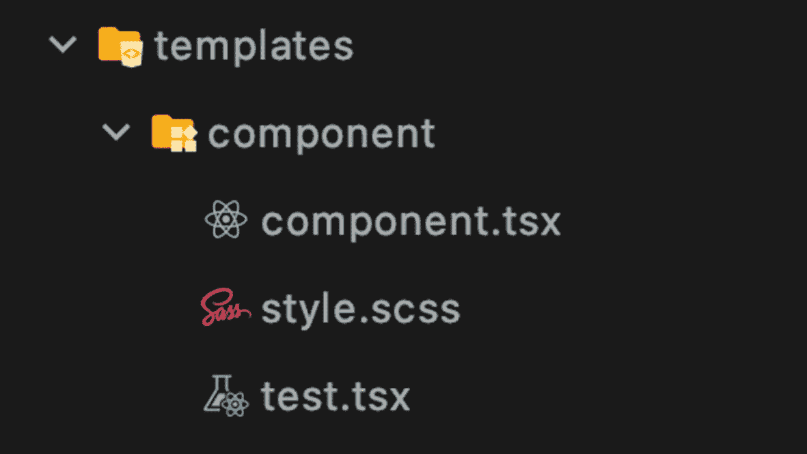

图 2-9

模板文件夹结构和文件

您可以对类型页面的组件或任何您喜欢的组件重复相同的步骤。

#### 林挺:埃斯林特和更漂亮

进行代码审查，并让别人格式化你的代码以确保它的一致性，这有多好？

> *任何代码库中的所有代码都应该看起来像是一个人输入的，不管有多少人贡献。*
> 
> ——瑞克·瓦德伦，约翰尼-五
> 
> 的创造者

幸运的是，这是可以做到的。

Lint 是一个分析代码的工具。它是一个静态代码分析工具，用来识别在代码中发现的有问题的模式。漂亮是一个固执己见的代码格式化程序。

Note

林挺是运行程序来分析您的代码以发现潜在错误的过程。

Lint 工具可以分析您的代码，并警告您潜在的错误。为了让它工作，我们需要用特定的规则来配置它。

争论每一行或一个制表符中是否应该有两个空格，应该有单引号还是双引号等等是不明智的。这个想法是有某种风格指南，并遵循它的一致性。正如有人说得好:

> *关于风格的争论毫无意义。应该有一个风格指南，你应该遵循它。*
> 
> —丽贝卡·墨菲

作为其风格指南的一部分，Airbnb 提供了一个 ESLint 配置，任何人都可以将其用作标准。

ESLint 已经安装在 Create-React-App 上，但它没有使用样式指南和 TypeScript 进行优化。

要使用 Airbnb 的样式指南(被认为是标准的)用 ESLint 和 Prettier for TypeScript 设置您的项目，请使用以下内容:

```jsx
$ yarn add -D --save-exact eslint-config-airbnb eslint-config-airbnb-TypeScript eslint-config-prettier eslint-config-react-app eslint-import-resolver-TypeScript eslint-loader eslint-plugin-flowtype eslint-plugin-import eslint-plugin-jsx-a11y eslint-plugin-react eslint-plugin-react-hooks babel-eslint eslint-plugin-jest @TypeScript-eslint/parser @TypeScript-eslint/eslint-plugin$ yarn add -D --save-exact prettier prettier-eslint prettier-eslint-cli eslint-plugin-prettier

```

阅读我的文章( [`https://medium.com/react-courses/react-create-react-app-v3-4-1-a55f3e7a8d6d`](https://medium.com/react-courses/react-create-react-app-v3-4-1-a55f3e7a8d6d) )了解更多信息。

按照`shorturl.at/otuU8`的指示更新以下文件，或者从 CRA·MHL 模板项目中复制它们。

我们将配置三个文件。

*   `.eslintrc` : ESLint 运行命令配置文件。

*   `.eslintignore`斯洛文尼亚语忽略文件

*   `.prettierrc`:漂亮运行命令配置文件

最后，我们可以更新`package.json`文件的运行脚本，这样我们就可以运行 Lint 和 format 实用程序，甚至只用一个命令就可以运行应用构建(我们将在本书后面介绍的生产构建)。

```jsx
"scripts": {
    ..
    ..
    ..
    "lint": "eslint --ext .js,.jsx,.ts,.tsx src --color",
    "format": "prettier --write 'src/**/*.{ts,tsx,scss,css,json}'",
    "isready": "npm run format && npm run lint && npm run build"
}

```

我们已经准备好让 Lint 完成它的工作并修改我们的代码(见图 [2-10](#Fig10) )。

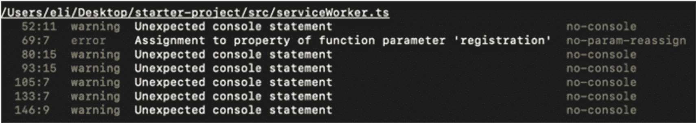

图 2-10

运行 Lint 后的输出

```jsx
$ yarn run lint

```

为了运行格式化程序来清理我们的代码，我们也可以使用 Yarn。

```jsx
$ yarn run format

```

现在，通过检查端口 3000 或运行`yarn start`确认我们仍然可以编译，如果你停止了进程(见图 [2-11](#Fig11) )。

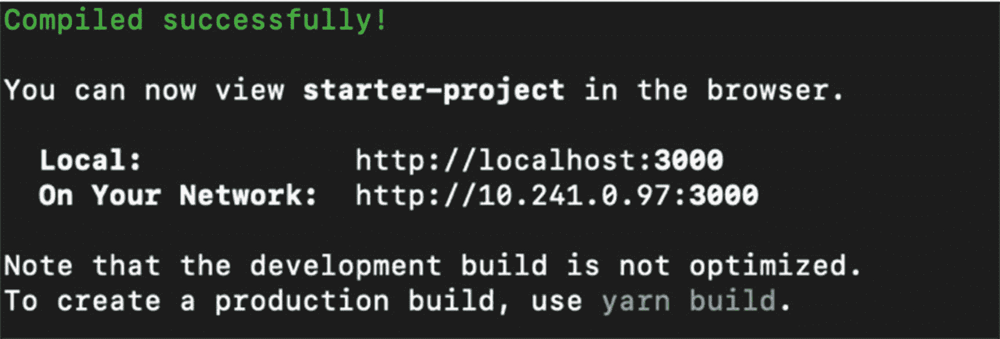

图 2-11

格式化并林挺后编译我们的代码

```jsx
$ yarn start

```

#### 其他有用的库

我们将安装几个有用的库，它们将在本书后面的开发练习中派上用场。

##### 同学们

Classnames ( [`https://github.com/JedWatson/classnames`](https://github.com/JedWatson/classnames) )是一个简单的 JavaScript 实用程序，用于有条件地将`classNames`连接在一起。

```jsx
$ yarn add -D classnames @types/classnames

```

下面是它的用法示例:

```jsx
import classNames from 'classnames'
const footerClasses = classNames('foo', 'bar') // => 'foo bar'

```

##### 属性类型

Prop-types 是一个很棒的小工具( [`https://github.com/facebook/prop-types`](https://github.com/facebook/prop-types) )，用于 React 属性和类似对象的运行时类型检查。我们正在用 TypeScript 设置我们的 starter 项目，所以我们真的不需要*T4 这个工具，因为我们将传递 TypeScript 对象并进行类型检查。然而，仅仅因为我们使用 TS 并不意味着我们永远不需要 JS。有些情况下，比如从一个不同的项目中导入一个组件，我们可能需要这个小工具。*

```jsx
$ yarn add -D prop-types

```

您可以从这里下载代码:

```jsx
https://github.com/Apress/react-and-libraries/tree/master/01/starter-project

```

下面是它的用法示例:

```jsx
import PropTypes from "prop-types";
whiteFont: PropTypes.bool

```

要让 Yarn 使用`package.json`并下载所有依赖项，运行以下命令:

```jsx
$ yarn start

```

#### 其他有用的实用程序

以下是一些附加的有用实用程序:

*   *Lodash* ( [`https://github.com/lodash/lodash`](https://github.com/lodash/lodash) ):这让 JS 变得更容易，因为它免去了处理数组、数字、对象、字符串等的麻烦。

*   *时刻* ( [`https://github.com/moment/moment`](https://github.com/moment/moment) ):对于与日期打交道的人来说，这是必备的。

*   *发球* ( [`https://github.com/vercel/serve`](https://github.com/vercel/serve) ):用`$ yarn add serve`安装这个。它添加了一个本地服务器。CRA 脚本包括发布应用的运行脚本。它会生成一个名为`build`的文件夹。我们希望能够在投入生产之前测试我们的构建代码。您将在后面的章节中了解更多关于生产构建的内容。

*   *Precache React-snap 离线工作*:这是一个优化库，我们将使用它来配置我们的应用离线工作。参见第十一章。

*   *react-helmet change header metadata*:为 SEO 更新每个页面的一个表头；你会在第 11 章[学到更多。](11.html)

*   *分析器包*:你可以安装`source-map-explorer`和`cra-bundle-analyzer`工具来查看我们的 JS 包块内部(更多内容在第 [11 章](11.html))。

## 摘要

在这一章中，我们学习了 Create-React-App 项目，并用我们将在本书中学习的基本库设置了我们的启动项目和开发环境。我们安装了 CRA·MHL 模板项目，它已经包含了我们需要的一切，我们还学习了香草 CRA 和 TypeScript 模板。

我们还了解了一些库，如 NPM、Yarn、Webpack、NPM 脚本、TypeScript、萨斯/SCSS、Redux 工具包、Material-UI、样式组件、路由、Jest 和 Enzyme、生成模板、ESLint 和 appelliter 以及其他有用的库。

在下一章，我们将构建 React 定制组件和子组件。