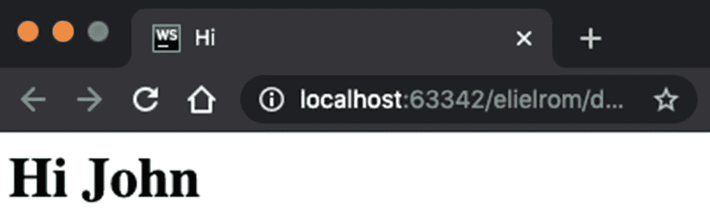
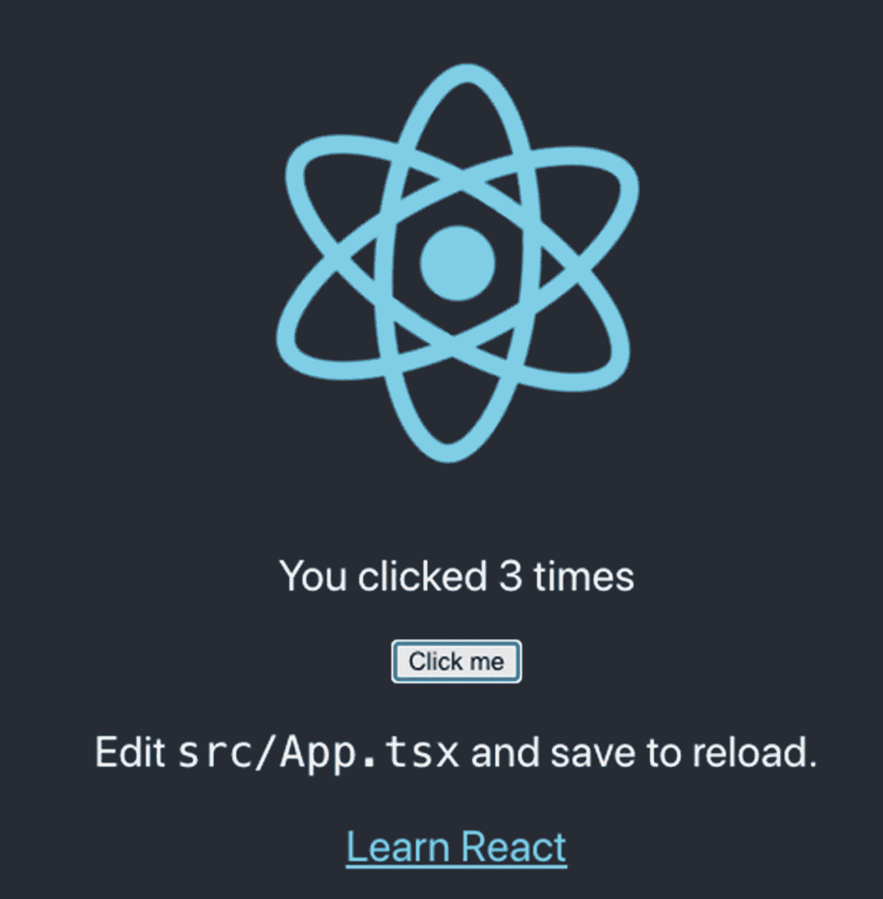
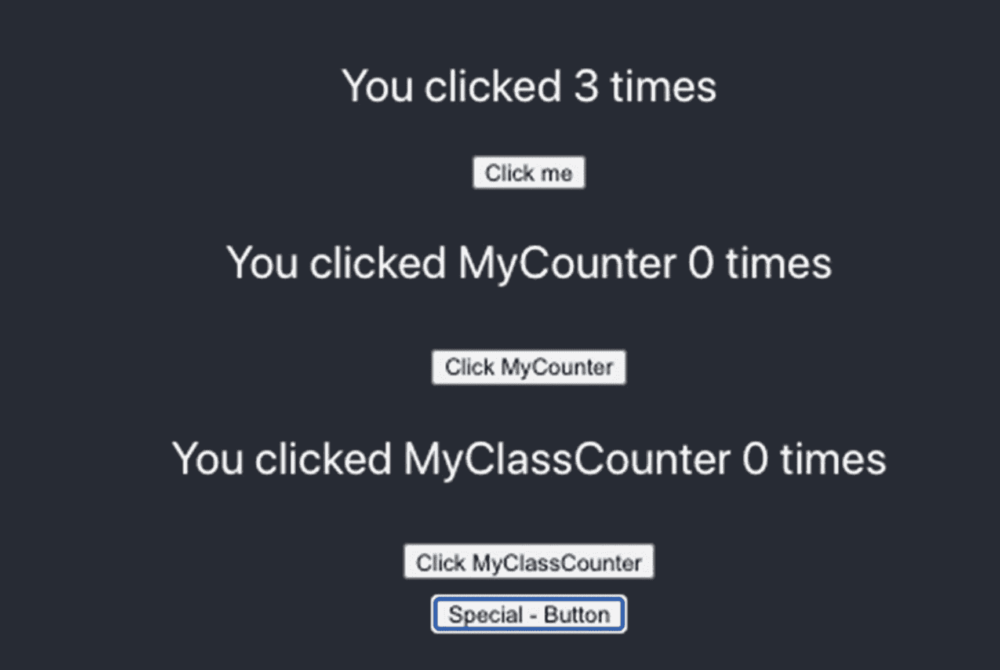

# 三、React 组件

在这一章中，我会给你一个 React 组件的概述，以及你可以在 React 中用它们做什么。您需要理解 React 组件是什么，因为它们是 React 的核心。

在前面的章节中，我们创建了我们的第一个 React 项目，我们设置了我们的环境，我们创建了一个 starter 项目，它包括了我们将在本书中使用的许多库。

我们的简单项目已经包含了组件和子组件。在本章中，我们将更深入地研究组件，并创建更复杂的组件和子组件。我们还将查看相关的库，它们可以帮助我们加速开发以及维护我们的项目。

## 什么是 React 组件？

React 组件类似于函数。它们允许您通过将复杂的 UI 分解成独立的小块来构建前端实现。事实上，React 的核心只不过是协调工作的组件的集合。看看 React.org 对组件是怎么说的:

> *组件让你将用户界面分割成独立的、可重用的部分，并孤立地考虑每一部分。【—React.org 文档】*
> 
> ， [`https://reactjs.org/docs/components-and-props.html`](https://reactjs.org/docs/components-and-props.html)

有三种类型的组件。

*   功能组件

*   类别组件

*   工厂组件

    以正确的方式编写组件可以帮助您降低应用的复杂性，确保您为工作选择正确的组件类型，避免缺陷，并提高性能。

本节分为以下几个部分:

*   JavaScript (JS)函数和类组件

*   TypeScript (TS)函数和类组件

*   外来组件，如工厂组件

*   复杂的 TS 工厂组件

*   `React.PureComponent`对`React.Component`

### JavaScript 函数和类组件

函数组件(也叫*功能性无状态组件*)无非就是 JavaScript 函数。它们与函数式编程(FP)携手并进。FP 意味着用纯功能构建我们的软件，避免共享状态、可变数据和副作用。

FP 是声明性的而不是命令性的，应用状态流过纯函数。因为 React 是一种声明式语言(它实际上并不直接操纵 DOM 本身)，所以它与 React 集成得很好，因为我们希望使用声明式架构。

Note

声明式编程是一种表达计算逻辑而不描述其控制流的范式。命令式范式使用改变程序状态的语句，比如直接改变 DOM。

如果我们想通过在 HTML 文件的 JavaScript 标记内创建一个 React 组件来编写最基本的 React 组件，代码应该如下所示。在我们在第 [1](01.html) 章编写的应用中，我们通过在一个带有 JavaScript 标签的 HTML 文件中创建一个 React 组件来编写最基本的 React 组件。

```jsx
<div id="app"></div>
<script type="text/babel">
    ReactDOM.render(
    <h1>Hello World</h1>,
    document.getElementById('app')
    );
</script>

```

以简单的“Hello World”为例，假设我们想要传递用户定义的属性。我们可以设置一个函数并分配一个用户定义的属性，然后将其传递给 React DOM render，作为 JSX 代码执行。请参见以下示例:

```jsx
function WelcomeUser(props) {
    return <h1>Hi {props.userName}</h1>;
}
const element = <WelcomeUser userName="John" />;

ReactDOM.render(
    element,
    document.getElementById('app')
);

```

`props`代表我们传递的属性和 React `Element`返回的函数。这里我们传递一个`userName`，它将显示在我们的用户界面上。

在自己喜欢的浏览器中打开这个例子，如图 [3-1](#Fig1) 所示。



图 3-1

WelcomeUser.html 输出示例

您可以从 GitHub 网站下载该代码。

```jsx
https://github.com/Apress/react-and-libraries/tree/master/03/ WelcomeUser.html

```

#### JavaScript 功能组件

当我们编写组件时，我们通常不会使用一个组件，而是将子组件包含在父组件中。

我们可以看到，例如，在创建-React-应用(CRA)。`App`子组件嵌套在我们的主组件索引中。

```jsx
ReactDOM.render(<App />, document.getElementById('root'))

```

然后，我们可以创建一个子组件，并用纯 JavaScript 编写子组件。看一下这个基本的例子，它给我们同样的“Hi John”结果，但是这次是在我们的 CRA starter 项目中，而不是在独立的 HTML 页面中:

```jsx
function Welcome(props) {
  return <h1>Hi {props.userName}</h1>;
}

```

#### Javascript 类组件

使用纯 JavaScript 创建一个带有`props`的类组件来产生与`Hello userName`相同的输出是类似的。使用 ES6 语法，产生相同输出的 JS 类组件如下所示:

```jsx
class Welcome extends React.Component {
  render() {
    return <h1>Hi {this.props.userName}</h1>;
  }
}

```

#### React 钩

在函数和类组件中，我们可以使用钩子来访问状态和组件生命周期特性。如果我们通过从 React 导入特性来使用`Hook`函数，那么类组件会扩展`React.Component`。

Note

钩子是允许我们“挂钩”React 状态和生命周期特性的函数。

你可以在 ReactJS.org 网站上找到关于钩子的好资源。

[T2`https://reactjs.org/docs/hooks-overview.html`](https://reactjs.org/docs/hooks-overview.html)

对于下一步，您可以使用您在上一步中创建的`starter-project`,或者使用一个命令重新开始，如下所示:

```jsx
$ yarn create react-app starter-project --template must-have-libraries

```

接下来，我们可以将目录更改为新项目并启动项目。

```jsx
$ cd starter-project
$ yarn start

```

如果端口 3000 没有被另一个应用使用，该应用应该在该端口上运行，换句话说，`http://localhost:3000`。更多细节请参考上一章。

CRA 生成了一个名为`src/index.tsx`的组件，它将另一个组件应用封装在 React 渲染函数中。

```jsx
ReactDOM.render(
  <React.StrictMode>
    <App />
  </React.StrictMode>,
  document.getElementById('root')
)

```

如果我们查看`src/App.tsx`子组件，我们会发现 JSX 代码，它包括我们运行纱线启动脚本(`yarn start`)时看到的代码。

```jsx
import React from 'react'

function App() {

  return (
    <div className="App">
    ..
    </div>
  )
}

export default App

```

如果我们想利用 React 的状态特性，我们需要从 React 库中导入`useState`特性。

```jsx
import {useState} from 'react'

```

接下来，我们可以在函数组件中编写 JSX 代码，该代码将呈现一个按钮，该按钮在单击事件时将增加计数器的值。计数器变量就是我们的`state`。

```jsx
function App() {
  const [count, setCount] = useState(0);
  return (
  ..
  ..
  <p>You clicked {count} times</p>
  <button onClick={() => setCount(count + 1)}>
    Click me
  </button>
  ..
  ..
  )
}

export default App

```

`useState`是状态挂钩；它返回一个带有应用当前状态的状态，在本例中，是我们的计数器的状态(`count`)。注意，还有第二个参数，它是一个更新状态的函数(`setCounter`)。

一旦用户点击按钮，我们调用函数通过`setCounter`更新应用的状态，在那里我们可以增加`Count` + 1 的值。这将更新变量 count，使值增加 1。使用`reflection {count}`，段落标签中的数据会出现在用户界面上。

`src/App.tsx`的完整更新代码将如下所示:

```jsx
import React, { useState } from 'react'
import logo from './logo.svg'
import './App.scss'

function App() {
  const [count, setCount] = useState(0)
  return (
    <div className="App">
      <header className="App-header">
        
        <p>You clicked {count} times</p>

        <button type="submit" onClick={() => setCount(count + 1)}>
          Click me
        </button>

        <p>
          Edit <code>src/App.tsx</code> and save to reload.
        </p>
        <a
          className="App-link"
          href="https://github.com/EliEladElrom/react-tutorials"
          target="_blank"
          rel="noopener noreferrer"
        >
          Learn React
        </a>
      </header>
    </div>
  )
}

export default App

```

如果你还在运行`yarn start`命令，可以直接进入`http://localhost:3000`页面，你会看到变化(图[3-2](#Fig2))；否则，使用`yarn start`命令。



图 3-2

用计数器状态更新 src/App.tsx

单击该按钮后，您将看到计数器变量按预期发生变化。见图 [3-2](#Fig2) 。

### TypeScript 组件

目前为止一切顺利。我们能够创建 JavaScript 函数和类组件。注意，在前面的例子中，我们使用了一个`.tsx`文件扩展名；然而，我们并没有真正编写任何特定的 TypeScript 代码。代码仍然是好的。

在本书中，我们用 TypeScript 建立了我们的项目。使用函数和类组件类似于我们用`ES6`类设置 JavaScript 函数的方式；但是，除了类型检查之外，还有其他特定于语法的方法，这些方法是 TypeScript 所独有的。让我们来看看。

#### 纯函数

这是 React 的核心。FP 是声明性的而不是命令性的，应用状态流过纯函数。因为 React 是一种声明性语言(它实际上并不直接操纵 DOM 本身)，所以我们希望 React 组件是纯函数。

举个例子:

```jsx
const Component = (props: IProps) =>
  render() {
    return
  }
}

```

它可以编译和工作，但不理想，因为它不纯。要把它变成一个纯组件，就像这样写你的纯函数:

```jsx
const Component = (props: IProps) =>

```

#### 有副作用的纯函数

Note

副作用是在被调用函数之外可以观察到的状态变化，而不是它的返回值。副作用的例子包括:改变外部变量或对象属性(全局变量，或父函数作用域链中的变量)的值，没有说明符的导入语句(即，import someLib)，登录到控制台，获取数据，设置订阅，或手动改变 DOM。

我们的纯函数可以处理副作用(也称为*效果*)。为了做到这一点，我们将副作用包装在`useEffect`中，并确保它们不会在每次更改时都呈现出来。例如，查看下面的组件，滚动到使用浏览器 API 的顶部:

```jsx
export default function ScrollToTop() {
  const { pathname } = useLocation()
   useEffect(
    () => () => {
      try {
        window.scrollTo(0, 0)
    },
    [pathname]
  )
  return null
}

```

#### TypeScript 函数组件

对于 TypeScript，我们可以指定我们的`props`接口的类型。我们可以使用`useState`功能，就像我们对纯 JavaScript 示例所做的那样。

```jsx
// src/components/MyCounter/MyCounter.tsx

import React, { useState } from 'react'

export const MyCounter: React.FunctionComponent<IMyCounterProps> = (props: IMyCounterProps) => {
  const [count, setCount] = useState(0)
  return (

      <p>You clicked MyCounter {count} times</p>
      <button type="submit" onClick={() => setCount(count + 1)}>Click MyCounter</button>

  )
}
interface IMyCounterProps {
  // TODO
}

```

你可以从 GitHub 下载这个。

```jsx
https://github.com/Apress/react-and-libraries/tree/master/03/starter-project/src/components/MyCounter/MyCounter.tsx

```

Tip

在 JSX，`<div></div>`相当于`<></>`。

现在我们可以将这个子组件包含在我们的`src/App.tsx`组件中。

```jsx
import {MyCounter} from './components/MyCounter/MyCounter'

function App() {

  return (
      <div classname="App">
        <header className="App-header">
        ...
        <MyCounter />
        ...
        </div>
      </div>
  )
}

```

这将产生图 [3-3](#Fig3) 中的结果。


图 3-3

用 MyCounter 子组件更新了 src/App.tsx

#### TypeScript 类组件

要创建与`MyCounter`中相同的子组件作为 TypeScript 类，我们不需要使用`useState`方法。

相反，我们可以创建一个状态接口(`IMyClassCounterState`)，并将变量 count 设置为类型号。

然后在构造函数中，我们设置初始组件状态。我们可以将计数器设置为零。

最后，当我们需要改变组件的状态时，我们可以使用`this.setState`函数并更新我们的计数器。点击此处查看完整代码:

```jsx
// src/components/MyCounter/MyClassCounter.tsx

import React from 'react'

export default class MyClassCounter extends React.Component<IMyClassCounterProps, IMyClassCounterState> {
  constructor(props: IMyClassCounterProps) {
    super(props)
    this.state = {
      count: 0,
    }
  }

  render() {

    return (
      <div>
        <p>You clicked MyClassCounter {this.state.count} times</p>
        <button type="submit" onClick={() => this.setState({ count: this.state.count + 1 })}>
          Click MyClassCounter
        </button>
      </div>
    )
  }
}

interface IMyClassCounterProps {
  // TODO
}

interface IMyClassCounterState {
  count: number
}

```

这段代码可以从 GitHub 下载。

```jsx
https://github.com/Apress/react-and-libraries/tree/master/03/starter-project/src/components/MyClassCounter/MyClassCounter.tsx

```

要在我们的用户界面中查看这些变化，请在`src/App.tsx`组件中包含我们的子组件，这样我们就可以直观地看到我们的子组件(图 [3-4](#Fig4) )。


图 3-4

用 MyClassCounter 子组件更新了 src/App.tsx

```jsx
import { MyCounter } from './components/MyCounter/MyCounter'
import MyClassCounter from './components/MyCounter/MyClassCounter'

function App() {
  const [count, setCount] = useState(0)
  return (
    <div className="App">
      <header className="App-header">
        ...
        <p>You clicked {count} times</p>
        <MyCounter />
        <MyClassCounter />
        ...
      </header>
    </div>
  )
}

export default App

```

这个例子很好，但是这里有一个问题。运行我们在项目中设置的 linter 来检查潜在的编码错误。

```jsx
$ yarn lint

```

当引用以前的状态时，您将得到一条错误消息`error Use callback in setState`。

```jsx
starter-project/src/components/MyCounter/MyClassCounter.tsx
 15:69 error Use callback in setState when referencing the previous state react/no-access-state-in-setstate
✖ 1 problem (1 error, 0 warnings)

```

在 React 中使用状态时，我们可以通过基于以前的状态更新当前状态来简化我们的代码，对于许多用例，代码将按预期编译和工作；然而，这实际上破坏了 React 架构，应该避免。

让我们修改我们的代码。

```jsx
// src/components/MyCounter/MyClassCounter.tsx

  handleClick(e: React.MouseEvent) {
    this.setState(prevState => {
      const newState = prevState.count+1
      return ({
        ...prevState,
        count: newState
      });
    })
  }

  render() {
    return (

      <div>
        <p>You clicked MyClassCounter {this.state.count} times</p>
        <button type="submit" onClick={this.handleClick}>
          Click MyClassCounter
        </button>
      </div>
    )
  }
}

```

再次运行 Lint，我们现在没有错误了。

```jsx
$ yarn lint
yarn run v1.22.10
$ eslint — ext .js,.jsx,.ts,.tsx ./
 Done in 7.31s.

```

阅读我的文章(`shorturl.at/cmRW0`)了解常见的林挺错误以及如何避免它们。

#### 外来组件:工厂组件

我想谈的最后一类组件是工厂组件。React 允许您创建看起来像功能组件的组件；然而，功能组件使用 React 钩子来访问生命周期事件。

看一下这段代码:

```jsx
function Hello(props) {
  return {
    componentDidMount() {
      alert('wow')
    }
    render() {
      return <div>Hi, {this.props.name}</div>
    }
  };
}

```

您可以在 React 16 中编写代码；但是，在 React 版本 17 中，如果您这样做，代码将生成一个错误消息。

Tip

在 React 17 中，对之前事件如`componentDidMount`的访问被否决了，你应该使用钩子特性来访问组件生命周期事件`getDerivedStateFromProps`、`getSnapshotBeforeUpdate`和`componentDidUpdate`。在本章的后面你会学到更多关于这些钩子的知识。

看看 GitHub 上的问题，React 核心团队要求为使用这种类型组件的开发人员创建一个警告；参见 [`https://github.com/facebook/react/issues/13560`](https://github.com/facebook/react/issues/13560) `.`

#### 复杂 TS 功能组件

扩展功能组件的`props`接口赋予了我们的功能超能力。在这一节中，我将向您展示两个扩展 React Router 和 Material-UI 样式的接口的例子，以及创建您自己的接口扩展。

当扩展一个类时，有三种选择。

*   遗产

*   连接

*   作文

*继承*是指一个类继承了另一个类的特性。一个*接口*只是这个类的签名(蓝图)。*组合*是指创建小功能，然后创建更大更完整的功能，并将两者结合使用。

当我们扩展接口时，最好避免继承，因为对象是接口。

一般来说，当涉及到组件继承时，React 团队提倡尽可能使用复合而不是继承；但是，这里我们做的是`props`继承。`https://reactjs.org/docs/composition-vs-inheritance.html`见。

使用这种类型的模式使我们能够重用代码以及实现纯 JavaScript 或 TypeScript 代码。对于什么是最佳实践有一些不同意见。无论您做什么，您都希望避免大量的样板代码和复杂性，以便您的代码更具可读性和可测试性。

这是一个更大的讨论，超出了本书的范围，但是如果您发现自己需要扩展接口，请注意有几种方法。

### 路由的延伸支柱

如果你还记得在第 [2](02.html) 章中，我们设置了项目以便能够使用`generate-react-cli`库生成项目模板，并且我们设置了一个名为`starter-project/ templates/component/component.js`的定制模板文件。

既然我们已经理解了 React 函数和类组件以及钩子，我们可以再次检查代码。

这里我们有一个类组件，它有两个接口，`ITemplateNameProps`和`ITemplateNameState`。它们尚未实现。

在我们的类内部，我们调用类的构造函数，传递`props`，并设置应用的状态。

父组件将设置属性，我们将设置应用的状态，就像我们对`useState`所做的一样。因为我们扩展了`React.Component`，所以不需要从 React 导入那个特性；我们可以自动使用它。

此外，我们得到这些钩子特征来访问组件生命周期:`getDerivedStateFromProps`、`getSnapshotBeforeUpdate`和`componentDidUpdate`。

这些都与组件被安装、渲染和卸载的顺序有关，如果我们需要做一些操作，比如避免内存泄漏，这些都可以在这里完成。

看一下我们用来为`generate-react-cli`生成组件的模板文件。它包括接口`ITemplateNameProps`，它扩展`RouteComponentProps`以获得组件名称，以及`componentDidUpdate`钩子的`ITemplateNameSnapshot`和状态的接口(`ITemplateNameState`)。你可以在 React 文档中读到何时使用哪个钩子: [`https://reactjs.org/docs/react-component.html`](https://reactjs.org/docs/react-component.html) 。

```jsx
import React from 'react';
import './TemplateName.scss';
import { RouteComponentProps } from 'react-router-dom'

export default class TemplateName extends React.Component<ITemplateNameProps, ITemplateNameState> {

  constructor(props: ITemplateNameProps) {
    super(props);
    this.state = {
      name: this.props.history.location.pathname.substring(
        1,
        this.props.history.location.pathname.length
      ).replace('/', '')
    }
  }

  // Read more about component lifecycle in the official docs:
  // https://reactjs.org/docs/react-component.html

  public shouldComponentUpdate(nextProps: ITemplateNameProps, nextState: ITemplateNameState) {
    // invoked before rendering when new props or state are being received.
    return true // or prevent rendering: false
  }

  static getDerivedStateFromProps:
    React.GetDerivedStateFromProps<ITemplateNameProps, ITemplateNameState> = (props:ITemplateNameProps, state: ITemplateNameState) => {
    // invoked right before calling the render method, both on the initial mount and on subsequent updates
    // return an object to update the state, or null to update nothing.
    return null
  }

  public getSnapshotBeforeUpdate(prevProps: ITemplateNameProps, prevState: ITemplateNameState) {
    // invoked right before the most recently rendered output is committed
    // A snapshot value (or null) should be returned.
    return null
  }

  componentDidUpdate(prevProps: ITemplateNameProps, prevState: ITemplateNameState, snapshot: ITemplateNameSnapshot) {
    // invoked immediately after updating occurs. This method is not called for the initial render.
    // will not be invoked if shouldComponentUpdate() returns false.
  }

  render() {

    return (
      <div className="TemplateName">
        {this.state.name} Component
      </div>)
  }
}

interface ITemplateNameProps extends RouteComponentProps<{ name: string }> {
  // TODO
}

interface ITemplateNameState {
  name: string
}

interface ITemplateNameSnapshot {
  // TODO
}

```

Note

`componentWillMount`、`componentDidUpdate`、`componentWillUpdate`在 React 16.9.0 ( [`https://reactjs.org/blog/2019/08/08/react-v16.9.0.html`](https://reactjs.org/blog/2019/08/08/react-v16.9.0.html) )中被弃用。

`props`接口扩展了`RouteComponentProps`并要求我们传递名称，当我们将这个组件包含在一个`Route`标签中时，名称将从父组件传递过来。你将在本章后面看到这一点。

```jsx
interface ITemplateNameProps extends RouteComponentProps<{ name: string }>

```

然后我们可以通过钩子访问路由 API。

```jsx
this.state = {
            name: this.props.history.location.pathname.substring(1, this.props.history.location.pathname.length)
        }

```

我的父组件需要用`Router`标签包装我的组件。React 路由可以将数据传递给我们的子组件。

```jsx
function AppRouter() {

  return (
    <Router>
        <Switch>
          <Route exact path="/" component={App} />
        </Switch>
        <div className="footer">
        </div>
    </Router>
  )
}

```

#### 扩展材质的属性-用户界面风格

如果我想创建一个使用 Material-UI 的组件，并且我想将样式保存在一个单独的类中，我可以通过用`WithStyles`扩展该类来赋予我的`props`特殊能力，并且`props`类和属性将对我可用。

例如，如果我想创建一个布局组件，它将为其他组件居中显示内容，我可以创建一个名为`Centered.tsx`的组件。

```jsx
// src/layout/Centered/Centered.tsx

import * as React from 'react'
import { withStyles, WithStyles } from '@material-ui/core/styles'
import styles from './Centered.styles'

const CenteredViewInner: React.FunctionComponent<Props> = (props) => (
  <div className={props.classes.container}>{props.children}</div>
)

interface Props extends WithStyles<typeof styles> {}

export const Centered = withStyles(styles)(CenteredViewInner)

```

然后创建一个名为`ClassName.styles.ts`的样式类，供`Centered.tsx`访问。

```jsx
import { createStyles, Theme } from '@material-ui/core/styles'

export default (theme: Theme) =>
  createStyles({
    '@global': {
      'body, html, #root': {
        paddingTop: 40,
        width: '100%',
      },
    },
    container: {
      maxWidth: '400px',
      margin: '0 auto',
    },
  })

```

我们将在本书的后面了解更多关于这种类型的组件。

#### 自己扩展属性继承

为了使用继承来扩展`props`并创建我们自己的组件，我们可以创建一个扩展接口的基类。然后，我们的类将扩展我们的基类子类，并且可以从基类和子类中强制属性。

用一个例子更容易理解。例如，假设我想创建一个自定义按钮。我不用按钮，只是用标签给出按钮的名称。我的自定义按钮叫`SpecialButton`。按钮将使用标签和名称变量向用户显示按钮名称。我需要实现逻辑来处理按钮的名称，并设置一个点击事件，这样用户就可以与我的按钮进行交互。看一下下面的代码:

```jsx
// src/components/SpecialButton.tsx

// eslint-disable-next-line max-classes-per-file
import React from 'react'

interface IBaseProps {
  name: string
}

// eslint-disable-next-line react/prefer-stateless-function
class Base<P> extends React.Component<P & IBaseProps, {}> {
  // TODO
}

interface IChildProps extends IBaseProps {
  label: string
  className: string
  handleClick: () => void
}

export class SpecialButton extends Base<IChildProps> {
  render(): JSX.Element {

    return (
      <div>
        <button type="submit" className={this.props.className} onClick={this.props.handleClick}>
          {this.props.label} - {this.props.name}
        </button>
      </div>
    )
  }
}

```

Notice

我在两个地方禁用 Lint，因为我们将 Lint 设置为每个类只有一个类。这只是为了举例说明，所以我想保持简单。对于生产代码，这应该分解成两个文件，每个文件包含一个类。

现在，为了实现我们的`SpecialButton`，我们的父组件需要传递类名、标签、名称和事件处理程序。看一看:

```jsx
<SpecialButton
  className='specialButton'
  label='Special'
  name='Button'
  handleClick={() => setCount(count + 1)}
/>

```

我们可以将这段代码放在`App.tsx`中。由于我的事件处理程序被放在保存计数状态的`App.tsx`代码中，它将在我们特殊按钮的每次点击中增加状态，如图 [3-5](#Fig5) 所示。



图 3-5

src/App.tsx 更新了特殊按钮子组件

在这一节中，我们将使用 JavaScript 和 TypeScript 创建函数和类组件。我们还学习了如何扩展`prop`接口来实现特定的功能。

理解函数和类组件有助于我们知道何时使用什么。如果我们出于各种原因(比如清理和设置)需要完全访问 React 组件生命周期事件，那么使用类组件是明智的。当我们不需要设置完整的钩子时，功能组件应该被更多地使用。使用 TypeScript 有助于我们防止错误数据的渗入，并且在测试过程中会派上用场。

#### 尽可能使用纯组件

最后但同样重要的是，在前面的例子中，我们在创建类组件时使用了`React.Component`。它让我们可以访问组件的`shouldComponentUpdate`。但是，请记住，有两种选择。

*   `React.Component`:见 [`https://reactjs.org/docs/react-api.html#reactcomponent`](https://reactjs.org/docs/react-api.html%2523reactcomponent) 。

*   `React.PureComponent`:见 [`https://reactjs.org/docs/react-api.html#reactpurecomponent`](https://reactjs.org/docs/react-api.html%2523reactpurecomponent) 。

不需要`shouldComponentUpdate`的时候，用`PureComponent`代替比较好。

```jsx
extends React.PureComponent

```

`React.PureComponent`在某些情况下提供了性能提升，但代价是失去了`shouldComponentUpdate`生命周期。你可以在 React 文档( [`https://reactjs.org/docs/react-api.html#reactpurecomponent`](https://reactjs.org/docs/react-api.html%2523reactpurecomponent) )中了解更多。

这里有一个例子:

```jsx
import React from 'react'
import './MyPage.scss'
import { RouteComponentProps } from 'react-router-dom'
import Button from '@material-ui/core/Button
export default class MyPage extends React.PureComponent<IMyPageProps, IMyPageState> {
  constructor(props: IMyPageProps) {
    super(props)
    this.state = {
      name: this.props.history.location.pathname
        .substring(1, this.props.history.location.pathname.length)
        .replace('/', ''),
      results: 0
    }
  }
  render() {
    return (
      <div className="TemplateName">
        {this.state.name} Component
      </div>)
    )
  }
}
interface IMyPageProps extends RouteComponentProps<{ name: string }> {
  // TODO
}
interface IMyPageState {
  name: string
  results: number
}

```

#### 重新-重新-重新-重新渲染

也就是说，有时需要使用`shouldComponentUpdate`,因为我们可以使用该方法让 React 知道该组件不受父组件状态变化的影响，并且不需要重新呈现。

```jsx
public shouldComponentUpdate(nextProps: IProps, nextState: IState) {
  return false // prevent rendering
}

```

## 摘要

在这一章中，我们讲述了 React 组件基础知识，并转移到更复杂的练习。我们看了 JS 和 ts 函数和类组件、外来组件、复杂的 TS 函数组件等等。

理解函数和类组件有助于我们知道何时使用什么。如果我们出于各种原因(比如清理和设置)需要完全访问 React 组件生命周期事件，那么使用类组件是明智的。当我们不需要完整的钩子设置时，功能组件应该被更多地使用。使用 TypeScript 有助于我们防止错误的数据进入，并且在测试过程中会派上用场。

在学习编写组件的方法时，您了解了如何使用 React 挂钩、避免副作用以及扩展`prop`接口。

在下一章，我们将学习 React 路由和 Material-UI 框架。