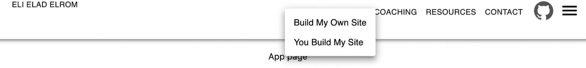
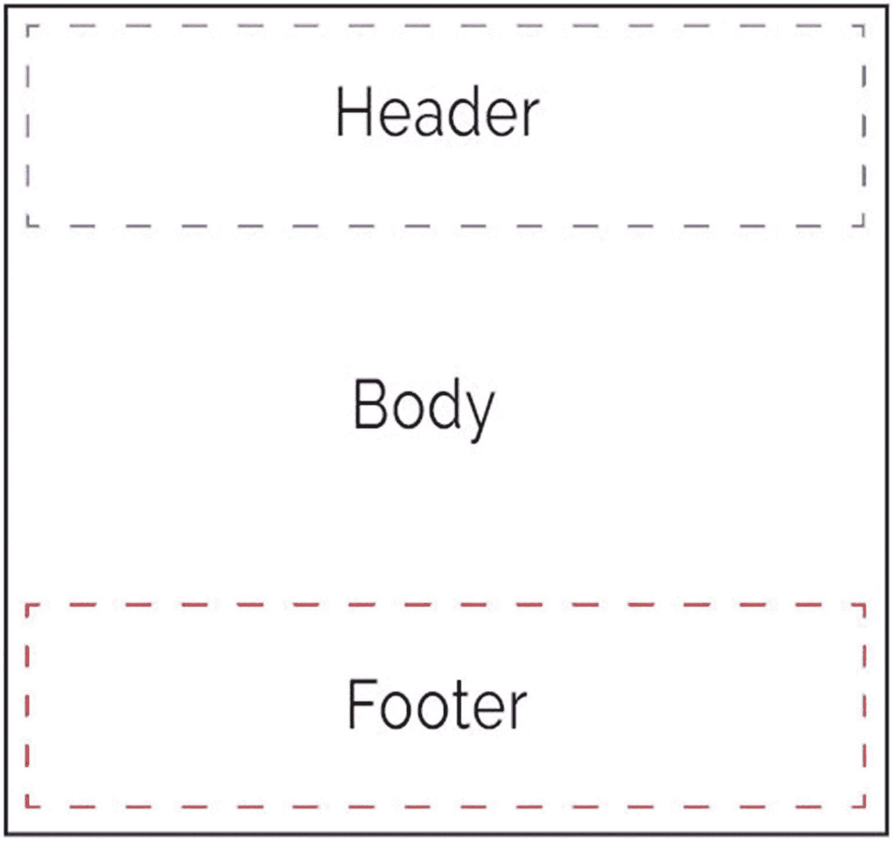
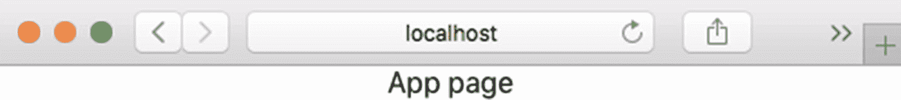
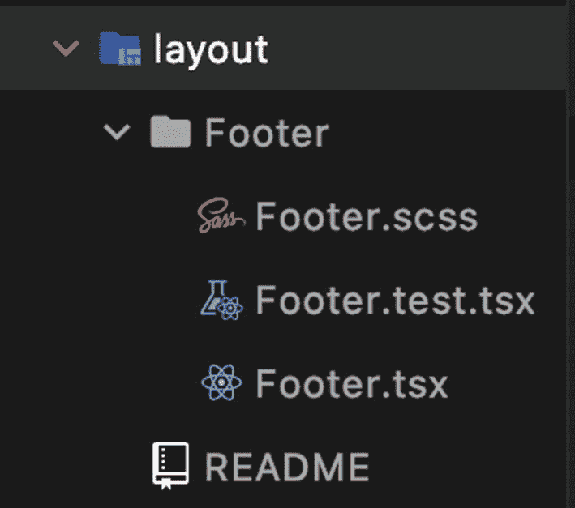
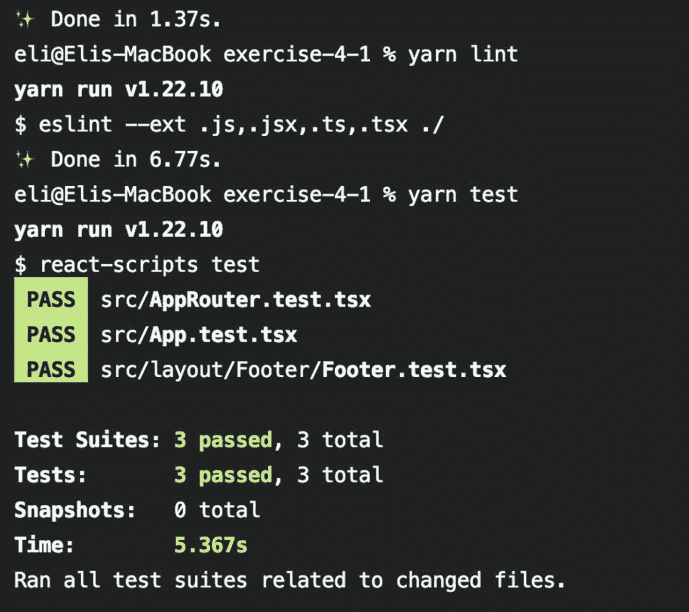
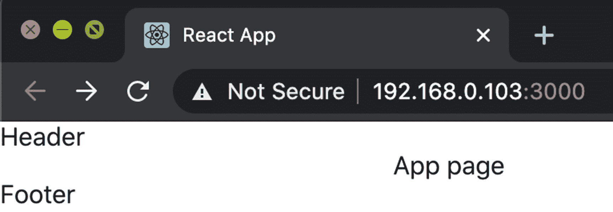
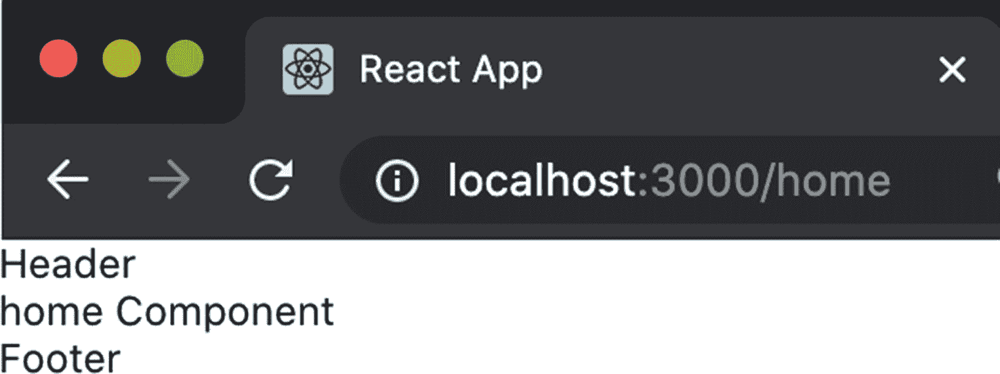
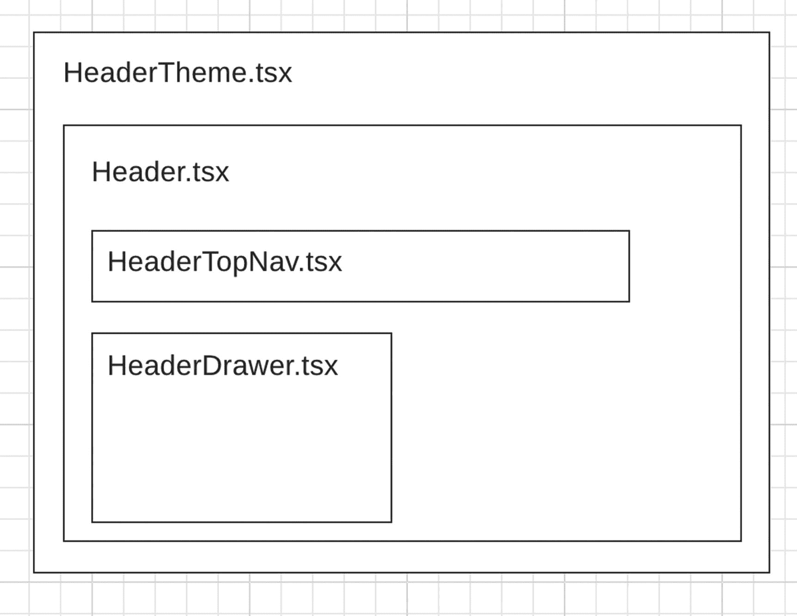
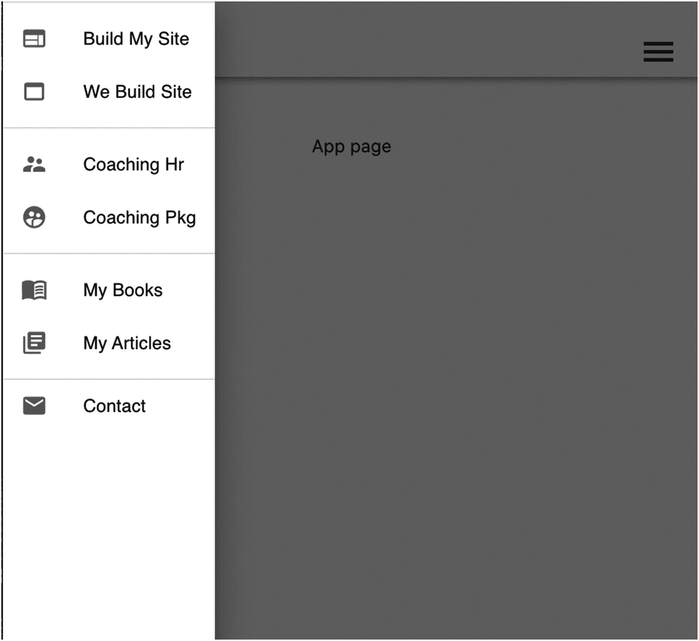

# 四、React 路由和材质——用户界面

在这一章中，你将学习如何集成两个有用的库来帮助你加速开发工作，并使你的代码更具可读性、可测试性和可维护性。它们是 React 路由和材质界面。

在本书中，我们将创建一个功能完整的应用，测试它的一部分，甚至将其发布到生产中。该应用将是一个销售产品的网站，有一个登录的会员区和许多应用中常见的其他元素。

在本章中，我们将通过做两个练习来开始这个应用项目。具体来说，我们将创建一个包含顶部菜单的可用项目，然后我们将添加下拉菜单和一个抽屉。

图 [4-1](#Fig1) 显示了完成本章后的最终结果。在接下来的章节中，我们将继续添加更多的子组件、样式表和其他库。在了解 React 的所有库和元素的同时，我们将继续构建我们的应用。



图 4-1

第 [4 章](04.html)的最终 app 结果

## 集成 React 路由

在本章的这一节，我们将集成一个大多数应用都需要的共同特性:路由。我们将把 React 路由的最新版本 v5.2.0 集成到 React TypeScript 项目中。

### 我们为什么需要路由？

我们为什么需要路由呢？React 不就是一个单页范例吗？在 React 的单页面应用(SPA)范式中，大多数应用都需要多个视图。即使您的应用很简单，没有很多组件，如果它只是一个不需要更改的单个网页，或者如果它可以内置到一个单一的主要组件中，在未来可能会发生变化，所以最好在项目的早期阶段将路由代码集成到应用中。

在单个组件上构建应用并不理想，因为代码和复杂性会增加，维护和测试会成为开发人员的噩梦。

如果你还记得第一章[中的内容，我们在 React 中看到了 DOM 操作是如何发生的。通过 DOM 上的`getElementById`和`removeChild`等方法动态改变网页的内容。](01.html)

我们在路由过程中真正做的是在 React 中使用一个单页应用，并使用 React 虚拟 DOM 在浏览器中动态切换不同的树对象。与传统的 HTML 范式相比，这种变化发生得更快，因为实际的 DOM 上只更新变化。

在这个“协调”过程中，React 会计算出哪些对象在不同的过程中发生了变化。然后 React 只更新“真正的”HTML DOM 中需要更改的对象。这加快了进程。

在本节中，我将向您展示如何使用最新版本的 React Router with TypeScript 并实现路由。

Note

React 是基于 SPA 的概念构建的，但是大多数应用实际上都是使用多个视图构建的。

要实现路由，您可以从一些流行的选项中进行选择。以下是最流行的路由库:

*   React 路由

*   路由 5

*   冗余优先路由

*   到达路由

到达路由(也称为`@reach/route`)适用于数量较少的路由，并且应该可以在 React 路由和到达路由之间轻松地来回迁移。实际上，Reach 路由和 React 路由是由同一个团队打造的。React 路由被认为是必知的，是 GitHub 上最受欢迎的项目，有超过 61，000 颗星。

请注意，React Router 在版本 v5.x.

> *中发生了巨大的变化。“随着钩子的引入，React 从根本上改变了我们编写状态和行为的方式，我们希望利用它。”*
> 
> —Ryan Florence，React Training 联合创始人/首席执行官

React Router 的好处包括性能和将 API 暴露给 React 挂钩，如`location`和`navigate`挂钩。

您可以在 [`https://reacttraining.com/blog/reach-react-router-future/`](https://reacttraining.com/blog/reach-react-router-future/) 了解更多关于 React 路由的信息。你也可以在 [`https://reactrouter.com/web/api/`](https://reactrouter.com/web/api/) 查看 React API。

### 如何将 React 路由集成到 ReactJS 项目中？

我们将把这个过程分成两步。

*   第一步:搭建，在这里我们创建菜单和页面

*   *步骤 2* :显示视图，在这里我们创建路由逻辑和链接

### 第一步:脚手架

我们将把我们的应用分成页眉、正文和页脚。见图 [4-2](#Fig2) 。



图 4-2

将我们的应用分成页眉、页脚和正文

我们还将包括一个抽屉菜单，将打开一个菜单图标。我们开始吧。

使用`must-have-libraries`创建一个新的 CRA 项目，并将其命名为练习-4-1。

```jsx
$ yarn create react-app exercise-4-1 --template must-have-libraries

```

接下来，我们可以将目录更改为新项目并启动项目。

```jsx
$ cd exercise-4-1/
$ yarn start

```

您可以在这里找到并下载本练习的完整代码:

```jsx
https://github.com/Apress/react-and-libraries/exercise-4-1

```

首先，我们将修改`src/App.tsx`来显示一个`div`，它将输出“应用页面”而不是默认的 CRA 欢迎页面。稍后，当我们设置路由时，我们将在路由中使用该页面。新的`App.tsx`页面将如下所示:

```jsx
// src/App.tsx

import React from 'react'
import './App.scss'

function App() {
  return (
    <div className="App">
      <div>App page</div>
    </div>
  )
}

export default App

```

由于`index.tsx`组件已经包含了`App`子组件，如果您运行`yarn start,`，您应该会看到我们所做的更改。见图 [4-3](#Fig3) 。



图 4-3

将 App.tsx 更改为输出“应用页面”后我们的应用

我们将使用 CRA MHL 附带的`generate-react-cli`库来创建我们的页面和布局元素。我们可以使用我们设置的定制模板用`generate-react-cli`创建`Header`和`Footer`组件。在项目的根文件夹中运行以下命令:

```jsx
$ npx generate-react-cli component Footer --type=layout

```

输出将为您提供为您创建的组件。它生成了 SCSS、Jest 测试文件和组件文件。例如，这里有一个`Footer`组件:

```jsx
Stylesheet "Footer.scss" was created successfully at src/layout/Footer/Footer.scss
Test "Footer.test.tsx" was created successfully at src/layout/Footer/Footer.test.tsx
Component "Footer.tsx" was created successfully at src/layout/Footer/Footer.tsx

```

如果您打开`src/layout`文件夹，您将看到为我们创建的文件。见图 [4-4](#Fig4) 。



图 4-4

页脚组件文件夹和文件

该项目为我们建立了初始的测试 Jet 文件(在本书的后面你会学到更多关于测试的知识)。我们在第 2 章中讨论过。现在我们实际上使用 Lint 来运行脚本命令。然后，我们将格式化并测试它们，以确保我们的项目通过某些编码标准。

*   ESLint :我们会做代码分析，标记编程错误、bug、风格错误和任何其他可疑的构造。

*   Jest 测试:我们将确保我们的测试运行并通过。

*   *格式*:我们将确保我们的代码使用我们设定的最佳实践进行格式化(在我们的例子中，我们设定了 Airbnb 风格)。

为此，运行这些命令，它们是我们在`package.json`中设置的运行脚本:

```jsx
$ yarn format
$ yarn lint
$ yarn test

```

Tip

如果您得到任何 Lint 错误和警告，您可以运行`$ yarn lint --fix`来自动修复它们，并根据需要调整`.eslintrc`文件。

你可以把你的结果和我的比较一下，如图 [4-5](#Fig5) 所示。



图 4-5

格式、lint 和测试结果

Note

在本书的下一章中，我们将更详细地介绍测试，以及如何设置自动化开发和部署流程以及优化您的应用。在这里，我想至少向您展示这些任务，我强烈建议您在每次编码时执行，以确保您的代码质量。

类似地，要创建我们的`Header`布局组件，运行以下命令来生成组件文件:

```jsx
$ npx generate-react-cli component Header --type=layout

```

如果打开模板文件，可以看到它被设置为`React.PureComponent`。将`Hooter`和`Footer`组件添加到渲染 JSX 输出中。

```jsx
import React from 'react'
import './Header.scss'

export default class Header extends React.PureComponent<IHeaderProps, IHeaderState> {
  constructor(props: IHeaderProps) {
    super(props)
    this.state = {}
  }

  render() {
    return Header
  }
}

interface IHeaderProps {

  // TODO
}

interface IHeaderState {
  // TODO
}

```

在我们的应用中，我包含了一个销售数字内容的网站的不同页面，如联系人、书籍、课程、教练服务等。如果你愿意，你可以改变这些页面；这些只是建议。

```jsx
$ npx generate-react-cli component HomePage --type=page
$ npx generate-react-cli component ContactPage --type=page
$ npx generate-react-cli component BooksPage --type=page
$ npx generate-react-cli component BuildSiteCoursePage --type=page
$ npx generate-react-cli component YouBuildMySitePage --type=page
$ npx generate-react-cli component CoachingHourlyPage --type=page
$ npx generate-react-cli component CoachingPackagePage --type=page
$ npx generate-react-cli component MembersPage --type=page
$ npx generate-react-cli component LoginPage --type=page
$ npx generate-react-cli component ArticlesPage --type=page
$ npx generate-react-cli component NotFoundPage --type=page

```

为了保持理智，运行 Lint 并测试它。如果您遵循了到目前为止的所有步骤，您应该会得到以下内容:

```jsx
Test Suites: 15 passed, 15 total, and lint pass results

```

### 步骤 2:显示视图，在这里我们创建路由逻辑和链接

如果您打开 pages 组件，正如您在第 [1](01.html) 章中看到的，我们设置的模板文件示例包括一个带有 React Router 的 TypeScript 类组件和一个指向路径名的钩子。

我们导入 React 路由 DOM，然后使用一个钩子，我们可以访问当前浏览器位置的 URL 位置来显示名称。例如，如果 URL 是`http://localhost:3000/home`或`home/`，那么`name`变量就是`home`。

```jsx
import { RouteComponentProps } from 'react-router-dom'

this.state = {
  name: this.props.history.location.pathname.substring(
    1,
    this.props.history.location.pathname.length
  ).replace('/', '')
}

```

这个模板类中的`react-route`使用由`react-route` API 设置的钩子从`react-route`上的历史 API 中提取页面名称。

注意，在模板的接口类中，接口需要扩展`RouteComponentProps`才能使`this.props.history`工作。另一件需要做的事情是，父组件将这个子组件包装在一个`<Router>`标签中，这样钩子才能工作。

我们已经创建了页面，我们将用一个抽屉组件和菜单链接到这些页面。在本节中，我们将包括我们创建的所有页面，并设置带有页眉和页脚的页面布局。

为了完成所有这些，我们将创建一个子组件，我们可以将它包含在我们的主`index.tsx`组件中。

我们可以在`index.tsx`中编写所有这些代码，但是如果我们将这些代码分割成子组件，我们的代码将更易读、更易于测试和维护。

这就是为什么我们的模板项目中已经有了一个名为`src/AppRouter.tsx`的子组件。我们可以重构代码以包含 React 和 React Router 的导入以及所有组件页面。因此，我们将使用以下内容:

```jsx
// src/AppRouter.tsx

import React from 'react'
import { BrowserRouter as Router, Redirect, Route, Switch } from 'react-router-dom'
import App from './App'
import Home from './pages/HomePage/HomePage'
import Contact from './pages/ContactPage/ContactPage'
import Books from './pages/BooksPage/BooksPage'
import BuildSiteCourse from './pages/BuildSiteCoursePage/BuildSiteCoursePage'
import YouBuildMySite from './pages/YouBuildMySitePage/YouBuildMySitePage'
import CoachingHourly from './pages/CoachingHourlyPage/CoachingHourlyPage'
import CoachingPackage from './pages/CoachingPackagePage/CoachingPackagePage'
import Members from './pages/MembersPage/MembersPage'
import Login from './pages/LoginPage/LoginPage'
import Articles from './pages/ArticlesPage/ArticlesPage'
import NotFound from './pages/NotFoundPage/NotFoundPage'
import Footer from "./layout/Footer/Footer";
import Header from "./layout/Header/Header";

```

对于函数`return`部分，我们需要将每个组件包装在路由标签中，以便访问路由挂钩。`Header`和`Footer`组件总是会出现在页面上，而内容会改变。

为了实现这一点，每个内容页面都被设置为具有确切路径的路由，如下所示:

```jsx
function AppRouter() {
  return (
    <Router>
      <Header />
      <Switch>
        <Route exact path="/" component={App} />
<Route exact path="/Home" component={Home} />
<Route exact path="/contact" component={Contact} />
<Route exact path="/Books" component={Books} />
<Route exact path="/BuildSiteCourse" component={BuildSiteCourse} />
<Route exact path="/YouBuildMySite" component={YouBuildMySite} />
<Route exact path="/CoachingHourly" component={CoachingHourly} />
<Route exact path="/CoachingPackage" component={CoachingPackage} />
<Route exact path="/Members" component={Members} />
<Route exact path="/Login" component={Login} />
<Route exact path="/Articles" component={Articles} />
        <Route path="/404" component={NotFound} />
        <Redirect to="/404" />
      </Switch>
      <Footer />
    </Router>
  )
}
export default AppRouter

```

注意，404 `NotFound`组件有一个`Redirect`标签。我们将使用该组件，以防用户试图进入一个不存在的页面。

接下来，注意我们的项目已经在`index.tsx`中包含了`AppRouter`子组件，所以我们不需要做任何事情。我只是想给你指出来。

```jsx
ReactDOM.render(<AppRouter />, document.getElementById('root'))

```

在这种状态下，最终结果应该如图 [4-6](#Fig6) 所示。



图 4-6

决赛成绩

此时，我们没有在页面间导航的菜单；但是，如果您将浏览器地址栏的 URL 更改为我们在路由中设置的页面之一，例如，如果我们导航到`http://localhost:300/Home`，我们将看到图 [4-7](#Fig7) 中的屏幕。



图 4-7

主页的最终结果

在本练习中，您学习了 React 路由。我们将我们的应用分为页眉、页脚和内容部分。我们生成了子组件，然后我们创建了一个路由`App`子组件来创建结构并能够使用 React 路由 API。

在本章的下一节，我们将学习 Material-UI CSS 框架，这样我们可以加快开发速度，创建菜单和抽屉，然后我们可以链接到我们创建的子组件页面。

## 集成材质-UI CSS 框架

到目前为止，您已经了解了 React 和 DOM 以及幕后发生的事情。您甚至学习了如何创建简单和复杂的组件，以及如何使用 React Router。

现在我们需要链接我们的页面。我们可以开始构建自己的定制组件；然而，为了加快开发速度，通常的做法是使用 CSS 框架。

在本章的这一节，我们将构建大多数网站都需要的通用元素。

为了创建一个带抽屉的顶层菜单，我们将从 Material-UI CSS 框架中获得帮助。

这个练习的完整代码可以从这里下载:

```jsx
https://github.com/Apress/react-and-libraries/exercise-4-2

```

### 为什么我们需要一个 CSS 框架？

CSS 框架(或 CSS 库)为您的开发带来了更加标准化的实践。使用 CSS 框架，我们可以加快我们的开发工作，而不是仅仅使用普通的旧 CSS(或其他样式表)，因为它允许我们使用预定义的元素。是的，我们可以从头开始创建所有这些定制组件，设计它们的样式，并在所有设备甚至遗留浏览器上测试它们，但是大多数时候这是不值得的。我们在这里不是要重新发明轮子。相反，我们可以只使用预定义的元素。

此外，请记住，您仍然可以在现有的项目中使用样式表，所以我们并没有放弃样式表或其他样式选项。框架只是提供了补充。

现在，当谈到 CSS 框架时，有一些流行的选项可供选择。React 项目中使用的主要工具(基于 GitHub stars)如下:

*   *自举*:143000 颗恒星

*   *Material-UI* : 6 万颗星星

*   *Bulma* : 4 万颗星星

*   *语义 UI*:483000 颗星

还有其他很棒的框架，比如 Tailwind、野餐 CSS、PaperCSS 以及其他许多适合解决不同挑战的框架。

虽然 Bootstrap 是最流行的框架，但我相信 Material-UI 是更好的选择。请记住，Bootstrap 可以与 Material-UI 一起使用，所以我们在这里不仅限于使用一个框架。

Material-UI 框架( [`https://material-ui.com/`](https://material-ui.com/) )基于脸书的 React 框架，与 React 很好的集成。由脸书团队构建是一件大事，因为我们希望确保当我们将 React 项目升级到未来的 React 版本时，我们的代码不会中断。Material-UI 的 GitHub 页面在这里:

```jsx
https://github.com/mui-org/material-ui

```

Note

Material-UI 项目包含根据 Material-UI 指南制作并遵循 Material-UI 设计原则的组件。

### 我们如何将 Material-UI 集成到我们的 ReactJS 项目中？

我们将添加的功能将是一个抽屉菜单，你可以打开链接，以及一个链接的标题顶部，将折叠为小屏幕尺寸。

是的，我们可以使用我们在前一个练习中创建的相同的`Header`组件；然而，这段代码会很复杂，很难测试和维护。

因此，最好将`Header`组件分解成子组件。我将`Header`组件分解成四个子组件。请看图 [4-8](#Fig8) 。



图 4-8

标题组件线框

你可以在这里看到这个野外遗址: [`https://elielrom.com`](https://elielrom.com) 。

### 我们开始吧

在第 [1](01.html) 章的 Material-UI 所需的库方面，我们已经在 CRA 的香草风味上安装了这些库，所以我们已经准备好不用安装任何库就开始了。

让我们回顾一下我们安装了什么。我们在第 [1](01.html) 章安装了材质-UI 核心、图标和样式组件，它已经是我们起始项目的一部分了。如果你想回顾图书馆，请随意访问那一章。

我们使用`styled-components`的原因是它允许我们在 JavaScript 类中编写实际的 CSS。关于`styled-components`的更多细节，请访问图书馆的官方网站:

```jsx
https://styled-components.com/

```

在接下来的章节中，我们将使用 CSS 和预处理器库，比如`scss`，所以我们不会在这里详细讨论样式和预处理器。然而，请注意，我们在应用中使用了文件扩展名`.scss`而不是`.css`，我们的项目被设置为能够处理`scss`文件类型。

### 标题组件

`HeaderTheme`组件将包装整个`Header`组件。选择架构的原因是我们可以让用户选择某些偏好，如应用的主题。我们还可以使用这个包装器来判断用户是否登录，以及用户正在使用什么类型的设备，然后通过将这些信息传递给子组件来相应地调整应用。

这种设计是理想的，因为我们不希望每个子组件都知道这些事情，让父组件传递这些信息可以让我们轻松地重构代码。

让我们回顾一下代码，如下所示:

```jsx
// src/layout/Header/HeaderTheme.tsx

import React, { FunctionComponent } from 'react'
import AppBar from '@material-ui/core/AppBar/AppBar'
import { useMediaQuery } from '@material-ui/core'
import HeaderComponent from './Header'

function appBarBackgroundStyle() {
  return {
    background: '000000',
  }
}

export const HeaderTheme: FunctionComponent = () => {
  const smallBreakPoint = useMediaQuery('(min-width: 0px) and (max-width: 1100px)')
  return (
    <AppBar position="fixed" style={appBarBackgroundStyle()}>
      <HeaderComponent smallBreakPoint={smallBreakPoint} />
    </AppBar>
  )
}

```

请注意，我使用来自`@material-ui/core`的`useMediaQuery`来判断我们是否需要为小屏幕实现任何逻辑。断点(`smallBreakPoint`)被设置为 1100 像素的分辨率，但是这可以被调整为不同的值。

然后我们使用 Material-UI 中的`AppBar`组件( [`https://material-ui.com/components/app-bar/`](https://material-ui.com/components/app-bar/) )将我们的组件包装在一个整洁的栏中，在里面我们有我们的`HeaderComponent`，在那里我们传递作为属性的`smallBreakPoint`。`AppBar`非常适合显示与当前屏幕相关的信息和动作。

我们使用一个函数将我们的`AppBar`颜色设置为白色，我们可以将主题调整为不同的颜色，甚至可以从父组件中调整。

### 标题子组件

`Header`子组件将包装这两个子组件:

*   `HeaderTopNav`

*   `HeaderDrawer`

```jsx
// src/layout/Header/Header.tsx
import HeaderDrawer from './HeaderDrawer'
import HeaderTopNav from './HeaderTopNav'

```

在代码层面上，`import`语句包括我们将使用的组件以及 Material-UI 组件。我们将使用`Toolbar`、`Box`和`Button`组件。

你可以在 [`https://material-ui.com/`](https://material-ui.com/) 了解更多关于这些材质界面组件的信息。

```jsx
import Toolbar from '@material-ui/core/Toolbar'
import Box from '@material-ui/core/Box'
import Button from '@material-ui/core/Button'

```

导入我们将使用的样式文件和字体。

```jsx
import './Header.scss'

```

有几种方法可以导入字体；一个简单的方法是使用纱线。

```jsx
$ yarn add fontsource-open-sans
import 'fontsource-open-sans'

```

我们将进口 React 和风格 SCSS。

```jsx
import React from 'react'
import './Header.scss'

```

为了导航不同的页面，我们可以使用路由链接组件。React Router 支持`Link`和`NavLink`，因此我们可以将组件链接到不同的页面。

```jsx
// router
import { Link } from 'react-router-dom'

```

在类定义中，我们不需要任何钩子，所以最好使用`PureComponent`,因为它能给我们最好的性能。

此时我们不需要存储任何状态，对于属性，我们需要设置从父组件传递过来的`smallBreakPoint`。

```jsx
interface IHeaderProps {
  smallBreakPoint: boolean
}

interface IHeaderState {
  // TODO
}

export default class Header extends React.PureComponent<IHeaderProps, IHeaderState> {
  constructor(props: IHeaderProps) {
    super(props)
    this.state = {}
  }

```

在 render 方法中，我们可以定义我们的组件。我们将把所有东西都包装在一个`Toolbar`组件中，并用`position`设置一个 box 组件，因为我们希望用我们设置的媒体查询折叠导航器，并且我们希望确保顶部的元素留在屏幕上。

看一看我们将使用的材质 UI 元素:

```jsx
<Toolbar>
     <Box>
             Logo
     </Box>
     <Box>
            <Nav />
     </Box>
      <Box>
            <Drawer />
     </Box>
</ToolBar>

```

请注意，我使用的是材质框( [`https://material-ui.com/components/box/`](https://material-ui.com/components/box/) )，它适合我们的需要，因为我们可以设置层。`flexGrow`组件将我们的导航项目保持在同一级别( [`https://material-ui.com/system/flexbox/#flex-grow`](https://material-ui.com/system/flexbox/%2523flex-grow) )。

让我们实现它，如下所示:

```jsx
render() {
  return (
    <Toolbar>
      <div style={{ width: '100%' }}>

```

Material-UI 中的按钮已经包含了我们可以用来导航到页面的属性。例如，当单击我们的徽标时，我们希望导航回主页`/`。

```jsx
          <Box display="flex" p={1}>
            <Box p={1} flexGrow={1}>
              <Button component={Link} to="/">
                ELI ELAD ELROM
              </Button>
            </Box>

```

接下来，我们可以使用内嵌逻辑，或者显示`HeaderTopNav`或者通过显示`Nav`组件来折叠它。

```jsx
            <Box p={1}>
              {this.props.smallBreakPoint ? (
                <nav />
              ) : (
                <HeaderTopNav />
              )}
            </Box>
            <Box p={1}>
              <div
                style={{
                  position: 'absolute',
                  right: '0.5rem',
                }}
              >

```

抽屉密码可能在这里。然而，这会使代码更难阅读，所以我将代码分解成另一个子组件，名为:`HeaderDrawer`。

```jsx
                <HeaderDrawer />
              </div>
            </Box>
          </Box>
        </div>
      </Toolbar>
    )
  }
}

```

#### HeaderTopNav 子组件

在屏幕足够大的情况下，`HeaderTopNav`子组件将显示页面的链接，或者在用户屏幕较小的情况下，仅显示抽屉图标以打开抽屉。我们将使用材质界面的`Button`和`MenuItem`。

为了链接页面，我们将同时使用`Link`和`NavLink`，以及我们在第 [1 章](01.html)中介绍的`styled-components`库，它允许我们在组件内部创建一个`styles`对象。

```jsx
// src/layout/Header/HeaderTopNav.tsx

import React from 'react'
import Button from '@material-ui/core/Button'
import Menu from '@material-ui/core/Menu'
import { Link, NavLink } from 'react-router-dom'
import MenuItem from '@material-ui/core/MenuItem'
import styled from 'styled-components'

```

Material-UI 带有我们可以使用的预定义图标。因此，我们也将导入它们。

你可以在这里查看所有不同的材质界面图标: [`https://material-ui.com/components/material-icons/`](https://material-ui.com/components/material-icons/) 。

我们将使用 GitHub 图标，以及图标按钮 API ( [`https://material-ui.com/api/icon-button/`](https://material-ui.com/api/icon-button/) )

```jsx
import IconButton from '@material-ui/core/IconButton'
import GitHubIcon from '@material-ui/icons/GitHub'

```

接下来，我们将使用`styled-components`库为链接的悬停状态设置一些 CSS 样式。我使用 0.5 秒的过渡来改变悬停时的颜色为灰色。

```jsx
const DetectHover = styled.div`
  transition-duration: 0.5s;
  :hover {
    color: grey;
    span {
      opacity: 1;
    }
  }
`

```

我们也会考虑媒体的询问。CSS 中的媒体查询允许我们为不同的屏幕尺寸放置特定的逻辑。在我们的例子中，如果屏幕太小，我们希望折叠导航链接，因为我们有许多页面，链接不适合小屏幕。这就是为什么我们将使用一个抽屉，它会打开同样的链接。我将导航的样式设置为`block`，在 400 像素以下的小屏幕上隐藏导航，在 1100 像素以下的大屏幕上显示。

对于`Nav`，我们不需要任何风格；我们刚刚设置了组件。

```jsx
const Nav = styled.nav``

```

我们需要跟踪一些事情，我们可以将它们设置为应用的状态。

例如，我们需要组件锚点的位置，我们可以用它来对齐下拉菜单以及标志，以指示下拉菜单是否打开。

为此，让我们设置`anchorElement`，我们将使用它来跟踪锚的位置。

```jsx
let anchorElement: HTMLButtonElement

```

对于标志，我们有三个标志，因为我们将设置三个下拉菜单，每个父菜单一个(Build My Site、Coaching 和 Resources 父菜单项)。

```jsx
interface IHTNState {
  menuBuildItem1Flag: boolean
  menuBuildItem2Flag: boolean
  menuBuildItem3Flag: boolean
}

```

在这一点上，我们不需要`props`，但是我们还是会定义它，因为我们的代码可能会改变，并且将来很有可能需要`props`。

```jsx
interface IHTNavProps {
  // TODO
}

```

至于实际的组件，我们正在创建一个 React TypeScript 类组件，我们传递定义和设置应用初始状态的`props`和`state`接口，将所有标志设置为 false，因为所有菜单都将关闭。

```jsx
export default class HeaderTopNav extends React.PureComponent<IHTNavProps, IHTNState> {
  constructor(props: IHTNavProps) {
    super(props)
    this.state = {
      menuBuildItem1Flag: false,
      menuBuildItem2Flag: false,
      menuBuildItem3Flag: false,
    }
  }

```

接下来，我们需要一种机制来处理用户单击顶部链接并打开包含更多链接的下拉菜单的情况。我们可以用鼠标事件处理器和开关来实现。在`switch`案例中，我们将设置打开下拉菜单的标志，并设置锚点，使下拉菜单与正确的组件对齐。

我们给每个`switch`案例一个编号，这样我们就知道是谁调用了这个处理程序(点击了哪个下拉菜单)。

接下来，我们还需要三个处理者。

*   当用户单击一个菜单项时，我们希望在选择一个菜单项后像预期的那样关闭切换菜单。

*   当用户点击菜单关闭图标按钮时，我们要关闭所有的子菜单下拉菜单。

*   我们希望有一个开关的抽屉图标来打开和关闭抽屉。

看一看:

```jsx
  handleMenuOpen = (event: React.MouseEvent, item: string) => {
    anchorElement = (event as React.MouseEvent<HTMLButtonElement>).currentTarget
    switch (item) {
      case '1':
        this.setState((prevState) => {
          return {
            ...prevState,
            menuBuildItem1Flag: true,
          }
        })
        break
      case '2':
        this.setState((prevState) => {
          return {
            ...prevState,
            menuBuildItem2Flag: true,
          }
        })
        break
      case '3':
        this.setState((prevState) => {
          return {
            ...prevState,
            menuBuildItem3Flag: true,
          }
        })
        break
    }
  }

  handleMenuClose = () => {
    this.setState((prevState) => {
      return {
        ...prevState,
        menuBuildItem1Flag: false,
        menuBuildItem2Flag: false,
        menuBuildItem3Flag: false,
      }
    })
  }

  render() {
    return (
      <Nav>
        <Button onClick={(event) => this.handleMenuOpen(event, '1')}>Build My Website</Button>

        <Menu id="menu-appbar1" anchorEl={anchorElement} open={this.state.menuBuildItem1Flag} onClose={this.handleMenuClose}>

```

每个下拉菜单父项都有一些到其他页面的链接。我们可以通过创建一个数组来设置它们，然后将该数组映射到一个`NavLink` React 路由组件，该组件将导航到我们想要的链接。

带有映射的数组允许我们用所有的`NavLink`组件创建一个循环，而不是创建几个`NavLink`组件。这非常方便，尤其是当您有不确定数量的项目，或者您想要将数据连接到后端数据源时。

```jsx
          {[
            { name: 'Build My Own Site', url: '/BuildSiteCourse' },
            { name: 'You Build My Site', url: '/YouBuildMySite' },
          ].map((itemObject, index) => (
            <NavLink exact to={itemObject.url} className="NavLinkItem" key={itemObject.name}>
              <MenuItem onClick={this.handleMenuClose}>{itemObject.name}</MenuItem>
            </NavLink>
          ))}
        </Menu>

```

每个导航项都映射到一个事件处理程序，以打开下拉菜单。我们为每个菜单项设置一个数字开关。

```jsx
        <Button onClick={(event) => this.handleMenuOpen(event, '2')}>Coaching</Button>
        <Menu id="menu-appbar2" anchorEl={anchorElement} getContentAnchorEl={null} open={this.state.menuBuildItem2Flag} onClose={this.handleMenuClose}>
          {[
            { name: 'Hourly', url: '/CoachingHourly' },
            { name: 'Packages', url: '/CoachingPackage' },
          ].map((itemObject, index) => (
            <NavLink exact to={itemObject.url} className="NavLinkItem" key={itemObject.name}>
              <MenuItem onClick={this.handleMenuClose}>{itemObject.name}/MenuItem>
            </NavLink>
          ))}
        </Menu>

```

我们可以对每个父按钮重复相同的过程。

```jsx
        <Button onClick={(event) => this.handleMenuOpen(event, '3')}>Resources</Button>
        <Menu id="menu-appbar2" anchorEl={anchorElement} getContentAnchorEl={null} open={this.state.menuBuildItem3Flag} onClose={this.handleMenuClose}>
          {[
            { name: 'Books', url: '/Books' },
            { name: 'Articles', url: '/Articles' },
          ].map((itemObject, index) => (
            <NavLink exact to={itemObject.url} className="NavLinkItem" key={itemObject.name}>
              <MenuItem onClick={this.handleMenuClose}>{itemObject.name}</MenuItem>
            </NavLink>
          ))}
        </Menu>

```

如果我们有一个没有孩子的导航项目，我们可以使用按钮并在组件属性中绑定`Link`。以此处显示的联系人链接为例:

```jsx
        <Button component={Link} to="/Contact">
          Contact
        </Button>

```

我们也可以使用 Material-UI 中的`IconButton`并使用`href`。这在 JSX 的表现就像你在 HTML 中期望的那样，并且引用一个外部 URL。

Tip

我们使用`Link`而不使用`href`的原因是我们不希望页面被刷新，这将减慢在 SPA 上使用这种设置翻页的过程。

```jsx
        <a href="https://github.com/EliEladElrom/react-tutorials" target="_blank" rel="noopener noreferrer">
          <IconButton>
            <DetectHover>
              <GitHubIcon fontSize="large" />
            </DetectHover>
          </IconButton>
        </a>
      </Nav>
    )
  }
}

```

### React 事件处理程序

如果您来自 JavaScript 世界，您应该知道所使用的事件处理程序。React 使用 JSX 并有自己的事件系统。

这就是为什么我们不能使用我们习惯的来自 JS 的事件比如叫做`MouseEvent`的`handleMenuOpen`方法。

这段代码是错误的，会产生 Lint 错误:

```jsx
onClickHandler = (e: MouseEventHandler)

```

Tip

我们需要使用`React.MouseEvent`；否则，我们会得到一个错误，或者我们将不能访问方法。一般来说，大多数事件的映射名称与 HTML 页面中使用的 JavaScript 名称相同。

幸运的是，React 类型化为您提供了标准 DOM 中您可能熟悉的每个事件的适当等价物。

我们可以使用`React.MouseEvent`或者从 React 模块导入`MouseEvent`类型。

这里有一个例子:

```jsx
const onClickHandler = (e: React.MouseEvent) => {
  e.preventDefault()
}<Button type="submit" onClick={onClickHandler}>

```

#### HeaderDrawer 子组件

`HeaderDrawer`子组件将为`HeaderTopNav`子组件提供一个菜单图标，加上包含相同导航链接的实际抽屉。

我们需要`HeaderTopNav`和`HeaderDrawer`子组件的原因是，当用户的屏幕小于 1100 像素时，我们可以容纳所有的导航链接，用户应该仍然能够使用菜单项和使用抽屉在页面之间导航。这是移动设备上常见的用户界面(UI)设计。

在编码层面上，我们将导入将要使用的 Material-UI 组件，以及`styled-components`和`NavLink`和 Material-UI 图标。

```jsx
// src/layout/Header/HeaderDrawer.tsx

import Drawer from '@material-ui/core/Drawer'
import Divider from '@material-ui/core/Divider'
import List from '@material-ui/core/List'
import { NavLink } from 'react-router-dom'
import ListItem from '@material-ui/core/ListItem'
import ListItemIcon from '@material-ui/core/ListItemIcon'
import WebIcon from '@material-ui/icons/Web'
import WebAssetIcon from '@material-ui/icons/WebAsset'
import ListItemText from '@material-ui/core/ListItemText'
import SupervisorAccountIcon from '@material-ui/icons/SupervisorAccount'
import SupervisedUserCircleIcon from '@material-ui/icons/SupervisedUserCircle'
import MenuBookIcon from '@material-ui/icons/MenuBook'
import LibraryBooksIcon from '@material-ui/icons/LibraryBooks'
import MailIcon from '@material-ui/icons/Mail'
import IconButton from '@material-ui/core/IconButton'
import React from 'react'
import MenuIcon from '@material-ui/icons/Menu'
import styled from 'styled-components'

```

我们将使用`styled-components`来设置悬停状态的样式。

```jsx
const DetectHover = styled.div`
  transition-duration: 0.5s;
  :hover {
    color: grey;
    span {
      opacity: 1;
    }
  }
`

```

`props`和`state`的接口将包括`toggleMenuFlag`的状态，以指示抽屉是否打开。

```jsx
interface IHDProps {
  // TODO
}

interface IHDState {
  toggleMenuFlag: boolean
}

```

默认状态是抽屉关闭，我们需要绑定将要创建的`handleToggle`方法，以便它在渲染阶段可用。

```jsx
export default class HeaderDrawer extends React.PureComponent<IHDProps, IHDState> {
  constructor(props: IHDProps) {
    super(props)
    this.state = {
      toggleMenuFlag: false,
    }
    this.handleToggle = this.handleToggle.bind(this)
  }

```

一旦单击了列表项，我们就将子组件的状态设置为 false。

Note

`...prevState`保持之前的状态。我们在这里不需要它，因为我们在状态中只有一个变量，但是总是这样写代码是一个好习惯，以防我们添加另一个状态变量。

```jsx
  handleListItemClick = () => {
    this.setState((prevState) => {
      return {
        ...prevState,
        toggleMenuFlag: false,
      }
    })
  }

```

在 toggle 上，我们只是切换状态，由于状态是绑定的，它会关闭或打开抽屉。

```jsx
  handleToggle() {
    this.setState((prevState) => {
      const newState = !prevState.toggleMenuFlag
      return {
        ...prevState,
        toggleMenuFlag: newState,
      }
    })
  }

  render() {
    return (

```

至于抽屉，我们需要一个图标按钮，它将通过我们创建的`handleToggle`方法的事件处理程序来打开和关闭(切换)我们的抽屉。

点击事件上的切换图标被绑定到`handleToggle`，它将切换状态。

```jsx
        <IconButton style={{ color: 'black' }} onClick={this.handleToggle}>
          <DetectHover>
            <MenuIcon fontSize="large" />
          </DetectHover>
        </IconButton>

```

对于抽屉本身，我们将创建一个链接列表。我们将使用`List` Material-UI 组件创建它们，并再次使用带有贴图的数组来创建几个`NavLink` React 路由组件并链接到这些页面。我只展示了第一个`List`，但是 GitHub 中的代码包含了所有这些。也是同样的过程。`List`标签也可以包装在另一个数组中，以避免复制和粘贴同一段代码。

```jsx
        <Drawer anchor="left" open={this.state.toggleMenuFlag} onClose={this.handleToggle}>
          <Divider />

          <List>
            {[
              { name: 'Build My Site', url: '/BuildSiteCourse' },
              { name: 'We Build Site', url: '/YouBuildMySite' },
            ].map((itemObject, index) => (
              <NavLink to={itemObject.url} className="NavLinkItem" key={itemObject.url} activeClassName="NavLinkItem-selected">
                <ListItem button key={itemObject.name} onClick={this.handleListItemClick}>
                  <ListItemIcon>{index % 2 === 0 ? <WebIcon /> : <WebAssetIcon />}</ListItemIcon>
                  <ListItemText primary={itemObject.name} />
                </ListItem>
              </NavLink>
            ))}
          </List>
          <Divider />

    )
  }
}

```

#### Header.scss

最后，在我们的`Header.scss`样式文件中，我们没有使用任何特定的`scss`样式特性。这是普通的 CSS。我们为`NavLinkItem`和`NavLinkItem-selected`设置了字体系列和样式。看一看:

```jsx
.Header {
  font-family: 'Open Sans', sans-serif;
  font-weight: 700;
}

.NavLinkItem {
  color: black;
  max-width: 360px;
  text-decoration: none;
}

.NavLinkItem-selected nav {
  background-image: linear-gradient(120deg, #a1c4fd 0%, #c2e9fb 100%);
}

```

#### footer . scss

至于`Footer`组件，我想从顶部对齐 500 像素，从左侧填充 20 像素。因为我们的页面是空的，所以现在这样就可以了。

```jsx
.Footer {
  position: relative;
  padding-top: 500px;
  padding-left: 20px;
}

```

#### SCS 页面

为了让页面在菜单下对齐，我们可以放置一个普通的 CSS 样式，或者只设置每个页面的填充，这样它们就可以很好地对齐。

```jsx
.ArticlesPage {
  padding-top: 120px;
  padding-left: 20px;
}

```

#### AppRouter.tsx

最后，我们需要将`Header`子组件切换到我们创建的`HeaderTheme`组件。

```jsx
function AppRouter() {
  return (
    <Router>
      <HeaderTheme />
      ...
    </Router>
  )
}

```

图 [4-1](#Fig1) 已经显示了最终结果。如果我们切换我们的抽屉图标，我们可以看到抽屉随着我们的抽屉链接向左打开。见图 [4-9](#Fig9) 。



图 4-9

抽屉练习的最终结果

你可以从这里下载这个练习的完整代码:

```jsx
https://github.com/Apress/react-and-libraries/exercise-4-2

```

## 摘要

在本章中，我们在学习 React 路由和 Material-UI 框架的同时完成了两个练习。我们还学习了更多关于创建真实组件的知识。

我们开始构建一个包括页眉、页脚和内容区域的应用，并创建了一个带有导航链接的顶部菜单、一个下拉菜单和一个抽屉。我们还通过媒体查询调整了内容，以改进我们在不同屏幕尺寸上的导航和内容。

在下一节中，我们将继续构建我们的应用，同时开始集成状态管理，这将允许我们在不破坏 React 架构的情况下管理我们的状态并在不同组件之间进行通信。