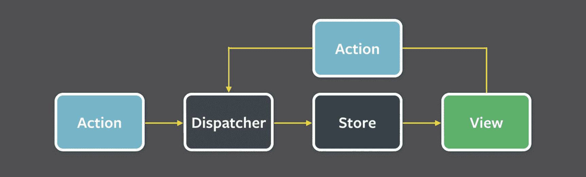
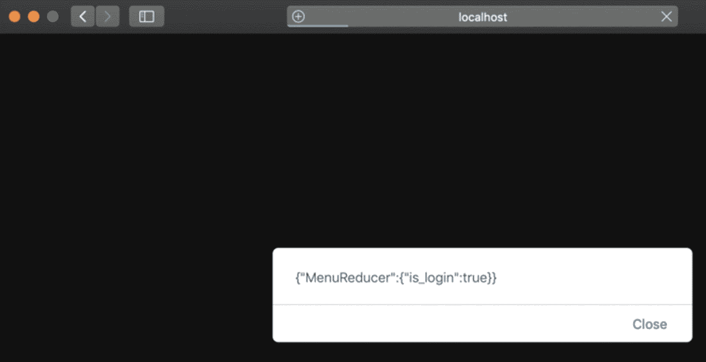

# 五、状态管理

在前一章中，我们借助 Material-UI 构建了一个带有菜单和抽屉的 header 组件。我们还使用 React 路由连接页面。我们学习了 React 组件以及如何使用`props`将信息从父组件传递到子组件。我们还学习了组件生命周期和组件状态。然而，如果我们想在大多数应用中实现其他公共元素，如存储用户信息、购物车或多个组件或子组件可能需要的任何其他基于数据的状态，我们需要其他库的帮助来构建高质量的软件。

在这一章中，我将向你介绍一个重要的库，它是你的 React 武库工具箱中的必备之物。这是一个状态管理库，它可以帮助确保您编写的防弹代码不会随着时间的推移而变得混乱，难以调试和测试，并导致重构和添加新功能的噩梦。

具体来说，您将了解由脸书引入的状态管理架构，称为 Flux，然后您将了解撰写本文时最流行的状态管理，称为 Redux。最后，您将逐步学会使用 Redux 工具包。在这个过程中，我们将在上一章开始构建的应用中实现 Redux 工具包。

当您完成本章时，您将已经创建了您可以在图 [5-1](#Fig1) 中看到的最终结果。


图 5-1

最终结果包括一个带有主题的页脚

如果你看我们的页脚，你会注意到它有特殊的力量。具体来说，用户将能够调整我们的应用的主题从亮到暗，或反之亦然。应用的配色方案会相应改变，包括菜单上的字体颜色。图 [5-2](#Fig2) 显示了更改为黑暗主题的结果。


图 5-2

最终结果:更改应用主题

## 状态管理架构

当用户点击“更改主题”按钮时(参见图 [5-2](#Fig2) 中的页脚)，我们希望相应地更改我们的应用以及所有组件和子组件的外观。为此，我们可以将用户的数据存储在一个用户首选项对象中。

决定的主题颜色的用户偏好是数据，或者换句话说，是我们的应用的“状态”，我们希望数据以一个方向流向我们的组件和子组件，这意味着组件不需要发送回数据。他们只需要收到一条消息，说明数据已经更改。一旦我们的视图收到数据已经更改的消息，我们就在组件和子组件(我们的视图)中进行更改。

### 为什么我们需要一个状态管理架构？

这种改变本身听起来微不足道，而且易于实施和管理。那么，为什么我们需要一个状态管理库来完成这个任务呢？

通俗地说，状态管理帮助组织你的 app 的数据和用户交互，直到用户的会话结束。它还有助于确保您的代码不会因为添加了更多功能而变得混乱。它使测试变得更加容易，并确保代码不依赖于特定的开发，并且可以扩展。

Note

状态管理是一种在用户会话结束前维护应用状态的方法。

在这一点上，我们并不真的需要一个设计模式来帮助我们管理我们的数据移动，并且实现一个架构来控制我们的数据移动对于这样简单的功能来说可能被认为是大材小用。

然而，随着我们的代码或团队的增长，我们需要某种架构来帮助处理数据移动，以及强制执行最佳实践来帮助管理我们的代码，以便它不会随着每次更改而中断。

事实上，脸书遇到了这些挑战，并寻找解决这些问题的方法。

### 脸书解决方案:Flux

脸书团队在扩大规模和维护代码方面的问题导致他们首先尝试现有的东西。他们首先实现了模型-视图-控制器(MVC)模式；然而，他们发现随着越来越多的特性被添加进来，架构模式引起了一些问题。一部分代码很难维护，而且代码经常出错。

#### 什么是 MVC，它解决什么？

在一个复杂的应用中，建议把关注点分开(想想把你的衣服分开来洗)。

*   *模型*:模型就是 app 数据。

*   *视图*:视图是前端的表示层。这是一个不应直接更新的实现；理想情况下，它应该通过反射设计模式进行更新。反射意味着一旦数据改变，视图也会“神奇地”改变

*   *控制器*:这是绑定模型和视图的光晕。

脸书团队尝试使用 MVC，但他们遇到了可能导致循环的数据流问题，这反过来会导致应用崩溃，因为它会成为内存泄漏(嵌套更新的级联效应)。

脸书团队解决了这些问题，他们提出了一个名为 Flux 的架构，最近又提出了一个名为反冲的实验库(我们将在下一章讨论和实现)。

Note

Flux 是一个用于构建用户界面的应用架构。 [`https://facebook.github.io/flux/`见](https://facebook.github.io/flux/)。

> *“Flux 是脸书用来构建客户端 web 应用的应用架构。它通过利用单向数据流来补充 React 的可组合视图组件。这更多的是一个模式而不是一个正式的框架“*
> 
> *——*[`https://facebook.github.io/flux/docs/in-depth-overview`](https://facebook.github.io/flux/docs/in-depth-overview)

Flux 是脸书团队使用的一种数据管理模式。焊剂可以分解成三种成分。

*   *Dispatcher* :中心 hub 保存向 Dispatcher 注册的回调，并将数据发送到商店。数据是通过动作发送的。

*   *存储*:顾名思义，存储的是数据。换句话说，它们保存着应用的状态。

*   *视图(我们的组件)*:视图是前端实现。我们的组件应该旨在尽可能的纯净和无状态，并且一旦状态改变就自动更新(通过使用反射)。

数据将像这样在应用中流动:

*行动➤调度员➤店➤查看*

使用这种类型的架构可以让我们知道数据来自哪里，去往哪里。这使得任何开发人员都可以“跳进去”并开始编码，因为他们可以观察动作并快速解决问题，还可以轻松地帮助调试、测试和实现新功能。

例如，假设我们想要更改应用的状态。视图上的用户交互可以调用触发 dispatcher 回调的操作，这将更新应用在商店中的状态，最终这些更改将在视图组件中使用。见图 [5-3](#Fig3)



图 5-3

Flux 数据流(信用: [`https://facebook.github.io/flux/docs/in-depth-overview`](https://facebook.github.io/flux/docs/in-depth-overview) )

脸书提出的应用架构 Flux 旨在通过以下方式实现其目标:

*   *显式数据*:使用显式数据，不使用派生数据(显式数据是未插入的原始数据)。

*   *分离关注点*:从视图中分离数据，就像在 MVC 中一样。

*   *避免级联效应*:防止嵌套更新(MVC 模式下可能发生的)，这是 Flux 和 MVC 最大的区别。

观看此视频可以了解更多脸书 Flux 心态: [`https://youtu.be/nYkdrAPrdcw`](https://youtu.be/nYkdrAPrdcw) `.`

我使用过许多大大小小的基于 MVC 的应用，有些是构建在 MVC 基础上的复杂的企业级应用。我不得不有点不同意脸书团队。通过加强良好的习惯，基于 MVC 的应用可以无缝地工作。也就是说，在许多 MVC 框架实现中涉及到大量的样板代码，并且代码审查通常是必要的，以加强良好的习惯并保持关注点的分离。

脸书的 Flux 架构确实简化了分离关注点的过程，并且是状态管理的一种新的替代方式，同时保持了较少的样板代码和松散耦合的组件。

### 香草冰淇淋

有许多状态管理库可供选择。以下是一些例子:

*   脸书的 Flux( [`https://github.com/facebook/flux`](https://github.com/facebook/flux) )

*   脸书的反冲( [`https://recoiljs.org/`](https://recoiljs.org/) )

*   流动 React 物( [`https://github.com/christianalfoni/flux-react`](https://github.com/christianalfoni/flux-react)

*   回流( [`https://github.com/reflux/refluxjs`](https://github.com/reflux/refluxjs) )

事实上，状态管理非常重要，它可以成为选择一个框架而不是另一个框架的理由。请记住，React 不是一个框架，而是一个库，不像 Angular 或 Vue 等其他框架那样与 React 竞争，它没有开箱即用的关注点分离。

在撰写本文时，实现 Flux 的最流行的状态管理工具是 Redux。脸书团队还在 2020 年年中提出了自己的状态管理库，名为反冲( [`https://recoiljs.org/`](https://recoiljs.org/) )。它非常有前途，我将在下一章中介绍它。然而，在撰写本书时，它仍处于起步阶段，还没有经过实验阶段而变得成熟。

#### 为什么 Redux

正如 Redux.js 组织所言，

> *Redux 是一个用于管理应用状态的开源 JavaScript 库。它通常与 React 或 Angular 等库一起用于构建用户界面。*

vanilla Redux 版本是非个人化的，这意味着您可以在架构和实践方面随心所欲。然而，Redux 团队官方推荐的方法是使用一个名为 Redux 工具包 的独立附加包，其中包括一些固执己见的默认设置，以帮助更有效地使用 Redux。是 Redux 配合 React 使用的标准。

Note

Redux 的香草味不推荐，这一节只是帮助你了解 Redux。Redux 工具包 更易于使用，是大多数应用的推荐方法。

在继续介绍 Redux 工具包之前，我将首先向您展示 Redux。

首先学习 Redux 更容易，因为它基于相同的组件。您将很快获得 Redux 工具包。

#### 怎么才能学会 Redux？

为了教你 Redux，我把这个过程分解为四个步骤。

1.  建立一个 CRA 项目。

2.  安装 Redux。

3.  创建一个 Redux 循环:action、reducer 和 store。

4.  提起诉讼。

我们开始吧。

你可以从本书的 GitHub 位置下载代码。

```jsx
https://github.com/Apress/react-and-libraries/tree/master/05/hello-redux

```

和往常一样，如果您从 GitHub 下载这段代码，请记住运行以下代码:

```jsx
$ yarn install
$ yarn start

```

并且检查 3000 端口的 app，换句话说就是`http://localhost:3000/`。

#### 步骤 1:设置项目

现在，让我们创建我们的项目。正如我们在第一章中所做的，我们将基于 CRA 创建一个新项目，并将其命名为`hello-redux.`

```jsx
$ yarn create react-app hello-redux --template must-have-libraries

```

安装完成后，确保它在端口 3000 上正确运行，将目录更改为`hello-redux`，并使用以下命令运行它:

```jsx
$ yarn start

```

接下来，我们将安装带有`-D`标志的 Redux，因此它会将 Redux 添加到`package.json`文件中。在撰写本文时，Redux 的版本是^4.0.5.

```jsx
$ yarn add redux -D

```

CRA·MHL 模板项目和我们在第 2 章安装的是 Redux 工具包。这就是为什么我们需要安装香草 Redux。

#### 步骤 2:创建一个 Redux 循环

让我们以一个简单的用户手势为例。假设用户点击一个按钮，应用中需要一个数据更改。例如，用户想要登录或退出我们的应用。这意味着我们的应用需要两种状态:一个用户登录，一个用户注销。

这听起来简单而普通；然而，如果没有一个正式的机制来分离这些关注点，这可能会很快变得混乱。

我们的应用可能需要进行全面的数据更改，从更改菜单到更改页面信息，再到更改成员的访问权限等等。

此外，您的应用现在可能很简单，但随着代码的增长，您可能会添加其他状态，如注册用户、已登录的现有用户、用户交互超时等状态。

这就是 Redux 可以帮忙的地方。它有助于使你的应用更具可读性，更易于重构和维护。即使你现在不需要它，通过使用 Redux，你也在为你的应用未来的增长做准备。看一下图 [5-4](#Fig4) 中 Redux 的万尺图。


图 5-4

Redux 的 10000 英尺图(鸣谢:Medium.com)

如您所见，它与 Flux 架构保持一致。与其用这个图向你解释，不如让我们来看一下登录/注销状态。如果您想更好地理解应用和代码中发生的事情，请随时参考这个图表。看看代码，测试一下，跟着做，就有意义了。

首先，让我们创建文件夹层次结构。首先，我们将创建`actions`、`reducers`和`store`文件夹。在 Mac 上，使用以下命令:

```jsx
$ mkdir -p src/redux/actions src/redux/reducers src/redux/store

```

Note

我正在使用`-p`标志。`-p`标志创建每个目录以及我们为了避免错误而创建的更高级目录(`js`)。

在面向 PC 用户 Window 终端上，使用以下命令:

```jsx
$ md src/redux/actions src/redux/reducers src/redux/store

```

此时，文件夹结构应该如图 [5-5](#Fig5) 所示。


图 5-5

hello-redux 应用的文件夹结构

在 Redux 中，我们需要创建一个保存状态的存储。我们将很快创建 Redux 商店；坚持住。

#### 重复操作

我们将从行动开始。创建一个新文件，并将其命名为`src/js/actions/MenuActions.ts`。

存储保存状态树。更改状态树只能通过发出一个动作来完成；这是单向的。

一个物体描述了发生的事情。在我们的例子中，我们创建了两个状态，一个用于用户登录，另一个用于用户注销。我们的 reducer 在用户登录和注销时都会有逻辑。我们姑且称这些为`showLogin`和`showLogout`。

```jsx
// src/js/actions/MenuActions.ts

export const USER_LOGIN = 'USER_LOGIN'
export const USER_LOGOUT = 'USER_LOGOUT'

export function showLogin() {
  return { type: USER_LOGIN }
}

export function showLogout() {
  return { type: USER_LOGOUT }
}

```

#### 还原剂

为了指定动作如何转换状态树，我们编写了 reducers。在我们的例子中，我们将有一个在状态改变时更新的菜单。创建一个新文件，并将其命名为`src/js/reducers/MenuReducer.ts`。

Note

我们的 reducer 拥有控制应用状态的逻辑。

在代码级别，让我们创建一个默认的登录状态和一个开关来处理状态更改。

数据变更会将`is_login`从`true`更新为`false`。这将使我们能够知道用户是否登录。

```jsx
// src/js/reducers/MenuReducer.ts

import { USER_LOGIN, USER_LOGOUT } from '../actions/MenuActions'

const DEFAULT_LOGIN_STATE = {
  isLogin: false
}

export default (state = DEFAULT_LOGIN_STATE, action: { type: String }) => {
  switch (action.type) {
    case USER_LOGIN:
      return { is_login: true }
    case USER_LOGOUT:
      return { is_login: false }
    default:
      return state
  }
}

```

与我们将在接下来讨论的 Redux 工具包 不同，Redux 是“非个人化的”，因此我们在这里可以做任何我们想做的事情。我们可以设计我们的应用，并将所有代码放在一个文件中，如果这是我们想要的。或者，我们可以坚持更好的设计，让每个缩减器使用自己独立的、松散耦合的代码。

你怎么想呢?我更喜欢后者。

当我们构建我们的应用时，我们会有很多逻辑，所以最好将每个逻辑部分分成它自己的归约器。因为我们会有很多这样的减速器，我们能做的就是创建一个`RootReducer`对象来保存所有这些减速器。继续用下面的代码创建一个`RootReducer.ts`文件:

```jsx
// src/js/reducers/RootReducer.ts

import { combineReducers } from 'redux'
import MenuReducer from './MenuReducer'

export default combineReducers({
  MenuReducer,
})

```

在这个设计中，我们可以将 reducer 添加到根文件中，根文件将作为我们的 reducer 的目录。

#### 第三步:Redux 商店

正如我在 Flux 架构中提到的，我们应用的整个状态应该存储在一个单独的存储中的一个对象树中。我们准备好创建商店了。创建一个名为`src/js/store/index.ts`的文件。

在代码层面上，基于我们通过添加根 reducer 创建的 reducer 创建一个存储，它包含我们所有的 reducer。

```jsx
// src/js/store/index.ts

import { createStore } from 'redux'
import rootReducer from '../reducers/RootReducer'

const index = createStore(rootReducer)

export default index

```

#### 步骤 4:调用操作

让我们创建逻辑来处理我们的前端代码。我想让我们的例子尽可能简洁，所以让我们使用窗口来访问 DOM 文档。创建`src/redux/store/index.ts`。

`Window`界面代表一个包含 DOM 文档的窗口。我们的例子只是为了学习，所以我使用`Window`接口只是为了显示逻辑，而不是显示它与实际组件的连接。

```jsx
// src/redux/store/index.ts

import store from './store/index'
import { showLogin, showLogout } from './actions/MenuActions'

export interface StoreWindow extends Window {
  store: typeof store
  showLogin(): { type: string }
  showLogout(): { type: string }
}
declare let window: StoreWindow

window.store = store
window.showLogin = showLogin
window.showLogout = showLogout

```

Note

我声明`StoreWindow`是因为 TS 需要一个接口。这是因为 TS 需要定义类型。

在代码级别，我们所做的是设置存储和我们的函数来显示和隐藏登录状态。一旦我们订阅了商店的回调，我们就可以使用`dispatch`并看到状态的变化。

在我们的例子中，我们只是使用警报让您知道状态变化，但是任何人都可以订阅这些事件并更新视图。

最后，添加我们的`import`语句来运行我们的`src/index.js`。

```jsx
// src/index.js

import { StoreWindow } from './redux'

declare let window: StoreWindow
window.store.getState()
window.store.subscribe(() => window.alert(JSON.stringify(window.store.getState())))

window.store.dispatch(window.showLogin())
window.store.dispatch(window.showLogout())

```

在浏览器中，当状态改变时，您会收到两个警告。

```jsx
{"MenuReducer":{"is_login":true}}
{"MenuReducer":{"is_login":false}}

```

图 [5-6](#Fig6) 显示了最终结果。



图 5-6

Redux hello-world 最终结果

#### 让我们回顾一下

我们能够快速创建 Redux 数据移动，并理解 Redux 是怎么一回事。我们设置了 React 项目并安装了 Redux。我们创造了一个循环。最后，我们调用了一个动作。

### Redux 工具包

正如我们所见，原始香草 Redux 风味是一个有用的工具。它帮助我们组织应用的数据和用户交互，因此我们的代码不会变得混乱。

我们有一个存储的概念，它可以保存我们的序列化键值对，并保存我们想要的任何值。

Redux 工具包 架构将每个功能分成一个特性片，随着越来越多的特性被添加，我们可以访问每个“片”数据。如果我们从食物的角度考虑，Redux 是一个香草冰淇淋蛋卷，然后我们的商店保存所有的数据或口味。

在我们的 Redux 工具包中，我们的商店更像一个比萨饼。我们的“切片”就像一片披萨，所有的切片组成了我们的商店。这就是所谓的鸭子模式(“re-dux”听起来像鸭子，懂吗？)，所以每个功能都将存储在单独的文件夹中。

Redux 工具包 是固执己见的，我们被鼓励创建一个特性文件夹来保存所有不同的片段。Redux 工具包包括一些自以为是的 API，帮助我们更有效地使用 Redux。

Redux API 由以下主要函数组成:`createSlice`、`configureStore`、`createReducer`、`createAction`、`createAsyncThunk`和`createEntityAdapter`。

其想法是提供样板工具，抽象设置过程，处理最常见的用例以及有用的实用程序，让用户简化编写代码。它负责中间件和 DevTools，而不需要做任何设置，并且它允许更容易的测试。

Redux 工具包 的目的是解决与 Redux 工具包.js 组织( [`https://redux-toolkit.js.org/introduction/quick-start`](https://redux-toolkit.js.org/introduction/quick-start) ):

> *“配置 Redux 存储太复杂*

> *——我必须添加许多包才能让 Redux 做任何有用的事情*

> *——Redux 需要太多的样板代码"*

Redux 工具包 在 React 企业级应用中被大量使用，这使得它成为高级到专家 React 开发人员的必备库，根据 React 团队的说法，“这些工具应该对所有 Redux 用户有益。”我个人同意，但我会让你来评判。

### 引擎盖下的 Redux 工具包

如果我们得到更多的技术，在引擎盖下，Redux 工具包 APIs 减少了我们需要编写的代码。有了样板代码，它可以防止我们犯常见的错误，因为代码会将错误减到最少。例如，常见的错误可能包括改变状态(在创建后更改数据并引入潜在的错误)或在状态中设置不可序列化的数据，如函数和承诺(而不是单独处理它们)。

这是通过`redux-immutable-state-invariant`和`serializable-state-invariant-middleware`以及`createAsyncThunk()` API 来完成的，以处理不可序列化的数据异步动作，比如与您的 API 交互。这与函数式编程(FP)密切相关。正如我们在前面的章节中看到的，功能组件是 React 的主要构件之一。

FP 意味着我们正在用纯粹的功能构建我们的软件，避免共享状态、可变数据和副作用。FP 是声明性的而不是命令性的，应用状态流过纯函数。因为 React 是一种声明性语言(它实际上并不直接操纵 DOM 本身)，所以它与 Redux 工具包 集成得很好，因为它有助于加强声明性架构。

Note

声明式编程表达了计算的逻辑，而没有描述它的控制流。命令式范式使用改变程序状态的语句，比如直接改变 DOM。

也就是说，如果你想创建自己的中间件，Redux 工具包 仍然有`getDefaultMiddleware()`，同时利用默认设置。`getDefaultMiddleware()`将在我们创建商店时被调用。

不会调用`redux-immutable-state-invariant, serializable-state-invariant-`中间件和`createAsyncThunk()`，需要自己处理逻辑。

Redux 工具包 也运行 Immer 库( [`https://github.com/immerjs/immer`](https://github.com/immerjs/immer) )，它让我们以一种变异的方式编写代码。我们通过简单地修改当前树来创建下一个不可变的状态树。我会在`createSlice()`代码里给你看。

我们真正想要的是使用尽可能多的纯功能组件。没有生命周期方法的组件要求我们依赖基于声明性的`props`方法，并提供性能改进，因为任何地方都不会有内存泄漏。

在纯函数方法中，对函数的每次调用都产生相同的结果，没有副作用。有道理吗？总的来说，这是很好的编程实践。

## 使用 Redux 工具包实现主题

现在我们已经介绍了 Redux 工具包，我们可以开始实现逻辑了。让我们创建一个首选项功能，我们可以在其中保存用户特定的首选项，如应用设置。

我们将从上一章停止的地方开始。

```jsx
https://github.com/Apress/react-and-libraries/04/exercise-4-2

```

你可以从[本](https://github.com/EliEladElrom/react-tutorials)书的 GitHub 位置下载本章的完整代码。

```jsx
https://github.com/Apress/react-and-libraries/05/exercise-5-1

```

一旦你运行了完整的代码，你就可以切换应用的主题，如图 [5-1](#Fig1) 和图 [5-2](#Fig2) 所示。

### 模型枚举对象:首选项对象

在创建切片之前，让我们创建一个枚举文件来保存我们的首选项。我们可以设置一个变量，用两个选项叫它`ThemeEnum`:`dark`和`light`。

首先，创建`src/model/preferencesObject.ts`。

```jsx
// src/model/preferencesObject.ts

export enum ThemeEnum {
  Dark = 'dark',
  Light = 'light',
}

```

#### 模型索引文件

当我们访问我们的模型时，有一个简单的方法来访问这些对象。我们知道我们需要我们的包 JS chuck 中的全部对象内容，所以我们可以在 model 文件夹中创建一个类，它将包含我们创建的所有方法。

```jsx
// src/model/index.ts
export * from './preferencesObject'

```

接下来，随着我们模型库的增长，我们可以以更直观的方式访问它们。

而不是这个:

```jsx
import { ThemeEnum } from '../../model/preferencesObject'

```

我们可以这样访问我们的方法:

```jsx
import { ThemeEnum } from '../../model'

```

这种方法有利也有弊。当我们优化我们的应用时，你会在第 [12](12.html) 章学到更多关于优化 React 应用块的技术。

### 将主题设置为全局样式:index.scss

`src/index.scss`是放置主题颜色的好地方，因为它们与不止一个组件相关，并且是一种全局风格。

```jsx
.dark {
  color: white;
  background-color: #2b2b2b;
}

.light {
  color: black;
  background-color: darkgrey;
}

```

### 创建一个状态切片:preferencesSlice.ts

接下来，创建一个文件并将其命名为`preferencesSlice.ts`。在切片内部，我们设置数据的初始状态。我把它设置为浅色(`ThemeEnum.Light`)作为初始状态。

对于减压器，我设置了三种类型的行动。

*   *setThemeDark* :将我们的应用主题设置为深色

*   *setThemeLight* :将我们的应用主题设置为浅色

*   *切换主题*:切换到相反的配色方案

看一看:

```jsx
// src/features/Preferences/preferencesSlice.ts

import { createSlice } from '@reduxjs/toolkit'
import { ThemeEnum } from '../../model’

interface SliceState {
  theme: ThemeEnum
}

```

`createSlice`是逻辑所在的地方，我们创建`initialState`以及减少器。

```jsx
const preferences = createSlice({
  name: 'preferences',
  initialState: {
    theme: ThemeEnum.Light,
  } as SliceState,

```

我们的减速器保持动作。虽然我只需要使用`switchTheme`而不是其他方法来切换主题，但是我已经为我可能需要的其他动作创建了 reducers。在测试方面，当我们到第 [X](10.html) 章时，你可以看到这种逻辑是如何有意义的，因为每个动作都可以单独测试。

```jsx
  reducers: {
    setThemeDark: (state, action) => {
      state.theme = ThemeEnum.Dark
    },
    setThemeLight: (state, action) => {
      state.theme = ThemeEnum.Light
    },
    switchTheme: (state, action) => {
      state.theme = state.theme === ThemeEnum.Light ? ThemeEnum.Dark : ThemeEnum.Light
    },
  },
})

```

最后，导出操作。

```jsx
export const { setThemeDark, setThemeLight, switchTheme } = preferences.actions
export default preferences.reducer

```

### Redux 工具包商店

现在我们已经有了带有特定动作的片段，我们可以设置`Store.ts`。我们所做的是用我们设置的片来配置存储。这就是我们所需要的。看一看:

```jsx
// src/redux/store.ts
import { configureStore, combineReducers } from '@reduxjs/toolkit'
import prefSlice from '../features/Preferences/preferencesSlice'

const store = configureStore({
  reducer: combineReducers({
    preferences: prefSlice,
  }),
})

export default store

```

太好了。我们已经准备好了状态逻辑。我们现在可以实现视图了。在我们名为`src/layout/Footer/Footer.tsx`的页脚视图文件中，我们可以创建一个带有链接列表和按钮的页脚，该按钮将向切换颜色主题的操作发送回调。

### 页脚架构

至此，我们已经为页脚创建了一个占位符。我们的页脚需要知道用户的偏好，并能够更新主题。为了实现这一点，我们可以用父组件`FooterTheme.jsx`包装子组件`Footer`，就像我们对`Header`所做的那样。看看图 [5-7](#Fig7) 。


图 5-7

页脚组件的高级架构

### 页脚子组件

我们创建一个类型为`FunctionComponent`的类，并传递主题`prop`。然后我们可以将视图包装在导航标签中。这个逻辑将设置页脚的背景来改变整个容器。我们还使用`styled-component`库来提取组件的样式。

```jsx
// src/layout/Footer/Footer.tsx

import React, { FunctionComponent } from 'react'
import classNames from 'classnames'
import { List, ListItem } from '@material-ui/core'
import { NavLink } from 'react-router-dom'
import InvertColorsIcon from '@material-ui/icons/InvertColors'
import { useStyles } from './Footer.styles'

// Redux 工具包
import store from '../../redux/store'
import { ThemeEnum } from '../../model’
import { switchTheme } from '../../features/Preferences/preferencesSlice'

const Footer: FunctionComponent<TFooterProps> = ({ theme }) => (
  <nav className={theme === ThemeEnum.Dark ? 'dark' : 'light'}>
    <NestedGrid />
  </nav>
)

export type TFooterProps = {

  theme: ThemeEnum
}

export default Footer

```

我们的`NestedGrid`函数可以接受主题`prop`并返回链接列表。

```jsx
function NestedGrid() {
  const classes = useStyles()
  const footerClasses = classNames({
    [classes.footer]: true,
  })
  const aClasses = classNames({
    [classes.a]: true,
  })

```

`updatePref`方法将使用 Redux 工具包 片来产生一个动作，该动作将更新首选项的状态。

```jsx
  const updatePref = () => {
    store.dispatch(switchTheme(store.getState()))
  }

```

然后我们可以在渲染函数`return`中设置这些样式类:

```jsx
return (
  <footer className={footerClasses}>
    <div className={classes.container}>
      <div className={classes.left}>
        <List className={classes.list}>
          {[
            { name: 'Contact', url: '/Contact' },
            { name: 'About', url: '/About' },
            { name: 'Books', url: '/Books' },
            { name: 'Courses', url: '/BuildSiteCourse' },
          ].map((itemObject, index) => (
            <NavLink to={itemObject.url} className={classes.block} key={itemObject.url} activeClassName="NavLinkItem-selected">
              <ListItem className={classes.inlineBlock}>{itemObject.name}</ListItem>
            </NavLink>
          ))}
        </List>
      </div>
      <div className={classes.right}>
        &copy; {new Date().getFullYear()}{' '}

```

下面是我们的按钮，它使用商店并调度一个回调来切换我们在切片中创建的主题动作:

```jsx
        <button type="submit" onClick={() => updatePref()} className={aClasses}>
          <InvertColorsIcon className={classes.icon} /> Change theme to {store.getState().preferences.theme === ThemeEnum.Dark ? 'light' : 'dark'}
        </button>
      </div>
    </div>
  </footer>
)

```

### Footer.styles.ts 样式组件

注意，我们在`Footer.tsx`子组件中调用了`Footer.styles.ts`。我们将视图和风格分开，并将风格放在一个名为`Footer.styles.ts`的单独文件中。我们的代码可以导入我们的样式文件。

```jsx
import { useStyles } from './Footer.styles'.

```

然后使用类的对象名，我们可以设置链接的字体颜色。如果背景是暗的，我们需要亮色字体，如果背景是亮的，我们需要深色字体。

在`Footer.styles.ts`中，我们的代码可以设置链接的样式，甚至包括媒体查询，以使用 Material-UI 核心 API`createStyles`、`makeStyles`和`Theme`调整我们的页脚容器。

```jsx
import { createStyles, makeStyles, Theme } from '@material-ui/core'

export const useStyles = makeStyles((theme: Theme) =>
  createStyles({
    block: {
      color: 'inherit',
      padding: '0.9375rem',
      fontWeight: 500,
      fontSize: '12px',
      textTransform: 'uppercase',
      borderRadius: '3px',
      textDecoration: 'none',
      position: 'relative',
    },
    left: {
      display: 'block',
    },
    right: {
      padding: '15px 0',
      margin: '0',
    },
    footer: {

      padding: '0.9375rem 0',
      textAlign: 'center',
      display: 'flex',
      zIndex: 2,
      position: 'relative',
    },
    a: {
      color: '#9c27b0',
      textDecoration: 'none',
      backgroundColor: 'transparent',
    },
    footerWhiteFont: {
      '&,&:hover,&:focus': {
        color: '#FFFFFF',
      },
    },
    container: {
      paddingRight: '15px',
      paddingLeft: '15px',
      marginRight: 'auto',
      marginLeft: 'auto',
      width: '100%',
      '@media (min-width: 576px)': {
        maxWidth: '540px',
      },
      '@media (min-width: 768px)': {
        maxWidth: '720px',
      },
      '@media (min-width: 992px)': {
        maxWidth: '960px',
      },
      '@media (min-width: 1200px)': {
        maxWidth: '1140px',
      },
    },
    list: {
      marginBottom: '0',
      padding: '0',
      marginTop: '0',
    },
    inlineBlock: {
      display: 'inline-block',
      padding: '0px',
      width: 'auto',
    },
    icon: {
      width: '18px',
      height: '18px',
      position: 'relative',
      top: '3px',
    },
  })
)

```

最后，我们需要用名为`FooterTheme.tsx`的父组件包装我们的`Footer`子组件，如果用户决定切换主题，父组件将监听来自商店的调度回调。该架构允许我们从任何视图调度回调，而不是从页脚强制进行交互。

### FooterTheme 包装父组件

为了实现这一点，我们将`FooterTheme.tsx`创建为`FunctionComponent`并订阅回调。

```jsx
  store.subscribe(() => {
    setTheme(store.getState().preferences.theme)
  })

```

下面是完整的 FooterTheme.tsx 代码；

```jsx
// src/layout/Footer/FooterTheme.tsx

import React, { FunctionComponent, useState } from 'react'
import { ThemeEnum } from '../../model’
import store from '../../redux/store'
import FooterComponent from './Footer'

export const FooterTheme: FunctionComponent = () => {
  const [theme, setTheme] = useState<ThemeEnum>(ThemeEnum.Light)
  store.subscribe(() => {
    setTheme(store.getState().preferences.theme)
  })
  return <FooterComponent theme={theme} />
}

```

### HeaderTheme 父组件

我们需要为标题做同样的事情。对于头部，我们已经设置了`HeaderTheme`包装器父组件，并设置了`appBarBackgroundStyle`方法。对于`HeaderTheme.tsx`来说，代码重构的变化是突出的。

```jsx
// src/layout/Header/HeaderTheme.tsx

import React, { FunctionComponent, useState } from 'react'
import AppBar from '@material-ui/core/AppBar/AppBar'
import { useMediaQuery } from '@material-ui/core'
import HeaderComponent from './Header'
import store from '../../redux/store'
import { ThemeEnum } from '../../model’

function appBarBackgroundStyle(color: string) {
  return {
    background: color,
  }
}

```

我们使用 React `useState`方法来设置状态。然后，我们可以为`AppBar`设置样式，并将状态传递给`HeaderComponent`。看一看:

```jsx
export const HeaderTheme: FunctionComponent = () => {
  const smallBreakPoint = useMediaQuery('(min-width: 0px) and (max-width: 1100px)')
  const [theme, setTheme] = useState<ThemeEnum>(ThemeEnum.Light)
  store.subscribe(() => {
    setTheme(store.getState().preferences.theme)
  })

  return (
    <AppBar position="fixed" style={appBarBackgroundStyle(theme === ThemeEnum.Dark ? '#2b2b2b' : 'white')}>
      <HeaderComponent theme={store.getState().preferences.theme} smallBreakPoint={smallBreakPoint} />
    </AppBar>

  )
}

```

### 标题子组件

需要重构`Header`组件，以便能够保存主题状态的属性，并将状态传递给不同的子组件，并更新 Material-UI 组件的状态。

让我们来看看。重构`IHeaderProps`接口，这样我们可以从`HeaderTheme`父组件传递主题。这里突出显示了代码更改:

```jsx
import { ThemeEnum } from '../../model'

interface IHeaderProps {

  theme: ThemeEnum
  smallBreakPoint: boolean
}

```

为了设置按钮的颜色，我们将使用一个名为`menuLabelBackgroundStyle`的方法来传递颜色编号。

```jsx
function menuLabelBackgroundStyle(color: string) {
  return {
    color,
    padding: 20,
  }
}

```

现在我们的材质界面按钮能够在`props`更新时切换颜色。

```jsx
<Button component={Link} style={menuLabelBackgroundStyle(this.props.theme === ThemeEnum.Dark ? 'white' : 'black')} to="/">
  ELI ELAD ELROM
</Button>

```

我们还需要将`prop`主题变量传递给两个叫做`HeaderTopNav`和`HeaderDrawer`的`Header`子组件。

```jsx
<HeaderTopNav theme={this.props.theme} />
<HeaderDrawer theme={this.props.theme} />

```

#### HeaderTopNav 子组件

对于我们的`HeaderTopNav`子组件，我们需要将`prop`添加到接口中。

```jsx
import { ThemeEnum } from '../../model'

interface IHTNavProps {
  theme: ThemeEnum
}

```

我们将使用与在`Header`组件中相同的方法来设置材质 UI 按钮的样式。由于它与`Header`组件中的代码相同，我们可以将代码提取到一个实用程序中；然而，由于代码很小，我更喜欢保持它的副本，这样每个组件都可以作为一个独立的组件提取出来，没有其他的依赖，但是提取重复的代码并不是一个坏主意。

```jsx
function menuLabelBackgroundStyle(color: string) {
  return {
    color,
    padding: 20,
  }
}

```

接下来，我们可以为每个父按钮设置样式，并为每个按钮重复这个过程:联系人、资源、指导和建立我的网站。我只显示了一个按钮，但会为每个按钮重复相同的样式属性。

```jsx
<Button style={menuLabelBackgroundStyle(this.props.theme === ThemeEnum.Dark ? 'white' : 'black')} onClick={(event) => this.handleMenuOpen(event, '1')}>
  Build My Website
</Button>

```

#### HeaderDrawer 子组件

对于`headerDrawer`，我现在不打算实现任何样式更改，但是我想为以后的更改做准备，所以我将让子组件通过`props`知道状态，就像我们在`HeaderTopNav`中做的那样。

```jsx
import { ThemeEnum } from '../../model'

interface IHDProps {
  theme: ThemeEnum
}

```

### 适当的重构

既然我们已经重构了我们的页脚，我们需要改变`AppRouter.tsx`来使用`<FooterTheme />`子组件而不是`<Footer />`。看一看:

```jsx
const AppRouter: FunctionComponent = () => {
  return (
    <Provider store={store}>
      <Router>
        <HeaderTheme />
        <Switch>
        ...
        </Switch>
        <div className="footer">
          <FooterTheme />
        </div>
      </Router>
    </Provider>
  )
}
export default AppRouter

```

恭喜你！我们完成了编码。如果您检查应用，您应该会看到如图 [5-1](#Fig1) 和图 [5-2](#Fig2) 所示的结果。

因为我们的页面不包含任何内容，所以我们可以调整页面的 SCSS 高度，使其看起来整洁。

```jsx
// src/App.scss
.App {
  text-align: center;
  padding-top: 120px;
  height: 350px;
}

```

我们现在有了一个包含导航、页面、抽屉、主题和状态管理的站点脚手架，能够在组件和子组件之间传递状态。

为了保证质量，正如我们在上一章中所做的那样，您应该养成运行以下程序的习惯:

```jsx
$ yarn format
$ yarn lint
$ yarn test

```

这将确保我们通过测试，林挺，并解决任何问题。本例中的代码通过了所有的测试，所以您可以将您的最终结果与我的进行比较。

### redux devtools extension(redux devtools 扩展)

我想向您展示的最后一件事将是添加到 React 工具箱的一个很好的附加功能，它是一个跟踪 Redux 工具包 中发生的事情的插件。它被称为 Redux DevTools 扩展。对于 Chrome，你可以从这里下载:

```jsx
https://chrome.google.com/webstore/detail/redux-devtools/lmhkpmbekcpmknklioeibfkpmmfibljd?hl=en

```

此外，您也可以随意访问 GitHub 上的项目，获取其他浏览器的插件。

[T2`https://github.com/zalmoxisus/redux-devtools-extension`](https://github.com/zalmoxisus/redux-devtools-extension)

当我们使用我们构建的应用时，我们现在可以看到插件上正在调度的操作，如图 [5-8](#Fig8) 所示。点击链接切换我们应用的主题。在我们的例子中，应用的主题从亮变暗。随着您添加越来越多的切片和代码的增长，这个工具会派上用场。


图 5-8

Chrome 的 Redux DevTools 扩展

## 摘要

在这一章中，你学习了状态管理和脸书提出的状态管理架构 Flux。通过使用 CRA 创建一个`hello-redux`应用，您了解了在撰写本文时最流行的状态管理方法 Redux。然后你学习了 Redux 工具包，并在这个过程中在我们上一章开始构建的应用中实现了 Redux 工具包。在 Redux 工具包 和样式化组件的帮助下，我们添加了主题和使用 Flux 状态管理在不同组件之间进行状态通信的能力。最后，我们为 Chrome 安装了 Redux DevTools 扩展。

在下一章中，我们将继续构建我们的应用，并使用反冲和 Mongo-Express-React-node . js(MERN)栈实现一个具有独占私有成员区域的登录。