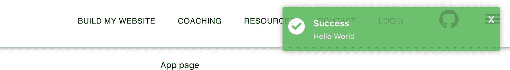

# 六、MERN 栈：第一部分

在前一章中，你学习了状态管理和脸书的 Flux 状态管理架构。您了解了目前最流行的状态管理工具:vanilla Redux 和 Redux 工具包。在这一章中，我们将使用反冲和 Mongo-Express-React-node . js(MERN)栈实现一个具有独占私有成员区域的登录。具体来说，我们将使用 React with 反冲在不同组件之间共享状态，作为视图层和中间件。在下一章中，我们将实现 Node.js、Express 和 MongoDB 作为后端。

Note

中间件为我们的组件提供了 React 库中没有的服务。将中间件视为“软件粘合剂”

这一章将包含大量的实践编码。当您完成本章时，您将会看到使用 React 和其他相关技术的完整周期。当您完成下一章时，您将拥有成为全栈开发人员的工具。

同样，MERN 栈分为两章。

*   在这一章中，我们将设置前端，React 部分。

*   在下一章，我们将设置后端。

这一章分为两部分。在第一部分中，我们将重构我们在前面章节中开始的应用，并重构状态管理以使用反冲。在本章的第二部分，我们将构建一个专属的会员区，其中包含一个我们可以在整个应用中使用的全球 toast 消息组件。

图 [6-1](#Fig1) 显示了最终的结果，用户可以登录和注销一个专属的、安全的、会员专用的区域。我们的组件将动态变化。


图 6-1

本章的最终结果

## 用反冲更新首选项

在这一节中，我们将重构我们的应用，使用反冲而不是 Redux 工具包 来为反冲中间件与后端的集成做好准备，我们将在下一章中设置后端。不过，首先让我们谈谈 MERN 和反冲。

### 什么是 MERN 栈？

MERN 栈是一个 JavaScript 栈，它使得开发过程更加容易，因为它完全基于 JavaScript 技术。MERN 包括四种开源技术: **M** ongoDB、 **E** xpress、 **R** eact、 **N** ode.js，这些技术为我们提供了从前端到后端框架完整的端到端循环。在本章中，我们将完成 MERN 栈的 React 部分。

### 什么是后坐力？

为了了解反冲，我们将重构我们在上一章中创建的首选项组件的状态，但是这一次我们将使用脸书反冲库取代状态管理，而不是使用 Redux 工具包。

反冲( [`https://recoiljs.org/`](https://recoiljs.org/) )是脸书正在席卷 React 开发者社区的改变生活的状态管理实验。后坐力团队是这样说的:

> *“后坐力的工作原理和思考方式类似 React。添加一些到您的应用中，获得快速灵活的共享状态。”*

### 为什么要用后座力？

正如我们在前一章看到的，有许多状态管理库，那么为什么我们还需要另一个状态管理来共享我们的应用状态呢？跨多个组件共享状态和设置中间件能做得更好更容易吗？快速回答是肯定的！

如果您需要做的只是全局存储值，那么您选择的任何库都可以工作。然而，当您开始做更复杂的事情，比如异步调用，或者试图让您的客户端与您的服务器状态同步，或者反向用户交互时，事情就开始变得复杂和混乱了。

理想情况下，正如在本书中多次提到的，我们希望我们的 React 组件尽可能纯净，我们希望数据管理在 React 钩子中流动，没有副作用。我们还希望“真正的”DOM 为了性能而尽可能少地改变。

保持组件松散耦合对于开发人员来说总是一个好地方，因此拥有一个与 React 很好集成的库是对 React 库的一个很好的补充，因为它将 React 与 Angular 等其他顶级 JavaScript 框架放在一起。

拥有固态管理库将更好地促进 React 应用为企业级复杂应用提供服务，并处理前端和中间层的复杂操作。反冲简化了状态管理，我们只需要创建两个成分:原子和选择器。

原子是对象，是组件可以订阅的状态单元。反冲让我们创建一个从这些原子(共享状态)流向组件的数据流图。*选择器*是允许同步或异步转换状态的纯函数。

与 Redux 或 Redux 工具包 不同，不需要处理复杂的中间件设置并连接您的组件或使用任何其他东西来让 React 组件很好地运行。

你知道吗？反冲库仍处于实验阶段，但已经获得了一些非凡的人气，超过了 Redux 的人气。反冲库在 GitHub 上的得分接近 10，000 星，超过了 Redux 工具包 的 4，100 星！

我和许多其他人都认为，反冲将成为状态管理的标准，并且比继续使用 Redux 工具包 作为中间件更好的投资。然而，了解 Redux 工具包 仍然是很好的，因为您可能参与了一个使用 Redux 的项目。此外，反冲仍然是一个实验，并没有达到释放阶段，因为这本书的写作，所以它不适合心脏虚弱的人。

### 用反冲分享用户的偏好状态

为了开始使用反冲，我将通过重构我们在上一章中构建的首选组件，从通过 Redux 工具包 共享状态到利用反冲，让您更容易理解。这将使您能够并排比较这两个库。我把这个过程分成两步。

*   *步骤 1* :实施反冲

*   *第二步*:重构视图层

在项目层面，我们将从上一章停止的地方继续。

[T2`https://github.com/Apress/react-and-libraries/05/exercise-5-1`](https://github.com/Apress/react-and-libraries/05/exercise-5-1)

你可以在这里下载重构我们偏好的完整代码:

[T2`https://github.com/Apress/react-and-libraries/06/exercise-6-1`](https://github.com/Apress/react-and-libraries/06/exercise-6-1)

#### 实施反冲

为了开始，我们通常首先需要安装反冲(`yarn add recoil`)。在撰写本文时，反冲的版本是 0.0.13，但在您阅读本章时，情况可能会发生变化。然而，我们的 CRA MHL 模板已经包括反冲，所以它已经设置没有任何额外的工作对你的一部分。

#### 更新首选项对象

我们将更新的第一个文件是`preferencesObject.ts`，它是我们在前一章中创建的。对象为两个应用状态保存一个枚举常数。我们将向该对象添加一种保存首选项对象类型的方法和一种初始化该对象的方法。这在后座力上会派上用场。看一看:

```jsx
// src/model/preferencesObject.ts
...

// eslint-disable-next-line @typescript-eslint/naming-convention
export interface preferencesObject {
  theme: ThemeEnum
}

export const initPreferencesObject = (): preferencesObject => ({
  theme: ThemeEnum.Light,
})

```

注意，我放置了`eslint-disable`代码，让 Lint 忽略签名行，因为我们的 ESLint 基于 Airbnb 风格，所以被设置为不使用小写作为命名约定。我想把界面设置成小写。另一个选项是更改 ESLint 配置文件。

另一件要注意的事情(有些人可能会有争议)是将枚举放在对象模型中以保持它“更纯粹”如果您来自 Java 世界，您应该听说过值对象(VOs)和数据传输对象(dto)。我不会讲太多细节，但是对象可以重构，枚举可以提取到枚举对象及其自己的文件夹中，如果这是您想要的设计。

为我们的对象创建一个带有类型的模型文件夹让我们可以充分利用 TypeScript，并且使用对象类型可以帮助我们编写代码和测试。

#### 首选项原子

接下来，我们将创建我们的反冲物体，称为*原子*。我们将调用文件`preferencesAtoms.ts`，反冲希望我们为每个原子定义一个惟一的键，并设置一个默认值。我将文件*原子*称为复数而不是*原子*的原因是我可以在该文件中添加其他相关原子。这只是一个好习惯。

看一看:

```jsx
// src/recoil/atoms/preferencesAtoms.ts

import { atom } from 'recoil'
import { initPreferencesObject } from '../../model'

export const preferencesState = atom({
  key: 'PreferencesState',
  default: initPreferencesObject(),
})

```

注意，对于默认值，我使用模型的`initPreferencesObject`方法用默认值(`ThemeEnum.Light`)初始化对象。我们稍后会用到它。

#### 会话原子

我们还将创建一个`sessionAtoms.ts`文件，它将保存一个用户密钥，我们可以用它来确保用户被授权登录到我们的安全会员区。我们不会在本章中实现它，但是在您完成相关章节后，您可以随意创建逻辑并自己实现该功能。

```jsx
// src/recoil/atoms/sessionAtoms.ts
import { atom } from 'recoil'

export const sessionState = atom({
  key: 'SessionState',
  default: '',
})

```

#### 重构视图层

现在我们有了原子`preferencesAtoms`和`sessionAtoms.ts`，我们准备设置页脚和页眉，从反冲而不是 Redux 工具包 获取共享状态值，并通过反冲设置值。

#### UserButton 子组件

我们将从创建一个名为`UserButton.tsx`的新子组件开始。

`UserButton`将了解用户的偏好以及用户是否登录了我们的应用。该按钮将根据状态调整颜色和信息。

为了实现所有这些，我们将在界面中包含主题的状态，以及稍后可以使用的登录状态的状态。

我们的导入需要包括 Material-UI 按钮组件、一个链接组件、`ThemeEnum`以及一个包含应用主题的`prop`的接口，我们将从父组件传递该主题。看一看:

```jsx
//src/components/UserButton/UserButton.tsx

import React from 'react'
import './UserButton.scss'
import Button from '@material-ui/core/Button/Button'
import { Link } from 'react-router-dom'
import { ThemeEnum } from '../../model'

export interface IUserButtonProps {
  isLoggedIn: boolean
  theme: ThemeEnum
}

```

接下来，我们将创建两个常量，我们可以用它们来根据用户的偏好改变菜单标签的样式。

```jsx
const menuLabelsLight = {
  color: 'white',
  padding: 20,
}

const menuLabelsDark = {
  color: 'black',
  padding: 20,
}

```

对于类签名，我们可以使用`PureComponent`。当你不需要`shouldComponentUpdate`挂钩时，使用这个:

```jsx
export class UserButton extends React.PureComponent<IUserButtonProps, {}> {
  render() {

```

在按钮样式中，我们可以让开关决定使用哪个样式元素。在我们的例子中，用户登录与否的唯一区别是顶部菜单上显示的“members”或“login ”,但是代码被设置为可以显示任何想要的子组件。例如，您可能希望在用户登录时显示用户名或图片。看一看:

```jsx
    const { isLoggedIn } = this.props
    return isLoggedIn ? (
      <Button component={Link} style={this.props.theme === ThemeEnum.Dark ? menuLabelsLight : menuLabelsDark} to="/Members">
        Members
      </Button>
    ) : (
      <Button component={Link} style={this.props.theme === ThemeEnum.Dark ? menuLabelsLight : menuLabelsDark} to="/Members">
        Login
      </Button>
    )
  }
}

```

内联条件语句与用纯 JavaScript 编写时是一样的。

```jsx
let value = isLoggedIn ? 'Members' : 'Login'

```

#### 用户列表按钮组件

类似地，我们将创建`UserButton`，它将知道登录状态并在我们的抽屉组件中使用它。我们的组件将把一个单击的用户手势传递给父组件，因此我们的组件将像任何其他链接组件一样，能够在不破坏封装的情况下关闭抽屉。

```jsx
export interface IUserListButtonProps {
  isLoggedIn: boolean
  onClick: MouseEventHandler
}

```

对于我们的导入，我从 Material-UI 中挑选了一些图标，我们可以用它们来指示用户已经登录或注销。我们还需要来自 Material-UI 的`ListItem`和`ListItemText`，以及路由的`NavLink`。

```jsx
import React, { MouseEventHandler } from 'react'
import { NavLink } from 'react-router-dom'
import ListItem from '@material-ui/core/ListItem/ListItem'
import ListItemIcon from '@material-ui/core/ListItemIcon/ListItemIcon'
import ListItemText from '@material-ui/core/ListItemText/ListItemText'
import VpnKeyIcon from '@material-ui/icons/VpnKey'
import CardMembershipIcon from '@material-ui/icons/CardMembership'

```

我们的类签名可以再次是`PureComponent`，内联的`if` / `else`语句将显示成员按钮或登录按钮。

```jsx
export class UserListButton extends React.PureComponent<IUserListButtonProps, {}> {
  render() {
    const { isLoggedIn } = this.props
    return isLoggedIn ? (
      <NavLink to="/Members" className="NavLinkItem" key="/Members" activeClassName="NavLinkItem-selected">
        <ListItem button key="Members" onClick={this.props.onClick}>
          <ListItemIcon>
            <CardMembershipIcon />
          </ListItemIcon>
          <ListItemText primary="Members" />
        </ListItem>
      </NavLink>
    ) : (
      <NavLink to="/Members" className="NavLinkItem" key="/Members" activeClassName="NavLinkItem-selected">
        <ListItem button key="Login" onClick={this.props.onClick}>
          <ListItemIcon>
            <VpnKeyIcon />
          </ListItemIcon>
          <ListItemText primary="Login" />
        </ListItem>
      </NavLink>
    )
  }
}

```

#### HeaderTheme 组件更改

有了原子，我们可以继续前进，重构。我们将更新组件，并通过`props`将共享反冲原子的`prop`传递给`Header`子组件。

我们将`useRecoilState`以及`preferencesState`和`sessionState`添加到我们的`import`语句中。

```jsx
// src/layout/Header/HeaderTheme.tsx

import { useRecoilState } from 'recoil'
import { preferencesState } from '../../recoil/atoms/preferencesAtoms'
import { sessionState } from '../../recoil/atoms/sessionAtoms'

```

接下来，我们将利用`useRecoilState`从反冲中获取我们的首选项和会话令牌的值。反冲的这种集成感觉很自然，并且更符合 React 组件的内置状态机制。您可以在这里看到反冲力的作用(代码更改突出显示):

```jsx
export const HeaderTheme: FunctionComponent = () => {
  const [preferences] = useRecoilState(preferencesState)
  const [session] = useRecoilState(sessionState)
  ...
}

```

然后我们可以使用偏好的共享值，并将数据传递给`Header`组件。再也不需要 Redux 工具包 的`store.getState()`了。

```jsx
<HeaderComponent theme={preferences.theme} session={session} smallBreakPoint={smallBreakPoint} />

```

正如您所看到的，我通过将共享状态作为`props`传递来保持子组件尽可能纯净的状态，这不仅使调试和测试变得容易，因为状态将从父状态传递到子组件，而且还可以将任何组件从一个应用提取到另一个应用。

#### 标题子组件

在我们的`Header`子组件(`Header`、`HeaderTopNav`和`HeaderDrawer`)中，我们可以采用相同的主题`prop`方法，并通过`props`将其传递给其他两个子组件。由于`Header`组件没有 set 方法，它只读取主题状态，我们的代码是松散耦合的，我们可以很容易地将子组件从一个项目复制粘贴到另一个项目。此外，当我们需要测试一个组件不依赖于另一个父组件时，最好保持我们的组件松散耦合。

##### 标题子组件

我们可以用`Header`子组件代码开始重构`Header`子组件。在`Header props`中，我们可以设置主题和会话变量。

```jsx
// src/layout/Header/Header.tsx

interface IHeaderProps {
  theme: ThemeEnum
  session: string
  smallBreakPoint: boolean
}

```

对于渲染 JSX 方面，我们使用主题设置样式，并设置会话密钥。

请注意，我们直接在组件上检查会话状态。原因是一旦共享状态被更新，我们需要组件被更新。我们正在检查会话共享状态以及`localStorage`的状态。我们将两者都设置的原因是我们需要两种情况，如下所示:

*   应用通过钩子自动更新

*   一旦用户刷新浏览器，应用就会更新

Note

`localStorage`也叫 DOM storage，是 web 存储，它赋予我们的 web app 存储我们客户端数据的能力，当我们刷新浏览器时，数据会被持久化。

```jsx
<HeaderTopNav theme={this.props.theme} isLoggedIn={this.props.session === 'myUniqueToken' || localStorage.getItem('accessToken') === 'myUniqueToken'} />

<HeaderDrawer theme={this.props.theme} isLoggedIn={this.props.session === 'myUniqueToken' || localStorage.getItem('accessToken') === 'myUniqueToken'} />

```

注意，在代码级别，我正在为会话检查创建烘焙代码`myUniqueToken`。这可以连接到通过加密/解密算法检查会话的逻辑。

##### HeaderTopNav 子组件

对于`HeaderTopNav`子组件重构工作，我们将导入`UserButton`，它知道我们创建的首选项和登录状态。

```jsx
// src/layout/Header/HeaderTopNav.tsx

import { UserButton } from '../../components/UserButton/UserButton'

```

接下来，我们需要子组件知道用户是否登录以及主题。我们将这些信息传递给孩子。

```jsx
interface IHTNavProps {
  theme: ThemeEnum
  isLoggedIn: boolean
}

```

我想重构的另一个项目是 GitHub 图标。GitHub 图标样式需要基于主题偏好，所以要匹配其余导航项；否则，它保持不变的颜色。看一看:

```jsx
function githubIconStyle(color: string) {
  return {
    color,
    width: 120,
  }
}

<IconButton style={githubIconStyle(this.props.theme === ThemeEnum.Dark ? 'white' : 'black')}>

```

最后，让我们在现有的 Contact 按钮下添加`UserButton`组件。

```jsx
<UserButton theme={this.props.theme} isLoggedIn={this.props.isLoggedIn} />

```

##### HeaderDrawer 子组件

`HeaderDrawer`子组件的重构工作类似于`HeaderTopNav`子组件。我们设置我们创建的新按钮的导入，`UserListButton`；更新`props`界面；并添加按钮。其余保持不变。看一看:

```jsx
// src/layout/Header/HeaderDrawer.tsx

import { UserListButton } from '../../components/UserListButton/UserListButton'

interface IHDProps {
  theme: ThemeEnum
  isLoggedIn: boolean

<UserListButton isLoggedIn={this.props.isLoggedIn} onClick={this.handleListItemClick} />

```

#### 页脚组件重构

在我们的`Footer`组件工作中，过程类似于我们在`Header`组件中所做的。然而，我们不只是阅读偏好状态；我们还让用户改变应用主题的状态。一旦用户使用了`onClick`函数，我们就可以使用`setPreferences`来设置首选项，所以我们需要重构代码并移除 Redux 工具包。

#### FooterTheme 主题组件

`FooterTheme.tsx`是一个返回`FooterComponent`的`FunctionComponent`包装器。我们需要包装器的原因是我们正在使用反冲钩子，而且我们只能在纯函数中这样做。

正如我们对`Header`组件所做的那样，我们将通过`props`将`preferencesAtom`对象传递给其他子组件。我们不需要订阅 Redux 工具包商店。看看这些变化:

```jsx
// src/layout/Footer/FooterTheme.tsx

import { useRecoilState } from 'recoil'

import { preferencesState } from '../../recoil/atoms/preferencesAtoms'

Next, we can set preferences to tie that to our state.

export const FooterTheme: FunctionComponent = () => {
  const [preferences] = useRecoilState(preferencesState)
  return <FooterComponent theme={preferences.theme} />
}

```

如你所见，我正在使用`FooterTheme`函数中的`useRecoilState`反冲函数来检索原子，然后我将它传递给`FooterComponent`。

#### 页脚子组件

我们从`Footer`主题组件传递了首选项状态，它与反冲共享状态相关联。当我们使用`setPreferences`时，状态将被使用该状态的任何组件和子组件全局共享。此外，React 将自动识别何时用任何需要更改的组件和子组件来更新真正的 DOM，我们这边不需要做任何工作。

要做到这一点，我们需要首先引入反冲。

```jsx
// src/layout/Footer/Footer.tsx

import { useRecoilState } from 'recoil'

```

接下来，我们现有的`NestedGrid`函数可以保存状态并绑定使用反冲的数据。

```jsx
function NestedGrid() {
  const [preferences, setPreferences] = useRecoilState(preferencesState)
  ...
}

```

我们需要做的另一个改变是，当用户点击更改首选项时，我们现在可以直接将`setPreferences`更改为组件状态，而不是使用 Redux 工具包。这样好很多，也更直观。

```jsx
const updatePref = () => {
  setPreferences({
    theme: preferences.theme === ThemeEnum.Light ? ThemeEnum.Dark : ThemeEnum.Light,
  })
}

```

#### 合适的组件

最后，在`App`组件中，我们需要将路由代码包装在`RecoilRoot`标签中。

##### 什么是反冲根？

`RecoilRoot`提供上下文，作为所有使用反冲挂钩的组件的祖先。

##### 悬念标签

在反冲中，我们还需要设置一个后备悬念标签。暂停标签设置将在加载期间显示的组件。

在我们的例子中，我们可以将悬念组件设置为只显示加载消息。看一下代码:

```jsx
// src/AppRouter.tsx

import React, { Suspense } from 'react'
import { RecoilRoot } from 'recoil'

function AppRouter() {
  return (
    <Router>
      <RecoilRoot>
        <Suspense fallback={<span>Loading...</span>}>
          <HeaderTheme />
          <Switch>
            ...
          </Switch>
          <div className="footer">
            <FooterTheme />
          </div>
        </Suspense>
      </RecoilRoot>
    </Router>
  )
}

```

干得好！现在我们可以正式删除`redux`和`Preferences`文件夹，因为我们不再使用它们了。

*   `src/redux/store.ts`

*   `src/features/Preferences/preferencesSlice.ts`

和往常一样，如果你没有运行应用，使用`yarn start`。参见图 [6-2](#Fig2) 中的最终结果。


图 6-2

重构我们的应用，使用反冲而不是 Redux

继续尝试使用页脚按钮切换主题。

正如你所看到的，反冲的行为和感觉就像是 React 库的扩展，反冲还为我们提供了一个共享的状态管理，而没有麻烦。最重要的是，DOM 只在需要的时候更新。这是一个速度提升。假设我们正在更新一个包含数千个结果的列表，或者维护一个服务器-客户端状态。React 和反冲配合得很好，并分开我们的关注。

现在我们已经重构了我们的应用，并且我们正在使用反冲而不是 Redux 工具包。到目前为止，我们的应用功能很简单；它显示内容页面，并有一个开关来改变用户的主题偏好。

然而，假设我们想增加更多的功能。例如，应用中的一个常见功能是登录到安全的会员专用区域或提交表单，因此我们需要添加更多的逻辑。

至此，我们已经很好地了解了如何将 React 组件分解成子组件，分离关注点，以及如何使用反冲共享状态库。我们已经准备好处理更复杂的功能。

## 用 MERN 栈创建一个会员专用区

我们现在将学习如何使用 MERN 栈创建一个会员专用区域。

### 我们如何用 MERN 栈建立一个会员专用区？

为了实现逻辑以便我们能够登录到一个安全的会员专用区域，我将这个过程分为两个主要部分。

*   创建前端

*   创建后端

前端将包括我们的应用的中间件和视图层。后端将包括服务器、服务和数据库。

在下一节中，我们将使用反冲作为中间件，然后在第 [7](07.html) 章中，我们将集成 Express、NodeJS 和 MongoDB 作为后端。

让我们开始写我们的私人会员区的前端。

### 前端

您可以从这里下载该练习的完整代码:

[T2`https://github.com/Apress/react-and-libraries/06/exercise-6-2`](https://github.com/Apress/react-and-libraries/06/exercise-6-2)

我们将构建两个前端组件。

*   Toast 消息组件

*   登录和会员区组件

toast 消息组件，顾名思义，会像烤面包机一样弹出消息。这些消息可以用来在整个应用中通知用户成功、失败、信息和警告消息，而不仅仅是这个特性。

登录和成员组件将包括一个表单，用户可以提交该表单以验证用户名和密码，并获得对成员专用区域的访问权限。

### Toast 消息组件

为了开始我们的 toast 消息组件，我们将从定义数据开始。这是一个良好的开端，因为我们首先设置了将在组件中使用的数据。

每个 toast 消息需要有一个唯一的 ID，这样我们就知道将显示什么。toast 还需要一个消息类型，如`success`或`failed`，以及我们想要显示的消息的描述。我们将接受四种类型的消息:成功、失败、警告和信息。我们会给每条信息一个不同的风格和图标。

你可以在图 [6-3](#Fig3) 中看到最终的结果。



图 6-3

测试烤面包机组件

#### 目标模型

一个好的起点是数据。`toastObject`数据对象是我们在 preference 数据对象中使用的类似架构设计。我们将包括一个接口和一个方法来启动 toast 消息。我还将包含一个方法来获取一个随机 ID 号，我们可以用它作为每个 toast 消息的唯一 ID。

设置消息类型的枚举是一个好主意，这样我们就不需要不断地键入它们。设置一个不同消息背景颜色的枚举也不会有什么坏处，这样我们就可以从一个地方很容易地改变它们。创建`toastObject.ts`并查看代码，如下所示:

```jsx
// src/model/toastObject.ts

// eslint-disable-next-line @typescript-eslint/naming-convention
export interface toastObject {

  id: number
  type: string
  description: string
}
export const initEmptyToast = (): toastObject => ({
  id: -1,
  type: '',
  description: '',
})
export const initToast = (id: number, type: string, description: string): toastObject => ({
  id: id,
  type: type,
  description: description,
})
// eslint-disable-next-line @typescript-eslint/naming-convention
export const randomToastId = () => {
  return Math.floor(Math.random() * 101 + 1)
}
export enum notificationTypesEnums {
  Success = 'Success',
  Fail = 'Fail',
  Info = 'Info',
  Warning = 'Warning',
}
// eslint-disable-next-line @typescript-eslint/naming-convention
export enum backgroundColorEnums {
  Success = '#5bb85a',
  Fail = '#d94948',
  Info = '#55bede',
  Warning = '#f0a54b',
}

```

注意，我正在设置`initEmptyToast`和`initToast`。`initEmptyToast`将 toast 消息的 ID 设置为-1，表示 toast 消息未设置。`initToast`让我们决定 toast 对象的值。

记住还要将 toast 模型添加到`src/model/index.ts`文件中，以便于访问。

```jsx
// src/model/index.ts
export * from './toastObject'

```

#### 反冲:烤面包原子

现在我们有了模型数据，我们可以创建 toast 原子(`toastAtoms.ts`)。我们需要保存一个惟一的键和默认值，就像我们对 preference 原子所做的那样。

```jsx
// src/recoil/atoms/toastAtoms.ts

import { atom } from 'recoil'
import { initEmptyToast } from '../../model'

export const toastState = atom({
  key: 'ToastState',
  default: initEmptyToast(),
})

```

#### 吐司成分

在组件层次结构设计方面，我们的组件设计将有一个`ToastNotification`组件，它将保存我们需要显示的所有祝酒词。当我们分解功能时，这种设计是健康的，并且易于维护。为了帮助理解这个层次，请看图 [6-4](#Fig4) 。


图 6-4

Toast 组件架构设计

配备了反冲吐司原子和模型，我们可以开始和创建我们的前端组件。我们将从一个`Toast`组件开始。这将是我们的通知组件用来显示祝酒词的子组件。它代表了我们将要分发的每一份吐司。

让我们回顾一下`Toast`组件。我们的`import`语句包括图标、反冲、悬念和通知枚举。

```jsx
// src/components/Toast/Toast.tsx
import React, { Suspense } from 'react'
import './Toast.scss'
import { useRecoilState } from 'recoil'
import { toastState } from '../../recoil/atoms/toastAtoms'
import checkIcon from '../../assets/toast/check.svg'
import errorIcon from '../../assets/toast/error.svg'
import infoIcon from '../../assets/toast/info.svg'
import warningIcon from '../../assets/toast/warning.svg'
import { backgroundColorEnums, initEmptyToast, notificationTypesEnums } from '../../model'

```

我们的导入图标可以从 GitHub 的`/assets/toast`文件夹下载，或者你可以制作自己的 SVG 自定义图标。

为了在我们的`Toast`组件中绑定反冲共享状态，我们将使用`useRecoilState`。

```jsx
export const Toast = () => {
  const [toast, setToast] = useRecoilState(toastState)

```

`StyleDetails`界面将保存选中的 toast 图标和背景选中的颜色代码。

```jsx
  interface StyleDetails {
    background: string
    icon: string
  }

```

接下来，我们将创建一个方法(`getToastStyle`)，它将保持一个开关来分配一个带有图标和背景颜色的对象。我使用了一个开关，但这也可以用一个对象文字来完成。

```jsx
  const getToastStyle = (toastType: string) => {
    let retVal: StyleDetails = {
        background: backgroundColorEnums.Success,
        icon: checkIcon,
    }
    switch (toastType)  {
      case notificationTypesEnums.Fail:
        retVal = {
            background: backgroundColorEnums.Fail,
            icon: errorIcon,
        }
        break;
      case notificationTypesEnums.Warning:
        retVal = {
            background: backgroundColorEnums.Warning,
            icon: warningIcon,
        }
        break;
      case notificationTypesEnums.Info:
        retVal = {
            background: backgroundColorEnums.Info,
            icon: infoIcon,
        }
        break;
    }
    return retVal;
  }

```

在渲染 JSX 方面，我们将忽略任何 ID 为-1 的 toast(记住，这是初始值)。这样，我们可以清除屏幕上显示的未设置或需要删除的 toast。

```jsx
  return (

      {toast.id !== -1 && (

```

我使用的是悬念 API，它允许我们在组件加载时显示加载消息。如果您愿意，可以将装载消息更改为 spinner。

```jsx
        <Suspense fallback={<span>Loading</span>}>
          <div className="notification-container top-right">

```

每个 toast 都会被分配一个随机的、唯一的 toast ID，这种设计允许我们删除一个 toast，以防我们希望实现多个 toast 同时显示，或者我们将来可能需要的任何其他功能。

```jsx
            <div
              key={toast.id}
              className={`notification toast top-right`}

```

对于背景和图标的样式，我们将使用我们创建的`getToastStyle`。我们通过`toast.type`得到背景颜色。看一看:

```jsx
              style={{ backgroundColor: getToastStyle(toast.type).background }}
            >

```

一旦用户点击关闭 toast，我们使用我们在模型中创建的`initEmptyToast`方法将 toast 的 ID 设置为-1 来清除 toast。这将删除祝酒词。看一看:

```jsx
              <button type="button" onClick={() => setToast(initEmptyToast())}>X</button>
              <div className="notification-image">
                
              </div>
              <div>
                <p className="notification-title">{toast.type}</p>
                <p className="notification-message">{toast.description}</p>
              </div>
            </div>
          </div>
        </Suspense>
      )}

  )
}

```

#### 烤面包。SCS

至于`Toast.scss`，我不会在这里显示完整的代码，但是你可以从 GitHub 的资源库下载。但是我想指出一个特点。

在我们的代码中，我们将 toast 设置在用户屏幕的右上角，并设置了一个动画来将 toast 从右向左移动，但是您可以更改代码来从屏幕的任何角落显示 toast 的动画。看一下处理位置的代码的`Toast.scss`部分:

```jsx
.top-right {
  top: 12px;
  right: 12px;
  transition: transform 0.6s ease-in-out;
  animation: toast-in-right 0.7s;
}

@keyframes toast-in-right {
  from {
    transform: translateX(100%);
  }
  to {
    transform: translateX(0);
  }
}

```

#### ToastNotification 子组件

现在我们已经准备好了 toast 子组件，我们将创建父组件`ToastNotification.tsx`。反冲使用钩子，所以为了能够使用 React 组件而不是纯函数，我们需要将 React 组件包装在纯函数中，并通过`props`传递反冲状态。这是怎么做到的？看一看。

我们需要导入 SCSS 文件、反冲状态和值、toast 模型、toast 原子以及`Toast`组件。

```jsx
// src/components/Toast/ToastNotification.tsx
import React from 'react'
import './ToastNotification.scss'
import { SetterOrUpdater, useRecoilValue, useSetRecoilState } from 'recoil'
import { initEmptyToast, toastObject } from '../../model'
import { toastState } from '../../recoil/atoms/toastAtoms'
import { Toast } from './Toast'

```

我们检索 toast 状态的纯函数以及创建使用`getToastState`和`useSetRecoilState`API 设置 toast 的方法需要在`ToastNotification`包装器中设置。这些将通过`props`传递给我们正在包装的`ToastNotificationInner`组件。

```jsx
// wrapper
export default function ToastNotification() {
  const setToastState = useSetRecoilState(toastState)
  const getToastState: toastObject = useRecoilValue(toastState)
  return <ToastNotInner setToastState={setToastState} getToastState={getToastState} />
}

```

现在我们的`ToastNotification`包装已经准备好了。`ToastNotificationInner` React 组件实现了`setToastState`和`getToastState`接口。

```jsx
interface IToastNotProps {
  setToastState: SetterOrUpdater<toastObject>
  getToastState: toastObject
}

interface IToastNotState {}

class ToastNotInner extends React.PureComponent<IToastNotProps, IToastNotState> {

```

我们希望即使用户没有点击关闭 toast，我们的 toast 也会自动消失，所以我们可以用 5000 毫秒(半秒)的计时器在`componentDidUpdate`方法上设置一个间隔。

`componentDidUpdate()`方法是放置我们代码的好地方，因为它是在最近提交的输出被提交之后被调用的。

Tip

主要区别在于`getDerivedStateFromProps`是在调用 render 方法之前被调用的。`getSnapshotBeforeUpdate`在提交最近渲染的输出之前运行。`componentDidUpdate`穷追不舍。

```jsx
componentDidUpdate() {
  const interval = setInterval(() => {
    if (this.props.getToastState.id !== -1) {
      this.props.setToastState(initEmptyToast())
    }
  }, 5000)
  return () => {
    clearInterval(interval)
  }
}

```

如果你想让面包烤得更久，你可以把时间从半秒增加到一秒(10，000 毫秒)。在 JSX 渲染端，我们返回我们创建的`Toast`子组件。

```jsx
  render() {
    return (
    <>

        <Toast />

    </>
    )
  }
}

```

#### toastnotification . scss

最后，对于我们的`ToastNotification.scss`文件，我们需要设置 toast 按钮设计属性。

```jsx
.toast-buttons {
  display: flex;
}

.toast-buttons button {
  color: white;
  font-size: 14px;
  font-weight: bold;
  width: 100px;
  height: 50px;
  margin: 0 10px;
  border: none;
  outline: none;
}

.select {
  display: flex;
  width: 30%;
  margin-top: 10px;
}

.position-select {

  background-color: inherit;
  color: #fff;
  width: 100%;
  height: 30px;
  font-size: 16px;
}

```

#### 适当的组件重构

既然我们已经创建了 toast 子组件和 notification 父组件，我们可以向我们的`AppRouter`组件添加逻辑来包含`ToastNotification`。出于两个原因，最好将这段代码放在全局位置。

*   我们需要`RecoilRoot`，因为我们正在使用反冲 API。

*   我们可以在任何页面中使用 toast 组件。

在`<RecoilRoot>`标签内添加`<ToastNotification>`到`AppRouter.tsx`。

```jsx
<RecoilRoot>
  <ToastNotification />
  ..
  ..
</RecoilRoot>

```

我们都准备好了。这种架构设计允许我们的代码在全局级别上接受来自任何组件的 toast 通知。反冲为我们提供了一个共享状态，我们可以随时使用它来分配一个祝酒词。

让我们试驾一下 toast 组件。例如，为了在`App.tsx`中发送一个 toast，我们设置 toast 状态，并且我们模仿我们喜欢的任何类型的 toast。当我们刷新页面时，看看吐司是什么样子，如图 [6-3](#Fig3) 所示。

```jsx
// src/App.tsx

import { useSetRecoilState } from 'recoil'
import { toastState } from './recoil/atoms/toastAtoms'
import { initToast, notificationTypesEnums, randomToastId } from './model'

function App() {

  const setToastState = useSetRecoilState(toastState)
  setToastState(initToast(randomToastId(), notificationTypesEnums.Success, 'Hello World'))
  ...
}

```

### 专属会员区

在本章的最后一个练习中，我们将创建我们谈到的受密码保护的会员专用区域。会员区需要一个登录，将有一个电子邮件和密码输入框，用户可以填写，以便他们可以登录到一个专属的会员专用区。

您可以从这里下载该练习的完整代码:

```jsx
 https://github.com/Apress/react-and-libraries/06/exercise-6-3

```

#### 使用者物件模型

和往常一样，一个好的起点是定义我们的用户对象模型文件(`userObject.ts`)。用户对象保存电子邮件和密码以及初始化对象的方法，就像我们在前面添加的模型中所做的一样。

```jsx
// src/model/userObject.ts

export interface userObject {
  email: string
  password: string
}

export const initUser = (): userObject => ({
  email: '',
  password: '',
})

```

向索引文件添加导出；

```jsx
// src/model/index.ts
export * from './userObject'

```

### 登录反冲逻辑

我们来看看登录逻辑。

#### 用户原子

接下来，正如我们在 preference 和 toast 组件中所做的那样，我们需要设置一个反冲原子。创建`userAtoms.ts`。该文件将保存用户状态，默认值设置为模型对象。

```jsx
// src/recoil/atoms/userAtoms.ts
import { atom } from 'recoil'
import { initUser } from '../../model'

export const userState = atom({
  key: 'UserState',
  default: initUser(),
})

```

除了用户原子，我们还需要一个会话原子。如果您还记得在本章前面我们设置首选项时，我们还创建了`sessionAtoms.ts`来保存用户密钥，我们可以用它来确保用户被授权登录到我们的安全会员区。

#### 反冲用户选择器

对于用户组件，我们需要一些中间件来进行服务调用。这将通过使用反冲选择器 API 来实现。

反冲选择器共享状态，因此我们所有的 React 组件都可以订阅数据。选择器是纯函数，允许我们同步或异步地转换状态。

在我们的例子中，我们使用服务调用，因此调用将是异步的。看看显示选择器纯函数`userSelectors.ts`的代码级别:

```jsx
// src/recoil/selectors/userSelectors.ts

import { selector } from 'recoil'
import { userState } from '../atoms/userAtoms'

```

对于服务调用，我将简单地使用一个名为`axios` ( [`https://github.com/axios/axios`](https://github.com/axios/axios) )的有用库来调用代码。确保将该库添加到项目中(`$ yarn add axios`)。

```jsx
import axios from 'axios'

```

在反冲中，我们可以使用一个选择器或者一个`selectorFamily`来传递用户信息。`selectorFamily`是一种类似于`selector`的模式，但是它允许向选择器的 get 和 set 回调传递参数。因此，您可以修改代码，设计一个`selectorFamily`来传递用户电子邮件，而不是将其存储在 atom 中。我将它存储起来，以防其他组件需要知道所选择的用户电子邮件，例如，一个时事通讯组件。

反冲选择器就像反冲原子一样，需要一个唯一的键来设置。我使用带有`get`方法的`async`来检索`userState`。看一看:

```jsx
export const submitUserLoginSelector = selector({
  key: 'SubmitUserLoginSelector',
  get: async ({ get }) => {
    const payload = get(userState)

```

我可以在这里设置另一个验证来确保用户填写了表单。

```jsx
    if (payload.email === '' || payload.password === '') return `Error: Please complete form`

```

接下来，我将我的服务调用包装在`try`和`catch`标签中，以确保不会产生错误。

```jsx
  try {
      const urlWithString = `http://localhost:8081/validate?email=${  payload.email  }&password=${  payload.password}`
      const res = await axios({
        url: urlWithString,
        method: 'get',
      })
      return res?.data?.status
    } catch (err) {
      // console.warn(err)
      return `Error: ${  err}`
    }
  },
})

```

Note

我使用的是可选链接(`res?.data?.status`)。这让我们可以编写代码，如果遇到空值，TypeScript 可以立即停止运行表达式。这是健康的，有助于在服务调用失败或变得不正常时避免错误。

#### 登录组件

现在我们有了原子和选择器，我们可以在视图层工作了。

我们将从登录组件的表单组件开始。

我们将使用 Material-UI 风格的组件库来加速我们的开发工作。正如我们之前所做的，我们将使用一个包装器组件(`LoginForm`)并将我们的`LoginPage`包装在一个`LoginForm`中。`LoginForm`组件将有另一个内部组件来保存实际的表单。看图 [6-5](#Fig5) 。


图 6-5

登录组件层次结构

在`LoginForm`中，我们将使用一个样式文件将样式从视图中分离出来。创建`LoginForm.styles.ts`来居中并设置我们的组件为一个列容器。

这种增加的复杂性是不必要的；然而，它帮助我们更好地分离组件，并保持它们的松散耦合，如果我们需要将`LoginForm`放在这个应用的其他地方或将其拖到另一个项目，额外的步骤是值得的。

#### LoginForm.styles.ts

我们的风格决定了我们将要使用的容器类型。它指定了如何将组件中的表单元素作为页面的列和中心进行布局。看一看:

```jsx
// src/components/Login/LoginForm.styles.ts
import { createStyles, Theme } from '@material-ui/core/styles'

export default (theme: Theme) =>
    container: {
      display: 'flex',
      flexDirection: 'column',
      justifyContent: 'center',
    },
  })

```

#### log in form-登入表单

接下来，让我们创建我们的`LoginForm`包装登录组件。`LoginForm.tsx`将包括来自 Material-UI、我们的模型和登录风格的表单元素。

```jsx
// src/components/Login/LoginForm.tsx
import * as React from 'react'
import TextField from '@material-ui/core/TextField'
import Button from '@material-ui/core/Button'
import { withStyles, WithStyles } from '@material-ui/core/styles'
import CircularProgress from '@material-ui/core/CircularProgress'
import { userObject } from '../../model'
import styles from './LoginForm.styles'

```

为了包装`LoginForm.styles`，我们将创建一个内部 React 函数组件，并使用`withStyle` API 来导出将我们的组件与样式连接起来的组件。

```jsx
export const LoginForm = withStyles(styles)(LoginFormInner)

```

我们将要设置的`props`包括扩展`withStyle` API，从父组件传递`onLogin`和`onUpdateLoginField`函数，传递用户的状态，最后传递一个标志来显示表单提交后的加载进度。

```jsx
interface ILoginFormProps extends WithStyles<typeof styles> {
  onLogin: () => void
  onUpdateLoginField: (name: string, value: string) => void
  loginInfo: userObject
  loading: boolean
}

```

我们将使用在`props`中设置的`onTextFieldChangeHandler`和`onUpdateLoginField`将用户更新表单的值传递给父组件。

```jsx
const LoginFormInner: React.FunctionComponent<ILoginFormProps> = (props: ILoginFormProps) => {
  const onTextFieldChangeHandler = (fieldId: string) => (e: React.ChangeEvent<HTMLInputElement>) => {
    props.onUpdateLoginField(fieldId, e.target.value)
  }

```

在 JSX 渲染端，我们将设置电子邮件和密码文本字段输入，将`onChange`绑定到`onTextFieldChangeHandler`，并通过`props.loginInfo`将值绑定到状态。看一看。

```jsx
return (
  <div className={props.classes.container}>
    <TextField label="email address" margin="normal" value={props.loginInfo.email} onChange={onTextFieldChangeHandler('email')} />
    <TextField label="password" type="password" margin="normal" value={props.loginInfo.password} onChange={onTextFieldChangeHandler('password')} />

```

我们的提交按钮将使用来自`props`的回调和加载`prop`标志。在提交按钮里面，我们会看到一个加载动画，这要归功于 Material-UI `CircularProgress`组件。

```jsx
      <Button variant="contained" color="primary" disabled={props.loading} onClick={props.onLogin}>
        Login
        {props.loading && <CircularProgress size={30} color="secondary" />}
      </Button>
    </div>
  )
}

```

太好了，我们的登录表单组件已经可以使用了。

### 登录页面

我们的`LoginPage`组件是父组件，它将包含一个内部组件(`LoginPageInner`)来显示表单或处理表单的提交，并显示成功或失败的逻辑。为了更好地理解我在做什么，请看图 [6-6](#Fig6) 。


图 6-6

登录页面组件和子组件

如您所见，`LoginPage`保存了内页包装器(`LoginPageInner`)。里面将是一个子组件，将我们的登录表单居中。

`InnerPage`要么显示我们的表单，要么使用一个名为`SubmitUserFormComponent`的子组件，一旦表单被提交，这个子组件就会被使用，并且根据结果设置状态并显示一条消息。此外，它将启动我们之前创建的 toast 组件。

另外，看一下图 [6-7](#Fig7) 中的活动图，更好地理解提交登录表单的流程。


图 6-7

LoginFormInner 活动图

#### 中心内容组件

让我们从中心组件开始，它可以帮助我们调整登录表单组件。这个组件可以在其他页面中重用，所以让我们把它放在布局文件夹中重用。

为了清楚起见，我们将把组件从样式中分离出来。我们称之为样式组件`Centered.styles.ts`。

```jsx
// src/layout/Centered/Centered.styles.ts

import { createStyles, Theme } from '@material-ui/core/styles'

export default (theme: Theme) =>
  createStyles({
    '@global': {
      'body, html, #root': {
        paddingTop: 40,
        width: '100%',
      },
    },
    container: {
      maxWidth: '400px',
      margin: '0 auto',
    },
  })

```

接下来，我们可以创建我们的包装器组件(`Centered.tsx`)，我们将使用它作为我们的容器类，它将使我们的子组件居中。

```jsx
// src/layout/Centered/Centered.tsx

import * as React from 'react'
import { withStyles, WithStyles } from '@material-ui/core/styles'
import styles from './Centered.styles'

const CenteredViewInner: React.FunctionComponent<Props> = (props) => <div className={props.classes.container}>{props.children}</div>

interface Props extends WithStyles<typeof styles> {}

export const Centered = withStyles(styles)(CenteredViewInner)

```

最后，让我们创建一个`index.ts`文件来更直观地访问这个组件，这样我们就可以将它用作 JSX 标签，就像这样:`<Centered />`。

```jsx
// src/layout/index.ts

export { Centered } from './Centered'

```

#### 登录页面组件

对于`LoginPage`，我们已经有了这个组件，但是它只是显示页面的名称。开始更新吧。我们的导入需要包括材质-UI 组件、反冲元素、toast 组件和我们的登录表单。

```jsx
// src/components/Login/LoginPage.tsx

import './LoginPage.scss'
import { Card, CardContent, CardHeader } from '@material-ui/core'
import { useRecoilState, useRecoilValue, useSetRecoilState } from 'recoil'
import { Centered } from '../../layout/Centered'
import { LoginForm } from '../../components/Login/LoginForm'
import { initToast, initUser, notificationTypesEnums, randomToastId } from '../../model'
import { userState } from '../../recoil/atoms/userAtoms'
import { toastState } from '../../recoil/atoms/toastAtoms'
import { submitUserLoginSelector } from '../../recoil/selectors/userSelectors'
import { sessionState } from '../../recoil/atoms/sessionAtoms'

```

`LoginPage`需要包括`LoginPageInner`组件，这是繁重工作发生的地方。

```jsx
export default LoginPage

const LoginPage = () => {
  return <LoginPageInner />
}

```

##### LoginPageInner 和子组件

正如我提到的，`LoginPageInner`组件设置组件的本地登录页面状态(`userLoginPageState`)以及反冲页面状态(`user`)。

我们需要本地状态和共享状态的原因是，我们不需要在用户的任何击键更新时更新全局共享状态，而只需要在用户完成表单时更新。我们还将在这里设置加载状态标志，并将其传递给表单，这样我们就可以从父组件控制它，并保持子组件干净。

```jsx
function LoginPageInner() {
  const [userLoginPageState, setUserLoginPageState] = useState(initUser)
  const [loading, setLoading] = useState(false)
  const [user, setUser] = useRecoilState(userState)

```

一旦用户点击`onLogin`按钮，我们设置表单的加载状态以及反冲用户状态值。

```jsx
const onLogin = () => {
  // console.log(`LoginPage.tsx :: onLogin :: userLoginPageState :: ${JSON.stringify(userLoginPageState)}`)
  setLoading(true)
  setUser(userLoginPageState)
  // eslint-disable-next-line no-console
  console.log(JSON.stringify(user))
}
const onUpdateLoginFieldHandler = (name: string, value: string) => {
  // console.log(`LoginPage.tsx :: Update name: ${name}, value: ${value}`)
  setUserLoginPageState({
    ...userLoginPageState,
    [name]: value,
  })
  // console.log(`LoginPage.tsx :: onUpdateLoginFieldHandler :: user :: ${JSON.stringify(user)}`)
}

```

在 JSX 端，我们检查表单是否通过我们的州旗加载。我们使用`SubmitUserFormComponent`，在这里我们将根据表单是否被提交来放置进行服务调用或显示表单的逻辑。这个`if` / `else`条件逻辑的原因是我们不想显示`LoginForm`。如果用户提交表单，并且表单正在被处理，我们可以创建另一个页面组件来导航或者将代码分割成更多的组件。然而，这种设计现在已经足够了，因为显示结果的代码很简单。

```jsx
  return (
    <Centered>
      {loading ? (
        <SubmitUserFormComponent />
      ) : (
        <Card>
          <CardHeader title="Members Login" />
          <CardContent>
            <LoginForm onLogin={onLogin} onUpdateLoginField={onUpdateLoginFieldHandler} loginInfo={userLoginPageState} loading={loading} />
          </CardContent>
        </Card>
      )}
    </Centered>
  )
}

```

##### SubmitUserForm 子组件

最后，我们的`SubmitUserFormComponent`是使用反冲选择器的逻辑发生的地方。我们使用`useRecoilValue`模式来调用我们的选择器。

```jsx
function SubmitUserFormComponent() {
  const results = useRecoilValue(submitUserLoginSelector)
  const setSessionState = useSetRecoilState(sessionState)
  const setToastState = useSetRecoilState(toastState)

```

一旦从选择器中检索到结果，我们需要设置两个方法来处理成功和失败逻辑。在这里，我们可以设置可以在其他组件中使用的烘焙会话状态令牌。在我们的例子中，令牌是硬编码，但在现实生活中，我们需要加密和解密密钥，并根据业务逻辑的要求将其存储在数据库中。

##### onSuccessLogin Logic

这里是`onSuccessLogin`逻辑:

```jsx
  const onSuccessLogin = () => {
    localStorage.setItem('accessToken', 'myUniqueToken')
    setSessionState('myUniqueToken')
  }

```

注意，我也使用了`localStorage`浏览器 API。这样，我可以让用户返回页面，而不需要再次登录，所以我在`localStorage`上设置了令牌。

##### 错误逻辑

对于失败逻辑，我们可以调用我们创建的自定义 toast 组件并传递失败消息，例如当我们的服务停止时出现网络错误。

```jsx
  const onFailLogin = () => {
    setToastState(initToast(randomToastId(), notificationTypesEnums.Fail, results))
    localStorage.removeItem('accessToken')
    setSessionState('')
  }

```

然后我们可以使用逻辑来检查从服务器端检索结果的值是成功还是失败。

```jsx
  results === 'success' ? onSuccessLogin() : onFailLogin()

```

在 JSX 呈现级别，我们根据从服务调用中检索到的结果，返回一条成功消息或一条失败消息。如果需要，这可以扩展为它自己的子组件，而不仅仅是一条文本消息。

```jsx
  return (
    {results === 'success' ? Success : We were unable to log you in please try again}
  )
}

```

我们已经为登录组件的视图准备好了所有的逻辑，包括一个 atom 和一个选择器，它充当我们的中间件并进行服务调用。

接下来，我们将创建一个成员组件，它可以检查会话令牌，并在用户没有登录时显示安全成员区域或登录组件。

### 成员页面

对于我们的会员区，我们将更新会员页面组件，使其显示登录页面或专属会员区主页。看一下图 [6-8](#Fig8) 中的活动图。


图 6-8

会员区活动图

让我们首先为成员可以登录的安全区域创建一个名为`MembersHome.tsx`的主页。目前，该组件只有一个注销按钮，代码被设置为清除本地存储。我还将清空会话状态。这样，一旦会话状态改变，其他组件将自动更新，如图 [6-9](#Fig9) 所示。


图 6-9

带有注销按钮的会员专属区

#### 会员之家

在代码层面上，`MembersHome`组件将首先向您展示导入库。

```jsx
// src/page/MembersPage/MembersHome.tsx

import Button from '@material-ui/core/Button'
import React from 'react'
import { useSetRecoilState } from 'recoil'
import { sessionState } from '../../recoil/atoms/sessionAtoms'

```

接下来，我们的 pure 函数利用`useSetRecoilState`模式来设置会话状态。我们包含了让用户注销的`onClickHandler`逻辑。当我们注销用户时，我们需要清除会话共享原子和`localStorage`。

```jsx
const MembersHome = () => {
  const setSessionState = useSetRecoilState(sessionState)
  const onClickHandler = (e: React.MouseEvent) => {
    e.preventDefault()
    localStorage.removeItem('accessToken')
    setSessionState('')
  }

```

对于渲染，我们此时只显示一个注销按钮。如果我们将来需要更复杂的视图，这可以扩展到更多的子组件。

```jsx
  return (

      <Button type="submit" variant="contained" color="primary" onClick={onClickHandler}>
        Logout
      </Button>

  )
}

export default MembersHome

```

#### 成员页面

最后，我们需要一个名为`MembersPage.tsx`的成员页面的父组件，它将持有一个开关，根据令牌状态显示成员安全区域或登录页面。

```jsx
// src/page/MembersPage/MembersPage.tsx

import React from 'react'
import './MembersPage.scss'
import { useRecoilValue } from 'recoil'
import LoginPage from '../LoginPage/LoginPage'
import MembersHome from './MembersHome'
import { sessionState } from '../../recoil/atoms/sessionAtoms'

```

交换机的逻辑检查会话状态是否等于固定值`myUniqueToken`。稍后，我们可以创建逻辑来加密和解密会话，甚至将它存储在我们的数据库中。

我正在检查反冲共享状态和`localStorage`是否都设置为该值。我们需要这两者，以防用户返回页面或页面被刷新。

```jsx
const MembersPage = () => {
  const isMemberHasAccess = useRecoilValue(sessionState) === 'myUniqueToken' || localStorage.getItem('accessToken') === 'myUniqueToken'
  return <MembersPageInner isMemberHasAccess={isMemberHasAccess} />
}

```

对于显示成员页面的内部组件，我们传递一个名为`isMemberHasAccess`的`prop`，它可以告诉组件用户是否应该访问该组件，这将被用作显示成员或登录组件的条件。

```jsx
const MembersPageInner = (props: IMembersPageInnerProps) => (

    {props.isMemberHasAccess ? <MembersHome /> : <LoginPage />}

)

interface IMembersPageInnerProps {
  isMemberHasAccess: boolean
}

export default MembersPage

```

我们完成了编码。太棒了。

我将在第 [9 章](09.html)中介绍 Jest 测试，但是现在删除会员页面的 Jest 测试，因为我们修改了代码，所以我们的测试不会通过:`MembersPage.test.tsx`。

记得运行`format`、`lint`、`test`，保证代码质量。

```jsx
$ yarn format & yarn lint & yarn test

```

我们终于可以运行我们的代码了，如果你还没有运行它的话(`$ yarn start`)，看看我们的首选项和登录系统的工作逻辑。见图 [6-1](#Fig1) 。

如果您尝试登录，您将收到一条错误消息“我们无法让您登录，请重试。”这是意料之中的，因为我们还没有建立我们的服务呼叫(图 [6-10](#Fig10) )。


图 6-10

表单失败提示和消息

## 摘要

本章深入研究了编码。您了解了更多关于如何构建函数、类、组件和子组件的知识。您还了解了 MERN 栈。我们在本章一开始就向你介绍了反冲。我们将共享用户偏好状态从 Redux 工具包 更改为反冲，您可以看到这两个工具之间的差异。您还看到了反冲如何轻松地与 React 配合使用，以及与导入的库相比，它开箱即用的感觉如何。

您还了解了如何通过创建一个使用 React 作为 MERN 栈前端的登录系统来构建一个会员专属区域，我们甚至创建了一个自定义的 toast 消息组件来向全球用户显示消息。反冲有许多功能来维护组件生命周期中的状态，甚至是客户端和服务器端之间的状态。我们只是带着后座力接触了表面。我鼓励你访问反冲网站( [`https://recoiljs.org/`](https://recoiljs.org/) )，了解更多的可能性。现在我们的前端已经准备好了，在下一章中，您将学习如何使用 Node.js、MongoDB 和 Express 设置后端。