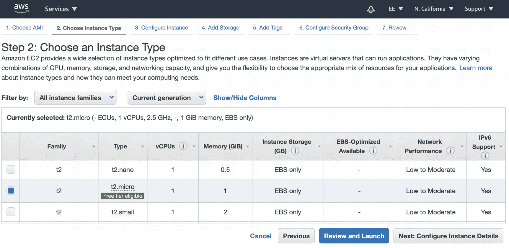
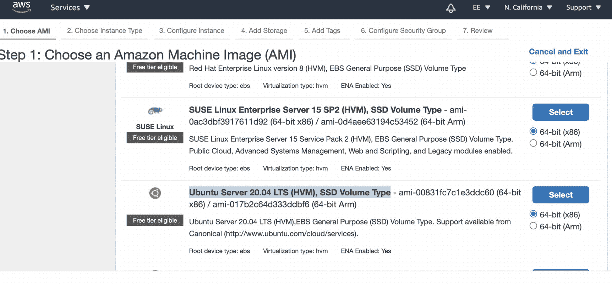
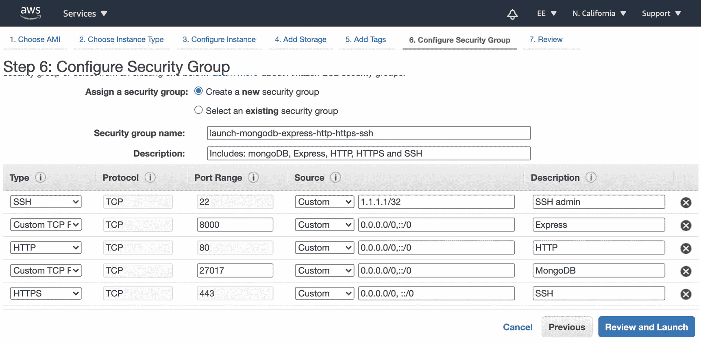
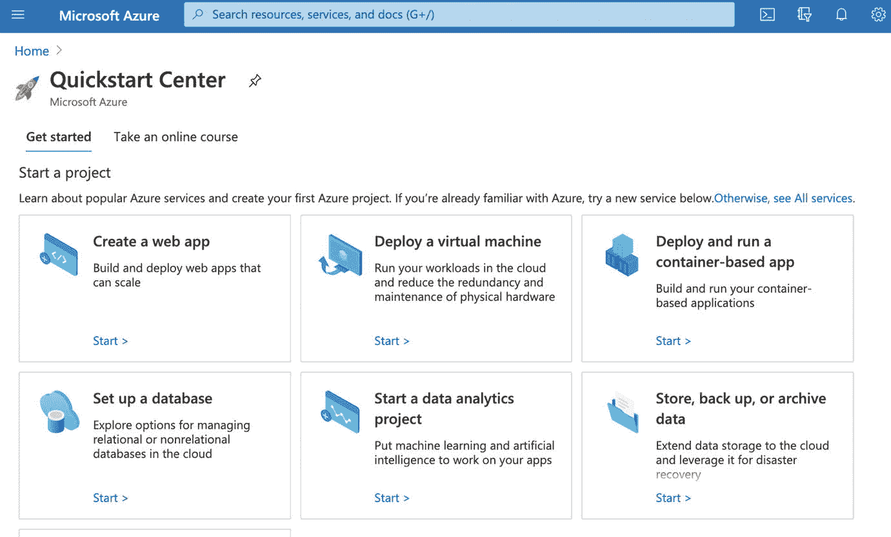
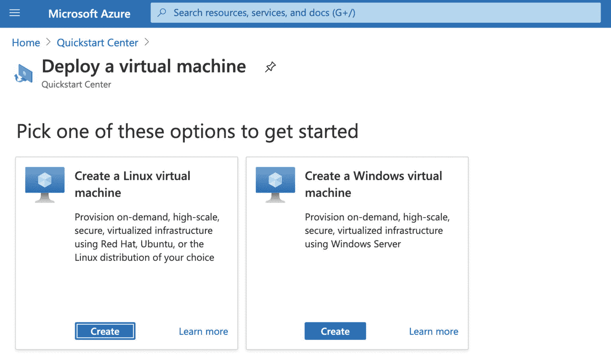

# 八、React 部署：MERN 栈

在这一章中，我们将继续上一章中我们停止的地方，并通过将我们的工作应用和 API 发布到实际的远程实时服务器来完成我们的开发周期。本章分为两个主要部分。

*   设置 Ubuntu 服务器

*   使用 Grunt 脚本发布

在我们开始之前，备份您的工作是一个很好的做法。是的，您可以在本地和外部驱动器上备份您的工作，但是在与团队合作时，您通常需要与其他人共享您的工作。一个常见的解决方案是版本控制，Git 是最流行的版本控制解决方案。如果你还没有设置版本控制工具，我强烈建议你在本章中设置它。

## 为您的项目设置 Git Repo

我们将在本章中使用的命令将把你的代码上传到你为你的项目设置的 Git repo 中，以确保你不会丢失你的工作，并且还会保存你的变更的历史。如果你从来没有设置过 Git repo，注册 GitHub 或者任何你喜欢的版本控制，然后创建一个新的 repo。在 GitHub 上，进入 [`https://github.com/new`](https://github.com/new) 创建一个新的回购。

Note

您可以将回购设置为私有(只有您可以访问)或公共(对全世界开放)。

在项目级别，在终端中设置您的 repo 的用户名和密码。

```jsx
$ git config --global user.email YOUR-EMAIL@mail.com
$ git config --global user.name "YOUR NAME"

```

Tip

强烈建议学习和设置 Git，因为它可以帮助确保您永远不会丢失您的工作。如果你不得不在团队中工作并跟踪工作历史，它也会对你有所帮助。它还有其他几个有用的特性。

## 将 Ubuntu 服务器设置为生产服务器

正如我们在前一章看到的，MERN 栈使开发过程变得更加容易。这不仅适用于开发周期，也适用于发布作品的时间。如果你遵循敏捷和 Scrum 方法论，你就会知道快速发布和经常发布是多么重要。在这一章中，我会告诉你在 Ubuntu 服务器上发布应用的步骤，包括免费设置 SSL。

### 为什么选择 Ubuntu 服务器？

当涉及到发布你的作品时，有许多服务器可以使用，有许多方法可以选择。您可以设置一个虚拟的非专用服务器，并将前端和后端分成两个独立的服务器，Heroku 和 Windows Server。你甚至可以使用无服务器框架，这里仅举几个例子。选择是无限的。

在这一节中，我们将在 Ubuntu 服务器上发布，但请记住，有许多解决方案，您需要做自己的研究，以找到最适合您正在做的事情和您的确切需求。

在 Ubuntu 服务器上用 MERN 发布有很多好处，因为我们可以设置一台服务器，让它存储我们的后端、前端和数据库。有了这个资源，除了 web 服务器之外，我们还可以运行其他脚本，比如自动化脚本。

此外，Ubuntu 服务器是世界上最流行的用于云环境的 Linux 服务器。Ubuntu 服务器为所有工作负载提供了一个很好的虚拟机(VM)平台，从 web 应用到 NoSQL 数据库，如 MongoDB 和 Hadoop。

我喜欢这种设置，因为如果我想设置 cron 作业和修改头，我可以完全控制一个专用服务器。我以前是把后端和前端分开的；但是，对于中小型非企业项目来说，在同一台服务器上安装两者更为理想。

### Ubuntu 16.04，18.04，还是 20.04？

Ubuntu 20.04 LTS，命名为 Focal Fossa，是 Ubuntu 最新的稳定版本。然而，使用最新版本并不总是最好的，因为并不是所有的服务器提供商都有这个选项，而且已经推出两年的服务器可能更“稳定”Ubuntu 版提供了一些不错的功能。它重启速度更快，并有值得探索的新功能，如高级 GUI。将支持到 2025 年 4 月。

Ubuntu 18.04 比 16.04 更稳定，16.04 已经接近生命的尽头，所以一定要麻烦安装 16.04。

如果你用 2018 年 4 月 26 日发布的仿生海狸(Ubuntu 18.04)，你将能够获得安全和更新，直到 2023 年 4 月。在我写作的时候，or 20.04 是我对 Ubuntu 服务器的建议。

Ubuntu 19.04 是一个短期支持版本，支持到 2020 年 1 月，所以这个版本应该完全跳过。

### 如何在 Ubuntu 18.04/20.04 上安装 MERN？

我把这个教程分成了五个步骤。

*   第一步:推出 Ubuntu 服务器。

*   第二步:设置 SSH 并安装服务器软件。

*   第三步:安装 MongoDB。

*   步骤 4:设置身份验证。

*   步骤 5:设置 SSL。

### 为 MERN 安装 Ubuntu 服务器

在这一节中，我将告诉你为我们的 MERN 代码建立一个 Ubuntu 服务器的步骤。如果您按照我描述的步骤操作，您将拥有一个包含 MongoDB 的 Ubuntu 服务器，它具有身份验证功能以及一个免费的安全套接字层(SSL)证书。

#### 第一步:推出 Ubuntu 服务器

第一步是推出服务器。

亚马逊 EC2 和微软阿祖拉是推出 Ubuntu 服务器最流行的方式。它们都列在 Ubuntu 网站上( [`https://ubuntu.com/public-cloud`](https://ubuntu.com/public-cloud) )。这些云解决方案可以作为你的服务器使用，但是我推荐你在这里使用 EC2 或者阿祖拉。这些只是建议。每种平台都有其优点和警告，在决定使用什么平台之前，你应该做自己的研究(DYOR)。

EC2 和阿祖拉在 Ubuntu 服务器上提供免费的专用服务器；然而，如果你不密切关注，并超过分配的使用，你经常会发现自己与一个沉重的发票。

亚马逊和阿祖拉都要求你提供你的信用卡信息，他们会在免费周期或使用结束时自动向你收费，无论哪种情况先发生。同样，如果你忘记取消，你将被收费。

Azure 同时提供 Ubuntu Server 20.04 LTS 和 18.04； [`https://azuremarketplace.microsoft.com/en-us/marketplace/apps/canonical.0001-com-ubuntu-server-focal?tab=Overview`见](https://azuremarketplace.microsoft.com/en-us/marketplace/apps/canonical.0001-com-ubuntu-server-focal%253Ftab%253DOverview)。

在任何专用服务器上，步骤都是相似的。

1.  启动 Ubuntu Server 18.04/20.04 LTS 版。

2.  设置安全措施。

1.  使用 SSH 来限制对服务器的访问，以便只有您的 IP 地址可以登录。

2.  下载密钥对。

3.  设置公共 IP 地址。

```jsx
HTTP, HTTPS ports sets as: (0.0.0.0/0, ::/0)
Custom TCP: 27017 (for MongoDB) — (0.0.0.0/0, ::/0)
Port 8000 (for express https server)

Important: For HTTP and HTTPS,
8000

```

Note

出于安全考虑，我建议将 SSH 设置为您当前的 IP 地址。这比将 SSH 端口暴露给任何 IP 地址要好得多。

这里有一个例子说明如何在 Amazon EC2 免费层上使用 Ubuntu。请遵循以下步骤:



图 8-2

EC2，选择实例类型



图 8-1

EC2，启动 Ubuntu 服务器

1.  前往 [`https://us-west-1.console.aws.amazon.com/ec2/v2/home`](https://us-west-1.console.aws.amazon.com/ec2/v2/home) 。

2.  点击实例，然后选择“Ubuntu Server 18.04 / 20.04 LTS (HVM)，SSD 卷类型- ami-06d51e91cea0dac8d (64 位 x86)”，如图 [8-1](#Fig1) 。

3.  实例类型选择 t2.micro，如图 [8-2](#Fig2) 所示。

4.  准备好仓库。您可以免费获得高达 30GB 的空间。

接下来，我们需要配置我们的安全组。



图 8-3

配置安全组

1.  配置安全组。使用 SSH、HTTP、HTTPS、自定义 TCP: 27017(对于 MongoDB)、80、8000 和 443(对于 Express HTTPS 服务器)。

    重要提示:对于 HTTP 和 HTTPS，选择“8000 (0.0.0.0/0，:/0)”并将 SSH 限制设置为我的 IP，如图 [8-3](#Fig3) 所示。

2.  通过选择 site-api-amazon-key 创建一个新的密钥对，然后单击 Download Key Pair。

3.  发射！

Tip

英特尔 x86 几乎普遍比 ARM 快。

在 Azure 上，创建免费帐户后的过程是相似的。先去 [`https://portal.azure.com/?quickstart=true`](https://portal.azure.com/%253Fquickstart%253Dtrue) 。

在快速入门中心，点击“部署虚拟机”，然后点击开始(图 [8-4](#Fig4) )。



图 8-4

Azure 快速入门中心

接下来，点击“创建一个 Linux 虚拟机”，如图 [8-5](#Fig5) 所示。



图 8-5

Azure，部署虚拟机

接下来，使用选项选择 Ubuntu 版本，选择硬盘驱动器，设置安全性，然后启动。

#### 步骤 2:设置 SSH 并安装软件和升级

现在，您已经有了一个运行并准备好的服务器(无论是 EC2、阿祖拉还是任何其他解决方案)，我们希望能够 SSH 服务器以及升级服务器的软件。我们将从让我们的生活变得简单开始。我们将创建一个 SSH 快捷方式来访问服务器。在 Mac 上，使用 vim 或您喜欢的编辑器，输入以下内容:

```jsx
$ vim ~/.ssh/config

Paste the host and the location of the pem file;
Host My-site-name
HostName YOUR-IP-ADDRESS
User ubuntu
IdentityFile location-to-pem/key.pem

```

Note

你在我们创建的 pem 文件中看到的，代表了你想要的网站名称，选择任何名称。这是您将用于 SSH 服务器的名称。要查找公共实例的 IP 地址，请查看 EC2 实例详细信息页面。

接下来，设置密钥的权限。

```jsx
$ chmod 600 *.pem

```

让我们试一试。

```jsx
$ ssh my-site-name

```

在 SSH 服务器之前，您需要设置 EC2 来接受 SSH 到您的 IP 地址。

选择 EC2，单击“安全组”，单击“编辑入站规则”，单击 SSH，单击“源类型”，然后单击我的 IP。

完成后，您就可以登录到这个盒子。我喜欢设置一些别名，以便使用预定义的命令来管理服务器。

```jsx
$ vim ~/.bash_profile

```

粘贴 PEM 文件的主机和位置。

```jsx
alias tailall='sudo lnav /home/ubuntu/www/logs'
alias tailwatchers='tail -f /home/ubuntu/www/logs/watch-log.log'
alias cleanlogs='sudo rm -f /home/ubuntu/www/logs/*.* && sudo touch /home/ubuntu/www/logs/server.log && sudo touch /home/ubuntu/www/logs/server-error.log && sudo touch /home/ubuntu/www/logs/watch-error.log && sudo touch /home/ubuntu/www/logs/watch-log.log'

alias l='ls -ltra'
alias c="clear"
alias cls="clear"
alias ll='ls -ltra'
alias killnode='sudo killall -2 node'

export PORT=8081
sudo iptables -A PREROUTING -t nat -i eth0 -p tcp --dport 80 -j REDIRECT --to-port 8081
sudo iptables -A PREROUTING -t nat -i eth0 -p tcp --dport 443 -j REDIRECT --to-port 8000

parse_git_branch() {
     git branch 2> /dev/null | sed -e '/^[^*]/d' -e 's/* \(.*\)/ (\1)/'
}
export PS1="\u@\h \[\033[32m\]\w\[\033[33m\]\$(parse_git_branch)\[\033[00m\] $ "

```

这些别名包括 Express 的端口导出、终止所有节点实例的命令、显示 Git 目录的良好设置以及访问工作目录的简洁命令。请记住运行该文件以应用这些更改。

```jsx
$ . ~/.bash_profile

```

接下来，我们希望升级并安装我们将需要的软件，比如 Python、NPM 和 Forever(以保持 Node.js 运行)。我们还需要为 Express 和其他软件设置端口。

```jsx
$ sudo apt-get update
$ sudo apt-get -y upgrade
$ sudo apt-get dist-upgrade
$ sudo apt-get install build-essential
$ sudo apt-get install libssl-dev
$ sudo apt-get install git-core
$ sudo apt-get install python2.7
$ type python3 python2.7

```

接下来，让我们在 Ubuntu 服务器上安装 Node.js。

```jsx
$ sudo apt install nodejs

```

安装 NPM 并更新至最新版本。

```jsx
$ sudo apt install npm
$ sudo npm install -g npm@latest

```

现在，创建一个 web 文件夹，我们将在其中放置我们的文件。

```jsx
$ cd ~
$ mkdir ~/www
$ cd ~/www

```

全球永久安装( [`https://github.com/foreversd/forever`](https://github.com/foreversd/forever) )。

```jsx
$ cd ~
$ sudo npm install -g forever

```

Forever 是一个简单的 CLI 工具，可以确保我们的脚本持续运行(即永远运行)。

接下来，我们要配置默认网站使用端口 8080，而不是端口 80。您可以使用以下命令将端口从 8081 转发到 80:

```jsx
$ export PORT=8081
$ sudo iptables -A PREROUTING -t nat -i eth0 -p tcp --dport 80 -j EDIRECT --to-port 8081

```

Note

如果您需要删除我们在这里设置的 iptable，只需使用`-D`标志。

sudo iptables -D 预路由-t nat -i eth0 -p tcp - dport 80 -j 重定向到端口 8081

#### 第 3 步:安装 MongoDB

我们的 MERN 服务器需要一个 MongoDB 服务器。要安装 MongoDB 服务器，请使用以下命令:

安装 MongoDB 服务器。

```jsx
$ sudo apt-key adv --keyserver hkp://keyserver.ubuntu.com:80 --recv 9DA31620334BD75D9DCB49F368818C72E52529D4

$ echo "deb [ arch=amd64 ] https://repo.mongodb.org/apt/ubuntu bionic/mongodb-org/4.0 multiverse" | sudo tee /etc/apt/sources.list.d/mongodb.list

```

现在，运行更新和安装命令。

```jsx
$ sudo apt update
$ sudo apt install mongodb-org
$ sudo systemctl unmask mongod
$ sudo systemctl enable mongod
$ sudo service mongod status

```

您可以将您的 MogoDB 状态输出与我的进行比较，如下所示:

```jsx
ubuntu@ip-ip ~/www $ sudo service mongod status
mongod.service - MongoDB Database Server
   Loaded: loaded (/lib/systemd/system/mongod.service; enabled; vendor preset: enabled)
   Active: inactive (dead) since
     Docs: https://docs.mongodb.org/manual
  Process: 903 ExecStart=/usr/bin/mongod --config /etc/mongod.conf (code=exited, status=
 Main PID: 903 (code=exited, status=0/SUCCESS)

systemd[1]: Started MongoDB Database Server.
systemd[1]: Stopping MongoDB Database Server...
systemd[1]: Stopped MongoDB Database Server.

```

现在我们已经安装了 MongoDB，请更新 MongoDB，以便所有 IP 地址都可以接收来电。为此，编辑`mongod.conf`文件。

```jsx
$ sudo vim /etc/mongod.conf

```

我们需要做的更改是将我们的端口从绑定更改为特定地址。

```jsx
net:
port: 27017
bindIp: 127.0.0.1

```

要绑定到所有传入的 IP 地址，请使用:

```jsx
net:
port: 27017
bindIpAll: true
# bindIp: 127.0.0.1

```

Note

端口 27017 应该在我们部署服务器时就已经打开了。

现在，要停止/启动/重启 MongoDB 服务以在后台运行，请使用以下命令。要启动它，请使用以下命令:

```jsx
$ sudo systemctl start mongod

```

如果您想要停止或重新启动，请使用以下命令:

```jsx
$ sudo systemctl stop mongod
$ sudo systemctl restart mongod

```

试一试，确保安装顺利。接下来，让我们创建第一个数据库来尝试 MongoDB。

```jsx
$ mongo

```

将您在 Ubuntu 服务器命令行上运行 Mongo 的输出与我的输出进行比较。它可能会输出不同的结果，但会以命令行输入提示:`>`结束。看一看:

```jsx
ubuntu@ip $ mongo
MongoDB shell version v4.0.21
connecting to: mongodb://ip:27017/?gssapiServiceName=mongodb
Implicit session: session { "id" : UUID("3236f117-2e73-4d78-bd37-eeffef73fb85") }
MongoDB server version: 4.0.20
>

```

接下来，让我们使用数据库并插入用户。

```jsx
> use your-database-name
> db.users.insert({"email":"someemail@gmail.com",  password:"123456"})
> db.users.find();

```

以下是预期的输出:

```jsx
> use your-database-name
switched to db your-database-name

> db.users.insert({"email":"someemail@gmail.com",  password:"123456"})
WriteResult({ "nInerted" : 1})
> db.users.find();
{ "_id" : ObjectId("some-objectId"), "email": "someemail@gmail.com", "password": "123456"}
>

```

##### 蒙戈布客户端

我建议设置一个 MongoDB GUI 客户端，如果您在上一章中还没有这样做的话，这样可以更容易地管理您的数据库。MongoDB Compass 基础版是免费的，易于使用，由 MongoDB 团队制作。 [`https://www.mongodb.com/products/compass`见](https://www.mongodb.com/products/compass)。

#### 步骤 4:设置身份验证

现在我们已经在远程机器上设置了 MongoDB，下一步是创建身份验证。身份验证不是可选的；它真的是远程服务器上的必备。没有身份验证，任何黑客都可以使用您的 MongoDB 数据库。您不希望未经授权的用户只是连接到您的数据库并在其上放置蠕虫。

若要设置鉴定，请在“终端”中通过 SSH 连接到远程服务器。

```jsx
$ ssh my-site-name

```

我们将创建一个新的管理员用户，并为该用户设置身份验证。看一看:

```jsx
$ mongo admin
$ db.createUser({ user: 'myuser', pwd: '123456', roles: [ { role: 'root', db: 'admin' } ]});

```

将用户添加到 MongoDB 数据库后的输出应该如下所示:

```jsx
> db.createUser({ user: 'myuser', pwd: '123456', roles: [ { role: 'root', db: 'admin' } ]});
Successfully added user: {

     "user": "myuser",
     "roles": [
               {
                    "roles": "root",
                    "db": "admin"

               }

     ]
}
> db.getUsers()

```

这将输出用户列表。

```jsx
[
   {
      "_id" : "MyDatabase.myuser",
      "user" : "myuser",
      "db" : "MyDatabase",
      "roles" : [
         {
            "role" : "readWrite",
            "db" : "MyDatabase"
         }
      ],
      "mechanisms" : [
         "SCRAM-SHA-1",
         "SCRAM-SHA-256"
      ]
   }
]

```

退出数据库。

```jsx
$ exit

```

Note

在您的密码中，您不能使用`@`符号作为密码字符串的一部分。当试图从 Express 应用连接到数据库时，您将得到“mongoparserror:un escaped at-sign in authority”。

这里，我在主数据库上设置认证，而不是在我们创建的名为`MyDatabase`的特定数据库上。

要登录到远程服务器上的数据库，请使用以下命令:

```jsx
$ mongo -u myuser -p 123456
> use MyDatabase
switched to db MyDatabase
> db.users.find();
{ "_id" : ObjectId("5fb7af6772f31b6884299994"), "email" : "someemail@gmail.com", "password" : "123456" }

```

对于健全性检查，您可以运行`getUsers`命令来确保我们的用户被正确添加。

接下来，绑定所有 IP 地址并设置安全性，这样我们就能够在启用安全性的情况下读写数据库，就像我们在本地所做的一样。

```jsx
$ sudo vim /etc/mongod.conf
net:
  port: 27017
  bindIpAll: true
  bindIp: 0.0.0.0
  security:
    authorization: 'enabled'

```

Note

如果你需要的话，你可以启用本地 ip 地址:`bindIp: 127.0.0.1`。

要应用这些更改，请重新启动。

```jsx
$ sudo systemctl restart mongod

```

##### 连接到安全的 MongoDB

现在，我们可以连接到我们的远程服务器，并传递新的认证信息。

```jsx
$ mongo -u 'myuser' -p '123456'
> use MyDatabase
switched to db MyDatabase
> db.users.find();
{ "_id" : ObjectId("5fb7af6772f31b6884299994"), "email" : "someemail@gmail.com", "password" : "123456" }

```

或者从我们的本地机器，通过终端，我们可以不使用 SSH 连接。只需告诉 Mongo 要使用的远程 IP 地址、端口和用户。

```jsx
$ mongo -u 'myuser' -p '123456' remote_ip_address:port/admin

```

现在，连接 URI 将没有数据库名称，如下所示:

```jsx
mongodb://myuser:123456@ip_address:27017

```

##### 删除用户

如果您需要删除用户并设置新用户，或者如果您忘记了密码，您需要首先删除安全性。

```jsx
$ sudo vim /etc/mongod.conf

```

然后，用`dropUser`删除用户(注意`removeUser`已弃用)。

```jsx
$ mongo admin
$ db.dropUser(myuser)

```

你可以在这里找到关于`dropUser`的信息: [`https://docs.mongodb.com/manual/reference/method/db.removeUser/#db-removeuser`](https://docs.mongodb.com/manual/reference/method/db.removeUser/%2523db-removeuser) 。

##### 更改存储位置

注意，在`mongod.conf`文件中，我们可以通过`dbPath`改变实际存储的位置。现在它被设置在这个位置:

```jsx
/var/lib/MongoDB

```

Tip

你可以把这个改成任何你喜欢的位置，比如`/data/DB`。只要确保您用正确的权限设置了路径。

如果您决定更改数据库的位置，下面是您将如何设置权限，以便 Mongo 可以访问该文件:

```jsx
$ sudo mkdir -p /data/db
$ sudo chown -R $USER:$USER /data/db

```

要查看不同路径上的数据库操作，您可以重启 MongoDB 或在新位置运行`mongod`。

```jsx
$ mongod --dbpath /data/db

```

#### 步骤 5:设置 SSL

今天在构建网站时，SSL 不是可选的。这是必须的。如果你的网站没有设置 SSL，浏览器会给你一个错误信息。

你可以为所有域名和服务器注册商设置 SSL，只需支付年费，减少麻烦，并在 SSL 检查中显示一个有信誉的 SSL 证书，但你也可以免费设置。

要免费设置 SSL，可以使用 Certbot ( [`https://certbot.eff.org/`](https://certbot.eff.org/) )。首先，安装软件。

```jsx
$ sudo apt-get install software-properties-common
$ sudo add-apt-repository universe
$ sudo add-apt-repository ppa:certbot/certbot
Enter to continue

$ sudo apt-get update
For Ubuntu 18.04;
$ sudo apt-get install certbot python-certbot-apache
For Ubuntu 20.04;
$ sudo apt-get install certbot python3-certbot-apache

```

现在设置证书。

```jsx
$ sudo certbot certonly --manual

```

命令行向导会启动并向您提问。

对于站点，使用您的站点名称，如`some-site.com`。

如果您对记录您的 IP 地址感到满意，请回答 y。请参见 Ubuntu 输出中的“设置 SSL 证书机器人向导”信息。

```jsx
ubuntu@ip-ip $ sudo certbot certonly --manual Saving debug log to /var/log/letsencrypt/letsencrypt.log Plugins selected: Authenticator manual, Installer None Enter email address (used for urgent renewal and security notices) (Enter 'c' to cancel): your-email@gmail.com
--------------------------------------------------------------
Please read the Terms of Service at https://letsencrypt.org/documents/LE—SA—v1.2—November-15-2017.pdf. You must agree in order to register with the ACME server at https://acme—v02.api.letsencrypt.org/directory
--------------------------------------------------------------
(A)gree/(C)ancel: A

--------------------------------------------------------------
Would you be willing to share your email address with the Electronic Frontier Foundation, a founding partner of the Let's Encrypt project and the non—profit organization that develops Certbot? We'd like to send you email about our work encrypting the web, EFF news, campaigns, and ways to support digital freedom.
--------------------------------------------------------------
(Y)es/(N)o: N Please enter in your domain name(s) (comma and/or space separated) (Enter 'c' to cancel): YourSite.com Obtaining a new certificate Performing the following challenges: http-01 challenge for YourSite.com

```

接下来，它将要求您证明您有权访问该域。

```jsx
Create a file containing just this data:
[SOME RANDOM GENERATE CODE]

```

使其在您的 web 服务器上可用，网址为:

```jsx
http://some-site.com/.well-known/acme-challenge/KEY

```

停下来，创建所需的文件。

将目录更改为`/home/ubuntu/www/dist/`，并按照说明创建文件。

```jsx
> cd /home/ubuntu/www/dist/
> mkdir .well-known
> cd .well-known
> mkdir acme-challenge
> cd acme-challenge
> vim "[FILE NAME]"
[CODE]

```

勾选 [`http://some-site.com/.well-known/acme-challenge/`](http://some-site.com/.well-known/acme-challenge/) `[string]`。

有用吗？太好了。现在我们可以继续了。

```jsx
Press Enter to Continue
Waiting for verification...
Cleaning up challenges

IMPORTANT NOTES:
 - Congratulations! Your certificate and chain have been saved at:
   /etc/letsencrypt/live/MY-SITE-NAME.com/fullchain.pem
   Your key file has been saved at:
   /etc/letsencrypt/live/MY-SITE-NAME.com/privkey.pem

```

设置目录的权限。

```jsx
$ sudo chown -R ubuntu:ubuntu /etc/letsencrypt

```

##### 续订证书

要续订证书，请运行以下命令:

```jsx
sudo certbot certonly --manual -d "your-site.com"

```

过程是一样的；你只需要准备好挑战。

```jsx
$ mkdir -p public/.well-known/acme-challenge

```

接下来，用数据设置文件名。

```jsx
$ vim /home/ubuntu/www/public/.well-known/acme-challenge/[file name]
[some text]

```

##### 443 安全

将 SSH 端口添加到安全部分。如果在上一步中没有添加，请使用以下命令:

```jsx
HTTPS > TCP > 443 > 0.0.0.0/0
Custom > 8000 > 0.0.0.0/0

```

如果您还记得在`vim ~/.bash_profile`中，我们正在将端口 443 重定向到 8000。

```jsx
$ sudo iptables -A PREROUTING -t nat -i eth0 -p tcp --dport 443 -j REDIRECT --to-port 8000

```

当我们创建 HTTPS 服务器时，我们应该指向端口 8000。

```jsx
let https_server = require('https').createServer({
        key: fs.readFileSync('/etc/letsencrypt/live/some-site.com/privkey.pem', 'utf8'),
        cert: fs.readFileSync('/etc/letsencrypt/live/some-site.com/cert.pem', 'utf8'),
        ca: fs.readFileSync('/etc/letsencrypt/live/some-site.com/chain.pem', 'utf8')
    }, app).listen(8000, function () {
        logger.info('Listening on https://' + os.hostname() + ':8000');
    });

```

太棒了。

## 使用 Grunt 脚本发布

当谈到自动化时，如果选择使用某些工具，设置它可能是一个棘手的问题，换句话说，是开发工作流程中一项耗时的任务。MERN 栈使开发过程更加容易。这不仅仅是对发展而言；这也适用于何时发布你的作品。

### 为什么咕哝？

谈到自动化和部署构建工具，有很多可供选择。我们已经在 CRA 项目中设置了 Webpack 包和 NPM 脚本，那么为什么我们还需要另一个库呢？

#### 咕噜与咕噜、网络包与 NPM 脚本

这个主题确实值得有它自己的一章，但是我将在这里给你一个快速的纲要。当我们查看这些工具的受欢迎程度时，我们会发现 Webpack 是最受欢迎的，Gulp 位居第二。

*   *NPM 脚本*:33600([`https://github.com/npm/cli`](https://github.com/npm/cli))

*   *咕哝*:一万二千( [`https://github.com/gruntjs/grunt`](https://github.com/gruntjs/grunt) )

*   *大口*:四万两( [`https://github.com/gulpjs/gulp`](https://github.com/gulpjs/gulp) )

*   *Webpack*:5.57 万( [`https://github.com/webpack/webpack`](https://github.com/webpack/webpack) )

虽然 Webpack 是最受欢迎的，但这并不意味着它是赢家。每个工具都是为解决特定问题而创建的。理解每个工具的用途是很重要的。

让我们后退一步。我们在这里试图实现什么？我们最重要的任务是将我们的文件发布到生产中。我们不需要做测试，林挺格式化，等等。我们在 CRA 已经有了剧本。

Webpack 是一个模块捆绑器。它适用于较大的项目，与 Grunt 和 Gulp 相比，它更难设置。它不是一个任务运行器，所以尽管它有由 Webpack 团队和社区创建的插件，但它真的不是这项工作的最佳工具。

NPM 的剧本怎么样了？CRA 已经提供了运行脚本。事实上，在我们的`package.json`文件中有一个部分指定了 NPM 运行脚本，包括调用`react-scripts`来测试和构建部署构建，我们在第 [2](02.html) 章中看到了这一点。

```jsx
"scripts": {
 "start": "react-scripts start",
 "build": "react-scripts build",
 "test": "react-scripts test",
 "eject": "react-scripts eject"
 }

```

当我们构建项目时，这些`react-scripts`脚本很好地结合到我们的开发服务器中，您可以在这里看到它们:`project/node_modules/react-scripts/scripts/start.js`。

当我们建立项目时，CRA 就是这样将我们的`node_modules`文件夹中仅有的 6 个库变成了 1000 多个。我们将通过`package.json`使用 NPM 运行脚本来自动化任务，但这不是放置自动化任务来帮助运行它们的合适位置。

为您设置的 NPM 运行脚本旨在帮助您自动运行重复性任务，我们将使用它们来设置我们的部署自动化任务。

由于我们希望创建任务来发布我们的代码(而不是构建我们的模块或进行任何林挺、格式化、测试或运行重复的任务)，Grunt 和 Gulp 更适合这项工作，它们可以在 NPM 运行脚本中设置。

我们可以排除 Webpack 和 NPM 运行脚本作为将文件发布到远程服务器的最佳工具。参见图 [8-6](#Fig6) 。


图 8-6

为发布自动化任务寻找合适的工具

Grunt 和 Gulp 是用于自动化任务的，非常适合我们这里需要做的事情。Grunt 是最老的。Grunt 是为任务配置创建的。Gulp 更受欢迎，类似于 Grunt，但是您可以使用它以比设置 Grunt 任务更直观的方式编写 JavaScript 函数。有了 Gulp，你的代码将更具可读性，所以 Gulp 在某些方面优于 Grunt。

但说到插件，Grunt 的插件数量众多，占据上风。

*   *咕哝*:6250([`https://gruntjs.com/plugins`](https://gruntjs.com/plugins))

*   *大口*:4120([`https://gulpjs.com/plugins/`](https://gulpjs.com/plugins/))

就插件而言，我们真的受到开源社区的支配，如果你找不到你需要的插件，你可能需要创建自己的插件，或者如果你的插件失败或没有得到维护，你将不得不自己修复它或添加功能。

此外，为了安全起见，我们需要确保我们的插件做它们应该做的事情，特别是当我们依赖将要进入我们的生产服务器的内容时。这是一个大问题，因为它会将你的整个发布置于危险之中，甚至会使它停止。

例如，在 2018 年末，黑客能够使用 NPM JavaScript 库( [`https://www.npmjs.com/package/event-stream`](https://www.npmjs.com/package/event-stream) )成功地将恶意代码插入事件流。这个库被数百万人使用，目标是一家名为 Bitpay 的公司，该公司有一个名为`copay` ( [`https://github.com/bitpay/copay`](https://github.com/bitpay/copay) )的 Git 库。

像许多开源库一样，开发人员在事件流上的工作没有得到报酬，在将项目交给新的维护者之前，他们对项目失去了兴趣。

新的维护者注入了针对`copay`的恶意代码。该代码从余额超过 100 比特币或 1000 比特币现金的账户中捕获账户细节和私钥。

`copay`随后在 5.0.2 版本上更新了其依赖库，并纳入了攻击者代码，导致损失数百万。

该代码捕获受害者的帐户数据和私钥，然后使用服务调用，将数据发送到攻击者的服务器而不被发现。

这次攻击的完整细节和分析可以在这里找到: [`https://blog.npmjs.org/post/180565383195/details-about-the-event-stream-incident`](https://blog.npmjs.org/post/180565383195/details-about-the-event-stream-incident) 。

综上所述，我更喜欢使用 Gulp 而不是 Grunt，因为它更符合 MERN 的 JavaScript 范式。然而，我经常选择 Grunt 而不是 Gulp，因为它的插件数量更多，而且 Grunt 也更成熟。话虽如此，但如果你使用 Gulp，我在这里做的简单任务就不会出错。

### 如何用 Grunt 发布你的剧本？

我将这一部分的过程分为两步。

*   *步骤 1* :将前端发布到远程服务器上(`app/Gruntfile.js`)

*   *步骤 2* :将后端发布到远程服务器上(`api/Gruntfile.js`)

### 使用 Grunt 发布内容

我想发布我们在同一个 Ubuntu 服务器上创建的后端和前端。对于相对较小的中小型应用来说，这是一个很好的设置。在一个更复杂的应用中部署多个服务器、负载平衡器和其他方法，在这里会显得有些矫枉过正，更难维护。

首先，全局安装 Grunt。

```jsx
$ npm install -g grunt-cli

```

此外，安装用于运行 shell 命令的`grunt-shell`插件。

```jsx
$ yarn add -D grunt-shell

```

#### 步骤 1:发布前端

您可以从如下所示的 Apress GitHub 位置下载该脚本:

```jsx
https://github.com/Apress/react-and-libraries/08/app/Gruntfile.js

```

在 Grunt 中，一切都是为了创建任务。我们将创建两个主要任务。

*   这将是我发布代码的默认任务。

*   `local-prod-build`:这将是一项模拟生产构建进行测试的任务。

我们的默认任务将执行以下操作:

1.  将我们的代码发布到我们为项目设置的 Git repo 中。

2.  `format`:通过 Airbnb 风格指南进行格式化和 lint。你还记得，我们在第 [1 章](01.html)中设置了格式和林挺。

3.  这是构建应用的内置 CRA·NPM 运行脚本。构建 React 应用的生产优化版本。

4.  `delete_old_files_api`:删除旧的`dist`文件夹，该文件夹用于存放 React 应用的优化版本。

5.  `copy_new_files_api`:将 React 应用的优化版本复制到 API 应用项目内部的 dist 中(这样我们就可以使用 Express 服务器运行我们的应用)。

6.  `server_upload_app`:上传文件到远程 Ubuntu 服务器。

7.  `stop_node`:停止生产服务器上的 Node.js 脚本。这将停止 Express 服务器。

8.  `start_node`:在生产服务器上启动 Node.js `server.js`脚本。这将启动 Express 服务器。

类似地，要设置`local-prod-build`，该任务需要执行以下任务:

1.  将我们的代码发布到我们为项目设置的 Git repo 中。

2.  使用 Airbnb 风格指南格式化我们的代码。

3.  `yarn_build`:构建 React 应用的生产优化版本。

4.  这是一个 CRA 内置的 NPM 脚本，用来创建一个本地服务器来模拟生产服务器。

5.  `open_build`:打开带有生产版本的本地主机。

为了在代码级别(`app/Gruntfile.js`)实现这些任务，这些任务和子任务看起来应该是这样的:

```jsx
// app/Gruntfile.js

module.exports = function (grunt) {  grunt.loadNpmTasks('grunt-shell');  grunt.initConfig({    /**
     * We read in our `package.json` file so we can access the package name and
     * version.
     */
    pkg: grunt.file.readJSON('package.json'),shell: {
      git_add: {
        command: [
          'git add .',
          'git add -u',
          "git commit -m '<%= pkg.version %> -> <%= pkg.commit %>'",
          'git push'
        ].join('&&')
      },
      lint: {
        command: 'yarn run lint'
      },
      format: {
        command: 'yarn run format'
      },
      yarn_build: {
        command: 'yarn build'
      },
      yarn_serve: {

        command: 'serve -s build'
      },
      open_build: {
        command: 'open http://localhost:5000'
      },
      delete_old_files_api: {
        command: 'rm -rf /YOUR-API-LOCATION/app-api/dist'
      },
      copy_new_files_api: {
        command: 'cp -rf /YOUR-APP-LOCATION/app/build/ /YOUR-API-LOCATION/app-api/dist/'
      },
      server_upload_app: {
        command: 'scp -r -i /YOUR-PEM-LOCATION/key.pem' +
            ' /YOUR-API-LOCATION/app-api/dist/* ubuntu@YOUR-UBUNTU-PUBLIC-IP:/home/ubuntu/www/dist'
      },
      stop_node: {
        command: "ssh -i /YOUR-PEM-LOCATION/key.pem ubuntu@YOUR-UBUNTU-PUBLIC-IP 'sudo pkill -f node'"
      },
      start_node: {
        command: "ssh -i /YOUR-PEM-LOCATION/key.pem ubuntu@YOUR-UBUNTU-PUBLIC-IP 'sudo forever start /home/ubuntu/www/server.js'"
      },
    }
  });
  grunt.registerTask('default', ['shell:git_add', 'shell:format', 'shell:yarn_build', 'shell:delete_old_files_api', 'shell:copy_new_files_api', 'shell:server_upload_app', 'shell:stop_node', 'shell:start_node']);
  grunt.registerTask('local-prod-build', ['shell:git_add', 'shell:format', 'shell:yarn_build', 'shell:yarn_serve', 'shell:open_build']);
};

```

注意，对于 Git 任务，我在将用于 Git 注释的`package.json`文件中设置版本和提交，因此在运行 Grunt 发布脚本之前，需要在`package.json`中设置版本和提交消息。

```jsx
{
  "name": "api",
  "version": "0.0.0872",
  "commit": "add service call",

```

我们现在可以使用一个命令为生产服务器进行部署。

```jsx
$ grunt

```

您还可以运行任务，在我们的本地机器上创建生产版本。

```jsx
$ grunt local-prod-build

```

我们能让它变得更简单吗？没错。让我们把 Grunt 和 NPM 剧本联系起来。在`package.json`文件的脚本标签中，添加一个“推送”脚本。

```jsx
"scripts": {
  ...
  "push": "grunt"
}

```

既然我们的任务自动化更好地绑定到了我们的 NPM 脚本，我们可以试一试了。

```jsx
$ yarn push # or npm push

```

#### 步骤 2:将后端代码发布到远程服务器

接下来，在我们的后端，我们希望能够用一个命令发布 Node.js Express 应用，就像我们对前端代码所做的那样。

您可以从 Apress GitHub 站点下载该脚本。

[T2`https://github.com/Apress/react-and-libraries/08/api/Gruntfile.js`](https://github.com/Apress/react-and-libraries/08/api/Gruntfile.js)

我们将创建三个任务。

*   `default`:默认任务将代码上传到远程服务器。

*   `upload-app`:上传 React 代码到远程服务器。我们已经在 Grunt 任务中这样做了，但是在这里这样做也没有坏处。

*   `node-restart`。重启 Node.js，这将重启我们的 Express 应用。

##### 默认任务

我对上传的内容更有选择性，因为我不想每次推送都上传所有文件。请遵循以下步骤:

1.  `multiple`:将 API 代码发布到 Git。

2.  `server_package`:上传`package.json`文件到远程服务器。

3.  `stop_node`:停止 Node.js。

4.  `upload_server_file`:上传`server.js`文件。

5.  `server_upload_services`:上传任何 get 类型的服务。

6.  `server_upload_services_post`:上传任何帖子类型的服务。

7.  `server_upload_utils`:上传实用文件夹。

8.  `start_node`:再次启动 Node.js，因为它在上一个任务中已经停止。

你可能需要不同的文件夹和文件，但你知道的。如果需要，可以随意添加。让我们回顾一下这些任务。

##### 上传应用任务

您还记得，使用我们设置的`app/Gruntfile.js`任务将生产文件从我们的 CRA 复制到 API 服务器的`dist`文件夹中。我们在这里设置的任务可以使用我们设置的任务将这些文件上传到远程服务器。

##### 节点重启任务

这个任务是在需要的时候重启 Node.js。在不需要 SSH 服务器的情况下，在一个命令中使用它是很好的。我们将在`Gruntfile.js`中设置两个任务来轻松地停止和启动节点脚本

1.  停止节点

2.  开始节点

看一下代码，如下所示:

```jsx
// api/Gruntfile.js

module.exports = function (grunt) {    grunt.loadNpmTasks('grunt-replace');
    grunt.loadNpmTasks('grunt-shell');
    grunt.loadNpmTasks('grunt-open');    grunt.initConfig({        /**
         * We read in our `package.json` file so we can access the package name and
         * version.
         */
        pkg: grunt.file.readJSON('package.json'),        shell: {
            multiple: {
                command: [

                    'git add .',
                    'git add -u',
                    "git commit -m '<%= pkg.version %> -> <%= pkg.commit %>'",
                    'git push'
                ].join('&&')
            },
            upload_server_file: {
                command: 'scp -r -i /YOUR-APP-LOCATION/app/docs/keys/ee-amazon-key.pem /YOUR-API-LOCATION/api/server.js ubuntu@YOUR-UBUNTU-PUBLIC-IP:/home/ubuntu/www/'
            },
            server_upload_services: {
                command: 'scp -r -i /YOUR-APP-LOCATION/app/docs/keys/ee-amazon-key.pem /YOUR-API-LOCATION/api/services/* ubuntu@YOUR-UBUNTU-PUBLIC-IP:/home/ubuntu/www/services'
            },
            server_upload_services_post: {
                command: 'scp -r -i /YOUR-APP-LOCATION/app/docs/keys/ee-amazon-key.pem /YOUR-API-LOCATION/api/services_post/* ubuntu@YOUR-UBUNTU-PUBLIC-IP:/home/ubuntu/www/services_post'
            },
            server_package: {
                command: 'scp -i /YOUR-APP-LOCATION/app/docs/keys/ee-amazon-key.pem /YOUR-API-LOCATION/api/package.json ubuntu@YOUR-UBUNTU-PUBLIC-IP:/home/ubuntu/www/package.json'
            },
            server_upload_utils: {
                command: 'scp -r -i /YOUR-APP-LOCATION/app/docs/keys/ee-amazon-key.pem /YOUR-API-LOCATION/api/utils/* ubuntu@YOUR-UBUNTU-PUBLIC-IP:/home/ubuntu/www/utils'
            },
            server_upload_app: {
                command: 'scp -r -i /YOUR-APP-LOCATION/app/docs/keys/ee-amazon-key.pem /YOUR-API-LOCATION/api/dist/* ubuntu@YOUR-UBUNTU-PUBLIC-IP:/home/ubuntu/www/dist'
            },
            stop_node: {
                command: "ssh -i /YOUR-APP-LOCATION/app/docs/keys/ee-amazon-key.pem ubuntu@YOUR-UBUNTU-PUBLIC-IP 'sudo pkill -f node'"
            },
            start_node: {
                command: "ssh -i /YOUR-APP-LOCATION/app/docs/keys/ee-amazon-key.pem ubuntu@YOUR-UBUNTU-PUBLIC-IP 'sudo forever start /home/ubuntu/www/server.js'"
            }

        }
    });    grunt.registerTask('default', ['shell:multiple', 'shell:server_package', 'shell:stop_node', 'shell:upload_server_file', 'shell:server_upload_services', 'shell:server_upload_services_post', 'shell:server_upload_utils', 'shell:start_node']);
    grunt.registerTask('upload-app', ['shell:server_upload_app']);
    grunt.registerTask('node-restart', ['shell:stop_node','shell:start_node']);
};

```

太棒了。

我们可以运行默认脚本。

```jsx
$ grunt

```

在这一节中，我将这个过程分为两步。

*   步骤 1:用 Grunt 将前端发布到远程服务器

*   步骤 2:用 Grunt 将后端发布到远程服务器

现在我们已经将 React 应用和 API 文件上传到了远程 Ubuntu 服务器上。我们还设置了化名。我们可以使用以下命令。

使用 SSH 连接到服务器。

```jsx
$ ssh my-site-name

```

使用`cdr`别名导航到目录`/home/ubuntu/www`。

```jsx
$ cdr

```

要启动节点而不是`$ sudo forever start`，我们可以使用`startnode`别名。

```jsx
$ startnode

```

要停止 Node.js，不使用`$ sudo forever stop 0`，我们可以使用`stopnode`别名。

```jsx
$ stopnode

```

要查看所有别名，请键入以下内容:

```jsx
$ vimb

```

如果一切设置正确无误，您应该能够使用您的服务器的公共 IP 地址访问我们在前面章节中构建的应用。

看看 Ubuntu 的一些示例输出，通过 SSH 连接到服务器，停止 Node.js 服务器，并在 Forever 的帮助下再次启动它。然后你可以把你的输出和我的进行比较。

```jsx
ubuntu@ip ~ $ cdr
ubuntu@ip ~/www $ stopnode # stopall # or stopall
ubuntu@ip ~/www $ startnode
warn:    --minUptime not set. Defaulting to: 1000ms
warn:    --spinSleepTime not set. Your script will exit if it does not stay up for at least 1000ms
info:    Forever processing file: /home/ubuntu/www/server.js

ubuntu@ip ~/www $ shownodes
root     23924     1  0 18:38 ?        00:00:01 /usr/bin/node /home/ubuntu/www/server.js
ubuntu   24052 23003  0 18:41 pts/1    00:00:00 grep node

```

注意，我使用的是我们在设置服务器时设置的命令，比如`shownodes`，它显示了所有正在运行的节点(`ps -ef | grep node`)。如您所知，您可以使用(`$ vimb`)查看命令，这相当于`vim ~/.bash_profile`。

## 摘要

在这一章中，我们首先为我们的项目设置了一个 Git repo，这样我们就可以与我们团队的其他成员(如果我们有的话)共享我们的项目，并保存我们的变更历史。我们还将获得使用版本控制的许多其他特性和优势。

我们研究了为什么使用 Ubuntu 服务器以及使用什么版本，并且我们将 Ubuntu 服务器设置为 React 应用和 Node.js Express API 脚本的生产服务器。

接下来，我们在 Ubuntu 服务器上安装了 MERN 栈，并为 MERN 栈设置了 Ubuntu 服务器。一旦我们有了为我们设置的服务器，我们期待发布我们的代码。我们首先看了使用 Grunt 的优势以及我们的其他选择。然后，我们看了如何用 Grunt 发布我们的 React 和 Express 脚本，并创建了一个 Grunt 文件来自动化我们的任务，这样我们就可以经常发布和发布。在下一章，我们将研究如何测试我们的 React 应用。