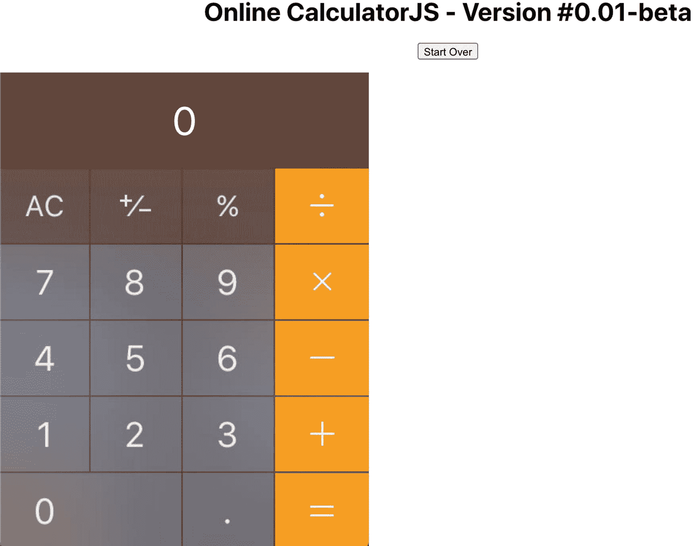
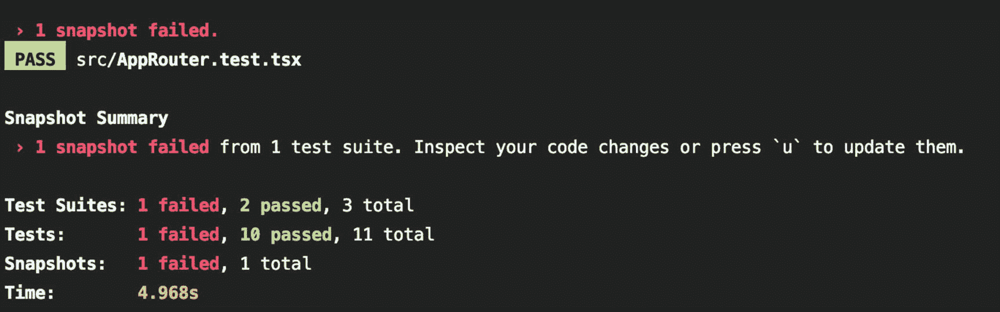
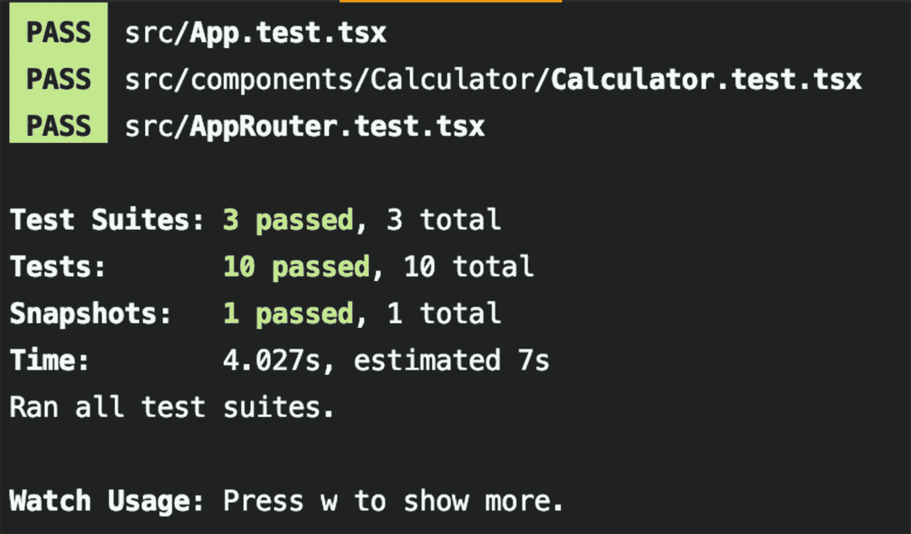
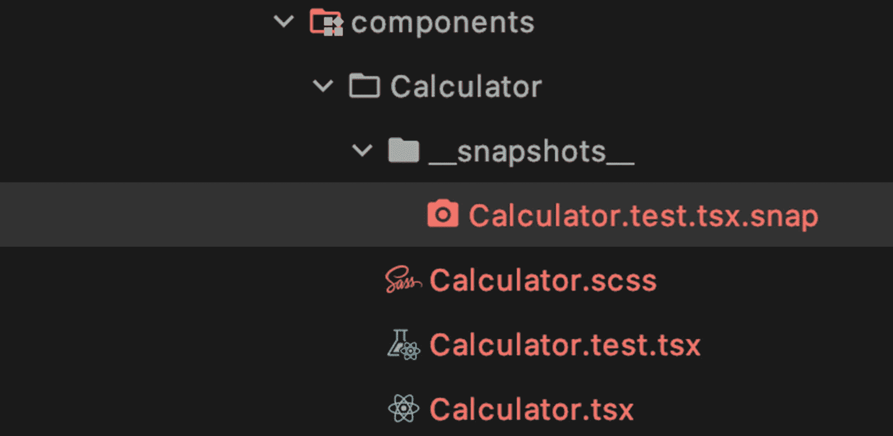
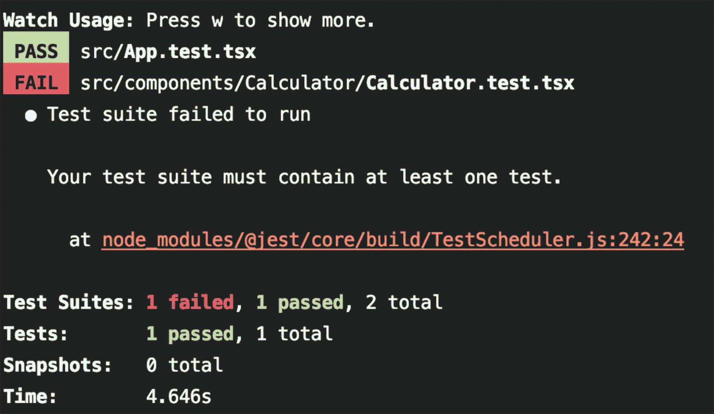
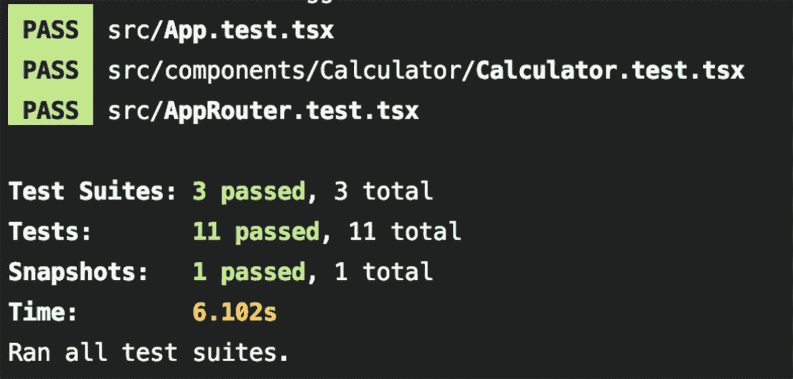

# 九、测试第一部分：React 应用的单元测试

在测试 React 应用时，需要考虑三个方面的测试。

*   *单元测试*:测试能够被隔离的最小的一段代码。

*   *集成测试*:将单个模块组合在一起进行测试

*   *E2E 测试*:模拟真实的最终用户体验

在这一章中，你将学习如何像专家一样对 React 应用进行单元测试。

说到单元测试，有很多库可以和 React 一起使用，比如 Jest、Enzyme、Sinon、Mocha、Chai、和 Tape。这些库被认为是最常用的 React 单元测试库。

在这一章中，你将学习如何利用 Jest、Enzyme 和 Sinon 对你的应用进行单元测试。

## 设置项目

为了了解如何对 React TypeScript 组件进行单元测试，我们将创建一个新项目。我们项目的最终结果将是一个计算器组件。见图 [9-1](#Fig1) 。



图 9-1

我们的计算器组件的最终结果

首先，我们将使用本书中一直使用的 CRA 项目模板。您还记得，要设置 CRA·MHL 项目模板，我们只需要一行命令。这将设置我们这个项目所需的大部分。

对于项目名称，我们将使用`hello-jest-enzyme-ts`。

```jsx
$ yarn create react-app hello-jest-enzyme-ts --template must-have-libraries

```

一旦安装完成，你会得到一个“快乐的黑客！”消息。接下来，我们将使用`generate-react-cli`模板 CLI 创建计算器 TS 组件。

```jsx
$ cd hello-jest-enzyme-ts
$ npx generate-react-cli component Calculator

```

终端输出将确认这三个文件是为我们创建的:

*   *样式表* : `src/components/Calculator/Calculator.scss`

*   *测试* : `src/components/Calculator/Calculator.test.tsx`

*   *组件* : `src/components/Calculator/Calculator.tsx`

最后，确保您仍然可以运行项目，并确保一切按预期运行。

```jsx
$ yarn start

```

这不是我们第一次讨论单元测试。在前面的章节中，我们运行了`format`、`lint`和`test`命令。

```jsx
$ yarn format & yarn lint & yarn test

```

你在第 2 章[中学习了格式化和林挺，并为我们的项目安装了所有的测试库。我们还让`generate-react-cli`为我们生成测试。我们已经为我们设置了 Jest 测试和`package.json` run 脚本。](02.html)

接下来，让我们回顾一下我们将使用的主要测试库。

*   玩笑

*   有房子吗

*   酶

*   不然呢

## Jest 库是什么？

Jest ( [`https://github.com/facebook/jest`](https://github.com/facebook/jest) )是一个脸书 JavaScript 单元测试框架。它可以用于任何 JavaScript 项目。

Jest 是一个测试运行器、断言库和嘲讽库。如果需要，它还会提供快照。以下是它的好处:

*   *开发者就绪*:这是一个全面的 JavaScript 测试解决方案。它适用于大多数 JavaScript 项目。

*   *即时反馈*:它有一个快速的、交互式的观看模式，只运行与更改的文件相关的测试文件。

*   *快照测试*:它捕获大型对象的快照，以简化测试并分析它们如何随时间变化。

你可以在这里找到 Jest 文档: [`https://jestjs.io/docs/en/tutorial-react`](https://jestjs.io/docs/en/tutorial-react) 。

## 什么是笑话王国？

Jest-dom ( [`https://github.com/testing-library/jest-dom`](https://github.com/testing-library/jest-dom) )是一个使用定制匹配器来扩展 Jest 的库，使得对 dom 元素的断言更加容易。

Jest-dom 不需要使用 react 测试库，但是它使得编写我们的测试更加方便。

你可以在这里找到 Jest-dom 文档: [`https://noriste.github.io/reactjsday-2019-testing-course/book/intro-to-react-testing/jest-dom.html`](https://noriste.github.io/reactjsday-2019-testing-course/book/intro-to-react-testing/jest-dom.html) 。

## 酶是什么？

Enzyme ( [`https://github.com/enzymejs/enzyme`](https://github.com/enzymejs/enzyme) )是一个为 React 构建的 JavaScript 测试实用程序，可以更容易地测试 React 组件的输出。

在给定输出的情况下，您还可以操纵、遍历和以某种方式模拟运行时。

Enzyme 的 API 旨在通过模仿 jQuery 的 DOM 操作和遍历 API 来实现直观和灵活。

Note

Enzyme 可以不用 Jest，但是需要搭配另一个单元测试框架。你可以在这里找到酵素文档: [`https://airbnb.io/enzyme/docs/api/`](https://airbnb.io/enzyme/docs/api/) 。

## 不然呢？

Sinon ( [`https://github.com/sinonjs/sinon`](https://github.com/sinonjs/sinon) )是一个独立的测试 JS 框架，包括测试间谍、存根和模拟。发音是"叹息-非"

## 你为什么要学笑话和酶？

Jest+Jest-DOM+Enzyme+React = React 项目的完整测试能力。

Jest 和 Enzyme 很好地集成在一起，提供了灵活和创造性的测试能力。Sinon 增加了功能。

以下是一些有趣的事实:

*   Jest 由脸书创建并用于测试其服务和 React 应用。

*   Create-React-App 捆绑了 Jest 和 Jest-DOM；它不需要单独安装。

*   酵素工具是 Airbnb 创造的。

*   Sinon 可以嵌入 Jest + Enzyme 框架，由 Airbnb 赞助。

如果你认为测试既昂贵又耗时，那就试试*而不是*测试。从长远来看，这将花费你更多的钱。

你知道吗，QA 和软件测试公司 QualiTest 对 1000 多名美国人进行的一项调查显示，88%的人在遇到错误或故障时会放弃一个应用。

*   其中约 51%的人表示，如果他们每天至少遇到一个 bug，他们可能会完全停止使用某个应用。

*   此外，32%的受访者表示，他们可能会在遇到故障时放弃某个应用。

## 怎样可以学会笑话和酶？

为了帮助你理解 Jest 和 Enzyme，我将本教程中的过程分解为三个步骤。

*   *步骤 1* :设置和配置我们的项目

*   *步骤 2* :为自定义计算器组件编写代码

*   第三步:测试代码

如果你想更好地理解我们正在使用的库，我们也会深入了解一下。

## 创建和测试计算器组件

在本节中，我们将创建自定义的 React 组件，这是一个计算器，并设置一些测试。我们的组件将被打印，我们将利用 Jest 和 Enzyme 来测试组件。

### 步骤 1:设置和配置我们的项目

对于 Enzyme，我们希望安装 React 16 适配器(这是最新版本，但在您阅读本文时可能会发生变化)，它可以与 React 17 一起工作。我们还需要安装`react-test-renderer`，这样我们就可以将 React 组件呈现为纯 JavaScript 对象，而不依赖于 DOM。这将有助于我们拍摄快照。

Note

酶、酶适配器和 JSON 库的酶都是 CRA·MHL 模板项目自带的，所以不需要安装它们。不过，如果您想从 CRA 的普通版本开始，下面是命令:

`$ yarn add enzyme enzyme-adapter-react-16 react-test-renderer`

我们将使用 Jest 的快照测试特性来自动将 JSON 树的副本保存到一个文件中，并通过我们的测试来检查它是否没有改变。

在这里阅读更多关于这个特性: [`https://reactjs.org/docs/test-renderer.html`](https://reactjs.org/docs/test-renderer.html) 。

我们想让我们的生活更简单，所以我们将安装`enzyme-to-json`库( [`https://github.com/adriantoine/enzyme-to-json#readme`](https://github.com/adriantoine/enzyme-to-json%2523readme) )来简化我们的代码。查看本章中的“引擎盖下”一节，了解更多详情。

```jsx
$ yarn add -D enzyme-to-json

```

对于我们的计算器，我将使用 macOS 内置计算器来计算我的图形。我将使用图像映射来映射每个键，把图像变成一个可点击的按钮。

为了做到这一点，我们将安装一个`react-image-mapper`组件( [`https://github.com/coldiary/react-image-mapper`](https://github.com/coldiary/react-image-mapper) )，它让我们映射图像的区域。

```jsx
$ yarn add react-image-mapper

```

我们已经建立了项目，并安装了开始项目所需的所有库。

### 步骤 2:创建我们的定制组件

在代码级别，我正在创建一个定制的计算器组件。我所做的是截取一张 macOS 计算器的截图，然后使用一个在线工具将该图像(`image-map.net`)映射到一个可点击的地图区域。我没有将图形用于生产部署。我在这里只是用它来说明测试过程。如果您构建生产代码，您将需要获得使用该图形的权限。此外，请注意我使用的是`image-map.net`，但是有许多在线工具和程序来绘制图像，我与该网站没有任何关系。

您可以从 Apress GitHub 下载整个项目。

```jsx
https://github.com/Apress/react-and-libraries/09/hello-jest-enzyme-ts

```

我们一起来复习一下代码。

```jsx
// src/components/Calculator/Calculator.tsx

import React from 'react'
import './Calculator.scss'

```

注意，对于`ImageMapper`组件，我在`import`语句前放置了一个`@ts-ignore`注释。那是因为`ImageMapper`组件是 JS 组件，不是为 TS 设置的，没有类型。这将导致 Lint 编译时错误。

```jsx
// @ts-ignore
import ImageMapper from 'react-image-mapper'

```

接下来，我将设置放置图像的 URL，并绘制图像区域。我正在使用`export`常量语句，所以如果需要的话，我可以在我的测试文件中使用相同的`const MAP`代码。

```jsx
export const URL = 'calculator.jpg'
export const MAP = {
  name: 'my-map',
  areas: [
    {
      name: '0',
      shape: 'rect',
      coords: [3, 387, 227, 474],
    },
    {

      name: '1',
      shape: 'rect',
      coords: [2, 291, 112, 382],
    },
    {
      name: '2',
      shape: 'rect',
      coords: [116, 290, 227, 382],
    },
    {
      name: '3',
      shape: 'rect',
      coords: [342, 382, 232, 290],
    },
    {
      name: '4',
      shape: 'rect',
      coords: [3, 194, 111, 290],
    },
    {
      name: '5',
      shape: 'rect',
      coords: [115, 193, 227, 290],
    },
    {
      name: '6',
      shape: 'rect',
      coords: [231, 194, 343, 290],
    },
    {
      name: '7',
      shape: 'rect',
      coords: [4, 97, 111, 191],
    },
    {
      name: '8',
      shape: 'rect',
      coords: [115, 99, 227, 191],
    },
    {
      name: '9',
      shape: 'rect',
      coords: [231, 98, 343, 191],
    },
    {
      name: '+',
      shape: 'rect',
      coords: [348, 291, 463, 382],
    },
    {
      name: '-',
      shape: 'rect',
      coords: [348, 195, 463, 290],
    },
    {

      name: '*',
      shape: 'rect',
      coords: [348, 98, 463, 191],
    },
    {
      name: '/',
      shape: 'rect',
      coords: [348, 3, 463, 93],
    },
    {
      name: '=',
      shape: 'rect',
      coords: [348, 387, 463, 474],
    },
  ],
}

```

接下来，我用`prop`接口(`ICalculatorProps`)和状态接口(`ICalculatorState`)设置类定义语句。我也在为类本身设置一个接口(`ICalculator`)。这样做的原因是我可以转换我的类的一个实例，我将在我的测试中使用这个接口。

对于`ICalculator`，它将具有与 React 组件语句相同的签名。它需要包含我们将要定义和使用的类的方法:`startOver`、`calculateTwoNumbers`和`clicked`。对于`startOver`，我将它设置为`?`只是为了向你展示如何设置一个不需要实现的方法。

```jsx
export interface ICalculator extends React.PureComponent<ICalculatorProps, ICalculatorState> {
  startOver?(): void
  calculateTwoNumbers(num1: number, num2: number, operator: string): void
  clicked(btnName: string): void

}

```

对于`ICalculatorProps`，我将传递一个标题和版本。

```jsx
interface ICalculatorProps {
  componentTitle: string
  version: string
}

```

对于`ICalculatorState`，我们需要存储计算器的输出，即运算符类型和我们正在处理的两个数字。

```jsx
interface ICalculatorState {
  output: number
  operatorType: string
  number1: number
  number2: number
}

```

现在我们已经准备好了接口，我们可以定义我们的`Calculator`类了。

```jsx
export default class Calculator
  extends React.PureComponent<ICalculatorProps, ICalculatorState>
  implements ICalculator {
  constructor(props: ICalculatorProps) {
    super(props)

```

对于初始状态，我们设置默认值。

```jsx
    this.state = {
      output: 0,
      operatorType: '',
      number1: 0,
      number2: -1,
    }
  }

```

`startOver`方法只是将初始默认值设置回计算器。我们可以用它来重新开始，计算新的数字。

```jsx
startOver = () => {
  this.setState((prevState) => {
    return {
      ...prevState,
      operatorType: '',
      number1: 0,
      number2: -1,
      output: 0,
    }
  })
}

```

我们举重若轻的方法是`calculateTwoNumbers`。它需要两个数字和一个运算符，然后进行数学运算。

```jsx
calculateTwoNumbers = (num1: number, num2: number, operator: string) => {
  let retVal = 0
  switch (operator) {
    case '+':
      retVal = num1 + num2
      break
    case '-':
      retVal = num1 - num2
      break
    case '*':
      retVal = num1 * num2
      break
    case '/':
      retVal = num1 / num2
      break
    default:
      // eslint-disable-next-line no-alert
      alert('Operator not recognized')
  }
  return retVal
}

```

点击处理程序期望按钮名称被传递，一个开关将处理不同的用例。我只实现了数字、加号和等号按钮，但是请继续并完成这段代码。

```jsx
clicked = (btnName: string) => {
  switch (btnName) {
    case '-':
    case '*':
    case '/':
    case '+':
      this.setState((prevState) => {
        const newState = Number(prevState.output)
        return {

          ...prevState,
          operatorType: btnName,
          number1: newState,
        }
      })
      break
    case '=':
      this.setState((prevState) => {
        const newState = this.calculateTwoNumbers(
          prevState.number1,
          Number(prevState.output),
          prevState.operatorType
        )
        return {
          ...prevState,
          output: newState,
        }
      })
      break
    default:
      this.setState((prevState) => {
        const isFirstDigitNumber2 = prevState.operatorType && prevState.number2 === -1
        const newNumberState = isFirstDigitNumber2 ? 0 : prevState.number2
        const newOutput = isFirstDigitNumber2
          ? Number(btnName)
          : Number(prevState.output + btnName)
        return {
          ...prevState,
          number2: newNumberState,
          output: newOutput,
        }
      })
  }
}

```

对于 render 方法，我们将创建一个按钮来单击重新开始，并将其链接到`startOver`方法。对于计算器，我们将使用设置了映射区域`MAP`的`ImageMapper`组件。

```jsx
  render() {
    return (
      <>

          <a href="http://twitter.com/elieladelrom" className="follow">
            @elieladelrom

          </a>
          <h1 className="title">
            {this.props.componentTitle} - Version #{this.props.version}
          </h1>
          <p>
            <button id="btn" onClick={this.startOver}>Start Over</button>
          </p>
          <div className="calculator-output">{this.state.output}</div>
          <ImageMapper src={URL} map={MAP} onClick={(area: { name: string }) => { this.clicked(area.name) } } />

      </>
    )
  }
}

```

注意，我已经用我的 Twitter 句柄添加了一个`div`。这可能看起来像是无耻的自我推销，但我想把它包括进来，以便向您展示如何做一些测试。

这与允许我们重新开始的按钮和我们将设置为属性的标题是一样的。我们将使用这两者进行测试。

对于 SCSS，我正在创建一个样式来格式化我的输出。

```jsx
// src/components/Calculator.scss

.calculator-output
{
    background:url('/calculator-input.jpg') no-repeat right top;
    color:#fff;
    font-size:50px;
    width: 464px;
    height: 120px;
    text-align: center;
    display: flex;
    justify-content: center;
    align-items: center;
}

```

接下来，我们需要更新我们的`App.js`文件以包含我们的定制组件，这样当我们转到`http://localhost:3000`时就可以看到我们的组件。

```jsx
// src/App.ts

import React from 'react';
import './App.scss';
import Calculator from "./components/Calculator";

function App() {
  return (
    <div className="App">
      <Calculator componentTitle="Online Calculator" version="0.01-beta"/>
    </div>
  );
}
export default App

;

```

就这样。我们现在可以运行代码(`$ yarn start`)，并且能够查看和使用我们的计算器。

正如我之前提到的，我没有映射所有的计算器键和功能，只是基本的，但可以随意完成任务。最终结果见图 [9-1](#Fig1) 。

### 步骤 3:测试代码

在我们运行测试之前，我们需要对我们的测试环境做更多的配置。我还想向您展示开箱即用的产品。好消息是，我们需要的大部分已经为您设置了 CRA MHL 模板项目。

#### 设置适配器

打开`src/setupTests.ts`，你会看到它配置了酶适配器和 Jest-dom。这允许我们添加自定义 Jest 匹配器来断言 DOM 节点。

```jsx
// src/setupTests.ts
import '@testing-library/jest-dom/extend-expect'

import { configure } from 'enzyme';
import Adapter from 'enzyme-adapter-react-16'
configure({ adapter: new Adapter() });

```

#### 使用 enzyme-to-json 设置快照

为了获得快照，我们需要在`package.json`文件中创建`snapshotSerializers`标签。这将创建一个快照并加速 Jest 测试。

```jsx
// package.json
"jest": {
  "snapshotSerializers": [
    "enzyme-to-json/serializer"
  ]
},

```

一旦我们的测试发生变化，快照将需要更新(按 U 键更新)，否则您将收到一条错误消息。参见图 [9-2](#Fig2) 。



图 9-2

测试套件中的快照失败

这在我们运行 Jest 并持续使用 Jest watcher 特性的`--watch`标志时尤其有用。

Tip

Jest 中的`--watch`标志将持续运行您的测试。

你不需要设置任何东西。`package.json`文件已经包含了一个 NPM 运行脚本，它使用`react-scripts`来运行带有观察器的测试。

```jsx
// package.json

"scripts": {
  ...
  "test": "react-scripts test"
}

```

对于我们的测试，我们有两个现成的测试，CRA·MHL 负责`App.test.tsx`和`AppRouter.test.tsx`。事实上，在前面的章节中，我们运行的是`$yarn`测试命令，这些测试是为我们运行的。

#### 测试应用组件:App.test.tsx

打开通过 CRA 模板项目提供的`src/App.test.js`文件。我们在这里的测试是为了确保我们的计算器组件包含在我们的`App.tsx`组件中，并且不会崩溃。

```jsx
// src/App.test.tsx

describe('<App />', () => {
  let component

  beforeEach(() => {
    component = shallow(<App />)
  })
  test('It should mount', () => {
    expect(component.length).toBe(1)
  })
})

```

#### 测试路由组件:AppRouter.test.tsx

`AppRouter.test.tsx`也是如此。我们希望确保添加路由时不会崩溃。我们还可以进行其他测试。这只是基本的测试，理想情况下，我们希望涵盖每个功能。

```jsx
// src/AppRouter.test.tsx
import React from 'react'
import { shallow } from 'enzyme'
import AppRouter from './AppRouter'

describe('<AppRouter />', () => {
  let component

  beforeEach(() => {
    component = shallow(<AppRouter />)
  })

  test('renders without crashing', () => {
    expect(component.length).toBe(1)
  })
})

```

现在我们已经准备好了第一个测试，我们可以运行它了。

为了在我们的模板上运行我们的测试，我们的项目已经配备了一个测试脚本来处理一切。我们可以使用 CRA 提供的测试 NPM 脚本。运行测试命令。

```jsx
$ yarn test # or npm run test

```

我们第一次使用测试脚本时，我们得到一条消息，如下所示:

```jsx
Watch Usage
 › Press a to run all tests.
 › Press f to run only failed tests.
 › Press u to update failing snapshots.
 › Press q to quit watch mode.
 › Press p to filter by a filename regex pattern.
 › Press t to filter by a test name regex pattern.
 › Press Enter to trigger a test run.

```

现在的情况是创建了一个快照，我们可以按 A 来运行所有的测试。这个脚本将继续运行，并不断更新，因此您可以确保在编写代码时没有破坏任何功能。

我们获得了完整的测试套件、测试和测试的快照结果。见图 [9-3](#Fig3) 。



图 9-3

测试套件、测试和快照测试结果

我们只创建了一个测试。然而，当我们运行`generate-react-cli`命令时，我在`templates/test.js`中为您包含的模板文件为我们创建了测试，这是一个典型的测试模板。让我们看一下代码。

```jsx
// src/components/Calculator/Calculator.test.tsx

import React from 'react';
import { shallow } from 'enzyme';
import Calculator from './Calculator';

describe('<Calculator />', () => {
    let component;

    beforeEach(() => {
        component = shallow(<Calculator />);
    });

    test('It should mount', () => {
        expect(component.length).toBe(1);
    });
});

```

测试是检查计算器组件是否已安装并且没有出现故障。我希望您注意到，在我们的计算器组件文件夹(`src/components/Calculator`)中，添加了一个名为`__snapshots__`的新文件夹。见图 [9-4](#Fig4) 。



图 9-4

计算器组件内的快照文件夹

这个文件夹保存了测试文件`Calculator.test.tsx.snap`，只要我们的 Yarn 测试脚本还在运行，它就会被更新。要停止脚本，只需按 Command+C。

当我们更改代码时，测试观察特性会告诉我们测试中断了。例如，要破解代码，清空`Calculator.test.tsx`文件的内容并保存它。见图 [9-5](#Fig5) 。正如您所看到的，由于测试文件中至少缺少一个测试，我们的测试中断了。



图 9-5

由于清除 Calculator.tsx 文件中的代码，测试套件失败

#### 创建我们的计算器组件测试文件

Jest 的工作方式是，它将在以下任何位置查找测试文件:

*   `__tests__`文件夹中带有`.js`和`.ts`后缀的文件

*   带有`.test.js`和`.test.ts`后缀的文件

*   带有`.spec.js`和`.spec.ts`后缀的文件

`generate-react-cli`自动为我们创建`Calculator.test.tsx`。我喜欢测试后缀，因为它很简单，但是`.spec.js`是其他框架的标准，比如 Angular，所以无论你选择什么都可以。

让我们重构我们的代码。在我们的组件测试文件中，我们可以测试一些东西。首先导入 React，我们将使用的酶 API(`shallow`和`mount`，以及我们的自定义组件计算器。

```jsx
// src/components/Calculator/Calculator.test.tsx

import React from 'react'
import { shallow } from 'enzyme'
import Calculator, { ICalculator } from './Calculator'

```

我们需要 React 库，Enzyme 项目中的`shallow`和`mount`特性来访问 DOM 上的方法，最后是我们创建的`ICalculator`接口，这样我们就可以对我们的对象进行造型。

#### 非交互组件的单一测试

为了创建一个非交互式组件的单一测试，我们可以测试我的无耻的自我推销 Twitter 帐户。

我们可以为我们的定制组件创建一个包装器，并且可以使用带有`find`方法的`shallow`特性来访问我们的链接 DOM 标签中的文本字段。

```jsx
// non-interactive components - using it (single test)
it('should render the link url', () => {
  const wrapper = shallow(<Calculator componentTitle="Online `Calculator" version="0.01-beta" />)
  const a = wrapper.find('a')
  const result = a.text()

  expect(result).toBe('@elieladelrom')
})

```

Note

要创建一个单独的测试，您可以使用`test`关键字或者`it`关键字。他们是一样的，只是别名。

#### 快照测试套件

到目前为止，我们已经创建了一个测试。但是，如果我们想将几个测试组合在一起呢？为此，我们将使用一个测试套件。一个测试套件创建了一个将几个测试组合在一起的模块。我们可以列出所有我们想包含的测试。

要创建一个测试套件，我们可以使用以下格式将这些单个测试组合在一起:

```jsx
describe('`Calculator Snapshots', () => {
  it ...
  it ..
})

```

例如，要确保我们的包装器与快照匹配，并将测试包装为测试套件，请使用:

```jsx
describe('`Calculator Snapshots', () => {
  it('should render our Snapshots correctly', () => {
    const wrapper = shallow(<Calculator componentTitle="Online `Calculator" version="0.01-beta" />)
    expect(wrapper).toMatchSnapshot()
  })
})

```

#### 测试组件属性

例如，使用测试套件设置一个测试来检查我们从主入口点传递过来的标题上的`props`，这个过程类似于我们之前的测试。我们设置一个包装器，并根据我们注入的数据检查`h1`文本标签。

```jsx
// it(is aliased by test so it does the same thing as it)
test('should render component title', () => {
  const wrapper = shallow(<Calculator componentTitle="Online `Calculator" version="0.01-beta" />)
  const title = wrapper.find('h1.title').text()

  expect(title).toBe('Online `Calculator - Version #0.01-beta')
})

```

#### 测试交互式按钮

对于交互式组件，我们可以使用`simulate`方法来模拟用户点击按钮的手势。然后我们可以比较输出中的结果。我们正在重新开始，所以输出应该会清除。

```jsx
test('Testing output indirectly - should clean our result box clicking clear', () => {
  const wrapper = shallow(<Calculator componentTitle="Online `Calculator" version="0.01-beta" />)
  const btn = wrapper.find('#btn')
  btn.simulate('click')

  const output: string = wrapper.find('.calculator-output').text()
  expect(output).toBe('0')
})

```

#### 测试套件以直接测试功能

有时候我们需要直接测试函数。看一看。我在这里创建一个测试套件来测试我的`calculateTwoNumbers`。在测试套件中，我可以包含对所有不同操作符的测试。

```jsx
describe('Testing `Calculator calculateTwoNumbers testsuite directly', () => {
  test('Testing calculateTwoNumbers Directly - add', () => {
    const wrapper = shallow(<Calculator componentTitle="Online `Calculator" version="0.01-beta" />)
    const instance = wrapper.instance() as ICalculator
    expect(instance.calculateTwoNumbers(1, 2, '+')).toBe(3)
  })
  test('Testing calculateTwoNumbers Directly - multiple', () => {
    const wrapper = shallow(<Calculator componentTitle="Online `Calculator" version="0.01-beta" />)
    const instance = wrapper.instance() as ICalculator
    expect(instance.calculateTwoNumbers(2, 2, '*')).toBe(4)
  })
})

```

注意，包装器上的`instance()`属性非常强大，因为我们可以访问我们的方法。

因为我们使用的是 TS 而不是 JS，所以我们可以转换我们创建的`ICalculator`接口来访问我们的方法(静态类型)并确保我们的类型是正确的。这个东西很重要，因为它真的让 TS 比普通的 JS 更耀眼。

```jsx
const instance = wrapper.instance() as ICalculator
instance.calculateTwoNumbers(...)

```

#### 测试交互按钮和我们的状态

使用`instance()`，我们也可以测试我们的状态。例如，这里有一个测试来检查如果我们单击 1 按钮，输出会产生 1:

```jsx
test('test clicked calculator button method', () => {
  const wrapper = shallow(<Calculator componentTitle="Online `Calculator" version="0.01-beta" />)
  const instance = wrapper.instance() as ICalculator
  instance.clicked('1')
  expect(wrapper.state('output')).toBe(1)
})

```

#### 使用间谍进行测试

一旦我们的应用增长，我们可能需要与异步数据交互，Jest 有内置的功能来处理模拟数据和函数。

再看更高级的测试题目比如间谍和 mock:[`https://jestjs.io/docs/en/jest-object`](https://jestjs.io/docs/en/jest-object)。

```jsx
test('spy', () => {
  const wrapper = shallow(<Calculator componentTitle="Online `Calculator" version="0.01-beta" />)
  const instance = wrapper.instance() as ICalculator
  jest.spyOn(instance, 'startOver')
  wrapper.find('button').simulate('click')
  expect(wrapper.state('output')).toBe(0)
})

```

一旦我们所有的测试套件和存根都准备好了，您应该会看到如图 [9-6](#Fig6) 所示的测试输出。



图 9-6

包括所有计算器测试的快照摘要

## 在后台

这里有很多事情正在发生。我想指出一些可以帮助你的事情。

酶包括三种渲染方法。我们只用了`Shallow`，但是还有`Mount`和`Render`。这些方法提供了对 DOM 树的访问。

*   *坐骑* : [`https://enzymejs.github.io/enzyme/docs/api/mount.html`](https://enzymejs.github.io/enzyme/docs/api/mount.html)

*   *浅浅* : [`https://enzymejs.github.io/enzyme/docs/api/shallow.html`](https://enzymejs.github.io/enzyme/docs/api/shallow.html)

*   *渲染* : [`https://enzymejs.github.io/enzyme/docs/api/render.html`](https://enzymejs.github.io/enzyme/docs/api/render.html)

### 增加

这些是`Mounting`的优势:

*   包括子组件的完整 DOM 呈现

*   非常适合需要与 DOM API 交互的组件或者必须使用 React 生命周期方法的用例

*   允许访问直接传入根组件的`props`(包括默认的`props`)和传入子组件的`props`

### 浅的

这些是`Shallow`的优势:

*   仅渲染单个组件，不渲染子组件。这对于隔离纯单元测试的组件很有用。它防止子组件中的更改或错误。

*   默认情况下，浅层组件可以访问生命周期方法。

*   它不能访问传入根组件的`props`，但是它可以访问传入子组件的 props，并且可以测试传入根组件的`props`的效果。

*   当我们调用`shallow(<Calculator />)`时，我们测试的是计算器呈现的内容，而不是我们传递给`Shallow`的元素。

### 提出

这些是渲染的优点:

*   它呈现静态 HTML，包括子元素。

*   它无权使用 React 生命周期方法。

*   与其他 API 相比，它使用的资源较少，但功能较少。

### 酶转 json

在我们的代码中，我们使用了`enzyme-to-json`，但是为什么呢？

这样做是为了我们的快照比较有一个比酶的开箱即用的内部组件表示更好的组件格式。

在使用快照时，`snapshotSerializers` API 允许我们编写更少的代码并消除重复。在将组件传递给 Jest 的快照匹配器之前，我们不需要每次用`a.toJson()`创建组件时都进行序列化。

```jsx
expect(toJson(rawRenderedComponent)).toMatchSnapshot();

```

我们通过在`package.json`中添加`snapshotSerializers`来做到这一点。

```jsx
"snapshotSerializers": ["enzyme-to-json/serializer"],

```

然后，我们能够将一个由 Enzyme 创建的组件传递给 Jest `.toMatchSnapshot()`方法，而不使用`toJson`语法。

```jsx
expect(wrapper).toMatchSnapshot()

```

### 有火柴吗

当我们编写测试时，我们需要检查我们的测试值是否满足某些条件。Expect API 让我们可以访问许多“匹配器”,帮助我们验证不同的东西。

Jest 方面，Expect API 为大多数用户提供了足够的选项；`https://jestjs.io/docs/en/expect`见。但是，如果您找不到您想要的，请查看 Jest 社区的`jest-extended`以获得更多匹配，或者如果您找不到您需要的，请创建您自己的匹配。

## 否则图书馆

另一个我们应该知道并添加到我们工具箱中的必备库是 Sinon ( [`https://github.com/sinonjs/sinon`](https://github.com/sinonjs/sinon) )。您不需要添加它，因为它已经包含在我们的 CRA 模板项目中。(如果您确实需要添加它，您可以使用`yarn add sinon @types/sinon`。)

玩笑和兴农的目的是一样的。那么为什么要加西农呢？

答案是，有时您可能会发现一个框架比另一个框架更自然、更容易用于您需要的特定测试，所以两个都有也无妨。可以对比一下 Jest ( [`https://jestjs.io/docs/en/api`](https://jestjs.io/docs/en/api) )和 Sinon ( [`https://sinonjs.org/releases/v9.2.0/`](https://sinonjs.org/releases/v9.2.0/) )上的 API 列表。

举个例子，伪造计时器。这两个框架都有伪造时间的方法。

*   *是*[`https://jestjs.io/docs/en/timer-mocks`](https://jestjs.io/docs/en/timer-mocks)

*   *否则* : [`https://sinonjs.org/releases/v1.17.6/fake-timers/`](https://sinonjs.org/releases/v1.17.6/fake-timers/)

幸运的是，我们可以添加 Sinon 并使用 Jest 或 Sinon 进行测试。他们一起工作，所以我们不需要选择。

假设我们想要为我们的计算器创建一个加载器，因为我们需要一个服务调用或者等待我们需要的任何东西。

这次我们可以从测试开始，而不是先写代码。为此，我们可以使用测试驱动开发(TDD ),首先编写测试，然后让测试失败。最后，我们编写通过测试的代码。

TDD 是一个软件开发过程，它依赖于一个开发周期，这个周期需要建立测试用例，然后编写代码以便通过测试。

例如，假设我们的需求是，我们需要放置一个带有消息的副标题，告诉用户加载阶段已经完成。

使用假 Sinon 计时器的测试看起来会是这样的:

```jsx
import sinon from 'sinon'

describe('Loader component', () => {
  it('should render complete after x seconds', () => {
    const wrapper = shallow(<Calculator componentTitle="Online `Calculator" version="0.01-beta" />)
    const clock = sinon.useFakeTimers()
    const instance = wrapper.instance() as ICalculator
    instance.startLoader(3000)
    clock.tick(3000)

    const title = wrapper.find('h1.subTitle').text()
    expect(title).toBe('Loading Complete')
  })
})

```

我们这里的代码使用了`sinon.useFakeTimers`，一旦我们调用了我们的类`startLoader`上的方法，我们就可以启动时钟:`clock.tick(3000)`。最后，我们确保副标题更改为“加载完成”

现在，在我们的`Calculator.tsx`代码中，让我们重构`ICalculator`接口和`ICalculatorState`状态的签名。

```jsx
export interface ICalculator extends React.PureComponent <ICalculatorProps, ICalculatorState> {
  ...
  startLoader(seconds: number): void
}

interface ICalculatorState {
  ...
  LoaderStatus: string
}

```

接下来，我们可以让一个计时器在组件挂载后开始运行三秒钟，并设置一个`startLoader`方法来启动计时器并更新状态。

```jsx
componentDidUpdate() {
  this.startLoader(3000)
}

startLoader = (seconds: number) => {
  setTimeout(() => {
    this.setState((prevState) => {
      const newState = 'Loading Complete'
      return {
        ...prevState,
        LoaderStatus: newState,
      }
    })
  }, seconds)
}

```

最后，在渲染 JSX 端，添加一个带有字幕的`h1`标签。

```jsx
render() {
  return (
    <>

        ...
        <h1 className="subTitle">
          {this.state.LoaderStatus}
        </h1>
        ...

    </>
    )
  }
}

```

运行测试以确保一切按预期运行。

### 测试路由页面

在我们结束本章之前，我想指出 CRA 模板项目附带的另一个测试文件。

如果您还记得，在之前的练习中，我们使用路由构建了我们的应用。我们的路由页面正在扩展`RouteComponentProps`。这很有用，因为我们能够使用路由 API 并提取路由页面的名称。例如，对于文章页面，我们设置了这个接口签名，它是通过`generate-react-cli`为我们创建的模板页面。

```jsx
interface IArticlesPageProps extends RouteComponentProps<{ name: string }> {
  // TODO
}

```

此接口使用路由历史 API 提取页面名称；然后我们就可以在渲染中使用这个名字了。

`generate-react-cli`还为我们创建了一个名为`ArticlesPage.test.tsx`的配套文件，这是一个 Jest 测试页面，包括一个通过`routeComponentPropsMock`访问路由的方法，这是我创建的一个模拟对象。

注意，`routeComponentPropsMock`只实现了`RouteComponentProps`的历史 API，所以如果你使用其他 API，你需要在`routeComponentPropsMock`对象中模仿它们。看一看:

```jsx
// ArticlesPage.test.tsx

import React from 'react'
import { shallow } from 'enzyme'
import ArticlesPage from './ArticlesPage'

const routeComponentPropsMock = {
  history: {
    location: {
      pathname: '/ArticlesPage',
    },
    // eslint-disable-next-line @typescript-eslint/no-explicit-any
  } as any,
  // eslint-disable-next-line @typescript-eslint/no-explicit-any
  location: {} as any,
  // eslint-disable-next-line @typescript-eslint/no-explicit-any
  match: {} as any,
}
describe('<ArticlesPage />', () => {
  let component

  beforeEach(() => {
    component = shallow(<ArticlesPage {...routeComponentPropsMock} />)
  })

  test('It should mount', () => {
    expect(component.length).toBe(1)
  })
})

```

我们可以确认应用正在通过`format`、`lint`和`test`命令。

```jsx
$ yarn format & yarn lint & yarn test

```

我想指出的是，`lint`和`format`命令也会检查测试文件，所以我们使用 Airbnb 样式设置的林挺规则仍然适用。

## 摘要

在这一章中，我们关注单元测试。我将这个过程分为三个步骤:设置和配置项目、编写代码和测试代码。

你学习了 Jest、Jest-dom、Enzyme 和`enzyme-to-json`。您学习了如何在 React 组件上执行不同类型的单元测试，更好地理解相关的库，创建快照，创建单个测试，以及在测试套件中对测试进行分组。

我们查看了我为您设置的模板的单元测试组件和 page 的测试模板，以及`App.test.tsx`和`AppRouter.test.tsx`测试。

我也给了你一些额外的“引擎盖下”的东西，最后，我们考虑添加 Sinon 库和 TDD。

在下一章，我们将深入集成测试。