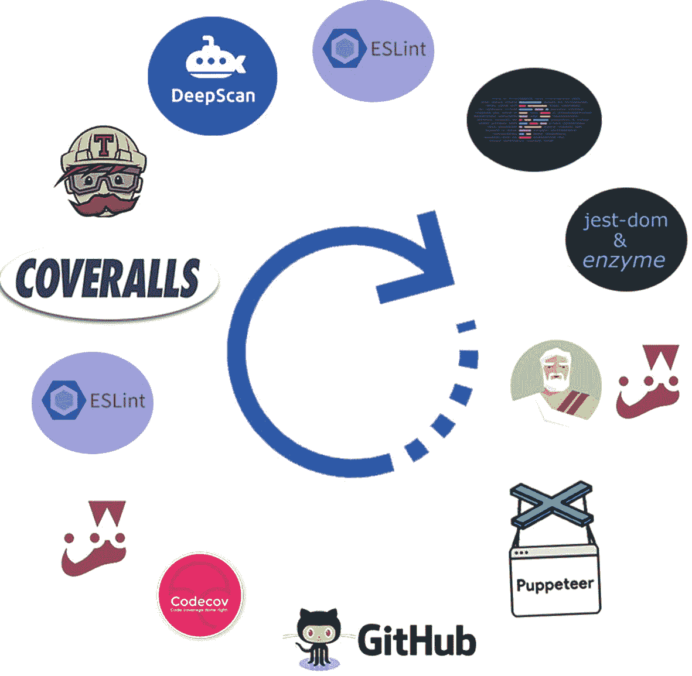

# 十、测试第二部分：开发和部署周期

在前一章中，我们在 Jest、Jest-dom、Enzyme 和 Sinon 库的帮助下进行了单元测试。单元测试只是测试的一种。除了单元测试，端到端(E2E)测试模拟真实的最终用户体验，集成测试结合了测试。

这一章分为两部分。在第一部分中，我将介绍 E2E 测试，并向您展示如何使用 Jest 和 Puppeteer 库来实现它。在本章的第二部分，我将介绍如何创建一个完整的自动化开发和部署集成周期，包括完整的代码覆盖，以及如何测试您的代码并确保质量得到维护。

## 执行端到端测试

端到端(E2E)集成，模拟真实的最终用户体验。E2E 测试通过使用一个无头浏览器在一个真实的网络环境中进行模拟。

在本章的这一节中，我将借助 Jest 和 Puppeteer 库重点介绍 CRA 的 E2E 测试。

### 你为什么应该关心 E2E 测试？

E2E 测试是一种从头到尾测试我们的应用工作流程的方法。我们在 E2E 所做的是复制真实的用户场景，以便我们的应用在集成和数据完整性方面得到验证。

您可能会惊讶地发现，大多数公司都愿意部署一个完整的质量保证(QA)人工测试团队，但是不重视投资 E2E 测试。

E2E 是我经常听到开发人员说的任务之一，“我们总有一天会到达那里；这是我们的遗愿清单。”但是那一天永远不会到来，因为要专注于特性和满足紧张的最后期限。

是的，建立 E2E 测试确实需要时间，但是 E2E 测试减少了人为错误，并且有助于交付高质量的软件。一些公司已经承认了这一点，事实上，近年来，我已经看到一些公司开始重视 E2E 测试，并让全职开发人员参与进来，仅仅是为了创建和维护测试。

你知道吗，根据 QualiTest 的调查，几乎 90%的人表示，如果他们遇到错误或故障，他们会放弃一个应用，并每天进行测试。

### 为什么打字稿？

在本书中，我们使用了 TS。TS 在测试方面大放异彩。使用 TS，可以更容易地调试和测试你的应用，并通过描述预期的对象来防止潜在的问题。

### 为什么是木偶师？

以下是一些 E2E 选项及其受欢迎程度:

*   *木偶师*([`https://github.com/puppeteer/puppeteer`](https://github.com/puppeteer/puppeteer)):66100 星

*   *柏树*([`https://github.com/cypress-io/cypress`](https://github.com/cypress-io/cypress)):24200 颗

*   *硒*([`https://github.com/SeleniumHQ/selenium`](https://github.com/SeleniumHQ/selenium)):18900 颗

*   *nigh watch . js*([`https://github.com/nightwatchjs/nightwatch`](https://github.com/nightwatchjs/nightwatch)):一万颗星星

*   *cucumber.js* ( [`https://github.com/cucumber/cucumber-js`](https://github.com/cucumber/cucumber-js) ):四千星

如你所见，基于 GitHub stars，木偶师是最受欢迎的 E2E 图书馆。它是基于 Chrome 的，也是我们将要使用的(见图 [10-1](#Fig1) )。


图 10-1

木偶师标志

木偶库是由谷歌 Chrome 团队创建的。木偶师让我们控制 Chrome(或 Chrome DevTools 基于协议的浏览器)并执行常见的动作，就像在真正的浏览器中一样——这意味着通过 API 以编程方式进行。

> *“puppeter 是一个节点库，它提供了一个高级 API 来控制 Chrome 或 DevTools 协议上的 Chrome。默认情况下，Puppeteer 无头运行，但可以配置为运行完整(非无头)Chrome 或 Chrome。*

> *——*[`https://github.com/puppeteer/puppeteer`](https://github.com/puppeteer/puppeteer)

我们能对木偶师做些什么并做出 React？

*   从页面中生成截图和 pdf

*   爬网页面

*   自动化用户交互

*   捕获站点的时间线跟踪，以帮助诊断性能问题

*   可以独立使用它们，也可以将它们与 Jest 或 Mocha 等其他流行的 React 测试框架集成在一起

### 为什么是玩笑和玩笑木偶师？

我们在上一章已经用过 Jest ( [`https://github.com/facebook/jest`](https://github.com/facebook/jest) )(见图 [10-2](#Fig2) )。在这一章中，我们将整合 Jest 木偶师( [`https://github.com/smooth-code/jest-puppeteer`](https://github.com/smooth-code/jest-puppeteer) )。Jest Puppeteer 附带了在运行测试套件时启动服务器的功能。此外，Jest Puppeteer 可以在测试完成后自动关闭服务器。


图 10-2

有一个标志

### 如何将 E2E 测试集成到我的 CRA React 应用中？

为了帮助您理解如何在 CRA 项目中使用 Jest 和 Puppeteer，我将本节中的过程分为三个步骤。

*   *步骤 1* :设置和配置我们的项目

*   *第二步*:编写代码

*   *第三步*:运行 E2E 测试

我们开始吧。

### 步骤 1:设置和配置我们的项目

在 Jest 的小丑鞋图标和木偶师标志之间，这里开始感觉像一个马戏团。但是说真的，正确地设置您的项目并不是一个玩笑，可能会比您预期的花费更多的时间，特别是因为我们需要考虑 CRA，它有一些固执己见的库需要配置，以及需要额外配置步骤的 TS。

开始运行 TS、Jest、Puppeteer、Jest、Enzyme 和其他必备库的 CRA 项目的最简单方法是使用我在本书中使用的 CRA 模板。让我们称我们的测试项目为`e2e_testing_with_puppeteer.`

```jsx
     $ yarn create react-app e2e_testing_with_puppeteer --template must-have-libraries

```

Tip

什么都配置好了，什么都不需要设置！

CRA MHL 项目已经包括以下:`puppeteer`、`jest-puppeteer ts-jest,`和类型。

```jsx
$ yarn add puppeteer jest-puppeteer ts-jest @types/puppeteer @types/expect-puppeteer @types/jest-environment-puppeteer

```

除了类型`puppeteer,`，我们还有`@types/expect-puppeteer`用于`jest-puppeteer`的断言库，我们需要使用`@types/jest-environment-puppeteer`来提供全局浏览器定义。你可以在 [`https://github.com/smooth-code/jest-puppeteer`](https://github.com/smooth-code/jest-puppeteer) 找到更多信息。

为了确认一切按预期工作，运行`yarn start`(见图 [10-3](#Fig3) )。


图 10-3

起始项目模板

```jsx
$ cd e2e_testing_with_puppeteer
$ yarn start

```

如果你查看你的项目的文件夹(图 [10-4](#Fig4) ，你可以看到有一个名为`e2e`的文件夹包含了测试和 Jest 配置。


图 10-4

e2e 文件夹包括测试和 Jest 配置

在下一节中，我将深入介绍为您设置的配置和文件，以便您完全了解如何设置 E2E。但是，如果您使用的是 CRA MHL 模板项目，则不需要设置这些。

#### 配置我们的项目

在我们开始配置我们的项目之前，这里有一些日常规则。我正在 E2E 文件夹中设置 E2E 集成测试。E2E 可以与 Jest 的单元测试集成在一起；然而，我个人认为最好将单元测试和 E2E 测试的任务分开。也就是说，如果您想要或需要它们在一起，可以随意更改这种配置。

为了让我们的 E2E 测试正常工作，添加并重构了一些文件。

*   `jest-puppeteer.config.js`:指定一个服务器。

*   `.env`:设置木偶服务器的环境变量。

*   `tsconfig.json`:我们使用`tsconfig.json`来指定编译 TypeScript 项目所需的根级文件和编译器选项。

*   `.eslintignore`:这告诉 ESLint 忽略特定的文件和目录。

*   `e2e/global.d.ts`:指定全局类型。我们需要添加一个变量来“神奇地”为我们提供一个接口。

*   那是 Jest 配置文件。

*   我们将添加脚本标签来运行我们的测试。

让我们回顾一下这些文件和我们需要做的事情。

#### jest-pup Peter . config . js-设定档

文件指定了木偶师的服务器配置。

使用`yarn`设置本地启动，但是如果您使用 NPM 管理您的库，您可以将其更改为`npm start`。

```jsx
module.exports = {
  server: {
    command: `yarn start`,
    port: 3000,
    launchTimeout: 10000,
    debug: true,
  },
}

```

#### 。包封/包围（动词 envelop 的简写）

文件`.env`用于设置木偶服务器的环境变量。在这里，我告诉木偶服务器做一个飞行前检查，不要在测试中使用浏览器，所以它将在后台运行。

```jsx
SKIP_PREFLIGHT_CHECK=true
BROWSER=none

```

#### tsconfig.json 文件

我们需要重构这个`tsconfig.json`文件来添加我们用于测试的文件夹。这将允许我们编译我们的类型脚本测试。

```jsx
...
"include": [
  ...
  "e2e"
]

```

#### 。eslintingnore

需要忽略配置文件，因为我们不需要它们来遵循 React 项目的 Lint 角色。我们可以通过将这些文件添加到`.eslintignore`文件的末尾来忽略它们。

```jsx
e2e/jest.config.js
e2e/puppeteer_standalone.js
jest-puppeteer.config.js

```

请注意文件名`puppeteer_standalone.js`，我们将创建并很快讨论它来独立运行木偶剧。

#### e2e/jest.config.js

接下来，我们要重构`jest.config.js`。这个文件是 Jest 配置文件。我将它设置在`e2e`文件夹中，因为它允许我定义不同的`jest.config.js`文件(以防我需要它们)。您将看到，当我们定义我们的`package.json`脚本时，我们可以引用特定的脚本来使用。

在`testRegex`中，我正在设置我们的测试以这种格式设置的项目:`[component name].test.tsx`。这里有一个例子:`app.test.tsx`。

这种格式与我们设置测试的方式一致，并且这种格式将允许我们的`e2e`被发现。

请注意，我正在设置一个全局变量`SERVER_URL`，这使得我们的工作变得简单，以防我们需要为所有测试全面更新服务器名称。

```jsx
module.exports = {
  preset: 'jest-puppeteer',
  globals: {
    SERVER_URL: "http://localhost:3000"
  },
  testRegex: './*\\.test\\.tsx$'
}
console.log('RUNNING E2E INTEGRATION TESTS - MAKE SURE PORT 3000 IS NOT IN USAGE')

```

注意，我使用`console.log`来显示一条带有注释的消息，提醒您本地主机需要运行这个测试。

这个配置将打开一个无头的 Chrome 浏览器，在端口 3000 上创建我们的测试，所以如果您运行了终端，请确保在终端中使用`yarn start`，因为我们不能同时运行两个`localhost:3000`实例。

另一种方法是在不同的端口上运行这个独立测试；如果你需要的话，你可以这样配置。我想保持简单。

#### e2e/全局. d.ts

`global.d.ts`文件让我们添加需要设置的 ts 声明。因为我们把`SERVER_URL`和`JEST_TIMEOUT`放在了`jest.config.js`里面，我们的 Lint 规则会因为只使用这些变量而不声明它们而产生矛盾。TS 需要定义所有东西，所以通常我不建议只添加声明，但是这里我们可以例外，因为我们知道我们在做什么。

```jsx
// globals defined in jest.config.js need to be included in this `d.ts`
// file to avoid TS lint errorsdeclare var SERVER_URL: string
declare var JEST_TIMEOUT: number

```

#### package.json

最后，我在`package.json`中设置了三个测试。

*   `test:e2e`:运行 E2E 测试，指向我们在`e2e`文件夹中设置的`e2e/jest.config.js`配置文件。

*   这运行我们独立的 NodeJs 木偶脚本。

*   如果我们想让一个观察器运行，我们就用这个。

```jsx
"scripts": {
  ...
  "test:e2e": "jest -c e2e/jest.config.js",
  "test:e2e-alone": "node e2e/puppeteer_standalone.js",
  "test:e2e-watch": "jest -c e2e/jest.config.js --watch"
}

```

### 步骤 2:编写代码

我们将编写一个可以独立运行的独立 Nodejs 脚本和一个 Jest Puppeteer 脚本来测试我们的`App.tsx`文件。

我们将创建两个文件。

*   这个独立的文件并不是真的需要，但在某些情况下它会派上用场，例如，如果我们需要在第三方库和脚本上进行测试，或者只是想不带玩笑地进行测试。

*   `e2e/app.test.tsx`:为`App.tsx`提供 E2E 集成测试。正如我提到的，虽然理论上我们可以一起进行单元测试和 E2E 测试，但是在测试的这一部分，我们将只做 E2E。

让我们看一下这些文件。

#### e2e/木偶师 _standalone.js

在代码层面上，我们正在创建一个无头 Chrome 浏览器，并测试到`http://localhost:3000`的链接将通过使用脚本点击它来打开 URL。然后我们等待两秒钟，关闭 Chromeless 浏览器。

我们需要在`http://localhost:3000`(和`$yarn start`)上运行我们的应用，所以我留了一条`try` - `catch`消息，以防你忘记这么做。

```jsx
const puppeteer = require('puppeteer');
const SERVER_URL = 'http://localhost:3000';

(async function main(){
  try {
    const browser = await puppeteer.launch({ headless: false });
    const page = await browser.newPage();
    await page.goto(SERVER_URL, {waitUntil: 'domcontentloaded'});

    const urlLink = await page.$('a[href*="https://github.com"]');
    if (urlLink) {
      await urlLink.click();
    } else {
      console.log('No "urlLink" found on page');
    }
    // wait 2 secs and shut down!
    await new Promise(resolve =>  setTimeout(resolve, 2000));
    await browser.close();
  } catch (error) {
    if (error.message.includes('ERR_CONNECTION_REFUSED'))
      console.log('Make sure you have React running: $ yarn start');
    console.log('Error message', error.message);
  }
})();

```

#### e2e

对于我们的`app.test.tsx`组件的 E2E 测试，我将测试一些东西。

首先，我放置了一个健全检查测试来打开 [Google。并检查单词*谷歌*是否出现。这只是一个磨利剑的示范。随意丢弃它。](http://google.com)

我们的应用测试套件将包括以下三项测试:

*   确保编辑在页面上。

*   检查`<a href>`是否正确放置并链接到正确的 URL。

*   检查页面上是否有 React 旋转徽标图像。

要了解更多关于我们可以运行的 E2E 测试的类型，请访问 [`https://devdocs.io/puppeteer/`](https://devdocs.io/puppeteer/) 。

另外，我的文件以`@ts-ignore`开头。这是因为我在这个文件中没有 import 语句，ESLint 会对`isolatedModules`有问题，因为它希望这个文件成为模块的一部分。

```jsx
// @ts-ignore due to isolatedModules flag - no import so this needed
describe('Google', () => {
  beforeAll(async () => {
    await page.goto('https://google.com', {waitUntil: 'domcontentloaded'})
  })

  it('sanity check, test Google server by checking "google" text on page', async () => {
    await expect(page).toMatch('google')
  })
})

// @ts-ignore due to isolatedModules flag - no import so this needed
describe('<App />', () => {
  beforeAll(async () => {
    await page.goto(SERVER_URL, {waitUntil: 'domcontentloaded'})
  }, JEST_TIMEOUT)

  it('should include "edit" text on page', async () => {
    await expect(page).toMatch('Edit')
  }, JEST_TIMEOUT)

  it('should include href with correct link', async () => {
    const hrefsArray = await page.evaluate(
        () => Array.from(
            document.querySelectorAll('a[href]'),
            a => a.getAttribute('href')
        )
    )
    expect(hrefsArray[0]).toMatch('https://github.com/EliEladElrom/react-tutorials')
  }, JEST_TIMEOUT)

  it('should include the React svg correct image', async () => {
    const images = await page.$$eval('img', anchors => [].map.call(anchors, img => img['src']));
    expect(images[0]).toMatch(SERVER_URL + '/static/media/logo.5d5d9eef.svg')
  }, JEST_TIMEOUT)

})

```

因为 Jest 设置了 5000 毫秒的超时，这可能不足以运行您的测试，所以我将组件设置为不同的超时，以确保我不会收到这个不好的消息。请随意更改超时时间。以下是您将收到的 Jest 超时错误消息:

```jsx
Timeout - Async callback was not invoked within the 5000ms timeout specified by jest.setTimeout.Error: Timeout - Async callback was not invoked within the 5000ms timeout specified by jest.setTimeout.

```

这里我不做任何用户交互，因为唯一的交互是点击页面上的链接，我们已经在独立的例子中测试过了。如果你想看另一个例子，比如 CRA 测试一个表单元素并填充表单，请看 [`https://github.com/smooth-code/jest-puppeteer/tree/master/examples/create-react-app`](https://github.com/smooth-code/jest-puppeteer/tree/master/examples/create-react-app) 。

### 步骤 3:执行 E2E 测试

既然我们已经编写了独立的 E2E NodeJS 脚本，以及对`App.tsx`组件的 E2E 测试，我们可以运行这些测试并检查结果。

正如您所记得的，为了运行这些测试，我们在我们的`package.json`文件中创建了运行脚本，以便能够用一个命令运行我们的测试。

让我们运行这些。

首先，在单独的窗口中运行以下命令:

```jsx
$ yarn start # if not running
$ yarn test:e2e-alone

```

NPM 运行脚本与下面的`package.json`命令相关联:

```jsx
// package.json
"test:e2e-alone": "node e2e/puppeteer_standalone.js"

```

当您运行该命令时，如果一切顺利，该脚本将使用我们的 localhost 3000 版本打开 Chrome headless 浏览器，并单击链接打开一个新选项卡。然后该脚本在两秒钟内关闭浏览器，您将得到以下消息。参见`localhost:3000`单机 E2E 测试结果。

```jsx
yarn run v1.22.10
$ node e2e/puppeteer_standalone.js

Done in 5.36s.

```

恭喜你！我们通过了测试。

这发生得很快，因为我们设置 Chrome 在 2 秒内关闭。但是正如你所看到的，脚本打开了一个浏览器，点击了我们的应用中打开另一个窗口的链接(如我们所料)，然后关闭了测试！印象深刻，对吧？

接下来，要使用 Jest Puppeteer 运行我们对`App.tsx`组件的 E2E 测试，停止本地服务器，并运行名为`test:e2e`的 NPM 脚本。

```jsx
$ yarn test:e2e

```

这将运行 NPM 运行脚本命令。

```jsx
// package.json

"test:e2e": "jest -c e2e/jest.config.js --watch"
"test:e2e-watch": "jest -c e2e/jest.config.js --watch"

```

运行该命令后，您应该会得到以下 E2E 测试 Jest 和 Puppeteer 输出:

```jsx
Jest dev-server output:
[Jest Dev server] $ react-scripts start
[Jest Dev server] [wds]: Project is running at
[Jest Dev server] [wds]: webpack output is served from
[Jest Dev server] [wds]: Content not from webpack is served
[Jest Dev server] [wds] : 404s will fallback to /
[Jest Dev server] Starting the development server...
RUNS e2e/app.test.tsx

```

如果 2E 测试结果顺利，您将会收到一条甜蜜的成功消息，如下所示:

```jsx
PASS
e2e/app.test.tsx (15.264s)
<App />
✅ should include "edit" text on page (189ms)
✅ should include href with correct link (9ms)
✅ should include the React svg correct image (29ms)

Test Suites: 1 passed, 1 total
Tests: 3 passed, 3 total
Snapshots: 0 total
Time: 15.57s, estimated 19s
Ran all test suites.

```

太棒了。我们能够运行独立的 E2E 测试，并覆盖我们应用的特定部分。

## 自动化开发和使用持续集成周期

当谈到发布高质量的代码时，有许多方法来配置您的项目，并且关于如何做有许多不同的意见。你应该用什么？应该如何配置？选择似乎是无限的。

在本章的这一部分，我的目的是给你配备一些很棒的工具，以确保你的代码质量很高，并帮助你避免打嗝。

该过程在我们的开发环境中开始，通过建立编码指南，坚持这些指南，并从那里继续创建单元测试，集成这些测试(集成测试)，然后进行端到端测试和覆盖。一旦我们做到了这一点，我们就可以进入持续集成(CI)周期了。

Note

持续集成意味着将所有的开发副本合并到一个共享的主线中。尽可能经常这样做。

在 CI 方面，我们的代码仍然需要测试和检查覆盖率、质量和依赖性，以确保我们确实遵循了我们设定的测试和编码指南，找到潜在的编码错误，最后开绿灯以表明部署一切正常。冲洗并重复。

在本章的这一节，我将我的最终 React 质量发展和部署周期，这是赫斯基➤木偶师➤ GitHub 工作流程➤ Codecov.io ➤工作服➤特拉维斯➤ DeepScan。

作为奖励，你可以得到一些很酷的徽章来证明你的项目达到了你设定的标准。图 [10-5](#Fig5) 显示了整个循环中使用的库。



图 10-5

最终 React 质量开发和部署周期

### 动机

React 只是一个库，仅此而已。确保工程质量的任务就交给了我们。配置和设置我们项目的开发和部署周期并不容易。您应该选择什么工具，如何确保代码的质量以及您的应用符合您设定的质量水平？

此外，建立一个良好的开发和部署过程是至关重要的一部分；在我看来，这个过程应该在你写第一行代码之前设置好。理想情况下，我们希望快速发布并经常发布，并确保我们的代码质量不会随着代码库的增长而下降。

本章中的过程可以确保你一开始就获得 100%的覆盖率(如果这是你想要的),并确保你一直保持下去。目标不仅是确保您和您的团队实现开发指导方针并编写无错误的代码，理想情况下，而且任何新加入的开发人员也应该遵守这些指导方针，甚至不需要从团队领导那里获得预期实践是什么的解释。

### 结构

为了帮助您理解，我将该过程分解为以下步骤:

*   第一步:设置

*   哈士奇

*   步骤 3: GitHub 动作

*   第四步:Codecov.io

*   第五步:特拉维斯

*   工作服

*   步骤 7:深度扫描

我们开始吧。

### 设置项目

你可以从一个新项目开始，或者在你喜欢的任何项目上实现这些改变。

```jsx
$ yarn create react-app your_project_name --template must-have-libraries

```

要确认一切正常，运行`yarn start`。

```jsx
$ cd your_project_name
$ yarn start

```

#### 测试

在编写测试的过程中，我们可能会在源代码中发现新的错误或语法问题，这些问题在发布我们的应用之前必须解决。正如我们所看到的，我们的 CRA·MHL 模板项目附带了单元测试和 E2E 固执己见的库来帮助你以更直观的方式编写你的测试。

#### 新闻报道

一旦我们准备好了单元测试，我们就可以检查覆盖率了。为了建立覆盖率，我们也可以使用 Jest。

Note

代码覆盖率衡量当一个特定的测试套件运行时，我们的源代码被执行了多少。

Jest 允许我们创建不同格式的报告，并设置我们希望从哪里收集这些报告(或不从哪里收集)，以及确保`coverageThreshold`值。看看我的`package.json`设置，如下所示:

```jsx
// package.json
"jest": {
  "coverageReporters": [
    "json",
    "text",
    "html",
    "lcov"
  ],
  "collectCoverageFrom": [
    "src/**/*.{js,jsx,ts,tsx}",
    "!src/**/*/*.d.ts",
    "!src/**/*/Loadable.{js,jsx,ts,tsx}",
    "!src/**/*/types.ts",
    "!src/**/store.ts",
    "!src/index.tsx",
    "!src/serviceWorker.ts",
    "!<rootDir>/node_modules/",
    "!**/templates/**",
    "!**/template/**"
  ],
  "coverageThreshold": {
    "global": {
      "branches": 50,
      "functions": 50,
      "lines": 50,
      "statements": 50
    }
  },

```

在这个例子中，我执行 50%的`coverageThreshold`。当我设置这个时，它将确保我在我的阈值内测试，否则我将得到一个错误。这很方便，因为我们可以设置这些值来确保每一个函数、语句、行和分支得到至少 50%的测试覆盖率，甚至 100%的测试覆盖率。

在`package.json`中，我们可以通过将`watchAll`设置为`false`来设置我们的运行脚本以包含覆盖率测试，这样一旦测试完成，脚本就会关闭。

```jsx
// package.json

"scripts": {
  ...
  "coverage": "npm test -- --coverage --watchAll=false"
}

```

运行脚本后，如下所示:

```jsx
$ yarn run coverage

```

您将获得一个用报告创建的文件夹(图 [10-6](#Fig6) )。


图 10-6

Jest 覆盖文件夹树和文件

由于我的`package.json`文件包含一个 HTML 报告，我们实际上可以打开创建的`coverage/index.html`文件，用一个简洁的用户界面查看我们的报告(图 [10-7](#Fig7) )。


图 10-7

Jest 覆盖 HTML 报告

您可以根据需要随意配置您的项目。我的建议是，用某些运行脚本来设置您的`package.json`文件，以确保代码的格式，并确保风格指南得到实施，以及测试覆盖按照您的要求完成。

### 使用 Husky 设置 Git 挂钩

接下来，我们将安装一个名为 Husky ( [`https://github.com/typicode/husky`](https://github.com/typicode/husky) )的库。

```jsx
$ yarn add husky

```

Husky 提供对 Git 挂钩的访问，我们可以使用这些挂钩来确保在允许我们的团队成员提交到我们的 repo 之前成功完成某些任务。看一下这个例子:

```jsx
// package.json
{
  "husky": {
    "hooks": {
      "pre-commit": "npm test",
      "pre-push": "npm test",
      "...": "..."
    }
  }
}

```

如果你还记得前面的章节，我们在每个完成的练习结束时手动运行`format`、`lint`和`test`。在我们的例子中，我们可以设置一个预提交钩子来运行`format`、`lint`和单元测试以及 E2E 测试，作为预提交的一个条件。

```jsx
"husky": {
  "hooks": {
    "pre-commit": "yarn format && yarn lint && yarn test:e2e && yarn coverage"
  }
},

```

一旦你提交任何代码，这个钩子就会运行。除非这些运行脚本正确无误地完成，否则不允许提交。这将确保我们的代码遵循我们设定的准则、格式和测试。

在 GitHub repo 上设置您的库，并尝试提交以查看预提交的运行情况。

```jsx
$ git add .
$ git commit -m 'my first commit'

```

### 使用 GitHub 操作设置工作流程

现在我们的代码已经在 GitHub 中完成了，我们可以确保代码的质量，然后执行具体的操作。这些操作为我们的存储库增加了自动化。

例如，我们可以确保代码编译，通过覆盖，并通过其他测试，然后将代码上传到生产服务器，或者我们可以将代码上传到其他系统进行分析。

这可以使用 GitHub 动作来完成。要了解更多关于 GitHub 动作的信息，请查看位于 [`https://docs.github.com/en/free-pro-team@latest/actions/learn-github-actions`](https://docs.github.com/en/free-pro-team%2540latest/actions/learn-github-actions) 的 GitHub 文档。这些动作是用一种叫做 YAML 的语言写的。

Note

YAML 是“YAML 不是标记语言”的递归首字母缩写，是一种人类可读的、直观的数据序列化格式。

要创建这些动作，您需要创建这个文件夹结构:`.github/workflows`。然后，我们将创建以下 GitHub 操作:

*   *Main* :运行 Lint，测试 Main 动作，上传到`codecov`。

*   *构建*:确保构建动作构建。

*   *测试*:测试并上传测试动作到`coverall`。

*   皮棉:确保我们的项目通过皮棉测试。

#### 手动操作:手. yml

我们的主要任务(`main.yml`)与推送提交挂钩。我们将使用 Node.js 版本 12.x 并在 Ubuntu 服务器上运行。我们将安装项目和依赖项，运行 Lint，测试并将我们的代码上传到 Codecov 应用(我们将很快设置我们的帐户)。

```jsx
name: CIon: [push]jobs:
  build:
    runs-on: ubuntu-latest    strategy:
      matrix:
        node-version: [12.x]    steps:
      - uses: actions/checkout@v1
      - name: Use Node.js ${{ matrix.node-version }}
        uses: actions/setup-node@v1
        with:
          node-version: ${{ matrix.node-version }}
      - name: install dependencies
        run: |
          yarn
      - name: run lint
        run: |
          yarn lint
      - name: run tests
        run: |
          yarn test --watchAll=false --coverage --reporters=default
      - name: Upload coverage to Codecov
        uses: codecov/codecov-action@v1.0.14
        with:
          token: ${{ secrets.CODECOV_TOKEN }}
      - name: build
        run: |
          yarn build

```

#### 构建操作:build.yaml

为了构建我们的代码(`build.yaml`)，我将使用`ubuntu-latest`服务器(在撰写本文时，它的版本是 20.10)。默认情况下，将警告视为错误。如果你想禁用默认行为，你可以设置`process.env.CI = false`。

你可以在 [`https://github.com/facebook/create-react-app/issues/3657`](https://github.com/facebook/create-react-app/issues/3657) 了解更多信息。我的钩子将被设置为在推拉请求时运行。看一看:

```jsx
name: build

on:
  - push
  - pull_request

jobs:
  createAndTestTemplateCRA:
    runs-on: ubuntu-latest
    steps:
      - name: Use Node.js 12.x
        uses: actions/setup-node@v1
        with:
          node-version: 12.x
      - name: Settings to fix problem on Ubuntu
        run: echo fs.inotify.max_user_watches=524288 | sudo tee -a /etc/sysctl.conf
      - run: sudo sysctl -p
      - name: Create CRA from downloaded template
        run: npx create-react-app --template cra-template-must-have-libraries .
      - name: No need to fail due to warnings using CI=false
        run: CI= npm run build

```

#### 测试操作:test.yaml

我们的测试脚本(`test.yaml`)在`push`和`pull_request`上有一个钩子，并使用节点 v12。对于测试，我们将运行覆盖率脚本，并将代码上传到`coverallsapp`。我们将在本章的后面设置连体工作服。

```jsx
name: test
on:
  - push
  - pull_requestjobs:
  test:
    runs-on: ubuntu-latest
    steps:
      - uses: actions/checkout@v2
      - name: Use Node.js 12.x
        uses: actions/setup-node@v1
        with:
          node-version: 12.x
      - run: npm i

      - run: npm run coverage
      - name: Upload coverage file to Coveralls using lcov.info
        uses: coverallsapp/github-action@master
        with:
          github-token: ${{ secrets.GITHUB_TOKEN }}

```

该链接用于创建可用于 coverallsapp 和任何其他第三方工具的个人访问令牌。请遵循以下步骤:

```jsx
https://docs.github.com/en/free-pro-team@latest/github/authenticating-to-github/creating-a-personal-access-token

```

#### Lint 行动:lint.yml

对于 Lint，我们已经在开发周期中运行了 ESLint，那么为什么我们在部署周期中还需要这个(`lint.yml`)呢？

在这里，我们再次运行 Lint，以确保开发人员实际上正在运行 Lint，并且没有更改他的本地设置和提交没有 Lint 的代码。

```jsx
name: lint
on:
  - push
  - pull_request
jobs:
  lint:
    runs-on: ubuntu-latest
    steps:
      - uses: actions/checkout@v2
      - run: npm i
      - run: npm run lint

```

最后，您可以为每个 GitHub 动作生成一个徽章，方法是点击 Actions，选择动作名称，然后点击“创建状态徽章”，如图 [10-8](#Fig8) 所示。


图 10-8

GitHub 操作构建结果和徽章

### Codecov.io 的测试覆盖率

Codecov 是一个用来测量你的代码库的测试覆盖率的工具。它通常通过检查在运行单元测试时执行了哪些代码行来计算覆盖率。

#### 为什么是 Codecov？

Codecov 生成的覆盖报告具有增强 CI 工作流程的功能。使用代码覆盖工具激励开发人员编写测试并提高覆盖率。

它允许我们托管我们在本地生成的覆盖报告，因此我们可以检查历史并增强我们的 CI 工作流和团队合作。

> *“Codecov 专注于整合和促进健康的拉式请求。Codecov 将覆盖率指标直接交付或“注入”到现代工作流中，以提高代码覆盖率，尤其是在新功能和错误修复经常出现的拉式请求中。”*
> 
> ——[`https://docs.codecov.io/docs/about-code-coverage`](https://docs.codecov.io/docs/about-code-coverage)

为此，我们可以创建一个名为`codecov.yml`的文件。如果您没有设置`codecov.yml`，默认配置会自动为您设置。你可以在 [`https://docs.codecov.io/docs/codecov-yaml`](https://docs.codecov.io/docs/codecov-yaml) 找到 Codecov 文档。

用你的 GitHub 账号登录 Codecov，你会看到你的回购，自从我们在 GitHub action hook 期间上传到 Codecov 之后(图 [10-9](#Fig9) )。


图 10-9

Codecov 链接存储库

### Travis 的 CI

Travis 是一个托管的 CI 服务，用于构建和测试我们的代码。

#### 为什么是特拉维斯？

通过让 Travis 调用连体工作服运行脚本`.travis.yml`，可以将连体工作服设置为连接到 Travis。

```jsx
language: node_js
sudo: false
node_js:
  - "stable"
branches:
  only:
    - master
cache:
  directories:
    - node_modules
before_install:
  - npm update
  - sudo apt-get update
  - npm install --global http-server
install:
  - npm install
  - npm build
script:
  - npm run coveralls

```

要启用 Travis，请登录您的 GitHub 帐户，找到 repo，然后打开它(图 [10-10](#Fig10) )。


图 10-10

Travis CI 集成存储库

确保启用了构建推送分支。你可以点击建造徽章，Travis 会为你生成一个很酷的徽章(图 [10-11](#Fig11) )。


图 10-11

Travis CI 集成存储库详细信息页

### 用工作服跟踪代码覆盖率

工装跟踪 GitHub repos 的代码覆盖率，并确保所有新代码都被完全覆盖。

#### 为什么穿工作服？

我们使用 Codecov，为什么我们还需要工作服？那不是多此一举吗？

Codecov 主持我们的报道，但工作服做得更多。工作服筛选覆盖数据，在问题变成问题之前寻找我们可能没有发现的问题。

创建一个有工作服的账户，打开回购，如图 [10-12](#Fig12) 所示。


图 10-12

集成存储库页面的工作服

接下来，如果你正在运行一个私有的回购协议，你需要使用你的密匙，并在`.coveralls.yml`文件中设置它。

```jsx
service_name: travis-pro
repo_token: [YOUR-KEY]

```

您可以从套装设置中获取令牌，如图 [10-13](#Fig13) 所示。


图 10-13

工作服储存库密钥

接下来，`package.json`需要一个运行脚本来显示`lcov.info`文件，该文件是我们通过在 Travis 中使用的覆盖运行脚本生成的，以便让工作服链接到这些报告。

为此，在`package.json`文件中设置一个名为`coveralls`的运行脚本，为工作服显示这些脚本。

```jsx
// pacakge.json
"scripts": {
  ...
  "coveralls": "cat ./coverage/lcov.info | coveralls"
}

```

### 使用 DeepScan 检查代码质量

DeepScan 是一个静态分析工具，让我们可以全面地检查我们的代码。

#### 为什么选择 DeepScan？

除了在 Lint 中设置的规则，DeepScan 还可以检查我们代码的质量。

使用您的 GitHub 帐户登录 DeepScan 并启用回购，如图 [10-14](#Fig14) 所示。


图 10-14

DeepScan 集成存储库

在 DeepScan 中，您可以看到回购和任何潜在问题的评级，并生成徽章，如图 [10-15](#Fig15) 所示。


图 10-15

DeepScan 存储库详细信息和徽章

## 摘要

在本章的第一部分，我介绍了 E2E 测试，并展示了如何使用 Jest 和 Puppeteer 库来模拟 E2E 测试。我们看到了如何配置我们的项目，创建独立的 E2E 测试，以及为特定的测试与 Jest 集成。

在本章的第二部分，我介绍了如何创建一个完全自动化的开发和部署集成周期。

为了帮助你理解从开发到 CI 的过程，我把这一章的过程分解成几个步骤。我们使用 Husky 创建了一个预提交挂钩，以确保一切运行无误。在 CI 部署方面，我们使用 Github 操作和 YAML 文件来检查我们的代码，并将我们的代码上传到 Codecov.io、Travis、工作服和 DeepScan，以分析和存储我们的数据和报告。最后，我向您展示了如何为您的项目生成一些很酷的徽章。

在下一章，你将学习如何调试和分析你的 React 应用。