# 十一、调试和分析 React 应用

当您使用 React 应用时，当您遇到问题时，可以使用一些特定的工具来调试和分析 React 应用。拥有适合工作的工具并知道如何使用它们可以消除棘手问题并加快流程。

React 基于 JavaScript (JS)，适用于任何基于 JS 的应用的所有工具都适用于 React。与 Next.js 或 Razzle 等其他基于 React 的框架不同，CRA 基于开箱即用的单页面应用(SPA)。为了更好地了解我们的应用中发生了什么，有一些特定的工具可以帮助我们调试应用。在这一章中，你将学习帮助你完成工作的最佳工具。

本章分为两个部分:调试你的应用和分析你的应用。在每一节中，我将为您提供特定的工具，不仅可以帮助您调试和分析您的应用，还可以帮助确保在代码增长时性能不会下降。

您可以使用前面章节中的任何项目来学习如何调试和分析应用。

## 调试 React 应用

调试是检测和删除代码中可能导致不良行为的错误(也称为*bug*)的常见做法。本节涵盖了调试应用的八种方法。您可以使用任何一种或几种的组合。这种选择归结为您试图消除的 bug、您对代码的访问权限以及代码驻留的位置。我将介绍的调试选项如下:

*   断点

*   安慰

*   调试器

*   调试 Jests 测试

我们开始吧！

### 断点

在代码中设置断点并停止和检查数据通常不仅仅用于粉碎 bugs 这是任何职业发展努力的核心。

所有主流的现代 ide 都有设置断点和检查数据的选项。我将向您展示如何在 VS 代码中使用断点，这是我们在第一章中设置的，以及另一个名为 WebStorm 的 IDE，这是一个流行的 React IDE 但是，您可以选择任何 IDE，因为大多数 IDE 都可以设置为执行此任务。

#### 使用 Visual Studio 代码调试 React 应用

在第 [1](01.html) 章，我们设置 VS 代码。VS 代码有一个调试 JavaScript 代码的特性。在本节中，我们将安装和调试我们的代码。

*步骤 1* :在 VS 代码中使用顶层菜单安装附加调试器工具，参见图 [11-1](#Fig1) :

[T2`https://marketplace.visualstudio.com/items?itemName=msjsdiag.debugger-for-chrome`](https://marketplace.visualstudio.com/items%253FitemName%253Dmsjsdiag.debugger-for-chrome)

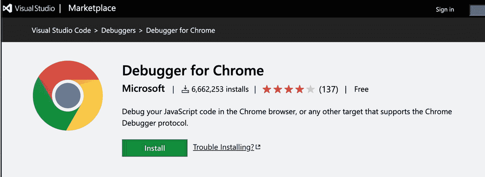

图 11-1

Chrome 调试器扩展

*第二步*:在项目根目录下配置一个`launch.json`文件，端口 3000。

```jsx
// .vscode/launch.json
{
    "version": "0.2.0",
    "configurations": [
        {
            "type": "chrome",
            "request": "launch",
            "name": "Launch Chrome against localhost",
            "url": "http://localhost:3000",
            "webRoot": "${workspaceFolder}"
        }
    ]
}

```

确保应用正在运行(`$ yarn start`)。接下来，在`App.tsx`中放置一个断点。

*第三步*:现在从左侧菜单中选择运行。然后点击顶部菜单中的启动 Chrome。见图 [11-2](#Fig2) 。

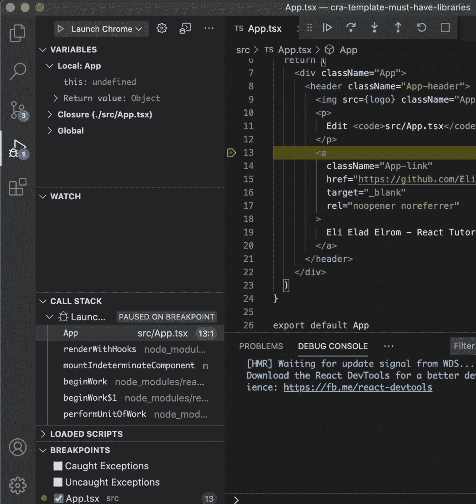

图 11-2

在调试模式下为 VS 代码启动 Chrome

你可以在这里找到更多关于调试 Visual Studio 代码的内容: [`https://code.visualstudio.com/docs/editor/debugging`](https://code.visualstudio.com/docs/editor/debugging) 。

#### 在 WebStorm 上调试 React 应用

在第 [1](01.html) 章，我们安装了 VS 代码。我提到还有其他流行的 ide，比如 WebStorm。我在这里将 WebStorm IDE 作为一个选项展示的原因是，尽管它需要钱，但它包括一些高级功能，可以帮助您调试和分析您的应用，并且是编写 JavaScript 代码的一个流行选项。

如果您运行的是 WebStorm，那么您可以使用配置向导像配置 WebStorm 上的任何其他项目一样配置您的项目。

点击顶栏中的添加配置，如图 [11-3](#Fig3) 所示。

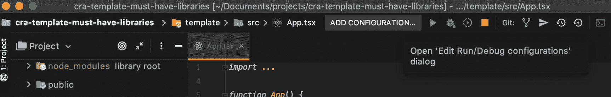

图 11-3

点击 WebStorm 中的添加配置

接下来，点击+图标添加新的配置，然后选择 JavaScript Debug，如图 [11-4](#Fig4) 所示。

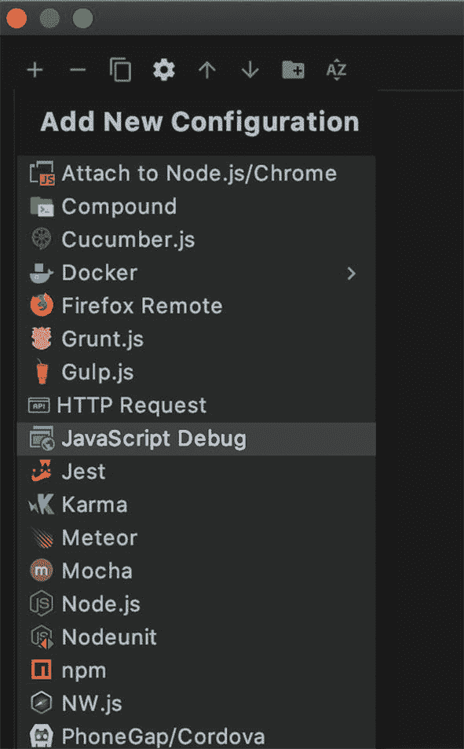

图 11-4

为 JavaScript 调试添加新的配置窗口

使用名称、URL ( `http://localhost:3000/`)和您将使用的浏览器设置配置，如图 [11-5](#Fig5) 所示。

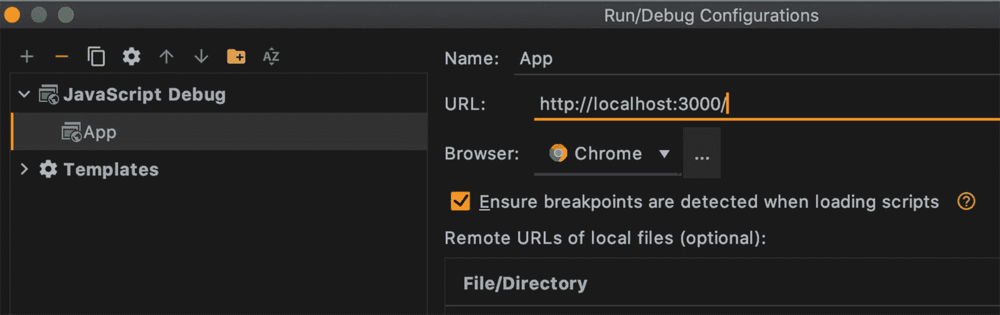

图 11-5

设置配置以调试我们的应用

现在，我们可以在要调试的行上设置断点，点击调试图标，开始调试 app，如图 [11-6](#Fig6) 所示。

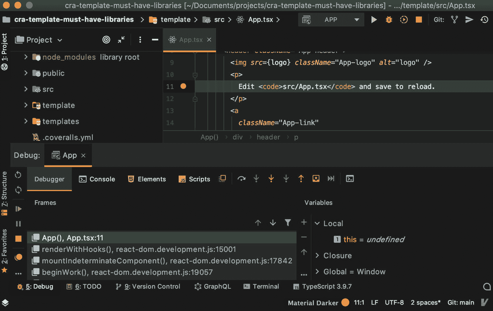

图 11-6

用 WebStorm 调试 React 应用

### 使用控制台

在 JavaScript 中，`console.log()`是记录消息的实际方法。可以留言，显示数值。控制台是调试基于 web 的应用的好的、老的方法，它今天仍然适用。

浏览器包括一个控制台，用于与 web 平台 API 进行交互，您可以使用它在代码中留下消息。例如，将这个`console.log`放在`AppRouter.tsx`中:

```jsx
// src/AppRouter.tsx
const AppRouter: FunctionComponent = () => {
  console.log('console testing')
  return (...)
}

```

例如，要在 Chrome 中看到这条消息，右键单击页面，选择 Inspect，然后单击 Console 选项卡，如图 [11-7](#Fig7) 所示。

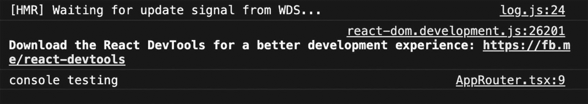

图 11-7

控制台选项卡中的 console.log 消息

Tip

建议您在发布代码之前隐藏这些`console.log()`消息，因为将它们留在这里是不专业的。也被认为是副作用。如果您还记得，我们将 ESLint 设置为在您留下消息时吠叫，并且我们使用 Husky 为 Git 配置了一个提交挂钩，以确保如果开发人员试图用这些消息提交代码时提交失败。其他方法是创建一个`debug`变量，在 Grunt 或 Gulp 上添加一个插件来删除这些消息，或者使用 Webpack 上的 Logger API。

### 使用调试器语句

如果我们想在某段代码上暂停浏览器，一个好的方法是使用调试器语句。将`debugger`添加到您的组件将暂停正在呈现页面的浏览器。见图 [11-8](#Fig8) 。

```jsx
// src/index.tsx
debugger

```

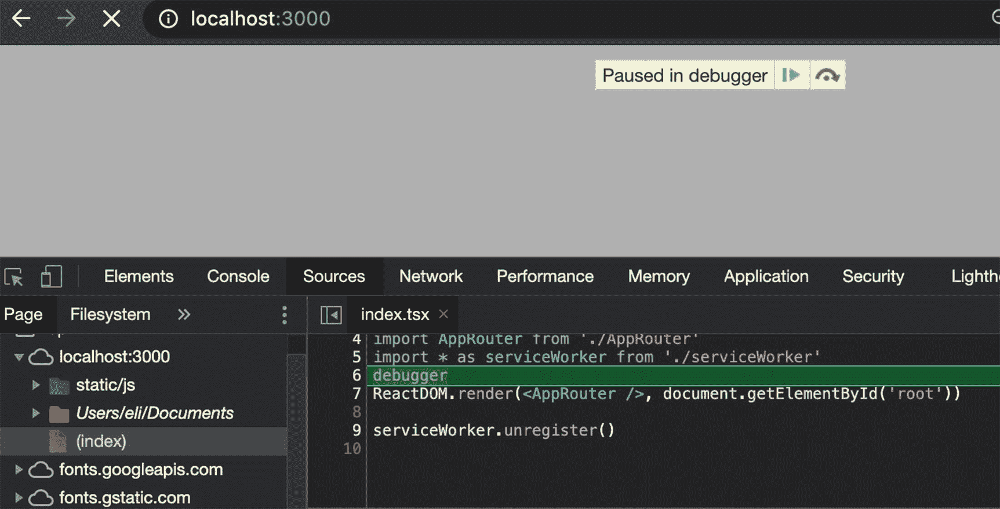

图 11-8

使用 debugger 语句停止 Chrome 浏览器的渲染

### 调试 Jest 测试

单元测试和 E2E 测试呢？在前面的章节中，我们在 Jest 和其他库的帮助下建立了单元测试和 E2E 测试。当测试失败并且您需要调试您的测试时，有两个主要的选择。

*   使用浏览器调试

*   设置您的 IDE

#### 用 Chrome DevTools 调试 Jest 测试

CRA 有一个脚本来帮助使用 Jest 调试单元测试和 E2E 测试。我们可以使用类似的方法来调试测试，就像我们在开发代码中所做的那样。为了调试测试，在测试中放置一个`debugger`语句。

```jsx
// src/App.test.tsx
import React from 'react'
import { shallow } from 'enzyme'
import App from './App'

describe('<App />', () => {
  let component

  beforeEach(() => {
    component = shallow(<App />)
  })
  debugger
  test('It should mount', () => {
    expect(component.length).toBe(1)
  })
})

```

接下来，向`package.json`中的运行脚本添加一个测试调试脚本。

```jsx
// package.json
"test:debug": "react-scripts --inspect-brk test --runInBand --no-cache"

```

右键单击网页并选择 Inspect，打开 Chrome DevTools。在 Chrome DevTools 检查器中，你会看到一个绿色图标，代表为 Node.js 打开一个专用的 DevTools，如图 [11-9](#Fig9) 所示。

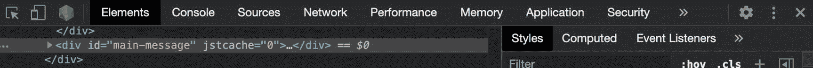

图 11-9

Chrome DevTools 检查器

现在当我们运行`yarn`命令时:

```jsx
$ yarn test:debug

```

DevTools 将在我们的调试器点停止。参见图 [11-10](#Fig10) 。

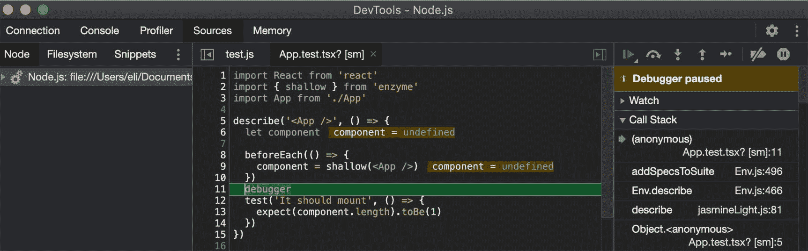

图 11-10

Node.js 的 Chrome 专用开发工具

#### 用 VS 代码 IDE 调试 Jest 测试

调试 Jest 测试的第二个选项是使用 Visual Studio 代码中可用的调试工具。

*步骤 1* :重构`launch.json`配置文件，使其包含以下设置:

```jsx
// .vscode/launch.json
{
    "version": "0.2.0",
    "configurations": [
      {
        "name": "Debug CRA Tests",
        "type": "node",
        "request": "launch",
        "runtimeExecutable": "${workspaceRoot}/node_modules/.bin/react-scripts",
        "args": ["test", "--runInBand", "--no-cache", "--watchAll=false"],
        "cwd": "${workspaceRoot}",
        "protocol": "inspector",
        "console": "integratedTerminal",
        "internalConsoleOptions": "neverOpen",
        "env": { "CI": "true" },
        "disableOptimisticBPs": true
      }
    ]
  }

```

*第二步*:将`debugger`语句放在你喜欢的任何地方。

*第三步*:点击调试控制台按钮(看起来像带有 bug 图片的运行图标)，如图 [11-11](#Fig11) 所示。

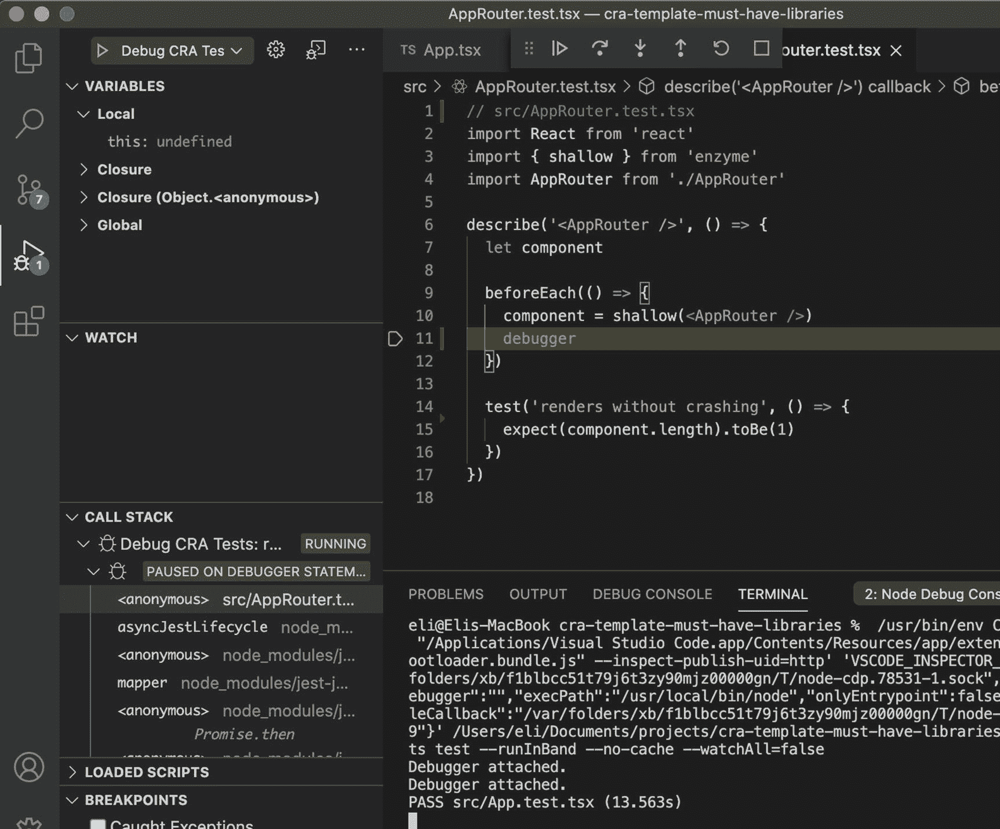

图 11-11

用 VS 代码调试 Jest 测试

#### 用 WebStorm 调试 Jest 测试

在 WebStorm 中，过程是相似的。

*步骤 1* :为 Jest 添加一个配置，类似于我们之前所做的。见图 [11-12](#Fig12) 。

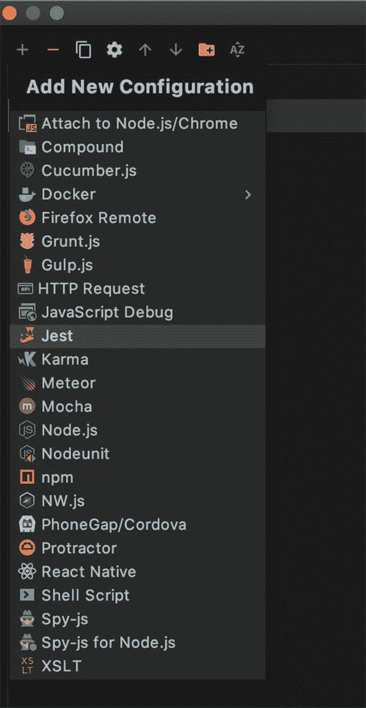

图 11-12

在 WebStorm 中添加 Jest 的新配置

*步骤 2* :接下来在运行/调试配置对话框中，可以设置配置文件，设置 Jest 包设置，如图 [11-13](#Fig13) 所示。

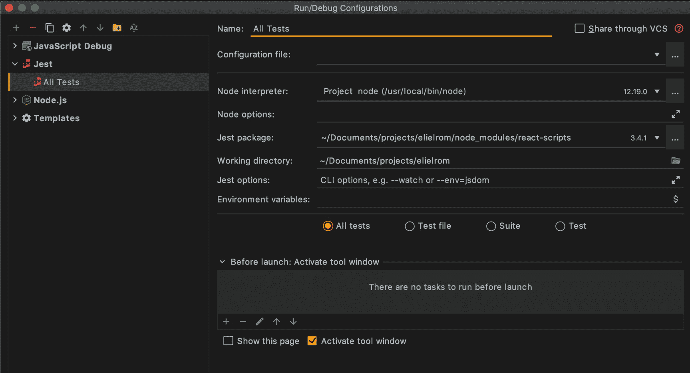

图 11-13

WebStorm 运行/调试配置对话框

第三步:接下来，把`debugger`语句放在你喜欢的任何地方。

*步骤 4* :现在在调试模式下运行测试(红色的 bug 图标，绿色的 place 图标旁边)，如图 [11-14](#Fig14) 所示。

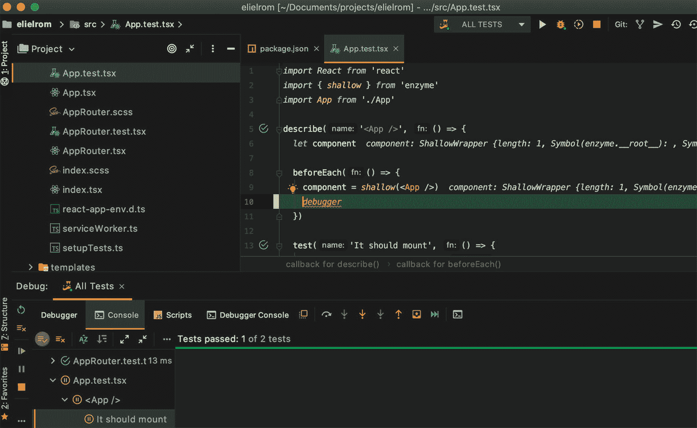

图 11-14

在 Jests 测试中以调试模式运行

你可以在这里找到更多: [`https://www.jetbrains.com/help/webstorm/running-unit-tests-on-jest.html#ws_jest_navigation`](https://www.jetbrains.com/help/webstorm/running-unit-tests-on-jest.html%2523ws_jest_navigation) 。

此外，请访问 CRA 调试测试页面以跟上任何更新: [`https://create-react-app.dev/docs/debugging-tests/`](https://create-react-app.dev/docs/debugging-tests/) 。

## 使用 Chrome 开发工具

您还记得，在第 [1](01.html) 章中，我们介绍了 React 如何利用虚拟 DOM (VDOM)的概念，并在内存中保存一个 UI 版本来与“真实”DOM 同步。

这是使用 React 16 中的纤程协调引擎完成的。有时候你可能需要深入了解实际的 DOM，Chrome DevTools 可以帮上忙。

为了帮助更好地查看、访问和理解 DOM，我推荐以下两个资源:

*   [T2`https://developer.mozilla.org/en-US/docs/Web/API/Document_Object_Model/Introduction`](https://developer.mozilla.org/en-US/docs/Web/API/Document_Object_Model/Introduction)

*   [T2`https://developers.google.com/web/tools/chrome-devtools/dom`](https://developers.google.com/web/tools/chrome-devtools/dom)

### 查看 DOM 元素

例如，在 CRA，我可以设置`index.tsx`来将`AppRouter`呈现到我们在`index.html`页面中设置的根元素中(`<div id="root"></div>`)。

```jsx
// src/index.tsx
import React from 'react'
import ReactDOM from 'react-dom'
import './index.scss'
import AppRouter from './AppRouter'
import * as serviceWorker from './serviceWorker'

ReactDOM.render(<AppRouter />, document.getElementById('root'))

serviceWorker.unregister()

```

图 [11-15](#Fig15) 显示了 DOM 结构。

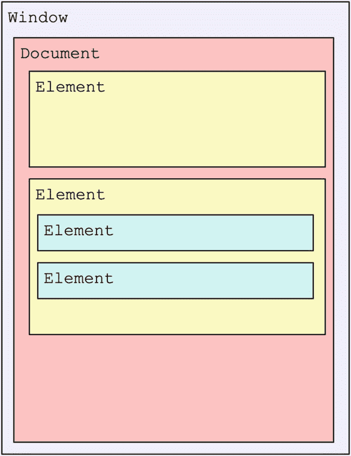

图 11-15

DOM 结构

然后我们可以打开 Chrome DevTools 并粘贴到控制台中。

```jsx
window.document.getElementById('root')

```

这将给我们根元素，我们可以检查 DOM 子树元素，如图 [11-16](#Fig16) 所示。

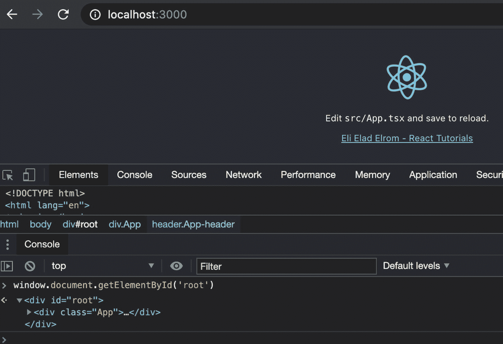

图 11-16

检查 Chrome DevTools 中的根元素

### 在 DOM 更改时设置断点

Chrome DevTools 的另一个强大功能是我们可以根据某些标准设置断点，比如节点删除、子树修改和属性修改。

例如，在前面的章节中，我们创建了一个完整的站点，它包括一个主题首选项按钮，可以改变页脚和页眉的配色方案。

我们的主题按钮将页脚的颜色从亮变暗。我可以右键单击元素并选择“Break on”，然后选择“属性修改”，如图 [11-17](#Fig17) 所示。

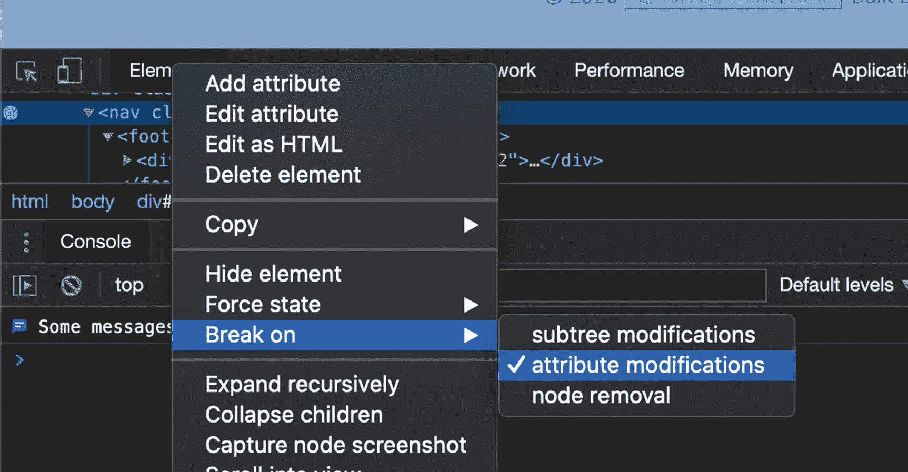

图 11-17

在属性修改时设置中断元素

接下来，当我单击将主题更改为 dark 时，代码将在调试模式下暂停，我可以看到是什么导致了更改。浏览器的断点指向`react-dom.development.js`。你可以在我的网站上看到野外的现场演示: [EliElrom。com](http://elielrom.com) 。参见图 [11-18](#Fig18) 。

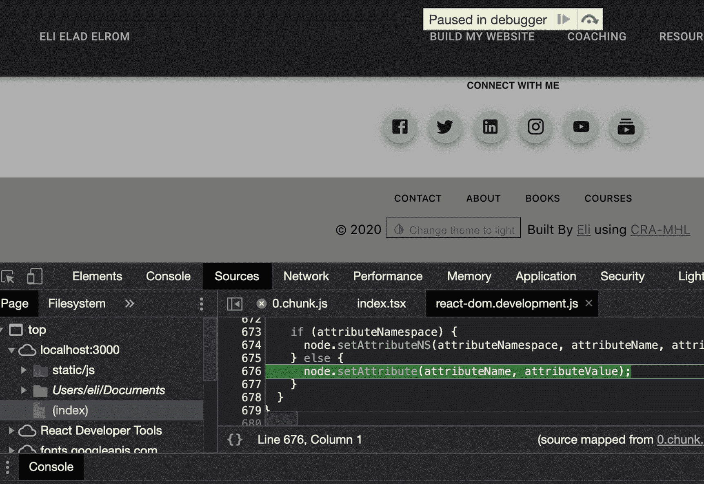

图 11-18

属性更改导致调试器暂停

### 使用 Chrome DevTools 扩展

正如您在前面的例子中看到的，当我们检查属性更改时，我们看到的结果对于理解 React 中发生的事情没有多大意义。

然而，Chrome DevTools 的扩展可以提供帮助。

#### 什么是 Chrome DevTools 扩展？

> *“一个 DevTools 扩展为 Chrome DevTools 增加了功能。它可以添加新的 UI 面板和侧边栏，与被检查的页面进行交互，获取有关网络请求的信息，等等。”*
> 
> ——[`https://developer.chrome.com/extensions/devtools`](https://developer.chrome.com/extensions/devtools)

有两个有用的 React development DevTools 扩展和两个状态管理工具，您应该知道。这些是 React 开发开发工具扩展:

*   *React 开发者工具* : [`https://chrome.google.com/webstore/detail/react-developer-tools/fmkadmapgofadopljbjfkapdkoienihi`](https://chrome.google.com/webstore/detail/react-developer-tools/fmkadmapgofadopljbjfkapdkoienihi)

*   *意识到 React 过来* : [`https://chrome.google.com/webstore/detail/realize-for-react/llondniabnmnappjekpflmgcikaiilmh`](https://chrome.google.com/webstore/detail/realize-for-react/llondniabnmnappjekpflmgcikaiilmh)

这些是状态管理工具:

*   *Redux* : [`https://chrome.google.com/webstore/detail/redux-devtools/lmhkpmbekcpmknklioeibfkpmmfibljd`](https://chrome.google.com/webstore/detail/redux-devtools/lmhkpmbekcpmknklioeibfkpmmfibljd)

*   *反冲* : [`https://chrome.google.com/webstore/detail/recoil-dev-tools/dhjcdlmklldodggmleehadpjephfgflc`](https://chrome.google.com/webstore/detail/recoil-dev-tools/dhjcdlmklldodggmleehadpjephfgflc)

#### Chrome DevTools 扩展:React 开发者工具

React 开发工具允许你在 Chrome 开发工具中检查 React 组件的层次结构。你将在 Chrome DevTools 界面中获得两个新标签。

*   ⚛组件

*   ⚛ 型材

为了测试这个工具，使用前面章节中的编码例子，比如当我们构建我们的应用时。我正在使用我的网站并导航到一个`/books`页面。

我们可以看到很多关于组件的信息，比如 React 的版本(撰写本文时为 v17.0.0)、`props`信息、路由信息以及组件层次结构，如图 [11-19](#Fig19) 所示。

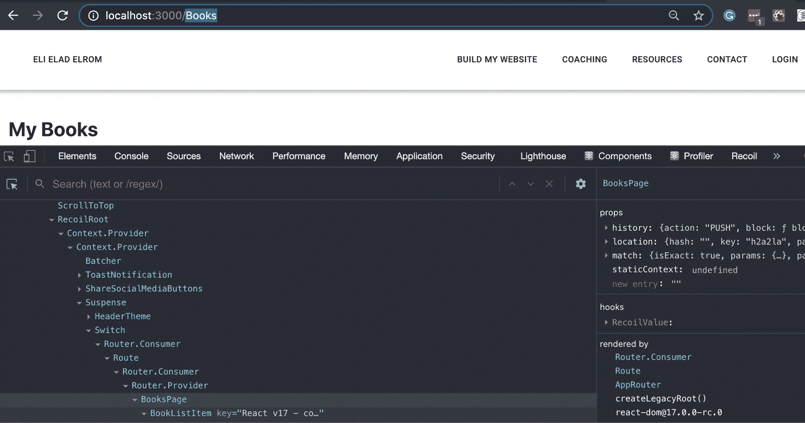

图 11-19

React 开发人员工具，组件窗口

第二个选项卡是用于概要分析器的，在这里我们可以记录产品概要分析构建。我将在这一章的后面讲述更多关于概要分析的内容。

#### Chrome DevTools 扩展:React 的实现

正如您在本书中了解到的，组件是 React 的核心。一旦你安装了 React 开发工具，Realize 是一个很好的工具，可以帮助你可视化 React 组件树。

该工具有助于跟踪状态，并为您提供组件层次结构的整体概述。参见图 [11-20](#Fig20) 。

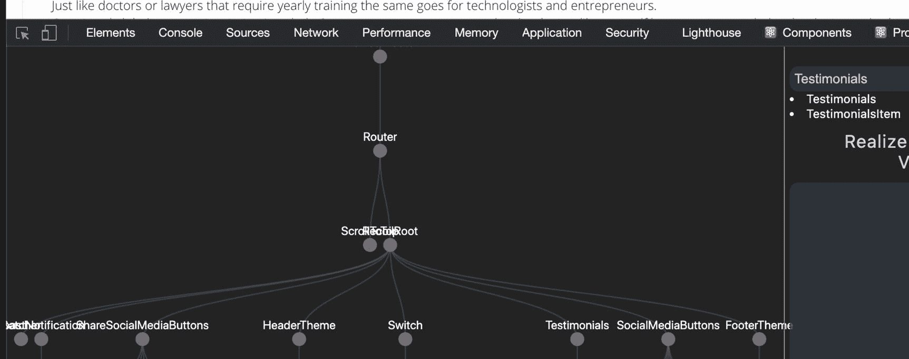

图 11-20

实现 React

下面的整体概述对我们在前几章创建的 CRA 模板项目进行了分解:

```jsx
// src/AppRouter.tsx
const AppRouter: FunctionComponent = () => {
  useEffect(() => {
    // console.log('AppRouter.tsx :: CheckAuthentication')
  }, [])
  return (
    <Router>
      <ScrollToTop />
      <RecoilRoot>
        <ToastNotification />
        <ShareSocialMediaButtons />
        <Suspense
          fallback={
            <div className="home_loading_container">
              
            </div>
          }
        >
          <HeaderTheme />
          <Switch>
            <Route exact path="/" component={App} />
            <Route exact path="/Home" component={Home} />
            ...
            <Route path="/404" component={NotFoundPage} />
            <Redirect to="/404" />
          </Switch>
          <Testimonials />
          <SocialMediaButtons />
          <div className="footer">
            <FooterTheme />
          </div>
        </Suspense>
      </RecoilRoot>
    </Router>
  )
}
export default AppRouter

```

#### Chrome DevTools Extension:退火

如本书前面所述，当使用 Redux 或反冲进行状态管理时，如果能够跟踪状态的内部工作情况，那就太好了。

网上有很多关于 Redux Chrome DevTools 扩展的信息，但我想指出如何深入了解反冲，这是我们在本书前面设置的。它给出了关于原子、选择器和订阅者的信息。参见图 [11-21](#Fig21) 。

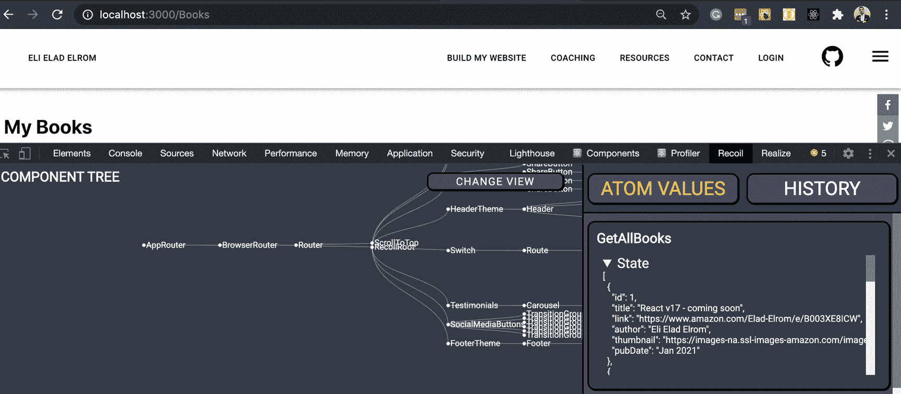

图 11-21

反冲铬 DevTools 扩展图表的书页

在我的例子中，如图 [11-21](#Fig21) 所示，原子是基于`bookObject`的，我可以在浏览器中检查状态值和变化。

```jsx
export interface bookObject {
  title: string
  author: string
  pubDate: string
  link: string
  thumbnail: string
}

```

## 使用 Web 代理

我们可以使用 web 代理服务器来调试我们的应用。一个网络代理被设置为我们计算机上的另一层，它作为一个中枢，通过它所有的互联网请求将被处理。

### 利用查尔斯

Chrome DevTools 很棒，但有时我们需要更多。除了网络资源，查尔斯还对其他资源提出了很好的见解。例如，您可以进行节流(模拟较慢的互联网)、SSL 代理、数据格式化和 Ajax 调试，以及记录和保存不同的会话等。从这里下载查尔斯:

```jsx
https://www.charlesproxy.com/latest-release/download.do

```

这在处理 SSL 站点时很方便，因为数据通常是隐藏的。为了能够查看 SSL 站点的详细信息，您需要设置一个 Charles 根证书。要设置 Charles 根证书，请打开 Charles。

从 Charles 的顶部菜单中，选择帮助，SSL 代理，然后选择“安装 Charles 根证书”

每个站点或所有站点都需要信任该证书。对于 Mac，您可以连按证书并使用“信任”标签来将证书设置为始终受信任。

然后我们可以看到 SSL 站点上的安全项目，如图 [11-22](#Fig22) 所示。

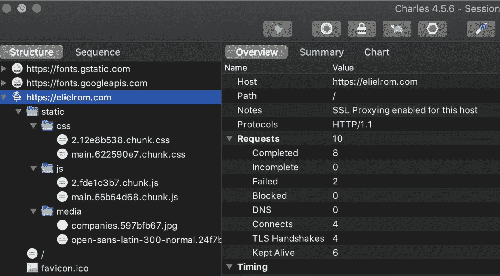

图 11-22

Charles 配置了 SSL 代理

有关设置 SSL 证书的更多信息，请访问 [`https://www.charlesproxy.com/documentation/using-charles/ssl-certificates/`](https://www.charlesproxy.com/documentation/using-charles/ssl-certificates/) 。

Note

我想指出的是，查尔斯的一个缺点是它不是免费的。它有一个使用有限的试用版。然而，还有其他类似的 web 代理工具，如 Fiddler ( [`https://www.telerik.com/fiddler`](https://www.telerik.com/fiddler) )在撰写本文时是免费的。

## 使用网络协议分析器

有时，我们需要更深入地了解我们的应用或 API 的网络数据，我们连接到这些数据，但无法直接控制它们。在这些情况下，您可以使用网络协议分析器。

### Wireshark

当您需要更深入地了解网络数据时，例如，如果您需要对网络协议进行深入分析，Wireshark 就是标准。

它允许您深入检查数百个协议，并提供实时捕获功能。

从这里下载: [`https://www.wireshark.org/download.html`](https://www.wireshark.org/download.html) 。

您可以过滤结果并观察网络请求。图 [11-23](#Fig23) 显示了一个例子。

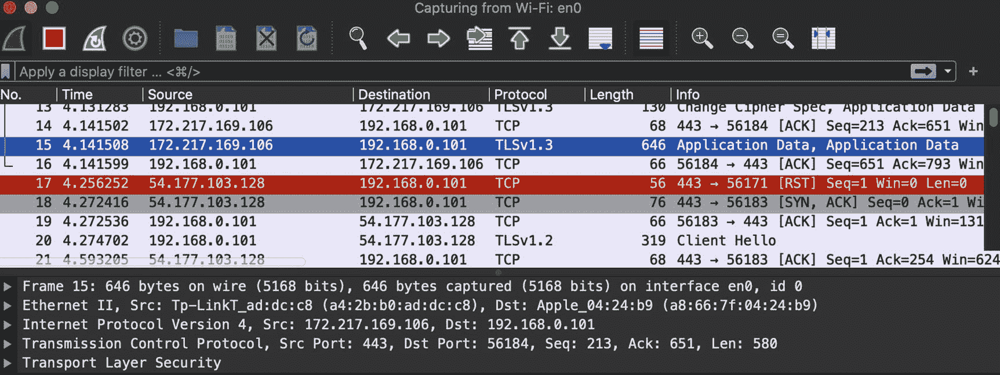

图 11-23

Wireshark 捕获结果

## 剖析您的 React 应用

与传统的 web 应用相比，当您的代码构建正确时，React 速度更快，这主要是因为使用了虚拟 DOM 概念。然而，这并不意味着你不能写内存泄漏或你不应该试图提高性能。

事实上，一个好的开发习惯是保存应用的性能配置文件，并在每次添加新功能时引用它。

在这一部分，我将与您分享四种分析 React 应用的可靠方法。

JS 中的内存是由垃圾收集器自动管理的。很容易造成内存泄漏。

Note

GC 是自动内存管理的过程。它基于收集不再需要的记忆。

但是，即使没有内存泄漏，大量的内存占用也会降低我们的应用的速度，并导致 CPU 峰值和大量内存使用。

认知度是确保你的应用性能良好的关键。你应该不断衡量你添加的新功能的表现，以及它对你现有应用的影响。在前一章中，我们自动化了我们的开发和部署。发布应用时，还应该考虑自动化性能测试。

### 如何描述我的 React 应用？

有很多工具可以帮助完成这项工作。以下是我在处理性能问题时最常用的选项:

*   活动监视器/Windows 任务管理器

*   Chrome DevTools 的“性能”标签

*   React Chrome 开发工具扩展

*   React 探查器 API

在我们开始之前，我想谈谈用于概要分析的构建。

分析本地版本时，最好使用版本的生产版本，而不是开发版本，因为开发没有经过优化，与生产版本不同。

为了让产品构建在本地运行，我们正在使用的 CRA·MHL 模板项目已经包含了`serve`库( [`https://github.com/vercel/serve`](https://github.com/vercel/serve) )。

可以全局安装`serve`。为此，确保您设置了对全局`node_modules`的读写权限并安装了它。

```jsx
$ sudo chown -R $USER /usr/local/lib/node_modules
$ npm install -g serve

```

接下来，通过指定`-- profile`标志来创建一个分析构建。

将这些运行脚本添加到您的`package.json`文件中，以构建生产构建和分析构建，并为这些构建启动一个本地服务器。

```jsx
// package.json
"build:serve": "yarn build && serve -s build && open http://localhost:5000",
"build:profile": "yarn build --profile && serve -s build && open http://localhost:5000"

```

### 活动监视器/Windows 任务管理器

就我个人而言，我喜欢从我们计算机上的内置工具开始，对我们的内存占用和处理器使用情况进行 10，000 英尺的概述。

是的，它们是“穷人的”工具，但却是一个很好的起点。例如，Safari 会按网站对使用情况进行分类。

看看活动监视器使用前后的情况。图 [11-24](#Fig24) 显示浏览器加载网站前后的内存使用情况，图 [11-25](#Fig25) 显示 CPU 使用增加了 0.6%。

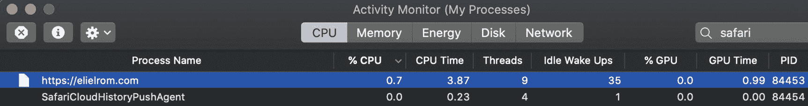

图 11-25

使用 Safari 导航到“我的网站”后的活动监视器

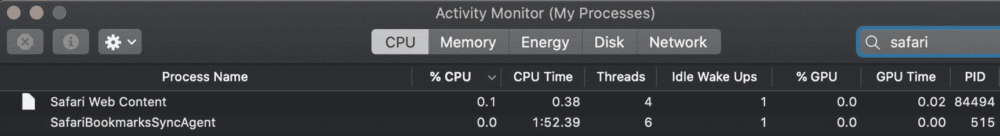

图 11-24

Safari 打开后的活动监视器

### 浏览器的分析工具

主要的浏览器都为开发者提供了工具，可以帮助他们调试和分析你的应用。谷歌是领先的搜索引擎，为开发者提供了很好的工具。所以在这里，我将介绍 Google DevTools，但是要注意，其他流行的浏览器如 Safari、Firefox 和 Microsoft Edge 也包含开发人员工具。

#### Chrome DevTools 的“性能”标签

Chrome DevTools 有一个性能标签。要打开性能选项卡，请在浏览器上单击鼠标右键，然后单击检查。

接下来，选择截图和内存复选框来查看两者。

图 [11-26](#Fig26) 和 [11-27](#Fig27) 显示了一个比较 CRA 模板和我的网站的例子。

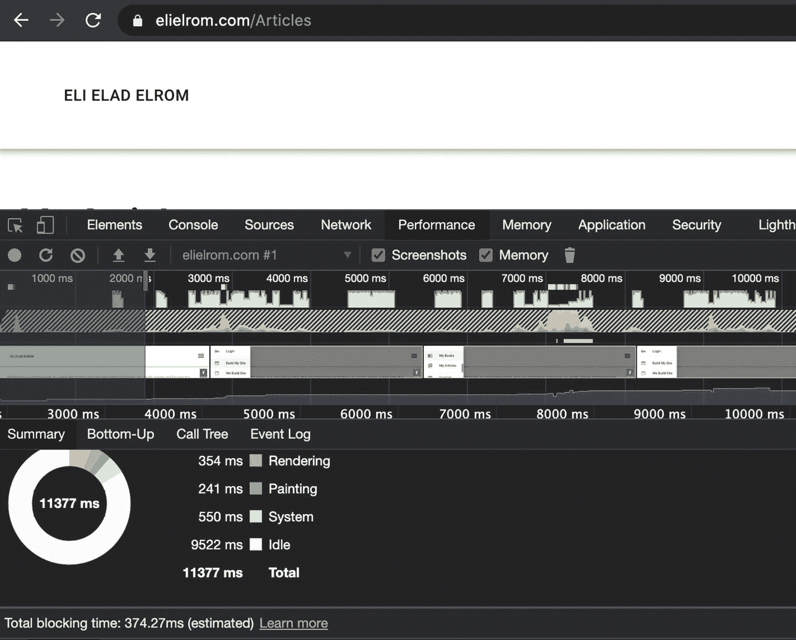

图 11-27

[埃利罗姆。Chrome DevTools 的“性能”标签中的 com](http://elielrom.com)

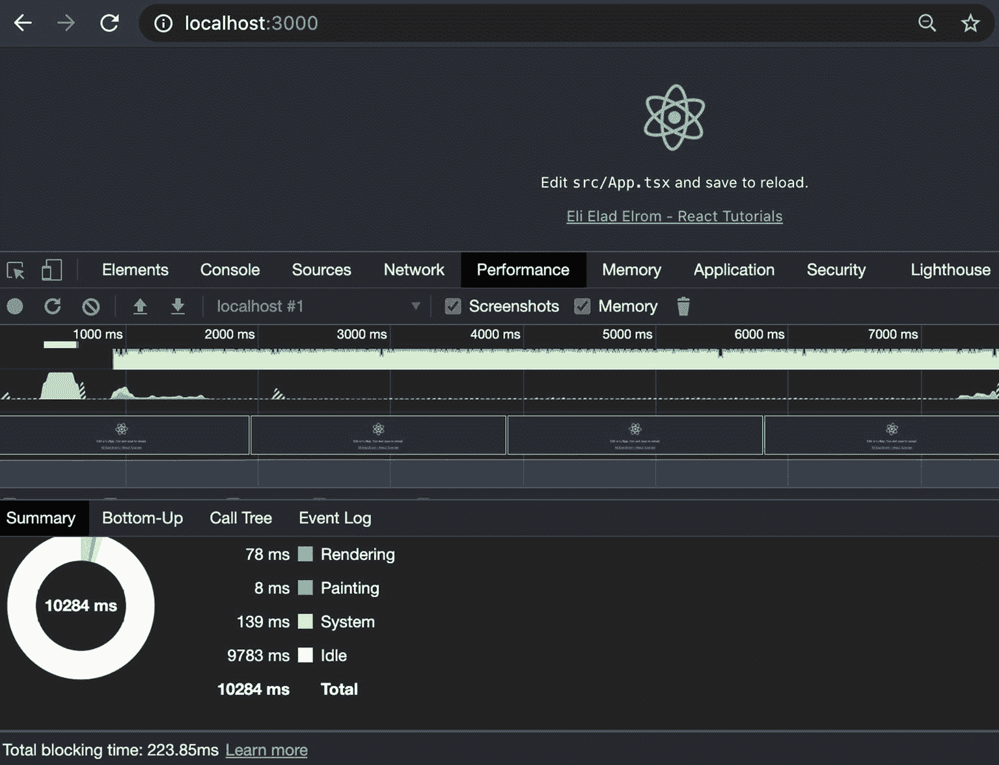

图 11-26

Chrome DevTools 的“性能”标签中的 CRA 模板

#### Chrome DevTools 扩展:React 开发者工具中的 Profiler

之前我们安装了 React 开发者工具扩展。该扩展有两个选项卡:组件和 Profiler。Profiler 选项卡让您深入了解什么叫做*火焰图*。

火焰图是一个有序的图表，显示每个组件渲染所用的总时间。颜色表示渲染时间(越绿越好)以及从虚拟 DOM 到“真实”DOM 渲染或重新渲染这些变化所花费的时间。它包括不同排名的标签以及互动。参见图 [11-28](#Fig28) 。

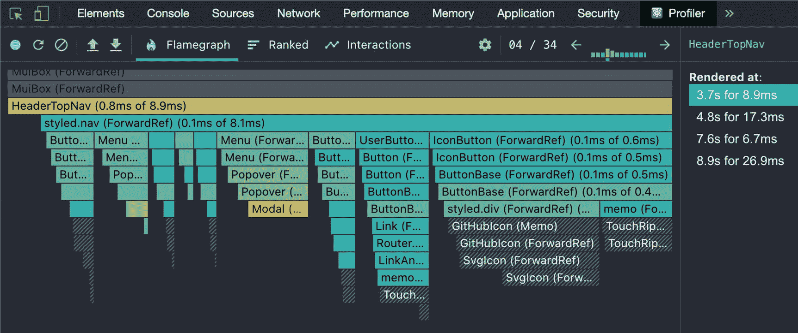

图 11-28

我的开发版本的火焰图结果

记住，我们创建了一个运行脚本来分析生产构建。您可以比较优化构建和开发构建的不同结果。图 [11-29](#Fig29) 显示了生产构建(`$ yarn build:profile`)的分级分析结果。

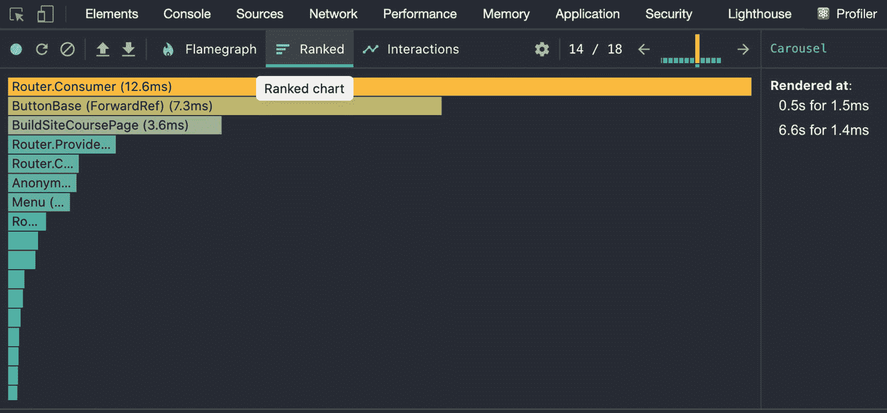

图 11-29

我的生产版本的排名结果

您还可以选择进入您的产品版本，以使概要分析工作正常进行。请记住，在产品版本上设置概要分析确实会带来很小的开销，所以只在需要的时候才使用它。您可以在此处找到说明:

```jsx
https://gist.github.com/bvaughn/25e6233aeb1b4f0cdb8d8366e54a3977

```

### React 探查器 API

React Profiler API ( [`https://reactjs.org/docs/profiler.html`](https://reactjs.org/docs/profiler.html) )包括一个`<Profiler/>`组件，可以帮助我们从源代码定制指标，并测量组件的生命周期时间。

为了测试这个组件，您可以用 CRA 模板项目建立一个新的项目，或者使用我们之前创建的任何一个项目。

```jsx
$ yarn create react-app your-project-name --template must-have-libraries

```

接下来，重构路由`sec/AppRouter.tsx`并用`Profiler`组件包裹它，如图 [11-30](#Fig30) 所示。

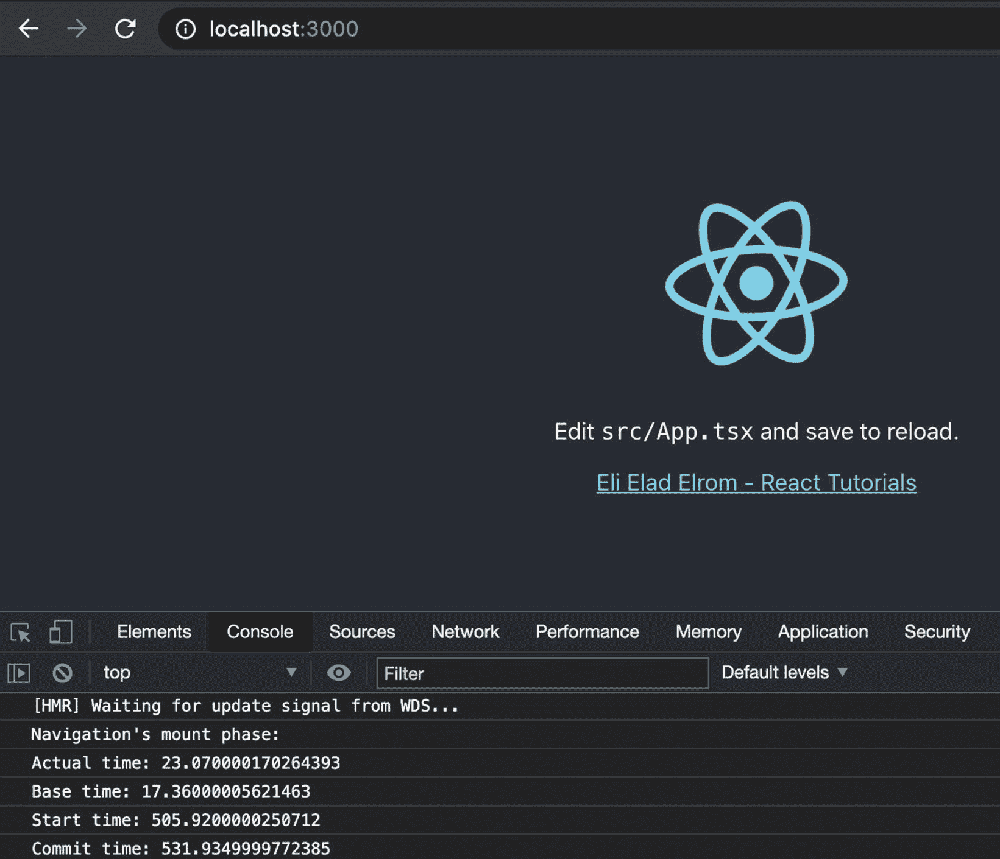

图 11-30

CRA-MHL 模板的探查器 API 结果，开发版本

```jsx
// src/AppRouter.tsx

import { Profiler } from 'react'

const AppRouter: FunctionComponent = () => {
  return (
    <Profiler onRender={(id, phase, actualTime, baseTime, startTime, commitTime) => {
      console.log(`${id}'s ${phase} phase:`);
      console.log(`Actual time: ${actualTime}`);
      console.log(`Base time: ${baseTime}`);
      console.log(`Start time: ${startTime}`);
      console.log(`Commit time: ${commitTime}`);
    }}>
    <Router>
      <RecoilRoot>
        <Suspense fallback={<span>Loading...</span>}>
          <Switch>
            <Route exact path="/" component={App} />
          </Switch>
        </Suspense>
      </RecoilRoot>
    </Router>
    </Profiler>
  )
}

```

正如你在 DevTools 的控制台标签中看到的，我得到了结果。在本例中，我记录了所有内容，但是我们可以创建一个脚本来过滤结果并以不同的方式处理它们。

## 摘要

在本章中，我介绍了调试和分析 React 应用的方法。在本章的第一部分，我介绍了调试 React 应用的八种方法。

*   我向您展示了如何在 Visual Studio 代码 IDE 和 WebStorm 上创建断点和调试 React。

*   我向您展示了如何使用 Console 选项卡并与 web 平台 API 交互。

*   您了解了`debugger`语句，并使用 Chrome DevTools 以及 VS 代码和 WebStorm IDEs 将`debugger`语句用于 Jest 测试。

*   我们通过学习如何查看 DOM 元素以及基于 DOM 变化放置断点来了解 Chrome DevTools。

*   我们安装了这些 Chrome DevTools 扩展:React 开发者工具、Realize、Redux 和反冲。

*   最后，我们检查了 Charles web 代理和 Wireshark 网络协议分析器。

在本章的第二部分，我介绍了四种分析 React 应用的方法。

*   我向您展示了如何使用活动监视器(Mac)/任务管理器(Windows)来检查内存和 CPU 占用。

*   我介绍了 Chrome DevTools 的 Performance 选项卡以及 React Chrome DevTools 扩展的 Profiling 选项卡。

*   最后，您学习了如何使用 React Profiler API 来获取组件的呈现时间。

在下一章，也是最后一章，我将向你展示一些技术，你可以用这些技术来优化你的 React 应用，以提高性能和应用的质量。