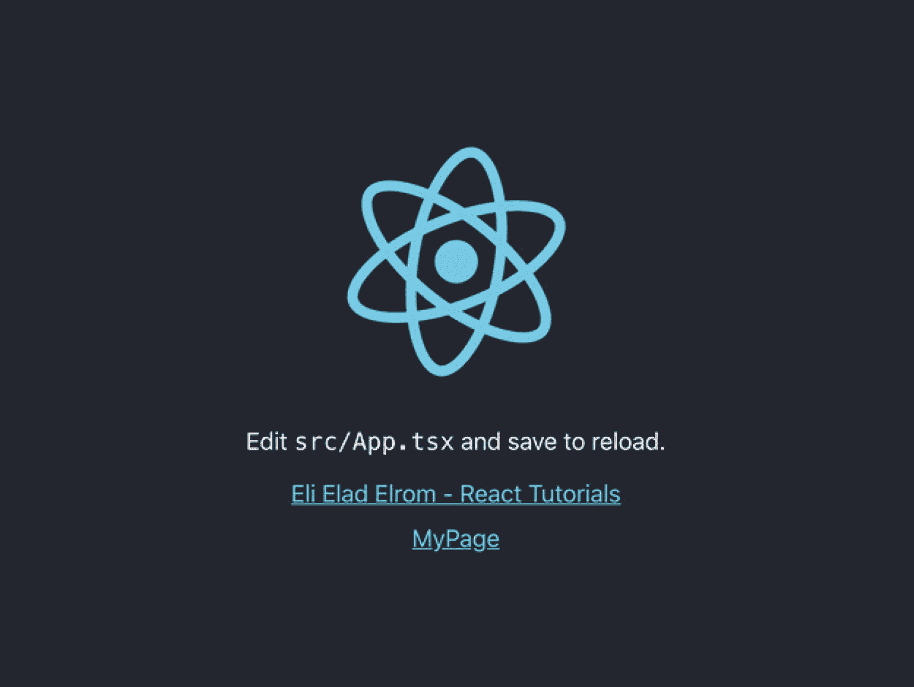

# 十二、优化您的 React 应用

优化您的代码是一个高级主题，需要确保我们交付一个高质量的产品，降低资源占用并更快地加载我们的应用。在这一章中，我将强调一些在你写第一行代码之前应该知道的优化技术。涵盖的主题包括预缓存、延迟加载、代码拆分、树抖动、预取和子画面拆分等等。

## 为什么我们需要优化？

正如你在这本书里看到的，CRA 是创建 React 应用的一种流行方式。它设置为使用`react-scripts`管理您的应用配置。它利用 Webpack 来优化产品构建，包括缩小、丑化和压缩代码。你不需要做太多，因为所有这些技术都是 CRA 自带的。

此外，在前面的章节中，我们使用了自动化开发和部署技术来提高代码的质量。具体来说，我们建立了 ESLint、Huskey、单元测试、E2E 测试等等来识别糟糕的编码和弱点。

然而，尽管如此，CRA 仍然是一个香草味的，一刀切的工具，有时你会想微调和配置你的应用更多一点，以满足你的特定需求，并更多地了解正在发生的事情。此外，如果你不小心，你的应用可能会膨胀，变成一个“骗子”

Note

*邱建*不是错别字；这是一个低质量的过程，会导致应用的响应时间很短，或者阻碍用户交互。

CRA 所基于的单页应用(SPAs)的主要性能挑战之一是，用户需要等待组成应用的 JS 包完成下载，然后才能看到内容。

如果 JS 包变得臃肿，对于网速慢的用户来说会花费很多时间，使得你的应用运行缓慢或者对某些用户不可用。这将导致失去游客和业务。我们的目标是构建渐进式网络应用(PWAs)的应用。

> *“渐进式 Web 应用(PWA)是使用现代 API 构建和增强的，以提供增强的功能、可靠性和可安装性，同时使用单一代码库在任何设备上向任何人、任何地方提供服务。”*
> 
> ——[`https://web.dev/what-are-pwas/`](https://web.dev/what-are-pwas/)

## 你会学到什么？

按照本章中的步骤，您将了解如何减少应用的内存占用，避免内存泄漏，减少捆绑文件大小，只在使用中加载一次资源，减少查看内容的等待时间，提高性能，并确保它随时随地工作，甚至离线。

你还会更加了解你的应用中发生了什么，这样你就可以更好地配置你的应用，而不是使用默认设置。这是一个很大的主题，但我的目标是给你最重要的优化方法。

## 如何优化我的应用？

我把优化你的 CRA React TS 应用的最好方法分成几个部分。

*   尽可能使用 PureComponent 作为类组件

*   惰性装载

*   预呈现静态页面

*   预缓存—脱机工作

*   代码分割

*   树摇晃

*   缩小媒体尺寸

*   预取

*   清除未使用的副作用事件处理程序

但是在开始之前，让我们创建一个可以用来试验和测试的项目。

我将使用我的 CRA 启动模板项目；我把它的名字改成`optimize-ts`。

```jsx
$ yarn create react-app optimize-ts --template must-have-libraries

```

让我们创建一个可以用来实验的页面组件。我使用的是已经包含在 CRA MHL 模板项目中的`generate`模板。这些模板可以帮助我们用一个命令快速创建这些页面。

```jsx
$ cd optimize-ts
$ npx generate-react-cli component MyPage --type=page

```

模板使用`templates/page`文件夹中的模板集为我们自动生成了三个文件(SCSS 风格、TS 组件和 Jest 测试文件)。我们在终端得到确认。

```jsx
Stylesheet "MyPage.scss" was created successfully at src/pages/MyPage/MyPage.scss

```

在 src/pages/my page/MyPage.test.tsx 中成功创建了测试“my page . test . tsx”

组件“MyPage.tsx”已在 src/pages/MyPage/MyPage.tsx 中成功创建

接下来，打开`AppRouter.tsx`。让我们将创建的页面添加到路由中。

```jsx
// src/AppRouter.tsx

import MyPage from './pages/MyPage/MyPage'
const AppRouter: FunctionComponent = () => {
  return (
    <Router>
      <RecoilRoot>
        <Suspense fallback={<span>Loading...</span>}>
          <Switch>
            <Route exact path="/" component={App} />
            <Route exact path="/MyPage" component={MyPage} />
          </Switch>
        </Suspense>
      </RecoilRoot>
    </Router>
  )
}

```

测试一切是否正常工作(您应该只看到带有链接的微调器)。

```jsx
$ yarn start

```

此时，您可以导航到页面`http://localhost:3000/MyPage`并确保它工作正常。

接下来，让我们添加一个到我们创建的页面组件的链接，这样我们就可以从主页导航到页面。

打开`src/App.tsx`并添加`NavLink`组件，这样我们就可以将它链接到我们的页面菜单。我将它设置为一个数组，以防我们想要添加更多的页面。

```jsx
<List>
  {[
    { name: 'MyPage', url: '/MyPage' }
  ].map((itemObject, index) => (
    <NavLink
      to={itemObject.url}
      key={itemObject.url}
    >
      <ListItem>{itemObject.name}</ListItem>
    </NavLink>
  ))}
</List>

```

你可以在图 [12-1](#Fig1) 中看到最终的结果。



图 12-1

我们的 CRA 模板启动项目与页面和导航

您可以从这里下载用于本章的最终完整项目:

```jsx
https://github.com/Apress/react-and-libraries/12/optimize-ts

```

### 分析器包

另一个值得了解的工具是 Analyzer Bundle。它可以帮助您调试和分析您的应用。

如果我们想知道 JS 包的内幕，我们可以从 CRA 弹出( [`https://create-react-app.dev/docs/available-scripts/`](https://create-react-app.dev/docs/available-scripts/) )并修改我们的代码来查看 JS 包的内容。

在不弹出的情况下调整 CRA Webpack 配置的另一个选项是使用这个库:`react-app-rewired` ( [`https://github.com/timarney/react-app-rewired`](https://github.com/timarney/react-app-rewired) )。

但是您不需要做所有这些，因为弹出会迫使您维护配置文件。我们可以使用`source-map-explorer`来查看我们的包的地图。

```jsx
$ npm install -g source-map-explorer

```

现在，您可以打开库并直观地查看库。

```jsx
$ source-map-explorer optimize-ts/build/static/js/[my chunk].chunk.js

```

或者，可以使用`bundle-analyzer` ( [`https://github.com/svengau/cra-bundle-analyzer`](https://github.com/svengau/cra-bundle-analyzer) )。它更加丰富多彩，在一个页面中包含了所有的包，而不是用`source-map-explorer`一个一个地调用它们。

```jsx
$ yarn add -D cra-bundle-analyzer

```

现在我们可以创建报告了。

```jsx
$ npx cra-bundle-analyzer

```

一旦运行`yarn build`，该命令将在`build/report.html`中生成一个`webpack-bundle-analyzer`报告。

## 尽可能使用 PureComponent 作为类组件

正如您在前面章节中回忆的那样，React 17 在创建 React `Component`类时提供了两个主要选项。

*   `React.Component`

*   `React.PureComponent`

在整本书中，我们使用了`PureComponent`而不是`React.Component`，但是为什么呢？当你不需要访问`shouldComponentUpdate`方法时，最好使用`PureComponent`来代替。

```jsx
extends React.PureComponent

```

`React.PureComponent`在某些情况下提供了性能提升，但代价是失去了`shouldComponentUpdate`生命周期。你可以在 React 文档( [`https://reactjs.org/docs/react-api.html#reactpurecomponent`](https://reactjs.org/docs/react-api.html%2523reactpurecomponent) )中了解更多。

在我们的代码中，我们不需要访问`shouldComponentUpdate`，所以我们可以使用`PureComponent`。下面是显示页面名称的初始文件的代码:

```jsx
import React from 'react'
import './MyPage.scss'
import { RouteComponentProps } from 'react-router-dom'
import Button from '@material-ui/core/Button

// or React.Component
export default class MyPage extends React.PureComponent<IMyPageProps, IMyPageState> {
  constructor(props: IMyPageProps) {
    super(props)
    this.state = {
      name: this.props.history.location.pathname
        .substring(1, this.props.history.location.pathname.length)
        .replace('/', ''),
      results: 0
    }
  }

  render() {
    return (
      <div className="TemplateName">
        {this.state.name} Component
      </div>)
    )
  }
}

interface IMyPageProps extends RouteComponentProps<{ name: string }> {
  // TODO
}

interface IMyPageState {
  name: string
  results: number
}

```

### 重新-重新-重新-重新渲染

也就是说，有时需要使用`shouldComponentUpdate`,因为我们可以使用该方法让 React 知道该组件不受父组件状态变化的影响，并且不需要重新呈现。在这种情况下，你需要将你的类设置为`React.Component`，然后你就可以访问`shouldComponentUpdate`。

```jsx
public shouldComponentUpdate(nextProps: IProps, nextState: IState) {
  return false // prevent rendering
}

```

在这些情况下，我们需要控制组件并希望停止重新呈现器。使用`React.Component`可以获得更好的性能，因为我们可以停止重新渲染过程。

要找到行为不端的公民，可以使用 Chrome DevTools 扩展 React Developer Tools，并使用其高亮更新复选框来查找行为不端的组件。它通过寻找过度渲染的组件来做到这一点。

## 惰性装载

延迟加载是提高应用性能并快速看到显著效果的最简单方法之一。我会说，这种努力是优化的低挂果实。

最好从路由开始。让我们创建一个优化的生产版本。

```jsx
$ yarn build

```

如果您导航到为我们创建的`build/static`文件夹，您可以看到我们有三个 JS 文件和一个许可证文件。见图 [12-2](#Fig2) 。


图 12-2

CRA 生产在利用延迟加载之前构建

现在更新代码以包含延迟加载。`Suspense`组件将在组件的加载阶段显示，使用 lazy 方法导入组件将确保组件只在使用后才加载。

这一变化更新了我们导入组件的方式，具体如下:

```jsx
import MyPage from './pages/MyPage/MyPage'

```

致以下内容:

```jsx
const MyPage = lazy(() => import('./pages/MyPage/MyPage'))

```

组件加载时,`Suspense`组件包括一个回退。看一下完整的代码:

```jsx
import React, { FunctionComponent, lazy, Suspense } from 'react'
import { BrowserRouter as Router, Route, Switch } from 'react-router-dom'
import { RecoilRoot } from 'recoil'
import App from './App'

// Normal
// import MyPage from './pages/MyPage/MyPage'

// Lazy loading
const MyPage = lazy(() => import('./pages/MyPage/MyPage'))

const AppRouter: FunctionComponent = () => {
  return (
    <Router>
      <RecoilRoot>
        <Suspense fallback={<span>Loading...</span>}>
          <Switch>
            <Route exact path="/" component={App} />
            <Route exact path="/MyPage" component={MyPage} />
            <Redirect to="/" />
          </Switch>
        </Suspense>
      </RecoilRoot>
    </Router>
  )
}

```

再次运行`yarn build`。您可以看到，构建脚本将我们的包块从三个文件分解为四个文件，这是因为我们采用了惰性加载。见图 [12-3](#Fig3) 。


图 12-3

CRA 生产构建已优化

当您使用`yarn start`时，您看不到回退加载消息，因为它发生得太快了，因为我们的页面组件只包含页面的名称。然而，你可以在我的网站( [`https://elielrom.com`](https://elielrom.com) )上看到一个例子，我为登录页面放置了延迟加载，并为回退页面放置了一个图像微调器。浏览页面，您将在第一次浏览登录页面时看到微调器。如果没有，可以减少互联网连接 DevTools。

如果你使用 Chrome DevTools 或者 Charles(关于调试的更多信息，参见第 [11](11.html) 章)，你实际上可以测量结果。这取决于你的应用的大小和你正在做的事情，但这个简单的方法可以让你获得几秒钟的时间。

Note

关于延迟加载有一点需要注意。有时候，对所有页面进行延迟加载是没有意义的，因为页面很轻。拆分和加载多个包文件可能需要更长时间。

您需要尝试一下延迟加载，因为它的效果如何取决于具体情况。此外，最好只在某些组件上包装这些惰性加载方法。例如，一个登录成员区域不是所有用户都使用的，而其他页面可以一起加载。最好的方法是试验并设置内存分析，然后降低网络速度，找出最佳用户体验。这不是放之四海而皆准的事情。

你可以在 React 文档中找到更多信息( [`https://reactjs.org/docs/code-splitting.html#route-based-code-splitting`](https://reactjs.org/docs/code-splitting.html%2523route-based-code-splitting) )。

## 预呈现静态页面

在某些情况下，CRA (SPA)模式非常好，因为你不会刷新页面，感觉就像在移动应用中一样。

这些页面应该在客户端呈现。CRA 一开始就不支持服务器端渲染(SSR)。但是，有一些方法可以配置路由并让 CRA 作为 SSR 工作，但是这可能需要您自己退出和维护配置，因此可能不值得这样做。

服务器端呈现(SSR)是在服务器上将客户端 JavaScript 站点呈现为静态 HTML 和 CSS 的过程，而不是在客户端(浏览器)呈现站点。

如果您正在构建需要 SSR 的更大的东西，最好使用已经配置了 SSR 的不同 React 库，如 Next.js framework、Razzle 或 Gatsby(包括如果您在构建时将网站预渲染为 HTML)。

Tip

如果你想用 React 和 Node.js 做服务器渲染，可以去看看 Next.js，Razzle，或者 Gatsby。

Create-React-App 在后端是不可知的，产生静态的 HTML/JS/CSS 包。也就是说，通过 CRA，我们可以进行预渲染，这是目前最接近 SSR 的方法。参见 CRA 文献: [`https://create-react-app.dev/docs/pre-rendering-into-static-html-files/`](https://create-react-app.dev/docs/pre-rendering-into-static-html-files/) 。

有许多选项可以为每个路径或相对链接生成 HTML 页面。以下是一些例子:

*   `react-snap`

*   `react-snapshot`

*   Webpack 静态站点生成器插件

我推荐`react-snap` ( [`https://github.com/stereobooster/react-snap`](https://github.com/stereobooster/react-snap) )，在 GitHub 上有 4000 个明星最受欢迎，和 CRA 配合的天衣无缝。`react-snap`使用我们在第 [10 章](10.html)中用于 E2E 测试的相同的操纵器，在你的应用中自动创建不同路径的预渲染 HTML 文件。

最大的好处是，一旦你使用了`react-snap`，应用并不关心 JS 包是否成功加载，因为你设置的每个页面都是独立的。

请记住，对于每个单独加载的页面，有些包可能有多余的代码，所以这是有代价的。

*步骤 1* :要开始，运行以下命令:

```jsx
$ yarn add --dev react-snap

```

*步骤 2* :接下来，添加`postbuild`运行脚本。

```jsx
// package.json
"scripts": {
  ...
  "postbuild": "react-snap"
},

```

*第三步*:静态 HTML 几乎立即呈现。默认情况下，HTML 是有样式的，这可能会导致一个问题，称为显示“无样式内容的闪烁”(FOUC)。如果使用 CSS-in-JS 库来生成选择器，这一点尤其明显，因为 JavaScript 包必须在设置任何样式之前完成执行。

`react-snap`使用另一个第三方库，`minimalcss` ( [`https://github.com/peterbe/minimalcss`](https://github.com/peterbe/minimalcss) )提取不同路线的任何关键 CSS。

您可以通过在您的`package.json`文件中指定以下内容来启用它:

```jsx
// package.json"scripts": {
  ...
  "postbuild": "react-snap"
},
"reactSnap": {
  "inlineCss": true
},

```

*第四步* : `src/index.tsx`是我们要补水的地方，我们也可以在那里用`serviceWorker.register()`注册预缓存。在下一节中，您将了解更多关于预缓存的内容。

```jsx
// src/index.tsximport React from 'react'

import { hydrate, render } from 'react-dom'
import './index.scss'
import AppRouter from './AppRouter'
import * as serviceWorker from './serviceWorker'

const rootElement = document.getElementById('root')
if (rootElement && rootElement!.hasChildNodes()) {
  hydrate(<AppRouter />, rootElement
  serviceWorker.register()
} else {
  render(<AppRouter />, rootElement)
}

```

*步骤 5* :现在运行 Yarn `build`命令，之后，构建将通过在 CRA 配置的 NPM 脚本自动调用。你应该看到成功的结果。把你的结果和我的比较一下。

```jsx
$ react-snap
✅ crawled 1 out of 3 (/)
✅ crawled 2 out of 3 (/404.html)
✅ crawled 3 out of 3 (/MyPage)
✨ Done in 29.29s.

```

打开 build 文件夹，会看到自动创建的静态页面，如图 [12-4](#Fig4) 所示。


图 12-4

静态页面

Note

预先呈现和提供静态页面不一定总是最好的方法。这实际上会给用户带来不愉快的体验，因为每个页面都将被加载，并且组件负载会跨页面分布。对于轻量级应用，最好等待半秒钟，这样所有的内容都可以加载，这样就不会有更多的等待时间，而不是在每次页面加载时等待一会儿。您需要对此进行测试并亲自查看，但是要注意这个特性。

*步骤 5* :要在本地剥离本地生产构建，运行 CRA 模板运行脚本。它使用的是`serve`库，所以如果你使用的是 CRA MHL 模板，你甚至不需要安装或配置`package.json`。

运行`serve`运行脚本来添加本地服务器并查看生产构建。

```jsx
$ yarn build:serve

```

我想指出，使用 prerender 的另一个重要原因是除了优化之外对静态页面的需求:搜索引擎优化(SEO)。如果您预渲染页面，并希望生成不同的标题、描述、元数据等。，对于由于 SEO 原因的每个页面，或者您需要通过社交媒体共享单个页面，请选中`react-helmet`，这可以帮助您为每个 React 页面组件设置唯一的标题。

### 如何让 react-helmet 为每个页面生成一个标题？

在这一节中，我将解释为每个页面生成标题的步骤。

*第一步*:安装`react-helmet`和 TS 的型号。

```jsx
$ yarn add react-helmet @types/react-helmet

```

*步骤 2* :现在，我们可以重构我们的`MyPage.tsx`并添加`Helmet`组件。

```jsx
import Helmet from 'react-helmet'render() {
  return (
    <div className="MyPage">
      <Helmet>
        <title>My Page</title>
      </Helmet>
      {this.state.name} Component
    </div>)
}

```

请注意，在我们的代码中，state 存储了页面的名称，该名称是从 React Router 中提取的，因此我们需要使用`.replace('/', ')`来表示`this.state.name`，因此如果用户刷新静态页面，它的末尾将会有`about/`。

```jsx
constructor(props: IMyPageProps) {
  super(props);
  this.state = {
    name: this.props.history.location.pathname.substring(
      1,
      this.props.history.location.pathname.length
    ).replace('/', '')
  }
}

```

现在，如果您查看源代码，一旦您单击 MyPage 链接，它就会有标题。

## 预缓存:脱机工作

能够离线是 PWA 的一个核心功能。我们可以用一个`serviceWorker`来做。

CRA 将`serviceWorker`包含在索引文件中。

```jsx
serviceWorker.unregister()

```

### 这是什么意思？

CRA 包括一个用于生产构建的 Workbox webpack 插件( [`https://developers.google.com/web/tools/workbox/modules/workbox-webpack-plugin`](https://developers.google.com/web/tools/workbox/modules/workbox-webpack-plugin) )。

要启用此功能，只需将`serviceWorker`状态更改为`register`。

```jsx
serviceWorker.register()

```

我们已经在前面的部分中为生产进行构建时添加了`serviceWorker`。

```jsx
const rootElement = document.getElementById('root')
if (rootElement && rootElement!.hasChildNodes()) {
  hydrate(<AppRouter />, rootElement)
  serviceWorker.register()
} else {
  render(<AppRouter />, rootElement)
}// serviceWorker.unregister()

```

现在当您再次构建(`$yarn build`)时，新文件出现:`build/precache-manifest.[string].js`。

见图 [12-5](#Fig5) 。


图 12-5

添加到静态文件夹中的运行时主包文件

要查看工作器的运行情况，您需要再次发布构建。

```jsx
$ yarn build:serve.

```

看看 Chrome DevTools 的网络标签。在尺寸栏中，你可以看到上面写着“(ServiceWorker)”，如图 [12-6](#Fig6) 所示。


图 12-6

预缓存服务人员出现在 Chrome DevTools 的网络选项卡上

你现在可以通过关闭网络并连接或者选择 Chrome DevTools 的网络选项卡上的离线复选框来模拟离线体验。刷新应用，它仍然可以工作！

### 你的应用如何离线工作？

CRA 的工作箱默认预缓存策略是`CacheFirst`。静态资产从服务工作者缓存机制中检索，如果失败，则发出网络请求。

一个工具箱支持不同的策略，如`CacheOnly`、`NetworkFirst`等。，但 CRA 可能需要被驱逐，以使用不同于默认的策略。

点击 [`https://create-react-app.dev/docs/making-a-progressive-web-app/`](https://create-react-app.dev/docs/making-a-progressive-web-app/) 了解更多关于此功能的信息。

## 代码拆分

当我们使用延迟加载时，我们能够将 JS 包分解成多个块，并在只需要它们的时候提供服务。

### 动态导入

我们可以做得更多。CRA 用 Webpack 处理代码拆分任务。我们可以告诉 Webpack 进一步拆分我们的 JS 包，并动态导入这些模块。

让我们来看看。创建文件`src/page/MyPage/math.tsx`并添加以下代码:

```jsx
// src/page/MyPage/math.tsx

export function square(x: number) {
  return x * x
}export function cube(x: number) {
  return x * x * x
}export function add(x: number, y: number) {
  return x + y
}

```

为了使用`add`方法，我们通常会这样写代码:

```jsx
import { add } from './math'
console.log(add(1, 2))

```

但是，如果我们想要分割代码，以便 JS 包只在需要时才被检索，并且只绑定使用过的内容，我们可以执行以下操作:

```jsx
import("./math").then(math => {
  console.log(math.add(1, 2))
})

```

让我们创建一个实际的工作示例。通过使用 math `add`函数，我们可以有一个包含可变结果的状态和一次单击更新。看一看`MyPage.tsx`代码，如下所示:

```jsx
// src/page/MyPage/MyPage.tsx

render() {
  const onClickHandler = (event: React.MouseEvent) => {
    event.preventDefault()
    import('./math').then((math) => {
      this.setState({
        results: (math.add(1, 2))
      })
    })
  }
  return (
    <div className="MyPage">
      <Helmet>
        <title>My Page</title>
      </Helmet>
      {this.state.name} Component
      <Button type="submit" onClick={onClickHandler}>
        Math.add
      </Button>
      {this.state.results}
    </div>
  )
}

```

或者更好的是，让我们添加每次点击的结果。

```jsx
import('./math').then((math) => {
  this.setState(prevState => {
    const newState = prevState.results + (math.add(1, 2))
    return ({
      ...prevState,
      results: newState
    })
  })
})

```

现在构建生产代码，并在本地机器上运行它。

```jsx
$ yarn build:serve

```

Tip

我们的构建设置为预缓存，所以你需要在 Mac 上通过按 Shift+Refresh 来强制清除缓存，或者你可以在 Chrome 网络商店找到一个奇特的插件来做这件事。否则，你可能是在服务老页面，拔头发。

见图 [12-7](#Fig7) 。


图 12-7

Meth.add 在本地运行生产版本的代码分割功能

请注意，我们的包增加了 1，当我们调用`MyPage`和按钮时，包文件将被检索，而不是在我们第一次加载页面时让用户等待包。见图 [12-8](#Fig8) 。


图 12-8

代码拆分后的 JS 包

### 模块联盟

我们能做得更多吗？答案是有也没有。

在撰写本文时，CRA 的 Webpack 版本为 4.42.0(见`node_modules/react-scripts/package.json`)。然而，截至 2020 年 10 月，Webpack 的当前版本是 v5.4.0，它包括了大量的性能改进。一个主要的问题涉及到模块联合。

模块联合允许您将远程 Webpack 构建导入到应用中。使用 Webpack v5，我们不仅可以从我们的项目中导入这些块，还可以从不同的源(项目)中导入这些块。你可以在 [`https://webpack.js.org/guides/build-performance/`](https://webpack.js.org/guides/build-performance/) 了解更多信息。

您可以弹出和升级 Webpack。如果你需要的话，确保你自己构建并包含模块联合。

## 树摇晃

*摇树* ( [`https://webpack.js.org/guides/tree-shaking/`](https://webpack.js.org/guides/tree-shaking/) )是 JavaScript 上下文中使用的一个术语，意思是删除死代码。当谈到删除死代码时，有很多事情要做。

当我说死代码时，它可能意味着这两件事:

*   *从未执行过的代码*:运行时永远不能执行的代码

*   *结果从未使用过*:代码被执行，但结果从未使用过

比如在我们搭建的 app 里，我在`src/AppRouter.tsx`里定义了反冲。

```jsx
<RecoilRoot>
    <Suspense fallback={<span>Loading...</span>}>
      <Switch>
        <Route exact path="/" component={App} />
        <Route exact path="/MyPage" component={MyPage} />
        <Redirect to="/" />
      </Switch>
    </Suspense>
</RecoilRoot>

```

但是在这个例子中，我从来没有使用反冲功能。

现在，如果我们深入我们的 JS 包，看看发生了什么，我们可以看到反冲使用了几乎 38.19KB。见图 [12-9](#Fig9) 。


图 12-9

我们的捆绑带反冲的源图

```jsx
$ source-map-explorer optimize-ts/build/static/js/[my chunk].chunk.js

```

这里我们重构代码，去掉反冲，重新构建:

```jsx
<Router>
    <Suspense fallback={<span>Loading...</span>}>
      <Switch>
        <Route exact path="/" component={App} />
        <Route exact path="/MyPage" component={MyPage} />
        <Redirect to="/" />
      </Switch>
    </Suspense>
</Router>

```

现在代码从 276KB 下降到 224.51KB，反冲不包括在内。参见图 [12-10](#Fig10) 。


图 12-10

无后座力我们束的来源图

CRA 包括现成的 Webpack，将我们的应用与一些已经为我们设置好的设置捆绑在一起。

您可以看到包含`compression`和`OptimizeCSSAssetsPlugin`的优化标签。

如果需要更改，需要自行弹出和维护。然而，即使没有弹射，我们也可以做一些事情。

为了更好地理解幕后发生的事情，在 CRA 打开 Webpack 配置文件，它位于`react-scripts`中。

```jsx
$ open node_modules/react-scripts/config/webpack.config.js

```

或者对于开发服务器，使用以下命令:

```jsx
$ open node_modules/react-scripts/config/webpackDevServer.config.js

```

先说副作用。

Note

副作用是在被调用函数之外可以观察到的状态变化，而不是它的返回值。副作用的例子包括:改变外部变量或对象属性(全局变量或父函数作用域链中的变量)的值、没有说明符的导入语句(即`import 'someLib'`)、登录到控制台、获取数据、设置订阅或手动改变 DOM。

如果您使用 Webpack，您可以指导 Webpack 如何处理库。事实上，大多数 NPM 图书馆都有副作用。

如果您查看 CRA Webpack 的`webpack.config.js`文件，您会看到导入的库都设置了`sideEffects: true`标志。这是根据每个库设置的。

为我们不使用的库导入会增加我们代码的大小(JS 包)。这些进口商品应该取消。

### 导入所需模块与使用不带说明符的 Import 语句

我们来看一个例子。假设我添加了一个`import`声明，说明我没有使用和导入我需要的特性，比如`useRecoilValue`。

```jsx
// src/page/MyPage/MyPage.tsx
import { useRecoilValue } from 'recoil'

```

CRA `react-script`工具允许我开始并构建我的生产构建，但我会得到一条警告消息，如图 [12-11](#Fig11) 所示。


图 12-11

未使用代码的警告

有这些警告不好，但也不是世界末日。

在这个具体的例子中，Webpack 正在使用的 Terser ( [`https://github.com/terser/terser`](https://github.com/terser/terser) )试图解决这个问题，并决定不需要这个代码。因此，尽管它创建了一个警告，但是它并没有在我们的 build JS 包中包含这个库。

代码没有包括在内，因为这个包已经过优化，库已经为我们移除了(您可以通过检查源代码图来验证这一点)。

但是不要依赖 Terser 总是能够解决这个问题。当它不能时，它将包括死代码。

然而，如果我使用一个没有说明符(`import 'recoil'`)的`import`语句，就像这样:

```jsx
// src/page/MyPage/MyPage.tsx
import 'recoil'

```

代码将为我们编译、构建，甚至运行 ESLint，没有任何警告，但它将包括整个*反冲库。*

原因是 Webpack 将不带说明符(`import 'recoil'`)的`import`语句视为副作用，并且它将在我们的源映射中包含反冲，就好像我们有意这样做一样。

Note

只包含您需要的模块，避免使用没有说明符的`import`语句。

您还可以微调并将`sideEffects`属性添加到项目的`package.json`文件中，以告诉 Webpack 如何在不弹出的情况下处理副作用。你可以在 Webpack 文档中读到更多关于这个和关于树摇动的内容: [`https://webpack.js.org/guides/tree-shaking/`](https://webpack.js.org/guides/tree-shaking/) 。

## 缩小介质尺寸

我们讨论了树抖动和将 JS 包的大小减到最小，但是除了包的大小之外，在一个应用中经常使用其他资源，这会占用很多资源。这些是媒体文件，如图像、视频、音频文档以及与大数据同步。

要优化资源，有很多工具可以使用。如果你有 Adobe 产品，你有带“存储为 Web 格式”选项的 Photoshop，你可以用它来确保你的图像保持较小的尺寸。Adobe Premiere 可以针对不同的设备和不同的设置对您的视频进行编码。

您可以使用一个库来检查用户的网络速度，并根据用户的连接提供不同的资源。这是视频传输的常见做法。

理想情况下，我们希望在运行时而不是编译时上传资源，因为我们不希望用户等待资源。

另一件事是 SVG。SVG 是基于向量的，非常棒。它给用户清晰的图形外观，在任何分辨率的屏幕尺寸；然而，这是有代价的。React 提高性能的方法是减少对服务器的请求数量。

导入小于 10KB 的图像会返回数据 URI，而不是实际的 SVG 文件；参见 React 文档( [`https://create-react-app.dev/docs/adding-images-fonts-and-files/`](https://create-react-app.dev/docs/adding-images-fonts-and-files/) )。这在 CRA 开发中被默认忽略，但是您可以在产品构建中看到这种行为；见`IMAGE_INLINE_SIZE_LIMIT` ( [`https://create-react-app.dev/docs/advanced-configuration`](https://create-react-app.dev/docs/advanced-configuration) )。

拥有大量的 SVG 图形很容易使你的应用膨胀。最好将它们收集到一个 JPG 图像文件中，并使用图像精灵。加载单个图像比逐个加载单个图像更快。

## 预取

你可能已经看到 React 中的高阶组件(hoc)可以增强组件的能力( [`https://reactjs.org/docs/higher-order-components.html`](https://reactjs.org/docs/higher-order-components.html) )。对于我们的 JS 包，我们可以采用类似的方法。

我们希望首先加载页面，然后检索 JS 包，这样我们就可以尽快显示页面。

让我们来看看。如果你用`$ yarn build:serve`构建了一个量产版，并在 Chrome DevTools 中测试，你可以看看 JS bundle chunks 的层次结构；他们在顶端。参见图 [12-12](#Fig12) 。


图 12-12

没有为 JS 包设置以特定顺序显示的层次结构

我们想把这些包裹移到底部。为此，我们可以使用 Quicklink ( [`https://github.com/GoogleChromeLabs/quicklink`](https://github.com/GoogleChromeLabs/quicklink) )。Quicklink 通过使用技术来决定首先加载什么，试图使后续页面的导航加载得更快。让我们安装它。

```jsx
$ yarn add -D quicklink webpack-route-manifest

```

在我们的案例中，我们将使用 React CRA 水疗中心。我们将使用 React HOC，在这里我们希望为我们延迟加载的页面添加预取功能。为此，我们只需使用一个空的 option 对象，并用 Quicklink HOC 包装我们的组件。

```jsx
<Route exact path="/MyPage" component={withQuicklink(MyPage, options)} />

```

看看这里显示的重构后的`src/AppRouter.tsx`:

```jsx
// src/AppRouter.tsx

import React, { FunctionComponent, lazy, Suspense } from 'react'
import { BrowserRouter as Router, Route, Switch, Redirect } from 'react-router-dom'
import { RecoilRoot } from 'recoil'
// @ts-ignore
// eslint-disable-next-line import/extensions
import { withQuicklink } from 'quicklink/dist/react/hoc.js'
import App from './App'
import ScrollToTop from './components/ScrollToTop/ScrollToTop'

// Lazy loading
const MyPage = lazy(() => import('./pages/MyPage/MyPage'))

const options = {
  origins: []
}
const AppRouter: FunctionComponent = () => {
  return (
    <Router>
      <ScrollToTop />
      <RecoilRoot>
        <Suspense fallback={<span>Loading...</span>}>
          <Switch>
            <Route exact path="/" component={App} />
            <Route exact path="/MyPage" component={withQuicklink(MyPage, options)} />
            <Redirect to="/" />
          </Switch>
        </Suspense>
      </RecoilRoot>
    </Router>
  )
}

export default AppRouter

```

如你所见，在实现了逻辑之后，HOC 工作了，现在我们的块在底部，如图 [12-13](#Fig13) 所示。


图 12-13

为“关于页面”组件设置的层次结构

## 清理未使用的事件处理程序

下面是如何清理任何未使用的事件处理程序。

### 在 useEffect 挂钩中设置副作用

如果我们想使用浏览器 API 滚动到每个页面更新的顶部，我们甚至不需要编写一个类。我们可以将代码包装在 React 函数的`useEffect`钩子中。

```jsx
// src/components/ScrollToTop/ScrollToTop.tsx

import { useEffect } from 'react'
import { useLocation } from 'react-router-dom'

export default function ScrollToTop() {
  const { pathname, search } = useLocation()  useEffect(
    () => () => {
      try {
        window.scroll({
          top: 0,
          left: 0,
          behavior: 'smooth',
        })
      } catch (error) {
        // older browsers fallback
        window.scrollTo(0, 0)
      }
    },
    [pathname, search]
  )
  return null
}

```

Note

副作用需要包在`useEffect`里。如果处理不当，副作用会在每次渲染时出现，并导致内存泄漏。

我们还需要重构`src/AppRouter.tsx`,将组件包含在 React 路由标记中。

```jsx
// src/AppRouter.tsx

import ScrollToTop from './components/ScrollToTop/ScrollToTop'
const AppRouter: FunctionComponent = () => {
  return (
    <Router>
      <ScrollToTop />
      ...
    </Router>
  )
}

```

这个特殊的副作用不需要任何清理，因为我们没有附加任何事件。

### 清除副作用

组件卸载后留下事件处理程序会导致内存泄漏。幸运的是，一旦组件被自动卸载，React 组件可以清理基于 React 的事件处理程序。

但是，如果我们需要使用浏览器滚动 API 事件监听器，我们可以，如下所示:

```jsx
window.addEventListener('scroll', scrollHandler)

```

您必须自己手动删除该事件，因为 React 不会为您删除它。

```jsx
window.removeEventListener('scroll', scrollHandler)

```

您可以在 React 文档( [`https://reactjs.org/docs/hooks-effect.html`](https://reactjs.org/docs/hooks-effect.html) )中了解更多相关信息。

## 我最后的笔记

很高兴知道可以做多少来优化我们的应用。在我们这一方，只要付出一点努力，我们就可以提高应用的性能，改善用户体验。即使在一个小应用上，结果也是显而易见的。此外，优化您的应用可以让您了解正在发生的事情、它的工作原理以及需要改进的地方。

也就是说，优化我们的应用就是测试、调整和再次测试结果，以微调一切。在一些用例中，做所有或任何优化工作都是没有意义的。我们添加的每个功能都有一个权衡。

你需要试验，每个特性都需要逐个检查。最好的方法是记录内存分析、限制网络连接、检查捆绑包、离线，并尝试不同的网络速度，以找出最佳的用户体验。

请始终记住，您的开发和生产版本是互不相同的，所以不要假设它们的工作方式是一样的。这不是放之四海而皆准的事情。

## 摘要

在本章中，我向您展示了如何将您的应用消耗的内存量降至最低，减少捆绑文件大小，只加载一次资源，减少查看内容的等待时间，提高性能，并确保您的应用随时随地工作，即使在离线时也是如此。

我们还安装了 Analyzer Bundle，并查看了您可以配置的其他设置，以使您的应用更好，而不是使用默认设置。

我们将这个过程分解为以下几个方面:使用`PureComponent`，延迟加载，预存储，预缓存，代码分割，树抖动，减小媒体大小，预取，以及清除副作用。

这个主题足够写一整本书，但我的目的是给你一个好的起点，并涵盖你需要了解的最重要的方面。

例如，我没有介绍网络流量技术。另外，如果渲染一个大的列表，可以使用`react-window` ( [`https://github.com/bvaughn/react-window`](https://github.com/bvaughn/react-window) )，这样只会渲染一个大数据集的一部分(刚好够填满视口)；`react-infinite-scroll-component`；或者`react-paginate`。这个清单还在继续。

这一章非常适合作为本书的最后一章，因为它是一个高级主题，你在这里学到了如何对你构建的应用进行最后的润色。我想再次感谢你购买这本书，并祝贺你完成这一章！请随时给我留言，让我知道这本书是如何帮助你的。你也可以在网上留下书评，并把这本书推荐给朋友。

作为购买这本书的奖励材料，前往 [`https://elielrom.com/ReactQuestions`](https://elielrom.com/ReactQuestions) 领取一本免费电子书，里面有最常见的面试问题，包括答案。