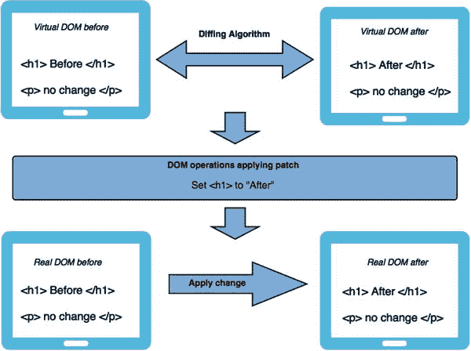

# 一、学习基础：React 的短暂停留之旅

“千里之行始于足下。”—老子

在开始 React Native 之旅之前，您必须对 React(也称为 ReactJS 或 React.js)有所了解。在本章中，您将快速了解 React 的核心概念，这将有助于您使用 React Native。React 不同于大多数流行的 web 技术，随着本章的深入，您将会了解其中的原因。如果你已经花了相当多的时间在传统框架上，它的核心概念将会真正打开你的思维方式；这种新的思维方式有时被称为 React 式思维方式。您可能听说过“一次编写，随处运行”这句话，但由于各种形式(web、移动设备、平板电脑)的激增，您认为这几乎是不可能的。React 有一个不同的指导原则:“学习一次，在任何地方写作。”哇，那看起来很不一样，很自由。因此，您将从快速浏览 React 开始第一章，这将帮助您为 React Native 做好准备。如果你对 React 有初步的了解，你可以跳过这一章，进入第二章。

React 是一个用于创建用户界面的 JavaScript 库。它是由脸书和 Instagram 团队共同努力打造的。React 于 2013 年首次向世界推出，并在社区范围内获得了广泛认可，并受益于作为脸书核心技术的优势。根据官方文档，有些人认为 React Native 是 MVC 中的 V，因为 React Native 对所使用的其他技术栈没有任何假设。你可以使用任何你想要的技术，你可以用 React Native 创建你的应用的一个单独的部分；您也可以方便地在已经创建的应用中进行更改。

## 为什么要 React？

但是在一个充满 js 库和框架的世界里，我们还需要另一个 JavaScript 库吗？几乎每个月都会引入新的 js 框架。

React 的出现是因为它的创造者面临着一个重大问题:如何构建数据频繁变化的大型应用。这个问题几乎出现在任何现实世界的应用中，React 就是为了解决这个问题而诞生的。众所周知，许多流行的框架都是 MVC 或 MV*框架，但这里有一点需要注意和重申:React 不是 MV*框架。这只是一个为数据随时间变化的 UI 组件构建可组合用户界面的库。与流行的 js 框架不同，React 不使用模板或 HTML 指令。React 通过将 UI 分成许多组件来构建用户界面。就这样，没别的了。这意味着 React 使用编程语言的全部功能来构建和呈现视图。

以下是为您的下一个项目选择 React 的一些优势:

*   React 广泛使用 JavaScript:传统上，HTML 中的视图与 JavaScript 中的功能是分开的。有了 React，组件就创建好了，而且有一个完整的部分，JavaScript 对 HTML 了如指掌。
*   可扩展和可维护:组件由一个统一的标记及其视图逻辑组成，这实际上使 UI 易于扩展和维护。
*   虚拟 DOM: React 应用正在飞速发展。这归功于虚拟 DOM 及其差分算法。
*   单向数据流:双向数据绑定是一个很好的想法，但是在现实世界的应用中，它产生的痛苦多于好处。双向数据绑定的一个常见缺点是，您不知道数据是如何更新的。有了单向数据流，事情就简单了:你知道数据在哪里发生了变化，这使得维护和测试你的应用变得更加容易。

为了对一项新技术有一个坚实的基础，有必要了解它的核心概念。在下一节中，您将探索 React 的一些独特概念，这将使您更进一步了解这项令人惊叹的技术。

## 虚拟 DOM

在所有 web 应用中，应用遭受的最昂贵的操作之一是改变 DOM。为了解决这个问题，React 维护了一个 DOM 的虚拟表示(如图 [1-1](#Fig1) 所示)，它被称为虚拟 DOM 或 VDOM。除了差分算法，React Native 还能够计算实际 DOM 的增量，并只更新 DOM 中发生变化的部分。因此，更改的数量较少，这导致应用非常快。在应用的开始阶段，你可能看不到它，但是随着你的项目膨胀到疯狂的复杂程度(这通常发生在现实世界的应用中)，你将开始看到用户快速体验的好处。

图 1-1。

Virtual DOM and diffing algorithm operations

手动 DOM 操作很麻烦，并且很难跟踪 DOM 以前的状态。如图 [1-1](#Fig1) 所示，React 通过保留一个虚拟 DOM 的两个副本来解决这个问题。接下来，对这两个虚拟 DOM 应用一个不同的算法，该算法主要检查发生的更改并返回 DOM 操作流。这些 DOM 操作然后被应用到实际的浏览器 DOM。

现在让我们从组件的角度来理解虚拟 DOM 是如何工作的。在 React 中，每个组件都有一个状态；这种状态是可以观察到的。每当状态发生变化时，React 基本上都知道这种变化需要重新渲染。所以当应用状态改变时，它会生成一个新的 VTreediff 算法再次共享了所需更改的 DOM 路径，如图 [1-2](#Fig2) 所示。这使得手动 DOM 操作最少。

图 1-2。

Components with virtual DOM

虚拟 DOM 的这个特性不仅重要，而且是 React 的杀手锏。DOM 访问速度非常慢，谦虚地说，在大多数应用中一次又一次地访问 DOM 使得情况变得更糟。为了让你的应用运行得更快，你应该尽可能少的接触 DOM，而虚拟 DOM 的实现很好的处理了这一点。对于一个小而琐碎的应用，您不会注意到这一点，但是一旦您的应用增长到有数千个 DOM 元素都试图更新，React 将不会让您的性能受到影响。

## 单向数据流

React 主要是 MVC 模式中的 V，但是在深入 React 中单向数据流的概念之前，您必须理解 MVC 框架的挑战。MVC 框架的最大挑战之一是管理视图。如您所知，MVC 框架的视图组件主要是 DOM 表示。当您编写与 DOM 交互的代码时，这很简单，但是对于框架来说，处理各种 DOM 操作是非常复杂的。

传统的 MVC 视图通常包含许多繁重的 UI，当数据发生变化时，即使是很小的元素，最终也会重新呈现应用，循环继续。这是因为通常大多数 MVC 框架都遵循双向数据绑定(见图 [1-3](#Fig3) )。

图 1-3。

Two-way data binding

在 JavaScript 中，数据在内存中更改，并且绑定到 UI 中的一个视图，这意味着当在内存中的 JavaScript 中修改数据时，UI 中的数据也会更改。反过来，当 UI(即 DOM)中的数据通过单击按钮或任何其他事件发生变化时，它也会在内存中得到更新，从而使二者保持同步。理论上，这是完美的，这个想法是浪漫的完美。然而，在现实世界的应用中，当您有一个相当复杂和大的应用，用多个视图表示您的一个模型中的数据时，问题就出现了。随着您添加更多的模型和更多的视图，这种双向数据绑定最终会像意大利面条一样，将数据的每次更改添加到锅里，有时甚至会导致无限事件循环，其中一个视图更新一个模型，而模型又更新一个视图，以此类推，如图 [1-4](#Fig4) 所示。

图 1-4。

Unwanted spaghetti relationship

这个系统的另一个问题是做出改变的代价非常高。当你向一个新开发人员介绍一个如此复杂的应用时，很难理解一个变化可能会在这种错综复杂的关系中造成的影响。

React 遵循单向数据流以保持简单，如图 [1-5](#Fig5) 所示。它基于关注点分离(SoC)的概念。这是计算机科学中的一个设计原则，其中一个应用或程序被分成不同的部分，每个部分解决一个单独的或特定的问题。这种设计原则的价值在于，它简化了开发，创建了可维护和可伸缩的应用。这导致了模块化的代码，其中一个单独的部分可以被独立地重用、开发和修改。这很有意义，确实是聪明思维的一个例子。

图 1-5。

React Native’s one-way data flow

## 安装和设置

为了理解实际的例子，您必须首先设置您的环境来运行您的 React 例子。开始使用 React 最简单的方法是使用 JSFiddle 示例。

*   React JSFiddle 与 JSX(你很快就会了解到 JSX):[`https://jsfiddle.net/reactjs/69z2wepo/`](https://jsfiddle.net/reactjs/69z2wepo/)
*   React JSFiddle: [`https://jsfiddle.net/reactjs/5vjqabv3/`](https://jsfiddle.net/reactjs/5vjqabv3/)

另一种方法是下载完整的初学者工具包甚至离线工作: [`http://facebook.github.io/react/downloads/react-0.13.3.zip`](http://facebook.github.io/react/downloads/react-0.13.3.zip)

您也可以使用 npm: `npm install -g react-tools`安装 react-tools。

使用 React Native 提高工作效率的另一个有用工具是 React Developer Tools，这是一个非常有用的 Chrome 扩展，允许您在 Chrome 浏览器中检查 React 组件层次结构:

[T2`https://chrome.google.com/webstore/detail/react-developer-tools/fmkadmapgofadopljbjfkapdkoienihi`](https://chrome.google.com/webstore/detail/react-developer-tools/fmkadmapgofadopljbjfkapdkoienihi)

为了方便起见，您将在本章的示例中使用以下设置:React Native 和 JSX transformer 的脸书 cdn。

react . js:[T0](http://fb.me/react-0.13.3.js)

JSX 变压器: [`http://fb.me/JSXTransformer-0.13.3.js`](http://fb.me/JSXTransformer-0.13.3.js)

只需在代码中引用它们。接下来，您将安装节点包 browserify、watchify 和 babelify，这将帮助您转换 JSX 并将其保存在适当的 js 文件中:

`s$ npm install react browserify watchify babelify --save-dev`

`$ watchify –t babelify ./your-jsx-file.jsx –o ./final-js-file.js –v`

太好了！要为应用提供服务，您将通过以下命令在项目文件夹的根目录中使用简单的 python 服务器(SimpleHTTPServer ):

`$ python -m SimpleHTTPServer`

默认情况下，简单 python 服务器将在 8000 端口上为您的示例提供服务。

现在您已经完成了设置，您可以很快开始理解 React 的概念。

## 组件介绍

React 是关于组件的。您在 React 中做的任何事情都是基于可重用组件的。换句话说，使用 React 你只做一件事，那就是构建组件。在前面的章节中，我们讨论了关注点的分离。这些组件的整个概念是它们被完全封装，使它们易于测试和重用。

创建可重用组件是一项艺术工作，React Native 为您提供了许多特性。您将很快深入研究它们，但是首先让我们创建一个简单的“Hello World”组件。

创建一个`hello_world.html`文件，并将以下代码粘贴到其中:

`<!DOCTYPE html>`

`<html>`

`<head>`

``

`</body>`

`</html>`

这很简单。您的代码驻留在 HTML 标记中。JavaScript 驻留在脚本标签中。我们确实在类型'`text/jsx`'中看到了一些不同的东西；这就是 JSX，我们将在接下来的章节中详细解释。我们还看到一个关键字“React ”,这是 React 库的入口点。其中有包含所需文本的 H1 标签，以及文本出现的目标(在本例中为`document.getElementById(intro)`)。此外，这个 React 代码可以存在于一个单独的文件中，并且可以在 HTML 中被引用。让我们创建一个名为`src/helloworld.js.`的单独文件

`React.render(`

`<h1>Hello, world </h1>,`

`document.getElementById(“intro”)`

`);`

现在让我们在您的`hello_world.html file:`中引用它

``

这很简单。但是什么是 JSX 呢？在我们全面了解组件的不同方面之前，让我们先来看看 JSX。

## 小艾

React 不要求您使用 JSX。然而，JSX 确实让生活变得更简单。其类似 XML 的语法有助于非常容易地定义带有属性的树结构。XML 有很多好处，比如平衡开放标签和封闭标签。这使得大树比函数调用或对象文字更容易阅读。

让我们看一个简单的例子，先不看 JSX，看看随着我们逐渐包括 JSX，事情是如何变得简单的。

`<!DOCTYPE HTML>`

`<html lang='en'>`

`<head>`

`<meta charset="UTF-8">`

`<title>Example without JSX</title>`

``

`</body>`

`</html>`

在本例中，您使用了`React.createElement`。您首先传递一个表示 HTML 标记的字符串，第二个是您的属性，第三个是子元素，在本例中是内部 HTML。

接下来，您希望在`React.render`中呈现您的组件，因此您传递应用组件，并将其作为`document.body`加载到目标位置。输出类似于图 [1-6](#Fig6) 。

图 1-6。

Output in React.render

接下来，我们再来看一个方法，这个方法已经被弃用，不再使用了。(React 生态系统发展如此之快，以至于有些东西已经被弃用了；然而，回顾一下过去，就会发现在如此短的时间内，他们在使事情变得更容易方面取得了多大的进展。)

`<!DOCTYPE HTML>`

`<html lang='en'>`

`<head>`

`<meta charset="UTF-8">`

`<title>Old world example</title>`

``

`</body>`

`</html>`

这个例子使用了`React.DOM`模式，其中指定了要使用的标签(在这个例子中是 h1)；第一个参数是属性，第二个是字符串，用作内部 HTML。当使用`React.render`呈现时，您将组件函数和目标传递到它要被加载的地方(在本例中是文档体)。如果你有 React 的最新版本，你会在你的控制台得到如图 [1-7](#Fig7) 所示的警告和错误。

图 1-7。

DevTools will show this warning

访问 [`http://fb.me/react-legacyfactory`](http://fb.me/react-legacyfactory) 找到除了 JSX 调用工厂之外的另一种方法，在调用组件之前包装组件。这也提醒你是时候使用 JSX 了。

现在让我们看看使用 JSX 时，同一个示例是什么样子的(另见图 [1-8](#Fig8) ):

图 1-8。

Output using JSX

`<!DOCTYPE HTML>`

`<html lang='en'>`

`<head>`

`<meta charset="UTF-8">`

`<title>JSX me like !</title>`

``

`</body>`

`</html>`

在这里，我们已经包括 JSX 变压器，浏览器内的变压器。你的组件应用有 h1 标签。接下来，您使用`React.render`呈现它，以 JSX 语法传递您的组件，并将第二个参数作为目标，即`document.body`。就这样。

现在将您的 JSX 代码分离到一个单独的`JSX`文件中，并将其转换成纯 JavaScript，看看会发生什么。为此，让我们创建一个名为`src`的文件夹，并将您的 JSX 代码放入`hello.jsx`文件中:

`var Appo = React.createClass({`

`render:function(){`

`return React.DOM.h1(null, "Hello Past")`

`}`

`});`

`React.render(Appo(), document.body);`

接下来，让我们添加一个`dist`文件夹，您可以在其中保存转换后的 js 文件示例`bundle.js`。之后，在 HTML 文件中引用您的`bundle.js`文件(在本例中是`jsx_example.html`)。

如前所述，您应该安装节点包 browserify、babelify 和 watchify，以便使用它们将您的 JSX 转换成 js。这可以使用以下命令来完成:

`$ npm install react browserify watchify babelify --save-dev`

现在，用下面的命令将您的`hello.jsx`转换成`bundle.js`:

`$ watchify –t babelify ./src/hello.jsx –o ./dist/bundle.js –v`

结果是下面的`bundle.js`文件:

`var Appo = React.createClass({`

`displayName: "Appo",`

`render: function render() {`

`return React.DOM.h1(null, "Hello Past");`

`}`

`});`

`React.render(Appo(), document.body);`

尽管 React 并不明确要求 JSX，但它是首选。它允许您使用 HTML 语法创建 JavaScript 对象。组件有两个用途:模板和显示逻辑。因此，标记和代码紧密地联系在一起。显示逻辑通常非常复杂，使用模板语言来表达它确实变得很困难。解决这个问题的最好方法是从 JavaScript 本身生成 HTML 和组件。JSX 通过创建 React 树节点，用其 HTML 类型的语法解决了这些问题。

为了更好的可维护性，您可以保持 JSX 源代码的完整性；把它放在 JSX 档案的独立文件夹里。要将 JSX 代码转换成普通的 JavaScript，可以手动或通过构建脚本使用 JSX 编译器( [`http://facebook.github.io/react/jsx-compiler.html`](http://facebook.github.io/react/jsx-compiler.html) )。在您的生产环境中提供 JSX 文件是可能的，但是 React 将向您提供有关性能降低的控制台通知。

## 深入了解组件

在下一节中，您将探索组件的重要概念，这将帮助您轻松地使用它们。

### 性能

React 有些类似于 HTML 中的属性:properties。您可以使用它们来初始化您的组件，就像这样:

`React.render(<App myProp="Hi from prop" />, document.getElementById('container'))`

这里你用一个名为`myProp`的属性初始化 App 组件，这个属性的目标是`'container'`的 id。您可以通过以下方式在 JSX 通过插值访问此属性。让我们创建一个组件应用:

`var App = React.createClass({`

`render: function(){`

`var txt = this.props.txt`

`return (`

`
`

`<h1> {myProp} </h1>`

`
`

`);`

`}`

`});`

`React.render(<App myProp="Hi from prop" />, document.getElementById('container'))`

如果刷新浏览器，您将看到来自内部 HTML 的属性的消息。请为您的 HTML 文件使用以下代码(结果如图 [1-9](#Fig9) 所示):

图 1-9。

Refreshing your browser produces this message

`<!DOCTYPE html>`

`<html>`

`<head>`

`</head>`

`<body>`

`

`

`</body>`

``

`</html>`

随着应用的增长，您首先需要确保组件是正确创建的。对于属性，您可以用一系列验证器来指定一种属性。这确保并验证了接收到的数据类型。让我们用一个例子来看看其中的一些:

`var App = React.createClass({`

`propTypes: {`

`message: React.PropTypes.string,`

`age: React.PropTypes.number`

`},`

`render: function(){`

`// keeping props in a variable to use to often`

`var message = this.props.message,`

`age = this.props.age`

`return (`

`
`

`<h1> {message} </h1>`

`
 My age is {age}
`

`
`

`);`

`}`

`});`

`React.render(<App age={5} message="Hi from prop" />, document.getElementById('container'))`

这里，`propType`关键字表示属性名及其类型的散列。在您的示例中有两个 prop type:`string`和`number`，分别对应于`message`和`age`属性。

还有许多其他的财产类型。请注意，您可以将`isRequired`添加到任何 propType 的末尾，使其成为必需的:

`propTypes: {`

`//some specific JS primitive`

`arrayType: React.PropTypes.array,`

`boolType: React.PropTypes.bool,`

`funcType: React.PropTypes.func,`

`objectType: React.PropTypes.object,`

`//if a value of a prop is necessary`

`numberType: React.PropTypes.number.isRequired`

`}`

通过关键字`getDefaultProps`在属性中也有一个默认类型。例如，在同一个组件中，您可以为您的`message`和`age`属性指定默认类型:

`getDefaultProps: function(){`

`return {`

`message: 'Default value of message',`

`age: 0`

`}`

`},`

## 状态

在上一节中，您了解了属性，这些属性是传递到组件中的静态值。另一方面，状态由组件维护和更新。让我们用一个例子来理解这个概念:

`var App = React.createClass({`

`getInitialState: function(){`

`return {`

`message: 'this is a default message from state',`

`}`

`},`

`render: function(){`

`return (`

`
`

`<h1> {this.state.message} </h1>`

`
`

`);`

`}`

`});`

`React.render(<App />, document.getElementById('container'))`

如果您运行这个代码片段，您将在浏览器中看到如图 [1-10](#Fig10) 所示的结果。

图 1-10。

Resulting message using state

让我们看看代码。在同一个组件中，您使用关键字`getInitialState`初始化状态，在这个关键字中，您设置了消息的初始状态:

`getInitialState: function(){`

`return {`

`message: 'this is a default message from state',`

`}`

`},`

接下来，与上一个例子不同，您使用`this.state.message`来访问这个状态，它打印消息状态的初始文本:

`
`

`<h1> {this.state.message} </h1>`

`
`

现在让我们为您的组件添加一些功能。您在消息语句上方添加一个文本框。当您在文本框中键入内容时，消息会使用状态的概念实时更新:

`var App = React.createClass({`

`getInitialState: function(){`

`return {`

`message: 'this is a default message from state',`

`}`

`},`

`updateState: function(e){`

`this.setState({message: e.target.value})`

`},`

`render: function(){`

`return (`

`
`

`<input type="text" onChange={this.updateState} />`

`<h1> {this.state.message} </h1>`

`
`

`);`

`}`

`});`

`React.render(<App />, document.getElementById('container'))`

如果您在浏览器中执行这段代码，您将会看到如图 [1-11](#Fig11) 所示的结果。

图 1-11。

Adding a text box above your message statement

让我们看看您向组件中添加了什么。首先，您引入了一个名为`updateState`的函数:

`updateState: function(e){`

`this.setState({message: e.target.value})`

`}`

这个新函数`updateState`接受一个名为`(e)`的事件，并更新消息状态的值。此外，您还添加了一个输入字段:

`
`

`<input type="text" onChange={this.updateState} />`

`<h1> {this.state.message} </h1>`

`
`

输入框有一个`onChange`事件，每当状态更新时，它调用您的定制方法`updateState`。当您在文本框中键入内容时，打印的信息会立即更新。

## 摘要

本章提供了 React 的快速浏览。在你开始下一章之前，让我们回顾一下到目前为止你所学的内容。向您介绍了 React 库及其发明背后的原因。然后，您学习了如何安装和设置 React。您学习了这项技术的基础，例如虚拟 DOM、单向数据流和 JSX。您还了解了组件，以及在组件中使用状态和属性。

现在，您已经准备好在 React 生态系统中编码和工作，您旅程的有趣路径将在下一章开始。您将开始使用 React Native。