# 二、最简单的程序：React Native 的 Hello World

“大事始于小事。”—普罗米修斯

在上一章中，您对 React 生态系统有了一个很好的概述。现在是时候用 React Native 弄脏你的手了。在本章中，您将通过安装先决条件来设置您的环境，然后您将创建您的第一个 React 本机应用。

最好的学习方法是通过实例。贯穿整本书的主题是，你将通过编程来跟随例子学习 React Native 以理解概念。

在本章中，您将探索以下主题:

*   React Native 简介
*   React Native 的要点
*   React Native 的安装
*   你的第一份申请
*   React 本机应用的剖析
*   如何调试您的应用

Note

您可能会面临不同项目在不同节点版本上工作的情况。因此，建议您安装 NVM(节点版本管理器)来帮助保持可以在项目之间切换的多个节点版本。

## 什么是 React Native？

React Native 是一个开发原生移动应用的开源平台；它主要是由脸书的一个团队开发的。使用 React Native 很酷的一点是，您的程序使用标准的 web 技术，如 JavaScript (JSX)、CSS 和 HTML，而您的应用是完全原生的。换句话说，您的应用非常快速和流畅，它等同于任何使用传统 iOS 技术(如 Objective-C 和 Swift)构建的原生应用。然而，React Native 在性能和整体体验方面并没有妥协，就像流行的使用 web 技术构建 iOS 应用的混合框架一样。

React Native 旨在将 React 的强大功能引入移动开发，这一点在第 1 章的[中有所解释。用 React 团队的话说，“学习一次，在任何地方写。”使用 React 和 React Native，您将看到许多使用 React 为 Web 构建的组件可以很容易地移植到 React Native iOS 应用，只需很少或不需要修改。React Native 引入了一种高度功能化的方法来构造用户界面，这与传统的 iOS 开发方法有很大不同。](1.html)

尽管 React Native 是由脸书开发者开发的，但它是一个开源项目。该代码可在 [`https://github.com/facebook/reactreact-native`](https://github.com/facebook/reactreact-native) 获得。

## React 本地先决条件

在开始安装之前，让我们先回顾一下 React Native 的先决条件:

*   iOS 应用只能在安装了 OSX 的苹果 Mac 电脑上开发。您需要 OSX 版本 10.10 或以上。
*   您需要 Xcode 6 或更高版本，其中包括 iOS SDK 和模拟器。React Native 仅支持 iOS7 或以上版本。Xcode 可以从苹果 App Store 下载。
*   如果你注册了苹果 iOS 开发者计划，这是很有帮助的。如果您不在 iOS 开发者计划中，您将无法
    *   在实际设备上测试应用。
    *   访问测试版操作系统。
    *   beta 测试的试飞。
    *   将您的应用提交到 App Store。

## 装置

让我们对 React Native 做一个快速的一次性设置。React Native 是 JavaScript 和 Objective-C 代码的混合体，因此您需要一些工具来创建、运行和调试用 JavaScript 编写的本机应用。我们一个一个来。

### 安装节点和 npm

Node.js 是建立在 Chrome 的 JavaScript 运行时之上的开源平台；它提供了一种轻松构建快速、可伸缩程序的方法。Node.js 允许您在终端中运行 JavaScript，并帮助创建模块。通过在终端中运行以下命令来安装 node . js:`$brew install node`。

自制是安装 Node 的推荐方式。也可以从 [`https://nodejs.org`](https://nodejs.org/) 下载安装程序，手动安装。

npm 是 Node.js 的包管理器，如果你来自 iOS 世界，它类似于 CocoaPods。

通过在终端中运行以下命令来检查节点安装:

`>> node –v`

`v4.2.1`

`>> npm –v`

`2.13.1`

### 安装 Watchman

当您的文件和记录发生变化时，Watchman 会观察它们。当匹配文件更改时，它还可以触发操作(如重建资源)。更多详情，请访问 [`https://facebook.github.io/watchman/`](https://facebook.github.io/watchman/) 。

您可以通过运行以下命令来安装 Watchman:

`$brew install watchman`

### 安装 React 本地包

React Native 是一个 npm 包，所以使用下面的代码来安装`React Native-` `cli`模块:

`npm install -g react-native-cli`

### 更新 React 本机

React Native 和 iOS 都是快速移动的框架。建议每次有新版本时更新它们。升级 React Native 很简单。在终端中运行以下命令:

`npm update -g react-native-cli`

## 你的第一个应用

既然您已经对 React Native 有了足够的了解，并且已经设置好了系统，那么是时候创建您的第一个应用了。为了让事情变得简单，开始的时候跟着做就行了。有时，单调地输入代码可能会让你感到与现实脱节，但现在跟着感觉走就足够了。记住模仿是一种强有力的学习形式；这是我们学习大部分技能的方式，比如说说话、阅读、写作，也是你学习 React Native 编程的方式。随着您的继续，这种方法将帮助您深入理解为什么您创作了某些代码。

在整本书中，你将创建一个应用，并把它从 Hello World 变成一个成熟的、发行级的应用，除了在某些地方我们需要脱离主题去独立探索一个概念。所以在你设置之前，先说一下你打算解决的问题。你将在本书过程中创建的应用计划解决一些住房问题；这将是任何流行的房地产搜索应用的一个非常原始的版本。

我们称之为合租吧。它将有一些基本的功能，如列表，创建一个条目，地理定位一个属性，等等。随着操作的进行，您将会看到各种 React 本机特性如何适合您的应用。

那是相当多的，但是在这一章中，你将仅仅使用 React Native 和一些 Hello World 代码为你的项目创建基本的结构。

### 创建一个基本的骨架

启动终端并键入以下命令:

`react-native init HouseShare`

这段代码使用 CLI 工具构建一个 React 本机项目，该项目可以按原样构建和运行。该命令为 React 本地 iOS 项目创建基本的文件夹结构。接下来，让我们进入这个目录:

`> cd HouseShare/ios/`

现在，点击`HouseShare.xcodeproj`。这是一个 Xcode 项目文件，将在 Xcode 中打开您的项目。接下来，让我们在 iOS 模拟器中加载您的应用。要构建您的应用并将其加载到模拟器中，只需单击顶部的运行按钮(图 [2-1](#Fig1) )或执行 Command + R。这将在 iOS 模拟器中编译、构建并启动您的项目(图 [2-2](#Fig2) )。

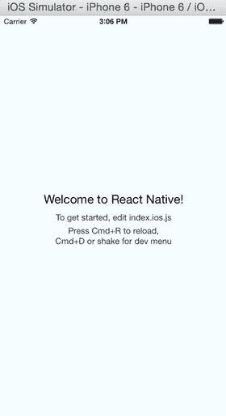

图 2-2。

Using the iOS simulator

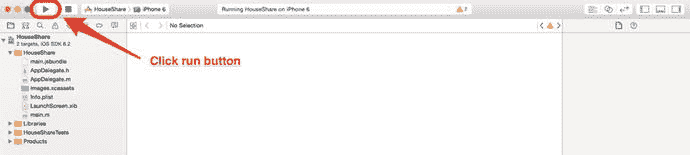

图 2-1。

Building by clicking the Run button

真的很快。由于一个简单的命令，您的项目的基本结构已经就绪，您的应用已经加载到模拟器中。另请注意，当您从 Xcode 运行应用时,“终端”会自动打开。这是 React Native 的节点包管理器。如果您取消此操作，应用将停止工作。

终端打开，启动 React 原生打包器和一个服务器处理上述请求(图 [2-3](#Fig3) )。React 本机打包程序负责读取和构建 JSX(您将在后面看到)和 JavaScript 代码。

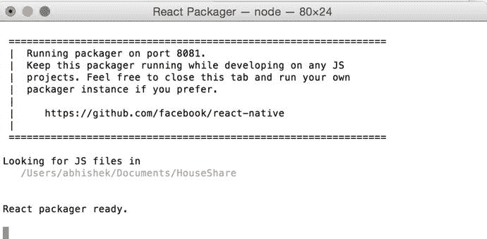

图 2-3。

The packager is ready

`http://localhost:8081/index.ios.bundle`

Note

如果终端没有启动，iPhone 显示红屏，运行`npm start`并保持终端打开。

在您喜欢的任何编辑器中设置您的项目。React Native 并不强迫您，也没有偏好任何特定的编辑器，所以您可以继续默认使用 Xcode。但是，我们建议您在编辑器中打开您的项目，就像我们个人最喜欢的 Sublime Text 一样。

在`index.io.js`做一些改动。事实上，删除文件中的所有代码。现在，添加以下代码:

`'use strict';`

`var React = require('react-native');`

`var {`

`AppRegistry,`

`StyleSheet,`

`Text,`

`View,`

`} = React;`

`var HelloWorld = React.createClass({`

`render: function() {`

`return (`

`<View style={styles.container}>`

`<Text style={styles.welcome}>`

`HelloWorld !!`

`</Text>`

`</View>`

`);`

`}`

`});`

`var styles = StyleSheet.create({`

`container: {`

`flex: 1,`

`justifyContent: 'center',`

`alignItems: 'center'`

`},`

`welcome: {`

`fontSize: 25,`

`textAlign: 'center'`

`}`

`});`

`AppRegistry.registerComponent('HouseShare', () => HelloWorld);`

在 iOS 模拟器中按 Command + R，将刷新屏幕，如图 [2-4](#Fig4) 所示。(注意，在本书中，我们将使用 Command 键代替 CMD 键，这是等效的。)

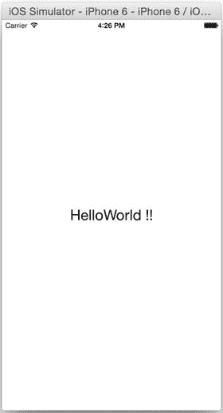

图 2-4。

The screen is refreshed

真快！在几分之一秒的时间里，你可以看到你应用的变化。您不需要编译代码并重启模拟器来对本机更改做出 React。如果你以前做过任何原生 iOS 应用开发，点击刷新来查看变化可能会像一个奇迹。

现在，让我们来理解代码。该文件的顶部是下面一行:

`'use strict';`

这启用了严格模式，这为 React 本机 JavaScript 代码添加了改进的错误处理。ECMAScript 规范的第五版引入了严格模式。严格模式更容易编写安全的 JavaScript，并将糟糕的语法转换成真正的错误。这对于调试任何示例和使用未声明的变量都非常重要。

接下来是下面一行:

`var React = require('react-native');`

这将加载 React 本机模块，并将其分配给可在您的代码中使用的 React 本机变量。React Native 使用与 Node.js 相同的模块加载技术，带有`require`函数；这大致相当于在 Swift 中链接和导入库。

之后，添加以下代码片段:

`var {`

`AppRegistry,`

`StyleSheet,`

`Text,`

`View,`

`} = React;`

您正在将多个对象属性分配给一个变量；这被称为赋值过程中的析构。这个很酷的特性是在 JavaScript ECMAScript 6 中提出的。虽然它是可选的，但它非常有益；否则，每次在代码中使用组件时，都必须使用完全限定名，例如 React。模仿，React。样式表等等。这节省了不少时间。

接下来，您将创建一个视图:

`var HelloWorld = React.createClass({`

`render: function() {`

`return (`

`<View style={styles.container}>`

`<Text style={styles.welcome}>`

`HelloWorld !!`

`</Text>`

`</View>`

`);`

`}`

`});`

React Native 的基本构建块称为组件。您可以使用`createClass`方法来创建定制的组件类。这个类只有一个函数，`render()`。`render`功能负责屏幕上显示的内容。您使用 JavaScript 语法扩展(JSX)来呈现 UI。JSX 是一种 JavaScript 语法扩展，看起来类似于 XML。

现在，您可以定义应用的样式。这里你会用到 Flexbox 它类似于 CSS 之于 HTML。现在，您可以键入以下代码。我们将在下一章解释样式。

`var styles = StyleSheet.create({`

`container: {`

`flex: 1,`

`justifyContent: 'center',`

`alignItems: 'center'`

`},`

`welcome: {`

`fontSize: 25,`

`textAlign: 'center'`

`}`

`});`

你可以看到这种风格与 CSS 非常相似；您可以定义字体大小、对齐方式等。

最后一步是定义应用的入口点和根组件:

`AppRegistry.registerComponent('HouseShare', () => HelloWorld);`

### 这不是 UIWebView

您正在使用 web 技术，但您的应用没有 web 组件；它有一个本地组件。打开调试➤视图调试➤捕获视图层级(见图 [2-5](#Fig5) )。

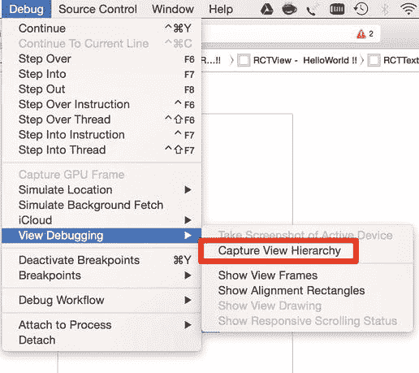

图 2-5。

Using the native component

当您遍历 UIWindow 的树时，您会看到代码中没有 UIWebView，以及“Hello World！!"是 RCTText 的调用，如图 [2-6](#Fig6) 。

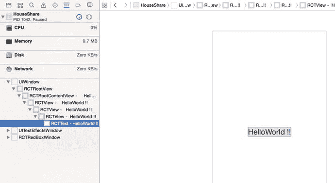

图 2-6。

“Hello World !!” is the call of RCTText

### 启用实时重新加载

React Native 的另一个很酷的功能是 live reload。一旦有变化，它会在 iOS 模拟器中重新加载您的应用视图。要激活此选项，您需要通过按 Ctrl + Command + Z 从 iOS 模拟器中打开的应用访问开发者菜单，并选择启用实时重新加载选项。现在，对 JavaScript 代码所做的任何更改都会导致应用自动重新加载。

## React Native 为什么不一样？

在深入 React 本地世界之前，您必须理解为什么需要另一个框架来构建移动应用。我们已经生活在一个充满能够构建移动应用的框架和工具链的世界里。在 React Native 出现之前，使用 web 技术构建移动应用可以通过两种策略实现:

*   基于 WebView:这些框架使用常见的 web 技术，如 HTML 和 JavaScript，并使用 WebView 加载应用。一个例子是流行的框架 Phonegap。
*   使用 web 技术的本地应用:这些框架再次使用常见的 web 技术，如 HTML 和 JavaScript(准确地说，它们模仿使用 JavaScript 和 HTML)来创建本地应用。一个例子是流行的框架 Titanium Appcelerator。

使用这些策略创建的应用存在性能问题。基于 WebView 的应用很慢，因为它们使用 DOM，并且 DOM 操作非常昂贵，这导致了性能问题。正如 Flipboard ( [`http://engineering.flipboard.com/2015/02/mobile-web/`](http://engineering.flipboard.com/2015/02/mobile-web/) `)`)的一篇博文中所说，“你不能用 DOM 构建 60fps 的滚动列表视图。”这是通过这种技术开发的应用的一个基本问题:尽管开发时间可能很快，但您最终会体验迟缓。

另一种策略是框架模仿 JavaScript 和 HTML，并将它们转换成本地代码，这种策略有其他挑战。尽管最终的应用本质上是原生的，但在从 JavaScript 到原生的转换过程中有一个基本问题:它运行在主线程上。在这些应用中，你总是直接与本地对象交互，这又一次导致了缓慢而呆滞的体验。

React Native 从根本上不同于这两种方法。它在单独的线程上运行所有布局，你的主线程自由更新 UI，使得动画和 UI 渲染流畅，就像 100%纯原生 app 一样。

React Native 使用 JavaScriptCore 框架运行 JavaScript。在 iOS 7 中，苹果为 JavaScriptCore 引入了原生的 Objective-C API。这个框架允许 JavaScript 和 Objective-C 相互交流。这意味着您可以从 Objective-C 创建并调用 JavaScript 函数，或者从 JavaScript 回调 Objective-C。这一切都像魔咒一样管用。

React Native 还有一个不同之处。正如您在 Hello World 示例中看到的，您用 JavaScript 编写一个组件，就像您用 React 一样，只是您没有使用 HTML `div`，而是使用了像 View 和 Text 这样的标签。在 iOS 应用的情况下，视图基本上是 UIView。

## React 本机应用的剖析

现在让我们理解 React Native `init`命令生成的应用结构。如果您打开名为 HouseShare 的项目，它看起来就像一个普通的 Xcode 项目。它具有以下文件夹结构:

`|ios`

`|- HouseShare`

`|- HouseShare.xcodeproj`

`|- HouseShareTests`

`|android`

`node_modules`

`index.ios.js`

`index.android.js`

`package.json`

Note

随着框架的发展，这里定义的文件夹结构可能会改变或修改，但是大部分功能保持不变。

如果您在 Xcode 中打开项目，它将具有不同的文件夹结构。Xcode 中的“文件夹”实际上是群组，不一定链接到 Finder 中的文件夹。

*   `iOS`:`iOS`文件夹有两个文件夹和一个文件。如上图所示，有一个`HouseShare`文件夹，里面有所有的 Objective-C 代码，比如`AppDelegate`、`Images.xcassets`、`Info.plistLaunchScreen.xib`等文件。另一个文件夹是`HouseShareTests`，这是你所有测试用例所在的地方。最后是您的 Xcode 项目文件`HouseShare.xcodeproj`，它用于加载到 Xcode 中以构建您的应用。
*   `package.json`:此文件夹包含关于您的应用的元数据，当您运行 npm 安装时，它将安装所有依赖项。如果你熟悉 Ruby，它类似于一个 Gemfile。
*   `node_modules`:所有`package.json`中提到的节点模块都将被下载到这个文件夹中。该文件夹还包含 React 本机框架的代码。
*   这是您开始编写 iOS 应用的文件。
*   `AppDelegate.m`:这是任何 iOS app 的起点。
*   `Android` : React Native 也支持 Android 的开发。你所有的原生 Android 代码都在这个文件夹里。
*   这个文件是你开始为 Android 应用编程的地方。

让我们从`HouseShare/ios/HouseShare/AppDelegate.m`打开`AppDelegate.m`文件:

`#import "AppDelegate.h"`

`#import "RCTRootView.h"`

`@implementation AppDelegate`

`- (BOOL)application:(UIApplication *)application didFinishLaunchingWithOptions:(NSDictionary *)launchOptions`

`{`

`NSURL *jsCodeLocation;`

`/**`

`* Loading JavaScript code - uncomment the one you want.`

`*`

`* OPTION 1`

`* Load from development server. Start the server from the repository root:`

`*`

`* $ npm start`

`*`

`* To run on a device, change `localhost` to the IP address of your computer`

`* (you can get this by typing `ifconfig` into Terminal and selecting the`

`* `inet` value under `en0:`) and make sure your computer and iOS device are`

`* on the same Wi-Fi network.`

`*/`

`jsCodeLocation = [NSURL URLWithString:@"``http://localhost:8081/index.ios.bundle`T2】

`/**`

`* OPTION 2`

`* Load from pre-bundled file on disk. To re-generate the static bundle`

`* from the root of your project directory, run`

`*`

`* $ react-native bundle --minify`

`*`

`* see`[`http://facebook.github.io/react-native/docs/runningondevice.html`T3】](http://facebook.github.io/react-native/docs/runningondevice.html)

`*/`

`//   jsCodeLocation = [[NSBundle mainBundle] URLForResource:@"main" withExtension:@"jsbundle"];`

`RCTRootView *rootView = [[RCTRootView alloc] initWithBundleURL:jsCodeLocation`

`moduleName:@"HouseShare"`

`launchOptions:launchOptions];`

`self.window = [[UIWindow alloc] initWithFrame:[UIScreen mainScreen].bounds];`

`UIViewController *rootViewController = [[UIViewController alloc] init];`

`rootViewController.view = rootView;`

`self.window.rootViewController = rootViewController;`

`[self.window makeKeyAndVisible];`

`return YES;`

`}`

`@end`

`RCTRootView`是 React Native 提供的 Objective-C 类，继承自 iOS `UIView`类。它获取并执行您的 JavaScript 代码。

它还加载了`http://localhost:8081/index.ios.bundle` URL，其中有您用`index.ios.js`编写的代码，还有一个由 React 本机框架添加的程序。

## 排除故障

用 React Native 调试符合我们调试 web 应用的方式；总之，真的很简单。要访问调试选项，请在 iOS 模拟器中加载的应用内按 Command + D。这将打开一个提供几个调试选项的菜单，如图 [2-7](#Fig7) 所示。

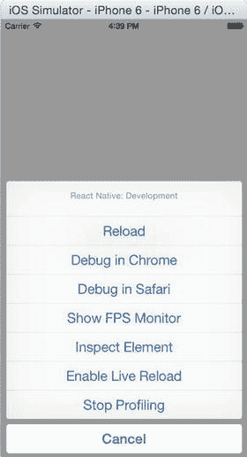

图 2-7。

Debugging options

您必须为最终版本禁用此菜单，因为您的最终用户不应看到这些选项。要禁用它，请在 Xcode 中打开项目，然后选择:产品➤方案➤编辑方案(或按 Command +)

让我们回顾一下图 [2-7](#Fig7) 中显示的每个选项。

### 重新加载

reload 选项使用最新的 React 本机代码刷新模拟器中的屏幕，而无需再次编译项目。这可以通过两种方式实现:一、点击菜单中的重新加载选项，如图 [2-7](#Fig7) 所示，或者按 Command + R，这样会重新加载 JavaScript 代码中所做的所有更改。

在 Swift 或 Objective-C 文件中所做的任何更改都不会反映出来，因为这些更改需要重新编译。此外，如果您添加任何资产，如图像，应用需要重新启动。

### 在 Chrome 中调试

这是调试用 React Native 编写的 JavaScript 代码的最好和最常用的选项之一。与 web 应用一样，你可以在 Chrome 中调试 React 原生应用。当你点击“在 Chrome 中调试”时，它会在 Chrome 中打开`http://localhost:8081/debugger-ui`(图 [2-8](#Fig8) )。

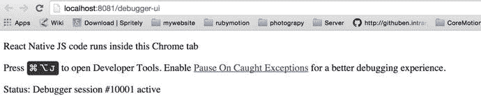

图 2-8。

Debugging in Chrome

安装 React 开发工具，这是一个 Chrome 扩展，用于调试 React 应用和 React 本机代码。它允许您在 Chrome 开发者工具中检查 React 本地组件层次结构。要安装它，请访问 Chrome 网上商店或访问以下网址: [`https://chrome.google.com/webstore/detail/react-developer-tools/fmkadmapgofadopljbjfkapdkoienihi?hl=en`](https://chrome.google.com/webstore/detail/react-developer-tools/fmkadmapgofadopljbjfkapdkoienihi?hl=en) 。

一旦安装了扩展，按 Command + Option + J 或者从 Chrome 浏览器中选择查看➤开发者➤开发者工具来访问开发者工具控制台。

你将会在你的 Chrome 开发工具中获得一个名为 React 的新标签。这向您显示了已经呈现在页面上的根 React 组件，以及它们最终呈现的子组件。还可以看到属性、状态、组件、事件监听器，如图 [2-9](#Fig9) 所示。

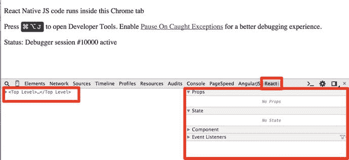

图 2-9。

Debugging in Chrome DevTools

查看图 2-10 ，你可以看到一个类似于 Xcode 的层次结构:Hello World 被包装在 RCTText 中，然后又被包装在 RCTview 中。

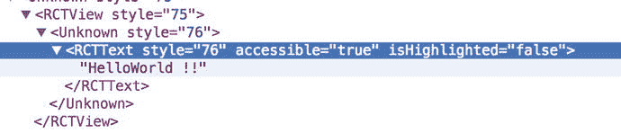

图 2-10。

Debugging the app with the React tab in Chrome DevTools

### 在 Safari 中调试

如果你没有 Chrome，你也可以使用 Safari 进行调试，但 Chrome 是调试 React 原生应用的首选。

### 显示 FPS 监视器

许多应用使用大量的动画和图形。FPS(每秒帧数)为您的应用定义这些动画的平滑度；这在游戏应用中被广泛使用。当您在菜单中选择“显示 FPS 监视器”时，它会在模拟器中显示您的应用的一些属性(图 [2-11](#Fig11) )。虽然你可能在你的 Hello World 应用中找不到这些属性的太多用途，但它们对于动画密集型应用来说非常有用，可以防止它们进入昏睡模式，从而创建不稳定的用户体验。见图 [2-11](#Fig11) 。

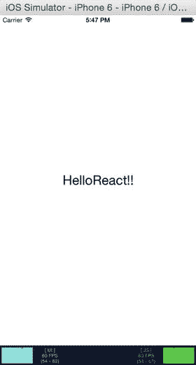

图 2-11。

Additional properties in the simulator

### 该检查元件

您还可以从模拟器中检查 React 本地元素，有点类似于您在浏览器中检查元素的方式，尽管您目前不能像在浏览器中那样更改属性的实时值。现在，您可以看到任何对象的样式表属性。点击 HelloReact！！文本(图 [2-12](#Fig12) )，它将打开该元素的详细信息。

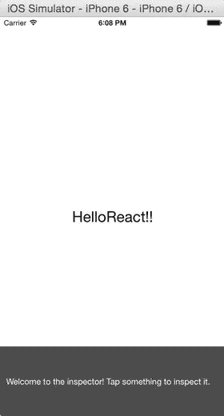

图 2-12。

Click the text to see element details

该元素的详细信息显示在左下方的图 [2-13](#Fig13) 中。

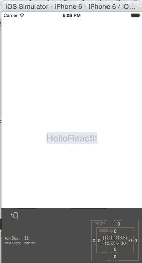

图 2-13。

Font details

你可以看到 Hello World 的字体大小是 25，并且居中对齐。

### 开始分析

剖析用于衡量绩效。概要分析会话提供了对代码的哪些部分最常用、需要多少时间以及应该改进代码的哪些部分的深入了解。您还可以从分析器在一个方法上停止的次数中找到每个方法花费的时间。

下面的 URL 链接到一篇非常好的博客文章，这篇文章将很好地概述如何使用 Xcode 进行分析: [`www.raywenderlich.com/23037/how-to-use-instruments-in-xcode`](http://www.raywenderlich.com/23037/how-to-use-instruments-in-xcode) `.`

## 摘要

在这一章中，你被介绍到 React 原生。您设置了 React 本机开发环境，并编写了第一个应用。您还了解了 React 本机应用的文件夹结构以及如何调试。现在，您已经做好了准备，可以开始使用 React Native 为您的 iOS 应用创建用户界面了。

在下一章中，您将学习如何通过掌握 Flexbox 来创建令人惊叹的用户界面。您将看到如何从一个组件导航到另一个组件，如何将图像添加到未封装的应用中，以及如何使用 React Native 创建 ListView 和 ScrollView。