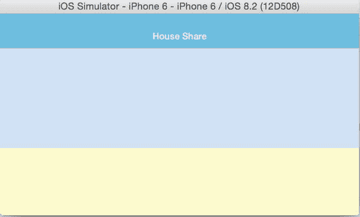
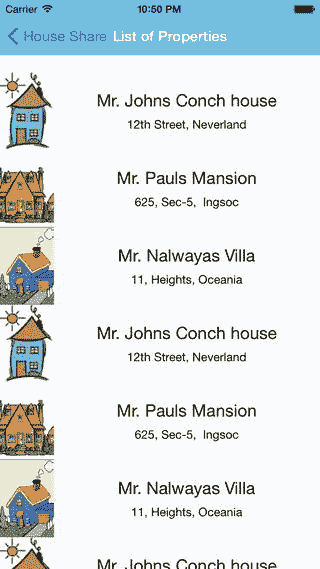

# 三、画布、画笔和颜料：使用用户界面

用户界面是从混乱的复杂到优雅的简单的转变过程—阿克沙特·保罗

在前一章中，我们介绍了 React Native 并创建了我们的第一个 React Native 应用。现在我们的项目有了一个空白的框架，我们将用一个令人惊叹的用户界面来填充它。在本章中，我们将讨论以下主题:

*   导航仪
*   flex box(flex box)的缩写形式
*   图像
*   `TouchableHighlight`
*   路由到新组件
*   `ListView`
*   `ScrollView`

任何有经验的软件专业人士都会同意——一个应用的成功取决于它不仅运行完美，而且看起来很棒。因此，一个优秀的用户界面对你的应用的成功有着巨大的影响。

布局系统是一个需要掌握的基本概念，以便创建优秀的应用。让我们首先了解如何使用 React Native 在 iOS 应用中导航。

## 导航仪

NavigatorIOS 是一个用于创建导航的 React 本地组件。它包装了 UIKit 导航，并允许你在应用中添加向后滑动功能。NavigatorIOS 管理一堆视图控制器，以便为分层内容提供一个向下钻取的界面。现在我们知道 NavigatorIOS 是做什么的了，让我们在项目中实现它。

首先，在`index.ios.js`文件的组件列表中添加 NavigatorIOS:

`var {`

`AppRegistry,`

`StyleSheet,`

`Text,`

`View,`

`NavigatorIOS,`

`} = React;`

现在让我们创建一个具有 NavigatorIOS 的组件，并将其命名为`mainView`，然后让我们在`mainView`中加载另一个组件，我们将其命名为`Home`:

`var mainView = React.createClass ({`

`render: function() {`

`return (`

`<NavigatorIOS`

`style={styles.navigator} initialRoute={{`

`title: 'House Share',`

`component: Home`

`}}`

`/>`

`);`

`},`

`});`

`Home component will be like home page of our application.`

NavigatorIOS 是一个 React 本机组件；我们还使用`initialRoute`为页面提供了标题(`House Share`)和组件名称(`Home`)。还有其他选项，记录在 [`https://facebook.github.io/react-native/docs/navigatorios.html`](https://facebook.github.io/react-native/docs/navigatorios.html) 中。

NavigatorIOS 有助于最基本的 IOS 路由。路线是描述导航器中每个视图的对象。首先，将路线提供给导航员。在前面的代码中，我们从我们的`mainView`调用组件 Home。让我们添加一个空的 Home 组件:

`var Home = React.createClass({`

`render: function() {`

`return (`

`<View>`

`</View>`

`);`

`}`

`});`

让我们也给我们的`mainView`组件添加一些样式:

`var styles = StyleSheet.create({`

`container: {`

`flex: 1,`

`justifyContent: 'center',`

`alignItems: 'center'`

`},`

`welcome: {`

`fontSize: 25,`

`textAlign: 'center'`

`},`

`navigator: {`

`flex: 1`

`}`

`});`

现在让我们将应用的入口点更新为`mainView`:

`AppRegistry.registerComponent('HouseShare', () => mainView);`

现在让我们用 Xcode 构建我们的应用，看看结果，如图 [3-1](#Fig1) 所示。

图 3-1。

Our application, with updated navigation bar at the top

非常好——我们可以在顶部看到一个更新的导航栏。让我们给这个导航栏添加一些颜色，使我们的更改更加明显:

`var mainView = React.createClass ({`

`render: function() {`

`return (`

`<NavigatorIOS barTintColor='#48BBEC' titleTextColor= "#FFFFFF" style={styles.navigator} initialRoute={{`

`title: 'House Share',`

`component: Home`

`}}`

`/>`

`);`

`},`

`});`

我们已经使用`barTintColor`和`titleTextColor`给我们的导航栏添加了颜色(见图 [3-2](#Fig2) )。

图 3-2。

Our toolbar now has color

我们在这一部分做了一些样式设计，如果你来自网格布局背景，这可能对你来说是新的东西。React Native 使用 Flexbox 进行样式化，我们将在下一节详细讨论。

## flex box(flex box)的缩写形式

在前面的例子中创建我们的布局时，您一定已经看到了样式中提到的`flex`属性。这是因为 React 原生应用使用 Flexbox 布局模型。

React 原生 Flexbox 布局模型的灵感来自于 CSS3 中的 CSS Flex Box 布局。React 原生团队专门为 iOS 重新编写了这一功能。Flexbox 背后的主要思想是能够创建布局，而不必担心不同的屏幕尺寸或设备方向。flex 容器扩展项目以填充可用空间，或者收缩项目以防止溢出。让我们了解一些 Flexbox 的基本知识，以加快我们的布局开发。首先，让我们更新视图:

`var Home = React.createClass({`

`render: function() {`

`return (`

`<View style={styles.container}>`

`<View style={styles.topBox} />`

`<View style={styles.bottomBox} />`

`</View>`

`);`

`}`

`});`

我们已经创建了一个带有样式容器的主视图和两个带有样式`topBox`和`bottomBox`的子视图。现在，让我们创建样式:

`var styles = StyleSheet.create({`

`container: {`

`flex: 1,`

`flexDirection: 'column'`

`},`

`welcome: {`

`fontSize: 25,`

`textAlign: 'center'`

`},`

`navigator: {`

`flex: 1`

`},`

`topBox: {`

`flex: 2,`

`backgroundColor: '#CCE5FF'`

`},`

`bottomBox: {`

`flex: 1,`

`backgroundColor: '#FFFFCC'`

`}`

`});`

返回模拟器，使用 Command+R 刷新视图。

图 3-3。

Screen in portrait mode

现在，旋转模拟器，你会看到它自动调整这些彩色方框的大小。

让我们将模拟器改为风景模式(见图 [3-4](#Fig4) )。这可以使用 Command +右/左箭头键(⌘+Left 箭头)轻松完成。您可以看到框是如何调整其大小的，标题是如何调整其宽度的，以便利用所有可用的空间。多亏了 Flexbox，一个相当费力的任务被简化了。

图 3-4。

Screen in landscape mode

现在，让我们回顾一下 flex 属性`Flex-direction`和`Flex`。

### 弯曲方向

Flexbox 是一个单向布局概念。`Flex-direction`允许你定义子元素的流向。它可以有两个值，`row`和`column`。在前面的例子中，我们使用了`column`。

我们改成`row`:

`container: {`

`flex: 1,`

`flexDirection: 'row'`

`}`

返回模拟器，用命令+R 刷新视图(见图 [3-5](#Fig5) )。

图 3-5。

Changing the orientation of the box

我们可以看到盒子的方向是如何变化的。现在再次将属性`flexDirection`改为列(见图 [3-6](#Fig6) `)`)。

图 3-6。

Changing the property to column

### 弯曲

您一定见过样式表中的`flex`值；它可以是整数或小数，表示盒子的相对大小:

`container: {`

`flex: 1,`

`flexDirection: 'column'`

`},`

`topBox: {`

`flex: 2,`

`backgroundColor: '#CCE5FF',`

`},`

`bottomBox: {`

`flex: 1,`

`backgroundColor: '#FFFFCC'`

`}`

我们的观点是:

`<View style={styles.container}>`

`<View style={styles.topBox} />`

`<View style={styles.bottomBox} />`

`</View>`

所以`flex`定义了盒子的大小百分比。我们可以看到容器内部有两个视图，`topBox`和`bottomBox`，分别有`2`和`1`的`flex`值(见图 [3-7](#Fig7) )。

图 3-7。

Container in 2:1 ratio

现在，更新视图并在容器视图中添加一个`topBox`视图:

`<View style={styles.container}>`

`<View style={styles.topBox} />`

`<View style={styles.bottomBox} />`

`<View style={styles.topBox} />`

`</View>`

刷新视图。容器现在有三个视图:`topBox`、`bottomBox`，然后又是`topBox`(见图 [3-8](#Fig8) )。

图 3-8。

Container with three views

这将把视图分成 2:1:2 的比例，因为它们的`flex`值是 2:1:2 的比例。

为了更好地理解这是如何工作的，让我们改变`flex`值，看看它如何改变我们的屏幕。让我们把`topBox`的`flex`值改成`1`。

让我们将 CSS 更新为:

`container: {`

`flex: 1,`

`flexDirection: 'column'`

`},`

`topBox: {`

`flex: 1,`

`backgroundColor: '#CCE5FF',`

`},`

`bottomBox: {`

`flex: 1,`

`backgroundColor: '#FFFFCC'`

`}`

刷新视图查看变化，如图 [3-9](#Fig9) 所示。

图 3-9。

View in ratio of 1:1:1

我们可以看到，现在屏幕被分割成 1:1:1 的比例，因为视图的`flex`值是 1:1:1 的比例。使用 Flexbox，很容易创建可以根据屏幕大小和方向调整大小的布局。这只是对 Flexbox 的介绍；我们将在需要时在整本书中解释更多的属性。您还可以在 [`https://facebook.github.io/react-native/docs/flexbox.html`](https://facebook.github.io/react-native/docs/flexbox.html) 找到更多选项。

## 添加图像

React Native 有一个内置组件`Image`，它将帮助我们显示图像，包括网络图像、临时本地图像，以及来自本地磁盘的图像，如相机胶卷。首先，我们将显示本地图像。

在 Xcode 中打开`Image.xacassets`文件(参见图 [3-10](#Fig10) )。点击底部的+按钮。

图 3-10。

Image.xacassets in Xcode

将图像集命名为“主页”，并将主页图像拖动到屏幕上的方框中(参见图 [3-11](#Fig11) )。

图 3-11。

Image set “home”

xcassets 的使用是 iOS 7 之后的新标准。资产目录管理应用的图像；iOS 有不同的图像分辨率，并将它们分组在一起。构建时，Xcode 会将这个图像目录编译成最有效的包，以便最终分发。

既然我们已经将图像添加到了项目中，那么让我们将它添加到组件中。首先，将`Image`组件添加到我们的组件列表:

`var {`

`AppRegistry,`

`StyleSheet,`

`Text,`

`View,`

`NavigatorIOS,`

`Image`

`} = React;`

现在让我们将图像添加到我们的视图中:

`var home = React.createClass({`

`render: function() {`

`return (`

`<View style={styles.container}>`

`<View style={styles.topBox} >`

`</View>`

`<View style={styles.bottomBox} >`

`<Image source={require('image!home')} style={styles.image}/>`

`</View>`

`<View style={styles.topBox} >`

`</View>`

`</View>`

`);`

`}`

`});`

`require('image!home)`指向名为`home`的图像的资产目录。

让我们也指定这个图像的宽度和高度:

`image: {`

`width: 70,`

`height: 70`

`},`

由于我们在 Xcode 中做了改动，所以我们必须重启模拟器。停止应用并重新生成代码。我们可以看到房子的图像显示在屏幕上(见图 [3-12](#Fig12) )。

图 3-12。

Now we have a house image

现在，让我们通过用下面的样式更新`bottomBox`来添加一些样式:

`bottomBox: {`

`flex: 1,`

`backgroundColor: '#FFFFCC',`

`alignItems: 'center',`

`justifyContent: 'center',`

`},`

`alignItems`和`justifyContent`分别定义沿横轴和主轴排列伸缩项目的默认行为。因为我们想在中间显示这个，所以我们将这些值更新为`center`。

刷新屏幕，你会发现房屋图像在视图中居中(见图 [3-13](#Fig13) )。

图 3-13。

The house is now centered

我们还可以给定任何服务器图像 URL 作为源，并且`Image`组件将负责从网络加载它。我们将在本章的后半部分做这件事。

## 可触摸高亮显示

触摸是与 iOS 应用交互的基本方式。`TouchableHighlight`是一个 React 本地组件，它帮助我们创建按钮，以便在触摸时做出正确的响应。这些实际上不是按钮，但是 React 原生团队认为直接在 JavaScript 中构造按钮比使用 UIButton 更容易。你 app 里的按钮用的是`TouchableHighlight`，不是按钮，但工作起来像按钮。让我们用一个例子来理解这一点。

让我们将 TouchableHighlight 组件添加到代码中:

`var {`

`AppRegistry,`

`StyleSheet,`

`Text,`

`View,`

`NavigatorIOS,`

`TouchableHighlight`

`} = React;`

更新视图并添加两个`TouchableHighlight`按钮:

`var Home = React.createClass({`

`render: function() {`

`return (`

`<View style={styles.container}>`

`<View style={styles.topBox} />`

`<View style={styles.bottomBox} />`

`<View style={styles.topBox} >`

`<TouchableHighlight style={styles.button}`

`underlayColor='#99d9f4'>`

`<Text style={styles.buttonText}>Show Houses</Text>`

`</TouchableHighlight>`

`<TouchableHighlight style={styles.button}`

`underlayColor='#99d9f4'>`

`<Text style={styles.buttonText}>Add House</Text>`

`</TouchableHighlight>`

`</View>`

`</View>`

`);`

`}`

`});`

当然，我们需要按钮的样式表:

`button: {`

`flex: 1,`

`backgroundColor: '#48BBEC',`

`borderColor: '#48BBEC',`

`borderWidth: 1,`

`borderRadius: 8,`

`alignSelf: 'stretch',`

`justifyContent: 'center',`

`margin: 10`

`},`

`buttonText: {`

`fontSize: 18,`

`color: 'white',`

`alignSelf: 'center'`

`}`

在 iOS 模拟器中刷新应用。我们将在第三个块的屏幕上看到两个按钮(如图 [3-14](#Fig14) 所示)。

图 3-14。

Screen with two buttons at bottom

让我们继续构建我们的页面，再添加一个视图来列出住房选项。这将通过单击 show house 页面来完成，该页面将重定向到另一个组件。将以下代码替换为`Home`组件:

`var Home = React.createClass({`

`_handleListProperty: function() {`

`console.log(‘Button clicked successfully’);`

`},`

`render: function() {`

`return (`

`<View style={styles.container}>`

`<View style={styles.topBox} />`

`<View style={styles.bottomBox} />`

`<View style={styles.topBox} >`

`<TouchableHighlight`

`style={styles.button}`

`onPress= {this._handleListProperty }`

`underlayColor='#99d9f4'`

`>`

`<Text style={styles.buttonText}>List properties</Text>`

`</TouchableHighlight>`

`<TouchableHighlight style={styles.button}`

`underlayColor='#99d9f4'>`

`<Text style={styles.buttonText}>Add House</Text>`

`</TouchableHighlight>`

`</View>`

`</View>`

`);`

`}`

`});`

让我们回顾一下我们在这里做了什么；我们已经为列表属性部分的`TouchableHighlight`组件添加了一个`onPress`属性。每当有人按下列表属性按钮时，就会调用函数`_` `handleListProperty`。

如果您构建您的应用并在开发工具中打开控制台，每次您单击列表属性按钮时，您都会在控制台中看到消息“按钮已成功单击”。

接下来，我们将创建我们的`ListProperty`组件。但是首先，让我们重构我们的代码，并将我们的组件保存在单独的文件中。创建一个包含`Components`子文件夹的`App`文件夹，这是我们保存 React 本地组件的地方。在`Components`文件夹中，创建文件`Home.js`,并将它各自的组件放在那里。然后我们将在我们的`index.ios.js`中要求它们，现在看起来像这样:

`'use strict';`

`var React = require('react-native');`

`var Home = require('./App/Components/Home');`

`var {`

`AppRegistry,`

`StyleSheet,`

`Text,`

`View,`

`NavigatorIOS,`

`TouchableHighlight`

`} = React;`

`var mainView = React.createClass ({`

`render: function() {`

`return (`

`<NavigatorIOS barTintColor='#48BBEC' titleTextColor= "#FFFFFF" style={styles.navigator} initialRoute={{`

`title: 'House Share',`

`component: Home`

`}}/>`

`);`

`},`

`});`

`var styles = StyleSheet.create({`

`navigator: {`

`flex: 1`

`}`

`});`

`AppRegistry.registerComponent('HouseShare', () => mainView);`

## 路由到组件

在 React Native 中，您将构建许多组件，并在它们之间来回路由。我们必须有办法做到这一点。在本节中，我们将学习从一个组件到另一个组件的路由。在创建组件`ListProperty`之前，我们需要导航到这个组件的路径。这可以通过修改`Home`组件中的`_handleListProperty`函数来实现。在`./App/Components/Home.js`用以下代码替换`_handleListProperty`功能:

`_handleListProperty: function() {`

`this.props.navigator.push({`

`title: "List Properties",`

`component: ListProperty`

`})`

`},`

在这里，`navigator.push`向前导航到新的路线；这种情况下是`ListProperty`。

现在让我们通过在`./App/Components/`文件夹中创建一个文件`ListProperty.js`来创建一个`List Property`组件。在您的`ListProperty.js`文件中添加以下代码:

`var React = require('react-native');`

`var {`

`View`

`} = React;`

`var ListProperty = React.createClass({`

`render: function() {`

`return (`

`<View />`

`);`

`}`

`});`

`module.exports = ListProperty;`

刷新您的应用并点击列表属性按钮，这将把您带到如图 [3-15](#Fig15) 所示的空视图。

图 3-15。

Empty view with traversing option

在左上角，您将看到一个选项，可以遍历回上一个组件。NavigatorIOS 维护这个返回栈，通过它可以返回到上一个组件。现在让我们来处理这个空组件。这个想法是创建一个包含属性列表的表格视图，每个属性的左侧都有一个图像缩略图。其余的细节应该出现在它的旁边。

为了简化本章，我们将模拟数据，而不是从外部服务中提取数据(稍后，您将学习如何从外部 API 中提取相同的数据)。有了这些数据，我们将显示酒店的名称、地址和缩略图。这看起来有点像图 [3-16](#Fig16) 。

图 3-16。

Property name and address

将以下代码添加到文件`./App/Components/ListProperty.js`中的`ListProperty`组件中:

`var React = require('react-native');`

`var {`

`Image,`

`StyleSheet,`

`Text,`

`View`

`} = React;`

`var MOCK_DATA = [`

`{name: 'Mr. Johns Conch house', address: '12th Street, Neverland', images: {thumbnail: '`[`http://hmp.me/ol5`](http://hmp.me/ol5)T2】

`];`

`var ListProperty = React.createClass({`

`render: function() {`

`var property = MOCK_DATA[0]`

`return (`

`<View style={styles.container}>`

`<Image`

`source={{uri: property.images.thumbnail}}`

`style={styles.thumbnail}/>`

`<View style={styles.rightContainer}>`

`<Text style={styles.name}>{property.name}</Text>`

`<Text style={styles.address}>{property.address}</Text>`

`</View>`

`</View>`

`);`

`}`

`});`

`var styles = StyleSheet.create({`

`container: {`

`flex: 1,`

`flexDirection: 'row',`

`justifyContent: 'center',`

`alignItems: 'center',`

`backgroundColor: '#F5FCFF',`

`},`

`thumbnail: {`

`width: 53,`

`height: 81,`

`},`

`rightContainer: {`

`flex: 1,`

`},`

`name: {`

`fontSize: 20,`

`marginBottom: 8,`

`textAlign: 'center',`

`},`

`address: {`

`textAlign: 'center',`

`},`

`});`

`module.exports = ListProperty;`

让我们在 iOS 模拟器中刷新我们的应用，看看有什么变化(见图 [3-17](#Fig17) )。

图 3-17。

Thumbnail image with property name and address

让我们回顾一下我们在这里做了什么:

`var React = require('react-native');`

`var {`

`Image,`

`StyleSheet,`

`Text,`

`View`

`} = React;`

我们首先指定了本节中要使用的所有组件。我们再次添加了`Image`组件，它将用于加载我们的图像——不是从一个捆绑的图像，而是像前面承诺的那样，从一个图像 URL。

接下来，我们添加了一些模拟数据:

`var MOCK_DATA = [`

`{name: 'Mr. Johns Conch house', address: '12th Street, Neverland', images: {thumbnail: '`[`http://hmp.me/ol5`](http://hmp.me/ol5)T2】

`];`

这里，我们为我们的属性缩略图添加了名称、地址和图像 URL。随着示例的深入，我们将向这个模拟数据添加更多的值。

接下来，我们创建了我们的`ListProperty`组件:

`var ListProperty = React.createClass({`

`render: function() {`

`var property = MOCK_DATA[0]`

`return (`

`<View style={styles.container}>`

`<Image`

`source={{uri: property.images.thumbnail}}`

`style={styles.thumbnail}/>`

`<View style={styles.rightContainer}>`

`<Text style={styles.name}>{property.name}</Text>`

`<Text style={styles.address}>{property.address}</Text>`

`</View>`

`</View>`

`);`

`}`

`});`

我们的`ListProperty`组件有一个变量属性，它包含来自`MOCK_DATA`数组的数据。然后我们使用一个`View`组件来创建一个包含图片组件中缩略图的视图。在`Image`组件中，我们有属性 source，它可以有值 http address、本地文件路径或静态图像资源的名称。

使用一个`Text`组件，我们从模拟数据中指定了名称和地址:

`var styles = StyleSheet.create({`

`container: {`

`flex: 1,`

`flexDirection: 'row',`

`justifyContent: 'center',`

`alignItems: 'center',`

`backgroundColor: '#F5FCFF',`

`},`

`thumbnail: {`

`width: 53,`

`height: 81,`

`},`

`rightContainer: {`

`flex: 1,`

`},`

`name: {`

`fontSize: 20,`

`marginBottom: 8,`

`textAlign: 'center',`

`},`

`address: {`

`textAlign: 'center',`

`},`

`});`

`module.exports = ListProperty;`

最后，我们添加了样式并导出了我们的`ListProperty`组件。

## 列表视图

在上一节中，我们通过指定元素的索引来填充数组中的一个元素。在本节中，我们将使用`ListView`填充一个数据列表。在我们开始之前，让我们多了解一点关于`ListView`组件的知识。

一个`ListView`是为填充动态数据的垂直滚动列表而设计的组件。最简单的步骤是创建一个`ListView`数据源，用类似于本地`TableView`数据源的数据数组填充它，然后用该数据源和一个`renderRow`回调实例化一个`ListView`组件。这从数据数组中取出一个 blob，并返回一个可呈现的组件，它将被显示。

`ListView`看起来与`TableView`非常相似，但是实现并没有真正使用`TableView.`，而是在幕后使用了`ScrollView`。像滑动删除、重新排序等功能不能通过`ListView`直接使用。

替换您的`ListProperty.js`中的以下代码:

`var React = require('react-native');`

`var {`

`Image,`

`StyleSheet,`

`Text,`

`View,`

`ListView`

`} = React;`

`var MOCK_DATA = [`

`{name: 'Mr. Johns Conch house', address: '12th Street, Neverland', images: {thumbnail: '`[`http://hmp.me/ol5`](http://hmp.me/ol5)T2】

`{name: 'Mr. Pauls Mansion', address: '625, Sec-5,  Ingsoc', images: {thumbnail: '`[`http://hmp.me/ol6`](http://hmp.me/ol6)T2】

`{name: 'Mr. Nalwayas Villa', address: '11, Heights, Oceania', images: {thumbnail: '`[`http://hmp.me/ol7`](http://hmp.me/ol7)T2】

`{name: 'Mr. Johns Conch house', address: '12th Street, Neverland', images: {thumbnail: '`[`http://hmp.me/ol5`](http://hmp.me/ol5)T2】

`{name: 'Mr. Pauls Mansion', address: '625, Sec-5,  Ingsoc', images: {thumbnail: '`[`http://hmp.me/ol6`](http://hmp.me/ol6)T2】

`{name: 'Mr. Nalwayas Villa', address: '11, Heights, Oceania', images: {thumbnail: '`[`http://hmp.me/ol7`](http://hmp.me/ol7)T2】

`{name: 'Mr. Johns Conch house', address: '12th Street, Neverland', images: {thumbnail: '`[`http://hmp.me/ol5`](http://hmp.me/ol5)T2】

`{name: 'Mr. Pauls Mansion', address: '625, Sec-5,  Ingsoc', images: {thumbnail: '`[`http://hmp.me/ol6`](http://hmp.me/ol6)T2】

`{name: 'Mr. Nalwayas Villa', address: '11, Heights, Oceania', images: {thumbnail: '`[`http://hmp.me/ol7`](http://hmp.me/ol7)T2】

`];`

`var ListProperty = React.createClass({`

`getInitialState: function() {`

`var ds = new ListView.DataSource({rowHasChanged: (r1, r2) => r1 !== r2});`

`return {`

`dataSource: ds.cloneWithRows(MOCK_DATA),`

`};`

`},`

`render: function() {`

`return (`

`<ListView`

`dataSource={this.state.dataSource}`

`renderRow={this.renderProperty}`

`style={styles.listView}/>`

`);`

`},`

`renderProperty: function(property) {`

`return (`

`<View style={styles.container}>`

`<Image`

`source={{uri: property.images.thumbnail}}`

`style={styles.thumbnail}/>`

`<View style={styles.rightContainer}>`

`<Text style={styles.name}>{property.name}</Text>`

`<Text style={styles.address}>{property.address}</Text>`

`</View>`

`</View>`

`);`

`},`

`});`

`var styles = StyleSheet.create({`

`container: {`

`flex: 1,`

`flexDirection: 'row',`

`justifyContent: 'center',`

`alignItems: 'center',`

`backgroundColor: '#F5FCFF',`

`},`

`thumbnail: {`

`width: 63,`

`height: 91,`

`},`

`rightContainer: {`

`flex: 1,`

`},`

`name: {`

`fontSize: 20,`

`marginBottom: 8,`

`textAlign: 'center',`

`},`

`address: {`

`textAlign: 'center',`

`},`

`listView: {`

`paddingTop: 20,`

`backgroundColor: '#F5FCFF',`

`},`

`});`

`module.exports = ListProperty;`

在 iOS 模拟器中刷新您的应用以查看更新后的视图，如图 [3-18](#Fig18) 所示。

图 3-18。

Scrollable addresses

太好了。现在我们有了一个可以滚动浏览的属性列表。现在让我们回顾一下实施情况:

`var React = require('react-native');`

`var {`

`Image,`

`StyleSheet,`

`Text,`

`View,`

`ListView`

`} = React;`

我们再次指定了本节中所有组件的用途。增加了一个新组件— `ListView`。如果你看过除了`ListView`之外的 React 原生文档来实现类似的功能，那么`ScrollView. ListView`可能比简单地呈现所有这些元素或者将它们放在`ScrollView`中要好得多。这是因为，尽管 React Native 速度很快，但呈现一个非常大的元素列表可能会很慢。与`TableView`类似，`ListView`实现元素的渲染列表，这样你只显示屏幕上显示的元素；那些已经渲染但现在不在屏幕上的将从本机视图层次结构中删除，这使得渲染平滑而快速。

展望未来，我们已经更新了我们的`MOCK_DATA`:

`var MOCK_DATA =[`

`{name: 'Mr. Johns Conch house', address: '12th Street, Neverland', images: {thumbnail: '`[`http://hmp.me/ol5`](http://hmp.me/ol5)T2】

`{name: 'Mr. Pauls Mansion', address: '625, Sec-5,  Ingsoc', images: {thumbnail: '`[`http://hmp.me/ol6`](http://hmp.me/ol6)T2】

`{name: 'Mr. Nalwayas Villa', address: '11, Heights, Oceania', images: {thumbnail: '`[`http://hmp.me/ol7`](http://hmp.me/ol7)T2】

`{name: 'Mr. Johns Conch house', address: '12th Street, Neverland', images: {thumbnail: '`[`http://hmp.me/ol5`](http://hmp.me/ol5)T2】

`{name: 'Mr. Pauls Mansion', address: '625, Sec-5,  Ingsoc', images: {thumbnail: '`[`http://hmp.me/ol6`](http://hmp.me/ol6)T2】

`{name: 'Mr. Nalwayas Villa', address: '11, Heights, Oceania', images: {thumbnail: '`[`http://hmp.me/ol7`](http://hmp.me/ol7)T2】

`{name: 'Mr. Johns Conch house', address: '12th Street, Neverland', images: {thumbnail: '`[`http://hmp.me/ol5`](http://hmp.me/ol5)T2】

`{name: 'Mr. Pauls Mansion', address: '625, Sec-5,  Ingsoc', images: {thumbnail: '`[`http://hmp.me/ol6`](http://hmp.me/ol6)T2】

`{name: 'Mr. Nalwayas Villa', address: '11, Heights, Oceania', images: {thumbnail: '`[`http://hmp.me/ol7`](http://hmp.me/ol7)T2】

`];`

在这段代码中，我们添加了更多的条目来创建一个可滚动的视图。现在，让我们看看我们在`ListProperty`组件中所做的更改:

`var ListProperty = React.createClass({`

`getInitialState: function() {`

`var ds = new ListView.DataSource({rowHasChanged: (r1, r2) => r1 !== r2});`

`return {`

`dataSource: ds.cloneWithRows(MOCK_DATA),`

`};`

`},`

`render: function() {`

`return (`

`<ListView`

`dataSource={this.state.dataSource}`

`renderRow={this.renderProperty}`

`style={styles.listView}/>`

`);`

`},`

`renderProperty: function(property) {`

`return (`

`<View style={styles.container}>`

`<Image`

`source={{uri: property.images.thumbnail}}`

`style={styles.thumbnail}/>`

`<View style={styles.rightContainer}>`

`<Text style={styles.name}>{property.name}</Text>`

`<Text style={styles.address}>{property.address}</Text>`

`</View>`

`</View>`

`);`

`},`

`});`

这里我们设置`getInitialState`的组件规格:

`getInitialState: function() {`

`var ds = new ListView.DataSource({rowHasChanged: (r1, r2) => r1 !== r2});`

`return {`

`dataSource: ds.cloneWithRows(MOCK_DATA),`

`};`

`},`

在安装组件之前，`getInitialState`仅被调用一次。返回值将作为`this.state`的初始值。

接下来，我们修改了`render`函数，这样，一旦我们有了数据，它就会呈现一个`ListView`而不是一个条目:

`render: function() {`

`return (`

`<ListView`

`dataSource={this.state.dataSource}`

`renderRow={this.renderProperty}`

`style={styles.listView}/>`

`);`

`},`

`renderProperty: function(property) {`

`return (`

`<View style={styles.container}>`

`<Image`

`source={{uri: property.images.thumbnail}}`

`style={styles.thumbnail}/>`

`<View style={styles.rightContainer}>`

`<Text style={styles.name}>{property.name}</Text>`

`<Text style={styles.address}>{property.address}</Text>`

`</View>`

`</View>`

`);`

`},`

`});`

你会注意到我们使用了`this.state`中的`dataSource`，它已经由`getIntialState`设置好了。我们还调用了`renderProperty`函数来设置每一行的图像、名称和地址。最后，我们添加了一些样式:

`listView: {`

`paddingTop: 20,`

`backgroundColor: '#F5FCFF',`

`},`

## 卷动检视

虽然我们没有在家里使用`ScrollView`,但是`application, to populate a list we can use ScrollView just like we used ListView. ScrollView`是 iOS 中最通用和最有用的控件之一，因为它是一种列出比屏幕尺寸大的内容的好方法。

我们可以通过使用下面的代码添加一个基本的`ScrollView`:

`var scrollview = React.createClass({`

`getInitialState: function() {`

`return {`

`values: values`

`};`

`},`

`_renderRow: function(value, index) {`

`return (`

`<View`

`style={styles.row}`

`key={index}`

`>`

`<Text>{value + "  <----- Slide the row "}</Text>`

`</View>`

`)`

`},`

`render: function() {`

`return (`

`<View style={styles.container}>`

`<ScrollView style={styles.outerScroll}>`

`{this.state.values.map(this._renderRow, this)}`

`</ScrollView>`

`</View>`

`);`

`}`

`});`

我们将为`ScrollView`设置`getInitialState`,如下所示:

`var values = [1,2,3,4]`

我们可以将这些值映射到`_renderRow`函数，该函数将返回一个基本视图，并带有一些文本。这是基本的`ScrollView;`如果我们想要水平滚动，并且我们想要锁定那个方向，我们可以这样做:

`<ScrollView`

`horizontal={true}`

`directionalLockEnabled={true}`

`>`

使用`ScrollView`还有许多其他选项可用；有关文档和示例，您可以访问以下网址: [`https://facebook.github.io/react-native/docs/scrollview.html`](https://facebook.github.io/react-native/docs/scrollview.html) 。

## 摘要

在这一章中，我们学习了一些创造令人惊叹的用户体验的基础知识。我们讨论了以下内容:

*   跨应用的向后滑动功能导航
*   Flexbox 布局模型
*   TouchableHighlight，一个让视图正确响应触摸的包装器
*   路由到另一个组件
*   使用`ListView`高效滚动垂直列表
*   使用`ScrollView`列出大于屏幕尺寸的内容。

在下一章，我们将学习如何通过使用 Flux 以不同的方式解决问题。我们不仅会发现如何使用 flux 模式，还会发现它与无处不在的 MVC 模式有什么不同。我们还将使用 React 创建一个简单的 flux 应用，并将其移植到 React Native 中。