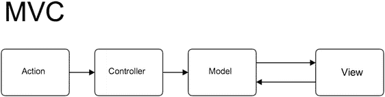
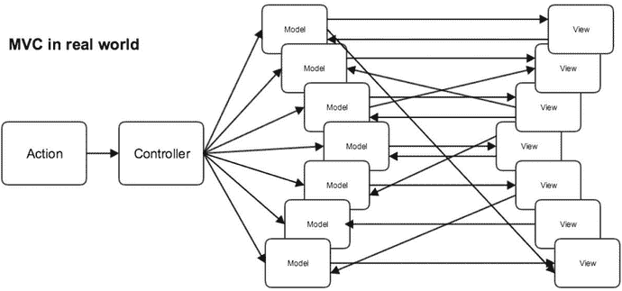
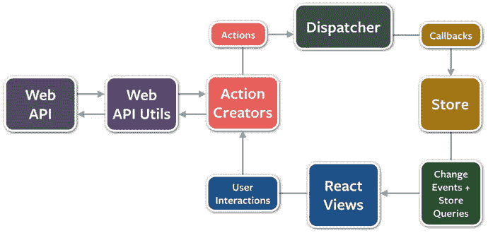
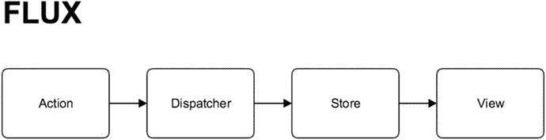
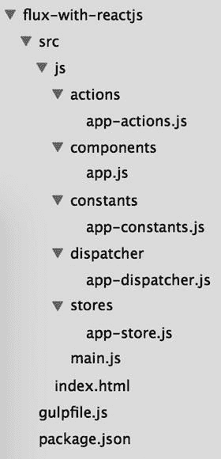
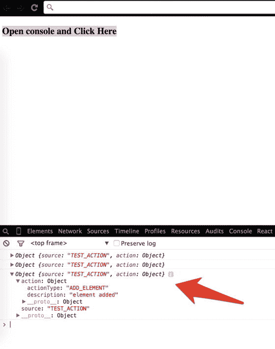
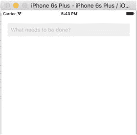
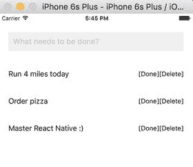
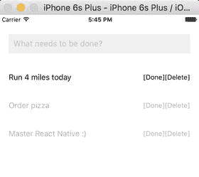

# 四、Flux：以不同的方式解决问题

简单是可靠的先决条件—吉克斯特拉

Flux 是脸书向世界介绍的一种应用架构，用于构建客户端应用。它通过利用单向数据流来补充 React 本机可组合视图组件。与其说它是一个合适的框架，不如说它是一种模式，人们可以立即开始使用 Flux，而不需要过多的代码。在我们深入研究细节之前，了解常用的流行模式 MVC 以及它与 Flux 的区别是很重要的。在本章中，我们将了解以下主题:

*   MVC 模式
*   MVC 问题
*   流量
*   Flux 深潜
*   带电抗器的 Flux 示例
*   React 原生的 Flux 示例

## MVC 模式

历史上，MVC 模式将代码分成三个不同的部分:模型、视图和控制器。这种模式的主要目的是将信息的表示与用户交互隔离开来。让我们分别了解这些部分:

*   模型:管理应用的行为和数据
*   视图:用户界面中模型的表现层
*   控制器:接受用户输入并对模型进行必要的操作，使视图得到更新

## MVC 问题

MVC 是设计应用的一种非常流行的模式，但是它也有自己的问题。你的源代码变得越复杂，事情就变得越复杂。图 [4-1](#Fig1) 显示了 MVC 最简单的实现，它在小型应用中运行良好。但是随着应用的增长，它需要新的特性，所以应该有空间来容纳更多的模型和视图。

图 4-1。

Basic MVC implementation

图 [4-2](#Fig2) 显示了当模型和视图增加时会发生什么。

图 4-2。

An explosion of arrows

有如此多的模型和视图相互交互，当我们跟踪一个模型时，它触发一个视图，视图触发另一个模型，这就像意大利面条一样继续下去，很多时候以无限循环结束。最糟糕的是，在这种情况下调试代码真的很难，最终使系统变得脆弱。脸书也面临过类似的挫折，他用一种叫做“流动”的新模式解决了这个问题。

## 流量

Flux 放弃 MVC，支持单向数据流。Flux 工作得很好，因为随着应用的增长和变得更加复杂，单向数据流使得理解和修改应用变得容易。之前，我们发现双向数据绑定会导致级联更新，其中一个数据模型的更改会导致另一个数据模型的更新，这使得很难预测单个用户交互的结果会是什么。如图 [4-3](#Fig3) 所示，Flux 应用有三个主要部分:dispatcher、stores 和 views(这里我们使用 React 本地组件)。这些不应该与 MVC 模式的模型视图控制器元素相比较。

图 4-3。

Three major components of Flux

图片来源: [`https://github.com/facebook/flux/blob/master/docs/img/flux-diagram-white-background.png`](https://github.com/facebook/flux/blob/master/docs/img/flux-diagram-white-background.png)

虽然控制器确实存在于 Flux 应用中，但它们是控制器视图，视图位于从存储中检索数据并将其转发给其子节点的层次结构的顶部。查看图 [4-4](#Fig4) ，Flux 架构最重要的部分是调度程序，它是一个单独的程序，指导数据流并确保更新不会级联。

图 4-4。

Dispatcher directs the flow of data

随着应用的增长，调度程序变得越来越重要，因为它负责通过以特定的顺序调用注册的回调来管理存储之间的依赖关系。

当用户与 React 本地视图交互时，视图通过 dispatcher 发送一个动作(通常表示为带有一些字段的 JavaScript 对象),该动作通知保存应用数据和业务逻辑的各个存储。当存储改变状态时，它们通知视图某些东西已经被更新。这与 React Native 的声明性模型配合得特别好，该模型允许存储发送更新，而无需指定如何在状态之间转换视图。

简而言之，Flux 具有以下优势:

*   提高数据一致性
*   更容易找出错误
*   提供更有意义的单元测试；因为一个模块的所有状态都在同一个地方，所以我们可以独立地测试一个模块
*   包含可预测的代码

### Flux 的成功

脸书最受欢迎的功能之一是聊天。然而，它是极其错误的，并且有最负面的用户反馈。脸书实现的新聊天系统使用了 Flux，它现在有了无缝的体验；您可以在以下 URL 查看脸书 React 本地示例中的示例聊天代码:

[`https://github.com/facebook/flux/tree/master/examples/flux-chat`](https://github.com/facebook/flux/tree/master/examples/flux-chat) 。

## Flux 深潜

在这一节中，我们将进一步了解 Flux 的一些核心概念。

### 调度员

调度程序是管理 Flux 应用中所有数据流的中心枢纽。它本质上是一个对存储回调的注册表，本身没有真正的智能；这是一种简单的机制，用于将操作分配给商店。每个存储注册自己并提供回调。当操作创建者向调度程序提供新的操作时，应用中的所有存储都通过注册表中的回调接收该操作。调度员也像交通管理员一样工作。如果它在数据层仍在处理时得到一个动作，它可以拒绝这个动作，这是一个很好的约束。这保证了您将知道您的操作何时开始以及它对数据层产生了什么变化，因为在这两者之间会产生级联效应—您确实可以完全控制您的系统。

### 对调度员[ `dispatch()`和`waitFor()` ]的需求

随着应用的增长，不同存储之间的依赖性也会增加。假设我们有这样一种情况，商店 A 需要商店 B 首先更新自己，这样它自己就可以知道如何更新。我们需要调度程序调用对存储 B 的回调，并在继续处理存储 A 之前完成该回调。为了断言这种依赖性，存储 A 需要与调度程序通信，以首先完成更新存储 B 的操作。调度程序通过`waitFor()`方法提供该功能。

`dispatch()`方法通过回调提供了一个简单的同步迭代，依次调用每个回调。当在一个回调中遇到`waitFor()`时，该回调的执行停止，`waitFor()`为我们提供了一个新的依赖项迭代周期。在完成了整个依赖集之后，最初的回调将继续执行。

此外，在同一个存储的回调中，`waitFor()`方法可以以不同的方式用于不同的动作。在一种情况下，存储 A 可能需要等待存储 b。但在另一种情况下，它可能需要等待存储 c。在特定于某个操作的代码块中使用`waitFor()`允许我们对这些依赖关系进行细粒度控制。

然而，如果我们有循环依赖，问题就出现了。也就是说，如果商店 A 需要等待商店 B，而商店 B 需要等待商店 A，我们可能会陷入无限循环。Flux repo 中现在可用的 dispatcher 通过抛出一个信息性错误来提醒开发人员这个问题已经发生，从而防止了这种情况。然后，开发人员可以创建第三个存储并解决循环依赖。

### 商店

存储包含应用状态和逻辑。它们的角色有点类似于传统 MVC 中的模型，但是它们管理许多对象的状态——它们不像 ORM 模型那样表示单一的数据记录。存储不仅仅是管理一组 ORM 样式的对象，它还管理应用中特定域的应用状态。

如前所述，存储向调度程序注册自己，并为其提供回调。这个回调接收动作作为参数。在商店注册的回调中，基于动作类型的`switch`语句用于解释动作，并为商店的内部方法提供适当的挂钩。这允许一个操作通过 dispatcher 导致存储状态的更新。在存储被更新后，它们广播一个事件，声明它们的状态已经改变，因此视图可以查询新的状态并更新它们自己。

### 行动

当新数据进入系统时，无论是通过与应用交互的人还是通过 web API 调用，该数据都被打包到一个动作中——一个包含新数据字段和特定动作类型的对象文字。我们经常创建一个叫做动作创建器的辅助方法库，它不仅创建动作对象，还将动作传递给调度程序。

不同的动作由一个`type`属性标识。当所有商店接收到该动作时，它们通常使用该属性来确定是否以及如何响应该动作。在 Flux 应用中，存储和视图都控制自己；外部物体不作用于它们。动作通过它们定义和注册的回调流入存储，而不是通过 setter 方法。

让存储自行更新消除了 MVC 应用中常见的许多问题，在 MVC 应用中，模型之间的级联更新会导致不稳定的状态，并使准确的测试变得非常困难。Flux 应用中的对象是高度解耦的，并且非常严格地遵守 Demeter 定律，即系统中的每个对象应该尽可能少地了解系统中的其他对象。这使得软件更易维护、适应性更强、可测试，并且更易于新的工程团队成员理解。

## 带 React 剂的焊剂示例

在本节中，我们将使用 Flux 创建一个简单的 ReactJS 应用。我们尽量不举这个例子，目的是通过应用实现来理解上一节中的理论解释。

您可以参考所提供的 flux-with-react 源代码并遵循它，也可以创建一个全新的 ReactJS 应用。在 flux-with-react 的根目录下，您需要安装所需的软件包。

这个例子是一个 web 应用，我们将在其中使用几个 npm 模块。使用以下内容初始化您的项目:

`$ npm init`

这将初始化您的项目；填写所需信息。接下来，让我们安装一些节点模块，这对我们的项目很有帮助:

`$ npm install –save-dev react reactify object-assign gulp gulp-browserify gulp-concat es6-promise flux`

在所有这些包中，最重要的是 eact，它是 ReactJS 的 JavaScript 库；reactify，帮助将 ES6 语法转换成 ES5 语法结构；gulp，它内置了系统帮助，可以在开发工作流程中自动完成痛苦的任务；最后是 flux，脸书的 npm 模块，用于实现 Flux 架构。

接下来，创建`gulpfile.js`并向其添加以下任务:

`var gulp = require('gulp');`

`var browserify = require('gulp-browserify');`

`var concat = require('gulp-concat');`

`gulp.task('browserify', function() {`

`gulp.src('src/js/main.js')`

`.pipe(browserify({transform:'reactify'}))`

`.pipe(concat('main.js'))`

`.pipe(gulp.dest('dist/js'));`

`});`

`gulp.task('copy', function() {`

`gulp.src('src/index.html')`

`.pipe(gulp.dest('dist'));`

`});`

`gulp.task('default',['browserify', 'copy'], function() {`

`return gulp.watch('src/**/*.*', ['browserify', 'copy'])`

`});`

这里，我们有两个任务:`browserify`和`copy`。`browserify`所做的是抓取、转换和连接`main.js`(我们的应用代码所在的地方)并把它放在我们的分发文件夹中，这个文件夹就是`dist`。下一个任务`copy`将`index.html`复制到`dist`文件夹中。

我们还有另一个任务`default`，它既运行这两个任务，也持续观察与这些任务相关的文件是否有任何变化。

接下来，让我们创建我们的文件夹结构，它应该支持 Flux 架构。用根文件夹中的空文件创建如图 [4-5](#Fig5) 所示的文件夹结构:

图 4-5。

New Flux file structure

现在，让我们从头开始创建我们的应用。在您的文件`index.html`中添加以下代码:

`<!DOCTYPE html>`

`<html lang="en">`

`<head>`

`<meta charset="UTF-8">`

`<title>Flux example with ReactJS</title>`

`</head>`

`<body>`

`

`

``

`</body>`

`</html>`

这个文件中发生的事情不多；它是我们加载`our main.js`的 html 文件，是我们所有 JavaScript 代码的入口点。id `main`是我们的组件将被加载的目标。接下来，在`src/main.js`中使用下面的代码:

`var React = require('react');`

`var App = require('./components/app');`

`React.render(`

`<App />,`

`document.getElementById('main')`

`);`

在这里的`src/main.js`中，我们使用变量`React`来获取`react,`，我们使用变量`App`来获取来自`./components/app.js`的组件。我们在目标 id `main`上渲染`App`组件——所有 Flux 的魔法都在这里发生。接下来，我们通过在`src/components/app.js`中添加以下代码来创建我们的组件:

`var React = require('react');`

`var AppActions = require('../actions/app-actions');`

`var AppStore = require('../stores/app-store');`

`var AppTitle = React.createClass({`

`onClickHandler:function(){`

`AppActions.addElement('element added');`

`},`

`render:function(){`

`return (`

`
`

`<h3 onClick={this.onClickHandler}>Open console and Click Here </h3>`

`
`

`)`

`}`

`});`

`module.exports = AppTitle;`

同样，我们很少有`require`语句来抓取 React、动作和存储。接下来，使用`createClass`我们创建一个`AppTitle`组件，它有一个带有`div`的渲染方法，该方法有一个带有`onClick`事件的`h3`标签。我们还有另一个函数`onClickHandler`，每当点击`h3`标签时，就会触发一个`onClick`事件。

让我们仔细看看`onClickHandler`函数:

`onClickHandler:function(){`

`AppActions.addElement('element added');`

`},`

这里的`AppActions`是一个 fire and forget，它有一个要执行的动作、`addElement`(我们将在进入动作时研究它)和一些要传递的数据。让我们现在打开`src/actions/app-actions.js`并粘贴以下代码在里面:

`var AppDispatcher = require('../dispatcher/app-dispatcher');`

`var AppConstants = require('../constants/app-constants');`

`var AppActions = {`

`addElement: function(param){`

`AppDispatcher.handleAction({`

`actionType:AppConstants.ADD_ELEMENT,`

`description: param`

`})`

`}`

`}`

`module.exports = AppActions`

同样，我们在开始时有一些必需的项目——dispatcher 和一些常量。如果你还记得，在我们的`App`组件代码中，我们在`onClickHandler`中调用了`addElement`函数。该功能描述如下:

`addElement: function(param){`

`AppDispatcher.handleAction({`

`actionType:AppConstants.ADD_ELEMENT,`

`description: param`

`})`

`}`

`addElement`函数有一个对象描述，它将该描述作为参数接收，然后传递给调度程序。我们还有一个这里描述的`actionType`，它是我们从`AppConstants`那里得到的。在`src/constants/app-constants.js`中添加以下代码:

`module.exports = {`

`ADD_ELEMENT: 'ADD_ELEMENT'`

`};`

这里，我们创建了几个可以在应用中重用的常量。让我们转到 dispatcher，并将以下代码添加到`src/dispatcher/app-dispatcher.js`:

`var Dispatcher = require('flux').Dispatcher;`

`var assign = require('object-assign');`

`var AppDispatcher = assign(new Dispatcher(), {`

`handleAction: function(action) {`

`this.dispatch({`

`source: 'TEST_ACTION',`

`action: action`

`});`

`}`

`});`

`module.exports = AppDispatcher;`

这里，我们使用了`Dispatcher`变量来从 flux 模块中调用 dispatcher。如果你还记得，在`app-actions.js`中，我们调用了函数`handleAction`；这里我们描述了它的功能。从这个动作中，我们必须发送一个对象，它在这里被用作一个参数，它被进一步包装并被赋予上下文作为`TEST_ACTION`。然后使用`this.dispatch`进行广播。商店收听该广播对象。让我们将下面的代码添加到`src/stores/app-stores.js`:

`var AppDispatcher = require('../dispatcher/app-dispatcher');`

`var EventEmitter = require('events').EventEmitter;`

`var assign = require('object-assign');`

`var CHANGE_EVENT = 'change';`

`var AppStore = assign({}, EventEmitter.prototype, {`

`emitChange: function() {`

`this.emit(CHANGE_EVENT);`

`}`

`});`

`AppDispatcher.register(function(payload){`

`console.log(payload);`

`return true;`

`});`

`module.exports = AppStore;`

为了开始使用商店，我们将使用 node 的`EventEmitter`。我们需要一个`EventEmitter`来向我们的控件视图广播`change`事件。然而，在我们的例子中，即使我们保持我们的`emit`函数为空，它也不会工作，因为在我们的控制视图上没有任何变化。现在让我们回顾一下重要的部分:所有的事情都发生在哪里:

`AppDispatcher.register(function(payload){`

`console.log(payload);`

`return true;`

`});`

存储注册到`AppDispatcher`并获取有效负载——这是由调度程序广播的对象。在这种情况下，我们在控制台上记录这个有效载荷，这样每次你点击屏幕上的`h3`标签，你就会看到控制台上记录的有效载荷。让我们创建一个构建:

`$ gulp`

在浏览器中打开`dist/index.html`以及您的开发工具。点击“打开控制台并点击此处”，您将看到如图 [4-6](#Fig6) 所示的结果。

图 4-6。

Result of $ gulp build

既然我们已经很好地理解了 Flux 以及它如何与 React 一起工作，那么是时候使用所有这些知识来用 React Native 实现相同的任务了。

## Flux 与 React 本地示例

在上一节中，我们学习了如何在 ReactJS 中使用 Flux。React Native 的美妙之处在于，我们可以使用在 ReactJS 中学到的概念，通过 React Native 和 Flux 为 iOS 应用实现类似的任务。在本节中，我们将使用 Flux 和 React Native 创建一个经典的 ToDo 应用。

首先，让我们通过创建一个新的 React 本机应用来设置我们的环境:

`$ react-native init FluxTodo`

尽管我们已经将我们的应用命名为 FluxTodo，但这并不意味着我们即将构建一个 Flux 应用。我们需要添加一些 npm 模块，以便开始构建我们的应用。让我们将以下节点模块添加到应用中:

`$ npm install –save-dev events key-mirror object-assign flux`

接下来，为了简单起见，我们将把所有代码放在`index.ios.js`中；然而，将动作、调度程序、存储和组件分开是一个很好的实践。

让我们首先要求一个调度程序，并获取我们的应用所必需的几个重要模块。在`index.ios.js`中添加以下代码:

`'use strict';`

`var React = require('react-native');`

`var ReactPropTypes = React.PropTypes;`

`var assign = require('object-assign');`

`var keyMirror = require('key-mirror');`

`var EventEmitter = require('events').EventEmitter;`

`var Dispatcher = require('flux').Dispatcher;`

`var AppDispatcher = new Dispatcher();`

这里，我们已经获取了 dispatcher 并创建了一个新实例`AppDispatcher`，我们稍后将在我们的操作中使用它。

接下来，添加我们将在应用中使用的常数:

`var TodoConstants = keyMirror({`

`TODO_CREATE: null,`

`TODO_COMPLETE: null,`

`TODO_DESTROY: null,`

`TODO_UNDO_COMPLETE: null`

`});`

现在让我们将 ToDo 应用的操作添加到`index.ios.js`:

`var TodoActions = {`

`create: function(text) {`

`AppDispatcher.dispatch({`

`actionType: TodoConstants.TODO_CREATE,`

`text: text`

`});`

`},`

`toggleComplete: function(todo) {`

`var id = todo.id;`

`if (todo.complete) {`

`AppDispatcher.dispatch({`

`actionType: TodoConstants.TODO_UNDO_COMPLETE,`

`id: id`

`});`

`} else {`

`AppDispatcher.dispatch({`

`actionType: TodoConstants.TODO_COMPLETE,`

`id: id`

`});`

`}`

`},`

`destroy: function(id) {`

`AppDispatcher.dispatch({`

`actionType: TodoConstants.TODO_DESTROY,`

`id: id`

`});`

`}`

`};`

这里我们创建了`TodoActions`，这是一个通过分配一个`actionType—TodoConstants.TODO_CREATE`来向您的待办事项列表添加新条目的函数。同样，我们有`actionTypes`对应`TODO_UNDO_COMPLETE`、`TODO_COMPLETE`和`TODO_DESTROY`。现在让我们使用存储为这些操作添加逻辑。将以下代码添加到`index.ios.js`:

`var CHANGE_EVENT = 'change';`

`var _todos = {};`

`function create(text) {`

`var id = (+new Date() + Math.floor(Math.random() * 999999)).toString(36);`

`_todos[id] = {`

`id: id,`

`complete: false,`

`text: text`

`};`

`}`

`function update(id, updates) {`

`_todos[id] = assign({}, _todos[id], updates);`

`}`

`function destroy(id) {`

`delete _todos[id];`

`}`

`var TodoStore = assign({}, EventEmitter.prototype, {`

`getAll: function() {`

`var todos = [];`

`for(var key in _todos) {`

`todos.push(_todos[key]);`

`}`

`return todos;`

`},`

`emitChange: function() {`

`this.emit(CHANGE_EVENT);`

`},`

`addChangeListener: function(callback) {`

`this.on(CHANGE_EVENT, callback);`

`},`

`removeChangeListener: function(callback) {`

`this.removeListener(CHANGE_EVENT, callback);`

`}`

`});`

`AppDispatcher.register(function(action) {`

`var text;`

`switch(action.actionType) {`

`case TodoConstants.TODO_CREATE:`

`text = action.text.trim();`

`if (text !== '') {`

`create(text);`

`TodoStore.emitChange();`

`}`

`break;`

`case TodoConstants.TODO_UNDO_COMPLETE:`

`update(action.id, {complete: false});`

`TodoStore.emitChange();`

`break;`

`case TodoConstants.TODO_COMPLETE:`

`update(action.id, {complete: true});`

`TodoStore.emitChange();`

`break;`

`case TodoConstants.TODO_DESTROY:`

`destroy(action.id);`

`TodoStore.emitChange();`

`break;`

`default:`

`}`

`});`

最后，让我们添加组件和一些样式。还要注册 MainSection 组件:

`var MainSection = React.createClass({`

`propTypes: {`

`todos: ReactPropTypes.object.isRequired`

`},`

`render: function() {`

`return (`

`<View>`

`<ListView dataSource={this.props.todos} renderRow={this.renderItem} />`

`</View>`

`);`

`},`

`renderItem: function(todo) {`

`return <TodoItem todo={todo} />;`

`}`

`});`

`var TodoItem = React.createClass({`

`render: function() {`

`var todo = this.props.todo;`

`var todoItemStyle;`

`todoItemStyle = (todo.complete) ? styles.TodoItemDone: styles.TodoItem;`

`return (`

`<View style={todoItemStyle}>`

`<Text style={styles.text}>{todo.text}</Text>`

`<Text onPress={() => this._onToggleComplete(todo)}>[Complete]</Text>`

`<Text onPress={() => this._onDestroy(todo)}>[Delete]</Text>`

`</View>`

`);`

`},`

`_onToggleComplete: function(todo) {`

`TodoActions.toggleComplete(todo);`

`},`

`_onDestroy: function(todo) {`

`TodoActions.destroy(todo.id);`

`}`

`});`

`var Header = React.createClass({`

`render: function() {`

`return (`

`<View>`

`<TodoTextInput />`

`</View>`

`);`

`}`

`});`

`var TodoTextInput = React.createClass({`

`getInitialState: function() {`

`return {`

`value: ''`

`}`

`},`

`render: function() {`

`return (`

`<View>`

`<TextInput`

`style={styles.TodoTextInput}`

`onChangeText={(text) => this.setState({value: text})}`

`onBlur={this._save}`

`placeholder={'What needs to be done?'}`

`value={this.state.value}`

`/>`

`</View>`

`);`

`},`

`_save: function() {`

`var text = this.state.value;`

`if(text) TodoActions.create(text);`

`this.setState({`

`value: ''`

`});`

`}`

`});`

最后，让我们添加样式:

`var styles = StyleSheet.create({`

`TodoApp: {`

`padding: 20,`

`paddingTop: 40`

`},`

`TodoItem: {`

`flex: 1,`

`flexDirection: 'row',`

`justifyContent: 'center',`

`alignItems: 'center',`

`backgroundColor: '#FFFFFF',`

`height: 58`

`},`

`TodoItemDone: {`

`flex: 1,`

`flexDirection: 'row',`

`justifyContent: 'center',`

`alignItems: 'center',`

`backgroundColor: '#FFFFFF',`

`height: 58,`

`opacity: .3`

`},`

`text: {`

`flex: 1,`

`textAlign: 'left',`

`fontSize: 16`

`},`

`TodoTextInput: {`

`height: 40,`

`backgroundColor: '#EEEEEE',`

`padding: 10,`

`fontSize: 16`

`}`

`});`

`AppRegistry.registerComponent(‘FluxTodo’, () => FluxTodo);`

是时候用 Xcode 构建我们的应用来测试我们所做的事情了。启动 Xcode 并构建 FluxTodo 应用。您将看到如下屏幕，如图 [4-7](#Fig7) 所示。

图 4-7。

MainSection of the todo application to add todo tasks

我们可以在文本框中添加任何待办事项任务，该任务将立即填充到文本框下方，如图 [4-8](#Fig8) 所示。

图 4-8。

Populated the todo list

我们还可以选择将任务标记为完成或删除它。如果任务被删除，它将从列表中移除，并且当任务被标记为完成时，它将变淡，如图 [4-9](#Fig9) 所示。

图 4-9。

The done and deletes tasks from the populated list

## 摘要

在这一章中，我们学习了 Flux 模式，以及 Flux 与传统 MVC 模式的不同之处，以及它解决问题的方式。我们还深入研究了 Flux 核心概念，然后查看了在项目中使用它的例子。最后，我们用 Flux 创建了一个 React 本地应用。