# 五、设备功能

一台 iOS 设备不仅仅局限于打电话；这是有史以来发明的最先进的机器之一。真正的力量在于各种设备功能。在本章中，我们将了解以下设备功能:

*   地理定位
*   异步存储
*   本地警报
*   网络视图
*   动画片

## 地理定位

在本节中，您将了解如何通过 React 本机应用使用 iOS 定位服务。定位服务在许多流行的应用中使用非常频繁，尤其是在旅行、导航、出租车共享和不胜枚举的应用中。这个特性极大地改善了用户体验，令人欣慰的是它非常容易实现。

当我们用`react-native init`设置一个项目时，默认情况下 React Native 中的地理位置属性是启用的。让我们创建一个应用来实现这一功能:

`$react-native init GeoLocationMap`

使用以下代码更新 index.ios.js:

`'use strict';`

`var React = require('react-native');`

`var {`

`AppRegistry,`

`StyleSheet,`

`Text,`

`View,`

`MapView`

`} = React;`

`var GeoLocationMap = React.createClass({`

`getInitialState: function() {`

`return {`

`region: {`

`latitude: 40.712784,`

`longitude: -74.005941,`

`latitudeDelta: 10,`

`longitudeDelta: 10,`

`},`

`};`

`},`

`render: function() {`

`return (`

`<View style={styles.container}>`

`<View style={styles.desc}>`

`<Text> Maps </Text>`

`</View>`

`<MapView`

`style={styles.map}`

`region={this.state.region}`

`/>`

`</View>`

`);`

`}`

`});`

`var styles = StyleSheet.create({`

`container: {`

`flex: 1,`

`flexDirection: 'column',`

`backgroundColor: '#F5FCFF',`

`alignItems: 'stretch'`

`},`

`desc: {`

`flex: 1,`

`alignItems: 'center',`

`justifyContent: 'center'`

`},`

`map: {`

`flex: 5,`

`},`

`});`

`AppRegistry.registerComponent('GeoLocationMap', () => GeoLocationMap);`

现在，第一次在 Xcode 中构建您的应用，看看图 [5-1](#Fig1) 中显示的结果。

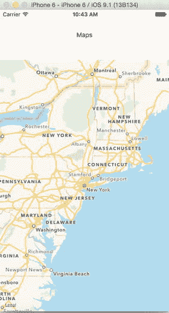

图 5-1。

GeoLocation MapView

### 查看地理地图代码

现在让我们了解一下我们在程序的这一部分做了什么。

`var {`

`AppRegistry,`

`StyleSheet,`

`Text,`

`View,`

`MapView`

`} = React;`

在这里，我们首先包括 React 本地组件`MapView, which`是访问位置服务的关键。接下来，我们将创建利用 MapView 的地理定位组件:

`var GeoLocationMap = React.createClass({`

`getInitialState: function() {`

`return {`

`region: {`

`latitude: 40.712784,`

`longitude: -74.005941,`

`latitudeDelta: 10,`

`longitudeDelta: 10,`

`},`

`};`

`},`

`render: function() {`

`return (`

`<View style={styles.container}>`

`<View style={styles.desc}>`

`<Text> Maps </Text>`

`</View>`

`<MapView`

`style={styles.map}`

`region={this.state.region}`

`/>`

`</View>`

`);`

`}`

`});`

在这里，我们用特定的纬度和经度参数设置了该区域的初始状态，稍后当我们用 MapView 组件呈现该函数时将会设置这些参数。在 MapView 组件中，我们使用 region prop，它提供了 latitude、longitudeDelta 和 latitudeDelta。这些应该总是数字(整数或浮点数)，它们帮助我们在地图上绘制特定的区域。最后，我们用 Flex 添加了一些样式，并注册了我们的组件。

### 在地图上添加注记

接下来，让我们向应用添加注释，并用新的状态注释更新 getInitialState，该状态注释包含纬度、经度、标题和副标题等参数:

`getInitialState: function() {`

`return {`

`region: {`

`latitude: 40.712784,`

`longitude: -74.005941,`

`latitudeDelta: 10,`

`longitudeDelta: 10,`

`},`

`annotations: [{`

`latitude: 40.72052634,`

`longitude:  -73.97686958312988,`

`title: 'New York',`

`subtitle: 'This is cool!'`

`}],`

`};`

`},`

现在用名为 annotations 的新属性更新 MapView 组件:

`<MapView`

`style={styles.map}`

`region={this.state.region}`

`annotations= {this.state.annotations}`

`/>`

除了提到的值，注释属性还可以有以下附加参数:

`annotations [{latitude: number, longitude: number, animateDrop: bool, title: string, subtitle: string, hasLeftCallout: bool, hasRightCallout: bool, onLeftCalloutPress: function, onRightCalloutPress: function, id: string}] #`

让我们刷新一下，看看图 [5-2](#Fig2) 所示的变化。

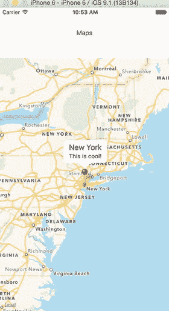

图 5-2。

MapView with added parameters

### 显示当前位置的纬度和经度

在我们地理定位应用的最后一部分，我们将在视图上显示我们当前的纬度和经度。在前面的例子中，我们有一个固定的位置；在这一部分，我们将实时飞往我们当前的位置。这听起来很令人兴奋，所以让我们开始建造吧。有两种方法可以在我们的地图上查看当前位置。一种方法是简单地将 showsUserLocation={true}添加到 MapView 组件中。

另一种方法是使用 NSLocationWhenInUseUsageDescription 地理位置。我们将需要更新 info.plist 来添加这个键，但是当您使用`react-native init`创建一个项目时，它是默认启用的。

用以下代码替换 index.ios.js:

`'use strict';`

`var React = require('react-native');`

`var {`

`AppRegistry,`

`StyleSheet,`

`Text,`

`View,`

`MapView`

`} = React;`

`var GeoLocationMap = React.createClass({`

`getInitialState: function() {`

`return {`

`region: {`

`latitude: 40.712784,`

`longitude: -74.005941,`

`latitudeDelta: 10,`

`longitudeDelta: 10,`

`},`

`annotations: [{`

`latitude: 40.72052634,`

`longitude:  -73.97686958312988,`

`title: 'New York',`

`subtitle: 'This is cool!'`

`}],`

`};`

`},`

`componentDidMount: function() {`

`navigator.geolocation.getCurrentPosition(`

`(initialPosition) => this.setState({initialPosition}),`

`(error) => alert(error.message),`

`{enableHighAccuracy: true, timeout: 20000, maximumAge: 1000}`

`);`

`this.watchID = navigator.geolocation.watchPosition((lastPosition) => {`

`this.setState({latitude: lastPosition.coords.latitude});`

`this.setState({longitude: lastPosition.coords.longitude});`

`var newRegion = {`

`latitude: lastPosition.coords.latitude,`

`longitude: lastPosition.coords.longitude,`

`latitudeDelta: 10,`

`longitudeDelta: 10,`

`}`

`this.setState({  region: newRegion});`

`this.setState({  annotations: [{`

`latitude: lastPosition.coords.latitude,`

`longitude: lastPosition.coords.longitude,`

`title: 'Current Location',`

`subtitle: 'You are here'`

`}]});`

`});`

`},`

`componentWillUnmount: function() {`

`navigator.geolocation.clearWatch(this.watchID);`

`},`

`render: function() {`

`return (`

`<View style={styles.container}>`

`<View style={styles.desc}>`

`<Text>`

`latitude:  {this.state.latitude}`

`</Text>`

`<Text>`

`longitude: {this.state.longitude}`

`</Text>`

`</View>`

`<MapView`

`style={styles.map}`

`region={this.state.region}`

`annotations= {this.state.annotations}`

`/>`

`</View>`

`);`

`}`

`});`

`var styles = StyleSheet.create({`

`container: {`

`flex: 1,`

`flexDirection: 'column',`

`backgroundColor: '#F5FCFF',`

`alignItems: 'stretch'`

`},`

`desc: {`

`flex: 1,`

`alignItems: 'center',`

`justifyContent: 'center'`

`},`

`map: {`

`flex: 5,`

`},`

`});`

`AppRegistry.registerComponent('GeoLocationMap', () => GeoLocationMap);`

现在构建我们的应用，将其加载到图 [5-3](#Fig3) 所示的 iOS 模拟器上。

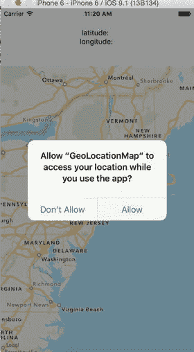

图 5-3。

Access location prompt

如果我们允许这个请求，我们将飞到我们代码中提到的位置；在这种情况下，它是加利福尼亚(图 [5-4](#Fig4) )。

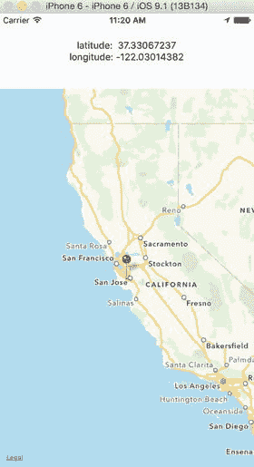

图 5-4。

Fly to a specified location in the code

调试地理定位应用时还有一个额外的步骤。如前所述，在本例中，我们将飞往当前位置。我们已经保存了该需求，以便现在可以完成它。使用 Ctrl + Command + z 打开调试菜单，选择“在 Chrome 中调试”选项，如图 [5-5](#Fig5) 所示。

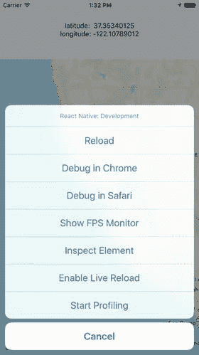

图 5-5。

Select debug in chrome option

一旦你点击“在 Chrome 中调试”，你将得到一个弹出窗口，允许你的位置被提供给 iOS 模拟器应用，如图 [5-6](#Fig6) 所示。

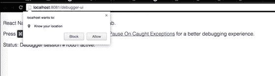

图 5-6。

Allow the present location to be shared with the iOS simulator

一旦你允许这样做，你将移动到你在应用中的当前位置(图 [5-7](#Fig7) )。

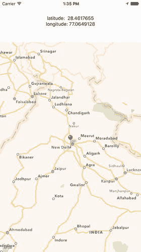

图 5-7。

Current location is now shown

#### 查看当前位置的地理位置代码

让我们回顾一下我们在本例中编写的程序。

`componentDidMount: function() {`

`navigator.geolocation.getCurrentPosition(`

`(initialPosition) => this.setState({initialPosition}),`

`(error) => alert(error.message),`

`{enableHighAccuracy: true, timeout: 20000, maximumAge: 1000}`

`);`

`this.watchID = navigator.geolocation.watchPosition((lastPosition) => {`

`this.setState({latitude: lastPosition.coords.latitude});`

`this.setState({longitude: lastPosition.coords.longitude});`

`var newRegion = {`

`latitude: lastPosition.coords.latitude,`

`longitude: lastPosition.coords.longitude,`

`latitudeDelta: 10,`

`longitudeDelta: 10,`

`}`

这里，在 componentDidMount 中，我们首先获取当前位置；默认情况下，iOS 模拟器会给我们一个默认值，您可以使用调试➤位置来更改它。如果 navigator . geolocation . getcurrentposition 确实获得了值，那么我们设置各种状态及其参数。在这个例子中，我们有位于视图顶部的纬度和经度描述，并使用 this.setState({latitude :})和 this.setState({longitude:})进行设置。它下面的地图是用 newRegion 绘制的。

`this.setState({  region: newRegion});`

`this.setState({  annotations: [{`

`latitude: lastPosition.coords.latitude,`

`longitude: lastPosition.coords.longitude,`

`title: 'Current Location',`

`subtitle: 'You are here'`

`}]});`

`});`

`},`

每当状态改变时，我们使用 React 的强大功能来重新呈现组件。使用上面的代码片段，我们将使用更新的坐标重新渲染 newRegion。

`componentWillUnmount: function() {`

`navigator.geolocation.clearWatch(this.watchID);`

`},`

使用 componentWillUnmount，我们将清除 navigator.geolocation，以防我们移动到应用的其他部分。

`render: function() {`

`return (`

`<View style={styles.container}>`

`<View style={styles.desc}>`

`<Text>`

`latitude:  {this.state.latitude}`

`</Text>`

`<Text>`

`longitude: {this.state.longitude}`

`</Text>`

`</View>`

`<MapView`

`style={styles.map}`

`region={this.state.region}`

`annotations= {this.state.annotations}`

`/>`

`</View>`

`);`

`}`

`});`

最后，我们在视图上呈现组件，纬度和经度描述具有各自的样式，更新的 MapView 组件具有各自的样式、区域映射和注释。

## 异步存储

AsyncStorage 是一个基于键值的存储系统。它可以很容易地实现，并在全球范围内提供给应用。这个持久性系统简单且异步，也是存储数据的推荐方式。

让我们创建一个 AsyncStorage 示例应用；为此，请执行以下命令:

`$react-native init AsyncStorage`

很好，现在让我们在 index.ios.js 中添加以下代码

`'use strict'` `;`

`var React``= require(``'react-native'`T3】

`var` `{`

`AppRegistry` `,`

`StyleSheet` `,`

`Text` `,`

`View` `,`

`TextInput` `,`

`TouchableHighlight` `,`

`AsyncStorage`

`} =``React`T2】

`var STORAGE_KEY``=``'@AsyncStorageExample:someKey'`T3】

`var AsyncStorageExample` `=` `React` `.` `createClass`

`getInitialState:``function`T2】

`return` `{`

`messages``:``''`T3】

`textInputMessage``:`T2】

`};`

`},`

`componentDidMount() {`

`AsyncStorage``.getItem(``STORAGE_KEY`T3】

`this` `.addMessage(value);`

`}).done();`

`},`

`addMessage(message) {`

`this``.setState({``messages`T3】

`},`

`updateStorage () {`

`AsyncStorage``.setItem(``STORAGE_KEY``,``this``.``state``.``textInputMessage``);`

`AsyncStorage``.getItem(``STORAGE_KEY`T3】

`this` `.addMessage(value);`

`}).done();`

`},`

`render:``function`T2】

`return` `(`

`<``View style=``{``styles``.``container`T6】

`<``View style=``{``styles``.``form`T6】

`<``TextInput style=``{``styles``.``textField`T6】

`onChangeText=` `{(textInputMessage) =>` `this` `.setState({` `textInputMessage`

`value=` `{` `this` `.` `state` `.` `textInputMessage` `}/>`

`<``TouchableHighlight style=``{``styles``.``button``}``onPress=``{``this``.updateStorage}>`

`<``Text``> Update Storage </``Text`T4】

`</``TouchableHighlight`T2】

`</``View`T2】

`<``View style=``{``styles``.``message`T6】

`<``Text``> Text from local storage:</``Text`T4】

`<``Text``>{``this``.``state``.``messages``} </``Text``>`

`</``View`T2】

`</``View`T2】

`);`

`}`

`});`

`var styles``=``StyleSheet`T3】

`container` `: {`

`flex` `: 1,`

`justifyContent``:``'center'`T3】

`alignItems``:``'center'`T3】

`backgroundColor``:``'#F5FCFF'`T3】

`},`

`form` `: {`

`flex` `: 1,`

`justifyContent``:``'center'`T3】

`alignItems``:`T2】

`},`

`textField` `: {`

`height` `: 40,`

`borderColor``:``'gray'`T3】

`borderWidth` `: 1,`

`width` `: 180},`

`message` `: {`

`flex` `: 1,`

`alignItems``:`T2】

`},`

`button` `: {`

`backgroundColor``:``'#05A5D1'`T3】

`marginTop` `: 10,`

`height` `: 40,`

`width` `: 180,`

`alignItems``:``'center'`T3】

`justifyContent``:`T2】

`}`

`});`

`AppRegistry` `.registerComponent(` `'AsyncStorage'` `, () =>` `AsyncStorageExample`

让我们用 Xcode 构建我们的应用来看看结果。您可以在如图 [5-8](#Fig8) 所示的文本框中输入文本，然后点击“更新存储”

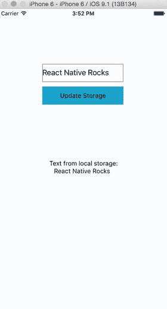

图 5-8。

Storage is updated

完成后，刷新结果，如图 [5-9](#Fig9) 所示。

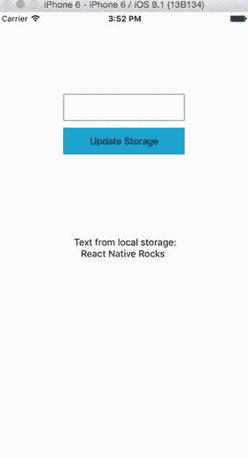

图 5-9。

Text from the async storage mechanism

这次“来自本地存储的文本”下面的文本来自异步存储机制，这是我们已经设置好的。

### 查看异步存储代码

在本例中，我们已经将 AsyncStorage 默认组件包含在我们的用于此应用的组件列表中。

`var React``= require(``'react-native'`T3】

`var` `{`

`AppRegistry` `,`

`StyleSheet` `,`

`Text` `,`

`View` `,`

`TextInput` `,`

`TouchableHighlight` `,`

`AsyncStorage`

`} =``React`T2】

`var STORAGE_KEY``=``'@AsyncStorageExample:someKey'`T3】

我们将在 AsyncStorageExample 组件中使用这个 AsyncStorage React 组件。上面，我们还指定了一个键，我们将在异步存储中使用它。

在我们的 AsyncStorageExample 组件中，我们设置了 getInitialState 和 componentDidMount 方法，还创建了 addMessage 和 updateStorage。让我们逐一讨论。

`getInitialState:``function`T2】

`return` `{`

`messages``:``''`T3】

`textInputMessage``:`T2】

`};`

`},`

在 getInitialState 中，我们为 messages & textInputMessages 指定了空白值，当它们的状态改变时，我们将不断更新这些值。

`componentDidMount() {`

`AsyncStorage``.getItem(``STORAGE_KEY`T3】

`this` `.addMessage(value);`

`}).done();`

`},`

使用 componentDidMount AsyncStorage，getItem 方法将加载 addMessage 值。这仅在初始渲染时调用，并负责在我们更新存储并再次刷新应用后，显示“来自本地存储的文本”下方的文本。

`addMessage(message) {`

`this``.setState({``messages`T3】

`},`

每当 addMessage 方法被触发时，它就用新的更新值更新消息状态。

`updateStorage () {`

`AsyncStorage``.setItem(``STORAGE_KEY``,``this``.``state``.``textInputMessage``);`

`AsyncStorage``.getItem(``STORAGE_KEY`T3】

`this` `.addMessage(value);`

`}).done();`

`},`

更新存储更新永久保存的异步存储值。

`render:``function`T2】

`return` `(`

`<``View style=``{``styles``.``container`T6】

`<``View style=``{``styles``.``form`T6】

`<``TextInput style=``{``styles``.``textField`T6】

`onChangeText=` `{(textInputMessage) =>` `this` `.setState({` `textInputMessage`

`value=` `{` `this` `.` `state` `.` `textInputMessage` `}/>`

`<``TouchableHighlight style=``{``styles``.``button``}``onPress=``{``this``.updateStorage}>`

`<``Text``> Update Storage </``Text`T4】

`</``TouchableHighlight`T2】

`</``View`T2】

`<``View style=``{``styles``.``message`T6】

`<``Text``> Text from local storage:</``Text`T4】

`<``Text``>{``this``.``state``.``messages``} </``Text``>`

`</``View`T2】

`</``View`T2】

`);`

`}`

`});`

使用上面的代码，我们设置了 AsyncStorageExample 组件的各个部分。在这里，我们可以更改文本输入字段来更新 textInputMessage 状态。我们还有一个用于 TouchableHighlight 组件的 onPress prop，它调用 updatedStorage 方法并永久保存值。最后，我们通过访问消息的当前状态来显示保存的消息。

`var styles``=``StyleSheet`T3】

`container` `: {`

`flex` `: 1,`

`justifyContent``:``'center'`T3】

`alignItems``:``'center'`T3】

`backgroundColor``:``'#F5FCFF'`T3】

`},`

`form` `: {`

`flex` `: 1,`

`justifyContent``:``'center'`T3】

`alignItems``:`T2】

`},`

`textField` `: {`

`height` `: 40,`

`borderColor``:``'gray'`T3】

`borderWidth` `: 1,`

`width` `: 180},`

`message` `: {`

`flex` `: 1,`

`alignItems``:`T2】

`},`

`button` `: {`

`backgroundColor``:``'#05A5D1'`T3】

`marginTop` `: 10,`

`height` `: 40,`

`width` `: 180,`

`alignItems``:``'center'`T3】

`justifyContent``:`T2】

`}`

`});`

`AppRegistry` `.registerComponent(` `'AsyncStorage'` `, () =>` `AsyncStorageExample`

最后，我们用一些不言自明的 Flex 设置建立了一个用户界面样式，并注册了我们的 AsyncStorageExample 组件。

## 本地警报

警报用于向应用用户提供重要信息。就 iOS 而言，只有在警报视图中选择选项后，我们才能进一步使用该应用。或者，我们可以提供一个按钮列表。点击任何按钮都会触发相应的 onPress 回调并解除警报。默认情况下，只有一个按钮。

让我们创建一个项目来了解更多关于本机警报的信息:

`$react-native init NativeAlert`

React Native 为创建警告框提供了一个组件警告。让我们创建一个按钮，点击时会打开一个警告框。

使用以下代码更新 index.ios.js:

`'use strict';`

`var React = require('react-native');`

`var {`

`AppRegistry,`

`StyleSheet,`

`Text,`

`View,`

`TouchableHighlight,`

`AlertIOS`

`} = React;`

`var NativeAlert = React.createClass({`

`render: function() {`

`return (`

`<View style={styles.container}>`

`<TouchableHighlight style={styles.wrapper}`

`onPress={() => AlertIOS.alert(`

`'Alert Title',`

`'Alert Message'`

`)}>`

`<View style={styles.button}>`

`<Text style={styles.buttonText}>Click me !!</Text>`

`</View>`

`</TouchableHighlight>`

`</View>`

`);`

`}`

`});`

`var styles = StyleSheet.create({`

`container: {`

`flex: 1,`

`justifyContent: 'center',`

`alignItems: 'center',`

`backgroundColor: '#FFFFFF',`

`},`

`button: {`

`backgroundColor: '#659EC7',`

`padding: 10,`

`margin: 10`

`},`

`buttonText: {`

`color: '#FFFFFF'`

`}`

`});`

`AppRegistry.registerComponent('NativeAlert', () => NativeAlert);`

让我们构建应用并在模拟器中测试它。图 [5-10](#Fig10) 显示了结果。

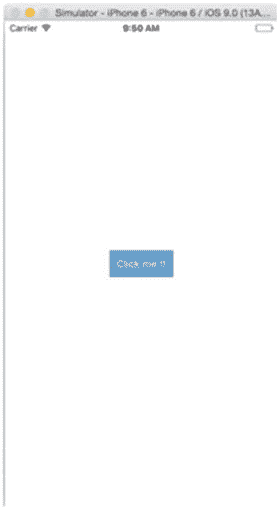

图 5-10。

This button will open an alert box when clicked

轻点“点击我！!"按钮看到如图 [5-11](#Fig11) 所示的警告框。

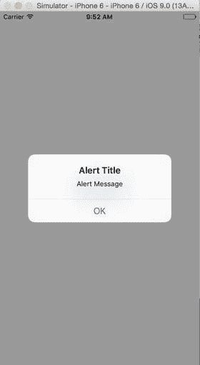

图 5-11。

The Alert box appears

### 查看 NativeAlert 代码

创建新的 NativeAlert 项目后，我们创建了一个新的组件 NativeAlert:

`var NativeAlert = React.createClass({`

`render: function() {`

`return (`

`<View style={styles.container}>`

`<TouchableHighlight style={styles.wrapper}`

`onPress={() => AlertIOS.alert(`

`'Alert Title',`

`'Alert Message'`

`)}>`

`<View style={styles.button}>`

`<Text style={styles.buttonText}>Click me !!</Text>`

`</View>`

`</TouchableHighlight>`

`</View>`

`);`

`}`

`});`

在组件 NativeAlert 中，我们使用了 onPress 回调。方法 alert 传递字符串“Alert Title”和“Alert Message ”,这将产生一个具有标题、消息和按钮的警告框。AlertIOS 提供了两种方式:预警和提示。

`static alert(title: string, message?: string, buttons?: Array<{ text: ?string; onPress?: ?Function; }>, type?: string)`

`static prompt(title: string, value?: string, buttons?: Array<{ text: ?string; onPress?: ?Function; }>, callback?: Function)`

最后，我们在下面的部分中添加了一些样式，并用 AppRegistry 注册了我们的根组件。

`var styles = StyleSheet.create({`

`container: {`

`flex: 1,`

`justifyContent: 'center',`

`alignItems: 'center',`

`backgroundColor: '#FFFFFF',`

`},`

`button: {`

`backgroundColor: '#659EC7',`

`padding: 10,`

`margin: 10`

`},`

`buttonText: {`

`color: '#FFFFFF'`

`}`

`});`

`AppRegistry.registerComponent('NativeAlert', () => NativeAlert);`

### 扩展 NativeAlert 示例

现在，让我们在应用中添加更多按钮，替换 index.ios.js 中 NativeAlert 组件的以下代码:

`var NativeAlert = React.createClass({`

`getInitialState: function(){`

`return{`

`textForButton: 'Button text will come here'`

`}`

`},`

`render: function() {`

`return (`

`<View style={styles.container}>`

`<TouchableHighlight style={styles.wrapper}`

`onPress={() => AlertIOS.alert(`

`'Alert Title',`

`'Alert Message'`

`)}>`

`<View style={styles.button}>`

`<Text style={styles.buttonText}>Click me !!</Text>`

`</View>`

`</TouchableHighlight>`

`<TouchableHighlight style={styles.wrapper}`

`onPress={() => AlertIOS.alert(`

`'Alert Title',`

`'Alert Message',`

`[`

`{text: 'Button 1', onPress: () => this.setState({textForButton: 'Button 1 clicked'})},`

`{text: 'Button 2', onPress: () => this.setState({textForButton: 'Button 2 clicked'})}`

`]`

`)}>`

`<View style={styles.button}>`

`<Text style={styles.buttonText}>Alert with Buttons !!</Text>`

`</View>`

`</TouchableHighlight>`

`<Text> {this.state.textForButton} </Text>`

`</View>`

`);`

`}`

`});`

让我们刷新一下视图，看看图 [5-12](#Fig12) 中的变化。

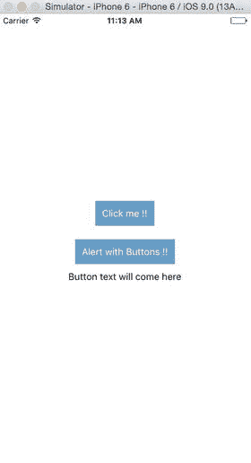

图 5-12。

“Alert with Buttons !!” has been added

点击“带按钮的警报！!"如图 [5-13](#Fig13) 所示的结果。

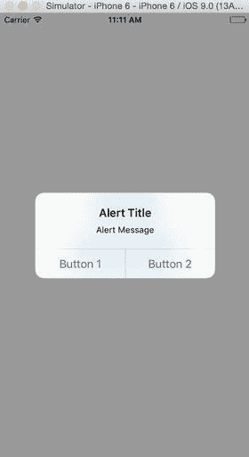

图 5-13。

Select Button 1 or 2

在图 [5-14](#Fig14) 中，主页显示点击了哪个按钮。

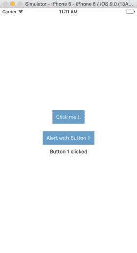

图 5-14。

Button 1 was clicked

### 查看扩展的 NativeAlert 示例代码

现在，让我们了解一下我们在这个更新的 NativeAlert 组件中做了什么:

`var NativeAlert = React.createClass({`

`getInitialState: function(){`

`return{`

`textForButton: 'Button text will come here'`

`}`

`},`

`render: function() {`

`return (`

`<View style={styles.container}>`

`<TouchableHighlight style={styles.wrapper}`

`onPress={() => AlertIOS.alert(`

`'Alert Title',`

`'Alert Message'`

`)}>`

`<View style={styles.button}>`

`<Text style={styles.buttonText}>Click me !!</Text>`

`</View>`

`</TouchableHighlight>`

`<TouchableHighlight style={styles.wrapper}`

`onPress={() => AlertIOS.alert(`

`'Alert Title',`

`'Alert Message',`

`[`

`{text: 'Button 1', onPress: () => this.setState({textForButton: 'Button 1 clicked'})},`

`{text: 'Button 2', onPress: () => this.setState({textForButton: 'Button 2 clicked'})}`

`]`

`)}>`

`<View style={styles.button}>`

`<Text style={styles.buttonText}>Alert with Buttons !!</Text>`

`</View>`

`</TouchableHighlight>`

`<Text> {this.state.textForButton} </Text>`

`</View>`

`);`

`}`

`});`

这里，我们用状态 textForButton 设置了 getInitialState 方法，稍后我们将使用我们单击的按钮更新它。轻敲“带按钮的警报！!"button 触发一个 onPress 回调，该回调使用 AlertIOS 的 alert 方法为我们的警告框设置标题、消息和按钮。在 NativeAlert 组件的这一部分中，我们有两个按钮，它们的“textForButton”状态在执行 onPress 回调时用所需的文本更新。

## 网络视图

在本节中，我们将使用 React Native 创建一个 shell 来加载 WebView 中的任何 URL。让我们从生成应用结构开始:

`$ react-native init WebviewShell`

接下来，打开 index.ios.js 文件，将其代码替换为以下内容:

`'use strict';`

`var React = require('react-native');`

`var {`

`AppRegistry,`

`StyleSheet,`

`Text,`

`View,`

`WebView`

`} = React;`

`var WebviewShell = React.createClass({`

`render: function() {`

`return (`

`<View style={styles.container}>`

`<WebView url={'`[`https://www.facebook.com/`](https://www.facebook.com/)T2】

`</View>`

`);`

`}`

`});`

`var styles = StyleSheet.create({`

`container: {`

`flex: 1`

`}`

`});`

`AppRegistry.registerComponent('WebviewShell', () => WebviewShell);`

让我们用 Xcode 构建我们的 WebviewShell 应用，并在 iOS simulator 中加载，以查看如图 [5-15](#Fig15) 所示的结果。

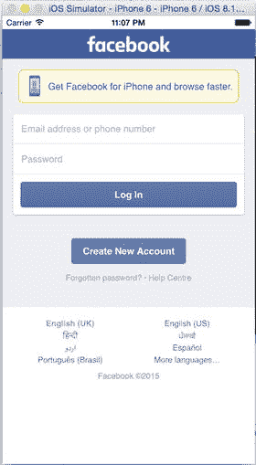

图 5-15。

WebView with a URL

### 查看 WebView 代码

在本例中，我们创建了一个返回视图的组件 WebviewShell。下面的代码创建了一个视图，在 WebView 中加载了我们想要的 URL。

`var WebviewShell = React.createClass({`

`render: function() {`

`return (`

`<View style={styles.container}>`

`<WebView url={'`[`https://www.facebook.com/`](https://www.facebook.com/)T2】

`</View>`

`);`

`}`

`});`

## 动画片

流畅、有意义的动画对于创造令人惊叹的用户体验至关重要。在本节中，我们将使用 React 本地动画 API 来实现这一点。React Native 的动画围绕着两个互补的系统:LayoutAnimation 用于制作全局布局事务的动画，以及用于对特定属性进行更细粒度控制的动画。

动画库旨在以简单高效的方式制作各种令人惊叹的动画，并与您的应用进行交互。动画库侧重于两者之间的可配置转换，具有输入和输出之间的声明性关系，以及基于时间控制动画的简单起止方法。

让我们通过创建一个 AnimationExample React 原生项目的示例来了解这个库:

`$react-native init AnimationExample`

将以下代码添加到 index.ios.js 中:

`'use strict';`

`var React = require('react-native');`

`var {`

`AppRegistry,`

`StyleSheet,`

`Text,`

`View,`

`} = React;`

`var AnimationExample = React.createClass({`

`render: function() {`

`return (`

`<View style={styles.container}>`

`<View`

`style={{`

`backgroundColor: '#DC143C',`

`flex: 1`

`}} />`

`<View`

`style={{`

`backgroundColor: '#1E90FF',`

`flex: 1,`

`}} />`

`</View>`

`);`

`}`

`});`

`var styles = StyleSheet.create({`

`container: {`

`flex: 1,`

`flexDirection: 'column'`

`},`

`});`

`AppRegistry.registerComponent('AnimationExample', () => AnimationExample);`

用 Xcode 构建项目，将其加载到 iOS 模拟器上。图 [5-16](#Fig16) 显示了两个彩盒。

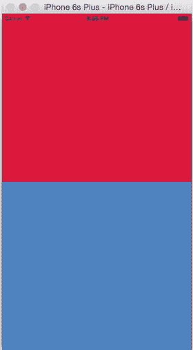

图 5-16。

The project now has a red and blue box

现在让我们添加一些动画。使用以下代码更新 index.ios.js:

`'use strict';`

`var React = require('react-native');`

`var {`

`AppRegistry,`

`StyleSheet,`

`Text,`

`View,`

`Animated`

`} = React;`

`var AnimationExample = React.createClass({`

`getInitialState: function() {`

`return {`

`bounceValue: new Animated.Value(0)`

`};`

`},`

`componentDidMount() {`

`this.state.bounceValue.setValue(1.5);`

`Animated.spring(`

`this.state.bounceValue,`

`{`

`toValue: 0.8,`

`friction: 1,`

`}`

`).start();`

`},`

`render: function() {`

`return (`

`<View style={styles.container}>`

`<Animated.View`

`style={{`

`backgroundColor: '#DC143C',`

`flex: 1,`

`transform: [`

`{scale: this.state.bounceValue},`

`]`

`}} />`

`<View`

`style={{`

`backgroundColor: '#1E90FF',`

`flex: 1,`

`}} />`

`</View>`

`);`

`}`

`});`

`var styles = StyleSheet.create({`

`container: {`

`flex: 1,`

`flexDirection: 'column'`

`},`

`});`

`AppRegistry.registerComponent('AnimationExample', () => AnimationExample);`

我们来刷新一下看看有什么变化(图 [5-17](#Fig17) )。

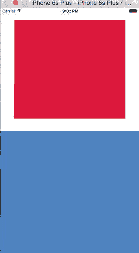

图 5-17。

The red box in the upper half now has a bounce effect in it

很好，现在让我们在下半部分添加一些动画。使用以下代码更新 index.ios.js:

`'use strict';`

`var React = require('react-native');`

`var {`

`AppRegistry,`

`StyleSheet,`

`Text,`

`View,`

`Animated`

`} = React;`

`var AnimationExample = React.createClass({`

`getInitialState: function() {`

`return {`

`bounceValue: new Animated.Value(0),`

`fadeAnim: new Animated.Value(0)`

`};`

`},`

`componentDidMount() {`

`this.state.bounceValue.setValue(1.5);`

`Animated.spring(`

`this.state.bounceValue,`

`{`

`toValue: 0.8,`

`friction: 1,`

`}`

`).start();`

`Animated.timing(`

`this.state.fadeAnim,`

`{`

`toValue: 1,`

`duration: 2000,`

`},`

`).start();`

`},`

`render: function() {`

`return (`

`<View style={styles.container}>`

`<Animated.View`

`style={{`

`backgroundColor: '#DC143C',`

`flex: 1,`

`transform: [`

`{scale: this.state.bounceValue},`

`]`

`}} />`

`<Animated.View`

`style={{`

`backgroundColor: '#1E90FF',`

`flex: 1,`

`opacity: this.state.fadeAnim,`

`}} />`

`</View>`

`);`

`}`

`});`

`var styles = StyleSheet.create({`

`container: {`

`flex: 1,`

`flexDirection: 'column'`

`},`

`});`

`AppRegistry.registerComponent('AnimationExample', () => AnimationExample);`

图 [5-18](#Fig18) 显示了这些变化。

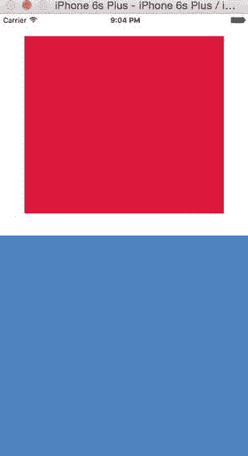

图 5-18。

Now there is a bounce in the upper half of the screen and fading animation in the bottom half

现在让我们进入代码，看看我们在这里做了什么。

### 查看动画代码

在这个例子的第一部分，我们已经创建了 AnimationExample 组件，它有一个分割，有两个部分，我们将在后面的动画中使用。我们还没有使用任何默认的 React 本地组件。

接下来，我们添加了在我们的示例中使用的必要组件。

`'use strict';`

`var React = require('react-native');`

`var {`

`AppRegistry,`

`StyleSheet,`

`Text,`

`View,`

`Animated`

`} = React;`

在这里，我们添加了一个动画 React 本地默认组件，这对于我们的示例的各个片段中的动画是必需的。现在，让我们了解如何用两个不同的动画来塑造我们的 AnimationExample 组件。

`var AnimationExample = React.createClass({`

`getInitialState: function() {`

`return {`

`bounceValue: new Animated.Value(0),`

`fadeAnim: new Animated.Value(0)`

`};`

`},`

通过 getInitialState，我们为 bounceValue 和 fadeAnim 设置了一个初始状态，bounce value 将用于上半部分的反弹效果，fade anim 将为下半部分添加渐变动画。最初两者都设置为 0。

`componentDidMount() {`

`this.state.bounceValue.setValue(1.5);`

`Animated.spring(`

`this.state.bounceValue,`

`{`

`toValue: 0.8,`

`friction: 1,`

`}`

`).start();`

`Animated.timing(`

`this.state.fadeAnim,`

`{`

`toValue: 1,`

`duration: 2000,`

`},`

`).start();`

`},`

使用 componentDidMount，我们将 bounceValue 的值设置为具有弹簧效果。我们还为 fadeAnim 设置了一个值，这样它的淡入淡出效果就有了一定的定时。两者都在应用加载时立即启动。

`render: function() {`

`return (`

`<View style={styles.container}>`

`<Animated.View`

`style={{`

`backgroundColor: '#DC143C',`

`flex: 1,`

`transform: [`

`{scale: this.state.bounceValue},`

`]`

`}} />`

`<Animated.View`

`style={{`

`backgroundColor: '#1E90FF',`

`flex: 1,`

`opacity: this.state.fadeAnim,`

`}} />`

`</View>`

`);`

`}`

`});`

接下来，我们在应用的特定部分渲染我们的动画。在第一个容器中，我们设置反弹效果，在第二个容器中，我们有渐隐动画。

`var styles = StyleSheet.create({`

`container: {`

`flex: 1,`

`flexDirection: 'column'`

`},`

`});`

`AppRegistry.registerComponent('AnimationExample', () => AnimationExample);`

最后，我们有了更多的灵活样式，并注册了我们的 AnimationExample 组件。

如前所述，React Native 的动画有两个系统动画和布局动画。我们已经详细介绍了动画，作为一个练习，用同样的例子来探索布局动画。

## 摘要

在本章中，我们了解了 iOS 设备的功能，不仅仅是用户界面。我们了解了如何为您的应用使用地理定位和加载地图，如何使用 AsyncStorage 来保存数据，如何使用原生警报来共享应用中的重要信息，如何使用 WebView 来加载 HTML5 内容，以及如何使用动画。

在下一章，我们将学习如何与后端服务器交互，因为可能没有一个真实世界的应用是不完整的，除非连接到后端。