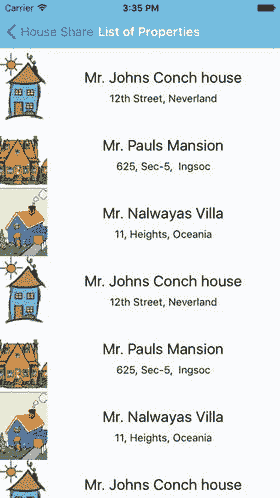
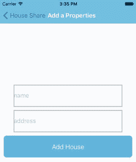
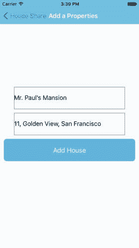
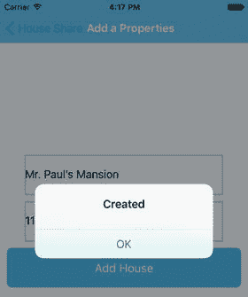

# 六、与服务器通信

“交流是每个人解决一切问题的灵丹妙药。”—汤姆·彼得斯

在通过多个示例了解了设备功能的强大后，是时候回到您的住房应用了。到目前为止，您已经在本地用一些虚拟数据填充了您的应用，但是没有一个应用可以在不与服务器通信的情况下存活。在本章中，您将学习如何与网络 API 交互。您将探索以下主题:

*   XMLHttpRequest
*   WebSocket
*   取得
*   从服务器获取数据
*   向服务器发布数据

之前，您从一个虚拟数据对象获取所有数据，该对象在您的应用中是静态的。任何生产应用完全使用静态数据的机会都很少。令人高兴的是，React Native 提供了许多与网络 API 交互的方式。以下部分介绍了 React Native 中支持网络栈的方式。

## XMLHttpRequest

XMLHttpRequestis 是一个 API，它提供了在客户机和服务器之间传输数据的能力。它提供了一种从 URL 中检索数据的简单方法，而不必刷新整个页面。在 React Native 中，XMLHttpRequest API 应用于 iOS 网络 API 之上。与 Web 的一个显著区别是安全模型；你可以从互联网上的任何网站上阅读，因为没有 CORS 的概念。

`var xhttp= new XMLHttpRequest();`

`xhttp.onreadystatechange = (e) => {`

`if (xhttp.readyState !== 4) {`

`return;`

`}`

`if (xhttp.status === 200) {`

`console.log('success', xhttp.responseText);`

`} else {`

`console.warn('error');`

`}`

`};`

`xhttp.open('GET', '``https://example.com/myendpoint.php`T2】

`request.send();`

使用 XMLHttpRequest 相当繁琐。但是由于它与浏览器 API 兼容，它允许您直接从 npm 使用第三方库，如 Parse。有关该 API 的更多信息，请参考其在 [`https://developer.mozilla.org/en-US/docs/Web/API/XMLHttpRequest`](https://developer.mozilla.org/en-US/docs/Web/API/XMLHttpRequest) 的文档。

## WebSocket

WebSocket 是一种通过单一 TCP 连接提供全双工通信通道的协议。

`var ws = new WebSocket('ws://example.com/path');`

`ws.on('open', function() {`

`// connection opened`

`ws.send('example data');`

`});`

`ws.on('message', function(e) {`

`// a message received`

`console.log(e.data);`

`});`

`ws.on('error', function(e) {`

`// an error occurred`

`console.log(e.message);`

`});`

`ws.on('close', function(e) {`

`// connection closed`

`console.log(e.code, e.reason);`

`});`

## 取得

Fetch 是一个流行的网络 API。它是由一个标准委员会创建的，具有定义明确的请求、响应和绑定它们的过程。以下是一个带有`fetch`的 post 请求示例:

`fetch('``https://example.com/endpoint/`T2】

`method: 'POST',`

`headers: {`

`'Accept': 'application/json',`

`'Content-Type': 'application/json',`

`},`

`body: JSON.stringify({`

`firstParam: 'yourValue',`

`secondParam: 'otherValue',`

`})`

`})`

Fetch 返回一个承诺，使用`then`和`catch`进行处理。

`fetch('https:// example.com/endpoint')`

`.then((response) => response.text())`

`.then((responseText) => {`

`console.log(responseText);`

`})`

`.catch((error) => {`

`console.warn(error);`

`});`

既然您已经知道了如何与网络 API 进行交互，那么让我们使用选项之一`fetch`来获取数据并将数据发送到服务器。为了保持简单，我们托管了一个带有 restful APIs 的简单后端服务器，您可以为您的应用使用这些 API。

我们将使用以下网址获取和发布数据到后端服务器。您可以使用`curl`来查看向这些 URL 发出请求后得到的响应。

要获取属性的初始种子列表:

`$curl '`[`http://www.akshatpaul.com/list-all-properties`](http://www.akshatpaul.com/list-all-properties)T2】

`[`

`{`

`name: "Mr. Johns Conch house",`

`address: "12th Street, Neverland",`

`images: {`

`thumbnail: "`[`http://hmp.me/ol5`](http://hmp.me/ol5)T2】

`}`

`},`

`{`

`name: "Mr. Pauls Mansion",`

`address: "625, Sec-5, Ingsoc",`

`images: {`

`thumbnail: "`[`http://hmp.me/ol6`](http://hmp.me/ol6)T2】

`}`

`},`

`{`

`name: "Mr. Nalwayas Villa",`

`address: "11, Heights, Oceania",`

`images: {`

`thumbnail: "`[`http://hmp.me/ol7`](http://hmp.me/ol7)T2】

`}`

`},`

`{`

`name: "Mr. Johns Conch house",`

`address: "12th Street, Neverland",`

`images: {`

`thumbnail: "`[`http://hmp.me/ol5`](http://hmp.me/ol5)T2】

`}`

`},`

`{`

`name: "Mr. Pauls Mansion",`

`address: "625, Sec-5, Ingsoc",`

`images: {`

`thumbnail: "`[`http://hmp.me/ol6`](http://hmp.me/ol6)T2】

`}`

`},`

`{`

`name: "Mr. Nalwayas Villa",`

`address: "11, Heights, Oceania",`

`images: {`

`thumbnail: "`[`http://hmp.me/ol7`](http://hmp.me/ol7)T2】

`}`

`},`

`{`

`name: "Mr. Johns Conch house",`

`address: "12th Street, Neverland",`

`images: {`

`thumbnail: "`[`http://hmp.me/ol5`](http://hmp.me/ol5)T2】

`}`

`},`

`{`

`name: "Mr. Pauls Mansion",`

`address: "625, Sec-5, Ingsoc",`

`images: {`

`thumbnail: "`[`http://hmp.me/ol6`](http://hmp.me/ol6)T2】

`}`

`},`

`{`

`name: "Mr. Nalwayas Villa",`

`address: "11, Heights, Oceania",`

`images: {`

`thumbnail: "`[`http://hmp.me/ol7`](http://hmp.me/ol7)T2】

`}`

`}`

`]`

要获取用户已保存的属性列表:

`$curl '`[`http://www.akshatpaul.com/list-properties`](http://www.akshatpaul.com/list-properties)T2】

要将数据发送到服务器以保存属性，请执行以下操作:

`url: '`[`http://www.akshatpaul.com/properties`](http://www.akshatpaul.com/properties)T2】

## 从服务器获取数据

首先，您需要来自我们服务器的一些固定数据来填充属性列表。将以下代码插入到`ListProperty.js`组件中:

`var React = require('react-native');`

`var {`

`Image,`

`StyleSheet,`

`Text,`

`View,`

`ListView,`

`AlertIOS`

`} = React;`

`var REQUEST_URL = '`[`http://www.akshatpaul.com/list-all-properties`](http://www.akshatpaul.com/list-all-properties)T2】

`var ListProperty = React.createClass({`

`getInitialState: function() {`

`var ds = new ListView.DataSource({rowHasChanged: (r1, r2) => r1 !== r2});`

`return {`

`dataSource: ds,`

`loaded: false`

`};`

`},`

`componentDidMount: function() {`

`this.fetchData();`

`},`

`fetchData: function() {`

`fetch(REQUEST_URL)`

`.then((response) => response.json())`

`.then((responseData) => {`

`console.log(responseData);`

`this.setState({`

`house: responseData,`

`dataSource: this.state.dataSource.cloneWithRows(responseData),`

`loaded: true`

`});`

`})`

`.catch((error) => {`

`AlertIOS.alert('No Donut for you');`

`loaded: true`

`})`

`.done();`

`},`

`render: function() {`

`if (!this.state.loaded) {`

`return this.renderLoadingView();`

`}`

`return (`

`<ListView`

`dataSource={this.state.dataSource}`

`renderRow={this.renderProperty}`

`style={styles.listView}/>`

`);`

`},`

`renderProperty: function(property) {`

`return (`

`<View style={styles.container}>`

`<Image`

`source={{uri: property.images.thumbnail}}`

`style={styles.thumbnail}/>`

`<View style={styles.rightContainer}>`

`<Text style={styles.name}>{property.name}</Text>`

`<Text style={styles.address}>{property.address}</Text>`

`</View>`

`</View>`

`);`

`},`

`renderLoadingView: function() {`

`return (`

`<View style={styles.container}>`

`<Text>`

`Loading houses…`

`</Text>`

`</View>`

`);`

`},`

`});`

`var styles = StyleSheet.create({`

`container: {`

`flex: 1,`

`flexDirection: 'row',`

`justifyContent: 'center',`

`alignItems: 'center',`

`backgroundColor: '#F5FCFF',`

`},`

`thumbnail: {`

`width: 63,`

`height: 91,`

`},`

`rightContainer: {`

`flex: 1,`

`},`

`name: {`

`fontSize: 20,`

`marginBottom: 8,`

`textAlign: 'center',`

`},`

`address: {`

`textAlign: 'center',`

`},`

`listView: {`

`paddingTop: 70,`

`backgroundColor: '#F5FCFF',`

`},`

`});`

`module.exports = ListProperty;`

现在，构建或刷新应用。图 [6-1](#Fig1) 显示了它在 iOS 模拟器上的加载情况。

图 6-1。

Populating the app with static data fetched from a server

这里使用请求 URL 不是从客户机而是从服务器获取初始种子数据。在`componentDidMount`方法中，您使用`fetch`发出请求:

`fetchData: function() {`

`fetch(REQUEST_URL)`

`.then((response) => response.json())`

`.then((responseData) => {`

`console.log(responseData);`

`this.setState({`

`house: responseData,`

`dataSource: this.state.dataSource.cloneWithRows(responseData),`

`loaded: true`

`});`

`})`

`.catch((error) => {`

`AlertIOS.alert('No Donut for you');`

`loaded: true`

`})`

`.done();`

`}`

这将返回一个使用`then`和`catch`处理的承诺。

## 将数据保存到服务器

在您的住房应用中，您可以选择向后端应用添加新的属性。您在前面使用了这个特性来学习如何向后端 API 提交数据。将以下代码添加到您的`AddProperty.js`组件中:

`var React = require('react-native');`

`var {`

`Image,`

`StyleSheet,`

`Text,`

`View,`

`ListView,`

`AlertIOS,`

`TextInput,`

`TouchableHighlight`

`} = React;`

`var AddProperty = React.createClass({`

`getInitialState: function() {`

`return {`

`name: "",`

`address: ""`

`};`

`},`

`_onPressButtonPOST: function() {`

`fetch("`[`http://www.akshatpaul.com/properties`](http://www.akshatpaul.com/properties)T2】

`.then((responseData) => {`

`AlertIOS.alert(`

`"Created"`

`)`

`})`

`.done();`

`},`

`render: function() {`

`return (`

`<View style={styles.container}>`

`<TextInput style={styles.textBox} placeholder='name' onChangeText={(name) => this.setState({name})} value={this.state.name} />`

`<TextInput style={styles.textBox} placeholder='address' onChangeText={(address) => this.setState({address})} value={this.state.address} />`

`<TouchableHighlight style={styles.button}`

`onPress= {this._onPressButtonPOST}`

`underlayColor='#99d9f4'>`

`<Text style={styles.buttonText}>Add House</Text>`

`</TouchableHighlight>`

`</View>`

`);`

`},`

`});`

`var styles = StyleSheet.create({`

`container: {`

`flex: 1,`

`flexDirection: 'column',`

`justifyContent: 'center',`

`alignItems: 'center',`

`backgroundColor: '#F5FCFF',`

`},`

`textBox: {`

`width:300,`

`height:60,`

`borderColor: 'gray',`

`borderWidth: 1,`

`alignSelf: 'center',`

`marginTop: 10,`

`},`

`button: {`

`height: 60,`

`backgroundColor: '#48BBEC',`

`borderColor: '#48BBEC',`

`borderWidth: 1,`

`borderRadius: 8,`

`alignSelf: 'stretch',`

`justifyContent: 'center',`

`margin: 10`

`},`

`buttonText: {`

`fontSize: 18,`

`color: 'white',`

`alignSelf: 'center'`

`}`

`});`

`module.exports = AddProperty;`

刷新以测试此功能。结果如图 [6-2](#Fig2) 所示。

图 6-2。

Form to submit record

接下来，添加一些值并将其发布到我们的服务器(图 [6-3](#Fig3) )。

图 6-3。

Values are added to the server.

当保存这些数据时，你会得到一个警告框作为确认，如图 [6-4](#Fig4) 所示。

图 6-4。

Confirmation of successful submission

让我们用一个可以获取用户添加的属性列表的 URL 来更新`ListProperty.js`组件。更新`ListProperties.js`中的以下变量:

`var REQUEST_URL = '`[`http://www.akshatpaul.com/list-properties`](http://www.akshatpaul.com/list-properties)T2】

如果您`curl`这个 URL，您将获得以下用户添加属性的 JSON:

`$curl '`[`http://www.akshatpaul.com/list-properties`](http://www.akshatpaul.com/list-properties)T2】

`[`

`{`

`name: "Mr. Paul’s Mansion",`

`address: "11, Golden View, San Francisco",`

`images: {`

`thumbnail: "`[`http://hmp.me/ol7`](http://hmp.me/ol7)T2】

`}`

`}`

`]`

Note

这个 API 显示了这本书的不同读者提交的数据。您的数据集可能有所不同。

刷新应用并转到“属性列表”部分(图 [6-5](#Fig5) )。

图 6-5。

Output showing Mr. Paul’s Mansion address

现在为帖子请求添加一个 URL:

`var REQUEST_URL = '`[`http://www.akshatpaul.com/properties`](http://www.akshatpaul.com/properties)T2】

接下来，修改`onPressButtonPOST`功能:

`_onPressButtonPOST: function() {`

`fetch(REQUEST_URL, {method: "POST", body: JSON.stringify({property: {name: this.state.name, address: this.state.address}})})`

`.then((responseData) => {`

`AlertIOS.alert(`

`"Created"`

`)`

`})`

`.done();`

`}`

在这里，您使用`fetch`发出一个 post 请求并序列化您的 JSON，JSON 返回一个承诺，并在成功时发出一个带有“Created”消息的警告框。

## 摘要

在本章中，您学习了 React 本地团队从头开始重新实现的各种网络 API。您还学习了各种选项，如 XMLHttpRequest、WebSocket 和 Fetch。由于不进行服务器调用，任何应用都是不完整的，所以您将这一功能添加到了住房应用中，并学习了如何从服务器获取数据、添加新记录以及将它们保存到服务器中。

在本书的最后一章，您将了解可以与 React Native 一起使用的流行节点包，特别是令人敬畏的 React 库，如 Reflux 和 Redux，它们使开发变得稍微简单和更快。