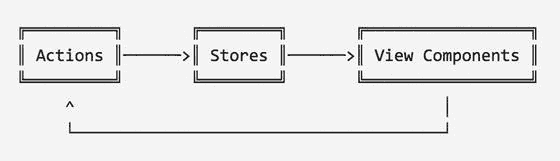
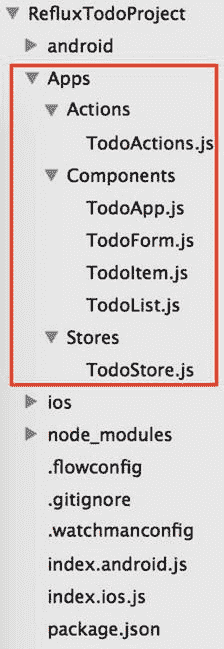
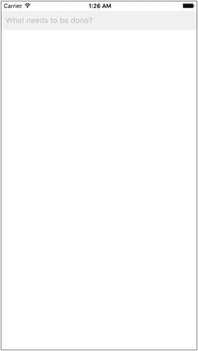
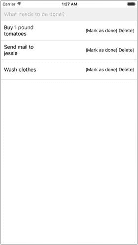
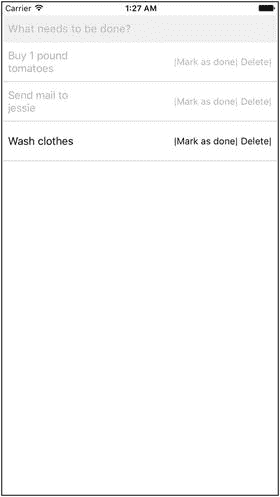
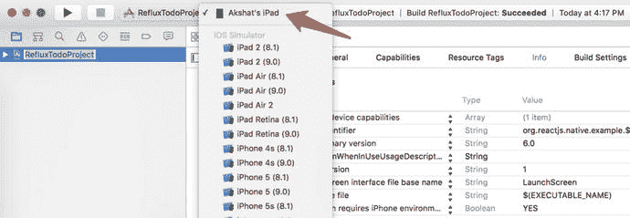
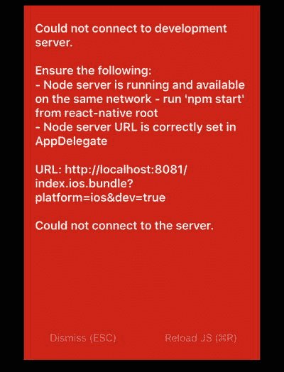
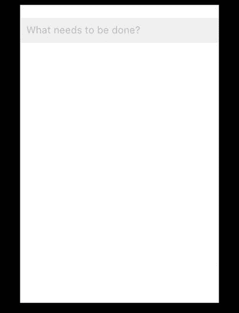
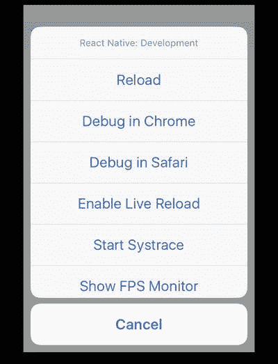
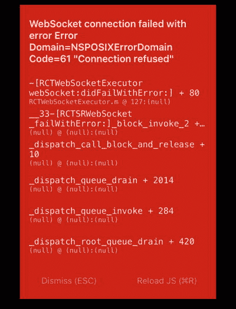

# 七、React 原生补充

保持灵活性的一个好方法是少写代码—实用程序员

到目前为止，您应该已经习惯于使用 React Native 构建应用，并且已经习惯了 React Native 框架的所有基本功能和许多高级功能。在这最后一章，我们将学习一些补充，这可能不是必要的，但在某些情况下非常有用，并大大减少我们的工作。在本章中，我们将讨论以下主题:

*   逆流
*   Redux
*   在设备上调试
*   流行的节点模块
*   从这里去哪里

## 逆流

我们在第 4 章中学习了 Flux 架构。我们有一些其他方法来实现单向数据流，包括一种称为回流的精益流量方法。这是一个简单的单向数据流库，灵感来自 React 的 Flux。如图 [7-1](#Fig1) 所示，回流模式有动作和存储。动作启动新数据，新数据通过数据存储传递，然后传递给视图组件，再传递回动作。如果视图组件有一个对数据存储进行更改的事件，它需要通过可用的操作向存储发送一个信号。

图 7-1。

Reflux unidirectional flow

### 与 Flux 的差异

回流实际上已经重构了流量，使其更接近功能 React 式编程(FRP)。以下是回流和 Flux 之间的一些差异:

*   单例调度器不存在，让每个动作都像调度器一样工作。
*   因为操作是 listenable 的，所以存储会监听它们。存储不需要用大的`switch`语句对字符串进行静态类型检查(动作类型)。
*   门店可以听其他门店的；可以创建可以进一步聚合数据的存储，类似于 map/reduce。
*   不需要动作创建者，因为回流动作是将它们接收的有效载荷传递给任何收听它们的人的功能。
*   `waitFor`被替换为处理串行和并行数据流。聚合数据存储可以串行监听其他存储，也可以并行监听用于连接监听器的连接。

为了更好地理解回流，让我们创建一个简单的 ToDo 应用，就像我们在[第 4 章](4.html)中所做的那样。让我们生成一个 React 本机应用:

`$ react-native init` `RefluxTodo`

我们的基本项目结构现在已经准备好了。让我们在项目中添加一个回流节点模块:

`$ cd RefluxTodo`

`$ npm install reflux --save-dev`

现在我们的项目中已经添加了回流，让我们创建一个可以使用回流的结构。首先，创建一个名为`Apps`的根文件夹，其中包含子文件夹`Actions`、`Components`和`Stores`，这些子文件夹包含图 [7-2](#Fig2) 所示的文件。

图 7-2。

Root folder Apps with subfolders and files

与 Flux 模式不同，在 Reflux 中我们只有动作和存储，因为我们完全放弃了 dispatcher。我们将在我们的`Component`文件夹中保存各种组件，以保持我们的`index.ios.js`文件精简。这些文件现在是空的，所以让我们通过下面的步骤在每个文件中添加所需的代码。

Start with Actions. Open `Apps/Actions/TodoActions.js` and add the following code: `'use strict';` `var Reflux = require('reflux');` `module.exports = Reflux.createActions([`   `'todoCreate',`   `'todoUpdate',`   `'todoComplete',`   `'todoUndoComplete',`   `'todoDestroy',` `]);`   Add the following code to Stores, which resides in `Apps/Stores/Todostore.js`: `'use strict';` `var Reflux = require('reflux');` `var _ = require("underscore");` `module.exports = Reflux.createStore({`   `listenables: [require('../Actions/TodoActions')],`   `todos: {},`   `onTodoCreate: function(text) {`     `var id = (+new Date() + Math.floor(Math.random() * 999999)).toString(36);`     `this.todos[id] = {`       `id: id,`       `complete: false,`       `text: text,`     `};`     `this.trigger(null);`   `},`   `onTodoUpdate: function(id, updates) {`     `this.todos[id] = _.extend({}, this.todos[id], updates);`     `this.trigger(null);`   `},`   `onTodoComplete: function(id) {`     `this.onTodoUpdate(id, {complete: true});`   `},`   `onTodoUndoComplete: function(id) {`     `this.onTodoUpdate(id, {complete: false});`   `},`   `onTodoDestroy: function(id) {`     `delete this.todos[id];`     `this.trigger(null);`   `},`   `getAll: function() {`     `return _.values(this.todos);`   `},` `});`   Create the components that will interact with Actions, which in turn interacts with Stores. Let’s add the following code to `Apps/Components/TodoForm.js`: `TodoForm.js` `'use strict';` `var React = require('react-native');` `var {`   `StyleSheet,`   `TextInput,`   `View,` `} = React;` `var TodoActions = require('../Actions/TodoActions');` `var TodoStore = require('../Stores/TodoStore');` `module.exports = React.createClass({`   `propTypes: {`     `value: React.PropTypes.string,`   `},`   `getInitialState: function() {`     `return {` `value: '',`     `};`   `},`   `render: function() {`     `return (`       `<View style={styles.header}>`         `<TextInput`           `style={styles.textInput}`           `onChangeText={(text) => this.setState({value: text})}`           `onBlur={this._save}`           `placeholder={'What needs to be done?'}`           `value={this.state.value}`         `/>`       `</View>`     `);`   `},`   `_save: function() {`     `var text = this.state.value;`     `if (text) {`       `TodoActions.todoCreate(text);` `this.setState({` `value: ''`       `});`     `}`   `},` `});` `var styles = StyleSheet.create({`   `header: {`     `marginTop: 21,`   `},`   `textInput: {`     `height: 40,`     `backgroundColor: '#EEEEEE',`     `padding: 10,`     `fontSize: 16`   `},` `});`   Add the following code to the `TodoItem` component in `Apps/Components/TodoItem.js`: `TodoItem.js` `'use strict';` `var React = require('react-native');` `var {`   `StyleSheet,`   `Text,`   `View,` `} = React;` `var Reflux = require('reflux');` `var TodoActions = require('../Actions/TodoActions');` `module.exports = React.createClass({`   `render: function() {`     `var todo = this.props.todo;`     `var styleTodoItemComplete = (todo.complete) ? styles.todoItemComplete : null;`     `return (`       `<View>`         `<View style={[styles.todoItem, styleTodoItemComplete]}>`           `<Text style={styles.text}>{todo.text}</Text>`           `<Text style={styles.text}>{todo.complete}</Text>`           `<Text onPress={() => this._onToggleComplete(todo)}>|Mark as done|</Text>`           `<Text onPress={() => this._onDestroy(todo)}> Delete|</Text>`         `</View>`         `<View style={styles.separator} />`       `</View>`     `);`   `},`   `_onToggleComplete: function(todo) {`     `if (todo.complete) {`       `TodoActions.todoUndoComplete(todo.id);`     `} else {`       `TodoActions.todoComplete(todo.id);`     `}`   `},`   `_onDestroy: function(todo) {`     `TodoActions.todoDestroy(todo.id);`   `}` `});` `var styles = StyleSheet.create({` `todoItem: {`     `flex: 1,`     `flexDirection: 'row',`     `justifyContent: 'center',` `alignItems: 'center',`     `backgroundColor: '#FFFFFF',`     `padding: 10,`     `height: 58,`   `},`   `todoItemComplete: {`     `opacity: 0.3,`   `},`   `text: {`     `flex: 1,`     `textAlign: 'left',`     `fontSize: 16,`   `},`   `separator: {`     `height: 1,`     `backgroundColor: '#CCCCCC',`   `},` `});`   Add the following code to `TodoList.js`, which is found in `Apps/Components/TodoList.js`: `Todolist.js` `'use strict';` `var React = require('react-native');` `var {`   `ListView,`   `StyleSheet,` `} = React;` `var Reflux = require('reflux');` `var TodoStore = require('../Stores/TodoStore');` `var TodoItem = require('./TodoItem');` `module.exports = React.createClass({`   `mixins: [Reflux.listenTo(TodoStore, 'handlerTodoUpdate')],`   `getInitialState: function() {`     `var ds = new ListView.DataSource({rowHasChanged: (r1, r2) => r1 !== r2});`     `return {`       `todoDataSource: ds.cloneWithRows(TodoStore.getAll()),`     `};`   `},`   `handlerTodoUpdate: function(err) {`     `if (err) {`         `return`     `}`     `this.setState({`       `todoDataSource: this.state.todoDataSource.cloneWithRows(TodoStore.getAll()),`     `});`   `},`   `render: function() {`     `return (`       `<ListView`         `dataSource={this.state.todoDataSource}`         `renderRow={(rowData) => <TodoItem todo={rowData} />}`       `/>`     `);`   `},` `});` `var styles = StyleSheet.create({`   `list: {`     `flex: 1,`     `backgroundColor: '#0FF',`   `},` `});` `index.ios.js` `'use strict';` `var React = require('react-native');` `var {`   `AppRegistry,` `} = React;` `var TodoApp = require('./Apps/Components/TodoApp');` `AppRegistry.registerComponent('TodoProject', () => TodoApp);`   Add the following code to `TodoApp.js`, found in `Apps/Components/TodoApp.js`: `TodoApp.js` `'use strict';` `var React = require('react-native');` `var {`   `StyleSheet,`   `View,` `} = React;` `var TodoForm = require('./TodoForm');` `var TodoList= require('./TodoList');` `module.exports = React.createClass({`   `render: function() {`     `return (`       `<View style={styles.container}>`         `<TodoForm />`         `<TodoList />`       `</View>`     `);`   `},` `});` `var styles = StyleSheet.create({`   `container: {`     `flex: 1,`   `},` `});`   In order to use the components just created, update `index.ios.` `js` with the following code: `'use strict';` `var React = require('react-native');` `var {`   `AppRegistry,` `} = React;` `var TodoApp = require('./Apps/Components/TodoApp');` `AppRegistry.registerComponent('RefluxTodoProject', () => TodoApp);`  

完成这些步骤后，我们现在可以用 Xcode 构建我们的应用，以便运行我们的应用。一旦加载了应用，就会出现图 [7-3](#Fig3) 中的主屏幕。在这里，我们可以将任何项目添加到待办事项列表(“需要做什么？”).

图 7-3。

To do list is ready to be populated with user input

添加完成后，项目会一个接一个地列出，每行的右侧会显示“标记为完成”或“删除”选项，如图 [7-4](#Fig4) 所示。

图 7-4。

Each item in the populated list now has two options

单击“标记为完成”时，该行会变淡，表示此项目已完成。再次单击此选项将取消该行的折叠。点击“删除”从列表中完全删除项目(参见图 [7-5](#Fig5) )。

图 7-5。

Two items have been marked as done

## Redux

Reduxis 是 JavaScript 应用的可预测状态容器，它已经变得非常流行，尤其是在 React 社区中。尽管您可以在 React、AngularJS 或任何框架中使用 Redux 概念。Redux 是开源的，Dan Abramov 是它的首席开发者。Redux 通过对状态更新的方式和时间施加一定的控制，使状态突变变得可预测。

到目前为止，我们已经看到状态在 React 原生应用中被大量使用，并且状态值总是在变化。当我们的实际应用增长时，处理这些状态变化会变得不可预测。使用 React with Flux 是一种很好的方法，通过这种方法可以使用突变和同步来解决问题，因为 React 已经从视图层和 direct-DOM 操作中去除了异步。然而，管理数据的状态是留给开发人员的。Redux 使用三个原则解决了管理状态的问题:

*   真理的单一来源
*   状态为只读
*   突变被写成纯函数

### 真理的单一来源

应用的存储存储在单个存储内的对象树中。单状态树完成了所有的状态更改。这使得创建通用应用变得容易，因为我们知道客户端应用执行的所有操作都已完成。这也使得调试更加容易，因为我们可以跟踪所有的状态变化。

### 状态为只读

改变状态的唯一方法是发出一个动作`—`一个描述发生了什么的对象。因此，我们不能直接更新状态；它只能通过操作进行更新。视图和网络调用不能直接更新状态。

### 突变被写成纯函数

为了指定状态树是如何被动作转换的，你需要编写纯 reducers。Reducers 将采用旧的状态和动作，并返回新的状态。Reducers 是普通的 JavaScript 函数。理解 reducers 不更新状态是很重要的，它们只是返回新的状态。

## 在设备上调试

到目前为止，我们一直在 iOS 模拟器上调试和测试我们的应用，这在大多数时候都运行得很好，但是在现实世界的项目中，我们需要在 iOS 设备上一次又一次地加载我们的应用以进行测试和调试。

要调试您的应用 iOS 设备，只需插入您的设备(在我们的例子中是 iPad)。打开 Xcode 并选择您的设备而不是模拟器(参见图 [7-6](#Fig6) )。

图 7-6。

Selecting an iPad as your device

我们在这个部分使用 RefluxTodo 应用，但是您可以使用到目前为止您已经构建的任何 React 本地项目。构建应用以将其加载到设备上。应用图标应该会出现，但是我们会得到如图 [7-7](#Fig7) 所示的错误。

图 7-7。

“Unable to connect” error message

这个错误的原因是我们的应用无法连接到开发服务器。让我们通过进入我们的应用代码来解决这个问题。转到`AppDelegate.m`文件，该文件通常位于`project-name/ios/project-name/AppDelegate.m`中，并更改以下行:

`jsCodeLocation``= [NSURL URLWithString:@"``http://localhost:8081/index.ios.bundle?platform=ios&dev=true`T3】

收件人:

`jsCodeLocation = [NSURL URLWithString:@"``http://machine-ip-address:8081/index.ios.bundle?platform=ios&dev=true`T2】

这里，我们必须用我们机器的 IP 地址替换`localhost`。这样做可以让我们的应用在设备上正确加载和运行(参见图 [7-8](#Fig8) )。

图 7-8。

Application is now running properly

要访问开发者菜单，只需摇动您的设备`—`，菜单将从视图底部出现(参见图 [7-9](#Fig9) )。

图 7-9。

Developer menu is now visible

我们可以启用实时重新加载，就像在 iOS 模拟器中一样，所有的更改也会自动反映在设备上。点击 Chrome 中的 Debug，可以看到如图 [7-10](#Fig10) 所示的结果。

图 7-10。

WebSocket error message

然而，我们得到另一个错误。为了解决这个问题，我们必须回到我们的代码并做一些修改。为此，我们需要转到位于 React 节点模块中的`RCTWebSocketExecuter.m`，遍历到`/your-project-name/node_module/react-native/Libraries/WebSocket/ RCTWebSocketExecuter.m`，并且我们需要在下面的代码段中再次将我们的`localhost`更改为机器的 IP 地址:

`From`

`- (instancetype)init`

`{`

`return [self initWithURL:[RCTConvert NSURL:@"``http://localhost:8081/debugger-proxy`T2】

`}`

`to`

`- (instancetype)init`

`{`

`return [self initWithURL:[RCTConvert NSURL:@"``http://your-machine-ip-address:8081/debugger-proxy`T2】

`}`

有了这个改变，我们可以调试我们的应用，就像我们到目前为止使用模拟器一样。

## React Native 的流行模块

React 当地社区可能还年轻，但它已经开始繁荣。像任何其他流行的框架一样，已经创建了许多开源项目，这有助于开发人员避免重复开发已经开发的功能。你可以在 GitHub 上找到上百个这样的节点模块；我们列出了一些可以帮助您快速构建和交付下一个 React 本机应用的工具。

### react-native-fbsdk

React Native FBSDK 是 iOS 脸书 SDK 的包装器，有助于脸书与 React Native 应用的集成。文档化的 JavaScript 模块有助于使用三个 npm 模块访问本地组件，如登录、共享和共享。你必须包含三个 npm 包:`react-native-fbsdkcore`、`react-native-fbsdkshare`、`react-native-fbsdklogin—`就是这样。

要获得完整的文档或对这个项目做出贡献，您可以访问以下网站: [`https://github.com/facebook/react-native-fbsdk`](https://github.com/facebook/react-native-fbsdk) 。

### React-本机-可滚动-选项卡-视图

流畅的动画真的给应用中的任何特性增加了意义。React 本地动画 API 变得非常健壮；为选项卡内的滚动创建平滑的动画是由`react-native-scrollable-tab-view` npm 包解决的一个问题。这是 React Native 的一个非常简单的纯 JavaScript 实现。

要获得完整的文档或对这个项目做出贡献，您可以访问以下网站: [`https://github.com/brentvatne/react-native-scrollable-tab-view`](https://github.com/brentvatne/react-native-scrollable-tab-view) 。

### react-native-webpack-server

`react-native-` `webpack-server`允许您使用 React Native 的 webpack 生态系统。它是一个开发服务器，使用 Webpack Dev Server 和 React Packager 来构建 React 本地 JavaScript 包。

要获得完整的文档或对这个项目做出贡献，您可以访问以下网站: [`https://github.com/mjohnston/react-native-webpack-server`](https://github.com/mjohnston/react-native-webpack-server) 。

### React-本地-侧面-菜单

这是一个非常简单的可扩展侧边菜单的实现，这个包可以帮助你添加一个侧边菜单，用一个简单的滑动手势就可以从左边或者右边滚动。

要获得完整的文档或对这个项目做出贡献，您可以访问以下网站: [`https://github.com/react-native-fellowship/react-native-side-menu#component-props`](https://github.com/react-native-fellowship/react-native-side-menu#component-props) 。

以下是其他一些值得一提的地方:

*   `react-native-` `vector-icons`
*   `react-native-` `facebook-login`
*   `react-native-` `google-places-autocomplete`
*   `react-native-` `sqlite-storage`
*   `react-native-` `tableview`
*   `react-native-` `background-geolocation`

## 从这里去哪里

恭喜你。您已经了解了很多关于 React 原生框架的知识。但这仅仅是个开始，因为 React 本地社区和生态系统每天都在快速扩张。新的开发、创新的变化和前沿的特性一直被添加到框架中`—`简而言之，每天都有新的东西要学。对于勇敢的人来说，这是一个拥抱的机会。所以我想到的一个明显的问题是，下一步是什么？答案是，很多。

如果你在寻找已经构建好并可供使用的 React 原生组件，可以访问`react.parts`，里面有所有可用可重用模块的详尽列表；`https://react.parts/native`见。

对于任何问题或疑问，您都可以使用带有标签`react-native`的 stackoverflow。对于来自开发伙伴的真正快速的响应，您可以随时在 IRC 上的#reactnative 上跳转到 IRC 频道。你也可以在 [`https://discordapp.com/invite/0ZcbPKXt5bWJVmUY`](https://discordapp.com/invite/0ZcbPKXt5bWJVmUY) 使用 discord channel Reactiflux 与 React 原生社区聊天(是的，React 原生社区足够酷，可以使用游戏玩家使用的聊天平台)。

React Native 是一个非常年轻的框架，在使用它时，您可能会提出一些对框架有帮助的建议，或者一些对框架来说有些多余的东西。React 本地社区非常乐于接受建议；如果你有，你可以在 [`https://discuss.reactjs.org/`](https://discuss.reactjs.org/) 开始一个线程。这个讨论页面也是一个从其他人那里学习最佳实践和从旧线索中学习的好地方。此外，这是一个让专家解决您的问题的好地方。更好的是，你也可能得到一些工作机会。

最后，要成为 React Native 的大师，没有比简单地构建应用更好的方法了。没有比参与现实世界的项目、解决现实生活中的问题更快成为技术大师的方法了。由于 React 原生社区仍处于起步阶段，因此通过创建自己的模块来学习和分享是一个很好的机会，这可以帮助社区的其他人，这是一个额外的好处。我们希望你喜欢阅读和学习这本书，并且现在已经发展成为一名 React 本地开发者来构建 iOS 应用。就像你一样，我们对 React Native 感到非常兴奋，并期待看到你的作品在 iOS 和 React Native 的世界中留下印记。再见。