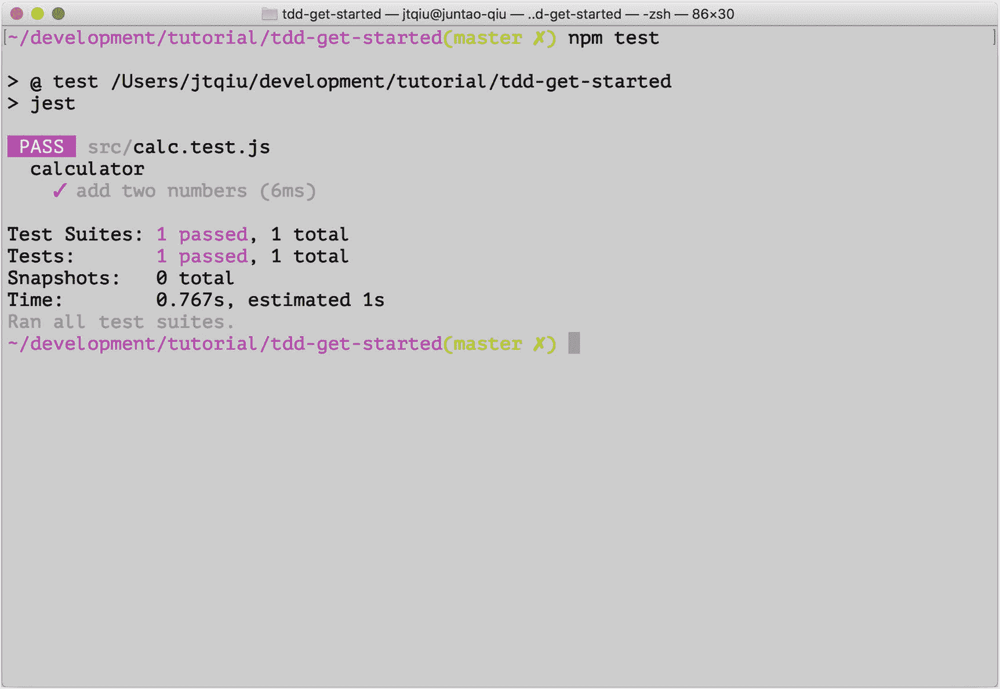

# 二、从笑话开始

在这一章中，我们将学习一些关于 jest 的概念和特性——一个 JavaScript 测试框架——比如不同类型的`matchers`,强大灵活的`expect`,对于单元测试极其有用的`mock`,等等。此外，我们将学习如何以易于维护的方式安排我们的测试套件，并利用来自真实项目的最佳实践。

首先，您将看到如何设置您的环境来编写我们的第一个测试。在本书中，我们将使用`ES6`作为主要的编程语言。

所以，事不宜迟，我们开始吧。

## 设置环境

### 安装 Node.js

我们将利用`node.js`作为本书中几乎所有场景的平台。如果您的计算机上还没有安装`node`，您可以简单地运行下面的命令，将它安装到带有`homebrew`的`MacOS`上:

```jsx
brew install node

```

或者，如果你运行不同的操作系统，或者只是想要另一个选项，可以在这里下载[。](https://nodejs.org/en/download/)

一旦您在本地安装了它，您就可以使用`npm`(节点包管理器)来安装节点包——这是一个随`node`运行时提供的二进制程序。

### 安装和配置 Jest

`Jest`是来自`Facebook`的一个测试框架，它允许开发人员以更易读的语法编写可靠和快速运行的测试。它可以观察测试/源文件中的变化，并自动重新运行必要的测试。这可以让你快速得到反馈，这是`TDD`的一个关键因素。反馈的速度甚至可以决定`TDD`对你是否管用。简单地说，测试运行得越快，开发人员的效率就越高。

让我们首先为我们的实验创建一个文件夹，并用一个`package.json`初始化该文件夹，以维护所有下面的包安装:

```jsx
mkdir jest-101
cd jest-101
npm init -y # init the current folder with default settings

```

将`jest`作为`development dependency`安装，因为我们不想将`jest`包含在生产包中:

```jsx
npm install --save-dev jest

```

安装完成后，可以运行`jest --init`来指定一些默认设置，比如`jest`应该在哪里找到测试文件和源代码，`jest`应该在哪个环境(有很多)下运行(浏览器或节点为后端)等等。你要回答一些问题，让`jest`明白你的要求；现在，让我们接受所有的默认设置，对所有的问题说`Yes`。

注意，如果你已经全局安装了`jest`(带有`npm install jest -g`，你可以使用下面的命令直接`init`配置:

```jsx
jest --init

```

否则，您必须通过`npx`使用本地安装，它从`node_modules/.bin/`中寻找`jest`二进制文件并调用它:

```jsx
npx jest --init

```

为了简单起见，我们使用`node`作为测试环境，没有`coverage report`，所有其他默认设置如下:

```jsx
npx jest --init

The following questions will help Jest to create a suitable configuration for your project:

✔ Choose the test environment that will be used for testing › node
✔ Do you want Jest to add coverage reports? ... no
✔ Which provider should be used to instrument code for coverage? › v8
✔ Automatically clear mock calls and instances between every test? ... no

```

在/Users/juntaoqiu/learn/jest-101/jest . config . js 创建的配置文件

## 乍一看是笑话

酷，我们已经准备好编写一些测试来验证所有部分现在可以一起工作了。让我们创建一个名为`src`的文件夹，并将两个文件放在`calc.test.js`和`calc.js`中。

该文件以`*.test.js`结尾，这意味着这是一种模式，`jest`将识别它们并将其视为`tests`，如我们之前生成的`jest.config.js`中所定义的:

```jsx
  //The glob patterns Jest uses to detect test files
  testMatch: [
    "**/__tests__/**/*.js?(x)",
    "**/?(*.)+(spec|test).js?(x)"
  ],

```

现在，让我们在`calc.test.js`中放一些代码:

```jsx
var add = require('./calc.js')

describe('calculator', function() {
   it('add two numbers', function() {
       expect(add(1, 2)).toEqual(3)
   })
})

```

如果你从未尝试过用`jasmine`(在`jest`时代之前非常流行的测试框架)编写测试，这里有一些新东西:函数`describe`和`it`继承自`jasmine`。`describe`是一个可以用来创建测试套件的函数，你可以在其中定义测试用例(通过使用`it`函数)。正确的做法是将人类可读的文本作为第一个参数，将可执行的回调函数作为第二个参数。另一方面，对于函数`it`，您可以编写实际的测试代码。

实际的断言是语句`expect(add(1, 2)).toEqual(3)`，它声明我们期望函数调用`add(1, 2)`等于`3`。

`add`从另一个文件导入，实现如下:

```jsx
function add(x, y) {
   return x + y;
}

module.exports = add

```

然后，让我们运行测试，看看结果如何:

```jsx
npx jest

```

或者，您可以通过以下方式运行测试

```jsx
npm test

```

其中调用了罩下的`node_modules/.bin/jest`，如图 [2-1](#Fig1) 所示。



图 2-1

首次测试

太好了，我们进行了第一次测试。

### 笑话中的基本概念

在这一节中，我们将讨论`Jest`中的一些基本概念。我们使用`describe`来定义一个测试块。我们可以使用这种机制来安排不同的测试用例，并将相关的测试用例集合成一个组。

#### Jest API:描述和它

例如，我们可以将所有的`arithmetic`放入一个组中:

```jsx
describe('calculator', () => {
  it('should perform addition', () => {})
  it('should perform subtraction', () => {})
  it('should perform multiplication', () => {})
  it('should perform division', () => {})
})

```

更重要的是，我们可以这样下一个`describe`函数:

```jsx
describe('calculator', () => {
  describe('should perform addition', () => {
    it('adds two positive numbers', () => {})
    it('adds two negative numbers', () => {})
    it('adds one positive and one negative numbers', () => {})
  })
})

```

基本的想法是确保相关的测试被分组在一起，以便测试描述对维护它们的人更有意义。如果您可以在业务上下文中使用领域语言描述`description`(函数`describe`和`it`的第一个参数)，那就更有帮助了。

#### 友好地组织你的测试

例如，当您开发一个酒店预订应用时，测试应该是这样的:

```jsx
describe('Hotel Sunshine', () => {
  describe('Reservation', () => {
    it('should make a reservation when there are enough rooms available', () => {})
    it('should warn the administrator when there are only 5 available rooms left', () => {})
  })

  describe('Checkout', () => {
    it('should check if any appliance is broken', () => {})
    it('should refund guest when checkout is earlier than planned', () => {})
  })
})

```

您可能偶尔会发现一些分散在测试用例中的重复代码，例如，在每个测试中设置一个主题并不罕见:

```jsx
describe('addition', () => {
  it('adds two positive numbers', () => {
    const options = {
      precision: 2
    }

    const calc = new Calculator(options)
    const result = calc.add(1.333, 3.2)
    expect(result).toEqual(4.53)
  })

  it('adds two negative numbers', () => {
    const options = {
      precision: 2
    }

    const calc = new Calculator(options)
    const result = calc.add(-1.333, -3.2)
    expect(result).toEqual(-4.53)
  })

})

```

#### 安装和拆卸

为了减少重复，我们可以使用`jest`提供的`beforeEach`函数来定义一些可重用的对象实例。在`jest`运行每个测试用例之前，它会被自动调用。在我们的例子中，`calculator`实例可以在同一个`describe`块中的所有测试用例中使用:

```jsx
describe('addition', () => {
  let calc = null

  beforeEach(() => {
    const options = {
      precision: 2
    }
    calc = new Calculator(options)
  })

  it('adds two positive numbers', () => {
    const result = calc.add(1.333, 3.2)
    expect(result).toEqual(4.53)
  })

  it('adds two negative numbers', () => {
    const result = calc.add(-1.333, -3.2)
    expect(result).toEqual(-4.53)
  })
})

```

当然，你可能想知道是否有一个名为`afterEach`的对应函数或负责清理工作的东西:有！

```jsx
describe('database', () => {
  let db = null;

  beforeEach(() => {
    db.connect('localhost', '9999', 'user', 'pass')
  })

  afterEach(() => {
    db.disconnect()
  })
})

```

这里，我们在每个测试用例之前建立一个数据库连接，然后关闭它。在实践中，您可能希望在`afterEach`步骤中添加一个函数来回滚数据库更改或其他清理。

此外，如果您希望在所有测试用例开始之前建立一些东西，并在所有测试用例完成之后拆除，那么`beforeAll`和`afterAll`可以提供帮助:

```jsx
beforeAll(() => {
  db.connect('localhost', '9999', 'user', 'pass')
})

afterAll(() => {
  db.disconnect()
})

```

### 使用 ES6

默认情况下，你只能在`node.js`中使用`ES5`(JavaScript 的一个相对较老的版本)(有趣的是，到我开始写这一章的时候，默认情况下，我不能在`node`运行时中直接使用`ES6`中的大部分特性)。然而，既然我们已经到了 2021 年，`ES6`应该是你的前端项目应该选择的默认编程语言。好消息是你不必等到所有的浏览器都实现了规范；你可以用`babel`把`ES6`代码翻译编译成`ES5`。

#### 安装和配置 Babel

这很容易设置；只需安装几个包就可以让它正常工作:

```jsx
npm install --save-dev babel-jest babel

-core regenerator-runtime @babel/preset-env

```

安装完成后，在项目根目录下创建一个`.babelrc`,内容如下

```jsx
{
    "presets": [
        "@babel/preset-env"
    ]
}

```

就这样！现在，您应该能够在源代码和测试代码中编写 ES6 了，剩下的工作将由 babel 来完成:

```jsx
import {add} from './calc'

describe('calculator', () => {
   it('adds two numbers', () => {
           expect(add(1, 2)).toEqual(3)
   })
})

```

和

```jsx
const add = (x, y) => x + y
export {add}

```

使用箭头函数和单行匿名函数(比如`add`函数)会更加简洁明了。此外，我更喜欢`import`和`export`，因为我觉得它比旧的`modules.export`约定更具可读性。

当您重新运行`npm test`时，所有测试都应该通过。

## 开玩笑时使用火柴

为开发人员提供了大量的帮助函数(匹配器),用于编写测试时的断言。这些匹配器可用于在不同的场景中断言各种数据类型。

让我们先看看一些基本的用法，然后再看一些更高级的例子。

### 平等

`toEqual`和`toBe`可能是你在几乎每个测试用例中会发现和使用的最常见的匹配器。顾名思义，它们用于断言值是否彼此相等(实际值和期望值)。

例如，它可以用于`string`、`number,`或复合对象:

```jsx
it('basic usage', () => {
  expect(1+1).toEqual(2)
  expect('Juntao').toEqual('Juntao')
  expect({ name: 'Juntao' }).toEqual({ name: 'Juntao' })
})

```

而对于`toBe`

```jsx
it('basic usage', () => {
  expect(1+1).toBe(2) // PASS
  expect('Juntao').toBe('Juntao') // PASS
  expect({ name: 'Juntao' }).toBe({ name: 'Juntao' }) //FAIL
})

```

最后一次测试会失败。对于像`strings`、`numbers`和`booleans`这样的原语，可以使用`toBe`来测试相等性。而对于`Objects`，内部`jest`使用`Object.is`校验，比较严格，按内存地址比较对象。所以如果你想确保所有的字段都匹配，使用`toEqual`。

### 。反向匹配的 not 方法

`Jest`还提供了`.not`，可以用来断言相反的值:

```jsx
it('basic usage', () => {
  expect(1+2).not.toEqual(2)
})

```

有时，您可能不希望完全匹配。假设您希望一个字符串匹配某个特定的模式。那么你可以用`toMatch`来代替:

```jsx
it('match regular expression', () => {
  expect('juntao').toMatch(/\w+/)
})

```

事实上，您可以编写任何有效的正则表达式:

```jsx
it('match numbers', () => {
  expect('185-3345-3343').toMatch(/^\d{3}-\d{4}-\d{4}$/)
  expect('1853-3345-3343').not.toMatch(/^\d{3}-\d{4}-\d{4}$/)
})

```

`Jest`使得使用`strings`变得非常容易。但是，您也可以使用数字进行比较:

```jsx
it('compare numbers', () => {
  expect(1+2).toBeGreaterThan(2)
  expect(1+2).toBeGreaterThanOrEqual(2)

  expect(1+2).toBeLessThan(4)
  expect(1+2).toBeLessThanOrEqual(4)
})

```

### 数组和对象的匹配器

`Jest`还为`Array`和`Object`提供匹配器。

#### toContainEqual 和 toContain

例如，测试一个元素是否包含在一个`Array`中是很常见的:

```jsx
const users = ['Juntao', 'Abruzzi', 'Alex']

it('match arrays', () => {
  expect(users).toContainEqual('Juntao')
  expect(users).toContain(users[0])
})

```

注意`toContain`和`toContainEqual`是有区别的。基本上，`toContain`通过使用`===`严格比较元素来检查项目是否在列表中。另一方面，`toContainEqual`只是检查值(不是内存地址)。

例如，如果您想检查一个对象是否在列表中

```jsx
it('object in array', () => {
  const users = [
    { name: 'Juntao' },
    { name: 'Alex' }
  ]
  expect(users).toContainEqual({ name: 'Juntao' }) // PASS
  expect(users).toContain({ name: 'Juntao' }) // FAIL
})

```

第二个断言会失败，因为它使用了更严格的比较。由于对象只是其他 JavaScript 原语的组合，我们可以使用`dot`符号并测试字段的`existence`,或者使用对象中字段的早期匹配器。

```jsx
it('match object', () => {
  const user = {
    name: 'Juntao',
    address: 'Xian, Shaanxi, China'
  }

  expect(user.name).toBeDefined()
  expect(user.age).not.toBeDefined()
})

```

### 强大的功能`Expect`

在前面的章节中，我们已经尝过了`matcher`的味道；让我们来看看`Jest`提供的另一个超级武器:`expect`。

有几个有用的辅助函数附加在`expect`对象上:

*   expect . string 包含

*   expect . array 包含

*   expect . object 包含

通过使用这些函数，您可以定义自己的`matcher`。例如:

```jsx
it('string contains', () => {
  const givenName = expect.stringContaining('Juntao')
  expect('Juntao Qiu').toEqual(givenName)
})

```

这里的变量`givenName`不是一个简单的值；这是一个新的匹配器，匹配包含`Juntao`的字符串。

类似地，您可以使用`arrayContaining`来检查数组的子集:

```jsx
describe('array', () => {
  const users = ['Juntao', 'Abruzzi', 'Alex']

  it('array containing', () => {
    const userSet = expect.arrayContaining(['Juntao', 'Abruzzi'])
    expect(users).toEqual(userSet)
  })
})

```

乍一看，这看起来有点奇怪，但是一旦你理解了，这种模式将帮助你构建更复杂的匹配器。

例如，假设我们从后端 API 中检索一些数据，其有效负载如下所示

```jsx
const user = {
  name: 'Juntao Qiu',
  address: 'Xian, Shaanxi, China',
  projects: [
    { name: 'ThoughtWorks University' },
    { name: 'ThoughtWorks Core Business Beach'}
  ]
}

```

不管什么原因，在我们的测试中，我们根本不关心`address`。我们确实关心`name`字段是否包含`Juntao`，以及 [`project.name`](http://project.name) 是否包含`ThoughtWorks`。

#### `Containing`家庭功能

所以让我们通过使用`stringContaining`、`arrayContaining`和`objectContaining`来定义一个匹配器，如下所示:

```jsx
const matcher = expect.objectContaining({
  name: expect.stringContaining('Juntao'),
  projects: expect.arrayContaining([
    { name: expect.stringContaining('ThoughtWorks') }
  ])
})

```

这个表达式准确地描述了我们所期望的，然后我们可以使用`toEqual`来做断言:

```jsx
expect(user).toEqual(matcher)

```

如您所见，这种模式非常强大。基本上，你可以像在自然语言中一样定义一个匹配器。它甚至可以用在前端和后端服务之间的`contract`中。

### 制造你的火柴

`Jest`也允许你扩展`expect`对象来定义你自己的匹配器。这样，您可以增强默认的匹配器集，并使测试代码更具可读性。

让我们来看一个具体的例子。如您所知，`jsonpath`是一个允许开发人员使用 JavaScript 对象的库——类似于 XML 中的`xpath`。

#### 示例:jsonpath 匹配器

如果尚未安装，请先安装`jsonpath`:

```jsx
npm install jsonpath --save

```

然后像这样使用它:

```jsx
import jsonpath from 'jsonpath'

const user = {
  name: 'Juntao Qiu',
  address: 'Xian, Shaanxi, China',
  projects: [
    { name: 'ThoughtWorks University' },
    { name: 'ThoughtWorks Core Business Beach'}
  ]
}

const result = jsonpath.query(user, '$.projects')
console.log(JSON.stringify(result))

```

你会得到这样的结果:

```jsx
[[{"name":"ThoughtWorks University"},{"name":"ThoughtWorks Core Business Beach"}]]

```

并查询`$.projects[0].name`

```jsx
const result = jsonpath.query(user, '$.projects[0].name')

```

会得到

```jsx
["ThoughtWorks University"]

```

如果路径不匹配，那么`query`将返回一个空数组(`[]`):

```jsx
const result = jsonpath.query(user, '$.projects[0].address')

```

#### 扩展`Expect`功能

让我们使用函数`expect.extend`定义一个名为`toMatchJsonPath`的匹配器作为扩展:

```jsx
import jsonpath from 'jsonpath'

expect.extend({
  toMatchJsonPath(received, argument) {
    const result = jsonpath.query(received, argument)

    if (result.length > 0) {
      return {
        pass: true,
        message: () => 'matched'
      }
    } else {
      return {
        pass: false,
        message: () => `expected ${JSON.stringify(received)} to match jsonpath ${argument}`
      }
    }
  }
})

```

所以在内部，`Jest`将传递两个参数给定制匹配器；第一个是实际结果——您传递给函数`expect()`的结果。另一方面，第二个是传递给匹配器的期望值，在我们的例子中是`toMatchJsonPath`。

对于返回值，它是一个简单的 JavaScript 对象，包含`pass`，这是一个布尔值，指示测试是否通过，以及一个`message`字段，分别描述通过或失败的原因。

一旦定义好，就可以像其他内置匹配器一样在测试中使用它:

```jsx
describe('jsonpath', () => {
  it('matches jsonpath', () => {
    const user = {
      name: 'Juntao'
    }
    expect(user).toMatchJsonPath('$.name')
  })

  it('does not match jsonpath', () => {
    const user = {
      name: 'Juntao',
      address: 'ThoughtWorks'
    }
    expect(user).not.toMatchJsonPath('$.age')
  })
})

```

很酷，对吧？当您想通过使用一些特定领域的语言使`matcher`更具可读性时，这有时非常有用。

例如:

```jsx
const employee = {}
expect(employee).toHaveName('Juntao')
expect(employee).toBelongToDepartment('Product Halo')

```

## 模拟和存根

在大多数情况下，您只是不想在单元测试中真正调用底层外部函数。你想要——就假装我们在调用真实的东西。例如，当您只想测试电子邮件模板功能时，您可能不想向客户端发送电子邮件。相反，您希望看到生成的 HTML 是否包含正确的内容，或者您只是验证它是否向特定的地址发送了电子邮件。除此之外，连接到产品数据库来测试删除 API 在大多数情况下是不可接受的。

### `jest.fn`进行间谍活动

因此，作为开发人员，我们需要建立一种机制来实现这一点。`Jest`提供了多种方式来做到这一点`mock`。最简单的一个是功能`jest.fn`为一个功能设置一个间谍:

```jsx
it('create a callable function', () => {
  const mock = jest.fn()
  mock('Juntao')
  expect(mock).toHaveBeenCalled()
  expect(mock).toHaveBeenCalledWith('Juntao')
  expect(mock).toHaveBeenCalledTimes(1)
})

```

您可以使用`jest.fn()`创建一个函数，该函数可以像其他常规函数一样被调用，只是它提供了被审计的能力。一个`mock`可以跟踪对它的所有调用。它可以记录调用次数和每次调用传入的参数。这可能非常有用，因为在许多情况下，我们只想确保特定的函数是用指定的参数，以正确的顺序调用的——我们不必进行真正的调用。

### 模拟实现

在前一个例子中看到的虚拟`mock`对象没有做任何有趣的事情。下面这个更有意义:

```jsx
it('mock implementation', () => {
  const fakeAdd = jest.fn().mockImplementation((a, b) => 5)

  expect(fakeAdd(1, 1)).toBe(5)
  expect(fakeAdd).toHaveBeenCalledWith(1, 1)
})

```

您也可以自己定义一个实现，而不是定义一个静态的`mock`。真正的实现可能非常复杂；也许它会根据一个复杂的公式，对一些给定的参数进行计算。

### 存根远程服务调用

此外，假设我们有一个调用远程 API 调用来获取数据的函数:

```jsx
export const fetchUser = (id, process) => {
  return fetch(`http://localhost:4000/users/${id}`)
}

```

在测试代码中，特别是在单元测试中，我们不想执行任何远程调用，所以我们使用`mock`来代替。在这个例子中，我们测试我们的函数`fetchUser`将调用全局函数`fetch`:

```jsx
describe('mock API call', () => {
  const user = {
    name: 'Juntao'
  }

  it('mock fetch', () => {
    // given
    global.fetch = jest.fn().mockImplementation(() => Promise.resolve({user}))
    const process = jest.fn()

    // when
    fetchUser(111).then(x => console.log(x))

    // then
    expect(global.fetch).toHaveBeenCalledWith('http://localhost:4000/users/111')
  })
})

```

我们期望`http://localhost:4000/users/111`调用`fetch`；注意我们在这里使用的`id`。我们可以看到用户信息在控制台上打印出来:

```jsx
PASS  src/advanced/matcher.test.js
  • Console

    console.log src/advanced/matcher.test.js:152
      { user: { name: 'Juntao' } }

```

这是非常有用的东西。`Jest`也提供了其他的`mock`机制，但是我们不打算在这里讨论它们。除了我们之前提到的，我们在本书中没有使用任何高级特性。

如果您有兴趣，请查看`jest`帮助或主页了解更多信息。

## 摘要

我们在本章开始时学习了如何设置`ES6`和`jest`，然后浏览了`jest`测试框架的一些基本概念，以及不同类型的`matchers`和如何使用它们。我们自己定义了一个`jsonpath`匹配器，并学习了它如何在我们的测试中简化匹配过程，使测试更加简洁和可读。