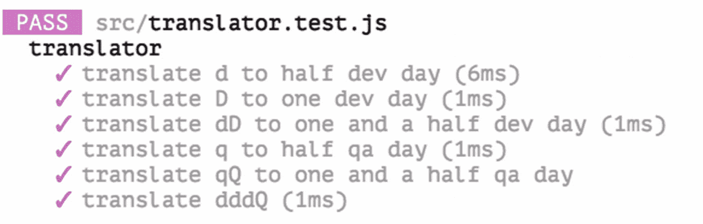

# 三、测试驱动开发 101

在本章中，我们将通过一步一步的指导来学习如何在我们的日常开发程序中应用`TDD`。通过这个演示，您将了解如何将一个大任务分割成相对较小的任务，并在学习一些重构技术的同时通过一系列测试来完成每个任务。在深入研究代码之前，让我们对如何编写一个合适的测试有一个基本的了解。

## 写作测试

那么，如何开始编写测试呢？一般来说，需要三个步骤(一如既往，甚至把大象放进冰箱)。首先，做一些准备工作，比如建立数据库，初始化被测对象，或者加载一些夹具数据。其次，调用要测试的方法或函数，通常将结果赋给某个变量。最后做一些断言，看看结果是否如预期。

### 使用给定的时间来安排测试

通常描述为`Given`、`When`、`Then`或`3A` s 格式，其中`A` s 代表`Arrange`、`Act`和`Assert`。两者描述了相同的过程。

在`Given`子句中，你描述了所有的准备工作，包括建立依赖关系。在`When`中，你触发动作或者改变一个被测对象的状态，通常是一个带有准备好的参数的函数调用。最后，在`Then`中，您检查结果，看它是否在某些方面与预期的结果匹配(确切地等于某个值，或者包含特定的模式或者抛出一个错误，等等)。

例如，假设我们有以下代码片段:

```jsx
// given
const user = User.create({ name: 'Juntao', address: 'ThoughtWorks Software Technologies (Melbourne)' })

// when
const name = user.getName()
const address = user.getAddress()

// then
expect(name).toEqual('Juntao')
expect(address).toEqual('ThoughtWorks Software Technologies (Melbourne)')

```

通常，您会将带有许多断言的测试用例分割成几个独立的用例，并让每个用例有一个单独的断言，比如

```jsx
it('creates user name', () => {
  // given
  const user = User.create({ name: 'Juntao', address: 'ThoughtWorks Software Technologies (Melbourne)' })

  // when
  const name = user.getName()

  // then
  expect(name).toEqual('Juntao')
});

it('creates user address', () => {
  // given
  const user = User.create({ name: 'Juntao', address: 'ThoughtWorks Software Technologies (Melbourne)' })

  // when
  const address = user.getAddress()

  // then
  expect(address).toEqual('ThoughtWorks Software Technologies (Melbourne)')
});

```

## 三角形法

有几种方法可以编写测试并驱动实现。一种普遍接受的方法叫做`triangulation`。让我们用一些例子来仔细看看如何去做。

### 示例:函数`addition`

假设我们正在用`TDD`实现一个计算器。对`addition`的测试可能是一个很好的起点。

#### 第一项测试为`addition`

`addition`的规格可以是

```jsx
describe('addition', () => {
  it('returns 5 when adding 2 and 3', () => {
    const a = 2, b = 3
    const result = add(a, b)
    expect(result).toEqual(5)
  })
})

```

#### 一个`Simple`实现

最简单的实现可以是

```jsx
const add = () => 5

```

乍一看，像这样写函数似乎很奇怪。但是它有几个好处。例如，对于开发人员来说，这是验证所有东西是否都连接正确的好方法。只需将前面显示的值`5`修改为`3`，以查看测试是否失败。当测试和实现没有恰当地联系起来时，您可能会得到一个误导性的*绿色*测试。

#### 使我们的实现不那么具体的第二个测试用例

我们可以为我们的`add`函数创建另一个测试:

```jsx
it('returns 6 when adding 2 and 4', () => {
    const a = 2, b = 4
    const result = add(a, b)
    expect(result).toEqual(6)
})

```

为了通过测试，最简单的解决方案变成了

```jsx
const add = (a, b) => 2 + b

```

这个想法是在每一步中编写一个失败但具体的测试来驱动实现代码变得更加通用。所以现在，实现比第一步更通用。然而，仍然有一些改进的空间。

#### 最终简单的实现

第三个测试可能是这样的

```jsx
it('returns 7 when adding 3 and 4', () => {
    const a = 3, b = 4
    const result = add(a, b)
    expect(result).toEqual(7)
})

```

这一次测试数据中没有模式可循，所以我们必须编写一些更复杂的东西来使它通过。实现变成了

```jsx
const add = (a, b) => a + b

```

现在，实现更加通用，将覆盖大多数附加场景。将来，我们的计算器可能需要支持虚数的`addition`；我们可以通过添加更多的测试来以同样的方式推出解决方案。

这种写测试的方法被称为`Triangulation`:你写一个失败的测试，然后写*足够的*代码使测试通过，然后你写另一个测试从另一个角度驱动变化。反过来，这将使您的实现更加通用。您继续以这种方式一步一步地工作，直到代码变得足够通用，能够支持业务需求中的大多数情况。

乍一看，这似乎太简单太慢，不是编写软件的有效方法，但是它是您可以并且应该依赖的坚实基础。无论是简单的任务还是复杂的任务，你都可以应用相同的过程。这又回到了`TDD`的一个关键部分，那就是能够简化任务，将较大的任务分成较小的部分。

好了，让我们更进一步，看看如何在一个更复杂的例子中应用`TDD`。

## 如何用 TDD 实现任务

在我目前从事的项目中，我们的团队使用一种非常简单的方式来跟踪投入到每个用户故事中的工作(一小块可以独立完成的工作)。通常，在一个敏捷项目中，随着生命周期的进展，每个卡片或标签可以有以下状态之一:`analysis`、`doing`或`testing`、`done`。当它所依赖的东西不完整或者还没有准备好的时候，它也可以是`blocked`。

我们使用的对故事的努力的测量是非常简单的。基本上，我们跟踪在编码上花了多少天，或者有多少天被阻塞。这样，项目经理就有机会了解项目的进展情况，项目的整体健康状况，以及可能采取的进一步改进措施。

我们在卡片的标题中用小写字母`d`表示已经在`development`下半天，用大写字母`D`表示一整天。不出意外，`q`半天`Quality Assurance`，`Q`一整天`QA`。这意味着在任何给定的时刻，你都会在卡片的标题上看到类似这样的内容:`[ddDQbq] Allow users to login to their profile page`—`b`代表被阻止。

### 用于跟踪进度的表达式解析器

让我们构建一个解析器，它可以读取跟踪标记`ddDQbq`并将其翻译成人类可读的格式，如下所示:

```jsx
{
  "Dev days": 2.0,
  "QA days": 1,
  "Blocked": 0.5
}

```

看起来很简单，对吧？迫不及待地开始编写代码？等等，让我们先从一个测试开始，感受一下在这种情况下如何应用`TDD`。

#### 将解析器分解为子任务

因此，第一个问题可能是:**我们如何将这样的任务分解成更小的任务** **以便于实现和验证？**虽然有多种方法，但合理的分割可以是

1.  编写一个测试来确保我们可以将`d`转换为半开发日。

2.  编写一个测试来确保我们可以将`D`转换为一个开发日。

3.  像`dD`一样编写一个测试来处理多个标记。

4.  编写一个测试来处理`q`。

5.  编写一个测试来处理`qQ`。

6.  编写一个测试来处理`ddQ`。

    正如我们在`Chapter` [`1`](01.html) 中讨论的，拆分对于应用 TDD 是必不可少的。小任务应该以不同的方式吸引和鼓励你:

7.  这很有趣(已经证明，当我们经历少量成就时，我们的大脑会释放多巴胺，多巴胺与快乐、学习和动力的感觉有关)。

8.  它确保快速反馈。

9.  它可以让您在任何给定的时间轻松了解任务的进度。

好了，一旦我们定义了这些步骤，我们就可以用 TDD 一个接一个地实现它们了。

### 逐步应用 TDD

因为我们已经有了任务分割，我们只需要将它们转化为相应的单元测试。让我们从第一个测试开始。

#### 第一项测试——解析并计算分数`d`

好了，理论够了，让我们把手弄脏吧。根据`tasking`步骤的输出，第一次测试应该是

```jsx
it('translates d to half a dev day', () => {
  expect(translate('d')).toEqual({'Dev': 0.5})
})

```

非常简单，实现可以简单到

```jsx
const translate = () => ({'Dev': 0.5})

```

它忽略输入并返回一个哑元`{'Dev': 0.5}`，但是你不得不佩服它满足了当前子任务的要求。又快又脏，但很管用。

#### 第二项测试——针对马克`D`

让我们划掉任务清单上的第一个待办事项，继续前进:

```jsx
it('translates D to one dev day', () => {
  expect(translate('D')).toEqual({'Dev': 1.0})
})

```

你能想到的最直接的解决方案是什么？也许是这样的:

```jsx
const translate = (c) => (c === 'd' ? {'Dev': 0.5}: {'Dev': 1.0})

```

我知道用这种方式写代码看起来很傻。然而，正如您所看到的，我们的实现是由相关的测试驱动的。只要测试通过——这意味着需求得到满足——我们就可以称之为满意。毕竟，我们编写代码的唯一原因是为了满足某些业务需求，对吗？

现在测试已经通过了，如果你发现一些可以改进的地方，比如`magic numbers`，或者方法体太长，你可以做一些重构。现在，我认为我们可以继续。

#### 音符的组合`d`和`D`

第三个测试可能是

```jsx
it('translates dD to one and a half dev days', () => {
  expect(translate('dD')).toEqual({'Dev': 1.5})
})

```

嗯，现在事情变得更复杂了；我们必须单独解析字符串并对结果求和。下面的代码片段应该可以完成这个任务:

```jsx
const translate = (input) => {
  let sum = 0;
  input.split('').forEach((c) => sum += c === 'd' ? 0.5: 1.0)
  return {'Dev': sum}
}

```

现在我们的程序可以毫无问题地处理所有的`d`或`D`组合序列，比如`ddd`或`DDdDd`。接下来是任务四:

```jsx
it('translates q to half a qa day', () => {
  expect(translate('q')).toEqual({'QA': 0.5})
})

```

似乎我们需要为每种状态设置一个`sum`函数，例如，`Dev`中的`sum`，`QA`中的`sum`。如果我们能稍微重构一下代码，使更改变得更容易，那就更方便了。因此，TDD 最漂亮的部分出现了——您不必担心意外破坏任何现有的功能，因为您有测试来覆盖它们。

#### 重构——提取函数

让我们将解析部分提取出来作为一个函数本身，并在`translate`中使用该函数。

重构后的`translate`函数可能是这样的:

```jsx
const parse = (c) => {
  switch(c) {
    case 'd': return {status: 'Dev', effort: 0.5}
    case 'D': return {status: 'Dev', effort: 1}
  }
}

const translate = (input) => {
  const state = {
    'Dev': 0,
    'QA': 0
  }

  input.split('').forEach((c) => {
    const {status, effort} = parse(c)
    state[status] = state[status] + effort
  })

  return state
}

```

现在，通过新的测试应该不难了。我们可以在`parse`中增加一个新的`case`:

```jsx
const parse = (c) => {
  switch(c) {
    case 'd': return {status: 'Dev', effort: 0.5}
    case 'D': return {status: 'Dev', effort: 1}
    case 'q': return {status: 'QA', effort: 0.5}
  }
}

```

### 保持重构——将函数提取到文件中

对于包含不同字符的任务，根本不需要修改代码。然而，作为一个负责任的程序员，我们可以不断清理代码，直到达到理想的状态。例如，我们可以将解析提取到一个查找字典中:

```jsx
const dict = {
  'd': {
    status: 'Dev',
    effort: 0.5
  },
  'D': {
    status: 'Dev',
    effort: 1.0
  },
  'q': {
    status: 'QA',
    effort: 0.5
  },
  'Q': {
    status: 'QA',
    effort: 1.0
  }
}

```

这将把`parse`函数简化为类似于

```jsx
const parse = (c) => dict[c]

```

为了清晰起见，您甚至可以将`dict`作为数据提取到一个名为`constants`的单独文件中，并将其导入到`translator.js`中。对于`translate`中的`forEach`功能，我们可以使用`Array.reduce`使其更短:

```jsx
const translate = (input) => {
  const items = input.split('')
  return items.reduce((accumulator, current) => {
    const { status, effort } = parse(current)
    accumulator[status] = (accumulator[status] || 0) + effort
    return accumulator
  }, {})
}

```

又漂亮又干净，对吧？正如你在图 [3-1](#Fig1) 中看到的，现在所有的测试都通过了。



图 3-1

翻译器的所有测试用例均通过

请注意，重构过程可以一直进行下去，直到您对代码感到满意为止。注意不要对潜在的变化做过多的假设，或者将代码抽象到超出有用的水平，从而过度设计。

## 摘要

我们学习了编写一个合适的测试的三个基本步骤，现在了解了如何使用`Triangulation`在测试中推出不同的路径。我们还学习了如何执行`tasking`来帮助我们编写测试。接下来，我们一步一步地按照`TDD`的方式完成了一个相当小的程序，最终在现实生活中得到一些有用的东西。