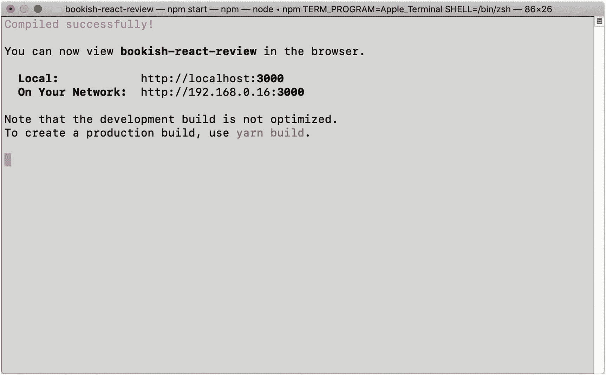
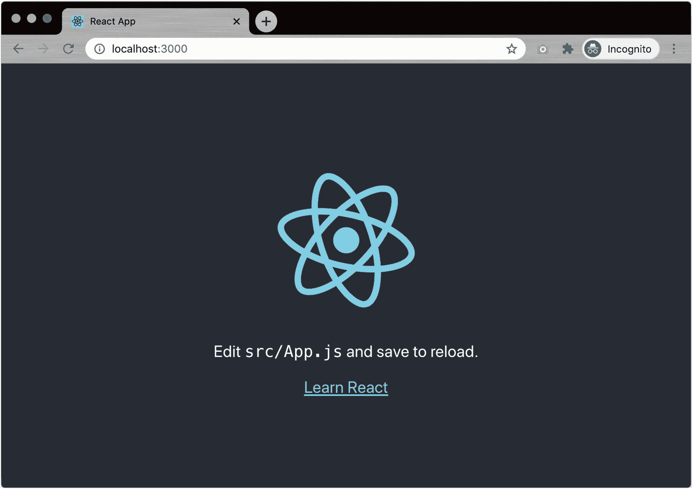
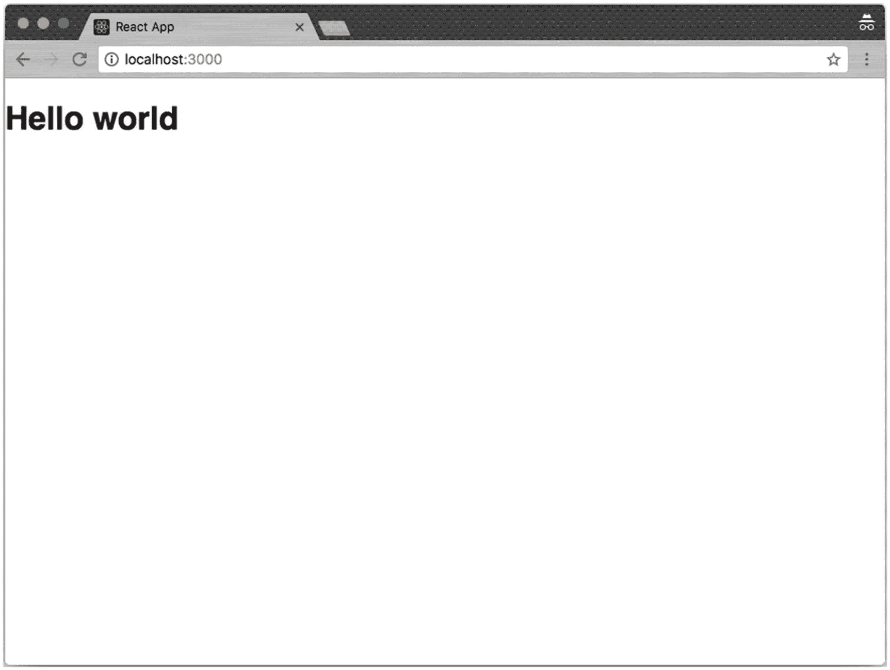
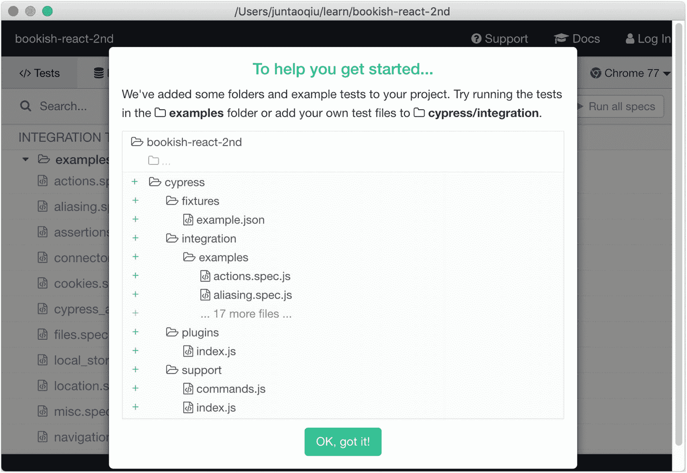
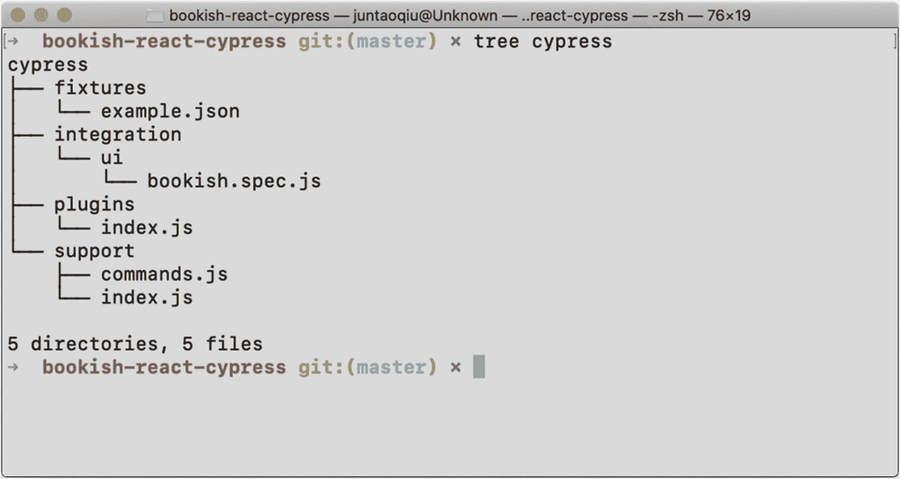
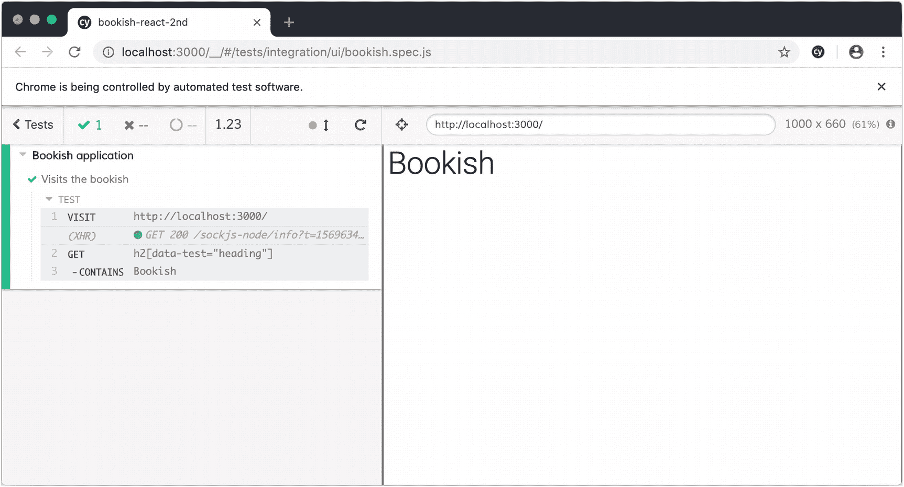
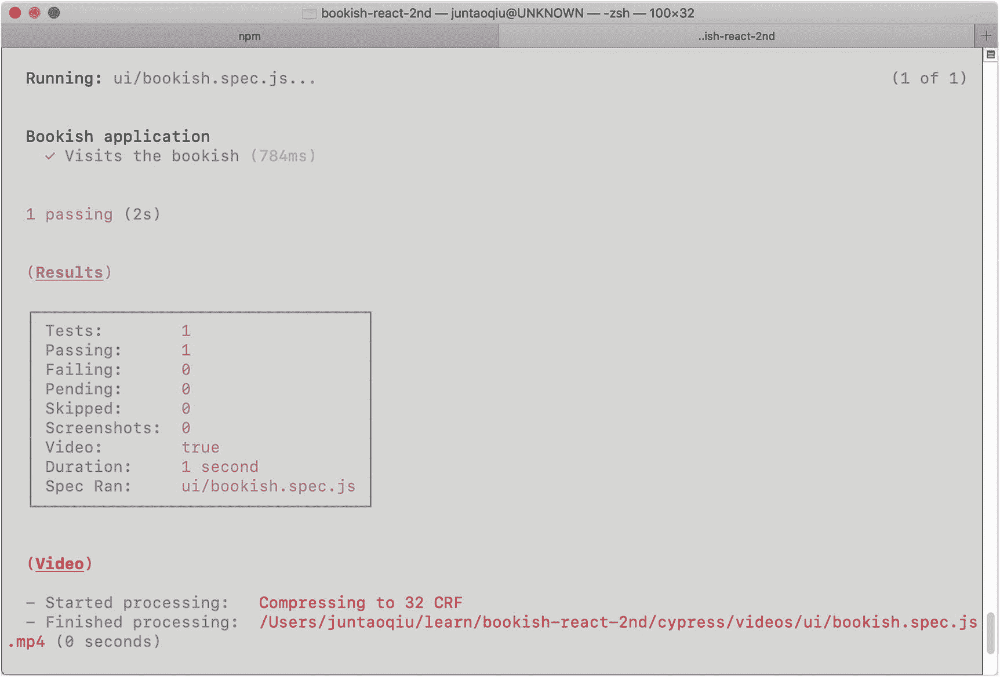

# 四、项目设置

在我们进入本书的主要内容之前，我们需要建立几个基础设施。我们将用`create-react-app`和 install/config `Material-UI`框架建立项目代码库和框架代码，以简化用户界面开发；最后但同样重要的是，我们将建立端到端的 UI 测试框架`Cypress`。

## 应用要求

在本书中，我们将从头开始开发一个 web 应用。我们将称之为`Bookish`；这是一个关于`books`的简单应用——顾名思义。在应用中，用户可以有一个图书列表，可以通过关键字搜索图书，用户可以导航到图书的详细页面，并查看图书的`description`、`review,`和`ranking`。我们将以迭代的方式完成一些特性，在这个过程中应用`ATDD`。

在应用中，我们将开发几个典型的功能，包括图书列表和图书详情页面，以及搜索和评论功能。

### 功能 1–书目

在现实世界中，一个特性的粒度要比我们在本书中描述的大得多。通常，在一个特性中会有许多用户故事，比如图书列表、分页、图书列表的样式等等。让我们假设这里每个特征只有一个故事。

*   出示书单。

我们可以用这种形式描述用户故事:

作为一个用户，我希望看到一个书单，这样我就可以学到一些新东西

这是一种非常流行的描述用户故事的格式，这是有充分理由的。通过描述`As a <role>`，它强调了谁将从这个特性中受益，通过说`I want to <do something>`，你解释了用户将如何与系统交互。最后，`So that <value>`一句话描述了这一功能背后的商业价值。

这种格式迫使我们从利益相关者的角度考虑问题，并希望告诉业务分析师和开发人员他们正在处理的用户故事中最重要的(有价值的)点是什么。

验收标准是

*   假设系统中有`ten`本书，用户应该在页面上看到十个项目。

*   在每个项目中，应该显示以下信息:书名、作者、价格和评级。

验收标准有时可以用以下方式书写:

```jsx
Given there are `10` books in the library
When a user visits the homepage
Then he/she would see `10` books on the page
And each book would contain at least `name`, `author`, `price` and `rating`

```

`given`子句解释了应用的当前状态，当它意味着用户触发一些动作时，例如，点击一个按钮或导航到一个页面，而`then`是一个断言，陈述了应用的预期性能。

### 功能 2–图书详情

*   显示图书详细信息。

作为一个用户，我希望看到一本书的细节，这样我就可以快速了解它的内容。

验收标准是

*   用户单击图书列表中的一个项目，然后被重定向到详细信息页面。

*   详细信息页面显示书名、作者、价格、描述和任何评论。

### 功能 3–搜索

*   按书名搜索

作为一个用户，我想按书名搜索一本书，这样我就可以快速找到我感兴趣的内容。

验收标准是

*   用户键入`Refactoring`作为搜索词。

*   图书列表中只显示名称中带有`Refactoring`的图书。

### 功能 4–评论

*   除了详细页面上的其他信息之外

作为一名用户，我希望能够给我以前读过的一本书添加评论，以便有相同兴趣的人可以决定是否值得阅读。

相应的验收标准是

*   用户可以在详细页面上阅读评论。

*   用户可以对某本书发表评论。

*   用户可以编辑他们发布的评论。

定义好所有这些需求后，我们就可以开始项目设置了。

## 创建项目

让我们首先从一些基本的软件包安装和配置开始。确保本地安装了`node`(至少需要节点> = 8.10 和 npm > = 5.6)。之后，您可以使用`npm`来安装构建我们的`Bookish`应用所需的工具(我们已经在前一章中介绍了这一部分；万一你还没看过，就去看看吧)。

### 使用创建-React-应用

安装完成后，我们可以使用`create-react-app`包来创建我们的项目:

```jsx
npx create-react-app bookish-react

```

`create-react-app`会默认安装`react`、`react-dom`和一个名为`react-scripts`的命令行工具。此外，它会自动下载这些库及其依赖项，包括`webpack`、`babel`等。通过使用`create-react-app`，我们不需要任何配置就可以启动并运行应用。

在创建过程之后，正如控制台日志所建议的，我们可以跳转到`bookish-react`文件夹并运行`npm start`，然后您应该能够看到它像图 [4-1](#Fig1) 那样启动:

```jsx
cd bookish-react
npm start

```



图 4-1

在终端中启动您的应用

会有一个新的浏览器标签页自动打开在这个地址:`http://localhost:3000`。用户界面应该如图 4-2 所示。



图 4-2

在浏览器中运行的应用

#### 项目文件结构

我们不需要由`create-react-app`生成的所有文件，所以让我们先做一些清理工作。我们可以删除`src`文件夹中所有不相关的文件，给我们留下以下文件:

```jsx
src
├── App.css
├── App.js
├── index.css
└── index.js

```

修改`App.js`文件内容，如下所示:

```jsx
 import React from 'react';
 import './App.css';

 function App() {
    return (
      <div className='App'>
        <h1>Hello world</h1>
      </div>
    );
 }

 export default App;

```

而`index.js`是这样的:

```jsx
import React from 'react';
import ReactDOM from 'react-dom';
import './index.css';
import App from './App';

ReactDOM.render(<App />, document.getElementById('root'));

```

那么我们的用户界面看起来应该如图 4-3 所示。



图 4-3

清理后

### 材料-用户界面库

为了让我们在这里演示的应用看起来更真实，同时减少代码片段中的`css`技巧，我们将使用`Material-UI`。这个库包含许多现成的可重用组件，比如`Tabs`、`ExpandablePanel`等等。这将帮助我们更快、更容易地构建我们的`bookish`应用。

安装非常简单；再来一个`npm install`就可以了:

```jsx
npm install @material-ui/core @material-ui/icons --save

```

之后，让我们在我们的`public/index.html`中放置一些字体来改善外观和感觉。

#### 字体和图标

注意第二行是用于`svg`图标的:

```jsx
<link rel='stylesheet' href='https://fonts.googleapis.com/css?family=Roboto:300,400,500,700&display=swap' />
<link rel='stylesheet' href='https://fonts.googleapis.com/icon?family=Material+Icons' />

```

这就是我们目前所需要的。

#### 以`Typography`为例

我们可以在代码中使用来自`material-ui`的`Component`，像这样在`App.js`中导入模块:

```jsx
import { Typography } from '@material-ui/core';

```

然后将`h1`改为`<Typography>`:

```jsx
  <Typography variant='h2' component='h2' data-test='heading'>
  Bookish
  </Typography>

```

通过使用`Material-UI`，我们不再需要为`css`准备一个单独的文件，因为它利用了`css-in-js`方法来使组件被封装和独立。然后我们可以删除所有的`.css`文件，确保删除对它们的任何引用。

现在，项目结构只剩下两个文件:

```jsx
src
├── App.js
└── index.js

```

`index.js`应该是这样的:

```jsx
import React from 'react';
import ReactDOM from 'react-dom';

import App from './App';

ReactDOM.render(<App />, document.getElementById('root'));

```

并且`App.js`这样:

```jsx
import React from 'react';
import Typography from '@material-ui/core/Typography';

function App() {
  return (
    <div>
      <Typography variant='h2' component='h2' data-test='heading'>
      Bookish
      </Typography>
    </div>
  );
}

export default App;

```

### 柏树

在本书的第一版中，我使用了[木偶师](https://github.com/puppeteer/puppeteer)作为 UI 功能测试的引擎，这是一个非常好的工具。但是，我发现它的 API 对大多数初学者来说水平太低了。从最终用户的角度来看，当查询页面上的元素时，您必须记住许多不必要的细节，比如`async/await`对。而且它不提供基本的助手，比如`fixtures`或者`stubs`，这些助手在`TDD`中被广泛使用。

所以这一次，我将使用 Cypress 想法几乎是一样的，`Cypress`给了我们更多的选择和更好的机制来减少编写测试的工作量。像`fixture`和`route`这样的功能是工具自带的，可以让我们的生活变得更加轻松。

好消息是安装很简单，您根本不需要配置它。

#### 树立柏树

让我们运行以下命令来启动:

```jsx
npm install cypress --save-dev

```

安装完成后，确保应用正在运行，然后我们可以运行`cypress`命令来启动 GUI 以创建我们的第一个测试套件，如图 [4-4](#Fig4) 所示:

```jsx
npx cypress open

```



图 4-4

赛普拉斯的介绍页

这将在我们的项目代码之外创建一个名为`cypress`的新文件夹。

现在，让我们去掉大部分生成的代码，在`ui`文件夹下创建一个文件`bookish.spec.js`，这个文件在`cypress/integration`下，用于我们的第一个端到端测试。文件夹结构应该如图 [4-5](#Fig5) 所示。



图 4-5

柏树的折叠结构

目前，我们唯一需要关心的是`bookish.spec.js`。我们将在接下来的章节中研究`fixtures`。

#### 编写我们的第一个端到端测试

你还记得我们讨论过`TDD`最具挑战性的部分可能是从哪里开始以及如何编写第一个测试吗？

我们第一个测试的可行选项是

*   确保页面上有一个`Heading`元素，内容是`Bookish`。

这个测试乍看起来可能毫无意义，但实际上，它可以确保

*   前端代码可以编译翻译。

*   浏览器可以正确地呈现我们的页面(没有任何脚本错误)。

所以，在我们的`bookish.spec.js`中，简单地说

```jsx
describe('Bookish application', function() {
  it('Visits the bookish', function() {
    cy.visit('http://localhost:3000/');
    cy.get('h2[data-test="heading"]').contains('Bookish')
  })
})

```

`cy`是`cypress`中的全局对象。它几乎包含了我们编写测试所需的一切:导航到浏览器，查询页面上的元素，以及执行断言。我们刚刚编写的测试试图访问`http://localhost:3000/`，然后确保将`data-test`标志作为`heading`的`h2`的内容等于字符串:`Bookish`(图 [4-6](#Fig6) )。



图 4-6

运行我们的第一个测试

在日常的开发工作流中，尤其是当有几个端到端的测试正在运行时，您可能不希望看到所有的细节(填写表单字段、滚动页面或一些通知)，因此您可以使用以下命令将其配置为在 headless 模式下运行:

```jsx
npx cypress run

```

#### 定义快捷命令

只需在`package.json`中的`scripts`部分下定义一个新任务:

```jsx
"scripts": {
  "e2e": "cypress run"
},

```

确保应用正在运行(`npm start`)，然后从另一个终端运行`npm run e2e`。这将为您完成所有的脏工作，并在所有测试完成后给您一份详细的报告(图 [4-7](#Fig7) )。



图 4-7

在终端中运行端到端测试

另外，您也可以在 CI 环境中使用这个`command`。

### 将代码提交到版本控制

太美了！我们现在有了验收测试及其相应的实现，我们可以将代码提交给版本控制，以防将来需要回顾。我将在本书中使用`git`,因为它是最受欢迎的一个，你会发现现在几乎每个开发人员的计算机中都安装了它。

运行以下命令会将当前文件夹初始化为`git`存储库:

```jsx
git init

```

然后在本地犯。当然，您可能还想将其推送到 GitHub 或 GitLab 之类的远程存储库，以便与同事共享:

```jsx
git add .
git commit -m "make the first e2e test pass"

```

#### 要忽略的文件

如果你有不想发布或分享给他人的东西，在根目录下创建一个`.gitignore`文本文件，把不想分享的文件名放进去，像这样:

```jsx
*.log
.idea/
debug/

```

前面提到的列表将忽略任何带有`log`扩展名和文件夹`.idea`的文件(由 JetBrains IDEs 如 WebStorm 自动生成)。

## 摘要

现在看看我们得到了什么:

*   运行验收测试套件

*   可以将`Bookish`渲染为`heading`的页面

这是一个伟大的成就。现在，我们已经建立了所有必要的机制，我们可以专注于业务需求的实现。