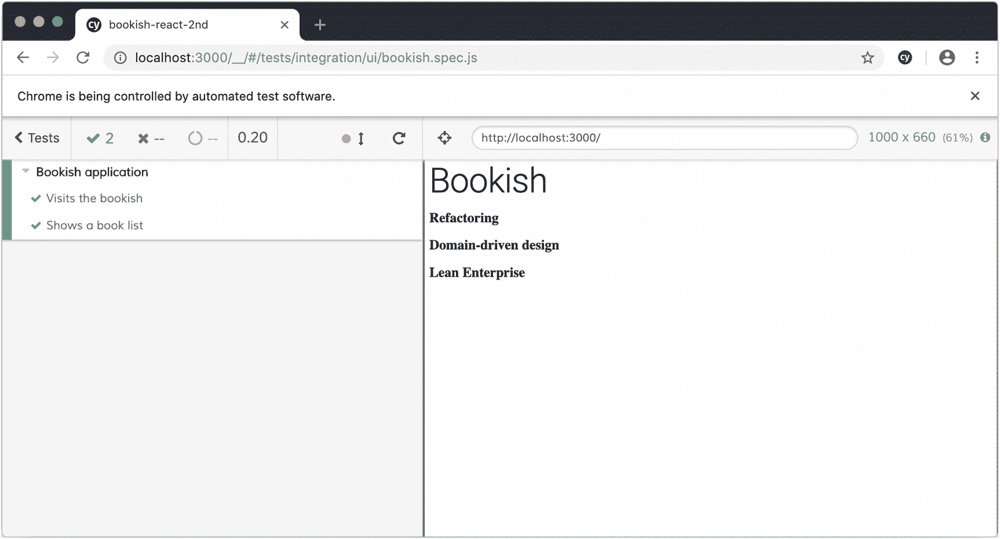
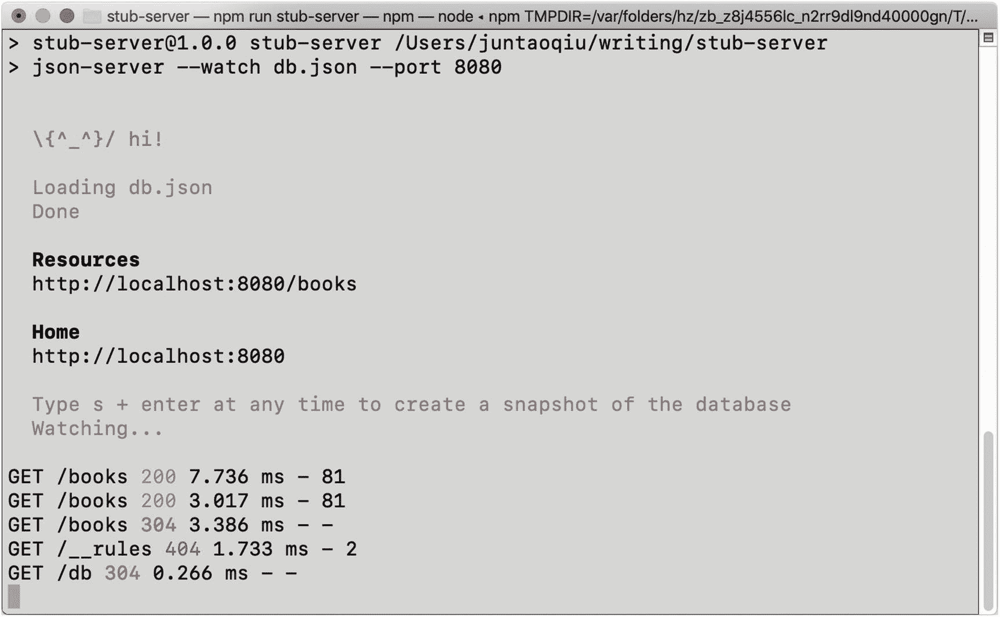
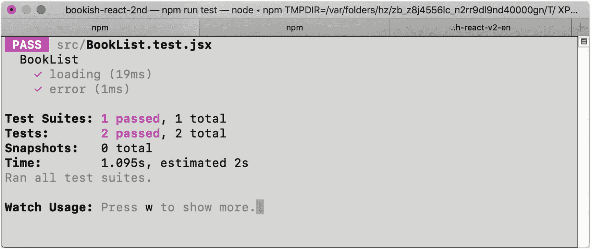
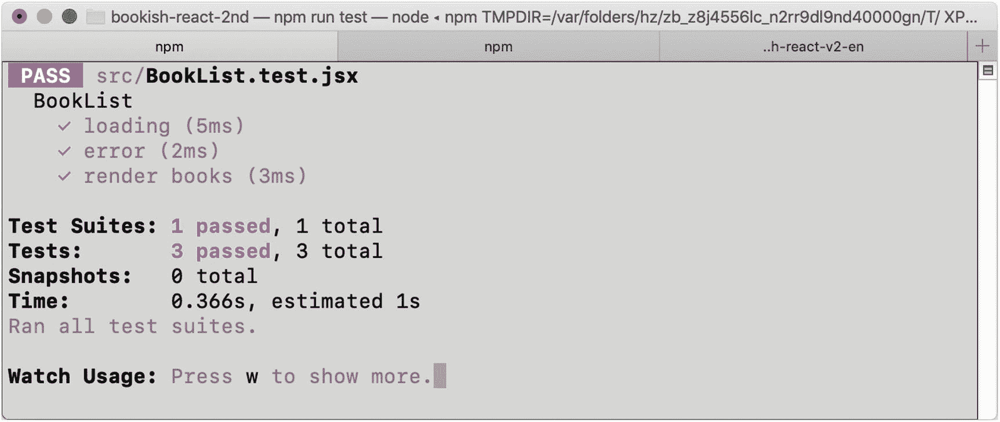

# 五、实现图书列表

我们的第一个要求是制定一个书单。从验收测试的角度来看，我们所要做的就是确保页面包含图书列表——我们不需要担心将使用什么技术来实现页面。而且不管页面是动态生成的还是只是静态 HTML，只要页面上有图书列表就行。

## 书单的验收测试

### (书的)清单

首先，让我们在`describe`块的`bookish.spec.js`中添加一个测试用例:

```jsx
it('Shows a book list', () => {
  cy.visit('http://localhost:3000/');
  cy.get('div[data-test="book-list"]').should('exist');
  cy.get('div.book-item').should('have.length', 2);
})

```

我们期望有一个容器具有`book list`的`data-test`属性，并且这个容器有几个`.book-item`元素。如果我们现在运行测试(`npm run e2e`)，它将悲惨地失败。按照`TDD`的步骤，我们需要实现尽可能简单的代码来通过测试:

```jsx
       <Typography variant='h2' component='h2' data-test='heading'>
       Bookish
       </Typography>
+      <div data-test='book-list'>
+        <div className='book-item'>
+        </div>
+        <div className='book-item'>
+        </div>
+      </div>
     </div>
   );
 }

```

### 验证图书名称

太好了，测试通过了。如你所见，我们已经通过测试*驱动了*HTML 结构。现在让我们为测试添加另一个期望:

```jsx
     cy.get('div[data-test="book-list"]').should('exist');
-    cy.get('div.book-item').should('have.length', 2);
+    cy.get('div.book-item').should((books) => {
+      expect(books).to.have.length(2);
+
+      const titles = [...books].map(x => x.querySelector('h2').innerHTML);
+      expect(titles).to.deep.equal(['Refactoring', 'Domain-driven design'])
+    })
   })

```

为了通过这个测试，我们可以再次对我们期望的 html 进行硬编码:

```jsx
    <div data-test='book-list'>
      <div className='book-item'>
+       <h2 className='title'>Refactoring</h2>
      </div>
      <div className='book-item'>
+       <h2 className='title'>Domain-driven design</h2>
      </div>
    </div>

```

太棒了。我们的测试再次通过(图 [5-1](#Fig1) )。



图 5-1

通过硬编码书名的测试

现在是时候审查代码，检查是否有任何代码味道，然后进行任何必要的重构。

### 重构——提取函数

首先，将所有的`.book-item`元素放在`render`方法中可能并不理想。相反，我们可以使用一个`forloop`来生成 HTML 内容。

对于关心干净代码的开发人员来说，静态重复是不可接受的，对吗？所以我们可以把它作为一个变量(`books`)提取出来，然后执行一个`map`:

```jsx
 function App() {
+  const books = [{ name: 'Refactoring' }, { name: 'Domain-driven design' }];
+
   return (
     <div>
       <Typography variant='h2' component='h2' data-test='heading'>
       Bookish
       </Typography>
       <div data-test='book-list'>
-        <div className='book-item'>
-          <h2 className='title'>Refactoring</h2>
-        </div>
-        <div className='book-item'>
-          <h2 className='title'>Domain-driven design</h2>
-        </div>
+      {
+        books.map(book => (<div className='book-item'>
+          <h2 className='title'>{book.name}</h2>
+        </div>))
+      }
       </div>
     </div>
   );

```

之后，我们可以将`map`块提取到一个函数中，该函数负责通过任意数量的给定的`book`对象来呈现书籍:

```jsx
const renderBooks = (books) => {
  return <div data-test='book-list'>
    {
      books.map(book => (<div className='book-item'>
        <h2 className='title'>{book.name}</h2>
      </div>))
    }
  </div>;
}

```

注意这里复习了提取功能， [`https://refactoring.com/catalog/extractFunction.html`](https://refactoring.com/catalog/extractFunction.html)

每当调用该方法时，我们可以传递一组书籍，如下所示:

```jsx
       <Typography variant='h2' component='h2' data-test='heading'>
       Bookish
       </Typography>
-      <div data-test='book-list'>
-      {
-        books.map(book => (<div className='book-item'>
-          <h2 className='title'>{book.name}</h2>
-        </div>))
-      }
-      </div>
+      {renderBooks(books)}
     </div>
   );

```

我们的测试仍然通过。我们改进了内部实现，而没有修改外部行为。这很好地展示了`TDD`提供的好处之一:更容易、更安全的清理。

### 重构——提取组件

现在，代码更加简洁明了，但还可以做得更好。一个可能的变化是进一步模块化代码；抽象的粒度应该基于`component`，而不是基于`function`。例如，我们使用函数`renderBooks`将解析后的数组呈现为图书列表，我们可以抽象一个名为`BookList`的组件来做同样的事情。创建一个文件`BookList.js`，将函数`renderBooks`移入其中。

从 React 16 开始，在大多数情况下，我们在创建组件时不需要`class`。通过使用一个纯函数，它可以更容易地完成(并且代码更少)。

```jsx
import React from 'react';

const BookList = ({books}) => {
  return <div data-test='book-list'>
    {
      books.map(book => (<div className='book-item'>
        <h2 className='title'>{book.name}</h2>
      </div>))
    }
  </div>;
}

export default BookList;

```

现在，我们可以像使用任何`React`内置组件一样使用这个定制组件(例如`div`或`h1`):

```jsx
function App() {
  const books = [
    { name: 'Refactoring' },
    { name: 'Domain-driven design' }
  ];

  return (
    <div>
      <Typography variant='h2' component='h2' data-test='heading'>
      Bookish
      </Typography>
      <BookList books={books} />
    </div>
  );
}

```

通过这种重构，我们的代码变得更具声明性，也更容易理解。此外，我们的测试仍然是`green`。你可以无所畏惧地修改代码，而不用担心破坏现有的功能。它给你信心去改变现有的代码并提高内部质量。

## 与图书服务器交谈

一般来说，书单的数据千万不要硬编码在代码里。在大多数实际项目中，这些数据存储在远程服务器上的某个地方，需要在应用启动时获取。为了让我们的应用以这种方式工作，我们需要做以下事情:

*   配置一个存根服务器来提供我们需要的图书数据。

*   使用客户端网络库`axios`从存根服务器获取数据。

*   使用获取的数据呈现我们的组件。

虽然我们可以简单地使用原生 API `fetch`与服务器端进行通信，但在这种情况下我更喜欢使用`axios`，因为它提供了语义 API ( `axios.get`、`axios.put`等等)，并且它具有抽象和垫片来阻止不同浏览器之间的差异(以及不同版本的同一浏览器)。

所以我们先来看看`stub server`。

### 存根服务器

存根服务器通常用在开发过程中。这里，我们将使用一个叫做`json-server`的工具。这是一个非常轻量级且易于上手的节点包。

#### 设置`json`-服务器

首先，我们需要将它安装到全球空间中，就像我们安装其他工具一样:

```jsx
npm install json-server --global

```

然后，我们将创建一个名为`stub-server`的空文件夹:

```jsx
mkdir -p stub-server
cd stub-server

```

之后，我们创建一个包含以下内容的`db.json`文件:

```jsx
{
  "books": [
    { "name": "Refactoring" },
    { "name": "Domain-driven design" }
  ]
}

```

该文件定义了一个`route`和该`route`的数据。现在，我们可以使用以下命令启动服务器:

```jsx
json-server --watch db.json --port 8080

```

如果您打开浏览器并导航到`http://localhost:8080/books`，您应该能够看到如下内容:

```jsx
[
  {
    "name": "Refactoring"
  },
  {
    "name": "Domain-driven design"
  }
]

```

当然，您可以使用`curl`从命令行获取它。

#### 确保存根服务器正在工作

为了验证存根服务器是否如预期的那样工作，我们可以像这样运行 curl 来测试它，我们应该能够看到我们在前面的部分中设置的响应:

```jsx
$ curl http://localhost:8080/books

[
  {
    "name": "Refactoring"
  },
  {
    "name": "Domain-driven design"
  }
]

```

让我们添加一个脚本，让生活变得简单一点。在我们的`package.json`中的`scripts`下，增加`scripts`部分:

```jsx
"scripts": {
  "stub-server": "json-server --watch db.json --port 8080"
},

```

我们可以从根目录运行`npm run stub-server`来启动并运行我们的存根服务器。太好了。让我们尝试对 bookish 应用进行一些更改，以便通过 HTTP 调用获取这些数据。

### 应用中的异步请求

回到应用文件夹:`bookish-react`。为了发送请求和获取数据，我们需要一个 HTTP 客户端。在这种情况下，我们将使用`axios`。

在我们的项目中安装`axios`很容易:

```jsx
npm install axios --save

```

然后，我们可以用它来获取我们的`App.js`中的数据，如下所示:

```jsx
-import React from 'react';
+import React, { useState, useEffect } from 'react;
import Typography from '@material-ui/core/Typography';
+import axios from 'axios';

import BookList from './BookList';

-function App() {
-  const books = [{ name: 'Refactoring' }, { name: 'Domain-driven design' }];
+const App = () => {
+  const [books, setBooks] = useState([]);
+
+  useEffect(() => {
+    const fetchBooks = async () => {
+      const res = await axios.get('http://localhost:8080/books');
+      setBooks(res.data);
+    };
+
+    fetchBooks();
+  }, []);

   return (
     <div>

```

你可能注意到了，当我们这么做的时候，我们将 App 组件重构为一个功能组件，而不是一个类组件。这允许我们使用 react-hooks API:`useState`和`useEffect`。`useState`类似于`this.setState` API，而`useEffect`用于副作用，如`setTimeout`或`async`远程调用。在回调中，我们定义了一个向`localhost:8080/books`发送异步调用的`effect`，一旦获取数据，将用该数据调用`setBooks`，最后用来自状态的`books`调用`BookList`。

当我们现在运行我们的应用时，当到达`books` API 时，您可以在控制台中看到来自存根服务器的一些输出(图 [5-2](#Fig2) )。



图 5-2

启动存根服务器

### 安装和拆卸

让我们仔细看看我们的代码和测试。如你所见，这里隐含的假设是测试*知道*实现将返回`two`本书。这个假设的问题是它让测试变得有点神秘:为什么我们期待`expect(books.length).toEqual(2)`，为什么不期待`3`？还有为什么那两本书是`Refactoring`和`Domain-Driven Design`？这种假设应该避免，或者应该在测试中的某个地方解释清楚。

一种方法是创建一些 fixture 数据，这些数据将在每次测试前设置，并在每次测试完成后清除。

`json-server`提供了一种可编程的方式来做到这一点。我们可以用一些代码来定义存根服务器的行为。

#### 用`Middleware`扩展存根簿服务

对于这一步，我们需要在本地安装`json-server`，所以从命令行运行`npm install json-server --save-dev`。

在`stub-server`文件夹中，创建一个名为`server.js`的文件，并在其中添加一些`middleware`:

```jsx
const jsonServer = require('json-server')
const server = jsonServer.create()
const router = jsonServer.router('db.json')
const middlewares = jsonServer.defaults()

server.use((req, res, next) => {
  if (req.method === 'DELETE' && req.query['_cleanup']) {
    const db = router.db
    db.set('books', []).write()
    res.sendStatus(204)
  } else {
    next()
  }
})

server.use(middlewares)
server.use(router)

server.listen(8080, () => {
    console.log('JSON Server is running')
})

```

该函数将根据收到的请求方法和查询字符串执行一些操作。如果请求是一个`DELETE`请求，并且查询字符串中有一个`_cleanup`参数，我们将通过将`req.entity`设置为空数组来清理实体。所以当你发送一个`DELETE`到`http://localhost:8080/books?_cleanup=true`时，这个函数会将`books`数组置空。

有了这些代码，您可以使用以下命令启动服务器:

```jsx
node server.js

```

完整版的存根服务器代码托管在这里: [`https://github.com/abruzzi/react-tdd-mock-server`](https://github.com/abruzzi/react-tdd-mock-server)

一旦我们有了这个中间件，我们就可以在我们的测试设置和拆卸挂钩中使用它。在`bookish.spec.js`的顶部，在`describe`模块内，添加

```jsx
before(() => {
  return axios
    .delete('http://localhost:8080/books?_cleanup=true')
    .catch((err) => err);
});

afterEach(() => {
  return axios
    .delete('http://localhost:8080/books?_cleanup=true')
    .catch(err => err)
})

beforeEach(() => {
  const books = [
    { 'name': 'Refactoring', 'id': 1 },
    { 'name': 'Domain-driven design', 'id': 2 }
  ]

  return books.map(item =>
    axios.post('http://localhost:8080/books', item,
      { headers: { 'Content-Type': 'application/json' } }
    )
  )
})

```

确保在文件顶部也导入`axios`。

在所有测试运行之前，我们将通过向这个端点`'http://localhost:8080/books?_cleanup=true'`发送一个`DELETE`请求来删除数据库中的任何内容。然后，在运行每个测试之前，我们将两本书插入存根服务器，并对 URL: `http://localhost:8080/books`发出`POST`请求。最后，在每次测试后，我们会清理它们。

在存根服务器运行的情况下，运行测试并观察控制台中发生的情况。

#### 每个挂钩之前和之后

现在，我们可以随意修改设置中的数据。例如，我们可以添加另一本名为`Building Microservices`的书:

```jsx
beforeEach(() => {
  const books = [
    { 'name': 'Refactoring', 'id': 1 },
    { 'name': 'Domain-driven design', 'id': 2 },
    { 'name': 'Building Microservices', 'id': 3 }
  ]

  return books.map(item =>
    axios.post('http://localhost:8080/books', item,
      { headers: { 'Content-Type': 'application/json' } }
    )
  )
})

```

并期待`three`本书在测试:

```jsx
it('Shows a book list', () => {
  cy.visit('http://localhost:3000/');
  cy.get('div[data-test="book-list"]').should('exist');
  cy.get('div.book-item').should((books) => {
    expect(books).to.have.length(3);

    const titles = [...books].map(x => x.querySelector('h2').innerHTML);
    expect(titles).to.deep.equal(
      ['Refactoring', 'Domain-driven design', 'Building Microservices']
    )
  })
});

```

## 添加装载指示器

我们的应用正在远程获取数据，不能保证数据会立即返回。我们希望有一些加载时间的指标，以改善用户体验。此外，当根本没有网络连接(或超时)时，我们需要显示一些错误消息。

在我们将它添加到代码中之前，让我们想象一下如何模拟这两个场景:

*   缓慢的请求

*   失败的请求

不幸的是，这两个场景都不容易模拟，即使我们可以模拟，我们也必须将测试与代码紧密耦合。让我们仔细反思一下我们想要做什么:组件有三种状态(加载、错误、成功)，所以如果我们能够以隔离的方式测试这三种状态的行为，那么我们就可以确保我们的组件是功能性的。

### 首先重构

为了让测试更容易编写，我们需要先做一点重构。看一看`App.js`:

```jsx
import BookList from './BookList';

const App = () => {
  const [books, setBooks] = useState([]);

  useEffect(() => {
    const fetchBooks = async () => {
      const res = await axios.get('http://localhost:8080/books');
      setBooks(res.data);
    };

    fetchBooks();
  }, []);

  return (
    <div>
      <Typography variant='h2' component='h2' data-test='heading'>
      Bookish
      </Typography>
      <BookList books={books} />
    </div>
  );
}

```

目的现在看起来很清楚，但是如果我们想增加更多的州，责任可能是混合的。

#### 添加更多状态

如果我们想处理有`loading`或`error`状态的情况，我们需要向组件引入更多的状态:

```jsx
 const App = () => {
   const [books, setBooks] = useState([]);
+  const [loading, setLoading] = useState(false);
+  const [error, setError] = useState(false);

   useEffect(() => {
     const fetchBooks = async () => {
-      const res = await axios.get('http://localhost:8080/books');
-      setBooks(res.data);
+      setError(false);
+      setLoading(true);
+
+      try {
+        const res = await axios.get('http://localhost:8080/books');
+        setBooks(res.data);
+      } catch (e) {
+        setError(true);
+      } finally {
+        setLoading(false);
+      }
     };

     fetchBooks();
   }, []);

```

由于我们不一定需要显示整个页面的`loading`和`error`，我们可以将它移到自己的组件`BookListContainer.js`中。

#### 重构:提取组件

```jsx
import React, {useEffect, useState} from 'react';
import axios from 'axios';
import BookList from './BookList';

const BookListContainer = () => {
  const [books, setBooks] = useState([]);
  const [loading, setLoading] = useState(false);
  const [error, setError] = useState(false);

  useEffect(() => {
    const fetchBooks = async () => {
      setError(false);
      setLoading(true);

      try {
        const res = await axios.get('http://localhost:8080/books');
        setBooks(res.data);
      } catch (e) {
        setError(true);
      } finally {
        setLoading(false);
      }
    };

    fetchBooks();
  }, []);

  return <BookList books={books} />
}

export default BookListContainer;

```

然后这个应用就变成了

```jsx
const App = () => {
  return (
    <div>
      <Typography variant='h2' component='h2' data-test='heading'>
        Bookish
      </Typography>
      <BookListContainer/>
    </div>
  );
}

```

嗯，可行。但是缺点是我们仍然将网络请求和渲染耦合在一起。这使得单元测试非常复杂。所以我们把网络和渲染分开。

### 定义一个 React 钩子

幸运的是，React 允许我们以非常灵活的方式定义钩子。我们可以将网络部分提取到一个`hooks.js`文件中的一个`hook`中，并允许组件像使用其他`hook`一样使用它。

```jsx
export const useRemoteService = (initial) => {
  const [data, setData] = useState(initial);
  const [loading, setLoading] = useState(false);
  const [error, setError] = useState(false);

  useEffect(() => {
    const fetchBooks = async () => {
      setError(false);
      setLoading(true);

      try {
        const res = await axios.get('http://localhost:8080/books');
        setData(res.data);
      } catch (e) {
        setError(true);
      } finally {
        setLoading(false);
      }
    };

    fetchBooks();
  }, []);

  return {data, loading, error};
}

```

这里，我们将所有与网络相关的代码分解到一个钩子中。在`BookListContainer`中，我们可以这样调用它:

```jsx
const BookListContainer = () => {
  const {data, loading, error} = useRemoteService([]);

  // if(loading) {
  //   return <p>Loading...</p>
  // }

  // if(error) {
  //   return <p>Error...</p>
  // }

  return <BookList books={data} />
}

```

看起来很酷，对吧？`useRemoteService`唯一需要的参数是`BookList`渲染的默认值。代码现在很好很干净，最重要的是，功能测试仍然通过。

#### 使用`useRemoteService`挂钩

此外，我更喜欢将所有的 UI 元素放在一起，这可以使单元测试更加方便:

```jsx
const BookListContainer = () => {
  const {data, loading, error} = useRemoteService([]);
  return <BookList books={data} loading={loading} error={error}/>
}

```

我们将`loading`和`error`状态传递给`BookList`组件，让它决定显示什么。在我们直接进入实现之前，让我们为这些场景编写一些单元测试。

### 使用 React 测试库进行单元测试

在我们添加任何单元测试之前，我们需要添加一些包:

```jsx
npm install @testing-library/react --save-dev

```

#### 测试加载状态

现在，在`src`中创建一个名为`BookList.test.js`的测试文件:

```jsx
import React from 'react'
import {render} from '@testing-library/react'

import BookList from './BookList';

describe('BookList', () => {
  it('loading', () => {
    const props = {
      loading: true
    };
    const {container} = render(<BookList {...props} />)
    const content = container.querySelector('p');
    expect(content.innerHTML).toContain('Loading');
  });
});

```

用`npm test`运行测试。因为我们还没有代码，所以测试会失败。

我们可以实施一个快速解决方案:

```jsx
const BookList = ({loading, books}) => {
  if(loading) {
    return <p>Loading...</p>
  }

  return <div data-test='book-list'>
    {
      books.map(book => (<div className='book-item'>
        <h2 className='title'>{book.name}</h2>
      </div>))
    }
  </div>;
}

```

#### 测试错误状态

测试网络错误的情况，你可以看到现在所有的测试都通过了图 [5-3](#Fig3)

```jsx
it('error', () => {
  const props = {
    error: true
  };
  const {container} = render(<BookList {...props} />);
   const content = container.querySelector('p');
expect(content.innerHTML).toContain('Error');
})

```



图 5-3

关于错误状态的测试现在通过

#### 测试预期数据

最后，我们可以添加一个`happy path`来确保我们的组件在成功场景中呈现:

```jsx
it('render books', () => {
  const props = {
    books: [
      { 'name': 'Refactoring', 'id': 1 },
      { 'name': 'Domain-driven design', 'id': 2 },
    ]
  };

  const { container } = render(<BookList {...props} />);
  const titles = [...container.querySelectorAll('h2')].map(x => x.innerHTML);
  expect(titles).toEqual(['Refactoring', 'Domain-driven design']);
})

```

您可能想知道这是不是重复——我们不是已经在验收`test`中测试过这个案例了吗？嗯，*是*和*否*。单元测试中的案例可以用作文档；它指定组件需要什么参数、字段名称和类型。例如，在`props`中，我们明确显示了`BookList`需要一个带有图书字段的对象，这是一个数组。

运行测试时，我们将在控制台中看到一条警告:

```jsx
  console.error node_modules/react/cjs/react.development.js:172
    Warning: Each child in a list should have a unique 'key' prop.

    Check the render method of "BookList." See https://fb.me/react-warning-keys for more information.
        in div (at BookList.jsx:14)
        in BookList (at BookList.test.jsx:32)

```

这告诉我们，当呈现一个列表时，`React`要求每个条目都有一个唯一的`key`，比如`id`。我们可以通过为循环中的每一项添加一个`key`来快速修复它。在我们的例子中，由于每本书都有唯一的`ISBN`(国际标准书号)，我们可以在存根服务器中使用它。现在，我们的`BookList`的**最终**版本看起来是这样的:

```jsx
import React from 'react';

const BookList = ({loading, error, books}) => {
  if(loading) {
    return <p>Loading...</p>
  }

  if(error) {
    return <p>Error...</p>
  }

  return <div data-test='book-list'>
    {
      books.map(book => (<div className='book-item' key={book.id}>
        <h2 className='title'>{book.name}</h2>
      </div>))
    }
  </div>;
}

export default BookList;

```

单元测试全部通过(图 [5-4](#Fig4) )，太好了！



图 5-4

书单不同状态的测试

### 摘要

有时，我们可能会发现为代码编写测试很复杂:可能有很多外部依赖。在这种情况下，我们需要首先重构，提取出依赖项，然后添加测试。